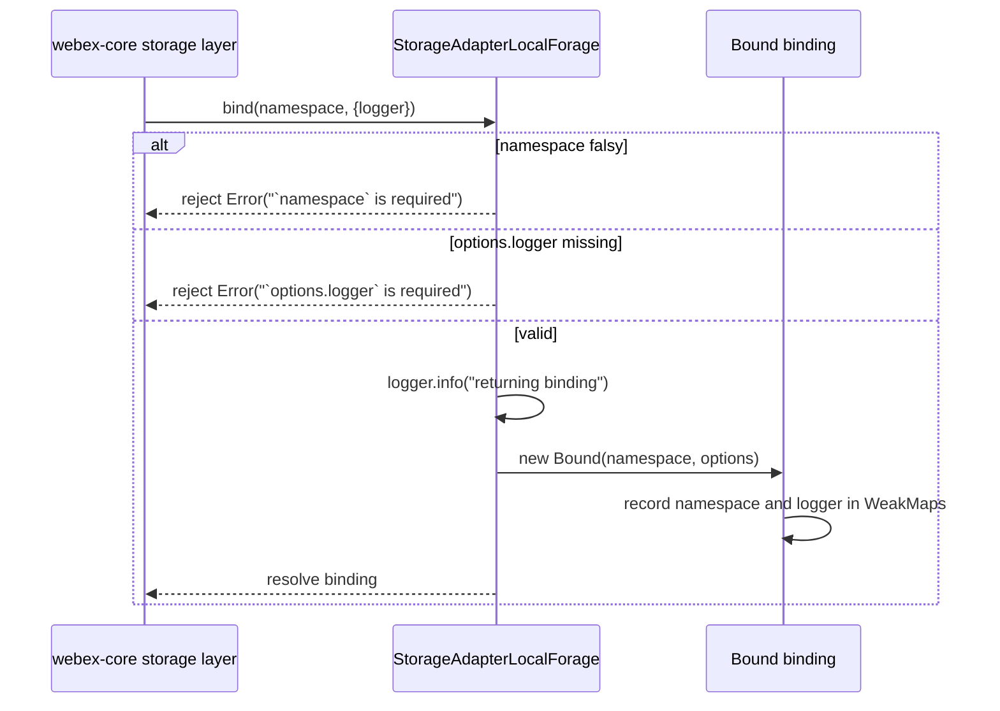
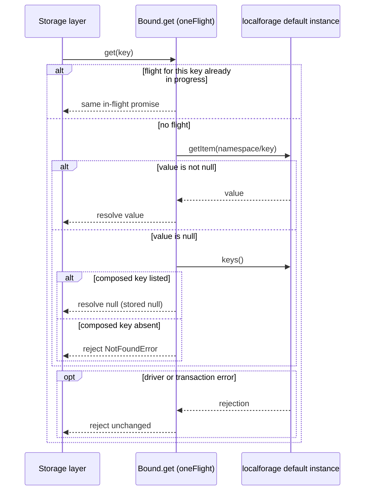
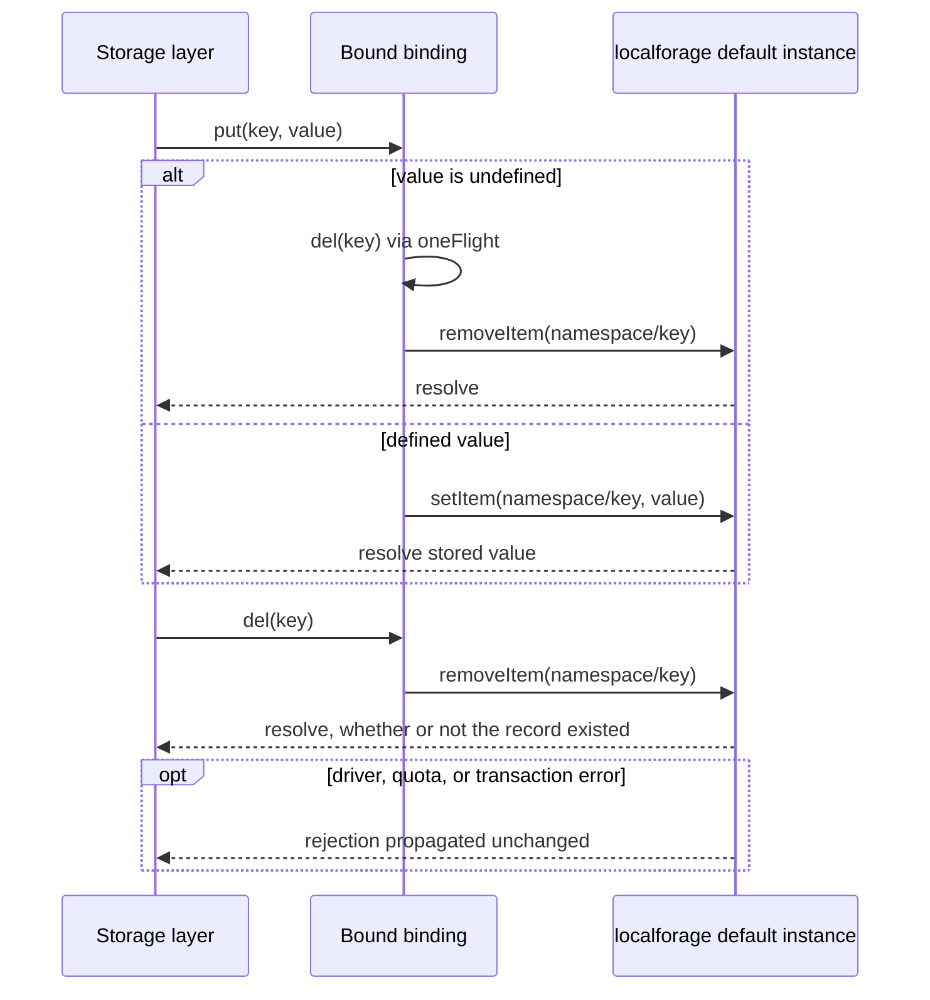
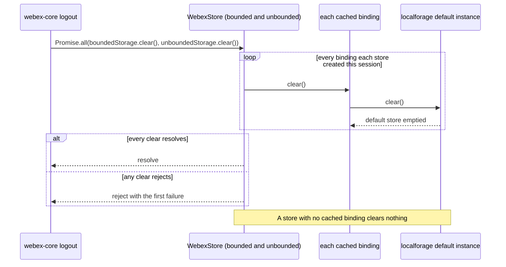
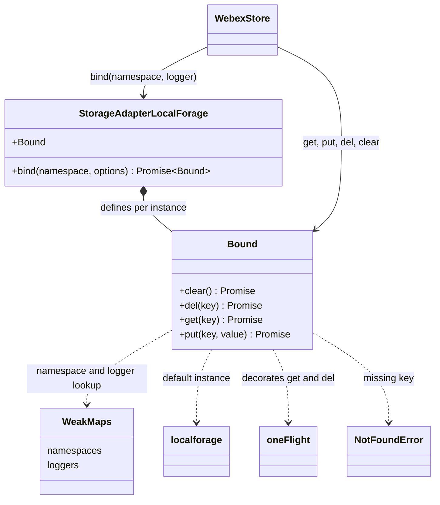

<!-- sdd-generated-metadata
doc_kind: module-spec
generated_from: module-spec@0.3.0
generated_by: claude-code
approved_by: rsarika@cisco.com
updated_at: 2026-10-06T12:05:00Z
validation_status: pass-with-warnings
-->

# storage-adapter-local-forage adapter

This source-local document at `src/docs/README.md` owns the stable specification for the
**`@webex/storage-adapter-local-forage` adapter**: the `StorageAdapterLocalForage` class that lets
the Webex JS SDK storage layer persist namespaced key-value data in the browser through the
`localforage` library (IndexedDB first, then WebSQL, then `localStorage`).

The whole module is one file, `src/index.js`. It has no sub-module and makes no network call.

Related context: [repository architecture](../../docs/architecture.md) ·
[documentation index](../../docs/index.md) · [agent instructions](../../AGENTS.md) ·
[specification registry](../../docs/specs/README.md)

## Metadata

| Field             | Value |
| ----------------- | ----- |
| Owner             | `@webex/web-client` (workspace CODEOWNERS entry for this package) |
| Source path       | `src/` |
| Resource kind     | Published npm package module (browser storage adapter) |
| Status            | Active |
| Last verified     | 2026-10-06 at `94dd92abed` |
| Module id         | `storage-adapter-local-forage` |
| Parent spec       | — |
| Doc kind          | Module spec |
| Coverage score    | 93% assessed 2026-10-06; 13 of 14 mandatory fields present, critical fields 7 of 7. Weak field: test and characterization coverage (no executing test, no characterization baseline) |
| Validation status | pass-with-warnings; validator `codex`, assessed 2026-10-06; 0 Blocking findings and 2 Important findings |

## Applicability

| Condition ID                         | Status     | Evidence or reason | Owned section                 |
| ------------------------------------ | ---------- | ------------------ | ----------------------------- |
| `module.has_tiers`                   | N/A        | No tier, SLO, or tiered review rule is declared in `package.json` or the package tree | Tier |
| `module.has_ui`                      | N/A        | `src/index.js` renders nothing; there are no components, templates, or styles | UI use-case flow |
| `module.crosses_service_boundaries`  | N/A        | `src/index.js` imports no HTTP, socket, or RPC client; IndexedDB is a local browser API | Cross-boundary use-case flow |
| `module.holds_client_state`          | Applicable | `src/index.js` keeps per-binding namespace and logger state for the life of each binding | Client state model |
| `module.enforces_domain_rules`       | Applicable | `src/index.js` enforces bind preconditions, the key composition rule, and the stored-null versus missing-key distinction | Business rules and invariants |
| `module.is_concurrent_async`         | Applicable | Every operation in `src/index.js` returns a promise, and get/del are de-duplicated with oneFlight | Concurrency and reactive flow |
| `module.owns_persistence`            | Applicable | `src/index.js` owns the record layout written into the default localforage database (owner-confirmed 2026-10-06) | Data, schema, and migration |
| `module.stateful_transitions`        | N/A        | `src/index.js` has no lifecycle states or transition guards | State machine |
| `module.exposes_wire_protocol`       | N/A        | `src/index.js` defines no protocol or serializer; the persisted layout is specified once under Data, schema, and migration discipline | Protocol and wire format |
| `module.ui_multi_screen`             | N/A        | Gated by module.has_ui, which is N/A | UI flow |
| `module.large_data_model`            | N/A        | `src/index.js` stores one flat key-value record per namespaced key | Data model |
| `module.returns_caller_errors`       | Applicable | `src/index.js` rejects with Error for invalid bind input and with NotFoundError for missing keys | Caller-visible failure modes |
| `module.module_specific_conventions` | Applicable | `src/index.js` and `.eslintrc.js` carry browser-only, logging, and decorator lint conventions | Module-specific rules |
| `module.published_package`           | Applicable | `package.json` declares main, devMain, and a deploy:npm script | Export stability |
| `module.embedded_in_host`            | Applicable | The adapter is plugged into the Webex SDK storage configuration and driven by its storage layer; `src/index.js` implements that host contract | Host integration and theming |
| `module.has_design_tradeoff`         | Applicable | `src/index.js` uses the shared default localforage instance and a key-scan for null disambiguation (owner-confirmed 2026-10-06) | Key design trade-off |
| `module.has_submodules`              | N/A        | No other manifest module path lies below src/ | Sub-modules |

## Evidence register

Rationale in this specification comes from code, tests, the canonical specifications of dependency
packages, and owner answers recorded on 2026-10-06. Commit history is not used as evidence.

| Evidence | What it establishes |
| -------- | ------------------- |
| `src/index.js` | Every behavior specified here: bind preconditions, key composition, null disambiguation, clear scope, `oneFlight` wrapping, and logging |
| `test/unit/spec/storage-adapter-local-forage.js` | The suite runs inside `skipInNode(describe)` against `new StorageAdapterLocalForage('test')` and declares no case of its own |
| `package.json` | Entry points, runtime dependencies (including `localforage ^1.7.3`), scripts, and the absence of `test:unit` and `test:integration` scripts |
| `README.md` | The npm-facing statement of purpose |
| `.eslintrc.js`, `babel.config.js`, `jest.config.js` | All three inherit shared legacy configuration: the decorator transform, the Node Jest environment, and lint rules that ignore Markdown |

Dependency facts were taken from the canonical specification of `@webex/common` (for `oneFlight`,
cross-checked against its code because that spec is rated Partial) and of
`@webex/storage-adapter-spec` (whose code is authoritative because that spec is rated Untracked).
`@webex/webex-core` has no specification, so its storage-layer code was read directly.
`localforage` behavior was read from version 1.10.0, the version the workspace lockfile resolves for
`^1.7.3`.

## Purpose and boundary

- Responsibility: implement the Webex storage-adapter interface on top of `localforage`, so that the
  SDK's storage layer can read, write, delete, and clear namespaced values that survive page reloads
  and browser restarts.
- In scope: validating `bind` arguments, composing stored keys, translating `localforage` results into
  the interface contract, de-duplicating concurrent reads and deletes, and debug logging through the
  injected logger.
- Out of scope: choosing which adapter a host uses (host SDK configuration), caching bindings per
  namespace and serializing plugin state (the `@webex/webex-core` storage layer), encryption or
  integrity protection of values (not done anywhere in this path), and driver selection, quota
  handling, and transactions (`localforage`).
- Consumers: the `@webex/webex-core` storage layer at runtime; `@webex/recipe-private-web-client`, the
  only in-repo host that selects this adapter (workspace path
  `packages/@webex/recipe-private-web-client/src/config.js`); and external npm hosts.

## Structure and key files

| Path | Responsibility |
| ---- | -------------- |
| `src/index.js` | The whole module: `StorageAdapterLocalForage`, its per-instance `Bound` class, and the module-level `namespaces` and `loggers` WeakMaps |
| `src/docs/README.md` | This canonical module specification |
| `test/unit/spec/storage-adapter-local-forage.js` | Test entry point |
| `package.json` | Package manifest |
| `.eslintrc.js` | Package lint root |
| `babel.config.js` | Babel entry |
| `jest.config.js` | Jest entry |
| `process` | One-line module exporting `{browser: true}`; nothing in this package or its build tooling references it |

## Public surface

Exact declarations live in `src/index.js`; the package entry points are declared in `package.json`.
The published contract ids are `local-forage-storage-adapter` (the npm surface) and
`local-forage-indexeddb-store` (the on-device record layout), both indexed in the
[architecture contract index](../../docs/architecture.md#public-and-consumer-surfaces).

| Surface | Consumer | Compatibility commitment | Source |
| ------- | -------- | ------------------------ | ------ |
| Default export `StorageAdapterLocalForage`, constructed with `new` | Host SDK configuration | Published; constructor arguments carry no meaning (`MOD-010`) | `src/index.js` |
| `bind(namespace, options)` returning `Promise<Bound>` | `@webex/webex-core` storage layer | Published; `MOD-001` to `MOD-003` | `src/index.js` |
| Binding methods `get(key)`, `put(key, value)`, `del(key)`, `clear()` | `@webex/webex-core` storage layer | Published; `MOD-004` to `MOD-012` | `src/index.js` |
| Record layout in the default `localforage` database | Later page loads and SDK releases on the same origin | Published; rule in [Data, schema, and migration discipline](#data-schema-and-migration-discipline) | `src/index.js` |

## Dependencies

| Dependency | Why it is required | Failure behavior |
| ---------- | ------------------ | ---------------- |
| `localforage` (npm `^1.7.3`, resolves to 1.10.0) | All persistence: `getItem`, `setItem`, `removeItem`, `keys`, and `clear` on the default instance | Its rejections propagate unchanged (`MOD-013` covers the no-driver case) |
| `@webex/common` `oneFlight` | De-duplicates concurrent `get` and `del` calls | See Concurrency and reactive flow |
| `@webex/webex-core` `NotFoundError` | The rejection type for a missing key | The storage layer treats any other rejection type as a real failure rather than "no data" |
| Injected `options.logger` | Info and debug logging | Required by `bind`; a logger without `debug` makes later calls throw synchronously |
| `@webex/storage-adapter-spec` | Shared conformance suite run by the package test | Test-only in practice (see Pitfalls and constraints) |
| Browser storage engine (IndexedDB, else WebSQL, else `localStorage`) | Backing store selected by `localforage` | Quota, private-mode, and transaction errors surface as `localforage` rejections; the adapter does not retry |

## Requirements

| ID | WHAT | WHY | Source evidence | Test or example evidence | Assumptions or gaps | Confidence |
| -- | ---- | --- | --------------- | ------------------------ | ------------------- | ---------- |
| `MOD-001` | `bind(namespace, options)` rejects with ``Error('`namespace` is required')`` when `namespace` is falsy; this check runs before the logger check | The storage-adapter interface requires every binding to be namespaced, and the shared suite matches this message | `src/index.js` | None executing | The suite's assertion never runs (see Verification) | Present |
| `MOD-002` | `bind` treats a missing `options` as `{}` and rejects with ``Error('`options.logger` is required')`` when no logger is supplied | Every operation logs through the injected logger | `src/index.js` | None executing | Same suite gap as `MOD-001` | Present |
| `MOD-003` | A valid `bind` logs `storage-adapter-local-forage: returning binding` at info and resolves a new `Bound` instance on every call; the adapter caches no binding | Binding caching belongs to the storage layer | `src/index.js` | None executing | Not covered by the shared suite | Present |
| `MOD-004` | Every `get`, `put`, and `del` addresses the record key `${namespace}/${key}` in the default `localforage` database | Isolates namespaces from each other and keeps data written by earlier releases reachable | `src/index.js` | None executing | The suite's different-namespace case is broken (see Verification) | Present |
| `MOD-005` | `put(key, value)` with `value === undefined` calls `del(key)`; otherwise it calls `setItem` and resolves with the value `localforage` returns | The interface defines writing `undefined` as a delete, matching the storage layer's own `put` | `src/index.js` | None executing | — | Present |
| `MOD-006` | `get(key)` resolves the stored value; when `getItem` yields `null` it calls `keys()` and resolves `null` only if the composed key exists, otherwise it rejects with `NotFoundError('No value found for ' + composedKey)` | `localforage` returns `null` for both a missing key and a stored `null`, and the interface must tell them apart | `src/index.js` | None executing | Relies on `localforage` returning `null` for absent records | Present |
| `MOD-007` | `get` and `del` are wrapped with `oneFlight` keyed by the key: concurrent calls with the same key on the same binding share one in-flight promise; `put` and `clear` are not wrapped | Avoids redundant storage transactions when several callers request the same key at once | `src/index.js` | None executing | Not covered by the shared suite | Present |
| `MOD-008` | `del(key)` calls `removeItem` for the composed key and resolves whether or not the record existed | Deletes are idempotent for callers such as `put(key, undefined)` | `src/index.js` | None executing | — | Present |
| `MOD-009` | `clear()` calls `localforage.clear()` on the default instance, which removes every record in the default `localforage` store: all namespaces, all adapter instances, and any other data written through the default instance | Current behavior; the storage layer's logout path relies on it to erase persisted SDK data. Owner decision 2026-10-06: specify as-is, treat as a known hazard to fix separately, and do not promise it as a contract | `src/index.js` | None executing | The suite only checks that the binding's own key is gone, so it cannot detect the scope | Present |
| `MOD-010` | The constructor takes no parameters and ignores any arguments; every instance reads and writes the same default database | Current behavior. Owner decision 2026-10-06: specify as-is, treat as a known hazard to fix separately, and do not promise it as a contract | `src/index.js` | None executing | Callers pass a base key (`'test'` in the package test, `'web-client-internal'` in the in-repo host) that has no effect | Present |
| `MOD-011` | `get`, `put`, and `del` log at debug with the composed key (``reading `key` ``, ``writing `key` ``, ``deleting `key` ``); `clear()` logs `clearing localforage` | Gives SDK diagnostics a uniform trace of storage activity | `src/index.js` | None executing | Key names, such as encryption key URIs, appear in debug logs | Present |
| `MOD-012` | Values pass to `localforage` unchanged: the adapter does no serialization, validation, encryption, or size check | Serialization belongs to the storage layer and the `localforage` driver; owner-confirmed 2026-10-06 that stored data is security-sensitive | `src/index.js` | None executing | — | Present |
| `MOD-013` | The adapter works only where `localforage` finds a storage driver; with none (Node, or storage disabled) every operation rejects with `localforage`'s `No available storage method found.` error | The module targets browsers only (see Module-specific rules) | `src/index.js` | None executing | The message comes from `localforage` 1.10.0 and has not been exercised here | Weak |

## Design overview

`StorageAdapterLocalForage` holds no data of its own. Its constructor only defines a `Bound` class on
the instance, and `bind` validates its arguments and returns `new this.Bound(namespace, options)`.
Each binding keeps its namespace and logger private in two module-level WeakMaps (`namespaces`,
`loggers`; see `INV-001`).

All persistence goes to the default `localforage` instance. The adapter never calls
`localforage.config` or `createInstance`, so the only separation between namespaces is the key prefix
(`MOD-004`). The benefits and costs of that choice, of the `keys()` scan behind `MOD-006`, and of
decorating only reads and deletes are recorded once, in [Key design trade-off](#key-design-trade-off).

The binding methods adapt `localforage` semantics to the storage-adapter interface (`MOD-005`,
`MOD-006`, `MOD-008`, `MOD-009`). `get` and `del` use the `oneFlight` method decorator, so the module
depends on the shared Babel configuration's decorator transform (`babel.config.js`).

## Data flow and sequence coverage

Call style: in-process promise-returning method calls from the host storage layer into the adapter.
The adapter then makes asynchronous `localforage` calls, which `localforage` turns into IndexedDB
(or fallback driver) transactions. There is no network transport.

| Operation group | Entry and outcome | Diagram or evidence | Failure and recovery coverage |
| --------------- | ----------------- | ------------------- | ----------------------------- |
| Binding | `bind(namespace, options)` resolves a new binding or rejects | Binding diagram below; `src/index.js` | Missing namespace, missing logger |
| Read | `get(key)` resolves a value or `null`, or rejects with `NotFoundError` | Read diagram below; `src/index.js` | Missing key, stored `null`, coalesced concurrent reads, driver rejection |
| Write and delete | `put(key, value)` and `del(key)` resolve after the record is written or removed | Write and delete diagram below; `src/index.js` | `undefined` value routed to delete, driver rejection |
| Clear | `clear()` resolves after the default store is emptied | Clear diagram below; `src/index.js` | Driver rejection; logout fan-out |

Binding:

Read:

Write and delete:

Clear (the logout path in `@webex/webex-core` calls both storages):

## Class and component relationships

`oneFlight` comes from `@webex/common`, `NotFoundError` and `WebexStore` from `@webex/webex-core`,
and `localforage` from npm.

## Use cases and flows

| Use case | Actor or caller | Primary steps and outcome | Failure or boundary behavior | Evidence |
| -------- | --------------- | ------------------------- | ---------------------------- | -------- |
| `UC-001` | Host application | Selects this adapter for a storage slot (contract in [Host integration and theming](#host-integration-and-theming)); the first storage access in each plugin namespace yields a binding | Two slots configured with this adapter share one database (`MOD-010`) | `src/index.js`, `package.json` |
| `UC-002` | SDK plugin through the storage layer | Looks up a persisted value on demand, for example the encryption plugin reading a cached key by URI; a hit resolves the stored string | A miss rejects with `NotFoundError`; the encryption plugin treats any rejection as a miss, then fetches from KMS and calls `put` | `src/index.js` |
| `UC-003` | SDK plugin through the storage layer | Writes a value with `put`; it persists across reloads under its composed key | `put(key, undefined)` deletes instead of writing; driver errors reject | `src/index.js` |
| `UC-004` | Webex logout | Both SDK storages clear every binding they cached; each binding's `clear()` empties the default store | Other data written through the default instance is also erased | `src/index.js` |
| `UC-005` | Several callers at once | Concurrent `get(key)` calls on one binding receive the same promise from one `getItem` | Coalescing cost is in Key design trade-off | `src/index.js` |

<!-- Include if: the module holds client-side state. [condition-id: module.holds_client_state] -->

## Client state model

| State or slice | Owner | Initial state | Transition triggers | Reset or persistence boundary |
| -------------- | ----- | ------------- | ------------------- | ----------------------------- |
| Binding namespace (`namespaces` WeakMap entry) | `src/index.js` module scope | Absent until a binding is constructed | Created by the `Bound` constructor during `bind` | Released when the binding is garbage-collected |
| Binding logger (`loggers` WeakMap entry) | `src/index.js` module scope | Absent until a binding is constructed | Created by the `Bound` constructor during `bind` | Released when the binding is garbage-collected |
| In-flight `get`/`del` promises | `@webex/common` `oneFlight` store | Empty | Added by the first call for a key; removed when that promise settles | In memory only; lost on page unload |

Persisted records are not client state of this module; they are specified under Data, schema, and
migration discipline.

<!-- Include if: the module enforces domain rules or entity invariants. [condition-id: module.enforces_domain_rules] -->

## Business rules and invariants

The enforced input and data rules are requirements, each specified once above: `bind` preconditions
(`MOD-001`, `MOD-002`), key composition (`MOD-004`), `put(undefined)` as delete (`MOD-005`), and the
missing-key versus stored-`null` distinction (`MOD-006`). One invariant has no requirement row:

| ID | Invariant | WHY | Enforcement source | Test evidence |
| -- | --------- | --- | ------------------ | ------------- |
| `INV-001` | A binding's namespace and logger never change after construction | Every later key and log line for that binding depends on them; the WeakMap entries are written only in the `Bound` constructor and no setter or public property exists | `src/index.js` | none found |

<!-- Include if: the module is concurrent, asynchronous, reactive, or event-driven. [condition-id: module.is_concurrent_async] -->

## Concurrency and reactive flow

- Execution model: single-threaded browser event loop. Every method returns a promise; `localforage`
  runs each operation as an asynchronous storage transaction after its `ready()` promise resolves.
- Ordering guarantees: none of the adapter's own. Concurrent `put` calls on one key are not
  serialized by the adapter; the last value stored follows `localforage` and IndexedDB transaction
  ordering. A `get` that finds `null` makes two separate calls (`getItem`, then `keys()`), so a
  concurrent `put` or `del` between them can change the outcome.
- Idempotency and retry: `del` is idempotent. The `oneFlight` entry for a `get` or `del` is evicted
  when its promise settles, on success and on failure, so the next call starts a fresh operation.
  The adapter never retries.
- Shared-state protection: no locks. `oneFlight` keys each flight by the binding instance, the
  decorated prototype, and the method name plus key, so bindings never share flights.
- Blocking restrictions: no synchronous storage access; all I/O goes through `localforage` promises.

<!-- Include if: the module owns persisted data and its migrations. [condition-id: module.owns_persistence] -->

## Data, schema, and migration discipline

| Store or schema | Owned entities or keys | Source of truth | Migration and compatibility rule |
| --------------- | ---------------------- | --------------- | -------------------------------- |
| `localforage` default database (name `localforage`, store `keyvaluepairs`; IndexedDB, else WebSQL, else `localStorage` with a `localforage/` key prefix) | One record per `${namespace}/${key}`, holding the value passed to `put` unchanged | `src/index.js` | No version field and no migration step. Changing the key composition, database name, or store name, or switching to a named `localforage` instance, orphans every record written by earlier releases, so any such change needs a data migration |

- Retention: unbounded. Records persist until `del`, `put(key, undefined)`, `clear()`, or the user
  clearing site data.
- Deletion: `clear()` scope is defined by `MOD-009`.
- Backfill and rollback: none; the adapter reads whatever the store holds.
- Sensitivity: values are stored unencrypted (`MOD-012`). In this monorepo the encryption plugin
  caches serialized KMS keys in unbounded storage, so when this adapter fills that slot, key material
  is at rest in the browser (owner-confirmed 2026-10-06; see the
  [security architecture](../../docs/architecture.md#security-architecture)).

<!-- Include if: the module returns or raises errors callers must handle. [condition-id: module.returns_caller_errors] -->

## Caller-visible failure modes

| Condition | Signal or result | Caller behavior | Retry or recovery | Evidence |
| --------- | ---------------- | --------------- | ----------------- | -------- |
| `bind` called without a namespace | Rejected promise: ``Error('`namespace` is required')`` | Fix the call | None; deterministic | `src/index.js` |
| `bind` called without `options.logger` | Rejected promise: ``Error('`options.logger` is required')`` | Fix the call | None; deterministic | `src/index.js` |
| `get` on a missing key | Rejected promise: `NotFoundError` with message `No value found for ${namespace}/${key}` | The storage layer treats it as "no data" and continues | Not an error to retry | `src/index.js` |
| No storage driver available (Node, storage disabled) | Rejection from `localforage`: `No available storage method found.` | Choose another adapter for that environment | None in the adapter | `src/index.js` |
| Quota exceeded, transaction abort, or private-mode restriction | `localforage` rejection, propagated unchanged | Handle as a storage failure | None in the adapter | `src/index.js` |
| Logger missing `debug` or `info`, or a method called detached from its binding | Synchronous `TypeError` rather than a rejection | Pass a full logger and call methods on the binding | None | `src/index.js` |

## Pitfalls and constraints

- **Logout repeats the whole-store wipe (`MOD-009`).** Logout clears both SDK storages, and each
  clears every binding it cached, so the same default store is emptied once per cached binding. When
  this adapter fills only the unbounded slot, those wipes still remove records that other bindings
  wrote.
- **Two slots on this adapter collide (`MOD-010`).** If a host assigns this adapter to both the
  bounded and the unbounded slot, each slot reads and clears the other's records. The constructor's
  JSDoc still documents a `basekey` parameter that does not exist.
- **Logout erasure depends on a binding existing.** A storage clears only bindings it has created in
  the current session, so persisted data survives logout when no namespace was accessed through it.
- **The test never exercises the adapter.** A green CI run says nothing about this module's behavior;
  see Verification.
- **Installing this package also installs the test suite.** `package.json` lists
  `@webex/storage-adapter-spec`, and with it its chai helper, under runtime `dependencies` although
  only the test imports it.
- **`localforage` is old.** The workspace's unmaintained-dependency catalog flags `^1.7.3` as stale
  (last npm publish 2021-08-18, high risk).

<!-- Include if: the module has conventions beyond repository-wide rules. [condition-id: module.module_specific_conventions] -->

## Module-specific rules

- Do: keep the module browser-only. `src/index.js` declares `/* eslint-env browser */`, and the
  package test is wrapped in `skipInNode`.
- Do: log through the binding's injected logger with the `storage-adapter-local-forage:` prefix and
  never through `console`.
- Do: build every stored key from `namespaces.get(this)` so all methods address the same record.
- Do: keep the `// eslint-disable-next-line require-jsdoc` comment directly above each
  `oneFlight`-decorated method; the code notes that decorators confuse the JSDoc rule.
- Do not: keep binding state anywhere but the module-level WeakMaps (`INV-001`).

<!-- Include if: the module is published or consumed as a package. [condition-id: module.published_package] -->

## Export stability

| Export or entry point | Consumer | Stability | Versioning and deprecation rule | Declaration or API report |
| --------------------- | -------- | --------- | ------------------------------- | ------------------------- |
| Default export `StorageAdapterLocalForage` | Host SDK configurations | Stable, published | Released with the workspace-wide version through `deploy:npm`; removing or renaming it is breaking | `package.json` |
| `bind` and the binding's `get`/`put`/`del`/`clear` | `@webex/webex-core` storage layer | Stable; shape fixed by the storage-adapter interface | Any change must keep the semantics in Requirements | `src/index.js` |
| Record layout | Data written by earlier releases | Stable | Governed by Data, schema, and migration discipline | `src/index.js` |
| `adapter.Bound` instance property | None known | Unsupported; incidental result of assigning the class in the constructor | May change without notice | `src/index.js` |
| Package entry points `main: dist/index.js`, `devMain: src/index.js` | npm consumers and workspace tooling | Stable | `dist/index.js` is produced by `build`; consumers must not import other paths | `package.json` |

<!-- Include if: the module is embedded in a host application. [condition-id: module.embedded_in_host] -->

## Host integration and theming

- Mount or entry contract: the host assigns an adapter instance to `storage.boundedAdapter` or
  `storage.unboundedAdapter` in its Webex SDK configuration. The storage layer then calls
  `bind(namespace, {logger: webex.logger})` once per namespace, caches the binding, and routes
  `get`/`put`/`del`/`clear` to it.
- Required providers, peers, or host versions: the `@webex/webex-core` storage layer (for the binding
  lifecycle and `NotFoundError`), and a browser in which `localforage` finds a storage driver.
- Theme and design-token contract: N/A; the module has no UI.
- Accessibility and lifecycle obligations: no accessibility surface. Bindings live as long as the
  storage layer that cached them; logout drives `clear()` as shown in the Clear diagram.

<!-- Include if: the module has a non-obvious design trade-off consumers or maintainers must preserve. [condition-id: module.has_design_tradeoff] -->

## Key design trade-off

| Chosen trade-off | Preserved invariant or benefit | Cost or limitation | Decision evidence |
| ---------------- | ------------------------------ | ------------------ | ----------------- |
| Use the default `localforage` instance instead of a configured or per-base-key instance | No configuration; every release and adapter instance on an origin reads the same records | No isolation beyond the key prefix, which is why `MOD-009` and `MOD-010` are hazards; collides with any other code using the default instance | `src/index.js` |
| Disambiguate `null` with a `keys()` scan | Exact `NotFoundError` semantics while falsy values round-trip | Every miss or stored `null` reads every key in the store, across all namespaces | `src/index.js` |
| `oneFlight` on `get` and `del` only | Duplicate concurrent reads and deletes share one transaction | A read that joins an in-flight `get` returns that read's result even if a `put` for the same key finished in between; writes are never coalesced | `src/index.js` |

## Verification

The package has no executing automated coverage:

- `package.json` defines no `test:unit` script; the owner confirmed on 2026-10-06 that no canonical
  unit-test command exists.
- Under the shared Jest configuration (Node environment) the test file's `skipInNode(describe)` skips
  the suite.
- `test:browser` runs Karma with the Mocha framework, while the shared suite calls the Jest-only
  `beforeAll` hook. This is derived from code and was not measured, because the generation worktree
  had no installed dependencies.

This module has no characterization baseline. One is required before any risky modification. Every
"none executing" entry below names a shared-suite case that exists but does not run.

| Requirement or invariant | Test level | Positive evidence | Negative or boundary evidence | Gap |
| ------------------------ | ---------- | ----------------- | ----------------------------- | --- |
| `MOD-001`, `MOD-002` | Contract (shared suite) | none executing | none executing | Suite cases "requires a namespace" and "requires a logger option" do not run |
| `MOD-003` | None | none found | none found | No case asserts a fresh binding per `bind` or the info log |
| `MOD-004` | Contract (shared suite) | none executing | none found | "puts same key in different namespaces" does not run and is broken: its inner promise is not returned, so its assertions cannot fail the test; nothing asserts the literal key format |
| `MOD-005` | Contract (shared suite) | none executing | none executing | `put(key, undefined)` cases under del and clear do not run |
| `MOD-006` | Contract (shared suite) | none executing | none executing | Falsy round-trip cases and "rejects if the key cannot be found" do not run |
| `MOD-007` | None | none found | none found | Nothing asserts read or delete coalescing |
| `MOD-008` | Contract (shared suite) | none executing | none executing | Delete cases, including the absent-key `del` in "removes an item from the store when putting `undefined`", do not run |
| `MOD-009` | Contract (shared suite) | none executing | none found | Clear cases do not run and assert only the binding's own key, not the store-wide scope |
| `MOD-010` | None | none found | none found | No case asserts that the constructor argument is ignored |
| `MOD-011` | None | none found | none found | The suite passes a no-op logger and asserts nothing about logging |
| `MOD-012`, `MOD-013`, `INV-001` | None | none found | none found | No case covers value pass-through, the no-driver rejection, or binding immutability |

Record coverage gaps explicitly and link follow-up work. A module specification is complete only when
its public surface, invariants, failure modes, and test evidence agree with the implementation.
