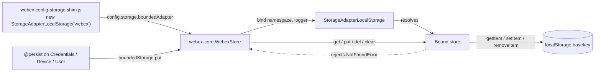

<!-- sdd-generated-metadata
doc_kind: standing-doc
generated_from: architecture@0.3.0
generated_by: claude-code
approved_by: rsarika@cisco.com
updated_at: 2026-10-04T00:00:00Z
validation_status: not-run
-->

# @webex/storage-adapter-local-storage architecture

Canonical repository-wide architecture for this package. This document owns facts that span the
package as a whole. Link to the owning module, ADR, or native contract instead of duplicating
owner-local detail.

Related context: [specification registry](specs/README.md) ·
[repository agent instructions](../AGENTS.md)

## Applicability

Sections preceded by an `Include if` comment are conditional. Retain a conditional section only when
repository evidence satisfies its condition. Record `Unresolved` while the evidence or developer
answer is still missing; do not infer an answer from the repository type alone.

| Condition ID                         | Status     | Evidence or reason | Owned section                       |
| ------------------------------------ | ---------- | ------------------ | ----------------------------------- |
| `repo.owns_datastore` | Applicable | src/index.js — owns the localStorage[basekey] JSON document | Repository data and schema |
| `repo.holds_client_state` | N/A | No state-management library; only WeakMap binding metadata at src/index.js | Client state model |
| `repo.components_interact`           | N/A        | One component in scope; no inter-module calls or events | Dependency and interaction topology |
| `repo.domain_data_across_components` | N/A        | A single resource; no cross-component entities | Object and data ownership |
| `repo.caches_data`                   | N/A        | No cache backend, TTL, or invalidation logic | Caching catalog |
| `repo.observability_convention` | Applicable | Injected-logger calls at src/index.js | Observability patterns |
| `repo.deploys_to_infra`              | N/A        | No Dockerfile, Kubernetes manifest, or IaC; delivery is an npm package | Runtime and infrastructure |
| `repo.shared_base_libs`              | Applicable | `package.json` — webex-core plus the shared legacy babel/eslint/jest configs | Shared and base libraries |
| `repo.is_monorepo` | Applicable | Root `package.json` workspaces includes ./packages/@webex/*; all commands are yarn workspace-scoped | Package map and dependencies |
| `repo.multi_platform` | N/A | A single platform target: browser only (src/index.js), with Node explicitly excluded | Platform matrix |
| `repo.published_package` | Applicable | `package.json` deploy:npm, main, license: MIT | Release and versioning |
| `repo.embedded_in_host` | Applicable | Injected as config.storage.boundedAdapter and driven by webex-core | Host integration and theming |
| `repo.exposes_commands_or_artifacts` | Applicable | build:src emits `dist/index.js` and `dist/index.js.map` | Commands and generated artifacts |
| `repo.cross_repo_deps_material`      | N/A        | All dependencies are workspace-internal or the browser platform API | Cross-repository topology |
| `repo.security_arch_warranted`       | Applicable | Persists OAuth tokens in plaintext localStorage — see Security architecture | Security architecture |

## Design overview

This package is one of four interchangeable storage adapters in the Webex JS SDK monorepo. Its
entire purpose is to let webex-core's bounded storage layer persist to the browser `localStorage`
API while presenting the same asynchronous interface every other adapter presents.

The architectural shape is deliberately thin: a single source file, no internal layering, and no
state of its own beyond per-binding metadata. All structure that matters lives at the seams —
how the host selects this adapter, and how the adapter maps the host's namespace model onto one
`localStorage` entry.

Adapter selection happens entirely outside this package. `@webex/webex` declares a `browser` field
that substitutes `config-storage.shim.js` for `config-storage.js`, and only the shim instantiates
this adapter (`../../../webex/src/config-storage.shim.js` line 9). A Node bundle of the same SDK keeps
`MemoryStoreAdapter`. That substitution is why a package with no runtime feature detection can
safely assume a browser global.

The one consequential internal decision is that every namespace shares a single `localStorage`
entry named by the constructor `basekey`. It makes a full purge trivial and needs no key-prefixing
convention, at the cost of whole-document reads and rewrites on `get`/`put`/`del`, a `clear()`
whose blast radius exceeds the binding that calls it, and an isolation guarantee that is weaker than
it looks. A rewrite round-trips sibling namespaces through `JSON.parse`/`JSON.stringify`; namespace
and key lookup do not check own properties, so `Object.prototype` names are not usable; and the
document shape is never validated, so valid JSON written by another script on the origin in a
different shape is processed rather than rejected — which can fabricate a read or let a write resolve
without storing anything. The isolation and not-found guarantees therefore hold for a
schema-conforming document and ordinary key names, not unconditionally.
Detail lives in the [module specification](../src/docs/README.md).

Three adapter behaviors differ from the default `MemoryStoreAdapter` in ways consumers must know
about: `clear()` scope, synchronous failure on a missing global, and JSON-only value fidelity. All
three are specified in the module document.

## Resource inventory and responsibilities

| Resource | Kind | Responsibility | Owner | Source | Detailed specification |
| -------- | ---- | -------------- | ----- | ------ | ---------------------- |
| `@webex/storage-adapter-local-storage` | package | Published npm library wrapping the browser `localStorage` API as a webex-core storage adapter | `@webex/web-client`, per `.github/CODEOWNERS` | `package.json` | `../src/docs/README.md` |
| `src` | module | The adapter implementation: constructor, `bind`, and the bound store (`get`, `put`, `del`, `clear`) | `@webex/web-client` | `src/index.js` | `../src/docs/README.md` |

## Interaction and execution flows

The representative flow is host-driven: configuration supplies an adapter instance, webex-core binds
one namespace per plugin, and persisted state flows through the bound store into a single browser
storage entry.



| From       | To         | Interaction or transport | Purpose  | Failure or compatibility behavior |
| ---------- | ---------- | ------------------------ | -------- | --------------------------------- |
| `@webex/webex` (browser build) | this package | Import + construction, selected by the `browser` field substitution | Supply the browser `boundedAdapter` | Node builds never load it and keep `MemoryStoreAdapter` |
| `@webex/recipe-private-web-client` | this package | Import + construction with basekey `web-client-internal` | Supply a separate bounded store for the private web client | Pairs it with the local-forage adapter for unbounded storage |
| webex-core `WebexStore` | this package | In-process call `adapter.bind(namespace, {logger})` | Obtain a namespace-scoped store, cached per namespace behind `@oneFlight` | Rejects on a falsy namespace or missing logger |
| webex-core `WebexStore` | bound store | In-process `get`/`put`/`del`/`clear` | Read and write persisted plugin state | `get` rejects `NotFoundError` when absent; `clear()` removes the whole entry, not just the namespace |
| `@persist` decorators | webex-core `WebexStore` | `boundedStorage.put` on change (debounced) | Persist Credentials, Device, and User state | A rejected write propagates to the decorator's promise chain |
| bound store | `localStorage` | Synchronous same-origin browser API | Durable storage | Missing global: `get`/`put`/`del` reject, `clear()` throws synchronously; quota exhaustion is unhandled |

## Dependency topology

| Dependency | Type | Used by | Purpose | Version, failure, or fallback policy |
| ---------- | ---- | ------- | ------- | ------------------------------------ |
| `@webex/webex-core` | Internal (workspace) | `src/index.js` line 7 | Supplies `NotFoundError`, the rejection type callers branch on | `workspace:*`; a type change here is a breaking change for consumers' `catch` branches |
| `@webex/storage-adapter-spec` | Internal (workspace, contract/test) | `test/unit/spec/storage-adapter-local-storage.js` line 5 | Declares the shared abstract adapter contract | `workspace:*`; currently non-executing in this package — see the module spec's Verification section |
| `@webex/test-helper-mocha` | Internal (workspace) | `test/unit/spec/storage-adapter-local-storage.js` | Provides `skipInNode`, which disables the only test suite under Node | `workspace:*` |
| Browser `localStorage` | External (platform) | `src/index.js` lines 41, 66 and 77 | The backing store | No feature detection and no fallback; absence is a hard failure |
| `@webex/babel-config-legacy`, `@webex/eslint-config-legacy`, `@webex/jest-config-legacy` | Internal (workspace, build) | `babel.config.js`, `.eslintrc.js`, `jest.config.js` | Shared build, lint, and test configuration | `workspace:*`; the jest config's `testEnvironment: 'node'` is what forces the Node test skip |

There are no dependency cycles. The single ordering constraint is that `@webex/webex-core` must
build before this package, since `NotFoundError` is imported from it. The package is a leaf: nothing
in the workspace imports it except the consumers listed above, all of which treat it as
configuration rather than as a library to extend.

## Public and consumer surfaces

Exact API, event, command, package, file, or schema definitions remain in their native source and
owner specification. This table is the package's contract index; `.sdd/manifest.json` is
authoritative for publication state and canonical source.

| Surface | Type | Owner | Consumers | Compatibility policy | Source |
| ------- | ---- | ----- | --------- | -------------------- | ------ |
| `storage-adapter-local-storage-sdk` | SDK | `src` | `@webex/webex` (browser), `@webex/recipe-private-web-client`, authorization-browser automation fixtures | Published npm surface. The constructor signature and the `bind`/`get`/`put`/`del`/`clear` shape are breaking-change boundaries. No `.d.ts` or API report ships, so `package.json` is the only machine-readable declaration. | `package.json` |
| `local-storage-bounded-document` | File | `src` | Any future release of this package reading data written by an earlier one | Internal. The at-rest JSON document `{ "<namespace>": { "<key>": <value> } }` persists across releases but carries no version field and no migration step. | `src/index.js` |
| `webex-core-store-adapter-interface` | SDK | `@webex/webex-core` (external to this SDD root) | consumed by `src` | Internal. The `bind(namespace, {logger})` plus `get`/`put`/`del`/`clear` shape webex-core calls. This package implements it; it does not own it. | packages/@webex/webex-core/src/lib/storage/make-webex-store.js |

## Repository data and schema

| Datastore or schema | Owning resource | Source of truth | Migration and compatibility rule |
| ------------------- | --------------- | --------------- | -------------------------------- |
| `localStorage[basekey]` JSON document | `src` | src/index.js | No version field, no migration step, no schema validation. Whether a newer release must stay able to read an older document is an unresolved owner decision, not a rule this document sets; if the encoding changes without one, the effect would be missing or malformed values at read time rather than a detected upgrade. Entities and retention detail live in the [module specification](../src/docs/README.md). |

In the browser `webex` bundle the basekey is `webex` and the document holds the `@persist`ed
Credentials (including `supertoken`), Device, and User records. `@webex/recipe-private-web-client`
uses the separate basekey `web-client-internal`.

## Cross-cutting architecture

### Security

- Trust boundaries and identity flow: the package sits entirely inside the browser origin's trust
  boundary. It performs no authentication, authorization, or identity checks of its own; it stores
  whatever the host hands it under the configured basekey.
- Sensitive surfaces and data classes: OAuth access and refresh tokens. `@persist` writes
  `Credentials` — including `supertoken` — through `boundedStorage.put`
  (`../../../webex-core/src/lib/storage/decorators.js` lines 53 and 57;
  `../../../webex-core/src/lib/credentials/credentials.js` line 465), and in a browser bundle the
  bounded adapter is this package (`../../../../webex/src/config-storage.shim.js` line 9). Device and
  User records persist by the same route.
- Encryption and secret boundaries: **none**. Values are stored as plaintext JSON, readable by any
  script executing on the origin. The package implements no encryption, no integrity check, and no
  expiry, so persisted tokens are exposed to any successful XSS. Mitigating that is a host and
  application concern; it cannot be addressed inside this adapter without changing the stored
  document contract.

### Observability and operations

- Logging and correlation: every operation logs through the logger injected at `bind` time, never
  through a module-level logger. Messages are prefixed `local-storage-store-adapter:`
  (`src/index.js` lines 75, 87, 103, 123 and 150). There is no correlation id; the host logger supplies context.
- Metrics, traces, and audit signals: none. The package emits no metrics and no traces, and records
  no audit trail of reads or writes.
- Ownership and operational entry points: owned by `@webex/web-client`, assigned in `.github/CODEOWNERS`.
  There is no dashboard, alert, or runbook; the package has no runtime of its own to operate.

### Quality attributes

Expectations that fit a published browser SDK package:

- Footprint: one source file compiling to a single `dist/index.js` plus source map
  (`build:src`, measured 2026-10-01).
- Compatibility: the published constructor and bound-store shape are stable surfaces; the at-rest
  document currently carries no version field and no migration step; whether cross-release
  readability is a committed promise is an open owner decision (see the module specification).
- Main-thread cost: `get` parses the entire document and `put`/`del` additionally re-serialize and
  rewrite all of it, so their cost scales with total stored size across all namespaces rather than
  with the value being written. `bind` and `clear` are exempt — `bind` touches no storage and
  `clear` only calls `removeItem`.
- Verification: **currently unmet.** No automated test executes this package in either route — the
  Node route skips all 21 declared cases and the browser route completes 0 tests while exiting 0.
  See the module specification's Verification section.

## Observability patterns

| Signal  | Convention or required fields | Propagation or naming rule | Primary evidence |
| ------- | ----------------------------- | -------------------------- | ---------------- |
| Logs | Injected logger only; messages prefixed `local-storage-store-adapter:`. `get` and `put` log at `debug`, `del` and `clear` at `info`, `bind` at `debug`. Keys appear in messages; values never do. | Logger is captured per binding at `bind` time and held in a module-level `WeakMap`; no module-level or global logger exists | src/index.js |
| Metrics | None emitted | — | — |
| Traces  | None emitted | — | — |
| Audit   | None recorded | — | — |

The `info`-versus-`debug` split between `del`/`clear` and `get`/`put` is inconsistent and has no
stated reason; it is recorded in the module spec as `MOD-014` rather than rationalized here.

## Shared and base libraries

| Library | Inherited responsibility | Consumers | Version floor | Compatibility rule |
| ------- | ------------------------ | --------- | ------------- | ------------------ |
| `@webex/webex-core` | Error taxonomy (`NotFoundError extends StorageError extends Exception`) and the storage-layer contract this package implements | `src` | `workspace:*` | Changing the error type or the adapter interface breaks this package and every other adapter |
| `@webex/babel-config-legacy` | Transpilation settings for `build:src` | `babel.config.js` | `workspace:*` | Shared across legacy packages; not overridden here |
| `@webex/eslint-config-legacy` | Lint rules | `.eslintrc.js` (declared `root: true`) | `workspace:*` | Package-local root; `src/index.js` line 5 adds the browser env |
| `@webex/jest-config-legacy` | Unit-test runner configuration | `jest.config.js` | `workspace:*` | Imposes `testEnvironment: 'node'`, which is the direct cause of the skipped unit route |
| `@webex/legacy-tools` | `webex-legacy-tools` build and test runner binary | `package.json` scripts | `workspace:*` | Supplies both the `build:src` and the karma `test:browser` routes |

## Package map and inter-package dependencies

| Package   | Visibility | Responsibility | Depends on | Consumers |
| --------- | ---------- | -------------- | ---------- | --------- |
| `@webex/storage-adapter-local-storage` | Public (npm) | Browser localStorage bounded storage adapter | `@webex/webex-core`, `@webex/storage-adapter-spec`, `@webex/test-helper-mocha` | `@webex/webex`, `@webex/webex-node` (declared only), `@webex/recipe-private-web-client`, `@webex/plugin-authorization-browser`, `@webex/plugin-authorization-browser-first-party` |

This package is a workspace member under the root `workspaces` glob `./packages/@webex/*`, so every
command is `yarn workspace`-scoped. Three sibling adapters implement the same contract against
different backends: `@webex/storage-adapter-session-storage`, `@webex/storage-adapter-local-forage`,
and the in-core `MemoryStoreAdapter`. They are interchangeable by configuration and are **not**
behaviorally identical — notably in `clear()` scope — so swapping one for another is a behavioral
change, not a drop-in substitution.

Dependency direction is one-way: this package imports from `@webex/webex-core` and nothing in the
workspace imports it except as configuration. `@webex/webex-node` declares it as a dependency but
its sources never import it; the Node build resolves `MemoryStoreAdapter` through
`webex-node/src/config-storage.js` instead. Versions are synchronized by the monorepo's automated
release pipeline; all internal ranges are `workspace:*`.

## Release and versioning

| Artifact | Publish target | Versioning rule | Deprecation window | Changelog or migration obligation |
| -------- | -------------- | --------------- | ------------------ | --------------------------------- |
| `@webex/storage-adapter-local-storage` | npm (`deploy:npm` → `yarn npm publish`) | Versioned and released by the monorepo's automated release pipeline, not hand-maintained in this package | Not defined at package level | No package-local `CHANGELOG.md`; release notes are produced repository-wide. A change to the constructor signature, the bound-store method set, or the at-rest document layout is a breaking change for the consumers listed above. |
| `dist/index.js`, `dist/index.js.map` | Build output bundled into the npm artifact | Regenerated by `build:src` on every release | — | Not version-controlled — the repository-root `.gitignore` ignores `dist` |

## Host integration and theming

| Host or integration | Mount or entry contract | Required providers or peers | Theming and accessibility constraints |
| ------------------- | ----------------------- | --------------------------- | ------------------------------------- |
| `@webex/webex` browser bundle | `config.storage.boundedAdapter = new StorageAdapterLocalStorage('webex')`, reached only through the `browser` field substitution of `config-storage.shim.js` | A browser context with `localStorage`; a host logger exposing `debug` and `info`; workspace `@webex/webex-core` | Not applicable — the package renders nothing |
| `@webex/recipe-private-web-client` | `storage.boundedAdapter = new StorageAdapterLocalStorage('web-client-internal')`, paired with the local-forage adapter for unbounded storage | Same as above | Not applicable |
| Authorization-browser automation fixtures | `config.storage.boundedAdapter = new StorageAdapterLocalStorage('webex')` inside the test harness page | A real browser driven by the automation runner | Not applicable |

The host owns binding lifetime and decides when `clear()` runs. This package registers no listeners
and exposes no teardown hook, so nothing requires disposal.

## Commands and generated artifacts

| Command or artifact | Owner | Inputs | Output or side effect | Compatibility boundary |
| ------------------- | ----- | ------ | --------------------- | ---------------------- |
| `yarn workspace @webex/storage-adapter-local-storage build:src` | `@webex/web-client` | `src/**` | `dist/index.js` + `dist/index.js.map`. Measured 2026-10-01: exit 0, 1 file emitted. | `dist/index.js` is the published `main`; its shape is the consumer contract |
| `... test:style` | `@webex/web-client` | `src/**`, `.eslintrc.js` | Lint report. Measured 2026-10-04: exit 0, 0 errors, 1 warning. The warning is `src/docs/README.md` — the lint glob `./src/**/*.*` matches the canonical module spec, which ESLint then reports as ignored. | — |
| `... test:unit` | `@webex/web-client` | `test/unit/**` | Jest run. Measured 2026-10-01: exit 0, **21 skipped, 0 executed**. | Reports success while verifying nothing |
| `... test:browser` | `@webex/web-client` | `test/unit/**` | Karma run. Measured 2026-10-01: exit 0, **0 tests completed**, `beforeAll is not defined` in both browsers. | Reports success while verifying nothing |
| `... test` | `@webex/web-client` | all of the above | Measured 2026-10-01: **exit 1** — `Couldn't find a script named "test:integration"`. | Known broken aggregate |
| `... deploy:npm` | release pipeline | `dist/**`, `package.json` | Publishes the package to npm | Publishing boundary |

## Security architecture

The package has no authentication or authorization logic of its own, but it is the persistence
mechanism for the SDK's most sensitive browser-side data, which makes its boundary worth stating
explicitly.

Everything lives inside a single trust boundary: the browser origin. There is no privilege
separation between the data this adapter stores and any other script running on that origin.
`localStorage` is not partitioned by path, is readable synchronously by any same-origin script, and
is not cleared when a session cookie expires.

```mermaid
flowchart LR
  User[End user] -->|OAuth login| Creds["webex-core Credentials<br/>supertoken: access + refresh"]
  Creds -->|@persist -> boundedStorage.put| Store[WebexStore bounded]
  Store --> Adapter[storage-adapter-local-storage]
  Adapter -->|plaintext JSON| LS[(localStorage 'webex')]
  XSS[Any same-origin script] -.->|reads freely - no encryption| LS
```

Architectural controls and their absence:

- Encryption at rest: none. Tokens are stored exactly as the host serializes them.
- Integrity: none. Nothing detects tampering with the stored document; a modified entry is parsed
  and trusted.
- Expiry: none. Entries persist until `del`, `clear`, or the user clears site data. Token lifetime
  is enforced by the host's credential logic, not by the store.
- Purge on logout: `clear()` removes the entire `basekey` entry, which does remove persisted
  credentials. That purge is the one security-relevant behavior the adapter implements, and the
  reason its blast radius exceeds a single namespace is recorded as `[NEEDS HUMAN INPUT]` in the
  module spec (`MOD-010`).
- Node safety: the adapter is unreachable in Node builds, so server-side token persistence through
  this path is not possible.
- Prototype pollution (CWE-1321): binding the namespace `__proto__` and calling `put` installs the
  key as an own property of the stored document root's prototype, which is then observable on the
  values that inherit from it — universally for `Object.prototype`, but only on arrays when
  `Array.prototype` is the target. The target follows the stored data rather than being fixed — `Object.prototype`
  for an absent or object root, `Array.prototype` for an array root, and the matching wrapper
  prototype for a primitive root; a `null` root rejects instead. The key `__proto__` is a second and
  worse variant: it re-parents the target prototype rather than adding a property, which succeeds for
  every built-in prototype except the immutable `Object.prototype` — splicing a caller-supplied
  object into a built-in type's chain, or severing it. `clear()` does not undo either variant. The module applies no own-property guard. No exploit path
  exists in this repository as configured, because `webex-core` passes fixed plugin names, but that
  is a property of the callers rather than of the adapter. Tracked as a code defect in the module
  specification (`MOD-016`), not as accepted behavior.

Applications that cannot accept plaintext token persistence should configure a different bounded
adapter rather than modifying this one, since changing the stored representation would break the
at-rest document contract for existing users.

## Domain language

| Term   | Repository-specific meaning | Authoritative source      |
| ------ | --------------------------- | ------------------------- |
| basekey | The single `localStorage` key under which one adapter instance stores every namespace. Fixed at construction and captured in a closure. | src/index.js |
| namespace | The host's isolation unit within the document, one per webex plugin. Selects a slice of the stored object. | src/index.js |
| binding (`Bound`) | A namespace-scoped store returned by `bind()`. Holds no data itself; its namespace and logger live in module-level `WeakMap`s. | src/index.js |
| bounded adapter | The webex-core storage role this package fills — durable, size-limited storage, as opposed to the unbounded adapter. Selected via `config.storage.boundedAdapter`. | ../../../webex-core/src/lib/storage/make-webex-store.js |
| abstract adapter spec | The shared contract suite in `@webex/storage-adapter-spec` that every adapter is expected to satisfy. | ../../../storage-adapter-spec/src/index.js |

## References and maintenance

- Decisions: no ADRs exist for this package yet.
- Instantiated specifications and routing: [specs/README.md](specs/README.md)
- Module specification: [`src/docs/README.md`](../src/docs/README.md)
- Package reference documentation: `README.md` at the package root is registered as reference-only
  and is **not** authoritative. It describes `clear()` as namespace-scoped, which the code
  contradicts.
- Update this document in the same change that alters package boundaries, the adapter's published
  surface, the at-rest document layout, or how a host selects this adapter.
