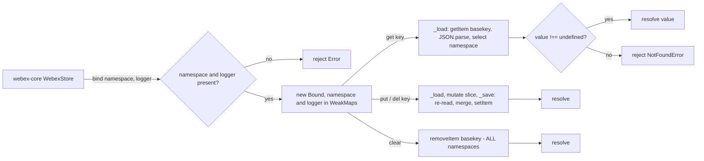
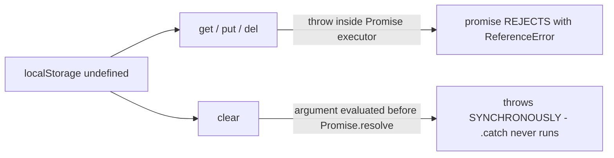
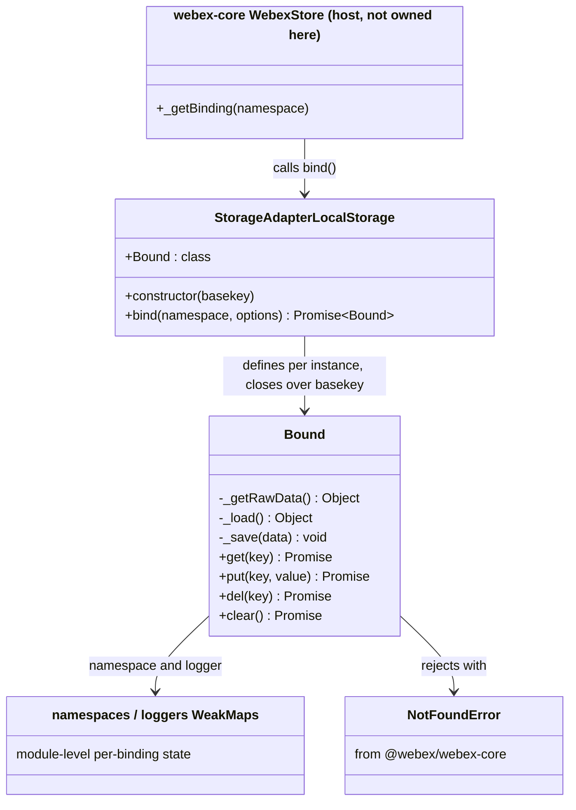

<!-- sdd-generated-metadata
doc_kind: module-spec
generated_from: module-spec@0.3.0
generated_by: claude-code
approved_by: rsarika@cisco.com
updated_at: 2026-10-03T20:17:51Z
validation_status: not-run
-->

# storage-adapter-local-storage `src`

This source-local document at `src/docs/README.md` owns the stable specification for the
**localStorage bounded storage adapter**. Ground every claim in repository evidence and link to the
[repository architecture](../../docs/architecture.md) instead of repeating broader facts.

Related context: [documentation index](../../docs/index.md) ·
[documentation agent instructions](../../AGENTS.md)

## Metadata

| Field         | Value                                                        |
| ------------- | ------------------------------------------------------------ |
| Owner         | `@webex/web-client` (`.github/CODEOWNERS:28`)                |
| Source path   | `src`                                                        |
| Resource kind | package (published npm library)                              |
| Status        | Active                                                       |
| Last verified | 2026-10-03 at `c622eb6612`                                   |
| Module id     | `src`                                                        |
| Parent spec   | —                                                            |
| Doc kind      | Module spec                                                  |
| Coverage score | 95% (21/22 mandatory fields) assessed 2026-10-03            |
| Validation status | not-run                                                  |

## Applicability

Sections preceded by an `Include if` comment are conditional. Retain a conditional section only when
source evidence or a confirmed developer answer satisfies its condition. Record `Unresolved` instead
of guessing.

| Condition ID                         | Status     | Evidence or reason | Owned section                 |
| ------------------------------------ | ---------- | ------------------ | ----------------------------- |
| `module.has_tiers` | N/A | No tier annotation or per-module SLO config; .github/CODEOWNERS:28 assigns an owner but no tier | Tier |
| `module.has_ui` | N/A | No components, templates, or stylesheets in src/ | UI use-case flow |
| `module.crosses_service_boundaries` | N/A | No HTTP, RPC, or queue client; the only external call target is the same-origin localStorage API | Cross-boundary use-case flow |
| `module.holds_client_state` | N/A | src/index.js holds only WeakMap binding metadata, not application state | Client state model |
| `module.enforces_domain_rules` | Applicable | src/index.js, src/index.js | Business rules and invariants |
| `module.is_concurrent_async` | Applicable | Every public method is Promise-returning on its normal path, with clear and bind able to throw synchronously instead (see MOD-015); read-modify-write at src/index.js | Concurrency and reactive flow |
| `module.owns_persistence` | Applicable | Owns the localStorage[basekey] document layout — src/index.js | Data, schema, and migration |
| `module.stateful_transitions`        | N/A        | No lifecycle enum, status field, or transition guard | State machine |
| `module.exposes_wire_protocol`       | N/A        | Owner decision: the at-rest JSON encoding is documented under persistence to avoid two overlapping sections for one document shape | Protocol and wire format |
| `module.ui_multi_screen` | N/A | Gated on module.has_ui, which is N/A | UI flow |
| `module.large_data_model`            | N/A        | One document shape; no entity relationships | Data model |
| `module.returns_caller_errors` | Applicable | src/index.js, src/index.js, src/index.js | Caller-visible failure modes |
| `module.module_specific_conventions` | Applicable | Package-local `.eslintrc.js`, /* eslint-env browser */ at src/index.js, the `process` shim | Module-specific rules |
| `module.published_package` | Applicable | `package.json` main, devMain, deploy:npm | Export stability |
| `module.embedded_in_host` | Applicable | Injected as config.storage.boundedAdapter and driven by webex-core | Host integration and theming |
| `module.has_design_tradeoff` | Applicable | Synchronous storage behind a Promise API; whole-document read-modify-write; basekey-scoped clear() | Key design trade-off |
| `module.has_submodules` | N/A | Computed by scripts/module_tree.py: no manifest module path is a child of src | Sub-modules |

## Evidence register

List the code, tests, schemas, configuration, and prior decisions used to verify this specification.
Mark unresolved statements as `[NEEDS HUMAN INPUT]`; do not infer missing behavior.

| Evidence         | What it establishes |
| ---------------- | ------------------- |
| `src/index.js` | The entire implementation: constructor, `bind`, and the `Bound` class with `get`, `put`, `del`, `clear` and the private `_getRawData`, `_load`, `_save`. |
| `package.json` | Published package identity, entry points (`main: dist/index.js`, `devMain: src/index.js`), scripts, and workspace dependencies. |
| `test/unit/spec/storage-adapter-local-storage.js` | The only test file. Line 9 wraps the suite in `skipInNode`, so the Node route declares but never executes the contract. |
| ../../../storage-adapter-spec/src/index.js | The shared abstract adapter contract (21 declared cases) this module is expected to satisfy, including the falsey-value, concurrency, and write-`undefined` cases. |
| ../../../webex-core/src/lib/storage/make-webex-store.js | How the host drives the adapter: `bind(namespace, {logger})` at line 126, per-namespace binding cache, and the `clear()` fan-out at lines 51-59. |
| ../../../webex-core/src/lib/storage/errors.js | `NotFoundError extends StorageError extends Exception` — the rejection type this module imports. |
| ../../../webex-core/src/lib/storage/decorators.js | `@persist` writes decorated state through `boundedStorage.put` (lines 53, 57), which is what routes credentials into this adapter in a browser. |
| ../../../../webex/src/config-storage.shim.js | Line 9 wires `new LocalStorageStoreAdapter('webex')` as the browser `boundedAdapter`. |
| ../../../../webex/package.json | The `browser` field substitutes the shim for `config-storage.js`, so the wiring above applies only to browser bundles. |
| .github/CODEOWNERS:28 | Ownership by `@webex/web-client`. |
| Measured command run, 2026-10-01, Node v22.14.0 | `test:style` exit 0 (clean); `build:src` exit 0 (1 file emitted); `test:unit` exit 0 with 21 skipped / 0 executed; `test:browser` exit 0 with 0 tests completed and a `beforeAll is not defined` error in both browsers; `test` exit 1 on the undefined `test:integration` script. |
| Ad-hoc behavior probe, 2026-10-01, Node v22.14.0 | Characterization against a `localStorage` stand-in and against a bare Node process. Not a committed artifact and not a regression guard; used here only to confirm observable behavior that source reading already implied. |

## Purpose and boundary

- Responsibility: persist a webex-core bounded-storage namespace to the browser `localStorage` API,
  presenting a Promise-based key/value interface over a single JSON document.
- In scope: the `localStorage[basekey]` document layout; namespace partitioning within that
  document; JSON serialization of stored values; argument validation in `bind`; the not-found
  rejection contract; per-operation logging through an injected logger.
- Out of scope: deciding *which* adapter a webex instance uses (that is host configuration, see
  `../../../../webex/src/config-storage.shim.js`); the binding cache and the decision to call
  `clear()` (both owned by `webex-core`'s `WebexStore`); encryption, expiry, quota management, and
  cross-tab coordination — none are implemented here.
- Consumers: `@webex/webex-core`'s storage layer at runtime; configured by `@webex/webex`
  (browser bundle), `@webex/recipe-private-web-client`, and the automation fixtures in
  `@webex/plugin-authorization-browser` and `@webex/plugin-authorization-browser-first-party`.

## Structure and key files

| Path     | Responsibility                     |
| -------- | ---------------------------------- |
| `src/index.js` | The whole module. Default-exports `StorageAdapterLocalStorage`; the constructor closes over `basekey` and defines the inner `Bound` class, so every binding created by one adapter instance shares that key. |
| `package.json` | The module's ecosystem-native declaration and the authoritative source for the published contract. |
| `.eslintrc.js` | Package-local lint root extending `@webex/eslint-config-legacy`. |
| `babel.config.js` / `jest.config.js` | Thin re-exports of the shared legacy configs; `jest.config.js` is what imposes `testEnvironment: 'node'` on the unit route. |
| `process` | A one-line CommonJS file exporting `{browser: true}`, consumed by the browserify/envify transform declared in `package.json`. |
| `test/unit/spec/storage-adapter-local-storage.js` | Delegates entirely to the shared abstract suite and skips it under Node. |

## Public surface

Describe exported APIs, events, commands, files, or UI boundaries. Link exact schemas or
declarations instead of copying them.

| Surface  | Consumer   | Compatibility commitment | Source   |
| -------- | ---------- | ------------------------ | -------- |
| `StorageAdapterLocalStorage` (default export) | `@webex/webex`, `@webex/recipe-private-web-client`, authorization-browser automation fixtures | Published npm surface; the constructor signature `(basekey)` and the adapter shape are what host configuration depends on | `package.json`, implemented at src/index.js |
| `new StorageAdapterLocalStorage(basekey)` | Host configuration code | `basekey` selects the single `localStorage` entry holding every namespace for this instance; changing it orphans previously written data | src/index.js |
| `adapter.bind(namespace, options)` | `webex-core` `WebexStore._getBinding` | Resolves a new bound store; rejects when `namespace` is falsy or `options.logger` is missing | src/index.js |
| `bound.get(key)` | `webex-core` `WebexStore.get` | Resolves any stored value, including `0`, `false`, `null`, and `''`; rejects `NotFoundError` when the key is absent | src/index.js |
| `bound.put(key, value)` | `webex-core` `WebexStore.put` | Stores a JSON-serializable value and resolves with no value | src/index.js |
| `bound.del(key)` | `webex-core` `WebexStore.del` | Removes one key from the bound namespace only | src/index.js |
| `bound.clear()` | `webex-core` `WebexStore.clear` | Removes the entire `basekey` entry — every namespace, not only the bound one. Takes no parameter despite its JSDoc | src/index.js |

The adapter is registered in `.sdd/manifest.json` as contract `storage-adapter-local-storage-sdk`
(published) with `package.json` as its ecosystem-native source, and the at-rest document as
`local-storage-bounded-document` (internal). It consumes `webex-core-store-adapter-interface`.

## Dependencies

| Dependency            | Why it is required | Failure behavior                    |
| --------------------- | ------------------ | ----------------------------------- |
| `@webex/webex-core` | Supplies `NotFoundError` (`src/index.js` line 7), the rejection type the host's storage layer and `@persist` decorators branch on | A different error type would break caller `catch` branches that distinguish "absent" from "failed"; the dependency is a workspace package resolved at build time |
| Browser `localStorage` global | The only backing store: `src/index.js` reads it at line 41, writes at line 66, and removes at line 77 | Absent in Node. Measured: `get`/`put`/`del` reject with `ReferenceError: localStorage is not defined`; `clear()` **throws synchronously** because its argument is evaluated before `Promise.resolve`. `bind()` still resolves because it never touches the global. |
| Caller-supplied `options.logger` | Captured at bind time and called by every operation, but the *method* required differs per operation: `bind`, `get`, and `put` call `logger.debug`; `del` and `clear` call `logger.info` | `bind` rejects when `options.logger` is absent entirely. A logger that is present but incomplete passes that check and fails later, per method and in two different ways. Measured 2026-10-04: an `info`-only logger makes `bind` **throw synchronously** (`TypeError: options.logger.debug is not a function`), because that call sits outside any Promise. A `debug`-only logger binds fine, `get` and `put` work, `del` **rejects** with `TypeError`, and `clear` **throws synchronously** with `TypeError`. See the failure-mode table. |
| `@webex/storage-adapter-spec` (dev/test) | Declares the shared abstract adapter contract this module is expected to satisfy | Neither execution route runs it here — see Verification |

## Requirements

Separate source evidence, test/example evidence, assumptions, and gaps so a future contributor can
distinguish verified behavior from approved unknowns.

| ID        | WHAT | WHY | Source evidence | Test or example evidence | Assumptions or gaps | Confidence |
| --------- | ---- | --- | --------------- | ------------------------ | ------------------- | ---------- |
| `MOD-001` | All namespaces for one adapter instance live in a single `localStorage` entry named by the constructor `basekey`. | A single entry lets `clear()` purge the adapter's whole dataset in one `removeItem`, and lets any binding see sibling namespaces through one parse. | src/index.js | None executing | No committed test pins the entry name | Present |
| `MOD-002` | `bind()` rejects with ``Error('`namespace` is required')`` when `namespace` is falsy. | A falsy namespace would partition data under `undefined` and silently collide across callers. | src/index.js | Declared at storage-adapter-spec/src/index.js; not executed | — | Present |
| `MOD-003` | `bind()` rejects with ``Error('`options.logger` is required')`` when no logger is supplied; `options` itself defaults to `{}`. | Every operation calls the logger unconditionally, so a missing logger would fail later at an unrelated point instead of at bind time. | src/index.js | Declared at storage-adapter-spec/src/index.js; not executed | — | Present |
| `MOD-004` | `bind()` resolves a **new** `Bound` instance on every call; this module performs no binding cache or deduplication. | Caching is the host's concern — `WebexStore._getBinding` already memoizes one binding per namespace behind `@oneFlight`. | src/index.js | None executing | Callers that bind repeatedly will accumulate instances; harmless because all state lives in the shared document | Present |
| `MOD-005` | `get()` resolves any value that is not `undefined`, including the falsey values `0`, `false`, `null`, and `''`. | The shared contract explicitly declares falsey primitives as legitimate stored values, so a truthiness test would corrupt them into not-found. | src/index.js | Declared at storage-adapter-spec/src/index.js; not executed | — | Present |
| `MOD-006` | `get()` rejects with `NotFoundError` carrying the message `` No value found for `<key>` `` when the key is absent. | Callers, including `@persist` rehydration, branch on the not-found type to distinguish "never stored" from "storage failed". | src/index.js | Declared at storage-adapter-spec/src/index.js; not executed | — | Present |
| `MOD-007` | `put()` stores the value under the bound namespace and resolves with no value. | The host treats the resolution as a write acknowledgement; `WebexStore.put` supplies its own return value. | src/index.js | Declared at storage-adapter-spec/src/index.js; not executed | — | Present |
| `MOD-008` | Writing `undefined` through `put()` leaves the key **absent** rather than present-with-undefined, so a following `get()` rejects `NotFoundError`. | `_save` serializes with `JSON.stringify`, which omits properties whose value is `undefined`; the removal is a consequence of the chosen encoding, not an explicit branch. | src/index.js | Declared at storage-adapter-spec/src/index.js, but that case also calls del(), so it would not isolate the behavior even if it ran | No test isolates this; it is an emergent property of JSON encoding and could regress silently if the encoding changed | Present |
| `MOD-009` | `del()` removes one key from the bound namespace and leaves every other namespace and key intact. | Deleting one credential or device record must not disturb unrelated namespaces sharing the document. | src/index.js | Declared at storage-adapter-spec/src/index.js; not executed | — | Present |
| `MOD-010` | `clear()` removes the entire `basekey` entry, destroying **every** namespace stored under it — not only the bound namespace. | `[NEEDS HUMAN INPUT]` — the code establishes the behavior but not the intent. Commit history is not admissible rationale for this module (`category: cat2-legacy`). | src/index.js | Declared at storage-adapter-spec/src/index.js, but every declared case writes and checks a single key, so namespace-wide scope is never observed; not executed either way | Diverges from `MemoryStoreAdapter`, whose `clear()` affects only its own map (`webex-core/src/lib/storage/memory-store-adapter.js` lines 38–42). `README.md` describes the namespace-scoped behavior, which is wrong. | Present (behavior) / Approved unknown (rationale) |
| `MOD-011` | `clear()` accepts no parameter; any argument a caller passes is ignored. | The method signature takes nothing and the body references only `basekey`. | src/index.js | None executing. Measured 2026-10-04: calling clear with an argument removed every namespace, identically to calling it with none. | Observable behavior is certain. What is unresolved is the *intended* contract: the JSDoc at src/index.js line 72 declares `@param {string} key`, and the shared suite calls clear both ways (with no argument at storage-adapter-spec/src/index.js line 137, with one at lines 144 and 149). | Present (observed behavior) / Weak (intended contract) |
| `MOD-012` | *Logically*, `get`, `put`, and `del` read and mutate only `allData[namespace]`, so two bindings of the same adapter can hold the same key with different values. *Physically*, all three parse the entire shared document; only `put` and `del` rewrite it with `setItem`. `get` never writes, and `clear` neither parses nor serializes — it calls `removeItem` alone. | Namespaces are the host's isolation unit; webex-core binds one namespace per plugin. The physical scope is what makes write cost and the cross-context race document-wide rather than namespace-wide. | src/index.js | Declared at storage-adapter-spec/src/index.js, but that case does not return its inner promise chain, so its assertions would never be awaited even if it ran | — | Present |
| `MOD-013` | Only JSON-serializable data survives a write/read round trip; values pass through `JSON.stringify` on write and `JSON.parse` on read. | The backing store holds strings only, so encoding is mandatory and lossy for non-JSON types. | src/index.js | None executing | Functions, `Symbol`, `undefined` members, `Date`, and `Map` do not round-trip; nothing warns the caller | Present |
| `MOD-014` | Every operation logs through the logger captured at bind time: `get` and `put` at `debug`, `del` and `clear` at `info`, and `bind` itself at `debug`. | Storage reads and writes are a common source of auth and device bugs, so each operation is traceable through the host logger. | src/index.js | None executing | The `info` level on `del`/`clear` versus `debug` elsewhere is inconsistent; no stated reason | Present |
| `MOD-015` | The Promise contract has two synchronous-throw holes. Without a `localStorage` global, `get`, `put`, and `del` reject with `ReferenceError` while `clear()` throws **synchronously**. The same split applies to an incomplete logger: `del` rejects while `clear` and `bind` throw synchronously. | `get`/`put`/`del` do their work inside a `new Promise` executor, which converts a throw into a rejection; `clear()` evaluates `localStorage.removeItem(basekey)` as an argument to `Promise.resolve`, before any promise exists. | src/index.js versus line 86,102,122 | None executing. Measured 2026-10-01 in a bare Node process. | `adapter.clear().catch(...)` does not catch this failure, unlike the other three methods. No guard or feature detection exists. | Present |

## Design overview

The module is one file and one idea: present webex-core's asynchronous storage-adapter interface on
top of a synchronous, string-only browser API.

The outer `StorageAdapterLocalStorage` class is essentially a factory. Its constructor
(`src/index.js` line 21) takes `basekey` and immediately defines an inner `Bound` class that closes over
it (`src/index.js` line 25). This is the module's central structural choice: `basekey` is never stored as
an instance property and never passed to a binding, so every `Bound` produced by one adapter is
permanently tied to the same `localStorage` entry, and the value cannot be reassigned after
construction. The cost is that a new `Bound` class object is created per adapter instance rather
than shared on a prototype.

Per-binding state — the namespace string and the logger — is held outside the instance in two
module-level `WeakMap`s (`src/index.js` lines 9–10 and 32–33). Both are effectively private: nothing exposes
them, and entries disappear when a binding is collected. The practical consequence is that a binding
carries no enumerable own properties, so it cannot be serialized or inspected to discover which
namespace it serves.

Every operation is a full-document cycle. `_getRawData` reads the single entry and parses it,
substituting `{}` when absent (`src/index.js` lines 40–44); `_load` narrows that to the binding's own
namespace (lines 50–54); `_save` re-reads the whole document, replaces this namespace's slice, and
writes everything back (lines 61–67). Reads therefore pay the parse cost of all namespaces combined
and writes pay parse plus serialize, rather than the cost of the value alone — acceptable for
credentials and device records, and the reason `clear()` can be a single `removeItem` with no parse
at all.

Three of the four public methods wrap their work in `new Promise(executor)`; `clear()` instead
returns `Promise.resolve(<expression>)`. That difference is not cosmetic: it is why `clear()` alone
fails synchronously when the backing global is missing (see `MOD-015`).

## Data flow and sequence coverage

The transport is the synchronous same-origin `localStorage` API; there is no network, worker, or IPC
boundary. Operations fall into four groups, separated because their document access patterns and
failure behavior genuinely differ: binding setup touches no storage, reads parse only, writes
read-modify-write, and the purge bypasses the document entirely.

| Operation group | Entry and outcome | Diagram or evidence | Failure and recovery coverage |
| --------------- | ----------------- | ------------------- | ----------------------------- |
| Bind | `bind(namespace, options)` → resolved `Bound`, or rejection on a missing argument | Diagram below; src/index.js | Both argument rejections covered; no storage access, so it cannot fail on a missing backing store |
| Read | `get(key)` → stored value, or `NotFoundError` | Diagram below; src/index.js | Absent key covered; missing-global rejection covered |
| Write / delete | `put(key, value)` or `del(key)` → resolved, document rewritten | Diagram below; src/index.js | Missing-global rejection covered; no quota-exceeded handling exists |
| Purge | `clear()` → whole `basekey` entry removed | Diagram below; src/index.js | Synchronous throw on a missing global — the one path a caller's `.catch()` will not see |

Failure path when the backing global is absent — note that the purge branch leaves the promise
contract entirely:

## Class and component relationships

## Use cases and flows

| Use case | Actor or caller | Primary steps and outcome     | Failure or boundary behavior | Evidence                  |
| -------- | --------------- | ----------------------------- | ---------------------------- | ------------------------- |
| `UC-001` | `webex-core` `WebexStore._getBinding` | Host resolves a binding for a plugin namespace once and caches it; `bind` resolves a `Bound` without touching storage | Rejects on falsy namespace or missing logger | src/index.js; webex-core/src/lib/storage/make-webex-store.js |
| `UC-002` | `@persist`-decorated state (Credentials, Device, User) | On change, the host serializes the model and calls `put`; the value is merged into the namespace slice and the whole document is rewritten | Rejects with `ReferenceError` outside a browser; no quota handling | webex-core/src/lib/storage/decorators.js; src/index.js |
| `UC-003` | Host rehydration on construction | `get` is called per persisted key; absent keys reject `NotFoundError` and the host falls back to an unset attribute | Falsey stored values must survive, which `MOD-005` guarantees | webex-core/src/lib/storage/decorators.js; src/index.js |
| `UC-004` | Logout / credential purge | Host calls `WebexStore.clear()`, which fans out `clear()` to every cached binding; the first call already removes the whole `basekey` entry, so later calls are no-ops on an absent entry | Destroys unrelated namespaces by design (`MOD-010`); throws synchronously outside a browser (`MOD-015`) | webex-core/src/lib/storage/make-webex-store.js; src/index.js |

## Business rules and invariants

| ID        | Invariant                            | WHY         | Enforcement source | Test evidence |
| --------- | ------------------------------------ | ----------- | ------------------ | ------------- |
| `INV-001` | A binding is never created without both a truthy namespace and a logger. | Both are read unconditionally afterwards; validating at bind time keeps the failure at the point of misuse. | src/index.js | Declared at storage-adapter-spec/src/index.js; not executed |
| `INV-002` | Only `undefined` means "absent"; every other stored value, however falsey, is a hit. | Guarantees `0`, `false`, `null`, and `''` round-trip rather than degrading to `NotFoundError`. | src/index.js | Declared at storage-adapter-spec/src/index.js; not executed |
| `INV-003` | `get`, `put`, and `del` never *change* a value outside `allData[namespace]`. They all parse the whole shared document, and `put`/`del` re-serialize and rewrite all of it, so sibling namespaces survive **semantically** — their parsed values are unchanged — but not byte-for-byte. Measured 2026-10-04: a hand-formatted sibling entry kept value `2` while its whitespace was stripped, `1e3` was rewritten as `1000`, and key order changed. | Namespace isolation is the only partitioning the shared document has, and it is enforced by key selection, not by storage-level separation. Anything that depends on the exact bytes of another namespace's region — a hash, a signature, a formatting convention — is not preserved. | src/index.js | Declared at storage-adapter-spec/src/index.js, but that case never awaits its assertions; not executed |
| `INV-004` | Any document **this adapter wrote** is valid JSON, because `_save` produces it with `JSON.stringify`. The adapter does not and cannot guarantee the entry is valid JSON in general: `localStorage` is shared origin-wide, so another script may overwrite the key with anything. | `_getRawData` parses unconditionally, so externally corrupted content makes `get`, `put`, and `del` reject with `SyntaxError`. `clear()` is exempt — it calls `removeItem` without parsing — which makes it the in-adapter recovery operation, at the cost of destroying every namespace. Measured 2026-10-04. | src/index.js | None |
| `INV-005` | `clear()` is scoped to the `basekey` entry, never to a namespace. | Stated here as the actual contract so callers do not assume the namespace scope that `README.md` describes. | src/index.js | Declared cases never observe namespace-wide scope; not executed |

## Concurrency and reactive flow

- Execution model: browser event loop, single-threaded. Every public method is Promise-returning on
  its normal path — with two synchronous-throw exceptions, `bind` and `clear`, detailed in
  `MOD-015` and the failure-mode table — but
  all storage work inside it is synchronous — there is no `await`, callback, or microtask boundary
  between a read and its matching write (`src/index.js` lines 61–67).
- Ordering guarantees: within one JS context, each `put`/`del` read-modify-write cycle runs to
  completion without interleaving, so concurrent writes to the same key resolve last-write-wins and
  concurrent writes to *different* namespaces both survive. Measured 2026-10-01: three concurrent
  `put`s to one key yield the last value; concurrent puts to two namespaces leave both intact.
- Idempotency and retry: `put`, `del`, and `clear` are idempotent for a given argument. The module
  performs no retries and owns no deduplication key; `WebexStore._getBinding` applies `@oneFlight`
  on the bind path only.
- Shared-state protection: **none**. There is no lock, version check, or re-read. The read-modify-write
  cycle is safe only because it is uninterrupted within a single context. Across browser contexts
  sharing the origin — a second tab, or an iframe — two cycles can interleave at the `localStorage`
  level and the later `setItem` silently discards the other's changes. Nothing in this module
  detects or mitigates that.
- Blocking restrictions: `localStorage` is synchronous and blocks the main thread. Because every
  operation serializes and writes the *whole* document, cost grows with total stored size across all
  namespaces, not with the value being written. Large values therefore slow down unrelated
  namespaces' operations.

## Data, schema, and migration discipline

| Store or schema | Owned entities or keys | Source of truth | Migration and compatibility rule |
| --------------- | ---------------------- | --------------- | -------------------------------- |
| `localStorage[basekey]` — one JSON document shaped `{ "<namespace>": { "<key>": <json-value> } }` | Every namespace the host binds through this adapter. In the browser `webex` bundle the basekey is `webex` and the entities are the `@persist`ed Credentials (including `supertoken`), Device, and User records. | src/index.js | Registered as contract `local-storage-bounded-document` (internal). Current behavior only: the document persists across page loads and across releases, and the code carries no version field, no migration step, and no schema validation. `_getRawData` parses whatever is present and `_load` returns `{}` for an unknown namespace, so changing the encoding would surface as missing or malformed values at read time rather than as a detected upgrade. Whether remaining readable across releases is a committed promise is an owner decision that has not been made — see the `[NEEDS HUMAN INPUT]` item below. Do not treat the current format as a guaranteed contract on the strength of this row. |

Retention, deletion, backfill, rollback, and cache behavior:

- Retention is indefinite. Nothing expires entries; data lives until `del`, `clear`, or the user
  clears site data.
- Deletion has two scopes and they are easy to confuse: `del(key)` removes one key from one
  namespace, while `clear()` removes the whole entry for every namespace (`MOD-010`).
- There is no backfill or rollback mechanism. A write is immediately durable; nothing journals the
  prior value.
- The adapter caches nothing. `_getRawData` re-reads and re-parses the entry on every operation, so
  a subsequent `get` returns whatever is in storage at that moment — including a value written by
  another tab. Measured 2026-10-04: a binding created before an external write returned the new
  value on its next `get`. What `webex-core` caches is the *binding object*, not stored values
  (`make-webex-store.js` lines 114-130). What the module does not do is *notify*: it registers no
  `storage` event listener, so a consumer holding a previously read value is never told it changed
  and will only see the update when it reads again.
- `[NEEDS HUMAN INPUT]` — whether this document layout is a committed cross-release compatibility
  promise or an internal detail that may change in a minor version. Unresolved: the code establishes
  the present encoding, not a versioning policy, and `category: cat2-legacy` excludes commit history
  as evidence of intent. Until `@webex/web-client` decides, no generated document states a
  cross-release requirement as though it were settled.

## Caller-visible failure modes

| Condition   | Signal or result | Caller behavior | Retry or recovery | Evidence |
| ----------- | ---------------- | --------------- | ----------------- | -------- |
| Falsy `namespace` passed to `bind` | Rejected promise, ``Error('`namespace` is required')`` | Fix the call site; this is programmer error | Not retryable | src/index.js |
| `options.logger` missing | Rejected promise, ``Error('`options.logger` is required')`` | Supply the host logger | Not retryable | src/index.js |
| Key absent on `get` | Rejected promise, `NotFoundError` with `` No value found for `<key>` `` | Treat as "never stored" and fall back to a default; this is the expected cold-start path | Not an error condition | src/index.js |
| No `localStorage` global, on `get`/`put`/`del` | Rejected promise, `ReferenceError: localStorage is not defined` | Indicates the adapter was configured outside a browser; use `MemoryStoreAdapter` instead | Not retryable | src/index.js; measured 2026-10-01 |
| No `localStorage` global, on `clear` | **Synchronous throw**, `ReferenceError` | A caller using `adapter.clear().catch(...)` will not catch it and the exception escapes | Not retryable; requires `try`/`catch` rather than `.catch()` | src/index.js; measured 2026-10-01 |
| `options.logger` lacks `debug` | **Synchronous throw** from `bind`, `TypeError: options.logger.debug is not a function` | Supply a logger implementing `debug`; `bind().catch(...)` will not catch this | Not retryable. Unlike the missing-logger case, which rejects, an incomplete logger escapes the promise. Measured 2026-10-04. | src/index.js |
| `options.logger` lacks `info`, on `del` | Rejected promise, `TypeError` | Supply a logger implementing `info` | Not retryable. `bind`, `get`, and `put` succeed with such a logger, so the defect surfaces only on first delete. Measured 2026-10-04. | src/index.js |
| `options.logger` lacks `info`, on `clear` | **Synchronous throw**, `TypeError` | Supply a logger implementing `info`; `.catch()` will not see it | Not retryable. Measured 2026-10-04. | src/index.js |
| Entry contains non-JSON content | `SyntaxError` from `JSON.parse` inside the executor, surfacing as a rejected promise from `get`, `put`, and `del` | Call `clear()` to recover | `clear()` removes the entry without parsing it, so it succeeds on a corrupt document and the adapter is usable again immediately afterwards. Measured 2026-10-04. The cost is its scope: recovery destroys every namespace under the basekey, so it trades all persisted state for a working store. | src/index.js |
| `localStorage` quota exceeded on write | Browser throws `QuotaExceededError` from `setItem`, surfacing as a rejected promise | Unhandled by this module | None implemented | src/index.js |

## Pitfalls and constraints

- `clear()` is not namespace-scoped. It removes the whole `basekey` entry, so one binding's `clear()`
  destroys every other namespace's data (`src/index.js` line 77). `WebexStore.clear()` compounds this by
  calling `clear()` on every cached binding (`make-webex-store.js` lines 51–59), where the first call has
  already removed everything.
- `README.md` contradicts the code here, describing `clear()` as clearing "all data for this
  namespace". Treat this specification as authoritative; the README is registered as reference-only.
- `clear()` fails differently from every other method — synchronously, not as a rejection. Code that
  relies on `.catch()` for storage errors has a hole exactly on the purge path.
- `MemoryStoreAdapter`, the default adapter, scopes `clear()` to its own map
  (`memory-store-adapter.js` lines 38–42). Behavior that passes with the default adapter can therefore
  destroy data with this one.
- Reads parse the entire document and writes additionally re-serialize and rewrite all of it, so
  writing one small key costs the size of all namespaces combined, on the main thread. `clear()` is
  the cheap exception: it calls `removeItem` without parsing or serializing anything.
- There is no cross-tab safety. Two tabs on the same origin can interleave read-modify-write cycles
  and silently lose updates; no `storage` event is observed.
- Only JSON-serializable values survive. A `Date` returns as a string and a `Map` returns as `{}`,
  with no warning.
- **Security:** in the browser `webex` bundle this adapter is the `boundedAdapter`
  (`webex/src/config-storage.shim.js` line 9), and `@persist` routes Credentials — including
  `supertoken` access and refresh tokens — through it (`webex-core/.../decorators.js` lines 53 and 57;
  `credentials.js` line 465). Those tokens are stored as plaintext JSON under the `webex` key, readable
  by any script running on the origin. This module performs no encryption and is not a safe place
  for secrets that must survive XSS.
- The module is browser-only by construction (`/* eslint-env browser */`, `src/index.js` line 5), and it
  performs no feature detection before using the global.

## Module-specific rules

- Do: keep `basekey` captured in the constructor closure. Promoting it to an instance property would
  let callers mutate it after bindings exist and orphan previously written data (`src/index.js` lines 21–25).
- Do: keep per-binding state in the module-level `WeakMap`s rather than on the instance, so bindings
  expose no enumerable own properties (`src/index.js` lines 9–10 and 32–33).
- Do: keep the browser assumption explicit with `/* eslint-env browser */` (`src/index.js` line 5); the
  package-local `.eslintrc.js` roots lint at this package and extends `@webex/eslint-config-legacy`.
- Do: treat `test:browser` as the only route that can actually execute this module's behavior, and
  check its reported test count rather than its exit code — it exits 0 on zero tests.
- Do not: add a `test:unit` case that assumes `localStorage`. The shared jest config pins
  `testEnvironment: 'node'` (`packages/legacy/jest/static/index.js` line 4), which is why the existing
  suite is wrapped in `skipInNode`.
- Do not: use truthiness to decide whether a stored value exists. Only `typeof value !== 'undefined'`
  preserves `0`, `false`, `null`, and `''` (`src/index.js` line 107).
- Do not: assume `clear()` is namespace-scoped, and do not rely on `.catch()` to handle its failures.

## Export stability

| Export or entry point | Consumer   | Stability | Versioning and deprecation rule | Declaration or API report |
| --------------------- | ---------- | --------- | ------------------------------- | ------------------------- |
| Default export `StorageAdapterLocalStorage` | `@webex/webex` browser bundle, `@webex/recipe-private-web-client`, authorization-browser automation fixtures | Stable published surface | Released with the monorepo's automated versioning; the constructor signature and the `bind`/`get`/`put`/`del`/`clear` shape are what host configuration binds to | `package.json` (main: dist/index.js) |
| `src/index.js` via `devMain` | Workspace consumers building from source | Internal to the workspace | Follows the same source; not an independent compatibility surface | `package.json` (devMain) |
| `dist/index.js` + `dist/index.js.map` | npm consumers | Build output, regenerated by `build:src` | Not version-controlled (`.gitignore:24`); emitted at publish time | `package.json` build:src |

The package ships no `.d.ts` and no API report, so `package.json` is the only machine-readable
declaration of the published surface. Any change to the constructor signature or the bound-store
method set is a breaking change for every consumer listed above.

## Host integration and theming

- Mount or entry contract: the host receives an *instance*, not the class. Configuration assigns
  `new StorageAdapterLocalStorage(basekey)` to `config.storage.boundedAdapter`
  (`webex/src/config-storage.shim.js` line 9 uses basekey `webex`;
  `recipe-private-web-client/src/config.js` line 13 uses `web-client-internal`). `WebexStore` then reads
  it through the `adapter` getter and calls `adapter.bind(namespace, {logger: webex.logger})`
  (`make-webex-store.js` lines 36–38 and 126).
- Required providers, peers, or host versions: a workspace `@webex/webex-core` supplying
  `NotFoundError`, and a host logger exposing at least `debug` and `info`. The host must be a
  browser context; `@webex/webex` selects this adapter only through the `browser` field substitution
  in its `package.json`, so Node bundles keep `MemoryStoreAdapter`.
- Theme and design-token contract: not applicable — the module renders nothing.
- Accessibility and lifecycle obligations: none of its own. The host owns binding lifetime (one
  cached binding per namespace) and decides when `clear()` runs; this module holds no teardown hook
  and registers no listeners, so nothing needs disposing.

## Key design trade-off

| Chosen trade-off | Preserved invariant or benefit | Cost or limitation | Decision evidence |
| ---------------- | ------------------------------ | ------------------ | ----------------- |
| One `localStorage` entry holds every namespace as a single JSON document | `clear()` can purge the adapter's entire dataset with one `removeItem`, and namespace isolation needs no key-naming scheme | Reads pay the parse cost of the whole document and writes pay parse plus serialize; a corrupt entry breaks `get`, `put`, and `del` for all namespaces at once | src/index.js |
| `basekey` captured in a constructor closure rather than stored on the instance | Immutable after construction; no caller can repoint an existing adapter and orphan its data | A fresh `Bound` class object is created per adapter instance instead of being shared on a prototype | src/index.js |
| Synchronous `localStorage` work wrapped in a Promise-returning interface | Satisfies the shared asynchronous adapter contract, letting the host treat all adapters uniformly | The asynchrony is cosmetic: the main thread blocks for the full document round trip, and `clear()`'s construction leaks the synchrony as a thrown error (`MOD-015`) | src/index.js versus line 85–130 |
| Presence tested with `typeof value !== 'undefined'` rather than truthiness | `0`, `false`, `null`, and `''` round-trip correctly instead of degrading to `NotFoundError` | A value explicitly stored as `undefined` is indistinguishable from an absent key, because JSON encoding drops it (`MOD-008`) | src/index.js |
| Per-binding state held in module-level `WeakMap`s | Bindings expose no enumerable own properties and the state is collected with them | The namespace a binding serves cannot be inspected or logged from the binding itself | src/index.js |

## Verification

| Requirement or invariant | Test level | Positive evidence | Negative or boundary evidence | Gap |
| ------------------------ | ---------- | ----------------- | ----------------------------- | --- |
| `MOD-001` | — | none found | none found | No executing test pins the single-entry layout |
| `MOD-002`, `MOD-003` / `INV-001` | Contract (declared, not executed) | storage-adapter-spec/src/index.js | same | Declared only; neither route runs it |
| `MOD-005` / `INV-002` | Contract (declared, not executed) | storage-adapter-spec/src/index.js | falsey cases 0, false, null declared at line 52–57 | Declared only |
| `MOD-006` | Contract (declared, not executed) | — | storage-adapter-spec/src/index.js | Declared only |
| `MOD-007` | Contract (declared, not executed) | storage-adapter-spec/src/index.js | — | Declared only |
| `MOD-008` | — | none found | storage-adapter-spec/src/index.js also calls del(), so it would not isolate the behavior | Wholly unverified even if the suite ran |
| `MOD-009` | Contract (declared, not executed) | storage-adapter-spec/src/index.js | — | Declared only |
| `MOD-010` / `INV-005` | — | none found | storage-adapter-spec/src/index.js writes and checks one key only, so namespace-wide scope is never observed | Wholly unverified; the highest-impact behavior in the module |
| `MOD-011` | — | none found | the suite calls clear() with and without an argument (line 137 vs line 144,149) | Contract ambiguous; JSDoc contradicts the signature |
| `MOD-012` / `INV-003` | — | storage-adapter-spec/src/index.js | — | The case does not return its inner promise chain, so its assertions are never awaited; it could not fail |
| `MOD-013` / `INV-004` | — | none found | none found | No test covers non-JSON values or a corrupt document |
| `MOD-014` | — | none found | none found | Logging is unobserved |
| `MOD-015` | — | none found | none found | No test covers the missing-global path; the synchronous-throw asymmetry is unguarded |

**The decisive gap: neither of this package's own test routes executes a single case.** Measured
2026-10-01 with Node v22.14.0:

- `yarn workspace @webex/storage-adapter-local-storage test:unit` exits 0 having **skipped all 21
  cases**. `test/unit/spec/storage-adapter-local-storage.js` line 9 wraps the suite in `skipInNode`
  because the shared jest config pins `testEnvironment: 'node'`
  (`packages/legacy/jest/static/index.js` line 4) and `localStorage` does not exist there.
- `yarn workspace @webex/storage-adapter-local-storage test:browser` — the only environment where
  the module can run — exits 0 having **completed 0 tests**. Both Firefox 144 and Chrome Headless
  154 report `ReferenceError: beforeAll is not defined`, because
  `storage-adapter-spec/src/index.js` line 40 uses a Jest global under karma's mocha runner, so the suite
  throws while being defined.
- `yarn workspace @webex/storage-adapter-local-storage test` exits 1 with
  `Couldn't find a script named "test:integration"`.

Both execution routes report success while verifying nothing, so no regression in any requirement
above would be detected by CI. Closing this gap requires a runner change in
`@webex/storage-adapter-spec` (replacing the Jest global with a mocha-compatible hook) or a
browser-capable unit route in this package; neither is a documentation change, and both lie outside
this module's boundary. Until then this specification — not the test suite — is the only record of
the module's contract, and `coverage_status` is held at `Partial` for that reason.

Follow-up owed to `@webex/web-client`: the five defects recorded in
`.generated/sdd/decision-log.md` are reported here, not repaired, because fixing them changes
package behavior or shared test wiring.
