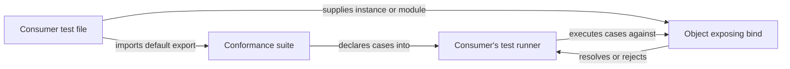

<!-- sdd-generated-metadata
doc_kind: standing-doc
generated_from: architecture@0.3.0
generated_by: claude-code
approved_by: rsarika@cisco.com
updated_at: 2026-09-23T09:08:18Z
validation_status: not-run
-->

# @webex/storage-adapter-spec architecture

Canonical repository-wide architecture. This document owns facts that span
multiple services, packages, modules, applications, or repositories. Link to
the owning service, module, feature, ADR, or native contract instead of
duplicating owner-local detail.

Related context: [specification registry](specs/README.md) ·
[repository agent instructions](../AGENTS.md)

## Applicability

Sections preceded by an `Include if` comment are conditional. Retain a
conditional section only when repository evidence satisfies its condition.
Record `Unresolved` while the evidence or developer answer is still missing;
do not infer an answer from the repository type alone.

| Condition ID                         | Status                        | Evidence or reason | Owned section                       |
| ------------------------------------ | ----------------------------- | ------------------ | ----------------------------------- |
| `repo.owns_datastore`                | N/A | `src/index.js` contains no ORM, migration, schema, or connection code; it exercises a caller-supplied store. | Repository data and schema          |
| `repo.holds_client_state`            | N/A | `src/index.js` declares no store or in-memory model; the only mutable value is a per-run fixture. | Client state model                  |
| `repo.components_interact`           | N/A | One module in scope; `src/index.js` performs no inter-module calls or event exchange. | Dependency and interaction topology |
| `repo.domain_data_across_components` | N/A | No domain entities and no second component to spread them across; see `src/index.js`. | Object and data ownership           |
| `repo.caches_data`                   | N/A | `src/index.js` contains no cache client or caching pattern. | Caching catalog                     |
| `repo.observability_convention`      | N/A | The logger in `src/index.js` is a no-op stub passed into `bind`, not a convention this package owns. | Observability patterns              |
| `repo.deploys_to_infra`              | N/A | `package.json` declares no container, deployment manifest, or start command; the artifact is published to a registry. | Runtime and infrastructure          |
| `repo.shared_base_libs`              | Applicable | `package.json` declares a runtime dependency on a workspace test-helper package and inherits build, lint, and test configuration from workspace config packages. | Shared and base libraries           |
| `repo.is_monorepo`                   | Applicable | This package is one workspace component of the webex-js-sdk monorepo; its dependency and every consumer are sibling packages resolved through `package.json` workspace ranges. | Package map and dependencies        |
| `repo.multi_platform`                | Applicable | `process` declares a browser target and `package.json` configures a browserify transform and a browser test runner. | Platform matrix                     |
| `repo.published_package`             | Applicable | `package.json` declares `main`, `devMain`, a scoped npm name, and a publish command. | Release and versioning              |
| `repo.embedded_in_host`              | N/A | `package.json` declares no web component, plugin manifest, or micro-frontend entry. | Host integration and theming        |
| `repo.exposes_commands_or_artifacts` | Applicable | `package.json` defines build, lint, browser-test, and publish commands producing a stable output directory. | Commands and generated artifacts    |
| `repo.cross_repo_deps_material`      | N/A | Every dependency and consumer is a sibling package inside the same Git repository, resolved through workspace ranges in `package.json`; nothing crosses a repository boundary. | Cross-repository topology           |
| `repo.security_arch_warranted`       | N/A | `src/index.js` contains no authentication, token, encryption, or trust-boundary code. | Security architecture               |

## Design overview

This package is one component of the webex-js-sdk monorepo, and its entire purpose is to define a
contract by executing it. The documentation set is scoped to this component; repository-wide facts
below are stated from this component's perspective.

A storage adapter in the Webex SDK is any object that can bind a namespace and then put, get, delete,
and clear keys within it. Several such adapters exist, each backed by a different browser or runtime
storage mechanism. Nothing in the language or the type system forces those adapters to agree on
edge-case behavior — what happens when you store `null`, whether two namespaces can hold the same
key, what a read of an absent key does.

The architectural choice this package makes is to express that agreement as a *shared executable
suite* rather than as an interface declaration or a written specification. `src/index.js` exports one
function that, when called with an object exposing `bind`, declares a complete set of test cases
against it. Each consumer package calls that function from its own test file. The contract is
therefore enforced at the moment each adapter is tested, in that adapter's own environment, rather
than asserted in prose that can drift.

The consequence is an inversion of the usual dependency direction for test code: this package is a
runtime dependency of its consumers' test suites, and it owns test declarations that execute inside
those consumers. That is what makes it a component worth specifying, and it is why the package holds
no test file of its own — the cases it declares are run by sibling packages, not here. Evidence:
`src/index.js`, `package.json`.

## Resource inventory and responsibilities

List the repository resources that own stable behavior. A resource can be a
deployable service, package, application, CLI, module, infrastructure unit, or
other independently owned boundary.

| Resource | Kind                                                    | Responsibility          | Owner          | Source   | Detailed specification |
| -------- | ------------------------------------------------------- | ----------------------- | -------------- | -------- | ---------------------- |
| Abstract storage-adapter conformance suite | package | Define and enforce the behavioral contract every Webex storage adapter must satisfy | Webex JS SDK storage maintainers | `src/index.js` | `src/docs/README.md` |

## Interaction and execution flows

Show how resources call, import, publish to, or otherwise depend on one
another. Include the representative end-to-end flow and important
failure/recovery branches.

The representative flow is not a request path — it is a test-time composition. A consumer package
imports the default export, supplies its adapter, and calls the suite inside its own `describe`
block. The suite then declares cases that drive the adapter and assert its responses. Consumers
supply the adapter in either form: the three browser adapters pass a constructed instance, while
`@webex/webex-core` passes its adapter module directly. Evidence: `README.md`, `src/index.js`.

| From       | To         | Interaction or transport                | Purpose  | Failure or compatibility behavior           |
| ---------- | ---------- | --------------------------------------- | -------- | ------------------------------------------- |
| Consumer adapter test file | Conformance suite | Import of the package default export | Obtain the shared contract instead of restating it per adapter | A consumer pinned to an older published version runs an older contract; there is no runtime negotiation |
| Conformance suite | Consumer's test runner | Calls to the runner's global `describe`, `it`, and `beforeAll` declarations | Register contract cases inside the consumer's own run | A runner without a Jest-compatible `beforeAll` cannot execute the suite; the failure surfaces as an undefined global at declaration time |
| Conformance suite | Storage adapter instance | Direct promise-returning method calls: `bind`, then `put`, `get`, `del`, `clear` | Drive the adapter through the contract's operations | Assertions expect rejection for a missing namespace, a missing logger, and reads of absent keys |

## Dependency topology

| Dependency | Type                       | Used by    | Purpose | Version, failure, or fallback policy |
| ---------- | -------------------------- | ---------- | ------- | ------------------------------------ |
| `@webex/test-helper-chai` | Internal | Conformance suite | Supplies the `assert` used by every case, including promise-rejection assertions | Declared as a workspace dependency in `package.json`; resolved from the workspace, no fallback |
| `@webex/legacy-tools` | Internal | Build and browser-test commands | Provides the `webex-legacy-tools` build and test runner | Declared as a workspace devDependency in `package.json` |
| `@webex/babel-config-legacy`, `@webex/eslint-config-legacy`, `@webex/jest-config-legacy` | Internal | Toolchain configuration | Supply the transpile, lint, and jest configuration this package re-exports | Declared as workspace devDependencies in `package.json` |

There are no dependency cycles and no ordering constraints inside this package: the module tree is a
single node, and every dependency above is a leaf. Exact versions are declared in `package.json`;
they are not copied here. Inter-package direction and the workspace relationships are owned by
[Package map and inter-package dependencies](#package-map-and-inter-package-dependencies).

## Public and consumer surfaces

Keep this as a compact catalog. Exact API, event, command, package, file, or
schema definitions remain in their native source and owner specification.

| Surface | Type                                 | Owner      | Consumers   | Compatibility policy                         | Source                           |
| ------- | ------------------------------------ | ---------- | ----------- | -------------------------------------------- | -------------------------------- |
| `runAbstractStorageAdapterSpec` (contract id `storage-adapter-spec-suite`, published) | SDK | Conformance suite | Webex storage adapter packages and `@webex/webex-core` storage tests | Published to npm; the function signature and invocation style are public API. Adding a case is a breaking change for any adapter that does not already satisfy it. | `package.json` declares the published entry points; the declaration itself is `src/index.js` |

The catalog holds exactly one contract, and that is a deliberate modeling decision rather than an
omission. The published surface has two halves: the exported function, and the storage adapter
interface it requires of its argument — `bind(namespace, options)` resolving to a handle owning
`put`, `get`, `del`, and `clear`. Consumers must implement that interface, and `README.md` documents
it to them, so it is genuinely part of the published contract rather than an internal one.

It is not registered as a second contract because it has no machine-readable artifact of its own.
This package ships no type declarations or API report, so the interface exists only as the suite's
assertions. Registering it separately would force it to name a canonical source no file can
honestly supply. Its authoritative definition is `src/index.js`, and the module spec at
`src/docs/README.md` specifies it in full.

The contract is an ecosystem-native JavaScript export, not an HTTP surface, so no OpenAPI document
applies and none is generated.

## Cross-cutting architecture

### Security

- Trust boundaries and identity flow: none. The package performs no authentication, authorization, or
  identity propagation; `src/index.js` contains no auth or token handling.
- Sensitive surfaces and data classes: none. The values written during a run are literal fixtures
  declared in `src/index.js` — a number, a single-key object, and short arrays. No real or
  production-shaped data is used.
- Encryption and secret boundaries: none. No secrets are read, stored, or required; `package.json`
  declares no credential-bearing configuration.

### Observability and operations

- Logging and correlation: this package emits no logs. It *requires* consumers' adapters to accept an
  `options.logger`, and supplies a no-op implementation of the `error`, `warning`, `log`, `info`,
  `debug`, and `trace` methods so the requirement is exercised without producing output. Evidence:
  `src/index.js`.
- Metrics, traces, and audit signals: none are produced or required.
- Ownership and operational entry points: none. The package has no runtime, so it has no dashboards,
  alerts, or runbooks. Its only operational surface is the publish step in `package.json`.

### Quality attributes

The measurable expectations for this package are compatibility expectations, not runtime ones:

- **Contract stability.** The default export's signature and call style are published API. Adding a
  case tightens the contract for every consumer; removing one silently weakens guarantees adapters
  were relying on.
- **Consumer executability.** The suite must remain declarable by every consumer's runner. Today this
  means a Jest-compatible runner, because `src/index.js` uses the `beforeAll` global.
- **Footprint.** The published artifact is a single transpiled module with one workspace runtime
  dependency, declared in `package.json`.

<!-- Include if: modules inherit a shared or base library stack. [condition-id: repo.shared_base_libs] -->

## Shared and base libraries

| Library | Inherited responsibility | Consumers       | Version floor | Compatibility rule |
| ------- | ------------------------ | --------------- | ------------- | ------------------ |
| `@webex/test-helper-chai` | The `assert` interface used by every case, including `assert.isRejected` for promise rejection and `assert.deepEqual` for value fidelity | Conformance suite | Workspace version | Tracks the workspace; a change to its assertion semantics changes what the contract enforces |
| `@webex/babel-config-legacy` | Transpilation settings, re-exported by `babel.config.js` | Build command | Workspace version | Tracks the workspace |
| `@webex/eslint-config-legacy` | Lint rules, re-exported by `.eslintrc.js` with `root: true` | Lint command | Workspace version | Tracks the workspace |
| `@webex/jest-config-legacy` | Jest settings, re-exported by `jest.config.js` | Consumers' runs | Workspace version | Tracks the workspace |
| `@webex/legacy-tools` | The `webex-legacy-tools` build and browser-test executables | Build and browser-test commands | Workspace version | Tracks the workspace |

<!-- Include if: the repository is a monorepo containing multiple packages. [condition-id: repo.is_monorepo] -->

## Package map and inter-package dependencies

This package is one component of the webex-js-sdk monorepo. Its dependency and all of its consumers
are sibling workspace packages in the same Git repository, resolved through workspace ranges rather
than a registry. The table covers only the packages that participate in this contract.

| Package   | Visibility        | Responsibility | Depends on | Consumers   |
| --------- | ----------------- | -------------- | ---------- | ----------- |
| `@webex/storage-adapter-spec` | Public | Owns the storage-adapter contract as an executable suite | `@webex/test-helper-chai` | The four packages below |
| `@webex/webex-core` | Public | Runs the suite under Node against its in-memory adapter | `@webex/storage-adapter-spec` | — |
| `@webex/storage-adapter-local-storage` | Public | Runs the suite against browser local storage | `@webex/storage-adapter-spec` | — |
| `@webex/storage-adapter-local-forage` | Public | Runs the suite against a localForage-backed store | `@webex/storage-adapter-spec` | — |
| `@webex/storage-adapter-session-storage` | Public | Runs the suite against browser session storage | `@webex/storage-adapter-spec` | — |

The dependency direction is one-way and must stay that way: consumers depend on this package, and
this package must never depend on an adapter.

The load is not evenly distributed, and that matters for verification. Of the four consumers, only
`@webex/webex-core` executes the suite under Node — the three browser-backed adapters wrap their call
in a Node skip, so their unit commands exit zero without running a single case. Under Node, one
sibling package carries the entire contract. Verified 2026-09-23; see
[getting started](getting-started.md) for the exact commands and their measured behavior.

Because the verifying package is a sibling rather than this package, no command declared in this
package's own `package.json` can exercise the contract. That asymmetry is the defining delivery
constraint here, and it is a workspace-internal one, not a cross-repository one.

<!-- Include if: the repository targets multiple runtime or host platforms. [condition-id: repo.multi_platform] -->

## Platform matrix

| Platform   | Shared versus platform-specific boundary | Entry or build      | Support and compatibility constraints |
| ---------- | ---------------------------------------- | ------------------- | ------------------------------------- |
| Node.js | Fully shared — `src/index.js` contains no platform branch | `yarn workspace @webex/storage-adapter-spec build` | `package.json` `engines` requires Node `>=18` |
| Browser | Fully shared — the same module, transpiled and bundled | `yarn workspace @webex/storage-adapter-spec test:browser` | `process` declares `{browser: true}` and `package.json` configures a browserify transform |

The suite has no platform-specific code path. Platform differences belong to the adapters that
consume it: a browser-only adapter is skipped in Node by its own test file, not by this suite.

<!-- Include if: the repository publishes a package or consumer artifact. [condition-id: repo.published_package] -->

## Release and versioning

| Artifact | Publish target | Versioning rule | Deprecation window | Changelog or migration obligation |
| -------- | -------------- | --------------- | ------------------ | --------------------------------- |
| `@webex/storage-adapter-spec` | npm, via the publish command in `package.json` | Version is not declared in this package's `package.json`; it is assigned by the workspace release process | Not declared in this package | Tightening the contract obliges a coordinated update across consuming adapter packages before release |

<!-- Include if: the repository exposes commands, generators, or stable file outputs. [condition-id: repo.exposes_commands_or_artifacts] -->

## Commands and generated artifacts

| Command or artifact | Owner      | Inputs                    | Output or side effect | Compatibility boundary |
| ------------------- | ---------- | ------------------------- | --------------------- | ---------------------- |
| `build` / `build:src` | Conformance suite | `src/`, `babel.config.js` | Transpiled module plus source maps in the package's `dist` output directory | The transpiled default export is the published surface; `main` resolves to it |
| `test:style` | Conformance suite | `src/`, `.eslintrc.js` | Lint diagnostics only | The package's only self-owned verification command |
| `deploy:npm` | Conformance suite | The built output directory | Publishes the package to npm | Publishing a tightened contract breaks adapters that have not been updated |
| `test` | Conformance suite | — | Fails: it invokes `test:unit` and `test:integration`, which `package.json` does not define | Known stale aggregate command; do not use it |
| `test:browser` | Conformance suite | — | Defined in `package.json`, but no test file exists in this package for the runner to collect | Retained for parity with sibling adapter packages |

The build output directory is regenerated and git-ignored; it is never edited by hand.

## Domain language

| Term   | Repository-specific meaning | Authoritative source      |
| ------ | --------------------------- | ------------------------- |
| Adapter | The object under test. It is not itself a store; it binds a namespace and returns a handle onto one. | `src/index.js` |
| Bind | The single entry operation. It takes a namespace and an options object carrying a logger, and resolves to the handle that owns the key operations. | `src/index.js` |
| Bound | The handle returned by a successful bind. It owns `put`, `get`, `del`, and `clear` for one namespace. | `src/index.js` |
| Namespace | The isolation boundary. The same key in two namespaces refers to two independent values. | `src/index.js` |
| Conformance suite | The exported function itself: a set of declared cases that an adapter must pass to be considered a valid Webex storage adapter. | `src/index.js` |

## References and maintenance

- Decisions: [adr/](adr/)
- Instantiated specifications and routing: [specs/README.md](specs/README.md)
- Repository rules and patterns: [repository agent instructions](../AGENTS.md)
- Update this document in the same change that alters repository boundaries,
  resource ownership, cross-resource interaction, or cross-cutting
  architecture.
