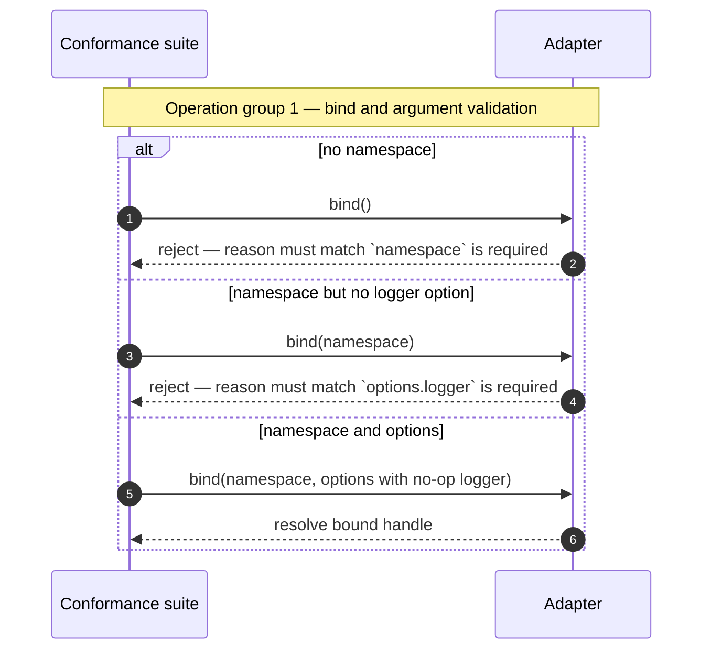
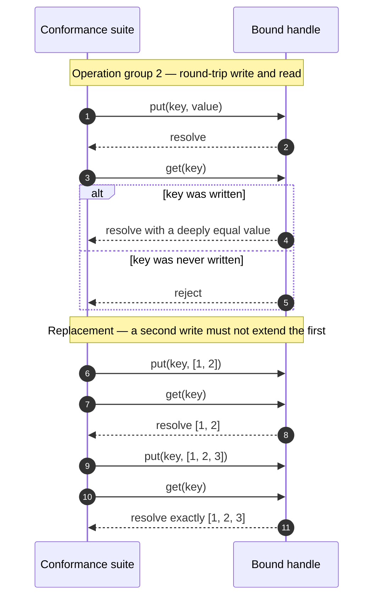
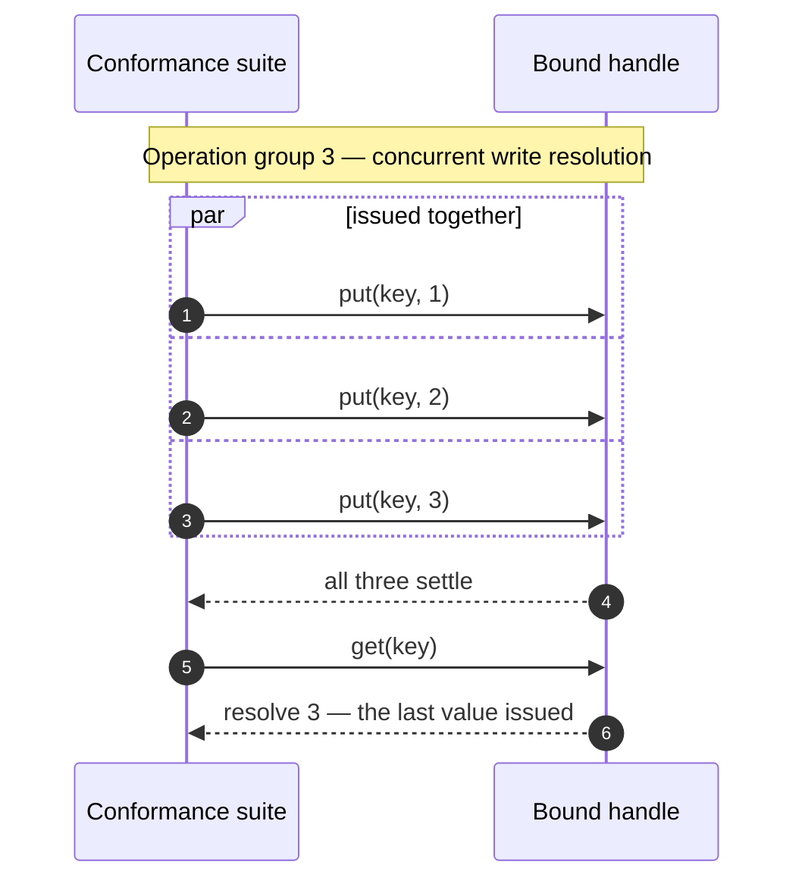
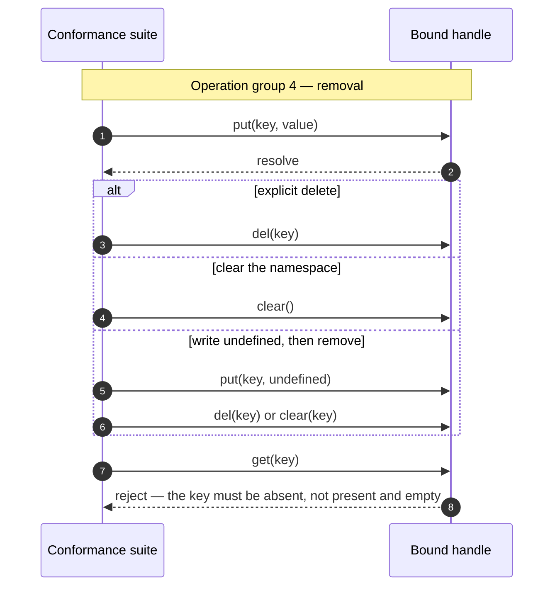
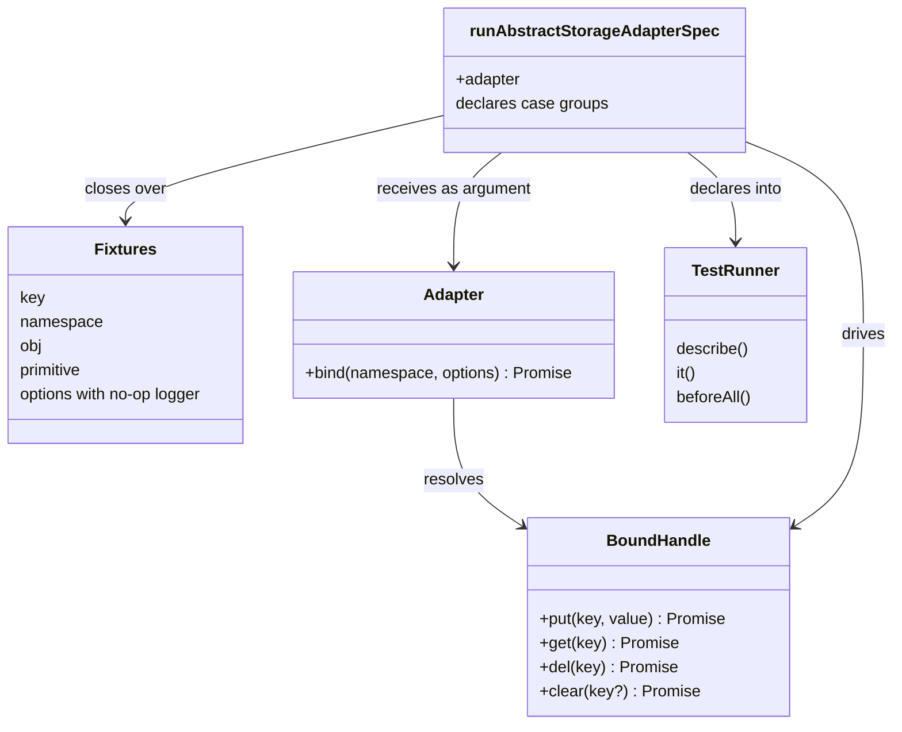

<!-- sdd-generated-metadata
doc_kind: module-spec
generated_from: module-spec@0.3.0
generated_by: claude-code
approved_by: rsarika@cisco.com
updated_at: 2026-09-23T09:08:18Z
validation_status: not-run
-->

# Abstract storage-adapter conformance suite

This source-local document at `src/docs/README.md` owns the stable
specification for **the abstract storage-adapter conformance suite**. Ground every claim in
repository evidence and link to the
[repository architecture](../../docs/architecture.md) instead of repeating broader facts.

Related context: [documentation index](../../docs/index.md) ·
[repository agent instructions](../../AGENTS.md)

## Metadata

| Field         | Value                                                        |
| ------------- | ------------------------------------------------------------ |
| Owner         | Webex JS SDK storage maintainers                             |
| Source path   | `src/`                                                       |
| Resource kind | package                                                      |
| Status        | Active                                                       |
| Last verified | 2026-09-23 at `bc61c78ba5`                                   |
| Module id     | `storage-adapter-spec`                                       |
| Parent spec   | — |
| Doc kind      | Module spec                                                  |
| Coverage score | 95% assessed 2026-09-23 — 21 of 22 mandatory spec fields PRESENT; test strategy scored WEAK because nothing pins the number or shape of the declarations this module emits |
| Validation status | not-run |

## Applicability

Sections preceded by an `Include if` comment are conditional. Retain a
conditional section only when source evidence or a confirmed developer answer
satisfies its condition. Record `Unresolved` instead of guessing.

| Condition ID                         | Status                        | Evidence or reason | Owned section                 |
| ------------------------------------ | ----------------------------- | ------------------ | ----------------------------- |
| `module.has_tiers`                   | N/A | No tier annotation, SLO configuration, or ownership tiering exists in this package. | Tier                          |
| `module.has_ui`                      | N/A | `src/index.js` declares no component, template, or style. | UI use-case flow              |
| `module.crosses_service_boundaries`  | N/A | `src/index.js` performs no network, RPC, or message-queue call. | Cross-boundary use-case flow  |
| `module.holds_client_state`          | N/A | `src/index.js` declares no state store; the single mutable binding is a per-run fixture. | Client state model            |
| `module.enforces_domain_rules`       | Applicable | `src/index.js` asserts required arguments, value fidelity, namespace isolation, replacement semantics, and rejection behavior. | Business rules and invariants |
| `module.is_concurrent_async`         | Applicable | Every operation in `src/index.js` returns a promise, and one case drives three concurrent writes. | Concurrency and reactive flow |
| `module.owns_persistence`            | N/A | `src/index.js` owns no store, schema, or migration; it exercises a caller-supplied adapter. | Data, schema, and migration   |
| `module.stateful_transitions`        | N/A | The exported function in `src/index.js` holds no state across invocations. The key lifecycle it asserts belongs to the adapter under test and is recorded under Requirements. | State machine                 |
| `module.exposes_wire_protocol`       | N/A | `src/index.js` defines no serialization format or binary frame. | Protocol and wire format      |
| `module.ui_multi_screen`             | N/A | No user interface exists in `src/index.js`. | UI flow                       |
| `module.large_data_model`            | N/A | The fixtures in `src/index.js` are one number, one single-key object, and short arrays. | Data model                    |
| `module.returns_caller_errors`       | Applicable | `src/index.js` requires specific promise rejections for missing arguments and absent keys. | Caller-visible failure modes  |
| `module.module_specific_conventions` | Applicable | `.eslintrc.js`, `babel.config.js`, `jest.config.js`, and `process` configure this package locally. | Module-specific rules         |
| `module.published_package`           | Applicable | `package.json` declares a scoped npm name, both package entry points, and a publish command. | Export stability              |
| `module.embedded_in_host`            | N/A | `package.json` declares no host mount point, plugin manifest, or web component. | Host integration and theming  |
| `module.has_design_tradeoff`         | Applicable | `src/index.js` declares cases into the caller's runner and shares one handle created in a Jest-global hook. | Key design trade-off          |
| `module.has_submodules`              | N/A | This module has no child module in the accepted manifest module tree. | Sub-modules                   |

## Evidence register

The code, configuration, and documentation used to verify this specification. Every statement in this
document traces to one of these; where none of them settles a question, this document records a gap
rather than inferring the missing behavior.

| Evidence         | What it establishes |
| ---------------- | ------------------- |
| `src/index.js` | The entire contract: the exported function, its required arguments, every asserted behavior, and every required rejection. |
| `package.json` | The published surface, the dependency on the assertion helper, the available commands, and the browser build transform. |
| `README.md` | The package's own consumer-facing usage statement, used as corroborating evidence for the intended call style. |
| `process` | The browser-target declaration for this package. |
| `.eslintrc.js` | The package-local lint root. |
| `babel.config.js` | The transpilation configuration used by the build command. |
| `jest.config.js` | The jest configuration this package re-exports for consumers' runs. |

Commit history was not used as rationale evidence. The package owner confirmed during onboarding that
it is not trustworthy for explaining why current behavior exists, so every `WHY` below is derived from
the code and its consumer-facing usage, and gaps are recorded rather than inferred.

## Purpose and boundary

- Responsibility: define the behavioral contract that every Webex storage adapter must satisfy, and
  define it as executable cases rather than prose, so the contract is enforced at the moment each
  adapter is tested.
- In scope: the required shape of `bind`, the required behavior of the bound handle's `put`, `get`,
  `del`, and `clear`, value-fidelity guarantees, namespace isolation, concurrent-write resolution,
  and the rejection behavior callers must be able to rely on. Evidence: `src/index.js`.
- Out of scope: any storage implementation. This module owns no store, no serialization, and no
  persistence. It also does not own the runner, the environment, or the skip logic that decides
  whether an adapter is applicable — that belongs to each consumer's test file.
- Consumers: Webex storage adapter packages and `@webex/webex-core`'s storage tests, all of which
  import the default export and call it with their own adapter. Evidence: `package.json`,
  `README.md`.

## Structure and key files

| Path     | Responsibility                     |
| -------- | ---------------------------------- |
| `src/index.js` | The whole module. It declares the local fixtures, the no-op logger, and the single default-exported function that emits every contract case. It is authoritative because there is no other source file. |
| `package.json` | Declares the published entry points, the assertion-helper dependency the suite calls, and the commands that build and lint this source. |
| `process` | Declares `{browser: true}`, marking this package as browser-targeted for the workspace tooling. |
| `.eslintrc.js` | Sets `root: true` and extends the workspace lint configuration, making this package a self-contained lint root. |
| `babel.config.js` | Re-exports the workspace babel configuration consumed by the build command. |
| `jest.config.js` | Re-exports the workspace jest configuration. |

The module's internal structure is a single nesting of runner declarations rather than a set of
collaborating files. One detail is worth knowing before editing: every operation group is declared
*inside* the outer `#bind()` group and its nested `bound` group, so the `#put()`, `#get()`, `#del()`,
and `#clear()` groups are descendants of `#bind()` rather than siblings of it. Evidence:
`src/index.js`.

## Public surface

Describe exported APIs, events, commands, files, or UI boundaries. Link exact
schemas or declarations instead of copying them.

| Surface  | Consumer   | Compatibility commitment | Source   |
| -------- | ---------- | ------------------------ | -------- |
| `runAbstractStorageAdapterSpec` — the default export, taking one object that exposes `bind` and returning nothing. Contract id `storage-adapter-spec-suite`, published. | Webex storage adapter packages and `@webex/webex-core` storage tests | Published npm API. The parameter shape and the requirement that it be called inside an active test-declaration context are both public. Adding a case tightens the contract for every consumer. | `package.json` declares the published entry points; the declaration is `src/index.js` |
| The storage adapter interface the caller must implement: `bind(namespace, options)` resolving to a handle owning `put`, `get`, `del`, and `clear`. The argument half of the same contract, not a separate id. | Every package that passes an adapter to the suite | Published, because consumers must implement it and `README.md` documents it to them. It has no machine-readable artifact of its own, which is why it carries no separate contract id; the assertions below are its specification. | `src/index.js` |

Both rows describe one registered contract, `storage-adapter-spec-suite`: what the module exports and
what it demands of the caller. Neither is an HTTP surface, so no OpenAPI document applies. The
repository-level catalog is in [architecture](../../docs/architecture.md).

## Dependencies

| Dependency            | Why it is required | Failure behavior                    |
| --------------------- | ------------------ | ----------------------------------- |
| `@webex/test-helper-chai` | Supplies the `assert` used by every case, including the promise-rejection assertion the contract depends on for its error requirements | A runtime dependency declared in `package.json`; if it cannot resolve, the module fails at import and no case is declared |
| The caller's test runner | The module calls the runner's `describe`, `it`, and `beforeAll` globals at invocation time rather than importing them | Not declared as a dependency in `package.json` because it is supplied ambiently by the consumer. A runner without a Jest-compatible `beforeAll` fails when the module is invoked |
| The adapter supplied by the caller | The subject of every case | Supplied as the sole argument, as either a constructed instance or a module object exposing `bind`; the module performs no null check, so an absent or malformed adapter surfaces as a failure inside the declared cases |

## Requirements

Separate source evidence, test/example evidence, assumptions, and gaps so a
future contributor can distinguish verified behavior from approved unknowns.

| ID        | WHAT                                           | WHY                            | Source evidence | Test or example evidence            | Assumptions or gaps | Confidence                        |
| --------- | ---------------------------------------------- | ------------------------------ | --------------- | ----------------------------------- | ------------------- | --------------------------------- |
| `MOD-001` | `bind()` called with no namespace must reject, and the rejection reason must match `` `namespace` is required `` | Callers pass namespaces from configuration; a silent default would let two components share a store they believe is private | `src/index.js` | `src/index.js` — the case is the assertion | Message text is matched by pattern, so adapters must keep that wording | Present |
| `MOD-002` | `bind(namespace)` without `options.logger` must reject, and the reason must match `` `options.logger` is required `` | The suite asserts the argument is demanded, not that it is used; the requirement exists so every adapter is constructed the same way | `src/index.js` | `src/index.js` | The module does not verify the logger is ever called; an adapter may accept and ignore it | Present |
| `MOD-003` | `bind(namespace, options)` must resolve to a handle exposing `put`, `get`, `del`, and `clear` | This handle is the entire operational surface of an adapter | `src/index.js` | `src/index.js` | The resolving case only requires the promise to settle; the handle's methods are exercised by later cases | Present |
| `MOD-004` | A primitive written with `put` must be readable by `get` as the same value | Round-trip fidelity is the base guarantee of a store | `src/index.js` | `src/index.js` | none | Present |
| `MOD-005` | The falsey primitives `0`, `false`, and `null` must round-trip unchanged | An adapter that tests values for truthiness would silently drop or coerce these; each is asserted separately | `src/index.js` | `src/index.js` | `undefined` is deliberately excluded here — it carries removal semantics, see `MOD-013` | Present |
| `MOD-006` | An object written with `put` must be readable by `get` as deeply equal | Adapters serialize; structural equality forbids returning a partially reconstructed object | `src/index.js` | `src/index.js` | The assertion is structural only. It is satisfied by returning the very same object reference, so an adapter that never serializes is not distinguished from one that round-trips correctly | Present |
| `MOD-007` | An array written with `put` must be readable by `get` as deeply equal | Same serialization concern as objects, with ordering preserved | `src/index.js` | `src/index.js` | none | Present |
| `MOD-008` | Writing a second array to an existing key must replace the stored value, not extend or merge it | An adapter that appended on write would accumulate entries across saves; the case writes a two-element array, reads it back, writes a three-element array, and requires exactly the second value | `src/index.js` | `src/index.js` | none | Present |
| `MOD-009` | When several writes to one key are issued concurrently, a subsequent read must return the last value issued | Adapters may serialize writes internally; without this the final value would be non-deterministic | `src/index.js` | `src/index.js` | The case issues three writes through a single concurrent batch and requires the third value. It constrains the adapter, but the ordering guarantee it assumes is not otherwise documented in this module | Present |
| `MOD-010` | The same key bound in two different namespaces must hold two independent values | Namespace isolation is the reason `bind` takes a namespace at all | `src/index.js` | none found | **Gap:** the case exists but its inner assertions are never awaited — the promise chain inside the bind callback is not returned, so the case resolves before the comparisons run and cannot fail. The requirement is declared but unverified | Weak |
| `MOD-011` | `get` of a key that was never written must reject | Callers distinguish "absent" from "stored `undefined`"; a resolved `undefined` would conflate them | `src/index.js` | `src/index.js` | The rejection reason is not constrained, only that it rejects | Present |
| `MOD-012` | After `del`, a `get` of that key must reject | Deletion must return the key to the absent state, not to a stored empty value | `src/index.js` | `src/index.js` | Asserted for both a primitive and an object | Present |
| `MOD-013` | `put` of `undefined` removes the key rather than storing it | Distinguishes `undefined` from the falsey values in `MOD-005`, which must be preserved | `src/index.js` | none found | **Gap:** both cases that describe this behavior call `del` or `clear` immediately after writing `undefined`, so the final rejection is equally explained by the removal call. The described behavior is not isolated by any case | Weak |
| `MOD-014` | After `clear`, a `get` of the key that was written must reject | Clearing must return that key to the absent state | `src/index.js` | `src/index.js` | **Two gaps.** Scope: every case writes and checks exactly one key, so namespace-wide clearing is asserted nowhere — only the single-key result is observable. Signature: the suite calls `clear()` with no argument in one case and `clear(key)` in two others, while `README.md` documents the method as `clear()`, so whether an argument is accepted, required, or ignored is unspecified | Weak |

## Design overview

The module is one function and no classes. Its design question is not how to store data — it stores
none — but how to make a shared contract executable inside someone else's test run.

It resolves that by *declaring* rather than *returning*. `runAbstractStorageAdapterSpec` does not
build a list of assertions for the caller to run; it calls the ambient `describe` and `it` globals
directly, so invoking it has the side effect of registering a tree of cases into whatever runner is
currently collecting. The caller's only job is to call it in the right place. Evidence:
`src/index.js`, `README.md`.

State ownership follows from that choice. The module owns three kinds of state, all trivial and all
local to one invocation: the literal fixtures (`key`, `namespace`, the object and primitive values),
the no-op logger object whose six methods satisfy `MOD-002` without producing output, and the single
`bound` handle. The handle is the only binding assigned after declaration time — it is created once
in a `beforeAll` hook and then shared by every case in the group beneath it. Nothing else is mutable,
and no state survives the invocation. Evidence: `src/index.js`.

The trade-off in that shared handle is described under [Key design trade-off](#key-design-trade-off).

## Data flow and sequence coverage

The transport is direct in-process promise-returning method calls on the adapter object the caller
supplied. There is no network, serialization, or queue between this module and its subject.

The module has four operation groups. Bind is separated because its failures are argument-validation
rejections matched by message, which no other group has. Round-trip and removal are separated because
their terminal state differs — one ends with a value present, the other with the key absent.
Concurrency is separated because its ordering, not its actors, is the behavior under test.

| Operation group | Entry and outcome | Diagram or evidence | Failure and recovery coverage |
| --------------- | ----------------- | ------------------- | ----------------------------- |
| Bind and argument validation | `bind` is called with zero, one, or two arguments; either rejects with a matched reason or resolves to the handle | Bind diagram below; `src/index.js` | Both rejection branches covered as `alt` paths |
| Round-trip write and read | `put` then `get` on the same key; the read must return an equal value | Round-trip diagram below; `src/index.js` | The absent-key rejection branch is covered as an `alt` path |
| Concurrent write resolution | Three writes to one key are issued together; a read must return the last issued | Concurrency diagram below; `src/index.js` | No failure branch — the contract requires deterministic resolution, not an error |
| Removal | `del`, `clear`, or a write of `undefined`; a following read must reject | Removal diagram below; `src/index.js` | The rejection is the asserted outcome, not a failure branch |

## Class and component relationships

There are no classes in this module. The relationships that matter are between the exported function,
the fixtures it closes over, and the caller-supplied objects it drives.

`Adapter` and `BoundHandle` are not implemented here — they are the contract this module defines and
the consumer implements. `TestRunner` is ambient, never imported.

`clear` is rendered with an optional parameter because the source is inconsistent about it: one case
calls `clear()` and two call `clear(key)`, while `README.md` documents `clear()`. The optional marker
records that unresolved state rather than asserting a signature the code does not settle. Evidence:
`src/index.js`, `README.md`.

## Use cases and flows

| Use case | Actor or caller | Primary steps and outcome     | Failure or boundary behavior | Evidence                  |
| -------- | --------------- | ----------------------------- | ---------------------------- | ------------------------- |
| `UC-001` | Adapter author | Import the default export, construct the adapter, and call the export inside a `describe` block; the full contract is registered into the author's own run | If called outside an active declaration context, the ambient `describe` global is unavailable and the call fails immediately | `src/index.js`, `README.md` |
| `UC-002` | Adapter author | Run the consumer package's unit command; each contract case executes against the real adapter in its real environment | A case that the adapter cannot satisfy fails in the consumer's run, never in this package's | `package.json` |
| `UC-003` | Suite maintainer | Add a case to tighten the contract | Every consuming adapter must already satisfy it, or its build breaks on the next publish; this package's own commands cannot detect that | `src/index.js`, `package.json` |
| `UC-004` | Adapter author | Bind a second namespace and confirm the same key holds independent values | Intended boundary behavior, but currently unverified — see `MOD-010` | `src/index.js` |

<!-- Include if: the module enforces domain rules or entity invariants. [condition-id: module.enforces_domain_rules] -->

## Business rules and invariants

| ID        | Invariant                            | WHY         | Enforcement source | Test evidence |
| --------- | ------------------------------------ | ----------- | ------------------ | ------------- |
| `INV-001` | A bind without both a namespace and a logger option never yields a usable handle | Every adapter is constructed identically, so no component can reach a store through a partially specified bind | `src/index.js` | `src/index.js` |
| `INV-002` | A value read back is deeply equal to the value written, for primitives, falsey primitives, objects, and arrays alike | Serialization must be lossless in both directions; truthiness checks and partial reconstruction are both forbidden | `src/index.js` | `src/index.js` |
| `INV-003` | A write replaces the stored value; it never extends or merges it | An accumulating adapter would grow the stored array on every save cycle | `src/index.js` | `src/index.js` |
| `INV-004` | A key is either present with a value, or absent and rejecting — never present and empty | Callers distinguish absence from a stored falsey value, which `INV-002` requires be preserved | `src/index.js` | `src/index.js` — enforced for the delete and clear paths only. The write-undefined path is not covered, because every case describing it calls a removal method before reading, so the invariant is unverified for that route |
| `INV-005` | Two namespaces never share a key's value | Namespace isolation is the reason `bind` is parameterized at all | `src/index.js` | none found — see the gap recorded for requirement MOD-010 |

<!-- Include if: the module is concurrent, asynchronous, reactive, or event-driven. [condition-id: module.is_concurrent_async] -->

## Concurrency and reactive flow

- Execution model: promises throughout. Every operation the contract defines — `bind`, `put`, `get`,
  `del`, `clear` — is required to return a promise. Most cases return their chain so the runner awaits
  it, but this is a convention the code does not enforce, and one case breaks it: see the
  shared-state and blocking notes below and requirement `MOD-010`. There are no threads, workers,
  subscriptions, or jobs. Evidence: `src/index.js`.
- Ordering guarantees: the contract requires that concurrently issued writes to one key resolve to
  the last value issued, and asserts it by issuing three writes together and requiring the third
  (`MOD-009`). Within a single case, ordering is whatever the returned chain imposes.
- Idempotency and retry: neither is defined by this contract. No operation is required to be
  idempotent, no deduplication key exists, and no retry is performed or expected. A failing operation
  fails its case.
- Shared-state protection: the `bound` handle is created once in a `beforeAll` hook and then shared
  by every case in the group beneath it, and those cases write to the same `key`. Nothing serializes
  them beyond the runner's own case ordering, so the cases are order-dependent by construction — each
  begins by writing the value it expects to read. Evidence: `src/index.js`.
- Blocking restrictions: no case may assert on a promise it does not return. `MOD-010` is the live
  counter-example in this module: its inner chain is not returned, so the runner never awaits it and
  the assertions cannot fail the case.

<!-- Include if: the module returns or raises errors callers must handle. [condition-id: module.returns_caller_errors] -->

## Caller-visible failure modes

The failures below are the ones the *contract requires an adapter to produce*. They are the
observable error surface every consumer inherits.

| Condition   | Signal or result | Caller behavior | Retry or recovery | Evidence |
| ----------- | ---------------- | --------------- | ----------------- | -------- |
| `bind` called with no namespace | Rejected promise whose reason matches `` `namespace` is required `` | Treat as a programming error; the namespace comes from the caller's own configuration | None — retrying with the same arguments fails identically | `src/index.js` |
| `bind` called without `options.logger` | Rejected promise whose reason matches `` `options.logger` is required `` | Supply a logger with `error`, `warning`, `log`, `info`, `debug`, and `trace` methods | None | `src/index.js` |
| `get` of a key that was never written | Rejected promise; the reason is unconstrained | Distinguish absence from a stored value; do not treat a rejection as an empty result | The key becomes readable only after a successful write | `src/index.js` |
| `get` after `del` | Rejected promise | Same as an absent key — deletion restores the absent state | Rewrite the key to make it readable again | `src/index.js` |
| `get` after `clear` | Rejected promise for the key that was written | Same as an absent key. The contract asserts this for a single key only; whether `clear` empties the whole namespace is not observable from any case | Rewrite the key | `src/index.js` |

The rejection *reason* is constrained only for the two `bind` failures, which are matched by message
pattern. Adapters must keep that wording. For the absent-key failures the contract requires only that
the promise rejects, so callers must not depend on a particular error type or message.

## Pitfalls and constraints

- **Every case here is a requirement for four other packages.** Adding one tightens the contract for
  every consuming adapter, and this package's own commands cannot detect the breakage — no command in
  `package.json` executes the suite. Verify against consumers before publishing.
- **An assertion chain that is not returned cannot fail.** `MOD-010` is unverified today for exactly
  this reason: the inner promise chain inside the bind callback is not returned, so the case resolves
  before its comparisons run. When editing, check that every nested chain is returned.
- **A case that both writes `undefined` and calls a removal method proves nothing about writing
  `undefined`.** Two cases have this shape, which is why `MOD-013` is recorded as unverified rather
  than as covered behavior.
- **`clear` is called inconsistently.** One case calls `clear()` and two call `clear(key)`, while the
  package's usage documentation describes the method as `clear()`. An adapter that treats the
  argument as meaningful and one that ignores it both pass. Evidence: `src/index.js`, `README.md`.
- **The suite depends on a Jest-compatible runner.** It calls the `beforeAll` global, which is not a
  Mocha global. A consumer running it under a runner without that global fails at declaration time,
  not as an assertion failure. Evidence: `src/index.js`.
- **Cases share one handle and one key.** They are order-dependent by construction; each writes the
  value it expects to read. Do not assume a clean store at the start of a case.
- **`dist/` is generated.** It is produced by the build command and git-ignored. Edits there are lost
  on the next build. Evidence: `package.json`.

<!-- Include if: the module has conventions beyond repository-wide rules. [condition-id: module.module_specific_conventions] -->

## Module-specific rules

- Do: keep every case's promise chain returned, including chains nested inside a `then` callback.
  Evidence for why: `MOD-010` in this document.
- Do: assert value fidelity with deep equality rather than identity, so that adapters which serialize
  remain conformant. Evidence: `src/index.js`.
- Do: treat `.eslintrc.js` as this package's lint root — it sets `root: true`, so workspace lint
  configuration above it does not apply. Run `test:style` for this package specifically.
- Do: keep the module browser-safe. `process` declares a browser target and `package.json` configures
  a browserify transform, so any Node-only API would break the browser build.
- Do not: add a case whose behavior only one adapter can satisfy. Every case binds all consumers.
- Do not: introduce a second exported function or a named export. Consumers import the default
  export, and `package.json` resolves both `main` and `devMain` to this single module.
- Do not: write a case that combines a behavior under test with another operation that would produce
  the same observable outcome — it cannot isolate what it claims to verify. See `MOD-013`.

<!-- Include if: the module is published or consumed as a package. [condition-id: module.published_package] -->

## Export stability

| Export or entry point | Consumer   | Stability | Versioning and deprecation rule | Declaration or API report |
| --------------------- | ---------- | --------- | ------------------------------- | ------------------------- |
| Default export `runAbstractStorageAdapterSpec(adapter)` | Webex storage adapter packages and `@webex/webex-core` storage tests | Public and stable | Published to npm through the command in `package.json`; the version is assigned by the workspace release process rather than declared in this package. A new case is a compatibility-affecting change even though the signature is unchanged | `src/index.js` |
| Package entry points `main` and `devMain` | Package consumers and workspace tooling | Public | `main` resolves to the built output and `devMain` to the source module, so workspace consumers can run against source without a build | `package.json` |

The ecosystem-native declaration in `src/index.js` is the authoritative API artifact for this package.
No separate API report or generated reference is produced, and no OpenAPI document applies.

<!-- Include if: the module has a non-obvious design trade-off consumers or maintainers must preserve. [condition-id: module.has_design_tradeoff] -->

## Key design trade-off

| Chosen trade-off | Preserved invariant or benefit | Cost or limitation | Decision evidence |
| ---------------- | ------------------------------ | ------------------ | ----------------- |
| Declare cases into the caller's ambient runner instead of exporting assertions the caller composes | A consumer adopts the entire contract with a single call, so no adapter can silently adopt a subset of it | The module is coupled to the runner's globals and cannot be invoked outside a declaration context; it also cannot be unit-tested in this package, which is why the package holds no test file | `src/index.js` |
| Create the bound handle once in a `beforeAll` hook and share it across all cases | The expensive bind happens once, and the cases read as a continuous narrative over one store | The cases become order-dependent and share one key, and the choice of the Jest-specific `beforeAll` global over a runner-neutral hook constrains consumers to a Jest-compatible runner | `src/index.js`, `package.json` |
| Assert `bind` failures by matching the rejection message | Adapters must fail for the stated reason, not merely fail | Adapter error wording becomes part of the contract, so rewording a message in an adapter breaks conformance | `src/index.js` |

## Verification

| Requirement or invariant | Test level                    | Positive evidence | Negative or boundary evidence | Gap                    |
| ------------------------ | ----------------------------- | ----------------- | ----------------------------- | ---------------------- |
| `MOD-001` | Contract | `src/index.js` | `src/index.js` — asserts rejection, matched by message | none |
| `MOD-002` | Contract | `src/index.js` | `src/index.js` — asserts rejection, matched by message | Does not verify the logger is ever used |
| `MOD-003` | Contract | `src/index.js` | none found | Only requires the promise to settle; the handle's shape is exercised indirectly by later cases |
| `MOD-004` | Contract | `src/index.js` | none found | none |
| `MOD-005` | Contract | `src/index.js` — one case per falsey value | none found | none |
| `MOD-006` | Contract | `src/index.js` | none found | none |
| `MOD-007` | Contract | `src/index.js` | none found | none |
| `MOD-008` | Contract | `src/index.js` | `src/index.js` — requires exactly the replacement value | none |
| `MOD-009` | Contract | `src/index.js` | none found | No case covers a concurrent write racing a delete or a clear |
| `MOD-010` | Contract | none found | none found | **Unverified.** The case exists but its inner assertions are never awaited, so it cannot fail |
| `MOD-011` | Contract | none found | `src/index.js` — asserts rejection | Rejection reason is unconstrained |
| `MOD-012` | Contract | none found | `src/index.js` — asserts rejection for a primitive and an object | none |
| `MOD-013` | Contract | none found | none found | **Unverified.** Both describing cases also call a removal method, which equally explains the outcome |
| `MOD-014` | Contract | none found | `src/index.js` — asserts rejection for the one written key | Namespace-wide clearing is not asserted, and argument handling for `clear` is inconsistent |
| `INV-005` | Contract | none found | none found | **Unverified** — carries the same gap as `MOD-010` |

Record coverage gaps explicitly and link follow-up work. A module specification
is complete only when its public surface, invariants, failure modes, and test
evidence agree with the implementation.

### How this module is actually verified

The cases named as evidence above are this module's *output* — the declarations it emits. They are
executed, in this repository, by a sibling workspace package:

| Route | Measured result (2026-09-23) |
| --- | --- |
| `yarn workspace @webex/webex-core test:unit --targets storage/storage-adapter.js` | **21 of 21 cases executed and passed** against that package's in-memory adapter |
| `yarn workspace @webex/storage-adapter-local-storage test:unit` | Exits zero with **all 21 cases skipped** — the consumer wraps its call in a Node skip, so this proves nothing |

The three browser-backed adapter packages all skip under Node, so `@webex/webex-core` is the only
Node route that exercises the contract. Commands are recorded in `.sdd/manifest.json` under
`contract-verify` and the `unit` test tier.

**The residual gap is narrower than "untested".** Every case that exists is exercised by the run
above. What nothing checks is the *set* of declarations: no assertion pins how many cases this module
emits or what they cover, so deleting a case would silently shrink the contract while every consumer
run stayed green. That is why the test-strategy field scores WEAK, and it cannot be closed by writing
documentation.

Three source-level follow-ups are open and unassigned: returning the inner chain so `MOD-010` and
`INV-005` become verifiable; separating the `undefined`-write behavior from the removal call so
`MOD-013` can be isolated; and settling whether `clear` accepts an argument so `MOD-014` is
unambiguous.
