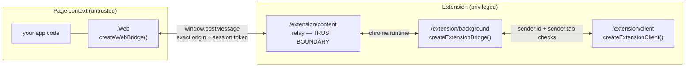

# @webex/web-extension-bridge

A secure, framework-agnostic bridge between a web application and a Chromium MV3
extension. It satisfies the two requirements it was asked for — **FR1**, the web
application pushes a message to the extension, and **FR2**, the extension pulls data from
the web application on demand — and it does so behind a single narrow protocol so that
neither side needs to hand-write `window.postMessage` plumbing, correlation ids, timeouts
or `chrome.runtime` command surfaces. The SDK has zero runtime dependencies, performs no
network I/O of its own, and treats the page as untrusted on the extension side and the
extension as untrusted on the page side.

- [1. Install and quick start](#1-install-and-quick-start)
- [2. Architecture](#2-architecture)
- [3. Test it locally](#3-test-it-locally)
- [4. Troubleshooting](#4-troubleshooting)
- [5. API reference](#5-api-reference)
- [6. Security architecture](#6-security-architecture)
- [7. Before you ship](#7-before-you-ship)
- [8. Browser support, versioning and compatibility](#8-browser-support-versioning-and-compatibility)
- [9. Contributing and licence](#9-contributing-and-licence)

## 1. Install and quick start

```bash
npm install @webex/web-extension-bridge
```

Four subpath exports, one per execution context, so a web build never pulls in extension
code and a content script never pulls in the service-worker bridge:

| Import | Context |
| --- | --- |
| `@webex/web-extension-bridge/web` | The web application page |
| `@webex/web-extension-bridge/extension/content` | Content script (relay only) |
| `@webex/web-extension-bridge/extension/background` | Service worker |
| `@webex/web-extension-bridge/extension/client` | Popup, options page, side panel |
| `@webex/web-extension-bridge` | Types and `BridgeError` only — safe to import anywhere |

### Web application

```js
import {createWebBridge} from '@webex/web-extension-bridge/web';

const webBridge = createWebBridge({allowedOrigins: [location.origin]});

// FR1 — push a message to the extension
webBridge.publish('message', {text: 'Hello extension'});

// FR2/FR3 — answer on-demand requests from the extension
webBridge.requestHandler('snapshot', () => ({value: readValue()}));

// FR4 — connection lifecycle
webBridge.onConnected(() => console.log('extension attached'));
```

### Extension service worker

```js
import {createExtensionBridge} from '@webex/web-extension-bridge/extension/background';

const extBridge = createExtensionBridge({allowedOrigins: ['https://app.example.com']});

// FR1 — receive pushed messages
extBridge.subscribe((topic, payload, meta) => {
  /* pushed messages */
});

// FR2 — pull from the page on demand
const data = await extBridge.request('snapshot', {any: 'input'});
```

Call `createExtensionBridge()` at the top level of the worker, synchronously. MV3 evicts
an idle worker, and only listeners registered during the synchronous top-level run can
revive it.

### Content script

```js
// content script — relay only, no product logic
import '@webex/web-extension-bridge/extension/content';
```

### Extension UI (popup, options, side panel)

A popup cannot own the bridge: the bridge lives in the service worker, which outlives the
popup document. The client mirrors the `ExtensionBridge` surface and proxies to the
worker over a private command protocol.

```js
import {createExtensionClient} from '@webex/web-extension-bridge/extension/client';

const client = createExtensionClient();
const data = await client.request('snapshot', {any: 'input'});
const messages = await client.getBufferedMessages({limit: 50});

client.subscribe((topic, payload, meta) => renderRow(topic, payload, meta));
```

Every snippet above is exercised by working code in this repository:
[`docs/samples/web-extension-bridge/app.js`](../../../docs/samples/web-extension-bridge/app.js),
[`docs/samples/web-extension-bridge-extension/service-worker.js`](../../../docs/samples/web-extension-bridge-extension/service-worker.js)
and
[`docs/samples/web-extension-bridge-extension/popup.js`](../../../docs/samples/web-extension-bridge-extension/popup.js),
with the same flows asserted end to end in
[`test/unit/spec/integration/bridge.ts`](test/unit/spec/integration/bridge.ts).

## 2. Architecture



There are three hops, and each one has its own check:

1. **Page ↔ content script** is `window.postMessage` on the shared DOM window. Every send
   uses an exact `targetOrigin`; every receive requires `event.source === window`, an
   allow-listed `event.origin`, and the session token the content script minted for this
   document. The content script runs in an isolated world, so page script cannot reach its
   variables or its `chrome` access.
2. **Content script ↔ service worker** is `chrome.runtime`. The relay forwards protocol
   envelopes and nothing else — there is no generic "call this API" message — and the
   worker re-checks `sender.origin` and `sender.tab` against its own allow-list rather
   than trusting the manifest alone.
3. **Extension page ↔ service worker** is the client command protocol, accepted only when
   `sender.id === chrome.runtime.id` and `sender.tab === undefined`.

### Push flow (FR1)

`publish()` validates the topic and payload synchronously and throws on failure, so a
message is never silently dropped by the caller's own mistake. The envelope crosses to the
relay, which re-validates it and forwards it to the worker. The worker applies the
per-`(tabId, topic)` token bucket, then fans the push out to `subscribe()` listeners and
appends it to the bounded `chrome.storage.session` buffer so a popup opened later can
still see it via `getBufferedMessages()`.

Push is best-effort by design: if the worker is mid-eviction the message can be lost.
Anything that must be correct on read belongs on the pull path.

### Pull flow (FR2)

`request()` resolves a target tab (`opts.tabId`, or the active tab in the current window),
mints a CSPRNG id, arms its own timer, and sends a `REQUEST`. The page runs the handler
registered for that topic, and the response is matched back by `correlationId` — single
use, session-bound, and rejected if it arrives after settlement. Requests are fully
multiplexed: there is no head-of-line blocking, each has an independent timer and abort
path, and every request settles exactly once, with `TIMEOUT` if the page is slow and
`DISCONNECTED` if the tab or the page bridge goes away mid-flight.

## 3. Test it locally

Prerequisites: Node 22.14 (`nvm use 22.14`), Chromium 116 or newer, and a checkout of this
repository with `yarn install` completed.

```bash
nvm use 22.14
yarn workspace @webex/web-extension-bridge build:src
yarn workspace @webex/web-extension-bridge build:samples
yarn samples:serve
```

`build:samples` bundles the SDK into `docs/samples/*/vendor/` and generates
`docs/samples/web-extension-bridge-extension/manifest.json` for `https://localhost:8000`. Both
are generated artefacts and are git-ignored. To point the sample at a different origin:

```bash
SAMPLE_ORIGIN=https://localhost:9000 yarn workspace @webex/web-extension-bridge build:samples
```

Then:

1. Open `chrome://extensions` and enable **Developer mode**.
2. **Load unpacked** and select `docs/samples/web-extension-bridge-extension/`.
3. Open <https://localhost:8000/samples/web-extension-bridge/> and accept the dev-server
   certificate. The connection pill flips to **Extension connected**.
4. **FR1:** type a message, click **Publish to extension**. The extension's toolbar badge
   increments. Open the popup and click **Load buffered** — the message is listed with its
   topic, payload and originating tab.
5. **FR2:** change **Shared value** on the page, then in the popup click **Send request**
   with the `snapshot` topic. The popup shows the value you just typed, and the page's
   **Requests served** counter increments — proof the pull reached the page at request
   time rather than replaying a cached copy.
6. **Failure modes:** repeat step 5 with the `boom` topic for `HANDLER_ERROR`, `slow` for
   `TIMEOUT` (or click **Abort** first, for `ABORTED`), and `missing` for `NO_HANDLER`.

Watch mode cannot reload an unpacked extension. After changing SDK source, re-run
`build:samples` and click the reload arrow on the extension card in `chrome://extensions`,
then reload the page.

## 4. Troubleshooting

| Symptom | Likely cause | Fix |
| --- | --- | --- |
| Pill stays on **Waiting for extension…** | The content script did not match the page URL | Compare `content_scripts.matches` in the generated `manifest.json` with the address bar, including scheme and port. Re-run `build:samples` with the right `SAMPLE_ORIGIN`. |
| Pill connects, `publish()` throws `NOT_CONNECTED` | The extension reloaded, so the session token was replaced | Reload the page. The page bridge re-announces itself and adopts the new session. |
| `request()` rejects with `NO_TAB` | No allow-listed tab was active in the current window | Focus the sample tab, or pass `opts.tabId` from `listConnections()`. |
| `request()` rejects with `NOT_CONNECTED` | Right tab, but the page bridge is gone (navigated, or `destroy()` called) | Reload the page, then check `listConnections()`. |
| Popup shows stale data, or new API members are missing | Stale build in `vendor/` | Re-run `build:src` and `build:samples`, reload the extension, reload the page. |
| Service worker shows as **inactive** and the first push is missed | Normal MV3 eviction | Expected: push is best-effort. Use `request()` for anything that must be correct. |
| `Cannot use import statement outside a module` in the worker or content script | An ESM bundle loaded as a classic script, or a page opened over `file://` | The samples ship IIFE bundles and a classic worker on purpose. Serve over HTTP(S); `file://` has no usable origin and the bridge will refuse it. |
| `CRYPTO_UNAVAILABLE` on start | No `crypto.getRandomValues` in the context | Serve over HTTPS (or `localhost`). The SDK refuses to run without a CSPRNG rather than falling back to `Math.random`. |
| Commands from the popup rejected | Channel mismatch between the client and the worker | The `channel` option must be identical on all four surfaces. |
| Popup works from the toolbar but not when its URL is opened in a tab | By design: an extension page opened in a tab has `sender.tab` set, and the worker only accepts client commands from a tab-less extension page | Test the popup from the toolbar button (or a side panel / options page). To drive the bridge from a tab, put the calls in the service worker instead. |

## 5. API reference

### `createWebBridge(options?): WebBridge`

| `WebBridgeOptions` | Type | Default | Notes |
| --- | --- | --- | --- |
| `allowedOrigins` | `string[]` | `[location.origin]` | Non-empty list of exact origins. `'*'`, an empty array, a wildcard pattern, or a list that omits the document's own origin all throw `INSECURE_CONFIG` at construction. |
| `channel` | `string` | `'webex-bridge'` | Namespace, must match the extension. `^[a-zA-Z0-9._:-]{1,128}$`. |
| `debug` | `boolean` | `false` | Metadata-only logging. There is no option that logs payloads or tokens. |
| `maxPayloadBytes` | `number` | `262144` | Clamped to `[1, 1048576]`. |
| `logSink` | `LogSink` | console | Receives `{level, message, context}` with metadata only. |

| Member | Signature | Notes |
| --- | --- | --- |
| `publish` | `(topic: string, payload?: JsonValue) => void` | FR1. Throws `INVALID_TOPIC`, `INVALID_PAYLOAD` or `NOT_CONNECTED` synchronously — never silently drops. |
| `requestHandler` | `(topic, handler, opts?) => () => void` | FR3. Returns an unregister function. One handler per topic; re-registering throws `INSECURE_CONFIG` unless `opts.replace === true`. `opts.validate` runs against the inbound payload before the handler and rejects with `INVALID_PAYLOAD`. |
| `onConnected` | `(listener: () => void) => () => void` | FR4. Fires immediately if already connected. |
| `onDisconnected` | `(listener: (reason: string) => void) => () => void` | Reasons: `peer-left`, `session-replaced`, `pagehide`, `destroyed`. |
| `isConnected` | `boolean` getter | |
| `getCounters` | `() => Record<string, number>` | Telemetry for your own pipeline; see [Observability](#observability). |
| `destroy` | `() => void` | Idempotent. Sends `BYE`, removes every listener and handler. |

A handler receives `(payload, meta)` where `meta` is a frozen
`{topic, messageId, receivedAt}`. A handler's return value is size- and
serialisability-checked too: an oversized or circular result fails as `INVALID_PAYLOAD`
rather than throwing inside `postMessage`.

### `createExtensionBridge(options?): ExtensionBridge`

| `ExtensionBridgeOptions` | Type | Default | Notes |
| --- | --- | --- | --- |
| `channel` | `string` | `'webex-bridge'` | Must match the page and the client. |
| `allowedOrigins` | `string[]` | manifest only | Runtime origin allow-list checked in addition to `content_scripts.matches`. Exact origins; `'*'` throws `INSECURE_CONFIG`. Strongly recommended. |
| `defaultTimeoutMs` | `number` | `5000` | Clamped to `[100, 30000]`. |
| `maxPayloadBytes` | `number` | `262144` | Clamped to `[1, 1048576]`. |
| `buffer` | `{maxEntries?, ttlMs?}` | `{maxEntries: 200, ttlMs: 1800000}` | FR8 buffer in `chrome.storage.session`, FIFO with TTL eviction. |
| `rateLimit` | `{pushesPerSecond?, maxInFlightPerTab?}` | `{pushesPerSecond: 20, maxInFlightPerTab: 16}` | Token bucket per `(tabId, topic)`; in-flight cap per tab. |
| `debug` / `logSink` | | `false` / console | As above. |

| Member | Signature | Notes |
| --- | --- | --- |
| `subscribe` | `(listener: (topic, payload, meta) => void) => () => void` | FR1. `meta` is `{tabId, url?, origin, receivedAt, messageId}`. A listener that throws cannot break delivery to the others. |
| `subscribeTopic` | `(topic, listener) => () => void` | Topic-filtered `subscribe`. |
| `request` | `<T>(topic, payload?, opts?) => Promise<T>` | FR2. `opts` is `{tabId?, timeoutMs?, signal?}`. Always settles. |
| `listConnections` | `() => Promise<Connection[]>` | FR5. `{tabId, origin, url?, connectedAt}` per attached tab. |
| `getBufferedMessages` | `(opts?: {topic?, limit?}) => Promise<BufferedMessage[]>` | FR8. Oldest first. |
| `getCounters` | `() => Promise<Record<string, number>>` | Asynchronous because the counters live in the worker. |

Requires `"permissions": ["storage"]`. It deliberately does **not** require the `tabs`
permission: the active tab is resolved with `tabs.query({active: true, currentWindow:
true})`, which needs no permission. Without host permission for a tab, `Connection.url`
is simply absent while `origin` remains available.

### `createExtensionClient(options?): ExtensionBridge`

Same surface as `ExtensionBridge`, proxied to the worker; takes `{channel?, debug?,
logSink?}`. `signal` is honoured locally — aborting stops your `await`, it cannot recall a
request already in flight in the page. Only accepted by the worker from extension pages
(`sender.id === chrome.runtime.id && sender.tab === undefined`).

### Errors

Every rejection is a `BridgeError` with a stable `code` and an optional `topic`. Codes are
part of the public contract and will not change meaning within a major version.

| Code | Raised when | Retriable |
| --- | --- | --- |
| `NOT_CONNECTED` | No bridge attached in the target tab | Yes |
| `NO_TAB` | No active tab could be resolved | Yes |
| `NO_HANDLER` | Page has no handler for the topic | No |
| `TIMEOUT` | Page did not respond in time | Yes |
| `DISCONNECTED` | Peer went away mid-request | Yes |
| `ABORTED` | Caller's `AbortSignal` fired | No |
| `HANDLER_ERROR` | Page handler threw; details redacted | Maybe |
| `INVALID_PAYLOAD` | Payload failed validation or the size cap | No |
| `INVALID_TOPIC` | Topic failed the charset/length rule | No |
| `RATE_LIMITED` | Limiter rejected the message | Yes, with backoff |
| `PROTOCOL_MISMATCH` | Peer runs an incompatible protocol version | No |
| `INSECURE_CONFIG` | Constructor received a rejected configuration | No |
| `CRYPTO_UNAVAILABLE` | No CSPRNG available; the SDK refuses to start | No |

```js
import {BridgeError} from '@webex/web-extension-bridge';

try {
  await extBridge.request('snapshot');
} catch (error) {
  if (error instanceof BridgeError && error.code === 'TIMEOUT') {
    // retriable
  }
}
```

### Observability

`getCounters()` returns a flat `Record<string, number>` keyed `name.detail`, covering
pushes sent and received, requests issued, outcomes by error code, drops by validation
reason and rate-limit rejections. The SDK never sends this anywhere — wire it to your own
telemetry. Logging is metadata only: `{channel, kind, topic, id, correlationId, tabId,
reason}`, never payloads and never the session token.

## 6. Security architecture

### Controls

| Layer | Control |
| --- | --- |
| Page → extension | Exact `targetOrigin` on every send; `'*'` is unrepresentable in the API and banned by lint. |
| Extension → page | `event.source === window`, allow-listed `event.origin`, session-token binding, isolated-world content script. |
| Service worker | `sender.origin` and `sender.tab` re-checked against a runtime allow-list; client commands only from own extension pages; no generic command surface reachable from a page. |
| Protocol | CSPRNG ids (no `Math.random` fallback), single-use correlation, seen-id replay cache, ±30 s clock-skew window, protocol-version equality, reserved-key rejection (`__proto__`, `constructor`, `prototype`), null-prototype envelopes. |
| Resource safety | 256 KiB payload default with a 1 MiB ceiling, serialisability checks both ways, token-bucket rate limiting, in-flight caps, bounded buffers, bounded seen-id caches, bounded listener sets. |
| Failure handling | Coded, redacted errors; no stack traces and no handler text cross the boundary; every request settles exactly once. |
| Code level | Zero runtime dependencies; no `eval`; no HTML sinks; security lint rules are errors, enforced over the samples too. |

### Why there is no message signing

An HMAC or signature over envelopes is **intentionally** absent. Both peers would have to
share a key, and any key reachable by page JavaScript is equally reachable by any other
script in that page — including an XSS payload. The signature would therefore authenticate
nothing that the origin checks and the isolated-world boundary do not already cover, while
adding cost and, worse, a false sense of assurance.

If payload **authenticity** genuinely matters — the extension must be certain a value came
from your backend and was not fabricated by injected script — the correct design is
out-of-band trust: your server signs the data, the extension verifies it against the
server's public key, and the page is treated purely as an untrusted transport. The bridge
carries the signed blob; it does not vouch for it.

### Explicitly accepted risks

These are inherent to the platform and cannot be fixed inside the SDK. Read them before
you decide what to put on the bridge.

| Accepted risk | Why it cannot be fixed in the SDK | Your move |
| --- | --- | --- |
| **XSS in your page** can call `publish()`, invoke your registered handlers, and observe bridge traffic on `window`. All same-origin page scripts share one JavaScript world. | The SDK cannot create a confidentiality boundary against code running in the same context. | Treat the page as one trust domain. Fix XSS as the primary control (CSP, encoding, Trusted Types). Never register a handler that exposes data an XSS payload should not reach. |
| **Another installed extension** with host permissions on the same origin can inject a content script and speak this protocol. | Any extension the user grants host access to has at least our privileges. | Handlers must not return secrets. Use out-of-band signing where authenticity matters. |
| **Push is best-effort.** MV3 workers are ephemeral; a push sent while the worker spins up can be dropped. | Platform behaviour. | Use the pull path for anything that must be correct on read. The bounded buffer mitigates, it does not solve. |

A `MessagePort` handshake was evaluated as a way to move post-handshake traffic off the
shared `window`. It is not a security control — the port is transferred over a
`postMessage` event every page listener receives, so it can be raced — and it is not
implemented. If it is ever added, it will be as noise reduction, not isolation.

Threats T1–T14 from the intake spec each have a dedicated regression test in
[`test/unit/spec/security/threats.ts`](test/unit/spec/security/threats.ts). A new threat
needs a new failing test before the fix is accepted.

## 7. Before you ship

| Area | Requirement before production |
| --- | --- |
| Origins | Replace every `localhost`/`127.0.0.1` entry in `manifest.json` (`content_scripts.matches`, `host_permissions`) and in `allowedOrigins` with your exact production origins. Never ship `localhost`. |
| Transport | Serve the web application over HTTPS only, with HSTS. |
| Wildcards | No `'*'` in `allowedOrigins` (the SDK rejects it) and no `'*'` `targetOrigin`. Confirm by lint. |
| Extension resources | No `web_accessible_resources`. If unavoidable, a single named file with `use_dynamic_url: true`. |
| Permissions | `permissions` is `["storage"]` or narrower. No `tabs`. No `externally_connectable`. |
| CSP | `extension_pages` CSP set on the extension; a strict CSP, ideally with Trusted Types, on the web app. |
| Logging | `debug: false`. Verify no payloads or tokens reach any log sink. |
| Payload validation | Every `requestHandler` topic validates its payload against a strict schema, and every push topic is validated on receipt. |
| Data classification | No secrets, tokens or credentials traverse the bridge. Where authenticity matters, sign server-side. |
| Rendering | Extension and web UI render untrusted values with `textContent` only. |
| Limits | Review `maxPayloadBytes`, `defaultTimeoutMs`, rate limits and buffer caps against your workload. |
| Supply chain | Lockfile committed, audit clean at high severity, SBOM archived, published with provenance. |

The sample extension's manifest is **generated** and carries a `_comment` banner saying
so, precisely so it cannot be mistaken for a shippable manifest. There is no development
mode inside the library: `'*'` is rejected unconditionally, in every build.

## 8. Browser support, versioning and compatibility

- **Chromium 116+** with Manifest V3 (Chrome, Edge, Brave). Firefox MV2/MV3 and Safari are
  out of scope for v1; the extension adapters use `chrome.*` promises directly with no
  polyfill layer.
- The page half only needs `window.postMessage`, `crypto.getRandomValues`, `TextEncoder`
  and `structuredClone`-able payloads, so it works in any modern browser — it simply never
  connects without a matching extension.
- **Package version** follows semantic versioning. `BridgeError` codes are part of the
  public contract and do not change meaning within a major version.
- **Wire protocol version** is independent of the package version and currently `1`. Both
  peers must agree exactly: a mismatch is refused with `PROTOCOL_MISMATCH` rather than
  best-effort tolerated, because a partially understood envelope is a security problem,
  not a compatibility inconvenience. A protocol bump is a major package release, and the
  page and extension halves must be upgraded together.
- **Channels** (`channel` option) namespace independent bridges on one page. Envelopes for
  a different channel are dropped, so two features can share a page without cross-talk.

## 9. Contributing and licence

```bash
yarn workspace @webex/web-extension-bridge build:src   # src → dist (+ types)
yarn workspace @webex/web-extension-bridge test:unit   # unit, integration and security suites
yarn workspace @webex/web-extension-bridge test:style  # ESLint over src and the samples
yarn workspace @webex/web-extension-bridge build:samples
```

Run a single spec file with a path relative to `test/unit/spec/`:

```bash
yarn workspace @webex/web-extension-bridge test:unit --targets security/threats.ts
```

The security regression suite is not optional and must not be skipped. A change that
relaxes a validation rule, widens an allow-list, adds an HTML sink or introduces a runtime
dependency needs an explicit review note explaining why.

Vulnerability reports: see [SECURITY.md](SECURITY.md). Licensed under
[Cisco's General Terms](https://www.cisco.com/site/us/en/about/legal/contract-experience/index.html).
