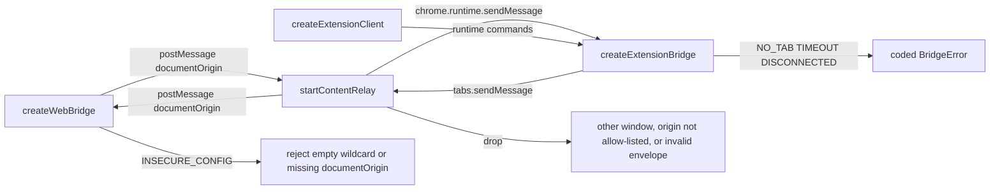
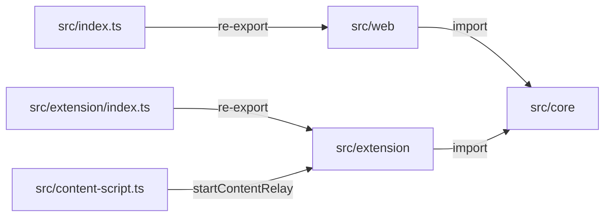
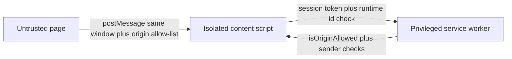

<!-- sdd-generated-metadata
doc_kind: standing-doc
generated_from: architecture@0.3.0
generated_by: cursor
approved_by: pending
updated_at: 2026-09-16T10:06:00Z
validation_status: pass
-->

# @webex/web-extension-bridge architecture

Canonical package-wide architecture. This document owns facts that span the three modules in this SDD root. Link to the owning module spec or native contract instead of duplicating owner-local detail.

Related context: [specification registry](specs/README.md) ·
[package agent instructions](../AGENTS.md)

This SDD root is the npm package only. Sibling `@webex/*` packages are out of scope.

## Applicability

| Condition ID                         | Status      | Evidence or reason | Owned section                       |
| ------------------------------------ | ----------- | ------------------ | ----------------------------------- |
| `repo.owns_datastore`                | N/A         | No database, ORM, or schema files | Repository data and schema          |
| `repo.holds_client_state`            | Applicable  | Connections, pending requests, session tokens in web and extension | Client state model                  |
| `repo.components_interact`           | Applicable  | core imported by web and extension; envelope hops | Dependency and interaction topology |
| `repo.domain_data_across_components` | Applicable  | Envelope, session, connection, buffered push shared across hops | Object and data ownership           |
| `repo.caches_data`                   | Applicable  | Seen-id LRU/TTL; FR8 session buffer | Caching catalog                     |
| `repo.observability_convention`      | Applicable  | Metadata-only logger and in-memory counters | Observability patterns              |
| `repo.deploys_to_infra`              | N/A         | Published library; no Docker/k8s | Runtime and infrastructure          |
| `repo.shared_base_libs`              | N/A         | Zero runtime dependencies | Shared and base libraries           |
| `repo.is_monorepo`                   | N/A         | This SDD root is one package with one build | Package map and dependencies        |
| `repo.multi_platform`                | Applicable  | Page, isolated content script, MV3 worker/UI | Platform matrix                     |
| `repo.published_package`             | Applicable  | `package.json` name and exports | Release and versioning              |
| `repo.embedded_in_host`              | Applicable  | Embedded in a host page and a host MV3 extension | Host integration and theming        |
| `repo.exposes_commands_or_artifacts` | Applicable  | `package.json` scripts and `dist/` | Commands and generated artifacts    |
| `repo.cross_repo_deps_material`      | N/A         | No runtime `@webex/*` imports | Cross-repository topology           |
| `repo.security_arch_warranted`       | Applicable  | Page/extension trust boundary; `SECURITY.md` | Security architecture               |

## Design overview

A web page and a Chrome extension run in different execution contexts with no direct communication path. A web page cannot call `chrome.runtime`, and an MV3 service worker cannot reach a page's JavaScript heap. This package owns that channel as a zero-runtime-dependency TypeScript SDK.

Three execution worlds cooperate over one envelope:

1. Page world — `createWebBridge` posts envelopes with `window.postMessage` and a concrete `targetOrigin`.
2. Isolated content-script world — `startContentRelay` (or the `./content-script` side-effect entry) is the only **page-to-worker** relay. It mints the session token and refuses page-originated `REQUEST` envelopes. Popup, options, and side-panel UIs talk to the worker through `createExtensionClient` (`chrome.runtime.sendMessage`), not through the content script.
3. Extension privileged world — `createExtensionBridge` in the service worker validates senders and origins, rate-limits, buffers FR8 pushes, and answers `createExtensionClient` proxies from popup/options/side panel.

`src/core` is env-agnostic: no `window`, no `chrome`. Adapters in `src/web` and `src/extension` import it.

Intake `WEB-EXTENSION-BRIDGE-INTAKE-SPEC.md` (JS SDK repo root) described unscoped name `web-extension-bridge` and layout-shaped export aliases. Code and `package.json` win: scoped name, exports `.` / `./extension` / `./content-script` / `./package`. A secure, framework-agnostic bridge between a web application and a Chromium MV3 extension.

## Resource inventory and responsibilities

| Resource | Kind   | Responsibility | Owner | Source | Detailed specification |
| -------- | ------ | -------------- | ----- | ------ | ---------------------- |
| core     | module | Protocol, validation, ids, correlation, rate limit, errors, logger | Webex JS SDK | `src/core` | `src/core/docs/README.md` |
| web      | module | Page `createWebBridge` adapter | Webex JS SDK | `src/web` | `src/web/docs/README.md` |
| extension | module | Content relay, background bridge, UI client, content-script entry | Webex JS SDK | `src/extension` plus `src/content-script.ts` | `src/extension/docs/README.md` |

## Interaction and execution flows

FR1: the web application sends a message to the Chrome extension addressed by a topic string. FR2: the extension fetches a value from the web application on demand. FR6: extension UI surfaces use FR1/FR2 results without duplicating transport. FR8: push messages received while no extension UI is open are retained in a bounded buffer.

| From | To | Interaction or transport | Purpose | Failure or compatibility behavior |
| ---- | -- | ------------------------ | ------- | --------------------------------- |
| web | extension content relay | `window.postMessage` with `targetOrigin = documentOrigin` | FR1 push, handshake, FR2/FR3 response | Drop if `event.source` is not this window, origin not allow-listed, or envelope invalid |
| content relay | background | `chrome.runtime.sendMessage` | Forward validated page envelopes; session-bound | After three consecutive notify failures the relay stops treating the worker as connected |
| background | content relay | `chrome.tabs.sendMessage` | FR2 `REQUEST` only | Missing tab → `NO_TAB`; disconnected peer → `DISCONNECTED` |
| extension UI | background | internal `__webexBridgeClient` commands | FR6 proxy without duplicating transport | Worker gone → raw transport `Error` (not a coded `BridgeError`) |
| all hops | core | import | Shared envelope, validation, limits | Protocol mismatch → counted drop `VERSION_MISMATCH`; `PROTOCOL_MISMATCH` is declared but not thrown |

## Dependency topology

| Dependency | Type | Used by | Purpose | Version, failure, or fallback policy |
| ---------- | ---- | ------- | ------- | ------------------------------------ |
| `src/core` | Internal | web, extension | Protocol and safety primitives | Same package; no version skew inside one install |
| `window.postMessage` | External | web, content relay | Same-document hop | Fail closed: never `'*'` |
| `chrome.runtime` / `chrome.tabs` / `chrome.storage.session` | External | extension | Privileged hop and FR8 buffer | Missing `storage.session` throws at construction; `tabs` permission is not required for the APIs used |
| `@webex/legacy-tools` | External | build/test only | Compile and mocha runner | devDependency; not shipped |

No runtime dependency cycles. Page never imports `chrome`. Worker never posts to `window`.

## Public and consumer surfaces

| Surface | Type | Owner | Consumers | Compatibility policy | Source |
| ------- | ---- | ----- | --------- | -------------------- | ------ |
| `@webex/web-extension-bridge` | SDK | web | Host web applications | Semver of the npm package; protocol version is independent (`PROTOCOL_VERSION`) | `package.json` export `.` |
| `@webex/web-extension-bridge/extension` | SDK | extension | Service worker, popup, options, side panel, optional content-script API | Same package semver | `package.json` export `./extension` |
| `@webex/web-extension-bridge/content-script` | SDK | extension | MV3 `content_scripts[].js` | Side-effect start of default-channel relay | `package.json` export `./content-script` |
| Envelope | Event | core | All hops | Additive optional fields need a protocol minor bump; other shape changes a major bump | `src/core/protocol.ts` |

Layout aliases `/web` and `/extension/{background,client,content}` are not published. Those three, plus `./package`, are the whole published surface. Test seams `createWebBridgeWith`, `createExtensionBridgeWith`, `createExtensionClientWith`, and `createContentRelay` are not on any published specifier.

## Client state model

| State or slice | Owner | Transition triggers | Persistence or reset boundary |
| -------------- | ----- | ------------------- | ----------------------------- |
| Page connection + pending handlers | web | HELLO/HELLO_ACK/BYE, `destroy()` | In-memory; lost on navigation |
| Relay session token | extension content | Minted at relay start | Isolated world; new token per load |
| Tab connections + FR8 buffer | extension background | HELLO, tab removed/updated, buffer TTL/bytes/entries | `chrome.storage.session` via `sessionStore.ts`; cleared when the worker's session store is cleared |
| Extension UI proxy listeners | extension client | subscribe / worker push events | In-memory for the lifetime of the popup/options/side panel |

## Cross-cutting architecture

### Security

- Trust boundaries and identity flow: page is untrusted to the extension; extension is untrusted to the page. Session token is minted in the isolated world. Worker re-checks `sender.id`, tab presence, and `sender.origin` against `allowedOrigins`.
- Sensitive surfaces and data classes: envelopes, session tokens, payloads, handler errors. Policy: [SECURITY.md](../SECURITY.md).
- Encryption and secret boundaries: no HMAC (README accepted risk). Ids use CSPRNG only (`src/core/ids.ts`). Logger is metadata-only.

### Observability and operations

- Logging and correlation: `createLogger` records metadata, never payloads or session tokens (`src/core/logger.ts`). Envelope `id` / `correlationId` stay on the wire, not in default logs.
- Metrics, traces, and audit signals: in-memory `Counters` (`src/core/counters.ts`); `getCounters()` on page is sync, on the worker is async. No network telemetry.
- Ownership and operational entry points: unit tests and SECURITY.md reporting channels.

### Quality attributes

- Zero runtime dependencies (`package.json`).
- Payload default 256 KiB, ceiling 1 MiB (`src/core/constants.ts`).
- Default request timeout 5000 ms, clamped `[100, 30000]`.
- Handshake and push are best-effort; FR8 buffer is bounded by entries, TTL, and max bytes.

## Dependency and interaction topology

| From | To | Kind | Purpose | Ordering or failure boundary |
| ---- | -- | ---- | ------- | ---------------------------- |
| web | core | Import | Validate and build envelopes | Construction fails closed on insecure config |
| extension | core | Import | Same | Same |
| page | relay | Event | Same-window postMessage | Drop `NOT_SAME_WINDOW` |
| relay | worker | Call | runtime message | Origin/session/kind checks |

## Object and data ownership

| Object or state | System of record | May write | May read | Movement or lifecycle |
| --------------- | ---------------- | --------- | -------- | --------------------- |
| Envelope | Producer hop using `createEnvelope` | The hop that sends it | Peer hop after validation | Dropped on any `DropReason`; never partially applied |
| Session token | content relay | relay at start | page and worker as envelope `session` | Bound to this page load |
| Connection | worker `sessionStore` | worker on HELLO | `listConnections`, client proxy | Removed on tab close/navigate/BYE |
| BufferedMessage | worker FR8 buffer | worker when no UI listener | `getBufferedMessages` | Evicted by maxEntries, maxBytes, or ttlMs |

## Caching catalog

| Cache | Owner | Backend | Contents | TTL or bound | Invalidation trigger | Failure behavior |
| ----- | ----- | ------- | -------- | ------------ | -------------------- | ---------------- |
| SeenIds | core, used by web and relay | in-memory LRU | envelope ids | 500 entries / 60 s | TTL or cap | Duplicate id dropped as `REPLAYED_ID` |
| FR8 buffer | extension background | `chrome.storage.session` | recent pushes | default 200 entries / 30 min / 4 MiB | TTL / maxEntries / maxBytes eviction only; `subscribe` does not drain | Construction throws if session storage missing |
| Rate limiter buckets | core RateLimiter | in-memory | tokens per (tab, topic) and aggregate per tab | 256 topic keys / 64 aggregate keys | TTL / key-cap eviction; tab gone does not reset `pushLimiter` | Excess push dropped / `RATE_LIMITED` |

## Observability patterns

| Signal | Convention or required fields | Propagation or naming rule | Primary evidence |
| ------ | ----------------------------- | -------------------------- | ---------------- |
| Logs | Metadata only; debug flag | No payload/session fields | `src/core/logger.ts` |
| Metrics | Flat counter names | `getCounters()` | `src/core/counters.ts` |
| Traces | N/A | SDK performs no distributed tracing | none |
| Audit | Security tests T1–T14 | Threat ids in test titles | `test/unit/spec/security/threats.ts` |

## Platform matrix

| Platform | Shared versus platform-specific boundary | Entry or build | Support and compatibility constraints |
| -------- | ---------------------------------------- | -------------- | ------------------------------------- |
| Web page | Uses `src/web`; imports core | `src/index.ts` | `createWebBridge` touches `window` only when called |
| Isolated content script | `src/extension/content.ts` | `src/content-script.ts` or `startContentRelay` | `run_at: document_start` in comments |
| MV3 service worker | `src/extension/background.ts` | `@webex/web-extension-bridge/extension` | Chromium MV3; `storage` permission |
| Extension UI | `src/extension/client.ts` | same `/extension` specifier | Page is ephemeral; worker owns the bridge |
| Node typecheck | no platform APIs at import | `typecheck` | Root entry must stay import-safe |

## Release and versioning

| Artifact | Publish target | Versioning rule | Deprecation window | Changelog or migration obligation |
| -------- | -------------- | --------------- | ------------------ | --------------------------------- |
| `@webex/web-extension-bridge` | npm (`deploy:npm`) | Package semver; wire `PROTOCOL_VERSION` independent | README: both halves must share protocol version | Product README; no package CHANGELOG.md |

## Host integration and theming

| Host or integration | Mount or entry contract | Required providers or peers | Theming and accessibility constraints |
| ------------------- | ----------------------- | --------------------------- | ------------------------------------- |
| Host web app | `createWebBridge({allowedOrigins})` | Matching channel with the extension | No UI/theming in this SDK |
| Host MV3 extension | `createExtensionBridge({allowedOrigins})` plus content script | Manifest `matches` plus runtime allow-list; `"permissions": ["storage"]` | No UI widgets shipped |

## Commands and generated artifacts

| Command or artifact | Owner | Inputs | Output or side effect | Compatibility boundary |
| ------------------- | ----- | ------ | --------------------- | ---------------------- |
| `build:src` | package | `src/` | `dist/` plus declaration `dist/types` | published `files` include `dist` |
| `build:samples` | package | `scripts/build-samples.mjs` | JS SDK `docs/samples/web-extension-bridge*` vendor bundles | sample manifest is generated and gitignored |
| `test:unit` | package | `test/unit` | mocha results | no network |
| `dist/content-script.js` | content-script entry | `src/content-script.ts` | listed as `sideEffects` | importing starts the relay in page+chrome |

## Security architecture

Describe trust boundaries, identity and token flow, encryption boundaries, and the architectural controls that constrain resource interaction. Link the authoritative security policy instead of copying governance requirements.

Threat model T1–T14 covers origin allow-listing, wildcard postMessage, unguessable ids, and redacted wire errors. Controls verified in code:

- Exact-origin allow-list; wildcards rejected (`src/web/config.ts`, background `resolveAllowedOrigins`)
- `event.source === window` (page and relay)
- Isolated-world relay; page cannot reach `chrome` through it (`src/extension/content.ts`)
- No `postMessage(..., '*')` (`eslint-security-rules.js`)
- Reserved keys `__proto__`, `constructor`, `prototype` rejected
- Wire errors redacted (`toWireError`)
- Report vulns per [SECURITY.md](../SECURITY.md) (Cisco PSIRT)

Accepted risks remain those documented in README §6 and SECURITY.md out-of-scope: host-page XSS, other extensions, best-effort push.

## Domain language

| Term | Package-specific meaning | Authoritative source |
| ---- | ------------------------ | -------------------- |
| Envelope | The single message shape that crosses every hop | `src/core/protocol.ts` |
| Channel | Namespace so multiple bridges can share a page; default `webex-bridge` | `src/core/constants.ts` |
| Session | Isolated-world token binding page and relay for this load | `src/extension/content.ts` |
| Topic | Routing key matching `^[a-zA-Z0-9._:-]{1,128}$` | `src/core/constants.ts` |
| BridgeError | Coded error surfaced to callers; wire form is `{code, message}` | `src/core/errors.ts` |
| FR1 / FR2 | Push page→extension vs on-demand pull extension→page | `README.md` |

## References and maintenance

- Decisions: [adr/](adr/)
- Instantiated specifications and routing: [specs/README.md](specs/README.md)
- Product README: [README.md](../README.md)
- Security policy: [SECURITY.md](../SECURITY.md)
- Update this document in the same change that alters package boundaries, resource ownership, cross-module interaction, or cross-cutting architecture.
