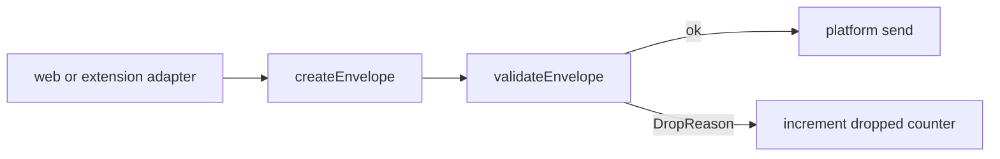
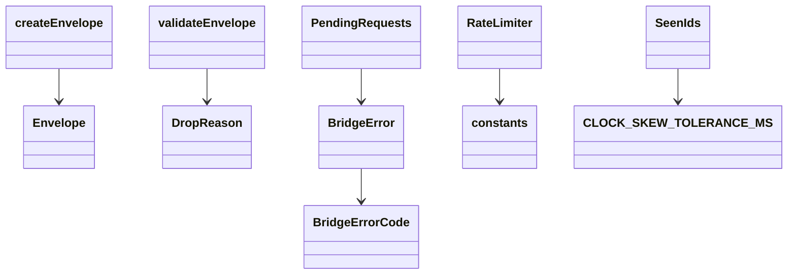

<!-- sdd-generated-metadata
doc_kind: module-spec
generated_from: module-spec@0.3.0
generated_by: cursor
approved_by: pending
updated_at: 2026-09-16T10:06:00Z
validation_status: not-run
-->

# core

This source-local document at `src/core/docs/README.md` owns the stable specification for **core**. Ground every claim in package evidence and link to the [package architecture](../../../docs/architecture.md) instead of repeating broader facts.

Related context: [documentation index](../../../docs/index.md) · [package agent instructions](../../../AGENTS.md)

## Metadata

| Field         | Value |
| ------------- | ----- |
| Owner         | Webex JS SDK |
| Source path   | `src/core` |
| Resource kind | module |
| Status        | Draft |
| Last verified | 2026-09-16 at `9745d5577c` |
| Module id     | `src/core` |
| Parent spec   | — |
| Doc kind      | Module spec |
| Coverage score | 88% assessed 2026-09-16 |
| Validation status | not-run |

## Applicability

| Condition ID                         | Status      | Evidence or reason | Owned section                 |
| ------------------------------------ | ----------- | ------------------ | ----------------------------- |
| `module.has_tiers`                   | N/A         | No tier policy in this package | Tier                          |
| `module.has_ui`                      | N/A         | No UI files | UI use-case flow              |
| `module.crosses_service_boundaries`  | N/A         | No HTTP/gRPC; env-agnostic | Cross-boundary use-case flow  |
| `module.holds_client_state`          | N/A         | Helpers only; adapters own session/connection state | Client state model            |
| `module.enforces_domain_rules`       | Applicable  | `validate.ts`, `serialize.ts`, `limits.ts` | Business rules and invariants |
| `module.is_concurrent_async`         | Applicable  | `correlation.ts`, `rateLimit.ts` | Concurrency and reactive flow |
| `module.owns_persistence`            | N/A         | No datastore | Data, schema, and migration   |
| `module.stateful_transitions`        | N/A         | No connection state machine here | State machine                 |
| `module.exposes_wire_protocol`       | Applicable  | `protocol.ts` Envelope | Protocol and wire format      |
| `module.ui_multi_screen`             | N/A         | No UI | UI flow                       |
| `module.large_data_model`            | N/A         | Envelope plus helpers only | Data model                    |
| `module.returns_caller_errors`       | Applicable  | `BridgeError` / `BRIDGE_ERROR_CODES` | Caller-visible failure modes  |
| `module.module_specific_conventions` | Applicable  | Null-prototype records; redacted wire errors | Module-specific rules         |
| `module.published_package`           | Applicable  | Re-exported from `src/index.ts` | Export stability              |
| `module.embedded_in_host`            | N/A         | Not a host mount; adapters embed | Host integration and theming  |
| `module.has_design_tradeoff`         | Applicable  | CSPRNG fail-closed; no HMAC | Key design trade-off          |
| `module.has_submodules`              | N/A         | Computed false | Sub-modules                   |

## Evidence register

| Evidence | What it establishes |
| -------- | ------------------- |
| `src/core/protocol.ts` | Envelope kinds, sources, `createEnvelope` |
| `src/core/validate.ts` | Per-hop `DropReason` codes |
| `src/core/errors.ts` | `BridgeErrorCode` list and wire redaction |
| `src/core/constants.ts` | Protocol version, patterns, limits |
| `src/core/ids.ts` | CSPRNG ids; `CRYPTO_UNAVAILABLE` |
| `test/unit/spec/core/` | Unit coverage of protocol, validate, errors, rateLimit, replay, correlation |
| `test/unit/spec/security/threats.ts` | T1–T14 threat tests that depend on core checks |

## Purpose and boundary

- Responsibility: Own the env-agnostic protocol and safety primitives used by every hop.
- In scope: envelope shape, validation, ids, correlation map, rate limiting, replay cache, JSON/serialize/limits, logger, counters, coded errors.
- Out of scope: `window.postMessage`, `chrome.*`, published factory functions.
- Consumers: `src/web`, `src/extension`.

## Structure and key files

| Path | Responsibility |
| ---- | -------------- |
| `src/core/index.ts` | Re-exports every core module |
| `src/core/protocol.ts` | Envelope kinds/sources and `createEnvelope` |
| `src/core/validate.ts` | Per-hop envelope validation |
| `src/core/errors.ts` | `BridgeError`, codes, `toWireError` / `fromWireError` |
| `src/core/correlation.ts` | Single-use in-flight map with timeout/abort |
| `src/core/rateLimit.ts` | Token buckets and in-flight limiter |
| `src/core/replay.ts` | Seen-id LRU/TTL plus clock-skew helper |
| `src/core/ids.ts` | CSPRNG id factory |
| `src/core/logger.ts` | Metadata-only logger |
| `src/core/counters.ts` | In-memory telemetry names |
| `src/core/json.ts` / `serialize.ts` / `limits.ts` / `listeners.ts` / `constants.ts` | JSON walk, topic/payload checks, clamps, listener set, constants |

## Public surface

| Surface | Consumer | Compatibility commitment | Source |
| ------- | -------- | ------------------------ | ------ |
| `BridgeError`, `BRIDGE_ERROR_CODES`, `isBridgeError` | Page and extension callers | Codes must not change meaning within a major version | `src/core/errors.ts` via `src/index.ts` |
| `PROTOCOL_VERSION`, `DEFAULT_CHANNEL` | Both sides of a bridge | Independent of npm semver; mismatch is refused | `src/core/constants.ts` via `src/index.ts` |
| `EnvelopeKind`, `EnvelopeSource` | Callers that inspect kinds | Frozen for protocol v1 | `src/core/protocol.ts` |
| `bridge-envelope` contract | web and extension modules | Internal; exact fields in `Envelope` | `src/core/protocol.ts` |

## Dependencies

| Dependency | Why it is required | Failure behavior |
| ---------- | ------------------ | ---------------- |
| Ambient `globalThis.crypto` | Unguessable ids | `BridgeError` `CRYPTO_UNAVAILABLE` |
| No runtime npm deps | NFR1 | Package has no `dependencies` |

## Requirements

| ID | WHAT | WHY | Source evidence | Test or example evidence | Assumptions or gaps | Confidence |
| -- | ---- | --- | --------------- | ------------------------ | ------------------- | ---------- |
| `CORE-001` | Every hop uses one Envelope with `__webexBridge`, `v`, `channel`, `kind`, `source`, `topic`, `id`, `correlationId`, `session`, optional `payload`/`ok`/`error`, and `ts` | One audited channel instead of ad-hoc postMessage | `src/core/protocol.ts` | `test/unit/spec/core/protocol.ts` | none | Present |
| `CORE-002` | `createEnvelope` builds a null-prototype object | Prototype pollution must not ride the wire | `src/core/protocol.ts` | `test/unit/spec/core/protocol.ts` | none | Present |
| `CORE-003` | Unknown, mismatched, replayed, oversized, or reserved-key envelopes are dropped with a `DropReason` | Countable drops without logging payloads | `src/core/validate.ts` | `test/unit/spec/core/validate.ts` | none | Present |
| `CORE-004` | Public `BridgeErrorCode` values are exactly the thirteen codes in `BRIDGE_ERROR_CODES` | Callers and wire errors share one taxonomy | `src/core/errors.ts` | `test/unit/spec/core/errors.ts` | none | Present |
| `CORE-005` | `toWireError` emits fixed redacted messages, never handler/payload/stack text | T6: no leak across the trust boundary | `src/core/errors.ts` | `test/unit/spec/core/errors.ts` | none | Present |
| `CORE-006` | Ids require CSPRNG; there is no `Math.random` fallback | T3: correlation ids must be unguessable | `src/core/ids.ts` | `test/unit/spec/core/ids.ts` | none | Present |
| `CORE-007` | Rate limiter bounds per-(tab,topic) and aggregate-per-tab pushes; numeric options outside documented min/max are rejected rather than clamped | Silent clamp would disable limiting | `src/core/rateLimit.ts`, `src/core/limits.ts`, `src/core/constants.ts` | `test/unit/spec/core/rateLimit.ts` | none | Present |

## Design overview

Core is a library of pure-ish helpers. Adapters own platform listeners. `PendingRequests` is a single-use map: a correlation id settles once. `SeenIds` is a bounded cache, not durable storage. Logger never accepts payload fields.

## Data flow and sequence coverage

| Operation group | Entry and outcome | Diagram or evidence | Failure and recovery coverage |
| --------------- | ----------------- | ------------------- | ----------------------------- |
| Envelope build | `createEnvelope` → null-prototype Envelope | `src/core/protocol.ts` | Missing required fields fail at TypeScript / caller |
| Envelope validate | `validateEnvelope` → Envelope or DropReason | `src/core/validate.ts` | Each DropReason is explicit |
| Request correlate | `PendingRequests` timeout/abort/settleAll | `src/core/correlation.ts` | `TIMEOUT`, `ABORTED`, `DISCONNECTED` |
| Rate limit | token bucket take or reject | `src/core/rateLimit.ts` | `RATE_LIMITED` |

## Class and component relationships

## Use cases and flows

| Use case | Actor or caller | Primary steps and outcome | Failure or boundary behavior | Evidence |
| -------- | --------------- | ------------------------- | ---------------------------- | -------- |
| `UC-001` | Adapter sending | Build envelope, validate locally, send | Invalid topic/payload throws before send (`assertTopic` / `assertPayload`) | `src/core/serialize.ts` |
| `UC-002` | Adapter receiving | validateEnvelope with allowed kinds and session | Drop with DropReason; do not dispatch | `src/core/validate.ts` |
| `UC-003` | Extension request | PendingRequests tracks one correlation id | Timeout/abort/disconnect settle once | `src/core/correlation.ts` |

## Business rules and invariants

| ID | Invariant | WHY | Enforcement source | Test evidence |
| -- | --------- | --- | ------------------ | ------------- |
| `INV-001` | `PROTOCOL_VERSION` is 1 and is carried on every envelope as `v` | Refuse incompatible peers rather than best-effort decode | `src/core/constants.ts` | `test/unit/spec/core/protocol.ts` |
| `INV-002` | Topics and channels match `^[a-zA-Z0-9._:-]{1,128}$` | Never confuse a topic for a path or selector | `src/core/constants.ts` | `test/unit/spec/core/serialize.ts` |
| `INV-003` | Reserved keys `__proto__`, `constructor`, `prototype` are rejected | Prototype pollution | `src/core/constants.ts`, `src/core/validate.ts` | `test/unit/spec/core/validate.ts` |
| `INV-004` | Default max payload 262144 bytes, ceiling 1048576 | Unbounded JSON is a DoS path | `src/core/constants.ts` | `test/unit/spec/core/limits.ts` |

## Concurrency and reactive flow

- Execution model: single-threaded event loop; timers in `PendingRequests` and rate-limit refill
- Ordering guarantees: one settle per correlation id
- Idempotency and retry: replayed ids dropped; adapters do not auto-retry push
- Shared-state protection: maps are module-local; counters use null-prototype records
- Blocking restrictions: handlers run in adapters; core must not perform IO

## Protocol and wire format

| Message or frame | Version | Producer or serializer | Consumer or parser | Compatibility and ordering rule |
| ---------------- | ------- | ---------------------- | ------------------ | ------------------------------- |
| Envelope | `PROTOCOL_VERSION` 1 | `createEnvelope` | `validateEnvelope` | Additive optional fields need a minor protocol bump; other changes a major bump |
| EnvelopeKind | HELLO, HELLO_ACK, PUSH, REQUEST, RESPONSE, BYE | adapters | adapters via allowed-kind lists | Page must not originate REQUEST (enforced in content relay, not core) |
| WireError | same | `toWireError` | `fromWireError` | Only `{code, message}` with redacted message |

## Caller-visible failure modes

| Condition | Signal or result | Caller behavior | Retry or recovery | Evidence |
| --------- | ---------------- | --------------- | ----------------- | -------- |
| No CSPRNG | `CRYPTO_UNAVAILABLE` | Do not start the bridge | Provide Web Crypto | `src/core/ids.ts` |
| Invalid topic/payload | `INVALID_TOPIC` / `INVALID_PAYLOAD` | Fix input; do not send | No retry of invalid data | `src/core/serialize.ts` |
| Timeout | `TIMEOUT` | Caller may retry a new request | New id | `src/core/correlation.ts` |
| Abort | `ABORTED` | Honor AbortSignal | Do not reuse correlation id | `src/core/correlation.ts` |
| Rate limit | `RATE_LIMITED` | Back off | Token refill | `src/core/rateLimit.ts` |

Codes also defined here and thrown by adapters: `NOT_CONNECTED`, `NO_TAB`, `NO_HANDLER`, `DISCONNECTED`, `HANDLER_ERROR`, `PROTOCOL_MISMATCH`, `INSECURE_CONFIG`. Public BridgeError codes matching `BRIDGE_ERROR_CODES`.

## Pitfalls and constraints

- Do not add `Math.random` as an id fallback.
- Do not log payloads or session tokens through `createLogger`.
- Do not silently clamp rate/buffer integers that are out of range; `requireBoundedInteger` fails closed.
- Intake Appendix A is stale where it omits codes or fields that exist in `errors.ts` / `types.ts`.

## Module-specific rules

- Do: create records with null prototypes (`json.ts`, `protocol.ts`, `counters.ts`).
- Do not: pass unvalidated unknown objects as envelopes.
- Do: keep `BRIDGE_ERROR_CODES` and `DropReason` as the only drop/error vocabularies.

## Export stability

| Export or entry point | Consumer | Stability | Versioning and deprecation rule | Declaration or API report |
| --------------------- | -------- | --------- | ------------------------------- | ------------------------- |
| `BridgeError` / codes | npm root specifier | public | Meaning-stable within a major | `src/index.ts` |
| `PROTOCOL_VERSION` | both sides | public | Independent of npm version | `src/core/constants.ts` via `src/index.ts` |
| Other core helpers | web/extension adapters | internal | Not on `package.json` exports | `src/core/index.ts` |

## Key design trade-off

| Chosen trade-off | Preserved invariant or benefit | Cost or limitation | Decision evidence |
| ---------------- | ------------------------------ | ------------------ | ----------------- |
| CSPRNG or refuse to start | Unguessable ids | Cannot run where Web Crypto is missing | `src/core/ids.ts` |
| No HMAC on envelopes | Simpler protocol; XSS of the host page is accepted as out of scope | A compromised page can send valid envelopes from that origin | `README.md`, `SECURITY.md` |

## Verification

| Requirement or invariant | Test level | Positive evidence | Negative or boundary evidence | Gap |
| ------------------------ | ---------- | ----------------- | ----------------------------- | --- |
| `CORE-001` | Unit | `test/unit/spec/core/protocol.ts` | reserved-key / version tests in `validate.ts` specs | none |
| `CORE-004` | Unit | `test/unit/spec/core/errors.ts` | unknown code rejected | none |
| `CORE-006` | Unit | `test/unit/spec/core/ids.ts` | missing crypto throws | none |
| `CORE-007` | Unit | `test/unit/spec/core/rateLimit.ts` | over-budget rejected | none |
