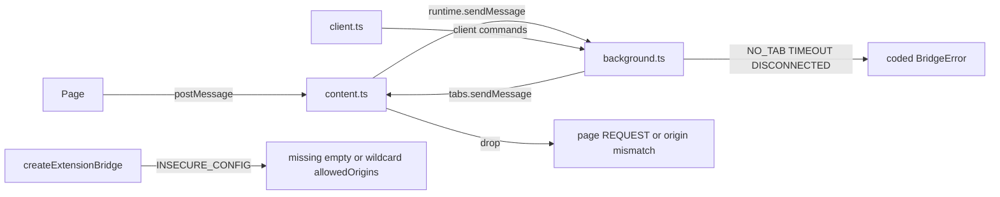
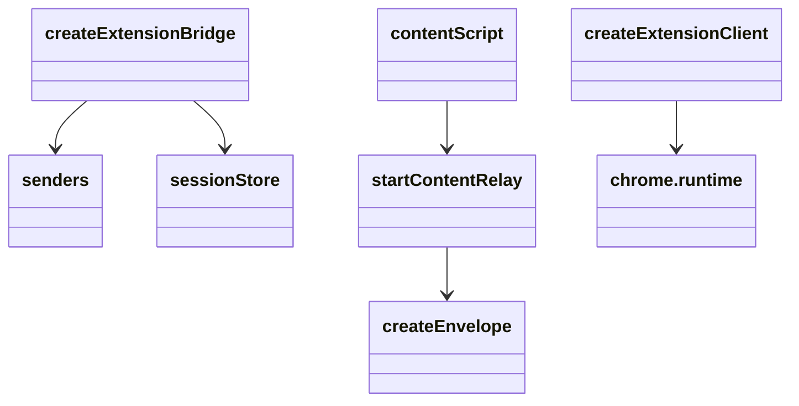
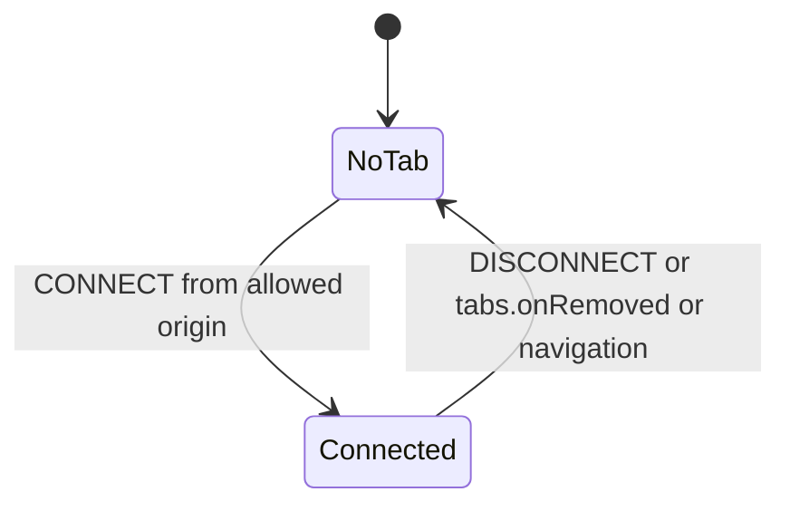

<!-- sdd-generated-metadata
doc_kind: module-spec
generated_from: module-spec@0.3.0
generated_by: cursor
approved_by: pending
updated_at: 2026-09-16T10:06:00Z
validation_status: pass
-->

# extension

This source-local document at `src/extension/docs/README.md` owns the stable specification for **extension**. Ground every claim in package evidence and link to the [package architecture](../../../docs/architecture.md) instead of repeating broader facts.

Related context: [documentation index](../../../docs/index.md) · [package agent instructions](../../../AGENTS.md)

## Metadata

| Field         | Value |
| ------------- | ----- |
| Owner         | Webex JS SDK |
| Source path   | `src/extension` |
| Resource kind | module |
| Status        | Draft |
| Last verified | 2026-09-16 at `9745d5577c` |
| Module id     | `src/extension` |
| Parent spec   | — |
| Doc kind      | Module spec |
| Coverage score | 81% assessed 2026-09-16 |
| Validation status | pass |

## Applicability

| Condition ID                         | Status      | Evidence or reason | Owned section                 |
| ------------------------------------ | ----------- | ------------------ | ----------------------------- |
| `module.has_tiers`                   | N/A         | No tier policy | Tier |
| `module.has_ui`                      | N/A         | Client proxies a popup; this package does not render UI | UI use-case flow |
| `module.crosses_service_boundaries`  | N/A         | chrome.runtime IPC, not HTTP services | Cross-boundary use-case flow |
| `module.holds_client_state`          | Applicable  | connections, client listeners | Client state model |
| `module.enforces_domain_rules`       | Applicable  | sender and origin checks | Business rules and invariants |
| `module.is_concurrent_async`         | Applicable  | async request, session store | Concurrency and reactive flow |
| `module.owns_persistence`            | Applicable  | `chrome.storage.session` | Data, schema, and migration |
| `module.stateful_transitions`        | Applicable  | tab connected / gone | State machine |
| `module.exposes_wire_protocol`       | Applicable  | Envelope plus internal IPC wrappers | Protocol and wire format |
| `module.ui_multi_screen`             | N/A         | No screens in this SDK | UI flow |
| `module.large_data_model`            | N/A         | Connection and buffer records only | Data model |
| `module.returns_caller_errors`       | Applicable  | `BridgeError` on request | Caller-visible failure modes |
| `module.module_specific_conventions` | Applicable  | Isolated world; unpublished test seams | Module-specific rules |
| `module.published_package`           | Applicable  | package.json exports for extension and content-script | Export stability |
| `module.embedded_in_host`            | Applicable  | Host MV3 extension | Host integration and theming |
| `module.has_design_tradeoff`         | Applicable  | No tabs permission; required allow-list | Key design trade-off |
| `module.has_submodules`              | N/A         | content/background/client are files in one module, not SDD child modules | Sub-modules |

## Evidence register

| Evidence | What it establishes |
| -------- | ------------------- |
| `src/extension/index.ts` | Published facade and excluded test seams |
| `src/extension/content.ts` | Isolated-world relay; page must not originate REQUEST |
| `src/extension/background.ts` | Worker bridge, required origins, buffer, rate limit |
| `src/extension/client.ts` | Popup/options/side-panel proxy |
| `src/extension/senders.ts` | `isOwnExtension`, `isFromContentScript`, `isOriginAllowed` |
| `src/extension/sessionStore.ts` | Session storage accessor |
| `src/extension/platform.ts` | `ChromeLike`; storage required |
| `src/content-script.ts` | Side-effect default-channel start |
| `test/unit/spec/extension/` | background, client, content, senders, sessionStore |
| `test/unit/spec/security/threats.ts` | T1–T14 |
| `test/unit/spec/integration/bridge.ts` | In-process page/relay/worker path |

## Purpose and boundary

- Responsibility: Privileged and isolated-world halves of the bridge: relay, worker, UI client, and content-script wiring.
- In scope: `createExtensionBridge`, `createExtensionClient`, `startContentRelay`, sender checks, FR5 tab targeting, FR6 UI proxy, FR8 buffer.
- Out of scope: page `createWebBridge`; unpublished `create*With` / `createContentRelay` factories except as test seams.
- Consumers: MV3 service workers, content scripts, popups, options pages, side panels.

`src/content-script.ts` is not a fourth SDD module. It only calls `startContentRelay()` when `window` and `chrome` both exist.

## Structure and key files

| Path | Responsibility |
| ---- | -------------- |
| `src/extension/index.ts` | Published exports |
| `src/extension/content.ts` | `startContentRelay` / internal `createContentRelay` |
| `src/extension/background.ts` | `createExtensionBridge` |
| `src/extension/client.ts` | `createExtensionClient` |
| `src/extension/messages.ts` | Internal `__webexBridgeRelay` / `__webexBridgeClient` wrappers |
| `src/extension/senders.ts` | Runtime sender checks |
| `src/extension/platform.ts` | Chrome surface used by this package |
| `src/extension/sessionStore.ts` | Serialized session store |
| `src/content-script.ts` | Manifest wiring entry |

## Public surface

| Surface | Consumer | Compatibility commitment | Source |
| ------- | -------- | ------------------------ | ------ |
| `createExtensionBridge` | Service worker | `allowedOrigins` required | `src/extension/background.ts` |
| `createExtensionClient` | Popup / options / side panel | Mirrors worker methods over runtime commands | `src/extension/client.ts` |
| `startContentRelay` | Content script needing a non-default channel | Does not start on import of `/extension` | `src/extension/content.ts` |
| content-script specifier | Manifest `content_scripts[].js` | Side effect starts default channel | `src/content-script.ts` |
| `extension-sdk` / `content-script-entry` | npm | `package.json` exports | `package.json` |

## Dependencies

| Dependency | Why it is required | Failure behavior |
| ---------- | ------------------ | ---------------- |
| `src/core` | Envelope, validation, rate limit, errors | Coded drops and throws |
| `chrome.runtime` | Privileged messages | Sender checks fail closed |
| `chrome.storage.session` | Connections + FR8 buffer | Construction throws; add `"storage"` permission |
| `chrome.tabs.query` / `sendMessage` / `onRemoved` / `onUpdated` | FR5 targeting and lifecycle | Comments: no `tabs` permission required for this query |

## Requirements

| ID | WHAT | WHY | Source evidence | Test or example evidence | Assumptions or gaps | Confidence |
| -- | ---- | --- | --------------- | ------------------------ | ------------------- | ---------- |
| `EXT-001` | Content script is the only **page-to-worker** relay; the page must not reach `chrome` through the SDK. Popup/options/side panel use `createExtensionClient` to the worker. | Page must not reach `chrome` through the SDK | `src/extension/content.ts`, `src/extension/client.ts` | `test/unit/spec/extension/content.ts` | none | Present |
| `EXT-002` | Relay drops page-originated REQUEST kinds | T8: page cannot mint pull requests | `src/extension/content.ts` `ACCEPTED_FROM_PAGE` | `test/unit/spec/security/threats.ts` | none | Present |
| `EXT-003` | Relay accepts page postMessage only from same window and `documentOrigin` | Isolated world still shares the document | `src/extension/content.ts` | `test/unit/spec/extension/content.ts` | none | Present |
| `EXT-004` | Worker `allowedOrigins` is required; missing/empty/wildcard → `INSECURE_CONFIG` | Manifest `matches` is not a sender check | `src/types.ts`, `src/extension/background.ts` | `test/unit/spec/extension/background.ts` | none | Present |
| `EXT-005` | Worker refuses senders that fail `isOwnExtension` / content-script tab / `isOriginAllowed` | Provenance is data, not trust | `src/extension/senders.ts` | `test/unit/spec/extension/senders.ts` | none | Present |
| `EXT-006` | `createExtensionClient` proxies FR1/FR2 results for UI surfaces | FR6 without duplicating transport | `src/extension/client.ts` | `test/unit/spec/extension/client.ts` | none | Present |
| `EXT-007` | Every accepted push is stored in a bounded session buffer (even when UI listeners are active). `subscribe` does not drain it; `getBufferedMessages` is read-only (TTL is a read-time filter). Expired entries leave storage on the next append. Eviction is also maxEntries / maxBytes, except a single newest entry may exceed `maxBytes`. | FR8 | `src/extension/background.ts`, `src/extension/sessionStore.ts` | `test/unit/spec/extension/sessionStore.ts` | none | Present |

## Design overview

One published `/extension` facade rather than layout-shaped subpaths. Bundlers tree-shake unused factories. Internal IPC uses `messages.ts` wrappers, not the public Envelope, for relay-to-worker and client-to-worker commands. Session token is minted in the isolated world via `createIdFactory()` at relay start.

## Data flow and sequence coverage

| Operation group | Entry and outcome | Diagram or evidence | Failure and recovery coverage |
| --------------- | ----------------- | ------------------- | ----------------------------- |
| Relay page→worker | postMessage → runtime.sendMessage | `src/extension/content.ts` | Three consecutive notify failures stop connected signaling |
| Worker request | `request(topic)` → tabs.sendMessage REQUEST | `src/extension/background.ts` | `NO_TAB`, `TIMEOUT`, `NOT_CONNECTED` |
| UI proxy | client command → worker | `src/extension/client.ts` | Worker gone → raw transport `Error` |
| Buffer | every accepted push → session store (non-draining) | `sessionStore.ts` | read-time TTL filter; lazy write-time eviction; maxEntries / maxBytes (one newest entry may exceed `maxBytes`) |

## Class and component relationships

## Use cases and flows

| Use case | Actor or caller | Primary steps and outcome | Failure or boundary behavior | Evidence |
| -------- | --------------- | ------------------------- | ---------------------------- | -------- |
| `UC-001` | Service worker | `subscribe` / `subscribeTopic` receive FR1 | Listener throw isolated | `src/extension/background.ts` |
| `UC-002` | Service worker | `request` FR2 from active or specified tab | `NO_TAB` / `NO_HANDLER` / `TIMEOUT` | `src/types.ts` |
| `UC-003` | Popup | `createExtensionClient().request` | Proxied; popup teardown does not own the bridge | `src/extension/client.ts` |
| `UC-004` | Manifest | load the published content-script specifier | Starts default-channel relay at document_start | `src/content-script.ts` |

The extension MUST be able to target a specific tab for FR2, defaulting to the active tab.

## Client state model

| State or slice | Owner | Initial state | Transition triggers | Reset or persistence boundary |
| -------------- | ----- | ------------- | ------------------- | ----------------------------- |
| Relay session | content relay | minted id | start / destroy | Isolated world; new per load |
| Connections | worker session store | empty | CONNECT / DISCONNECT / tab removed / navigation | `chrome.storage.session` |
| UI listeners | extension client | empty | subscribe | Popup lifetime |

## Business rules and invariants

| ID | Invariant | WHY | Enforcement source | Test evidence |
| -- | --------- | --- | ------------------ | ------------- |
| `INV-001` | Absent `sender.origin` is not allowed | Unknown origin is not an allowed origin | `src/extension/senders.ts` | `test/unit/spec/extension/senders.ts` |
| `INV-002` | Extension pages are distinguished by own id and no `tab` | Hostile page content scripts have a tab | `src/extension/senders.ts` | `test/unit/spec/extension/senders.ts` |
| `INV-003` | Default buffer 200 entries, 1800000 ms TTL, 4 MiB | Session quota is finite | `src/core/constants.ts` | `test/unit/spec/extension/sessionStore.ts` |

## Concurrency and reactive flow

- Execution model: MV3 worker may sleep; relay counts consecutive send failures
- Ordering guarantees: request correlation via envelope ids
- Idempotency and retry: worker waking can cost one rejected send; three failures stop notify
- Shared-state protection: session store serializes connection/buffer writes
- Blocking restrictions: `getCounters` on the worker is async because UI must cross runtime

## Data, schema, and migration discipline

| Store or schema | Owned entities or keys | Source of truth | Migration and compatibility rule |
| --------------- | ---------------------- | --------------- | -------------------------------- |
| `chrome.storage.session` | connections, FR8 buffer | `src/extension/sessionStore.ts` | Session-scoped; no durable migration; missing API throws at construct |

Retention: TTL and maxEntries/maxBytes eviction. Not a product database.

## State machine

Rejected: accepting a content-script message whose origin is not in `allowedOrigins`.

## Protocol and wire format

| Message or frame | Version | Producer or serializer | Consumer or parser | Compatibility and ordering rule |
| ---------------- | ------- | ---------------------- | ------------------ | ------------------------------- |
| Envelope | protocol v1 | page/relay/worker | `validateEnvelope` | Same as core |
| `__webexBridgeRelay` | internal | relay | worker | Not a public export |
| `__webexBridgeClient` | internal | client | worker | Not a public export |

## Caller-visible failure modes

| Condition | Signal or result | Caller behavior | Retry or recovery | Evidence |
| --------- | ---------------- | --------------- | ----------------- | -------- |
| Missing allow-list | `INSECURE_CONFIG` | Pass exact origins | Recreate bridge | `src/types.ts` |
| No tab | `NO_TAB` | Pass `tabId` or activate a tab | Retry | `src/core/errors.ts` |
| Not connected | `NOT_CONNECTED` | Wait for CONNECT | Retry | `src/core/errors.ts` |
| Timeout | `TIMEOUT` | Increase timeout within clamp or retry | New request | `src/types.ts` |
| Missing storage | throw at construct | Add `"storage"` permission | Reload extension | `src/extension/platform.ts` |

## Pitfalls and constraints

- Do not re-export `./content-script` from `/extension`; importing an API must not start a relay.
- Do not publish `createExtensionBridgeWith` — it bypasses sender-verification assumptions.
- Do not treat manifest `matches` as a substitute for `allowedOrigins`.
- Do not document `externally_connectable` or a `tabs` permission as required by this package's source.

## Module-specific rules

- Do: mint the session in the isolated world.
- Do not: accept page REQUEST envelopes at the relay.
- Do: keep `ChromeLike` hand-written; this package does not depend on `@types/chrome`.

## Export stability

| Export or entry point | Consumer | Stability | Versioning and deprecation rule | Declaration or API report |
| --------------------- | -------- | --------- | ------------------------------- | ------------------------- |
| `@webex/web-extension-bridge/extension` | Extension code | public | Package semver | `package.json` |
| `@webex/web-extension-bridge/content-script` | Manifest | public | Side-effect contract | `package.json` |
| `/extension/background` etc. | none | removed | Never published | `src/extension/index.ts` comments |

## Host integration and theming

- Mount or entry contract: service worker calls `createExtensionBridge({allowedOrigins})`; manifest lists compiled content-script
- Required providers, peers, or host versions: Chromium MV3; `"permissions": ["storage"]`; matching `channel`
- Theme and design-token contract: none
- Accessibility and lifecycle obligations: UI pages should use `createExtensionClient` rather than constructing a second worker bridge

## Key design trade-off

| Chosen trade-off | Preserved invariant or benefit | Cost or limitation | Decision evidence |
| ---------------- | ------------------------------ | ------------------ | ----------------- |
| Single `/extension` facade | Consumers are not coupled to source folders | Tree-shaking must drop unused factories | `src/extension/index.ts` |
| No `tabs` permission | Narrower host manifest | Relies on Chrome allowing the specific query/send used | `src/extension/platform.ts` comments |
| Required worker allow-list | No production wildcard | Callers must list exact origins | `src/types.ts` |

## Verification

| Requirement or invariant | Test level | Positive evidence | Negative or boundary evidence | Gap |
| ------------------------ | ---------- | ----------------- | ----------------------------- | --- |
| `EXT-001` | Unit | `test/unit/spec/extension/content.ts` | security threats | none |
| `EXT-004` | Unit | `test/unit/spec/extension/background.ts` | wildcard origins | none |
| `EXT-005` | Unit | `test/unit/spec/extension/senders.ts` | missing origin | none |
| `EXT-006` | Unit | `test/unit/spec/extension/client.ts` | none found beyond unit | no e2e suite |
| End-to-end hops | Integration (in mocha unit runner) | `test/unit/spec/integration/bridge.ts` | fake chrome/window | no browser e2e |
