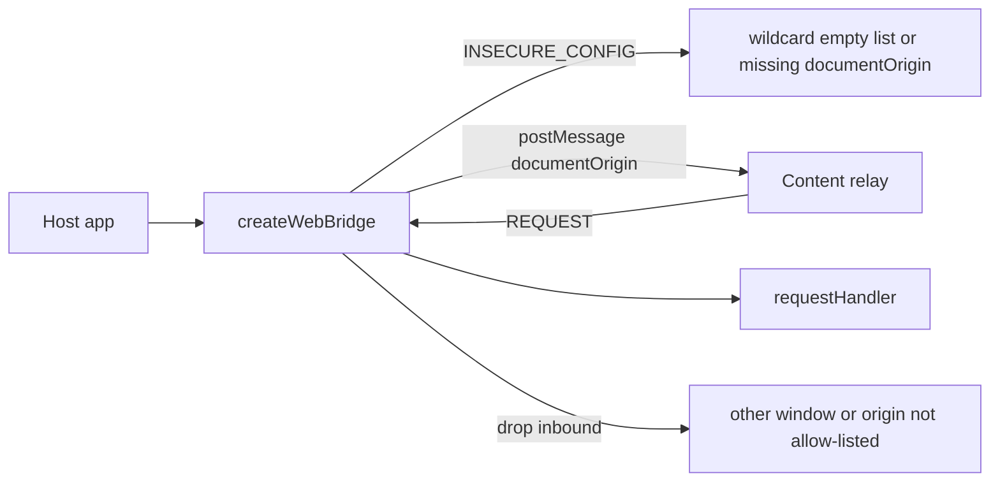
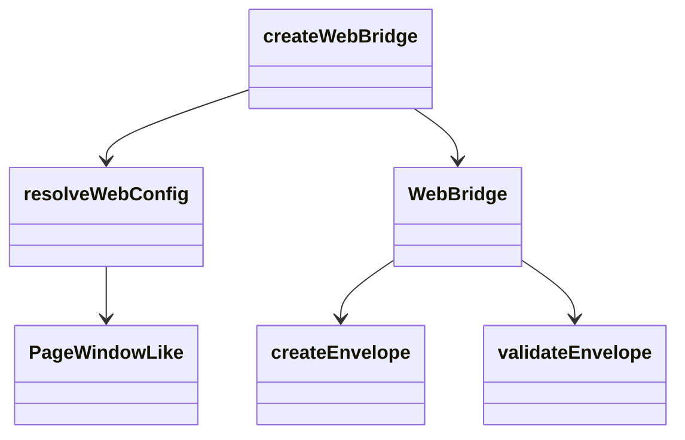
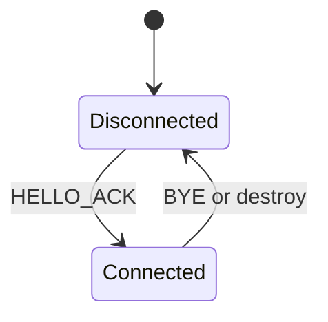

<!-- sdd-generated-metadata
doc_kind: module-spec
generated_from: module-spec@0.3.0
generated_by: cursor
approved_by: pending
updated_at: 2026-09-16T10:06:00Z
validation_status: not-run
-->

# web

This source-local document at `src/web/docs/README.md` owns the stable specification for **web**. Ground every claim in package evidence and link to the [package architecture](../../../docs/architecture.md) instead of repeating broader facts.

Related context: [documentation index](../../../docs/index.md) · [package agent instructions](../../../AGENTS.md)

## Metadata

| Field         | Value |
| ------------- | ----- |
| Owner         | Webex JS SDK |
| Source path   | `src/web` |
| Resource kind | module |
| Status        | Draft |
| Last verified | 2026-09-16 at `9745d5577c` |
| Module id     | `src/web` |
| Parent spec   | — |
| Doc kind      | Module spec |
| Coverage score | 88% assessed 2026-09-16 |
| Validation status | not-run |

## Applicability

| Condition ID                         | Status      | Evidence or reason | Owned section                 |
| ------------------------------------ | ----------- | ------------------ | ----------------------------- |
| `module.has_tiers`                   | N/A         | No tier policy | Tier |
| `module.has_ui`                      | N/A         | No renderer | UI use-case flow |
| `module.crosses_service_boundaries`  | N/A         | Same-window postMessage, not HTTP | Cross-boundary use-case flow |
| `module.holds_client_state`          | Applicable  | connection flag, handlers, listeners | Client state model |
| `module.enforces_domain_rules`       | Applicable  | `resolveWebConfig` fail-closed | Business rules and invariants |
| `module.is_concurrent_async`         | Applicable  | async handlers, handshake | Concurrency and reactive flow |
| `module.owns_persistence`            | N/A         | In-memory only | Data, schema, and migration |
| `module.stateful_transitions`        | Applicable  | connected / disconnected | State machine |
| `module.exposes_wire_protocol`       | Applicable  | Posts Envelope to the relay | Protocol and wire format |
| `module.ui_multi_screen`             | N/A         | No UI | UI flow |
| `module.large_data_model`            | N/A         | WebBridge options/types only | Data model |
| `module.returns_caller_errors`       | Applicable  | throws `BridgeError` | Caller-visible failure modes |
| `module.module_specific_conventions` | Applicable  | Same-window + documentOrigin | Module-specific rules |
| `module.published_package`           | Applicable  | Root npm specifier | Export stability |
| `module.embedded_in_host`            | Applicable  | Runs in host page | Host integration and theming |
| `module.has_design_tradeoff`         | Applicable  | targetOrigin always document origin | Key design trade-off |
| `module.has_submodules`              | N/A         | Computed false | Sub-modules |

## Evidence register

| Evidence | What it establishes |
| -------- | ------------------- |
| `src/web/webBridge.ts` | `createWebBridge` behavior |
| `src/web/config.ts` | Origin allow-list and `targetOrigin` |
| `src/web/pageWindow.ts` | Narrow window type; `postMessage(message, targetOrigin: string)` |
| `src/index.ts` | Published page exports |
| `src/types.ts` | `WebBridge` / `WebBridgeOptions` |
| `test/unit/spec/web/webBridge.ts` | Handshake, publish, handlers |
| `test/unit/spec/web/config.ts` | Wildcard and missing-document-origin rejection |

## Purpose and boundary

- Responsibility: Page-world adapter that publishes FR1 pushes, registers FR3 handlers, and observes FR4 connect/disconnect.
- In scope: `createWebBridge`, config validation, postMessage send/receive, handler registry.
- Out of scope: `chrome.*`, content relay, worker buffer, unpublished `createWebBridgeWith` test seam (exists for tests, not on `package.json` exports).
- Consumers: host web applications importing `@webex/web-extension-bridge`.

## Structure and key files

| Path | Responsibility |
| ---- | -------------- |
| `src/web/webBridge.ts` | Factory, listeners, handshake, publish, requestHandler |
| `src/web/config.ts` | `resolveWebConfig` |
| `src/web/pageWindow.ts` | `PageWindowLike` |
| `src/index.ts` | Public barrel for the page specifier |
| `src/types.ts` | Shared public types including `WebBridge` |

## Public surface

| Surface | Consumer | Compatibility commitment | Source |
| ------- | -------- | ------------------------ | ------ |
| `createWebBridge` | Host page | Semver; throws `INSECURE_CONFIG` on bad options | `src/web/webBridge.ts` |
| `WebBridge.publish` | Host page | Throws on invalid topic/payload; fire-and-forget | `src/types.ts` |
| `WebBridge.requestHandler` | Host page | One handler per topic unless `replace`; returns unregister | `src/types.ts` |
| `WebBridge.onConnected` / `onDisconnected` / `isConnected` / `getCounters` / `destroy` | Host page | `getCounters` is synchronous on the page | `src/types.ts` |
| `web-page-sdk` | npm consumers | Root export `.` | `package.json` |

## Dependencies

| Dependency | Why it is required | Failure behavior |
| ---------- | ------------------ | ---------------- |
| `src/core` | Envelope, validation, errors, ids | Construction/publish throw coded errors |
| `window` | postMessage and origin | Resolved at `createWebBridge` call time, not import time |

## Requirements

| ID | WHAT | WHY | Source evidence | Test or example evidence | Assumptions or gaps | Confidence |
| -- | ---- | --- | --------------- | ------------------------ | ------------------- | ---------- |
| `WEB-001` | `createWebBridge` is the page factory on the bare package specifier | Product entry most consumers import | `src/index.ts`, `package.json` | `README.md` quick start | none | Present |
| `WEB-002` | `allowedOrigins` defaults to `[documentOrigin]`, must be non-empty exact http(s) origins, must include `documentOrigin`, and must not contain `*` | Fail closed; a list without the document origin can never handshake | `src/web/config.ts` | `test/unit/spec/web/config.ts` | none | Present |
| `WEB-003` | Outbound `postMessage` uses `config.targetOrigin` which is always `documentOrigin` | Never `postMessage(..., '*')` | `src/web/config.ts`, `src/web/webBridge.ts` | `test/unit/spec/web/webBridge.ts` | none | Present |
| `WEB-004` | Inbound events are dropped unless `event.source` is this window and `event.origin` is allow-listed | T1/T2 same-window and origin | `src/web/webBridge.ts` | `test/unit/spec/web/webBridge.ts`, `test/unit/spec/security/threats.ts` | none | Present |
| `WEB-005` | Page accepted kinds are HELLO, HELLO_ACK, REQUEST, BYE — not PUSH or RESPONSE | Page is not the push consumer | `src/web/webBridge.ts` | `test/unit/spec/web/webBridge.ts` | none | Present |
| `WEB-006` | `publish` throws rather than silently dropping invalid topic/payload | FR1 must be diagnosable | `src/types.ts`, `src/web/webBridge.ts` | `test/unit/spec/web/webBridge.ts` | none | Present |

## Design overview

`resolveWebConfig` runs first and throws `INSECURE_CONFIG` for channel/origin mistakes. `createWebBridge` attaches a message listener, tracks handlers in a map, and uses core `SeenIds` plus counters. Handshake uses `CONTROL_TOPIC` and HELLO/HELLO_ACK. `createWebBridgeWith` injects a fake window for tests and is unpublished.

## Data flow and sequence coverage

| Operation group | Entry and outcome | Diagram or evidence | Failure and recovery coverage |
| --------------- | ----------------- | ------------------- | ----------------------------- |
| Publish | `publish(topic, payload)` → PUSH envelope | `src/web/webBridge.ts` | Throws on serialize failure; drop path is inbound-only |
| Handle request | REQUEST envelope → handler → RESPONSE | `src/web/webBridge.ts` | `NO_HANDLER`, `HANDLER_ERROR`, validate option |
| Handshake | HELLO / HELLO_ACK | `src/web/webBridge.ts` | Disconnect on BYE |

## Class and component relationships

## Use cases and flows

| Use case | Actor or caller | Primary steps and outcome | Failure or boundary behavior | Evidence |
| -------- | --------------- | ------------------------- | ---------------------------- | -------- |
| `UC-001` | Host page | `publish` FR1 message to extension | Throws `INVALID_TOPIC` / `INVALID_PAYLOAD` | `src/web/webBridge.ts` |
| `UC-002` | Host page | `requestHandler` answers FR2 | Missing handler → coded handler error path | `src/web/webBridge.ts` |
| `UC-003` | Host page | `onConnected` when relay/worker attach | Fires immediately if already connected | `src/types.ts` |

The web application MUST be able to register a named handler that produces the value returned for FR2, and MUST be able to observe when the extension attaches and detaches.

## Client state model

| State or slice | Owner | Initial state | Transition triggers | Reset or persistence boundary |
| -------------- | ----- | ------------- | ------------------- | ----------------------------- |
| `isConnected` | WebBridge instance | false | HELLO_ACK / BYE / destroy | In-memory; navigation clears |
| Handler map | WebBridge instance | empty | requestHandler register/unregister | destroy clears |
| Connection listeners | WebBridge instance | empty | onConnected / onDisconnected | destroy clears |

## Business rules and invariants

| ID | Invariant | WHY | Enforcement source | Test evidence |
| -- | --------- | --- | ------------------ | ------------- |
| `INV-001` | `targetOrigin` equals `documentOrigin` | Content script shares the document; wildcard is forbidden | `src/web/config.ts` | `test/unit/spec/web/config.ts` |
| `INV-002` | Allow-list entries match `^https?:\/\/[a-zA-Z0-9.-]+(:\d{1,5})?$` | Exact origins only | `src/web/config.ts` | `test/unit/spec/web/config.ts` |
| `INV-003` | Re-registering a topic throws unless `opts.replace === true` | One handler per topic | `src/types.ts`, `src/web/webBridge.ts` | `test/unit/spec/web/webBridge.ts` |

Origin allow-list, no postMessage with a wildcard target origin.

## Concurrency and reactive flow

- Execution model: page event loop; handler may return a Promise
- Ordering guarantees: one handler per topic
- Idempotency and retry: publish is best-effort; no SDK retry
- Shared-state protection: per-instance maps
- Blocking restrictions: do not block the page forever; request timeouts live on the worker side

## State machine

Rejected: treating a message from another window or a non-allow-listed origin as connected.

## Protocol and wire format

| Message or frame | Version | Producer or serializer | Consumer or parser | Compatibility and ordering rule |
| ---------------- | ------- | ---------------------- | ------------------ | ------------------------------- |
| PUSH | protocol v1 | page `publish` | content relay then worker | Fire-and-forget |
| RESPONSE | protocol v1 | page handler | worker PendingRequests | Correlated by id |
| HELLO / HELLO_ACK / BYE | protocol v1 | both | both | CONTROL_TOPIC |

## Caller-visible failure modes

| Condition | Signal or result | Caller behavior | Retry or recovery | Evidence |
| --------- | ---------------- | --------------- | ----------------- | -------- |
| Bad origins/channel | `INSECURE_CONFIG` | Fix config | Recreate bridge | `src/web/config.ts` |
| Invalid publish input | `INVALID_TOPIC` / `INVALID_PAYLOAD` | Fix payload | Do not retry same invalid input | `src/web/webBridge.ts` |
| Handler throws | `HANDLER_ERROR` on the wire | Extension sees redacted error | Fix handler | `src/core/errors.ts` |

## Pitfalls and constraints

- Do not add `allowedOrigins: ['*']`; eslint security rules forbid it.
- Do not expose `createWebBridgeWith` on a published specifier.
- Intake import path `web-extension-bridge/web` is stale; use the package root.

## Module-specific rules

- Do: include the document origin in `allowedOrigins`.
- Do not: postMessage with a wildcard target origin.
- Do: keep root import free of `window` access so the module graph can load in Node for typecheck.

## Export stability

| Export or entry point | Consumer | Stability | Versioning and deprecation rule | Declaration or API report |
| --------------------- | -------- | --------- | ------------------------------- | ------------------------- |
| `@webex/web-extension-bridge` | Host page | public | Package semver | `package.json` `.` |
| `createWebBridge` | Host page | public | Same | `src/index.ts` |

## Host integration and theming

- Mount or entry contract: call `createWebBridge` from page script after load
- Required providers, peers, or host versions: matching extension channel and content script; Chromium per README
- Theme and design-token contract: none
- Accessibility and lifecycle obligations: call `destroy()` when tearing down the page bridge

## Key design trade-off

| Chosen trade-off | Preserved invariant or benefit | Cost or limitation | Decision evidence |
| ---------------- | ------------------------------ | ------------------ | ----------------- |
| Always post to `documentOrigin` | Wildcard target origin is impossible | Cannot target a different window origin by design | `src/web/config.ts` |
| `allowedOrigins` optional on the page (defaults to document origin) vs required on the worker | Page can start with secure defaults | Worker still requires an explicit list | `src/types.ts` |

## Verification

| Requirement or invariant | Test level | Positive evidence | Negative or boundary evidence | Gap |
| ------------------------ | ---------- | ----------------- | ----------------------------- | --- |
| `WEB-002` | Unit | `test/unit/spec/web/config.ts` | wildcard / missing document origin | none |
| `WEB-003` | Unit | `test/unit/spec/web/webBridge.ts` | eslint-security-rules.js | none |
| `WEB-004` | Unit / Security | `test/unit/spec/web/webBridge.ts` | `test/unit/spec/security/threats.ts` | none |
