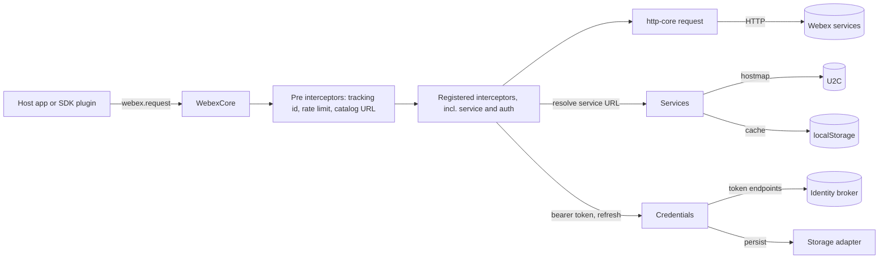
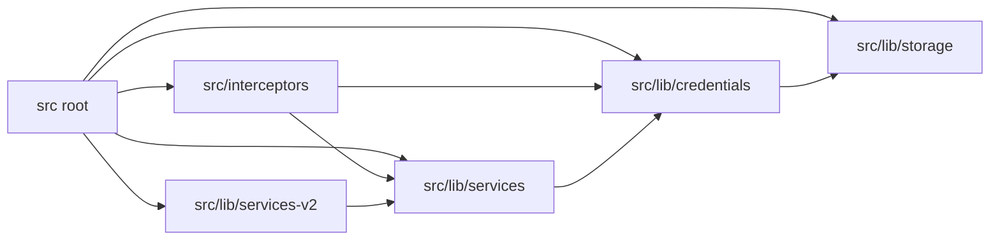
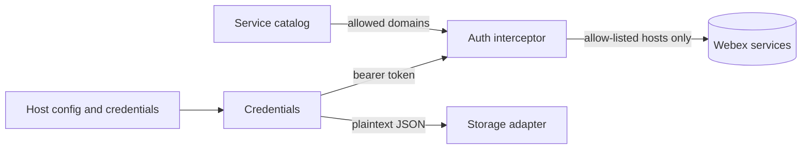

<!-- sdd-generated-metadata
doc_kind: standing-doc
generated_from: architecture@0.3.0
generated_by: claude-code
approved_by: pending
updated_at: 2026-10-07T13:20:21Z
validation_status: pass-with-warnings
-->

# @webex/webex-core architecture

Canonical architecture for the `@webex/webex-core` package. This document owns facts that span its
modules and its neighbors in the Webex JS SDK workspace. Owner-local detail lives in the module
specifications linked from the [specification registry](specs/README.md).

Related context: [specification registry](specs/README.md) · [agent instructions](../AGENTS.md)

## Applicability

| Condition ID | Status | Evidence or reason | Owned section |
| --- | --- | --- | --- |
| `repo.owns_datastore` | N/A | The package provisions no datastore; persistence goes through a host-supplied storage adapter (`src/lib/storage/index.js`) | Repository data and schema |
| `repo.holds_client_state` | Applicable | `WebexCore` is an observable state model holding config, session id and load flags (`src/webex-core.js`), and credentials hold tokens (`src/lib/credentials/credentials.js`) | Client state model |
| `repo.components_interact` | Applicable | `src/webex-core.js` wires interceptors, credentials, services and storage together | Dependency and interaction topology |
| `repo.domain_data_across_components` | N/A | No domain object spans resources; each module owns its own state | Object and data ownership |
| `repo.caches_data` | Applicable | The U2C hostmap is cached in `localStorage` with a TTL (`src/lib/services/services.js`, `src/lib/services-v2/services-v2.ts`) | Caching catalog |
| `repo.observability_convention` | Applicable | Plugin logger with level precedence (`src/plugins/logger.js`), request events and tracking ids (`src/interceptors/request-event.js`, `src/interceptors/webex-tracking-id.js`) | Observability patterns |
| `repo.deploys_to_infra` | N/A | A library published to npm; `package.json` declares no container, deployment manifest or start command | Runtime and infrastructure |
| `repo.shared_base_libs` | Applicable | Lint, babel, jest and build tooling are inherited from the workspace legacy config packages (`.eslintrc.js`, `babel.config.js`, `jest.config.js`) | Shared and base libraries |
| `repo.is_monorepo` | Applicable | One workspace package among many in the Webex JS SDK yarn workspace (`package.json` `repository.directory`) | Package map and inter-package dependencies |
| `repo.multi_platform` | Applicable | Runs in Node and browsers; `package.json` declares a `browserify` transform and tests carry `browserOnly`/`nodeOnly` guards | Platform matrix |
| `repo.published_package` | Applicable | `package.json` declares `main`, `devMain` and `deploy:npm` | Release and versioning |
| `repo.embedded_in_host` | Applicable | It runs inside host applications that supply storage, config and a network stack | Host integration |
| `repo.exposes_commands_or_artifacts` | N/A | The only build artifact is the transpiled `dist` of the same exports; no CLI or generator | Commands and generated artifacts |
| `repo.cross_repo_deps_material` | N/A | Dependencies are workspace packages and npm libraries; no separate repository is required | Cross-repository topology |
| `repo.security_arch_warranted` | Applicable | It holds OAuth tokens, attaches bearer headers, and persists tokens as plain JSON (`src/lib/credentials/credentials.js`, `src/interceptors/auth.js`) | Security architecture |

## Design overview

`@webex/webex-core` is the base of the Webex JS SDK. The default export, `WebexCore`
(`src/webex-core.js`), is an observable model that owns a process-global plugin registry. Other SDK
packages register public (`registerPlugin`) and internal (`registerInternalPlugin`) plugins against it,
and each `WebexCore` instance materializes them as `webex.<name>` and `webex.internal.<name>`.

Five modules sit under the root module `src`:

- **Interceptors** (`src/interceptors`) form the request pipeline that `WebexCore.request` runs through
  the `@webex/http-core` client: tracking ids, auth with refresh-and-replay, redirects, rate limiting,
  catalog URL validation, timing, events and logging.
- **Credentials** (`src/lib/credentials`) hold the OAuth supertoken and scoped user tokens and keep them
  usable through refresh, downscope and revoke.
- **Services** (`src/lib/services`, and the opt-in `src/lib/services-v2`) discover the Webex service
  catalog from U2C, resolve service names and URLs, fail hosts over, and gate `webex.ready`.
- **Storage** (`src/lib/storage`) provides the `@persist` decorator, store factories and an in-memory
  adapter, with concrete adapters supplied by sibling packages or the host.

Services and credentials live in core on purpose: the header comment of `src/index.js` explains that, as
plugins outside core, they would initialize after credentials and every earlier request would miss the
federation rules. The same file's import order is therefore load-bearing. Parallel v1 and v2 service
discovery is kept side by side; v1 is registered by default and v2 only through an explicit
`registerInternalPlugin(..., {replace: true})`.

## Resource inventory and responsibilities

| Resource | Kind | Responsibility | Owner | Source | Detailed specification |
| --- | --- | --- | --- | --- | --- |
| Root module | Module | Plugin host, config defaults, plugin base classes, Batcher, Page, WebexHttpError, export surface | Cisco Webex for Developers | `src` | [src/docs/README.md](../src/docs/README.md) |
| Interceptors | Module | Request/response interceptors | Cisco Webex for Developers | `src/interceptors` | [README](../src/interceptors/docs/README.md) |
| Credentials | Module | OAuth token lifecycle | Cisco Webex for Developers | `src/lib/credentials` | [README](../src/lib/credentials/docs/README.md) |
| Services v1 | Module | Service discovery and host selection | Cisco Webex for Developers | `src/lib/services` | [README](../src/lib/services/docs/README.md) |
| Services v2 | Module | Opt-in v2 service discovery | Cisco Webex for Developers | `src/lib/services-v2` | [README](../src/lib/services-v2/docs/README.md) |
| Storage | Module | Persistence decorators and store factories | Cisco Webex for Developers | `src/lib/storage` | [README](../src/lib/storage/docs/README.md) |

The repository CODEOWNERS entry assigns this package to `@webex/web-client` and `@webex/web-sdk`; the Owner column names the documentation owner, Cisco Webex for Developers.

## Interaction and execution flows

| From | To | Interaction or transport | Purpose | Failure or compatibility behavior |
| --- | --- | --- | --- | --- |
| `WebexCore` | Interceptors | Ordered interceptor chain built at construction | Shape every request and response | `config.interceptors` replaces the whole chain; plugin-registered interceptors are then lost (see root spec) |
| Auth interceptor | Credentials | Token read and refresh | Attach `Authorization`, replay once after a 401 | Replay is bounded by `maxAuthenticationReplays`; a second 401 rejects |
| Service interceptor | Services | Name-to-URL resolution | Replace `service:` URIs with real hosts | Resolution failure surfaces as an unknown-service error |
| Credentials | Identity broker | HTTPS token, revoke and downscope calls | Maintain tokens | OAuth errors map to `grantErrors` classes |
| Services | U2C | HTTPS catalog fetch | Learn service hosts | Gated by `catalogInitTimeout`; failure marks `initFailed` |
| Credentials, services | Storage | `@persist` write and rehydrate | Survive restarts | Non-`NotFoundError` read failures can leave startup unfinished (see storage spec) |

## Dependency topology

| Dependency | Type | Used by | Purpose | Version, failure, or fallback policy |
| --- | --- | --- | --- | --- |
| `@webex/http-core` | Internal | Root, interceptors, services | HTTP client and Interceptor base | Workspace version; specified in the http-core module spec |
| `@webex/common` | Internal | All modules | Exception, Defer, oneFlight and helpers | Workspace version; specified in the common module spec |
| `@webex/common-timers` | Internal | Credentials | Unref-ing timers and the Timer class | Workspace version; specified in the common-timers module spec |
| `@webex/storage-adapter-spec` | Internal | Tests of storage | Shared adapter conformance suite | Declared as a runtime dependency but imported only by tests |
| `@webex/internal-plugin-device` | Internal (dev) | Services, tests | Feature flags and device data consumed by services | Dev dependency only; services call it without a guard (see services spec) |
| `@webex/plugin-logger` | Internal (dev) | Tests | Logger test support | Code-only dependency: no module spec exists for it |
| `ampersand-state`, `ampersand-collection`, `ampersand-events` | External | Root, credentials, services, storage | Observable models | Pinned by `package.json` |
| `lodash`, `uuid`, `crypto-js`, `jsonwebtoken`, `core-decorators` | External | Various | Helpers, tracking ids, hashing, JWT decode, decorators | Pinned by `package.json`; `jsonwebtoken` is used only to decode |

Cycles and ordering: services and credentials are imported by `src/index.js` before any consumer can
register a plugin, and the services module imports the credentials module. Both services plugins read
the device plugin at runtime, so a host that omits it hits unguarded calls.

## Public and consumer surfaces

Exact export names live in [`src/index.js`](../src/index.js) and the owning module specification. 49 workspace packages declare a dependency on this package.

| Surface | Type | Owner | Consumers | Compatibility policy | Source |
| --- | --- | --- | --- | --- | --- |
| `webex-core-sdk` | SDK | `src` | Every SDK plugin and host application | No deprecation policy is declared in `package.json`; treat export removal as breaking | `package.json` |
| `webex-core-interceptors` | SDK | `src/interceptors` | `src/webex-core.js` instantiates them; hosts may subclass | No deprecation policy declared; treat removal as breaking | `src/index.js` |
| `webex-core-credentials` | SDK | `src/lib/credentials` | Authorization plugins, contact-center, metrics, mercury and others | No deprecation policy declared; treat removal as breaking | `src/lib/credentials/index.js` |
| `webex-core-services` | SDK | `src/lib/services` | Many packages through `internal.services` | No deprecation policy declared; treat removal as breaking | `src/lib/services/index.js` |
| `webex-core-services-v2` | SDK | `src/lib/services-v2` | No production consumer; opt-in | Work-in-progress per its README; no stability promise | `src/lib/services-v2/index.ts` |
| `webex-core-storage` | SDK | `src/lib/storage` | Storage adapter packages, user, device and encryption plugins | No deprecation policy declared; treat removal as breaking | `src/lib/storage/index.js` |

External contracts the package requires: `http-core-sdk`, `webex-common-js-api`, `common-timers-sdk`,
`storage-adapter-spec-suite`, the U2C service-discovery API (`u2c-service`), the identity-broker OAuth API
(`idbroker-oauth-service`) and the ampersand state library. They are registered in
`.sdd/manifest.json` `contract_catalog`.

## Client state model

| State or slice | Owner | Transition triggers | Persistence or reset boundary |
| --- | --- | --- | --- |
| `WebexCore` config, session id, `loaded`, `ready` | `src` | Construction, plugin readiness events, `logout` | In memory; `ready` waits for plugin and catalog readiness |
| Supertoken and user tokens | `src/lib/credentials` | Authorize, refresh, downscope, invalidate, logout | Persisted through `@persist('@')` to the bounded store |
| Service catalog groups and `ready` flags | `src/lib/services`, `src/lib/services-v2` | Catalog fetch, cache warm, failover | In memory plus a `localStorage` cache with a 24 hour TTL |
| Interceptor counters (rate limit, tracking sequence, replay) | `src/interceptors` | Each request | In memory only |
| Per-key load records and the startup stack | `src/lib/storage` | `@persist`/`@waitForValue` activity | Process-global registries |

## Cross-cutting architecture

### Security

- Trust boundaries and identity flow: the SDK attaches bearer tokens only to allow-listed hosts
  (`services.validateDomains`, `allowedDomains`) and optionally validates every outbound URL against the
  catalog (`services.validateCatalogUrls`, default off).
- Sensitive surfaces and data classes: access and refresh tokens, client secrets read from environment
  variables, and plain-text persisted token documents.
- Encryption and secret boundaries: the package performs no encryption of its own; persisted tokens are
  stored as plaintext JSON through whatever adapter the host configures. Revocation is skipped when no
  client secret is configured, so it does not happen in typical browser builds.

### Observability and operations

- Logging and correlation: `webex.logger` with per-level console fallback; `trackingid` headers carry a
  per-instance prefix and sequence number; token refresh logs outside production builds.
- Metrics, traces, and audit signals: `request:start|success|failure|end` events consumed by the metrics
  plugin, and a service-not-found metric emitted by services.
- Ownership and operational entry points: there are no dashboards or runbooks in the package.

### Quality attributes

Compatibility is the dominant attribute: dozens of workspace packages and external applications import
this package, so exported names, event names and config keys are treated as public. No coverage gate is
enforced, and several behaviors named in the module specifications have no test (rate limiting
positive cases, JWT refresh, startup failure paths).

## Dependency and interaction topology

| From | To | Kind | Purpose | Ordering or failure boundary |
| --- | --- | --- | --- | --- |
| `src` | all children | Import and registration | Compose the plugin host | Import order in `src/index.js` is load-bearing |
| `src/interceptors` | `src/lib/credentials` | Call | Token attach and refresh | Replay bounded by config |
| `src/interceptors` | `src/lib/services` | Call | Catalog URL validation and service resolution | Fails closed only when validation is enabled |
| `src/lib/credentials` | `src/lib/storage` | Decorator | Persist tokens | Plaintext; read failures can stall startup |
| `src/lib/services` | `src/lib/credentials` | Call | Authenticated catalog fetch | Preauth versus postauth groups |
| `src/lib/services-v2` | `src/lib/services` | Import | Reuses URL-matching helpers from the v1 catalog | v2 cannot be loaded without v1 files |

## Caching catalog

| Cache | Owner | Backend | Contents | TTL or bound | Invalidation trigger | Failure behavior |
| --- | --- | --- | --- | --- | --- | --- |
| U2C hostmap v1 | `src/lib/services` | `localStorage` key `services.v1.u2cHostMap` | Catalog groups | 24 hours; only when `calling.cacheU2C` is true | `clearCatalogCache`; nothing clears it on logout | Cache miss falls back to a network fetch |
| U2C hostmap v2 | `src/lib/services-v2` | `localStorage` key `services.v2.u2cHostMap` | Catalog groups | 24 hours; same flag | `clearCatalogCache`, `invalidateCache` | A warm start leaves some name maps empty (see v2 spec) |
| Plugin bindings | `src/lib/storage` | In-memory registries | Bound store handles per namespace | Process lifetime | None | Shared across instances |

## Observability patterns

| Signal | Convention or required fields | Propagation or naming rule | Primary evidence |
| --- | --- | --- | --- |
| Logs | Level methods with console fallback; token redaction is limited | `webex.logger` shared by plugins | `src/plugins/logger.js` |
| Metrics | Request lifecycle events and a service-not-found metric | Event names `request:*` | `src/interceptors/request-event.js`, `src/lib/metrics.js` |
| Traces | `trackingid` header: prefix, instance uuid and sequence number | Re-sent with a replay suffix | `src/interceptors/webex-tracking-id.js` |
| Audit | None | N/A | N/A |

## Shared and base libraries

| Library | Inherited responsibility | Consumers | Version floor | Compatibility rule |
| --- | --- | --- | --- | --- |
| `@webex/eslint-config-legacy` | Lint rules | This package | Workspace | Change in the shared package, not here |
| `@webex/babel-config-legacy` | Transpilation | This package | Workspace | Same |
| `@webex/jest-config-legacy` | Unit-test config; coverage collection is off | This package | Workspace | Same |
| `@webex/legacy-tools` | Build and test runners | This package | Workspace | Same |

## Package map and inter-package dependencies

| Package | Visibility | Responsibility | Depends on | Consumers |
| --- | --- | --- | --- | --- |
| `@webex/webex-core` | Public | Core plugin host and base services | `@webex/common`, `@webex/common-timers`, `@webex/http-core`, `@webex/storage-adapter-spec` | 49 workspace packages |
| `@webex/http-core` | Public | HTTP client | `@webex/common` | webex-core and others |
| `@webex/common` | Public | Shared helpers | — | Most packages |
| `@webex/common-timers` | Public | Timer primitives | — | webex-core and others |
| `@webex/storage-adapter-spec` | Public | Adapter conformance suite | — | Storage tests |

Workspace packages are resolved by yarn workspaces. The two dev-only edges to
`@webex/internal-plugin-device` and `@webex/plugin-logger` are declared under `devDependencies` in
`package.json`; the services modules nevertheless read the device plugin at runtime.

## Platform matrix

| Platform | Shared versus platform-specific boundary | Entry or build | Support and compatibility constraints |
| --- | --- | --- | --- |
| Node.js | Shared code; some interceptors and tests are Node-only | `dist/index.js` from `yarn workspace @webex/webex-core build:src` | `engines.node >=18` |
| Browser | Shared code; `localStorage` and browser-only interceptor paths | Same bundle through the `browserify` transform | Caches and logout flows assume browser APIs only where guarded |

## Release and versioning

| Artifact | Publish target | Versioning rule | Deprecation window | Changelog or migration obligation |
| --- | --- | --- | --- | --- |
| `@webex/webex-core` | npm through `deploy:npm` | Managed at the workspace root | None declared in `package.json`; owned at the workspace root | Owned at the workspace root |

## Host integration and theming

| Host or integration | Mount or entry contract | Required providers or peers | Theming and accessibility constraints |
| --- | --- | --- | --- |
| Browser or Node application | Construct `WebexCore` (usually through the `webex` package) with config and credentials | A storage adapter (memory by default), the device plugin for services, a network stack | N/A — no UI |

## Security architecture

Trust boundary: the auth interceptor attaches tokens only to hosts known from the catalog, the
discovery configuration or `allowedDomains`. Tokens are persisted unencrypted, so the host must treat
the storage adapter as a secret store. The detailed controls are in the credentials and interceptors
specifications.

## Domain language

| Term | Repository-specific meaning | Authoritative source |
| --- | --- | --- |
| Supertoken | The user's top-level token set from which scoped user tokens are downscoped | `src/lib/credentials/credentials.js` |
| Downscope | Obtaining a token with a reduced scope from the supertoken | `src/lib/credentials/credentials.js` |
| U2C | The service-discovery API that returns the hostmap | `src/config.js` |
| Hostmap or catalog | The service-name to host list mapping the services plugins hold | `src/lib/services/service-catalog.js` |
| Preauth, postauth, signin | Catalog groups collected before login, after login and during sign-in | `src/lib/services/service-catalog.js` |
| Interceptor | A request/response hook run in a fixed chain | `src/index.js` |
| Bounded and unbounded storage | The two store instances configured by `storage.boundedAdapter` and `storage.unboundedAdapter` | `src/config.js` |

## References and maintenance

- Decisions: [adr/](adr/index.md)
- Instantiated specifications and routing: [specs/README.md](specs/README.md)
- Update this document in the same change that alters package boundaries, module ownership,
  cross-module interaction or cross-cutting architecture.
