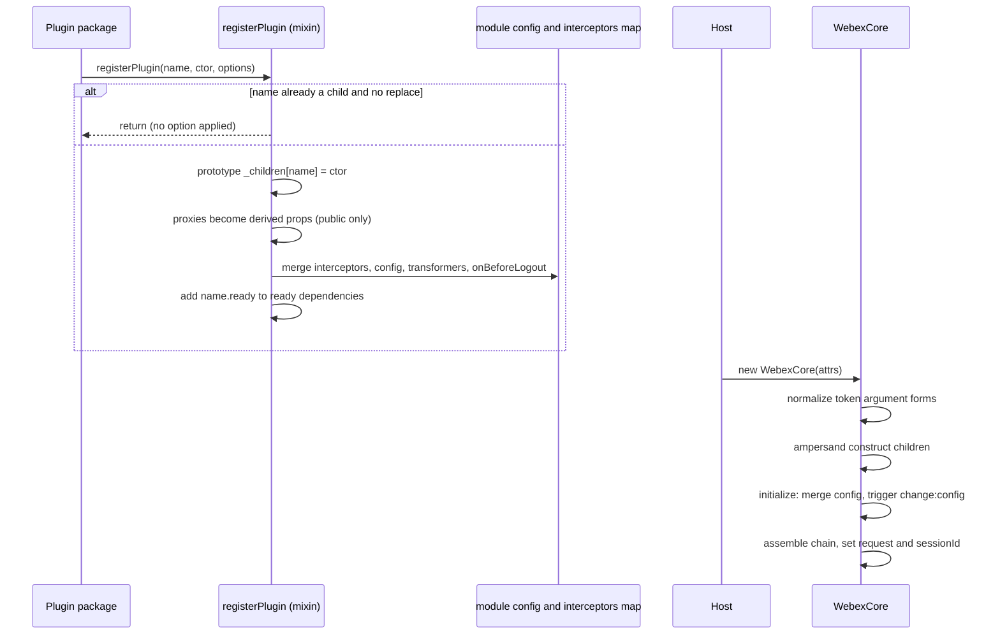
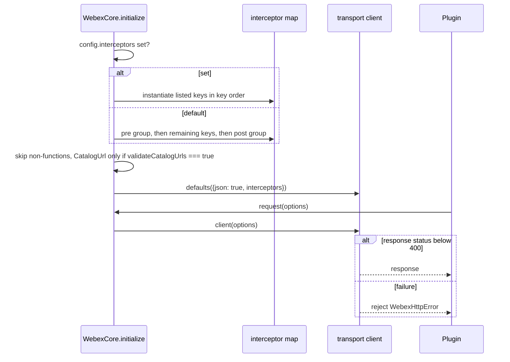
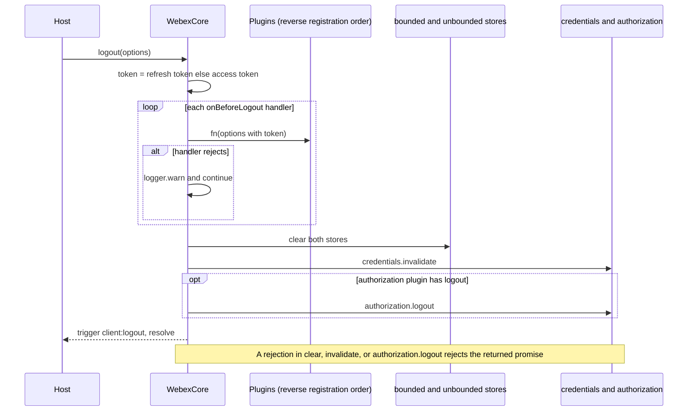
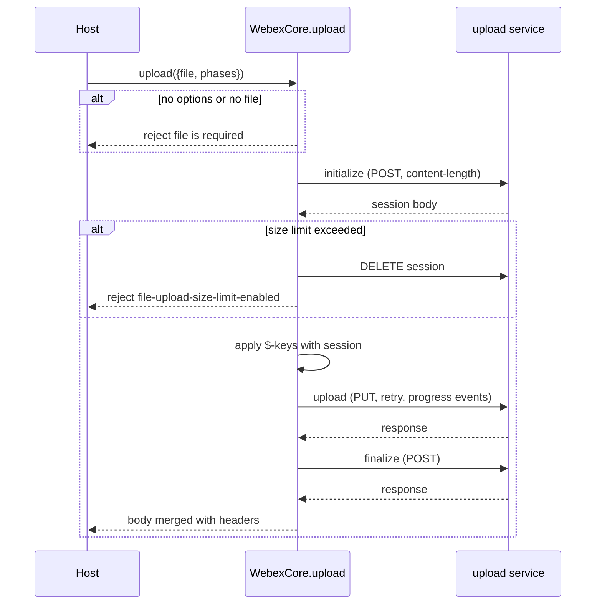
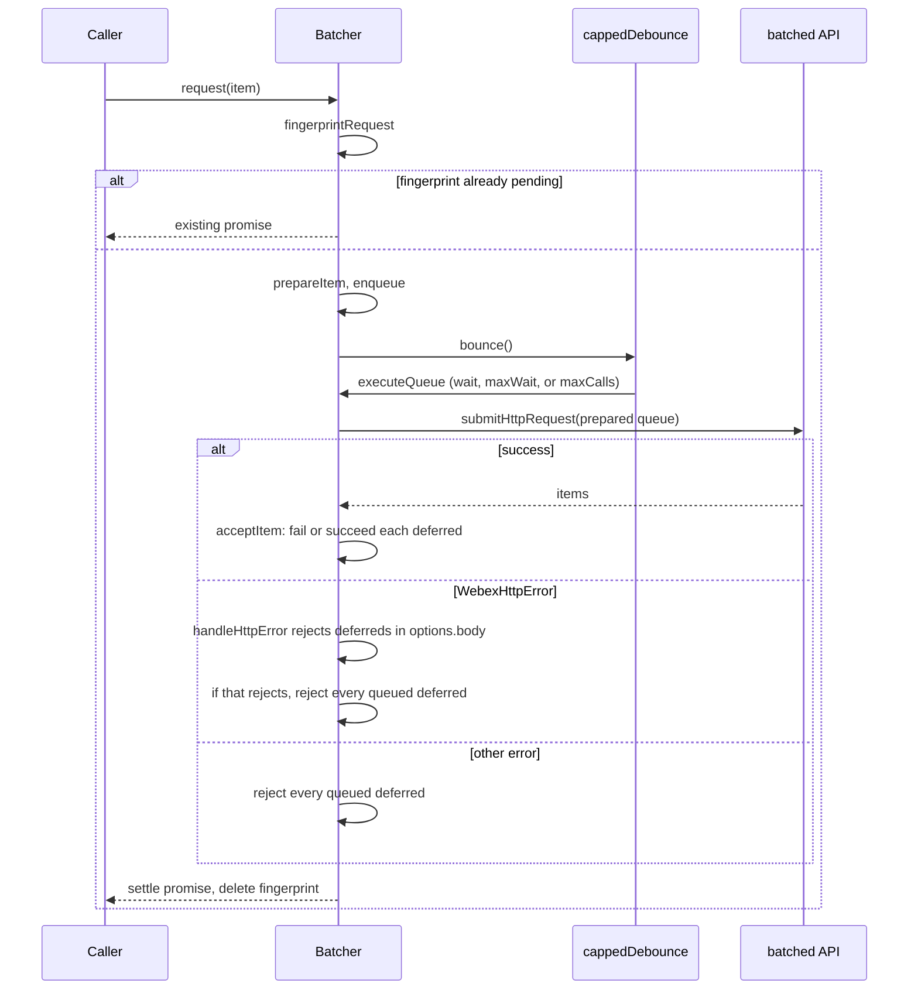
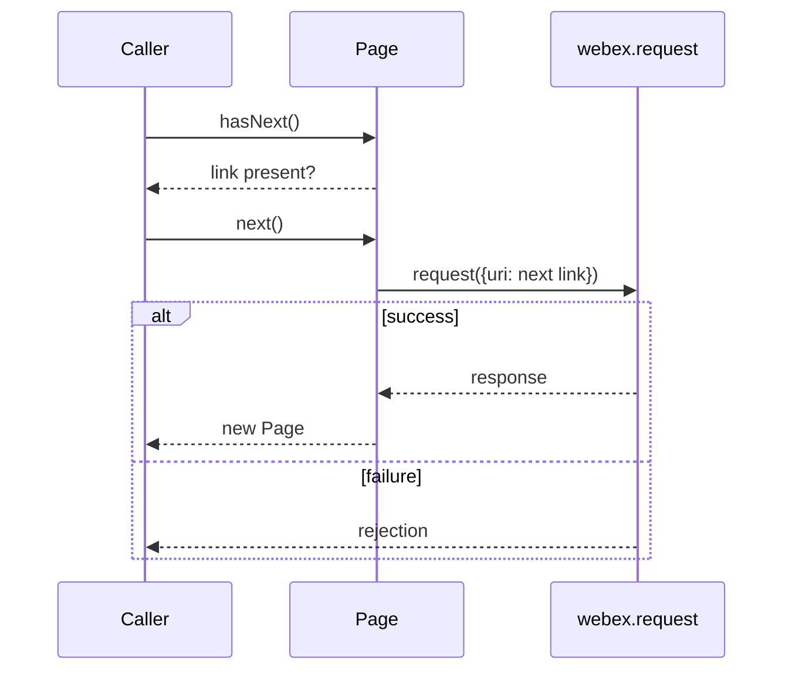
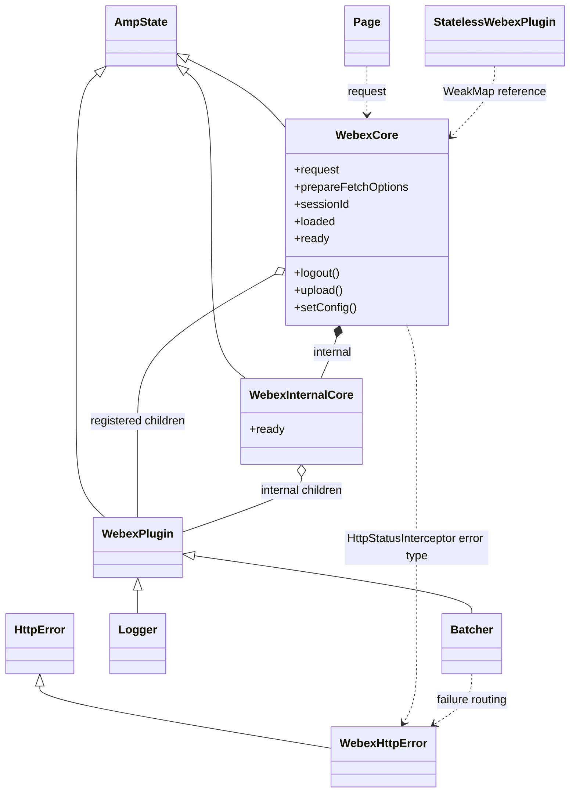
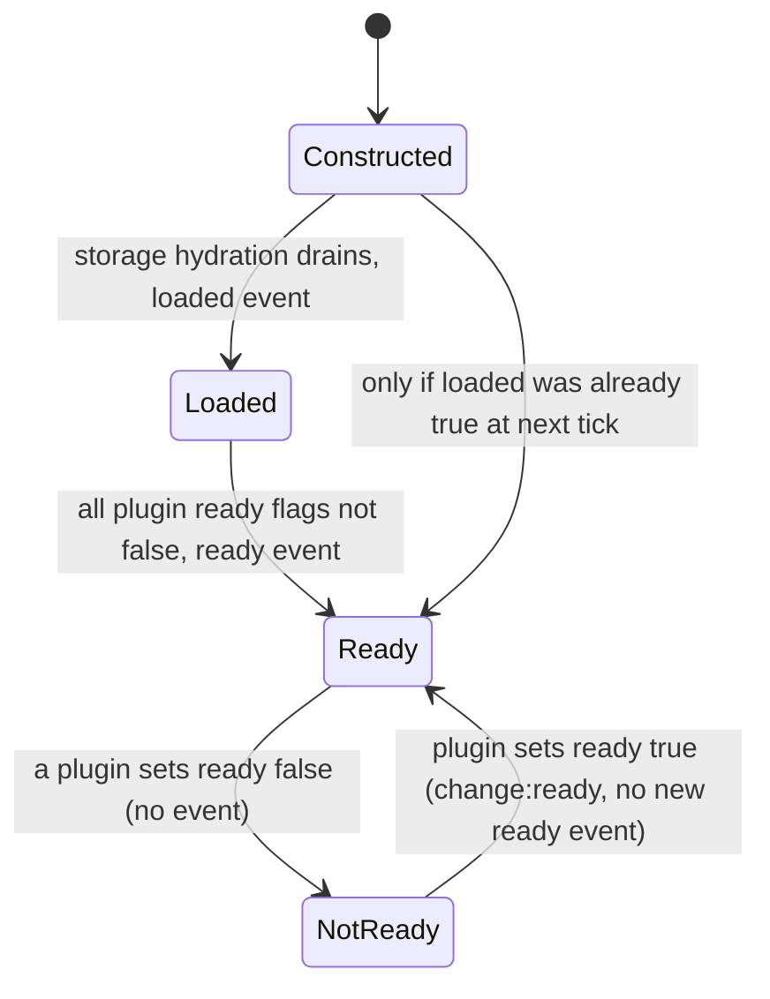

<!-- sdd-generated-metadata
doc_kind: module-spec
generated_from: module-spec@0.3.0
generated_by: claude-code
approved_by: pending
updated_at: 2026-10-07T13:20:21Z
validation_status: pass-with-warnings
-->

# webex-core runtime

This source-local document at `src/docs/README.md` owns the stable specification for the **package
root of `@webex/webex-core`**: the `WebexCore` plugin host, its internal-plugin twin, plugin
registration, the assembly of the HTTP interceptor pipeline, configuration defaults and merging, the
`request`/`upload`/`logout` orchestration, the two plugin base classes, and the shared helpers
`Batcher`, `Page`, `WebexHttpError`, and the allowed-domain matcher.

Five children own their own specifications and are referenced here by contract, never restated:
[interceptors](../interceptors/docs/README.md), [credentials](../lib/credentials/docs/README.md),
[services](../lib/services/docs/README.md), [services-v2](../lib/services-v2/docs/README.md), and
[storage](../lib/storage/docs/README.md).

Related context: [repository architecture](../../docs/architecture.md) ·
[documentation index](../../docs/index.md) · [agent instructions](../../AGENTS.md) ·
[specification registry](../../docs/specs/README.md)

## Metadata

| Field             | Value                                                                 |
| ----------------- | --------------------------------------------------------------------- |
| Owner             | Cisco Webex for Developers                                            |
| Source path       | `src`                                                                 |
| Resource kind     | Package root module (plugin host and shared plugin base classes)      |
| Status            | Active                                                                |
| Last verified     | 2026-10-07                                                            |
| Module id         | `src`                                                                 |
| Parent spec       | —                                                                     |
| Doc kind          | Module spec                                                           |
| Coverage score    | 93.8% assessed 2026-10-07; 15 of 16 mandatory fields present; critical 8 of 8; independent validation pass-with-warnings 2026-10-07 |
| Validation status | Pass with warnings — 2026-10-07; runtime `01a1166d-02d9-7772-bc25-1a801fb5f1d1`; 0 Blocking, 8 Important, 3 Medium |

## Applicability

| Condition ID                         | Status     | Evidence or reason                                                                                                                                  | Owned section                 |
| ------------------------------------ | ---------- | --------------------------------------------------------------------------------------------------------------------------------------------------- | ----------------------------- |
| `module.has_tiers`                   | N/A        | The repository assigns no operational or review tiers                                                                                               | Tier                          |
| `module.has_ui`                      | N/A        | No components or rendering; the package is an SDK runtime                                                                                           | UI use-case flow              |
| `module.crosses_service_boundaries`  | Applicable | `src/webex-core.js` sends every plugin request over HTTP and runs the three-phase upload; `src/lib/page.js` fetches follow-up pages                  | Cross-boundary use-case flow  |
| `module.holds_client_state`          | Applicable | `src/webex-core.js` is an ampersand-state model holding config, loaded, request, sessionId; `src/lib/webex-plugin.js` holds per-plugin state    | Client state model            |
| `module.enforces_domain_rules`       | Applicable | Registration first-wins, request set-once, internal plugins refuse proxies, and the dual-parser host match in `src/lib/domains.ts`                  | Business rules and invariants |
| `module.is_concurrent_async`         | Applicable | Promise chains in `src/webex-core.js`, in-flight de-duplication and debounced flush in `src/lib/batcher.js`, nextTick listener wiring in `src/webex-core.js` | Concurrency and reactive flow |
| `module.owns_persistence`            | N/A        | Persistence is owned by the storage child; this module only selects the adapters in `src/config.js` and wires the stores in `src/webex-core.js`       | Data, schema, and migration   |
| `module.stateful_transitions`        | Applicable | loaded and ready flip through a one-way event lifecycle driven from `src/webex-core.js`; logout is a staged sequence                              | State machine                 |
| `module.exposes_wire_protocol`       | N/A        | Speaks standard HTTP through the transport library; the only parsed wire format is the Link header in `src/lib/page.js`, which is not defined here    | Protocol and wire format      |
| `module.ui_multi_screen`             | N/A        | Gated by module.has_ui, which is N/A                                                                                                                  | UI flow                       |
| `module.large_data_model`            | N/A        | Gated by module.owns_persistence, which is N/A; the module's own state is a handful of session props                                                  | Data model                    |
| `module.returns_caller_errors`       | Applicable | `src/lib/webex-http-error.js` is the request failure type; `src/webex-core.js` rejects uploads; `src/lib/stateless-webex-plugin.js` throws              | Caller-visible failure modes  |
| `module.module_specific_conventions` | Applicable | Ampersand-state plugin conventions, prototype-level registration, and import-order coupling across `src/index.js` and `src/plugins/logger.js`           | Module-specific rules         |
| `module.published_package`           | Applicable | `package.json` declares main and devMain and the deploy script                                                                                    | Export stability              |
| `module.embedded_in_host`            | N/A        | Consumed as a dependency, not mounted into a host application                                                                                         | Host integration and theming  |
| `module.has_design_tradeoff`         | Applicable | Services and credentials live in core (header comment in `src/index.js`); registration is global on the prototype                                      | Key design trade-off          |
| `module.has_submodules`              | Applicable | Five child modules own their own specifications, listed under Sub-modules                                                                             | Sub-modules                   |

## Evidence register

| Evidence                                           | What it establishes                                                                                            |
| -------------------------------------------------- | -------------------------------------------------------------------------------------------------------------- |
| `src/index.js`                                     | The complete public export surface, the side-effect imports that register logger, credentials, services, and the services-in-core rationale comment |
| `src/webex-core.js`                                | `WebexCore` construction, token-argument normalization, interceptor map and assembly, lifecycle events, upload, logout, `setConfig`, `registerPlugin`/`registerInternalPlugin` |
| `src/webex-internal-core.js`                       | The `internal` child that namespaces private plugins and aggregates their ready                               |
| `src/lib/webex-core-plugin-mixin.js`               | Public-plugin registration: first-wins rule, proxies, interceptors, config, payload transformer, `onBeforeLogout`, ready dependency |
| `src/lib/webex-internal-core-plugin-mixin.js`      | Internal-plugin registration: same as above but proxies are rejected                                            |
| `src/config.js`                                    | Default configuration values and the environment variables that influence them                                  |
| `src/credentials-config.js`                        | The `credentials` default instance embedded in the config (detailed in the credentials child)                   |
| `src/plugins/logger.js`                            | The default `logger` plugin and its console-method fallback                                                     |
| `src/lib/webex-plugin.js`                          | Stateful plugin base: `webex`, `config`, `logger`, ready, `clear`, `when`, change propagation                 |
| `src/lib/stateless-webex-plugin.js`                | Stateless plugin base: WeakMap-held `webex`, namespace config, readonly ready                                 |
| `src/lib/batcher.js`                               | Request coalescing, de-duplication, capped-debounce flush, and error fan-out                                    |
| `src/lib/page.js`                                  | Paginated response wrapper and Link header parsing                                                            |
| `src/lib/webex-http-error.js`                      | Webex-specific `HttpError` with enriched messages and a `TooManyRequests` override                               |
| `src/lib/constants.js`                             | Service-catalog names, allowed commercial domains, and credential metric names                                  |
| `src/lib/metrics.js`                               | The single service-catalog metric constant                                                                      |
| `src/lib/domains.ts`                               | Hostname normalization and the fail-closed dual-parser allowed-domain match                                     |
| `package.json`                                     | Entry points, dependencies, and every build and test command                                                    |
| `jest.config.js`                                   | Unit-test runner configuration (delegates to the shared legacy jest config)                                     |
| `test/unit/spec/webex-core.js`                     | Construction, token forms, interceptor assembly cases, `setConfig`, upload rejection and progress, loaded/ready events |
| `test/unit/spec/webex-internal-core.js`            | Internal plugin config access and ready aggregation                                                           |
| `test/unit/spec/_setup.js`                         | Per-test re-registration of a neutral `test` plugin to prevent cross-talk                                        |
| `test/unit/spec/lib/batcher.js`                    | Coalescing, de-duplication, thresholds, failure fan-out, unhandled-rejection safety                             |
| `test/unit/spec/lib/page.js`                       | Page construction, link navigation, link-header parsing                                                         |
| `test/unit/spec/lib/webex-plugin.js`               | Namespaced config, logger proxy, root `webex` resolution                                                        |
| `test/integration/spec/webex-core.js`              | Tracking id and user-agent headers on a real request, WebexHttpError on failure, logout ordering and store clearing |
| `test/integration/spec/unit-browser/auth.js`       | `AuthInterceptor` 401 handling in a browser runner                                                              |
| `test/integration/spec/unit-browser/token.js`      | `Token` `canRefresh` and `refresh()` in a browser runner                                                        |
| `test/fixtures/host-catalog-v2.ts`                 | Shared catalog fixture consumed by the services-v2 specs                                                        |
| `test/fixtures/activation-email.ts`                | Fixture used by the services specs                                                                              |

## Purpose and boundary

- **Responsibility:** host the plugin system of the Webex JS SDK. This module builds the one object
  every SDK plugin hangs off (`WebexCore`), decides which interceptors run in which order around every
  HTTP request, owns the default configuration all plugins read from, and provides the base classes and
  helpers plugins are written against.
- **In scope:** `WebexCore` and `WebexInternalCore`; public and internal plugin registration; the
  interceptor map and its assembly into `request`/`prepareFetchOptions`; config defaults and merge
  rules; `refresh`, `logout`, `measure`, `upload`, `transform`; `WebexPlugin`, `StatelessWebexPlugin`;
  `Batcher`, `Page`, `WebexHttpError`; the allowed-domain matcher; service-catalog constants; the
  default `logger` plugin; the package export surface.
- **Out of scope:** the sixteen interceptor classes themselves (interceptors child); token and
  credentials behavior (credentials child); service catalogs and discovery, including the three
  services interceptors (services child, services-v2 child); persistence mechanics and the `persist`
  and `waitForValue` decorators (storage child); transport, `HttpError` base and the interceptor fold
  (http-core dependency).
- **Why services live here:** the header comment of `src/index.js` states that Services is part of
  webex-core because its contents must be reachable when webex-core initializes. As a plugin outside
  core it would initialize after credentials, so every request before then would skip federation
  handling and go to the environmentally assigned URLs. `src/index.js` therefore imports the
  credentials and services modules for their registration side effects.
- **Consumers:** 49 workspace packages declare `@webex/webex-core` as a dependency (for example
  `@webex/plugin-meetings`, `@webex/internal-plugin-mercury`, `@webex/internal-plugin-metrics`,
  `@webex/plugin-authorization-browser`, `@webex/storage-adapter-local-storage`, `@webex/webex-server`).
  About fifty source files outside this package call `registerPlugin` or `registerInternalPlugin`.

## Structure and key files

| Path                                        | Responsibility                                                                                                                    |
| ------------------------------------------- | --------------------------------------------------------------------------------------------------------------------------------- |
| `src/index.js`                              | Package entry. Side-effect imports register logger, credentials, services; re-exports the whole public surface                    |
| `src/webex-core.js`                         | Defines `WebexCore`, the interceptor map, the pre/post groups, the lifecycle, upload, logout; calls both plugin mixins            |
| `src/webex-internal-core.js`                | `WebexInternalCore`: the `internal` child with its own plugin registry and aggregated ready                                      |
| `src/lib/webex-core-plugin-mixin.js`        | Adds `registerPlugin` to `WebexCore` (supports proxies)                                                                           |
| `src/lib/webex-internal-core-plugin-mixin.js` | Adds `registerPlugin` to `WebexInternalCore` (rejects proxies)                                                                  |
| `src/config.js`                             | Default configuration object, mutated at import time by plugin registrations                                                      |
| `src/credentials-config.js`                 | `CredentialsConfig` default instance; owned by the credentials child, embedded by `src/config.js`                                 |
| `src/plugins/logger.js`                     | Registers the default `logger` plugin on the console                                                                              |
| `src/lib/webex-plugin.js`                   | Ampersand-state plugin base class                                                                                                 |
| `src/lib/stateless-webex-plugin.js`         | Plain-class plugin base class without ampersand state                                                                             |
| `src/lib/batcher.js`                        | Abstract request-coalescing plugin base                                                                                           |
| `src/lib/page.js`                           | Paginated list wrapper                                                                                                            |
| `src/lib/webex-http-error.js`               | WebexHttpError                                                                                                                  |
| `src/lib/domains.ts`                        | Allowed-domain matching used by both service catalogs                                                                              |
| `src/lib/constants.js`                      | `NAMESPACE`, `SERVICE_CATALOGS`, `SERVICE_CATALOGS_ENUM_TYPES`, `COMMERCIAL_ALLOWED_DOMAINS`, `METRICS`                           |
| `src/lib/metrics.js`                        | `JS_SDK_SERVICE_NOT_FOUND` metric name                                                                                            |
| `package.json`                              | Entry points, dependencies, scripts                                                                                               |

## Sub-modules

| Sub-module             | Responsibility                                                                                                  | Specification                           |
| ---------------------- | --------------------------------------------------------------------------------------------------------------- | --------------------------------------- |
| `src/interceptors`     | Sixteen request/response interceptor classes; provides `webex-core-interceptors`                                | `src/interceptors/docs/README.md`       |
| `src/lib/credentials`  | `Credentials` and `Token` plugins, scopes, grant errors; provides `webex-core-credentials`                      | `src/lib/credentials/docs/README.md`    |
| `src/lib/services`     | Service catalog, registry, hosts, discovery, plus the service, host-map and server-error interceptors in `src/lib/interceptors`; provides `webex-core-services` | `src/lib/services/docs/README.md` |
| `src/lib/services-v2`  | Second-generation catalog and services plugin classes; provides `webex-core-services-v2`                        | `src/lib/services-v2/docs/README.md`    |
| `src/lib/storage`      | Store construction, adapters, `persist`/`waitForValue`; provides `webex-core-storage`                           | `src/lib/storage/docs/README.md`        |

This module assigns the children's position in the pipeline and in `index.js` but never their
behavior: interceptor semantics are in the interceptors specification, token refresh and expiry in the
credentials specification, catalog resolution and URL mapping in the services specifications, and
hydration timing in the storage specification. The services-v2 classes are exported from
`src/index.js` but are not registered by it; see Public surface for the services-v2 row.

## Public surface

The package's published surface is the export list of `src/index.js`, reached through `main` and
`devMain` in `package.json`. This section is a contract index: it names each export and its behavior
and links the native file. Signatures are read from the source, not copied here. Every row below is
provided under `webex-core-sdk` unless it names a child contract. The package ships no TypeScript
declarations for these exports.

| Surface | Contract | Consumer | Compatibility commitment | Source |
| ------- | -------- | -------- | ------------------------ | ------ |
| `default` (`WebexCore`) | `webex-core-sdk` | Umbrella packages, every host application | Constructed with an attrs object or a bare token string; exposes request, `prepareFetchOptions`, `setTimingsAndFetch`, `refresh`, `logout`, `measure`, `upload`, `transform`, `setConfig`, sessionId, loaded, ready, `internal`, and one property per registered plugin | `src/webex-core.js` |
| `registerPlugin` | `webex-core-sdk` | Every public plugin package | First registration of a name wins unless `replace` is set; options `proxies`, `interceptors`, `config`, `payloadTransformer`, `onBeforeLogout`, `replace` | `src/webex-core.js`, `src/lib/webex-core-plugin-mixin.js` |
| `registerInternalPlugin` | `webex-core-sdk` | Every internal plugin package | Same options minus `proxies`, which throws; plugins surface on `webex.internal` | `src/webex-core.js`, `src/lib/webex-internal-core-plugin-mixin.js` |
| `WebexPlugin` | `webex-core-sdk` | Plugin authors | Ampersand-state base: `webex`, namespaced `config`, `logger`, ready (default `true`), request, `upload`, `when`, `clear` | `src/lib/webex-plugin.js` |
| `StatelessWebexPlugin` | `webex-core-sdk` | Plugin authors who avoid ampersand state | Class requiring `attrs.webex` or `options.parent`; `config`, `logger`, `webex`, readonly ready, request, `upload` | `src/lib/stateless-webex-plugin.js` |
| WebexHttpError | `webex-core-sdk` | Every caller handling request failures | `HttpError` subclass whose message adds error code, method and URL, tracking id, trans id, retry-after | `src/lib/webex-http-error.js` |
| `Batcher` | `webex-core-sdk` | Presence, user, metrics batchers | Abstract plugin; subclasses must supply `fingerprintRequest`, `fingerprintResponse`, `submitHttpRequest` | `src/lib/batcher.js` |
| `Page` | `webex-core-sdk` | Plugins returning paginated lists | Iterable wrapper with `items`, `length`, `next`, `previous`, `hasNext`, `hasPrevious`, static `parseLinkHeaders` | `src/lib/page.js` |
| `config` | `webex-core-sdk` | Hosts, tests, plugins | The default configuration object; plugin registration mutates it | `src/config.js` |
| `serviceConstants` | `webex-core-sdk` | Service consumers | Namespace export of the constants module | `src/lib/constants.js` |
| `Credentials`, `Token`, `filterScope`, `sortScope`, `grantErrors` | `webex-core-credentials` | Authorization plugins | Re-exports; behavior in the credentials specification | `src/lib/credentials/index.js` |
| `Services`, `ServiceCatalog`, `ServiceRegistry`, `ServiceState`, `ServiceHost`, `ServiceUrl` | `webex-core-services` | Device, mercury, locus, and others | Re-exports; behavior in the services specification | `src/lib/services/index.js` |
| `ServiceCatalogV2`, `ServicesV2`, `ServiceDetail` | `webex-core-services-v2` | Hosts opting into the second generation | Re-exports; not registered by this package | `src/lib/services-v2/index.ts` |
| `makeWebexStore`, `makeWebexPluginStore`, `MemoryStoreAdapter`, `NotFoundError`, `StorageError`, `persist`, `waitForValue` | `webex-core-storage` | Plugin and adapter authors | Re-exports; behavior in the storage specification | `src/lib/storage/index.js` |
| `AuthInterceptor`, `CatalogUrlInterceptor`, `DefaultOptionsInterceptor`, `EmbargoInterceptor`, `NetworkTimingInterceptor`, `PayloadTransformerInterceptor`, `ProxyInterceptor`, `RateLimitInterceptor`, `RedirectInterceptor`, `RequestEventInterceptor`, `RequestLoggerInterceptor`, `RequestTimingInterceptor`, `ResponseLoggerInterceptor`, `UserAgentInterceptor`, `WebexTrackingIdInterceptor`, `webexTrackingIdSequenceNumbers`, `WebexUserAgentInterceptor` | `webex-core-interceptors` | Hosts composing custom chains | Re-exports of the classes in `src/interceptors` | `src/interceptors/auth.js`, `src/interceptors/webex-tracking-id.js` |
| `HostMapInterceptor`, `ServiceInterceptor`, `ServerErrorInterceptor` | `webex-core-services` | Hosts composing custom chains | Re-exports of the classes in `src/lib/interceptors` | `src/lib/interceptors/hostmap.js`, `src/lib/interceptors/service.js`, `src/lib/interceptors/server-error.js` |

`HttpStatusInterceptor` is not exported by this package; it is imported from the transport library in
`src/webex-core.js` and bound to `WebexHttpError`. The allowed-domain matcher in `src/lib/domains.ts`
and the `Logger` class in `src/plugins/logger.js` are not exported from `src/index.js`.

## Dependencies

| Dependency | Why it is required | Failure behavior |
| ---------- | ------------------ | ---------------- |
| `@webex/http-core` (`http-core-sdk`) | Provides `defaults`, `protoprepareFetchOptions`, `setTimingsAndFetch`, `HttpStatusInterceptor`, `HttpError`. Per its specification, `defaults(options)` returns a client function and request interceptors run in array order, response interceptors in reverse | Load-time import; request failures arrive as rejections already converted by `HttpStatusInterceptor` into the error class supplied here |
| `@webex/common` (`webex-common-js-api`) | `proxyEvents`, `transferEvents`, `retry` (upload), `cappedDebounce` and `Defer` (Batcher). Per its specification these are externally supported helpers | Load-time import; `retry` exhaustion surfaces as an upload rejection |
| `@webex/common-timers` (`common-timers-sdk`) | Declared in `package.json`; used by the credentials child, not by this module's own files | Child concern |
| `@webex/storage-adapter-spec` (`storage-adapter-spec-suite`) | Declared dependency; defines the adapter contract the default `MemoryStoreAdapter` in `src/config.js` follows | Adapters that violate it fail in the storage child |
| `ampersand-state`, `ampersand-events`, `ampersand-collection` (`ampersand-state-library`) | State, derived properties, children, and event model for `WebexCore` and `WebexPlugin`. Described from code, no specification | Load-time import; derived-property and children semantics are inherited |
| `core-decorators` | `@readonly` on `StatelessWebexPlugin.ready` | Load-time import |
| `lodash` | `merge`, `defaultsDeep`, `get`/`set`/`unset`, `union`, and others across the module | Load-time import |
| `uuid` | Session id and upload `x-trans-id` generation | Load-time import |
| `url` (Node core or bundler polyfill) | `Url.parse` in `src/lib/domains.ts` | The matcher returns no match when parsing throws |
| `@webex/internal-plugin-device`, `@webex/plugin-logger`, test helpers | Dev dependencies only; not imported by `src` | Absence affects tests only |
| `crypto-js`, `jsonwebtoken` | Declared dependencies used by the services and credentials children | Child concern |

## Requirements

| ID | WHAT | WHY | Source evidence | Test or example evidence | Assumptions or gaps | Confidence |
| -- | ---- | --- | --------------- | ------------------------ | ------------------- | ---------- |
| `MOD-001` | `new WebexCore(string)` treats the string as an access token and stores it as `credentials.supertoken.access_token` without validation or trimming | Lets hosts initialize with a bare token | `src/webex-core.js` | `test/unit/spec/webex-core.js` | The test feeds token strings through attrs paths, not the bare-string form: bare form untested | Present |
| `MOD-002` | For object attrs, the first truthy value among `credentials.authorization`, `authorization`, `credentials.supertoken.supertoken`, `supertoken`, `access_token`, `credentials.authorization.supertoken` is removed from its path and set as `credentials.supertoken`, in that fixed order | Hosts historically passed tokens in many shapes; normalizing keeps one shape for the credentials plugin | `src/webex-core.js` | `test/unit/spec/webex-core.js` | Order is documented only by the in-source "order is important" comment; the caller's attrs object is mutated | Present |
| `MOD-003` | A string at `credentials` or `credentials.authorization` becomes `credentials.supertoken` | Accepts a token string where an object is expected | `src/webex-core.js` | `test/unit/spec/webex-core.js` | none | Present |
| `MOD-004` | A string `credentials.access_token` is trimmed, passed through `bearerValidator`, and then the whole `credentials` object becomes `credentials.supertoken` | Keeps legacy `{credentials: {access_token}}` working while repairing malformed Bearer strings | `src/webex-core.js` | `test/unit/spec/webex-core.js` | none | Present |
| `MOD-005` | `bearerValidator` collapses whitespace runs to one space, inserts the missing space in `Bearer1234`, and logs a `console.warn` plus tip for glued or extra-spaced input | Silent repair would hide a host misconfiguration | `src/webex-core.js` | `test/unit/spec/webex-core.js` | Warning text is not asserted | Present |
| `MOD-006` | `initialize` sets `config` to `merge({}, defaultConfig, attrs.config)` and then triggers `change:config` before any other work | Children need a hook to read config during their own initialization | `src/webex-core.js`, `src/config.js` | `test/unit/spec/webex-core.js` | The `change:config` trigger itself is not asserted | Present |
| `MOD-007` | `setConfig(newConfig)` replaces `config` with `merge({}, config, newConfig)`; it does not rebuild the interceptor chain or sessionId | Allows late tuning of plugin config reads that are uncached | `src/webex-core.js`, `src/lib/webex-plugin.js` | `test/unit/spec/webex-core.js` | Only a credentials key is asserted; chain and session id staleness untested | Present |
| `MOD-008` | Plugin registration options `config`, `payloadTransformer.predicates`, and `payloadTransformer.transforms` are merged or concatenated into the module-level default config, so they apply to every instance created afterwards | Plugins ship their own defaults without touching host code | `src/lib/webex-core-plugin-mixin.js`, `src/lib/webex-internal-core-plugin-mixin.js` | none found | Gap: no unit test registers a plugin with `config` or transformer options | Present |
| `MOD-009` | Default config carries `maxAppLevelRedirects: 10`, `maxLocusRedirects: 5`, `maxAuthenticationReplays: 1`, `maxReconnectAttempts: 1`, `trackingIdPrefix: 'webex-js-sdk'`, empty `trackingIdSuffix`, empty `onBeforeLogout`, memory adapters for both storage slots, `payloadTransformer` with empty predicates and transforms, and `skipRepeatedInboundTransforms: false` | Safe defaults let a bare `new WebexCore()` work offline | `src/config.js` | `test/unit/spec/webex-core.js` | Only `fedramp` presence is asserted | Present |
| `MOD-010` | `config.fedramp` is `process.env.ENABLE_FEDRAMP || false`, evaluated once at import | Selects FedRAMP behavior by environment | `src/config.js` | `test/unit/spec/webex-core.js` | Any non-empty string, including `false`, is truthy; only key presence is tested | Present |
| `MOD-011` | `services.discovery` URLs default to the hydra, region-discovery, and U2C endpoints and are overridden by `HYDRA_SERVICE_URL`, `SQDISCOVERY_SERVICE_URL`, `U2C_SERVICE_URL` at import; `device.preDiscoveryServices` also reads `HYDRA_SERVICE_URL` | Lets test and non-production environments redirect discovery | `src/config.js` | none found | Gap: no test covers the overrides | Present |
| `MOD-012` | `services.validateCatalogUrls` defaults to `false`; `services.validateDomains` defaults to `true`; `services.allowedDomains` defaults to an empty list; `services.catalogInitTimeout` defaults to 15000 ms; `services.useCatalogOverride`, `skipPreauthCatalogOnUnauthenticated`, and `useUserOnboardingServiceForActivations` default to `false`; `calling.cacheU2C` defaults to `false` | Opt-in flags keep default behavior unchanged for existing hosts | `src/config.js` | `test/unit/spec/webex-core.js` | Consumption of these keys is specified in the services child; only `validateCatalogUrls` is asserted here | Present |
| `MOD-013` | `registerPlugin(name, ctor, options)` returns immediately without changing anything if `name` is already a child, unless `options.replace` is truthy; none of the options are applied on the early return | Prevents a second import of a plugin from duplicating interceptors, config, and logout handlers | `src/lib/webex-core-plugin-mixin.js`, `src/lib/webex-internal-core-plugin-mixin.js` | `test/unit/spec/_setup.js` | Gap: the no-replace early return is not directly asserted | Present |
| `MOD-014` | Registration writes the constructor into the prototype `_children` map, so every later `WebexCore` instance gets `webex.<name>` and instances created earlier do not | Plugins are discovered by import, not by per-instance configuration | `src/lib/webex-core-plugin-mixin.js` | `test/unit/spec/webex-core.js` | Registration after construction is not tested | Present |
| `MOD-015` | `options.proxies` creates one derived property per key on `WebexCore` that reads the same key from the plugin (for example `canAuthorize`, `canRefresh` from credentials) | Gives hosts a flat shortcut without copying state | `src/lib/webex-core-plugin-mixin.js`, `src/lib/credentials/index.js` | `test/unit/spec/webex-core.js` | Verified only through `canAuthorize` | Present |
| `MOD-016` | `registerInternalPlugin` with `options.proxies` throws `Proxies are not currently supported for private plugins` | Private plugins must stay behind `webex.internal` | `src/lib/webex-internal-core-plugin-mixin.js` | none found | Gap: the throw is untested | Present |
| `MOD-017` | Plugin-registered `interceptors` entries are written into the shared interceptor map by key, replacing an existing key | The services plugin supplies `ServiceInterceptor` and `ServerErrorInterceptor` this way | `src/lib/webex-core-plugin-mixin.js`, `src/lib/services/index.js` | `test/unit/spec/webex-core.js` | Collision behavior untested | Present |
| `MOD-018` | `onBeforeLogout` options (single function or array) are appended to `config.onBeforeLogout` as `{plugin, fn}` pairs in registration order | Plugins can release resources before credentials are invalidated | `src/lib/webex-core-plugin-mixin.js` | `test/integration/spec/webex-core.js` | Registration path not directly tested; the integration test injects pairs through config | Present |
| `MOD-019` | A registered plugin whose prototype defines ready adds `<name>.ready` to `WebexCore`'s derived ready dependency list (and likewise for `WebexInternalCore`) | The host ready must reflect every plugin that can be not-ready | `src/lib/webex-core-plugin-mixin.js`, `src/lib/webex-internal-core-plugin-mixin.js` | `test/unit/spec/webex-core.js`, `test/unit/spec/webex-internal-core.js` | none | Present |
| `MOD-020` | `WebexCore.ready` is loaded AND every child plugin's ready not strictly `false`; `WebexInternalCore.ready` applies the same fold to its children, and `WebexCore` depends on `internal.ready` | One boolean tells a host that storage hydration and all plugin start-up finished | `src/webex-core.js`, `src/webex-internal-core.js` | `test/unit/spec/webex-core.js`, `test/unit/spec/webex-internal-core.js` | none | Present |
| `MOD-021` | `src/index.js` imports `./plugins/logger`, `./lib/credentials`, and `./lib/services` before anything else is exported, registering `logger` (public), `credentials` (public, proxies `canAuthorize` and `canRefresh`), and `services` (internal, with `ServiceInterceptor` and `ServerErrorInterceptor`) | Core must have services and credentials available at first initialization (see Purpose and boundary) | `src/index.js`, `src/plugins/logger.js` | `test/unit/spec/webex-core.js` | Registration order between the three is not asserted | Present |
| `MOD-022` | With no `config.interceptors`, the chain is the pre group, then every other map entry in map order, then the post group; a key listed in both groups (`RateLimitInterceptor`) is instantiated once per occurrence | Fixes the nesting of cross-cutting behavior (timing outermost, status conversion innermost on the response path) | `src/webex-core.js` | `test/unit/spec/webex-core.js` | Exact middle order depends on import-time registration order | Present |
| `MOD-023` | The pre group is `ResponseLoggerInterceptor`, `RequestTimingInterceptor`, `RequestEventInterceptor`, `WebexTrackingIdInterceptor`, `RateLimitInterceptor`, `CatalogUrlInterceptor`; the post group is `HttpStatusInterceptor`, `NetworkTimingInterceptor`, `EmbargoInterceptor`, `RequestLoggerInterceptor`, `RateLimitInterceptor` | Request hooks run in array order and response hooks in reverse, so order encodes who sees raw versus converted responses | `src/webex-core.js` | `test/unit/spec/webex-core.js` | Test asserts the default 18-entry and 19-entry lists, not each group in isolation | Present |
| `MOD-024` | An entry is added only if its map value is a function: the two logger interceptors are `undefined` unless `ENABLE_NETWORK_LOGGING` or `ENABLE_VERBOSE_NETWORK_LOGGING` is set when `src/webex-core.js` is first imported, and `ServiceInterceptor`, `KmsDryErrorInterceptor`, `ConversationInterceptor` stay `undefined` until a plugin supplies them | Optional behavior is expressed by absence from the map, not by flags checked per request | `src/webex-core.js` | `test/unit/spec/webex-core.js` | Env-driven logger inclusion is untested | Present |
| `MOD-025` | `CatalogUrlInterceptor` is added only when `config.services.validateCatalogUrls === true` (strict boolean), in both the default and the `config.interceptors` assembly | Opt-in SSRF protection without changing default traffic | `src/webex-core.js`, `src/config.js` | `test/unit/spec/webex-core.js` | none | Present |
| `MOD-026` | When `config.interceptors` is set, only its own keys, in its own key order, are instantiated; no pre/post grouping and no plugin-registered interceptors are added; an empty object or array yields zero interceptors | Lets a host replace the pipeline wholesale | `src/webex-core.js` | `test/unit/spec/webex-core.js` | none | Present |
| `MOD-027` | Each interceptor factory is invoked with `this` bound to the `WebexCore` instance; `HttpStatusInterceptor` is built with WebexHttpError as its error constructor | Interceptors reach the instance without constructor arguments, and status failures become WebexHttpError | `src/webex-core.js` | `test/integration/spec/webex-core.js` | Binding is verified only through behavior | Present |
| `MOD-028` | `initialize` sets request (set-once) and `prepareFetchOptions` to the transport defaults with `json: true` and the assembled chain, and `setTimingsAndFetch` to the transport helper unchanged | One function is the single entry for all plugin HTTP traffic | `src/webex-core.js` | `test/unit/spec/webex-core.js`, `test/integration/spec/webex-core.js` | `setTimingsAndFetch` is not asserted | Present |
| `MOD-029` | sessionId is `<trackingIdPrefix>_<trackingIdBase or new uuid>` with `_<trackingIdSuffix>` appended when the suffix is non-empty | Correlates all requests of one SDK instance | `src/webex-core.js` | `test/integration/spec/webex-core.js` | Suffix and base branches untested | Present |
| `MOD-030` | `WebexCore` fires loaded once, when loaded becomes true, and ready once, when derived ready becomes true; listeners are attached on the next tick and run immediately if the state is already reached | Hosts can await readiness without racing construction | `src/webex-core.js` | `test/unit/spec/webex-core.js` | ready event fires once even if a plugin later flips it false | Present |
| `MOD-031` | Changes on any child (`change` event) re-emit on the parent as `change:<childName>`; a `WebexPlugin` change re-emits on its parent as `change:<lowercased namespace>` | Hosts observe plugin state through one object | `src/webex-core.js`, `src/lib/webex-plugin.js` | `test/unit/spec/webex-core.js` | Only exercised indirectly through the ready tests | Present |
| `MOD-032` | `refresh(...args)` delegates to `credentials.refresh(...args)` | Stable host-facing refresh entry | `src/webex-core.js` | none found | Gap: no test of delegation | Present |
| `MOD-033` | `logout(options, ...rest)` runs `onBeforeLogout` handlers last-registered first, each in the owning plugin's scope (`this[plugin]` else `this.internal[plugin]`) with `{token}` merged into options, where token is the refresh token else the access token; a handler failure is logged as a warning and does not stop the sequence | Teardown must unwind in reverse dependency order and must not be blockable by one plugin | `src/webex-core.js` | `test/integration/spec/webex-core.js` | Handler rejection path covered only by a rejecting stub in the integration test | Present |
| `MOD-034` | After handlers, `logout` clears both stores, calls `credentials.invalidate(...rest)`, calls `authorization.logout` when it exists, and finally triggers `client:logout` | Local data is erased before tokens are revoked, and observers learn of completion last | `src/webex-core.js` | `test/integration/spec/webex-core.js` | Requires the integration environment; no unit test | Present |
| `MOD-035` | `logout` with no credentials token still resolves (token is `undefined`) | Logging out an unauthenticated instance must not throw | `src/webex-core.js` | `test/integration/spec/webex-core.js` | none | Present |
| `MOD-036` | `measure(...)` forwards to `metrics.sendUnstructured` when a metrics plugin is present and otherwise resolves | Metrics are optional | `src/webex-core.js` | none found | Gap: untested | Present |
| `MOD-037` | `transform(direction, object)` runs every configured predicate whose direction matches, extracts targets, and applies named transforms serially, resolving to the same object; `applyNamedTransform` follows `alias` redirection | Payload shaping is configured by plugins, not hard-coded | `src/webex-core.js` | none found | Gap: no spec in this package exercises it (the payload-transformer interceptor spec lives with the child) | Present |
| `MOD-038` | `upload` rejects with `` `options.file` is required `` when `options` or `options.file` is absent | Fail fast before any request | `src/webex-core.js` | `test/unit/spec/webex-core.js` | none | Present |
| `MOD-039` | `upload` fills three phase option blocks: initialize defaults to `POST` with `uploadProtocol: 'content-length'`; upload defaults to `PUT`, `json: false`, no credentials, body from `file`, a fresh `x-trans-id`, and an explicitly undefined `authorization`; finalize defaults to `POST` | The upload target is a pre-signed endpoint that must not receive the SDK bearer token | `src/webex-core.js` | none found | Gap: default blocks are not asserted | Present |
| `MOD-040` | After initialize, if `body.fileUploadSizeLimit` (default 2048 MB) is below `options.file.byteLength`, the session is deleted with a `DELETE` and the upload rejects with a JSON message containing `file-upload-size-limit-enabled` | Oversize files are refused before bytes are sent | `src/webex-core.js` | none found | Gap: abort path untested | Present |
| `MOD-041` | Phase option keys starting with `$` (upload, finalize) are replaced by the result of calling them with the initialize response body, under the key without the `$` | Lets callers derive URLs and headers from the session | `src/webex-core.js` | none found | Gap: untested | Present |
| `MOD-042` | The upload phase is wrapped with `retry`, its progress events are re-emitted through an internal emitter onto the returned promise, and the promise resolves to the finalize response body merged with its headers | Large uploads survive transient failures and report progress | `src/webex-core.js` | `test/unit/spec/webex-core.js` | The test stubs all three phases, so retry and the real phase wiring are untested | Present |
| `MOD-043` | `WebexPlugin.webex` resolves to the root of the parent or collection chain and throws if neither exists | Plugins nested at any depth reach the one `WebexCore` | `src/lib/webex-plugin.js` | `test/unit/spec/lib/webex-plugin.js` | Throw path untested | Present |
| `MOD-044` | `WebexPlugin.config` is the plugin's namespace key of `webex.config` (lowercased), the whole config without a namespace, or `{}` before a `webex` exists; it is not cached | A plugin always sees current config including `setConfig` changes | `src/lib/webex-plugin.js` | `test/unit/spec/lib/webex-plugin.js`, `test/unit/spec/webex-internal-core.js` | `{}` fallback untested | Present |
| `MOD-045` | `WebexPlugin.logger` is `webex.logger` or `console`; ready defaults to `true`; `clear()` unsets every attribute except `parent` and recurses into children and collections; `when(event)` returns a promise of the event arguments and throws if given a callback | Shared plugin ergonomics | `src/lib/webex-plugin.js` | `test/unit/spec/lib/webex-plugin.js` | `clear`, `when`, ready default untested | Present |
| `MOD-046` | `StatelessWebexPlugin` requires `attrs.webex` or `options.parent` (throws otherwise), walks to the root, holds it in a module-level `WeakMap`, exposes namespaced `config`, `logger`, request, `upload`, and a readonly ready of `true` | Gives plugins without ampersand state the same access with no retain cycle | `src/lib/stateless-webex-plugin.js` | none found | Gap: no spec covers this class | Present |
| `MOD-047` | The `logger` plugin exposes `error`, `warn`, `log`, `info`, `debug`, `trace` bound to console methods, falling back down a fixed precedence when a level is missing | Logging works on minimal consoles | `src/plugins/logger.js` | `test/unit/spec/webex-core.js` | Fallback precedence untested | Present |
| `MOD-048` | `WebexHttpError.parse` extends the base message with `errorCode`, `METHOD url-or-uri-or-SERVICE/resource`, `WEBEX_TRACKING_ID`, `X-Trans-Id`, and `RETRY-AFTER` (also exposed as an enumerable `retryAfter`), and defines `options` and `body` non-enumerably | Support and logs need the request identity in the message | `src/lib/webex-http-error.js` | `test/integration/spec/webex-core.js`, `test/unit/spec/lib/batcher.js` | No unit test of message construction | Present |
| `MOD-049` | Importing `src/lib/webex-http-error.js` builds the subtype tree on WebexHttpError and reassigns `HttpError[429]` and `HttpError.TooManyRequests` on the transport library's base class | Provides a rate-limit error class available to consumers of either base | `src/lib/webex-http-error.js` | `test/unit/spec/interceptors/rate-limit.js` | Side effect on a class owned by another package | Present |
| `MOD-050` | `Batcher.request(item)` fingerprints the item; a second request with the same fingerprint before the first settles returns the first's promise; the fingerprint entry is removed when the promise settles | Collapses duplicate lookups into one slot | `src/lib/batcher.js` | `test/unit/spec/lib/batcher.js` | none | Present |
| `MOD-051` | Queued items flush through a capped debounce bounded by `config.batcherWait`, `config.batcherMaxWait`, and `config.batcherMaxCalls`; each flush takes at most `batcherMaxCalls` items | Bounds both latency and payload size of batched calls | `src/lib/batcher.js` | `test/unit/spec/lib/batcher.js` | Defaults for the three keys are not in `src/config.js`; each subclass's namespace must provide them | Present |
| `MOD-052` | On a failed flush, a WebexHttpError is routed to `handleHttpError` (rejecting each deferred named by `reason.options.body`), falling back to rejecting every queued deferred if that handler itself rejects; any other error rejects every queued deferred; the flush never rethrows | Every caller's promise settles and no global unhandled rejection is produced | `src/lib/batcher.js` | `test/unit/spec/lib/batcher.js` | none | Present |
| `MOD-053` | `Batcher` subclasses must implement `fingerprintRequest`, `fingerprintResponse`, and `submitHttpRequest`; `prepareItem`, `enqueue`, `prepareRequest`, `didItemFail`, `handleItemSuccess`, `handleItemFailure`, `handleHttpSuccess`, and `handleHttpError` have working defaults | Template-method base: only the API-specific parts vary | `src/lib/batcher.js` | `test/unit/spec/lib/batcher.js` | Not-implemented throws untested | Present |
| `MOD-054` | `Page` stores the body `items` and parsed Link headers; `next`/`previous` request the linked URL through `webex.request` and resolve to a new `Page`; `hasNext`/`hasPrevious` report link presence; iteration yields `items` in order | Uniform pagination across plugins | `src/lib/page.js` | `test/unit/spec/lib/page.js` | none | Present |
| `MOD-055` | `Page.parseLinkHeaders` returns `{}` for no header, accepts a string or an array, and maps each `rel` to its URL | Hosts may receive one or several Link headers | `src/lib/page.js` | `test/unit/spec/lib/page.js` | A single string holding comma-joined links is not split | Present |
| `MOD-056` | `matchAllowedDomain(url, allowedDomains)` returns the matching allowed domain only if the WHATWG parser and the legacy Node parser agree on the hostname, and the hostname equals the domain or ends with `.<domain>`; otherwise `undefined`; `normalizeAllowedDomains` lowercases, strips IPv6 brackets and surrounding dots, drops non-strings and empties, and de-duplicates | The match gates where an `Authorization` header may be sent, so ambiguity must fail closed and substring look-alikes must not match | `src/lib/domains.ts` | `test/unit/spec/services/service-catalog.js` | No dedicated spec; covered only through catalog consumers | Present |
| `MOD-057` | `src/lib/constants.js` exports the catalog names (`discovery`, `limited`, `signin`, `postauth`, `custom`), the `services` namespace, the commercial allowed-domain list, and credential metric names; `src/index.js` exposes the module as `serviceConstants` | One source of constants for both service generations and credentials | `src/lib/constants.js`, `src/index.js` | none found | Gap: no test asserts the constant values | Present |
| `MOD-058` | `inspect` on `WebexCore`, `WebexInternalCore`, and `WebexPlugin` serializes props, session, and derived values while omitting stores, request, `config`, `logger`, `webex`, `parent` as applicable | Prevents console output of whole object graphs and secrets-bearing config | `src/webex-core.js`, `src/webex-internal-core.js`, `src/lib/webex-plugin.js` | none found | Gap: untested | Present |
| `MOD-059` | `WebexCore.version` and `webex.version` equal the build-time `PACKAGE_VERSION` constant | Reporting the SDK version | `src/webex-core.js` | `test/unit/spec/webex-core.js` | The version tests are skipped (`it.skip`) | Weak |
| `MOD-060` | `build:src` compiles `src` to `dist`; `test:unit` runs jest; `test:integration` runs mocha; `test:browser` runs karma; `test:style` runs eslint over `src` | Defines how the package is built and verified | `package.json`, `jest.config.js` | none found | Integration and browser tiers need provisioned services | Present |

## Design overview

**The object model is ampersand-state, and the registry is the prototype.** `WebexCore` extends an
ampersand state class whose `children` map starts with only `internal`. `registerPlugin` writes
constructors into that prototype-level `_children` map, so registration is a global, import-time act:
whichever plugin packages a host imports before constructing `WebexCore` are the plugins that instance
gets. The twin `WebexInternalCore` repeats the pattern one level down so private plugins live under
`webex.internal` and can be told apart from public ones. Both mixins share one implementation shape and
differ only in refusing `proxies` for internal plugins.

**One module-level config and one module-level interceptor map, mutated by registration.** The default
`config` object and the `interceptors` map in `src/webex-core.js` are passed into both mixins. A plugin
that registers with `config`, `interceptors`, transformer predicates, or `onBeforeLogout` is therefore
changing defaults for every later instance. `initialize` then takes a deep copy of the defaults merged
with the host's `attrs.config`, which is why per-instance changes never leak back to the defaults.

**The interceptor chain is an ordered list built once per instance.** Pre-group names run first, then
everything else in map insertion order, then the post group; the chain is frozen into `request` and
`prepareFetchOptions` at the end of `initialize`. Optional interceptors are not flags; they are
`undefined` map values that disappear at assembly, and `CatalogUrlInterceptor` is the one conditional
the assembler applies itself. Nesting semantics (what sees a raw versus converted response) are those of
the transport library's fold and are explained in the interceptors specification.

**Lifecycle is derived, not orchestrated.** There is no start-up routine. `loaded` is set by the storage
child when every persisted plugin finished hydrating; `ready` is a derived property over `loaded` and
each child's `ready`. The `loaded` and `ready` events are thin edge detectors over those two properties.
Plugins that need async start-up declare `ready: false` and flip it when done.

**Two plugin base classes for two eras.** `WebexPlugin` carries ampersand state, persistence hooks, and
change propagation. `StatelessWebexPlugin` is a plain class that holds its `webex` in a `WeakMap` and
mixes in event methods, for plugins that need neither. Both resolve the root `webex` by walking
`parent`/`collection` links.

**Helpers are deliberately small.** `Batcher` is a template-method plugin: `request` de-duplicates by
fingerprint, enqueues, and arms a capped debounce; `executeQueue` splices a bounded slice, prepares,
submits, and fans results or errors out to per-item deferreds. `Page` wraps one list response and fetches
neighbors lazily. `WebexHttpError` enriches the transport error message. `domains.ts` exists because the
two transports parse URLs differently and the match gates credential disclosure.

## Data flow and sequence coverage

Transport is HTTP via the transport library's promise-returning client for requests, uploads, pages, and
batched submissions; everything else is in-process method calls and ampersand events. The major
operation groups are: construction and plugin registration, interceptor-chain assembly, request
execution, logout, upload, batching, and pagination. Request execution beyond the hand-off to the
interceptors is specified in the interceptors and services specifications.

| Operation group | Entry and outcome | Diagram or evidence | Failure and recovery coverage |
| --------------- | ----------------- | ------------------- | ----------------------------- |
| Registration and construction | `registerPlugin` at import; `new WebexCore(attrs)` builds children, merges config, normalizes tokens | Diagram 1 | Duplicate name ignored; internal proxies throw |
| Chain assembly and request | `initialize` builds request; a plugin calls `webex.request` | Diagram 2 | Chain-level failure surfaces as WebexHttpError; replay and redirect detail is in the interceptors specification |
| Lifecycle events | storage sets loaded; plugins set ready | State machine section | ready regressing after the event |
| Logout | `webex.logout(options)` | Diagram 3 | Handler failure swallowed; later stages still run; stage failure rejects |
| Upload | `webex.upload({file, phases})` | Diagram 4 | Size-limit abort with `DELETE`; retry on the upload phase |
| Batching | `Batcher.request(item)` | Diagram 5 | Fan-out rejection, de-duplication, flush errors |
| Pagination | `Page.next()` | Diagram 6 | Request rejection propagates |

**Diagram 1: registration and construction**

**Diagram 2: chain assembly and one request**

**Diagram 3: logout**

**Diagram 4: upload**

**Diagram 5: batching**

**Diagram 6: pagination**

## Class and component relationships

The five children attach as follows: `Credentials` is a public child plugin; `Services` is a child of
`WebexInternalCore`; the storage module builds the `boundedStorage` and `unboundedStorage` objects that
`WebexCore` and every `WebexPlugin` derive; the interceptors and the services-registered interceptors
are produced by the factories in the map.

## Use cases and flows

| Use case | Actor or caller | Primary steps and outcome | Failure or boundary behavior | Evidence |
| -------- | --------------- | ------------------------- | ---------------------------- | -------- |
| `UC-001` | Host application | Import plugin packages, call `new WebexCore({credentials, config})`, await ready, call plugins | Token in a legacy shape is normalized; malformed Bearer strings are repaired with a warning | `src/webex-core.js`, `test/unit/spec/webex-core.js` |
| `UC-002` | Plugin author | Subclass `WebexPlugin`, register with `registerPlugin`, read `this.config` for its namespace | Registering the same name twice is ignored unless `replace` is passed | `src/lib/webex-plugin.js`, `src/lib/webex-core-plugin-mixin.js`, `test/unit/spec/lib/webex-plugin.js` |
| `UC-003` | Plugin author | Register an internal plugin so it is reachable at `webex.internal.<name>` | Proxies are refused | `src/lib/webex-internal-core-plugin-mixin.js`, `test/unit/spec/webex-internal-core.js` |
| `UC-004` | Plugin | Call `this.request({service, resource})`; the chain adds tracking id, user agent, auth, and maps the failure | Failure rejects with WebexHttpError carrying options and body | `src/lib/webex-plugin.js`, `src/webex-core.js`, `test/integration/spec/webex-core.js` |
| `UC-005` | Host with custom pipeline | Pass `config.interceptors` to supply its own interceptor map | Plugin-registered interceptors are omitted; `CatalogUrlInterceptor` still needs the opt-in flag | `src/webex-core.js`, `test/unit/spec/webex-core.js` |
| `UC-006` | Host | Call `logout()`; plugin handlers run, stores clear, tokens are invalidated | A failing handler is logged and skipped | `src/webex-core.js`, `test/integration/spec/webex-core.js` |
| `UC-007` | Plugin with a bulk API | Extend `Batcher`, implement fingerprints and submit; callers call `request(item)` | Duplicate in-flight items share one promise; a failed batch rejects every caller | `src/lib/batcher.js`, `test/unit/spec/lib/batcher.js` |
| `UC-008` | Plugin with a list endpoint | Wrap the response in `new Page(res, webex)`; callers loop with `hasNext`/`next` | A failed neighbor fetch rejects | `src/lib/page.js`, `test/unit/spec/lib/page.js` |
| `UC-009` | Host | Call `upload` with a `file` and optional per-phase options for a three-phase upload and listen for `progress` | Oversize and missing-file rejections | `src/webex-core.js`, `test/unit/spec/webex-core.js` |

### Cross-boundary use-case flow

| Boundary | Transport | Ordering | Compatibility | Timeout and retry | Recovery |
| -------- | --------- | -------- | ------------- | ----------------- | -------- |
| Plugin to Webex service | HTTP through the assembled chain | Request hooks in array order, response hooks reversed | Option vocabulary comes from the transport library | No timeout or retry here; replay and redirect limits come from config keys read by the interceptors child | Failure arrives as WebexHttpError |
| Host to upload target | HTTP, three requests | initialize, optional abort or upload then finalize | Session body keys `url` and `fileUploadSizeLimit` are assumed | `retry` on the upload phase only | Abort sends `DELETE` to the session URL |
| Batcher to batched API | HTTP via subclass `submitHttpRequest` | One request per flush, at most `batcherMaxCalls` items | Response must be an array or hold `items` | Flush timing from three config keys; no retry in the base | Every deferred is settled, flush never throws |
| Page to next link | HTTP through `webex.request` | Sequential, caller-driven | Link header with `rel` names | None | Rejection reaches the caller |

## Client state model

| State or slice | Owner | Initial state | Transition triggers | Reset or persistence boundary |
| -------------- | ----- | ------------- | ------------------- | ----------------------------- |
| `config` | `WebexCore` session prop | `merge({}, defaults, attrs.config)` | `setConfig`; plugin `config` option mutates defaults for later instances only | In memory; never persisted |
| loaded | `WebexCore` session prop | `false` | Set `true` by the storage child once every persisted plugin hydrated | Per instance; not reset on logout |
| ready | Derived on `WebexCore` | `false` | Any change of loaded, `internal.ready`, or a plugin's ready | Recomputed; cached by ampersand |
| request | `WebexCore` session prop, set once | Unset until `initialize` | Assigned once | Immutable afterwards |
| sessionId | `WebexCore` session prop | Built in `initialize` | None | Per instance |
| `boundedStorage`, `unboundedStorage` | Derived on `WebexCore` and each plugin | Built lazily from adapters in config | First access | Cleared by `logout` |
| Plugin ready | Each `WebexPlugin` | `true` unless overridden | Plugin code | Per plugin |
| `deferreds`, `queue`, `bounce` | Each `Batcher` | Empty map, empty array, lazy debounce | request, flush | Entries removed on settle; queue spliced per flush |

## Business rules and invariants

| ID | Invariant | WHY | Enforcement source | Test evidence |
| -- | --------- | --- | ------------------ | ------------- |
| `INV-001` | A plugin name is registered at most once unless `replace` is passed | Duplicate registration would duplicate logout handlers, interceptors, and config merges | `src/lib/webex-core-plugin-mixin.js` | `test/unit/spec/_setup.js` |
| `INV-002` | request can be assigned only once per instance | The chain must not change after initialization | `src/webex-core.js` | none found |
| `INV-003` | Internal plugins never expose proxies | Private plugins must not leak onto the public object | `src/lib/webex-internal-core-plugin-mixin.js` | none found |
| `INV-004` | ready is true only when loaded is true and no child reports `ready === false` | Hosts treat ready as safe-to-use | `src/webex-core.js` | `test/unit/spec/webex-core.js` |
| `INV-005` | An allowed-domain match requires both URL parsers to yield the same normalized hostname | A disagreeing parse could authorize a host the transport does not contact | `src/lib/domains.ts` | `test/unit/spec/services/service-catalog.js` |
| `INV-006` | `CatalogUrlInterceptor` is included only when `validateCatalogUrls` is exactly `true` | A truthy string must not silently enable request blocking | `src/webex-core.js` | `test/unit/spec/webex-core.js` |
| `INV-007` | A `Batcher` flush never throws to its debounce caller, and every queued deferred is settled | Debounced callbacks cannot propagate rejections | `src/lib/batcher.js` | `test/unit/spec/lib/batcher.js` |

## Concurrency and reactive flow

- **Execution model:** single-threaded promise code on the host event loop plus ampersand events.
  Listener wiring for `loaded` and `ready` is deferred with `process.nextTick` so hosts can attach
  handlers after construction.
- **Ordering guarantees:** `onBeforeLogout` handlers run strictly serially, last registered first.
  Upload phases run in sequence. Within a `Batcher`, items flush in enqueue order in slices of at most
  `batcherMaxCalls`. No ordering exists across concurrent `request` calls.
- **Idempotency and retry:** `Batcher` de-duplicates concurrent identical items by fingerprint; the upload
  phase is retried by the common `retry` decorator; nothing else in this module retries.
- **Shared-state protection:** the module-level default `config` and interceptor map are mutated by
  registration and read by `initialize`; there is no locking, so registration must complete before
  instances are constructed. `Batcher` state lives per instance.
- **Blocking restrictions:** `Page` iteration and getters are synchronous over stored items; network work
  is only in `next`/`previous`. Handlers in `onBeforeLogout` are awaited, so a slow handler delays logout.

## State machine

`loaded` and `ready` events each fire at most once, because their listeners remove themselves after the
first success. `NotReady` is a condition of derived state, not a named state in code; logout is not a lifecycle
state here and is owned by Diagram 3 and `MOD-018`; the `ready` property itself is recomputed on every dependency change.

## Caller-visible failure modes

| Condition | Signal or result | Caller behavior | Retry or recovery | Evidence |
| --------- | ---------------- | --------------- | ----------------- | -------- |
| HTTP status of 400 or higher on `webex.request` | Rejection with a WebexHttpError subtype whose message includes request identity | Branch on class, read `options`, `body` | Caller-owned | `src/lib/webex-http-error.js`, `test/integration/spec/webex-core.js` |
| Failing response lacking `options.headers` | Message construction throws a `TypeError` before the headers guard | Treat as an internal error | None | `src/lib/webex-http-error.js` |
| `upload` with no file | Rejection ``options.file is required`` | Fix the call | None | `src/webex-core.js`, `test/unit/spec/webex-core.js` |
| Upload exceeds size limit | Rejection whose message is JSON with `currentFileSizeInBytes`, `fileUploadSizeLimitInMB`, `file-upload-size-limit-enabled` | Parse the message string | Session is deleted first | `src/webex-core.js` |
| Plugin created without a parent | `WebexPlugin.webex` throws; `StatelessWebexPlugin` constructor throws | Supply `parent` or `webex` | None | `src/lib/webex-plugin.js`, `src/lib/stateless-webex-plugin.js` |
| `registerInternalPlugin` with proxies | Throws at registration | Remove the option | None | `src/lib/webex-internal-core-plugin-mixin.js` |
| `Batcher` subclass lacks required methods | Synchronous throw from request; rejection from a flush | Implement the methods | None | `src/lib/batcher.js` |
| `Batcher` batch fails | Every pending request rejects with the same reason | Retry at the call site | Caller-owned | `src/lib/batcher.js`, `test/unit/spec/lib/batcher.js` |
| `Page.next()` without a next link | Request issued with an undefined URI; transport decides the outcome | Check `hasNext()` first | None | `src/lib/page.js` |
| `when(event, callback)` | Throws: `#when() does not accept a callback` | Use the returned promise | None | `src/lib/webex-plugin.js` |

## Pitfalls and constraints

- **Registration is silent and global.** A second registration of the same name returns without applying
  its options; a plugin that needs different options must pass `replace: true`. Instances constructed
  before a registration never see that plugin.
- **`logout` reverses `config.onBeforeLogout` in place.** The array is the instance's merged copy, so a
  second `logout` on the same instance runs handlers in registration order instead of reverse.
- **`config.interceptors` replaces, it does not extend.** Plugin-registered interceptors, including the
  services interceptors, vanish from the chain when a host supplies its own map.
- **Environment variables are read at import.** `ENABLE_NETWORK_LOGGING`, `ENABLE_VERBOSE_NETWORK_LOGGING`,
  `ENABLE_FEDRAMP`, and the three service URL variables take effect only if set before the module loads;
  `ENABLE_FEDRAMP=false` still evaluates truthy.
- **`setConfig` does not re-run initialization.** The chain, `sessionId`, and anything a plugin cached at
  construction keep old values. Only uncached reads such as `WebexPlugin.config` see the change.
- **The token normalizer mutates the caller's attrs object** (`unset` and `set` on it) and only validates
  Bearer formatting for `credentials.access_token`, not for the bare-string constructor form.
- **`WebexHttpError` message construction assumes `options.headers` exists** for the tracking id line,
  and assumes either `url`, `uri`, or `service` is present.
- **`WebexHttpError` import mutates the transport library's `HttpError`** by assigning `429` and
  `TooManyRequests`.
- **`Batcher` defaults to throwing synchronously.** `fingerprintRequest` and `fingerprintResponse` throw
  rather than returning rejected promises; and `batcherWait`, `batcherMaxWait`, `batcherMaxCalls` come
  from the subclass's config namespace, not from `src/config.js`.
- **`Page.parseLinkHeaders` treats one `Link` header string as one link.** A header with several
  comma-joined links in one string is mis-parsed; pass them as an array.
- **The storage `loaded` flag depends on a module-level set** in the storage child that is shared across
  instances, so `loaded` is tied to a pending set shared by every instance in the process.
- **`src/index.js` import order matters.** The logger import must precede credentials and services,
  because those register through `src/webex-core.js` and need the registry in place.
- **Services-v2 is exported but not registered.** See the services-v2 row of Public surface; importing the package does not activate it.

## Module-specific rules

- **Do:** register plugins at import time, before any `WebexCore` is constructed; use `replace: true` in
  test setup as `test/unit/spec/_setup.js` does.
- **Do:** put a plugin's defaults in `options.config` and its extra pipeline stages in
  `options.interceptors` rather than editing `src/config.js` or the map in `src/webex-core.js`.
- **Do:** use `Reflect.apply` and ampersand `session`/`derived` declarations as the surrounding code does.
- **Do:** add a new default interceptor to the map in `src/webex-core.js` and decide explicitly whether it
  belongs in the pre or post group, because the middle position depends on registration order.
- **Do not:** make a plugin depend on a feature that needs `setConfig` after construction to rebuild the chain.
- **Do not:** call `fingerprintRequest` unimplemented on a `Batcher`, or rely on `request` being
  reassignable.

## Export stability

| Export or entry point | Consumer | Stability | Versioning and deprecation rule | Declaration or API report |
| --------------------- | -------- | --------- | ------------------------------- | ------------------------- |
| `default`, `registerPlugin`, `registerInternalPlugin` | Every plugin and host | Stable | Registration options and the `WebexCore` instance members are relied on by about fifty packages; removal is breaking | `package.json`, `src/index.js` |
| `WebexPlugin`, `StatelessWebexPlugin` | Plugin authors | Stable | Derived and session member names are contract | `package.json`, `src/index.js` |
| WebexHttpError, `Batcher`, `Page` | Plugins | Stable | Override points of `Batcher` are contract | `package.json`, `src/index.js` |
| `config` | Hosts and tests | Stable, with keys that can be added | Existing key names and defaults are relied on | `package.json`, `src/index.js` |
| Re-exports for credentials, services, services-v2, storage, interceptors | Hosts and plugins | Per child contract | Governed by the child specifications | `package.json`, `src/index.js` |
| `dist/index.js` (main), `src/index.js` (devMain) | npm and workspace consumers | Stable | Build output of the legacy tools build | `package.json` |

There is no TypeScript declaration file or API report for the package; export changes are visible only by
reading `src/index.js`.

## Key design trade-off

| Chosen trade-off | Preserved invariant or benefit | Cost or limitation | Decision evidence |
| ---------------- | ------------------------------ | ------------------ | ----------------- |
| Services and credentials live in core, not in an external plugin | They exist at the first `initialize`, so every request is federation-aware from the start | Core carries large modules and their dependencies (jwt, crypto, ampersand collections) | `src/index.js` |
| Plugin registry is global on the prototype | Plugins self-register on import, no host wiring | Registration order and import side effects matter; late registration is invisible to existing instances; tests need reset hooks | `src/lib/webex-core-plugin-mixin.js`, `test/unit/spec/_setup.js` |
| Optional interceptors are absent map entries | Chain assembly is uniform and free of per-request checks | Env-driven inclusion is fixed at import; `config.interceptors` fully replaces the pipeline | `src/webex-core.js` |
| Dual URL parsing in the domain matcher | Credentials cannot be sent to a host the two parsers disagree on | A legitimately unusual URL fails closed | `src/lib/domains.ts` |
| Errors, upload, and batching built on one request function | One place to add cross-cutting behavior | Helpers cannot opt out of the chain | `src/webex-core.js` |

## Verification

| Requirement or invariant | Test level | Positive evidence | Negative or boundary evidence | Gap |
| ------------------------ | ---------- | ----------------- | ----------------------------- | --- |
| `MOD-001`, `MOD-002`, `MOD-003`, `MOD-004`, `MOD-005` | Unit | `test/unit/spec/webex-core.js` (thirty token path and form cases, six Bearer formatting cases) | `test/unit/spec/webex-core.js` (padded and glued Bearer strings) | Bare-string constructor form and the warning output |
| `MOD-006`, `MOD-007`, `MOD-009`, `MOD-010`, `MOD-012` | Unit | `test/unit/spec/webex-core.js` | none found | Defaults are asserted only for `fedramp`, `validateCatalogUrls`, and one `setConfig` key |
| `MOD-008`, `MOD-011` | — | none found | none found | No test for plugin-supplied config or env overrides |
| `MOD-013`, `INV-001` | Unit | `test/unit/spec/_setup.js` (replace path) | none found | The ignored-duplicate path is not asserted |
| `MOD-014`, `MOD-015`, `MOD-017` | Unit | `test/unit/spec/webex-core.js` | none found | Late registration and interceptor key collision |
| `MOD-016`, `INV-003` | — | none found | none found | The proxies throw |
| `MOD-018`, `MOD-033`, `MOD-034`, `MOD-035` | Integration | `test/integration/spec/webex-core.js` | `test/integration/spec/webex-core.js` (failing handler, missing token) | No unit-level logout test; second-call order reversal untested |
| `MOD-019`, `MOD-020`, `MOD-030`, `INV-004` | Unit | `test/unit/spec/webex-core.js`, `test/unit/spec/webex-internal-core.js` | `test/unit/spec/webex-core.js` (plugin held not-ready) | A ready regression after the event |
| `MOD-021` | Unit | `test/unit/spec/webex-core.js` | none found | Registration order between logger, credentials, services |
| `MOD-022`, `MOD-023`, `MOD-025`, `MOD-026`, `INV-006` | Unit | `test/unit/spec/webex-core.js` (default, opt-in, single, multiple, none) | `test/unit/spec/webex-core.js` (truthy non-boolean) | Env-driven logger inclusion; group-level ordering beyond the two default lists |
| `MOD-024`, `MOD-027`, `MOD-028`, `MOD-029` | Integration | `test/integration/spec/webex-core.js` (tracking id, user agent, WebexHttpError) | `test/integration/spec/webex-core.js` (unknown route) | Session-id suffix and base branches |
| `MOD-031` | Unit | `test/unit/spec/webex-core.js` | none found | Direct assertion of `change:<child>` |
| `MOD-032`, `MOD-036`, `MOD-037`, `MOD-058` | — | none found | none found | No tests |
| `MOD-038`, `MOD-042` | Unit | `test/unit/spec/webex-core.js` (rejections, progress pass-through with stubbed phases) | `test/unit/spec/webex-core.js` | Real phase wiring, retry |
| `MOD-039`, `MOD-040`, `MOD-041` | — | none found | none found | No test of defaults, abort, or `$` templating |
| `MOD-043`, `MOD-044` | Unit | `test/unit/spec/lib/webex-plugin.js`, `test/unit/spec/webex-internal-core.js` | none found | Throw path and `{}` fallback |
| `MOD-045`, `MOD-046`, `MOD-047` | Unit | `test/unit/spec/webex-core.js` (logger exists and logs) | none found | `clear`, `when`, stateless plugin, fallback precedence |
| `MOD-048`, `MOD-049` | Integration | `test/integration/spec/webex-core.js` | `test/unit/spec/lib/batcher.js` (error object use) | No unit test of message text or the 429 override |
| `MOD-050`, `MOD-051`, `MOD-052`, `MOD-053`, `INV-007` | Unit | `test/unit/spec/lib/batcher.js` | `test/unit/spec/lib/batcher.js` (failures, no unhandled rejection, no body) | Subclass not-implemented throws |
| `MOD-054`, `MOD-055` | Unit | `test/unit/spec/lib/page.js` | `test/unit/spec/lib/page.js` (no link header) | Comma-joined single header; `next()` without a link |
| `MOD-056`, `INV-005` | Unit (indirect) | `test/unit/spec/services/service-catalog.js` | none found | No dedicated spec for parser disagreement or normalization |
| `MOD-057`, `MOD-060` | — | none found | none found | Constants and scripts not asserted |
| `MOD-059` | Unit | `test/unit/spec/webex-core.js` (skipped) | none found | Tests are `it.skip` |

Auxiliary browser-runner specs `test/integration/spec/unit-browser/auth.js` and
`test/integration/spec/unit-browser/token.js` live under this module's test tree but exercise
`AuthInterceptor` and `Token`; their requirements are tracked in the interceptors and credentials
specifications. The fixtures `test/fixtures/host-catalog-v2.ts` and `test/fixtures/activation-email.ts`
are consumed by the services-v2 and services specs.

Gaps worth acting on: there is no unit test for logout, registration rules, upload phases, or the
stateless plugin; the version tests are skipped; and the integration tiers need provisioned test users.
Generator-side field measurement for this module is complete (see the coverage score above); independent validation is recorded in Metadata and drift remains unmeasured until it passes.
