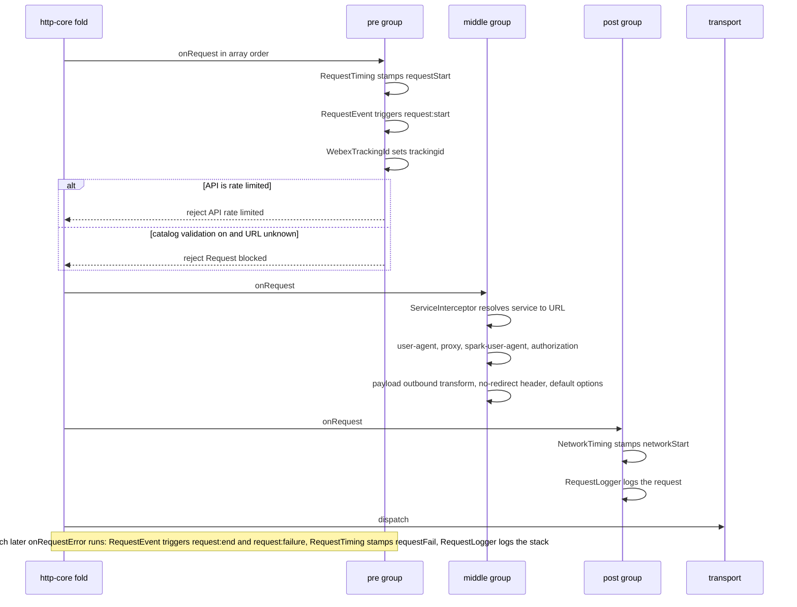
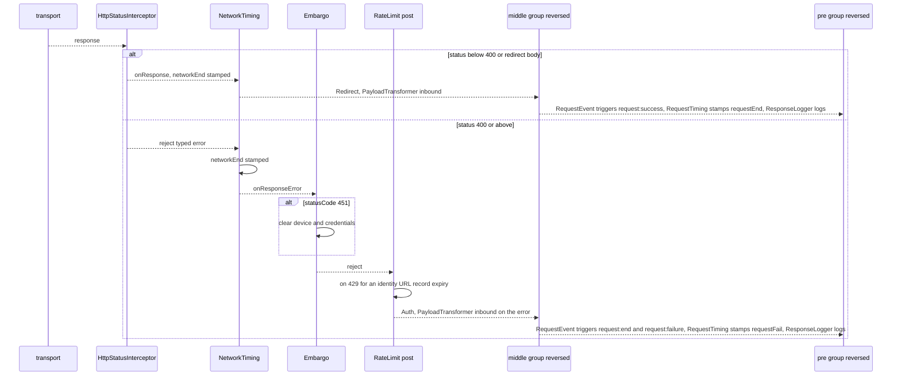
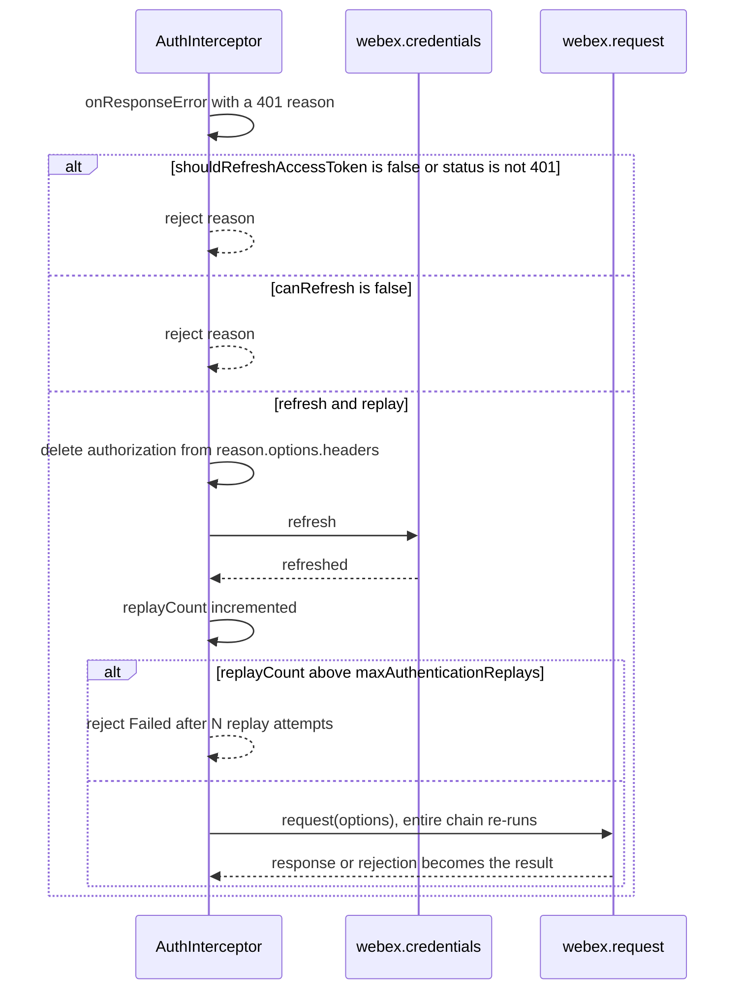
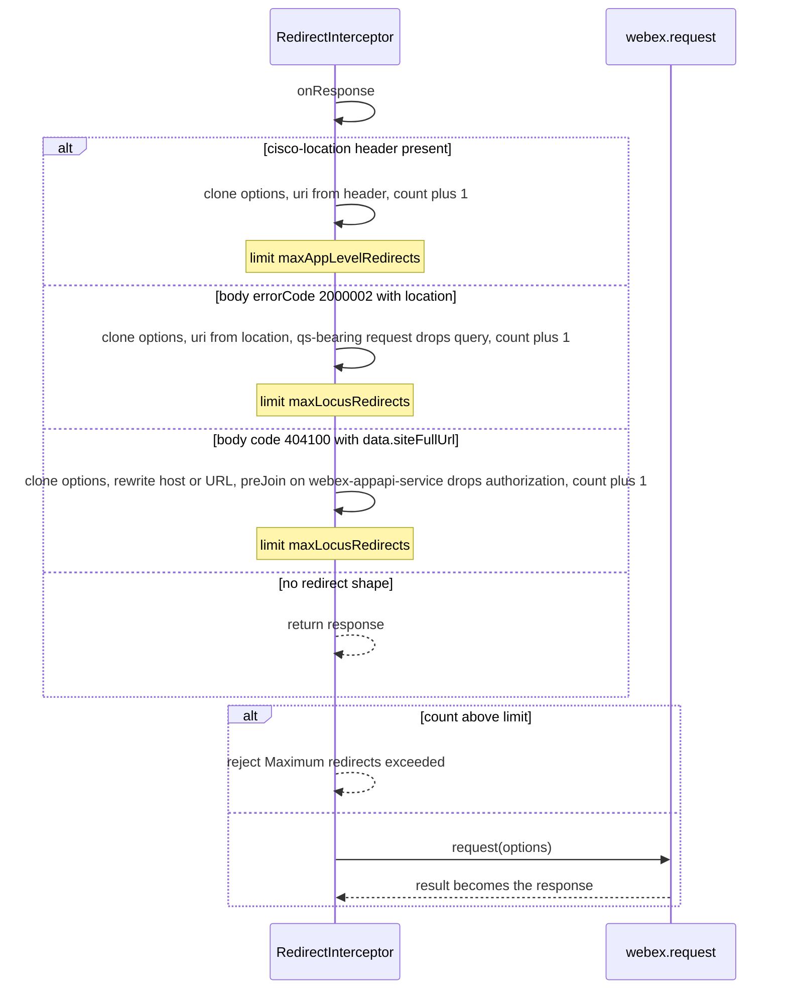
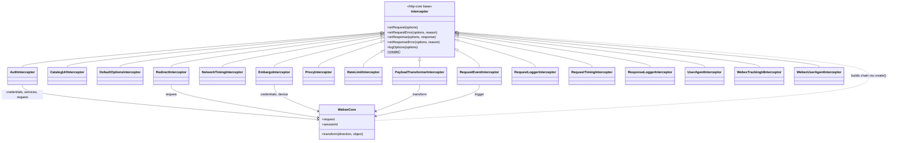

<!-- sdd-generated-metadata
doc_kind: module-spec
generated_from: module-spec@0.3.0
generated_by: claude-code
approved_by: pending
updated_at: 2026-10-07T13:20:21Z
validation_status: pass-with-warnings
-->

# interceptors

This source-local document at `src/interceptors/docs/README.md` owns the stable specification for the
**default interceptor set** of `@webex/webex-core`: sixteen `Interceptor` subclasses, one file each,
that add authentication, correlation, routing safety, redirect handling, timing, logging, event
emission, payload transformation, and failure side effects around every request the SDK makes.

The package export surface, the `WebexCore` constructor that instantiates and orders these classes,
and the configuration defaults they read belong to the parent module and are specified in
[`src/docs/README.md`](../../docs/README.md). The service-catalog interceptors in `src/lib/interceptors`
(`ServiceInterceptor`, `HostMapInterceptor`, `ServerErrorInterceptor`) belong to the services child
module and are referenced here only where ordering depends on them.

Related context: [repository architecture](../../../docs/architecture.md) ·
[documentation index](../../../docs/index.md) · [agent instructions](../../../AGENTS.md) ·
[specification registry](../../../docs/specs/README.md)

## Metadata

| Field             | Value                                          |
| ----------------- | ---------------------------------------------- |
| Owner             | Cisco Webex for Developers                     |
| Source path       | `src/interceptors`                             |
| Resource kind     | Capability module                              |
| Status            | Active                                         |
| Last verified     | 2026-10-07                                     |
| Module id         | `src/interceptors`                             |
| Parent spec       | [`src/docs/README.md`](../../docs/README.md)   |
| Doc kind          | Module spec                                    |
| Coverage score    | 93.8% assessed 2026-10-07; 15 of 16 mandatory fields present; critical 8 of 8; independent validation pass-with-warnings 2026-10-07 |
| Validation status | Pass with warnings — 2026-10-07; runtime `01a1166d-02d9-7772-bc25-1a801fb5f1d1`; 0 Blocking, 8 Important, 3 Medium |

## Applicability

| Condition ID                         | Status     | Evidence or reason                                                                                                            | Owned section                 |
| ------------------------------------ | ---------- | ----------------------------------------------------------------------------------------------------------------------------- | ----------------------------- |
| `module.has_tiers`                   | N/A        | The repository assigns no operational or review tiers                                                                         | Tier                          |
| `module.has_ui`                      | N/A        | No components or rendering                                                                                                    | UI use-case flow              |
| `module.crosses_service_boundaries`  | Applicable | `src/interceptors/auth.js` consults the service catalog and refreshes tokens; `src/interceptors/redirect.js` re-issues requests | Cross-boundary use-case flow  |
| `module.holds_client_state`          | Applicable | Rate-limit expiry maps, tracking-id sequence counters, and per-request $timings, $redirectCount, replayCount markers   | Client state model            |
| `module.enforces_domain_rules`       | Applicable | `src/interceptors/catalog-url.js` host allow-listing, `src/interceptors/embargo.js` HTTP 451 handling, redirect and replay ceilings | Business rules and invariants |
| `module.is_concurrent_async`         | Applicable | Promise-returning hooks, re-entrant webex.request calls, and a shared in-flight inbound transform in `src/interceptors/payload-transformer.js` | Concurrency and reactive flow |
| `module.owns_persistence`            | N/A        | All state is in-memory and per interceptor instance or per request                                                            | Data, schema, and migration   |
| `module.stateful_transitions`        | N/A        | Counters on the options object are bounded retries, not a lifecycle with named states                                         | State machine                 |
| `module.exposes_wire_protocol`       | Applicable | Request and response header names and body error codes in `src/interceptors/redirect.js`, `src/interceptors/webex-tracking-id.js`, `src/interceptors/webex-user-agent.js` | Protocol and wire format      |
| `module.ui_multi_screen`             | N/A        | Gated by module.has_ui, which is N/A                                                                                          | UI flow                       |
| `module.large_data_model`            | N/A        | Gated by module.owns_persistence, which is N/A                                                                                | Data model                    |
| `module.returns_caller_errors`       | Applicable | Rejections originate in `src/interceptors/catalog-url.js`, `src/interceptors/rate-limit.js`, `src/interceptors/redirect.js`, `src/interceptors/auth.js` | Caller-visible failure modes  |
| `module.module_specific_conventions` | Applicable | Hooks must mirror the base-class return contract and be registered by name in `src/webex-core.js`                              | Module-specific rules         |
| `module.published_package`           | Applicable | All sixteen classes are re-exported from `src/index.js`; `package.json` declares the entry point                    | Export stability              |
| `module.embedded_in_host`            | N/A        | Not mounted into a host application                                                                                           | Host integration and theming  |
| `module.has_design_tradeoff`         | Applicable | One shared pipeline and ordering mutate a single options object; replay and redirect re-enter the whole chain                  | Key design trade-off          |
| `module.has_submodules`              | N/A        | No child modules; computed from the manifest module tree                                                                      | Sub-modules                   |

## Evidence register

| Evidence                                           | What it establishes                                                                                         |
| -------------------------------------------------- | ----------------------------------------------------------------------------------------------------------- |
| `src/interceptors/auth.js`                         | Header injection, credential-requirement decision, 401 refresh and replay                                   |
| `src/interceptors/catalog-url.js`                  | Catalog and allowed-domain URL validation                                                                   |
| `src/interceptors/default-options.js`              | Merge of configured default request options                                                                 |
| `src/interceptors/embargo.js`                      | HTTP 451 credential and device clearing                                                                     |
| `src/interceptors/network-timing.js`               | `networkStart` and `networkEnd` timestamps                                                                  |
| `src/interceptors/payload-transformer.js`          | Outbound, inbound, and error payload transforms and the repeated-inbound guard                              |
| `src/interceptors/proxy.js`                        | Node-only proxy option                                                                                      |
| `src/interceptors/rate-limit.js`                   | Identity-API 429 bookkeeping and short-circuit                                                              |
| `src/interceptors/redirect.js`                     | No-redirect request header and the three redirect shapes                                                    |
| `src/interceptors/request-event.js`                | `request:*` event emission                                                                                  |
| `src/interceptors/request-logger.js`               | Request log lines and verbose option dump                                                                   |
| `src/interceptors/request-timing.js`               | `requestStart`, `requestEnd`, `requestFail` timestamps                                                      |
| `src/interceptors/response-logger.js`              | Response log lines, durations, and verbose body dump                                                        |
| `src/interceptors/user-agent.js`                   | Node-only `user-agent` header                                                                               |
| `src/interceptors/webex-tracking-id.js`            | `trackingid` header generation and replay suffix                                                            |
| `src/interceptors/webex-user-agent.js`             | `spark-user-agent` header composition                                                                       |
| `src/webex-core.js`                                | The registry map, the pre and post lists, the assembly algorithm, and the opt-in rule for `CatalogUrlInterceptor` |
| `src/config.js`                                    | Defaults for the redirect and replay ceilings, `payloadTransformer`, and `services.validateCatalogUrls`     |
| `src/index.js`                                     | Which interceptor classes are exported                                                                      |
| `src/lib/webex-core-plugin-mixin.js`               | How plugins add entries to the shared interceptor registry                                                  |
| `test/unit/spec/interceptors/auth.js`              | Auth header, credential decision, refresh, replay, and opt-out cases                                        |
| `test/unit/spec/interceptors/catalog-url.js`       | Allow, block, bypass, and allowed-domains cases                                                             |
| `test/unit/spec/interceptors/rate-limit.js`        | Rate-limit helpers; ten of its cases are skipped                                                            |
| `test/unit/spec/interceptors/redirect.js`          | Locus and App API redirects, ceilings, and preJoin authorization removal                                  |
| `test/unit/spec/interceptors/payload-transformer.js` | Outbound transform and the repeated-inbound guard                                                         |
| `test/unit/spec/webex-core.js`                     | Assembled interceptor order and counts (parent-owned)                                                       |
| `test/integration/spec/unit-browser/auth.js`       | Refresh-and-replay against a live environment                                                               |

The `### Configuration surface` extension heading under Public surface is justified because the config keys
these classes read (`src/config.js`) are a published consumer contract with no slot in the module template;
keys whose behavior is parent-owned are pointed at the parent spec rather than restated.

The base contract these classes inherit is the `Interceptor` class of the http-core package, described
in its specification: four pass-through hooks (`onRequest`, `onRequestError`, `onResponse`,
`onResponseError`), a `logOptions` helper, and a `create()` that throws unless overridden. This
specification does not restate that contract; it records how each subclass here departs from or
relies on it.

## Purpose and boundary

- **Responsibility:** provide the behaviors every SDK HTTP request needs before it reaches the
  transport and after it returns, each isolated in one class so the set can be reordered, replaced,
  or extended through configuration.
- **In scope:** the sixteen classes, one file each under `src/interceptors` (see Structure and key files); the header names, option keys, and
  config keys each reads or writes; the errors each raises; the retry and replay behavior of
  `AuthInterceptor` and `RedirectInterceptor`; the per-request markers they leave on the options
  object.
- **Out of scope:** instantiation and ordering (parent module); `ServiceInterceptor`,
  `HostMapInterceptor`, and `ServerErrorInterceptor` (services child); the status-to-error
  conversion, which is the http-core `HttpStatusInterceptor`; the credential and token behavior that
  `AuthInterceptor` calls into (credentials child); the transport and the interceptor fold (http-core).
- **Consumers:** `WebexCore` builds the chain in `src/webex-core.js`, so every plugin request flows
  through these classes. `internal-plugin-metrics` subscribes to the `request:start`,
  `request:success`, and `request:failure` events this module emits. No other package in the
  repository imports an interceptor class by name from this package.

## Structure and key files

| Path                                      | Responsibility                                                                                   |
| ----------------------------------------- | ------------------------------------------------------------------------------------------------ |
| `src/interceptors/auth.js`                | Adds the user token as `authorization`; on 401 refreshes credentials and replays the request     |
| `src/interceptors/catalog-url.js`         | Rejects request URLs that are neither in the service catalog nor in the allowed domains          |
| `src/interceptors/default-options.js`     | Fills missing request options from `config.defaultRequestOptions`                                |
| `src/interceptors/embargo.js`             | On HTTP 451, clears credentials and the device registration, then re-rejects                     |
| `src/interceptors/network-timing.js`      | Stamps `$timings.networkStart` and `$timings.networkEnd`                                         |
| `src/interceptors/payload-transformer.js` | Runs the core `transform` pipeline on outbound options, inbound responses, and inbound errors    |
| `src/interceptors/proxy.js`               | Sets `options.proxy` from `config.proxy` outside the browser                                     |
| `src/interceptors/rate-limit.js`          | Rejects identity-API requests while a 429 `retry-after` window is open                           |
| `src/interceptors/redirect.js`            | Opts out of server-side redirects and follows three application-level redirect forms             |
| `src/interceptors/request-event.js`       | Triggers `request:start`, `request:success`, `request:failure`, `request:end` on the webex object |
| `src/interceptors/request-logger.js`      | Logs the outgoing request, and optionally the full options                                       |
| `src/interceptors/request-timing.js`      | Stamps `$timings.requestStart`, `requestEnd`, `requestFail`                                      |
| `src/interceptors/response-logger.js`     | Logs status, tracking id, and network and processing durations                                   |
| `src/interceptors/user-agent.js`          | Sets the `user-agent` header outside the browser                                                 |
| `src/interceptors/webex-tracking-id.js`   | Sets the `trackingid` header as `<sessionId>_<sequence>`, with a replay suffix                   |
| `src/interceptors/webex-user-agent.js`    | Sets the `spark-user-agent` header                                                               |

Every file exports exactly one default class with a static `create()` that is invoked with the
`WebexCore` instance as `this`. Only `src/interceptors/webex-tracking-id.js` has a second export
(`sequenceNumbers`). `src/index.js` re-exports all sixteen classes and the counter map (as `webexTrackingIdSequenceNumbers`).

## Public surface

| Surface | Contract | Consumer | Compatibility commitment | Source |
| --- | --- | --- | --- | --- |
| Interceptor classes (all 16) | `webex-core-interceptors` | Packages assembling a custom chain through `config.interceptors` | Class names are the registry keys and are therefore stable; behavior is not versioned separately | `src/index.js` |
| `create()` factories | `webex-core-interceptors` | `WebexCore` and plugins registering interceptors | Called with the webex instance as `this`; `NetworkTimingInterceptor` and `RequestTimingInterceptor` pass `this` as constructor attributes instead, see Pitfalls | `src/webex-core.js` |
| `request:start`, `request:success`, `request:failure`, `request:end` events | `webex-core-interceptors` | `internal-plugin-metrics` and any `webex.on` subscriber | Emitted on the webex instance with the options (and response or error) as arguments | `src/interceptors/request-event.js` |
| `trackingid`, `spark-user-agent`, `user-agent`, `authorization`, `cisco-no-http-redirect` request headers | `webex-core-interceptors` | Webex service backends | See Protocol and wire format | `src/interceptors/webex-tracking-id.js`, `src/interceptors/webex-user-agent.js`, `src/interceptors/auth.js`, `src/interceptors/redirect.js` |
| `sequenceNumbers` | `webex-core-interceptors` | Tests | Exported map keyed by interceptor instance; re-exported by the package under the name `webexTrackingIdSequenceNumbers` | `src/interceptors/webex-tracking-id.js` |

The module provides `webex-core-interceptors` and requires `http-core-sdk`, `webex-common-js-api`,
`webex-core-credentials`, and `webex-core-services`. The repository-wide index of contract ids is
[Public and consumer surfaces](../../../docs/architecture.md#public-and-consumer-surfaces).

### Configuration surface

Defaults live in `src/config.js`. Keys that govern chain assembly are owned by the parent spec
([`src/docs/README.md`](../../docs/README.md)) and are not restated here: `config.interceptors`
(`MOD-022`), `config.services.validateCatalogUrls` (`MOD-025`), the `ENABLE_NETWORK_LOGGING` and
`ENABLE_VERBOSE_NETWORK_LOGGING` switches (`MOD-024`), and the tracking-id prefix keys (`MOD-029`). The
keys below are read by the interceptors themselves.

| Key | Read by | Effect | Default |
| --- | --- | --- | --- |
| `config.maxAuthenticationReplays` | `src/interceptors/auth.js` | Ceiling on 401 replays per request | `1` |
| `config.maxAppLevelRedirects` | `src/interceptors/redirect.js` | Ceiling for `cisco-location` header redirects | `10` |
| `config.maxLocusRedirects` | `src/interceptors/redirect.js` | Ceiling for Locus and App API body redirects | `5` |
| `config.defaultRequestOptions` | `src/interceptors/default-options.js` | Options merged into requests that lack the key | unset |
| `config.proxy` | `src/interceptors/proxy.js` | Value assigned to `options.proxy` in Node | unset |
| `config.appName`, `config.appVersion`, `config.appPlatform` | `src/interceptors/user-agent.js`, `src/interceptors/webex-user-agent.js` | Application identity in both user-agent headers | unset; version falls back to `0.0` |
| `config.credentials.samlUrl`, `tokenUrl`, `authorizeUrl` | `src/interceptors/redirect.js`, `src/interceptors/webex-user-agent.js` | URLs exempted from redirect-header and spark-user-agent injection | from the credentials config |
| `config.payloadTransformer.skipRepeatedInboundTransforms` | `src/interceptors/payload-transformer.js` | Runs the inbound transform at most once per response object | `false` |

## Dependencies

| Dependency | Why it is required | Failure behavior |
| --- | --- | --- |
| http-core `Interceptor` base class (see its specification) | Supplies the four pass-through hooks, attribute injection by constructor, and `create()` | `create()` throws if a subclass omits it; the chain fold routes a hook rejection to the next interceptor's error hook |
| `webex.credentials` | `AuthInterceptor` reads `getUserToken()`, `canRefresh`, `refresh()`; `EmbargoInterceptor` calls `clear()` | A rejection from `getUserToken()` or `refresh()` propagates out of the hook |
| `webex.internal.services` | `AuthInterceptor` and `CatalogUrlInterceptor` use `getServiceFromUrl`, `waitForService`, `validateDomains`, `hasAllowedDomains`, `isAllowedDomainUrl` | Absent services: auth skips the header; catalog validation logs a warning and allows. A `waitForService` rejection is logged and treated as "no credentials" |
| `webex.internal.device` | `EmbargoInterceptor` clears it when mounted | Skipped when the plugin is absent |
| webex.request | `AuthInterceptor.replay` and `RedirectInterceptor` re-enter the full chain | Their result or rejection becomes the hook's result |
| `webex.transform` | `PayloadTransformerInterceptor` | A transform rejection propagates; the repeated-inbound guard clears its memo first |
| `webex.logger` | All logging interceptors and `AuthInterceptor` | Logging interceptors fall back to `console`; `CatalogUrlInterceptor` uses optional chaining |
| `webex.trigger` | `RequestEventInterceptor` | A throwing event handler is caught and logged at `warn` |
| the common-package `inBrowser` and `isBuffer` (see its specification) | Skip proxy and `user-agent` in browsers; label `webex-user-agent` platform; detect file bodies in logs | Load-time dependency |
| `lodash` | `get`, `has`, `omit`, `clone`, `isArray`, `isString` | Load-time dependency; read from code, no spec |
| `util` (Node built-in) | `util.inspect` in the two loggers | Polyfilled by bundlers |
| Identity broker service (`idbroker-oauth-service`) | Named by `RateLimitInterceptor` and `RedirectInterceptor` as URL patterns; `AuthInterceptor` reaches it indirectly through credentials refresh | Not called directly from this module |

## Requirements

| ID | WHAT | WHY | Source evidence | Test or example evidence | Assumptions or gaps | Confidence |
| --- | --- | --- | --- | --- | --- | --- |
| `INT-001` | `AuthInterceptor` leaves the request untouched when `options.headers` already holds an `authorization` key or `options.auth` is present; a falsy `authorization` value is deleted | A caller-supplied credential must win, and a null header must not trigger a CORS preflight | `src/interceptors/auth.js` | `test/unit/spec/interceptors/auth.js` | none | Present |
| `INT-002` | `AuthInterceptor` sets `authorization` to `webex.credentials.getUserToken()` stringified only when `requiresCredentials` resolves true | Only requests bound for Webex services should carry the user token | `src/interceptors/auth.js` | `test/unit/spec/interceptors/auth.js` | none | Present |
| `INT-003` | `requiresCredentials` resolves false when `options.addAuthHeader === false` or when the services plugin is not mounted | Lets callers opt out, and avoids a catalog lookup before the plugin exists | `src/interceptors/auth.js` | `test/unit/spec/interceptors/auth.js` | none | Present |
| `INT-004` | The `u2c` service (by `options.service`, `options.api`, or URL match) requires credentials unless `options.resource` or `options.uri` contains `limited` | The limited U2C catalog is the unauthenticated bootstrap path | `src/interceptors/auth.js` | `test/unit/spec/interceptors/auth.js` | none | Present |
| `INT-005` | A URL under a configured allowed domain requires credentials when `services.validateDomains` is on and allowed domains exist | Extends the token to customer-approved hosts outside the catalog | `src/interceptors/auth.js` | `test/unit/spec/interceptors/auth.js` | none | Present |
| `INT-006` | Otherwise `requiresCredentials` awaits `services.waitForService({name, url})` and is true only if the resolved URL maps to a catalog service; a rejection is logged at `warn` and yields false | A request whose service has not loaded yet must wait for the catalog rather than go out unauthenticated; a failure must not block the request | `src/interceptors/auth.js` | `test/unit/spec/interceptors/auth.js` | The failure branch is exercised only indirectly | Present |
| `INT-007` | On a 401, unless `options.shouldRefreshAccessToken === false`, `AuthInterceptor` deletes `authorization` from `reason.options.headers`, calls `credentials.refresh()` when `canRefresh`, then replays | A stale token should be replaced once without surfacing the 401 | `src/interceptors/auth.js` | `test/unit/spec/interceptors/auth.js`, `test/integration/spec/unit-browser/auth.js` | none | Present |
| `INT-008` | A non-refreshable 401, a non-401 error, or an opted-out request re-rejects the original reason | Callers must see the server's error when no recovery is possible | `src/interceptors/auth.js` | `test/unit/spec/interceptors/auth.js` | none | Present |
| `INT-009` | `replay` increments `options.replayCount` and rejects with `Error('Failed after N replay attempts')` once the count exceeds `config.maxAuthenticationReplays`; otherwise it calls `webex.request(options)` | Bounds the refresh-and-retry loop | `src/interceptors/auth.js`, `src/config.js` | none found | Gap: the over-limit branch is not asserted; see the second-401 pitfall | Present |
| `INT-010` | `CatalogUrlInterceptor` passes a request that has `options.service` and no URI or URL, and a request with no URL at all | A service-addressed request is resolved to a URL later in the chain, by the services interceptor | `src/interceptors/catalog-url.js` | `test/unit/spec/interceptors/catalog-url.js` | none | Present |
| `INT-011` | `CatalogUrlInterceptor` passes a URL that `services.getServiceFromUrl` recognizes, or one that `isAllowedDomainUrl` accepts when `validateDomains` is on and allowed domains exist, and otherwise rejects with `Request blocked: URL not in service catalog or allowed domains: <url>.` | Blocks request-forgery through attacker-supplied URLs, for example ones injected from server messages | `src/interceptors/catalog-url.js` | `test/unit/spec/interceptors/catalog-url.js` | none | Present |
| `INT-012` | `CatalogUrlInterceptor` allows the request and logs a `warn` when the services plugin is not mounted | The catalog cannot be consulted, and failing closed would break startup | `src/interceptors/catalog-url.js` | `test/unit/spec/interceptors/catalog-url.js` | The `warn` call is not asserted | Present |
| `INT-013` | Whether `CatalogUrlInterceptor` is in the chain at all is decided by the parent (`MOD-025`: only when `config.services.validateCatalogUrls === true`); this module owns only what it does once present (`INT-010` to `INT-012`) | Opt-in gate is chain assembly, not interceptor behavior; recorded once in the parent | `src/interceptors/catalog-url.js` | `test/unit/spec/interceptors/catalog-url.js` | Gate and its tests are parent-owned (`MOD-025`) | Present |
| `INT-014` | `DefaultOptionsInterceptor` copies each `config.defaultRequestOptions` key onto the request unless the request already has that key | Lets an integrator set, for example, a global `timeout` without overriding per-call values | `src/interceptors/default-options.js` | `test/unit/spec/interceptors/default-options.js` | none | Present |
| `INT-015` | `EmbargoInterceptor` on a 451 clears `webex.internal.device` when mounted and `webex.credentials`, logs at `info`, and rejects with the original reason; other statuses are re-rejected untouched | A legally embargoed client must drop its registration and tokens | `src/interceptors/embargo.js` | `test/unit/spec/interceptors/embargo.js` | none | Present |
| `INT-016` | `NetworkTimingInterceptor` sets `$timings.networkStart` on request and `$timings.networkEnd` on response and on response error | Separates wire time from interceptor-processing time | `src/interceptors/network-timing.js` | `test/unit/spec/interceptors/network-timing.js` | Gap: the response-error branch is not tested | Present |
| `INT-017` | `RequestTimingInterceptor` sets `requestStart` on request, `requestEnd` on response, and `requestEnd` plus `requestFail` on a request or response error | Gives total elapsed time and a failure marker | `src/interceptors/request-timing.js` | `test/unit/spec/interceptors/request-timing.js` | none | Present |
| `INT-018` | `PayloadTransformerInterceptor` runs `webex.transform('outbound', options)` unless `options.noTransform`, `transform('inbound', response)` unless `options.disableTransform`, and `transform('inbound', reason)` on errors, rejecting with the transformed reason | Encryption and similar plugin transforms apply uniformly on both directions, including error bodies | `src/interceptors/payload-transformer.js` | `test/unit/spec/interceptors/payload-transformer.js` | Gap: the `noTransform` and `disableTransform` outputs are only partly asserted | Present |
| `INT-019` | When `config.payloadTransformer.skipRepeatedInboundTransforms` is on, the first inbound transform for a response object is memoized as a non-enumerable property, shared by concurrent callers, and discarded if it rejects; a response with `disableTransform` is not marked | The same response may traverse more than one pipeline, and decrypting twice would corrupt it | `src/interceptors/payload-transformer.js`, `src/config.js` | `test/unit/spec/interceptors/payload-transformer.js` | none | Present |
| `INT-020` | `ProxyInterceptor` assigns `options.proxy` from `config.proxy` in Node only; it assigns nothing in a browser or when no proxy is configured | Browsers cannot set a proxy; Node needs one injected | `src/interceptors/proxy.js` | `test/unit/spec/interceptors/proxy.js` | none | Present |
| `INT-021` | `RateLimitInterceptor` rejects with `API rate limited <uri>` a request whose URI contains `idbroker` or `identity` while an expiry is recorded for it | Avoids hammering the identity API during a 429 window | `src/interceptors/rate-limit.js` | `test/unit/spec/interceptors/rate-limit.js` | Defect: the expiry can never be recorded, see Pitfalls; the positive-case tests are skipped | Weak |
| `INT-022` | `extractRetryAfterTime` returns 60000 ms when the header is absent or not positive, 3600000 ms when it exceeds 3600 s, and otherwise the header value in ms | Bounds the block window to a sane range | `src/interceptors/rate-limit.js` | `test/unit/spec/interceptors/rate-limit.js` | none | Present |
| `INT-023` | `RedirectInterceptor` sets the request header `cisco-no-http-redirect: true` and initializes $redirectCount to `0` unless the URI contains `https://idbroker` or one of the configured SAML, token, or authorize URLs, or the caller already set the header (a falsy value deletes it) | The service must answer with a redirect instruction the SDK follows itself, so authorization and routing stay under SDK control | `src/interceptors/redirect.js` | none found | Gap: the request side is untested | Present |
| `INT-024` | A response carrying a `cisco-location` header is re-issued to that URI with $redirectCount incremented, and rejects with `Maximum redirects exceeded` above `config.maxAppLevelRedirects` | Follows service-directed relocation with a bound | `src/interceptors/redirect.js`, `src/config.js` | none found | Gap: no test covers the header form | Present |
| `INT-025` | A response body with `errorCode` `2000002` and a `location` is re-issued to that location, with its query string dropped when the original request used `qs`, bounded by `config.maxLocusRedirects` | The Locus service signals a home-cluster change in the body of a 404 that the status interceptor passes through | `src/interceptors/redirect.js`, `src/config.js` | `test/unit/spec/interceptors/redirect.js` | none | Present |
| `INT-026` | A response body with `code` `404100` and `data.siteFullUrl` is re-issued with the host replaced (GET) or the URL replaced (POST with `qs`), bounded by `config.maxLocusRedirects`; for `resource: 'preJoin'` on `service: 'webex-appapi-service'` the `authorization` header is set to `false` | The App API redirects to another site, and the pre-join call must not send the token there | `src/interceptors/redirect.js`, `src/config.js` | `test/unit/spec/interceptors/redirect.js` | none | Present |
| `INT-027` | `RequestEventInterceptor` triggers `request:start` on request, `request:success` with `response.options` and the response on success, and `request:end` plus `request:failure` on a request or response error; a throwing handler is caught and logged | Metrics and diagnostics subscribe without being able to break a request | `src/interceptors/request-event.js` | none found | Gap: no unit test covers this file | Present |
| `INT-028` | `WebexTrackingIdInterceptor` sets `trackingid` to `<webex.sessionId>_<n>` with a per-instance counter that increments on each access, keeps a caller-supplied value, and deletes a falsy one | Correlates a request across client and server logs, and a null header avoids a preflight | `src/interceptors/webex-tracking-id.js` | `test/unit/spec/interceptors/webex-tracking-id.js` | none | Present |
| `INT-029` | When `options.replayCount` is set and a tracking id exists, the second `+`-delimited segment is set to the replay count | Distinguishes a replay from the original in server logs | `src/interceptors/webex-tracking-id.js` | none found | Gap: untested | Present |
| `INT-030` | `WebexUserAgentInterceptor` sets `spark-user-agent` to `<webex or webex-js-sdk>/<version> (<web or node>)`, plus ` appName/appVersion` and ` appPlatform` when configured; a caller value is kept and a falsy one deleted; token, SAML, authorize, and `https://idbroker` URLs are skipped | Identifies the SDK and host app; the identity endpoints are excluded by design | `src/interceptors/webex-user-agent.js` | `test/unit/spec/interceptors/webex-user-agent.js` | Gap: the skip for identity URLs is untested | Present |
| `INT-031` | `UserAgentInterceptor` sets `user-agent` in Node to `appName/appVersion` when `appName` is set, else `@webex/http-core`, unless both `user-agent` and `spark-user-agent` are already present; it never sets it in a browser | Browsers forbid overriding that header | `src/interceptors/user-agent.js` | `test/unit/spec/interceptors/user-agent.js` | none | Present |
| `INT-032` | The two logger interceptors are registered only when `ENABLE_NETWORK_LOGGING` or `ENABLE_VERBOSE_NETWORK_LOGGING` is set at load; verbose dumps additionally need the verbose switch, omit a non-array, non-string request body, and replace string or buffer response bodies with a placeholder | Full dumps contain secrets and payloads and must stay off by default | `src/interceptors/request-logger.js`, `src/interceptors/response-logger.js`, `src/webex-core.js` | none found | Gap: no unit test covers either logger | Present |
| `INT-033` | Interceptor ordering is parent-owned (`MOD-023`); the effect on this module is that pre-group hooks bracket all others, `HttpStatusInterceptor` sits closest to the transport so later error hooks see typed errors, and `RateLimitInterceptor` is instantiated in both groups | Every hook's correctness depends on its position, but the lists are recorded once in the parent | `src/webex-core.js` | `test/unit/spec/webex-core.js` | Wiring and group lists are owned by `MOD-023` | Present |

## Design overview

The module is a set of independent single-purpose classes sharing one convention: a hook receives the
mutable options object (or response or error), mutates or inspects it, and returns it, a response, or
a rejected promise. None of them holds a reference to another; all coupling is through fields on the
options object (`$timings`, `$redirectCount`, `replayCount`, `headers`) and through the shared
`webex` instance injected by `create()`.

**Ordering is the design.** `src/webex-core.js` builds the chain in three groups (parent `MOD-023`). The
http-core fold runs request hooks in array order and response hooks in reverse, so the pre group is
the outermost layer: its request hooks run first, its response hooks last. That is why
`ResponseLoggerInterceptor` and `RequestTimingInterceptor` are first in the array. By the time their
response hooks run, `NetworkTimingInterceptor.onResponse` and the redirect and payload hooks have
completed and `$timings` is fully populated. `HttpStatusInterceptor` is first of the post group, so
its `onResponse` runs first on the way back and converts a failing status into a rejection that every
other interceptor's `onResponseError` then sees. `RateLimitInterceptor` appears in both the pre and
post groups, so two instances with independent state exist; each sees every rejection on the response
path.

**Re-entry instead of a retry loop.** Neither `AuthInterceptor` nor `RedirectInterceptor` retries
internally. Both call `webex.request(options)`, which runs the entire chain a second time on the same
options object, and the nested result becomes the outer hook's result. The ceilings
(`maxAuthenticationReplays`, `maxAppLevelRedirects`, `maxLocusRedirects`) are counters on the options
object (`replayCount`, `$redirectCount`) that survive re-entry because the options are reused or
shallow-cloned.

**Two generations of factory.** Most classes build themselves with
`new X({webex: this})` so that the base class defines `webex` on the instance. `NetworkTimingInterceptor`
and `RequestTimingInterceptor` instead call `new X(this, options)`, passing the webex instance itself as
the attributes bag, which copies webex's own enumerable keys onto the interceptor and leaves
`this.webex` undefined. This works only because those two never read `this.webex`.

**State is tiny and instance-scoped.** `WeakMap`s hold the computed user-agent and proxy strings and the
rate-limit expiry map; a module-level `Map` holds tracking-id counters. Nothing is persisted.

## Data flow and sequence coverage

The transport is HTTP, driven by the http-core fold. Operation groups with different actors, ordering,
or failure outcomes are diagrammed separately: header and request preparation, response conversion and
error side effects, the 401 refresh-and-replay loop, the redirect loop, and the inbound payload
transform.

| Operation group | Entry and outcome | Diagram or evidence | Failure and recovery coverage |
| --- | --- | --- | --- |
| Request preparation | Options flow forward through the chain; headers, timings, and guards applied | Diagram 1 | `RateLimitInterceptor` and `CatalogUrlInterceptor` reject before the transport; request-error hooks of `RequestEventInterceptor`, `RequestTimingInterceptor`, and `RequestLoggerInterceptor` observe the rejection |
| Response conversion and error side effects | Status interceptor converts, then error hooks run in reverse | Diagram 2 | 451 clears state; 429 records an expiry (see Pitfalls); everything else re-rejects |
| Authentication replay | 401 triggers refresh, then the whole chain re-runs | Diagram 3 | Not refreshable, opted out, or over the ceiling: reject |
| Redirect following | Redirect-shaped success response re-issues the request | Diagram 4 | Over the ceiling: `Maximum redirects exceeded` |
| Inbound payload transform | Response and error bodies pass through `webex.transform` | `src/interceptors/payload-transformer.js`, `test/unit/spec/interceptors/payload-transformer.js` | Memo cleared on rejection |

**1. Request preparation**

**2. Response conversion and error side effects**

**3. Authentication replay**

**4. Redirect following**

## Class and component relationships

Timing state is the one cross-class dependency: `ResponseLoggerInterceptor` reads `$timings` values
that `RequestTimingInterceptor` and `NetworkTimingInterceptor` write, and throws if they were not
registered ahead of it (see Pitfalls).

## Use cases and flows

| Use case | Actor or caller | Primary steps and outcome | Failure or boundary behavior | Evidence |
| --- | --- | --- | --- | --- |
| `UC-001` | Plugin calling a catalog service | `trackingid`, `spark-user-agent`, and `authorization` are added, the request goes out, and a typed response returns | A service not yet in the catalog makes `requiresCredentials` wait on `waitForService` | `src/interceptors/auth.js`, `test/unit/spec/interceptors/auth.js` |
| `UC-002` | Plugin whose token expired | The server answers 401, the token is refreshed, and the request is replayed with `trackingid` suffixed by the replay count | A second 401 rejects with `Failed after 1 replay attempts` (see the second-401 pitfall) | `src/interceptors/auth.js`, `src/interceptors/webex-tracking-id.js`, `test/integration/spec/unit-browser/auth.js` |
| `UC-003` | Integrator with strict egress | Sets `services.validateCatalogUrls: true`; a request to an unknown host is rejected before dispatch | Allowed domains are honored; a request addressed by `service` and no URL is not blocked here | `src/interceptors/catalog-url.js`, `test/unit/spec/interceptors/catalog-url.js` |
| `UC-004` | Integrator setting a global timeout | Sets `defaultRequestOptions.timeout`; requests without their own `timeout` inherit it | A key already on the request, even with a falsy value, is kept | `src/interceptors/default-options.js`, `test/unit/spec/interceptors/default-options.js` |
| `UC-005` | Meetings plugin joining a locus | Locus answers a 404 with a redirect body; the status interceptor lets it through and `RedirectInterceptor` re-issues the request | After five redirects the request rejects with `Maximum redirects exceeded` | `src/interceptors/redirect.js`, `test/unit/spec/interceptors/redirect.js` |
| `UC-006` | Embargoed user | A 451 reply clears credentials and device; the caller still receives the rejection | None; the clear is unconditional on status | `src/interceptors/embargo.js`, `test/unit/spec/interceptors/embargo.js` |
| `UC-007` | Metrics plugin | Subscribes to `request:start`, `request:success`, `request:failure` and receives options, responses, and errors | A subscriber that throws is caught and logged | `src/interceptors/request-event.js` |
| `UC-008` | Developer debugging a network call | Sets `ENABLE_NETWORK_LOGGING` or the verbose switch before load; status, tracking id, and durations are logged | With neither switch the logger interceptors are absent from the chain | `src/interceptors/request-logger.js`, `src/interceptors/response-logger.js`, `src/webex-core.js` |

### Cross-boundary use-case flow

| Boundary | Transport | Ordering | Compatibility | Timeout and retry | Recovery |
| --- | --- | --- | --- | --- | --- |
| SDK to identity broker (token refresh via credentials) | HTTP through `webex.credentials.refresh()`, not directly from this module | Refresh completes before the replay is issued | Header names are server contracts | Replay bounded by `maxAuthenticationReplays`; no timeout of its own | Over the ceiling the replay is refused; a failing refresh rejects the outer request |
| SDK to Locus or App API redirect target | HTTP through webex.request | The redirected request runs the whole chain, including `RedirectInterceptor` again | The body codes `2000002` and `404100` are service contracts | Bounded by `maxLocusRedirects`; none on the header form beyond `maxAppLevelRedirects` | Over the ceiling: reject |
| SDK to service catalog | In-process call to `webex.internal.services` | Evaluated per request, before dispatch | Requires the services plugin for any validation | `waitForService` bounds its own wait | Failure logged; auth treats it as "no credentials" |

## Client state model

| State or slice | Owner | Initial state | Transition triggers | Reset or persistence boundary |
| --- | --- | --- | --- | --- |
| Rate-limit expiry map | `RateLimitInterceptor` instance | Empty map | A 429 on an identity-broker URL (see Pitfalls) | Lives with the instance; never persisted |
| Tracking-id sequence | `sequenceNumbers` map keyed by `WebexTrackingIdInterceptor` instance | Absent, read as 0 | Each read of `sequence` adds 1 | Lives with the process |
| Computed user-agent, proxy, and platform strings | `WeakMap` per file | Set in the constructor | Never changes after construction | Instance lifetime |
| $timings | The request options object | Created by the first timing interceptor | Each timing hook | Per request; carried into a replay or redirect because the options object is reused |
| $redirectCount, replayCount | The request options object | Absent or `0` | Each redirect or replay | Per request lineage |
| Inbound transform memo | The response object, non-enumerable | Absent | First inbound transform when the guard is on | Per response object |

## Business rules and invariants

| ID | Invariant | WHY | Enforcement source | Test evidence |
| --- | --- | --- | --- | --- |
| `INV-001` | When `validateCatalogUrls` is on, no request with a URL leaves the chain unless the catalog or allowed domains vouch for it | The SDK must not be steerable to attacker hosts | `src/interceptors/catalog-url.js`, `src/webex-core.js` | `test/unit/spec/interceptors/catalog-url.js` |
| `INV-002` | Caller-header-wins rule of `INT-001`, `INT-023`, `INT-028`, and `INT-030`: a caller-provided header is never overwritten and a falsy value removes it | Caller intent wins, and a header present with no value would force a CORS preflight | `src/interceptors/auth.js`, `src/interceptors/webex-tracking-id.js`, `src/interceptors/webex-user-agent.js`, `src/interceptors/redirect.js` | `test/unit/spec/interceptors/auth.js`, `test/unit/spec/interceptors/webex-tracking-id.js`, `test/unit/spec/interceptors/webex-user-agent.js` |
| `INV-003` | Replays never exceed `maxAuthenticationReplays` and redirects never exceed their configured ceilings | Prevents unbounded loops | `src/interceptors/auth.js`, `src/interceptors/redirect.js` | `test/unit/spec/interceptors/redirect.js` |
| `INV-004` | A 451 always clears credentials | A legally embargoed session must not persist tokens | `src/interceptors/embargo.js` | `test/unit/spec/interceptors/embargo.js` |
| `INV-005` | The pre-join App API redirect carries no authorization header | The token must not be sent to the redirected site for an unauthenticated pre-join | `src/interceptors/redirect.js` | `test/unit/spec/interceptors/redirect.js` |

## Concurrency and reactive flow

- **Execution model:** promise-based hooks on the host event loop. `AuthInterceptor` and
  `RedirectInterceptor` call `webex.request`, so a single logical request can run the chain several
  times, nested, within the outer response phase.
- **Ordering guarantees:** within one request, hooks run in the order given in parent `MOD-023`, forward for
  requests and reverse for responses. There is no ordering across concurrent requests.
- **Idempotency and retry:** replay and redirect are the only retries, bounded by the counters on the
  options object. Neither deduplicates concurrent requests, so two simultaneous 401s each call
  `credentials.refresh()`; any coalescing is owned by the credentials module, not here.
- **Shared-state protection:** none is needed for per-request state. The tracking-id counter and
  rate-limit map are plain in-memory structures with no locking; the event loop serializes their access.
  The inbound-transform memo is the one deliberate share: concurrent pipelines get the same promise.
- **Blocking restrictions:** `requiresCredentials` may await `waitForService`, which delays the request
  until the catalog resolves. Verbose logging uses synchronous `util.inspect` of the full options.

## Protocol and wire format

| Message or frame | Version | Producer or serializer | Consumer or parser | Compatibility and ordering rule |
| --- | --- | --- | --- | --- |
| Request header `authorization` | Token string from credentials | `src/interceptors/auth.js` | Webex services | Added after the service is resolved; skipped for `addAuthHeader: false` and the limited U2C path |
| Request header `trackingid` | `<sessionId>_<n>`, optional `+<replayCount>` | `src/interceptors/webex-tracking-id.js` | Webex services and log correlation | Counter is per interceptor instance |
| Request header `spark-user-agent` | `<lib>/<version> (<web or node>)` plus app suffix | `src/interceptors/webex-user-agent.js` | Webex services | Omitted for identity-broker and credential endpoints |
| Request header `user-agent` | `appName/appVersion` or `@webex/http-core` | `src/interceptors/user-agent.js` | Webex services | Node only |
| Request header `cisco-no-http-redirect` | `true` | `src/interceptors/redirect.js` | Webex services | Omitted for identity-broker and credential endpoints |
| Response header `cisco-location` | Absolute URI | Webex services | `src/interceptors/redirect.js` | Followed at most `maxAppLevelRedirects` times |
| Response body `errorCode: 2000002`, `location` | Locus redirect | Locus service | `src/interceptors/redirect.js` | Arrives on a 404 the status interceptor passes through |
| Response body `code: 404100`, `data.siteFullUrl` | App API redirect | App API service | `src/interceptors/redirect.js` | Arrives on a 404 the status interceptor passes through |
| Request header `retry-after` (read from the failed request's options, see Pitfalls) | Seconds | Not set by this module | `src/interceptors/rate-limit.js` | Clamped to 60 s to 3600 s |

## Caller-visible failure modes

| Condition | Signal or result | Caller behavior | Retry or recovery | Evidence |
| --- | --- | --- | --- | --- |
| URL not in catalog or allowed domains (opt-in) | Rejection `Request blocked: URL not in service catalog or allowed domains: <url>.` | Treat as a configuration or tampering error | Add the host to allowed domains | `src/interceptors/catalog-url.js`, `test/unit/spec/interceptors/catalog-url.js` |
| Identity API inside a recorded 429 window | Rejection `API rate limited <uri>` | Wait and retry | Window of 60 s to 3600 s; see Pitfalls on whether it can be recorded | `src/interceptors/rate-limit.js` |
| 401 and replay exhausted | Rejection `Failed after N replay attempts`, a plain `Error` rather than an HTTP error | Re-authenticate | None | `src/interceptors/auth.js` |
| 401 and not refreshable | The original HTTP error | Re-authenticate | None | `src/interceptors/auth.js`, `test/unit/spec/interceptors/auth.js` |
| Redirect ceiling exceeded | Rejection `Maximum redirects exceeded`, a plain `Error` | Treat as a service fault | None | `src/interceptors/redirect.js`, `test/unit/spec/interceptors/redirect.js` |
| 451 | The original error, after credentials and device are cleared | Treat the session as ended | Sign in again | `src/interceptors/embargo.js`, `test/unit/spec/interceptors/embargo.js` |
| Event handler throws | Swallowed, logged at `warn` | None | None | `src/interceptors/request-event.js` |
| Inbound transform rejects | The transform's rejection | Caller sees the transform error | Memo discarded so a later call retries | `src/interceptors/payload-transformer.js`, `test/unit/spec/interceptors/payload-transformer.js` |

## Pitfalls and constraints

- **Rate limiting cannot take effect as written.** `src/interceptors/rate-limit.js` extracts the API
  name with a regex that requires the host to end in `ciscospark.com`, and returns capture group 2,
  which is the optional `bts` group; the API name is group 3. For the hosts the tests use
  (`idbroker.webex.com`, `identity.webex.com`) `getApiName` returns `null`, so `setRateLimitExpiry`
  returns `false` and no window is ever opened. `onResponseError` also reads `retry-after` from the
  request options' headers rather than the response. Ten tests that would assert the positive case are
  `it.skip` in `test/unit/spec/interceptors/rate-limit.js`. Treat `INT-021` as inert until the regex and
  group index are corrected.
- **`RateLimitInterceptor` is instantiated twice** because it is named in both the pre and post lists
  in `src/webex-core.js`; the two instances do not share the expiry map.
- **`RequestTimingInterceptor.onRequestError` rejects with the options object, not the reason.**
  `src/interceptors/request-timing.js` calls `Promise.reject(options)`, so a request-phase failure that
  reaches it is replaced by the options in every later error hook and at the caller. It also reads
  `options.$timings`, which is undefined if its own `onRequest` never ran.
- **`NetworkTimingInterceptor` and `RequestTimingInterceptor` pass `this` into the base constructor** in
  `create()`, so they have no `webex` property and copy webex's own enumerable keys onto themselves.
  Do not add code to them that reads `this.webex`.
- **`ResponseLoggerInterceptor` requires both timing interceptors.** It subtracts
  `options.$timings.networkStart` and `requestStart`; with a custom `config.interceptors` that omits
  either timing interceptor (or the logger registered without them), `printResponseHeader` throws on
  an undefined `$timings`.
- **Redirect counting can be skipped.** `RedirectInterceptor.onRequest` returns before setting
  `$redirectCount` for identity-broker and credential URLs and when the caller supplies the header.
  A later redirect response then computes `undefined + 1`, which is `NaN`, and `NaN > max` is false, so
  the ceiling never fires on such a request.
- **`RedirectInterceptor.onRequest` assumes `options.headers` exists.** It does not default it, unlike
  the other header interceptors, so it relies on an earlier interceptor (`WebexTrackingIdInterceptor`)
  having created it.
- **A second 401 refreshes before it is refused.** `AuthInterceptor.onResponseError` calls
  `credentials.refresh()` and only then `replay`, which checks the ceiling, so with the default of `1`
  a second 401 costs one more token refresh.
- **Redirect and replay re-run the whole chain.** `RequestEventInterceptor` therefore emits `request:*`
  events for every leg, and metrics subscribers see each leg as a separate request. `RedirectInterceptor`
  clones options shallowly, so the cloned request shares the original's `headers` object; clearing
  `authorization` on a `preJoin` redirect also mutates the original request's headers.
- **`RequestLoggerInterceptor.onRequestError` calls `onRequest` without awaiting it** and reads
  `reason.stack`, which is undefined for a non-`Error` rejection.
- **`WebexUserAgentInterceptor.onRequest` reads `this.webex.config.credentials`** without optional
  chaining, though it reads other config with `?.`; a webex object with no credentials config throws.
- **Registry slots are reserved by key.** `ServiceInterceptor`, `KmsDryErrorInterceptor`, and
  `ConversationInterceptor` are declared `undefined` in `src/webex-core.js` and filled by plugins
  through `src/lib/webex-core-plugin-mixin.js`; their position in the middle group is the map's key
  order. Moving a key changes where a plugin's interceptor runs.
- **`config.interceptors` bypasses the pre and post grouping.** `src/webex-core.js` then uses that
  object's key order verbatim (still honoring the `CatalogUrlInterceptor` opt-in), so a custom set must
  restate the order in parent `MOD-023` itself.

## Module-specific rules

- **Do:** return the options, response, or a promise of them from a hook, and reject with the original
  reason from an error hook unless deliberately recovering, matching the base-class contract.
- **Do:** treat a caller-supplied header as authoritative and delete it when falsy, as the header
  interceptors do, so callers can suppress a header without triggering a preflight.
- **Do:** register a new class by key in the map in `src/webex-core.js` and decide explicitly whether it
  belongs in the pre or post list.
- **Do:** re-enter through `webex.request` only with a counter on the options object and a ceiling.
- **Do not:** make an interceptor depend on another's internal state; share only through documented
  option fields.
- **Do not:** throw synchronously from a hook; return a rejected promise so the fold can route it.
- **Do not:** log request bodies or tokens outside the verbose switch.

## Export stability

| Export or entry point | Consumer | Stability | Versioning and deprecation rule | Declaration or API report |
| --- | --- | --- | --- | --- |
| `AuthInterceptor`, `CatalogUrlInterceptor`, `NetworkTimingInterceptor`, `PayloadTransformerInterceptor`, `RedirectInterceptor`, `ResponseLoggerInterceptor`, `RequestEventInterceptor`, `RequestLoggerInterceptor`, `RequestTimingInterceptor`, `UserAgentInterceptor`, `ProxyInterceptor`, `WebexTrackingIdInterceptor`, `WebexUserAgentInterceptor`, `RateLimitInterceptor`, `EmbargoInterceptor`, `DefaultOptionsInterceptor` | Plugins and integrators building a custom chain | Exported classes; no deprecation policy is declared in `package.json` or `src/index.js`, the package version governs | The class name is the key used in `config.interceptors`; hook signatures follow the base class | `src/index.js` |
| Package entry point | All consumers | Published | The entry resolves to the built output, with a source entry for development | `package.json` |

The module has no TypeScript declarations of its own. `src/index.js` re-exports all sixteen classes in
this module; the package declares its entry points in `package.json`.

## Key design trade-off

| Chosen trade-off | Preserved invariant or benefit | Cost or limitation | Decision evidence |
| --- | --- | --- | --- |
| Replay and redirect re-enter webex.request instead of resuming the chain | Every leg gets fresh headers, tracking id, auth, timing, and events with no special-case code | Counters must live on the options object; events and timings repeat per leg; a skipped counter disables the ceiling | `src/interceptors/auth.js`, `src/interceptors/redirect.js` |
| One options object threaded and mutated through the chain, with `$`-prefixed and replayCount markers | No signature changes needed to add a cross-cutting concern | Shallow clones share `headers`; reusing an options object carries markers into the next request | `src/interceptors/redirect.js`, `src/interceptors/request-timing.js` |
| Wrapping order encoded by pre and post name lists | Timing, events, and logging bracket all other behavior; status conversion is adjacent to the transport | Order is implicit in a list outside this module; `RateLimitInterceptor` appears in both lists | `src/webex-core.js`, `test/unit/spec/webex-core.js` |
| Catalog URL validation is opt-in | Existing integrations that call arbitrary hosts keep working | The default configuration does not block untrusted URLs | `src/webex-core.js`, `src/config.js` |
| Fail-open when the services plugin is missing | Startup and tests without services are not blocked | A chain built without services performs no URL validation and adds no token | `src/interceptors/catalog-url.js`, `src/interceptors/auth.js` |

## Verification

| Requirement or invariant | Test level | Positive evidence | Negative or boundary evidence | Gap |
| --- | --- | --- | --- | --- |
| `INT-001` to `INT-006` | Unit | `test/unit/spec/interceptors/auth.js` | `test/unit/spec/interceptors/auth.js` (falsy header, no services, unknown URI, addAuthHeader false, non-allowed domain) | The `waitForService` failure branch is not asserted directly |
| `INT-007`, `INT-008` | Unit + Integration | `test/unit/spec/interceptors/auth.js`, `test/integration/spec/unit-browser/auth.js` (refresh and replay count) | `test/unit/spec/interceptors/auth.js` (not refreshable, shouldRefreshAccessToken false) | Integration tier needs provisioned users |
| `INT-009` | None | none found | none found | The over-limit rejection is unasserted |
| `INT-010` to `INT-012` | Unit | `test/unit/spec/interceptors/catalog-url.js` | `test/unit/spec/interceptors/catalog-url.js` (malicious and look-alike hosts, missing services) | The `warn` log is not asserted |
| `INT-013` | Unit (parent, `MOD-025`) | `test/unit/spec/webex-core.js` | `test/unit/spec/webex-core.js` (truthy non-boolean) | none |
| `INT-014` | Unit | `test/unit/spec/interceptors/default-options.js` | `test/unit/spec/interceptors/default-options.js` (undefined config, no override) | none |
| `INT-015` | Unit | `test/unit/spec/interceptors/embargo.js` | `test/unit/spec/interceptors/embargo.js` (non-451, device absent) | none |
| `INT-016` | Unit | `test/unit/spec/interceptors/network-timing.js` | none found | The error branch is untested |
| `INT-017` | Unit | `test/unit/spec/interceptors/request-timing.js` | none found | The rejection value of `onRequestError` is not asserted, so the options-instead-of-reason behavior is unobserved |
| `INT-018` | Unit | `test/unit/spec/interceptors/payload-transformer.js` | `test/unit/spec/interceptors/payload-transformer.js` (disabled transform) | The `noTransform` skip is not asserted |
| `INT-019` | Unit | `test/unit/spec/interceptors/payload-transformer.js` (once, concurrent share, retry after failure, non-enumerable) | `test/unit/spec/interceptors/payload-transformer.js` (distinct responses, errors) | none |
| `INT-020` | Unit | `test/unit/spec/interceptors/proxy.js` | `test/unit/spec/interceptors/proxy.js` (no proxy, browser) | none |
| `INT-021` | Unit | `test/unit/spec/interceptors/rate-limit.js` (negative paths only) | `test/unit/spec/interceptors/rate-limit.js` (expired, non-identity, null) | Every positive case is skipped; the defect in Pitfalls is hidden by that |
| `INT-022` | Unit | `test/unit/spec/interceptors/rate-limit.js` | `test/unit/spec/interceptors/rate-limit.js` (null, zero, above 3600) | none |
| `INT-023` | None | none found | none found | The request side of redirect is untested |
| `INT-024` | None | none found | none found | The `cisco-location` form is untested |
| `INT-025`, `INT-026`, `INV-005` | Unit | `test/unit/spec/interceptors/redirect.js` (GET and POST, preJoin) | `test/unit/spec/interceptors/redirect.js` (ceiling, no redirect, non-preJoin) | The `NaN` count case is untested |
| `INT-027` | None | none found | none found | No test covers `src/interceptors/request-event.js` |
| `INT-028` | Unit | `test/unit/spec/interceptors/webex-tracking-id.js` | `test/unit/spec/interceptors/webex-tracking-id.js` (preset header) | The falsy-header deletion is untested |
| `INT-029` | None | none found | none found | The replay suffix is untested |
| `INT-030` | Unit | `test/unit/spec/interceptors/webex-user-agent.js` | `test/unit/spec/interceptors/webex-user-agent.js` | Identity-URL exclusions and header deletion are untested |
| `INT-031` | Unit (Node) | `test/unit/spec/interceptors/user-agent.js` | none found | Browser branch not asserted; Node-only cases are skipped in a browser run |
| `INT-032` | None | none found | none found | Neither logger has a test |
| `INT-033` | Unit (parent, `MOD-023`) | `test/unit/spec/webex-core.js` | `test/unit/spec/webex-core.js` (custom set, empty set) | Request-versus-response ordering is checked through list contents, not by driving a request |
| `INV-001` | Unit | `test/unit/spec/interceptors/catalog-url.js` | `test/unit/spec/webex-core.js` (opt-in gate, parent) | The enforcement is split across two files; no test drives a real request through the gate |
| `INV-002` | Unit | `test/unit/spec/interceptors/auth.js`, `test/unit/spec/interceptors/webex-tracking-id.js`, `test/unit/spec/interceptors/webex-user-agent.js` | none found | No test for `cisco-no-http-redirect` caller precedence; falsy-header deletion is untested for tracking id |
| `INV-003` | Unit | `test/unit/spec/interceptors/redirect.js` | `test/unit/spec/interceptors/redirect.js` (ceiling) | The auth replay ceiling is unasserted (`INT-009`) and a skipped counter disables the redirect ceiling |
| `INV-004` | Unit | `test/unit/spec/interceptors/embargo.js` | `test/unit/spec/interceptors/embargo.js` (non-451) | none |

Unit tests for this module run under Jest through the package's `test:unit` script
(`package.json`); there are roughly 120 test cases across 13 files in `test/unit/spec/interceptors`,
ten of them skipped. Several files (`proxy`, `user-agent`) are gated by browser-or-Node helpers, so
each platform runs a subset. Three of the sixteen classes have no unit test file: `request-event`,
`request-logger`, and `response-logger`.

Generator-side field measurement for this module is complete (see the coverage score above); independent validation is recorded in Metadata and drift remains unmeasured until it passes.
