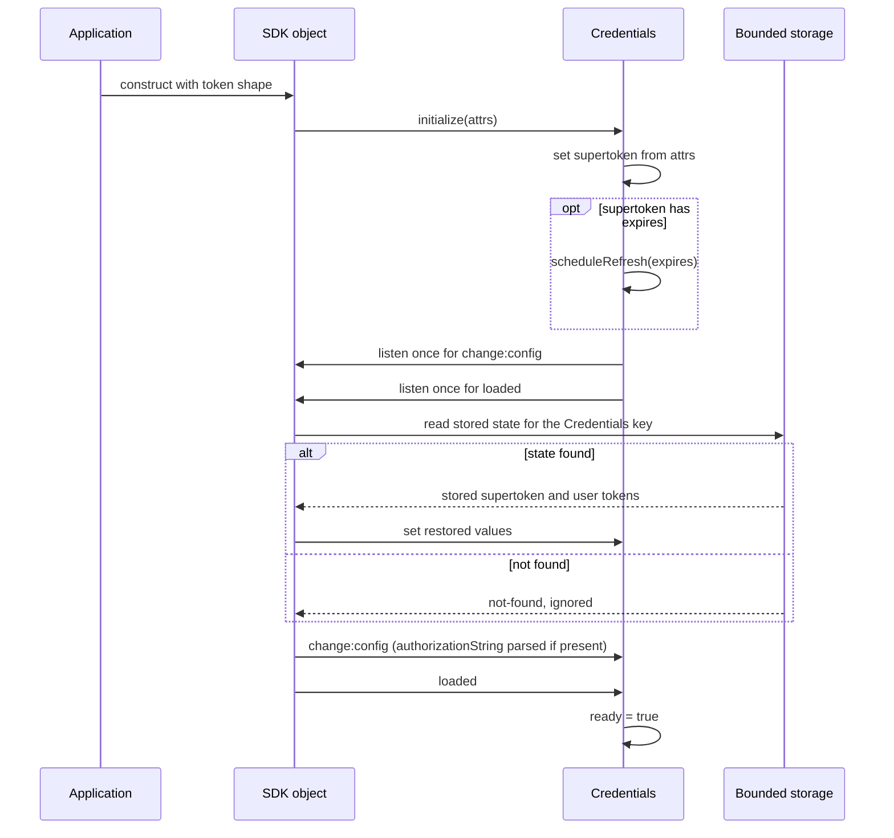
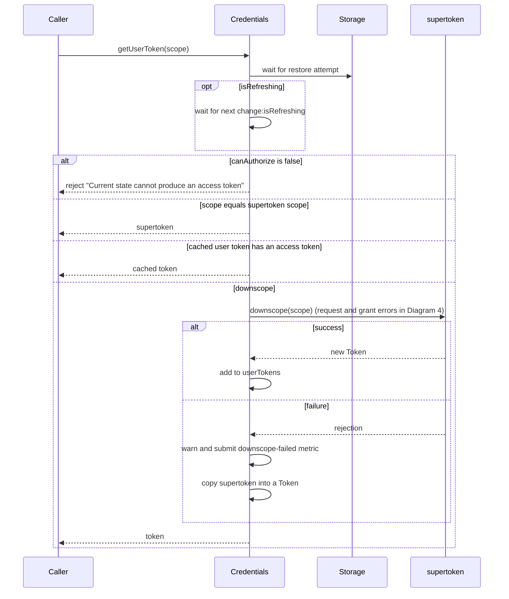
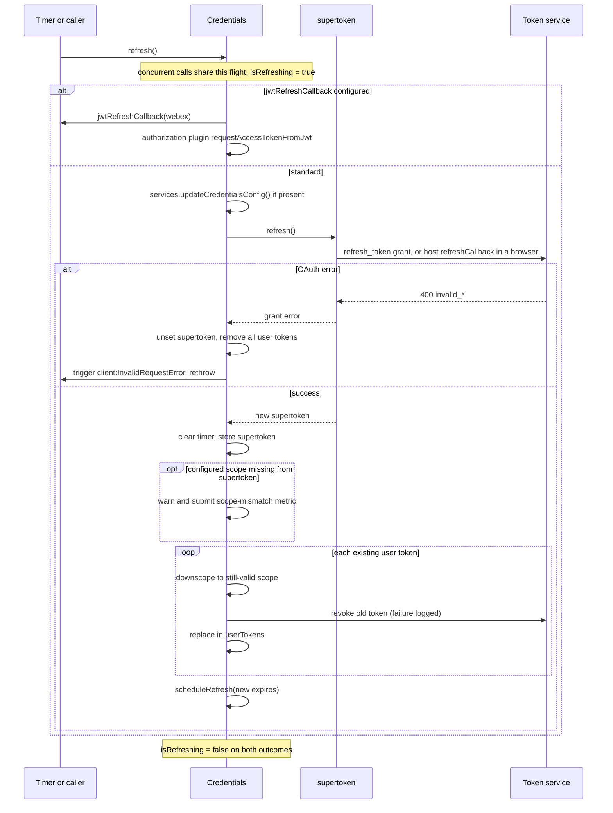
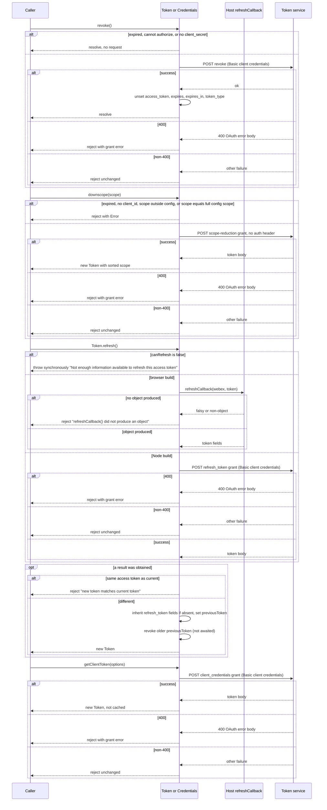
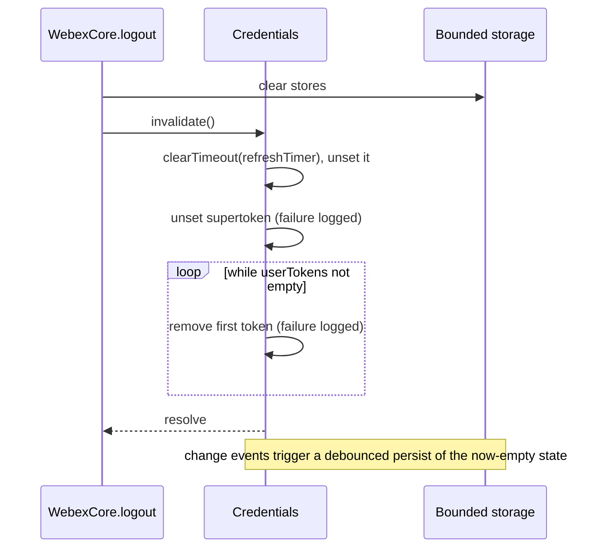
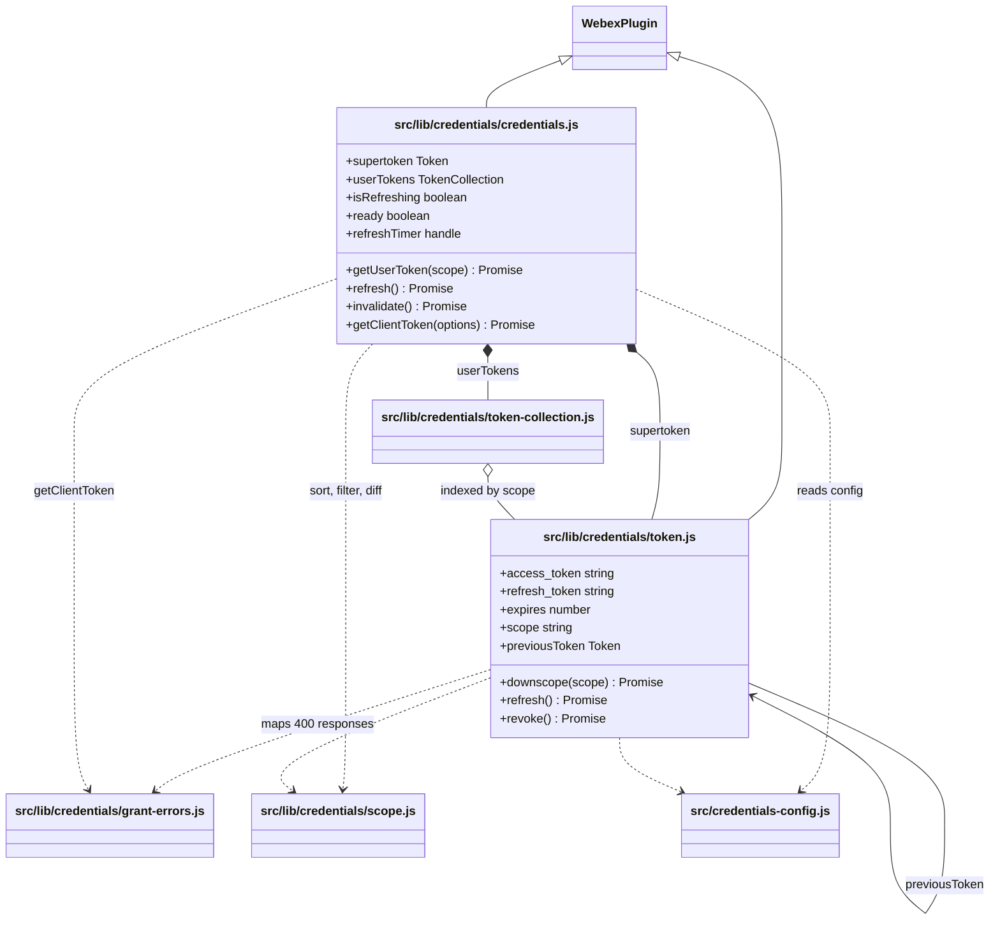
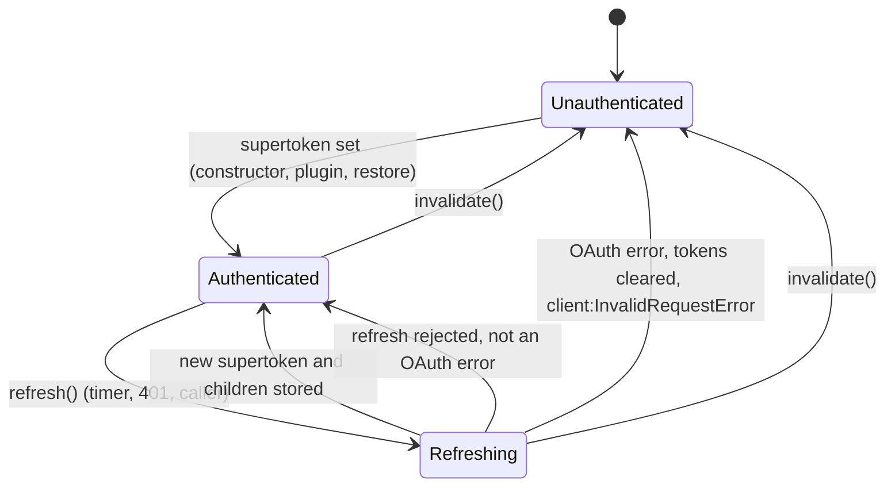
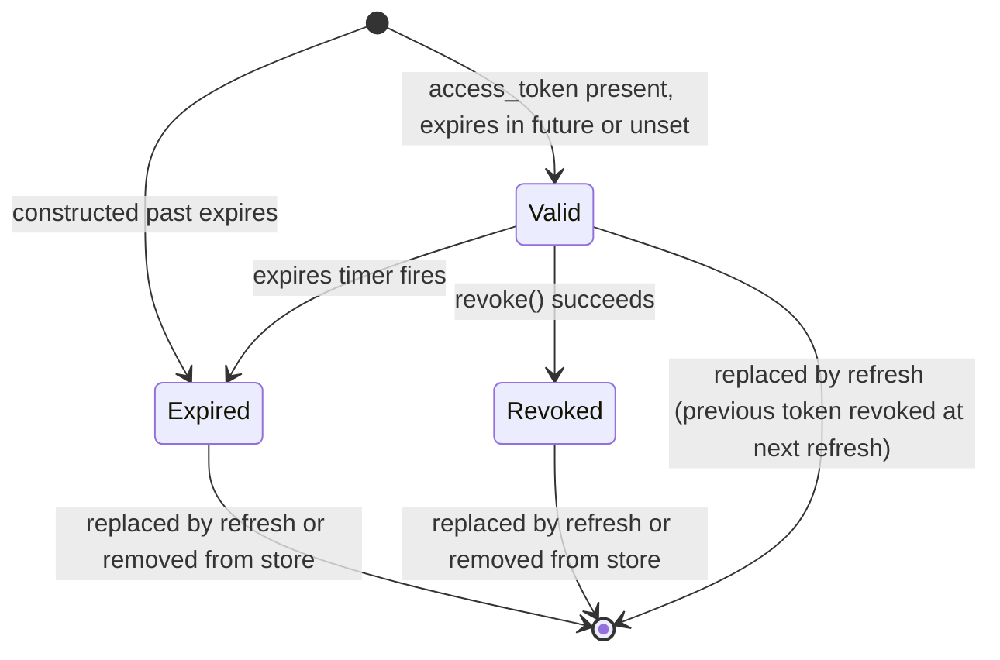

<!-- sdd-generated-metadata
doc_kind: module-spec
generated_from: module-spec@0.3.0
generated_by: claude-code
approved_by: pending
updated_at: 2026-10-07T13:20:21Z
validation_status: pass-with-warnings
-->

# credentials

This source-local document at `src/lib/credentials/docs/README.md` owns the stable specification
for **credentials**: the `Credentials` plugin, the `Token` model and its collection, the scope
helpers, the OAuth grant-error taxonomy, and the `CredentialsConfig` defaults in
`src/credentials-config.js`.

The package entry point, plugin registration machinery, the `WebexCore` constructor that normalizes
the token shapes callers pass in, the logout orchestration, and the `AuthInterceptor` that consumes
this module belong to the parent module and are specified in [`src/docs/README.md`](../../../docs/README.md).
The `@persist` and `@waitForValue` decorators and the stores they write to belong to the storage
sibling module; the interceptor sibling owns request-time authorization.

Related context: [repository architecture](../../../../docs/architecture.md) ·
[documentation index](../../../../docs/index.md) · [agent instructions](../../../../AGENTS.md) ·
[specification registry](../../../../docs/specs/README.md)

## Metadata

| Field             | Value                                                                                           |
| ----------------- | ----------------------------------------------------------------------------------------------- |
| Owner             | Cisco Webex for Developers                                                                      |
| Source path       | `src/lib/credentials`                                                                           |
| Resource kind     | Capability module                                                                               |
| Status            | Active                                                                                          |
| Last verified     | 2026-10-07                                                                                      |
| Module id         | `src/lib/credentials`                                                                           |
| Parent spec       | [`src/docs/README.md`](../../../docs/README.md)                                                 |
| Doc kind          | Module spec                                                                                     |
| Coverage score    | 93.8% assessed 2026-10-07; 15 of 16 mandatory fields present; critical 8 of 8; independent validation pass-with-warnings 2026-10-07 |
| Validation status | Pass with warnings — 2026-10-07; runtime `01a1166d-02d9-7772-bc25-1a801fb5f1d1`; 0 Blocking, 8 Important, 3 Medium |

## Applicability

| Condition ID                         | Status     | Evidence or reason                                                                                                                               | Owned section                 |
| ------------------------------------ | ---------- | ------------------------------------------------------------------------------------------------------------------------------------------------ | ----------------------------- |
| `module.has_tiers`                   | N/A        | The repository assigns no operational or review tiers                                                                                            | Tier                          |
| `module.has_ui`                      | N/A        | No components or rendering; login URLs are strings that a caller navigates to                                                                    | UI use-case flow              |
| `module.crosses_service_boundaries`  | Applicable | Token, downscope, revoke, and client-credentials calls go to the identity broker through `src/lib/credentials/token.js` and `src/lib/credentials/credentials.js` | Cross-boundary use-case flow  |
| `module.holds_client_state`          | Applicable | `src/lib/credentials/credentials.js` holds the supertoken, user-token collection, refresh timer, and the refreshing and ready flags                | Client state model            |
| `module.enforces_domain_rules`       | Applicable | Scope-subset, scope-reduction, token-validity, and refresh-token-preservation rules in `src/lib/credentials/token.js`                           | Business rules and invariants |
| `module.is_concurrent_async`         | Applicable | De-duplicated and queued refresh, per-scope downscope flights, and expiry and refresh timers in `src/lib/credentials/credentials.js`             | Concurrency and reactive flow |
| `module.owns_persistence`            | Applicable | `src/lib/credentials/credentials.js` persists its whole state under one storage key; no schema versioning or migration exists                   | Data, schema, and migration   |
| `module.stateful_transitions`        | Applicable | Credentials lifecycle (refreshing, invalidated) and Token lifecycle (expired, revoked) in `src/lib/credentials/credentials.js` and `src/lib/credentials/token.js` | State machine                 |
| `module.exposes_wire_protocol`       | Applicable | OAuth grant request forms and the login, logout, and third-party URLs built in `src/lib/credentials/credentials.js` and `src/lib/credentials/token.js`  | Protocol and wire format      |
| `module.ui_multi_screen`             | N/A        | Gated by module.has_ui, which is N/A                                                                                                             | UI flow                       |
| `module.large_data_model`            | N/A        | Two small entities (the token model and the credentials aggregate); no large or complex schema                                                          | Data model                    |
| `module.returns_caller_errors`       | Applicable | Grant errors in `src/lib/credentials/grant-errors.js` and the plain error rejections thrown from `src/lib/credentials/token.js`                | Caller-visible failure modes  |
| `module.module_specific_conventions` | Applicable | Decorator ordering, config-before-instantiation, and env-var configuration conventions in `src/lib/credentials/token.js` and `src/credentials-config.js` | Module-specific rules         |
| `module.published_package`           | Applicable | The credentials plugin, token model, grant errors, and two scope helpers are re-exported through `src/index.js` and consumed by sibling plugins         | Export stability              |
| `module.embedded_in_host`            | N/A        | Registered as a plugin on the SDK object, not mounted into a host application                                                                   | Host integration and theming  |
| `module.has_design_tradeoff`         | Applicable | Downscope fallback to the supertoken, client-secret-gated revocation, and the timer-based expiry flag                                            | Key design trade-off          |
| `module.has_submodules`              | N/A        | No child modules; computed from the manifest module tree                                                                                         | Sub-modules                   |

## Evidence register

| Evidence                                         | What it establishes                                                                                                                        |
| ------------------------------------------------ | ------------------------------------------------------------------------------------------------------------------------------------------ |
| `src/lib/credentials/credentials.js`            | The `Credentials` plugin: login/logout/third-party URL builders, OrgId and user-id extraction, user-token resolution, refresh, invalidate, client-credentials grant, refresh scheduling |
| `src/lib/credentials/token.js`                  | The `Token` model: derived capability flags, expiry timer, downscope, refresh, revoke, validate, header rendering, grant-error mapping       |
| `src/lib/credentials/grant-errors.js`           | The `OAuthError` family and the `select` lookup from an OAuth `error` string                                                                |
| `src/lib/credentials/scope.js`                  | `sortScope`, `filterScope`, and `diffScopes`                                                                                                |
| `src/lib/credentials/token-collection.js`       | The collection of user tokens, indexed by `scope`                                                                                           |
| `src/lib/credentials/index.js`                  | Plugin registration with proxied `canAuthorize` and `canRefresh`, and the module's named exports                                            |
| `src/credentials-config.js`                     | Configuration keys, environment-variable fallbacks, and the derived identity-broker URLs                                                    |
| `src/index.js`                                  | The subset of this module re-exported from the package entry point                                                                          |
| `src/config.js`                                 | Where `CredentialsConfig` is instantiated as the `credentials` section of the SDK defaults                                                  |
| `src/lib/constants.js`                          | The two metric names this module submits                                                                                                    |
| `src/lib/storage/decorators.js`                 | What `@persist` and `@waitForValue` do to the decorated methods                                                                             |
| `src/lib/storage/make-webex-plugin-store.js`    | How a plugin's state is serialized before it is written                                                                                     |
| `src/lib/webex-plugin.js`                       | The base class: `config`, `logger`, `webex` resolution and the `ready` session flag                                                         |
| `src/interceptors/auth.js`                      | How the interceptor sibling calls `getUserToken`, `canRefresh`, and `refresh`                                                               |
| `src/lib/services/services.js`                  | `updateCredentialsConfig`, which rewrites `idbroker`, `identity`, and `authorizeUrl` that this module's derived URLs read                   |
| `src/webex-core.js`                             | `logout` calling `invalidate`, and the constructor shape normalization this module relies on                                                |
| `test/unit/spec/credentials/credentials.js`     | Jest unit behavior of `Credentials`, using a mock SDK and fake timers                                                                       |
| `test/unit/spec/credentials/token.js`           | Unit behavior of `Token`, with platform-specific branches                                                                                   |
| `test/unit/spec/credentials/scope.js`           | Table-driven unit tests of the three scope helpers                                                                                          |
| `test/integration/spec/credentials/credentials.js` | Integration behavior against provisioned test users: OrgId extraction, refresh, authorization-string config                              |
| `test/integration/spec/credentials/token.js`    | Integration downscope, refresh, validate, and revoke against the live token service                                                         |
| `test/integration/spec/unit-browser/token.js`   | Browser-runner token refresh with a `refreshCallback`, and previous-token revocation                                                        |
| `test/integration/spec/unit-browser/auth.js`    | Browser-runner 401 reauthentication through the interceptor sibling, driven by `Credentials`                                                |

## Purpose and boundary

- **Responsibility:** hold the SDK's OAuth tokens and keep them usable. That means one long-lived
  supertoken, a collection of scope-reduced user tokens derived from it, scheduled and on-demand
  refresh, revocation of superseded tokens, and clearing everything on logout.
- **In scope:** the `Credentials` plugin and its derived `canAuthorize`, `canRefresh`, and
  `isUnverifiedGuest`; the `Token` model; scope sort/filter/diff; the `OAuthError` hierarchy; OrgId
  and user-id extraction from tokens; URL construction for authorize, logout, and third-party login;
  the client-credentials grant; the `credentials` configuration keys and the identity-broker URLs
  derived from them; persistence of credentials state through the storage decorators.
- **Out of scope:** attaching `Authorization` headers and replaying a 401 (the interceptor sibling);
  the authorization-code, implicit, JWT-login, and SAML flows (separate authorization plugins that call `credentials.set`; no SAML-specific code exists in this module, and JWT refresh is delegated to the authorization plugin);
  the storage adapters and stores themselves (storage sibling); identity-broker and identity URL
  discovery (services siblings, which write `idbroker.url` and `identity.url` into configuration);
  `WebexCore.logout` ordering (parent).
- **Consumers:** the parent module, the interceptor sibling and both services siblings, and, outside
  the package, the authorization, mercury, metrics, user, encryption, team, support, meetings, and
  contact-center plugins. All of them call into the contract `webex-core-credentials`.

## Structure and key files

| Path                                       | Responsibility                                                                                                                                  |
| ------------------------------------------ | ----------------------------------------------------------------------------------------------------------------------------------------------- |
| `src/lib/credentials/credentials.js`       | The `Credentials` plugin. The only place that decides which token to hand out, when to refresh, and what to clear                              |
| `src/lib/credentials/token.js`             | The `Token` model. The only place that talks to the token, scope-reduction, and revoke endpoints for a specific token                          |
| `src/lib/credentials/grant-errors.js`      | `OAuthError`, six subclasses, and the `select` lookup. The error vocabulary for every grant request in this module                              |
| `src/lib/credentials/scope.js`             | Pure string helpers over space-separated scope lists; the canonical ordering used as the collection index                                       |
| `src/lib/credentials/token-collection.js`  | The user-token collection, keyed by sorted `scope`                                                                                              |
| `src/lib/credentials/index.js`             | Registers the plugin under the name `credentials` and exports the module's public names                                                         |
| `src/credentials-config.js`                | The `CredentialsConfig` state class: settable keys with environment fallbacks, and derived identity-broker URLs                                 |

## Public surface

| Surface | Contract | Consumer | Compatibility commitment | Source |
| --- | --- | --- | --- | --- |
| `webex.credentials` plugin instance | `webex-core-credentials` | Every plugin that authorizes requests | Registered by name `credentials`; `canAuthorize` and `canRefresh` are proxied onto the SDK object | `src/lib/credentials/index.js` |
| `getUserToken(scope?)` | `webex-core-credentials` | Interceptor sibling, mercury, encryption, metrics, meetings and others | Resolves a `Token` for the requested scope, downscoping on demand; resolves only after pending storage load and any in-flight refresh | `src/lib/credentials/credentials.js` |
| `refresh()`, `invalidate()` | `webex-core-credentials` | Interceptor sibling, parent logout | `refresh` replaces the supertoken and re-derives user tokens; `invalidate` clears local tokens without a network revoke | `src/lib/credentials/credentials.js` |
| `getClientToken(options?)` | `webex-core-credentials` | User and support plugins, and the services siblings | Returns an uncached client-credentials token | `src/lib/credentials/credentials.js` |
| `buildLoginUrl`, `buildLogoutUrl`, `buildThirdPartyLoginUrl` | `webex-core-credentials` | Authorization plugins and applications | Pure string builders; no navigation side effect | `src/lib/credentials/credentials.js` |
| `getOrgId`, `getUserId`, `extractOrgIdFromJWT`, `extractOrgIdFromUserToken`, `extractUserIdFromToken` | `webex-core-credentials` | Contact-center, user, metrics, and services-v2 code | Throw when the identifier cannot be determined | `src/lib/credentials/credentials.js` |
| `canAuthorize`, `canRefresh`, `isUnverifiedGuest`, `ready`, `isRefreshing`, `supertoken`, `userTokens` | `webex-core-credentials` | Interceptor sibling, authorization plugins | Observable ampersand properties; change events are emitted on the plugin | `src/lib/credentials/credentials.js` |
| `Token` | `webex-core-credentials` | Authorization plugins, tests, `Credentials` | Constructed from an object or access-token string; throws without an access token | `src/lib/credentials/token.js` |
| `grantErrors` | `webex-core-credentials` | Authorization plugins | Maps OAuth `error` strings to subclasses; unknown strings map to the base `OAuthError` | `src/lib/credentials/grant-errors.js` |
| `filterScope`, `sortScope` | `webex-core-credentials` | Authorization plugins, tests | Pure functions over space-separated scope strings; `diffScopes` is exported from its file but not from the module index | `src/lib/credentials/scope.js` |
| `CredentialsConfig` and the `credentials` config keys | `webex-core-credentials` | Parent defaults, every caller passing `config.credentials` | Keys and environment fallbacks listed in the configuration key table below | `src/credentials-config.js` |

Every row routes to `webex-core-credentials` in `contract_catalog.definitions`, the single contract
this module provides. It requires `http-core-sdk` (through the parent's `webex.request`),
`webex-common-js-api`, `common-timers-sdk`, `idbroker-oauth-service`, `ampersand-state-library`, and,
through the storage sibling, `storage-adapter-spec-suite`. The native source for the package surface
is `package.json` main and `src/index.js`; no signature is copied here.

Configuration keys. The module reads configuration only from `config.credentials` (an instance of `CredentialsConfig`)
and from environment variables evaluated when `src/credentials-config.js` is first imported. There
are no feature flags.

| Key | Kind | Environment fallbacks, in order | Notes |
| --- | --- | --- | --- |
| `idbroker.url` | prop | `IDBROKER_BASE_URL`, then the production broker host | Default object is built per instance; base for every derived broker URL |
| `identity.url` | prop | `IDENTITY_BASE_URL`, then the production identity host | Base for `setPasswordUrl` |
| `authorizationString` | prop | `WEBEX_AUTHORIZATION_STRING`, `AUTHORIZATION_STRING` | When set, `Credentials` overwrites `client_id`, `redirect_uri`, `scope`, and `authorizeUrl` from it on the first config change |
| `authorizeUrl` | prop | `WEBEX_AUTHORIZE_URL`, else `IDBROKER_BASE_URL` plus the authorize path | Fixed string at import time; not derived from `idbroker.url` |
| `client_id` | prop | `WEBEX_CLIENT_ID`, `COMMON_IDENTITY_CLIENT_ID`, `CLIENT_ID` | Required for downscope and refresh |
| `client_secret` | prop | `WEBEX_CLIENT_SECRET`, `COMMON_IDENTITY_CLIENT_SECRET`, `CLIENT_SECRET` | Enables Node-side refresh and every revocation; sent as HTTP Basic credentials |
| `redirect_uri` | prop | `WEBEX_REDIRECT_URI`, `COMMON_IDENTITY_REDIRECT_URI`, `REDIRECT_URI` | Sent on refresh and as logout `goto` |
| `scope` | prop | `WEBEX_SCOPE`, `WEBEX_SCOPES`, `COMMON_IDENTITY_SCOPE`, `SCOPE` | Upper bound for downscoping |
| `cisService` | prop | none; default `webex` | Declared but not read by `Credentials`; see Pitfalls |
| `activationUrl`, `generateOtpUrl`, `validateOtpUrl`, `logoutUrl`, `thirdPartyLoginUrl`, `setPasswordUrl` | derived, uncached | none | Recomputed on each read from `idbroker.url` or `identity.url` |
| `tokenUrl`, `revokeUrl` | derived, uncached | `TOKEN_URL`, `REVOKE_URL` override the derived value | Used by every grant and revoke request |
| `refreshCallback` | extra property | none | Browser refresh hook `(webex, token) => Promise<object>`; makes browser tokens refreshable |
| `jwtRefreshCallback` | extra property | none | JWT-mode refresh hook `(webex) => Promise<jwt>`; makes `canRefresh` true unconditionally |

## Dependencies

| Dependency | Why it is required | Failure behavior |
| --- | --- | --- |
| `webex.request` (http-core request pipeline through the parent; see the http-core spec) | Every token, downscope, revoke, and client-credentials call. A transport failure resolves as `statusCode: 0` and the status interceptor converts it to a rejection | Rejections propagate; only HTTP 400 responses are re-mapped to grant errors, everything else is passed through unchanged |
| Common utilities (`oneFlight`, `whileInFlight`, `tap`, `makeStateDataType`, `encodeState`, `base64`, `Exception`, `inBrowser`; see the common spec) | De-duplication, the in-flight flag, state-data typing for `Token`, OAuth state encoding, base64url decoding, the error base class, platform detection | Load-time dependency |
| Common timers (`safeSetTimeout`; see the common-timers spec) | Token expiry flag and refresh scheduling; the returned handle is the platform timer handle and is not keeping a Node process alive | Handle is cancelled with `clearTimeout`; a pending timer is not cancelled when its owner is dropped |
| Storage sibling (`@persist`, `@waitForValue`, bounded store) | Persist state on change, restore at startup, and hold token-dependent methods until restore has been attempted | Restore failures other than not-found are logged and rejected by the decorator; `waitForValue` blocks the decorated methods until then |
| `webex.internal.metrics` (code only) | Submits `JS_SDK_CREDENTIALS_DOWNSCOPE_FAILED` and `JS_SDK_CREDENTIALS_TOKEN_REFRESH_SCOPE_MISMATCH` | Called without a guard; a missing metrics plugin makes those two paths throw |
| `webex.internal.services` (code only) | `refresh` calls `updateCredentialsConfig` before refreshing so broker URLs reflect the service catalog | Guarded by an existence check; skipped when services is absent |
| `webex.authorization.requestAccessTokenFromJwt` (code only) | JWT-mode refresh delegates the token exchange | Unguarded; throws if the authorization plugin is absent |
| `jsonwebtoken` (code only) | `jwt.decode` for the OrgId `realm` claim | Decode only, signature is never verified; a non-JWT yields a thrown error |
| `lodash`, `querystring`, `url` (code only) | Cloning, string and set helpers, query-string building, authorization-string parsing | Load-time dependency |
| `ampersand-state`, `ampersand-collection` (code only) | `Token`, `Credentials`, and `CredentialsConfig` are state classes; `TokenCollection` is a collection | Load-time dependency |

## Requirements

| ID | WHAT | WHY | Source evidence | Test or example evidence | Assumptions or gaps | Confidence |
| --- | --- | --- | --- | --- | --- | --- |
| `MOD-001` | `Token` construction throws `` `access_token` is required`` when no access token is present; a bare string is accepted as the access token | A token object with no secret can never authorize anything, so it fails at the point of creation | `src/lib/credentials/token.js` | `test/unit/spec/credentials/token.js` | none | Present |
| `MOD-002` | `Token` splits an access token written as `<type> <token>` into `token_type` and `access_token` when no `token_type` is supplied; `token_type` otherwise defaults to `Bearer` | Tokens arrive both as full header values and as bare strings; the unit tests cover both forms | `src/lib/credentials/token.js` | `test/unit/spec/credentials/token.js`, `test/unit/spec/credentials/credentials.js` | none | Present |
| `MOD-003` | Token `expires` and `refresh_token_expires` are computed as `now + *_in * 1000` when only the `*_in` form is supplied; `scope` is stored alphabetized | The service returns relative lifetimes while the model compares absolute times; scope is the collection index and must be deterministic | `src/lib/credentials/token.js` | `test/unit/spec/credentials/token.js` | Gap: an explicit `expires` taking precedence over `expires_in` is not asserted | Present |
| `MOD-004` | `isExpired` is a derived flag backed by a private boolean that a one-shot timer flips at `expires`; a token constructed already past `expires` is expired immediately | Avoids `cache: false` on a derived property, per the in-source comment | `src/lib/credentials/token.js` | `test/unit/spec/credentials/token.js` | Gap: the timer is never cancelled and `_isExpired` is never reset when `expires` is later extended | Present |
| `MOD-005` | `canAuthorize` is true iff an access token exists and the token is not expired; `canDownscope` additionally requires `client_id` in configuration | A token must not be presented, or used to mint children, after it has lapsed | `src/lib/credentials/token.js` | `test/unit/spec/credentials/token.js` | none | Present |
| `MOD-006` | `Token.canRefresh` requires a refresh token plus `refreshCallback` in a browser build, or plus `client_secret` in Node | Not stated in code or tests. Code shows only that the browser delegates to a host callback and Node uses the client secret | `src/lib/credentials/token.js` | `test/unit/spec/credentials/token.js`, `test/integration/spec/unit-browser/token.js` | WHY not stated in code or tests. The two platform branches only run under their own runner | Weak |
| `MOD-007` | `toString` returns `<token_type> <access_token>` and throws `cannot stringify Token` when either is missing | The result is used verbatim as the `Authorization` header value | `src/lib/credentials/token.js` | `test/unit/spec/credentials/token.js` | none | Present |
| `MOD-008` | `Token.downscope` rejects when the token is expired, cannot downscope, requests a scope outside `config.scope`, or requests a scope equal to the full configured scope; otherwise it POSTs a scope-reduction grant without an auth header and returns a new `Token` carrying the sorted requested scope | The service answers only `invalid scope`, which misleads when the whole set is the problem, so the module reports the cause itself | `src/lib/credentials/token.js` | `test/unit/spec/credentials/token.js`, `test/integration/spec/credentials/token.js` | Gap: the success path's response mapping is asserted only through the scope sort and the live integration test; the equal-to-full-scope rejection is covered only by the integration test | Present |
| `MOD-009` | `Token.downscope` calls are de-duplicated per scope string | Not stated in code or tests | `src/lib/credentials/token.js` | none found | WHY not stated in code or tests. Gap: no test issues two concurrent downscopes | Weak |
| `MOD-010` | `Token.refresh` throws `Not enough information available to refresh this access token` when `canRefresh` is false | Not stated in code or tests | `src/lib/credentials/token.js` | none found | WHY not stated in code or tests. Gap: the throw is untested. Note it is a synchronous throw, not a rejection | Weak |
| `MOD-011` | In Node, `Token.refresh` POSTs a `refresh_token` grant to the token URL with the client id and secret as Basic credentials and `shouldRefreshAccessToken: false`; in a browser it awaits `config.refreshCallback(webex, token)` | Not stated in code or tests (including the reason for `shouldRefreshAccessToken: false`) | `src/lib/credentials/token.js` | `test/unit/spec/credentials/token.js`, `test/integration/spec/unit-browser/token.js` | WHY not stated in code or tests. The request shape (form fields, auth) is not asserted | Weak |
| `MOD-012` | A refresh result without a `refresh_token` inherits the current token's `refresh_token`, `refresh_token_expires`, and `refresh_token_expires_in` | The identity service does not send a new refresh token on refresh, per the in-source comment | `src/lib/credentials/token.js` | `test/integration/spec/credentials/token.js` | Gap: no unit test pins the inheritance | Present |
| `MOD-013` | `Token.refresh` rejects with `new token matches current token` when the service returns the same access token, and logs the old and new token values at error level unless `NODE_ENV` is `production` | Identical tokens indicate a service defect; the values are logged for diagnosis outside production only | `src/lib/credentials/token.js` | none found | Gap: untested. See the security pitfall | Present |
| `MOD-014` | After a refresh, the new `Token` records the old one as `previousToken` and keeps the old scope; the next refresh revokes the older `previousToken` first | Two valid tokens overlap so that a request in flight with the old token is not cut off | `src/lib/credentials/token.js` | `test/unit/spec/credentials/token.js`, `test/integration/spec/unit-browser/token.js` | The revoke call is neither awaited nor error-handled | Present |
| `MOD-015` | `Token.revoke` resolves without a request when the token is expired, cannot authorize, or no `client_secret` is configured; otherwise it POSTs to the revoke URL and, on success, unsets `access_token`, `expires`, `expires_in`, and `token_type` while keeping the refresh-token fields | The revoke endpoint requires client credentials, and the refresh token must survive for later refresh | `src/lib/credentials/token.js` | `test/unit/spec/credentials/token.js`, `test/integration/spec/credentials/token.js` | Browsers never revoke; the in-source comment records this as a known limitation | Present |
| `MOD-016` | A non-400 failure from a grant, refresh, or revoke call is re-rejected unchanged; a 400 is converted to the matching grant-error subclass built from the underlying response | The unit test selects the error class from the OAuth `error` string, so callers can branch on class | `src/lib/credentials/token.js`, `src/lib/credentials/grant-errors.js` | `test/unit/spec/credentials/credentials.js` | Gap: `processGrantError` itself has no direct test; the one assertion constructs the error class by hand | Present |
| `MOD-017` | `grantErrors.select` returns the subclass for `invalid_request`, `invalid_client`, `invalid_grant`, `unauthorized_client`, `unsupported_grant_type`, and `invalid_scope`, and the base `OAuthError` for anything else | Not stated in code or tests; only the `select` fallback to the base class is code-evident | `src/lib/credentials/grant-errors.js` | `test/unit/spec/credentials/credentials.js` | WHY not stated in code or tests. Gap: only `invalid_request` is exercised | Weak |
| `MOD-018` | `OAuthError` exposes `error`, `errorDescription`, and `errorUri` as enumerable properties and the source response as a non-enumerable `res`; its message is the error description | Not stated in code or tests (including why `res` is non-enumerable) | `src/lib/credentials/grant-errors.js` | none found | WHY not stated in code or tests. Gap: untested | Weak |
| `MOD-019` | `sortScope` returns an alphabetized space-joined string and `''` for empty input; `filterScope` removes one or several scopes then sorts; `diffScopes` returns the sorted items of the first list absent from the second | Scope strings are compared and indexed as strings, so their order must be canonical | `src/lib/credentials/scope.js` | `test/unit/spec/credentials/scope.js` | The spec file also imports a helper that does not exist in the source; it is unused | Present |
| `MOD-020` | `TokenCollection` indexes user tokens by `scope` | `getUserToken` looks a child token up by its sorted scope | `src/lib/credentials/token-collection.js` | `test/unit/spec/credentials/credentials.js` | none | Present |
| `MOD-021` | `Credentials` accepts a supertoken as a string, as `access_token`, or under `authorization` or `authorization.supertoken`; anything with an `expires` schedules a refresh | The unit tests enumerate token strings at seven nested paths in both `ST` and `Bearer ST` forms | `src/lib/credentials/credentials.js` | `test/unit/spec/credentials/credentials.js` | none | Present |
| `MOD-022` | On the first `change:config`, a non-empty `authorizationString` overwrites `client_id`, `redirect_uri`, `scope`, and `authorizeUrl`, the last as the string before its `?` | The developer portal hands out one authorization string that carries all four values | `src/lib/credentials/credentials.js` | `test/unit/spec/credentials/credentials.js`, `test/integration/spec/credentials/credentials.js` | The listener is registered once; later config changes are not re-parsed | Present |
| `MOD-023` | `canRefresh` is true whenever `jwtRefreshCallback` is configured, else follows the supertoken; `canAuthorize` is true when the supertoken can authorize or `canRefresh` is true | In JWT mode only the consumer can mint a token, so the SDK must assume it can | `src/lib/credentials/credentials.js` | `test/unit/spec/credentials/credentials.js` | Gap: the `jwtRefreshCallback` branch has no test in this package | Present |
| `MOD-024` | `buildLoginUrl` defaults `response_type` to `token` for client type `public` and `code` otherwise, forces `client_id`, `redirect_uri`, and `scope` from configuration, requires `state` to be an object, and base64url-encodes a non-empty state, omitting an empty one | State must survive the redirect; configuration, not the caller, is the source of identity | `src/lib/credentials/credentials.js` | `test/unit/spec/credentials/credentials.js` | Gap: the `public` to `token` default is untested, and a caller-supplied `scope` is silently replaced | Present |
| `MOD-025` | `buildLogoutUrl` appends `cisService` and `goto` and lets caller options override both | Not stated in code or tests; the unit tests show a `token` parameter and a `goto` override | `src/lib/credentials/credentials.js` | `test/unit/spec/credentials/credentials.js` | WHY not stated in code or tests. The `cisService` value comes from an undeclared `service` key; see Pitfalls | Weak |
| `MOD-026` | `buildThirdPartyLoginUrl` requires `oauth2provider` and `returnURL`, validates `state`, and builds a query on `thirdPartyLoginUrl` | The in-source comment marks both options required for the social-provider sign-in | `src/lib/credentials/credentials.js` | `test/unit/spec/credentials/credentials.js` | none | Present |
| `MOD-027` | `getOrgId` tries the JWT `realm` claim first, then the third underscore-separated section of a user token, and throws if neither works | Client-authenticated tokens are JWTs; user tokens embed the org in their text | `src/lib/credentials/credentials.js` | `test/unit/spec/credentials/credentials.js`, `test/integration/spec/credentials/credentials.js` | The JWT is decoded, never signature-verified | Present |
| `MOD-028` | `getUserId` returns `cis_uuid` from the first of the supertoken then user tokens whose payload carries one, and throws otherwise | The code and tests show a supertoken-then-user-tokens search order; no rationale is stated | `src/lib/credentials/credentials.js` | `test/unit/spec/credentials/credentials.js` | none | Present |
| `MOD-029` | `isUnverifiedGuest` is true iff the supertoken's middle section decodes to a payload with `user_type` equal to `guest`; any parse failure yields false | The in-source comment notes that the non-guest token is formatted differently, so parse failures are expected | `src/lib/credentials/credentials.js` | `test/unit/spec/credentials/credentials.js` | none | Present |
| `MOD-030` | `getUserToken` defaults its scope to the supertoken's scope minus `spark:kms`, sorts the scope, returns the supertoken when the scope equals its own, otherwise the cached user token, otherwise downscopes and caches | Not stated in code or tests; the unit test asserts that the default scope omits `spark:kms` | `src/lib/credentials/credentials.js` | `test/unit/spec/credentials/credentials.js` | WHY for omitting `spark:kms` not stated in code or tests | Weak |
| `MOD-031` | `getUserToken` rejects with `Current state cannot produce an access token` when `canAuthorize` is false | After logout no token may be returned | `src/lib/credentials/credentials.js` | `test/unit/spec/credentials/credentials.js` | none | Present |
| `MOD-032` | `getUserToken` waits for the storage restore attempt and, while `isRefreshing` is true, for the next `change:isRefreshing` before choosing a token; concurrent calls for one scope share a flight | A caller must not receive a token a refresh is about to supersede | `src/lib/credentials/credentials.js` | `test/unit/spec/credentials/credentials.js` | Gap: the wait on storage restore has no test here | Present |
| `MOD-033` | When downscoping fails, `Credentials.downscope` logs a warning, submits the downscope-failed metric with the requested scope and reason, and resolves a token copied from the supertoken | The SDK stays usable when the scope-reduction endpoint is unavailable, at the cost of broader privileges | `src/lib/credentials/credentials.js` | `test/unit/spec/credentials/credentials.js` | The fallback ignores the requested scope when the supertoken has its own; see Pitfalls | Present |
| `MOD-034` | `refresh` is serialized per instance, sets `isRefreshing` for its duration, delegates to `jwtRefreshCallback` then the authorization plugin in JWT mode, and otherwise refreshes the supertoken | One refresh at a time prevents refresh-token races and concurrent mint storms | `src/lib/credentials/credentials.js` | `test/unit/spec/credentials/credentials.js` | Gap: the JWT branch is untested here, and `isRefreshing` toggling is asserted only indirectly | Present |
| `MOD-035` | After a supertoken refresh, `refresh` stores the new supertoken, clears the old timer, warns and submits a metric when configured scopes are missing from the supertoken, downscopes each existing user token to its still-valid scope, revokes the old one, swaps it in, and reschedules | Child tokens must be re-derived from the new supertoken so none outlive the old grant | `src/lib/credentials/credentials.js` | `test/unit/spec/credentials/credentials.js` | The reschedule assertion compares against an undefined `expires`, so it does not prove the argument | Present |
| `MOD-036` | An `OAuthError` from the supertoken refresh removes the supertoken and all user tokens, triggers `client:InvalidRequestError` on the SDK object, and rethrows | An invalid refresh token is unrecoverable and the application needs the chance to log the user out | `src/lib/credentials/credentials.js` | `test/unit/spec/credentials/credentials.js` | The test stubs `unset` and asserts only inside `catch`; user-token removal is unasserted | Present |
| `MOD-037` | `scheduleRefresh` refreshes immediately when the time has passed, otherwise sets one timer for a random 60 to 90 percent of the remaining lifetime | The source documents a 60 to 90 percent window ahead of expiry; the reason for the randomization is not stated in code or tests | `src/lib/credentials/credentials.js` | `test/unit/spec/credentials/credentials.js` | WHY for randomization not stated in code or tests. The result of the immediate or timed `refresh()` is not observed | Weak |
| `MOD-038` | `invalidate` clears the refresh timer, unsets the supertoken, and removes every user token, logging and continuing on individual failures; it makes no network call | The code logs and continues on each failure, so invalidate does not stop part-way | `src/lib/credentials/credentials.js` | `test/unit/spec/credentials/credentials.js` | none | Present |
| `MOD-039` | `getClientToken` POSTs a `client_credentials` grant, default scope `webexsquare:admin`, with Basic client credentials and `shouldRefreshAccessToken: false`, returns a `Token`, and does not cache it; 400 responses map to grant errors | The source comment says such tokens have limited use and are deliberately not cached | `src/lib/credentials/credentials.js` | `test/unit/spec/credentials/credentials.js` | The 400 branch is untested | Present |
| `MOD-040` | The whole `Credentials` state is persisted through the storage decorator on every change and restored at startup into the parent's `credentials` slot | Not stated in code or tests; the decorator persists and restores the state | `src/lib/credentials/credentials.js` | `test/unit/spec/credentials/credentials.js` | WHY not stated in code or tests. The test asserts the write and the delete; restore at startup is not asserted here | Weak |
| `MOD-041` | `ready` becomes true when the SDK emits `loaded` | The session-flag comment says it becomes true once the loaded event fires | `src/lib/credentials/credentials.js` | none found | Gap: untested | Present |
| `MOD-042` | `CredentialsConfig` derives broker URLs uncached from `idbroker.url` and `identity.url`, with environment overrides for `tokenUrl` and `revokeUrl` | The in-source comment says URLs are updated when the identity broker changes | `src/credentials-config.js` | `test/unit/spec/credentials/credentials.js` | Gap: no direct test of the derived properties or the environment fallbacks | Present |
| `MOD-043` | `CredentialsConfig` allows extra properties | The in-source comment cites dynamic keys such as `jwtRefreshCallback` | `src/credentials-config.js` | `test/integration/spec/credentials/credentials.js` | The integration test sets a declared key only | Present |

## Design overview

**Two layers with a clear split of knowledge.** `Token` knows how to turn itself into other tokens:
it holds the endpoints, the grant forms, and the rules for a single access token, and returns new
`Token` objects rather than mutating itself, apart from revocation. `Credentials` knows which tokens
exist and when to use them: it owns the one supertoken and the `userTokens` collection, decides
whether a request needs a downscope, and is the only holder of refresh scheduling, the refresh flag,
and logout clearing.

**One supertoken, many scope-reduced children.** The supertoken carries every scope the application
configured. `getUserToken` hands out either it or a child downscoped to a requested scope, caching
children by sorted scope string, which is why `sortScope` is applied on both write and read. A child
is cheap to derive and cannot be refreshed itself; after a supertoken refresh the module rebuilds
every child rather than refreshing them, revoking each old child.

**Expiry and refresh are timer-driven.** `Token` flips a private boolean at `expires` so its derived
`isExpired` property can stay cached; `Credentials` schedules a refresh at a randomized fraction of
the remaining lifetime. Neither timer is aware of the other, so a refresh can already be running when
a token flips to expired, which is why `getUserToken` waits on `isRefreshing`.

**Failure is absorbed where it can be.** A failed downscope falls back to the supertoken; a failed
revoke is logged; a failed removal during invalidate is logged. The one failure not absorbed is an
OAuth error on the supertoken refresh, which wipes all tokens and signals the application.

**Persistence is declarative.** `@persist('@')` on `initialize` writes the whole object after
changes settle and `@waitForValue('@')` holds token-dependent methods until the restore attempt has
finished. See Data, schema, and migration discipline.

## Data flow and sequence coverage

The transport is HTTPS form-encoded POSTs (and one JSON POST in `validate`) made through
`webex.request` to the identity broker, plus in-process calls between plugins. Six operation groups
differ in actors, ordering, or outcome and are diagrammed separately. URL construction and OrgId or
user-id extraction are pure functions with no ordering or failure path beyond a thrown error and are
covered by the use-case table instead.

| Operation group | Entry and outcome | Diagram or evidence | Failure and recovery coverage |
| --- | --- | --- | --- |
| Startup and restore | Construct `Credentials`, restore from storage, schedule refresh, mark ready | Diagram 1 | Storage not-found is tolerated; expired supertoken refreshes at once |
| Token resolution | `getUserToken(scope)` returns a token | Diagram 2 | Waits on restore and refresh; downscope failure falls back to the supertoken; unauthorizable state rejects |
| Supertoken refresh | Timer, interceptor, or caller calls `refresh()` | Diagram 3 | OAuth error clears all tokens and signals the application; revoke failure ignored |
| Token-level grants | `Token.downscope`, `Token.refresh`, `Token.revoke` | Diagram 4 | Non-400 passes through unchanged; 400 becomes a grant error; refresh throws synchronously when not capable; revoke is a no-op without a secret |
| Client credentials | `getClientToken` returns an uncached token | Diagram 4 | 400 mapped to a grant error, others pass through |
| Invalidate | Logout clears local tokens and timer | Diagram 5 | Each removal failure logged and skipped |

**Diagram 1. Startup and restore**

**Diagram 2. Token resolution**

**Diagram 3. Supertoken refresh**

**Diagram 4. Token-level grants and client credentials**

**Diagram 5. Invalidate**

## Class and component relationships

`Token` and `Credentials` both extend the shared plugin base from the parent, so each reaches
configuration, the logger, and the SDK object through the same `config`, `logger`, and `webex`
accessors. A `Token` finds its SDK object through its parent or its collection, as `src/lib/webex-plugin.js` resolves it.

## Use cases and flows

| Use case | Actor or caller | Primary steps and outcome | Failure or boundary behavior | Evidence |
| --- | --- | --- | --- | --- |
| `UC-001` | Application with an existing access token | Construct the SDK with a token string or object; `Credentials` stores it as the supertoken and schedules a refresh if it has an expiry | A token with no access token is rejected at construction | `src/lib/credentials/credentials.js`, `test/unit/spec/credentials/credentials.js` |
| `UC-002` | Interceptor sibling | `getUserToken()` returns a token without the key-management scope; the interceptor writes `toString()` into the header | After logout the call rejects and no header is written | `src/lib/credentials/credentials.js`, `src/interceptors/auth.js`, `test/unit/spec/credentials/credentials.js` |
| `UC-003` | Encryption or mercury plugin | `getUserToken('spark:kms')` gets a child with only that scope, cached for later calls | A downscope failure returns the supertoken and reports a metric | `src/lib/credentials/credentials.js`, `test/unit/spec/credentials/credentials.js` |
| `UC-004` | Interceptor sibling on a 401 | When `canRefresh` is true it calls `refresh()` and replays the request; concurrent 401s share one refresh | An OAuth error ends the session and triggers `client:InvalidRequestError` | `src/interceptors/auth.js`, `test/integration/spec/unit-browser/auth.js` |
| `UC-005` | Timer | At 60 to 90 percent of the supertoken lifetime `refresh()` runs; user tokens are rebuilt and old ones revoked | A revoke failure is logged and does not stop the replacement | `src/lib/credentials/credentials.js`, `test/unit/spec/credentials/credentials.js` |
| `UC-006` | Browser application with a login page | `buildLoginUrl({state})` returns the broker authorize URL with encoded state; the caller navigates | `state` must be an object | `src/lib/credentials/credentials.js`, `test/unit/spec/credentials/credentials.js` |
| `UC-007` | Application using a social provider | `buildThirdPartyLoginUrl({oauth2provider, returnURL})` returns the third-party login URL | A missing provider or return URL throws | `src/lib/credentials/credentials.js`, `test/unit/spec/credentials/credentials.js` |
| `UC-008` | Application logging out | `WebexCore.logout` clears storage then calls `invalidate()`; `buildLogoutUrl` produces the broker logout address | The invalidated instance cannot produce a token | `src/webex-core.js`, `src/lib/credentials/credentials.js`, `test/unit/spec/credentials/credentials.js` |
| `UC-009` | Integrator in JWT mode | Supply `jwtRefreshCallback`; `refresh()` obtains a JWT from it and hands it to the authorization plugin | The SDK treats `canRefresh` as true regardless of the supertoken | `src/lib/credentials/credentials.js` |
| `UC-010` | Service account | `getClientToken({scope})` returns a fresh client-credentials token every time | A 400 becomes a grant error | `src/lib/credentials/credentials.js`, `test/unit/spec/credentials/credentials.js` |
| `UC-011` | Meetings or metrics plugin | `getOrgId()` returns the organization from the token | Throws when the token matches neither shape | `src/lib/credentials/credentials.js`, `test/unit/spec/credentials/credentials.js` |

### Cross-boundary use-case flow

| Boundary | Transport | Ordering | Compatibility | Timeout and retry | Recovery |
| --- | --- | --- | --- | --- | --- |
| SDK to identity broker token endpoint (refresh, client credentials, scope reduction) | HTTPS form POST via `webex.request`; Basic client credentials on refresh and client credentials, none on scope reduction | One request per call; `Credentials.refresh` runs downscopes after the supertoken refresh settles and runs them in parallel | Grant types are `refresh_token`, `client_credentials`, and a scope-reduction URN | No timeout or retry here. Refresh, revoke, and client-credentials requests set `shouldRefreshAccessToken: false`; the scope-reduction request instead sets `addAuthHeader: false` | Failures reject; only refresh failures with an OAuth error trigger clearing |
| SDK to broker revoke endpoint | HTTPS form POST | After the replacement token exists | Revokes an access token with a type hint | None | Failure logged and ignored on the refresh path |
| SDK to host application | `refreshCallback` or `jwtRefreshCallback` | Called inside the refresh flight | Callback contract is `(webex, token)` or `(webex)` | Unbounded; the module imposes no timeout on the callback | Rejection or a falsy result rejects the refresh |
| SDK to authorization plugin | Direct method call in JWT mode | After the JWT callback resolves | Plugin must expose `requestAccessTokenFromJwt` | None | Rejection rejects the refresh |

## Client state model

| State or slice | Owner | Initial state | Transition triggers | Reset or persistence boundary |
| --- | --- | --- | --- | --- |
| `supertoken` | `Credentials` | Unset, or the token passed at construction or restored from storage | Constructor input, authorization plugins calling `set`, successful `refresh`, `invalidate`, OAuth refresh failure | Persisted; cleared by `invalidate` and by OAuth refresh failure |
| `userTokens` | `Credentials` | Empty | `getUserToken` adds, `refresh` replaces, `invalidate` and OAuth refresh failure empty it | Persisted; the collection is keyed by sorted scope |
| `refreshTimer` | `Credentials` | Undefined | `scheduleRefresh` sets; `refresh` and `invalidate` clear | Session only; never persisted |
| `isRefreshing` | `Credentials` | `false` | Set by the refresh flight for its duration | Session only |
| `ready` | `Credentials` | `false` | SDK `loaded` event | Session only |
| `Token._isExpired` | each `Token` | `false`, or `true` if constructed past `expires` | One-shot timer at `expires` | Session only; never reset |
| `Token.previousToken` | each `Token` | Unset | Assigned on refresh; cleared when its revoke is requested | Session only |
| `config.credentials` | `CredentialsConfig` | Environment-derived defaults | Caller config, `authorizationString` parsing, services rewriting `idbroker`, `identity`, `authorizeUrl` | Not persisted; owned by the parent's config |

## Business rules and invariants

| ID | Invariant | WHY | Enforcement source | Test evidence |
| --- | --- | --- | --- | --- |
| `INV-001` | A `Token` always has an access token at construction | A token without a secret is meaningless | `src/lib/credentials/token.js` | `test/unit/spec/credentials/token.js` |
| `INV-002` | A token may authorize only while it has an access token and is not expired | Never present a lapsed or revoked token | `src/lib/credentials/token.js` | `test/unit/spec/credentials/token.js` |
| `INV-003` | A downscoped token's scope is a strict subset of the configured scope | Child tokens must narrow privilege, per the in-source rationale about unhelpful service errors | `src/lib/credentials/token.js` | `test/unit/spec/credentials/token.js` |
| `INV-004` | Scope strings used as an index or for comparison are always in sorted order | The collection and the supertoken short-circuit compare strings | `src/lib/credentials/scope.js`, `src/lib/credentials/credentials.js` | `test/unit/spec/credentials/scope.js` |
| `INV-005` | See `MOD-012`: a refreshed token never loses its refresh token | The service never issues a new one on refresh | `src/lib/credentials/token.js` | none found |
| `INV-006` | See `MOD-015`: revocation never removes the refresh-token fields | The session must remain refreshable after its access token is revoked | `src/lib/credentials/token.js` | `test/unit/spec/credentials/token.js` |
| `INV-007` | See `MOD-013`: a refresh never yields an unchanged access token | Would defeat revocation of the previous token | `src/lib/credentials/token.js` | none found |
| `INV-008` | After `invalidate`, `getUserToken` rejects | Logout must prevent further token handout | `src/lib/credentials/credentials.js` | `test/unit/spec/credentials/credentials.js` |
| `INV-009` | At most one refresh of a given `Credentials` instance runs at a time, and `getUserToken` does not complete while it runs | Prevents handing out a token about to be revoked | `src/lib/credentials/credentials.js` | `test/unit/spec/credentials/credentials.js` |

## Concurrency and reactive flow

- **Execution model:** promise-based on the host event loop with two kinds of timers (per-token
  expiry flag, one refresh timer per `Credentials`) and ampersand change events. No threads or
  workers.
- **Ordering guarantees:** `refresh` fully settles the supertoken, then the user-token rebuild, then
  schedules the next refresh. User-token rebuilds run in parallel with each other. `getUserToken`
  completes after the refresh flag falls, so it observes the post-refresh state. The persisted write
  is debounced to the next tick, so it reflects the state after one `set` has finished.
- **Idempotency and retry:** `Credentials.refresh`, `Credentials.invalidate`, `Token.refresh`, and
  `Token.revoke` return the in-progress promise to concurrent callers; `Token.downscope` and
  `getUserToken` do so per scope. There is no retry anywhere; a failed refresh is retried only by the
  next 401 replay or the next timer.
- **Shared-state protection:** the single-flight decorators and `isRefreshing` serialize refresh;
  nothing locks `userTokens`, so a `getUserToken` running before a refresh began can still add a token
  after it. The `refreshTimer` is a single slot; `scheduleRefresh` does not cancel a handle already
  in it.
- **Blocking restrictions:** the host `refreshCallback` and `jwtRefreshCallback` run inside the
  refresh flight, so a slow callback holds `getUserToken` for every scope. Nothing times them out.

## Data, schema, and migration discipline

| Store or schema | Owned entities or keys | Source of truth | Migration and compatibility rule |
| --- | --- | --- | --- |
| Bounded plugin store, namespace `Credentials`, key `@` | The serialized plugin: `supertoken` and each user token with every stored `Token` property, including `access_token` and `refresh_token` | `src/lib/credentials/credentials.js`, `src/lib/storage/make-webex-plugin-store.js` | None. Restore feeds the stored object to the parent's `credentials` slot, so the persisted shape is the current prop set and must stay readable by `initialize` |

Session properties (`isRefreshing`, `ready`, `refreshTimer`, `Token._isExpired`, `previousToken`) are
not serialized. The store walks the serialized object and drops empty arrays, and an entirely empty object
serializes to nothing; the unit test observes a not-found result after `invalidate`. There is no
retention limit, version marker, or backfill. Tokens are written in plain text (see Pitfalls); `WebexCore.logout` clears both
stores before `invalidate` runs.

## State machine

**Credentials**

**Token**

Guards and rejected transitions: `refresh()` is rejected unless `canRefresh`; `downscope` is rejected
while expired or without a client id; `revoke` is a silent no-op while expired, revoked, or without a
client secret. `Expired` is one-way: the flag is never cleared on the same object, so recovery always
produces a new `Token`. A revoked token keeps its refresh-token fields and can still seed a
refresh. In the Credentials diagram the `Refreshing` flag is `isRefreshing`, and `Unauthenticated`
means `canAuthorize` is false.

## Protocol and wire format

| Message or frame | Version | Producer or serializer | Consumer or parser | Compatibility and ordering rule |
| --- | --- | --- | --- | --- |
| Authorize URL query (`response_type`, `client_id`, `redirect_uri`, `scope`, `state`) | OAuth 2.0 | `src/lib/credentials/credentials.js` | The identity broker | `state` is base64url-encoded JSON, omitted when empty; the identity broker echoes it back |
| Third-party login URL (`oauth2provider`, `returnURL`, `state`) | Broker-specific | `src/lib/credentials/credentials.js` | The identity broker | State encoded identically to the authorize URL |
| Logout URL (`cisService`, `goto`, plus caller options) | Broker-specific | `src/lib/credentials/credentials.js` | The identity broker | Caller options override both defaults |
| Client-credentials grant form | OAuth 2.0 | `src/lib/credentials/credentials.js` | The identity broker | Form fields `grant_type`, `scope`, `self_contained_token`; client credentials in Basic auth |
| Refresh-token grant form | OAuth 2.0 | `src/lib/credentials/token.js` | The identity broker | Form fields `grant_type`, `redirect_uri`, `refresh_token`; client credentials in Basic auth |
| Scope-reduction grant form | Cisco extension (`urn:cisco:oauth:grant-type:scope-reduction`) | `src/lib/credentials/token.js` | The identity broker | Form fields `grant_type`, `token`, `scope`, `client_id`, `self_contained_token`; no auth header; the token travels in the body |
| Revoke form | OAuth 2.0 | `src/lib/credentials/token.js` | The identity broker | Form fields `token`, `token_type_hint`; client credentials in Basic auth |
| Token response body | OAuth 2.0 | The identity broker | `src/lib/credentials/token.js` | `expires_in` and `refresh_token_expires_in` seconds are converted to absolute millisecond timestamps |
| OAuth error body (`error`, `error_description`, `error_uri`) | OAuth 2.0 | The identity broker | `src/lib/credentials/grant-errors.js` | Interpreted only on HTTP 400 |
| Persisted `@` record | Unversioned | `src/lib/storage/make-webex-plugin-store.js` | `src/lib/credentials/credentials.js` | See Data, schema, and migration discipline |

The broker is an external service (`idbroker-oauth-service`); its endpoint specification is not in
this repository, so the field lists above are what this module sends and reads, not a copy of the
service contract.

## Caller-visible failure modes

| Condition | Signal or result | Caller behavior | Retry or recovery | Evidence |
| --- | --- | --- | --- | --- |
| No access token at `Token` construction | Throws `` `access_token` is required`` | Fix the input | None | `src/lib/credentials/token.js` |
| `getUserToken` when nothing can authorize | Rejects `Current state cannot produce an access token` | Re-authenticate | Caller-owned | `src/lib/credentials/credentials.js` |
| Downscope of an expired or unconfigured token | Rejects with `cannot downscope expired access token` or `cannot downscope access token` | Treated by `Credentials` as a downscope failure and falls back | Supertoken fallback | `src/lib/credentials/token.js` |
| Requested scope outside configured scope | Rejects `new scope (...) is not subset of the available scopes (...)` | Fix the scope | Fallback for `getUserToken` | `src/lib/credentials/token.js` |
| Requested scope equals the full configured scope | Rejects `token: scope reduction requires a reduced scope` | Use the supertoken | Fallback for `getUserToken` | `src/lib/credentials/token.js` |
| `Token.refresh` without capability | Throws synchronously `Not enough information available to refresh this access token` | Check `canRefresh` first | None | `src/lib/credentials/token.js` |
| Browser refresh without a callback result | Rejects `token: refreshCallback() did not produce an object` | Fix the callback | Next 401 or timer | `src/lib/credentials/token.js` |
| Service returned the same access token | Rejects `new token matches current token` | Report a service defect | Next 401 or timer | `src/lib/credentials/token.js` |
| OAuth error on supertoken refresh | Grant error rethrown, tokens cleared, `client:InvalidRequestError` triggered | Log the user out | None | `src/lib/credentials/credentials.js`, `src/lib/credentials/grant-errors.js` |
| 400 from a token call | `OAuthError` subclass chosen by the `error` string | Branch on the class | Caller-owned | `src/lib/credentials/grant-errors.js` |
| Non-400 from a token call | The original request error | Handle as an HTTP error | Caller-owned | `src/lib/credentials/token.js` |
| `buildLoginUrl` with a non-object `state`, or `buildThirdPartyLoginUrl` without provider or return URL | Throws | Fix the input | None | `src/lib/credentials/credentials.js` |
| `getOrgId` on an unrecognized token | Throws `the provided token is not a valid format, token has N sections` or a JWT error | Handle absence | None | `src/lib/credentials/credentials.js` |
| `getUserId` with no usable token | Throws `could not extract the user ID from any available token` | Handle absence | None | `src/lib/credentials/credentials.js` |
| `Token.validate` in production | Throws `must not be used in production` | Do not call outside tests | None | `src/lib/credentials/token.js` |
| `toString` without a token | Throws `cannot stringify Token` | Check `canAuthorize` | None | `src/lib/credentials/token.js` |

## Pitfalls and constraints

- **Token values reach the log outside production.** `Token.refresh` logs the current and new
  access tokens at error level whenever `NODE_ENV` is not `production`. The only redaction
  mechanism in this module is that environment check; nothing masks tokens elsewhere. `Token.toString`
  returns the full header value and the downscope fallback logs the raw failure reason or response
  body.
- **Tokens are persisted in plain text.** `@persist('@')` writes the access and refresh tokens of
  the supertoken and every user token. Protection is entirely the storage adapter's. `client_secret` is
  configuration, not a property of `Credentials`, so it is not persisted by this module.
- **`client_secret` is a deliberate Node-only secret.** It signs refresh, revoke, and client-credentials
  calls as Basic credentials. In browser builds the secret is absent, so `Token.revoke` becomes a
  silent no-op and refresh requires the host `refreshCallback`.
- **`buildLogoutUrl` reads an undeclared key.** It uses `config.service` for `cisService`, but
  `CredentialsConfig` declares `cisService` and no `service`. With default configuration the
  parameter is emitted empty; the unit tests pass because the mock SDK sets `service` explicitly.
- **`buildLoginUrl` mutates its argument and ignores caller scope.** It writes `client_id`,
  `redirect_uri`, and `scope` onto the object passed in before cloning it, discarding any `scope` the
  caller supplied. The `public` client type applies only when no options object is passed: an options
  object without `clientType` yields `response_type: code`.
- **The downscope fallback may ignore the requested scope.** `Credentials.downscope` builds the
  fallback as `{scope, ...supertoken.serialize()}`, so a supertoken with its own scope overrides the
  requested one, and the cached child is then keyed under the supertoken's scope. It also passes
  `{parent: this}` to `Promise.resolve` instead of to the `Token` constructor, where it has no effect;
  the token gets its SDK object only once it joins `userTokens` (inferred from the `webex` resolution
  in `src/lib/webex-plugin.js`, not exercised).
- **Refresh and expiry promises are fire-and-forget.** The timer callback and the already-expired
  branch of `scheduleRefresh` call `refresh()` and drop the promise, and `Token.refresh` calls
  `previousToken.revoke()` without awaiting it, so rejections from those paths are unobserved.
- **A stale refresh timer survives an OAuth failure.** The OAuth error path unsets the supertoken
  but does not clear `refreshTimer`; if a manual refresh failed while the timer was still pending, the
  timer later calls `refresh()` with no supertoken (inferred from the code; not exercised).
- **JWT mode does not reschedule.** The `jwtRefreshCallback` branch returns after the authorization
  plugin sets the new supertoken; `scheduleRefresh` is called only from `initialize` and after a
  standard refresh, so in JWT mode the next refresh is driven by a 401 replay, not a timer.
- **Expiry timers and `isExpired` never reverse.** Each `Token` arms a timer that is never cancelled,
  and `_isExpired` is never reset. Extending `expires` on a live object does not un-expire it.
- **Metrics and authorization plugins are assumed present.** The downscope-failure and scope-mismatch
  paths call `webex.internal.metrics` unguarded, and JWT-mode refresh calls the authorization plugin
  unguarded.
- **Token JWT parsing is unverified.** `getOrgId` uses `jwt.decode`, which does not validate a
  signature, so the result is only as trustworthy as the token source.
- **Configuration is read at specific moments.** Environment variables are read once when
  `src/credentials-config.js` loads; `authorizeUrl` is a fixed string and does not follow later
  `idbroker.url` changes except through `updateCredentialsConfig`. `Token` capability flags that
  depend on configuration are not re-evaluated when configuration changes, per the in-source notes, so
  `client_id`, `client_secret`, and `refreshCallback` must be set before a `Token` is created.
- **`Token.validate` is for tests.** It uses a non-production conversation endpoint and throws in
  production; it is not part of any runtime flow.

## Module-specific rules

- **Do:** apply `@oneFlight` outermost, then `@whileInFlight`, then `@waitForValue`, as `refresh`
  does in `src/lib/credentials/credentials.js`; the order decides whether a second caller joins the
  existing flight and whether the flag is raised before storage is ready.
- **Do:** pass scope strings through `sortScope` before comparing them or using them as a collection
  index.
- **Do:** set `client_id`, `client_secret`, and `refreshCallback` before constructing a `Token`.
- **Do:** follow the existing pattern for client-authenticated token-endpoint calls in
  `src/lib/credentials/token.js` and `src/lib/credentials/credentials.js`: Basic client credentials plus
  `shouldRefreshAccessToken: false`.
- **Do not:** persist or log a token value outside a non-production branch.
- **Do not:** add a configuration key to `CredentialsConfig` that `Credentials` or `Token` does not
  read; `cisService` is the existing example of this mismatch.
- **Do not:** call `Token.validate` from runtime code.

## Export stability

| Export or entry point | Consumer | Stability | Versioning and deprecation rule | Declaration or API report |
| --- | --- | --- | --- | --- |
| `Credentials` | Parent, authorization plugins, tests | Consumed by sibling plugins; breaking changes to methods listed under Public surface break them | No deprecation mechanism in this module; the parent package version governs | `src/lib/credentials/index.js` |
| `Token` | Authorization plugins, tests | Same as above; constructor shape is relied on by tests and plugins | None in this module | `src/lib/credentials/index.js` |
| `grantErrors` | Authorization plugins | Class names and `select` are consumed by plugin code | None in this module | `src/lib/credentials/index.js` |
| `filterScope`, `sortScope` | Authorization plugins | Pure helpers consumed by plugins | None in this module | `src/lib/credentials/index.js` |
| Package entry re-exports | Application code through the package | Exactly `Credentials`, `filterScope`, `grantErrors`, `sortScope`, `Token` | Owned by the parent entry point | `src/index.js` |

No API report or type declaration exists for this module; the sources above are the declaration.
`diffScopes` is deliberately absent from the module and package exports.

## Key design trade-off

| Chosen trade-off | Preserved invariant or benefit | Cost or limitation | Decision evidence |
| --- | --- | --- | --- |
| A failed downscope falls back to a copy of the supertoken | The SDK keeps working when the scope-reduction endpoint is unavailable | The request carries broader privilege than asked for; the fallback is reported only through a log and a metric | `src/lib/credentials/credentials.js` |
| Revocation is skipped without a client secret | No unauthenticated revoke attempt is made from browsers | Browser sessions never revoke; superseded tokens remain valid until they expire | `src/lib/credentials/token.js` |
| Expiry is a timer-set boolean, not a time comparison | The derived `isExpired` stays cached | Per-token timers that cannot be cancelled and a flag that cannot be reset | `src/lib/credentials/token.js` |
| A failed OAuth refresh wipes every token and signals the application instead of retrying | An unrecoverable session is surfaced promptly | A transient service error that happens to be reported as an OAuth error ends the session | `src/lib/credentials/credentials.js` |
| The previous token is revoked only at the next refresh | A request in flight with the old token is not cut off | Up to two valid access tokens exist per refresh cycle | `src/lib/credentials/token.js` |
| Child tokens are rebuilt, not refreshed, after a supertoken refresh | One refresh grant per cycle and no per-child refresh state | One downscope and one revoke per child per refresh | `src/lib/credentials/credentials.js` |

## Verification

| Requirement or invariant | Test level | Positive evidence | Negative or boundary evidence | Gap |
| --- | --- | --- | --- | --- |
| `MOD-001`, `INV-001` | Unit | `test/unit/spec/credentials/token.js` | `test/unit/spec/credentials/token.js` (missing token throws) | none |
| `MOD-002` | Unit | `test/unit/spec/credentials/token.js` | none found | The explicit `token_type` precedence is not asserted |
| `MOD-003` | Unit | `test/unit/spec/credentials/token.js` | none found | Explicit `expires` precedence is unasserted |
| `MOD-004` | Unit | `test/unit/spec/credentials/token.js` (fake timers) | `test/unit/spec/credentials/token.js` (already expired) | No test for extending `expires` |
| `MOD-005`, `INV-002` | Unit | `test/unit/spec/credentials/token.js` | `test/unit/spec/credentials/token.js` | none |
| `MOD-006` | Unit, Integration | `test/unit/spec/credentials/token.js`, `test/integration/spec/unit-browser/token.js` | `test/unit/spec/credentials/token.js` | Browser branch only under the browser runner |
| `MOD-007` | Unit | `test/unit/spec/credentials/token.js` | `test/unit/spec/credentials/token.js` | none |
| `MOD-008`, `INV-003` | Unit, Integration | `test/unit/spec/credentials/token.js`, `test/integration/spec/credentials/token.js` | `test/unit/spec/credentials/token.js` | Equal-to-full-scope rejection is integration only |
| `MOD-009` | none | none found | none found | No concurrent-downscope test |
| `MOD-010` | none | none found | none found | The synchronous throw is untested |
| `MOD-011` | Unit, Integration | `test/unit/spec/credentials/token.js`, `test/integration/spec/credentials/token.js` | none found | Request fields and Basic auth are not asserted |
| `MOD-012`, `INV-005` | Integration | `test/integration/spec/credentials/token.js` | none found | No unit test; relies on a live service |
| `MOD-013`, `INV-007` | none | none found | none found | The identical-token path and the production log branch are untested |
| `MOD-014` | Unit, Integration | `test/unit/spec/credentials/token.js`, `test/integration/spec/unit-browser/token.js` | none found | Revoke failure on the previous token is not tested |
| `MOD-015`, `INV-006` | Unit, Integration | `test/unit/spec/credentials/token.js`, `test/integration/spec/credentials/token.js` | `test/unit/spec/credentials/token.js` (three no-op cases) | The request payload is not asserted |
| `MOD-016` | Unit | `test/unit/spec/credentials/credentials.js` | none found | `processGrantError` and the plain-`OAuthError` carve-out are untested |
| `MOD-017` | Unit | `test/unit/spec/credentials/credentials.js` | none found | Five of six codes, and the fallback, are unasserted |
| `MOD-018` | none | none found | none found | No test of the parsed properties |
| `MOD-019`, `INV-004` | Unit | `test/unit/spec/credentials/scope.js` | `test/unit/spec/credentials/scope.js` (empty and undefined inputs) | none |
| `MOD-020` | Unit | `test/unit/spec/credentials/credentials.js` | none found | none |
| `MOD-021` | Unit | `test/unit/spec/credentials/credentials.js` (fourteen path and format cases) | none found | none |
| `MOD-022` | Unit, Integration | `test/unit/spec/credentials/credentials.js`, `test/integration/spec/credentials/credentials.js` | none found | none |
| `MOD-023` | Unit | `test/unit/spec/credentials/credentials.js` | none found | The `jwtRefreshCallback` branch has no test |
| `MOD-024` | Unit | `test/unit/spec/credentials/credentials.js` | `test/unit/spec/credentials/credentials.js` (state validation) | The `public` default and caller-scope override are untested |
| `MOD-025` | Unit | `test/unit/spec/credentials/credentials.js` | none found | The undeclared `service` key is hidden by the mock |
| `MOD-026` | Unit | `test/unit/spec/credentials/credentials.js` | `test/unit/spec/credentials/credentials.js` (missing fields) | none |
| `MOD-027` | Unit, Integration | `test/unit/spec/credentials/credentials.js`, `test/integration/spec/credentials/credentials.js` | `test/unit/spec/credentials/credentials.js` | none |
| `MOD-028` | Unit | `test/unit/spec/credentials/credentials.js` | `test/unit/spec/credentials/credentials.js` | none |
| `MOD-029` | Unit | `test/unit/spec/credentials/credentials.js` | `test/unit/spec/credentials/credentials.js` | none |
| `MOD-030` | Unit | `test/unit/spec/credentials/credentials.js` | none found | none |
| `MOD-031`, `INV-008` | Unit | `test/unit/spec/credentials/credentials.js` | `test/unit/spec/credentials/credentials.js` | none |
| `MOD-032`, `INV-009` | Unit | `test/unit/spec/credentials/credentials.js` | none found | Storage-restore wait untested |
| `MOD-033` | Unit | `test/unit/spec/credentials/credentials.js` | `test/unit/spec/credentials/credentials.js` | Effect of the supertoken scope on the fallback is unasserted |
| `MOD-034` | Unit | `test/unit/spec/credentials/credentials.js` | none found | JWT branch and flag toggling untested |
| `MOD-035` | Unit | `test/unit/spec/credentials/credentials.js` | `test/unit/spec/credentials/credentials.js` (revoke rejects, scope mismatch) | Reschedule argument not proven |
| `MOD-036` | Unit | `test/unit/spec/credentials/credentials.js` | none found | Weak: `unset` stubbed, assertions inside `catch` |
| `MOD-037` | Unit | `test/unit/spec/credentials/credentials.js` | `test/unit/spec/credentials/credentials.js` (expired path) | No assertion on a failing refresh from the timer |
| `MOD-038` | Unit | `test/unit/spec/credentials/credentials.js` | none found | Individual removal failure branches untested |
| `MOD-039` | Unit | `test/unit/spec/credentials/credentials.js` | none found | 400 mapping untested |
| `MOD-040` | Unit | `test/unit/spec/credentials/credentials.js` | `test/unit/spec/credentials/credentials.js` | Restore not asserted |
| `MOD-041` | none | none found | none found | `ready` untested |
| `MOD-042` | none | none found | none found | Derived URLs and environment fallbacks untested |
| `MOD-043` | Integration | `test/integration/spec/credentials/credentials.js` | none found | Extra-property acceptance is not asserted |

**Tiers and runners.** The three files under `test/unit/spec/credentials` run under Jest through
`yarn workspace @webex/webex-core test:unit`, using the shared mock SDK and fake timers; platform
branches use the Mocha-helper `browserOnly`, `nodeOnly`, and `skipInBrowser` wrappers, which decide
per platform which variant runs. The files under `test/integration/spec/credentials` need
provisioned test users and a live identity service and run under Mocha or Karma; the two files under
`test/integration/spec/unit-browser` use the mock SDK despite the integration location, and several
cases in them are `browserOnly`. `test/integration/spec/unit-browser/auth.js` exercises the interceptor
sibling's 401 path and belongs by subject to that module; it is listed here only because it drives
`Credentials.refresh`.

**Coverage gaps worth acting on.** The JWT refresh mode, the `ready` flag, the derived configuration
URLs, the identical-token guard, `previousToken` revoke failure, and concurrent flight sharing have no
test. The suite's three weakest assertions are the `client:InvalidRequestError` case (assertions run
only on rejection and `unset` is stubbed), the reschedule check (compares to an undefined `expires`),
and the scope unit spec importing a helper that the source does not define. Confidence in `MOD-036` and `MOD-035`
is therefore lower than the Present label suggests. This specification records current behavior; the
items under Pitfalls are recorded as they are, not as endorsements.
