<!-- sdd-generated-metadata
doc_kind: module-spec
generated_from: module-spec@0.3.0
generated_by: claude-code
approved_by: pending
updated_at: 2026-10-07T13:20:21Z
validation_status: pass-with-warnings
-->

# services-v2 (v2 service discovery)

This source-local document at `src/lib/services-v2/docs/README.md` owns the stable specification for
the **v2 service-discovery plugin**: collecting the U2C service catalog in the `U2CV2` format, modelling
each cluster-scoped service as a `ServiceDetail` with an ordered list of full base URLs, resolving
service names and URLs, failing over between base URLs, caching the catalog, and gating `webex.ready` on
catalog readiness.

It is an **opt-in sibling of v1**. Everything the two share (the lifecycle shape, the cache envelope,
user validation, the URL-matching helpers) is described once in the v1 specification at
[`src/lib/services/docs/README.md`](../../services/docs/README.md) and is not restated here; this
document records only what v2 does, and where it differs. The package-level surface, interceptor
ordering and the auth and catalog-URL interceptors that consume the plugin belong to the parent, specified
in [`src/docs/README.md`](../../../docs/README.md).

Related context: [repository architecture](../../../../docs/architecture.md) ·
[documentation index](../../../../docs/index.md) · [agent instructions](../../../../AGENTS.md) ·
[specification registry](../../../../docs/specs/README.md)

## Metadata

| Field             | Value                                                                        |
| ----------------- | ---------------------------------------------------------------------------- |
| Owner             | Cisco Webex for Developers                                                   |
| Source path       | `src/lib/services-v2`                                                        |
| Resource kind     | Capability module (opt-in internal plugin `services`, plus catalog models)   |
| Status            | Active                                                                       |
| Last verified     | 2026-10-07                                                                   |
| Module id         | `src/lib/services-v2`                                                        |
| Parent spec       | [`src/docs/README.md`](../../../docs/README.md)                              |
| Doc kind          | Module spec                                                                  |
| Coverage score    | 100% assessed 2026-10-07; 16 of 16 mandatory fields present; critical 8 of 8; independent validation pass-with-warnings 2026-10-07 |
| Validation status | Pass with warnings — 2026-10-07; runtime `01a1166d-02d9-7772-bc25-1a801fb5f1d1`; 0 Blocking, 8 Important, 3 Medium |

## Applicability

| Condition ID                         | Status     | Evidence or reason                                                                                                                                  | Owned section                 |
| ------------------------------------ | ---------- | ----------------------------------------------------------------------------------------------------------------------------------------------------- | ----------------------------- |
| `module.has_tiers`                   | N/A        | The repository assigns no operational or review tiers                                                                                               | Tier                          |
| `module.has_ui`                      | N/A        | No components or rendering                                                                                                                          | UI use-case flow              |
| `module.crosses_service_boundaries`  | Applicable | Fetches the U2C hostmap and calls hydra, license and user-onboarding services in src/lib/services-v2/services-v2.ts                                  | Cross-boundary use-case flow  |
| `module.holds_client_state`          | Applicable | Catalog groups, readiness flags and per-URL failure marks live in memory in src/lib/services-v2/service-catalog.ts and src/lib/services-v2/service-detail.ts | Client state model            |
| `module.enforces_domain_rules`       | Applicable | Base-URL priority and failover rules, URL-to-service origin matching and allowed-domain matching (src/lib/services-v2/service-detail.ts, src/lib/services-v2/service-catalog.ts) | Business rules and invariants |
| `module.is_concurrent_async`         | Applicable | Promise-based collection with an in-flight guard, init-timeout race, refresh wait and event-driven readiness in src/lib/services-v2/services-v2.ts    | Concurrency and reactive flow |
| `module.owns_persistence`            | Applicable | Owns a versioned localStorage cache entry with TTL, org and environment guards in src/lib/services-v2/services-v2.ts                                 | Data, schema, and migration   |
| `module.stateful_transitions`        | Applicable | Per-group collecting/ready flags, the services ready/initFailed lifecycle and per-URL failed flags (src/lib/services-v2/service-catalog.ts, src/lib/services-v2/services-v2.ts, src/lib/services-v2/service-detail.ts) | State machine                 |
| `module.exposes_wire_protocol`       | N/A        | Consumes the external U2C U2CV2 response and defines no protocol of its own; the cached JSON is covered under persistence                          | Protocol and wire format      |
| `module.ui_multi_screen`             | N/A        | Gated by module.has_ui, which is N/A                                                                                                                | UI flow                       |
| `module.large_data_model`            | N/A        | Three small entities (catalog, service detail, service URL record); no schema or migration surface beyond the cache entry                          | Data model                    |
| `module.returns_caller_errors`       | Applicable | Rejections and thrown errors for invalid queries, unknown services and unknown URLs (src/lib/services-v2/services-v2.ts)                            | Caller-visible failure modes  |
| `module.module_specific_conventions` | Applicable | Ampersand-state classes with private underscore members, TypeScript interfaces mirrored by hand, and the v1/v2 mirror (src/lib/services-v2/types.ts) | Module-specific rules         |
| `module.published_package`           | Applicable | Three classes re-exported from the package entry (src/lib/services-v2/index.ts, src/index.js)                                                       | Export stability              |
| `module.embedded_in_host`            | N/A        | Not mounted into a host application                                                                                                                 | Host integration and theming  |
| `module.has_design_tradeoff`         | Applicable | Full base URLs instead of host substitution, borrowed v1 matching helpers, and a cache warm that bypasses the fetch (src/lib/services-v2/services-v2.ts) | Key design trade-off          |
| `module.has_submodules`              | N/A        | No child modules; computed from the manifest module tree                                                                                            | Sub-modules                   |

## Evidence register

| Evidence                                           | What it establishes                                                                                                                                        |
| -------------------------------------------------- | ------------------------------------------------------------------------------------------------------------------------------------------------------------ |
| `src/lib/services-v2/index.ts`                     | Three named re-exports and no plugin registration                                                                                                          |
| `src/lib/services-v2/services-v2.ts`               | The `Services` plugin extension: config init, U2CV2 collection, cache, init lifecycle, service and URL resolution, user validation                         |
| `src/lib/services-v2/service-catalog.ts`           | The in-memory catalog: five groups, status flags, ordering, URL matching delegation, allowed domains, failover entry point                                 |
| `src/lib/services-v2/service-detail.ts`            | One cluster-scoped service with its ordered base URLs; priority selection and host failure marking                                                         |
| `src/lib/services-v2/types.ts`                     | Hostmap, service, service-URL, catalog and service-detail type declarations                                                                                |
| `src/lib/services-v2/service-fed-ramp.ts`          | The FedRAMP discovery URL set that replaces discovery configuration                                                                                        |
| `src/lib/services-v2/metrics.ts`                   | A metric-name constant file that nothing in the module imports                                                                                             |
| `src/lib/services-v2/README.md`                    | Existing work-in-progress note (DNSSec-oriented, "continue to use /services"), read as evidence only                                                       |
| `src/lib/metrics.js`                               | The metric names the v2 plugin actually imports                                                                                                            |
| `src/lib/services/index.js`                        | The only code that registers the `services` internal plugin by default (v1)                                                                                |
| `src/lib/services/service-catalog.js`              | The URL-parsing and URL-matching helpers that v2 imports from v1                                                                                           |
| `src/lib/services/service-fed-ramp.js`             | The v1 FedRAMP URL set, identical in content to the v2 file                                                                                                |
| `src/lib/domains.ts`                               | Allowed-domain normalization and matching shared with v1                                                                                                   |
| `src/lib/constants.js`                             | The commercial allowed-domain list unioned into configuration                                                                                              |
| `src/config.js`                                    | Default `services`, `calling.cacheU2C` and `fedramp` configuration; no v2 selector                                                                         |
| `src/index.js`                                     | Imports only the v1 plugin for registration; exports the v2 classes                                                                                        |
| `src/webex-core.js`                                | `ready` derivation across children and the interceptor registry                                                                                            |
| `src/lib/webex-internal-core-plugin-mixin.js`      | The `replace` option that lets a second registration of `services` override the first                                                                      |
| `src/lib/interceptors/service.js`                  | The interceptor that calls `waitForService` on whichever plugin is registered                                                                              |
| `src/lib/interceptors/hostmap.js`                  | The interceptor that calls `replaceHostFromHostmap` on whichever plugin is registered                                                                      |
| `src/lib/interceptors/server-error.js`             | The interceptor that calls `markFailedUrl` on whichever plugin is registered                                                                               |
| `src/interceptors/auth.js`                         | A consumer of `waitForService`, `getServiceFromUrl`, `hasAllowedDomains` and `isAllowedDomainUrl`                                                          |
| `test/fixtures/host-catalog-v2.ts`                 | Sample U2CV2 hostmap and its formatted form used by the tests                                                                                            |
| `test/unit/spec/services-v2/services-v2.ts`        | Init lifecycle (gated and ungated), ready finalization, cache, hostmap formatting, credentials config, invalidation, mobius and host helpers              |
| `test/unit/spec/services-v2/service-catalog.ts`    | Allowed-domain handling, `clean`, failover entry point, URL-matching security cases                                                                        |
| `test/unit/spec/services-v2/service-detail.ts`     | Priority selection, failure marking, reset when all fail, empty results                                                                                    |
| `test/unit/spec/interceptors/auth.js`              | Runs the auth interceptor against a real catalog for both v1 and v2 plugins                                                                                |
| `test/integration/spec/services-v2/services-v2.js` | Swaps the registered `services` plugin to v2 against live U2C; collection, waiting, user validation, failover (needs provisioned test users)             |
| `test/integration/spec/services-v2/service-catalog.js` | Real-U2C catalog population, lookups, failover and ordering                                                                                            |

## Purpose and boundary

- **Responsibility:** the same as v1 (know where every Webex service lives and tell `webex.ready` when the
  catalog is usable) but for the `U2CV2` hostmap, in which every service is a cluster-scoped entry carrying
  an ordered list of complete base URLs instead of one default URL plus alternative hosts.
- **In scope:** the v2 `Services` plugin extension, `ServiceCatalog` and `ServiceDetail` (ampersand-state),
  the type declarations, the FedRAMP discovery set, catalog groups `discovery`, `override`, `preauth`, `signin`,
  `postauth`, U2CV2 collection, the `services.v2.u2cHostMap` cache entry, the gated and ungated init lifecycle,
  failover marking, allowed-domain storage, user validation and activation helpers, cluster switching and cache
  invalidation entry points.
- **Out of scope:** the v1 plugin, its registry/state helpers and the three interceptors in `src/lib/interceptors`
  (specified in [`src/lib/services/docs/README.md`](../../services/docs/README.md) and reused unchanged); the
  auth and catalog-URL interceptors and interceptor ordering (parent module); token acquisition and `getOrgId`
  (credentials module); the HTTP machinery (`http-core`); DNSSec handling (nothing in the code touches DNS;
  see Pitfalls).
- **Consumers:** no package other than `webex-core` imports a v2 symbol. Inside `webex-core`, only
  `src/index.js` re-exports it and only tests instantiate it; there is no production consumer. Once
  installed (see Registration under Design overview) it is reached as `webex.internal.services` by sibling
  plugins and by the parent interceptors.

## Structure and key files

| Path                                        | Responsibility                                                                                                                                          |
| ------------------------------------------- | ------------------------------------------------------------------------------------------------------------------------------------------------------- |
| `src/lib/services-v2/index.ts`              | Re-exports `ServicesV2`, `ServiceCatalogV2` and `ServiceDetail`; registers nothing                                                                      |
| `src/lib/services-v2/services-v2.ts`        | The plugin (ampersand-state extension of the webex plugin base); the only file that talks to U2C, hydra, license and storage                            |
| `src/lib/services-v2/service-catalog.ts`    | `ServiceCatalog` (ampersand-state): groups, status flags, `updateServiceGroups`, lookups, allowed domains, `waitForCatalog`                             |
| `src/lib/services-v2/service-detail.ts`     | `ServiceDetail` (ampersand-state): `id`, `serviceName`, ordered `serviceUrls`; `get`, `failHost`, host-URL generation                                    |
| `src/lib/services-v2/types.ts`              | `ServiceGroup`, `ServiceHostmap`, `Service`, `ServiceUrl`, `ServiceHost`, `QueryOptions`, `SelectionMeta`, `IServiceCatalog`, `IServiceDetail`          |
| `src/lib/services-v2/service-fed-ramp.ts`   | Default export: hydra, u2c and sqdiscovery URLs used when `fedramp` is on                                                                               |
| `src/lib/services-v2/metrics.ts`            | Exports `JS_SDK_SERVICE_NOT_FOUND`; unused (the plugin imports `src/lib/metrics.js` instead)                                                            |
| `src/lib/services-v2/README.md`             | Work-in-progress note; evidence only, kept separate and not edited                                                                                      |
| `test/fixtures/host-catalog-v2.ts`          | U2CV2 hostmap fixtures                                                                                                                                |
| `test/unit/spec/services-v2/services-v2.ts`, `test/unit/spec/services-v2/service-catalog.ts`, `test/unit/spec/services-v2/service-detail.ts` | Three unit files (plugin, catalog, service detail)                                                                                                      |
| `test/integration/spec/services-v2/services-v2.js`, `test/integration/spec/services-v2/service-catalog.js` | Two integration files against live U2C                                                                                                                  |

## Public surface

| Surface | Contract | Consumer | Compatibility commitment | Source |
| --- | --- | --- | --- | --- |
| `ServicesV2` (the plugin class; installed as `webex.internal.services` only by explicit registration) | `webex-core-services-v2` | Integrators and tests that register it | Method names and result shapes mirror v1 for the methods the shared interceptors call (`waitForService`, `getServiceFromUrl`, `replaceHostFromHostmap`, `markFailedUrl`, `hasAllowedDomains`, `isAllowedDomainUrl`); several v1 methods are absent (see Design overview). The module README says it is a work in progress and may change often | `src/lib/services-v2/services-v2.ts` |
| `ServiceCatalogV2`, `ServiceDetail` | `webex-core-services-v2` | Package consumers and tests | Named exports; `ServiceCatalogV2` is the export name for the class defined as `ServiceCatalog` in the catalog file | `src/lib/services-v2/index.ts`, `src/index.js` |
| Type declarations `ServiceHostmap`, `Service`, `ServiceUrl`, `ServiceHost`, `IServiceCatalog`, `IServiceDetail`, `ServiceGroup` | `webex-core-services-v2` | TypeScript callers inside the package | Exported from the types file; not re-exported from the package entry; `ServiceHost` and `ServiceUrl` here are plain types and unrelated to the v1 classes of the same name exported by the package entry | `src/lib/services-v2/types.ts` |
| Configuration `services.*` (`discovery`, `override`, `allowedDomains`, `validateDomains`, `servicesNotNeedValidation`, `useCatalogOverride`, `waitForCatalogInit`, `catalogInitTimeout`, `skipPreauthCatalogOnUnauthenticated`, `useUserOnboardingServiceForActivations`), `calling.cacheU2C`, `fedramp`, `email` | `webex-core-services-v2` | SDK integrators | Keys are read at the moment of `change:config` (init) or per call, not live; `useCatalogOverride` is read only here, not by v1 | `src/config.js` |
| Session property `ready` and props `validateDomains`, `initFailed` | `webex-core-services-v2` | `webex.ready` derivation, auth interceptor | `ready` participates in `webex.ready` when it is `false` | `src/lib/services-v2/services-v2.ts`, `src/webex-core.js` |
| Wire request `GET {u2c}/catalog`, `/limited/catalog`, `/signin/catalog` with `format=U2CV2` | `u2c-service` | The plugin | Server-defined; the plugin accepts `activeServices`, `services[].serviceUrls[].{baseUrl, priority}`, `timestamp`, `orgId`, `format` | `src/lib/services-v2/types.ts` |

## Dependencies

| Dependency | Why it is required | Failure behavior |
| --- | --- | --- |
| Webex plugin base (`src/lib/webex-plugin.js`) and `webex.request` | Base class, `this.request`, logger, `listenToOnce`, session props. Requests with `service: 'u2c'` go through the registered `ServiceInterceptor`, which resolves `u2c` from the `discovery` group seeded by `initConfig` | A failed U2C request rejects `updateServices`; `collecting` is cleared; the init paths convert the rejection to `initFailed` |
| `http-core-sdk` | Transport and error taxonomy behind `this.request`; `NotFound` (by `error.name`) drives `validateUser` | Errors propagate unchanged |
| Credentials plugin (`webex.credentials`: `canAuthorize`, `supertoken`, `getOrgId`, `getUserToken`, `getClientToken`, `isRefreshing`, `config`) | Choose preauth versus postauth, org-scoped query and cache guard, gate on in-flight refresh | `getOrgId` throwing rejects `initServiceCatalogs` (`webex-core-credentials`) |
| `src/lib/services/service-catalog.js` | Imports `parseCatalogUrl`, `matchesParsedCatalogUrl` and `matchesCatalogUrl` so v1 and v2 share one URL-matching security boundary | A change there changes both versions |
| `src/lib/domains.ts`, `src/lib/constants.js`, `src/lib/metrics.js`, `src/config.js` | Allowed-domain normalization and matching; `COMMERCIAL_ALLOWED_DOMAINS`; the not-found metric name; defaults | None at runtime |
| Metrics plugins (`webex.internal.metrics`, `webex.internal.newMetrics`) | `submitClientMetrics` for the not-found metric; `callDiagnosticLatencies.measureLatency` around the U2C request when `newMetrics` exists (described from code; no spec) | `internal.metrics` is dereferenced without a guard in `waitForService` |
| `u2c-service` (external HTTP) and `idbroker-oauth-service` | Hostmap source; client-token endpoint used by `validateUser` | Request error rejects or is swallowed as documented per method |
| `crypto-js` (`sha256`), `lodash` (`union`, `unionBy`, `toNumber`), `ampersand-state-library` | Email hashing for the `emailhash` query and cache selection, set operations, model base classes (described from code) | None |
| `window.localStorage` | Catalog cache | Absent or throwing storage is treated as no cache |
| `common-timers-sdk`, `webex-common-js-api` | Not used by this module | None |

## Requirements

| ID | WHAT | WHY | Source evidence | Test or example evidence | Assumptions or gaps | Confidence |
| --- | --- | --- | --- | --- | --- | --- |
| `SV2-001` | v2 is exported but not registered: the default `services` plugin is v1, and v2 becomes active only through an explicit `registerInternalPlugin('services', ServicesV2, {replace: true, interceptors})` call | A work-in-progress implementation must not change default behavior for existing integrators | `src/index.js`, `src/lib/services-v2/index.ts`, `src/lib/services/index.js`, `src/lib/webex-internal-core-plugin-mixin.js`, `src/config.js` | `test/integration/spec/services-v2/services-v2.js` | No unit test asserts the absence of default registration | Present |
| `SV2-002` | Collection issues `GET` to service `u2c`, resource `/catalog` (postauth), `/limited/catalog` (preauth) or `/signin/catalog`, with query `format=U2CV2`, plus `useCatalogOverride=true` when configured and `timestamp=<now ms>` when `forceRefresh` is set; the `signin` group sends the supplied token as the `authorization` header | The server returns the cluster-scoped format only for U2CV2, supports a catalog override, and a changing `timestamp` defeats HTTP cache control | `src/lib/services-v2/services-v2.ts` | `test/unit/spec/services-v2/services-v2.ts`, `test/integration/spec/services-v2/services-v2.js` | Unit tests cover request resolve/reject and the override query; the signin header and timestamp are only exercised against live U2C | Present |
| `SV2-003` | When `webex.internal.newMetrics` exists the request is wrapped in `callDiagnosticLatencies.measureLatency` under the name `internal.get.u2c.time`; otherwise it is sent directly | Records U2C latency without making metrics a hard dependency | `src/lib/services-v2/services-v2.ts` | `test/unit/spec/services-v2/services-v2.ts` | The unit fixture installs `newMetrics`; the no-metrics branch is not asserted | Weak |
| `SV2-004` | `updateServices` maps `from` to a group (`limited` to `preauth`, `signin` to `signin`, anything else to `postauth`); a preauth query must have a first key in `email`, `emailhash`, `userId`, `orgId`, `mode` or the call rejects; for preauth and signin only the **first** query key is sent, and an `email` key is replaced by `emailhash` of the lower-cased email's SHA-256 | Keeps raw emails off the wire and limits the selector to what U2C accepts | `src/lib/services-v2/services-v2.ts` | `test/integration/spec/services-v2/services-v2.js` | Additional keys are silently dropped; unit tests do not cover this method | Present |
| `SV2-005` | At most one collection per group runs at a time: when the group's `collecting` flag is set, `updateServices` returns `waitForCatalog` for that group instead of issuing a request | Avoids duplicate U2C calls from concurrent initialization and refresh callers | `src/lib/services-v2/services-v2.ts`, `src/lib/services-v2/service-catalog.ts` | none found | Untested; joiners resolve on the first `ready` event, or immediately if the group is already ready | Weak |
| `SV2-006` | A received hostmap is formatted before use: every `serviceUrls` entry gains `host` from its `baseUrl` (an explicit `host` already on the entry wins), `activeServices` are merged into the plugin's `_activeServices`, and the raw `services` are merged by `id` into `_services` (new entries replace old, old entries never expire) | The catalog needs hosts for matching and failover; name lookup needs the name-to-cluster map; mobius and host validation need every cluster seen | `src/lib/services-v2/services-v2.ts` | `test/unit/spec/services-v2/services-v2.ts` | `_services` is not group-scoped and is not cleared by `clean` | Present |
| `SV2-007` | `updateServiceGroups(group, services, timestamp)` unloads details whose `id` is absent from the new list, sorts each detail's `serviceUrls` by ascending priority with negative priorities last, replaces the `serviceUrls` of details that already exist (which drops their `failed` flags) or creates a `ServiceDetail`, stores the timestamp, sets the group `ready` and triggers an event named after the group | The catalog mirrors the latest hostmap per group and consumers wait on the group event | `src/lib/services-v2/service-catalog.ts` | `test/integration/spec/services-v2/service-catalog.js`, `test/unit/spec/services-v2/services-v2.ts` | Not unit tested at catalog level; an `undefined` services list unloads nothing while an empty list unloads everything in the group | Present |
| `SV2-008` | `ServiceDetail.get()` returns the URL built from the first `serviceUrl` with `priority > 0` that is not failed; if none qualifies it clears every `failed` flag and tries once more; it returns `''` when the list is empty or still has no qualifying URL | Failover must degrade to a retry rather than a permanent lock-out, and zero or negative priority means "do not use" | `src/lib/services-v2/service-detail.ts` | `test/unit/spec/services-v2/service-detail.ts` | Priority `0` sorts first but is never selected | Present |
| `SV2-009` | `failHost(url)` marks the first `serviceUrl` in the detail whose `host` equals the given URL's host and returns whether one was found; `markFailedServiceUrl(url)` applies it to the first detail (in lookup order) that has the host and returns that detail's next URL, or `undefined` when no detail has it | Lets request-error handling steer later calls to the next base URL | `src/lib/services-v2/service-detail.ts`, `src/lib/services-v2/service-catalog.ts` | `test/unit/spec/services-v2/service-detail.ts`, `test/unit/spec/services-v2/service-catalog.ts`, `test/integration/spec/services-v2/service-catalog.js` | Match is by host only, so two details sharing a host are not both marked; an unparsable URL throws from `new URL` | Present |
| `SV2-010` | `get(name, serviceGroup?)` resolves the cluster id from `_activeServices[name]` and looks it up by id; if that fails it looks `name` itself up as an id; the by-id result wins; without a group the lookup order is override, postauth, signin, preauth, discovery | Names map to the active cluster; discovery and override entries use their name as id | `src/lib/services-v2/services-v2.ts`, `src/lib/services-v2/service-catalog.ts` | `test/integration/spec/services-v2/services-v2.js` | Unit tests do not call `get`; the v1 argument `priorityHost` does not exist, so a v1-style `get(name, true)` passes a non-string group and falls through to all groups | Present |
| `SV2-011` | `getServiceFromUrl(url)` returns `{name, priorityUrl, defaultUrl}` for the first detail (same group order as `SV2-010`) any of whose base URLs matches the URL by the shared origin-and-path-boundary matcher; `defaultUrl` is the matched base URL, `priorityUrl` the detail's current `get()`; unknown or unparsable input returns `undefined` | The auth and catalog-URL interceptors decide token attachment and URL trust from this | `src/lib/services-v2/services-v2.ts`, `src/lib/services-v2/service-catalog.ts`, `src/lib/services/service-catalog.js` | `test/unit/spec/services-v2/service-catalog.ts`, `test/unit/spec/services-v2/services-v2.ts`, `test/unit/spec/interceptors/auth.js` | Differs from v1 scan order (see Design overview) | Present |
| `SV2-012` | `convertUrlToPriorityHostUrl(url)` replaces the matched base URL inside `url` with the detail's priority URL and throws `No service associated with url: [...]` for unknown URLs; `replaceHostFromHostmap(uri)` calls it and returns the input unchanged on any throw | Requests are sent to the best available base URL while unknown URLs pass through | `src/lib/services-v2/services-v2.ts` | `test/unit/spec/services-v2/services-v2.ts`, `test/integration/spec/services-v2/services-v2.js` | none | Present |
| `SV2-013` | `findClusterId(url)` returns the id of the first detail with a `serviceUrls` host equal to the URL's host (path is ignored), `undefined` for unparsable or unknown URLs; `findServiceFromClusterId` returns `{name, url}` or `undefined`, optionally restricted to a group | Mercury and other cluster-aware callers translate between URLs and cluster ids | `src/lib/services-v2/service-catalog.ts`, `src/lib/services-v2/services-v2.ts` | `test/integration/spec/services-v2/service-catalog.js`, `test/integration/spec/services-v2/services-v2.js` | Hosts shared by several clusters make the result depend on group order | Present |
| `SV2-014` | `getServiceUrlFromClusterId({cluster})` resolves the conversation-style service for a cluster: `us` becomes the default cluster identifier (overridable via `WEBEX_CONVERSATION_DEFAULT_CLUSTER` and `WEBEX_CONVERSATION_CLUSTER_SERVICE`), an identifier with fewer than four colon-separated parts gets the service name appended, and an unresolved cluster throws `Could not find service for cluster [...]` | Hydra returns bare cluster names for non-US regions | `src/lib/services-v2/services-v2.ts` | none found | Environment variables are read once at module load; no test | Weak |
| `SV2-015` | `waitForService({name, url, timeout = 5})` resolves immediately with `get(servicesNotNeedValidation name)` for names in `services.servicesNotNeedValidation`; otherwise with the name's priority URL or the URL's priority URL if either is known; when `catalog.isReady` and unknown it resolves with the given `url` if any, else submits `JS_SDK_SERVICE_NOT_FOUND` and rejects; when not ready it waits on the preauth, signin and postauth groups concurrently and rejects (with the metric) only after all three waits settle without a match | Callers (notably `ServiceInterceptor`) need a URL or a definite failure without hanging forever | `src/lib/services-v2/services-v2.ts`, `src/lib/interceptors/service.js` | `test/integration/spec/services-v2/services-v2.js` | No unit test; the whole timeout is paid per call when not ready and the service is unknown | Present |
| `SV2-016` | `waitForCatalog(group, timeout)` on the plugin starts collection itself when the group is `postauth`, a supertoken exists and no collection is running or complete (calling `initServiceCatalogs` if preauth is not ready, else `updateServices`); otherwise it delegates to the catalog, which resolves when the group is ready or on its next event and rejects `services: timeout occured while waiting for '<group>' catalog to populate` after `timeout` seconds (60 when absent, negative or non-numeric) | Lets early callers trigger and then await the first authorized catalog | `src/lib/services-v2/services-v2.ts`, `src/lib/services-v2/service-catalog.ts` | `test/integration/spec/services-v2/service-catalog.js` | Plugin-level kick-off is untested | Present |
| `SV2-017` | `initConfig` (once, on first `change:config`) injects `services.discovery` and `services.override` entries as single-URL priority-1 details into their groups, replaces discovery with the FedRAMP set when `fedramp` is on, otherwise unions `services.allowedDomains` with the commercial allowed domains, stores allowed domains in the catalog and copies `validateDomains` | The SDK must resolve `u2c`, `hydra` and `sqdiscovery` before any hostmap exists and must trust only configured domains | `src/lib/services-v2/services-v2.ts`, `src/lib/services-v2/service-fed-ramp.ts`, `src/lib/constants.js` | `test/integration/spec/services-v2/services-v2.js` | FedRAMP substitution and the commercial union are not asserted; the method mutates the shared config object | Weak |
| `SV2-018` | Ungated init (default, `waitForCatalogInit` not `true`): sets `ready` to `true` immediately; on the webex `ready` event it tries a cache warm (success sets `catalog.isReady` and stops); else with a supertoken calls `initServiceCatalogs`, without one calls `collectPreauthCatalog` (with the configured email if any) unless `skipPreauthCatalogOnUnauthenticated`; failures set `initFailed` and are logged | Existing integrators keep non-blocking startup | `src/lib/services-v2/services-v2.ts` | `test/unit/spec/services-v2/services-v2.ts` | none | Present |
| `SV2-019` | Gated init (`waitForCatalogInit === true`): leaves `ready` false, waits for the webex `loaded` event (not `ready`, which would deadlock), then warms from cache or collects catalogs raced against `catalogInitTimeout`, and in every outcome finalizes `ready`; with no supertoken it also listens once for `change:canAuthorize` and then collects the postauth catalog if not already ready; with `skipPreauthCatalogOnUnauthenticated` it finalizes immediately without creating a timeout | `webex.ready` can then imply a populated catalog, without a hung request stalling the app indefinitely | `src/lib/services-v2/services-v2.ts`, `src/config.js`, `src/webex-core.js` | `test/unit/spec/services-v2/services-v2.ts`, `test/integration/spec/services-v2/services-v2.js` | `waitForCatalogInit` has no default in config (absent means off) | Present |
| `SV2-020` | `_finalizeReady` awaits one `change:isRefreshing` event when `credentials.isRefreshing` is true, then sets `ready`; `_makeInitTimeout` rejects with `services: init timed out after <ms>ms` | A credential refresh in flight must settle before the app is told it is ready | `src/lib/services-v2/services-v2.ts` | `test/unit/spec/services-v2/services-v2.ts` | The init-timeout timer is never cleared after the race settles | Present |
| `SV2-021` | `initServiceCatalogs(refresh)` fetches `getOrgId`, collects preauth by `{orgId}`, and when `canAuthorize` collects postauth and sets `catalog.isReady`; a postauth failure sets `initFailed` and is swallowed (the promise resolves); a failure before that (org id, preauth) rejects | `isReady` must flip even when the caller lost a timeout race, and an optional postauth must not fail initialization | `src/lib/services-v2/services-v2.ts` | `test/unit/spec/services-v2/services-v2.ts`, `test/integration/spec/services-v2/services-v2.js` | `isReady` is never set for an unauthenticated user with a cold cache | Present |
| `SV2-022` | After a successful collection (not after `updateCatalog`) the plugin writes the group to localStorage key `services.v2.u2cHostMap` when `calling.cacheU2C` is true, with `orgId`, an environment fingerprint (`fedramp`, `u2cDiscoveryUrl`), `cachedAt`, and for preauth and signin a `{hostMap, meta: {selectionType, selectionValue}}` object; storage errors are logged and ignored | A reload can skip the network and still avoid serving one org's or environment's catalog to another | `src/lib/services-v2/services-v2.ts`, `src/config.js` | `test/unit/spec/services-v2/services-v2.ts` | Disabled-flag and storage-failure branches untested; the write is not awaited | Present |
| `SV2-023` | Cache warm is refused (returns `false`) when `cacheU2C` is off, no storage exists, the entry is missing, `cachedAt` is absent or older than 24 hours (the entry is then removed), the authorized org differs from the cached org, or the environment fingerprint differs; a cached preauth group is skipped for `mode` (proximity) selections and when its selection differs from the intended one; accepted groups are loaded into the catalog and credentials config is realigned | Prevents stale, cross-org, cross-environment and proximity-mismatched catalogs | `src/lib/services-v2/services-v2.ts` | `test/unit/spec/services-v2/services-v2.ts` | TTL expiry, org mismatch and disabled flag are unasserted; `signin` and `postauth` groups carry no selection check | Present |
| `SV2-024` | `switchActiveClusterIds(map)` merges the map into `_activeServices` when every target cluster id exists in `_services`, otherwise refetches via `initServiceCatalogs(true)`; `invalidateCache(timestamp)` calls `initServiceCatalogs(true)` (not awaited) only when the numeric timestamp is greater than the catalog timestamp and always returns a resolved promise | Mercury-driven cluster moves and catalog invalidations | `src/lib/services-v2/services-v2.ts` | `test/unit/spec/services-v2/services-v2.ts`, `test/integration/spec/services-v2/services-v2.js` | A rejected refetch inside `invalidateCache` is unhandled | Present |
| `SV2-025` | `updateCredentialsConfig` sets `credentials.idbroker.url` and `credentials.identity.url` (trailing slash removed) and, unless an `authorizationString` is configured, the authorize URL, whenever both services resolve | Credentials must follow U2C-provided identity hosts | `src/lib/services-v2/services-v2.ts` | `test/unit/spec/services-v2/services-v2.ts` | Only the first matching slash is stripped | Present |
| `SV2-026` | `validateUser` rejects without `email`; an authorized caller refreshes the postauth catalog, gets the user token and sends an activation; otherwise it needs client id and secret, collects preauth for the email, obtains a client token from the idbroker URL, collects the signin catalog, maps failures to `{exists, activated, details}`, then sends activation and merges the user; `sendUserActivation` posts to `license` (`users/activations`) or, when `useUserOnboardingServiceForActivations` is true, `user-onboarding` (`api/v1/users/activations`) after best-effort region lookup | Mirrors v1 user-validation so a v2 plugin can serve the sign-in flow | `src/lib/services-v2/services-v2.ts` | `test/integration/spec/services-v2/services-v2.js` | No unit coverage; requires provisioned users and live services | Present |
| `SV2-027` | `getMeetingPreferences` and `fetchClientRegionInfo` resolve to `undefined` instead of rejecting when their request fails; the region request has a 5000 ms timeout and no auth header | Region information is optional decoration for activation | `src/lib/services-v2/services-v2.ts` | `test/unit/spec/services-v2/services-v2.ts` | none | Present |
| `SV2-028` | `getMobiusClusters` returns one `{host, priority, id, ttl: 0}` per unique host of every `mobius` entry in `_services`, host derived by removing `https://` and `/api/v1` from the base URL; `isValidHost(host)` is true when any `_services` base URL has that host; `isIntegrationEnvironment` is true when the configured u2c discovery URL contains `intb` | Calling and meetings need the mobius cluster list and host validation | `src/lib/services-v2/services-v2.ts` | `test/unit/spec/services-v2/services-v2.ts` | `isValidHost` throws on a malformed base URL already in `_services` | Present |
| `SV2-029` | Allowed domains are normalized and matched by shared helpers: `setAllowedDomains` replaces, `addAllowedDomains` unions, `getAllowedDomains` returns a copy, `findAllowedDomain` matches the hostname itself or a subdomain; `hasAllowedDomains` and `isAllowedDomainUrl` expose this on the plugin | Tokens are attached only to trusted domains | `src/lib/services-v2/service-catalog.ts`, `src/lib/domains.ts` | `test/unit/spec/services-v2/service-catalog.ts` | none | Present |
| `SV2-030` | `catalog.clean()` empties the `preauth`, `signin` and `postauth` arrays and replaces their status with `{ready: false}`; discovery, override, `isReady` and the plugin's `_services`/`_activeServices` are untouched | Reset after logout without losing configuration-derived entries | `src/lib/services-v2/service-catalog.ts` | `test/unit/spec/services-v2/service-catalog.ts` | `collecting` is dropped rather than set to false | Present |
| `SV2-031` | The auth interceptor behaves identically against a real catalog for v1 and v2 plugins | v2 must remain a drop-in for the interceptors that consume it | `src/interceptors/auth.js`, `src/lib/services-v2/services-v2.ts` | `test/unit/spec/interceptors/auth.js` | Other interceptors are exercised only through the integration spec | Present |
| `SV2-032` | No versioning or deprecation rule, no DNSSec behavior and no rationale for maintaining v1 and v2 side by side is recorded for this module | Not stated in code or tests | `src/lib/services-v2/README.md`, `src/lib/services-v2/index.ts` | none found | Gap: owner decisions are absent from code, tests and the module README; the statements in Export stability, Pitfalls and Key design trade-off rest on this absence | Weak |

## Design overview

**Shape.** One plugin, two ampersand-state models. `Services` (plugin) owns the network, storage, lifecycle and two
plugin-level maps; `ServiceCatalog` owns the five groups and is created per webex instance in a module-level
`WeakMap` (the same pattern as v1); `ServiceDetail` owns one cluster-scoped service and its URL failure marks. The
catalog and detail classes do no I/O.

**Discovery model.** In the `U2CV2` hostmap each `services[]` entry is `{id, serviceName, serviceUrls: [{baseUrl, priority}]}`
where `id` is a cluster-scoped identifier (for example `urn:TEAM:us-east-2_a:conversation`), and `activeServices`
maps a plain service name to the cluster id currently in use. A "priority host" is therefore another complete
`baseUrl` ranked by `priority`, not a host swapped into a default URL.

**Registration.** `src/index.js` side-effect-imports only `./lib/services`, whose `src/lib/services/index.js`
registers the v1 `Services` class under the `services` internal plugin name; `src/lib/services-v2/index.ts` holds three
re-exports and no `registerInternalPlugin` call, and `src/config.js` has no version selector. v2 is therefore not wired by
default: a host or test must register it itself (for example `registerInternalPlugin('services', ServicesV2, {interceptors, replace: true})`
before constructing the instance), as the integration spec does in `beforeEach`, re-registering v1 in `afterEach`. The
`replace` option is honoured by `src/lib/webex-internal-core-plugin-mixin.js`; without it a second registration under the
same name is refused. `ServiceInterceptor` and `ServerErrorInterceptor` are not registered by v2 and must be passed by the
registrar; `HostMapInterceptor` is registered by the core and calls `replaceHostFromHostmap`, which v2 implements. The
opt-in flow is `UC-001`.

**Differences from v1** (v1 behavior is in [`src/lib/services/docs/README.md`](../../services/docs/README.md)):

| Aspect | v1 | v2 |
| --- | --- | --- |
| Hostmap request | `format=hostmap` | `format=U2CV2`, optional `useCatalogOverride` |
| Entities | `ServiceUrl` (default URL plus hosts), `ServiceHost`, `ServiceRegistry`, `ServiceState`, host catalog map | `ServiceDetail` only; the registry, state and host catalog do not exist |
| Host selection | Default URL with the highest-priority host substituted in | First `serviceUrl` with `priority > 0` and not failed; the full base URL is returned |
| Lookup order without a group | Name lookups: override, postauth, signin, preauth, discovery; URL lookups scan discovery, preauth, signin, postauth, override | One order for both: override, postauth, signin, preauth, discovery |
| `get` signature | `get(name, priorityHost, serviceGroup)` | `get(name, serviceGroup)` |
| Removed or absent methods | `getRegistry`, `getState`, `hasService`, `list`, `isServiceUrl`, `_updateServiceUrls`, `_updateHostCatalog` | Not present; `_services` and `_updateServices` are added |
| `markFailedUrl` | `markFailedUrl(url, noPriorityHosts)` | `markFailedUrl(url)` only |
| Cache key | `services.v1.u2cHostMap` | `services.v2.u2cHostMap` |
| Cache warm | Formats the cached hostmap, which also refreshes active services and the service list | Loads groups into the catalog only; `_activeServices` and `_services` are **not** rehydrated (see Pitfalls) |
| Interceptors | Registers `ServiceInterceptor` and `ServerErrorInterceptor` with the plugin | Registers nothing (see Registration) |
| Default | Registered by `src/lib/services/index.js` | Not registered (see Registration) |
| Language | JavaScript | TypeScript (compiled by the package build) |

Shared with v1 unchanged in behavior: the gated and ungated init lifecycle and `ready` semantics, the init timeout
and refresh wait, `initServiceCatalogs`, `collectPreauthCatalog`, `collectSigninCatalog`, user validation, activation,
region lookup, `getMobiusClusters`/`isValidHost` intent, `isIntegrationEnvironment`, `updateCredentialsConfig`,
FedRAMP URL values, and the three URL-matching helpers (imported from the v1 catalog file, so a fix there lands in both).

**Ownership of state.** Group arrays and status live in the catalog; `_activeServices` and `_services` live on the plugin
instance and are replaced (never mutated in place) by spread and `unionBy`, so the prototype-level defaults
(`{}` and `[]`) are never shared-written. `ready`, `initFailed` and `validateDomains` are plugin properties.

**Tests as a design witness.** The unit suite builds the plugin with `MockWebex` and stubs the lifecycle collaborators;
the integration suite replaces the registered plugin with v2 (with `replace: true`) and runs against live U2C.

## Data flow and sequence coverage

Call style: in-process method calls on the plugin and catalog; asynchronous HTTPS `GET` to U2C through `webex.request`
(the registered interceptor chain, resolving `u2c` from the discovery group); synchronous reads and writes of
`window.localStorage`; promise and event-emitter coordination for readiness.

| Operation group | Entry and outcome | Diagram or evidence | Failure and recovery coverage |
| --- | --- | --- | --- |
| Catalog collection | `updateServices` and the `collect*` wrappers fetch and apply one group | Diagram 1 | Invalid query, join of in-flight collection, request error clears `collecting` |
| Initialization (ungated) | `initialize` listens for config then `ready`; cache warm or collect | Diagram 2 | Cache hit short-circuits; errors set `initFailed` |
| Initialization (gated) | `initialize` listens for `loaded`; race against timeout; finalize | Diagram 3 | Timeout, error, refresh wait, fresh login, skip-preauth |
| Resolution and waiting | `get`, `getServiceFromUrl`, `waitForService`, `waitForCatalog` | Diagram 4 | Not found, wait timeout, `servicesNotNeedValidation` shortcut |
| Failover | `markFailedUrl` and `ServiceDetail.get` | Diagram 5 | Unknown URL, all hosts failed reset |
| Cache write and warm | `_cacheCatalog`, `_loadCatalogFromCache` | Diagram 6 | Disabled flag, TTL, org, environment, selection mismatch |
| Cluster switch and invalidation | `switchActiveClusterIds`, `invalidateCache` | Diagram 7 | Missing cluster refetch, stale timestamp ignored |
| User validation | `validateUser`, `sendUserActivation` | Evidence: `src/lib/services-v2/services-v2.ts`; structure and error mapping are the same as v1 (see the v1 specification) | `NotFound` mapped to non-existent user; other failures rethrown as `{statusCode, responseText, body}` |

Diagram 1, catalog collection:

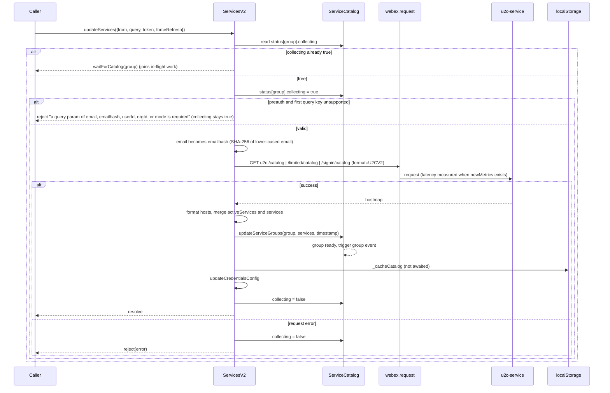

Diagram 2, ungated initialization:

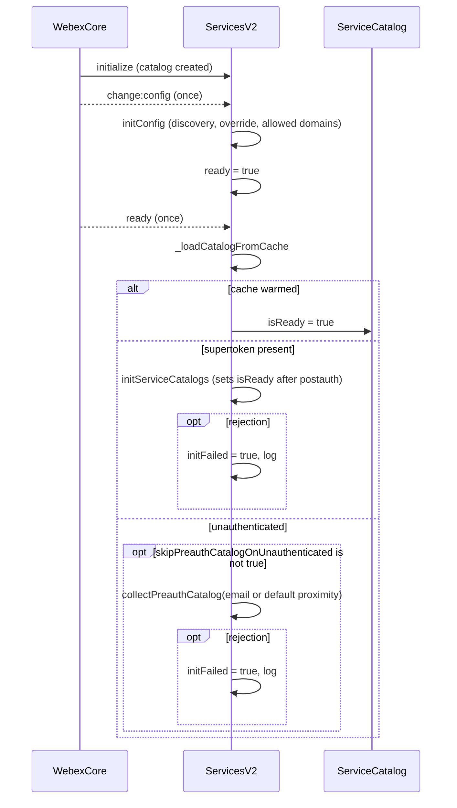

Diagram 3, gated initialization:

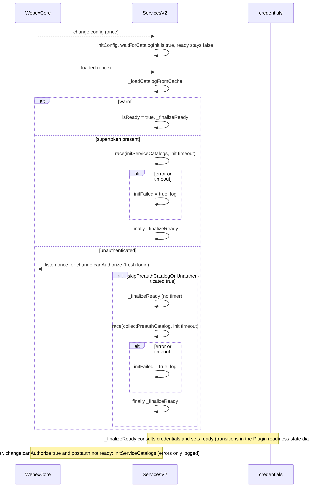

Diagram 4, resolution and waiting:

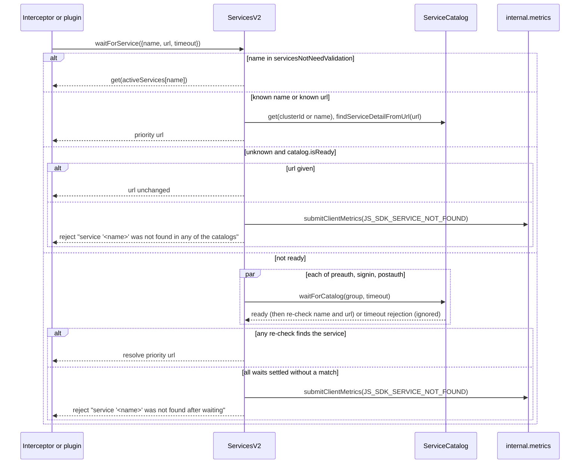

Diagram 5, failover:

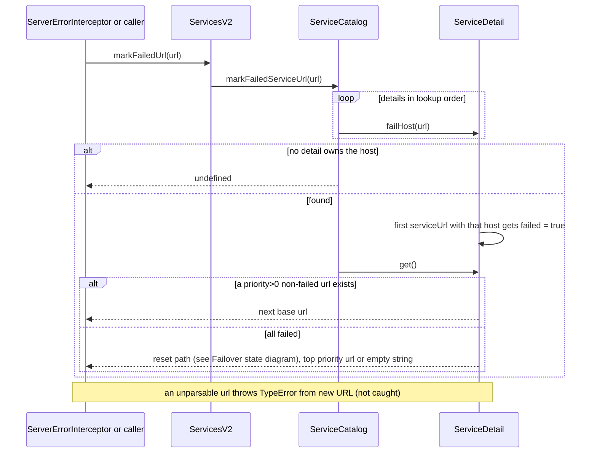

Diagram 6, cache write and warm:

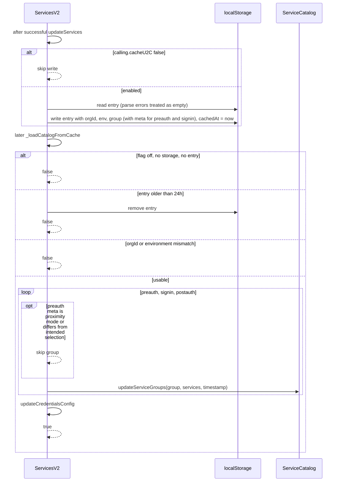

Diagram 7, cluster switch and invalidation:

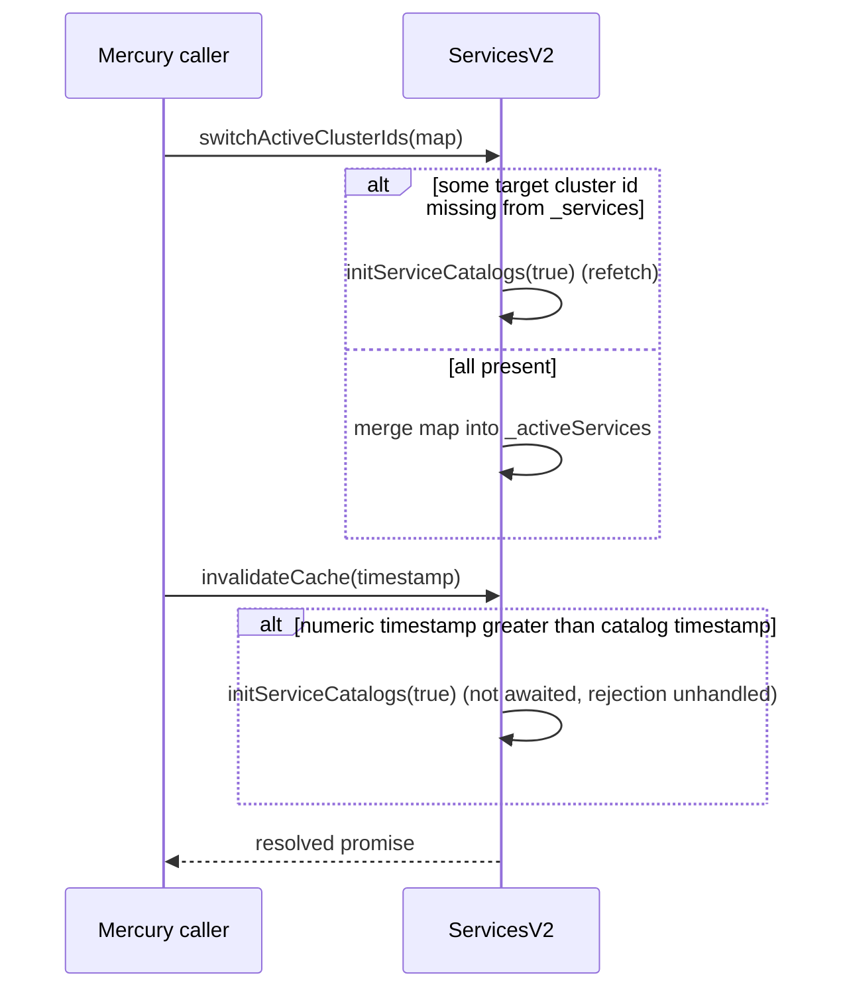

## Class and component relationships

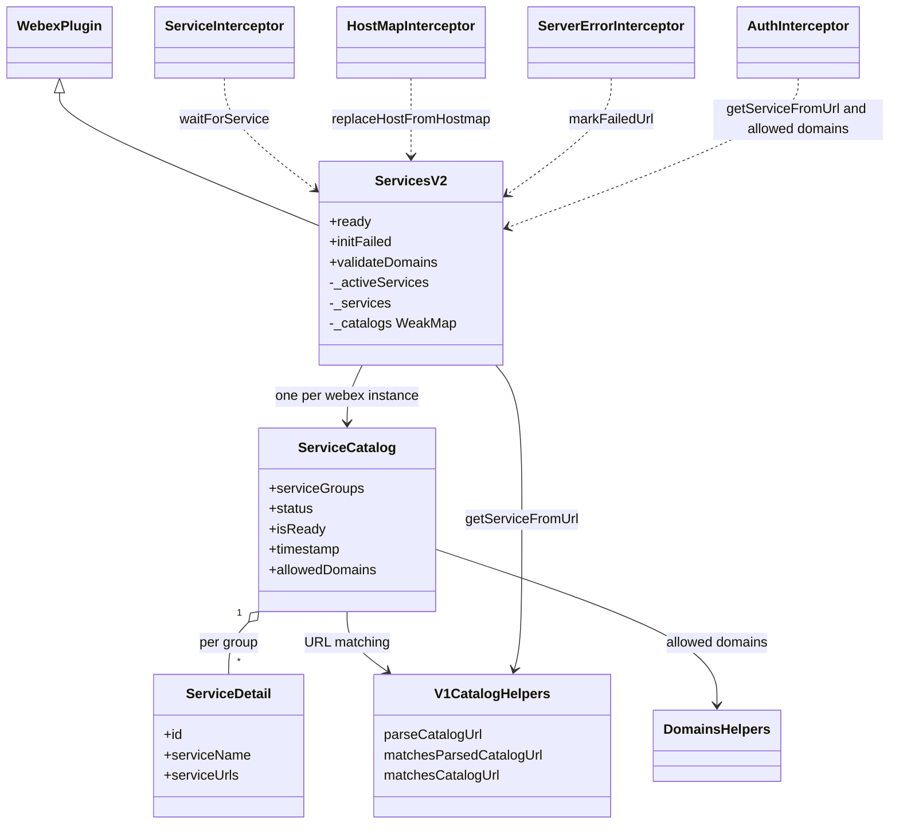

## Use cases and flows

| Use case | Actor or caller | Primary steps and outcome | Failure or boundary behavior | Evidence |
| --- | --- | --- | --- | --- |
| `UC-001` Opt in to v2 | Integrator or test | Register `ServicesV2` as the `services` plugin with `replace: true` and the two interceptors, then construct the webex instance; `webex.internal.services` is v2 | Without `replace` the second registration is refused and v1 stays; without the interceptors, requests that use `service` are not resolved | `src/lib/webex-internal-core-plugin-mixin.js`, `test/integration/spec/services-v2/services-v2.js` |
| `UC-002` Start up with a token | SDK | Config change seeds discovery; on `ready` (or `loaded` when gated) warm from cache or fetch preauth by org then postauth; `isReady` becomes true; `ready` flips | Postauth failure sets `initFailed`; timeout (gated) finalizes anyway | `src/lib/services-v2/services-v2.ts`, `test/unit/spec/services-v2/services-v2.ts` |
| `UC-003` Start up unauthenticated | SDK | Preauth catalog by configured email hash or proximity mode; later sign-in triggers postauth | `skipPreauthCatalogOnUnauthenticated` skips the fetch; failure sets `initFailed` | `src/lib/services-v2/services-v2.ts`, `test/unit/spec/services-v2/services-v2.ts` |
| `UC-004` Send a request by service name | `ServiceInterceptor` | `waitForService` returns the priority URL; the interceptor appends the resource | Not found rejects; the interceptor re-wraps as "is not a known service" | `src/lib/interceptors/service.js`, `src/lib/services-v2/services-v2.ts` |
| `UC-005` Decide whether to send a token to a URL | Auth interceptor | `getServiceFromUrl` match, else allowed-domain match when `validateDomains` is on | Similar-looking hosts and prefix paths are rejected by the matcher | `src/interceptors/auth.js`, `test/unit/spec/interceptors/auth.js`, `test/unit/spec/services-v2/service-catalog.ts` |
| `UC-006` Fail over after a server error | Error interceptor | `markFailedUrl` marks the host and returns the next base URL | Unknown URL returns `undefined`; reset behavior is in the Failover state diagram | `src/lib/interceptors/server-error.js`, `test/unit/spec/services-v2/service-detail.ts`, `test/integration/spec/services-v2/services-v2.js` |
| `UC-007` React to a cluster move | Mercury | `switchActiveClusterIds` or `invalidateCache` updates the active map or refetches | Missing cluster refetches; older timestamp is ignored | `src/lib/services-v2/services-v2.ts`, `test/unit/spec/services-v2/services-v2.ts` |
| `UC-008` Reload within 24 hours | Browser SDK | Warm from `services.v2.u2cHostMap`, no network | Mismatch of org, environment, selection, TTL falls back to fetch | `src/lib/services-v2/services-v2.ts`, `test/unit/spec/services-v2/services-v2.ts` |

### Cross-boundary use-case flow

Boundary-only facts (ordering, timeouts and recovery are in Data flow and Concurrency): the external boundary is `u2c-service`,
whose `U2CV2` response is trusted structurally (a missing `services` yields an empty list, a missing `baseUrl` throws while
formatting). User validation additionally crosses to idbroker (client token), hydra (meeting preferences), the sqdiscovery
region endpoint (5 s, unauthenticated) and license or user-onboarding (activation). A U2C that does not know `U2CV2` is a
server-side concern.

## Client state model

| State or slice | Owner | Initial state | Transition triggers | Reset or persistence boundary |
| --- | --- | --- | --- | --- |
| `serviceGroups` (five arrays of `ServiceDetail`) | `ServiceCatalog` | all empty | `updateServiceGroups`, `clean` | In memory; `clean` empties preauth, signin and postauth only |
| `status[group]` (`ready`, `collecting`) | `ServiceCatalog` | both false | `updateServices` sets `collecting`; `updateServiceGroups` sets `ready` | `clean` replaces with `{ready: false}` |
| `isReady` | `ServiceCatalog` | false | Postauth success in `initServiceCatalogs`, or cache warm | Never reset |
| `timestamp` | `ServiceCatalog` | `''` | Every `updateServiceGroups` (last group wins; discovery and override writes set it to `undefined`) | In memory |
| `allowedDomains` | `ServiceCatalog` | `[]` | `setAllowedDomains`, `addAllowedDomains` | In memory |
| `serviceUrls[].failed` | `ServiceDetail` | unset | `failHost`; clearing rules are in the Failover state diagram (State machine) | Lost on reload |
| `_activeServices`, `_services` | Plugin instance | `{}` and `[]` | `_formatReceivedHostmap`, `switchActiveClusterIds` | In memory; not rehydrated from cache; never pruned |
| `ready`, `initFailed`, `validateDomains` | Plugin | false, false, true (then config) | Init lifecycle; `initConfig` | `ready` never returns to false |
| `services.v2.u2cHostMap` | localStorage | absent | Each successful collection | See persistence section |

## Business rules and invariants

| ID | Invariant | WHY | Enforcement source | Test evidence |
| --- | --- | --- | --- | --- |
| `INV-V2-001` | A URL belongs to a service only when its origin matches a base URL and the base path ends at a path boundary; look-alike hosts and prefix-without-boundary do not match | Token attachment and URL trust depend on it (SSRF and token leakage) | `src/lib/services-v2/service-catalog.ts`, `src/lib/services/service-catalog.js` | `test/unit/spec/services-v2/service-catalog.ts` |
| `INV-V2-002` | An allowed domain matches only the hostname itself or one of its subdomains, and unusable entries are discarded on normalization | Prevents suffix-confusion trust | `src/lib/services-v2/service-catalog.ts`, `src/lib/domains.ts` | `test/unit/spec/services-v2/service-catalog.ts` |
| `INV-V2-003` | Only `serviceUrls` with `priority > 0` are ever returned as a service URL | Zero or negative priority marks a URL as not to be used | `src/lib/services-v2/service-detail.ts` | `test/unit/spec/services-v2/service-detail.ts` |
| `INV-V2-004` | Within a detail, negative priorities sort after all others and keep their relative order | Deterministic ordering with disabled entries last | `src/lib/services-v2/service-catalog.ts` | `test/integration/spec/services-v2/service-catalog.js` |
| `INV-V2-005` | When every selectable URL has failed, the failure marks reset instead of returning nothing | No permanent lock-out | `src/lib/services-v2/service-detail.ts` | `test/unit/spec/services-v2/service-detail.ts` |
| `INV-V2-006` | A failed U2C request clears the group's `collecting` flag | Later collections must not wait forever | `src/lib/services-v2/services-v2.ts` | none found |
| `INV-V2-007` | `catalog.isReady` is set only by a postauth success or a cache warm | It means "an authorized catalog is usable" | `src/lib/services-v2/services-v2.ts` | `test/unit/spec/services-v2/services-v2.ts` |
| `INV-V2-008` | The v2 cache never reuses v1's key and is discarded on environment or org mismatch or age over 24 hours | Two plugin generations and several environments can share one browser origin | `src/lib/services-v2/services-v2.ts` | `test/unit/spec/services-v2/services-v2.ts` |

## Concurrency and reactive flow

- **Execution model:** single-threaded event loop; promise chains plus ampersand-state event emitters (`listenToOnce`
  on the webex instance for `change:config`, `ready`, `loaded`, `change:canAuthorize`; `trigger(group)` on the
  catalog; `once('change:isRefreshing')` on credentials).
- **Ordering guarantees:** `change:config` precedes `initConfig` precedes any init branch; a group is marked `ready` and its event fired
  before `collecting` is cleared and before the cache write; in gated mode `ready` is set only after catalog work settles and any credential refresh
  completes.
- **Idempotency and retry:** the per-group `collecting` flag deduplicates concurrent collections, but a joiner resolves on the first `ready` event (or at once if the group
  is already ready, even while a refresh is in flight). No automatic retry exists; `invalidateCache` and `switchActiveClusterIds` are the re-trigger paths.
- **Shared-state protection:** none beyond the flag; `_activeServices` and `_services` are replaced wholesale on each update, and catalog arrays are mutated
  in place by `updateServiceGroups`, `_loadServiceDetails` and `_unloadServiceDetails`.
- **Blocking restrictions:** gated init must listen to `loaded`, not `ready`, because this plugin's `ready` participates in `webex.ready`; the init
  timeout must exist so a hung request cannot keep `ready` false.
- **Known leaks:** the init-timeout timer is not cleared after the race settles, and `ServiceCatalog.waitForCatalog` still creates its timer and listener
  when the group is already ready.

## Data, schema, and migration discipline

| Store or schema | Owned entities or keys | Source of truth | Migration and compatibility rule |
| --- | --- | --- | --- |
| localStorage entry `services.v2.u2cHostMap` | `orgId`, `env` (`fedramp`, `u2cDiscoveryUrl`), `cachedAt`, and one entry per group (`preauth`, `signin`, `postauth`): either a bare hostmap or `{hostMap, meta: {selectionType, selectionValue}}` | `src/lib/services-v2/services-v2.ts` | Reader accepts both group shapes; the key carries a version marker but no migration code exists; TTL 24 hours measured from the last write of any group; JSON errors count as no cache; v1 uses a different key and never reads this one |

Retention and cleanup: an expired entry is removed during warm-up; `clearCatalogCache` also removes it but has no caller in the
package outside tests. There is no logout hook in this module. The write is skipped entirely unless `calling.cacheU2C` is true (default false).

## State machine

Per-group catalog status (`collecting`, `ready`), identical in structure to v1:

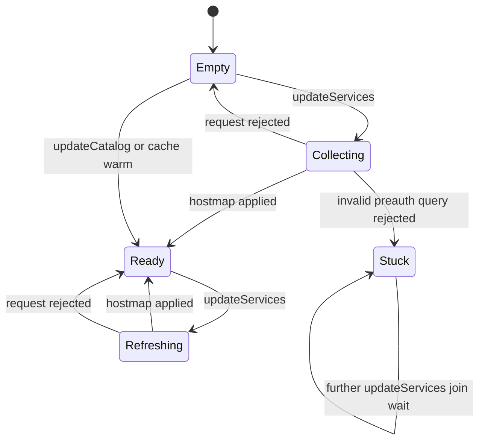

`Stuck` is a consequence of the code, not a design: see Pitfalls. `Refreshing` differs from `Collecting` only in that `ready` stays true.

Plugin readiness (`ready`, `initFailed`, `isReady`); this diagram is the sole home of the readiness transition set, and Diagrams 2 and 3 show only call order:

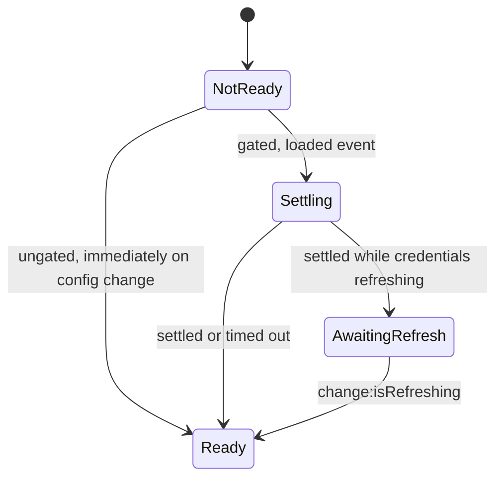

`ready` never returns to false; `initFailed` is independent and is set by errors or timeouts in either mode.

Per-URL failover state inside a `ServiceDetail`:

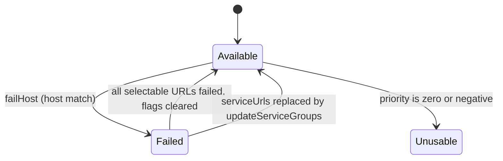

`Unusable` is a property of the URL, never selected, and never cleared by the reset.

## Caller-visible failure modes

| Condition | Signal or result | Caller behavior | Retry or recovery | Evidence |
| --- | --- | --- | --- | --- |
| Preauth query missing or first key unsupported | Rejection `a query param of email, emailhash, userId, orgId, or mode is required` | Fix the query | Subsequent calls join a stuck wait (see Pitfalls) | `src/lib/services-v2/services-v2.ts` |
| `updateServices({from: 'signin'})` with no query | Synchronous `TypeError` (key lookup on `undefined`), `collecting` left true | Use `collectSigninCatalog` | Same stuck behavior | `src/lib/services-v2/services-v2.ts` |
| Signin collection without email or token | Rejection `` `email` is required `` or `` `token` is required `` | Provide both | Retry | `src/lib/services-v2/services-v2.ts` |
| `validateUser` without email or without client credentials | Rejection with the message | Fix input or config | Retry | `src/lib/services-v2/services-v2.ts` |
| U2C request fails | Rejection with the request error; `collecting` cleared | Inspect error | Call again | `src/lib/services-v2/services-v2.ts` |
| Catalog wait times out | Rejection `services: timeout occured while waiting for '<group>' catalog to populate` | Treat as unavailable | Retry later | `src/lib/services-v2/service-catalog.ts` |
| Service not found | Rejection `services: service '<name>' was not found in any of the catalogs` or `... after waiting`, plus a `JS_SDK_SERVICE_NOT_FOUND` metric | Treat as unknown | Retry after the catalog loads | `src/lib/services-v2/services-v2.ts` |
| `convertUrlToPriorityHostUrl` or `getServiceUrlFromClusterId` on unknown input | Thrown `No service associated with url: [...]` or `Could not find service for cluster [...]` | Guard with lookups; `replaceHostFromHostmap` already swallows | None | `src/lib/services-v2/services-v2.ts` |
| `markFailedUrl` with an unparsable URL | Thrown `TypeError` from `new URL` | Pass a full URL | None | `src/lib/services-v2/service-detail.ts` |
| Gated init fails or times out | `ready` still true; `initFailed` true; error logged | Check `initFailed` | Call `updateServices` | `src/lib/services-v2/services-v2.ts` |
| `validateUser` client path failure | Rejection shaped `{statusCode, responseText, body}` | Show the message | Retry | `src/lib/services-v2/services-v2.ts` |
| Meeting preferences or region request fails | Resolves `undefined` | Treat as unavailable | None | `src/lib/services-v2/services-v2.ts` |
| Malformed `baseUrl` in a received hostmap | Thrown from `new URL` during formatting, rejecting the collection | None at this level | Fix server data | `src/lib/services-v2/services-v2.ts` |

## Pitfalls and constraints

- **v2 is not the default and nothing in config turns it on.** Do not assume `webex.internal.services` is v2 (registration mechanics: Design overview). The README's "continue to use /services" matches the code. Its DNSSec framing is not visible in code: no DNS or DNSSec logic exists in the module; the only v2-specific protocol is the `format=U2CV2` request. The intended DNSSec behavior is not stated in code or tests; recorded as a gap (see SV2-032).
- **A rejected preauth query leaves the group stuck.** `updateServices` sets `collecting` before validating the query and never clears it on rejection (or on the signin `TypeError`), so later calls for that group join `waitForCatalog` and time out after 60 seconds. v1 has the same defect.
- **Cache warm does not rehydrate `_activeServices` or `_services`** (code reading; no test asserts either way). After a warm start `get(name)` falls back to treating the name as a cluster id and finds only discovery and override entries (whose ids are their names); `updateCredentialsConfig`, `getMobiusClusters`, `isValidHost` and `switchActiveClusterIds` see empty maps, and the last one will refetch because every target id looks missing. Meanwhile `catalog.isReady` is already true, so `waitForService` rejects not-found for names that only exist in the cached catalog. v1 formats the cached hostmap and does not have this gap.
- **Hosts are not unique across services.** A fixture shows two clusters (conversation and idbroker) with the same host. `findClusterId` returns the first detail in lookup order and `failHost` marks only the first detail that owns the host, so a failure on one service does not demote the other's URL.
- **`ServiceDetail.get` returns `''` when no URL has `priority > 0`**, even if URLs exist. Consumers that concatenate it silently produce bad URLs. The comment on `_getPriorityHostUrl` mentioning `homeCluster` is stale: the field is declared on `ServiceHost` but no v2 code reads it.
- **`_services` and `_activeServices` only grow.** `catalog.clean()` leaves them, and `unionBy` keeps entries absent from newer responses, so mobius and host-validation helpers can answer from clusters no catalog group still holds.
- **Timestamp semantics.** `catalog.timestamp` is last-write-wins across groups, and the discovery/override seeding at init writes `undefined`. `invalidateCache` compares notification time to this value.
- **`cachedAt` is rewritten by every group write**, so a fresh group extends the life of an older cached one; nothing clears the entry on logout; `signin` and `postauth` cached groups are accepted without a selection check.
- **Dead and mismatched code.** `src/lib/services-v2/metrics.ts` is never imported; the plugin uses `src/lib/metrics.js`. Several JSDoc blocks are stale (`ServiceCatalog.markFailedServiceUrl` mentions `noPriorityHosts`, `updateServiceGroups` mentions `preauthorized` events, `getServiceFromUrl` documents `defaultUrl` twice).
- **`waitForCatalog` leaks.** For an already-ready group the promise resolves but a timer and listener are still created. The init-timeout timer is never cleared.
- **`invalidateCache` swallows nothing:** it does not await or catch `initServiceCatalogs(true)`, so its rejection is unhandled while the method returns a resolved promise.
- **`internal.metrics` is dereferenced unguarded** in `waitForService` when a service is not found; a webex instance without the metrics plugin throws a `TypeError` instead of the intended rejection.
- **Config is read once** (`initConfig` on the first `change:config`) and mutates the config object (discovery replacement under FedRAMP and the allowed-domain union). `fedramp` defaults to the raw value of `ENABLE_FEDRAMP` (a string when set).
- **Only one slash is stripped** by the trailing-slash expression (no global flag), as in v1.

## Module-specific rules

- Do: change v1 and v2 together when the behavior is meant to match; the init lifecycle, cache envelope and user validation are mirrored line for line, and the URL-matching helpers are shared by import.
- Do: keep catalog lookups synchronous in `ServiceCatalog` and `ServiceDetail`; keep network and storage in the plugin file.
- Do: read configuration only after `change:config`, never at construction.
- Do: keep `src/lib/services-v2/types.ts` in step with the classes by hand; the classes are declared through `AmpState.extend`, so the interfaces are not checked against them.
- Do not: depend on v1-only methods (`hasService`, `list`, `isServiceUrl`, `getRegistry`, `getState`) or on the `priorityHost` argument when the plugin may be v2.
- Do not: register v2 without passing the service and server-error interceptors.
- Do not: weaken URL matching to string prefix or `includes`; `INV-V2-001` and `INV-V2-002` are security boundaries.
- Do not: edit `src/lib/services-v2/README.md` as part of spec work; it is a kept-separate evidence note.

## Export stability

| Export or entry point | Consumer | Stability | Versioning and deprecation rule | Declaration or API report |
| --- | --- | --- | --- | --- |
| `ServicesV2`, `ServiceCatalogV2`, `ServiceDetail` | Package consumers and tests | Published through the package entry; the module README states it is a work in progress and may be updated many times | None declared in code or `src/lib/services-v2/README.md`; gap (see SV2-032) | `src/lib/services-v2/index.ts`, `src/index.js` |
| Plugin methods on `webex.internal.services` when v2 is registered | Sibling plugins | Internal namespace; underscore members are private by convention | None declared in code or `src/lib/services-v2/README.md`; gap (see SV2-032) | `src/lib/services-v2/services-v2.ts` |

## Key design trade-off

| Chosen trade-off | Preserved invariant or benefit | Cost or limitation | Decision evidence |
| --- | --- | --- | --- |
| Model priority hosts as complete ranked base URLs per cluster-scoped service | Failover is a simple ordered scan; no host substitution; different clusters coexist in one catalog | Hosts may repeat across services, so host-keyed lookup and failure marking are ambiguous | `src/lib/services-v2/service-detail.ts`, `src/lib/services-v2/types.ts`, `test/fixtures/host-catalog-v2.ts` |
| Import URL-matching helpers from the v1 catalog file instead of copying them | One security boundary for both versions | v2 has a compile-time dependency on v1's file | `src/lib/services-v2/service-catalog.ts`, `src/lib/services/service-catalog.js` |
| Export v2 but do not register it | Zero impact on default integrators while it is a work in progress | Adopting it needs plugin re-registration with correct interceptors | `src/index.js`, `src/lib/services-v2/index.ts`, `test/integration/spec/services-v2/services-v2.js` |
| Gated readiness is opt-in and a cache warm skips the network | Non-blocking default startup; faster reloads | Two code paths; a warm start leaves plugin maps empty (see Pitfalls) | `src/lib/services-v2/services-v2.ts`, `src/config.js` |

No design record states why two parallel implementations are maintained; the code and `src/lib/services-v2/README.md` say only that v2 is a work in progress (gap, see SV2-032).

## Verification

| Requirement or invariant | Test level | Positive evidence | Negative or boundary evidence | Gap |
| --- | --- | --- | --- | --- |
| `SV2-001` | Integration | `test/integration/spec/services-v2/services-v2.js` | none found | No assertion that the default is v1 |
| `SV2-002`, `SV2-003`, `SV2-004` | Unit, integration | `test/unit/spec/services-v2/services-v2.ts`, `test/integration/spec/services-v2/services-v2.js` | `test/integration/spec/services-v2/services-v2.js` (no query rejects) | Unit tests cover only the request and override query; email hashing and forced refresh run against live U2C |
| `SV2-005`, `INV-V2-006` | none | none found | none found | In-flight join and `collecting` clearing untested |
| `SV2-006`, `SV2-007`, `INV-V2-004` | Unit, integration | `test/unit/spec/services-v2/services-v2.ts`, `test/integration/spec/services-v2/service-catalog.js` | `test/unit/spec/services-v2/services-v2.ts` (empty hostmap) | Pruning and failed-flag reset on refresh not unit tested at catalog level |
| `SV2-008`, `SV2-009`, `INV-V2-003`, `INV-V2-005` | Unit | `test/unit/spec/services-v2/service-detail.ts`, `test/unit/spec/services-v2/service-catalog.ts` | `test/unit/spec/services-v2/service-detail.ts` (all failed, none available, unknown host) | Shared-host behavior and unparsable URL untested |
| `SV2-010`, `SV2-013` | Integration | `test/integration/spec/services-v2/services-v2.js`, `test/integration/spec/services-v2/service-catalog.js` | The same files (unknown url, wrong group) | No unit test of `get`, `findClusterId` or group precedence |
| `SV2-011`, `SV2-012`, `INV-V2-001` | Unit, integration | `test/unit/spec/services-v2/service-catalog.ts`, `test/unit/spec/services-v2/services-v2.ts`, `test/unit/spec/interceptors/auth.js` | `test/unit/spec/services-v2/service-catalog.ts` (look-alike hosts, prefix without boundary, unparsable) | none |
| `SV2-014` | none | none found | none found | `getServiceUrlFromClusterId` untested |
| `SV2-015`, `SV2-016` | Integration | `test/integration/spec/services-v2/services-v2.js`, `test/integration/spec/services-v2/service-catalog.js` | The same files (missing service, timeout) | No unit test of `waitForService`; `servicesNotNeedValidation` shortcut and plugin kick-off untested; leaked timer unasserted |
| `SV2-017` | Integration | `test/integration/spec/services-v2/services-v2.js` | none found | FedRAMP substitution and commercial union unasserted |
| `SV2-018`, `SV2-019`, `SV2-020`, `SV2-021`, `INV-V2-007` | Unit | `test/unit/spec/services-v2/services-v2.ts` | `test/unit/spec/services-v2/services-v2.ts` (errors, timeout, refresh wait, skip preauth, no stray timer) | Real timers not exercised |
| `SV2-022`, `SV2-023`, `INV-V2-008` | Unit | `test/unit/spec/services-v2/services-v2.ts` | `test/unit/spec/services-v2/services-v2.ts` (proximity mode, selection mismatch, environment mismatch) | TTL expiry, org mismatch, flag off, storage exceptions, `clearCatalogCache`, and the missing rehydration of plugin maps are untested |
| `SV2-024` | Unit, integration | `test/unit/spec/services-v2/services-v2.ts`, `test/integration/spec/services-v2/services-v2.js` | `test/unit/spec/services-v2/services-v2.ts` (older, equal, non-numeric and null timestamps) | Unhandled rejection of the unawaited refetch untested |
| `SV2-025` | Unit | `test/unit/spec/services-v2/services-v2.ts` | `test/unit/spec/services-v2/services-v2.ts` (authorization string retained) | none |
| `SV2-026` | Integration | `test/integration/spec/services-v2/services-v2.js` | `test/integration/spec/services-v2/services-v2.js` (no email, invalid email, non-existing and inactive users) | No unit coverage; needs provisioned users and live services |
| `SV2-027` | Unit | `test/unit/spec/services-v2/services-v2.ts` | `test/unit/spec/services-v2/services-v2.ts` (request failure resolves) | none |
| `SV2-028` | Unit | `test/unit/spec/services-v2/services-v2.ts` | `test/unit/spec/services-v2/services-v2.ts` (non-string input, missing config) | none |
| `SV2-029`, `INV-V2-002` | Unit | `test/unit/spec/services-v2/service-catalog.ts` | `test/unit/spec/services-v2/service-catalog.ts` (parametrized allowed-domain cases, unusable entries) | none |
| `SV2-030` | Unit | `test/unit/spec/services-v2/service-catalog.ts` | none found | `collecting` key dropping not asserted |
| `SV2-031` | Unit | `test/unit/spec/interceptors/auth.js` | none found | Other interceptors are exercised only in the integration spec |

Frameworks and counts: unit tests run on Jest through the legacy tools (`test:unit` in `package.json`, config in `jest.config.js`) with
sinon, the shared chai assert helper and `MockWebex`; there are about 119 unit `it` blocks across the three files under
`test/unit/spec/services-v2` (some parametrized with `it.each`) and about 124 integration `it` blocks across the two files under
`test/integration/spec/services-v2`. Integration tests are Mocha files that create real test users and talk to live U2C, idbroker and license services
(flaky and 429-retry wrappers are used), so they are not part of the offline unit run. Notable gaps: no unit test of `updateServices`,
`waitForService`, `validateUser`, in-flight sharing or the stuck-group defect, and no test that v2 is absent from the default plugin set.
