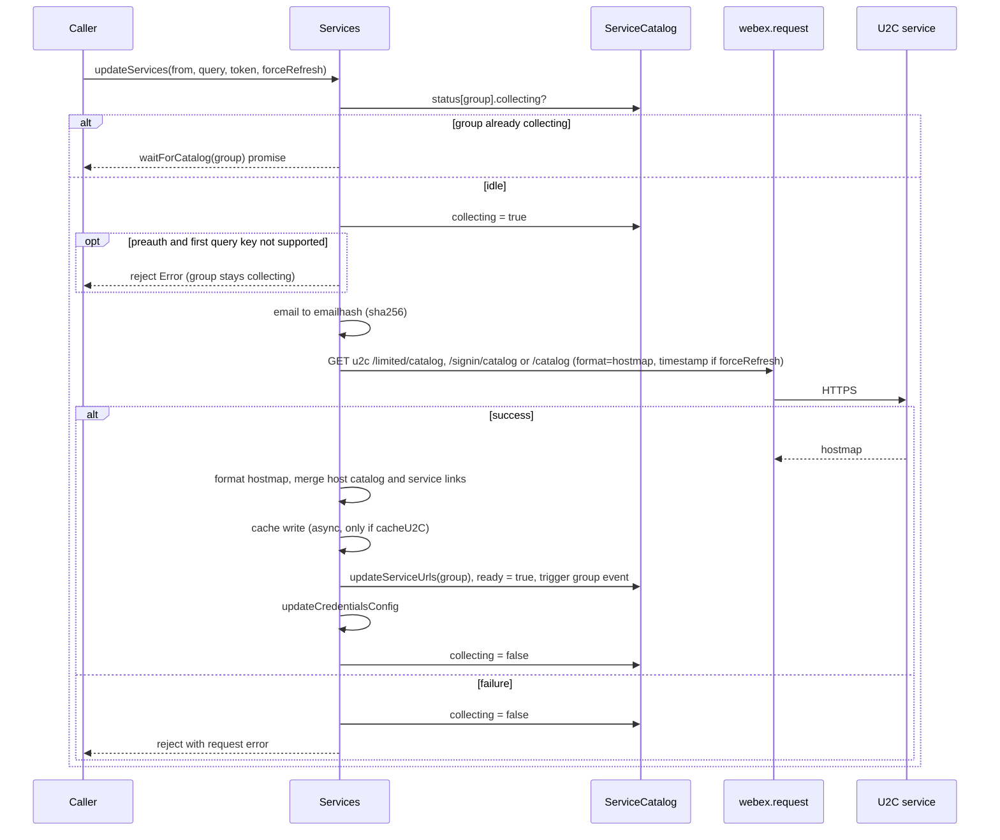
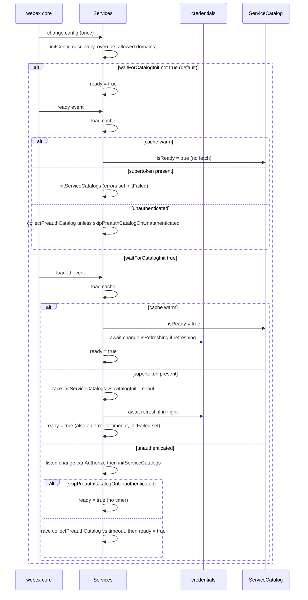
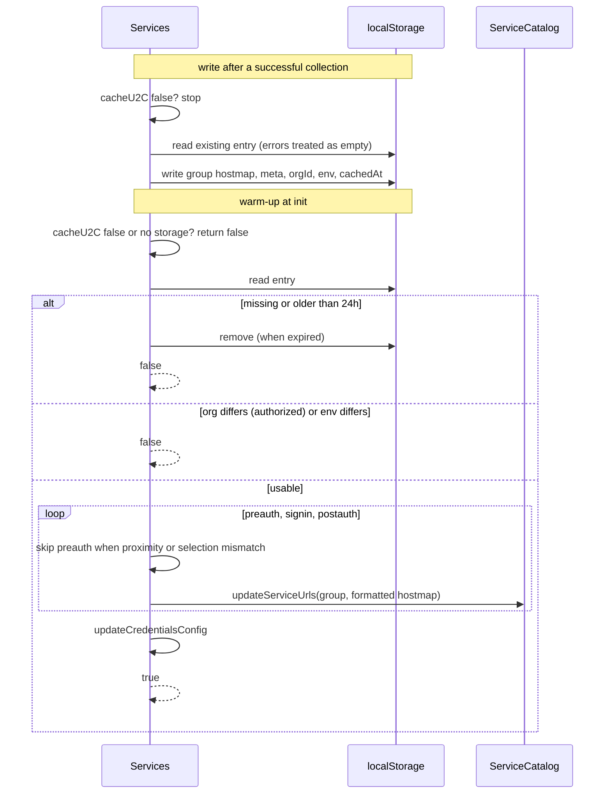
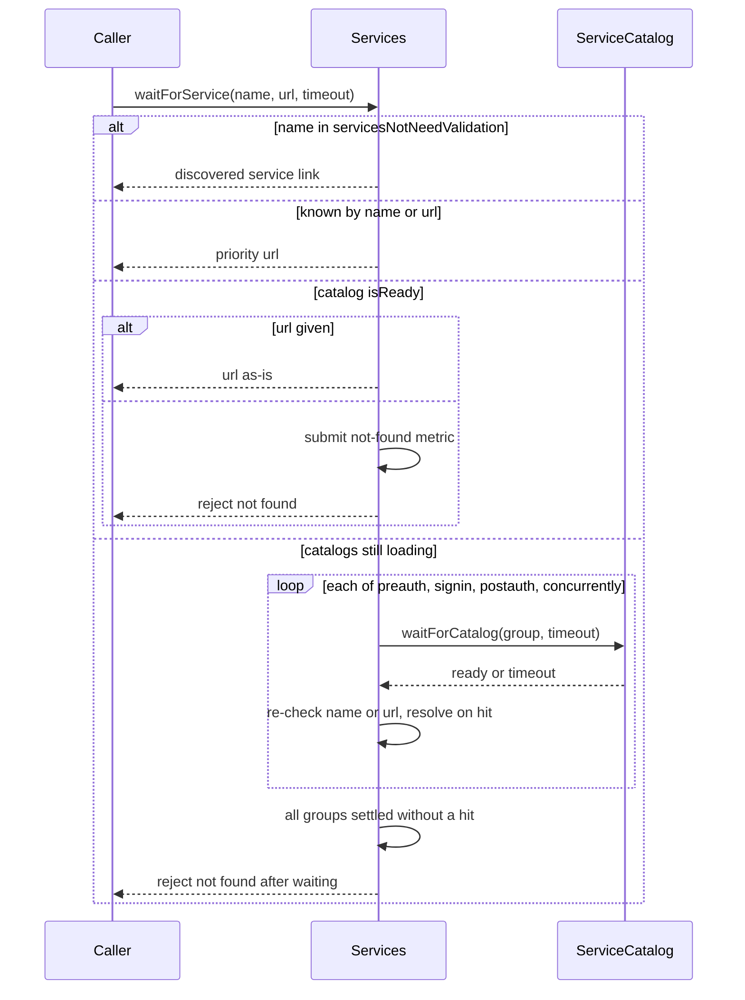
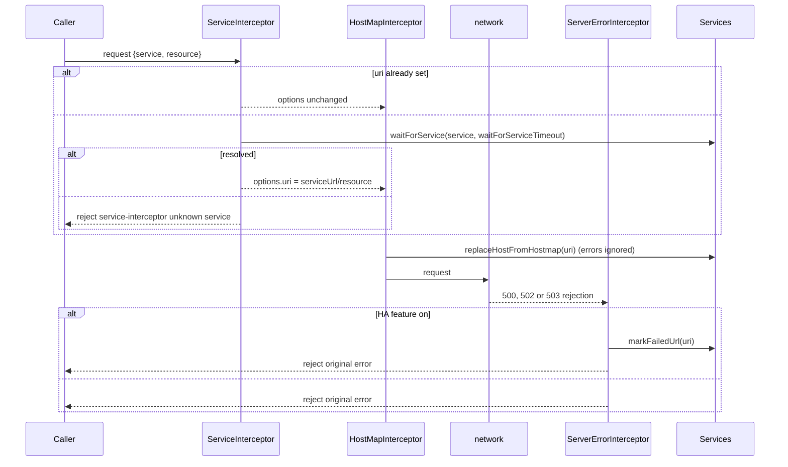
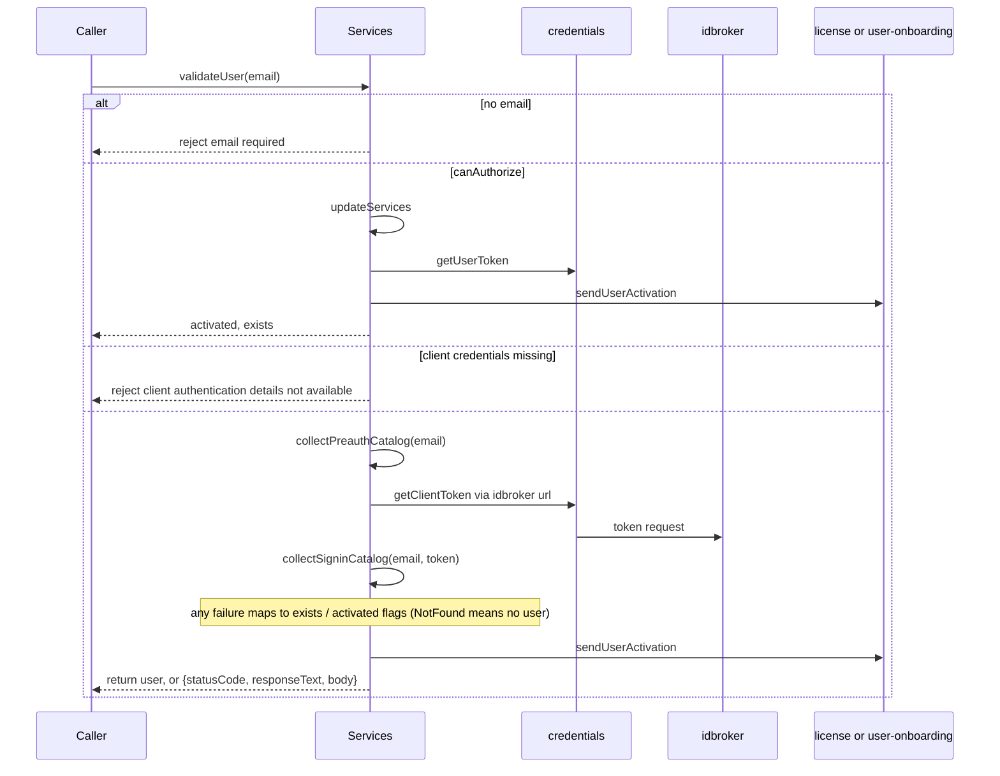
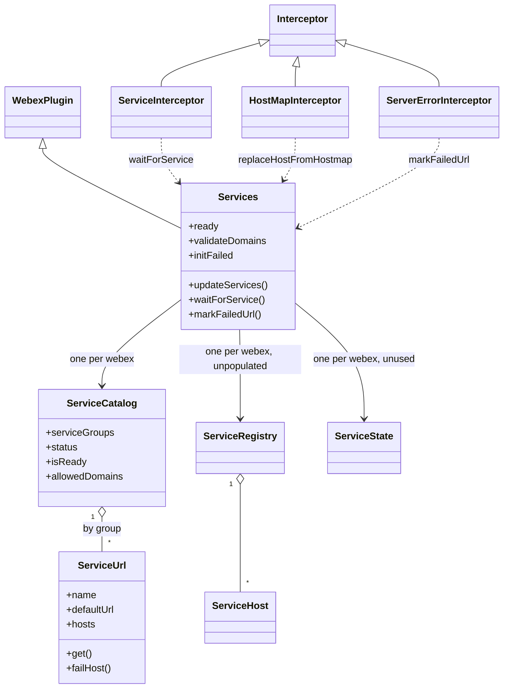
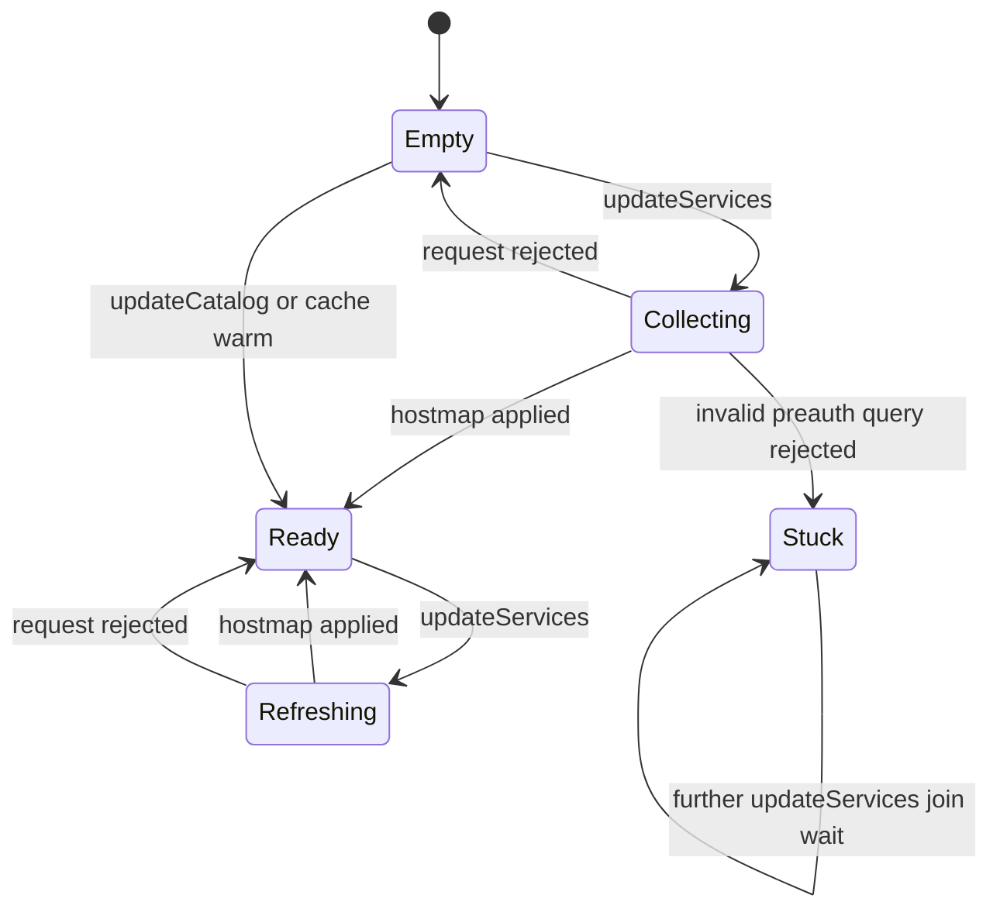
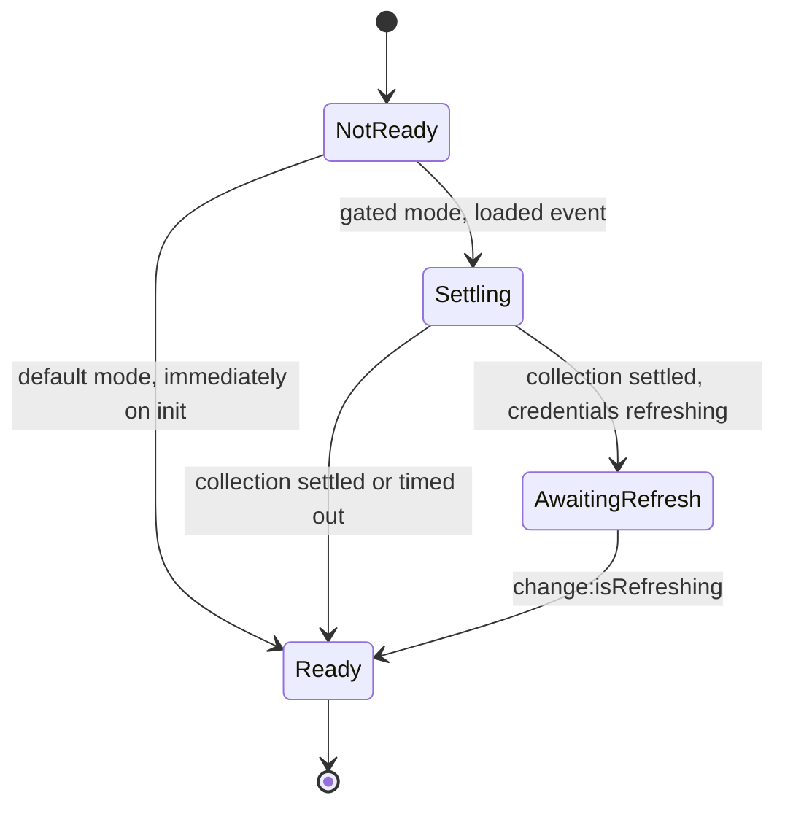

<!-- sdd-generated-metadata
doc_kind: module-spec
generated_from: module-spec@0.3.0
generated_by: claude-code
approved_by: rsarika@cisco.com
updated_at: 2026-10-07T13:20:21Z
validation_status: pass-with-warnings
-->

# services (v1 service discovery)

This source-local document at `src/lib/services/docs/README.md` owns the stable specification for
the **v1 service-discovery plugin**: collecting the U2C service catalog, modelling services, hosts
and URLs, resolving service names and URLs, selecting and failing over hosts, gating `webex.ready`
on catalog readiness, and the three interceptors (`ServiceInterceptor`, `HostMapInterceptor`,
`ServerErrorInterceptor`) in `src/lib/interceptors` that apply the catalog to outgoing requests.

The sibling v2 implementation is specified in
[`src/lib/services-v2/docs/README.md`](../../services-v2/docs/README.md) and is not restated here.
The package-level surface, interceptor ordering, and the auth and catalog-URL interceptors that
*consume* this module belong to the parent, specified in [`src/docs/README.md`](../../../docs/README.md).

Related context: [repository architecture](../../../../docs/architecture.md) ·
[documentation index](../../../../docs/index.md) · [agent instructions](../../../../AGENTS.md) ·
[specification registry](../../../../docs/specs/README.md)

## Metadata

| Field             | Value                                                          |
| ----------------- | -------------------------------------------------------------- |
| Owner             | Cisco Webex for Developers                                     |
| Source path       | `src/lib/services`                                             |
| Resource kind     | Capability module (internal plugin `services`, plus interceptors) |
| Status            | Active                                                         |
| Last verified     | 2026-10-07                                                     |
| Module id         | `src/lib/services`                                             |
| Parent spec       | [`src/docs/README.md`](../../../docs/README.md)                |
| Doc kind          | Module spec                                                    |
| Coverage score    | 100% assessed 2026-10-07; 16 of 16 mandatory fields present; critical 8 of 8; independent validation pass-with-warnings 2026-10-07 |
| Validation status | Pass with warnings — 2026-10-07; runtime `01a1166d-02d9-7772-bc25-1a801fb5f1d1`; 0 Blocking, 8 Important, 3 Medium |

## Applicability

| Condition ID                         | Status     | Evidence or reason                                                                                                                              | Owned section                 |
| ------------------------------------ | ---------- | ------------------------------------------------------------------------------------------------------------------------------------------------ | ----------------------------- |
| `module.has_tiers`                   | N/A        | The repository assigns no operational or review tiers                                                                                           | Tier                          |
| `module.has_ui`                      | N/A        | No components or rendering                                                                                                                      | UI use-case flow              |
| `module.crosses_service_boundaries`  | Applicable | Fetches the U2C catalog and calls hydra, license and user-onboarding services in src/lib/services/services.js                                    | Cross-boundary use-case flow  |
| `module.holds_client_state`          | Applicable | Catalog groups, readiness flags and host failure marks live in memory in src/lib/services/service-catalog.js and src/lib/services/service-url.js | Client state model            |
| `module.enforces_domain_rules`       | Applicable | Host priority and failover rules, URL-to-service origin matching, allowed-domain matching (src/lib/services/service-url.js, src/lib/services/service-catalog.js) | Business rules and invariants |
| `module.is_concurrent_async`         | Applicable | Promise-based catalog collection with an in-flight guard, init-timeout race and event-driven readiness in src/lib/services/services.js            | Concurrency and reactive flow |
| `module.owns_persistence`            | Applicable | Owns a versioned localStorage cache entry with TTL and shape compatibility in src/lib/services/services.js                                      | Data, schema, and migration   |
| `module.stateful_transitions`        | Applicable | Per-group collecting/ready flags and the services ready/initFailed lifecycle (src/lib/services/service-catalog.js, src/lib/services/services.js) | State machine                 |
| `module.exposes_wire_protocol`       | N/A        | Consumes the external U2C hostmap response and defines no protocol of its own; the cached JSON is covered under persistence                      | Protocol and wire format      |
| `module.ui_multi_screen`             | N/A        | Gated by module.has_ui, which is N/A                                                                                                            | UI flow                       |
| `module.large_data_model`            | N/A        | A handful of small entities (catalog, URL, host); no schema or migration surface beyond the cache entry                                         | Data model                    |
| `module.returns_caller_errors`       | Applicable | Rejections and thrown errors for invalid queries, unknown services and unknown URLs (src/lib/services/services.js, src/lib/interceptors/service.js) | Caller-visible failure modes  |
| `module.module_specific_conventions` | Applicable | Ampersand-state classes versus plain ES classes, private underscore members, and the v1/v2 mirror (src/lib/services/services.js, src/lib/services/service-registry.js) | Module-specific rules         |
| `module.published_package`           | Applicable | Classes and interceptors are re-exported from the package entry (src/lib/services/index.js, src/index.js)                                       | Export stability              |
| `module.embedded_in_host`            | N/A        | Not mounted into a host application                                                                                                             | Host integration and theming  |
| `module.has_design_tradeoff`         | Applicable | Gated versus ungated readiness, and a cache that bypasses fetch on warm start (src/lib/services/services.js)                                    | Key design trade-off          |
| `module.has_submodules`              | N/A        | No child modules; computed from the manifest module tree                                                                                        | Sub-modules                   |

## Evidence register

| Evidence                                           | What it establishes                                                                                                                   |
| -------------------------------------------------- | -------------------------------------------------------------------------------------------------------------------------------------- |
| `src/lib/services/index.js`                        | Registers the `services` internal plugin with two interceptors and re-exports six classes                                             |
| `src/lib/services/services.js`                     | The plugin: config init, U2C collection, cache, init lifecycle, service and URL resolution, user validation                           |
| `src/lib/services/service-catalog.js`              | The in-memory catalog: groups, status flags, precedence, URL matching, allowed domains, failover entry point                          |
| `src/lib/services/service-url.js`                  | One service with its default URL and hosts; priority-host selection and failure marking                                              |
| `src/lib/services/service-host.js`                 | Validated host model with `failed`/`replaced` flags and a derived URL                                                                |
| `src/lib/services/service-registry.js`             | Filterable host collection with catalog-name mapping and remote-hostmap mapping                                                      |
| `src/lib/services/service-state.js`                | Per-catalog collecting/ready flag holder                                                                                             |
| `src/lib/services/service-fed-ramp.js`             | The FedRAMP discovery URL set that replaces discovery config                                                                         |
| `src/lib/interceptors/service.js`                  | Request-side resolution of `service` + `resource` into `uri`                                                                          |
| `src/lib/interceptors/hostmap.js`                  | Request-side host rewriting from the host catalog                                                                                     |
| `src/lib/interceptors/server-error.js`             | Response-error-side host failure marking behind a feature flag                                                                       |
| `src/lib/domains.ts`                               | Allowed-domain normalization and dual-parser hostname matching used by the catalog                                                    |
| `src/lib/constants.js`                             | Catalog name enum, enum-type tags, and the commercial allowed-domain list                                                            |
| `src/config.js`                                    | Default `services`, `calling.cacheU2C` and `fedramp` configuration                                                                   |
| `src/webex-core.js`                                | Interceptor registry, pre/post ordering, `ready` derivation across children                                                          |
| `src/lib/webex-core-plugin-mixin.js`               | How a plugin's `interceptors` option merges into the shared registry                                                                 |
| `src/interceptors/auth.js`                         | A consumer of `waitForService`, `getServiceFromUrl`, `hasAllowedDomains` and `isAllowedDomainUrl`                                    |
| `src/interceptors/catalog-url.js`                  | A consumer of `getServiceFromUrl` and the allowed-domain checks                                                                      |
| `src/lib/services-v2/README.md`                    | Existing work-in-progress note for the v2 sibling, read as evidence only                                                              |
| `test/unit/spec/services/services.js`              | Init lifecycle (gated and ungated), ready finalization, cache, hostmap formatting, credentials config, helper methods                |
| `test/unit/spec/services/service-catalog.js`       | URL-matching helpers, allowed-domain handling, catalog accessors                                                                     |
| `test/unit/spec/services/service-url.js`           | Priority selection, negative priorities, host failure and cluster selection                                                          |
| `test/unit/spec/services/service-host.js`          | Host validation and flags                                                                                                            |
| `test/unit/spec/services/service-registry.js`      | Registry filters, load, clear, failed, replaced, reset and static mappers                                                            |
| `test/unit/spec/services/service-state.js`         | State holder constructor and setters                                                                                                 |
| `test/unit/spec/services/interceptors/service.js`  | ServiceInterceptor URI generation, normalization, validation, and resolution outcomes                                                 |
| `test/unit/spec/services/interceptors/hostmap.js`  | HostMapInterceptor call and error-swallowing behavior                                                                                |
| `test/unit/spec/services/interceptors/server-error.js` | ServerErrorInterceptor behavior with the feature flag on and off                                                                 |
| `test/integration/spec/services/services.js`       | Real-U2C behavior of collection, waiting, user validation and failover (needs provisioned test users)                                |
| `test/integration/spec/services/service-catalog.js`| Real-U2C catalog population, lookups and failover                                                                                    |

## Purpose and boundary

- **Responsibility:** know where every Webex service lives. Fetch the U2C hostmap for the right
  catalog group at the right time, hold it as a catalog of service URLs with prioritized hosts,
  answer name-to-URL and URL-to-service questions for the rest of the SDK, rewrite requests to
  catalog URLs and hosts, and tell `webex.ready` when the catalog is usable.
- **In scope:** the `Services` plugin and its helper classes; catalog groups `discovery`,
  `override`, `preauth`, `signin`, `postauth`; U2C collection with query handling and optional
  force-refresh; the localStorage catalog cache; the gated and ungated init lifecycle and its
  timeout; host selection, failover and failure marking; allowed-domain storage and matching
  entry points; FedRAMP discovery substitution; user validation and activation helpers that
  drive catalog collection; the `ServiceInterceptor`, `HostMapInterceptor`, `ServerErrorInterceptor`.
- **Out of scope:** the v2 implementation in [`src/lib/services-v2/docs/README.md`](../../services-v2/docs/README.md);
  the auth and catalog-URL interceptors and the interceptor ordering in `src/webex-core.js` (parent
  module); token acquisition and `getOrgId` (credentials module); the HTTP request/interceptor
  machinery (`http-core`, summarized under Dependencies); the device plugin that defines the
  `web-high-availability` feature flag.
- **Consumers:** about 27 sibling packages call the plugin through `webex.internal.services`
  (for example device, mercury, conversation, meetings, rooms, memberships, metrics, authorization
  plugins), and the parent's auth and catalog-URL interceptors.

## Structure and key files

| Path                                      | Responsibility                                                                                                                         |
| ----------------------------------------- | ---------------------------------------------------------------------------------------------------------------------------------------- |
| `src/lib/services/index.js`               | Side-effect registration of the plugin and the two interceptors it owns, plus named re-exports                                          |
| `src/lib/services/services.js`            | The `Services` plugin (ampersand-state extension of the webex plugin base); the only module that talks to U2C and storage              |
| `src/lib/services/service-catalog.js`     | `ServiceCatalog` (ampersand-state), plus exported URL-matching helpers `parseCatalogUrl`, `matchesParsedCatalogUrl`, `matchesCatalogUrl` |
| `src/lib/services/service-url.js`         | `ServiceUrl` (ampersand-state): a default URL and hosts; priority-host selection and failure marking                                   |
| `src/lib/services/service-host.js`        | `ServiceHost` plain class with validation, `active`/`local`/`service`/`url` getters                                                    |
| `src/lib/services/service-registry.js`    | `ServiceRegistry` plain class: host collection with composable filters; instantiated per webex but not populated by the plugin          |
| `src/lib/services/service-state.js`       | `ServiceState` plain class: collecting/ready flags per `SERVICE_CATALOGS` name; instantiated per webex but not driven by the plugin    |
| `src/lib/services/service-fed-ramp.js`    | Default export: the hydra, u2c and sqdiscovery URLs used when `fedramp` is on                                                          |
| `src/lib/interceptors/service.js`         | `ServiceInterceptor`: turns `service`/`api` + `resource` into `uri` after waiting for the service                                       |
| `src/lib/interceptors/hostmap.js`         | `HostMapInterceptor`: rewrites the request host from the host catalog                                                                   |
| `src/lib/interceptors/server-error.js`    | `ServerErrorInterceptor`: on 500/502/503, marks the failed host when the HA feature flag is on                                          |

`src/lib/interceptors/` contains exactly these three files; the other interceptors in the package live in `src/interceptors` and belong to the parent.

## Public surface

| Surface | Contract | Consumer | Compatibility commitment | Source |
| --- | --- | --- | --- | --- |
| Internal plugin `services` (reached as `webex.internal.services`) | `webex-core-services` | Sibling plugins and the parent's interceptors | Method names and result shapes are relied on across about 27 packages; the behavior of the lookup, wait, failover and cache methods is summarized under Requirements. No version policy is declared in code | `src/lib/services/services.js` |
| `Services`, `ServiceCatalog`, `ServiceRegistry`, `ServiceState`, `ServiceHost`, `ServiceUrl` | `webex-core-services` | Package consumers and tests importing from the package entry | Named exports; no deprecation markers in code | `src/lib/services/index.js`, `src/index.js` |
| `ServiceInterceptor`, `ServerErrorInterceptor` (registered by the plugin) and `HostMapInterceptor` (registered by the core) | `webex-core-services` | The request pipeline; also exported for tests | Created by static `create()` with `this` bound to the webex instance | `src/lib/interceptors/service.js`, `src/lib/interceptors/server-error.js`, `src/lib/interceptors/hostmap.js`, `src/webex-core.js` |
| `parseCatalogUrl`, `matchesParsedCatalogUrl`, `matchesCatalogUrl` | `webex-core-services` | Catalog internals; exported from the catalog file | Not re-exported from the package entry | `src/lib/services/service-catalog.js` |
| Configuration `services.*` (`discovery`, `override`, `allowedDomains`, `validateDomains`, `validateCatalogUrls`, `servicesNotNeedValidation`, `waitForCatalogInit`, `catalogInitTimeout`, `skipPreauthCatalogOnUnauthenticated`, `useUserOnboardingServiceForActivations`), `calling.cacheU2C`, `fedramp` | `webex-core-services` | SDK integrators | Keys are read at the moment of `change:config`, not live | `src/config.js` |
| Session property `ready` and props `validateDomains`, `initFailed` | `webex-core-services` | `webex.ready` derivation, auth and catalog-URL interceptors | `ready` participates in `webex.ready` when it is `false` | `src/lib/services/services.js`, `src/webex-core.js` |

`waitForCatalogInit` is read by this module but has no default in `src/config.js`; absent means disabled.
`useCatalogOverride` exists in `src/config.js` but is read only by the v2 implementation, not by this module.

## Dependencies

| Dependency | Why it is required | Failure behavior |
| --- | --- | --- |
| U2C HTTP service (contract `u2c-service`) | Source of the hostmap for the preauth (`/limited/catalog`), signin and postauth (`/catalog`) groups | A failed fetch rejects `updateServices`, clears the group's `collecting` flag, and in init paths sets `initFailed`; discovery URLs from config remain usable |
| `@webex/http-core` (contract `http-core-sdk`; specified in the http-core spec) | Provides the `Interceptor` base class and the request pipeline the three interceptors plug into; its error taxonomy supplies the 5xx classes the server-error interceptor tests for | Interceptor hooks follow the http-core contract: `onRequest` result or rejection, `onResponseError` returns a rejection to propagate |
| Credentials module of this package (contract `webex-core-credentials`) | `getOrgId`, `canAuthorize`, `supertoken`, `getUserToken`, `getClientToken`, `isRefreshing` and `config` drive preauth selection, postauth gating, cache org match, user validation and ready finalization | `getOrgId` throwing rejects `initServiceCatalogs`; elsewhere errors are caught and logged (cache paths) |
| Webex plugin base (`src/lib/webex-plugin.js`) | `request`, `logger`, `webex`, event helpers (`listenToOnce`) and `namespace` | Not applicable |
| `ampersand-state` (contract `ampersand-state-library`) | Base for `Services`, `ServiceCatalog`, `ServiceUrl`; supplies typed props, `session`, `trigger`/`once`/`listenToOnce` (read from code; no spec) | Assigning a wrong-typed prop throws per the library |
| `lodash` (`union`, `forEach`, `uniq`), `crypto-js/sha256` | Allowed-domain merge, hostmap iteration and email hashing for `emailhash` queries (read from code; no spec) | Not applicable |
| Node `url` module (legacy `Url.parse`/`Url.format`) and the WHATWG `URL` | Host URL generation and URL matching | `new URL` failures are caught in matching helpers and treated as no match |
| Device plugin (read from code; no spec) | `internal.device.features.developer.get('web-high-availability')` gates failover marking | A missing device plugin makes the server-error interceptor throw a TypeError instead of rejecting with the original reason |
| New-metrics and client-metrics plugins (read from code; no spec) | `callDiagnosticLatencies.measureLatency` wraps the U2C fetch when present; `submitClientMetrics` records not-found services and HA failures | Metrics are optional for the U2C fetch; the not-found metric call assumes `internal.metrics` exists |
| `@webex/common-timers` (contract `common-timers-sdk`) | Declared in the package manifest; not imported by any file in this module | Not applicable |
| Config sources `config.js`, `lib/constants.js`, `lib/domains.ts`, `lib/metrics.js` | Defaults, catalog enum and commercial allow-list, allowed-domain logic, metric names | Not applicable |

## Requirements

| ID | WHAT | WHY | Source evidence | Test or example evidence | Assumptions or gaps | Confidence |
| --- | --- | --- | --- | --- | --- | --- |
| `SVC-001` | The plugin registers itself as internal plugin `services` together with `ServiceInterceptor` and `ServerErrorInterceptor`; `HostMapInterceptor` is registered by the core, not by this plugin | Request interception must exist whenever the plugin is loaded, while the host rewrite applies even in cores that do not load the plugin | `src/lib/services/index.js`, `src/webex-core.js`, `src/lib/webex-core-plugin-mixin.js` | `test/unit/spec/services/services.js` (initialize creates catalog, registry, state) | No test asserts the interceptor registration itself | Present |
| `SVC-002` | On `change:config` (once) the plugin loads discovery URLs and `services.override` into catalog groups `discovery` and `override`, substitutes the FedRAMP set for discovery when `fedramp` is on, sets allowed domains, and copies `validateDomains` from config | The u2c, hydra and sqdiscovery URLs must be resolvable before any catalog fetch, and the allowed-domain policy must exist before the first authenticated request | `src/lib/services/services.js`, `src/lib/services/service-fed-ramp.js`, `src/config.js` | `test/unit/spec/services/services.js` | The FedRAMP substitution branch is not unit tested | Present |
| `SVC-003` | Outside FedRAMP, `services.allowedDomains` is unioned with the commercial allowed-domain list (`wbx2.com`, `ciscospark.com`, `webex.com`, `webexapis.com` and four broadcloud domains); in FedRAMP only the configured list applies | Commercial builds must authorize Webex hosts by default while FedRAMP must not silently trust commercial domains | `src/lib/services/services.js`, `src/lib/constants.js` | `test/unit/spec/services/services.js` (allowed domains set from config) | No test pins the union or the FedRAMP exclusion | Present |
| `SVC-004` | Catalog groups are searched by name in precedence override, postauth, signin, preauth, discovery for `get` and cluster lookups; `list` builds its map from discovery up to override so higher groups overwrite lower ones | An explicit override or authenticated catalog must win over bootstrap URLs | `src/lib/services/service-catalog.js` | `test/unit/spec/services/service-catalog.js`, `test/integration/spec/services/service-catalog.js` | `findServiceUrlFromUrl` iterates the opposite order (see `SVC-014`) | Present |
| `SVC-005` | `updateServices` maps `from: 'limited'` to group `preauth`, `from: 'signin'` to `signin`, anything else to `postauth`, and requests `/limited/catalog`, `/signin/catalog` or `/catalog` on the `u2c` service with `format=hostmap` | The three groups carry different visibility, and U2C selects the response by path | `src/lib/services/services.js` | `test/unit/spec/services/services.js` (limited catalog by email, userId, orgId, mode), `test/integration/spec/services/services.js` | Group mapping is covered only through query assertions, not the path | Present |
| `SVC-006` | For the preauth group the first key of `query` must be one of `email`, `emailhash`, `userId`, `orgId`, `mode`, otherwise the call rejects with `a query param of email, emailhash, userId, orgId, or mode is required`; an `email` value is lower-cased and sent as a SHA-256 `emailhash`; for signin the same email hashing applies and other keys pass through; only the first query key is used | U2C selects a catalog by identity or proximity and must not receive a raw email address | `src/lib/services/services.js` | `test/unit/spec/services/services.js` (email hashed, userId, orgId, mode, nothing provided) | Rejection leaves the group stuck collecting (see Pitfalls) | Present |
| `SVC-007` | `forceRefresh` adds a `timestamp` query parameter to bypass U2C cache control; a `token` is sent as the `authorization` header | Caches in front of U2C otherwise serve stale catalogs; signin catalogs need a client token | `src/lib/services/services.js` | `test/unit/spec/services/services.js` (forceRefresh true), `test/integration/spec/services/services.js` | None | Present |
| `SVC-008` | A second `updateServices` for a group whose `collecting` flag is true does not fetch again; it returns the pending `waitForCatalog` promise for the group | Concurrent callers share one in-flight fetch per group | `src/lib/services/services.js`, `src/lib/services/service-catalog.js` | none found | No test exercises the in-flight guard | Weak |
| `SVC-009` | A successful fetch formats the hostmap into per-service host lists (home-cluster hosts first with `homeCluster: true`, other clusters' hosts with the same service id with `homeCluster: false`), merges the host catalog and service links into instance state, updates the group (dropping services no longer present), marks it ready, triggers an event named after the group, updates credentials config and clears `collecting` | Consumers need prioritized hosts per service, with removed services disappearing on refresh | `src/lib/services/services.js`, `src/lib/services/service-catalog.js` | `test/unit/spec/services/services.js` (formatted hostmap), `test/unit/spec/services/service-catalog.js`, `test/integration/spec/services/service-catalog.js` | `_hostCatalog` and `_serviceUrls` are merged and never pruned | Present |
| `SVC-010` | `updateCredentialsConfig` copies the highest-priority `idbroker` and `identity` URLs (trailing slash removed) into credentials config, and sets `authorizeUrl` from idbroker unless an authorization string is configured | The OAuth endpoints must follow the discovered region, not the build-time default | `src/lib/services/services.js` | `test/unit/spec/services/services.js` (idbroker, identity and authorize url cases) | Only one slash is stripped per string | Present |
| `SVC-011` | `waitForCatalog('postauth')` with a supertoken present and the group neither collecting nor ready starts collection itself (full init when preauth is not ready, otherwise `updateServices`) instead of waiting | A caller racing the init sequence must not wait for an event that has not been requested | `src/lib/services/services.js` | `test/unit/spec/services/services.js` (initServiceCatalogs paths); `test/integration/spec/services/services.js` | The caller's timeout is ignored on this branch; no direct unit test of the branch | Weak |
| `SVC-012` | `ServiceCatalog.waitForCatalog` resolves immediately if the group is ready, otherwise resolves on the group's event or rejects after `timeout` seconds (60 when not a non-negative number) with `services: timeout occured while waiting for '<group>' catalog to populate` | Callers need bounded waiting with a consistent failure | `src/lib/services/service-catalog.js` | `test/integration/spec/services/service-catalog.js` (promise, timeout rejection, resolved once ready) | When already ready, the timer and listener are still created (see Pitfalls) | Present |
| `SVC-013` | `waitForService({name, url, timeout=5})` resolves in this order: the raw discovered link for names in `servicesNotNeedValidation`; the priority URL by name or by URL; when the catalog is ready, the given `url` as-is, else a rejection `services: service '<name>' was not found in any of the catalogs`; otherwise it waits on all three groups and resolves on the first hit, rejecting `services: service '<name>' was not found after waiting` only after all three settle; each not-found rejection reports a client metric | Request building must not fail merely because a catalog is still loading, yet unknown services must fail loudly | `src/lib/services/services.js` | `test/integration/spec/services/services.js` (name, url, name and url; existing, missing, becoming available) | Not unit tested; relies on live U2C | Present |
| `SVC-014` | `getServiceFromUrl` and `isServiceUrl` match a URL to a service when its origin (scheme, host, port) equals the service's default URL origin or an alternate-host URL, and its path equals or extends the service path at a `/` boundary; unparsable input matches nothing; groups are scanned discovery first, override last | A hostname that merely begins with a trusted host, a different port, scheme or path prefix must not be treated as a Webex service, because the result decides whether credentials are attached | `src/lib/services/service-catalog.js` | `test/unit/spec/services/service-catalog.js` (origin and path validation, SECURITY cases), `test/unit/spec/services/services.js`, `test/integration/spec/services/service-catalog.js` | Match result precedence differs from name precedence | Present |
| `SVC-015` | `isAllowedDomainUrl` is true only when the URL's hostname is an allowed domain or a subdomain of one, as decided by the domains helper; `hasAllowedDomains` reports whether any entry exists; `setAllowedDomains` and `addAllowedDomains` store canonicalized, de-duplicated entries | Allowed-domain checks gate whether the auth header is attached, so substring or parser-differential matches must not pass | `src/lib/services/service-catalog.js`, `src/lib/domains.ts`, `src/lib/services/services.js` | `test/unit/spec/services/service-catalog.js` (parametrized allowed-domain matching, set/add/get), `test/unit/spec/services/services.js` (isAllowedDomainUrl) | Matching rules themselves are owned by the helper in `src/lib/domains.ts` | Present |
| `SVC-016` | `get(name, true)` returns the URL of the best host: hosts with non-positive priority are ignored; without a cluster id only home-cluster hosts qualify; non-failed hosts are preferred; the lowest priority number wins; if every candidate has failed their `failed` flags are cleared and selection restarts; with no usable host the default URL is returned | Failover must degrade gracefully to the default URL and must never get stuck with every host disabled | `src/lib/services/service-url.js` | `test/unit/spec/services/service-url.js` (negative, zero, mixed priorities; reset when all failed; cluster id cases) | None | Present |
| `SVC-017` | `markFailedUrl(url, noPriorityHosts)` marks the matching host failed and returns the next viable URL (the default URL when `noPriorityHosts` is true or no host remains); marking the service default URL itself changes nothing; it returns `undefined` when no service owns the URL | Callers retrying after a server error need an alternative host without an extra lookup | `src/lib/services/service-catalog.js`, `src/lib/services/service-url.js` | `test/unit/spec/services/service-url.js` (failHost), `test/integration/spec/services/service-catalog.js`, `test/integration/spec/services/services.js` (marks failed, returns next, resets) | No unit test of the catalog-level method | Present |
| `SVC-018` | `getClusterId`, `getServiceFromClusterId` and `getServiceUrlFromClusterId` map between URLs, cluster ids and services; the last defaults `us` to the default cluster identifier and appends a service name when the id lacks one, and throws `Could not find service for cluster [<cluster>]` when nothing matches | Conversation and mercury flows address clusters by id rather than URL | `src/lib/services/service-catalog.js`, `src/lib/services/services.js` | `test/unit/spec/services/service-catalog.js`, `test/integration/spec/services/services.js` | `getServiceUrlFromClusterId` has no test; the default cluster comes from environment variables or a built-in constant | Weak |
| `SVC-019` | `convertUrlToPriorityHostUrl` replaces the service's default URL inside the given URL with its priority URL and throws `No service associated with url: [<url>]` for unknown URLs | Websocket and other long-lived connections need the preferred host for an already-known URL | `src/lib/services/services.js` | `test/unit/spec/services/services.js` (converts; throws) | None | Present |
| `SVC-020` | `replaceHostFromHostmap` replaces the host of a URI with the first host catalog entry of its host key, and returns the URI unchanged when the host catalog is unset or has no entry | Requests that already carry absolute URLs must still use the discovered host | `src/lib/services/services.js` | `test/unit/spec/services/services.js` (four cases) | None | Present |
| `SVC-021` | `HostMapInterceptor.onRequest` rewrites `options.uri` through `replaceHostFromHostmap` when a URI exists and swallows any error, leaving the URI untouched | A malformed or relative URI must not abort the request | `src/lib/interceptors/hostmap.js` | `test/unit/spec/services/interceptors/hostmap.js` | None | Present |
| `SVC-022` | `ServiceInterceptor.onRequest` returns options unchanged when `uri` is set; otherwise it maps `api` to `service` (without overriding an explicit `service`), requires both `resource` and `service` (throwing `a \`resource\` parameter is required` or `a valid 'service' parameter is required`), waits for the service honoring `waitForServiceTimeout`, and sets `uri` to the service URL joined with the resource | Callers address services by logical name so that region, override and failover are applied centrally | `src/lib/interceptors/service.js` | `test/unit/spec/services/interceptors/service.js` | None | Present |
| `SVC-023` | When the service cannot be resolved `ServiceInterceptor` rejects with `service-interceptor: '<service>' is not a known service`, discarding the underlying cause | Gives request callers a single recognizable failure | `src/lib/interceptors/service.js` | `test/unit/spec/services/interceptors/service.js` (rejected promise case) | The underlying wait failure (timeout versus not found) is not surfaced | Present |
| `SVC-024` | `ServerErrorInterceptor.onResponseError` reacts only to `InternalServerError`, `BadGateway` and `ServiceUnavailable` with a URI and only when developer feature `web-high-availability` is present and truthy; it then submits a `web-ha` client metric, calls `markFailedUrl` and still rejects with the original error; every other case rejects with the original error unchanged | Subsequent retries should use the next host, but only for orgs that enabled high availability, and the error must still reach the caller | `src/lib/interceptors/server-error.js` | `test/unit/spec/services/interceptors/server-error.js` | The retry itself is not performed here; it belongs to the caller or another interceptor | Present |
| `SVC-025` | `initServiceCatalogs` resolves the org id, collects the preauth catalog for it, and, when `canAuthorize`, collects the postauth catalog then sets `catalog.isReady`; a postauth failure sets `initFailed` and is swallowed; a failed `getOrgId` or preauth collection rejects | Authenticated users need the full catalog; a failed postauth fetch must not break login | `src/lib/services/services.js` | `test/unit/spec/services/services.js` (initServiceCatalogs, initFailed), `test/integration/spec/services/services.js` | None | Present |
| `SVC-026` | By default (`waitForCatalogInit` not true) `services.ready` is set true immediately, and catalog collection starts on the first webex `ready` event: load from cache and finish if warm; with a supertoken run `initServiceCatalogs`; otherwise collect preauth by configured email or by proximity unless `skipPreauthCatalogOnUnauthenticated` is true; failures set `initFailed` and are logged | The historical behavior must not block `webex.ready` on the network | `src/lib/services/services.js` | `test/unit/spec/services/services.js` (initialize ungated cases, skip preauth) | None | Present |
| `SVC-027` | With `waitForCatalogInit` true `services.ready` stays false until the initial collection has settled or `catalogInitTimeout` ms (15000 default) elapsed, and any in-flight credentials refresh has finished (`change:isRefreshing`); it listens on `loaded`, not `ready`; a fresh login (`change:canAuthorize`) triggers postauth collection when not already ready; a skipped preauth fetch still finalizes ready without creating a timer | `webex.ready` must imply a populated catalog and stable credentials, without a hung request blocking it forever or deadlocking on `ready` | `src/lib/services/services.js`, `src/config.js`, `src/webex-core.js` | `test/unit/spec/services/services.js` (gated init, timeout, refresh wait, fresh login, skip preauth), `test/integration/spec/services/services.js` (webex.ready blocked until services.ready) | The init timeout timer is never cleared | Present |
| `SVC-028` | With `calling.cacheU2C` true each successful collection writes the hostmap per group, with selection metadata for preauth and signin, org id, a `{fedramp, u2cDiscoveryUrl}` fingerprint and `cachedAt`, to localStorage key `services.v1.u2cHostMap`; with the flag false nothing is read or written | Browser reloads should not wait for U2C, but only when the integrator opts in | `src/lib/services/services.js`, `src/config.js` | `test/unit/spec/services/services.js` (cache write, metadata, env) | Write is not awaited by the caller | Present |
| `SVC-029` | Warm-up from cache is skipped, returning false, when: the flag is off, localStorage is unavailable, no entry, entry older than 24 hours (entry removed), authorized org differs from the cached org, environment fingerprint differs, preauth selection was proximity mode, or preauth selection differs from the intended selection (org id if authorized, else hashed configured email, else proximity); otherwise groups are applied, credentials config is aligned and `catalog.isReady` is set | A stale or foreign catalog must never be applied to another org, region or environment | `src/lib/services/services.js` | `test/unit/spec/services/services.js` (TTL expiry, selection match, proximity, mismatch, env mismatch, clear) | No test for the org-mismatch branch | Present |
| `SVC-030` | `validateUser` rejects without `email`; for an authorized client it refreshes the catalog and sends the activation with the user token; otherwise it needs client id and secret, collects preauth by email, obtains a client token from the discovered idbroker, collects the signin catalog, and reports `exists`/`activated`/`details` from the outcome; failures are rejected as `{statusCode, responseText, body}` | Sign-in UIs need to know whether an address belongs to an activated user before authentication | `src/lib/services/services.js` | `test/integration/spec/services/services.js` (authorized, EU, inactive, new, existing users; prelogin id) | Not unit tested; the outer catch converts every error | Present |
| `SVC-031` | `sendUserActivation` posts to `license` `users/activations`, or to `user-onboarding` `api/v1/users/activations` when `useUserOnboardingServiceForActivations` is true, with country code and time zone from region discovery (best effort) and without token refresh | Selects the backend by configuration and enriches activation with region data when available | `src/lib/services/services.js` | `test/integration/spec/services/services.js` (license default, user-onboarding configured) | None | Present |
| `SVC-032` | `fetchClientRegionInfo` and `getMeetingPreferences` resolve with `undefined` instead of rejecting when their request fails | Auxiliary lookups must never break callers | `src/lib/services/services.js` | `test/unit/spec/services/services.js` | None | Present |
| `SVC-033` | `getMobiusClusters` returns unique mobius cluster entries from the host catalog, `isValidHost` tells whether a host key has entries, and `isIntegrationEnvironment` is true when the configured u2c discovery URL contains `intb` | Mercury and contact-center need cluster and environment hints without parsing the catalog | `src/lib/services/services.js` | `test/unit/spec/services/services.js` | None | Present |
| `SVC-034` | `ServiceHost` validates its constructor input (catalog from `SERVICE_CATALOGS`, string `defaultUri`, `hostGroup`, `uri`, numeric `priority`, four-part `id`), derives `active` (not failed and not replaced), `local`, `service` and `url`, and `polyGenerate` builds a host from catalog, name and URL | Registry data comes from an external payload and must be rejected early | `src/lib/services/service-host.js` | `test/unit/spec/services/service-host.js` | None | Present |
| `SVC-035` | `ServiceRegistry` stores validated hosts, loading only those whose catalog name maps to a known catalog, and filters them by active, catalog, cluster, local, priority, service and URL, with `clear`, `failed`, `replaced` and `reset` acting on the filtered set | Gives a host collection with composable queries independent of the catalog model | `src/lib/services/service-registry.js` | `test/unit/spec/services/service-registry.js` | The plugin does not populate or query the registry; the priority-replacement branch is untested | Weak |
| `SVC-036` | `ServiceState` creates a `{collecting, ready}` pair for each catalog name and ignores setters for unknown names | A simple state holder for the registry-style catalog names | `src/lib/services/service-state.js` | `test/unit/spec/services/service-state.js` | The plugin does not drive it | Weak |

## Design overview

The plugin keeps three layers. `Services` is the orchestrator: it owns configuration, the network
fetch, the cache, and the init lifecycle. `ServiceCatalog` is the in-memory model it delegates
lookups to: five named groups (`discovery`, `override`, `preauth`, `postauth`, `signin`), each an
array of `ServiceUrl`, plus per-group `{ready, collecting}` flags, an `isReady` boolean and the
allowed-domain list. `ServiceUrl` models one service: a default URL and a list of hosts
(`{host, id, priority, homeCluster, failed}`), and decides which host to hand out. All three are
ampersand-state objects; `ServiceHost`, `ServiceRegistry` and `ServiceState` are plain ES classes
that follow a different, registry-style model with different catalog names (`limited` instead of
`preauth`, plus `custom`) and are only instantiated and exported, not populated by the plugin.

Catalogs are bootstrapped in two steps. Static config puts discovery URLs (u2c, hydra, sqdiscovery)
and any `override` map into the catalog on `change:config`; that is enough for `ServiceInterceptor`
to resolve `u2c` itself. Then a U2C fetch fills `preauth` (limited, identity- or proximity-selected)
and, for authorized users, `postauth`; `signin` exists for the user-validation flow. Name lookups
prefer the highest-trust group; hosts are served with a priority algorithm that self-heals when all
hosts are marked failed.

Readiness has two switches. In the default mode the plugin does not block `webex.ready` and fetches
opportunistically after it. With `waitForCatalogInit` the plugin holds `ready` false until the
first collection settles, a timeout elapses, and any credential refresh has finished, so downstream
consumers see a stable catalog and stable `canAuthorize`. The `ready` session property feeds the
core's derived `webex.ready`, which requires every child's `ready` to be not `false`.

Request-time behavior is split across three interceptors that share the plugin as state: the
service interceptor builds URIs from names, the host-map interceptor swaps hosts, and the
server-error interceptor feeds host failures back into the catalog so the next `get(name, true)`
returns another host.

The v2 module (see its spec) mirrors this plugin with a different catalog model; the two are not
used together by the code in this module.

## Data flow and sequence coverage

Transport and call style: in-process method calls and ampersand events inside one webex instance;
outbound HTTPS requests to U2C (and hydra, license, user-onboarding) go through the webex request
pipeline, so they also pass the interceptors.

| Operation group | Entry and outcome | Diagram or evidence | Failure and recovery coverage |
| --- | --- | --- | --- |
| Catalog collection (U2C) | `updateServices` and wrappers; group populated or request rejected | Sequence 1; `src/lib/services/services.js` | Invalid query, in-flight sharing, fetch failure clearing `collecting` |
| Initialization and readiness | `change:config`, `ready`/`loaded`, `change:canAuthorize`; `services.ready` flips | Sequence 2; `src/lib/services/services.js` | Init timeout, collection errors, credential refresh wait, skipped preauth, cache hit |
| Cache warm and write | `_loadCatalogFromCache` and `_cacheCatalog`; groups hydrated or ignored | Sequence 3; `src/lib/services/services.js` | Disabled, expired, org or environment mismatch, proximity mode, storage exceptions |
| Service resolution and waiting | `get`, `waitForService`, `waitForCatalog`; URL or rejection | Sequence 4; `src/lib/services/services.js` | Timeout, not found, ready-but-unknown URL |
| Request interception and failover | Interceptor chain; `uri` set, host swapped, host marked failed | Sequence 5; `src/lib/interceptors/service.js`, `src/lib/interceptors/hostmap.js`, `src/lib/interceptors/server-error.js` | Unknown service, malformed URI, HA flag off, 5xx |
| User validation | `validateUser`; user activation outcome | Sequence 6; `src/lib/services/services.js` | Not found versus inactive user, rejection mapping |

Sequence 1 - catalog collection.

Sequence 2 - initialization and readiness (both modes).

Sequence 3 - cache write and warm-up.

Sequence 4 - service resolution and waiting.

Sequence 5 - request interception and failover.

Sequence 6 - user validation (client-authenticated path).

## Class and component relationships

Per-webex instances are held in prototype-level WeakMaps (`_catalogs`, `registries`, `states`) keyed by the webex object.

## Use cases and flows

| Use case | Actor or caller | Primary steps and outcome | Failure or boundary behavior | Evidence |
| --- | --- | --- | --- | --- |
| `UC-001` | Plugin author | Issues a request with `service` and `resource`; the interceptor waits for the service and sets `uri` to `<service url>/<resource>` | Unknown service rejects with a known-service error | `src/lib/interceptors/service.js`, `test/unit/spec/services/interceptors/service.js` |
| `UC-002` | App with a stored session | Starts the SDK; default init warms from cache when enabled, else `initServiceCatalogs` collects preauth by org id then postauth | Postauth failure sets `initFailed` and is swallowed | `src/lib/services/services.js`, `test/unit/spec/services/services.js` |
| `UC-003` | App that must not render before discovery | Enables `waitForCatalogInit`; `webex.ready` fires after collection settles, times out, or the credential refresh ends | Collection error or timeout still flips ready and sets `initFailed` | `src/lib/services/services.js`, `test/unit/spec/services/services.js` |
| `UC-004` | Unauthenticated login screen | Calls `collectPreauthCatalog` (optionally with email) so identity and idbroker URLs are available before OAuth | Missing first query key rejects | `src/lib/services/services.js`, `test/integration/spec/services/services.js` |
| `UC-005` | Sign-in UI | Calls `validateUser(email)` to learn whether the address exists and is activated | `NotFound` maps to exists false; other errors to exists true and activated false | `src/lib/services/services.js`, `test/integration/spec/services/services.js` |
| `UC-006` | Device or mercury plugin | Looks up a service by name with priority hosts, or converts a socket URL to its priority host form | Unknown URL on conversion throws | `src/lib/services/services.js`, `test/unit/spec/services/services.js` |
| `UC-007` | HA-enabled org | A 5xx response marks the failed host; the next priority lookup returns another host, and when all hosts fail they reset | Feature off: no marking | `src/lib/interceptors/server-error.js`, `src/lib/services/service-url.js`, `test/unit/spec/services/interceptors/server-error.js`, `test/unit/spec/services/service-url.js` |
| `UC-008` | Auth or catalog-URL interceptor | Asks whether a URL is a catalog service or an allowed domain before attaching credentials | Unparsable URL matches nothing | `src/interceptors/auth.js`, `src/interceptors/catalog-url.js`, `test/unit/spec/services/service-catalog.js` |
| `UC-009` | Integrator on a browser | Sets `calling.cacheU2C`; reload skips the fetch while the entry is fresh and matches org and environment | Expiry, mismatch or proximity mode forces a fetch | `src/lib/services/services.js`, `test/unit/spec/services/services.js` |

### Cross-boundary use-case flow

| Boundary | Transport and ordering | Compatibility, timeout, retry and recovery |
| --- | --- | --- |
| U2C catalog | `GET` on service `u2c` through the full interceptor chain; the bootstrap URL comes from discovery config, so the first fetch never waits on a previous fetch | No retry in this module; the init race ends after `catalogInitTimeout`; a request error rejects and the group can be re-collected |
| hydra (`meetingPreferences`) and region discovery | Best-effort `GET`; region info uses `sqdiscovery` without auth header and a 5 s timeout | Failure resolves `undefined`; never rejects |
| license or user-onboarding | `POST users/activations` with a client or user token, token refresh disabled | Errors propagate unchanged to `validateUser`, which maps them |
| idbroker | Client token requested from the discovered idbroker `idb/oauth2/v1/access_token` with scopes `webexsquare:admin webexsquare:get_conversation Identity:SCIM` | Any failure in the client-auth chain is mapped to a user status |

## Client state model

| State or slice | Owner | Initial state | Transition triggers | Reset or persistence boundary |
| --- | --- | --- | --- | --- |
| Catalog groups (service URL lists) | `ServiceCatalog` | Empty arrays | `updateServiceUrls`, `initConfig`, cache warm | In memory; never cleared by the plugin; `clean` exists but has no caller outside tests |
| Group status `{ready, collecting}` | `ServiceCatalog` | Both false | `updateServices` sets collecting; `updateServiceUrls` sets ready | In memory |
| `isReady` | `ServiceCatalog` | false | Set after postauth success in `initServiceCatalogs`, or by a cache warm | In memory |
| `ready` (session) | `Services` | false; set true immediately in default mode | `_finalizeReady` in gated mode | Per instance |
| `initFailed` | `Services` | false | Init collection error or timeout | Never reset |
| Host catalog and service links | `Services` (`_hostCatalog`, `_serviceUrls`) | null | Every hostmap format, including cache warm | Merged, never pruned |
| Host `failed` flag | Host objects in `ServiceUrl` | unset | `failHost`; cleared when all candidates are failed or the group is refreshed with new host objects | In memory |
| Allowed domains | `ServiceCatalog` | empty | `setAllowedDomains`, `addAllowedDomains` | In memory |
| Cached catalog | localStorage | absent | Successful collection | 24-hour TTL; persisted across reloads |

## Business rules and invariants

| ID | Invariant | WHY | Enforcement source | Test evidence |
| --- | --- | --- | --- | --- |
| `INV-001` | The origin and path-boundary match in `SVC-014` is the only way a URL is attributed to a catalog service | Prevents credential leakage to look-alike hosts and path-prefix confusion | `src/lib/services/service-catalog.js` | `test/unit/spec/services/service-catalog.js` |
| `INV-002` | A hostname is allowed only if it equals an allowed domain or is a subdomain of it, using both URL parsers that must agree | The match gates the Authorization header | `src/lib/domains.ts`, `src/lib/services/service-catalog.js` | `test/unit/spec/services/service-catalog.js` |
| `INV-003` | A host with priority 0 or less is never selected as a priority host; the lowest positive number wins | Negative priority marks hosts that must not receive traffic | `src/lib/services/service-url.js` | `test/unit/spec/services/service-url.js` |
| `INV-004` | Without a cluster id only home-cluster hosts are priority candidates; with one, hosts of that cluster (home or not) are | Default traffic stays in the user's home cluster while explicit cluster addressing is possible | `src/lib/services/service-url.js` | `test/unit/spec/services/service-url.js` |
| `INV-005` | Priority selection never returns a failed host unless all candidates have failed, in which case all are un-failed | Avoids a dead end when all hosts are marked down | `src/lib/services/service-url.js` | `test/unit/spec/services/service-url.js` |
| `INV-006` | A raw email is never sent to U2C; it is lower-cased and hashed | Privacy of the user's address | `src/lib/services/services.js` | `test/unit/spec/services/services.js` |
| `INV-007` | A cached catalog is applied only when every skip condition listed in `SVC-029` is absent | A catalog must not cross orgs, environments or networks | `src/lib/services/services.js` | `test/unit/spec/services/services.js` |
| `INV-008` | When gated, `services.ready` becomes true only after collection settles (or times out) and no credential refresh is in flight | `webex.ready` must mean a stable catalog and credential state | `src/lib/services/services.js` | `test/unit/spec/services/services.js` |
| `INV-009` | A `ServiceHost` always has a known catalog, string URIs, numeric priority and a four-part cluster id | Registry input comes from a remote payload | `src/lib/services/service-host.js` | `test/unit/spec/services/service-host.js` |

## Concurrency and reactive flow

- **Execution model:** single-threaded promise code; readiness is signalled through ampersand
  events: the catalog triggers an event named after the group on `updateServiceUrls`, the plugin
  listens once to `change:config`, `ready`, `loaded` and `change:canAuthorize` on the webex
  instance, and waits on `credentials` `change:isRefreshing`.
- **Ordering guarantees:** per group, at most one fetch at a time; the second caller joins the
  wait. Different groups collect independently. A cache write is started but not awaited, so a
  reload immediately after a collection may not see it.
- **Idempotency and retry:** collection is idempotent (the group is reconciled with the new
  hostmap). There is no retry, backoff or periodic refresh in this module; refresh happens when a
  caller invokes `updateServices` again.
- **Shared-state protection:** the `collecting` flag is the only guard; there is no lock. The
  `ServiceUrl` hosts are mutated in place for failure marking. `_hostCatalog` and `_serviceUrls`
  are replaced by merged copies.
- **Blocking restrictions:** `waitForService` and `waitForCatalog` park requests for up to
  `timeout` seconds (5 by default for services, 60 for catalogs); the gated init bounds the
  wait for `webex.ready` by `catalogInitTimeout`. Network collection must not be started from a
  handler that `webex.ready` itself depends on (the gated path therefore listens on `loaded`).

## Data, schema, and migration discipline

| Store or schema | Owned entities or keys | Source of truth | Migration and compatibility rule |
| --- | --- | --- | --- |
| localStorage entry `services.v1.u2cHostMap` | `orgId`, `env` (`fedramp`, `u2cDiscoveryUrl`), `cachedAt`, and one entry per group (`preauth`, `signin`, `postauth`) holding either a raw hostmap (older shape) or `{hostMap, meta: {selectionType, selectionValue}}` | `src/lib/services/services.js` | The reader accepts both group shapes; the key name carries a version marker but no migration code exists; entries are read with a 24-hour TTL measured from the last write of any group; JSON errors are treated as no cache |

Retention and cleanup: an expired entry is removed on warm-up; `clearCatalogCache` removes the key
but has no caller outside tests in the repository. There is no logout hook in this module.

## State machine

Per-group catalog status (`collecting`, `ready` flags in `ServiceCatalog`):

`Stuck` is a real state of the code, not a designed one: see the first pitfall. `Refreshing`
differs from `Collecting` only in that `ready` stays true; both have `collecting` true.

Plugin readiness (`ready`, `initFailed`, `isReady`):

`ready` never returns to false. `initFailed` is set on an error or timeout in either mode and is
independent of `ready`. `catalog.isReady` is set separately by a postauth success or a cache warm,
and never becomes true for an unauthenticated user whose cache is cold.

## Caller-visible failure modes

| Condition | Signal or result | Caller behavior | Retry or recovery | Evidence |
| --- | --- | --- | --- | --- |
| Preauth query missing or unsupported key | Rejection `a query param of email, emailhash, userId, orgId, or mode is required` | Fix the query | Calling again does not help until the group's wait times out (see Pitfalls) | `src/lib/services/services.js` |
| Signin collection without email or token | Rejection `` `email` is required `` or `` `token` is required `` | Provide both | Retry | `src/lib/services/services.js` |
| `validateUser` without email, or without client credentials | Rejection with the message | Fix input or config | Retry | `src/lib/services/services.js` |
| U2C request fails | Rejection with the request error; `collecting` cleared | Inspect error | Call again | `src/lib/services/services.js` |
| Catalog wait times out | Rejection `services: timeout occured while waiting for '<group>' catalog to populate` | Treat the service as unavailable | Retry later | `src/lib/services/service-catalog.js` |
| Service not found | Rejection `services: service '<name>' was not found in any of the catalogs` or `... after waiting` | Treat as unknown service | Retry after the catalog loads | `src/lib/services/services.js` |
| `ServiceInterceptor` cannot resolve | Rejection `service-interceptor: '<service>' is not a known service` | Check the service name | Retry later | `src/lib/interceptors/service.js` |
| `ServiceInterceptor` option error | Synchronous throw of the `resource` or `service` message | Fix the call | None | `src/lib/interceptors/service.js` |
| `convertUrlToPriorityHostUrl` or `getServiceUrlFromClusterId` on unknown input | Thrown error `No service associated with url: [...]` or `Could not find service for cluster [...]` | Guard with lookup methods | None | `src/lib/services/services.js` |
| Gated init fails or times out | `ready` still true; `initFailed` true; error logged | Check `initFailed` | Call `updateServices` | `src/lib/services/services.js` |
| `validateUser` client path failure | Rejection shaped `{statusCode, responseText, body}` | Show the message | Retry | `src/lib/services/services.js` |

## Pitfalls and constraints

- **A rejected preauth query leaves the group stuck.** `updateServices` sets `collecting` to true before
  validating a preauth query and returns the rejection without clearing it, so later calls for
  that group join `waitForCatalog` and time out after 60 seconds. A `signin` call with no `query`
  fails the same way (first key lookup on `undefined`).
- **Two precedence orders.** Name lookups prefer override > postauth > signin > preauth > discovery,
  but `getServiceFromUrl` scans discovery > preauth > signin > postauth > override and returns the first match.
- **Registry and state are inert.** `ServiceRegistry`, `ServiceState` and `ServiceHost` use the catalog names
  `discovery`, `limited`, `signin`, `postauth`, `custom` while the live catalog uses `preauth` and has no `custom`; the plugin never loads the registry or sets the state. In
  `ServiceRegistry.filterPriority` the replacement branch compares with `<` on `priority` (documented as lower number
  is higher priority), and its `splice(filteredHosts.indexOf(foundHost, 1))` has a misplaced argument, removing every
  element from the found index onward. Do not rely on that branch without tests.
- **Only one slash is stripped.** The trailing-slash expression has no global flag, so a URL gets either its leading or its trailing
  slash removed, not both; `ServiceInterceptor.generateUri` therefore keeps a trailing slash on a resource written `/a/`.
- **Cache semantics.** The JSDoc says "bounded storage" but the code uses `window.localStorage` directly, and nothing
  clears the entry on logout. `cachedAt` is rewritten by every group write, so one fresh group extends the life of an
  older one. A warm start sets `isReady` and skips the network, so the catalog can be up to 24 hours old.
- **The init-timeout timer is never cleared** after the race resolves (the test comments say so), so a pending timer
  outlives init; tests fake timers for this reason.
- **`waitForCatalog` leaks.** For an already-ready group the promise resolves but the timeout timer and event listener are still created.
- **`waitForService` cost.** `isReady` is true only after a postauth success or cache warm, so an unauthenticated user asking for an unknown
  service waits the whole timeout (5 s by default) on every call. For names in `servicesNotNeedValidation` the plugin
  reads `_serviceUrls` directly, which throws a TypeError if no hostmap has ever been formatted.
- **`ServerErrorInterceptor`** assumes the device plugin exists (feature lookup); without it the interceptor throws instead of rejecting with the original error. It marks the host but does not retry.
- **`ServiceCatalog.markFailedUrl`** marks hosts as a side effect while probing each service, and a URL equal to a service's default URL
  is reported as found without marking anything.
- **`clean` is partial.** It empties `preauth`, `signin` and `postauth` and replaces their status with `{ready: false}` (dropping `collecting`), but leaves `discovery`, `override` and `isReady`.
- **Config dead keys.** `useCatalogOverride` is read only by v2. `validateCatalogUrls` is read by the core to add the catalog-URL interceptor, not by this module.
- **Config is read once.** `initConfig` runs on the first `change:config` and mutates the config object (discovery replacement under FedRAMP and the allowed-domain union).
- **The host-map interceptor runs on every request** and normalizes URIs through `URL#toString`, so a bare origin gains a trailing slash.

## Module-specific rules

- Do: keep catalog lookups synchronous and in `ServiceCatalog`/`ServiceUrl`; keep network and
  storage in `Services` (`src/lib/services/services.js`).
- Do: read configuration only after `change:config` (`initConfig`, `initialize`), never at construction.
- Do: add new interceptors through the plugin `interceptors` option so they merge into the core registry (`src/lib/services/index.js`, `src/lib/webex-core-plugin-mixin.js`).
- Do: change v1 and v2 together when the behavior is intended to match; `src/lib/services-v2/services-v2.ts` closely mirrors the init lifecycle code.
- Do not: depend on `ServiceRegistry` or `ServiceState` for live data; they are not wired.
- Do not: narrow URL matching to string prefix or `includes`; `INV-001` and `INV-002` are security boundaries.
- Do not: await `catalog.isReady` as a sign of a populated unauthenticated catalog; use `waitForCatalog` or `waitForService`.

## Export stability

| Export or entry point | Consumer | Stability | Versioning and deprecation rule | Declaration or API report |
| --- | --- | --- | --- | --- |
| `Services`, `ServiceCatalog`, `ServiceRegistry`, `ServiceState`, `ServiceHost`, `ServiceUrl` | Package consumers and plugins | Published through the package entry; no stability markers in code | None declared in code; the parent package version governs | `src/lib/services/index.js`, `src/index.js` |
| `ServiceInterceptor`, `ServerErrorInterceptor`, `HostMapInterceptor` | Package consumers and tests | Published through the package entry | None declared in code; the parent package version governs | `src/index.js` |
| Plugin methods on `webex.internal.services` | Sibling plugins | Internal plugin namespace used by many packages; underscore-prefixed members are private by convention | None declared in code; the parent package version governs | `src/lib/services/services.js` |

## Key design trade-off

| Chosen trade-off | Preserved invariant or benefit | Cost or limitation | Decision evidence |
| --- | --- | --- | --- |
| Gated readiness is opt-in; default mode flips `ready` immediately and fetches catalogs in the background | Existing integrators keep non-blocking startup; opted-in ones get a ready that implies a catalog | Two code paths with different guarantees; requests made before collection rely on `waitForService` | `src/lib/services/services.js`, `src/config.js`, `test/unit/spec/services/services.js` |
| Cache warm start skips the network entirely | Fast reload and fewer U2C calls | Catalog may be stale up to the TTL; proximity-mode preauth is excluded to respect network changes | `src/lib/services/services.js`, `test/unit/spec/services/services.js` |
| Host failures are tracked in memory and reset when all hosts fail | Failover without configuration and without permanent lock-out | Failure state is lost on reload; no backoff or health probing | `src/lib/services/service-url.js`, `test/unit/spec/services/service-url.js` |

Recorded gap: no decision record states why both v1 and v2 exist in parallel (Not stated in code or tests; confidence Weak); the v2 note only says v2 is a work in progress.

## Verification

| Requirement or invariant | Test level | Positive evidence | Negative or boundary evidence | Gap |
| --- | --- | --- | --- | --- |
| `SVC-001`, `SVC-002`, `SVC-003` | Unit | `test/unit/spec/services/services.js` | none found | FedRAMP substitution, commercial union and interceptor registration unasserted |
| `SVC-004`, `SVC-016`, `INV-003`, `INV-004`, `INV-005` | Unit, integration | `test/unit/spec/services/service-url.js`, `test/integration/spec/services/service-catalog.js` | `test/unit/spec/services/service-url.js` (negative, zero, all failed) | Precedence order across groups only in integration |
| `SVC-005`, `SVC-006`, `SVC-007`, `INV-006` | Unit, integration | `test/unit/spec/services/services.js`, `test/integration/spec/services/services.js` | `test/integration/spec/services/service-catalog.js` (invalid params rejection) | Unit tests of `updateServices` cover queries but not the request path or the unsupported-query rejection |
| `SVC-008`, `SVC-011` | none | none found | none found | In-flight guard and postauth kick-off in `waitForCatalog` untested |
| `SVC-009`, `SVC-010`, `SVC-020` | Unit | `test/unit/spec/services/services.js` | `test/unit/spec/services/services.js` (no hostmap, no host) | Pruning of removed services only via catalog unit tests |
| `SVC-012` | Integration, unit | `test/integration/spec/services/service-catalog.js` | `test/integration/spec/services/service-catalog.js` (timeout) | Leaked timer unasserted |
| `SVC-013` | Integration | `test/integration/spec/services/services.js` | `test/integration/spec/services/services.js` (missing service) | No unit test; `servicesNotNeedValidation` shortcut untested |
| `SVC-014`, `SVC-015`, `INV-001`, `INV-002` | Unit | `test/unit/spec/services/service-catalog.js` | `test/unit/spec/services/service-catalog.js` (SECURITY cases) | Dual-parser mismatch is in the domains helper, not asserted here |
| `SVC-017` | Unit, integration | `test/unit/spec/services/service-url.js`, `test/integration/spec/services/services.js` | `test/unit/spec/services/service-url.js` (default url not marked) | Catalog-level unit test absent |
| `SVC-018` | Unit, integration | `test/unit/spec/services/service-catalog.js` | `test/integration/spec/services/service-catalog.js` (undefined results) | `getServiceUrlFromClusterId` untested |
| `SVC-019` | Unit | `test/unit/spec/services/services.js` | `test/unit/spec/services/services.js` (throws) | None |
| `SVC-021`, `SVC-022`, `SVC-023`, `SVC-024` | Unit | `test/unit/spec/services/interceptors/hostmap.js`, `test/unit/spec/services/interceptors/service.js`, `test/unit/spec/services/interceptors/server-error.js` | The same files (error, flag off, non-5xx, no uri) | Missing device plugin case untested |
| `SVC-025`, `SVC-026`, `SVC-027`, `INV-008` | Unit | `test/unit/spec/services/services.js` | `test/unit/spec/services/services.js` (errors, timeout, refresh) | Real-timer behavior not tested; timer leak asserted only in comments |
| `SVC-028`, `SVC-029`, `INV-007` | Unit | `test/unit/spec/services/services.js` | `test/unit/spec/services/services.js` (TTL, proximity, mismatch, env) | Org-mismatch, disabled flag, storage exception branches untested |
| `SVC-030`, `SVC-031`, `SVC-032` | Integration, unit | `test/integration/spec/services/services.js`, `test/unit/spec/services/services.js` | `test/integration/spec/services/services.js` (non-existing and inactive users) | Integration tests need provisioned users and live services; no unit coverage of `validateUser` |
| `SVC-033` | Unit | `test/unit/spec/services/services.js` | `test/unit/spec/services/services.js` (non-string inputs, undefined config) | None |
| `SVC-034`, `INV-009` | Unit | `test/unit/spec/services/service-host.js` | `test/unit/spec/services/service-host.js` (validate errors) | None |
| `SVC-035`, `SVC-036` | Unit | `test/unit/spec/services/service-registry.js`, `test/unit/spec/services/service-state.js` | `test/unit/spec/services/service-registry.js` (invalid catalog, invalid service) | Priority replacement branch and splice behavior untested |

Frameworks and counts: unit tests run on Jest (`jest.config.js` through the legacy tools) with sinon,
chai asserts from the shared helper and `MockWebex`; roughly 278 unit `it` blocks across the nine files
under `test/unit/spec/services` (parametrized allowed-domain cases expand further). Integration tests
are Mocha/Karma files with about 142 `it` blocks that create real test users and talk to live U2C,
idbroker and license services (flaky and 429-retry wrappers are used), so they are not part of
the offline unit run. Other gaps: no unit test of `waitForService`, `validateUser`, in-flight sharing,
org-mismatch cache skip, or FedRAMP/commercial allowed-domain composition; no test that logout
leaves the cache in place; no test for concurrency across groups. A module specification is complete
only when these agree with the implementation; this one records the gaps above rather than closing them.
