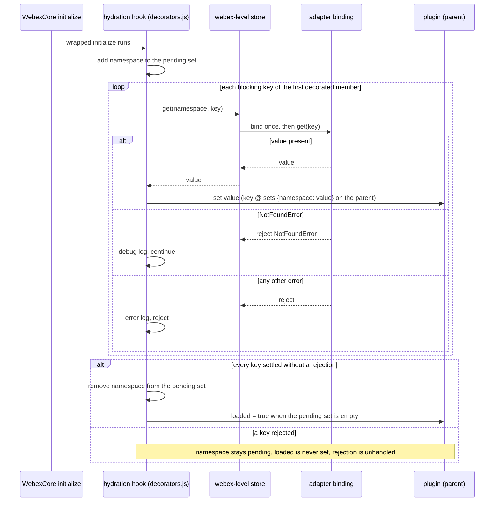
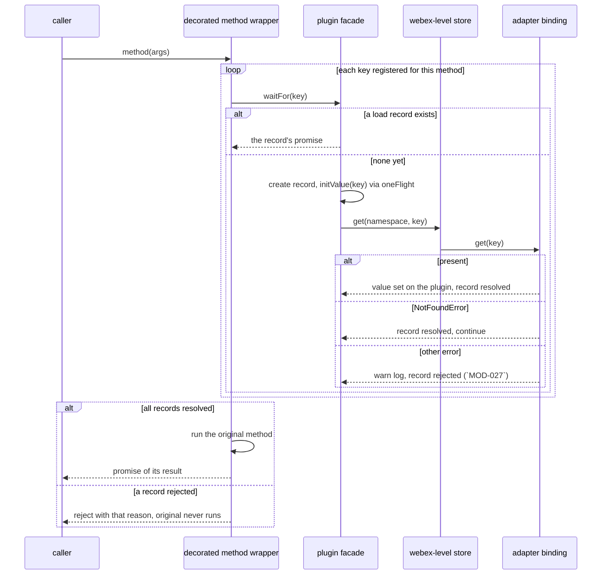
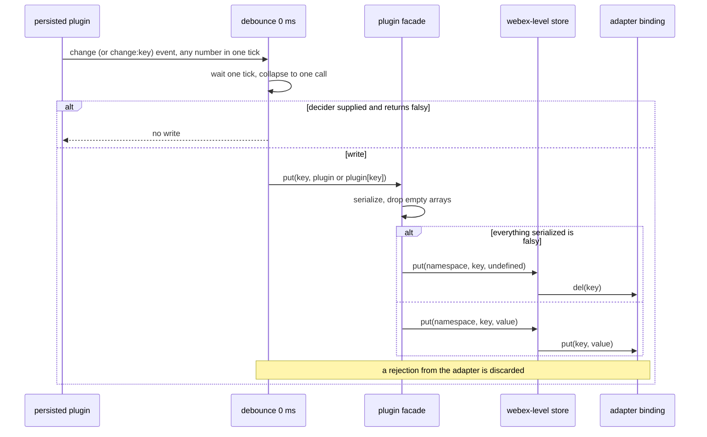
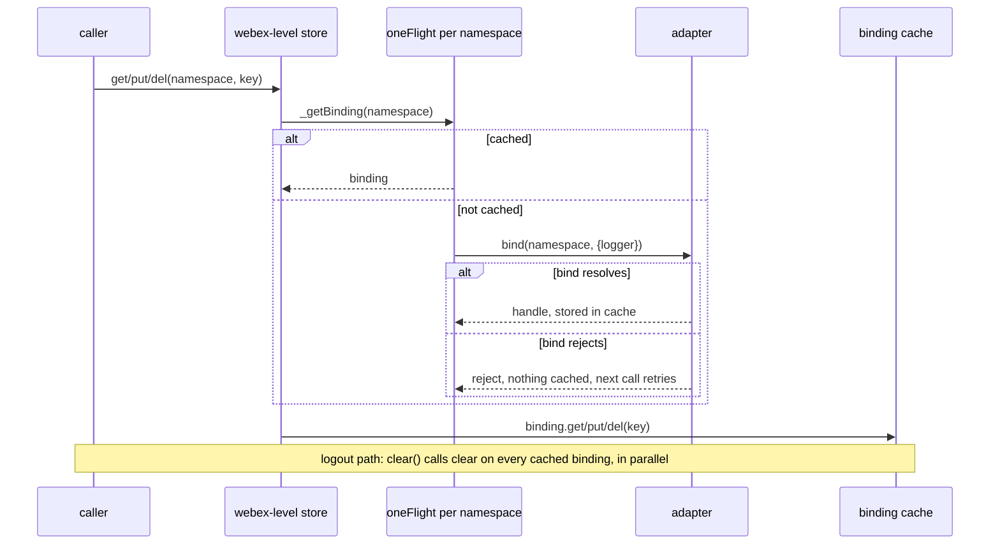
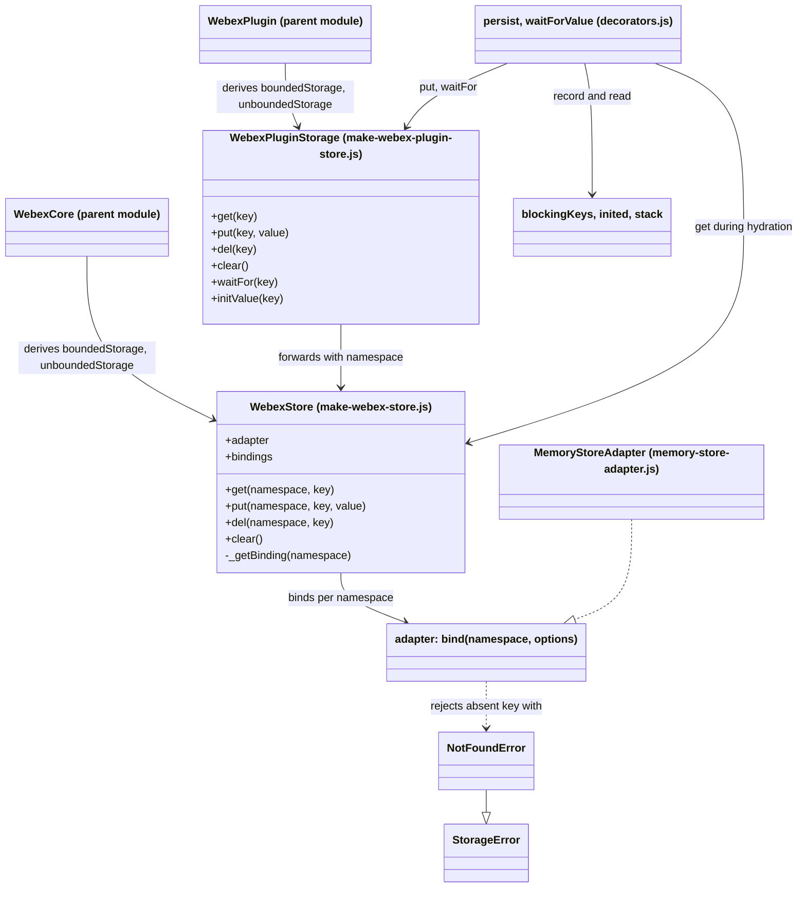
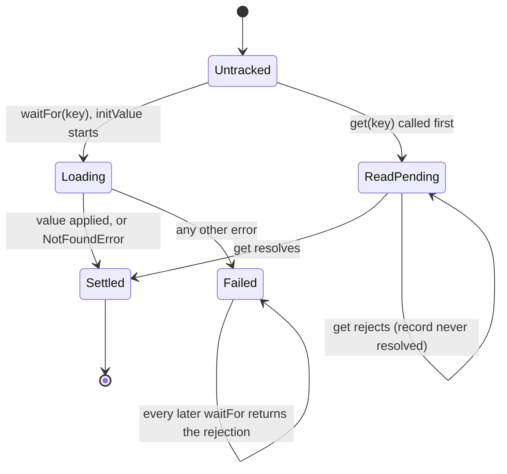

<!-- sdd-generated-metadata
doc_kind: module-spec
generated_from: module-spec@0.3.0
generated_by: claude-code
approved_by: rsarika@cisco.com
updated_at: 2026-10-07T13:20:21Z
validation_status: pass-with-warnings
-->

# storage layer

This source-local document at `src/lib/storage/docs/README.md` owns the stable specification for the
**storage layer** of `@webex/webex-core`: the `@persist` and `@waitForValue` decorators, the two store
maker functions that put a namespaced facade between the SDK and a pluggable storage adapter, the
default in-memory adapter, and the storage error types that adapter packages throw.

The package-level surface, the wiring of the stores into the `WebexCore` and `WebexPlugin` classes,
the `loaded` and `ready` lifecycle, the default configuration, and `logout` belong to the parent module
and are specified in [`src/docs/README.md`](../../../docs/README.md).

Related context: [repository architecture](../../../../docs/architecture.md) ·
[documentation index](../../../../docs/index.md) · [agent instructions](../../../../AGENTS.md) ·
[specification registry](../../../../docs/specs/README.md)

## Metadata

| Field             | Value                                         |
| ----------------- | --------------------------------------------- |
| Owner             | Cisco Webex for Developers                    |
| Source path       | `src/lib/storage`                             |
| Resource kind     | Capability module                             |
| Status            | Active                                        |
| Last verified     | 2026-10-07                                    |
| Module id         | `src/lib/storage`                             |
| Parent spec       | [`src/docs/README.md`](../../../docs/README.md) |
| Doc kind          | Module spec                                   |
| Coverage score    | 93.8% assessed 2026-10-07; 15 of 16 mandatory fields present; critical 8 of 8; independent validation pass-with-warnings 2026-10-07 |
| Validation status | Pass with warnings — 2026-10-07; runtime `01a1166d-02d9-7772-bc25-1a801fb5f1d1`; 0 Blocking, 8 Important, 3 Medium |

## Applicability

| Condition ID                         | Status     | Evidence or reason                                                                                                                                                 | Owned section                 |
| ------------------------------------ | ---------- | ------------------------------------------------------------------------------------------------------------------------------------------------------------------ | ----------------------------- |
| `module.has_tiers`                   | N/A        | The repository assigns no operational or review tiers                                                                                                               | Tier                          |
| `module.has_ui`                      | N/A        | No components or rendering; the module is decorators, store facades, and an adapter                                                                                 | UI use-case flow              |
| `module.crosses_service_boundaries`  | N/A        | Every call is in-process; the only I/O is whatever the configured adapter does locally, and `src/lib/storage/memory-store-adapter.js` does none                    | Cross-boundary use-case flow  |
| `module.holds_client_state`          | Applicable | Module-level registries in `src/lib/storage/decorators.js`, a per-store binding cache in `src/lib/storage/make-webex-store.js`, and per-facade load records in `src/lib/storage/make-webex-plugin-store.js` | Client state model            |
| `module.enforces_domain_rules`       | Applicable | Decoration-time guards in `src/lib/storage/decorators.js` and the absent-key contract in `src/lib/storage/memory-store-adapter.js`                                  | Business rules and invariants |
| `module.is_concurrent_async`         | Applicable | Debounced writes and one-flight loads in `src/lib/storage/decorators.js`, `src/lib/storage/make-webex-store.js`, and `src/lib/storage/make-webex-plugin-store.js`   | Concurrency and reactive flow |
| `module.owns_persistence`            | Applicable | This module defines the namespace and key layout and the persist and rehydrate protocol over adapters; it owns the default in-memory store                          | Data, schema, and migration   |
| `module.stateful_transitions`        | Applicable | Each key's load lifecycle in `src/lib/storage/make-webex-plugin-store.js` has distinct, partly terminal states                                                      | State machine                 |
| `module.exposes_wire_protocol`       | N/A        | No serialized format is defined here; serialization to bytes is owned by each adapter, and `src/lib/storage/make-webex-plugin-store.js` only reshapes objects      | Protocol and wire format      |
| `module.ui_multi_screen`             | N/A        | Gated by module.has_ui, which is N/A                                                                                                                                | UI flow                       |
| `module.large_data_model`            | N/A        | Gated by the absence of a schema: the module stores opaque values under string keys                                                                                 | Data model                    |
| `module.returns_caller_errors`       | Applicable | `src/lib/storage/errors.js` defines the error types callers and adapters branch on                                                                                  | Caller-visible failure modes  |
| `module.module_specific_conventions` | Applicable | Legacy decorators on Ampersand definitions, decorator-order sensitivity, and the reserved key @ in `src/lib/storage/decorators.js`                                 | Module-specific rules         |
| `module.published_package`           | Applicable | `src/lib/storage/index.js` is re-exported by `src/index.js`, and sibling adapter packages import from it                                                            | Export stability              |
| `module.embedded_in_host`            | N/A        | Not mounted into a host application                                                                                                                                 | Host integration and theming  |
| `module.has_design_tradeoff`         | Applicable | Whole-plugin persistence under one key, process-wide decorator registries, and a non-persistent default                                                              | Key design trade-off          |
| `module.has_submodules`              | N/A        | No child modules; computed from the manifest module tree                                                                                                            | Sub-modules                   |

## Evidence register

| Evidence                                           | What it establishes                                                                                                         |
| -------------------------------------------------- | ----------------------------------------------------------------------------------------------------------------------------- |
| `src/lib/storage/decorators.js`                    | Both decorators, the per-class initialize wrapper, the process-wide registries, and the hydration hook                       |
| `src/lib/storage/make-webex-store.js`              | The webex-level store: adapter lookup, per-namespace binding cache, `put` delete-on-undefined, and `clear`                   |
| `src/lib/storage/make-webex-plugin-store.js`       | The plugin-level facade: namespace scoping, object serialization, load records, `waitFor`, and `initValue`                    |
| `src/lib/storage/memory-store-adapter.js`          | The default adapter, its @ seed, `preload`, by-reference storage, and argument validation                                  |
| `src/lib/storage/errors.js`                        | The two error classes and their inheritance                                                                                  |
| `src/lib/storage/index.js`                         | The module's export list                                                                                                     |
| `src/index.js`                                     | Re-export of the module into the package entry point                                                                         |
| `src/config.js`                                    | Both adapter slots default to the in-memory adapter                                                                          |
| `src/webex-core.js`                                | Where the webex-level stores are derived, the `loaded` property, and the `logout` call that clears both stores               |
| `src/lib/webex-plugin.js`                          | Where the plugin-level facades are derived on every plugin                                                                   |
| `src/lib/credentials/credentials.js`               | The in-package consumer of both decorators, and the data it persists                                                         |
| `test/unit/spec/storage/persist.js`                | One `@persist` write test against the mock Webex                                                                             |
| `test/unit/spec/storage/wait-for-value.js`         | One `@waitForValue` gating test against the mock Webex                                                                       |
| `test/unit/spec/storage/storage-adapter.js`        | Runs the shared adapter conformance suite against the in-memory adapter                                                      |
| `test/unit/spec/webex-core.js`                     | Hydration from a preloaded in-memory adapter through to the `loaded` event                                                   |
| `test/integration/spec/webex-core.js`              | Logout clearing of both stores through a preloaded in-memory adapter                                                         |
| `test/unit/spec/credentials/credentials.js`        | Credentials persistence into, and clearing from, the mock bounded store                                                      |
| `package.json`                                     | The published entry points, and the dependencies this module imports                                                         |

Dependency packages are described from their own specifications where one exists (the HTTP core, the
common utilities, and the abstract storage-adapter conformance suite) and otherwise from their code.
Commit history was not used as evidence for any rationale in this document. Where no source, test, or
comment settles a WHY, the row says so rather than inferring one.

## Purpose and boundary

- **Responsibility:** let SDK plugins save selected state to, and restore it from, a pluggable storage
  adapter without knowing which adapter is configured, and hold the contract adapters must meet.
- **In scope:** `@persist` and `@waitForValue`; the webex-level store (`makeWebexStore`) and the
  per-plugin facade (`makeWebexPluginStore`); the in-memory adapter with its `preload` helper; the
  `StorageError` and `NotFoundError` types; the key layout `(namespace, key)` with the reserved key `@`.
- **Out of scope:** choosing which adapter a build uses (config of the parent module and of the
  umbrella packages), the `loaded` and `ready` properties and the `logout` sequence (parent), what each
  plugin chooses to persist, and every non-memory adapter implementation (separate packages).
  The behavioral contract an adapter must satisfy is owned by the abstract storage-adapter conformance
  suite package and its specification; this module is one of its consumers.
- **Consumers:** the plugins and packages that use the stores are listed per adapter slot in
  [Public surface](#public-surface). Other consumers: the parent module wires the stores into
  `WebexCore` and `WebexPlugin`; the three browser adapter packages (local storage, session storage,
  local forage) import `NotFoundError` from the package entry point; configuration modules of the
  umbrella, Node, encryption, and contact-center packages name `MemoryStoreAdapter`.

## Structure and key files

| Path                                          | Responsibility                                                                                                                              |
| --------------------------------------------- | --------------------------------------------------------------------------------------------------------------------------------------------- |
| `src/lib/storage/index.js`                    | The module's barrel. Exports `persist`, `waitForValue`, both store makers, `MemoryStoreAdapter`, `StorageError`, and `NotFoundError`          |
| `src/lib/storage/decorators.js`               | `persist`, `waitForValue`, and the shared `prepareInitialize` machinery that hooks hydration into `initialize`. Holds three process-wide registries |
| `src/lib/storage/make-webex-store.js`         | `makeWebexStore(type, webex)`: a store bound to one webex instance and one of the two adapter slots. Owns the per-namespace binding cache     |
| `src/lib/storage/make-webex-plugin-store.js`  | `makeWebexPluginStore(type, context)`: the namespace-bound facade a plugin sees as `this.boundedStorage` or `this.unboundedStorage`. Owns `serialize` and the load records |
| `src/lib/storage/memory-store-adapter.js`     | The default adapter: a `bind` function and a `preload` factory over per-binding `Map`s                                                        |
| `src/lib/storage/errors.js`                   | `StorageError` and `NotFoundError`, both built on the common `Exception` base                                                                  |

## Public surface

| Surface | Contract | Consumer | Compatibility commitment | Source |
| --- | --- | --- | --- | --- |
| `persist` decorator | `webex-core-storage` | Plugin authors (credentials, user, device) | Published through the package entry point. Applies only to `initialize`; bare `@persist` and `@persist(key, decider)` forms are both used in the repository | `src/lib/storage/decorators.js`, `src/lib/storage/index.js` |
| `waitForValue` decorator | `webex-core-storage` | Plugin authors (credentials, user, device, ediscovery) | Published. Turns the decorated method into one that always returns a promise and runs only after the keys load | `src/lib/storage/decorators.js`, `src/lib/storage/index.js` |
| `makeWebexStore` | `webex-core-storage` | The parent module | Exported, but constructed only by the parent. Returns the object plugins reach as `webex.boundedStorage` and `webex.unboundedStorage` | `src/lib/storage/make-webex-store.js`, `src/lib/storage/index.js` |
| `makeWebexPluginStore` | `webex-core-storage` | The parent module | Exported, but constructed only by the plugin base class. Returns `this.boundedStorage` and `this.unboundedStorage` on every plugin | `src/lib/storage/make-webex-plugin-store.js`, `src/lib/storage/index.js` |
| `MemoryStoreAdapter` | `webex-core-storage` | Configuration modules, tests, host applications | Published. An object with `bind(namespace, options)` and `preload(data)`; the repository default for both adapter slots | `src/lib/storage/memory-store-adapter.js`, `src/lib/storage/index.js` |
| `StorageError`, `NotFoundError` | `webex-core-storage` | Adapter packages, the hydration hook | Published. Adapters must reject `get` of an absent key with `NotFoundError` for the hydration hook to treat it as absence | `src/lib/storage/errors.js`, `src/lib/storage/index.js` |
| Adapter slot keys `storage.boundedAdapter` and `storage.unboundedAdapter` | `webex-core-storage` | Host applications, umbrella packages | Published configuration. Each slot holds an object whose `bind(namespace, {logger})` resolves to a handle with `put`, `get`, `del`, and `clear`. The bounded store (`boundedStorage`, slot `storage.boundedAdapter`) is used by both decorators and by credentials, device, user and meetings reachability and is cleared on `logout`; the unbounded store (`unboundedStorage`, slot `storage.unboundedAdapter`) is used by the encryption plugin's key cache read by the conversation plugin, and is also cleared on `logout`. The two stores differ only in the slot they read; no code branch distinguishes them. No comment or design record states the intent of the split; the usage description is inferred from names and consumers (gap) | `src/config.js`, `src/lib/storage/make-webex-store.js`, `src/webex-core.js` |

All rows route to `webex-core-storage`, the one contract this module provides. It requires
`webex-common-js-api` (the `Exception` base, the `Defer` deferred, the `oneFlight` decorator, and the
`make` multi-key container), `ampersand-state-library` (the state objects the decorators attach to,
and the events mixin), and `storage-adapter-spec-suite` (test-time only). The repository-wide index of
contract ids is [Public and consumer surfaces](../../../../docs/architecture.md#public-and-consumer-surfaces).

## Dependencies

| Dependency | Why it is required | Failure behavior |
| --- | --- | --- |
| The common utilities package | `Exception` (error base), `Defer` (externally resolvable promise), `oneFlight` (de-duplicates concurrent calls per key), `make` (multi-key `Map`/`Set` container) | Load-time dependency; per its specification, `oneFlight` evicts its entry once the call settles unless caching flags are set, so a failed `bind` is retried by the next call |
| `lodash` (code only) | `debounce`, `wrap`, `curry`, `result`, `identity`, `isArray`, `isObject` | Load-time dependency |
| `ampersand-events` (code only) | Mixed into the webex-level store prototype so it has `on`/`trigger` | Load-time dependency. No code in this module triggers an event on the store |
| `ampersand-state` objects (code only) | The decorated `initialize` runs on an Ampersand state; the hooks use `on`, `set`, `getNamespace`, `parent`, `isState`, and `serialize` | The decorators assume this shape; `persist` throws `TypeError` at decoration time when applied to anything but `initialize` |
| `webex.logger` | `debug` on every operation; `error` and `warn` on load failures. Supplied by the logger plugin, or a console fallback in the plugin base class (code only) | A missing logger throws synchronously when the store is constructed |
| The configured adapter | Does the actual reads and writes | Rejections pass through to the caller unchanged, except that the hydration paths treat `NotFoundError` as absence |
| Abstract storage-adapter conformance suite | Run against `MemoryStoreAdapter` in a unit test | Test-time only |

## Requirements

| ID | WHAT | WHY | Source evidence | Test or example evidence | Assumptions or gaps | Confidence |
| --- | --- | --- | --- | --- | --- | --- |
| `MOD-001` | `@persist` throws a `TypeError` at decoration time when applied to any member other than `initialize` | The error text states it works only on Ampersand state definitions and must decorate `initialize`, because the hook attaches to an instance's change events once, at construction | `src/lib/storage/decorators.js` | none found | Gap: the throw is untested | Present |
| `MOD-002` | A bare `@persist` is equivalent to `@persist('@')` | The three-argument call form is how a decorator without parentheses is invoked; the code redirects it to the common case | `src/lib/storage/decorators.js` | none found | Gap: the repository's tests all use the parenthesized form. The unit tests of the credentials and user plugins that use the bare or keyed forms do not isolate this | Present |
| `MOD-003` | After `initialize`, changes to the plugin schedule a write that is debounced with a zero delay, so every change made in one tick produces one write | The in-code comment says a single `set()` can trigger many change events and only the settled state matters | `src/lib/storage/decorators.js` | `test/unit/spec/storage/persist.js` | Gap: the test asserts a write happens after one assignment; it never makes several changes in one tick to show coalescing | Present |
| `MOD-004` | With key @, the whole plugin is written under key @ on any `change`; with another key, only `this[key]` is written, on `change:<key>` | @ is the whole-object convention used by every in-repository caller; a named key lets a plugin persist one attribute | `src/lib/storage/decorators.js` | `test/unit/spec/storage/persist.js` | Gap: the named-key form has no test and no in-repository caller | Present |
| `MOD-005` | `@persist` always writes to the bounded store and never to the unbounded one | Not stated in code or tests; the hook calls `this.boundedStorage.put` unconditionally and no comment explains the choice | `src/lib/storage/decorators.js` | `test/unit/spec/storage/persist.js` | WHY gap: session-bound state is the plausible reason (inferred from the bounded store being cleared on `logout`) but is not stated. Also the sole statement of the bounded-only rule (see INV-006) | Weak |
| `MOD-006` | An optional second argument, `decider`, suppresses a write when it returns a falsy value; the device plugin passes one that returns the negation of `config.ephemeral` | Lets a plugin opt out of persistence per configuration, so ephemeral clients write nothing | `src/lib/storage/decorators.js` | none found | Defect: the decider is invoked as `Reflect.apply(decider, this, ...initializeArgs)`, which passes only the first `initialize` argument as the argument list. The decider therefore receives no arguments, and the call throws a `TypeError` when `initialize` was called with no argument or with a primitive first argument. The device plugin's decider reads only `this`, so it works today. Untested | Present |
| `MOD-007` | The decorated `initialize` returns whatever the original returned | Ampersand and plugin code may rely on the initializer's return value | `src/lib/storage/decorators.js` | `test/unit/spec/storage/persist.js` | The test's `initialize` returns the base initializer's result but nothing asserts it | Weak |
| `MOD-008` | The result of the debounced write is discarded: a rejected `put` is neither caught, logged, nor retried | Not stated in code or tests; the handler returns the promise to the debounce wrapper, which ignores it | `src/lib/storage/decorators.js` | none found | WHY gap: no rationale in code or tests. Current behavior, recorded not endorsed: an adapter write failure surfaces as an unhandled rejection | Weak |
| `MOD-009` | `@waitForValue(key)` throws an `Error` at decoration time when `key` is empty | A method gated on no key is meaningless; failing at class definition surfaces the mistake at load rather than at first call | `src/lib/storage/decorators.js` | none found | Gap: untested | Present |
| `MOD-010` | A method decorated with `@waitForValue` does not run until `waitFor(key)` on the plugin's bounded facade has settled for every key registered for that method; the method's arguments and `this` are preserved | Callers must not read plugin state before it has been rehydrated from storage | `src/lib/storage/decorators.js` | `test/unit/spec/storage/wait-for-value.js` | Gap: the test uses one key. Multiple keys on one method and the registry that accumulates them are untested | Present |
| `MOD-011` | A decorated method always returns a promise, even when the original returned a plain value | The wrapper is `Promise.all(...).then(call)`, so synchronous methods become asynchronous | `src/lib/storage/decorators.js` | `test/unit/spec/storage/wait-for-value.js` | The test's method already returns a promise. A synchronous original is untested | Present |
| `MOD-012` | When the decorator target is a plain definition object with no `prototype`, the wrapped function is also assigned onto `target[prop]` | The in-code comment says this makes the decorators compatible with Ampersand class definitions, which are object literals | `src/lib/storage/decorators.js` | `test/unit/spec/storage/wait-for-value.js` | The test uses an object-literal definition, so this branch runs, but nothing asserts the assignment itself | Present |
| `MOD-013` | On first use of a decorator for a given namespace, the module wraps the target's `initialize` so that, per instance, it also wraps `webex.initialize` and eagerly loads the keys registered for the first decorated member via `boundedStorage.get(namespace, key)` | Moves loading to webex startup instead of waiting for a first call, and is what lets the parent mark `loaded` | `src/lib/storage/decorators.js` | `test/unit/spec/webex-core.js` | The first decorated member's keys only: see `Pitfalls and constraints`. Behavior when `@persist` is applied before any `@waitForValue` is unverified, see Pitfalls and constraints | Weak |
| `MOD-014` | A hydrated value for key @ is set on the parent as `{<lowercased namespace>: value}`; for another key it is set on the plugin's same-named child state if one exists, otherwise on the plugin by `set(key, value)` | Puts persisted state back where plugin code reads it, under the same attribute name the parent uses for the child | `src/lib/storage/decorators.js` | `test/unit/spec/webex-core.js` | Only the @ branch is exercised, through credentials | Present |
| `MOD-015` | When every namespace registered during the same webex startup has finished loading its keys, `loaded` is set on the plugin that finished last | The parent exposes `loaded` and the `loaded` event as "all storage has been read" | `src/lib/storage/decorators.js` | `test/unit/spec/webex-core.js` | The set of pending namespaces is process-wide, not per webex instance; see Pitfalls | Present |
| `MOD-016` | During hydration a `NotFoundError` is logged at debug level and treated as "no data, continue"; any other rejection is logged at error level and re-rejected | A first run, or a signed-out client, legitimately has nothing stored; real adapter faults must not be hidden | `src/lib/storage/decorators.js` | none found | Gap: the non-`NotFoundError` branch and its effect on `loaded` are untested. Under a non-production `NODE_ENV`, a rejection whose text contains `MockNotFoundError` is also treated as absence, a coupling to the mock test helper | Present |
| `MOD-017` | `makeWebexStore(type, webex)` returns a store whose adapter is read from `webex.config.storage[type + 'Adapter']` on each use, not captured at construction | Config can be set or replaced after the store exists, and the store follows it | `src/lib/storage/make-webex-store.js` | none found | Gap: no unit test replaces the adapter after construction | Present |
| `MOD-018` | The store binds each namespace once: the first operation on a namespace calls `adapter.bind(namespace, {logger})`, the resolved handle is cached in a per-store map, and concurrent first operations on one namespace share one `bind` | A namespace's handle must be unique per store so adapters that keep per-binding state are not given two handles | `src/lib/storage/make-webex-store.js` | `test/unit/spec/webex-core.js` | Gap: concurrency de-duplication is untested. A rejected `bind` is not cached; the next call retries | Present |
| `MOD-019` | `get`, `put`, and `del` on the store resolve or reject exactly as the adapter's handle does; `put` resolves with the written value | Resolving with the value supports write-through caching, per the method comment | `src/lib/storage/make-webex-store.js` | `test/integration/spec/webex-core.js` | Integration test needs provisioned test users and is not run by the unit command | Present |
| `MOD-020` | `put` of `undefined` deletes the key instead of writing | Lets callers clear a value by setting it to nothing, and gives `serialize`'s empty result a defined meaning | `src/lib/storage/make-webex-store.js` | none found | Gap: untested at this layer | Present |
| `MOD-021` | `put` writes `value.serialize()` when the value has a `serialize` method, otherwise the value itself | Plugins and Ampersand states are written as plain data, not as live objects | `src/lib/storage/make-webex-store.js` | none found | Defect: `put` of `null` throws a `TypeError` inside the promise chain (`null.serialize`) and so rejects. Untested. The decorator tests use the mock Webex, whose stores are test doubles, so no test runs this `put` | Present |
| `MOD-022` | `clear()` on the store clears only the bindings already created in this store instance and resolves when all have cleared | The store has no way to enumerate namespaces it has not bound | `src/lib/storage/make-webex-store.js` | `test/integration/spec/webex-core.js` | Defect-adjacent: a namespace persisted by an earlier session and not touched in this one is not cleared by this store; whether it is wiped depends on the adapter's own `clear` semantics | Present |
| `MOD-023` | The plugin facade scopes `get`, `put`, and `del` to `context.getNamespace()` and forwards to the webex-level store of the same type | A plugin sees only its own namespace and never passes it | `src/lib/storage/make-webex-plugin-store.js` | `test/unit/spec/storage/persist.js`, `test/unit/spec/storage/wait-for-value.js` | `get`'s forwarding is exercised only through `waitFor`; `del` and `clear` are untested | Present |
| `MOD-024` | The facade's `put` first reshapes the value: it calls `serialize()` if present, replaces empty arrays with `undefined`, serializes array elements and nested object values recursively, and returns `undefined` when every top-level value of the result is falsy | Keeps empty collections out of storage, and turns "nothing worth saving" into a delete | `src/lib/storage/make-webex-plugin-store.js` | `test/unit/spec/storage/persist.js` | Defect-adjacent: an object whose only meaningful values are `false`, `0`, `''`, or `null` is treated as empty and deleted, not written. It also mutates the object it was given when that object has no `serialize`. Only the truthy case is tested | Present |
| `MOD-025` | `waitFor(key)` resolves when the key's load record settles; if none exists it starts a load (`initValue`) first. `get(key)` creates a load record and resolves it when the read succeeds | Lets a gated method wait for whichever of the hydration hook and an explicit read reaches the key first | `src/lib/storage/make-webex-plugin-store.js` | `test/unit/spec/storage/wait-for-value.js` | See the state machine: a `get` that rejects leaves its record unresolved forever | Present |
| `MOD-026` | `initValue(key)` reads the key through the webex-level store, copies the value onto the plugin as in `MOD-014`, and resolves; it is de-duplicated per key with `oneFlight` | One load per key regardless of how many gated calls arrive together | `src/lib/storage/make-webex-plugin-store.js` | `test/unit/spec/storage/wait-for-value.js` | Defect-adjacent: for key @ it calls `context.parent.set(value)` with the stored value itself, not `{<namespace>: value}` as the hydration hook does, so the two paths set different things. No test pins either | Weak |
| `MOD-027` | In `initValue`, a `NotFoundError` resolves the record (absence is not an error); any other failure logs a warning and rejects the record, which stays rejected | A first run proceeds with defaults, while a broken adapter must not let gated methods run on unloaded state | `src/lib/storage/make-webex-plugin-store.js` | none found | Gap: both branches untested. The rejection is permanent for the facade's lifetime: later `waitFor` calls return the same rejected promise (canonical statement; other sections cross-reference this row and the per-key load diagram) | Present |
| `MOD-028` | The default adapter's `bind` rejects with an `Error` whose message is `` `namespace` is required `` when no namespace is given, and `` `options.logger` is required `` when no logger is given | Matches the adapter contract so every adapter is constructed the same way | `src/lib/storage/memory-store-adapter.js` | `test/unit/spec/storage/storage-adapter.js` | The shared suite asserts the messages by pattern | Present |
| `MOD-029` | A fresh in-memory binding already holds key @ with value `{}`, so `get('@')` resolves `{}` rather than rejecting | Hydration of a whole plugin on an empty store sets an empty object instead of taking the not-found path | `src/lib/storage/memory-store-adapter.js` | none found | WHY gap: not stated in code or tests; the seed is unexplained. The consequence, that a never-written @ is "found" in memory but "absent" in persistent adapters, is untested | Weak |
| `MOD-030` | In-memory `get` of any other unwritten key, or of a key written as `undefined`, rejects with `NotFoundError` | The adapter contract requires absence to be a rejection, and the hydration hooks key off `NotFoundError` | `src/lib/storage/memory-store-adapter.js` | `test/unit/spec/storage/storage-adapter.js` | The error carries no message, so it shows the common base's default message | Present |
| `MOD-031` | In-memory `put` stores the given reference without copying, and `get` returns that same reference; `clear` empties the binding including the @ seed, after which `get('@')` rejects | The adapter is a plain `Map`; no serialization is performed | `src/lib/storage/memory-store-adapter.js` | `test/integration/spec/webex-core.js` | Because nothing is copied, mutating a returned object mutates the stored value. Untested | Present |
| `MOD-032` | `MemoryStoreAdapter.preload(data)` returns an adapter whose `bind` seeds the binding from `data[namespace]`, key by key, by reference | Lets tests and hosts start a client with persisted state without a real adapter | `src/lib/storage/memory-store-adapter.js` | `test/unit/spec/webex-core.js`, `test/integration/spec/webex-core.js` | The seeded objects are shared across every binding and webex instance created from one preload object. `bind` also writes `options.data` onto the options object it receives | Present |
| `MOD-033` | `NotFoundError` is a `StorageError`, which is an `Exception`; they are exported by name from the module | Adapter packages must signal absence with a type the hydration hooks can recognize with `instanceof` | `src/lib/storage/errors.js` | none found | Gap: no test asserts the inheritance. A `NotFoundError` from a second copy of this package would fail the `instanceof` check, see Pitfalls | Present |
| `MOD-034` | The in-memory adapter passes the shared adapter conformance suite | The default adapter is held to the same contract as every persistent adapter | `src/lib/storage/memory-store-adapter.js` | `test/unit/spec/storage/storage-adapter.js` | The suite has gaps of its own (namespace isolation and `undefined` removal are not effectively asserted), so a pass is weaker evidence than it looks | Present |

## Design overview

The module is a thin lazy-loading layer. Plugins never touch an adapter. Each plugin has a
**facade** (`makeWebexPluginStore`) that fixes its namespace and forwards to a **store**
(`makeWebexStore`) shared by the whole webex instance, which in turn lazily **binds** each namespace
through the configured **adapter** and caches the bound handle. Two stores exist, bounded and
unbounded, differing only in which config slot they read.

**Whole-plugin persistence under one key.** `@persist('@')` writes the entire plugin as one value under
the reserved key `@` in the plugin's namespace, and hydration sets it back as one value. Granularity is
therefore per plugin, not per attribute. The named-key form exists in code but nothing uses it.

**Two loaders for one value.** A value can be loaded by the hydration hook that `prepareInitialize`
installs on webex startup, or lazily by `waitFor`/`initValue` when a gated method is first called. They
are independent code paths over the webex-level store with separate bookkeeping, and they set the value
slightly differently (`MOD-014`, `MOD-026`). The decorators' `@waitForValue` registry is shared by both.

**Process-wide registries.** `blockingKeys` (which keys gate which method), `inited` (which namespaces
already have the initialize wrapper), and `stack` (which namespaces are mid-load) are module-level in
`src/lib/storage/decorators.js`, not per instance. Class-definition-time registration is what makes
this workable, because decorators run once per class; the cost is that `stack`, which is mutated at
instance time, is shared by every webex instance in the process.

**Absence is a rejection.** The contract with adapters is that a missing key rejects with
`NotFoundError`. Both loaders turn exactly that error into "continue with defaults", and every other
error into a failure. The in-memory adapter's seeded `@` is the one place where absence of the whole
plugin is not signaled.

State ownership: the adapter owns the stored bytes; the webex-level store owns the binding cache; each
facade owns its load records; the registries own decoration metadata. Evidence:
`src/lib/storage/decorators.js`, `src/lib/storage/make-webex-store.js`,
`src/lib/storage/make-webex-plugin-store.js`.

## Data flow and sequence coverage

The transport is in-process promise-returning method calls, from plugin to facade to store to adapter.
The module defines no network call. Four operation groups differ in actors, ordering, and failure
behavior, so each is diagrammed once.

| Operation group | Entry and outcome | Diagram or evidence | Failure and recovery coverage |
| --- | --- | --- | --- |
| Hydration at startup | `webex` initialize runs the hook; each namespace's blocking keys are read and applied; `loaded` is set when none remain | Diagram 1; `src/lib/storage/decorators.js` | Absent key continues; other failure leaves `loaded` false and surfaces an unhandled rejection |
| Gated call | A `@waitForValue` method call waits for its keys, then runs | Diagram 2; `src/lib/storage/make-webex-plugin-store.js` | Absent key continues; other failure rejects the call (`MOD-027`) |
| Persist write | A change on a persisted plugin is written after a zero-delay debounce | Diagram 3; `src/lib/storage/decorators.js` | `decider` suppression; a failed write is dropped |
| Direct store access and clear | A plugin or the parent calls `get`/`put`/`del`/`clear`, binding the namespace on first use | Diagram 4; `src/lib/storage/make-webex-store.js` | A failed `bind` is not cached; `put(undefined)` deletes |

**Diagram 1 — hydration at startup**

**Diagram 2 — a gated call**

**Diagram 3 — persist write**

**Diagram 4 — direct access and clear**

## Class and component relationships

The three adapter packages implement the same `Adapter` role as classes whose `bind` returns a handle
of an inner class; the in-memory adapter is a plain object. The package entry point of the parent
re-exports the whole barrel, which is how those packages import `NotFoundError`.

## Use cases and flows

| Use case | Actor or caller | Primary steps and outcome | Failure or boundary behavior | Evidence |
| --- | --- | --- | --- | --- |
| `UC-001` | A browser app with a persistent adapter configured | Start the SDK; the hook reads each decorated plugin's @ key; credentials are restored and `loaded` fires; `webex.canAuthorize` becomes true | A corrupt stored document rejects, `loaded` never fires, `ready` never settles | `src/lib/storage/decorators.js`, `test/unit/spec/webex-core.js` |
| `UC-002` | A plugin method gated by `@waitForValue('@')` | Call before hydration finished; the method waits, then runs on restored state | Absent key continues with defaults; adapter fault rejects the call | `src/lib/storage/make-webex-plugin-store.js`, `test/unit/spec/storage/wait-for-value.js` |
| `UC-003` | A persisted plugin whose attribute changes | Set an attribute; one write of the whole plugin follows on the next tick | A `decider` returning falsy, as for an ephemeral device, suppresses it | `src/lib/storage/decorators.js`, `test/unit/spec/storage/persist.js` |
| `UC-004` | The encryption plugin | Look up a key by URI in the unbounded facade, falling back to a fetch and a write of the key as a JSON string | Any read failure is treated as a miss by the caller, so adapter faults are masked | `src/lib/storage/make-webex-plugin-store.js` |
| `UC-005` | A host calling `logout` | After handlers run, both stores are cleared and credentials invalidated | Every cached binding is cleared; namespaces never bound this session depend on the adapter | `src/lib/storage/make-webex-store.js`, `test/integration/spec/webex-core.js` |
| `UC-006` | A test or Node host | Build a client with `MemoryStoreAdapter.preload({Credentials: {'@': {...}}})` and start with a token already present | Values are shared by reference across clients built from one preload object | `src/lib/storage/memory-store-adapter.js`, `test/unit/spec/webex-core.js` |
| `UC-007` | An adapter author | Implement `bind`, reject absent keys with `NotFoundError` from the package entry point, and run the conformance suite | An adapter that rejects absence with another type makes hydration fail instead of continue | `src/lib/storage/errors.js`, `test/unit/spec/storage/storage-adapter.js` |

## Client state model

| State or slice | Owner | Initial state | Transition triggers | Reset or persistence boundary |
| --- | --- | --- | --- | --- |
| `blockingKeys` | Module, process-wide | Empty | A `@waitForValue` decoration at class definition | Never reset; keyed by target object and member name |
| `inited` | Module, process-wide | Empty | First decorator use for a namespace (or target, if it has none) | Never reset. A second class with the same namespace is not given the initialize wrapper |
| `stack` | Module, process-wide | Empty | Added when a webex initialize runs the hook; removed when that namespace's keys settle | Shared by all webex instances; never cleared on failure |
| Binding cache | One webex-level store | Empty map | First operation on a namespace | Lives as long as the store; never evicted, not even by `clear` |
| Load records | One plugin facade | Empty map | `get(key)` or `waitFor(key)` | Lives as long as the facade; failure semantics in `MOD-027` |
| In-memory binding | One binding | A map holding only @ as `{}` | `put`, `del`, `clear`, preload seed | In-process only; lost on reload |

## Business rules and invariants

| ID | Invariant | WHY | Enforcement source | Test evidence |
| --- | --- | --- | --- | --- |
| `INV-001` | Reference to `MOD-001`: stated there only | See `MOD-001` | `src/lib/storage/decorators.js` | none found |
| `INV-002` | Reference to `MOD-009`: stated there only | See `MOD-009` | `src/lib/storage/decorators.js` | none found |
| `INV-003` | Reference to `MOD-030`: stated there only | See `MOD-030` | `src/lib/storage/memory-store-adapter.js`, `src/lib/storage/make-webex-plugin-store.js` | `test/unit/spec/storage/storage-adapter.js` |
| `INV-004` | Reference to `MOD-018`: stated there only | See `MOD-018` | `src/lib/storage/make-webex-store.js` | none found |
| `INV-005` | Reference to `MOD-010`: stated there only | See `MOD-010` | `src/lib/storage/decorators.js` | `test/unit/spec/storage/wait-for-value.js` |
| `INV-006` | Reference to `MOD-005`: decorator-driven persistence goes only to the bounded store | See `MOD-005` | `src/lib/storage/decorators.js` | none found |

## Concurrency and reactive flow

- **Execution model:** single event loop. Writes are scheduled by Ampersand change events through a
  zero-delay debounce; loads are promise chains started either at webex initialize or at the first
  gated call; adapter calls are promise-returning.
- **Ordering guarantees:** one write per tick per persisted plugin, carrying the state at the time the
  timer fires. There is no ordering between writes from different plugins and none between a write and
  a concurrent hydration read of the same key. Namespace bindings are unique per store: concurrent
  first calls share one `bind` through `oneFlight`.
- **Idempotency and retry:** `initValue` is de-duplicated per key within one facade. No operation is
  retried: a failed write is dropped, a failed load stays failed (`MOD-027`), and only a failed `bind` is
  retried (on the next call), because it is not cached.
- **Shared-state protection:** none. The three registries are plain module-level collections, and
  `stack` is shared by every webex instance in the process, so two instances starting at once
  interleave: a namespace common to both is a single entry, and whichever instance finishes it first
  removes it for the other, which can let the other see an empty `stack` and set `loaded` early.
  This is read from the code, not demonstrated by a test.
- **Blocking restrictions:** none of this code blocks; but a gated method is blocked until its keys
  load, and a key whose load never settles blocks it indefinitely (see the state machine).

## Data, schema, and migration discipline

| Store or schema | Owned entities or keys | Source of truth | Migration and compatibility rule |
| --- | --- | --- | --- |
| Bounded store | Namespace per plugin (the plugin's `getNamespace()` value, for example the credentials plugin's namespace); key @ holds the whole serialized plugin; other keys are plugin-chosen | `src/lib/storage/make-webex-store.js` | None. No version field, no schema, no migration step exists here. A plugin that renames an attribute simply stops seeing the old one |
| Unbounded store | Plugin-chosen keys in the owner's namespace (the encryption plugin uses key URIs) | `src/lib/storage/make-webex-store.js` | None |
| In-memory adapter state | One map per binding, seeded with @ | `src/lib/storage/memory-store-adapter.js` | Not persisted; recreated empty (or from preload) on every start |

Retention and deletion: nothing here expires data. `logout` clears every binding the process created
(parent module, `src/webex-core.js`). Persisted values contain what the plugin's `serialize()` returns,
so the storage keeps whatever Ampersand includes by default (props, not session or derived values).
Whether a persistent adapter's `clear` wipes only the namespace or the whole base key is the
adapter's decision; the local-storage and session-storage adapters remove their entire base key, and
the local-forage adapter calls the library-wide clear. The plugin facade's `clear()` does not clear its
namespace, see Pitfalls.

Credentials and key material are written in plaintext, see the security pitfall below.

## State machine

The per-key load lifecycle of a plugin facade (`src/lib/storage/make-webex-plugin-store.js`):

Guards and notes:

- `Untracked` to `Loading` happens only when no record exists; `get` creates the record without loading
  into the plugin.
- `ReadPending` is a trap: a record created by an explicit `get` that rejected is never resolved, and
  a later `waitFor` for the same key returns that unresolved promise, so a `@waitForValue` method on
  that key waits forever.
- `Failed` is terminal (`MOD-027`).
- The webex-level store has no comparable state: its only memory is the binding cache.

## Caller-visible failure modes

| Condition | Signal or result | Caller behavior | Retry or recovery | Evidence |
| --- | --- | --- | --- | --- |
| `get` of an absent key | Rejects with `NotFoundError` (a `StorageError`) | Treat as "no value"; hydration does so automatically | None needed | `src/lib/storage/memory-store-adapter.js`, `src/lib/storage/errors.js` |
| Adapter fault during startup hydration | Error log, a rejection from an internal promise nobody handles, `loaded` and `ready` never set | The application sees a client that never becomes loaded | Reload; no in-process recovery | `src/lib/storage/decorators.js` |
| Adapter fault during a gated call | The call rejects with the adapter's error; later calls for that key reject the same way (`MOD-027`) | Catch at the call site | None in-process | `src/lib/storage/make-webex-plugin-store.js` |
| Adapter fault during a persist write | Silently dropped (unhandled rejection) | None available | Next change triggers another write | `src/lib/storage/decorators.js` |
| `bind` with no namespace or no logger | Rejects with an `Error` naming the missing argument | Fix the call | The next call retries | `src/lib/storage/memory-store-adapter.js`, `src/lib/storage/make-webex-store.js` |
| `put` of `null` at the webex-level store | Rejects with a `TypeError` | Use `undefined` to delete | None | `src/lib/storage/make-webex-store.js` |
| `@persist` on a non-`initialize` member, or `@waitForValue` with no key | Throws at class-definition time | Fix the decoration | None | `src/lib/storage/decorators.js` |
| Plugin facade `clear()` | Resolves, but deletes key `undefined` in the namespace rather than the namespace | Use `del(key)` per key, or the webex-level `clear` | None | `src/lib/storage/make-webex-plugin-store.js` |

## Pitfalls and constraints

- **Plaintext persistence of credentials.** `@persist('@')` on the credentials plugin writes the
  serialized plugin, including the supertoken and the user tokens with their access and refresh
  tokens, through whatever adapter is configured. With the local-storage or session-storage adapters
  this is a plaintext JSON document in the browser under the configured base key, readable by any
  script on the origin; the local-forage adapter stores it unencrypted in IndexedDB. The encryption
  plugin likewise writes content-encryption keys as JSON strings through the unbounded facade. Nothing
  in this module encrypts, hashes, or restricts what is written, and its logs record only namespaces
  and key names, not values. The default adapter, memory, is the safe default: persistence is opt-in
  by configuration. Treat any change to what a `serialize()` returns as a security-relevant change.
- **Absence must be a `NotFoundError` from this module's copy.** The hydration paths use
  `instanceof NotFoundError`. An adapter bundled against a different copy of the package would throw
  an error that fails the check and break startup. Adapters import it from the package entry point for
  this reason. Under a non-production `NODE_ENV`, a message containing `MockNotFoundError` is also
  accepted, which exists for the mock test helper.
- **One key's failure can block everything.** A non-absence error from any key read by the hydration
  hook leaves its namespace in `stack` forever, so `loaded` (and therefore `ready`) never becomes true
  for the process. A corrupt stored document in the browser adapters rejects with a `SyntaxError` and
  triggers exactly this.
- **Decorator order matters.** `prepareInitialize` hooks the first member it sees for a namespace. When
  `@persist` on `initialize` is applied before any `@waitForValue`, the order the repository's tests
  use, the property defined by the decorated descriptor may replace the hooked `initialize`, so the
  eager startup load may not run and keys then load only lazily through `waitFor`. Every production
  plugin that uses both decorators places its `@waitForValue` members before `@persist`. This is
  inferred from legacy-decorator semantics and was not demonstrated by any test or code comment (gap).
- **Only the first decorated member's keys are eagerly loaded.** The hook closes over the member that
  first triggered `prepareInitialize`. Keys registered by other members are loaded lazily.
- **`inited` is keyed by namespace.** Two different classes with one namespace share it; only the first
  gets the wrapper.
- **`get` before `waitFor` can wedge a key.** See the state machine.
- **The facade's `clear()` does not clear the namespace.** It calls the store's `del` with the
  namespace as the namespace argument and no key, so the key passed to the adapter is `undefined`.
  No code in the repository calls it. The store-level `clear()` is what `logout` uses.
- **`@persist` writes the whole plugin on every change**, including when the only change was to an
  attribute the plugin considers transient but Ampersand serializes. Large plugins make large writes.
- **Objects with only falsy values are deleted, not stored** (`MOD-024`).
- **Preloaded and in-memory values are shared by reference.** Mutating a value returned by the
  in-memory adapter, or the preload object after the fact, changes stored state.
- **The README of the package describes a different API.** It shows `storage.adapter` set to a string
  and `webex.storage.put/get`. The code has no such keys or property: the config keys are
  `storage.boundedAdapter` and `storage.unboundedAdapter`, each holding an adapter object, and the
  stores are `webex.boundedStorage` and `webex.unboundedStorage`. Evidence is
  `src/config.js` and `src/webex-core.js`; the README is not authoritative.

## Module-specific rules

- **Do:** apply `@persist` and `@waitForValue` only to `initialize` and to plugin methods of an
  Ampersand-based plugin that has a `webex` parent and a `getNamespace()` value.
- **Do:** make adapters reject absent keys with the exported `NotFoundError`, and run the shared
  conformance suite in the adapter's own test.
- **Do:** call stores through `this.boundedStorage` or `this.unboundedStorage` from a plugin, and
  through `webex.boundedStorage` or `webex.unboundedStorage` only where a namespace must be named
  explicitly.
- **Do:** place `@waitForValue` members before `@persist` in a definition that uses both, as every
  production caller does, until the ordering behavior is confirmed.
- **Do not:** persist raw secrets in new plugins without an explicit decision, because the layer
  stores what `serialize()` returns in the clear.
- **Do not:** resolve `undefined` for a missing key in an adapter.
- **Do not:** reuse a namespace string across two plugin classes.

## Export stability

| Export or entry point | Consumer | Stability | Versioning and deprecation rule | Declaration or API report |
| --- | --- | --- | --- | --- |
| `persist`, `waitForValue` | Plugin authors in and out of the repository | Published through the package entry point; no deprecation marker found | No versioning or deprecation rule is stated in this module | `src/lib/storage/index.js`, `src/index.js` |
| `makeWebexStore`, `makeWebexPluginStore` | The parent module | Exported; intended for the parent only | No rule stated | `src/lib/storage/index.js`, `src/index.js` |
| `MemoryStoreAdapter` | Configuration modules, hosts, tests | Published; the default adapter | No rule stated | `src/lib/storage/index.js`, `src/index.js` |
| `StorageError`, `NotFoundError` | Adapter packages | Published; the three adapter packages depend on `NotFoundError` | Renaming or reparenting would break adapters and the hydration checks; no deprecation rule stated | `src/lib/storage/index.js`, `src/index.js` |

The published entry points are declared in `package.json`; there is no generated API report.

## Key design trade-off

| Chosen trade-off | Preserved invariant or benefit | Cost or limitation | Decision evidence |
| --- | --- | --- | --- |
| Persist a whole plugin under one reserved key @ | Mechanism: Design overview, "Whole-plugin persistence under one key" | Every change rewrites the whole document; no per-attribute versioning or partial migration | `src/lib/storage/decorators.js` |
| Process-wide registries for decorator metadata and pending loads | Mechanism: Design overview, "Process-wide registries" | State shared by all webex instances in a process (`stack`), and namespace-keyed `inited` | `src/lib/storage/decorators.js` |
| Absence signaled by a typed rejection rather than a resolved empty value | Mechanism: Design overview, "Absence is a rejection" | Every adapter must import the error type from this package, and a foreign copy breaks the `instanceof` check | `src/lib/storage/errors.js`, `src/lib/storage/make-webex-plugin-store.js` |
| Non-persistent default (both slots are the in-memory adapter) | No credentials written anywhere unless a host opts in | A host that forgets to configure an adapter loses all state on reload | `src/config.js`, `src/lib/storage/memory-store-adapter.js` |
| Two lazy-loading paths (startup hook and on-demand `waitFor`) | Mechanism: Design overview, "Two loaders for one value" | Duplicated logic that has drifted (`MOD-014` against `MOD-026`) | `src/lib/storage/decorators.js`, `src/lib/storage/make-webex-plugin-store.js` |

The rationale of each row is derived from the code and its comments. Not stated in code or tests:
whether the choices were deliberate; no design record was found (gap, Weak).

## Verification

| Requirement or invariant | Test level | Positive evidence | Negative or boundary evidence | Gap |
| --- | --- | --- | --- | --- |
| `MOD-001`, `INV-001` | Unit | none found | none found | The decoration-time throw is untested |
| `MOD-002` | Unit | none found | none found | Bare `@persist` is untested |
| `MOD-003` | Unit | `test/unit/spec/storage/persist.js` | none found | Coalescing of several changes in one tick is not asserted |
| `MOD-004` | Unit | `test/unit/spec/storage/persist.js` | `test/unit/spec/storage/persist.js` (a re-assignment of the same value) | Named-key persistence is untested. The second assignment sets an unchanged value, so it only checks the stored value stays |
| `MOD-005`, `INV-006` | Unit | `test/unit/spec/storage/persist.js` | none found | No test checks the unbounded store is untouched |
| `MOD-006` | Unit | none found | none found | The decider is untested |
| `MOD-007` | Unit | none found | none found | Return value is not asserted |
| `MOD-008` | Unit | none found | none found | A rejecting adapter during a write is untested |
| `MOD-009`, `INV-002` | Unit | none found | none found | The missing-key throw is untested |
| `MOD-010`, `MOD-011`, `INV-005` | Unit | `test/unit/spec/storage/wait-for-value.js` | `test/unit/spec/storage/wait-for-value.js` (method not run while the read is pending) | One key only; a synchronous original method is untested |
| `MOD-012` | Unit | `test/unit/spec/storage/wait-for-value.js` | none found | The direct assignment is not asserted |
| `MOD-013`, `MOD-014`, `MOD-015` | Unit | `test/unit/spec/webex-core.js` | none found | Loaded-event test uses the real credentials plugin with decorators ordered as in production. The decorator-ordering case and the first-member-only case are untested |
| `MOD-016` | Unit | none found | none found | Both the absent and the failing branch are untested |
| `MOD-017` | Unit | none found | none found | No unit test replaces the adapter after construction, so the per-use adapter read is not observed |
| `MOD-018`, `INV-004` | Unit | `test/unit/spec/webex-core.js` (binding through a preloaded adapter, indirectly) | none found | Bind de-duplication under concurrent first calls is untested |
| `MOD-019`, `MOD-022` | Integration | `test/integration/spec/webex-core.js` | `test/integration/spec/webex-core.js` (reads reject after logout) | Not run by the unit command; needs the integration environment |
| `MOD-020`, `MOD-021` | Unit | none found | none found | Delete-on-undefined and the `serialize()` write, with the `null` defect, are untested at the webex-level store; the decorator tests use a mock store |
| `MOD-023` | Unit | `test/unit/spec/storage/persist.js`, `test/unit/spec/storage/wait-for-value.js` | none found | `del` and `clear` on the facade are untested |
| `MOD-024` | Unit | `test/unit/spec/storage/persist.js` | none found | Empty-array omission, the all-falsy delete, and mutation of the input are untested |
| `MOD-025`, `MOD-026` | Unit | `test/unit/spec/storage/wait-for-value.js` (a pending read gates the call) | none found | The absent and `get`-first paths are untested; the test replaces the mock store's `get` with a pending promise |
| `MOD-027` | Unit | none found | none found | Both the absent and the failing branch of `initValue` are untested |
| `MOD-028`, `MOD-030`, `MOD-034`, `INV-003` | Unit (conformance suite) | `test/unit/spec/storage/storage-adapter.js` | `test/unit/spec/storage/storage-adapter.js` | The shared suite does not effectively assert namespace isolation or removal on `undefined` |
| `MOD-029` | Unit | none found | none found | The @ seed is not asserted anywhere |
| `MOD-031`, `MOD-032` | Unit and integration | `test/unit/spec/webex-core.js`, `test/integration/spec/webex-core.js` | `test/integration/spec/webex-core.js` (get rejects after clear) | By-reference sharing is untested |
| `MOD-033` | Unit | none found | none found | Inheritance is not asserted |

Test strategy: the unit tests of this module are three files, `persist.js` and `wait-for-value.js`
with one case each against the mock Webex helper, and `storage-adapter.js`, which runs the shared
conformance suite against the in-memory adapter. Both decorator tests use the mock Webex, whose stores
are test doubles rather than `makeWebexStore`, so the webex-level store is exercised only through the
parent's unit test with a preloaded adapter and the integration test of logout. No test reaches a
non-memory adapter from this package; the three adapter packages run the conformance suite in their own
tests (the browser suites are skipped under Node). Frameworks: Jest for the unit tier, with `sinon` for
stubs and the shared chai helper for assertions.

Not covered at all: any rejection path, the decider, named-key persistence, multi-key gating, the
`serialize` edge cases, concurrent webex instances, decorator-ordering effects, and the
facade-level `clear`. Twelve of the thirty-four requirements (`MOD-001`, `MOD-002`, `MOD-006`, `MOD-008`, `MOD-009`,
`MOD-016`, `MOD-017`, `MOD-020`, `MOD-021`, `MOD-027`, `MOD-029`, `MOD-033`) have no test of any kind that
observes the named behavior.
