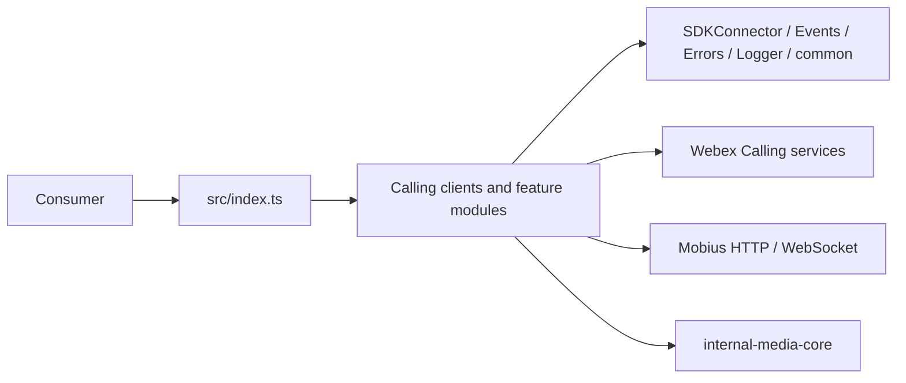

# AGENTS.md — @webex/calling

> Read first. Next: [`ai-docs/SPEC_INDEX.md`](ai-docs/SPEC_INDEX.md) for routing and [`ai-docs/ARCHITECTURE.md`](ai-docs/ARCHITECTURE.md) for system design. Load only the affected module specifications.

## Repo Overview

`@webex/calling` is the TypeScript SDK package for Webex Calling clients, line registration, call control/media, settings, contacts, history, recordings, voicemail, metrics, and Mobius transport.

**What it is:**
- A published library package inside the `webex-js-sdk` workspace.
- A typed adapter over Webex Calling backends, Webex SDK services, events, media, and WebSocket transport.

**What it is NOT:**
- It is not a UI application or a datastore owner.
- It does not own the remote Webex services or their persisted records.

## Tech Stack

- TypeScript 4.9, Node.js 22.14 for this repository, Yarn workspaces, and `tsc`.
- Jest unit tests, ESLint/Prettier, TypeDoc, and Playwright package journeys.

## Architecture



→ Full architecture: [`ai-docs/ARCHITECTURE.md`](ai-docs/ARCHITECTURE.md)

## Module / Package Structure

```text
packages/calling/
├── src/CallHistory/ — createCallHistoryClient(webex, logger) -> ICallHistory
├── src/CallRecording/ — createCallRecordingClient(webex, logger) -> ICallRecording
├── src/CallSettings/ — createCallSettingsClient(webex, logger) -> ICallSettings
├── src/CallingClient/ — createClient(config) -> ICallingClient
├── src/CallingClient/calling/ — ICall and CallManager call lifecycle operations
├── src/CallingClient/calling/CallerId/ — Caller identity resolution and incremental display-information callbacks
├── src/CallingClient/line/ — ILine call and registration operations
├── src/CallingClient/registration/ — Internal registration, deregistration, failover, failback, and keepalive lifecycle
├── src/Contacts/ — createContactsClient(webex, logger) -> IContacts
├── src/Metrics/ — MetricManager singleton and typed calling metric submission methods
├── src/SDKConnector/ — Singleton adapter for Webex SDK request, service, credential, device, and Mercury access
├── src/Voicemail/ — createVoicemailClient(webex, logger) -> IVoicemail
├── src/mobius-socket/ — MobiusSocket singleton request/response API
```

→ Canonical module routing: [`ai-docs/SPEC_INDEX.md`](ai-docs/SPEC_INDEX.md)

## Critical Rules

1. Code and tests are the behavioral source of truth; legacy AI docs are migration inputs until independently validated.
2. Before coding, classify the task, ask unresolved mandatory questions, present a Spec Summary, and obtain approval.
3. Load the affected canonical module spec plus `ai-docs/RULES.md`; do not load every module document.
4. Use factories and typed interfaces exported from `src/index.ts`; do not expose internal helpers accidentally.
5. Preserve backend-specific strategy boundaries and route network access through existing adapters.
6. Use `src/Logger/`; never add `console.log` or log tokens, credentials, PII, or raw sensitive payloads.
7. Use typed error/event contracts from `Errors/` and `Events/`; never silently swallow failures.
8. Add or update positive and negative tests with behavior changes; keep docs/specs current in the same merge.
9. Ask before changing public exports, events, backend contracts, security-sensitive flows, or performance-critical transport behavior.
10. Never commit secrets, disable quality gates, overwrite protected specs, deploy, push, or publish without explicit approval.

## Essential Commands

| Task | Command |
|---|---|
| Install | `yarn install` |
| Build | `yarn workspace @webex/calling build:src` |
| Unit test | `yarn workspace @webex/calling test:unit` |
| Lint | `yarn workspace @webex/calling test:style` |
| E2E | `yarn workspace @webex/calling test:e2e` |

## Common Gotchas

1. Test `--targets` values are relative to the test-type spec directory, not repository-relative paths.
2. CallingClient transport access goes through `src/CallingClient/utils/request.ts`; do not import `MobiusSocket` directly elsewhere.
3. WXC, UCM, and BroadWorks capabilities differ; verify the backend matrix before exposing behavior.
4. Events may be asynchronous or out of order; preserve correlation identifiers and cleanup listeners/timers.
5. `SDKConnector` may be initialized only once and requires an authorized, ready Webex SDK with Mercury.
6. Public exports in `src/index.ts` are semver-sensitive even when implementation files look internal.

## Pre-Commit Checklist

- [ ] Affected module spec and standing catalogs are updated in the same change.
- [ ] Unit tests pass with positive and negative/error cases; run targeted E2E where the flow crosses modules.
- [ ] TypeScript build and lint pass.
- [ ] Public exports, events, backend support, and compatibility were checked.
- [ ] No hardcoded secrets or sensitive logging was introduced.
- [ ] A different runtime performs the required independent spec validation.

## Strict Compliance Mode (automation)

For Stage-0 onboarding and automated lifecycle runs, all required source/spec gates are blocking. Stop on unresolved critical facts, source conflicts, failed conformance, or same-runtime validation.

---
**SDD coverage:** `.sdd/manifest.json` is authoritative; [`ai-docs/SPEC_INDEX.md`](ai-docs/SPEC_INDEX.md) is its human-readable mirror.
