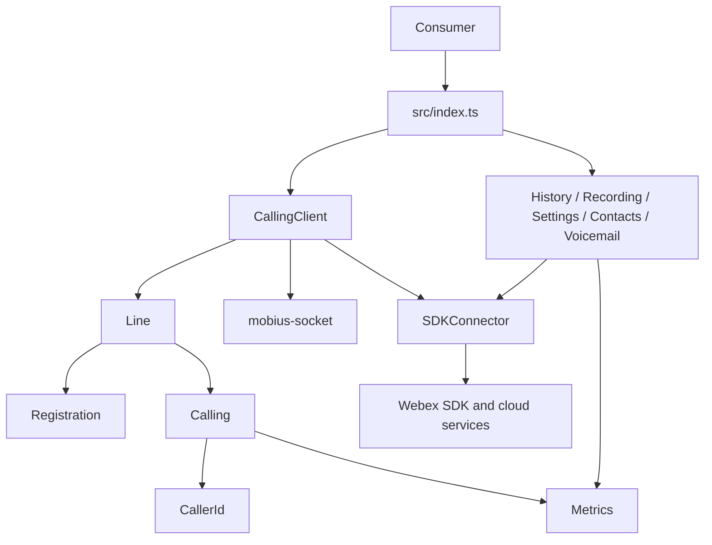
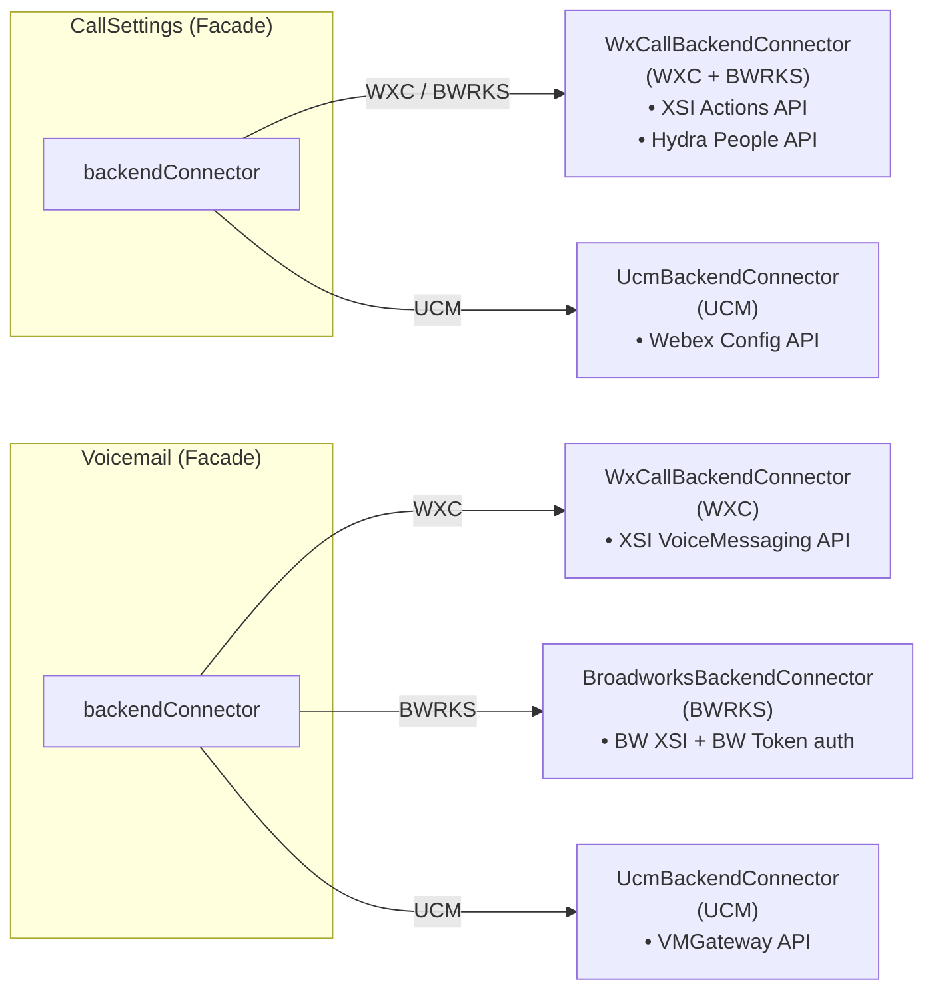
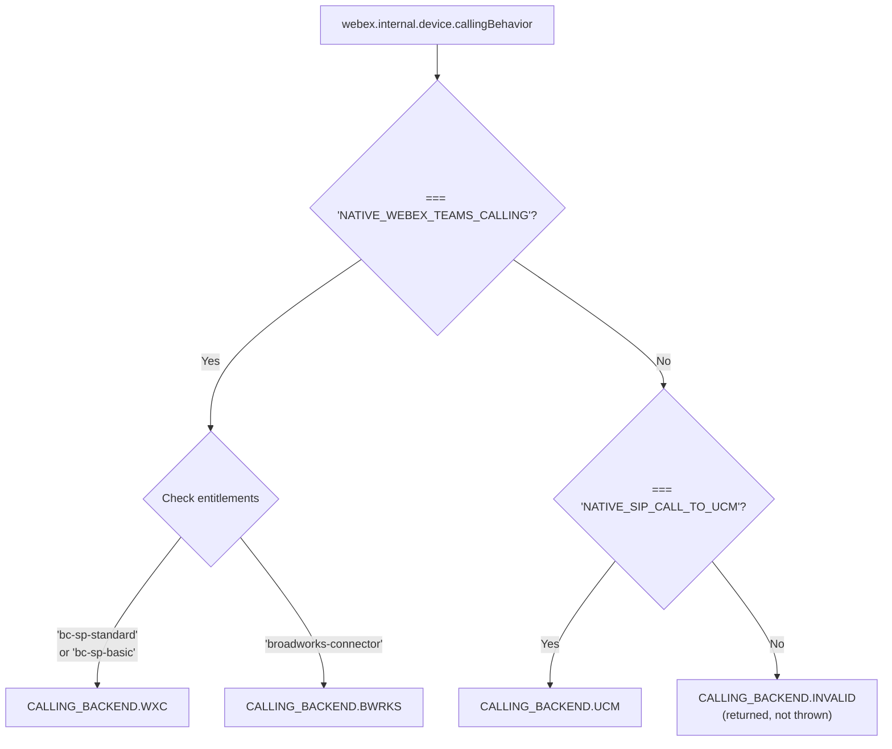
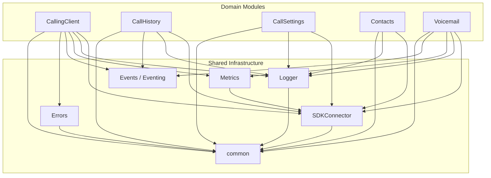
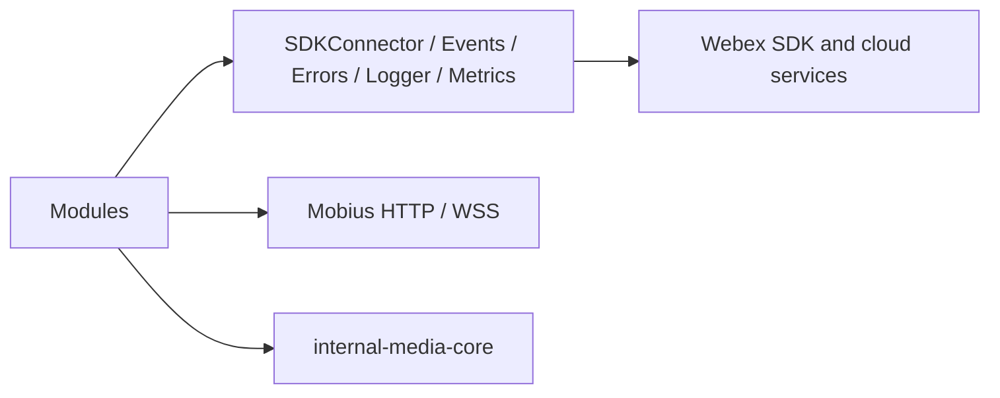

# ARCHITECTURE — @webex/calling

> Root [`AGENTS.md`](../AGENTS.md) · router [`SPEC_INDEX.md`](SPEC_INDEX.md). Per-module behavior lives in the manifest-routed source-local module specs.

## Design Overview

`@webex/calling` is a modular client library that exposes factory functions for calling, call history, call recording, call settings, contacts, and voicemail. `CallingClient` coordinates line registration and call control, while the other feature modules provide focused facades over their corresponding Webex services and backend-specific connectors.

The package shares infrastructure for Webex SDK access, logging, metrics, typed events, errors, and common types and utilities. `CallingClient` delegates registration and active-call behavior to its Line, Registration, and Calling submodules and uses `mobius-socket` for Mobius request and event transport.

Detailed interfaces, configuration fields, state machines, wire formats, and module-specific behavior are documented in the source-local module specifications routed through [`SPEC_INDEX.md`](SPEC_INDEX.md). Public SDK surfaces are indexed in [`CONTRACTS.md`](CONTRACTS.md).

## Component Inventory & Responsibilities

| Component | Responsibility | Docs |
|---|---|---|
| `src/CallHistory/` | createCallHistoryClient(webex, logger) -> ICallHistory | [`src/CallHistory/ai-docs/call-history-spec.md`](../src/CallHistory/ai-docs/call-history-spec.md) |
| `src/CallRecording/` | createCallRecordingClient(webex, logger) -> ICallRecording | [`src/CallRecording/ai-docs/call-recording-spec.md`](../src/CallRecording/ai-docs/call-recording-spec.md) |
| `src/CallSettings/` | createCallSettingsClient(webex, logger) -> ICallSettings | [`src/CallSettings/ai-docs/call-settings-spec.md`](../src/CallSettings/ai-docs/call-settings-spec.md) |
| `src/CallingClient/` | createClient(config) -> ICallingClient | [`src/CallingClient/ai-docs/calling-client-spec.md`](../src/CallingClient/ai-docs/calling-client-spec.md) |
| `src/CallingClient/calling/` | ICall and CallManager call lifecycle operations | [`src/CallingClient/calling/ai-docs/calling-spec.md`](../src/CallingClient/calling/ai-docs/calling-spec.md) |
| `src/CallingClient/calling/CallerId/` | Caller identity resolution and incremental display-information callbacks | [`src/CallingClient/calling/CallerId/ai-docs/caller-id-spec.md`](../src/CallingClient/calling/CallerId/ai-docs/caller-id-spec.md) |
| `src/CallingClient/line/` | ILine call and registration operations | [`src/CallingClient/line/ai-docs/line-spec.md`](../src/CallingClient/line/ai-docs/line-spec.md) |
| `src/CallingClient/registration/` | Internal registration, deregistration, failover, failback, and keepalive lifecycle | [`src/CallingClient/registration/ai-docs/registration-spec.md`](../src/CallingClient/registration/ai-docs/registration-spec.md) |
| `src/Contacts/` | createContactsClient(webex, logger) -> IContacts | [`src/Contacts/ai-docs/contacts-spec.md`](../src/Contacts/ai-docs/contacts-spec.md) |
| `src/Metrics/` | MetricManager singleton and typed calling metric submission methods | [`src/Metrics/ai-docs/metrics-spec.md`](../src/Metrics/ai-docs/metrics-spec.md) |
| `src/SDKConnector/` | Singleton adapter for Webex SDK request, service, credential, device, and Mercury access | [`src/SDKConnector/ai-docs/sdk-connector-spec.md`](../src/SDKConnector/ai-docs/sdk-connector-spec.md) |
| `src/Voicemail/` | createVoicemailClient(webex, logger) -> IVoicemail | [`src/Voicemail/ai-docs/voicemail-spec.md`](../src/Voicemail/ai-docs/voicemail-spec.md) |
| `src/mobius-socket/` | MobiusSocket singleton request/response API | [`src/mobius-socket/ai-docs/mobius-socket-spec.md`](../src/mobius-socket/ai-docs/mobius-socket-spec.md) |

## Component Interaction



### Backend Connector Architecture

The `CallSettings` and `Voicemail` modules use the Strategy pattern to handle three distinct calling backends through a unified interface:



### Backend Detection Logic (getCallingBackEnd() in common/Utils.ts)

The detection uses a two-level branching: first on `callingBehavior`, then on entitlements:



### Network Communication

All HTTP traffic flows through the Webex JS SDK's `request()` method via `SDKConnector`. The SDK handles:
- OAuth token management and refresh
- Service URL catalog resolution (by service name, e.g., `mobius`, `janus`)
- Retry and circuit-breaking

Real-time events arrive through Mercury (Cisco's WebSocket service). Modules register for specific event scopes:

| Scope | Consumer | Events |
|---|---|---|
| `event:mobius` | CallManager | Call setup, progress, connect, disconnect, call info |
| `event:janus.user_recent_sessions` | CallHistory, CallingClient | New/updated call history records |
| `event:janus.user_viewed_sessions` | CallHistory | Missed call read state changes |
| `event:janus.user_sessions_deleted` | CallHistory | Deleted call records |

### Service Endpoints

| Service | Discovery | Protocol |
|---|---|---|
| **Mobius** (Call Control) | `webex.internal.services` catalog → `mobius` | REST + Mercury WS |
| **Janus** (Call History) | `webex.internal.services` catalog → `janus` | REST + Mercury WS |
| **XSI Actions** (Settings/VM) | Fetched from `organizations?callingData=true` endpoint | REST (XML) |
| **VMGateway** (UCM VM) | Fetched from `services` endpoint | REST |
| **Contacts Service** | `webex.internal.services` catalog → contacts | REST |
| **Hydra** (People API) | `webex.internal.services` catalog → `hydra` | REST |

## Execution & Flow

A consumer creates a typed client, the module resolves backend/service configuration through SDKConnector, performs HTTP/WebSocket/media work through its owning adapter, then returns a typed result or emits an event. Failure paths use typed errors, logging, metrics, retries, or backend fallbacks defined by the owning module.

## Dependencies

| Dependency | Type | How used | Failure / version handling |
|---|---|---|---|
| Webex request client and Janus call-history APIs | external/internal | Required by CallHistory | Follow module timeout/retry/fallback and package version constraints |
| Mercury real-time events | external/internal | Required by CallHistory | Follow module timeout/retry/fallback and package version constraints |
| Webex hydraDeveloperApi recording endpoints | external/internal | Required by CallRecording | Follow module timeout/retry/fallback and package version constraints |
| Mercury recording lifecycle events | external/internal | Required by CallRecording | Follow module timeout/retry/fallback and package version constraints |
| Webex Calling XSI/Hydra services | external/internal | Required by CallSettings | Follow module timeout/retry/fallback and package version constraints |
| UCM management gateway | external/internal | Required by CallSettings | Follow module timeout/retry/fallback and package version constraints |
| SDKConnector and Webex device/feature/service plugins | external/internal | Required by CallingClient | Follow module timeout/retry/fallback and package version constraints |
| Calling, Line, Registration, Metrics, and mobius-socket modules | external/internal | Required by CallingClient | Follow module timeout/retry/fallback and package version constraints |
| Mobius signaling through APIRequest | external/internal | Required by calling | Follow module timeout/retry/fallback and package version constraints |
| @webex/internal-media-core ROAP/media engine | external/internal | Required by calling | Follow module timeout/retry/fallback and package version constraints |
| Mobius SIP-style identity headers | external/internal | Required by CallerId | Follow module timeout/retry/fallback and package version constraints |
| SCIM people lookup through the Webex SDK | external/internal | Required by CallerId | Follow module timeout/retry/fallback and package version constraints |
| Registration and Calling submodules | external/internal | Required by line | Follow module timeout/retry/fallback and package version constraints |
| SDKConnector event bridge | external/internal | Required by line | Follow module timeout/retry/fallback and package version constraints |
| Mobius registration APIs through APIRequest | external/internal | Required by registration | Follow module timeout/retry/fallback and package version constraints |
| Web Worker keepalive timer | external/internal | Required by registration | Follow module timeout/retry/fallback and package version constraints |
| Webex contacts service | external/internal | Required by Contacts | Follow module timeout/retry/fallback and package version constraints |
| Webex KMS encryption | external/internal | Required by Contacts | Follow module timeout/retry/fallback and package version constraints |
| @webex/internal-plugin-metrics through Webex SDK | external/internal | Required by Metrics | Follow module timeout/retry/fallback and package version constraints |
| Calling error/event types | external/internal | Required by Metrics | Follow module timeout/retry/fallback and package version constraints |
| Initialized and authorized WebexSDK instance with Mercury | external/internal | Required by SDKConnector | Follow module timeout/retry/fallback and package version constraints |
| Webex Calling, BroadWorks, and UCM voicemail services | external/internal | Required by Voicemail | Follow module timeout/retry/fallback and package version constraints |
| Contacts resolution and Metrics | external/internal | Required by Voicemail | Follow module timeout/retry/fallback and package version constraints |
| WebSocket implementation | external/internal | Required by mobius-socket | Follow module timeout/retry/fallback and package version constraints |
| Webex credentials, device feature settings, and Mobius discovery | external/internal | Required by mobius-socket | Follow module timeout/retry/fallback and package version constraints |

### Module Dependency Graph



### State Model

- `CallingClient` owns the in-memory line registry and session-listener lifecycle for an initialized client.
- Each `Line` owns its registration status and delegates active-call membership to `CallManager`.
- `Call` owns signaling and media state machines; `Registration` owns registration, retry, failover, and keepalive state.
- `Contacts`, `Voicemail`, and `mobius-socket` keep bounded client-side caches whose ownership and invalidation rules remain module-local.

Evidence: `src/CallingClient/CallingClient.ts`; `src/CallingClient/line/index.ts`; `src/CallingClient/calling/call.ts`; `src/CallingClient/registration/register.ts`; `src/Contacts/`; `src/Voicemail/`; `src/mobius-socket/`.

### Concurrency and Threading

- `CallingClient` uses `async-mutex` (`Mutex`) to serialize line creation and prevent duplicate registrations during concurrent initialization.
- `Registration` uses a **Web Worker** for keepalive heartbeats. The worker source is inlined as a string (`webWorkerStr.ts`) and instantiated via `Blob` URL, keeping the main thread free from timer blocking.
- `CallManager` maintains a `callCollection` map and routes WebSocket events to the correct `Call` instance by `correlationId`.

## Cross-Cutting Concerns

### Error Hierarchy

All custom errors extend `ExtendedError`:

```
ExtendedError (Errors/catalog/ExtendedError.ts)
├── CallError        — correlationId, errorLayer (call_control | media)
├── LineError        — status (RegistrationStatus)
└── CallingClientError (file: CallingDeviceError.ts) — status (RegistrationStatus)
```

> **Note**: The `CallingClientError` class is defined in `Errors/catalog/CallingDeviceError.ts` but exported as `CallingClientError`. It takes `status: RegistrationStatus` as a constructor parameter (not `correlationId`/`errorLayer`).

Errors carry `ERROR_TYPE` (semantic category) and `ERROR_CODE` (HTTP or SDK status code). Factory functions `createCallError()` and `createClientError()` are the standard instantiation path.

### Logging Levels

The `Logger` module uses a numeric level hierarchy defined in `LOGGING_LEVEL` (`Logger/types.ts`):

| Level | Value | Includes |
|---|---|---|
| `error` | 1 | Errors only |
| `warn` | 2 | Errors + warnings |
| `log` | 3 | + general messages |
| `info` | 4 | + informational |
| `trace` | 5 | + full stack traces |

The `LOGGER` enum defines the string values: `'error'`, `'warn'`, `'info'`, `'log'`, `'trace'`.

Log format: `webex-calling: <UTC timestamp>: [LEVEL]: file:<filename> - method:<methodName> - message:<content>`

### Metrics

The `MetricManager` singleton submits calling telemetry through the Webex SDK metrics interface. It covers registration, keepalive, call control, media, connection, voicemail, Mobius discovery, background-noise-reduction, and log-upload activity.

Metric-specific tags, fields, naming exceptions, and submission behavior are documented in [`src/Metrics/ai-docs/metrics-spec.md`](../src/Metrics/ai-docs/metrics-spec.md). The implementation sources of truth are `src/Metrics/index.ts` and `src/Metrics/types.ts`.

### Errors

Four-class hierarchy with factory functions:

| Class | Factory | Extra Fields |
|---|---|---|
| `ExtendedError` | — | `message`, `type` (ERROR_TYPE), `context` (file/method) |
| `CallError` | `createCallError()` | `correlationId`, `errorLayer` (call_control / media) |
| `LineError` | `createLineError()` | `status` (RegistrationStatus) |
| `CallingClientError` (file: `CallingDeviceError.ts`) | `createClientError()` | `status` (RegistrationStatus) |

Error handler utilities in `common/Utils.ts`:
- `handleCallErrors(err, ...)` — maps HTTP status codes to `CallError` instances
- `handleCallingClientErrors(err, ...)` — maps HTTP status codes to `CallingClientError`
- `serviceErrorCodeHandler(err)` — generic service error mapper

## Non-Functional Posture

### Testing Architecture

- **Runner**: Jest with `jsdom` environment
- **File convention**: Co-located `*.test.ts` files (e.g., `CallHistory.test.ts` next to `CallHistory.ts`)
- **Mocking**:
  - `getTestUtilsWebex()` in `common/testUtil.ts` provides a comprehensive mock Webex SDK
  - Module-level singletons are mocked via `jest.mock()` with `jest.fn()` stubs
  - Backend connectors have dedicated test fixture files (e.g., `callHistoryFixtures.ts`, `voicemailFixture.ts`)
- **Async patterns**: `flushPromises()` drains the microtask queue; `waitForMsecs(n)` for timer-dependent tests
- **Custom matchers**: `toBeCalledOnceWith(args)` for precise single-invocation assertions
- **Configuration**: `jest.config.js` at package root; `jest-preload.js` for global setup

## Dependency / Interaction Topology



| From | To | Kind | Purpose |
|---|---|---|---|
| `CallHistory` | `Webex request client and Janus call-history APIs` | call/event | createCallHistoryClient(webex, logger) -> ICallHistory |
| `CallRecording` | `Webex hydraDeveloperApi recording endpoints` | call/event | createCallRecordingClient(webex, logger) -> ICallRecording |
| `CallSettings` | `Webex Calling XSI/Hydra services` | call/event | createCallSettingsClient(webex, logger) -> ICallSettings |
| `CallingClient` | `SDKConnector and Webex device/feature/service plugins` | call/event | createClient(config) -> ICallingClient |
| `calling` | `Mobius signaling through APIRequest` | call/event | ICall and CallManager call lifecycle operations |
| `CallerId` | `Mobius SIP-style identity headers` | call/event | Caller identity resolution and incremental display-information callbacks |
| `line` | `Registration and Calling submodules` | call/event | ILine call and registration operations |
| `registration` | `Mobius registration APIs through APIRequest` | call/event | Internal registration, deregistration, failover, failback, and keepalive lifecycle |
| `Contacts` | `Webex contacts service` | call/event | createContactsClient(webex, logger) -> IContacts |
| `Metrics` | `@webex/internal-plugin-metrics through Webex SDK` | call/event | MetricManager singleton and typed calling metric submission methods |
| `SDKConnector` | `Initialized and authorized WebexSDK instance with Mercury` | call/event | Singleton adapter for Webex SDK request, service, credential, device, and Mercury access |
| `Voicemail` | `Webex Calling, BroadWorks, and UCM voicemail services` | call/event | createVoicemailClient(webex, logger) -> IVoicemail |
| `mobius-socket` | `WebSocket implementation` | call/event | MobiusSocket singleton request/response API |

## Object / Data Ownership

| Domain object | Owning component | Read by |
|---|---|---|
| Call / media state | `Calling` | CallingClient, Line, consumers |
| Registration state | `Registration` | Line, CallingClient |
| Contact and group cache | `Contacts` | Calling and consumers |
| Voicemail models/cache | `Voicemail` | consumers, Contacts resolution |
| Event payload types | `Events` shared infrastructure | all event-producing modules |

## Caching Catalog

| Cache | Backend | What it holds | TTL | Invalidation trigger |
|---|---|---|---|---|
| Contacts cache | process memory | contacts and groups | module lifecycle | refresh/create/delete |
| Voicemail pagination cache | process memory | fetched voicemail pages | module lifecycle | new request/update/delete |
| Mobius async-event dedup | process memory | recently seen envelopes | bounded by implementation | expiry/connection lifecycle |
| Registration failover state | Webex bounded storage | active/backup Mobius state | implementation-defined | failover/failback/deregister |

## Observability Patterns

- **Logging:** contextual calls through `src/Logger/`; never log tokens, credentials, or sensitive contact/media payloads.
- **Metrics:** `src/Metrics/` submits operational and behavioral metrics through `@webex/internal-plugin-metrics`.
- **Audit:** the SDK does not own a durable audit store; remote services own server-side audit records.

## Infrastructure Matrix

| Category | In use | Notes |
|---|---|---|
| Datastores | none owned | Remote Webex services persist calling data |
| Messaging / streaming | Mercury and Mobius WebSocket events | Client consumes asynchronous events |
| Cloud / platform services | Janus, Hydra, Mobius, WDM, contacts, KMS, UCM gateway, metrics | Resolved through Webex SDK/service catalogs |

## Shared / Base Libraries

| Library | Shared responsibility | Version floor |
|---|---|---|
| `@webex/common` | Webex request/types integration | workspace version |
| `@webex/internal-plugin-device` | WDM device/service discovery | workspace version |
| `@webex/internal-plugin-metrics` | metrics transport | workspace version |
| `@webex/internal-media-core` | WebRTC media and ROAP | `2.26.1` |
| `@webex/media-helpers` | media stream/effects | workspace version |

## Package Map & Inter-Package Dependencies

The parent repository uses Yarn workspaces declared in `package.json`. `packages/calling/package.json` is the published package boundary; workspace dependencies remain version-synchronized by the monorepo release process.

## Platform Matrix

| Platform | Shared core vs platform-specific | Entry / build | Notes |
|---|---|---|---|
| Browser | shared TypeScript core plus browser WebSocket shim | `src/index.ts`; workspace build | WebRTC/media and browser socket implementation |
| Node-compatible tooling/tests | shared TypeScript core plus `ws` transport | workspace build/test | Used by tests and non-browser integration paths |

## Release & Versioning

Published as `@webex/calling` through the workspace release pipeline. Public exports and type declarations are semver-sensitive; incompatible removals require an approved major-version migration and changelog entry.

## Cross-Repo Dependency Graph

- **Internal workspace packages:** Webex common, device, feature, metrics, test helpers, and media helpers.
- **External packages:** `@webex/internal-media-core`, `xstate`, `ws`, `lodash`, `uuid`, and transport/test tooling.
- **External services:** Webex Calling cloud services resolved through the Webex SDK service catalog.

## Security Architecture

Webex credentials and tokens cross from the host Webex SDK into SDKConnector and transport adapters. Contacts use Webex KMS for encrypted fields. Mobius and service calls use TLS/WSS. Module code must not persist credentials or log sensitive identity/contact/media payloads; see `SECURITY.md`.

## Architecture Reference Links

| Reference | Location | When to read |
|---|---|---|
| Architecture decisions | `adr/` | Durable design rationale |
| Repo patterns | `patterns/` | Established implementation conventions |
| Enforceable rules | `RULES.md` + `rules/` | Constraints on architecture-affecting changes |

## WS6 References

No repository-local WS6 artifact was found under `packages/calling/`. Use an authoritative organization source if one is supplied; do not infer one.
