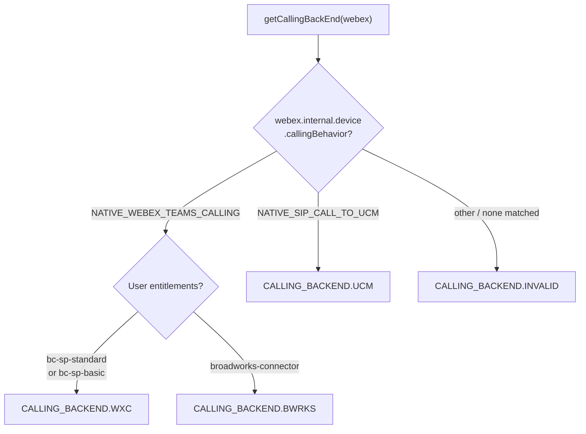
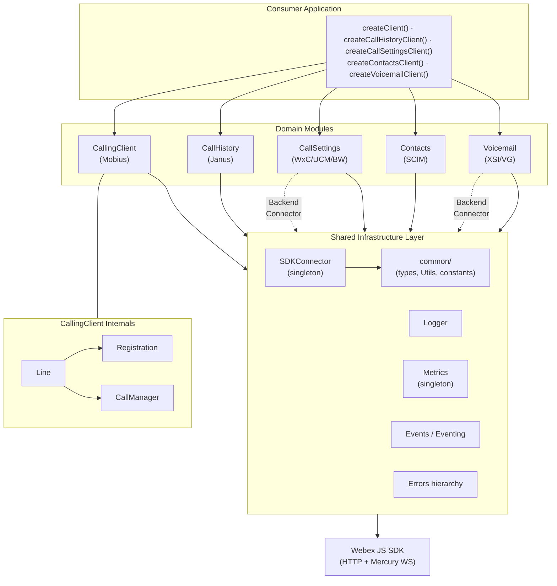
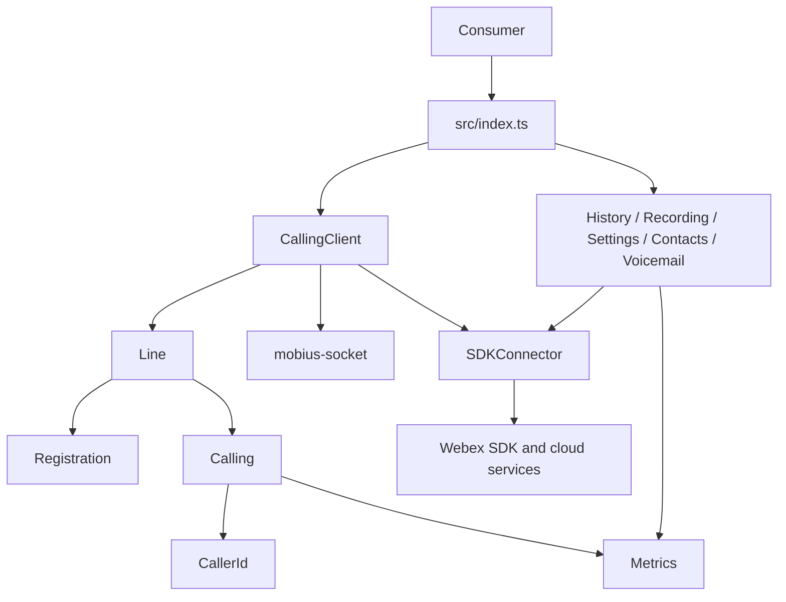
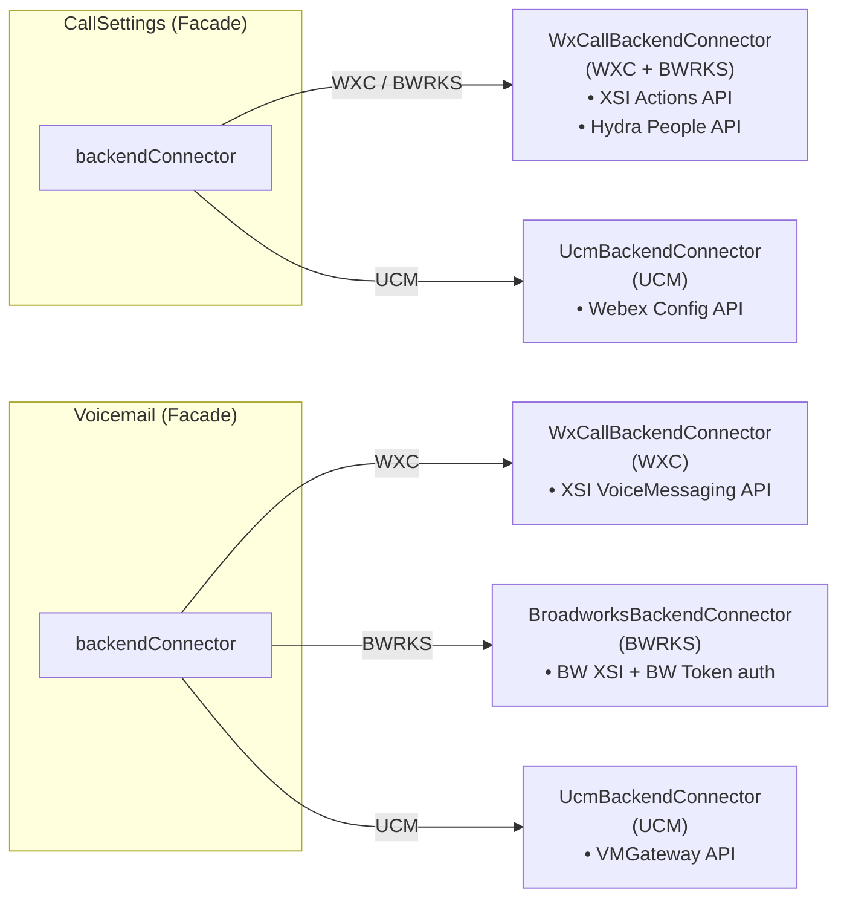
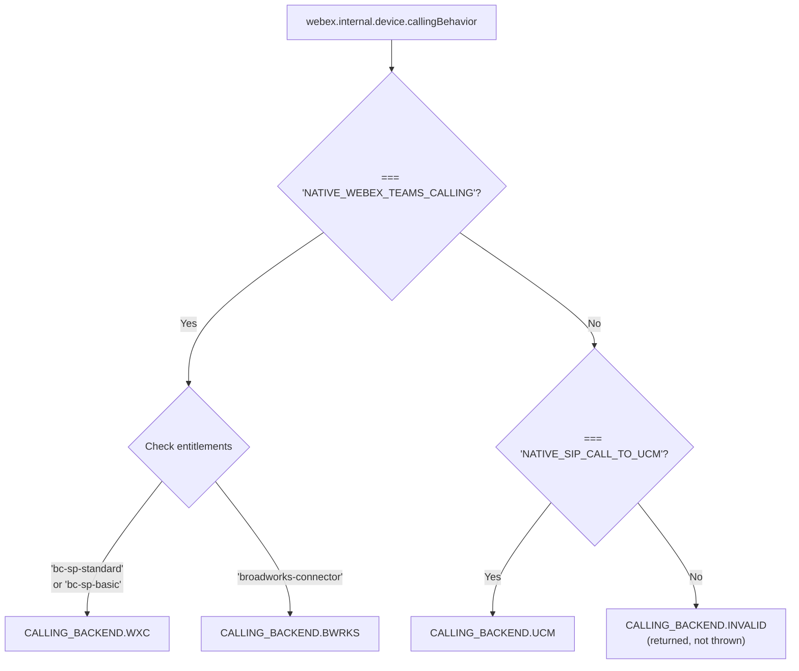
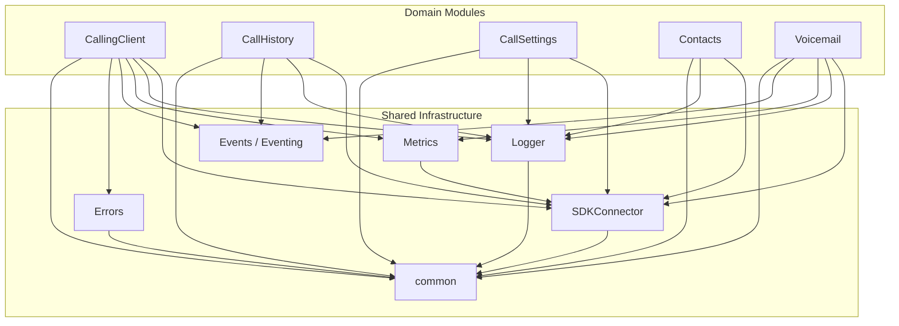
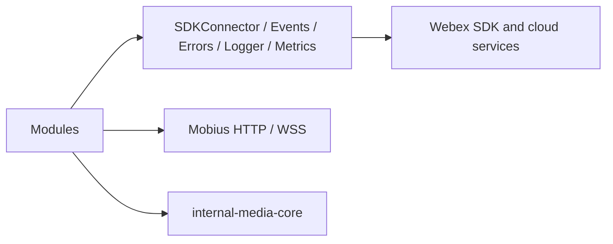

# ARCHITECTURE — @webex/calling

> Root [`AGENTS.md`](../AGENTS.md) · router [`SPEC_INDEX.md`](SPEC_INDEX.md). Per-module behavior lives in the manifest-routed source-local module specs.

## Design Overview

### Overview

`@webex/calling` is a browser-based TypeScript SDK for Webex Calling services. It provides a unified API surface for line registration, real-time call control, call history, call settings, contacts management, and voicemail — working transparently across three calling backends: **Webex Calling (WxC)**, **Broadworks (BWRKS)**, and **Unified Communications Manager (UCM)**.

The package is organized as a modular monolith inside `packages/calling/src/`. Each subdirectory owns a domain concern and exposes its contract through TypeScript interfaces. Shared infrastructure (SDK bridge, logging, metrics, eventing, errors) is consumed by all domain modules.

### ICallingClient

Top-level orchestrator for line registration and calling — provides APIs to manage lines, track active calls, and access the media engine. Defined in `src/CallingClient/types.ts`.

```typescript
interface ICallingClient extends Eventing<CallingClientEventTypes> {
  mediaEngine: typeof Media;
  getLines(): Record<string, ILine>;
  getActiveCalls(): Record<string, ICall[]>;
  getConnectedCall(): ICall | undefined;
  getDevices(userId?: string): Promise<DeviceType[]>;
}
```

### ICallHistory

Provides APIs for retrieving, updating, and deleting recent call history records via the Janus service. Defined in `src/CallHistory/types.ts`.

```typescript
interface ICallHistory extends Eventing<CallHistoryEventTypes> {
  getCallHistoryData(days: number, limit: number, sort: SORT, sortBy: SORT_BY): Promise<JanusResponseEvent>;
  updateMissedCalls(endTimeSessionIds: EndTimeSessionId[]): Promise<UpdateMissedCallsResponse>;
  deleteCallHistoryRecords(deleteSessionIds: EndTimeSessionId[]): Promise<DeleteCallHistoryRecordsResponse>;
}
```

### ICallSettings

Provides APIs to retrieve and update user call settings — call waiting, DND, call forwarding, and voicemail configuration. Uses the Strategy pattern to select a backend-specific connector (WXC or UCM). Defined in `src/CallSettings/types.ts`.

```typescript
interface ICallSettings {
  getCallWaitingSetting(): Promise<CallSettingResponse>;
  getDoNotDisturbSetting(): Promise<CallSettingResponse>;
  setDoNotDisturbSetting(flag: boolean): Promise<CallSettingResponse>;
  getCallForwardSetting(): Promise<CallSettingResponse>;
  setCallForwardSetting(request: CallForwardSetting): Promise<CallSettingResponse>;
  getVoicemailSetting(): Promise<CallSettingResponse>;
  setVoicemailSetting(request: VoicemailSetting): Promise<CallSettingResponse>;
  getCallForwardAlwaysSetting(directoryNumber?: string): Promise<CallSettingResponse>;
}
```

### IContacts

Provides APIs for fetching, creating, and deleting user contacts and contact groups. Defined in `src/Contacts/types.ts`.

```typescript
interface IContacts {
  getContacts(): Promise<ContactResponse>;
  createContactGroup(displayName: string, encryptionKeyUrl?: string, groupType?: GroupType): Promise<ContactResponse>;
  deleteContactGroup(groupId: string): Promise<ContactResponse>;
  createContact(contactInfo: Contact): Promise<ContactResponse>;
  deleteContact(contactId: string): Promise<ContactResponse>;
}
```

### IVoicemail

Provides APIs for retrieving and managing voicemail — listing, playback content, read/unread state, deletion, summary counts, and transcription. Uses the Strategy pattern to select a backend-specific connector (WXC or UCM). Defined in `src/Voicemail/types.ts`.

```typescript
interface IVoicemail {
  init(): VoicemailResponseEvent | Promise<VoicemailResponseEvent>;
  getVoicemailList(offset: number, offsetLimit: number, sort: SORT, refresh?: boolean): Promise<VoicemailResponseEvent>;
  getVoicemailContent(messageId: string): Promise<VoicemailResponseEvent>;
  getVoicemailSummary(): Promise<VoicemailResponseEvent | null>;
  voicemailMarkAsRead(messageId: string): Promise<VoicemailResponseEvent>;
  voicemailMarkAsUnread(messageId: string): Promise<VoicemailResponseEvent>;
  deleteVoicemail(messageId: string): Promise<VoicemailResponseEvent>;
  getVMTranscript(messageId: string): Promise<VoicemailResponseEvent | null>;
  resolveContact(callingPartyInfo: CallingPartyInfo): Promise<DisplayInformation | null>;
}
```

### ISDKConnector

Singleton bridge to the Webex JS SDK — provides access to the `webex` instance for HTTP requests and manages Mercury WebSocket listener registration/unregistration. Defined in `src/SDKConnector/types.ts`.

```typescript
interface ISDKConnector {
  setWebex(webexInstance: WebexSDK): void;
  getWebex(): WebexSDK;
  registerListener<T>(event: string, cb: (data?: T) => unknown): void;
  unregisterListener(event: string): void;
}
```

### Public API Surface

The package has two export files:

### index.ts — Consumer-facing exports

This is the primary entry point for external consumers. Factory functions for creating client module instances:

```typescript
import {
  createClient,            // CallingClient
  createCallHistoryClient, // CallHistory
  createCallSettingsClient,// CallSettings
  createContactsClient,    // Contacts
  createVoicemailClient,   // Voicemail
  Logger,                  // Logger singleton
} from '@webex/calling';
```

Media-related re-exports from `@webex/media-helpers`:

```typescript
import {
  createMicrophoneStream,   // Factory to create a microphone media stream
  NoiseReductionEffect,     // Background noise reduction effect
  LocalMicrophoneStream,    // Local microphone stream class
} from '@webex/calling';
```

Key interfaces and types re-exported:

- `ICallingClient`, `ILine`, `ICall` — calling & line control
- `ICallHistory`, `JanusResponseEvent`, `UserSession` — call history
- `ICallSettings`, `CallForwardSetting`, `VoicemailSetting`, `ToggleSetting` — settings
- `IContacts`, `Contact`, `ContactResponse`, `GroupType` — contacts
- `IVoicemail`, `SummaryInfo`, `VoicemailResponseEvent` — voicemail
- `CallError`, `LineError`, `ERROR_LAYER`, `ERROR_TYPE` — errors
- Event key enums: `CALLING_CLIENT_EVENT_KEYS`, `CALL_EVENT_KEYS`, `LINE_EVENT_KEYS`, `COMMON_EVENT_KEYS`
- Common types: `CallDetails`, `CallDirection`, `CallType`, `SORT`, `SORT_BY`, `ServiceIndicator`, `DisplayInformation`
- `CallingClientConfig`, `LOGGER`, `TransferType`, `CallerIdDisplay`, `Disposition`

### api.ts — API reference documentation exports

`api.ts` is used for API reference documentation generation. It re-exports concrete classes (`CallingClient`, `CallHistory`, `CallSettings`, `ContactsClient`, `Voicemail`) in addition to interfaces and factory functions. It is **not** an entry point for external consumers — use `index.ts` for all consumer-facing imports.

### Factory Functions

All client module instances are created via factory functions. This is the **only** supported instantiation path.

| Factory | Returns | Parameters |
|---|---|---|
| `createClient(webex, config)` | `ICallingClient` | `WebexSDK`, `CallingClientConfig` |
| `createCallHistoryClient(webex, logger)` | `ICallHistory` | `WebexSDK`, `LoggerInterface` |
| `createCallSettingsClient(webex, logger)` | `ICallSettings` | `WebexSDK`, `LoggerInterface` |
| `createContactsClient(webex, logger)` | `IContacts` | `WebexSDK`, `LoggerInterface` |
| `createVoicemailClient(webex, logger)` | `IVoicemail` | `WebexSDK`, `LoggerInterface` |

Every factory internally calls `SDKConnector.setWebex(webex)` if not already initialized.

### Configuration

`CallingClientConfig` controls the `CallingClient` client module. Each field serves a specific purpose:

```typescript
interface CallingClientConfig {
  logger?: LoggerConfig;            // Sets the logging verbosity level for the CallingClient module
  discovery?: {
    country: string;                // Country code used for Mobius region discovery to find the nearest server
    region: string;                 // Client region hint to optimize server selection
  };
  serviceData?: {
    indicator: ServiceIndicator;    // Identifies the type of calling service: 'calling' (standard),
                                    // 'contactcenter' (contact center agents), or 'guestcalling' (guest users)
    domain?: string;                // Optional domain override for service endpoint resolution
  };
  jwe?: string;                     // JWE (JSON Web Encryption) token required for guest calling authentication
}

interface LoggerConfig {
  level: LOGGER;                    // 'error' | 'warn' | 'info' | 'log' | 'trace'
}
```

- **`logger`**: Controls the verbosity of log output. Defaults to minimal logging if not set. See the Logging Levels section for the level hierarchy.
- **`discovery`**: Provides geographic hints so the SDK can discover the closest Mobius servers for optimal call quality and latency.
- **`serviceData`**: Identifies the calling service type. The `indicator` determines which Mobius service endpoints are used. Standard calling uses `'calling'`, contact center agents use `'contactcenter'`, and guest/anonymous callers use `'guestcalling'`.
- **`jwe`**: A JWE token for guest calling scenarios where the caller does not have a Webex account. Required only when `serviceData.indicator` is `'guestcalling'`.

All other client modules (`CallHistory`, `CallSettings`, `Contacts`, `Voicemail`) accept `{ level: LOGGER }` as their logger configuration.

### Calling Backend Detection

Certain client modules (`CallSettings`, `Voicemail`) need to determine the user's calling backend at instantiation time so they can select the appropriate backend connector (Strategy pattern). The `CallingClient` module also detects the backend during initialization.

Backend detection is performed by the `getCallingBackEnd(webex)` function in `common/Utils.ts`. It uses a two-level branching approach:

1. **First level**: Check `webex.internal.device.callingBehavior`
2. **Second level**: If the behavior is `NATIVE_WEBEX_TEAMS_CALLING`, check user entitlements to distinguish WXC from BWRKS



| Backend | callingBehavior | Entitlement | Enum |
|---|---|---|---|
| Webex Calling | `NATIVE_WEBEX_TEAMS_CALLING` | `bc-sp-standard` or `bc-sp-basic` | `CALLING_BACKEND.WXC` |
| Broadworks | `NATIVE_WEBEX_TEAMS_CALLING` | `broadworks-connector` | `CALLING_BACKEND.BWRKS` |
| UCM | `NATIVE_SIP_CALL_TO_UCM` | (not checked) | `CALLING_BACKEND.UCM` |

The `CallSettings` and `Voicemail` modules use the detected backend to select the appropriate backend connector class at construction time. The `CallingClient` module always communicates with the Mobius service regardless of backend.

### Event System

All modules that emit events extend `Eventing<T>`, a generic typed `EventEmitter` from `Events/impl`. Event type maps are defined in `Events/types.ts`.

| Module | Event Type Map | Key Events (enum references) |
|---|---|---|
| `ICallingClient` | `CallingClientEventTypes` | `CALLING_CLIENT_EVENT_KEYS.ERROR`, `CALLING_CLIENT_EVENT_KEYS.OUTGOING_CALL`, `CALLING_CLIENT_EVENT_KEYS.USER_SESSION_INFO`, `CALLING_CLIENT_EVENT_KEYS.ALL_CALLS_CLEARED` |
| `ICallHistory` | `CallHistoryEventTypes` | `COMMON_EVENT_KEYS.CALL_HISTORY_USER_SESSION_INFO`, `COMMON_EVENT_KEYS.CALL_HISTORY_USER_VIEWED_SESSIONS`, `COMMON_EVENT_KEYS.CALL_HISTORY_USER_SESSIONS_DELETED` |
| `IVoicemail` | `VoicemailEventTypes` | `COMMON_EVENT_KEYS.CB_VOICEMESSAGE_CONTENT_GET` |

For detailed `ILine` and `ICall` event information, refer to the sub-module documentation for `CallingClient`.

### Sub-Module Documentation

For detailed documentation on specific modules, refer to the `ai-docs/` folder within each subdirectory:

| Module | Path |
|---|---|
| CallingClient | `CallingClient/ai-docs/AGENTS.md`, `CallingClient/ai-docs/ARCHITECTURE.md` |
| CallingClient > Line | `CallingClient/line/ai-docs/AGENTS.md`, `CallingClient/line/ai-docs/ARCHITECTURE.md` |
| CallingClient > Registration | `CallingClient/registration/ai-docs/AGENTS.md`, `CallingClient/registration/ai-docs/ARCHITECTURE.md` |

### High-Level Architecture



### SDKConnector

The `SDKConnector` is a frozen singleton providing controlled access to the Webex JS SDK. All modules obtain their `webex` reference through it.

**Key behaviors:**
- `setWebex(webexInstance)`: Set-once; validates via `validateWebex()` then stores. Throws an error if called more than once.
- `getWebex()`: Returns the stored Webex SDK reference
- `registerListener<T>(event, cb)`: Proxies to `webex.internal.mercury.on(event, cb)`
- `unregisterListener(event)`: Proxies to `webex.internal.mercury.off(event)`

The `WebexSDK` interface (in `SDKConnector/types.ts`) defines the typed contract for the Webex SDK features the calling package consumes: `internal.device`, `internal.mercury`, `internal.services`, `internal.metrics`, `internal.encryption`, `people`, `credentials`, `request()`, etc.

### Logger

Module-scoped singleton with five log levels. Delegates to the Webex SDK logger (`webex.logger`) when set via `setWebexLogger()`, falling back to `console`.

All log messages include structured context: `file` and `method` fields for traceability.

### Events (Eventing<T>)

Generic base class extending `EventEmitter` with `typed-emitter`:

```typescript
export class Eventing<T> extends (EventEmitter as { new <T>(): TypedEmitter<T> })<T> {
  on(event, listener): this;
  off(event, listener): this;
  emit(event, ...args): boolean;
}
```

Emitting logs the event name via `Logger` for observability.

### common/

| File | Purpose |
|---|---|
| `types.ts` | Shared type aliases (`CallId`, `CorrelationId`, `CallDetails`, `MobiusServers`, etc.), enums (`CALLING_BACKEND`, `HTTP_METHODS`, `SORT`, `ServiceIndicator`, `RegistrationStatus`), and complex interfaces (`IDeviceInfo`, `WebexRequestPayload`, `SCIMListResponse`) |
| `constants.ts` | String constants for API paths, entitlement names, Webex API base URLs, status messages |
| `Utils.ts` | ~1,764 lines of utility functions: backend detection (`getCallingBackEnd`), XSI endpoint resolution, UUID inference, SCIM queries, voicemail list caching, RTP stats parsing, error handlers, log upload, keepalive interval calculation |
| `testUtil.ts` | `getTestUtilsWebex()` — builds a mock Webex SDK instance; `flushPromises()`, `waitForMsecs()` |

### Troubleshooting Guide

| Symptom | Likely Cause | Investigation |
|---|---|---|
| `SDKConnector.getWebex()` returns undefined | Factory not called, or `setWebex()` called with invalid SDK | Check that `createClient()` or module factory was called before accessing other modules |
| Registration fails with 403 | Invalid/expired token, or user not entitled for calling | Verify user entitlements; check `webex.credentials` token state |
| Registration fails with 429 | Too many registration attempts | The SDK has built-in 429 retry with exponential backoff; check `Registration` retry logic |
| Keepalive failures | Network disruption or Mobius server issue | Check `Registration` logs for keepalive errors; verify Mercury connection status |
| No incoming calls | Mercury WebSocket disconnected, or line not registered | Verify `line.getStatus() === 'active'`; check Mercury connection; inspect `CallManager` listeners |
| Backend connector errors | Wrong backend detected | Log `CALLING_BACKEND` value; verify user entitlements match expected backend |
| Call state stuck | XState machine in unexpected state | Enable `trace` logging; inspect Call FSM transitions; check for unhandled events |
| Metrics not reporting | MetricManager not initialized | Ensure `getMetricManager()` was called with valid `webex` instance |
| Event listeners not firing | Wrong event key or listener registered after emission | Verify event key enum matches; register listeners before triggering actions |

## Component Inventory & Responsibilities

| Component | Responsibility | Docs |
|---|---|---|
| `src/CallHistory/` | createCallHistoryClient(webex, logger) -> ICallHistory | [`src/CallHistory/ai-docs/call-history-spec.md`](../src/CallHistory/ai-docs/call-history-spec.md) |
| `src/CallRecording/` | createCallRecordingClient(webex, logger) -> ICallRecording | [`src/CallRecording/ai-docs/call-recording-spec.md`](../src/CallRecording/ai-docs/call-recording-spec.md) |
| `src/CallSettings/` | createCallSettingsClient(webex, logger) -> ICallSettings | [`src/CallSettings/ai-docs/call-settings-spec.md`](../src/CallSettings/ai-docs/call-settings-spec.md) |
| `src/CallingClient/` | createClient(config) -> ICallingClient | [`src/CallingClient/ai-docs/calling-client-spec.md`](../src/CallingClient/ai-docs/calling-client-spec.md) |
| `src/CallingClient/calling/` | ICall and CallManager call lifecycle operations | [`src/CallingClient/calling/ai-docs/calling-spec.md`](../src/CallingClient/calling/ai-docs/calling-spec.md) |
| `src/CallingClient/calling/CallerId/` | Caller identity resolution and incremental display-information callbacks | [`src/CallingClient/calling/CallerId/ai-docs/caller-id-spec.md`](../src/CallingClient/calling/CallerId/ai-docs/caller-id-spec.md) |
| `src/CallingClient/line/` | ILine call and registration operations | [`src/CallingClient/line/ai-docs/line-spec.md`](../src/CallingClient/line/ai-docs/line-spec.md) |
| `src/CallingClient/registration/` | Internal registration, deregistration, failover, failback, and keepalive lifecycle | [`src/CallingClient/registration/ai-docs/registration-spec.md`](../src/CallingClient/registration/ai-docs/registration-spec.md) |
| `src/Contacts/` | createContactsClient(webex, logger) -> IContacts | [`src/Contacts/ai-docs/contacts-spec.md`](../src/Contacts/ai-docs/contacts-spec.md) |
| `src/Metrics/` | MetricManager singleton and typed calling metric submission methods | [`src/Metrics/ai-docs/metrics-spec.md`](../src/Metrics/ai-docs/metrics-spec.md) |
| `src/SDKConnector/` | Singleton adapter for Webex SDK request, service, credential, device, and Mercury access | [`src/SDKConnector/ai-docs/sdk-connector-spec.md`](../src/SDKConnector/ai-docs/sdk-connector-spec.md) |
| `src/Voicemail/` | createVoicemailClient(webex, logger) -> IVoicemail | [`src/Voicemail/ai-docs/voicemail-spec.md`](../src/Voicemail/ai-docs/voicemail-spec.md) |
| `src/mobius-socket/` | MobiusSocket singleton request/response API | [`src/mobius-socket/ai-docs/mobius-socket-spec.md`](../src/mobius-socket/ai-docs/mobius-socket-spec.md) |

### Module Map

| Module | Directory | Purpose |
|---|---|---|
| **CallingClient** | `CallingClient/` | Top-level orchestrator for line registration and call control (Mobius) |
| **CallHistory** | `CallHistory/` | Retrieve, update, and delete call history records (Janus) |
| **CallSettings** | `CallSettings/` | Get/set call waiting, DND, call forwarding, voicemail settings |
| **Contacts** | `Contacts/` | CRUD operations on user contacts and contact groups |
| **Voicemail** | `Voicemail/` | Voicemail listing, playback, read/unread state, deletion, transcription |
| **SDKConnector** | `SDKConnector/` | Singleton bridge to the Webex JS SDK for HTTP and Mercury WebSocket |
| **Logger** | `Logger/` | Leveled structured logging wrapper (delegates to Webex SDK logger) |
| **Metrics** | `Metrics/` | Telemetry submission for registration, calls, media, voicemail, connectivity |
| **Events** | `Events/` | Typed `EventEmitter` base class (`Eventing<T>`) and all event type maps |
| **Errors** | `Errors/` | Custom error hierarchy — `ExtendedError`, `CallError`, `LineError`, `CallingClientError` |
| **common** | `common/` | Shared types, constants, and utility functions used across all modules |

### File Structure

```
src/
├── index.ts                    # Public exports (factory functions, interfaces, types)
├── api.ts                      # Extended exports (includes classes for internal use)
│
├── CallingClient/              # Orchestrator: registration + call control
│   ├── CallingClient.ts        # Main class, creates Lines, discovers Mobius servers
│   ├── types.ts                # ICallingClient, CallingClientConfig
│   ├── constants.ts            # Mobius URLs, timeouts, version
│   ├── calling/                # Call management sub-module
│   │   ├── call.ts             # Call class with XState FSMs
│   │   ├── callManager.ts      # CallManager singleton, WebSocket event router
│   │   ├── types.ts            # ICall interface
│   │   └── CallerId/           # Caller ID resolution
│   ├── line/                   # Line management sub-module
│   │   ├── index.ts            # Line class (registration + call bridge)
│   │   └── types.ts            # ILine, LINE_EVENTS
│   └── registration/           # Device registration sub-module
│       ├── register.ts         # Registration class (Mobius device lifecycle)
│       ├── webWorker.ts        # Keepalive Web Worker logic
│       └── types.ts            # IRegistration
│
├── CallHistory/                # Call history records (Janus API)
│   ├── CallHistory.ts          # Class extending Eventing<CallHistoryEventTypes>
│   ├── types.ts                # ICallHistory, response types
│   └── constants.ts            # Endpoints, limits
│
├── CallSettings/               # Call settings (DND, CF, CW, VM settings)
│   ├── CallSettings.ts         # Facade class — delegates to backend connector
│   ├── WxCallBackendConnector.ts  # Webex Calling / BW backend (XSI API)
│   ├── UcmBackendConnector.ts     # UCM backend (Webex API)
│   ├── types.ts                # ICallSettings, setting types
│   └── constants.ts            # Endpoints
│
├── Contacts/                   # Contacts management (contacts-service)
│   ├── ContactsClient.ts       # CRUD on contacts/groups with KMS encryption
│   ├── types.ts                # IContacts, Contact, ContactGroup
│   └── constants.ts            # SCIM schemas, endpoints
│
├── Voicemail/                  # Voicemail operations
│   ├── Voicemail.ts            # Facade class — delegates to backend connector
│   ├── WxCallBackendConnector.ts  # Webex Calling backend (XSI API)
│   ├── BroadworksBackendConnector.ts # Broadworks backend (XSI + BW token)
│   ├── UcmBackendConnector.ts     # UCM backend (VMGateway API)
│   ├── types.ts                # IVoicemail, message types
│   └── constants.ts            # Endpoints, format constants
│
├── SDKConnector/               # Webex SDK bridge (frozen singleton)
│   ├── index.ts                # SDKConnector class — set-once Webex reference
│   ├── types.ts                # ISDKConnector, WebexSDK interface
│   └── utils.ts                # validateWebex()
│
├── Logger/                     # Structured logging
│   ├── index.ts                # Log functions: log, info, warn, error, trace
│   └── types.ts                # LOGGER enum, LOGGING_LEVEL, LOG_PREFIX
│
├── Metrics/                    # Telemetry
│   ├── index.ts                # MetricManager class (singleton)
│   └── types.ts                # IMetricManager, METRIC_EVENT, METRIC_TYPE
│
├── Events/                     # Typed eventing
│   ├── impl/index.ts           # Eventing<T> base class
│   └── types.ts                # All event key enums & event type maps
│
├── Errors/                     # Error hierarchy
│   ├── index.ts                # Re-exports: CallError, LineError, CallingClientError
│   ├── types.ts                # ERROR_TYPE, ERROR_CODE, ERROR_LAYER, error object shapes
│   └── catalog/
│       ├── ExtendedError.ts    # Base error class
│       ├── CallError.ts        # Call-specific error (correlationId, errorLayer)
│       ├── LineError.ts        # Line/registration error (status: RegistrationStatus)
│       └── CallingDeviceError.ts # CallingClient-level error — class is named CallingClientError, takes status: RegistrationStatus
│
└── common/                     # Shared utilities
    ├── types.ts                # CALLING_BACKEND, HTTP_METHODS, MobiusServers, DeviceType, etc.
    ├── constants.ts            # API strings, entitlement keys, endpoint constants
    ├── Utils.ts                # Utility functions (error handlers, backend detection, SCIM, etc.)
    ├── index.ts                # Re-exports Utils
    └── testUtil.ts             # Test helpers (getTestUtilsWebex, flushPromises)
```

## Component Interaction



### Backend Connector Architecture

The `CallSettings` and `Voicemail` modules use the Strategy pattern to handle three distinct calling backends through a unified interface:



### Backend Detection Logic (getCallingBackEnd() in common/Utils.ts)

The detection uses a two-level branching: first on `callingBehavior`, then on entitlements:



### Network Communication

All HTTP traffic flows through the Webex JS SDK's `request()` method via `SDKConnector`. The SDK handles:
- OAuth token management and refresh
- Service URL catalog resolution (by service name, e.g., `mobius`, `janus`)
- Retry and circuit-breaking

Real-time events arrive through Mercury (Cisco's WebSocket service). Modules register for specific event scopes:

| Scope | Consumer | Events |
|---|---|---|
| `event:mobius` | CallManager | Call setup, progress, connect, disconnect, call info |
| `event:janus.user_recent_sessions` | CallHistory, CallingClient | New/updated call history records |
| `event:janus.user_viewed_sessions` | CallHistory | Missed call read state changes |
| `event:janus.user_sessions_deleted` | CallHistory | Deleted call records |

### Service Endpoints

| Service | Discovery | Protocol |
|---|---|---|
| **Mobius** (Call Control) | `webex.internal.services` catalog → `mobius` | REST + Mercury WS |
| **Janus** (Call History) | `webex.internal.services` catalog → `janus` | REST + Mercury WS |
| **XSI Actions** (Settings/VM) | Fetched from `organizations?callingData=true` endpoint | REST (XML) |
| **VMGateway** (UCM VM) | Fetched from `services` endpoint | REST |
| **Contacts Service** | `webex.internal.services` catalog → contacts | REST |
| **Hydra** (People API) | `webex.internal.services` catalog → `hydra` | REST |

## Execution & Flow

A consumer creates a typed client, the module resolves backend/service configuration through SDKConnector, performs HTTP/WebSocket/media work through its owning adapter, then returns a typed result or emits an event. Failure paths use typed errors, logging, metrics, retries, or backend fallbacks defined by the owning module.

## Dependencies

| Dependency | Type | How used | Failure / version handling |
|---|---|---|---|
| Webex request client and Janus call-history APIs | external/internal | Required by CallHistory | Follow module timeout/retry/fallback and package version constraints |
| Mercury real-time events | external/internal | Required by CallHistory | Follow module timeout/retry/fallback and package version constraints |
| Webex hydraDeveloperApi recording endpoints | external/internal | Required by CallRecording | Follow module timeout/retry/fallback and package version constraints |
| Mercury recording lifecycle events | external/internal | Required by CallRecording | Follow module timeout/retry/fallback and package version constraints |
| Webex Calling XSI/Hydra services | external/internal | Required by CallSettings | Follow module timeout/retry/fallback and package version constraints |
| UCM management gateway | external/internal | Required by CallSettings | Follow module timeout/retry/fallback and package version constraints |
| SDKConnector and Webex device/feature/service plugins | external/internal | Required by CallingClient | Follow module timeout/retry/fallback and package version constraints |
| Calling, Line, Registration, Metrics, and mobius-socket modules | external/internal | Required by CallingClient | Follow module timeout/retry/fallback and package version constraints |
| Mobius signaling through APIRequest | external/internal | Required by calling | Follow module timeout/retry/fallback and package version constraints |
| @webex/internal-media-core ROAP/media engine | external/internal | Required by calling | Follow module timeout/retry/fallback and package version constraints |
| Mobius SIP-style identity headers | external/internal | Required by CallerId | Follow module timeout/retry/fallback and package version constraints |
| SCIM people lookup through the Webex SDK | external/internal | Required by CallerId | Follow module timeout/retry/fallback and package version constraints |
| Registration and Calling submodules | external/internal | Required by line | Follow module timeout/retry/fallback and package version constraints |
| SDKConnector event bridge | external/internal | Required by line | Follow module timeout/retry/fallback and package version constraints |
| Mobius registration APIs through APIRequest | external/internal | Required by registration | Follow module timeout/retry/fallback and package version constraints |
| Web Worker keepalive timer | external/internal | Required by registration | Follow module timeout/retry/fallback and package version constraints |
| Webex contacts service | external/internal | Required by Contacts | Follow module timeout/retry/fallback and package version constraints |
| Webex KMS encryption | external/internal | Required by Contacts | Follow module timeout/retry/fallback and package version constraints |
| @webex/internal-plugin-metrics through Webex SDK | external/internal | Required by Metrics | Follow module timeout/retry/fallback and package version constraints |
| Calling error/event types | external/internal | Required by Metrics | Follow module timeout/retry/fallback and package version constraints |
| Initialized and authorized WebexSDK instance with Mercury | external/internal | Required by SDKConnector | Follow module timeout/retry/fallback and package version constraints |
| Webex Calling, BroadWorks, and UCM voicemail services | external/internal | Required by Voicemail | Follow module timeout/retry/fallback and package version constraints |
| Contacts resolution and Metrics | external/internal | Required by Voicemail | Follow module timeout/retry/fallback and package version constraints |
| WebSocket implementation | external/internal | Required by mobius-socket | Follow module timeout/retry/fallback and package version constraints |
| Webex credentials, device feature settings, and Mobius discovery | external/internal | Required by mobius-socket | Follow module timeout/retry/fallback and package version constraints |

### Module Dependency Graph



### State Model

- `CallingClient` owns the in-memory line registry and session-listener lifecycle for an initialized client.
- Each `Line` owns its registration status and delegates active-call membership to `CallManager`.
- `Call` owns signaling and media state machines; `Registration` owns registration, retry, failover, and keepalive state.
- `Contacts`, `Voicemail`, and `mobius-socket` keep bounded client-side caches whose ownership and invalidation rules remain module-local.

Evidence: `src/CallingClient/CallingClient.ts`; `src/CallingClient/line/index.ts`; `src/CallingClient/calling/call.ts`; `src/CallingClient/registration/register.ts`; `src/Contacts/`; `src/Voicemail/`; `src/mobius-socket/`.

### Concurrency and Threading

- `CallingClient` uses `async-mutex` (`Mutex`) to serialize line creation and prevent duplicate registrations during concurrent initialization.
- `Registration` uses a **Web Worker** for keepalive heartbeats. The worker source is inlined as a string (`webWorkerStr.ts`) and instantiated via `Blob` URL, keeping the main thread free from timer blocking.
- `CallManager` maintains a `callCollection` map and routes WebSocket events to the correct `Call` instance by `correlationId`.

## Cross-Cutting Concerns

### Error Hierarchy

All custom errors extend `ExtendedError`:

```
ExtendedError (Errors/catalog/ExtendedError.ts)
├── CallError        — correlationId, errorLayer (call_control | media)
├── LineError        — status (RegistrationStatus)
└── CallingClientError (file: CallingDeviceError.ts) — status (RegistrationStatus)
```

> **Note**: The `CallingClientError` class is defined in `Errors/catalog/CallingDeviceError.ts` but exported as `CallingClientError`. It takes `status: RegistrationStatus` as a constructor parameter (not `correlationId`/`errorLayer`).

Errors carry `ERROR_TYPE` (semantic category) and `ERROR_CODE` (HTTP or SDK status code). Factory functions `createCallError()` and `createClientError()` are the standard instantiation path.

### Logging Levels

The `Logger` module uses a numeric level hierarchy defined in `LOGGING_LEVEL` (`Logger/types.ts`):

| Level | Value | Includes |
|---|---|---|
| `error` | 1 | Errors only |
| `warn` | 2 | Errors + warnings |
| `log` | 3 | + general messages |
| `info` | 4 | + informational |
| `trace` | 5 | + full stack traces |

The `LOGGER` enum defines the string values: `'error'`, `'warn'`, `'info'`, `'log'`, `'trace'`.

Log format: `webex-calling: <UTC timestamp>: [LEVEL]: file:<filename> - method:<methodName> - message:<content>`

### Metrics

The `MetricManager` singleton (`Metrics/index.ts`) is initialized via `getMetricManager(webex, indicator)` and submits client metrics through `webex.internal.metrics.submitClientMetrics()`. Metric categories are defined by the `METRIC_EVENT` enum:

| Metric Event | Description | Key Fields |
|---|---|---|
| `REGISTRATION` / `REGISTRATION_ERROR` | Line registration success/failure | action, device_id, service_indicator, server_type, tracking_id |
| `KEEPALIVE_ERROR` | Keepalive heartbeat failure | action, device_id, keepalive_count, error |
| `CALL` / `CALL_ERROR` | Call control events | action, device_id, call_id, correlation_id |
| `MEDIA` / `MEDIA_ERROR` | Media negotiation events | action, device_id, call_id, local/remote SDP |
| `CONNECTION_ERROR` | Network connectivity changes | action, device_id, down_timestamp, up_timestamp |
| `VOICEMAIL` / `VOICEMAIL_ERROR` | Voicemail operations | action, device_id, message_id, status_code |
| `BNR_ENABLED` / `BNR_DISABLED` | Background Noise Reduction toggle | device_id, call_id, correlation_id |
| `UPLOAD_LOGS_SUCCESS` / `UPLOAD_LOGS_FAILED` | Log upload results | tracking_id, feedback_id, correlation_id |
| `MOBIUS_DISCOVERY` | Mobius server discovery (region info and server lists) | mobius_host, client_region, country_code |

Each metric submission includes common tags (`device_id`, `service_indicator`) and fields (`device_url`, `mobius_url`, `calling_sdk_version`) for traceability.

### Metrics (MetricManager)

Singleton (`getMetricManager()`) that submits client metrics through `webex.internal.metrics.submitClientMetrics()`. Categories:

| Metric Event | Tags | Fields |
|---|---|---|
| Registration | action, device_id, service_indicator | device_url, mobius_url, sdk_version, tracking_id, server_type |
| Call Control | action, device_id, service_indicator | call_id, correlation_id, sdk_version |
| Media | action, device_id, service_indicator | call_id, local_sdp, remote_sdp |
| Connection | action, device_id | down_timestamp, up_timestamp |
| Voicemail | action, device_id | message_id, status_code |
| Upload Logs | action, device_id | tracking_id, feedback_id, correlation_id |

### Errors

Four-class hierarchy with factory functions:

| Class | Factory | Extra Fields |
|---|---|---|
| `ExtendedError` | — | `message`, `type` (ERROR_TYPE), `context` (file/method) |
| `CallError` | `createCallError()` | `correlationId`, `errorLayer` (call_control / media) |
| `LineError` | `createLineError()` | `status` (RegistrationStatus) |
| `CallingClientError` (file: `CallingDeviceError.ts`) | `createClientError()` | `status` (RegistrationStatus) |

Error handler utilities in `common/Utils.ts`:
- `handleCallErrors(err, ...)` — maps HTTP status codes to `CallError` instances
- `handleCallingClientErrors(err, ...)` — maps HTTP status codes to `CallingClientError`
- `serviceErrorCodeHandler(err)` — generic service error mapper

## Non-Functional Posture

### Testing Architecture

- **Runner**: Jest with `jsdom` environment
- **File convention**: Co-located `*.test.ts` files (e.g., `CallHistory.test.ts` next to `CallHistory.ts`)
- **Mocking**:
  - `getTestUtilsWebex()` in `common/testUtil.ts` provides a comprehensive mock Webex SDK
  - Module-level singletons are mocked via `jest.mock()` with `jest.fn()` stubs
  - Backend connectors have dedicated test fixture files (e.g., `callHistoryFixtures.ts`, `voicemailFixture.ts`)
- **Async patterns**: `flushPromises()` drains the microtask queue; `waitForMsecs(n)` for timer-dependent tests
- **Custom matchers**: `toBeCalledOnceWith(args)` for precise single-invocation assertions
- **Configuration**: `jest.config.js` at package root; `jest-preload.js` for global setup

## Dependency / Interaction Topology



| From | To | Kind | Purpose |
|---|---|---|---|
| `CallHistory` | `Webex request client and Janus call-history APIs` | call/event | createCallHistoryClient(webex, logger) -> ICallHistory |
| `CallRecording` | `Webex hydraDeveloperApi recording endpoints` | call/event | createCallRecordingClient(webex, logger) -> ICallRecording |
| `CallSettings` | `Webex Calling XSI/Hydra services` | call/event | createCallSettingsClient(webex, logger) -> ICallSettings |
| `CallingClient` | `SDKConnector and Webex device/feature/service plugins` | call/event | createClient(config) -> ICallingClient |
| `calling` | `Mobius signaling through APIRequest` | call/event | ICall and CallManager call lifecycle operations |
| `CallerId` | `Mobius SIP-style identity headers` | call/event | Caller identity resolution and incremental display-information callbacks |
| `line` | `Registration and Calling submodules` | call/event | ILine call and registration operations |
| `registration` | `Mobius registration APIs through APIRequest` | call/event | Internal registration, deregistration, failover, failback, and keepalive lifecycle |
| `Contacts` | `Webex contacts service` | call/event | createContactsClient(webex, logger) -> IContacts |
| `Metrics` | `@webex/internal-plugin-metrics through Webex SDK` | call/event | MetricManager singleton and typed calling metric submission methods |
| `SDKConnector` | `Initialized and authorized WebexSDK instance with Mercury` | call/event | Singleton adapter for Webex SDK request, service, credential, device, and Mercury access |
| `Voicemail` | `Webex Calling, BroadWorks, and UCM voicemail services` | call/event | createVoicemailClient(webex, logger) -> IVoicemail |
| `mobius-socket` | `WebSocket implementation` | call/event | MobiusSocket singleton request/response API |

## Object / Data Ownership

| Domain object | Owning component | Read by |
|---|---|---|
| Call / media state | `Calling` | CallingClient, Line, consumers |
| Registration state | `Registration` | Line, CallingClient |
| Contact and group cache | `Contacts` | Calling and consumers |
| Voicemail models/cache | `Voicemail` | consumers, Contacts resolution |
| Event payload types | `Events` shared infrastructure | all event-producing modules |

## Caching Catalog

| Cache | Backend | What it holds | TTL | Invalidation trigger |
|---|---|---|---|---|
| Contacts cache | process memory | contacts and groups | module lifecycle | refresh/create/delete |
| Voicemail pagination cache | process memory | fetched voicemail pages | module lifecycle | new request/update/delete |
| Mobius async-event dedup | process memory | recently seen envelopes | bounded by implementation | expiry/connection lifecycle |
| Registration failover state | Webex bounded storage | active/backup Mobius state | implementation-defined | failover/failback/deregister |

## Observability Patterns

- **Logging:** contextual calls through `src/Logger/`; never log tokens, credentials, or sensitive contact/media payloads.
- **Metrics:** `src/Metrics/` submits operational and behavioral metrics through `@webex/internal-plugin-metrics`.
- **Audit:** the SDK does not own a durable audit store; remote services own server-side audit records.

## Infrastructure Matrix

| Category | In use | Notes |
|---|---|---|
| Datastores | none owned | Remote Webex services persist calling data |
| Messaging / streaming | Mercury and Mobius WebSocket events | Client consumes asynchronous events |
| Cloud / platform services | Janus, Hydra, Mobius, WDM, contacts, KMS, UCM gateway, metrics | Resolved through Webex SDK/service catalogs |

## Shared / Base Libraries

| Library | Shared responsibility | Version floor |
|---|---|---|
| `@webex/common` | Webex request/types integration | workspace version |
| `@webex/internal-plugin-device` | WDM device/service discovery | workspace version |
| `@webex/internal-plugin-metrics` | metrics transport | workspace version |
| `@webex/internal-media-core` | WebRTC media and ROAP | `2.26.1` |
| `@webex/media-helpers` | media stream/effects | workspace version |

## Package Map & Inter-Package Dependencies

The parent repository uses Yarn workspaces declared in `package.json`. `packages/calling/package.json` is the published package boundary; workspace dependencies remain version-synchronized by the monorepo release process.

## Platform Matrix

| Platform | Shared core vs platform-specific | Entry / build | Notes |
|---|---|---|---|
| Browser | shared TypeScript core plus browser WebSocket shim | `src/index.ts`; workspace build | WebRTC/media and browser socket implementation |
| Node-compatible tooling/tests | shared TypeScript core plus `ws` transport | workspace build/test | Used by tests and non-browser integration paths |

## Release & Versioning

Published as `@webex/calling` through the workspace release pipeline. Public exports and type declarations are semver-sensitive; incompatible removals require an approved major-version migration and changelog entry.

## Cross-Repo Dependency Graph

- **Internal workspace packages:** Webex common, device, feature, metrics, test helpers, and media helpers.
- **External packages:** `@webex/internal-media-core`, `xstate`, `ws`, `lodash`, `uuid`, and transport/test tooling.
- **External services:** Webex Calling cloud services resolved through the Webex SDK service catalog.

## Security Architecture

Webex credentials and tokens cross from the host Webex SDK into SDKConnector and transport adapters. Contacts use Webex KMS for encrypted fields. Mobius and service calls use TLS/WSS. Module code must not persist credentials or log sensitive identity/contact/media payloads; see `SECURITY.md`.

## Architecture Reference Links

| Reference | Location | When to read |
|---|---|---|
| Architecture decisions | `adr/` | Durable design rationale |
| Repo patterns | `patterns/` | Established implementation conventions |
| Enforceable rules | `RULES.md` + `rules/` | Constraints on architecture-affecting changes |

## WS6 References

No repository-local WS6 artifact was found under `packages/calling/`. Use an authoritative organization source if one is supplied; do not infer one.
