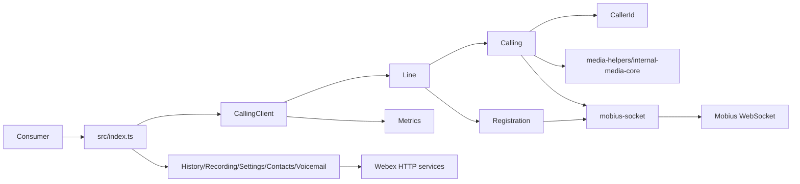
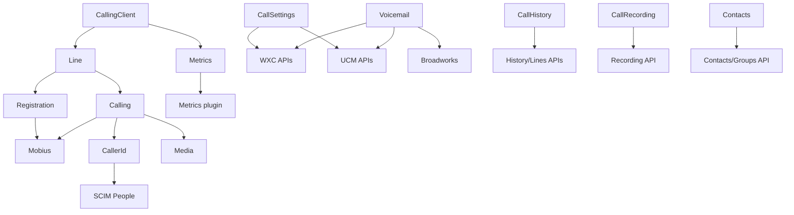

# ARCHITECTURE — @webex/calling

> Package architecture. Start with [AGENTS.md](../AGENTS.md) and [SPEC_INDEX.md](SPEC_INDEX.md); load source-local module specs for detail.

## Design Overview

`@webex/calling` is a published client library whose stable boundary is `src/index.ts`. Factory-created facades expose calling capabilities while backend connectors isolate WXC, UCM, and Broadworks differences. Shared events, errors, logging, metrics, SDK access, and common types keep contracts consistent across modules.

CallingClient owns the coordinated call lifecycle: it creates Lines, Registration manages Mobius reachability, Calling/CallManager owns call and media state, and Mobius socket provides the WebSocket request/event transport. Independent clients cover history, recording, settings, contacts, and voicemail so consumers load only required capabilities.

## Component Inventory & Responsibilities

| Component | Responsibility | Docs |
|---|---|---|
| CallHistory | history records and session events | `src/CallHistory/ai-docs/call-history-spec.md` |
| CallRecording | recording records, metadata, deletion, and events | `src/CallRecording/ai-docs/call-recording-spec.md` |
| CallSettings | backend-specific calling settings | `src/CallSettings/ai-docs/call-settings-spec.md` |
| CallingClient | initialization, lines, network recovery, coordination | `src/CallingClient/ai-docs/calling-client-spec.md` |
| Calling | call/media lifecycle and transfers | `src/CallingClient/calling/ai-docs/calling-spec.md` |
| CallerId | identity resolution and enrichment | `src/CallingClient/calling/CallerId/ai-docs/caller-id-spec.md` |
| Line | line state and call creation | `src/CallingClient/line/ai-docs/line-spec.md` |
| Registration | registration, keepalive, retry, failover/failback | `src/CallingClient/registration/ai-docs/registration-spec.md` |
| Contacts | encrypted contacts/groups and SCIM resolution | `src/Contacts/ai-docs/contacts-spec.md` |
| Metrics | typed telemetry | `src/Metrics/ai-docs/metrics-spec.md` |
| Voicemail | multi-backend voicemail operations | `src/Voicemail/ai-docs/voicemail-spec.md` |
| Mobius socket | WebSocket lifecycle, requests, and async events | `src/mobius-socket/ai-docs/mobius-socket-spec.md` |

## Component Interaction

Consumers enter through exported factories. Facades delegate to source-local implementations, which call Webex services through `webex.request`, browser `fetch`, SDK plugins, Mercury, or Mobius WebSocket depending on the capability.

## Execution & Flow

Initialization and call flow: consumer creates CallingClient → SDKConnector stores the Webex SDK → backend/device/features are resolved → a Line is created → Registration establishes Mobius reachability → CallManager creates a Call → call and ROAP state machines coordinate signaling/media → typed events report progress and errors → teardown removes listeners, timers, media, and collections. Evidence: `src/CallingClient/`, `src/mobius-socket/`, `src/Events/`.

## Dependencies

| Dependency | Type | How used | Failure/version handling |
|---|---|---|---|
| Webex SDK plugins | internal workspace | requests, device, features, metrics | initialized SDK required; errors routed by module |
| Webex HTTP services | external | discovery and capability APIs | typed responses, backend fallbacks, retries where implemented |
| Mobius/Mercury | external platform | signaling and events | reconnect, refresh, dedup, cleanup |
| media helpers/core | package | streams and media connection | package versions in `package.json`; media errors emitted |
| XState/async-mutex/backoff/ws | package | state, exclusion, retry, transport | pinned/ranged versions in `package.json` |

### State Model

- CallingClient retains lines, device/config, listeners, and network-recovery state.
- Line retains registration and active calls; Calling owns call/media state machines.
- Registration retains retry/failover timers and transient local-storage recovery state.
- Contacts, Voicemail, Metrics, and Mobius retain bounded in-memory client/singleton state.

## Cross-Cutting Concerns

- **Security:** Webex tokens remain inside SDK/transport boundaries; contacts may be encrypted; logs must exclude secrets and sensitive call/contact content.
- **Observability:** `src/Logger` provides contextual logs; `src/Metrics` submits typed operational/behavioral telemetry; correlation and call identifiers tie failures to flows.

## Non-Functional Posture

Footprint and compatibility: the package targets Node 18 tooling and browser SDK consumers, publishes ESM/module/type output, preserves semver public exports, and must remain resilient to network flaps, retries, duplicate/late events, and multi-backend capability differences.

## Dependency / Interaction Topology

| From | To | Kind | Purpose |
|---|---|---|---|
| CallingClient | Line/Calling/Registration | call/event | coordinate client lifecycle |
| Calling/Registration | Mobius | call/event | signaling and registration |
| capability clients | Webex services | HTTP | retrieve/update remote resources |
| modules | Metrics | call | submit typed telemetry |

## Object / Data Ownership

| Domain object | Owning component | Read by |
|---|---|---|
| Line and registration state | Line/Registration | CallingClient, consumers through interfaces/events |
| Call and media state | Calling | Line, CallingClient, consumers through `ICall` |
| Caller display state | CallerId | Calling events/consumer UI |
| Contact cache | Contacts | Contacts client callers |
| Voicemail paging/cache state | Voicemail connector | Voicemail client callers |
| WebSocket request/event state | Mobius socket | Calling and Registration |

Remote history, recordings, settings, contacts, and voicemail data remain owned by Webex services.

## Caching Catalog

| Cache | Backend | Contents | TTL | Invalidation |
|---|---|---|---|---|
| Contacts cache | in-memory | resolved contacts/groups | client lifetime | create/delete/fetch refresh |
| Voicemail WXC pagination | in-memory | fetched message pages | client lifetime | list refresh/init |
| Registration failover | browser localStorage | transient server/timer recovery state | retry lifecycle | successful recovery/deregister/cleanup |
| Mobius dedup | in-memory bounded map | recent async event identities | configured bounded lifetime | expiry/reset/disconnect |

## Observability Patterns

- **Logging:** contextual `file` and `method`; levels error/warn/log/info/trace; no tokens or sensitive payloads.
- **Metrics:** typed `METRIC_EVENT` and action enums submitted through MetricManager; failures must not destabilize call control.
- **Audit:** this client does not own a durable audit store; service-side audit behavior is external.

## Infrastructure Matrix

| Category | In use | Notes |
|---|---|---|
| Datastores | none owned | browser localStorage is transient client state |
| Messaging/streaming | Mercury, Mobius WebSocket | inbound events and signaling |
| Platform services | Webex calling, people, recording, voicemail, metrics, device/features | consumed external services |

## Shared / Base Libraries

| Library | Shared capability | Version floor |
|---|---|---|
| `@webex/common` / timers | shared SDK types/utilities/timers | workspace version |
| Webex device/feature/metrics plugins | SDK integration | workspace version |
| `@webex/media-helpers` / media core | media streams and connection | `package.json` |
| `src/Logger`, `src/Events`, `src/Errors`, `src/common` | package-wide contracts | source-local |

## Package Map & Inter-Package Dependencies

- Workspace globs are defined in root `package.json`; `packages/calling` is one published library package.
- Calling depends on workspace common, timers, device, feature, metrics, and media packages; consumers import the package rather than its internal source folders.
- Root workspace releases coordinate internal package compatibility; `@webex/calling` maintains its own package changelog and published output.

## Platform Matrix

| Platform | Shared/per-platform split | Entry/build | Notes |
|---|---|---|---|
| Browser | shared TypeScript plus browser WebSocket/media/localStorage | `src/index.ts`, TypeScript build | primary runtime for calling/media |
| Node/tooling/tests | shared TypeScript with `ws` and test shims | Node 18, Jest | browser-only APIs are guarded/mocked |

## Release & Versioning

- Published as `@webex/calling`; public exports follow semver and require changelog/transition notes for breaking changes.
- Build output is under `dist`; TypeDoc is generated through the package script.

## Cross-Repo Dependency Graph

- **Internal:** workspace Webex SDK/plugin/media packages supply SDK and media contracts.
- **Cross-project:** Webex backend services supply HTTP/WebSocket behavior; their schemas are not owned here.
- **External read-only:** trusted PR/commit history may explain rationale.
- **External services:** discovery, calling, people, history, recording, voicemail, metrics, Mercury, and Mobius.

## Security Architecture

The Webex SDK supplies identity/access tokens to request and socket layers. Browser/app code is outside the trust boundary; SDK inputs, remote payloads, and event data must be treated as untrusted. Contacts encryption protects stored service payloads where implemented. WebSocket authorization is refreshed without logging tokens. Transport security is provided by HTTPS/WSS service endpoints.

## Architecture Reference Links

| Reference | Location | When to read |
|---|---|---|
| Decisions | `adr/` | deliberate changes and rejected alternatives |
| Patterns | `patterns/` | recurring package implementation idioms |
| Rules | `RULES.md` | enforceable constraints |

## WS6 References

No WS6-specific architecture artifact was found in the approved local evidence. Add a link only when an authoritative artifact is provided.
