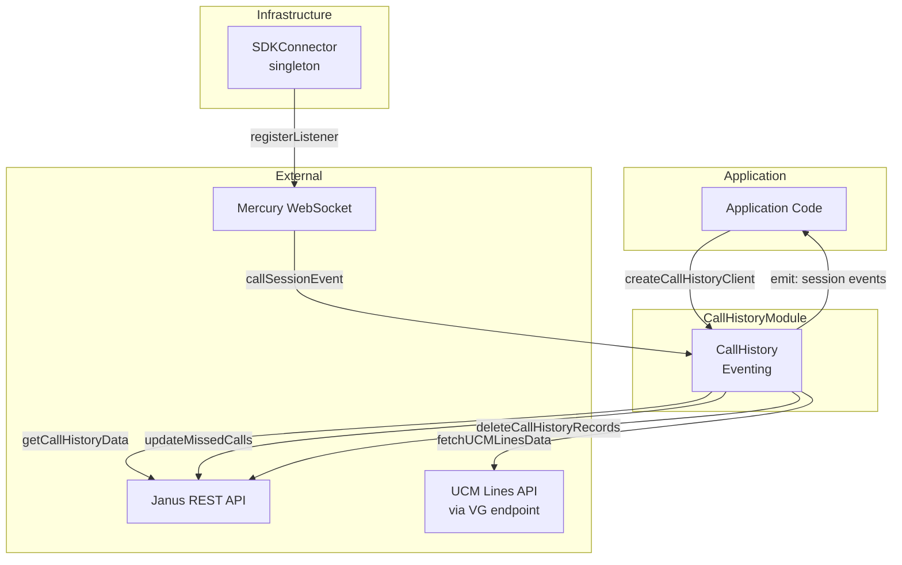
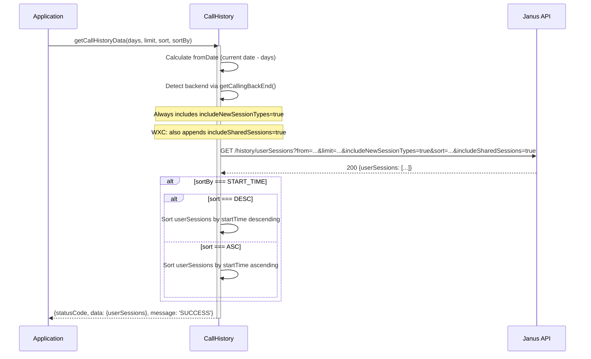
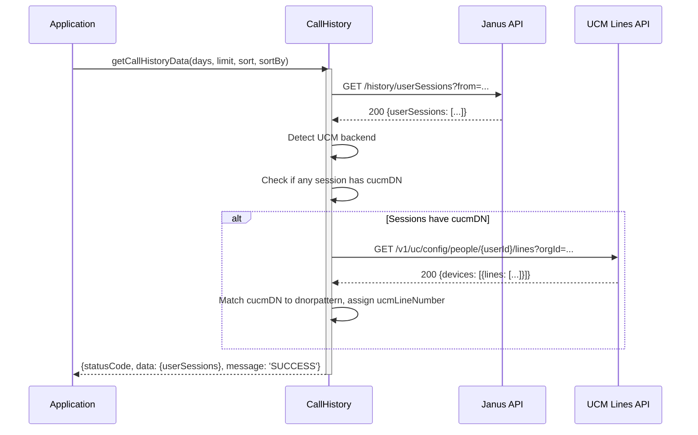
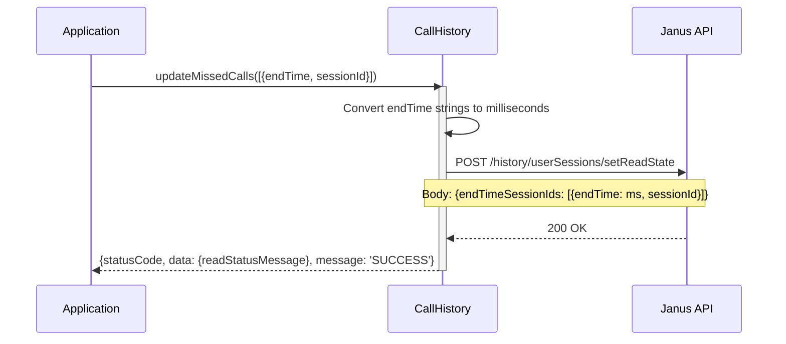
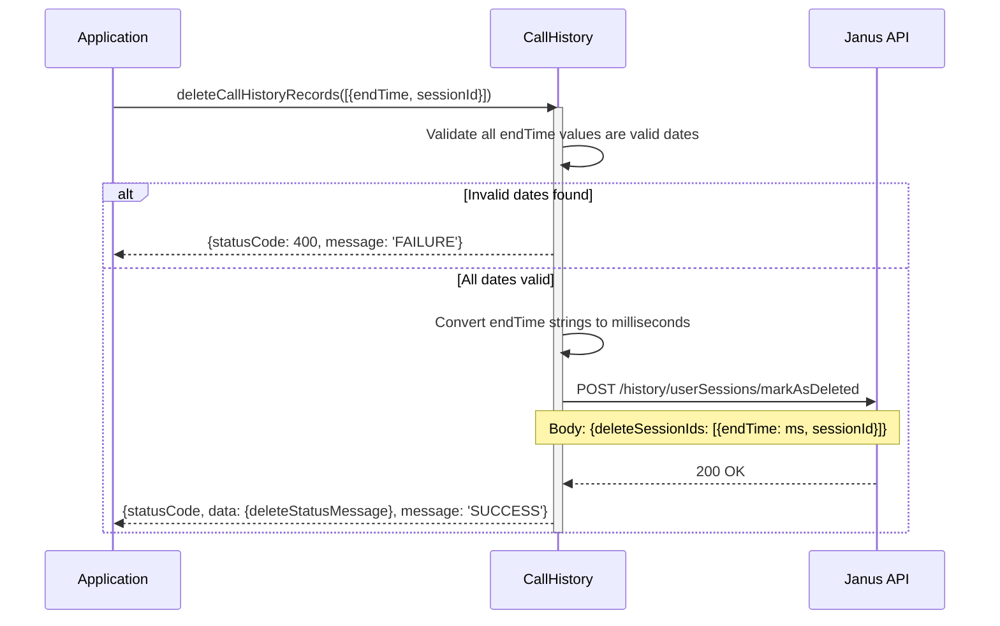
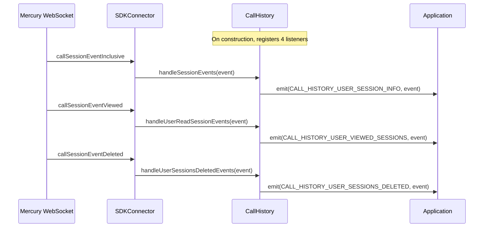

# CallHistory Module — Architecture

## Component Overview

The CallHistory module follows a layered architecture: **Application -> CallHistory -> Janus API / Mercury WebSocket / UCM Lines API**. The `CallHistory` class orchestrates call history retrieval, missed call updates, record deletion, and real-time event forwarding.

### Component Table

| Layer | Component | File | Key Responsibilities |
|-------|-----------|------|---------------------|
| **Orchestrator** | `CallHistory` | `CallHistory.ts` | Call history fetch, missed call updates, record deletion, UCM enrichment, real-time event forwarding |
| **Event System** | `Eventing<CallHistoryEventTypes>` | `Events/impl.ts` | Typed event emission for session events |
| **SDK Bridge** | `SDKConnector` | `SDKConnector/` | Mercury listener registration, Webex SDK access |

### Singletons and Factories

| Component | Access Pattern | Lifecycle |
|-----------|---------------|-----------|
| `CallHistory` | `createCallHistoryClient(webex, logger)` factory | One per application |
| `SDKConnector` | Frozen singleton via `import SDKConnector` | Global, set once via `setWebex()` |

### File Structure

```
CallHistory/
├── CallHistory.ts              # Main class with all public APIs
├── CallHistory.test.ts         # Unit tests
├── types.ts                    # ICallHistory, JanusResponseEvent, response types
├── constants.ts                # Endpoints, defaults, method names
├── callHistoryFixtures.ts      # Test fixtures
└── ai-docs/
    ├── AGENTS.md               # Module agent doc
    └── ARCHITECTURE.md         # This file
```

---

## Data Flows

### Layer Communication Flow



---

## Sequence Diagrams

### 1. Fetching Call History (WXC Backend)



### 2. Fetching Call History with UCM Line Enrichment



### 3. Updating Missed Calls



### 4. Deleting Call History Records



### 5. Real-Time Session Event Handling



---

## Key Constants

### Defaults

| Constant | Value | Description |
|----------|-------|-------------|
| `NUMBER_OF_DAYS` | `10` | Default number of days for call history fetch |
| `LIMIT` | `50` | Default maximum records to fetch |

### API Endpoints

| Constant | Value | Description |
|----------|-------|-------------|
| `FROM_DATE` | `'?from'` | Query string opener + from param (note: includes `?`) |
| `HISTORY` | `'history'` | Janus history path segment |
| `UPDATE_MISSED_CALLS_ENDPOINT` | `'setReadState'` | Endpoint for marking missed calls as read |
| `DELETE_CALL_HISTORY_RECORDS_ENDPOINT` | `'markAsDeleted'` | Endpoint for deleting call history records |
| `VERSION_1` | `'v1'` | UCM Lines API version |
| `UNIFIED_COMMUNICATIONS` | `'uc'` | UCM path segment |
| `CONFIG` | `'config'` | UCM config path segment |
| `PEOPLE` | `'people'` | UCM people path segment |
| `LINES` | `'lines'` | UCM lines path segment |

### HTTP Client Pattern

| Method | Client | Reason |
|--------|--------|--------|
| `getCallHistoryData` | `this.webex.request()` | GET request, SDK handles auth automatically |
| `updateMissedCalls` | Browser `fetch` | POST request with manual `Authorization` header |
| `deleteCallHistoryRecords` | Browser `fetch` | POST request with manual `Authorization` header |
| `fetchUCMLinesData` | `this.webex.request()` | GET request, SDK handles auth automatically |

### Mercury Event Keys

| Event Key | Wire Value | Description |
|-----------|------------|-------------|
| `MOBIUS_EVENT_KEYS.CALL_SESSION_EVENT_INCLUSIVE` | `'event:janus.user_recent_sessions'` | New/updated session events |
| `MOBIUS_EVENT_KEYS.CALL_SESSION_EVENT_LEGACY` | `'event:janus.user_sessions'` | Legacy session events |
| `MOBIUS_EVENT_KEYS.CALL_SESSION_EVENT_VIEWED` | `'event:janus.user_viewed_sessions'` | Session viewed events |
| `MOBIUS_EVENT_KEYS.CALL_SESSION_EVENT_DELETED` | `'event:janus.user_sessions_deleted'` | Session deleted events |

---

## Troubleshooting Guide

### 1. Empty Call History Results

**Symptoms:** `getCallHistoryData` returns empty `userSessions` array

**Possible Causes:**
- `days` parameter too small (no records in date range)
- Janus service URL not resolved
- Invalid or expired Webex token

**Debug Steps:**
```typescript
// Check with larger date range
const response = await callHistory.getCallHistoryData(30, 100);
console.log('Status:', response.statusCode);
console.log('Sessions:', response.data.userSessions?.length);
```

### 2. UCM Line Enrichment Not Working

**Symptoms:** `ucmLineNumber` is undefined on UCM call history records

**Possible Causes:**
- No `cucmDN` in session records
- UCM Lines API returned error (non-fatal, call history still returned)
- `dnorpattern` mismatch between Lines API and session `cucmDN`

**What happens internally:**
UCM enrichment failures are caught separately and do not affect the main call history response. Check logs for `UCM lines fetch or enrich failed` warnings.

### 3. Update Missed Calls Fails

**Symptoms:** `updateMissedCalls` returns error status

**Possible Causes:**
- Invalid `endTime` format (must be valid ISO date string)
- Invalid or missing `sessionId`
- Authentication failure (401)

### 4. Delete Returns 400 Status

**Symptoms:** `deleteCallHistoryRecords` returns `statusCode: 400`

**What happens internally:**
Before making the API call, the module validates all `endTime` values. If any are invalid dates (`isNaN` after `new Date().getTime()`), it returns a 400 immediately with the message "The provided date is malformed or invalid".

### 5. Real-Time Events Not Firing

**Symptoms:** Event listeners on `callHistory:user_recent_sessions` never fire

**Possible Causes:**
- Mercury WebSocket not connected
- SDKConnector not initialized before CallHistory construction
- Events don't contain expected `data.userSessions.userSessions` structure

---

## Related Documentation

- [AGENTS.md](./AGENTS.md) — Overview, examples, public API
