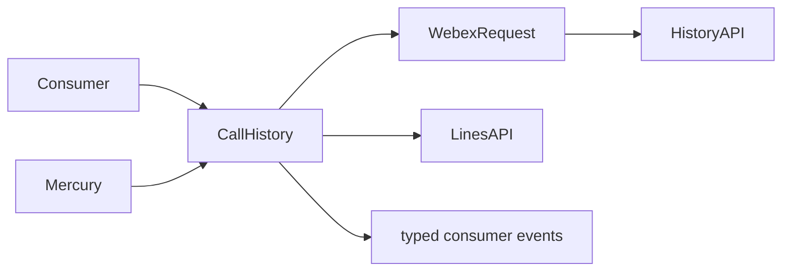
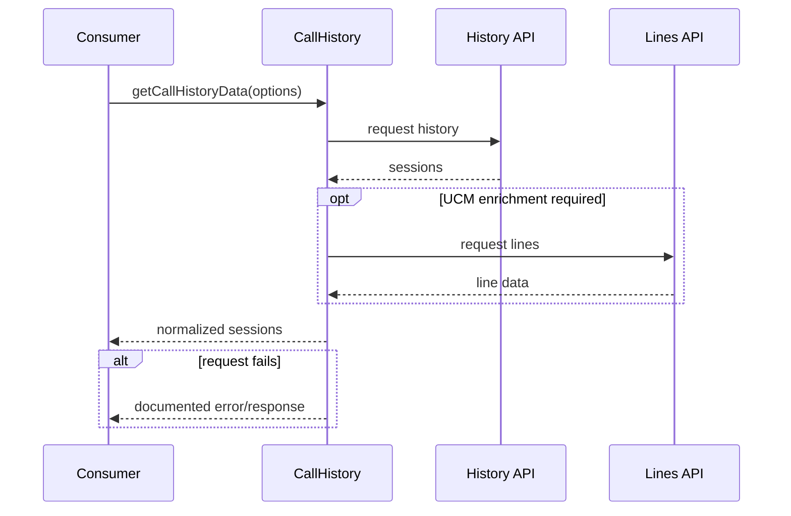
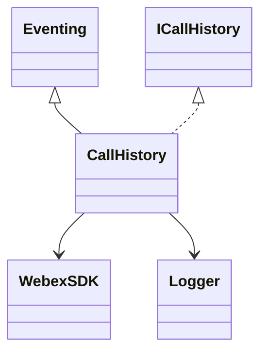

# CallHistory — SPEC

> Canonical module spec. Router: [`SPEC_INDEX.md`](../../../ai-docs/SPEC_INDEX.md) · system: [`ARCHITECTURE.md`](../../../ai-docs/ARCHITECTURE.md).

## Metadata
| Field | Value |
|---|---|
| Module id | `call-history` |
| Source path(s) | `src/CallHistory/` |
| Doc kind | Module spec |
| Coverage score | 100% structural field coverage; `.generated/sdd/coverage-review-2026-07-04.md` |
| Generated from | `module-spec` @ SDLC template library `0.2.0` |
| generated_by / approved_by / updated_at | Codex / repository user / 2026-07-04 |
| Validation status | pass — Claude Code, 2026-07-04, zero Blocking findings |

## Evidence Rules
Claims cite source/test paths. Existing AI docs supply intent and organization; current implementation/tests referee conflicts.

## Source Material Register
| Source doc | Scope | Decision | Detail location or disposition |
|---|---|---|---|
| `src/CallHistory/ai-docs/AGENTS.md` | overview/API/examples | reconciled | Overview, Public Surface, Requirements, Use Cases, dependencies |
| `src/CallHistory/ai-docs/ARCHITECTURE.md` | architecture/flows/troubleshooting | reconciled | Design, Data Flow, sequences, relationships, failures, pitfalls |

## Overview
CallHistory retrieves and mutates Webex call-history records and converts real-time session events into typed consumer events. WXC records come from Janus history APIs; UCM enrichment can join line data before returning sessions.

## Purpose / Responsibility
Own call-history query/update/delete behavior and history session-event normalization; do not own the remote records.

## Stack
TypeScript, Eventing, Webex request client, Jest; built within `@webex/calling`.

## Folder / Package Structure
```text
CallHistory/{CallHistory.ts,types.ts,constants.ts,callHistoryFixtures.ts,CallHistory.test.ts,ai-docs/}
```

## Key Files (source of truth)
| File | Holds |
|---|---|
| `src/CallHistory/CallHistory.ts` | client behavior and event handling |
| `src/CallHistory/types.ts` | public interface and response types |
| `src/CallHistory/constants.ts` | endpoints/defaults/method names |
| `src/Events/types.ts` | event keys and payload contracts |

## Public Surface
| Contract ID | Type | Surface | Purpose | Compatibility | Detail | Root index |
|---|---|---|---|---|---|---|
| calling.history.create | SDK | `createCallHistoryClient` → `ICallHistory` | construct history client | semver public | `src/index.ts`, `src/CallHistory/types.ts` | `ai-docs/CONTRACTS.md` |
| calling.history.events | event | call-session events | notify record/session changes | additive typed events | `src/Events/types.ts` | `ai-docs/CONTRACTS.md` |

## Requires (dependencies)
Initialized Webex SDK/request client, Logger, Eventing, Janus history service, UCM lines service when enrichment applies, and Mercury session events.

## Requirements
| ID | WHAT | WHY | Source Evidence | Test / Example Evidence | Gaps | Confidence |
|---|---|---|---|---|---|---|
| CH-R-001 | Query history with date/limit/sort inputs and return normalized sessions. | Consumers need a stable history view across backend responses. | `src/CallHistory/CallHistory.ts`, `src/CallHistory/types.ts` | `src/CallHistory/CallHistory.test.ts` | none | PRESENT |
| CH-R-002 | Mark missed calls read and delete records through their dedicated endpoints. | Mutations must preserve server status/error semantics. | `src/CallHistory/CallHistory.ts`, `src/CallHistory/constants.ts` | `src/CallHistory/CallHistory.test.ts` | none | PRESENT |
| CH-R-003 | Normalize and emit supported real-time session changes. | Consumers must update history without polling. | `src/CallHistory/CallHistory.ts`, `src/Events/types.ts` | `src/CallHistory/CallHistory.test.ts` | none | PRESENT |

## Design Overview
The client is an Eventing facade over Webex requests. It constructs Janus paths from constants, normalizes responses, optionally enriches UCM sessions with line numbers, and maps Mercury events to typed history events. Mutation methods keep update/delete response semantics separate.

## Data Flow


## Sequence Diagram(s)
Sequence coverage:
| Operation group | Diagram | Failure/recovery coverage |
|---|---|---|
| Query/enrich | Query history | request error and optional enrichment |
| Mutate | Read/delete | non-success response |
| Events | Session event | unsupported/invalid event ignored or handled |


## Class / Component Relationships


## Use Cases
- **UC-1 Fetch history:** consumer supplies query options → client requests records → optional UCM line enrichment → normalized result. Evidence: `src/CallHistory/CallHistory.ts`, `src/CallHistory/CallHistory.test.ts`.
- **UC-2 Maintain history:** consumer marks missed calls read or records deleted → server mutation result is returned.
- **UC-3 Live refresh:** Mercury session change → normalization → typed event emitted.

## State Model
The instance retains Webex/logger references and event listeners; remote history remains service-owned. Session events update consumers rather than a durable local store.

## Business Rules & Invariants
- Date and endpoint formats come from `constants.ts`; do not invent alternate paths.
- UCM enrichment is conditional and must not corrupt base history when line data is missing.

## Concurrency & Reactive Flow
HTTP operations are asynchronous and session events may arrive independently. Event handlers must tolerate late/legacy/viewed/deleted variants without blocking request flows.

## Error Handling & Failure Modes
| Condition | Signal | Caller recovery |
|---|---|---|
| HTTP/auth/bad request | documented status/error response | correct credentials/options and retry appropriately |
| missing UCM line data | history without incorrect enrichment | consume base session data |
| invalid mutation date | invalid-date response | correct input |

## Pitfalls
- History URL/query construction is endpoint-specific.
- Real-time events and fetched records can overlap; consumers should key updates by session identity.
- UCM line matching must remain conditional.

## Module Do's / Don'ts
- DO preserve typed response/event structures and backend enrichment rules.
- DON'T expose fixtures/constants as consumer API merely because they are exported internally.

## Test-Case Strategy (module)
Unit tests cover query construction, sorting/enrichment, mutations, status failures, and session event variants.
| Requirement | Existing test evidence | Gap |
|---|---|---|
| CH-R-001..003 | `src/CallHistory/CallHistory.test.ts` | independent semantic validation pending |

## Traceability
- Architecture: `ai-docs/ARCHITECTURE.md` · contracts: `ai-docs/CONTRACTS.md` · state: `.sdd/manifest.json`

## Reconciled Source Fidelity Appendix

The standard sections above are primary. The quoted snapshots below preserve the complete routed legacy source for fidelity and independent review; their content is mapped by meaning through the Source Material Register.

### Source snapshot: `src/CallHistory/ai-docs/AGENTS.md`

> # CallHistory Module
>
> ## Overview
>
> The `CallHistory` module provides APIs for retrieving, managing, and receiving real-time updates for call history records from backend services. It supports fetching paginated and sorted call history, marking missed calls as read, deleting call history records, and listening for real-time session events via Mercury WebSocket.
>
> For Webex Calling (WXC), call history is fetched from Janus and includes shared session support. For UCM (Unified Communications Manager), call history records can be enriched with line number data from the UCM Lines API.
>
> **Package:** `@webex/calling`
>
> **Entry point:** `packages/calling/src/CallHistory/CallHistory.ts`
>
> **Factory:** `createCallHistoryClient(webex, logger) -> ICallHistory`
>
> ---
>
> ### Key Capabilities
>
> | Capability | Description |
> | ----------- | ----------- |
> | **Fetch Call History** | Retrieves call history records from backend APIs with configurable date range, record limit, and sort order (ASC/DESC). |
> | **Sorting** | Supports sorting by `startTime` or `endTime` in ascending or descending order. Default sort is by `endTime` descending. |
> | **Update Missed Calls** | Marks missed call records as read by posting `endTime` and `sessionId` pairs to the Janus `setReadState` endpoint. |
> | **Delete Call History Records** | Deletes call history records by posting `endTime` and `sessionId` pairs to the Janus `markAsDeleted` endpoint. Validates date formats before submission. |
> | **Real-Time Session Events** | Listens for Mercury WebSocket events (`callSessionEventInclusive`, `callSessionEventLegacy`, `callSessionEventViewed`, `callSessionEventDeleted`) and emits them to the application. |
> | **Error Handling & Logging** | Standardized error handling via `serviceErrorCodeHandler` with automatic log upload on failures. |
>
> ### Backend-Specific Behavior
>
> | Backend | Behavior |
> | ------- | -------- |
> | **WXC** | Adds `includeSharedSessions=true` so shared session types (`WEBEXCALLING_SHARED`) are included in call history queries. |
> | **UCM** | Enriches call history records with `ucmLineNumber` by matching `self.cucmDN` against UCM Lines API (`dnorpattern`). |
>
> ---
>
> ## Public API
>
> ### ICallHistory Interface
>
> The following methods are defined on the `ICallHistory` interface:
>
> | Method | Signature | Description |
> | ------ | --------- | ----------- |
> | `getCallHistoryData` | `(days?: number, limit?: number, sort?: SORT, sortBy?: SORT_BY): Promise<JanusResponseEvent>` | Fetches call history records from Janus |
> | `updateMissedCalls` | `(endTimeSessionIds: EndTimeSessionId[]): Promise<UpdateMissedCallsResponse>` | Marks missed calls as read |
> | `deleteCallHistoryRecords` | `(deleteSessionIds: EndTimeSessionId[]): Promise<DeleteCallHistoryRecordsResponse>` | Deletes call history records |
>
> ### Inherited from Eventing\<CallHistoryEventTypes\>
>
> | Method | Signature | Description |
> | ------ | --------- | ----------- |
> | `on` | `(event, handler)` | Subscribe to an event |
> | `off` | `(event, handler)` | Unsubscribe from an event |
> | `emit` | `(event, data)` | Emit an event |
>
> ### Events Emitted
>
> | Event | Enum Key | Payload | Description |
> | ----- | -------- | ------- | ----------- |
> | `callHistory:user_recent_sessions` | `COMMON_EVENT_KEYS.CALL_HISTORY_USER_SESSION_INFO` | `CallSessionEvent` | New or updated call session received |
> | `callHistory:user_viewed_sessions` | `COMMON_EVENT_KEYS.CALL_HISTORY_USER_VIEWED_SESSIONS` | `CallSessionViewedEvent` | Sessions marked as viewed |
> | `callHistory:user_sessions_deleted` | `COMMON_EVENT_KEYS.CALL_HISTORY_USER_SESSIONS_DELETED` | `CallSessionDeletedEvent` | Sessions deleted |
>
> ### Key Types
>
> | Type | Description |
> | ---- | ----------- |
> | `JanusResponseEvent` | Response containing `statusCode`, `data.userSessions`, and `message` |
> | `UpdateMissedCallsResponse` | Response containing `statusCode`, `data.readStatusMessage`, and `message` |
> | `DeleteCallHistoryRecordsResponse` | Response containing `statusCode`, `data.deleteStatusMessage`, and `message` |
> | `EndTimeSessionId` | Object with `endTime` (string) and `sessionId` (string) |
> | `SORT` | Enum: `ASC = 'ASC'`, `DESC = 'DESC'`, `DEFAULT = 'DESC'` |
> | `SORT_BY` | Enum: `START_TIME = 'startTime'`, `END_TIME = 'endTime'`, `DEFAULT = 'endTime'` |
>
> ### Event Payload Structures
>
> The event payloads have nested structures that must be accessed correctly:
>
> | Event Type | Data Access Path | Inner Type |
> | ---------- | ---------------- | ---------- |
> | `CallSessionEvent` | `event.data.userSessions.userSessions` | `UserSession[]` |
> | `CallSessionViewedEvent` | `event.data.userReadSessions.userReadSessions` | `UserReadSessions[]` |
> | `CallSessionDeletedEvent` | `event.data.deletedSessions` | `string[]` |
>
> ### UserSession Type (key fields for this module)
>
> ```typescript
> type UserSession = {
>   id: string;
>   sessionId: string;
>   disposition: Disposition;
>   startTime: string;
>   endTime: string;
>   durationSeconds: number;
>   direction: string;
>   sessionType: SessionType;
>   self: CallRecordSelf;
>   other: CallRecordListOther;
>   // ... additional fields
> };
>
> type CallRecordSelf = {
>   id: string;
>   name?: string;
>   phoneNumber?: string;
>   cucmDN?: string;        // UCM directory number, used for line enrichment
>   ucmLineNumber?: number; // Populated by UCM line enrichment
> };
> ```
>
> ---
>
> ## Configuration
>
> The `CallHistory` constructor accepts:
>
> | Parameter | Type | Required | Description |
> | --------- | ---- | -------- | ----------- |
> | `webex` | `WebexSDK` | Yes | An initialized Webex SDK instance |
> | `logger` | `LoggerInterface` | Yes | Logger interface with a `level` property |
>
> ### `getCallHistoryData` Parameters
>
> | Parameter | Type | Default | Description |
> | --------- | ---- | ------- | ----------- |
> | `days` | `number` | `10` | Number of days of history to fetch |
> | `limit` | `number` | `50` | Maximum number of records to return |
> | `sort` | `SORT` | `SORT.DEFAULT` | Sort order (ASC/DESC) |
> | `sortBy` | `SORT_BY` | `SORT_BY.DEFAULT` | Sort field (startTime/endTime) |
>
> ---
>
> ## Examples and Use Cases
>
> ### Create a CallHistory Client
>
> ```typescript
> import {createCallHistoryClient} from '@webex/calling';
>
> const callHistory = createCallHistoryClient(webex, {level: 'info'});
> ```
>
> ### Fetch Call History Records
>
> ```typescript
> const response = await callHistory.getCallHistoryData(10, 50, SORT.DESC, SORT_BY.END_TIME);
>
> if (response.statusCode === 200) {
>   const sessions = response.data.userSessions;
>   console.log(`Retrieved ${sessions.length} call records`);
> }
> ```
>
> ### Listen for Real-Time Session Events
>
> ```typescript
> callHistory.on('callHistory:user_recent_sessions', (event) => {
>   console.log('New session event:', event.data.userSessions.userSessions);
> });
>
> callHistory.on('callHistory:user_viewed_sessions', (event) => {
>   console.log('Sessions viewed:', event.data.userReadSessions.userReadSessions);
> });
>
> callHistory.on('callHistory:user_sessions_deleted', (event) => {
>   console.log('Sessions deleted:', event.data.deletedSessions);
> });
> ```
>
> ### Mark Missed Calls as Read
>
> ```typescript
> const endTimeSessionIds = [
>   {endTime: '2024-01-15T10:30:00.000Z', sessionId: 'session-uuid-1'},
>   {endTime: '2024-01-15T11:00:00.000Z', sessionId: 'session-uuid-2'},
> ];
>
> const response = await callHistory.updateMissedCalls(endTimeSessionIds);
>
> if (response.statusCode === 200) {
>   console.log(response.data.readStatusMessage);
> }
> ```
>
> ### Delete Call History Records
>
> ```typescript
> const deleteSessionIds = [
>   {endTime: '2024-01-15T10:30:00.000Z', sessionId: 'session-uuid-1'},
> ];
>
> const response = await callHistory.deleteCallHistoryRecords(deleteSessionIds);
>
> if (response.statusCode === 200) {
>   console.log(response.data.deleteStatusMessage);
> }
> ```
>
> ---
>
> ## Implementation Notes
>
> ### HTTP Client Usage
>
> The module uses **two different HTTP mechanisms** depending on the method:
>
> | Method | HTTP Client | Auth Handling |
> | ------ | ----------- | ------------- |
> | `getCallHistoryData` | `this.webex.request()` (SDK built-in) | Automatic via SDK |
> | `updateMissedCalls` | Browser `fetch` API | Manual `Authorization` header via `this.webex.credentials.getUserToken()` |
> | `deleteCallHistoryRecords` | Browser `fetch` API | Manual `Authorization` header via `this.webex.credentials.getUserToken()` |
>
> When adding new API methods, follow the `fetch`-based pattern (used by `updateMissedCalls`/`deleteCallHistoryRecords`) for POST endpoints and `webex.request` for GET endpoints.
>
> ### Request Body Structures
>
> The POST endpoints use different body key names:
>
> | Endpoint | Body Key | Body Shape |
> | -------- | -------- | ---------- |
> | `setReadState` | `endTimeSessionIds` | `{endTimeSessionIds: [{endTime: number, sessionId: string}]}` |
> | `markAsDeleted` | `deleteSessionIds` | `{deleteSessionIds: [{endTime: number, sessionId: string}]}` |
>
> Note: In both cases, `endTime` is converted from an ISO date string to milliseconds (epoch) before sending.
>
> ### URL Construction
>
> `getCallHistoryData()` builds the request URL in steps:
>
> 1. Base path: `{janusUrl}/history/userSessions`
> 2. Required query params: `from`, `limit`, `includeNewSessionTypes=true`, `sort`
> 3. Conditional query param: `includeSharedSessions=true` (WXC only)
>
> The `FROM_DATE` constant is `'?from'` (includes the `?` query string opener), so the final Janus URL pattern is:
>
> ```
> {janusUrl}/history/userSessions?from={isoDate}&limit={limit}&includeNewSessionTypes=true&sort={sort}[&includeSharedSessions=true]
> ```
>
> Notes:
> - `includeNewSessionTypes=true` is always appended.
> - `includeSharedSessions=true` is appended only for WXC backend.
> - `sortBy` is applied in module logic after fetch (for `startTime`) and is not sent as a URL parameter.
>
> ---
>
> ## Dependencies
>
> ### Runtime Dependencies
>
> | Package | Purpose |
> | ------- | ------- |
> | `webex` (SDK) | HTTP requests to Janus API, Mercury WebSocket event subscription |
>
> ### Internal Dependencies
>
> | Module | Purpose |
> | ------ | ------- |
> | `SDKConnector` | Singleton bridge to Webex SDK, Mercury event listener registration |
> | `Eventing<T>` | Typed event emitter base class |
> | `Logger` | Structured logging with file/method context |
> | `serviceErrorCodeHandler` | Standardized error response formatting |
> | `getVgActionEndpoint` | Resolves VG endpoint for UCM Lines API |
> | `getCallingBackEnd` | Determines the calling backend (WXC, UCM, BWRKS) |
> | `uploadLogs` | Uploads diagnostic logs on error |
>
> ---
>
> ## Related Documentation
>
> - [Architecture](./ARCHITECTURE.md) — Component overview, data flows, sequence diagrams
>

### Source snapshot: `src/CallHistory/ai-docs/ARCHITECTURE.md`

> # CallHistory Module — Architecture
>
> ## Component Overview
>
> The CallHistory module follows a layered architecture: **Application -> CallHistory -> Janus API / Mercury WebSocket / UCM Lines API**. The `CallHistory` class orchestrates call history retrieval, missed call updates, record deletion, and real-time event forwarding.
>
> ### Component Table
>
> | Layer | Component | File | Key Responsibilities |
> |-------|-----------|------|---------------------|
> | **Orchestrator** | `CallHistory` | `CallHistory.ts` | Call history fetch, missed call updates, record deletion, UCM enrichment, real-time event forwarding |
> | **Event System** | `Eventing<CallHistoryEventTypes>` | `Events/impl.ts` | Typed event emission for session events |
> | **SDK Bridge** | `SDKConnector` | `SDKConnector/` | Mercury listener registration, Webex SDK access |
>
> ### Singletons and Factories
>
> | Component | Access Pattern | Lifecycle |
> |-----------|---------------|-----------|
> | `CallHistory` | `createCallHistoryClient(webex, logger)` factory | One per application |
> | `SDKConnector` | Frozen singleton via `import SDKConnector` | Global, set once via `setWebex()` |
>
> ### File Structure
>
> ```
> CallHistory/
> ├── CallHistory.ts              # Main class with all public APIs
> ├── CallHistory.test.ts         # Unit tests
> ├── types.ts                    # ICallHistory, JanusResponseEvent, response types
> ├── constants.ts                # Endpoints, defaults, method names
> ├── callHistoryFixtures.ts      # Test fixtures
> └── ai-docs/
>     ├── AGENTS.md               # Module agent doc
>     └── ARCHITECTURE.md         # This file
> ```
>
> ---
>
> ## Data Flows
>
> ### Layer Communication Flow
>
> ```mermaid
> flowchart TB
>     subgraph Application
>         App[Application Code]
>     end
>
>     subgraph CallHistoryModule
>         CH[CallHistory\nEventing<CallHistoryEventTypes>]
>     end
>
>     subgraph Infrastructure
>         SDK[SDKConnector\nsingleton]
>     end
>
>     subgraph External
>         Janus[Janus REST API]
>         Mercury[Mercury WebSocket]
>         UCMLines[UCM Lines API\nvia VG endpoint]
>     end
>
>     App -->|createCallHistoryClient| CH
>     CH -->|getCallHistoryData| Janus
>     CH -->|updateMissedCalls| Janus
>     CH -->|deleteCallHistoryRecords| Janus
>     CH -->|fetchUCMLinesData| UCMLines
>
>     SDK -->|registerListener| Mercury
>     Mercury -->|callSessionEvent| CH
>     CH -->|emit: session events| App
> ```
>
> ---
>
> ## Sequence Diagrams
>
> ### 1. Fetching Call History (WXC Backend)
>
> ```mermaid
> sequenceDiagram
>     participant App as Application
>     participant CH as CallHistory
>     participant Janus as Janus API
>
>     App->>CH: getCallHistoryData(days, limit, sort, sortBy)
>     activate CH
>     CH->>CH: Calculate fromDate (current date - days)
>     CH->>CH: Detect backend via getCallingBackEnd()
>
>     Note over CH: Always includes includeNewSessionTypes=true
>     Note over CH: WXC: also appends includeSharedSessions=true
>
>     CH->>Janus: GET /history/userSessions?from=...&limit=...&includeNewSessionTypes=true&sort=...&includeSharedSessions=true
>     Janus-->>CH: 200 {userSessions: [...]}
>
>     alt sortBy === START_TIME
>         alt sort === DESC
>             CH->>CH: Sort userSessions by startTime descending
>         else sort === ASC
>             CH->>CH: Sort userSessions by startTime ascending
>         end
>     end
>
>     CH-->>App: {statusCode, data: {userSessions}, message: 'SUCCESS'}
>     deactivate CH
> ```
>
> ### 2. Fetching Call History with UCM Line Enrichment
>
> ```mermaid
> sequenceDiagram
>     participant App as Application
>     participant CH as CallHistory
>     participant Janus as Janus API
>     participant UCM as UCM Lines API
>
>     App->>CH: getCallHistoryData(days, limit, sort, sortBy)
>     activate CH
>     CH->>Janus: GET /history/userSessions?from=...
>     Janus-->>CH: 200 {userSessions: [...]}
>
>     CH->>CH: Detect UCM backend
>     CH->>CH: Check if any session has cucmDN
>
>     alt Sessions have cucmDN
>         CH->>UCM: GET /v1/uc/config/people/{userId}/lines?orgId=...
>         UCM-->>CH: 200 {devices: [{lines: [...]}]}
>         CH->>CH: Match cucmDN to dnorpattern, assign ucmLineNumber
>     end
>
>     CH-->>App: {statusCode, data: {userSessions}, message: 'SUCCESS'}
>     deactivate CH
> ```
>
> ### 3. Updating Missed Calls
>
> ```mermaid
> sequenceDiagram
>     participant App as Application
>     participant CH as CallHistory
>     participant Janus as Janus API
>
>     App->>CH: updateMissedCalls([{endTime, sessionId}])
>     activate CH
>     CH->>CH: Convert endTime strings to milliseconds
>     CH->>Janus: POST /history/userSessions/setReadState
>     Note over CH,Janus: Body: {endTimeSessionIds: [{endTime: ms, sessionId}]}
>     Janus-->>CH: 200 OK
>
>     CH-->>App: {statusCode, data: {readStatusMessage}, message: 'SUCCESS'}
>     deactivate CH
> ```
>
> ### 4. Deleting Call History Records
>
> ```mermaid
> sequenceDiagram
>     participant App as Application
>     participant CH as CallHistory
>     participant Janus as Janus API
>
>     App->>CH: deleteCallHistoryRecords([{endTime, sessionId}])
>     activate CH
>
>     CH->>CH: Validate all endTime values are valid dates
>
>     alt Invalid dates found
>         CH-->>App: {statusCode: 400, message: 'FAILURE'}
>     else All dates valid
>         CH->>CH: Convert endTime strings to milliseconds
>         CH->>Janus: POST /history/userSessions/markAsDeleted
>         Note over CH,Janus: Body: {deleteSessionIds: [{endTime: ms, sessionId}]}
>         Janus-->>CH: 200 OK
>         CH-->>App: {statusCode, data: {deleteStatusMessage}, message: 'SUCCESS'}
>     end
>
>     deactivate CH
> ```
>
> ### 5. Real-Time Session Event Handling
>
> ```mermaid
> sequenceDiagram
>     participant Mercury as Mercury WebSocket
>     participant SDK as SDKConnector
>     participant CH as CallHistory
>     participant App as Application
>
>     Note over CH: On construction, registers 4 listeners
>
>     Mercury->>SDK: callSessionEventInclusive
>     SDK->>CH: handleSessionEvents(event)
>     CH->>App: emit(CALL_HISTORY_USER_SESSION_INFO, event)
>
>     Mercury->>SDK: callSessionEventViewed
>     SDK->>CH: handleUserReadSessionEvents(event)
>     CH->>App: emit(CALL_HISTORY_USER_VIEWED_SESSIONS, event)
>
>     Mercury->>SDK: callSessionEventDeleted
>     SDK->>CH: handleUserSessionsDeletedEvents(event)
>     CH->>App: emit(CALL_HISTORY_USER_SESSIONS_DELETED, event)
> ```
>
> ---
>
> ## Key Constants
>
> ### Defaults
>
> | Constant | Value | Description |
> |----------|-------|-------------|
> | `NUMBER_OF_DAYS` | `10` | Default number of days for call history fetch |
> | `LIMIT` | `50` | Default maximum records to fetch |
>
> ### API Endpoints
>
> | Constant | Value | Description |
> |----------|-------|-------------|
> | `FROM_DATE` | `'?from'` | Query string opener + from param (note: includes `?`) |
> | `HISTORY` | `'history'` | Janus history path segment |
> | `UPDATE_MISSED_CALLS_ENDPOINT` | `'setReadState'` | Endpoint for marking missed calls as read |
> | `DELETE_CALL_HISTORY_RECORDS_ENDPOINT` | `'markAsDeleted'` | Endpoint for deleting call history records |
> | `VERSION_1` | `'v1'` | UCM Lines API version |
> | `UNIFIED_COMMUNICATIONS` | `'uc'` | UCM path segment |
> | `CONFIG` | `'config'` | UCM config path segment |
> | `PEOPLE` | `'people'` | UCM people path segment |
> | `LINES` | `'lines'` | UCM lines path segment |
>
> ### HTTP Client Pattern
>
> | Method | Client | Reason |
> |--------|--------|--------|
> | `getCallHistoryData` | `this.webex.request()` | GET request, SDK handles auth automatically |
> | `updateMissedCalls` | Browser `fetch` | POST request with manual `Authorization` header |
> | `deleteCallHistoryRecords` | Browser `fetch` | POST request with manual `Authorization` header |
> | `fetchUCMLinesData` | `this.webex.request()` | GET request, SDK handles auth automatically |
>
> ### Mercury Event Keys
>
> | Event Key | Wire Value | Description |
> |-----------|------------|-------------|
> | `MOBIUS_EVENT_KEYS.CALL_SESSION_EVENT_INCLUSIVE` | `'event:janus.user_recent_sessions'` | New/updated session events |
> | `MOBIUS_EVENT_KEYS.CALL_SESSION_EVENT_LEGACY` | `'event:janus.user_sessions'` | Legacy session events |
> | `MOBIUS_EVENT_KEYS.CALL_SESSION_EVENT_VIEWED` | `'event:janus.user_viewed_sessions'` | Session viewed events |
> | `MOBIUS_EVENT_KEYS.CALL_SESSION_EVENT_DELETED` | `'event:janus.user_sessions_deleted'` | Session deleted events |
>
> ---
>
> ## Troubleshooting Guide
>
> ### 1. Empty Call History Results
>
> **Symptoms:** `getCallHistoryData` returns empty `userSessions` array
>
> **Possible Causes:**
> - `days` parameter too small (no records in date range)
> - Janus service URL not resolved
> - Invalid or expired Webex token
>
> **Debug Steps:**
> ```typescript
> // Check with larger date range
> const response = await callHistory.getCallHistoryData(30, 100);
> console.log('Status:', response.statusCode);
> console.log('Sessions:', response.data.userSessions?.length);
> ```
>
> ### 2. UCM Line Enrichment Not Working
>
> **Symptoms:** `ucmLineNumber` is undefined on UCM call history records
>
> **Possible Causes:**
> - No `cucmDN` in session records
> - UCM Lines API returned error (non-fatal, call history still returned)
> - `dnorpattern` mismatch between Lines API and session `cucmDN`
>
> **What happens internally:**
> UCM enrichment failures are caught separately and do not affect the main call history response. Check logs for `UCM lines fetch or enrich failed` warnings.
>
> ### 3. Update Missed Calls Fails
>
> **Symptoms:** `updateMissedCalls` returns error status
>
> **Possible Causes:**
> - Invalid `endTime` format (must be valid ISO date string)
> - Invalid or missing `sessionId`
> - Authentication failure (401)
>
> ### 4. Delete Returns 400 Status
>
> **Symptoms:** `deleteCallHistoryRecords` returns `statusCode: 400`
>
> **What happens internally:**
> Before making the API call, the module validates all `endTime` values. If any are invalid dates (`isNaN` after `new Date().getTime()`), it returns a 400 immediately with the message "The provided date is malformed or invalid".
>
> ### 5. Real-Time Events Not Firing
>
> **Symptoms:** Event listeners on `callHistory:user_recent_sessions` never fire
>
> **Possible Causes:**
> - Mercury WebSocket not connected
> - SDKConnector not initialized before CallHistory construction
> - Events don't contain expected `data.userSessions.userSessions` structure
>
> ---
>
> ## Related Documentation
>
> - [AGENTS.md](./AGENTS.md) — Overview, examples, public API
>
