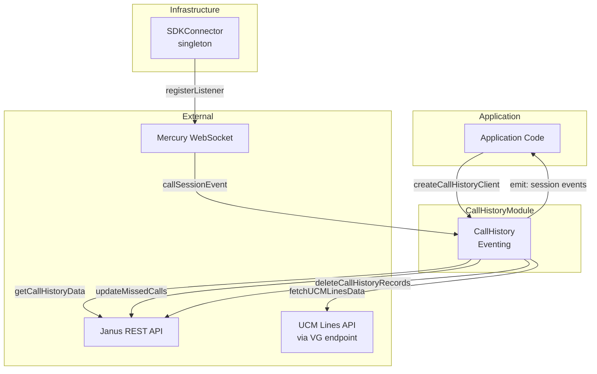
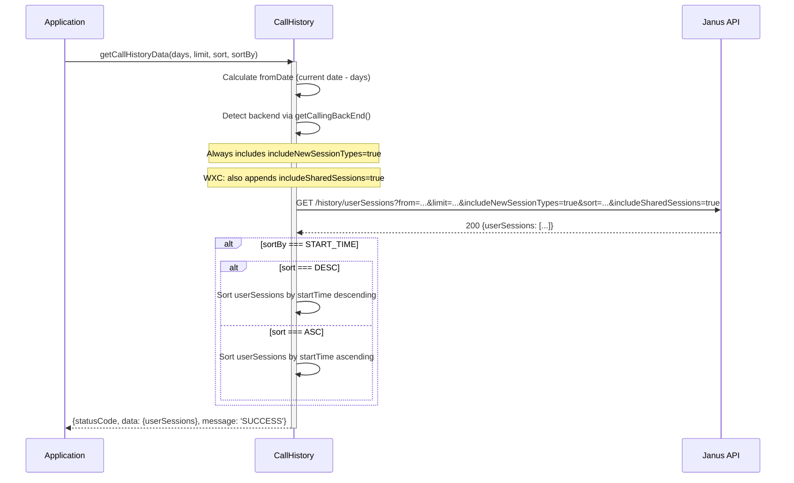
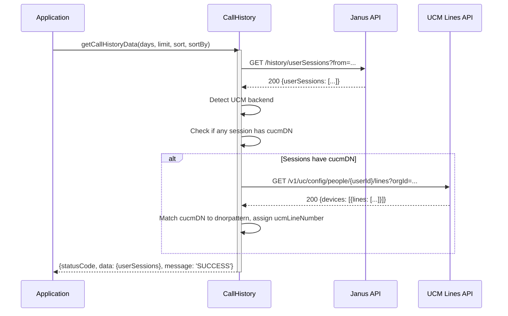
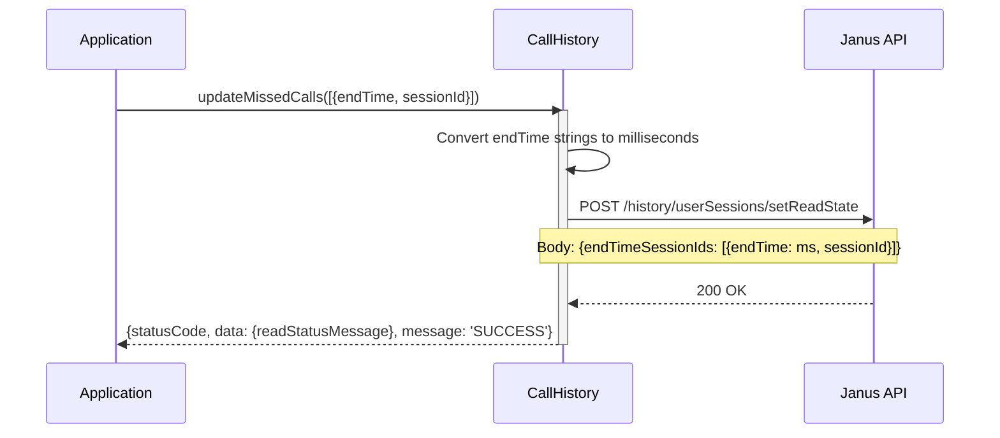
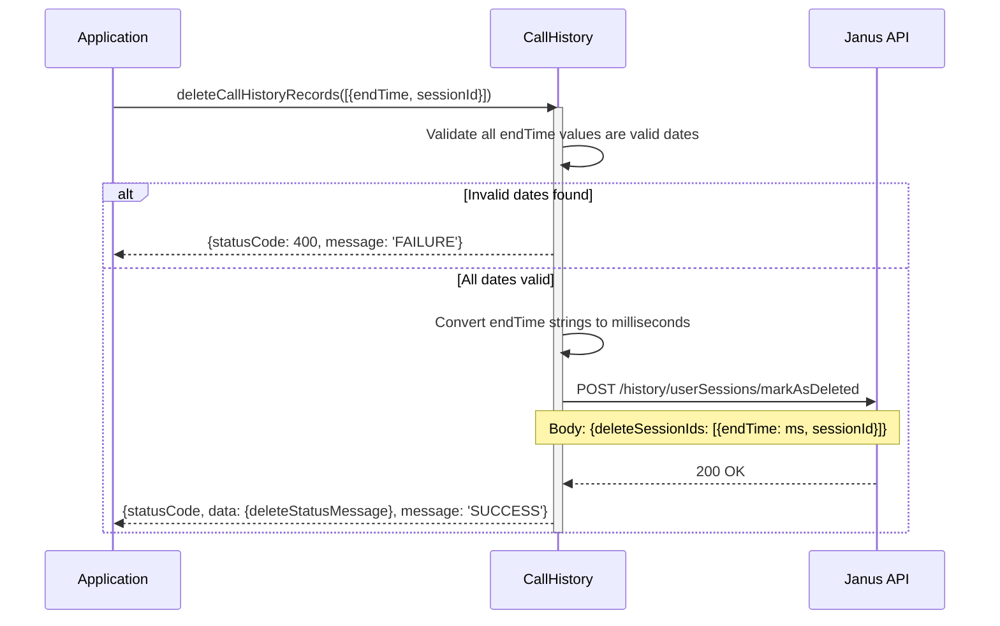
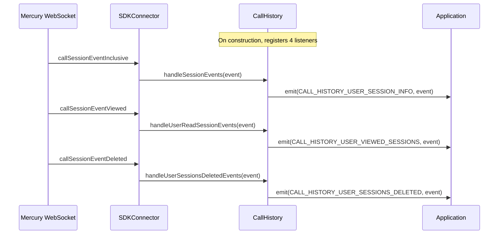
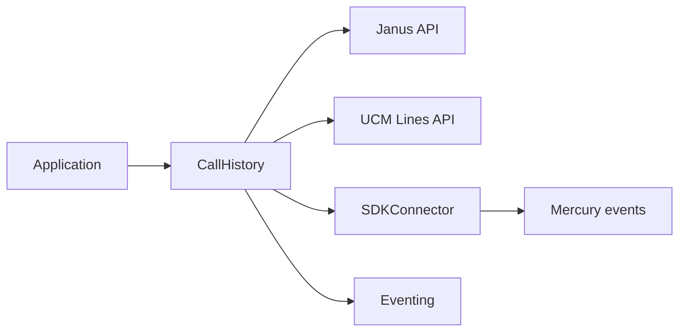

# CallHistory — SPEC

> Start here → root [`AGENTS.md`](../../../AGENTS.md) · router [`SPEC_INDEX.md`](../../../ai-docs/SPEC_INDEX.md) · system [`ARCHITECTURE.md`](../../../ai-docs/ARCHITECTURE.md). This is the canonical module specification.

## Metadata

| Field | Value |
|---|---|
| Module id | `call-history` |
| Source path(s) | `src/CallHistory/` |
| Doc kind | Module spec |
| Coverage score | 100% assessed 2026-07-06; 21/21 mandatory fields PRESENT after validator-directed rationale, sequence, profile, and contract backfill |
| Generated from | `module-spec` @ SDLC template library `0.2.1` |
| generated_by / approved_by / updated_at | Codex / repository user / 2026-07-06 |
| Validation status | pass on 2026-07-06 by `claude-code`; gate OPEN; Pass-with-warnings accepted as successful and advisory warnings waived |

## Evidence Rules

Requirements cite stable implementation and test file paths. Legacy docs are migration sources, not primary behavioral evidence. Commit rationale may be used because the package history was explicitly confirmed trustworthy. No line-number anchors or local run-report paths are canonical evidence.

## Source Material Register

| Source material | Scope | Decision | Detail location or disposition |
|---|---|---|---|
| `src/CallHistory/ai-docs/AGENTS.md` | legacy AI/architecture source | used and code-verified | Content placed by meaning throughout this spec |
| `src/CallHistory/ai-docs/ARCHITECTURE.md` | legacy AI/architecture source | used and code-verified | Content placed by meaning throughout this spec |

## Overview

The `CallHistory` module provides APIs for retrieving, managing, and receiving real-time updates for call history records from backend services. It supports fetching paginated and sorted call history, marking missed calls as read, deleting call history records, and listening for real-time session events via Mercury WebSocket.

For Webex Calling (WXC), call history is fetched from Janus and includes shared session support. For UCM (Unified Communications Manager), call history records can be enriched with line number data from the UCM Lines API.

**Package:** `@webex/calling`

**Entry point:** `packages/calling/src/CallHistory/CallHistory.ts`

**Factory:** `createCallHistoryClient(webex, logger) -> ICallHistory`

## Purpose / Responsibility

CallHistory owns the behavior rooted at `src/CallHistory/` and exposes it through the typed `@webex/calling` package boundary; shared infrastructure remains owned by `Errors`, `Events`, `Logger`, and `common`.

## Stack

TypeScript 4.9 source targeting the `@webex/calling` package, Jest unit tests, Playwright package journeys, Webex SDK workspace dependencies, and module-specific remote transports documented below.

## Folder / Package Structure

```text
src/CallHistory/
├── CallHistory.ts
├── constants.ts
├── types.ts
├── CallHistory.test.ts
```

## Key Files (source of truth)

| File | Holds |
|---|---|
| `src/CallHistory/CallHistory.ts` | Implementation, types, constants, or adapter behavior |
| `src/CallHistory/constants.ts` | Implementation, types, constants, or adapter behavior |
| `src/CallHistory/types.ts` | Implementation, types, constants, or adapter behavior |
| `src/CallHistory/CallHistory.test.ts` | Test/characterization evidence |

### File Structure

```
CallHistory/
├── CallHistory.ts              # Main class with all public APIs
├── CallHistory.test.ts         # Unit tests
├── types.ts                    # ICallHistory, JanusResponseEvent, response types
├── constants.ts                # Endpoints, defaults, method names
├── callHistoryFixtures.ts      # Test fixtures
└── ai-docs/
    ├── AGENTS.md               # Module agent doc
    └── ARCHITECTURE.md         # This file
```

## Public Surface

| Contract ID | Type | Surface | Purpose | Compatibility / deprecation | Schema / detail link | Root index |
|---|---|---|---|---|---|---|
| call-history.surface.1 | SDK / event | createCallHistoryClient(webex, logger) -> ICallHistory | Create a history client and query, mark, delete, or subscribe to the current user's call-session records. | Semver-controlled through `@webex/calling` | `src/index.ts`; `src/CallHistory/CallHistory.ts` | `../../../ai-docs/CONTRACTS.md` |
| call-history.surface.2 | SDK / event | Call-history query/update/delete operations | Create a history client and query, mark, delete, or subscribe to the current user's call-session records. | Semver-controlled through `@webex/calling` | `src/index.ts`; `src/CallHistory/CallHistory.ts` | `../../../ai-docs/CONTRACTS.md` |
| call-history.surface.3 | SDK / event | Typed real-time call-session events | Create a history client and query, mark, delete, or subscribe to the current user's call-session records. | Semver-controlled through `@webex/calling` | `src/index.ts`; `src/CallHistory/CallHistory.ts` | `../../../ai-docs/CONTRACTS.md` |

Compatibility notes:
- Public factories, interfaces, types, and events are semver-controlled through `src/index.ts`; removals or incompatible signature changes require an approved migration and release plan.

### ICallHistory Interface

The following methods are defined on the `ICallHistory` interface:

| Method | Signature | Description |
| ------ | --------- | ----------- |
| `getCallHistoryData` | `(days: number, limit: number, sort: SORT, sortBy: SORT_BY): Promise<JanusResponseEvent>` (interface declaration; implementation supplies defaults when omitted at runtime) | Fetches call history records from Janus |
| `updateMissedCalls` | `(endTimeSessionIds: EndTimeSessionId[]): Promise<UpdateMissedCallsResponse>` | Marks missed calls as read |
| `deleteCallHistoryRecords` | `(deleteSessionIds: EndTimeSessionId[]): Promise<DeleteCallHistoryRecordsResponse>` | Deletes call history records |

### Inherited from Eventing\<CallHistoryEventTypes\>

| Method | Signature | Description |
| ------ | --------- | ----------- |
| `on` | `(event, handler)` | Subscribe to an event |
| `off` | `(event, handler)` | Unsubscribe from an event |
| `emit` | `(event, data)` | Emit an event |

### Events Emitted

| Event | Enum Key | Payload | Description |
| ----- | -------- | ------- | ----------- |
| `callHistory:user_recent_sessions` | `COMMON_EVENT_KEYS.CALL_HISTORY_USER_SESSION_INFO` | `CallSessionEvent` | New or updated call session received |
| `callHistory:user_viewed_sessions` | `COMMON_EVENT_KEYS.CALL_HISTORY_USER_VIEWED_SESSIONS` | `CallSessionViewedEvent` | Sessions marked as viewed |
| `callHistory:user_sessions_deleted` | `COMMON_EVENT_KEYS.CALL_HISTORY_USER_SESSIONS_DELETED` | `CallSessionDeletedEvent` | Sessions deleted |

### Key Types

| Type | Description |
| ---- | ----------- |
| `JanusResponseEvent` | Response containing `statusCode`, `data.userSessions`, and `message` |
| `UpdateMissedCallsResponse` | Response containing `statusCode`, `data.readStatusMessage`, and `message` |
| `DeleteCallHistoryRecordsResponse` | Response containing `statusCode`, `data.deleteStatusMessage`, and `message` |
| `EndTimeSessionId` | Object with `endTime` (string) and `sessionId` (string) |
| `SORT` | Enum: `ASC = 'ASC'`, `DESC = 'DESC'`, `DEFAULT = 'DESC'` |
| `SORT_BY` | Enum: `START_TIME = 'startTime'`, `END_TIME = 'endTime'`, `DEFAULT = 'endTime'` |

### Event Payload Structures

The event payloads have nested structures that must be accessed correctly:

| Event Type | Data Access Path | Inner Type |
| ---------- | ---------------- | ---------- |
| `CallSessionEvent` | `event.data.userSessions.userSessions` | `UserSession[]` |
| `CallSessionViewedEvent` | `event.data.userReadSessions.userReadSessions` | `UserReadSessions[]` |
| `CallSessionDeletedEvent` | `event.data.deletedSessions` | `string[]` |

### UserSession Type (key fields for this module)

```typescript
type UserSession = {
  id: string;
  sessionId: string;
  disposition: Disposition;
  startTime: string;
  endTime: string;
  durationSeconds: number;
  direction: string;
  sessionType: SessionType;
  self: CallRecordSelf;
  other: CallRecordListOther;
  // ... additional fields
};

type CallRecordSelf = {
  id: string;
  name?: string;
  phoneNumber?: string;
  cucmDN?: string;        // UCM directory number, used for line enrichment
  ucmLineNumber?: number; // Populated by UCM line enrichment
};
```

### Configuration

The `CallHistory` constructor accepts:

| Parameter | Type | Required | Description |
| --------- | ---- | -------- | ----------- |
| `webex` | `WebexSDK` | Yes | An initialized Webex SDK instance |
| `logger` | `LoggerInterface` | Yes | Logger interface with a `level` property |

### getCallHistoryData Parameters

| Parameter | Type | Default | Description |
| --------- | ---- | ------- | ----------- |
| `days` | `number` | `10` | Number of days of history to fetch |
| `limit` | `number` | `50` | Maximum number of records to return |
| `sort` | `SORT` | `SORT.DEFAULT` | Sort order (ASC/DESC) |
| `sortBy` | `SORT_BY` | `SORT_BY.DEFAULT` | Sort field (startTime/endTime) |

### Mercury Event Keys

| Event Key | Wire Value | Description |
|-----------|------------|-------------|
| `MOBIUS_EVENT_KEYS.CALL_SESSION_EVENT_INCLUSIVE` | `'event:janus.user_recent_sessions'` | New/updated session events |
| `MOBIUS_EVENT_KEYS.CALL_SESSION_EVENT_LEGACY` | `'event:janus.user_sessions'` | Legacy session events |
| `MOBIUS_EVENT_KEYS.CALL_SESSION_EVENT_VIEWED` | `'event:janus.user_viewed_sessions'` | Session viewed events |
| `MOBIUS_EVENT_KEYS.CALL_SESSION_EVENT_DELETED` | `'event:janus.user_sessions_deleted'` | Session deleted events |

## Requires (dependencies)

- Webex request client and Janus call-history APIs
- Mercury real-time events
- UCM Lines API for line enrichment

### Runtime Dependencies

| Package | Purpose |
| ------- | ------- |
| `webex` (SDK) | HTTP requests to Janus API, Mercury WebSocket event subscription |

### Internal Dependencies

| Module | Purpose |
| ------ | ------- |
| `SDKConnector` | Singleton bridge to Webex SDK, Mercury event listener registration |
| `Eventing<T>` | Typed event emitter base class |
| `Logger` | Structured logging with file/method context |
| `serviceErrorCodeHandler` | Standardized error response formatting |
| `getVgActionEndpoint` | Resolves VG endpoint for UCM Lines API |
| `getCallingBackEnd` | Determines the calling backend (WXC, UCM, BWRKS) |
| `uploadLogs` | Uploads diagnostic logs on error |

## Requirements

| ID | WHAT | WHY | Source Evidence | Test / Example Evidence | Assumptions / Gaps | Confidence |
|---|---|---|---|---|---|---|
| CALLHISTORY-R-001 | Retrieves call history records from backend APIs with configurable date range, record limit, and sort order (ASC/DESC). | A bounded, parameterized query lets consumers request the history window they need without always loading the user's full Janus record set. | `src/CallHistory/CallHistory.ts` | `src/CallHistory/CallHistory.test.ts` | none identified | PRESENT |
| CALLHISTORY-R-002 | Supports sorting by `startTime` or `endTime` in ascending or descending order. Default sort is by `endTime` descending. | A deterministic newest-first default matches the primary recent-calls use case while explicit alternatives keep pagination and presentation ordering predictable. | `src/CallHistory/CallHistory.ts` | `src/CallHistory/CallHistory.test.ts` | none identified | PRESENT |
| CALLHISTORY-R-003 | Marks missed call records as read by posting `endTime` and `sessionId` pairs to the Janus `setReadState` endpoint. | Janus identifies the exact viewed records by the end-time/session-id pair, preventing unrelated missed calls from being marked read. | `src/CallHistory/CallHistory.ts` | `src/CallHistory/CallHistory.test.ts` | none identified | PRESENT |
| CALLHISTORY-R-004 | Deletes call history records by posting `endTime` and `sessionId` pairs to the Janus `markAsDeleted` endpoint. Validates date formats before submission. | Validating and sending the record identity pair prevents malformed dates or ambiguous session identifiers from deleting the wrong history entries. | `src/CallHistory/CallHistory.ts` | `src/CallHistory/CallHistory.test.ts` | none identified | PRESENT |
| CALLHISTORY-R-005 | Listens for Mercury WebSocket events (`callSessionEventInclusive`, `callSessionEventLegacy`, `callSessionEventViewed`, `callSessionEventDeleted`) and emits them to the application. | Forwarding Janus lifecycle events keeps consumer history state current without polling after sessions are created, viewed, or deleted. | `src/CallHistory/CallHistory.ts` | `src/CallHistory/CallHistory.test.ts` | none identified | PRESENT |
| CALLHISTORY-R-006 | Standardized error handling via `serviceErrorCodeHandler` with automatic log upload on failures. | A common error response and diagnostic-upload path gives callers stable failure handling and preserves evidence needed to diagnose remote-service failures. | `src/CallHistory/CallHistory.ts` | `src/CallHistory/CallHistory.test.ts` | none identified | PRESENT |
| CALLHISTORY-R-007 | Adds `includeSharedSessions=true` so shared session types (`WEBEXCALLING_SHARED`) are included in call history queries. | Shared-line sessions must be requested explicitly so users see calls placed or received on shared Webex Calling lines. | `src/CallHistory/CallHistory.ts` | `src/CallHistory/CallHistory.test.ts` | none identified | PRESENT |
| CALLHISTORY-R-008 | Enriches call history records with `ucmLineNumber` by matching `self.cucmDN` against UCM Lines API (`dnorpattern`). | UCM records need line-pattern enrichment so multi-line clients can associate a history entry with the correct provisioned line. | `src/CallHistory/CallHistory.ts` | `src/CallHistory/CallHistory.test.ts` | none identified | PRESENT |
| CALLHISTORY-R-009 | Backend behavior remains explicit: WXC includes shared sessions; UCM enriches records with matching line numbers. | Keeping backend differences explicit prevents WXC shared-session behavior from being confused with UCM line-enrichment behavior. | `src/CallHistory/CallHistory.ts` | `src/CallHistory/CallHistory.test.ts` | none identified | PRESENT |

### Key Capabilities

| Capability | Description |
| ----------- | ----------- |
| **Fetch Call History** | Retrieves call history records from backend APIs with configurable date range, record limit, and sort order (ASC/DESC). |
| **Sorting** | Supports sorting by `startTime` or `endTime` in ascending or descending order. Default sort is by `endTime` descending. |
| **Update Missed Calls** | Marks missed call records as read by posting `endTime` and `sessionId` pairs to the Janus `setReadState` endpoint. |
| **Delete Call History Records** | Deletes call history records by posting `endTime` and `sessionId` pairs to the Janus `markAsDeleted` endpoint. Validates date formats before submission. |
| **Real-Time Session Events** | Listens for Mercury WebSocket events (`callSessionEventInclusive`, `callSessionEventLegacy`, `callSessionEventViewed`, `callSessionEventDeleted`) and emits them to the application. |
| **Error Handling & Logging** | Standardized error handling via `serviceErrorCodeHandler` with automatic log upload on failures. |

### Backend-Specific Behavior

| Backend | Behavior |
| ------- | -------- |
| **WXC** | Adds `includeSharedSessions=true` so shared session types (`WEBEXCALLING_SHARED`) are included in call history queries. |
| **UCM** | Enriches call history records with `ucmLineNumber` by matching `self.cucmDN` against UCM Lines API (`dnorpattern`). |

## Design Overview

### CallHistory Module

> Canonical SDD target: [`src/CallHistory/ai-docs/call-history-spec.md`](call-history-spec.md). This legacy document is retained as migration source; use the canonical target for current lifecycle work.

### HTTP Client Usage

The module uses **two different HTTP mechanisms** depending on the method:

| Method | HTTP Client | Auth Handling |
| ------ | ----------- | ------------- |
| `getCallHistoryData` | `this.webex.request()` (SDK built-in) | Automatic via SDK |
| `updateMissedCalls` | Browser `fetch` API | Manual `Authorization` header via `this.webex.credentials.getUserToken()` |
| `deleteCallHistoryRecords` | Browser `fetch` API | Manual `Authorization` header via `this.webex.credentials.getUserToken()` |

When adding new API methods, follow the `fetch`-based pattern (used by `updateMissedCalls`/`deleteCallHistoryRecords`) for POST endpoints and `webex.request` for GET endpoints.

### URL Construction

`getCallHistoryData()` builds the request URL in steps:

1. Base path: `{janusUrl}/history/userSessions`
2. Required query params: `from`, `limit`, `includeNewSessionTypes=true`, `sort`
3. Conditional query param: `includeSharedSessions=true` (WXC only)

The `FROM_DATE` constant is `'?from'` (includes the `?` query string opener), so the final Janus URL pattern is:

```
{janusUrl}/history/userSessions?from={isoDate}&limit={limit}&includeNewSessionTypes=true&sort={sort}[&includeSharedSessions=true]
```

Notes:
- `includeNewSessionTypes=true` is always appended.
- `includeSharedSessions=true` is appended only for WXC backend.
- `sortBy` is applied in module logic after fetch (for `startTime`) and is not sent as a URL parameter.

### CallHistory Module — Architecture

> Canonical SDD target: [`src/CallHistory/ai-docs/call-history-spec.md`](call-history-spec.md). This legacy document is retained as migration source; use the canonical target for current lifecycle work.

### Singletons and Factories

| Component | Access Pattern | Lifecycle |
|-----------|---------------|-----------|
| `CallHistory` | `createCallHistoryClient(webex, logger)` factory | One per application |
| `SDKConnector` | Frozen singleton via `import SDKConnector` | Global, set once via `setWebex()` |

### Defaults

| Constant | Value | Description |
|----------|-------|-------------|
| `NUMBER_OF_DAYS` | `10` | Default number of days for call history fetch |
| `LIMIT` | `50` | Default maximum records to fetch |

### HTTP Client Pattern

| Method | Client | Reason |
|--------|--------|--------|
| `getCallHistoryData` | `this.webex.request()` | GET request, SDK handles auth automatically |
| `updateMissedCalls` | Browser `fetch` | POST request with manual `Authorization` header |
| `deleteCallHistoryRecords` | Browser `fetch` | POST request with manual `Authorization` header |
| `fetchUCMLinesData` | `this.webex.request()` | GET request, SDK handles auth automatically |

## Data Flow

### Layer Communication Flow



## Sequence Diagram(s)

Sequence coverage:

| Operation group | Diagram / coverage | Failure / recovery coverage |
|---|---|---|
| Construct and fetch WXC history | 1. Fetching Call History | Service errors return the normalized failure response |
| Fetch and enrich UCM history | 2. Fetching Call History with UCM Line Enrichment | Lines failure returns the original history response |
| Mark missed calls / delete records | 3–4. Mutation diagrams | Invalid dates/auth/service failures are surfaced |
| Consume real-time session events | 5. Real-Time Session Event Handling | Malformed or absent payloads are not retyped |

### 1. Fetching Call History (WXC Backend)



### 2. Fetching Call History with UCM Line Enrichment



### 3. Updating Missed Calls



### 4. Deleting Call History Records



### 5. Real-Time Session Event Handling



## Class / Component Relationships



### Component Overview

The CallHistory module follows a layered architecture: **Application -> CallHistory -> Janus API / Mercury WebSocket / UCM Lines API**. The `CallHistory` class orchestrates call history retrieval, missed call updates, record deletion, and real-time event forwarding.

### Component Table

| Layer | Component | File | Key Responsibilities |
|-------|-----------|------|---------------------|
| **Orchestrator** | `CallHistory` | `CallHistory.ts` | Call history fetch, missed call updates, record deletion, UCM enrichment, real-time event forwarding |
| **Event System** | `Eventing<CallHistoryEventTypes>` | `Events/impl.ts` | Typed event emission for session events |
| **SDK Bridge** | `SDKConnector` | `SDKConnector/` | Mercury listener registration, Webex SDK access |

## Use Cases

### Create a CallHistory Client

```typescript
import {createCallHistoryClient} from '@webex/calling';

const callHistory = createCallHistoryClient(webex, {level: 'info'});
```

### Fetch Call History Records

```typescript
const response = await callHistory.getCallHistoryData(10, 50, SORT.DESC, SORT_BY.END_TIME);

if (response.statusCode === 200) {
  const sessions = response.data.userSessions;
  console.log(`Retrieved ${sessions.length} call records`);
}
```

### Listen for Real-Time Session Events

```typescript
callHistory.on('callHistory:user_recent_sessions', (event) => {
  console.log('New session event:', event.data.userSessions.userSessions);
});

callHistory.on('callHistory:user_viewed_sessions', (event) => {
  console.log('Sessions viewed:', event.data.userReadSessions.userReadSessions);
});

callHistory.on('callHistory:user_sessions_deleted', (event) => {
  console.log('Sessions deleted:', event.data.deletedSessions);
});
```

### Mark Missed Calls as Read

```typescript
const endTimeSessionIds = [
  {endTime: '2024-01-15T10:30:00.000Z', sessionId: 'session-uuid-1'},
  {endTime: '2024-01-15T11:00:00.000Z', sessionId: 'session-uuid-2'},
];

const response = await callHistory.updateMissedCalls(endTimeSessionIds);

if (response.statusCode === 200) {
  console.log(response.data.readStatusMessage);
}
```

### Delete Call History Records

```typescript
const deleteSessionIds = [
  {endTime: '2024-01-15T10:30:00.000Z', sessionId: 'session-uuid-1'},
];

const response = await callHistory.deleteCallHistoryRecords(deleteSessionIds);

if (response.statusCode === 200) {
  console.log(response.data.deleteStatusMessage);
}
```

## State Model

`CallHistory` owns the initialized backend connector, Janus/Mercury listener registrations, and per-request UCM enrichment data. It does not persist history; Janus remains authoritative. Listener callbacks emit typed session changes, while UCM enrichment mutates only the response objects returned for that fetch. Evidence: `src/CallHistory/CallHistory.ts`.

## Business Rules & Invariants

- Query defaults remain 10 days, 50 records, `endTime`, descending unless the caller supplies alternatives.
- Missed-call and delete mutations require valid `endTime`/`sessionId` pairs.
- WXC queries include shared sessions; UCM results are enriched by matching `self.cucmDN` to line `dnorpattern`.
- Mercury events retain their typed payload and event-key mapping. Evidence: `src/CallHistory/CallHistory.ts`, `src/CallHistory/CallHistory.test.ts`.

## Concurrency & Reactive Flow

HTTP requests and Mercury callbacks can complete independently. Each event is forwarded as received; UCM line lookup is awaited only for the fetch being enriched and a line-service failure falls back to the original history response rather than discarding it. Evidence: `src/CallHistory/CallHistory.ts`.

## Protocol / Wire Format

### Request Body Structures

The POST endpoints use different body key names:

| Endpoint | Body Key | Body Shape |
| -------- | -------- | ---------- |
| `setReadState` | `endTimeSessionIds` | `{endTimeSessionIds: [{endTime: number, sessionId: string}]}` |
| `markAsDeleted` | `deleteSessionIds` | `{deleteSessionIds: [{endTime: number, sessionId: string}]}` |

Note: In both cases, `endTime` is converted from an ISO date string to milliseconds (epoch) before sending.

### API Endpoints

| Constant | Value | Description |
|----------|-------|-------------|
| `FROM_DATE` | `'?from'` | Query string opener + from param (note: includes `?`) |
| `HISTORY` | `'history'` | Janus history path segment |
| `UPDATE_MISSED_CALLS_ENDPOINT` | `'setReadState'` | Endpoint for marking missed calls as read |
| `DELETE_CALL_HISTORY_RECORDS_ENDPOINT` | `'markAsDeleted'` | Endpoint for deleting call history records |
| `VERSION_1` | `'v1'` | UCM Lines API version |
| `UNIFIED_COMMUNICATIONS` | `'uc'` | UCM path segment |
| `CONFIG` | `'config'` | UCM config path segment |
| `PEOPLE` | `'people'` | UCM people path segment |
| `LINES` | `'lines'` | UCM lines path segment |

## Error Handling & Failure Modes

| Condition | Signal | Caller recovery |
|---|---|---|
| Invalid input or lifecycle state | Typed error or rejected promise from `src/CallHistory/CallHistory.ts` | Correct input/state; do not retry blindly |
| Remote or transport failure | Module error/event | Apply the module's documented retry/fallback; otherwise surface to the consumer |
| Cleanup after failure | Final event or rejected operation | Release listeners/timers and recreate only through the public factory |

## Pitfalls

### 1. Empty Call History Results

**Symptoms:** `getCallHistoryData` returns empty `userSessions` array

**Possible Causes:**
- `days` parameter too small (no records in date range)
- Janus service URL not resolved
- Invalid or expired Webex token

**Debug Steps:**
```typescript
// Check with larger date range
const response = await callHistory.getCallHistoryData(30, 100);
console.log('Status:', response.statusCode);
console.log('Sessions:', response.data.userSessions?.length);
```

### 2. UCM Line Enrichment Not Working

**Symptoms:** `ucmLineNumber` is undefined on UCM call history records

**Possible Causes:**
- No `cucmDN` in session records
- UCM Lines API returned error (non-fatal, call history still returned)
- `dnorpattern` mismatch between Lines API and session `cucmDN`

**What happens internally:**
UCM enrichment failures are caught separately and do not affect the main call history response. Check logs for `UCM lines fetch or enrich failed` warnings.

### 3. Update Missed Calls Fails

**Symptoms:** `updateMissedCalls` returns error status

**Possible Causes:**
- Invalid `endTime` format (must be valid ISO date string)
- Invalid or missing `sessionId`
- Authentication failure (401)

### 4. Delete Returns 400 Status

**Symptoms:** `deleteCallHistoryRecords` returns `statusCode: 400`

**What happens internally:**
Before making the API call, the module validates all `endTime` values. If any are invalid dates (`isNaN` after `new Date().getTime()`), it returns a 400 immediately with the message "The provided date is malformed or invalid".

### 5. Real-Time Events Not Firing

**Symptoms:** Event listeners on `callHistory:user_recent_sessions` never fire

**Possible Causes:**
- Mercury WebSocket not connected
- SDKConnector not initialized before CallHistory construction
- Events don't contain expected `data.userSessions.userSessions` structure

## Module Do's / Don'ts

- DO use the factories, typed events, constants, and adapters already owned by `src/CallHistory/`.
- DON'T add direct network or SDK access when the module already provides an adapter.

## Key Design Trade-off

CallHistory enriches UCM records client-side instead of changing the Janus contract. This adds one optional Lines lookup but preserves the common Janus response and, on a Lines 404/failure, still returns the original history data. Evidence: `src/CallHistory/CallHistory.ts`, `src/CallHistory/CallHistory.test.ts`; rationale reinforced by `commit:46a85352c8`.

## Test-Case Strategy (module)

Unit tests are co-located under `src/CallHistory/` and exercise positive, negative, error, retry, and cleanup behavior as applicable. Package journeys under `playwright/` cover cross-module flows.

| Behavior / Requirement | Existing test evidence | Gap |
|---|---|---|
| CALLHISTORY-R-001 | `src/CallHistory/CallHistory.test.ts` | Re-check negative/error edge coverage during independent validation |
| CALLHISTORY-R-002 | `src/CallHistory/CallHistory.test.ts` | Re-check negative/error edge coverage during independent validation |
| CALLHISTORY-R-003 | `src/CallHistory/CallHistory.test.ts` | Re-check negative/error edge coverage during independent validation |
| CALLHISTORY-R-004 | `src/CallHistory/CallHistory.test.ts` | Re-check negative/error edge coverage during independent validation |
| CALLHISTORY-R-005 | `src/CallHistory/CallHistory.test.ts` | Re-check negative/error edge coverage during independent validation |
| CALLHISTORY-R-006 | `src/CallHistory/CallHistory.test.ts` | Re-check negative/error edge coverage during independent validation |
| CALLHISTORY-R-007 | `src/CallHistory/CallHistory.test.ts` | Re-check negative/error edge coverage during independent validation |
| CALLHISTORY-R-008 | `src/CallHistory/CallHistory.test.ts` | Re-check negative/error edge coverage during independent validation |
| CALLHISTORY-R-009 | Backend behavior remains explicit: WXC includes shared sessions; UCM enriches records with matching line numbers. | Keeping backend differences explicit prevents WXC shared-session behavior from being confused with UCM line-enrichment behavior. | `src/CallHistory/CallHistory.ts` | `src/CallHistory/CallHistory.test.ts` | none identified | PRESENT |

## Traceability

- Repo architecture: [`ARCHITECTURE.md`](../../../ai-docs/ARCHITECTURE.md) · Registry: [`SPEC_INDEX.md`](../../../ai-docs/SPEC_INDEX.md)
- Contracts catalog: [`CONTRACTS.md`](../../../ai-docs/CONTRACTS.md) · Manifest: `../../../.sdd/manifest.json`
- Source material retained at `src/CallHistory/ai-docs/AGENTS.md`; canonical behavior is this spec plus current code/tests.
- Source material retained at `src/CallHistory/ai-docs/ARCHITECTURE.md`; canonical behavior is this spec plus current code/tests.

### Related Documentation

- [Architecture](./ARCHITECTURE.md) — Component overview, data flows, sequence diagrams

### CallHistory Module — Architecture / Related Documentation

- [AGENTS.md](./AGENTS.md) — Overview, examples, public API
