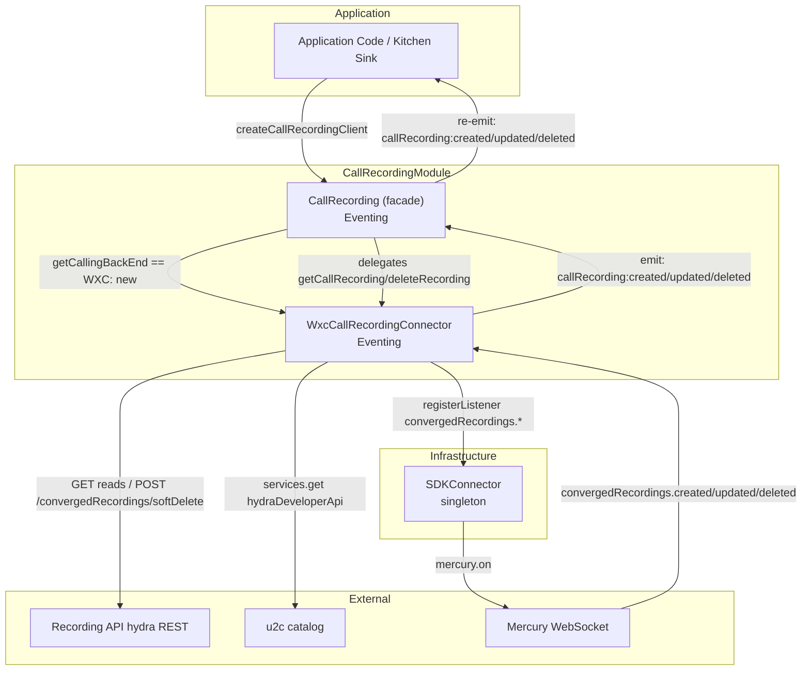
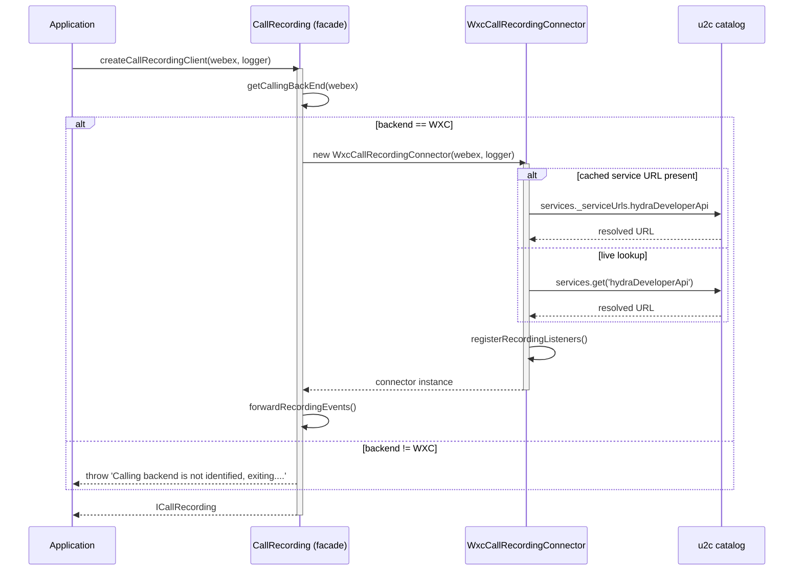
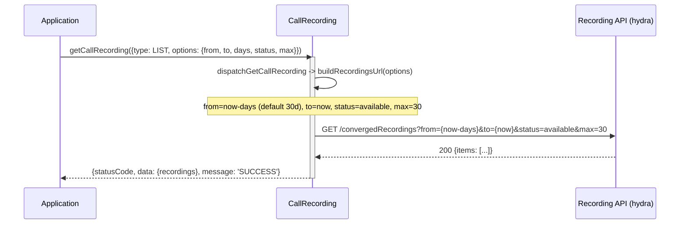
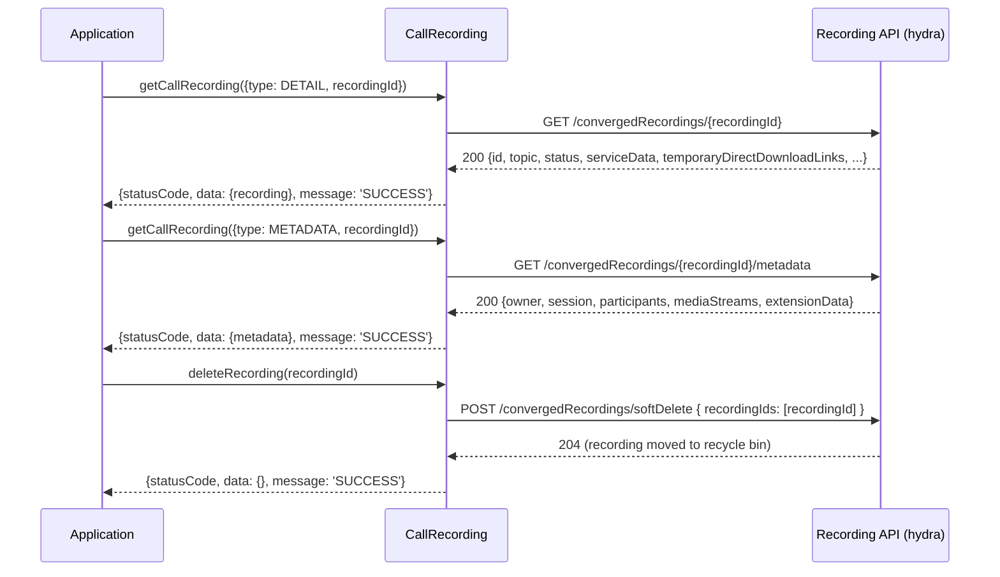
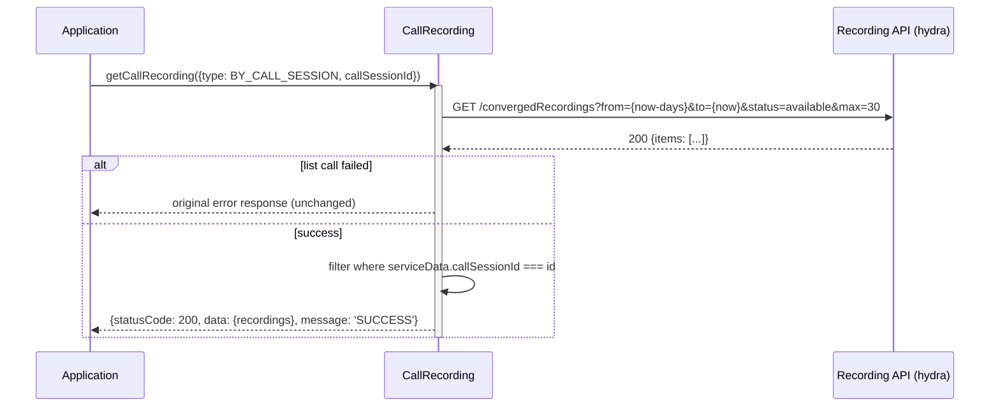
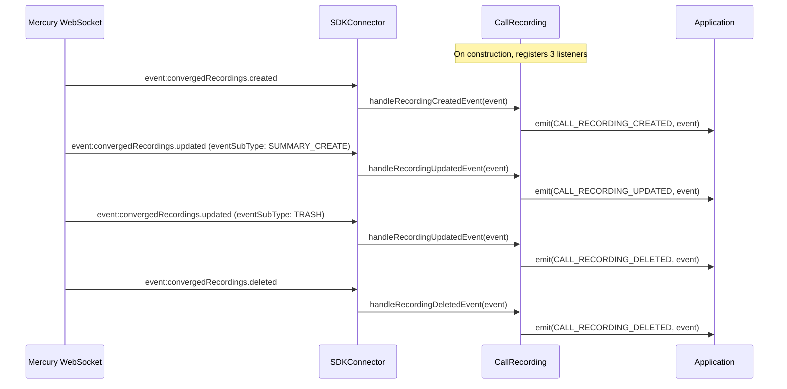

# CallRecording Module — Architecture

## Component Overview

The CallRecording module follows a layered architecture:
**Application → CallRecording (facade) → WxcCallRecordingConnector → Recording API (hydra) REST / Mercury WebSocket**.

The module uses the same **backend-connector (strategy) pattern** as Voicemail. `CallRecording` is a
thin, backend-agnostic facade that resolves the calling backend (`getCallingBackEnd`) and selects a
backend-specific connector. Today only the Webex Calling (WXC) backend is supported — Post Call
Recording (`convergedRecordings`) is a Webex Calling cloud capability — so the facade instantiates
`WxcCallRecordingConnector` for WXC and throws for any other backend (BWRKS/UCM/INVALID). The facade
delegates all read/delete operations to the active connector and re-emits the connector's recording
lifecycle events. Adding another backend later is a drop-in new connector + a `case` in the facade,
with no consumer-facing changes.

The `WxcCallRecordingConnector` owns everything backend-specific: it resolves its base URL directly
from the u2c service catalog and subscribes to `convergedRecordings.*` Mercury events through the
`SDKConnector` (no dedicated recording plugin dependency).

### Component Table

| Layer | Component | File | Key Responsibilities |
|-------|-----------|------|---------------------|
| **Facade** | `CallRecording` | `CallRecording.ts` | Backend selection (WXC-only today, else throw), delegates read/delete, re-emits connector events |
| **WXC Connector** | `WxcCallRecordingConnector` | `WxcCallRecordingConnector.ts` | URL resolution, list/get/metadata/delete, call-session filtering, `convergedRecordings.*` Mercury subscription + emit |
| **Event System** | `Eventing<CallRecordingEventTypes>` | `Events/impl/index.ts` | Typed event emission for recording events |
| **SDK Bridge** | `SDKConnector` | `SDKConnector/` | Mercury listener registration, Webex SDK access |

### Singletons and Factories

| Component | Access Pattern | Lifecycle |
|-----------|---------------|-----------|
| `CallRecording` | `createCallRecordingClient(webex, logger)` factory | One per application |
| `WxcCallRecordingConnector` | Instantiated internally by the facade for the WXC backend | One per facade |
| `SDKConnector` | Frozen singleton via `import SDKConnector` | Global, set once via `setWebex()` |

### File Structure

```
CallRecording/
├── CallRecording.ts                    # Backend-agnostic facade (selection + delegation + event forwarding)
├── CallRecording.test.ts               # Facade tests (gating, delegation, event forwarding)
├── WxcCallRecordingConnector.ts        # Webex Calling (WXC) backend connector (REST + Mercury)
├── WxcCallRecordingConnector.test.ts   # Connector tests (REST, URL resolution, Mercury events)
├── types.ts                            # ICallRecording, Recording, RecordingMetadata, response types
├── constants.ts                        # Endpoints, query keys, method names
├── callRecordingFixtures.ts            # Test fixtures
└── ai-docs/
    ├── AGENTS.md                       # Module agent doc
    └── ARCHITECTURE.md                 # This file
```

---

## Data Flows

### Layer Communication Flow



---

## Sequence Diagrams

### 1. Client Construction & URL Resolution



### 2. Listing Recordings



### 3. Get Recording / Metadata



### 4. Get Recordings by Call Session Id (client-side filter)



### 5. Real-Time Recording Event Handling

> **Note:** The backend expresses the full lifecycle through `convergedRecordings.updated` qualified
> by `eventSubType` (verified in production: a delete arrives as `updated` + `TRASH`, not
> `deleted`). `handleRecordingUpdatedEvent` routes by `eventSubType`: `TRASH`/`PURGE` →
> `CALL_RECORDING_DELETED`, `RESTORE` → `CALL_RECORDING_CREATED`, `SUMMARY_CREATE`/other →
> `CALL_RECORDING_UPDATED`. The full event (incl. `eventSubType`) is always forwarded.



---

## Key Constants

### API Endpoints (`CallRecording/constants.ts`)

| Constant | Value | Description |
|----------|-------|-------------|
| `CONVERGED_RECORDINGS` | `'convergedRecordings'` | Recording API recordings collection segment |
| `METADATA` | `'metadata'` | Metadata sub-resource segment |

### Query Parameter Keys

| Constant | Value | Default |
|----------|-------|---------|
| `FROM` | `'from'` | `now - DEFAULT_NUMBER_OF_DAYS` |
| `TO` | `'to'` | `now` |
| `DEFAULT_NUMBER_OF_DAYS` | `30` | Lookback to derive `from` (API max window is 30 days) |
| `STATUS` | `'status'` | `available` |
| `MAX` | `'max'` | `30` |
| `SERVICE_TYPE` | `'serviceType'` | _(sent only when provided)_ |
| `FORMAT` | `'format'` | _(sent only when provided)_ |
| `OWNER_TYPE` | `'ownerType'` | _(sent only when provided)_ |
| `STORAGE_REGION` | `'storageRegion'` | _(sent only when provided)_ |
| `LOCATION_ID` | `'locationId'` | _(sent only when provided)_ |
| `TOPIC` | `'topic'` | _(sent only when provided)_ |

### Headers

| Constant | Value | Description |
|----------|-------|-------------|
| `WEBEX_USER_REQUEST_HEADER` | `'WebexUserRequest'` | Set to `'true'` only when `options.webexUserRequest` is true (rate-limit bypass) |

### Mercury Event Keys (`Events/types.ts`)

| Event Key | Wire Value | Description |
|-----------|------------|-------------|
| `MOBIUS_EVENT_KEYS.RECORDING_EVENT_CREATED` | `'event:convergedRecordings.created'` | Recording created |
| `MOBIUS_EVENT_KEYS.RECORDING_EVENT_UPDATED` | `'event:convergedRecordings.updated'` | Recording updated (incl. `SUMMARY_CREATE`) |
| `MOBIUS_EVENT_KEYS.RECORDING_EVENT_DELETED` | `'event:convergedRecordings.deleted'` | Recording deleted |

### Recording Event Sub-Types (`RECORDING_EVENT_SUBTYPE`)

| Value | Meaning |
|-------|---------|
| `TRASH` | Recording moved to trash |
| `PURGE` | Recording permanently removed |
| `RESTORE` | Recording restored from trash |
| `SUMMARY_CREATE` | AI summary/transcript became available (no dedicated event) |

---

## Troubleshooting Guide

### 1. `recordingServiceUrl` is undefined / requests go to a bad URL

**Symptoms:** Requests fail with a malformed URL (e.g. resolving against `localhost`), or the
resolved `recordingServiceUrl` is `undefined`.

**Possible Causes:**
- `hydraDeveloperApi` not present in the u2c catalog for the org.

**Debug Steps:**
```typescript
console.log(webex.internal.services._serviceUrls?.hydraDeveloperApi);
console.log(webex.internal.services.get(webex.internal.services._activeServices?.hydraDeveloperApi));
```
A config override can be supplied via `config.recording.recordingServiceUrl`.

### 2. Empty Recording List

**Symptoms:** a `LIST` request (`getCallRecording({type: LIST})`) returns an empty `recordings` array.

**Possible Causes:**
- No recordings match the requested `status` filter (e.g. only `deleted` recordings exist while querying `available`).
- The `from`/`to` window contains no recordings, or the auth token lacks the `spark:recordings_read` scope.

### 3. `BY_CALL_SESSION` Request Returns Empty

**What happens internally:** The full list is fetched then filtered client-side on
`serviceData.callSessionId`. An empty result logs
`"No recordings found for the given call session id."` and returns `statusCode: 200` with an empty
array. If the underlying list call fails, the original error response is returned unchanged.

### 4. Recording Events Not Firing

**Symptoms:** Listeners on `callRecording:*` never fire.

**Possible Causes:**
- Mercury WebSocket not connected.
- `registerRecordingListeners()` was never invoked, so Mercury subscriptions were never created.
- Event envelope missing `data.activity` (handlers guard on its presence before re-emitting).

### 5. 401 / 429 Responses

**Symptoms:** `getCallRecording` requests (`LIST`/`DETAIL`) return `statusCode: 401` or `429`.

**Notes:** Errors are returned (not thrown) via `serviceErrorCodeHandler`. For ad-hoc rate-limit
bypass on explicit end-user actions, pass
`getCallRecording({type: LIST, options: {webexUserRequest: true}})` to send the
`WebexUserRequest: true` header.

---

## Related Documentation

- [AGENTS.md](./AGENTS.md) — Overview, examples, public API
