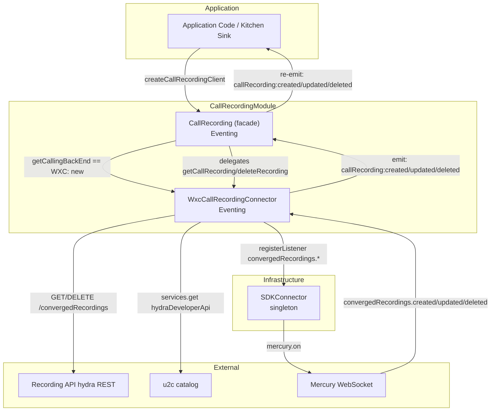
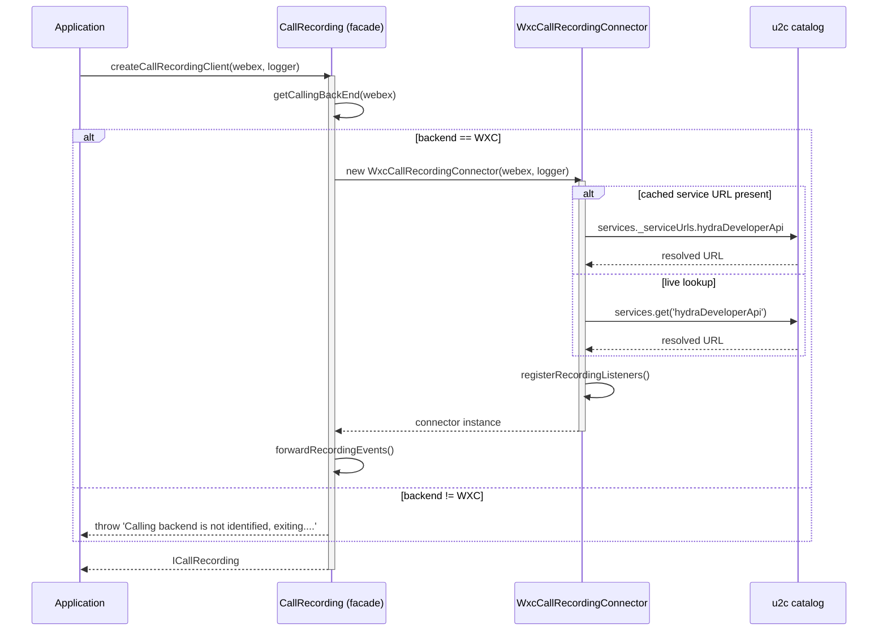
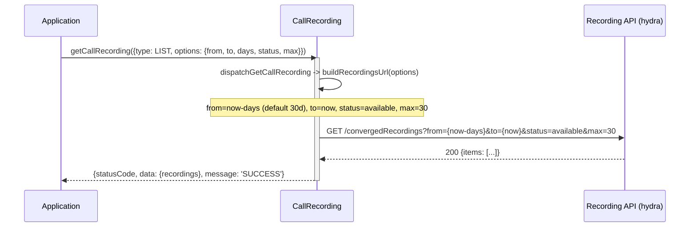
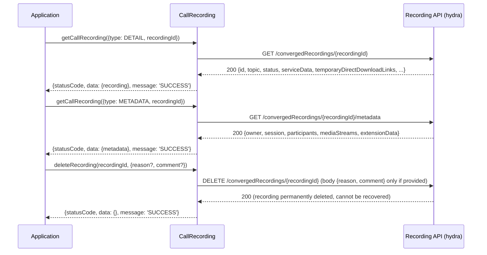
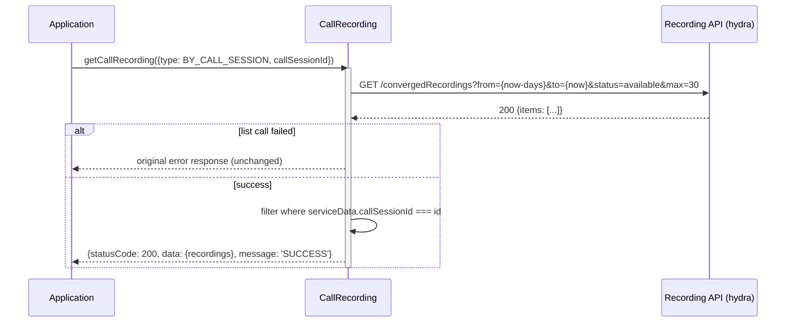
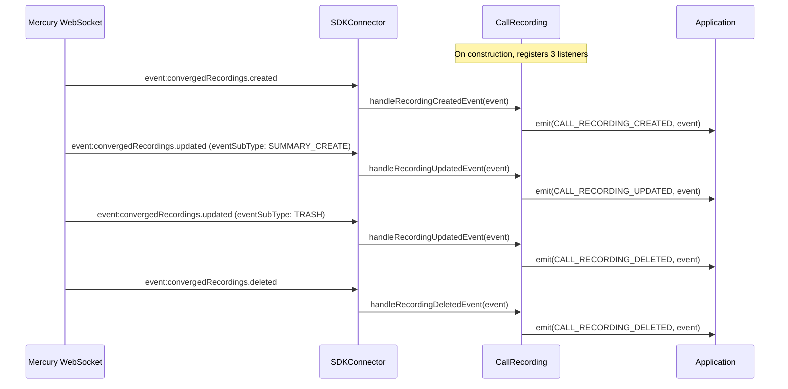
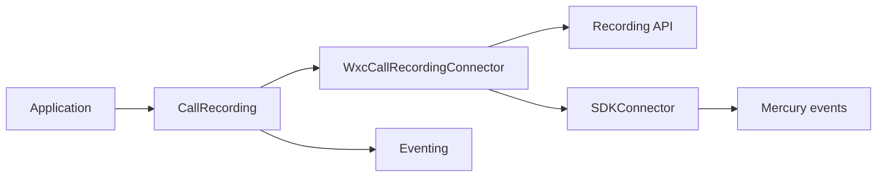

# CallRecording — SPEC

> Start here → root [`AGENTS.md`](../../../AGENTS.md) · router [`SPEC_INDEX.md`](../../../ai-docs/SPEC_INDEX.md) · system [`ARCHITECTURE.md`](../../../ai-docs/ARCHITECTURE.md). This is the canonical module specification.

## Metadata

| Field | Value |
|---|---|
| Module id | `call-recording` |
| Source path(s) | `src/CallRecording/` |
| Doc kind | Module spec |
| Coverage score | 100% assessed 2026-07-06; 21/21 mandatory fields PRESENT after validator-directed rationale, sequence, profile, and contract backfill |
| Generated from | `module-spec` @ SDLC template library `0.2.1` |
| generated_by / approved_by / updated_at | Codex / repository user / 2026-07-06 |
| Validation status | pass on 2026-07-06 by `claude-code`; gate OPEN; Pass-with-warnings accepted as successful and advisory warnings waived |

## Evidence Rules

Requirements cite stable implementation and test file paths. Legacy docs are migration sources, not primary behavioral evidence. Commit rationale may be used because the package history was explicitly confirmed trustworthy. No line-number anchors or local run-report paths are canonical evidence.

## Source Material Register

| Source material | Scope | Decision | Detail location or disposition |
|---|---|---|---|
| `src/CallRecording/ai-docs/AGENTS.md` | legacy AI/architecture source | used and code-verified | Content placed by meaning throughout this spec |
| `src/CallRecording/ai-docs/ARCHITECTURE.md` | legacy AI/architecture source | used and code-verified | Content placed by meaning throughout this spec |

## Overview

The `CallRecording` module provides read access to **Post Call Recordings** (recordings, transcripts,
summaries, and action items) produced for Webex Calling sessions through a single
`getCallRecording` method, supports permanently deleting a recording, and forwards recording
lifecycle events received over Mercury as typed SDK events.

Recordings are fetched from the **Webex public developer API (hydra)** — catalog service
`hydraDeveloperApi` (e.g. `https://integration.webexapis.com/v1`) — whose base URL is resolved
directly from the u2c catalog. URL resolution and the underlying Mercury subscriptions are owned by
the WXC backend connector, while the `CallRecording` facade exposes a typed, ergonomic API.

**Architecture:** `CallRecording` uses the same **backend-connector (strategy) pattern** as
Voicemail. `CallRecording` is a thin, backend-agnostic facade; the actual REST/Mercury work lives in
a backend-specific connector. Today the only connector is `WxcCallRecordingConnector`
(`WxcCallRecordingConnector.ts`). The facade selects the connector based on the resolved calling
backend, delegates all read/delete calls to it, and re-emits the connector's recording events.
Adding a future backend (e.g. UCM/Broadworks, once a recording API exists for it) is a drop-in new
connector plus a `case` in the facade — no consumer-facing changes.

**Backend support:** Post Call Recording is a Webex Calling cloud capability and is therefore
supported **only for the Webex Calling (`WXC`) backend**. The facade resolves the user's backend via
`getCallingBackEnd(webex)` in its constructor and **throws `Error('Calling backend is not identified,
exiting....')`** for any other backend (`BWRKS`, `UCM`, `INVALID`) — the same convention used by the
`Voicemail` and `CallSettings` clients. As a result, `createCallRecordingClient` only yields a usable
client for Webex Calling users; for non-WXC users the factory/constructor throws and no client is
created.

**Package:** `@webex/calling`

**Entry point:** `packages/calling/src/CallRecording/CallRecording.ts`

**Factory:** `createCallRecordingClient(webex, logger) -> ICallRecording`

## Purpose / Responsibility

CallRecording owns the behavior rooted at `src/CallRecording/` and exposes it through the typed `@webex/calling` package boundary; shared infrastructure remains owned by `Errors`, `Events`, `Logger`, and `common`.

## Stack

TypeScript 4.9 source targeting the `@webex/calling` package, Jest unit tests, Playwright package journeys, Webex SDK workspace dependencies, and module-specific remote transports documented below.

## Folder / Package Structure

```text
src/CallRecording/
├── CallRecording.ts
├── WxcCallRecordingConnector.ts
├── constants.ts
├── types.ts
├── utils.ts
├── CallRecording.test.ts
├── WxcCallRecordingConnector.test.ts
├── utils.test.ts
```

## Key Files (source of truth)

| File | Holds |
|---|---|
| `src/CallRecording/CallRecording.ts` | Implementation, types, constants, or adapter behavior |
| `src/CallRecording/WxcCallRecordingConnector.ts` | Implementation, types, constants, or adapter behavior |
| `src/CallRecording/constants.ts` | Implementation, types, constants, or adapter behavior |
| `src/CallRecording/types.ts` | Implementation, types, constants, or adapter behavior |
| `src/CallRecording/utils.ts` | Implementation, types, constants, or adapter behavior |
| `src/CallRecording/CallRecording.test.ts` | Test/characterization evidence |
| `src/CallRecording/WxcCallRecordingConnector.test.ts` | Test/characterization evidence |
| `src/CallRecording/utils.test.ts` | Test/characterization evidence |

### File Structure

```
CallRecording/
├── CallRecording.ts                    # Backend-agnostic facade (selection + delegation + event forwarding)
├── CallRecording.test.ts               # Facade tests (gating, delegation, event forwarding)
├── WxcCallRecordingConnector.ts        # Webex Calling (WXC) backend connector (REST + Mercury)
├── WxcCallRecordingConnector.test.ts   # Connector tests (REST, URL resolution, Mercury events)
├── types.ts                            # ICallRecording, Recording, RecordingMetadata, response types
├── constants.ts                        # Endpoints, query keys, method names
├── callRecordingFixtures.ts            # Test fixtures
└── ai-docs/
    ├── AGENTS.md                       # Module agent doc
    └── ARCHITECTURE.md                 # This file
```

## Public Surface

| Contract ID | Type | Surface | Purpose | Compatibility / deprecation | Schema / detail link | Root index |
|---|---|---|---|---|---|---|
| call-recording.surface.1 | SDK / event | createCallRecordingClient(webex, logger) -> ICallRecording | Create a recording client for typed recording reads, deletion, metadata, and lifecycle events. | Semver-controlled through `@webex/calling` | `src/index.ts`; `src/CallRecording/CallRecording.ts` | `../../../ai-docs/CONTRACTS.md` |
| call-recording.surface.2 | SDK / event | Recording read/delete operations and typed recording events | Create a recording client for typed recording reads, deletion, metadata, and lifecycle events. | Semver-controlled through `@webex/calling` | `src/index.ts`; `src/CallRecording/CallRecording.ts` | `../../../ai-docs/CONTRACTS.md` |

Compatibility notes:
- Public factories, interfaces, types, and events are semver-controlled through `src/index.ts`; removals or incompatible signature changes require an approved migration and release plan.

### ICallRecording Interface

All reads go through a **single** `getCallRecording` method, which dispatches on the request
`type` (a `RecordingRequestType`) and infers the concrete response type per request via
`RecordingResponseFor<T>`. Permanent deletion stays a separate method (different verb + scope).

| Method | Signature | Description |
| ------ | --------- | ----------- |
| `getCallRecording` | `<T extends GetCallRecordingRequest>(request: T): Promise<RecordingResponseFor<T>>` | Reads recordings; the `request.type` selects LIST / DETAIL / METADATA / BY_CALL_SESSION |
| `deleteRecording` | `(recordingId: string, options?: DeleteRecordingOptions): Promise<RecordingDeleteResponse>` | Permanently deletes a recording (cannot be recovered); needs `spark-compliance:recordings_write`. Optional `reason`/`comment` for Compliance Officer deletions |

### Helpers (exported from @webex/calling)

| Helper | Signature | Description |
| ------ | --------- | ----------- |
| `getRemoteParty` | `(serviceData?: RecordingServiceData): RecordingParty \| undefined` | Resolves the *other* party of the call from `serviceData` using `personality` (`originator` → `calledParty`, `terminator` → `callingParty`). Use `getRemoteParty(serviceData)?.actor?.id` for the Webex person UUID (avatar/presence); `undefined` for list-only `serviceData` or external/PSTN parties (fall back to `?.name`). |

> Party details (`personality`, `callingParty`, `calledParty`) are only on the **metadata**
> `serviceData`, not the `LIST` response, so resolving avatar/presence for a list needs a `METADATA`
> call per recording — fetch lazily for visible rows and cache by `recordingId`.

### getCallRecording request types

| `request.type` (`RecordingRequestType`) | Request shape | Maps to | Resolves with |
| --- | --- | --- | --- |
| `LIST` | `{type, options?}` | `GET /convergedRecordings` | `RecordingListResponse` |
| `DETAIL` | `{type, recordingId}` | `GET /convergedRecordings/{id}` | `RecordingResponse` |
| `METADATA` | `{type, recordingId}` | `GET /convergedRecordings/{id}/metadata` | `RecordingMetadataResponse` |
| `BY_CALL_SESSION` | `{type, callSessionId, options?}` | client-side filter over the list | `RecordingListResponse` |

### Inherited from Eventing\<CallRecordingEventTypes\>

| Method | Signature | Description |
| ------ | --------- | ----------- |
| `on` | `(event, handler)` | Subscribe to an event |
| `off` | `(event, handler)` | Unsubscribe from an event |
| `emit` | `(event, data)` | Emit an event |

### Events Emitted

| Event | Enum Key | Payload | Description |
| ----- | -------- | ------- | ----------- |
| `callRecording:created` | `COMMON_EVENT_KEYS.CALL_RECORDING_CREATED` | `RecordingEvent` | A new recording was created (or restored from trash) |
| `callRecording:updated` | `COMMON_EVENT_KEYS.CALL_RECORDING_UPDATED` | `RecordingEvent` | A recording was updated (e.g. `SUMMARY_CREATE`) |
| `callRecording:deleted` | `COMMON_EVENT_KEYS.CALL_RECORDING_DELETED` | `RecordingEvent` | A recording was soft-deleted (`TRASH`) or permanently purged (`PURGE`) |

> **Important — the backend expresses the lifecycle through `updated` + `eventSubType`, not via
> distinct event types.** Verified against production: a delete in the Webex client arrives as
> `convergedRecordings.updated` with `eventSubType: TRASH` (NOT `convergedRecordings.deleted`), and AI
> summary/transcript availability arrives as `convergedRecordings.updated` with
> `eventSubType: SUMMARY_CREATE`. The connector therefore **routes `convergedRecordings.updated`
> events by `eventSubType`** into the intuitive typed event, while always forwarding the full event
> (so consumers can still read `data.eventSubType` to distinguish a soft `TRASH` from a permanent
> `PURGE`):
>
> | Mercury `eventType` | `eventSubType` | Emitted typed event |
> | ------------------- | -------------- | ------------------- |
> | `convergedRecordings.created` | — | `callRecording:created` |
> | `convergedRecordings.updated` | `TRASH` (soft delete) | `callRecording:deleted` |
> | `convergedRecordings.updated` | `PURGE` (permanent) | `callRecording:deleted` |
> | `convergedRecordings.updated` | `RESTORE` (from trash) | `callRecording:created` |
> | `convergedRecordings.updated` | `SUMMARY_CREATE` / other | `callRecording:updated` |
> | `convergedRecordings.deleted` | — | `callRecording:deleted` (subscribed for completeness; not observed in practice) |

### Key Types

| Type | Description |
| ---- | ----------- |
| `RecordingRequestType` | Discriminant enum for `getCallRecording`: `LIST`, `DETAIL`, `METADATA`, `BY_CALL_SESSION` |
| `GetCallRecordingRequest` | Discriminated union of the read requests passed to `getCallRecording` (`ListRecordingsRequest` \| `DetailRecordingRequest` \| `MetadataRecordingRequest` \| `CallSessionRecordingsRequest`) |
| `RecordingResponseFor<T>` | Maps a request member to its response type so `getCallRecording` infers the return per request |
| `Recording` | A converged recording. Key fields: `id`, `topic`, `createTime`, `timeRecorded`, `status`, `serviceType`, `durationSeconds`, `sizeBytes`, `ownerId`, `ownerEmail`, `serviceData` (`locationId`, `callSessionId`), `temporaryDirectDownloadLinks` |
| `RecordingServiceData` | Service-specific data: `callRecordingId`, `locationId`, `callSessionId`, and (metadata only) the call parties `personality`, `callingParty`, `calledParty` |
| `RecordingPersonality` | Which side the owner was on: `'originator'` (remote = `calledParty`) \| `'terminator'` (remote = `callingParty`) |
| `RecordingParty` | A call party: `actor` (`{type, id, email}`), `number`, `name`. `actor.id` is the person UUID for avatar/presence |
| `RecordingActor` | The acting entity behind a party: `type`, `id` (person UUID for Webex users), `email` |
| `RecordingMetadata` | Metadata document: `owner`, `session`, `participants`, `mediaStreams`, `extensionData`, `serviceData` (with the call parties) |
| `GetRecordingsOptions` | Optional `from`, `to`, `days`, `status`, `max`, `serviceType`, `format`, `ownerType`, `storageRegion`, `locationId`, `topic`, `webexUserRequest` |
| `RecordingStatus` | Enum: `available`, `deleted` |
| `RecordingListResponse` | `{statusCode, data: {recordings?, error?}, message}` |
| `RecordingResponse` | `{statusCode, data: {recording?, error?}, message}` |
| `RecordingMetadataResponse` | `{statusCode, data: {metadata?, error?}, message}` |
| `RecordingDeleteResponse` | `{statusCode, data: {error?}, message}` |
| `DeleteRecordingOptions` | `{reason?, comment?}` (Compliance Officer deletions) |
| `RecordingEvent` | Mercury event envelope: `{id?, data: {activity, eventType, eventSubType?}, timestamp?, trackingId?}` |

### Field Mapping Notes

| Concept | Field |
| ------- | ----- |
| Recording id (for `DETAIL` / `METADATA` requests) | `id` |
| Call session id (for the `BY_CALL_SESSION` request) | `serviceData.callSessionId` |
| Location | `serviceData.locationId` |
| Owner | `ownerId` / `ownerEmail` / `ownerType` |
| Remote party (avatar / presence) | `getRemoteParty(metadata.serviceData)?.actor?.id` — only on the `METADATA` response |
| Direct media links (single `DETAIL` request) | `temporaryDirectDownloadLinks` |

### Configuration

The `CallRecording` constructor accepts:

| Parameter | Type | Required | Description |
| --------- | ---- | -------- | ----------- |
| `webex` | `WebexSDK` | Yes | An initialized Webex SDK instance (with the `hydraDeveloperApi` service in its u2c catalog) |
| `logger` | `LoggerInterface` | Yes | Logger interface with a `level` property |

### List Options (GetRecordingsOptions)

These apply to the `LIST` and `BY_CALL_SESSION` requests (passed as `request.options`).

| Field | Type | Default | Description |
| ----- | ---- | ------- | ----------- |
| `from` | `string` (ISO-8601) | `now - days` | Inclusive start of the time window (always sent) |
| `to` | `string` (ISO-8601) | `now` | Inclusive end of the time window (always sent) |
| `days` | `number` | `30` | Lookback used to derive `from` when `from` is omitted (API max window is 30 days) |
| `status` | `RecordingStatus` | `available` | Filter by recording status (`available`/`deleted`) |
| `max` | `number` | `30` | Maximum number of records to return per page |
| `serviceType` | `string` | _(unset)_ | Filter by producing service (e.g. `calling`); sent only when provided |
| `format` | `string` | _(unset)_ | Filter by media format (e.g. `MP3`, `MP4`); sent only when provided |
| `ownerType` | `string` | _(unset)_ | Filter by owner type (e.g. `user`); sent only when provided |
| `storageRegion` | `string` | _(unset)_ | Filter by storage region (e.g. `US`); sent only when provided |
| `locationId` | `string` | _(unset)_ | Filter by location id; sent only when provided |
| `topic` | `string` | _(unset)_ | Filter by recording topic; sent only when provided |
| `webexUserRequest` | `boolean` | `false` | When true, sends the `WebexUserRequest: true` header (ad-hoc rate-limit bypass) |

### Mercury Event Keys (Events/types.ts)

| Event Key | Wire Value | Description |
|-----------|------------|-------------|
| `MOBIUS_EVENT_KEYS.RECORDING_EVENT_CREATED` | `'event:convergedRecordings.created'` | Recording created |
| `MOBIUS_EVENT_KEYS.RECORDING_EVENT_UPDATED` | `'event:convergedRecordings.updated'` | Recording updated (incl. `SUMMARY_CREATE`) |
| `MOBIUS_EVENT_KEYS.RECORDING_EVENT_DELETED` | `'event:convergedRecordings.deleted'` | Recording deleted |

### Recording Event Sub-Types (RECORDINGEVENTSUBTYPE)

| Value | Meaning |
|-------|---------|
| `TRASH` | Recording moved to trash |
| `PURGE` | Recording permanently removed |
| `RESTORE` | Recording restored from trash |
| `SUMMARY_CREATE` | AI summary/transcript became available (no dedicated event) |

## Requires (dependencies)

- Webex hydraDeveloperApi recording endpoints
- Mercury recording lifecycle events
- Calling-backend resolution

### Internal Dependencies

| Module | Purpose |
| ------ | ------- |
| `WxcCallRecordingConnector` | Webex Calling (WXC) backend connector — REST calls, URL resolution, Mercury subscription/emit |
| `getCallingBackEnd` | Resolves the user's calling backend so the facade can select a connector (WXC-only today) |
| `SDKConnector` | Singleton bridge to Webex SDK, Mercury event listener registration |
| `Eventing<T>` | Typed event emitter base class |
| `Logger` | Structured logging with file/method context |
| `serviceErrorCodeHandler` | Standardized error response formatting |
| `uploadLogs` | Uploads diagnostic logs on error |
| `webex.internal.services` | Resolves the `hydraDeveloperApi` base URL from the u2c catalog |
| `webex.internal.mercury` | Delivers `convergedRecordings.*` events via the SDKConnector listener |

## Requirements

| ID | WHAT | WHY | Source Evidence | Test / Example Evidence | Assumptions / Gaps | Confidence |
|---|---|---|---|---|---|---|
| CALLRECORDIN-R-001 | Retrieves the current user's converged recordings with optional time-range filters, status filter, and pagination. | Server-side time, status, and pagination filters bound response size and let consumers reproduce the Webex recording-list experience. | `src/CallRecording/CallRecording.ts` | `src/CallRecording/CallRecording.test.ts` | none identified | PRESENT |
| CALLRECORDIN-R-002 | Fetches a single recording by its `id`, including temporary direct download links. | Fetching by recording id is required to retrieve one artifact and its temporary download links without scanning a list response. | `src/CallRecording/CallRecording.ts` | `src/CallRecording/CallRecording.test.ts` | none identified | PRESENT |
| CALLRECORDIN-R-003 | Returns all recordings tied to a call session id (`serviceData.callSessionId`), filtered client-side. | Client-side session filtering groups every recording artifact for a call even though the service does not expose a dedicated call-session endpoint. | `src/CallRecording/CallRecording.ts` | `src/CallRecording/CallRecording.test.ts` | none identified | PRESENT |
| CALLRECORDIN-R-004 | Fetches the metadata document for a recording (owner, session, participants, media streams, extension data). | Metadata is fetched separately so participant and media-stream detail is available on demand without inflating every list response. | `src/CallRecording/CallRecording.ts` | `src/CallRecording/CallRecording.test.ts` | none identified | PRESENT |
| CALLRECORDIN-R-005 | Re-emits Mercury `convergedRecordings.*` events as typed `callRecording:*` events. | Re-emitting converged-recording events lets consumers synchronize created, updated, and deleted state without polling the recording service. | `src/CallRecording/CallRecording.ts` | `src/CallRecording/CallRecording.test.ts` | none identified | PRESENT |
| CALLRECORDIN-R-006 | Standardized error handling via `serviceErrorCodeHandler` with automatic log upload on failure. | Normalized service errors and log upload give callers one failure contract and retain diagnostics for remote recording failures. | `src/CallRecording/CallRecording.ts` | `src/CallRecording/CallRecording.test.ts` | none identified | PRESENT |

### Key Capabilities

| Capability | Description |
| ----------- | ----------- |
| **List Recordings** | Retrieves the current user's converged recordings with optional time-range filters, status filter, and pagination. |
| **Get Recording** | Fetches a single recording by its `id`, including temporary direct download links. |
| **Get By Call Session** | Returns all recordings tied to a call session id (`serviceData.callSessionId`), filtered client-side. |
| **Get Metadata** | Fetches the metadata document for a recording (owner, session, participants, media streams, extension data). |
| **Real-Time Recording Events** | Re-emits Mercury `convergedRecordings.*` events as typed `callRecording:*` events. |
| **Error Handling & Logging** | Standardized error handling via `serviceErrorCodeHandler` with automatic log upload on failure. |

## Design Overview

### CallRecording Module

> Canonical SDD target: [`src/CallRecording/ai-docs/call-recording-spec.md`](call-recording-spec.md). This legacy document is retained as migration source; use the canonical target for current lifecycle work.

### Base URL Resolution

The `WxcCallRecordingConnector` resolves the recording base URL at construction directly from the
u2c catalog:

1. `webex.internal.services._serviceUrls.hydraDeveloperApi` (cached service URL).
2. Fallback: `webex.internal.services.get(webex.internal.services._activeServices.hydraDeveloperApi)`.

### HTTP Client Usage

All read methods use `this.webex.request({uri, method: GET, service: 'hydraDeveloperApi'})`. Errors are
**returned** (not thrown) as `{statusCode, data: {error}, message}` envelopes via
`serviceErrorCodeHandler`, and diagnostic logs are uploaded via `uploadLogs()` on failure.

### URL Construction

Internally `getCallRecording` dispatches to one operation per `request.type`. A `LIST` request
builds the list URL as:

```
{recordingServiceUrl}/convergedRecordings?from={now-days}&to={now}&status=available&max=30
```

- A `from` lower bound is always sent (like CallHistory's mandatory `from` date) so the API returns results; it is derived as `now - days` (default 30) when not provided. `to` defaults to `now` when not supplied. The list API only accepts a `from`/`to` interval of at most 30 days, so the default stays within that limit and custom `days`/`from` values must too.
- The sort/filter/pagination params default to the values used by the Webex web client and are overridable via `GetRecordingsOptions`.
- The raw list response is `{ "items": [ ... ] }`; the client maps `items` to `data.recordings`.
- `DETAIL`: `GET {recordingServiceUrl}/convergedRecordings/{recordingId}`.
- `METADATA`: `GET {recordingServiceUrl}/convergedRecordings/{recordingId}/metadata`.
- `deleteRecording`: `DELETE {recordingServiceUrl}/convergedRecordings/{recordingId}` (permanent; optional `{reason, comment}` body).

### BYCALLSESSION request (API gap)

There is no confirmed server-side query parameter to filter by call session id. The client fetches
a list (the same operation as a `LIST` request, using `request.options`) and filters client-side on
`serviceData.callSessionId === callSessionId`. Because the scan is bounded by that list query, it
only searches the default time window/status and first `max` records unless `options` are passed.
Forward `GetRecordingsOptions` (e.g. a wider `days`/`from`–`to` window, a different `status`, or a
larger `max`) when the target session may fall outside the defaults. If the underlying list
call fails, the original error response is returned unchanged.

### CallRecording Module — Architecture

> Canonical SDD target: [`src/CallRecording/ai-docs/call-recording-spec.md`](call-recording-spec.md). This legacy document is retained as migration source; use the canonical target for current lifecycle work.

### Singletons and Factories

| Component | Access Pattern | Lifecycle |
|-----------|---------------|-----------|
| `CallRecording` | `createCallRecordingClient(webex, logger)` factory | One per application |
| `WxcCallRecordingConnector` | Instantiated internally by the facade for the WXC backend | One per facade |
| `SDKConnector` | Frozen singleton via `import SDKConnector` | Global, set once via `setWebex()` |

### Query Parameter Keys

| Constant | Value | Default |
|----------|-------|---------|
| `FROM` | `'from'` | `now - DEFAULT_NUMBER_OF_DAYS` |
| `TO` | `'to'` | `now` |
| `DEFAULT_NUMBER_OF_DAYS` | `30` | Lookback to derive `from` (API max window is 30 days) |
| `STATUS` | `'status'` | `available` |
| `MAX` | `'max'` | `30` |
| `SERVICE_TYPE` | `'serviceType'` | _(sent only when provided)_ |
| `FORMAT` | `'format'` | _(sent only when provided)_ |
| `OWNER_TYPE` | `'ownerType'` | _(sent only when provided)_ |
| `STORAGE_REGION` | `'storageRegion'` | _(sent only when provided)_ |
| `LOCATION_ID` | `'locationId'` | _(sent only when provided)_ |
| `TOPIC` | `'topic'` | _(sent only when provided)_ |

### Headers

| Constant | Value | Description |
|----------|-------|-------------|
| `WEBEX_USER_REQUEST_HEADER` | `'WebexUserRequest'` | Set to `'true'` only when `options.webexUserRequest` is true (rate-limit bypass) |

## Data Flow

### Layer Communication Flow



## Sequence Diagram(s)

Sequence coverage:

| Operation group | Diagram / coverage | Failure / recovery coverage |
|---|---|---|
| Construct connector and resolve service URL | 1. Client Construction & URL Resolution | Unsupported backend or missing service URL fails initialization |
| List recordings | 2. Listing Recordings | Filters/defaults and service errors are represented |
| Get detail, metadata, or session recordings | 3–4. Read diagrams | Not-found/service errors use the normalized response path |
| Delete and lifecycle events | Shares the recording REST/event actors shown in 2–5 | Delete scope/service failure and event delivery are documented in failure modes |

### 1. Client Construction & URL Resolution



### 2. Listing Recordings



### 3. Get Recording / Metadata



### 4. Get Recordings by Call Session Id (client-side filter)



### 5. Real-Time Recording Event Handling

> **Note:** The backend expresses the full lifecycle through `convergedRecordings.updated` qualified
> by `eventSubType` (verified in production: a delete arrives as `updated` + `TRASH`, not
> `deleted`). `handleRecordingUpdatedEvent` routes by `eventSubType`: `TRASH`/`PURGE` →
> `CALL_RECORDING_DELETED`, `RESTORE` → `CALL_RECORDING_CREATED`, `SUMMARY_CREATE`/other →
> `CALL_RECORDING_UPDATED`. The full event (incl. `eventSubType`) is always forwarded.



## Class / Component Relationships



### Component Overview

The CallRecording module follows a layered architecture:
**Application → CallRecording (facade) → WxcCallRecordingConnector → Recording API (hydra) REST / Mercury WebSocket**.

The module uses the same **backend-connector (strategy) pattern** as Voicemail. `CallRecording` is a
thin, backend-agnostic facade that resolves the calling backend (`getCallingBackEnd`) and selects a
backend-specific connector. Today only the Webex Calling (WXC) backend is supported — Post Call
Recording (`convergedRecordings`) is a Webex Calling cloud capability — so the facade instantiates
`WxcCallRecordingConnector` for WXC and throws for any other backend (BWRKS/UCM/INVALID). The facade
delegates all read/delete operations to the active connector and re-emits the connector's recording
lifecycle events. Adding another backend later is a drop-in new connector + a `case` in the facade,
with no consumer-facing changes.

The `WxcCallRecordingConnector` owns everything backend-specific: it resolves its base URL directly
from the u2c service catalog and subscribes to `convergedRecordings.*` Mercury events through the
`SDKConnector` (no dedicated recording plugin dependency).

### Component Table

| Layer | Component | File | Key Responsibilities |
|-------|-----------|------|---------------------|
| **Facade** | `CallRecording` | `CallRecording.ts` | Backend selection (WXC-only today, else throw), delegates read/delete, re-emits connector events |
| **WXC Connector** | `WxcCallRecordingConnector` | `WxcCallRecordingConnector.ts` | URL resolution, list/get/metadata/delete, call-session filtering, `convergedRecordings.*` Mercury subscription + emit |
| **Event System** | `Eventing<CallRecordingEventTypes>` | `Events/impl/index.ts` | Typed event emission for recording events |
| **SDK Bridge** | `SDKConnector` | `SDKConnector/` | Mercury listener registration, Webex SDK access |

## Use Cases

### Create a CallRecording Client

```typescript
import {createCallRecordingClient} from '@webex/calling';

const callRecording = createCallRecordingClient(webex, {level: 'info'});
```

When using the top-level `webex` package, enable the client via `clientConfig.callRecording = true`
and access it as `calling.callRecordingClient`.

### List Recordings

```typescript
import {RecordingRequestType, RecordingStatus} from '@webex/calling';

const response = await callRecording.getCallRecording({
  type: RecordingRequestType.LIST,
  options: {max: 30, status: RecordingStatus.AVAILABLE},
});

if (response.statusCode === 200) {
  console.log(`Retrieved ${response.data.recordings?.length} recordings`);
}
```

### Get a Single Recording and Metadata

```typescript
const recordingResponse = await callRecording.getCallRecording({
  type: RecordingRequestType.DETAIL,
  recordingId: 'recording-uuid',
});
const metadataResponse = await callRecording.getCallRecording({
  type: RecordingRequestType.METADATA,
  recordingId: 'recording-uuid',
});

console.log(recordingResponse.data.recording?.temporaryDirectDownloadLinks);
console.log(metadataResponse.data.metadata?.participants);
```

### Get Recordings by Call Session Id

```typescript
const response = await callRecording.getCallRecording({
  type: RecordingRequestType.BY_CALL_SESSION,
  callSessionId: 'call-session-id',
});

console.log(`Found ${response.data.recordings?.length} recordings for the session`);
```

### Delete a Recording (permanent)

```typescript
// Deleting your own recording:
const response = await callRecording.deleteRecording('recording-uuid');

// Compliance Officer deleting another user's recording (reason/comment required):
await callRecording.deleteRecording('recording-uuid', {
  reason: 'audit',
  comment: 'Maintain data privacy',
});

if (response.statusCode === 200) {
  // Recording is permanently deleted (cannot be recovered) and no longer appears in a LIST request.
}
```

> The recoverable recycle-bin flow (*Move / Purge / Restore Recordings from Recycle Bin*) is a
> separate set of `POST` endpoints not yet implemented in this client.

### Listen for Recording Events

```typescript
callRecording.on('callRecording:created', (event) => {
  console.log('Recording created:', event.data.activity.object.id);
});

callRecording.on('callRecording:updated', (event) => {
  if (event.data.eventSubType === 'SUMMARY_CREATE') {
    console.log('AI summary/transcript is now available for', event.data.activity.object.id);
  }
});

callRecording.on('callRecording:deleted', (event) => {
  console.log('Recording deleted:', event.data.activity.object.id);
});
```

## State Model

The facade owns one selected recording connector and re-emits its lifecycle events. `WxcCallRecordingConnector` caches the resolved recording-service URL; recording data itself remains service-owned and is fetched per operation. Evidence: `src/CallRecording/CallRecording.ts`, `src/CallRecording/WxcCallRecordingConnector.ts`.

## Business Rules & Invariants

- Only WXC is supported; other calling backends fail during connector selection.
- Permanent deletion is a separate operation and requires the recordings-write scope.
- Call-session lookup filters returned recordings by `serviceData.callSessionId`.
- Connector events are re-emitted with the same typed recording payload. Evidence: `src/CallRecording/CallRecording.ts`, `src/CallRecording/WxcCallRecordingConnector.ts`.

## Concurrency & Reactive Flow

Mercury recording events may arrive while REST reads or deletes are in flight. Event forwarding is independent of request promises, and each request returns its own normalized response/error without mutating a shared recording list. Evidence: `src/CallRecording/CallRecording.ts`, `src/CallRecording/WxcCallRecordingConnector.ts`.

## Protocol / Wire Format

### API Endpoints (CallRecording/constants.ts)

| Constant | Value | Description |
|----------|-------|-------------|
| `CONVERGED_RECORDINGS` | `'convergedRecordings'` | Recording API recordings collection segment |
| `METADATA` | `'metadata'` | Metadata sub-resource segment |

## Error Handling & Failure Modes

| Condition | Signal | Caller recovery |
|---|---|---|
| Invalid input or lifecycle state | Typed error or rejected promise from `src/CallRecording/CallRecording.ts` | Correct input/state; do not retry blindly |
| Remote or transport failure | Module error/event | Apply the module's documented retry/fallback; otherwise surface to the consumer |
| Cleanup after failure | Final event or rejected operation | Release listeners/timers and recreate only through the public factory |

## Pitfalls

### 1. recordingServiceUrl is undefined / requests go to a bad URL

**Symptoms:** Requests fail with a malformed URL (e.g. resolving against `localhost`), or the
resolved `recordingServiceUrl` is `undefined`.

**Possible Causes:**
- `hydraDeveloperApi` not present in the u2c catalog for the org.

**Debug Steps:**
```typescript
console.log(webex.internal.services._serviceUrls?.hydraDeveloperApi);
console.log(webex.internal.services.get(webex.internal.services._activeServices?.hydraDeveloperApi));
```
A config override can be supplied via `config.recording.recordingServiceUrl`.

### 2. Empty Recording List

**Symptoms:** a `LIST` request (`getCallRecording({type: LIST})`) returns an empty `recordings` array.

**Possible Causes:**
- No recordings match the requested `status` filter (e.g. only `deleted` recordings exist while querying `available`).
- The `from`/`to` window contains no recordings, or the auth token lacks the `spark:recordings_read` scope.

### 3. BYCALLSESSION Request Returns Empty

**What happens internally:** The full list is fetched then filtered client-side on
`serviceData.callSessionId`. An empty result logs
`"No recordings found for the given call session id."` and returns `statusCode: 200` with an empty
array. If the underlying list call fails, the original error response is returned unchanged.

### 4. Recording Events Not Firing

**Symptoms:** Listeners on `callRecording:*` never fire.

**Possible Causes:**
- Mercury WebSocket not connected.
- `registerRecordingListeners()` was never invoked, so Mercury subscriptions were never created.
- Event envelope missing `data.activity` (handlers guard on its presence before re-emitting).

### 5. 401 / 429 Responses

**Symptoms:** `getCallRecording` requests (`LIST`/`DETAIL`) return `statusCode: 401` or `429`.

**Notes:** Errors are returned (not thrown) via `serviceErrorCodeHandler`. For ad-hoc rate-limit
bypass on explicit end-user actions, pass
`getCallRecording({type: LIST, options: {webexUserRequest: true}})` to send the
`WebexUserRequest: true` header.

## Module Do's / Don'ts

- DO use the factories, typed events, constants, and adapters already owned by `src/CallRecording/`.
- DON'T add direct network or SDK access when the module already provides an adapter.

## Key Design Trade-off

A backend-agnostic facade is retained even though only WXC currently supports converged recordings. The extra connector layer keeps the consumer contract stable if another backend is added and isolates WXC URL/event details. Evidence: `src/CallRecording/CallRecording.ts`; rationale introduced with `commit:033e92b5c0`.

## Test-Case Strategy (module)

Unit tests are co-located under `src/CallRecording/` and exercise positive, negative, error, retry, and cleanup behavior as applicable. Package journeys under `playwright/` cover cross-module flows.

| Behavior / Requirement | Existing test evidence | Gap |
|---|---|---|
| CALLRECORDIN-R-001 | `src/CallRecording/CallRecording.test.ts` | Re-check negative/error edge coverage during independent validation |
| CALLRECORDIN-R-002 | `src/CallRecording/CallRecording.test.ts` | Re-check negative/error edge coverage during independent validation |
| CALLRECORDIN-R-003 | `src/CallRecording/CallRecording.test.ts` | Re-check negative/error edge coverage during independent validation |
| CALLRECORDIN-R-004 | `src/CallRecording/CallRecording.test.ts` | Re-check negative/error edge coverage during independent validation |
| CALLRECORDIN-R-005 | `src/CallRecording/CallRecording.test.ts` | Re-check negative/error edge coverage during independent validation |
| CALLRECORDIN-R-006 | `src/CallRecording/CallRecording.test.ts` | Re-check negative/error edge coverage during independent validation |

## Traceability

- Repo architecture: [`ARCHITECTURE.md`](../../../ai-docs/ARCHITECTURE.md) · Registry: [`SPEC_INDEX.md`](../../../ai-docs/SPEC_INDEX.md)
- Contracts catalog: [`CONTRACTS.md`](../../../ai-docs/CONTRACTS.md) · Manifest: `../../../.sdd/manifest.json`
- Source material retained at `src/CallRecording/ai-docs/AGENTS.md`; canonical behavior is this spec plus current code/tests.
- Source material retained at `src/CallRecording/ai-docs/ARCHITECTURE.md`; canonical behavior is this spec plus current code/tests.

### Related Documentation

- [Architecture](./ARCHITECTURE.md) — Component overview, data flows, sequence diagrams

### CallRecording Module — Architecture / Related Documentation

- [AGENTS.md](./AGENTS.md) — Overview, examples, public API
