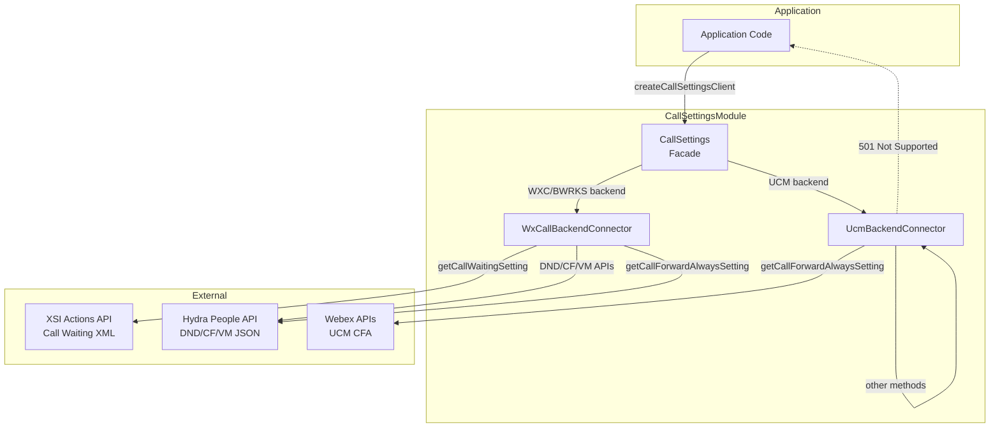
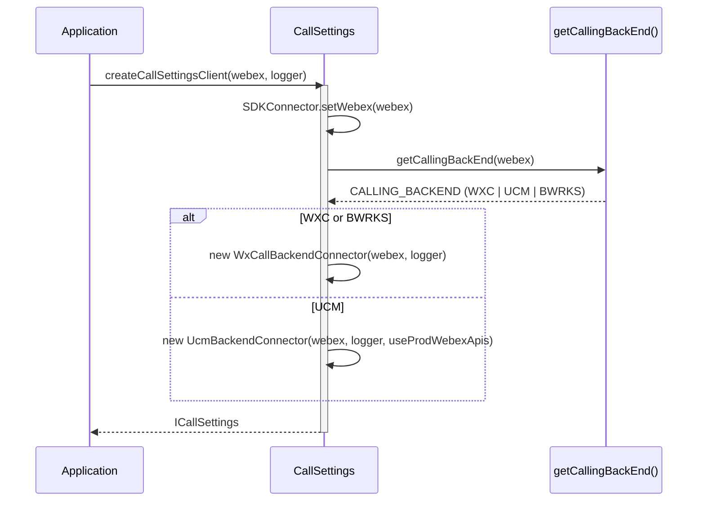
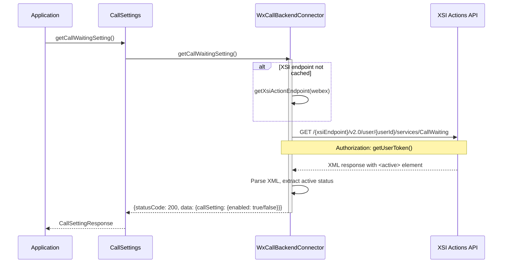
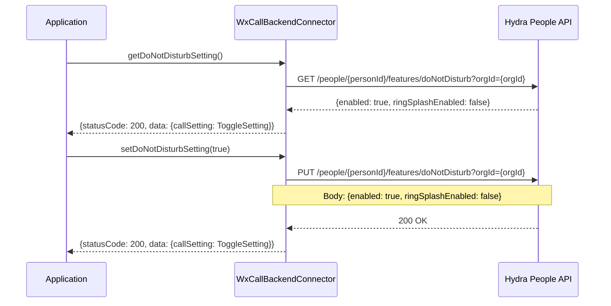
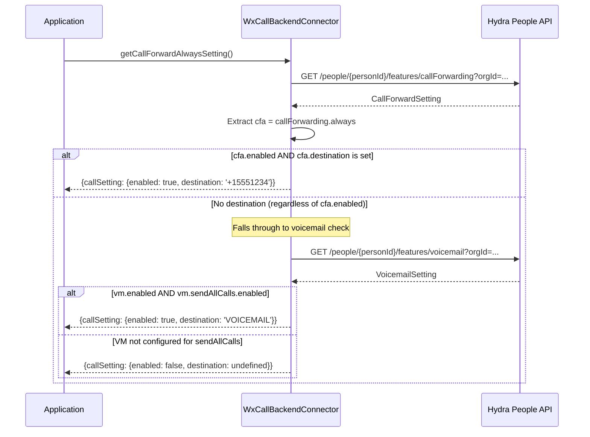
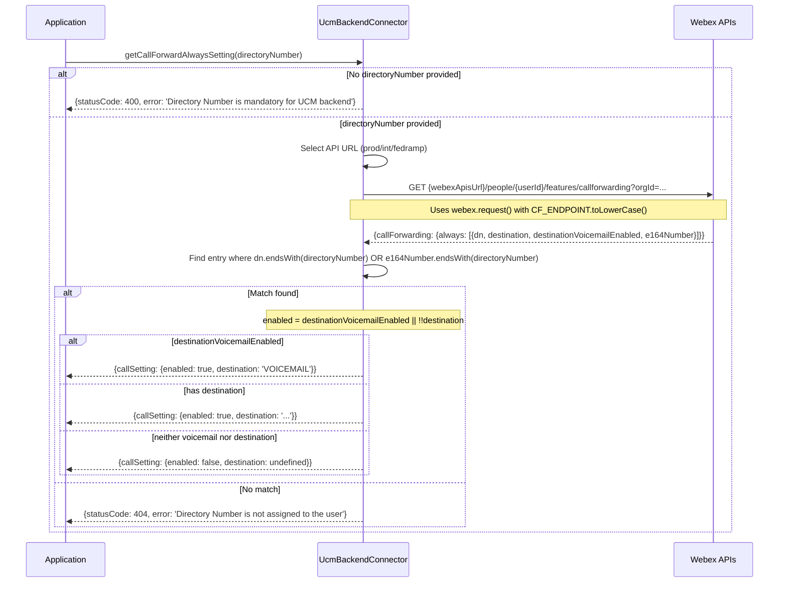

# CallSettings Module — Architecture

## Component Overview

The CallSettings module uses a **strategy pattern**: the `CallSettings` facade delegates all operations to a backend-specific connector chosen at construction time. The architecture is: **Application -> CallSettings -> BackendConnector (WXC or UCM) -> Backend API**.

### Component Table

| Layer | Component | File | Key Responsibilities |
|-------|-----------|------|---------------------|
| **Facade** | `CallSettings` | `CallSettings.ts` | Backend detection, connector initialization, API delegation |
| **WXC Connector** | `WxCallBackendConnector` | `WxCallBackendConnector.ts` | XSI Actions (call waiting), Hydra People API (DND, CF, VM, CFA) |
| **UCM Connector** | `UcmBackendConnector` | `UcmBackendConnector.ts` | Webex APIs for CFA with directory number; 501 for unsupported methods |

### Singletons and Factories

| Component | Access Pattern | Lifecycle |
|-----------|---------------|-----------|
| `CallSettings` | `createCallSettingsClient(webex, logger, useProdWebexApis?)` factory | One per application |
| `SDKConnector` | Frozen singleton via `import SDKConnector` | Global, set once via `setWebex()` |
| `WxCallBackendConnector` | Created internally by `CallSettings.initializeBackendConnector()` | One per CallSettings |
| `UcmBackendConnector` | Created internally by `CallSettings.initializeBackendConnector()` | One per CallSettings |

### File Structure

```
CallSettings/
├── CallSettings.ts                 # Facade class with backend delegation
├── CallSettings.test.ts            # Facade unit tests
├── WxCallBackendConnector.ts       # WXC/Broadworks backend implementation
├── WxCallBackendConnector.test.ts  # WXC connector unit tests
├── UcmBackendConnector.ts          # UCM backend implementation
├── UcmBackendConnector.test.ts     # UCM connector unit tests
├── types.ts                        # ICallSettings, setting types, response types
├── constants.ts                    # Endpoints, method names
├── testFixtures.ts                 # Test fixtures
└── ai-docs/
    ├── AGENTS.md                   # Module agent doc
    └── ARCHITECTURE.md             # This file
```

---

## Data Flows

### Backend Selection Flow



---

## Sequence Diagrams

### 1. Backend Connector Initialization



### 2. Get Call Waiting (WXC — XSI Actions)



### 3. Get/Set DND (WXC — Hydra API)



### 4. Get Call Forward Always (WXC — Composite)



### 5. Get Call Forward Always (UCM — Directory Number)



---

## Key Constants

### API Endpoints (from `CallSettings/constants.ts`)

| Constant | Value | Description |
|----------|-------|-------------|
| `PEOPLE_ENDPOINT` | `'people'` | Hydra People API path segment |
| `DND_ENDPOINT` | `'features/doNotDisturb'` | DND feature endpoint |
| `CF_ENDPOINT` | `'features/callForwarding'` | Call forwarding feature endpoint (UCM lowercases this) |
| `VM_ENDPOINT` | `'features/voicemail'` | Voicemail feature endpoint |
| `CALL_WAITING_ENDPOINT` | `'CallWaiting'` | XSI call waiting service endpoint |
| `XSI_VERSION` | `'v2.0'` | XSI Actions API version |
| `ORG_ENDPOINT` | `'orgId'` | Organization ID query parameter |
| `USER_ENDPOINT` | `'user'` | XSI user path segment |

### Constants from `common/constants.ts`

| Constant | Value | Description |
|----------|-------|-------------|
| `SERVICES_ENDPOINT` | `'services'` | XSI services path segment |
| `VOICEMAIL` | `'VOICEMAIL'` | Voicemail destination string (used by UCM connector) |
| `WEBEX_API_CONFIG_PROD_URL` | `'https://webexapis.com/v1/uc/config'` | UCM production API base |
| `WEBEX_API_CONFIG_INT_URL` | `'https://integration.webexapis.com/v1/uc/config'` | UCM integration/test API base |
| `WEBEX_API_CONFIG_FEDRAMP_URL` | `'https://api-usgov.webex.com/v1/uc/config'` | UCM FedRAMP API base |

### HTTP Client Pattern

| Method | Backend | Client | Notes |
|--------|---------|--------|-------|
| `getCallWaitingSetting` | WXC | Browser `fetch` | Parses XML response via `DOMParser` |
| All other methods | WXC | `this.webex.request()` | JSON request/response |
| `getCallForwardAlwaysSetting` | UCM | `this.webex.request()` | Custom headers for FedRAMP only |

### URL Patterns

**WXC Call Waiting (XSI):**
```
{xsiEndpoint}/v2.0/user/{userId}/services/CallWaiting
```

**WXC Hydra APIs (DND, CF, VM):**
```
{hydraEndpoint}/people/{personId}/features/{feature}?orgId={orgId}
```
Where `{personId}` and `{orgId}` are Hydra-encoded via `inferIdFromUuid()`.

**UCM Call Forward Always:**
```
{webexApisUrl}/people/{userId}/features/callforwarding?orgId={orgId}
```
Where `{webexApisUrl}` is selected based on prod/int/fedramp config. Note: uses raw `userId` and `orgId` (not Hydra-encoded).

---

## Troubleshooting Guide

### 1. 501 Not Supported for UCM

**Symptoms:** Methods like `getCallWaitingSetting`, `getDoNotDisturbSetting`, etc. return `statusCode: 501`

**Explanation:** The UCM backend connector intentionally returns 501 for most methods. Only `getCallForwardAlwaysSetting` is implemented for UCM.

### 2. Call Waiting Fails on WXC

**Symptoms:** `getCallWaitingSetting` returns an error

**Possible Causes:**
- XSI Actions endpoint not resolvable via `getXsiActionEndpoint()`
- User token expired (fetched via `this.webex.credentials.getUserToken()`)
- XSI service unavailable
- XML parse error (response doesn't contain `<active>` element)

**What happens internally:**
The WXC connector lazily resolves the XSI endpoint on first call via `getXsiActionEndpoint(webex, loggerContext, CALLING_BACKEND.WXC)` and caches it in `this.xsiEndpoint`. Uses browser `fetch` (not `webex.request()`) for this endpoint. Parses the XML response using `DOMParser` and extracts `<active>` element text content.

### 3. CFA Returns Wrong State

**Symptoms:** `getCallForwardAlwaysSetting` returns unexpected enabled/destination values

**What happens internally (WXC):**
1. Fetches full call forwarding settings via `getCallForwardSetting()`
2. Extracts `cfa = callForwarding.always`
3. If `cfa.enabled === true` AND `cfa.destination` is set: returns that destination immediately
4. Otherwise (regardless of `cfa.enabled`): falls through to voicemail check
5. Fetches voicemail settings via `getVoicemailSetting()`
6. If `vm.enabled === true` AND `vm.sendAllCalls.enabled === true`: returns `{enabled: true, destination: 'VOICEMAIL'}`
7. Otherwise: returns `{enabled: false, destination: undefined}`

**What happens internally (UCM):**
1. Validates `directoryNumber` is provided (returns 400 if not)
2. Fetches call forwarding from Webex API (response has `always` as an array)
3. Finds entry where `dn.endsWith(directoryNumber)` OR `e164Number.endsWith(directoryNumber)`
4. If match: `enabled = destinationVoicemailEnabled || !!destination`; destination is `'VOICEMAIL'` or the actual destination
5. If no match: returns 404

### 4. UCM CFA Requires Directory Number

**Symptoms:** `getCallForwardAlwaysSetting()` returns `statusCode: 400` on UCM

**Fix:** Pass the user's directory number: `getCallForwardAlwaysSetting('1234')`

---

## Related Documentation

- [AGENTS.md](./AGENTS.md) — Overview, examples, public API
