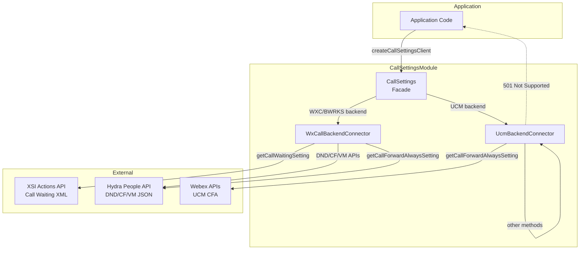
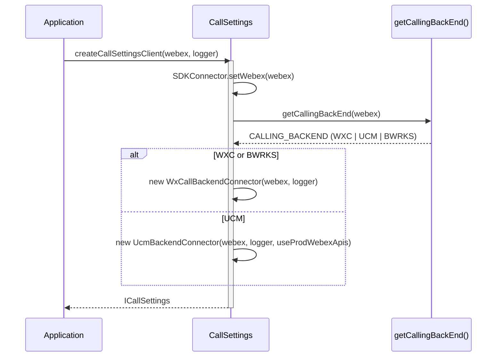
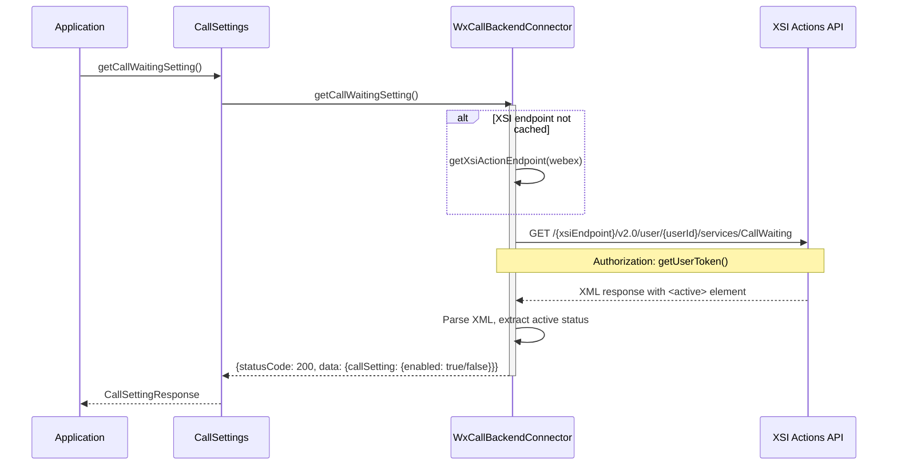
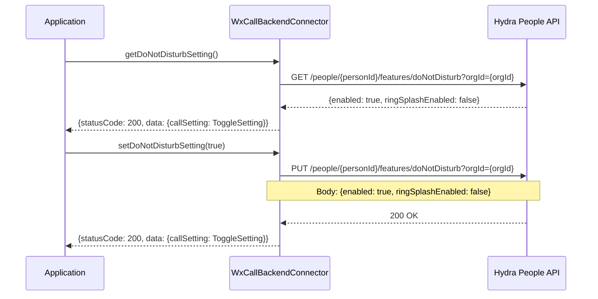
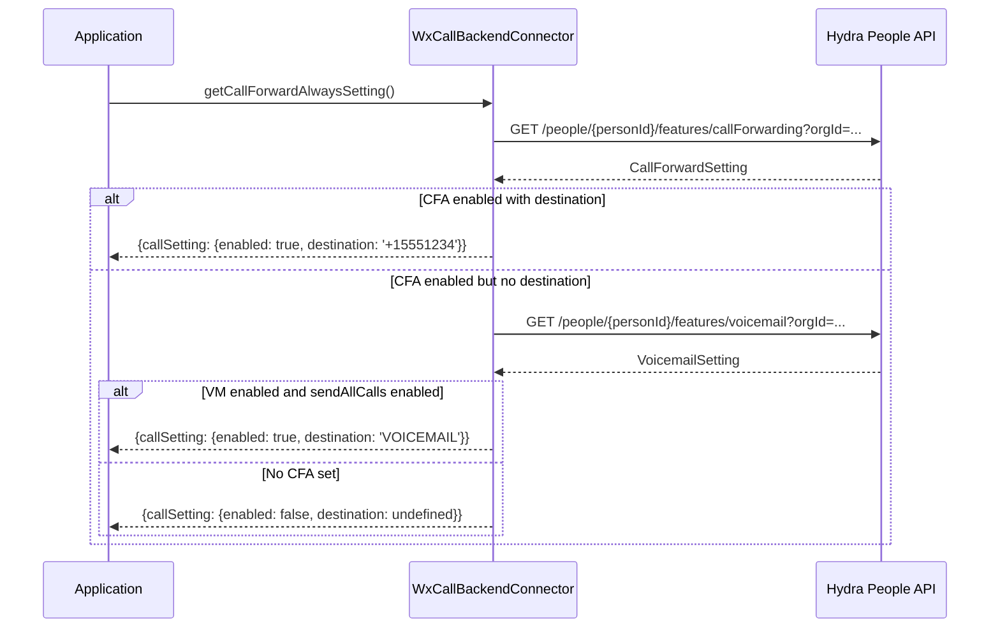
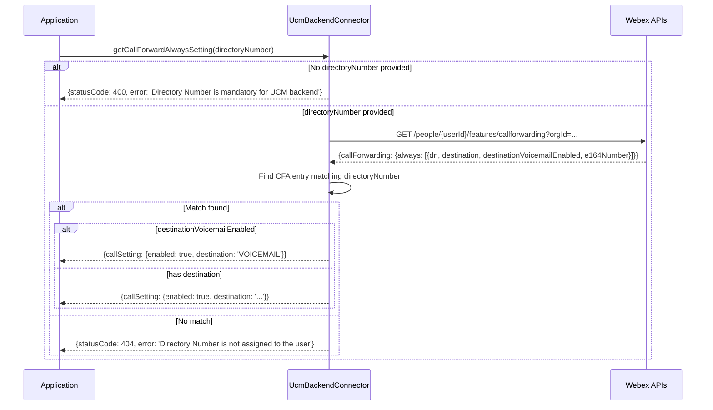

# CallSettings Module — Architecture

## Component Overview

The CallSettings module uses a **strategy pattern**: the `CallSettings` facade delegates all operations to a backend-specific connector chosen at construction time. The architecture is: **Application -> CallSettings -> BackendConnector (WXC or UCM) -> Backend API**.

### Component Table

| Layer | Component | File | Key Responsibilities |
|-------|-----------|------|---------------------|
| **Facade** | `CallSettings` | `CallSettings.ts` | Backend detection, connector initialization, API delegation |
| **WXC Connector** | `WxCallBackendConnector` | `WxCallBackendConnector.ts` | XSI Actions (call waiting), Hydra People API (DND, CF, VM, CFA) |
| **UCM Connector** | `UcmBackendConnector` | `UcmBackendConnector.ts` | Webex APIs for CFA with directory number; 501 for unsupported methods |

### Singletons and Factories

| Component | Access Pattern | Lifecycle |
|-----------|---------------|-----------|
| `CallSettings` | `createCallSettingsClient(webex, logger, useProdWebexApis?)` factory | One per application |
| `SDKConnector` | Frozen singleton via `import SDKConnector` | Global, set once via `setWebex()` |
| `WxCallBackendConnector` | Created internally by `CallSettings.initializeBackendConnector()` | One per CallSettings |
| `UcmBackendConnector` | Created internally by `CallSettings.initializeBackendConnector()` | One per CallSettings |

### File Structure

```
CallSettings/
├── CallSettings.ts                 # Facade class with backend delegation
├── CallSettings.test.ts            # Facade unit tests
├── WxCallBackendConnector.ts       # WXC/Broadworks backend implementation
├── WxCallBackendConnector.test.ts  # WXC connector unit tests
├── UcmBackendConnector.ts          # UCM backend implementation
├── UcmBackendConnector.test.ts     # UCM connector unit tests
├── types.ts                        # ICallSettings, setting types, response types
├── constants.ts                    # Endpoints, method names
├── testFixtures.ts                 # Test fixtures
└── ai-docs/
    ├── AGENTS.md                   # Module agent doc
    └── ARCHITECTURE.md             # This file
```

---

## Data Flows

### Backend Selection Flow



---

## Sequence Diagrams

### 1. Backend Connector Initialization



### 2. Get Call Waiting (WXC — XSI Actions)



### 3. Get/Set DND (WXC — Hydra API)



### 4. Get Call Forward Always (WXC — Composite)



### 5. Get Call Forward Always (UCM — Directory Number)



---

## Key Constants

### API Endpoints

| Constant | Value | Description |
|----------|-------|-------------|
| `PEOPLE_ENDPOINT` | `'people'` | Hydra People API path segment |
| `DND_ENDPOINT` | `'features/doNotDisturb'` | DND feature endpoint |
| `CF_ENDPOINT` | `'features/callForwarding'` | Call forwarding feature endpoint |
| `VM_ENDPOINT` | `'features/voicemail'` | Voicemail feature endpoint |
| `CALL_WAITING_ENDPOINT` | `'CallWaiting'` | XSI call waiting service endpoint |
| `XSI_VERSION` | `'v2.0'` | XSI Actions API version |
| `ORG_ENDPOINT` | `'orgId'` | Organization ID query parameter |
| `USER_ENDPOINT` | `'user'` | XSI user path segment |

---

## Troubleshooting Guide

### 1. 501 Not Supported for UCM

**Symptoms:** Methods like `getCallWaitingSetting`, `getDoNotDisturbSetting`, etc. return `statusCode: 501`

**Explanation:** The UCM backend connector intentionally returns 501 for most methods. Only `getCallForwardAlwaysSetting` is implemented for UCM.

### 2. Call Waiting Fails on WXC

**Symptoms:** `getCallWaitingSetting` returns an error

**Possible Causes:**
- XSI Actions endpoint not resolvable
- User token expired
- XSI service unavailable

**What happens internally:**
The WXC connector lazily resolves the XSI endpoint on first call and caches it. If resolution fails, the error propagates.

### 3. CFA Returns Wrong State

**Symptoms:** `getCallForwardAlwaysSetting` returns unexpected enabled/destination values

**What happens internally (WXC):**
1. Fetches full call forwarding settings
2. If CFA `enabled` is true AND `destination` is set: returns the destination
3. If CFA `enabled` is true but no destination: checks voicemail settings
4. If voicemail `enabled` AND `sendAllCalls.enabled`: returns `destination: 'VOICEMAIL'`
5. Otherwise: returns `enabled: false`

### 4. UCM CFA Requires Directory Number

**Symptoms:** `getCallForwardAlwaysSetting()` returns `statusCode: 400` on UCM

**Fix:** Pass the user's directory number: `getCallForwardAlwaysSetting('1234')`

---

## Related Documentation

- [AGENTS.md](./AGENTS.md) — Overview, examples, public API
