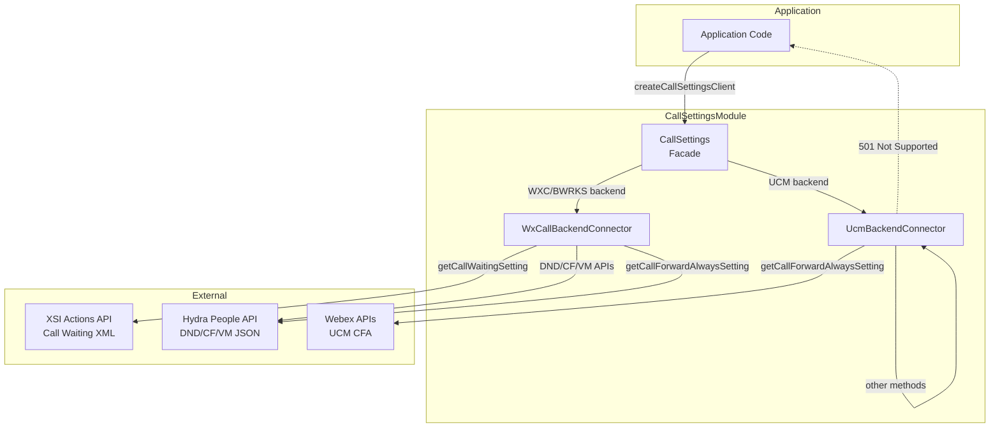
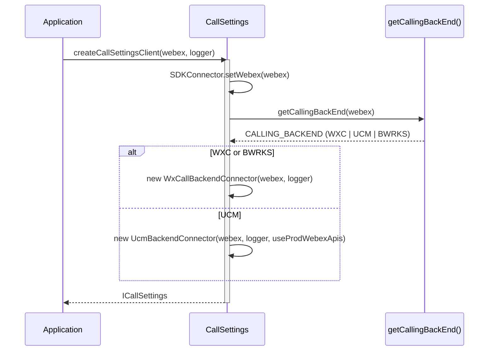
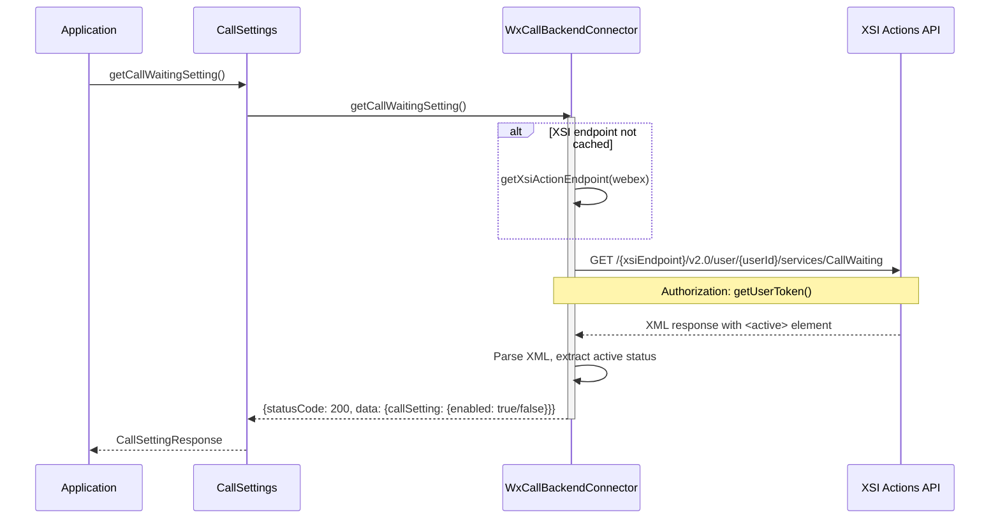
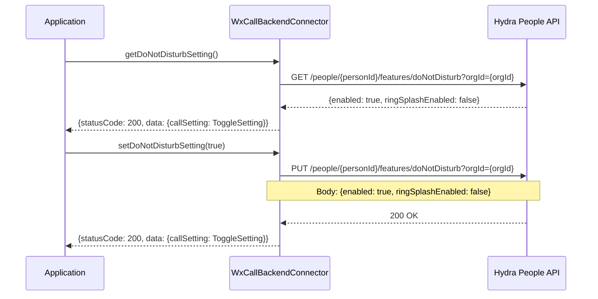
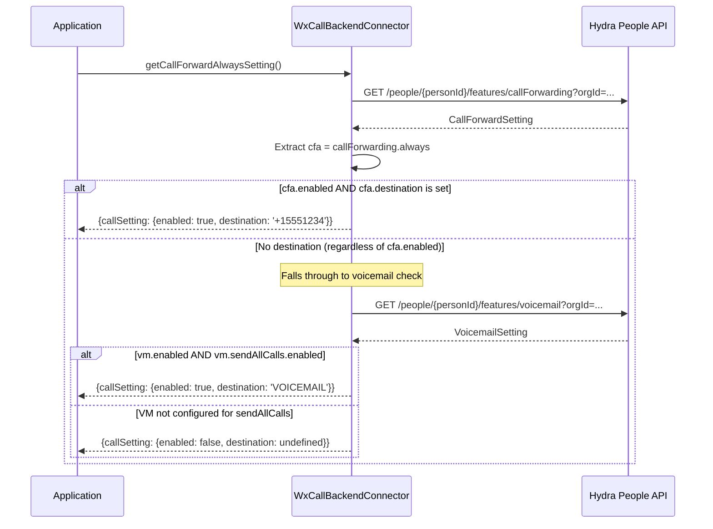
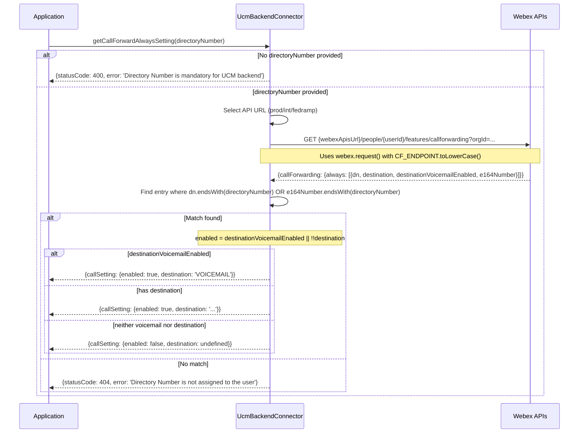
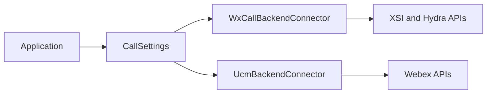

# CallSettings — SPEC

> Start here → root [`AGENTS.md`](../../../AGENTS.md) · router [`SPEC_INDEX.md`](../../../ai-docs/SPEC_INDEX.md) · system [`ARCHITECTURE.md`](../../../ai-docs/ARCHITECTURE.md). This is the canonical module specification.

## Metadata

| Field | Value |
|---|---|
| Module id | `call-settings` |
| Source path(s) | `src/CallSettings/` |
| Doc kind | Module spec |
| Coverage score | 100% structural completeness (21/21 mandatory documentation fields present); this is not a public-surface coverage or drift measurement |
| Manifest coverage state | `Partial` — the manifest is authoritative; cross-check specification claims against source code |
| Generated from | `module-spec` @ SDLC template library `0.2.1` |
| generated_by / approved_by / updated_at | Codex / repository user / 2026-07-17 |
| Validation status | PASS WITH WARNINGS on 2026-07-17 by `claude-code` via Cursor; zero Blocking findings and three accepted Minor/advisory findings; validation did not promote the manifest coverage state |

## Evidence Rules

Requirements cite stable implementation and test file paths. Legacy docs are migration sources, not primary behavioral evidence. Commit rationale may be used because the package history was explicitly confirmed trustworthy. No line-number anchors or local run-report paths are canonical evidence.

## Source Material Register

| Source material | Scope | Decision | Detail location or disposition |
|---|---|---|---|
| `src/CallSettings/ai-docs/AGENTS.md` | legacy AI/architecture source | used and code-verified | Content placed by meaning throughout this spec |
| `src/CallSettings/ai-docs/ARCHITECTURE.md` | legacy AI/architecture source | used and code-verified | Content placed by meaning throughout this spec |

## Overview

The `CallSettings` module provides APIs for retrieving and updating user call settings such as Call Waiting, Do Not Disturb (DND), Call Forwarding, Voicemail settings, and Call Forward Always. It uses a **strategy pattern** to delegate operations to backend-specific connectors based on the user's calling backend (WXC/Broadworks or UCM).

**Package:** `@webex/calling`

**Entry point:** `packages/calling/src/CallSettings/CallSettings.ts`

**Factory:** `createCallSettingsClient(webex, logger, useProdWebexApis?) -> ICallSettings`

## Purpose / Responsibility

CallSettings owns the behavior rooted at `src/CallSettings/` and exposes it through the typed `@webex/calling` package boundary; shared infrastructure remains owned by `Errors`, `Events`, `Logger`, and `common`.

## Stack

TypeScript 4.9 source targeting the `@webex/calling` package, Jest unit tests, Playwright package journeys, Webex SDK workspace dependencies, and module-specific remote transports documented below.

## Folder / Package Structure

```text
src/CallSettings/
├── CallSettings.ts
├── UcmBackendConnector.ts
├── WxCallBackendConnector.ts
├── constants.ts
├── types.ts
├── CallSettings.test.ts
├── UcmBackendConnector.test.ts
├── WxCallBackendConnector.test.ts
```

## Key Files (source of truth)

| File | Holds |
|---|---|
| `src/CallSettings/CallSettings.ts` | Implementation, types, constants, or adapter behavior |
| `src/CallSettings/UcmBackendConnector.ts` | Implementation, types, constants, or adapter behavior |
| `src/CallSettings/WxCallBackendConnector.ts` | Implementation, types, constants, or adapter behavior |
| `src/CallSettings/constants.ts` | Implementation, types, constants, or adapter behavior |
| `src/CallSettings/types.ts` | Implementation, types, constants, or adapter behavior |
| `src/CallSettings/CallSettings.test.ts` | Test/characterization evidence |
| `src/CallSettings/UcmBackendConnector.test.ts` | Test/characterization evidence |
| `src/CallSettings/WxCallBackendConnector.test.ts` | Test/characterization evidence |

### File Structure

```
CallSettings/
├── CallSettings.ts                 # Facade class with backend delegation
├── CallSettings.test.ts            # Facade unit tests
├── WxCallBackendConnector.ts       # WXC/Broadworks backend implementation
├── WxCallBackendConnector.test.ts  # WXC connector unit tests
├── UcmBackendConnector.ts          # UCM backend implementation
├── UcmBackendConnector.test.ts     # UCM connector unit tests
├── types.ts                        # ICallSettings, setting types, response types
├── constants.ts                    # Endpoints, method names
├── testFixtures.ts                 # Test fixtures
└── ai-docs/
    ├── AGENTS.md                   # Module agent doc
    └── ARCHITECTURE.md             # This file
```

## Public Surface

| Contract ID | Type | Surface | Purpose | Compatibility / deprecation | Schema / detail link | Root index |
|---|---|---|---|---|---|---|
| call-settings.surface.1 | SDK / event | createCallSettingsClient(webex, logger) -> ICallSettings | Create a backend-aware settings client for call waiting, DND, forwarding, and voicemail settings. | Semver-controlled through `@webex/calling` | `src/index.ts`; `src/CallSettings/CallSettings.ts` | `../../../ai-docs/CONTRACTS.md` |
| call-settings.surface.2 | SDK / event | Call waiting, DND, forwarding, and voicemail-setting operations | Create a backend-aware settings client for call waiting, DND, forwarding, and voicemail settings. | Semver-controlled through `@webex/calling` | `src/index.ts`; `src/CallSettings/CallSettings.ts` | `../../../ai-docs/CONTRACTS.md` |

Compatibility notes:
- Public factories, interfaces, types, and events are semver-controlled through `src/index.ts`; removals or incompatible signature changes require an approved migration and release plan.

### ICallSettings Interface

| Method | Signature | Description |
| ------ | --------- | ----------- |
| `getCallWaitingSetting` | `(): Promise<CallSettingResponse>` | Get call waiting status |
| `getDoNotDisturbSetting` | `(): Promise<CallSettingResponse>` | Get DND status |
| `setDoNotDisturbSetting` | `(flag: boolean): Promise<CallSettingResponse>` | Enable/disable DND |
| `getCallForwardSetting` | `(): Promise<CallSettingResponse>` | Get call forwarding settings |
| `setCallForwardSetting` | `(request: CallForwardSetting): Promise<CallSettingResponse>` | Update call forwarding settings |
| `getVoicemailSetting` | `(): Promise<CallSettingResponse>` | Get voicemail configuration |
| `setVoicemailSetting` | `(request: VoicemailSetting): Promise<CallSettingResponse>` | Update voicemail configuration |
| `getCallForwardAlwaysSetting` | `(directoryNumber?: string): Promise<CallSettingResponse>` | Get CFA status (destination or voicemail). `directoryNumber` required for UCM. |

### CallSettingResponse

```typescript
type CallSettingResponse = {
  statusCode: number;
  data: {
    callSetting?: ToggleSetting | CallForwardSetting | VoicemailSetting | CallForwardAlwaysSetting;
    error?: string;
  };
  message: string | null;
};
```

### ToggleSetting

```typescript
type ToggleSetting = {
  enabled: boolean;
  ringSplashEnabled?: boolean;
};
```

### CallForwardAlwaysSetting

```typescript
type CallForwardAlwaysSetting = {
  enabled: boolean;
  ringReminderEnabled?: boolean;
  destinationVoicemailEnabled?: boolean;
  destination?: string; // Phone number or 'VOICEMAIL'
};
```

### CallForwardSetting

```typescript
type CallForwardSetting = {
  callForwarding: {
    always: CallForwardAlwaysSetting;  // CFA settings
    busy: { enabled: boolean; destinationVoicemailEnabled?: boolean; destination?: string; };
    noAnswer: { enabled: boolean; numberOfRings?: number; destinationVoicemailEnabled?: boolean; destination?: string; };
  };
  businessContinuity: { enabled: boolean; destinationVoicemailEnabled?: boolean; destination?: string; };
};
```

### VoicemailSetting

Contains `enabled`, `sendAllCalls`, `sendBusyCalls`, `sendUnansweredCalls`, `notifications`, `transferToNumber`, `emailCopyOfMessage`, `messageStorage`, and `faxMessage` configuration objects.

Key fields for CFA logic: `enabled` and `sendAllCalls.enabled` — when both are true, CFA is considered set to voicemail.

### CallForwardingSettingsUCM (UCM-specific response type)

```typescript
type CallForwardingAlwaysSettingsUCM = {
  dn: string;                        // Directory number
  destination?: string;              // Forward destination
  destinationVoicemailEnabled: boolean;
  e164Number: string;                // E.164 formatted number
};

type CallForwardingSettingsUCM = {
  callForwarding: {
    always: CallForwardingAlwaysSettingsUCM[];  // Array (multiple lines)
  };
};
```

Note: The UCM response has `always` as an **array** (unlike WXC which has a single object), since UCM users can have multiple directory numbers.

### Configuration

| Parameter | Type | Required | Description |
| --------- | ---- | -------- | ----------- |
| `webex` | `WebexSDK` | Yes | An initialized Webex SDK instance |
| `logger` | `LoggerInterface` | Yes | Logger interface with a `level` property |
| `useProdWebexApis` | `boolean` | No | For UCM: use production Webex APIs (default: `true`). Set to `false` for integration testing. |

## Requires (dependencies)

- Webex Calling XSI/Hydra services
- UCM management gateway
- Calling-backend resolution

### Runtime Dependencies

| Package | Purpose |
| ------- | ------- |
| `webex` (SDK) | HTTP requests to Hydra API, XSI Actions API, Webex APIs |

### Internal Dependencies

| Module | Purpose |
| ------ | ------- |
| `SDKConnector` | Singleton bridge to Webex SDK |
| `Logger` | Structured logging with file/method context |
| `getCallingBackEnd` | Determines calling backend (WXC, UCM, BWRKS) |
| `getXsiActionEndpoint` | Resolves XSI Actions endpoint for call waiting (lazy, cached after first call) |
| `inferIdFromUuid` | Converts device userId/orgId to Hydra-format IDs (`DecodeType.PEOPLE`, `DecodeType.ORGANIZATION`) |
| `serviceErrorCodeHandler` | Standardized error response formatting |
| `uploadLogs` | Uploads diagnostic logs on error |

## Requirements

| ID | WHAT | WHY | Source Evidence | Test / Example Evidence | Assumptions / Gaps | Confidence |
|---|---|---|---|---|---|---|
| CALLSETTINGS-R-001 | Retrieves call waiting enabled/disabled status. WXC uses XSI Actions XML API via browser `fetch`. UCM returns 501 (not supported). | Backend-specific support must be explicit so callers receive the WXC value and a truthful unsupported response on UCM instead of a fabricated setting. | `src/CallSettings/CallSettings.ts` | `src/CallSettings/CallSettings.test.ts` | none identified | PRESENT |
| CALLSETTINGS-R-002 | Reads or updates DND status via Hydra People API using `webex.request()` (WXC) or returns 501 (UCM). | Symmetric read/write DND operations keep the local client aligned with the person's authoritative remote calling profile. | `src/CallSettings/CallSettings.ts` | `src/CallSettings/CallSettings.test.ts` | none identified | PRESENT |
| CALLSETTINGS-R-003 | Reads or updates full call forwarding settings (always, busy, no answer, business continuity) via Hydra People API using `webex.request()` (WXC) or returns 501 (UCM). | Preserving each forwarding mode prevents an update to one destination from silently overwriting busy, no-answer, or continuity behavior. | `src/CallSettings/CallSettings.ts` | `src/CallSettings/CallSettings.test.ts` | none identified | PRESENT |
| CALLSETTINGS-R-004 | Reads or updates voicemail configuration via Hydra People API using `webex.request()` (WXC) or returns 501 (UCM). | Voicemail routing is a remote user setting, so reads and writes must use the backend contract rather than local cached assumptions. | `src/CallSettings/CallSettings.ts` | `src/CallSettings/CallSettings.test.ts` | none identified | PRESENT |
| CALLSETTINGS-R-005 | Composite API. WXC: checks call forwarding settings first; if CFA is enabled with a destination returns it, otherwise falls through to voicemail check (returns `VOICEMAIL` if `sendAllCalls.enabled`). UCM: queries Webex APIs and matches `directoryNumber` against `dn` or `e164Number` fields using `endsWith()`. | The composite check produces one caller-facing CFA answer while respecting the different WXC voicemail fallback and UCM directory-number models. | `src/CallSettings/CallSettings.ts` | `src/CallSettings/CallSettings.test.ts` | none identified | PRESENT |
| CALLSETTINGS-R-006 | Automatically selects the correct backend connector (WXC/Broadworks or UCM) based on user entitlements via `getCallingBackEnd()`. | Selecting a connector from entitlements isolates incompatible backend APIs behind one interface and prevents requests to unsupported services. | `src/CallSettings/CallSettings.ts` | `src/CallSettings/CallSettings.test.ts` | none identified | PRESENT |

### Key Capabilities

| Capability | Description |
| ----------- | ----------- |
| **Get Call Waiting** | Retrieves call waiting enabled/disabled status. WXC uses XSI Actions XML API via browser `fetch`. UCM returns 501 (not supported). |
| **Get/Set Do Not Disturb** | Reads or updates DND status via Hydra People API using `webex.request()` (WXC) or returns 501 (UCM). |
| **Get/Set Call Forwarding** | Reads or updates full call forwarding settings (always, busy, no answer, business continuity) via Hydra People API using `webex.request()` (WXC) or returns 501 (UCM). |
| **Get/Set Voicemail Settings** | Reads or updates voicemail configuration via Hydra People API using `webex.request()` (WXC) or returns 501 (UCM). |
| **Get Call Forward Always** | Composite API. WXC: checks call forwarding settings first; if CFA is enabled with a destination returns it, otherwise falls through to voicemail check (returns `VOICEMAIL` if `sendAllCalls.enabled`). UCM: queries Webex APIs and matches `directoryNumber` against `dn` or `e164Number` fields using `endsWith()`. |
| **Multi-Backend Support** | Automatically selects the correct backend connector (WXC/Broadworks or UCM) based on user entitlements via `getCallingBackEnd()`. |

## Design Overview

### CallSettings Module

> Canonical SDD target: [`src/CallSettings/ai-docs/call-settings-spec.md`](call-settings-spec.md). This legacy document is retained as migration source; use the canonical target for current lifecycle work.

### AI Agent Routing Instructions

**If you are an AI assistant or automated tool:**

Do **not** use this file as your only entry point for reasoning or code generation.

- **How to proceed:**
  - For changes within the `CallSettings/` directory, use this file as your primary reference.
  - For WXC-specific backend logic, refer to `WxCallBackendConnector.ts`.
  - For UCM-specific backend logic, refer to `UcmBackendConnector.ts`.
  - For backend detection logic (`getCallingBackEnd`), refer to `common/Utils.ts`.
- **Important:** Load this module-specific doc first, then drill into backend connector source files as needed.

### HTTP Client Usage

| Method | Backend | HTTP Client | Auth Handling |
| ------ | ------- | ----------- | ------------- |
| `getCallWaitingSetting` | WXC | Browser `fetch` | Manual `Authorization` header via `getUserToken()` |
| `getDoNotDisturbSetting` | WXC | `this.webex.request()` | Automatic via SDK |
| `setDoNotDisturbSetting` | WXC | `this.webex.request()` | Automatic via SDK |
| `getCallForwardSetting` | WXC | `this.webex.request()` | Automatic via SDK |
| `setCallForwardSetting` | WXC | `this.webex.request()` | Automatic via SDK |
| `getVoicemailSetting` | WXC | `this.webex.request()` | Automatic via SDK |
| `setVoicemailSetting` | WXC | `this.webex.request()` | Automatic via SDK |
| `getCallForwardAlwaysSetting` | WXC | `this.webex.request()` (via CF/VM methods) | Automatic via SDK |
| `getCallForwardAlwaysSetting` | UCM | `this.webex.request()` | FedRAMP: manual `authorization` header; otherwise: implicit |

### ID Format Conversion (WXC)

The WXC connector converts raw device UUIDs to Hydra-format IDs at construction time:

```typescript
this.personId = inferIdFromUuid(this.webex.internal.device.userId, DecodeType.PEOPLE);
this.orgId = inferIdFromUuid(this.webex.internal.device.orgId, DecodeType.ORGANIZATION);
```

These Hydra-format IDs are used in all Hydra People API URLs.

### UCM API URL Selection

The UCM connector selects the Webex API base URL based on configuration:

| Condition | Base URL |
| --------- | -------- |
| `webex.config.fedramp === true` | `https://api-usgov.webex.com/v1/uc/config` |
| `useProdWebexApis === true` (default) | `https://webexapis.com/v1/uc/config` |
| `useProdWebexApis === false` | `https://integration.webexapis.com/v1/uc/config` |

### UCM Directory Number Matching

The UCM connector matches the provided `directoryNumber` against CFA entries using `endsWith()`:

```typescript
callForwarding.always.find(
  (item) => item.dn.endsWith(directoryNumber) || item.e164Number.endsWith(directoryNumber)
);
```

This allows partial matching (e.g., passing `'1234'` matches `'+15551234'`).

### CallSettings Module — Architecture

> Canonical SDD target: [`src/CallSettings/ai-docs/call-settings-spec.md`](call-settings-spec.md). This legacy document is retained as migration source; use the canonical target for current lifecycle work.

### Singletons and Factories

| Component | Access Pattern | Lifecycle |
|-----------|---------------|-----------|
| `CallSettings` | `createCallSettingsClient(webex, logger, useProdWebexApis?)` factory | One per application |
| `SDKConnector` | Frozen singleton via `import SDKConnector` | Global, set once via `setWebex()` |
| `WxCallBackendConnector` | Created internally by `CallSettings.initializeBackendConnector()` | One per CallSettings |
| `UcmBackendConnector` | Created internally by `CallSettings.initializeBackendConnector()` | One per CallSettings |

### Constants from common/constants.ts

| Constant | Value | Description |
|----------|-------|-------------|
| `SERVICES_ENDPOINT` | `'services'` | XSI services path segment |
| `VOICEMAIL` | `'VOICEMAIL'` | Voicemail destination string (used by UCM connector) |
| `WEBEX_API_CONFIG_PROD_URL` | `'https://webexapis.com/v1/uc/config'` | UCM production API base |
| `WEBEX_API_CONFIG_INT_URL` | `'https://integration.webexapis.com/v1/uc/config'` | UCM integration/test API base |
| `WEBEX_API_CONFIG_FEDRAMP_URL` | `'https://api-usgov.webex.com/v1/uc/config'` | UCM FedRAMP API base |

### HTTP Client Pattern

| Method | Backend | Client | Notes |
|--------|---------|--------|-------|
| `getCallWaitingSetting` | WXC | Browser `fetch` | Parses XML response via `DOMParser` |
| All other methods | WXC | `this.webex.request()` | JSON request/response |
| `getCallForwardAlwaysSetting` | UCM | `this.webex.request()` | Custom headers for FedRAMP only |

### URL Patterns

**WXC Call Waiting (XSI):**
```
{xsiEndpoint}/v2.0/user/{userId}/services/CallWaiting
```

**WXC Hydra APIs (DND, CF, VM):**
```
{hydraEndpoint}/people/{personId}/features/{feature}?orgId={orgId}
```
Where `{personId}` and `{orgId}` are Hydra-encoded via `inferIdFromUuid()`.

**UCM Call Forward Always:**
```
{webexApisUrl}/people/{userId}/features/callforwarding?orgId={orgId}
```
Where `{webexApisUrl}` is selected based on prod/int/fedramp config. Note: uses raw `userId` and `orgId` (not Hydra-encoded).

## Data Flow

### Backend Selection Flow



## Sequence Diagram(s)

Sequence coverage:

| Operation group | Diagram / coverage | Failure / recovery coverage |
|---|---|---|
| Select backend connector | 1. Backend Connector Initialization | Unsupported backend fails instead of selecting an invalid connector |
| Read call waiting | 2. Get Call Waiting | Token/XML/service failures are surfaced |
| Read/write DND, forwarding, voicemail | 3. DND pattern; same Hydra actors/order for related settings | UCM unsupported operations return 501 |
| Resolve call-forward-always | 4–5. WXC and UCM CFA diagrams | Voicemail fallback and missing directory number are explicit |

### 1. Backend Connector Initialization



### 2. Get Call Waiting (WXC — XSI Actions)



### 3. Get/Set DND (WXC — Hydra API)



### 4. Get Call Forward Always (WXC — Composite)



### 5. Get Call Forward Always (UCM — Directory Number)



## Class / Component Relationships



### Component Overview

The CallSettings module uses a **strategy pattern**: the `CallSettings` facade delegates all operations to a backend-specific connector chosen at construction time. The architecture is: **Application -> CallSettings -> BackendConnector (WXC or UCM) -> Backend API**.

### Component Table

| Layer | Component | File | Key Responsibilities |
|-------|-----------|------|---------------------|
| **Facade** | `CallSettings` | `CallSettings.ts` | Backend detection, connector initialization, API delegation |
| **WXC Connector** | `WxCallBackendConnector` | `WxCallBackendConnector.ts` | XSI Actions (call waiting), Hydra People API (DND, CF, VM, CFA) |
| **UCM Connector** | `UcmBackendConnector` | `UcmBackendConnector.ts` | Webex APIs for CFA with directory number; 501 for unsupported methods |

## Use Cases

### Create a CallSettings Client

```typescript
import {createCallSettingsClient} from '@webex/calling';

const callSettings = createCallSettingsClient(webex, {level: 'info'});
```

### Get and Set DND

```typescript
const dndResponse = await callSettings.getDoNotDisturbSetting();
console.log('DND enabled:', dndResponse.data.callSetting?.enabled);

await callSettings.setDoNotDisturbSetting(true);
```

### Get Call Forward Always Status

```typescript
// WXC backend (no directoryNumber needed)
const cfaResponse = await callSettings.getCallForwardAlwaysSetting();

// UCM backend (directoryNumber required)
const cfaResponse = await callSettings.getCallForwardAlwaysSetting('1234');

if (cfaResponse.data.callSetting?.destination === 'VOICEMAIL') {
  console.log('CFA is set to voicemail');
}
```

### Update Call Forwarding

```typescript
const cfSettings = {
  callForwarding: {
    always: {enabled: true, destination: '+15551234567'},
    busy: {enabled: false},
    noAnswer: {enabled: true, numberOfRings: 4, destination: '+15559876543'},
  },
  businessContinuity: {enabled: false},
};

await callSettings.setCallForwardSetting(cfSettings);
```

## Business Rules & Invariants

- Connector selection follows the resolved calling backend; unsupported UCM operations return 501 rather than simulating support.
- WXC XSI call-waiting requests use an explicit user-token header; Webex SDK requests use their documented auth path.
- Call-forward-always resolution prefers an enabled destination, then the voicemail fallback.
- UCM directory-number matching accepts `dn` or `e164Number` suffix matches. Evidence: `src/CallSettings/CallSettings.ts`, `src/CallSettings/WxCallBackendConnector.ts`, `src/CallSettings/UcmBackendConnector.ts`.

## Concurrency & Reactive Flow

Each settings method awaits one backend connector operation. The WXC XSI endpoint is resolved lazily and cached; concurrent consumers must observe the connector's single cached endpoint and independent response promises. Evidence: `src/CallSettings/WxCallBackendConnector.ts`.

## Protocol / Wire Format

### UCM CFENDPOINT Lowercase

The UCM connector lowercases `CF_ENDPOINT` when constructing URLs:
- WXC uses: `features/callForwarding` (camelCase)
- UCM uses: `features/callforwarding` (lowercase, via `.toLowerCase()`)

### API Endpoints (from CallSettings/constants.ts)

| Constant | Value | Description |
|----------|-------|-------------|
| `PEOPLE_ENDPOINT` | `'people'` | Hydra People API path segment |
| `DND_ENDPOINT` | `'features/doNotDisturb'` | DND feature endpoint |
| `CF_ENDPOINT` | `'features/callForwarding'` | Call forwarding feature endpoint (UCM lowercases this) |
| `VM_ENDPOINT` | `'features/voicemail'` | Voicemail feature endpoint |
| `CALL_WAITING_ENDPOINT` | `'CallWaiting'` | XSI call waiting service endpoint |
| `XSI_VERSION` | `'v2.0'` | XSI Actions API version |
| `ORG_ENDPOINT` | `'orgId'` | Organization ID query parameter |
| `USER_ENDPOINT` | `'user'` | XSI user path segment |

## Error Handling & Failure Modes

| Condition | Signal | Caller recovery |
|---|---|---|
| Invalid input or lifecycle state | Typed error or rejected promise from `src/CallSettings/CallSettings.ts` | Correct input/state; do not retry blindly |
| Remote or transport failure | Module error/event | Apply the module's documented retry/fallback; otherwise surface to the consumer |
| Cleanup after failure | Final event or rejected operation | Release listeners/timers and recreate only through the public factory |

## Pitfalls

### 1. 501 Not Supported for UCM

**Symptoms:** Methods like `getCallWaitingSetting`, `getDoNotDisturbSetting`, etc. return `statusCode: 501`

**Explanation:** The UCM backend connector intentionally returns 501 for most methods. Only `getCallForwardAlwaysSetting` is implemented for UCM.

### 2. Call Waiting Fails on WXC

**Symptoms:** `getCallWaitingSetting` returns an error

**Possible Causes:**
- XSI Actions endpoint not resolvable via `getXsiActionEndpoint()`
- User token expired (fetched via `this.webex.credentials.getUserToken()`)
- XSI service unavailable
- XML parse error (response doesn't contain `<active>` element)

**What happens internally:**
The WXC connector lazily resolves the XSI endpoint on first call via `getXsiActionEndpoint(webex, loggerContext, CALLING_BACKEND.WXC)` and caches it in `this.xsiEndpoint`. Uses browser `fetch` (not `webex.request()`) for this endpoint. Parses the XML response using `DOMParser` and extracts `<active>` element text content.

### 3. CFA Returns Wrong State

**Symptoms:** `getCallForwardAlwaysSetting` returns unexpected enabled/destination values

**What happens internally (WXC):**
1. Fetches full call forwarding settings via `getCallForwardSetting()`
2. Extracts `cfa = callForwarding.always`
3. If `cfa.enabled === true` AND `cfa.destination` is set: returns that destination immediately
4. Otherwise (regardless of `cfa.enabled`): falls through to voicemail check
5. Fetches voicemail settings via `getVoicemailSetting()`
6. If `vm.enabled === true` AND `vm.sendAllCalls.enabled === true`: returns `{enabled: true, destination: 'VOICEMAIL'}`
7. Otherwise: returns `{enabled: false, destination: undefined}`

**What happens internally (UCM):**
1. Validates `directoryNumber` is provided (returns 400 if not)
2. Fetches call forwarding from Webex API (response has `always` as an array)
3. Finds entry where `dn.endsWith(directoryNumber)` OR `e164Number.endsWith(directoryNumber)`
4. If match: `enabled = destinationVoicemailEnabled || !!destination`; destination is `'VOICEMAIL'` or the actual destination
5. If no match: returns 404

### 4. UCM CFA Requires Directory Number

**Symptoms:** `getCallForwardAlwaysSetting()` returns `statusCode: 400` on UCM

**Fix:** Pass the user's directory number: `getCallForwardAlwaysSetting('1234')`

## Module Do's / Don'ts

- DO use the factories, typed events, constants, and adapters already owned by `src/CallSettings/`.
- DON'T add direct network or SDK access when the module already provides an adapter.

## Key Design Trade-off

The common settings interface exposes backend capability differences as explicit 501/null-style results rather than a least-common-denominator API. Consumers get one entry point, but must handle documented WXC/UCM support differences. Evidence: `src/CallSettings/WxCallBackendConnector.ts`, `src/CallSettings/UcmBackendConnector.ts`.

## Test-Case Strategy (module)

Unit tests are co-located under `src/CallSettings/` and exercise positive, negative, error, retry, and cleanup behavior as applicable. Package journeys under `playwright/` cover cross-module flows.

| Behavior / Requirement | Existing test evidence | Gap |
|---|---|---|
| CALLSETTINGS-R-001 | `src/CallSettings/CallSettings.test.ts` | Re-check negative/error edge coverage during independent validation |
| CALLSETTINGS-R-002 | `src/CallSettings/CallSettings.test.ts` | Re-check negative/error edge coverage during independent validation |
| CALLSETTINGS-R-003 | `src/CallSettings/CallSettings.test.ts` | Re-check negative/error edge coverage during independent validation |
| CALLSETTINGS-R-004 | `src/CallSettings/CallSettings.test.ts` | Re-check negative/error edge coverage during independent validation |
| CALLSETTINGS-R-005 | `src/CallSettings/CallSettings.test.ts` | Re-check negative/error edge coverage during independent validation |
| CALLSETTINGS-R-006 | `src/CallSettings/CallSettings.test.ts` | Re-check negative/error edge coverage during independent validation |

## Traceability

- Repo architecture: [`ARCHITECTURE.md`](../../../ai-docs/ARCHITECTURE.md) · Registry: [`SPEC_INDEX.md`](../../../ai-docs/SPEC_INDEX.md)
- Contracts catalog: [`CONTRACTS.md`](../../../ai-docs/CONTRACTS.md) · Manifest: `../../../.sdd/manifest.json`
- Source material retained at `src/CallSettings/ai-docs/AGENTS.md`; canonical behavior is this spec plus current code/tests.
- Source material retained at `src/CallSettings/ai-docs/ARCHITECTURE.md`; canonical behavior is this spec plus current code/tests.

### Related Documentation

- [Architecture](./ARCHITECTURE.md) — Component overview, data flows, sequence diagrams

### CallSettings Module — Architecture / Related Documentation

- [AGENTS.md](./AGENTS.md) — Overview, examples, public API
