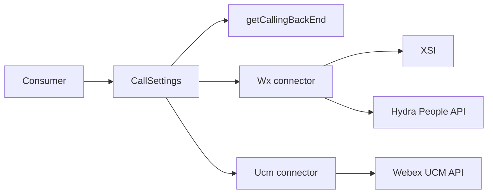
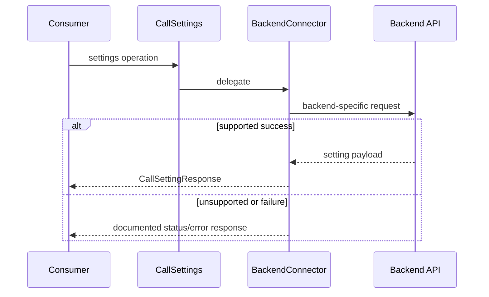
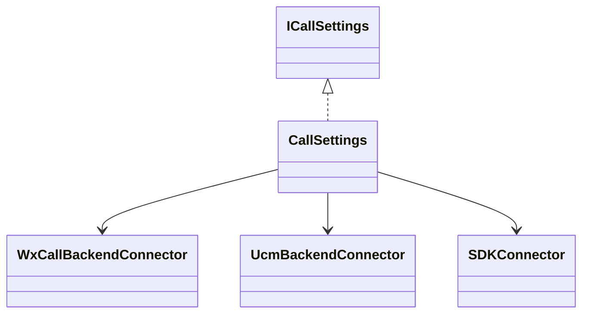

# CallSettings — SPEC

> Canonical module spec. Router: [`SPEC_INDEX.md`](../../../ai-docs/SPEC_INDEX.md).

## Metadata
| Field | Value |
|---|---|
| Module id | `call-settings` |
| Source path(s) | `src/CallSettings/` |
| Doc kind | Module spec |
| Coverage score | 100% structural field coverage; `.generated/sdd/coverage-review-2026-07-04.md` |
| Generated from | `module-spec` @ SDLC template library `0.2.0` |
| generated_by / approved_by / updated_at | Codex / repository user / 2026-07-04 |
| Validation status | pass — Claude Code, 2026-07-04, zero Blocking findings |

## Evidence Rules
Source/test paths support claims; backend behavior is not generalized across WXC and UCM.

## Source Material Register
| Source doc | Scope | Decision | Detail location or disposition |
|---|---|---|---|
| `src/CallSettings/ai-docs/AGENTS.md` | public API/types/examples | reconciled | Public Surface, requirements, use cases |
| `src/CallSettings/ai-docs/ARCHITECTURE.md` | connectors/sequences/troubleshooting | reconciled | design, flow, relationships, failures, pitfalls |

## Overview
CallSettings is a facade that detects the user's calling backend and delegates settings operations to WXC/Broadworks or UCM connectors. It covers call waiting, DND, call forwarding, voicemail settings, and call-forward-always behavior subject to backend support.

## Purpose / Responsibility
Own the stable settings API and backend selection/delegation rules; Webex services own stored settings.

## Stack
TypeScript, Webex request client/browser fetch, backend connectors, Jest.

## Folder / Package Structure
```text
CallSettings/{CallSettings.ts,WxCallBackendConnector.ts,UcmBackendConnector.ts,types.ts,constants.ts,testFixtures.ts,*.test.ts,ai-docs/}
```

## Key Files (source of truth)
| File | Holds |
|---|---|
| `src/CallSettings/CallSettings.ts` | facade, factory, backend delegation |
| `src/CallSettings/WxCallBackendConnector.ts` | WXC/Broadworks operations |
| `src/CallSettings/UcmBackendConnector.ts` | UCM operations/unsupported responses |
| `src/CallSettings/types.ts` | `ICallSettings` and setting types |

## Public Surface
| ID | Type | Surface | Purpose | Compatibility | Detail | Root index |
|---|---|---|---|---|---|---|
| calling.settings.create | SDK | `createCallSettingsClient` → `ICallSettings` | get/update call settings | semver public | `src/index.ts`, `types.ts` | `ai-docs/CONTRACTS.md` |

## Requires (dependencies)
Webex SDK, backend detection in `src/common/Utils.ts`, SDKConnector, Hydra People APIs, XSI Actions for WXC call waiting, and UCM APIs for supported CFA behavior.

## Requirements
| ID | WHAT | WHY | Source Evidence | Test Evidence | Gaps | Confidence |
|---|---|---|---|---|---|---|
| CS-R-001 | Select one backend connector from current user entitlements. | Calls must use backend-compatible APIs. | `src/CallSettings/CallSettings.ts`, `src/common/Utils.ts` | `src/CallSettings/CallSettings.test.ts` | none | PRESENT |
| CS-R-002 | Implement WXC call waiting, DND, forwarding, voicemail, and CFA composition. | WXC consumers need the documented setting surface. | `src/CallSettings/WxCallBackendConnector.ts` | connector tests | none | PRESENT |
| CS-R-003 | Implement UCM CFA lookup and return documented unsupported responses for other methods. | Unsupported behavior is part of the consumer contract. | `src/CallSettings/UcmBackendConnector.ts` | connector tests | none | PRESENT |

## Design Overview
The facade resolves the backend once and delegates through a connector interface. WXC mixes XSI XML `fetch` for call waiting with Hydra People JSON requests for other settings. UCM supports directory-number based CFA lookup and explicitly rejects unsupported operations.

## Data Flow


## Sequence Diagram(s)
| Operation group | Diagram | Failure/recovery coverage |
|---|---|---|
| Initialize | Backend selection | unsupported/unknown backend |
| WXC settings | Delegate/request | HTTP/XML failure |
| UCM CFA | Directory match | missing number/no match/unsupported method |


## Class / Component Relationships


## Use Cases
- Get/set DND, forwarding, and voicemail on WXC.
- Read call waiting through XSI on WXC.
- Resolve CFA destination or voicemail on WXC.
- Match UCM directory number and retrieve CFA. Evidence: `src/CallSettings/*.test.ts`.

## State Model
The facade retains the chosen connector and SDK/logger references. Settings remain service-owned; responses are snapshots.

## Business Rules & Invariants
- Backend selection precedes delegation.
- UCM directory number is required for its CFA flow.
- WXC CFA checks forwarding first, then voicemail fallback according to existing logic.

## Concurrency & Reactive Flow
Operations are asynchronous but do not share a durable queue. Each call resolves through the selected connector; callers handle concurrent request ordering.

## Error Handling & Failure Modes
| Condition | Signal | Recovery |
|---|---|---|
| unsupported UCM method | 501-style `CallSettingResponse` | feature-gate or avoid operation |
| missing UCM directory number/no match | error response | provide correct line identity |
| XSI/Hydra failure | status/error response | correct auth/network and retry safely |

## Pitfalls
- Do not send WXC endpoint shapes to UCM or vice versa.
- XSI call waiting is XML/browser-fetch while Hydra settings are JSON/Webex requests.
- Preserve UCM endpoint casing and number matching behavior.

## Module Do's / Don'ts
- DO add backend-specific tests for every API change.
- DON'T convert unsupported behavior into silent success.

## Test-Case Strategy (module)
Facade tests cover backend selection/delegation; connector tests cover payloads, endpoints, CFA branching, unsupported responses, and failures.
| Requirement | Tests | Gap |
|---|---|---|
| CS-R-001..003 | `src/CallSettings/CallSettings.test.ts`, `src/CallSettings/WxCallBackendConnector.test.ts`, `src/CallSettings/UcmBackendConnector.test.ts` | independent validation pending |

## Traceability
- `ai-docs/ARCHITECTURE.md` · `ai-docs/CONTRACTS.md` · `.sdd/manifest.json`

## Reconciled Source Fidelity Appendix

The standard sections above are primary. The quoted snapshots below preserve the complete routed legacy source for fidelity and independent review; their content is mapped by meaning through the Source Material Register.

### Source snapshot: `src/CallSettings/ai-docs/AGENTS.md`

> # CallSettings Module
>
> ## AI Agent Routing Instructions
>
> **If you are an AI assistant or automated tool:**
>
> Do **not** use this file as your only entry point for reasoning or code generation.
>
> - **How to proceed:**
>   - For changes within the `CallSettings/` directory, use this file as your primary reference.
>   - For WXC-specific backend logic, refer to `WxCallBackendConnector.ts`.
>   - For UCM-specific backend logic, refer to `UcmBackendConnector.ts`.
>   - For backend detection logic (`getCallingBackEnd`), refer to `common/Utils.ts`.
> - **Important:** Load this module-specific doc first, then drill into backend connector source files as needed.
>
> ---
>
> ## Overview
>
> The `CallSettings` module provides APIs for retrieving and updating user call settings such as Call Waiting, Do Not Disturb (DND), Call Forwarding, Voicemail settings, and Call Forward Always. It uses a **strategy pattern** to delegate operations to backend-specific connectors based on the user's calling backend (WXC/Broadworks or UCM).
>
> **Package:** `@webex/calling`
>
> **Entry point:** `packages/calling/src/CallSettings/CallSettings.ts`
>
> **Factory:** `createCallSettingsClient(webex, logger, useProdWebexApis?) -> ICallSettings`
>
> ---
>
> ### Key Capabilities
>
> | Capability | Description |
> | ----------- | ----------- |
> | **Get Call Waiting** | Retrieves call waiting enabled/disabled status. WXC uses XSI Actions XML API via browser `fetch`. UCM returns 501 (not supported). |
> | **Get/Set Do Not Disturb** | Reads or updates DND status via Hydra People API using `webex.request()` (WXC) or returns 501 (UCM). |
> | **Get/Set Call Forwarding** | Reads or updates full call forwarding settings (always, busy, no answer, business continuity) via Hydra People API using `webex.request()` (WXC) or returns 501 (UCM). |
> | **Get/Set Voicemail Settings** | Reads or updates voicemail configuration via Hydra People API using `webex.request()` (WXC) or returns 501 (UCM). |
> | **Get Call Forward Always** | Composite API. WXC: checks call forwarding settings first; if CFA is enabled with a destination returns it, otherwise falls through to voicemail check (returns `VOICEMAIL` if `sendAllCalls.enabled`). UCM: queries Webex APIs and matches `directoryNumber` against `dn` or `e164Number` fields using `endsWith()`. |
> | **Multi-Backend Support** | Automatically selects the correct backend connector (WXC/Broadworks or UCM) based on user entitlements via `getCallingBackEnd()`. |
>
> ---
>
> ## Public API
>
> ### ICallSettings Interface
>
> | Method | Signature | Description |
> | ------ | --------- | ----------- |
> | `getCallWaitingSetting` | `(): Promise<CallSettingResponse>` | Get call waiting status |
> | `getDoNotDisturbSetting` | `(): Promise<CallSettingResponse>` | Get DND status |
> | `setDoNotDisturbSetting` | `(flag: boolean): Promise<CallSettingResponse>` | Enable/disable DND |
> | `getCallForwardSetting` | `(): Promise<CallSettingResponse>` | Get call forwarding settings |
> | `setCallForwardSetting` | `(request: CallForwardSetting): Promise<CallSettingResponse>` | Update call forwarding settings |
> | `getVoicemailSetting` | `(): Promise<CallSettingResponse>` | Get voicemail configuration |
> | `setVoicemailSetting` | `(request: VoicemailSetting): Promise<CallSettingResponse>` | Update voicemail configuration |
> | `getCallForwardAlwaysSetting` | `(directoryNumber?: string): Promise<CallSettingResponse>` | Get CFA status (destination or voicemail). `directoryNumber` required for UCM. |
>
> ### Key Types
>
> #### CallSettingResponse
>
> ```typescript
> type CallSettingResponse = {
>   statusCode: number;
>   data: {
>     callSetting?: ToggleSetting | CallForwardSetting | VoicemailSetting | CallForwardAlwaysSetting;
>     error?: string;
>   };
>   message: string | null;
> };
> ```
>
> #### ToggleSetting
>
> ```typescript
> type ToggleSetting = {
>   enabled: boolean;
>   ringSplashEnabled?: boolean;
> };
> ```
>
> #### CallForwardAlwaysSetting
>
> ```typescript
> type CallForwardAlwaysSetting = {
>   enabled: boolean;
>   ringReminderEnabled?: boolean;
>   destinationVoicemailEnabled?: boolean;
>   destination?: string; // Phone number or 'VOICEMAIL'
> };
> ```
>
> #### CallForwardSetting
>
> ```typescript
> type CallForwardSetting = {
>   callForwarding: {
>     always: CallForwardAlwaysSetting;  // CFA settings
>     busy: { enabled: boolean; destinationVoicemailEnabled?: boolean; destination?: string; };
>     noAnswer: { enabled: boolean; numberOfRings?: number; destinationVoicemailEnabled?: boolean; destination?: string; };
>   };
>   businessContinuity: { enabled: boolean; destinationVoicemailEnabled?: boolean; destination?: string; };
> };
> ```
>
> #### VoicemailSetting
>
> Contains `enabled`, `sendAllCalls`, `sendBusyCalls`, `sendUnansweredCalls`, `notifications`, `transferToNumber`, `emailCopyOfMessage`, `messageStorage`, and `faxMessage` configuration objects.
>
> Key fields for CFA logic: `enabled` and `sendAllCalls.enabled` — when both are true, CFA is considered set to voicemail.
>
> #### CallForwardingSettingsUCM (UCM-specific response type)
>
> ```typescript
> type CallForwardingAlwaysSettingsUCM = {
>   dn: string;                        // Directory number
>   destination?: string;              // Forward destination
>   destinationVoicemailEnabled: boolean;
>   e164Number: string;                // E.164 formatted number
> };
>
> type CallForwardingSettingsUCM = {
>   callForwarding: {
>     always: CallForwardingAlwaysSettingsUCM[];  // Array (multiple lines)
>   };
> };
> ```
>
> Note: The UCM response has `always` as an **array** (unlike WXC which has a single object), since UCM users can have multiple directory numbers.
>
> ---
>
> ## Configuration
>
> | Parameter | Type | Required | Description |
> | --------- | ---- | -------- | ----------- |
> | `webex` | `WebexSDK` | Yes | An initialized Webex SDK instance |
> | `logger` | `LoggerInterface` | Yes | Logger interface with a `level` property |
> | `useProdWebexApis` | `boolean` | No | For UCM: use production Webex APIs (default: `true`). Set to `false` for integration testing. |
>
> ---
>
> ## Examples and Use Cases
>
> ### Create a CallSettings Client
>
> ```typescript
> import {createCallSettingsClient} from '@webex/calling';
>
> const callSettings = createCallSettingsClient(webex, {level: 'info'});
> ```
>
> ### Get and Set DND
>
> ```typescript
> const dndResponse = await callSettings.getDoNotDisturbSetting();
> console.log('DND enabled:', dndResponse.data.callSetting?.enabled);
>
> await callSettings.setDoNotDisturbSetting(true);
> ```
>
> ### Get Call Forward Always Status
>
> ```typescript
> // WXC backend (no directoryNumber needed)
> const cfaResponse = await callSettings.getCallForwardAlwaysSetting();
>
> // UCM backend (directoryNumber required)
> const cfaResponse = await callSettings.getCallForwardAlwaysSetting('1234');
>
> if (cfaResponse.data.callSetting?.destination === 'VOICEMAIL') {
>   console.log('CFA is set to voicemail');
> }
> ```
>
> ### Update Call Forwarding
>
> ```typescript
> const cfSettings = {
>   callForwarding: {
>     always: {enabled: true, destination: '+15551234567'},
>     busy: {enabled: false},
>     noAnswer: {enabled: true, numberOfRings: 4, destination: '+15559876543'},
>   },
>   businessContinuity: {enabled: false},
> };
>
> await callSettings.setCallForwardSetting(cfSettings);
> ```
>
> ---
>
> ## Implementation Notes
>
> ### HTTP Client Usage
>
> | Method | Backend | HTTP Client | Auth Handling |
> | ------ | ------- | ----------- | ------------- |
> | `getCallWaitingSetting` | WXC | Browser `fetch` | Manual `Authorization` header via `getUserToken()` |
> | `getDoNotDisturbSetting` | WXC | `this.webex.request()` | Automatic via SDK |
> | `setDoNotDisturbSetting` | WXC | `this.webex.request()` | Automatic via SDK |
> | `getCallForwardSetting` | WXC | `this.webex.request()` | Automatic via SDK |
> | `setCallForwardSetting` | WXC | `this.webex.request()` | Automatic via SDK |
> | `getVoicemailSetting` | WXC | `this.webex.request()` | Automatic via SDK |
> | `setVoicemailSetting` | WXC | `this.webex.request()` | Automatic via SDK |
> | `getCallForwardAlwaysSetting` | WXC | `this.webex.request()` (via CF/VM methods) | Automatic via SDK |
> | `getCallForwardAlwaysSetting` | UCM | `this.webex.request()` | FedRAMP: manual `authorization` header; otherwise: implicit |
>
> ### ID Format Conversion (WXC)
>
> The WXC connector converts raw device UUIDs to Hydra-format IDs at construction time:
>
> ```typescript
> this.personId = inferIdFromUuid(this.webex.internal.device.userId, DecodeType.PEOPLE);
> this.orgId = inferIdFromUuid(this.webex.internal.device.orgId, DecodeType.ORGANIZATION);
> ```
>
> These Hydra-format IDs are used in all Hydra People API URLs.
>
> ### UCM API URL Selection
>
> The UCM connector selects the Webex API base URL based on configuration:
>
> | Condition | Base URL |
> | --------- | -------- |
> | `webex.config.fedramp === true` | `https://api-usgov.webex.com/v1/uc/config` |
> | `useProdWebexApis === true` (default) | `https://webexapis.com/v1/uc/config` |
> | `useProdWebexApis === false` | `https://integration.webexapis.com/v1/uc/config` |
>
> ### UCM Directory Number Matching
>
> The UCM connector matches the provided `directoryNumber` against CFA entries using `endsWith()`:
>
> ```typescript
> callForwarding.always.find(
>   (item) => item.dn.endsWith(directoryNumber) || item.e164Number.endsWith(directoryNumber)
> );
> ```
>
> This allows partial matching (e.g., passing `'1234'` matches `'+15551234'`).
>
> ### UCM CF_ENDPOINT Lowercase
>
> The UCM connector lowercases `CF_ENDPOINT` when constructing URLs:
> - WXC uses: `features/callForwarding` (camelCase)
> - UCM uses: `features/callforwarding` (lowercase, via `.toLowerCase()`)
>
> ---
>
> ## Dependencies
>
> ### Runtime Dependencies
>
> | Package | Purpose |
> | ------- | ------- |
> | `webex` (SDK) | HTTP requests to Hydra API, XSI Actions API, Webex APIs |
>
> ### Internal Dependencies
>
> | Module | Purpose |
> | ------ | ------- |
> | `SDKConnector` | Singleton bridge to Webex SDK |
> | `Logger` | Structured logging with file/method context |
> | `getCallingBackEnd` | Determines calling backend (WXC, UCM, BWRKS) |
> | `getXsiActionEndpoint` | Resolves XSI Actions endpoint for call waiting (lazy, cached after first call) |
> | `inferIdFromUuid` | Converts device userId/orgId to Hydra-format IDs (`DecodeType.PEOPLE`, `DecodeType.ORGANIZATION`) |
> | `serviceErrorCodeHandler` | Standardized error response formatting |
> | `uploadLogs` | Uploads diagnostic logs on error |
>
> ---
>
> ## Related Documentation
>
> - [Architecture](./ARCHITECTURE.md) — Component overview, data flows, sequence diagrams
>

### Source snapshot: `src/CallSettings/ai-docs/ARCHITECTURE.md`

> # CallSettings Module — Architecture
>
> ## Component Overview
>
> The CallSettings module uses a **strategy pattern**: the `CallSettings` facade delegates all operations to a backend-specific connector chosen at construction time. The architecture is: **Application -> CallSettings -> BackendConnector (WXC or UCM) -> Backend API**.
>
> ### Component Table
>
> | Layer | Component | File | Key Responsibilities |
> |-------|-----------|------|---------------------|
> | **Facade** | `CallSettings` | `CallSettings.ts` | Backend detection, connector initialization, API delegation |
> | **WXC Connector** | `WxCallBackendConnector` | `WxCallBackendConnector.ts` | XSI Actions (call waiting), Hydra People API (DND, CF, VM, CFA) |
> | **UCM Connector** | `UcmBackendConnector` | `UcmBackendConnector.ts` | Webex APIs for CFA with directory number; 501 for unsupported methods |
>
> ### Singletons and Factories
>
> | Component | Access Pattern | Lifecycle |
> |-----------|---------------|-----------|
> | `CallSettings` | `createCallSettingsClient(webex, logger, useProdWebexApis?)` factory | One per application |
> | `SDKConnector` | Frozen singleton via `import SDKConnector` | Global, set once via `setWebex()` |
> | `WxCallBackendConnector` | Created internally by `CallSettings.initializeBackendConnector()` | One per CallSettings |
> | `UcmBackendConnector` | Created internally by `CallSettings.initializeBackendConnector()` | One per CallSettings |
>
> ### File Structure
>
> ```
> CallSettings/
> ├── CallSettings.ts                 # Facade class with backend delegation
> ├── CallSettings.test.ts            # Facade unit tests
> ├── WxCallBackendConnector.ts       # WXC/Broadworks backend implementation
> ├── WxCallBackendConnector.test.ts  # WXC connector unit tests
> ├── UcmBackendConnector.ts          # UCM backend implementation
> ├── UcmBackendConnector.test.ts     # UCM connector unit tests
> ├── types.ts                        # ICallSettings, setting types, response types
> ├── constants.ts                    # Endpoints, method names
> ├── testFixtures.ts                 # Test fixtures
> └── ai-docs/
>     ├── AGENTS.md                   # Module agent doc
>     └── ARCHITECTURE.md             # This file
> ```
>
> ---
>
> ## Data Flows
>
> ### Backend Selection Flow
>
> ```mermaid
> flowchart TB
>     subgraph Application
>         App[Application Code]
>     end
>
>     subgraph CallSettingsModule
>         CS[CallSettings\nFacade]
>         WXC[WxCallBackendConnector]
>         UCM[UcmBackendConnector]
>     end
>
>     subgraph External
>         XSI[XSI Actions API\nCall Waiting XML]
>         Hydra[Hydra People API\nDND/CF/VM JSON]
>         WebexAPI[Webex APIs\nUCM CFA]
>     end
>
>     App -->|createCallSettingsClient| CS
>     CS -->|WXC/BWRKS backend| WXC
>     CS -->|UCM backend| UCM
>
>     WXC -->|getCallWaitingSetting| XSI
>     WXC -->|DND/CF/VM APIs| Hydra
>     WXC -->|getCallForwardAlwaysSetting| Hydra
>
>     UCM -->|getCallForwardAlwaysSetting| WebexAPI
>     UCM -->|other methods| UCM
>     UCM -.->|501 Not Supported| App
> ```
>
> ---
>
> ## Sequence Diagrams
>
> ### 1. Backend Connector Initialization
>
> ```mermaid
> sequenceDiagram
>     participant App as Application
>     participant CS as CallSettings
>     participant Utils as getCallingBackEnd()
>
>     App->>CS: createCallSettingsClient(webex, logger)
>     activate CS
>     CS->>CS: SDKConnector.setWebex(webex)
>     CS->>Utils: getCallingBackEnd(webex)
>     Utils-->>CS: CALLING_BACKEND (WXC | UCM | BWRKS)
>
>     alt WXC or BWRKS
>         CS->>CS: new WxCallBackendConnector(webex, logger)
>     else UCM
>         CS->>CS: new UcmBackendConnector(webex, logger, useProdWebexApis)
>     end
>
>     CS-->>App: ICallSettings
>     deactivate CS
> ```
>
> ### 2. Get Call Waiting (WXC — XSI Actions)
>
> ```mermaid
> sequenceDiagram
>     participant App as Application
>     participant CS as CallSettings
>     participant WXC as WxCallBackendConnector
>     participant XSI as XSI Actions API
>
>     App->>CS: getCallWaitingSetting()
>     CS->>WXC: getCallWaitingSetting()
>     activate WXC
>
>     alt XSI endpoint not cached
>         WXC->>WXC: getXsiActionEndpoint(webex)
>     end
>
>     WXC->>XSI: GET /{xsiEndpoint}/v2.0/user/{userId}/services/CallWaiting
>     Note over WXC,XSI: Authorization: getUserToken()
>     XSI-->>WXC: XML response with <active> element
>
>     WXC->>WXC: Parse XML, extract active status
>     WXC-->>CS: {statusCode: 200, data: {callSetting: {enabled: true/false}}}
>     deactivate WXC
>     CS-->>App: CallSettingResponse
> ```
>
> ### 3. Get/Set DND (WXC — Hydra API)
>
> ```mermaid
> sequenceDiagram
>     participant App as Application
>     participant WXC as WxCallBackendConnector
>     participant Hydra as Hydra People API
>
>     App->>WXC: getDoNotDisturbSetting()
>     WXC->>Hydra: GET /people/{personId}/features/doNotDisturb?orgId={orgId}
>     Hydra-->>WXC: {enabled: true, ringSplashEnabled: false}
>     WXC-->>App: {statusCode: 200, data: {callSetting: ToggleSetting}}
>
>     App->>WXC: setDoNotDisturbSetting(true)
>     WXC->>Hydra: PUT /people/{personId}/features/doNotDisturb?orgId={orgId}
>     Note over WXC,Hydra: Body: {enabled: true, ringSplashEnabled: false}
>     Hydra-->>WXC: 200 OK
>     WXC-->>App: {statusCode: 200, data: {callSetting: ToggleSetting}}
> ```
>
> ### 4. Get Call Forward Always (WXC — Composite)
>
> ```mermaid
> sequenceDiagram
>     participant App as Application
>     participant WXC as WxCallBackendConnector
>     participant Hydra as Hydra People API
>
>     App->>WXC: getCallForwardAlwaysSetting()
>     WXC->>Hydra: GET /people/{personId}/features/callForwarding?orgId=...
>     Hydra-->>WXC: CallForwardSetting
>
>     WXC->>WXC: Extract cfa = callForwarding.always
>
>     alt cfa.enabled AND cfa.destination is set
>         WXC-->>App: {callSetting: {enabled: true, destination: '+15551234'}}
>     else No destination (regardless of cfa.enabled)
>         Note over WXC: Falls through to voicemail check
>         WXC->>Hydra: GET /people/{personId}/features/voicemail?orgId=...
>         Hydra-->>WXC: VoicemailSetting
>
>         alt vm.enabled AND vm.sendAllCalls.enabled
>             WXC-->>App: {callSetting: {enabled: true, destination: 'VOICEMAIL'}}
>         else VM not configured for sendAllCalls
>             WXC-->>App: {callSetting: {enabled: false, destination: undefined}}
>         end
>     end
> ```
>
> ### 5. Get Call Forward Always (UCM — Directory Number)
>
> ```mermaid
> sequenceDiagram
>     participant App as Application
>     participant UCM as UcmBackendConnector
>     participant API as Webex APIs
>
>     App->>UCM: getCallForwardAlwaysSetting(directoryNumber)
>
>     alt No directoryNumber provided
>         UCM-->>App: {statusCode: 400, error: 'Directory Number is mandatory for UCM backend'}
>     else directoryNumber provided
>         UCM->>UCM: Select API URL (prod/int/fedramp)
>         UCM->>API: GET {webexApisUrl}/people/{userId}/features/callforwarding?orgId=...
>         Note over UCM,API: Uses webex.request() with CF_ENDPOINT.toLowerCase()
>         API-->>UCM: {callForwarding: {always: [{dn, destination, destinationVoicemailEnabled, e164Number}]}}
>
>         UCM->>UCM: Find entry where dn.endsWith(directoryNumber) OR e164Number.endsWith(directoryNumber)
>
>         alt Match found
>             Note over UCM: enabled = destinationVoicemailEnabled || !!destination
>             alt destinationVoicemailEnabled
>                 UCM-->>App: {callSetting: {enabled: true, destination: 'VOICEMAIL'}}
>             else has destination
>                 UCM-->>App: {callSetting: {enabled: true, destination: '...'}}
>             else neither voicemail nor destination
>                 UCM-->>App: {callSetting: {enabled: false, destination: undefined}}
>             end
>         else No match
>             UCM-->>App: {statusCode: 404, error: 'Directory Number is not assigned to the user'}
>         end
>     end
> ```
>
> ---
>
> ## Key Constants
>
> ### API Endpoints (from `CallSettings/constants.ts`)
>
> | Constant | Value | Description |
> |----------|-------|-------------|
> | `PEOPLE_ENDPOINT` | `'people'` | Hydra People API path segment |
> | `DND_ENDPOINT` | `'features/doNotDisturb'` | DND feature endpoint |
> | `CF_ENDPOINT` | `'features/callForwarding'` | Call forwarding feature endpoint (UCM lowercases this) |
> | `VM_ENDPOINT` | `'features/voicemail'` | Voicemail feature endpoint |
> | `CALL_WAITING_ENDPOINT` | `'CallWaiting'` | XSI call waiting service endpoint |
> | `XSI_VERSION` | `'v2.0'` | XSI Actions API version |
> | `ORG_ENDPOINT` | `'orgId'` | Organization ID query parameter |
> | `USER_ENDPOINT` | `'user'` | XSI user path segment |
>
> ### Constants from `common/constants.ts`
>
> | Constant | Value | Description |
> |----------|-------|-------------|
> | `SERVICES_ENDPOINT` | `'services'` | XSI services path segment |
> | `VOICEMAIL` | `'VOICEMAIL'` | Voicemail destination string (used by UCM connector) |
> | `WEBEX_API_CONFIG_PROD_URL` | `'https://webexapis.com/v1/uc/config'` | UCM production API base |
> | `WEBEX_API_CONFIG_INT_URL` | `'https://integration.webexapis.com/v1/uc/config'` | UCM integration/test API base |
> | `WEBEX_API_CONFIG_FEDRAMP_URL` | `'https://api-usgov.webex.com/v1/uc/config'` | UCM FedRAMP API base |
>
> ### HTTP Client Pattern
>
> | Method | Backend | Client | Notes |
> |--------|---------|--------|-------|
> | `getCallWaitingSetting` | WXC | Browser `fetch` | Parses XML response via `DOMParser` |
> | All other methods | WXC | `this.webex.request()` | JSON request/response |
> | `getCallForwardAlwaysSetting` | UCM | `this.webex.request()` | Custom headers for FedRAMP only |
>
> ### URL Patterns
>
> **WXC Call Waiting (XSI):**
> ```
> {xsiEndpoint}/v2.0/user/{userId}/services/CallWaiting
> ```
>
> **WXC Hydra APIs (DND, CF, VM):**
> ```
> {hydraEndpoint}/people/{personId}/features/{feature}?orgId={orgId}
> ```
> Where `{personId}` and `{orgId}` are Hydra-encoded via `inferIdFromUuid()`.
>
> **UCM Call Forward Always:**
> ```
> {webexApisUrl}/people/{userId}/features/callforwarding?orgId={orgId}
> ```
> Where `{webexApisUrl}` is selected based on prod/int/fedramp config. Note: uses raw `userId` and `orgId` (not Hydra-encoded).
>
> ---
>
> ## Troubleshooting Guide
>
> ### 1. 501 Not Supported for UCM
>
> **Symptoms:** Methods like `getCallWaitingSetting`, `getDoNotDisturbSetting`, etc. return `statusCode: 501`
>
> **Explanation:** The UCM backend connector intentionally returns 501 for most methods. Only `getCallForwardAlwaysSetting` is implemented for UCM.
>
> ### 2. Call Waiting Fails on WXC
>
> **Symptoms:** `getCallWaitingSetting` returns an error
>
> **Possible Causes:**
> - XSI Actions endpoint not resolvable via `getXsiActionEndpoint()`
> - User token expired (fetched via `this.webex.credentials.getUserToken()`)
> - XSI service unavailable
> - XML parse error (response doesn't contain `<active>` element)
>
> **What happens internally:**
> The WXC connector lazily resolves the XSI endpoint on first call via `getXsiActionEndpoint(webex, loggerContext, CALLING_BACKEND.WXC)` and caches it in `this.xsiEndpoint`. Uses browser `fetch` (not `webex.request()`) for this endpoint. Parses the XML response using `DOMParser` and extracts `<active>` element text content.
>
> ### 3. CFA Returns Wrong State
>
> **Symptoms:** `getCallForwardAlwaysSetting` returns unexpected enabled/destination values
>
> **What happens internally (WXC):**
> 1. Fetches full call forwarding settings via `getCallForwardSetting()`
> 2. Extracts `cfa = callForwarding.always`
> 3. If `cfa.enabled === true` AND `cfa.destination` is set: returns that destination immediately
> 4. Otherwise (regardless of `cfa.enabled`): falls through to voicemail check
> 5. Fetches voicemail settings via `getVoicemailSetting()`
> 6. If `vm.enabled === true` AND `vm.sendAllCalls.enabled === true`: returns `{enabled: true, destination: 'VOICEMAIL'}`
> 7. Otherwise: returns `{enabled: false, destination: undefined}`
>
> **What happens internally (UCM):**
> 1. Validates `directoryNumber` is provided (returns 400 if not)
> 2. Fetches call forwarding from Webex API (response has `always` as an array)
> 3. Finds entry where `dn.endsWith(directoryNumber)` OR `e164Number.endsWith(directoryNumber)`
> 4. If match: `enabled = destinationVoicemailEnabled || !!destination`; destination is `'VOICEMAIL'` or the actual destination
> 5. If no match: returns 404
>
> ### 4. UCM CFA Requires Directory Number
>
> **Symptoms:** `getCallForwardAlwaysSetting()` returns `statusCode: 400` on UCM
>
> **Fix:** Pass the user's directory number: `getCallForwardAlwaysSetting('1234')`
>
> ---
>
> ## Related Documentation
>
> - [AGENTS.md](./AGENTS.md) — Overview, examples, public API
>
