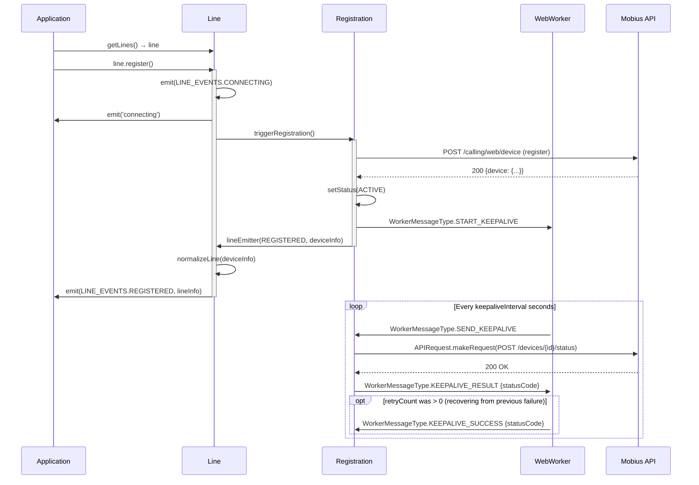
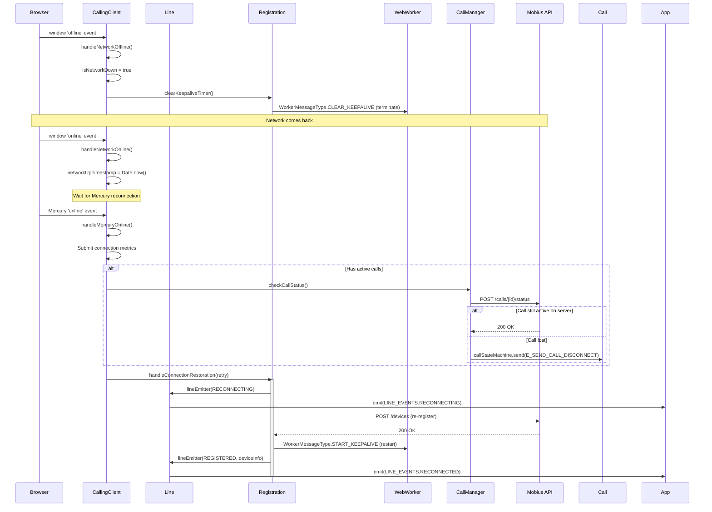
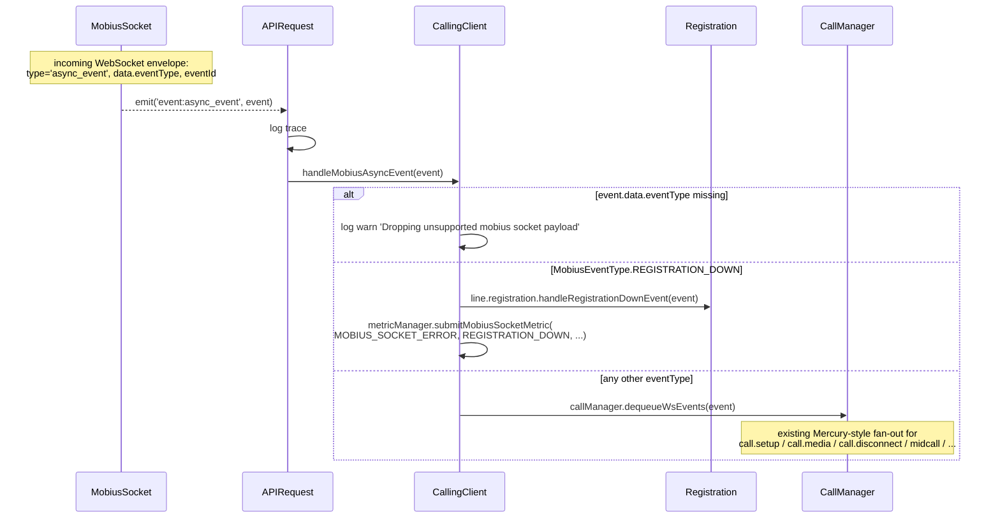
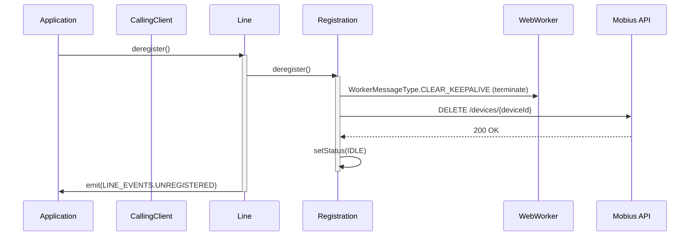

# CallingClient Module — Architecture

## Component Overview

The CallingClient module follows a layered architecture: **Application → CallingClient → Line → Registration / CallManager → APIRequest → (HTTP via Webex SDK *or* WSS via `mobius-socket`) → Mobius API**. Each layer has a distinct responsibility — orchestration (CallingClient), line management (Line), device registration (Registration), call lifecycle (CallManager/Call), transport selection (APIRequest), and SDK bridging (SDKConnector for Mercury / non-Mobius traffic).

### Component Table

| Layer | Component | File | Key Responsibilities |
|-------|-----------|------|---------------------|
| **Orchestrator** | `CallingClient` | `CallingClient.ts` | Mobius discovery, line creation, network resilience, session listener, media engine config, Mobius WSS connect + async-event fan-out (when WSS is enabled) |
| **Line Management** | `Line` | `line/index.ts` | Registration orchestration, call initiation, incoming call forwarding, line event emission |
| **Registration** | `Registration` | `registration/register.ts` | Device register/deregister, keepalive via web worker, failover/failback, reconnection, Mobius WSS connect/disconnect per server URI |
| **API Transport** | `APIRequest` | `utils/request.ts` | Singleton that selects HTTP (`webex.request`) or Mobius WSS (`MobiusSocket.sendWssRequest`) per request, normalises WSS responses to `WebexRequestPayload`, exposes `connectToMobiusSocket` / `disconnectFromMobiusSocket` / `registerMobiusSocketListener` / `unregisterMobiusSocketListener` / `isSocketEnabled` |
| **WSS message mapping** | `deriveMobiusSocketMessageType`, `isSupplementaryServiceMessageType` | `utils/mobiusSocketMapper.ts` | Maps URI + HTTP method → `MOBIUS_SOCKET_MESSAGE_TYPE` for the WSS payload `type` |
| **WSS feature flag** | `isMobiusWssEnabled` | `utils/wsFeatureFlag.ts` | Resolves the WDM developer flag `webrtc-calling-over-ws-CALL-219562` with a `localStorage` override on `localhost`, `127.0.0.1`, and `web-sdk.webex.com` |

> **Note:** `CallManager`, `Call`, and `SDKConnector` are shared entities used across the calling package by all client modules. Their architecture is documented in the package-level source directories. The Mobius WebSocket transport itself (`MobiusSocket`, the `Socket` abstraction, error classes, dedup) is documented in [`mobius-socket/ai-docs/ARCHITECTURE.md`](../../mobius-socket/ai-docs/ARCHITECTURE.md).

### Singletons and Factories

| Component | Access Pattern | Lifecycle |
|-----------|---------------|-----------|
| `CallingClient` | `createClient(webex, config)` factory | One per application |
| `SDKConnector` | `import SDKConnector from '../../SDKConnector'` (frozen instance) | Global, set once via `setWebex()` |
| `CallManager` | `getCallManager(webex, indicator)` | Module-level singleton |
| `MetricManager` | `getMetricManager(webex, indicator)` | Module-level singleton |
| `APIRequest` | `APIRequest.getInstance({webex})` / `createAPIRequest({webex})` | Module-level singleton; `APIRequest.resetInstance()` is exposed for tests. The WDM feature flag is read once at construction into `isMobiusSocketEnabled`. This field is **mutable** — `Registration.attemptRegistrationWithServers` calls `apiRequest.setSocketEnabled(servers[0].startsWith('wss://'))` before each server group, so the transport can vary across groups within the same session. |
| `MobiusSocket` | `getMobiusSocketInstance(webex, configOverrides?)` (via `APIRequest` only) | Module-level singleton, `resetMobiusSocketInstance()` for tests. See [`mobius-socket/ai-docs/ARCHITECTURE.md`](../../mobius-socket/ai-docs/ARCHITECTURE.md). |
| `Line` | Created internally by `CallingClient.createLine()` | One per CallingClient, stored in `lineDict` |
| `Registration` | Created internally by `Line` constructor via `createRegistration()` | One per Line |
| `Call` | Created by `CallManager.createCall()` | One per active call |

### File Structure

```
CallingClient/
├── CallingClient.ts                    # Main orchestrator class
├── CallingClient.test.ts               # Unit tests
├── types.ts                            # ICallingClient, CallingClientConfig
├── constants.ts                        # All constants (endpoints, timers, methods)
├── callingClientFixtures.ts            # Test fixtures
├── callRecordFixtures.ts               # Call record test fixtures
├── windowsChromiumIceWarmupUtils.ts    # ICE warmup for Windows Chromium
├── ai-docs/
│   ├── AGENTS.md                       # Module agent doc
│   └── ARCHITECTURE.md                 # This file
├── line/
│   ├── index.ts                        # Line class
│   ├── types.ts                        # ILine, LINE_EVENTS
│   ├── line.test.ts                    # Line unit tests
│   └── ai-docs/
│       ├── AGENTS.md                   # Line-specific agent doc
│       └── ARCHITECTURE.md             # Line-specific architecture
├── registration/
│   ├── index.ts                        # Re-exports
│   ├── register.ts                     # Registration class
│   ├── types.ts                        # IRegistration
│   ├── webWorker.ts                    # Keepalive web worker
│   ├── webWorkerStr.ts                 # Stringified worker for Blob URL
│   ├── registerFixtures.ts             # Test fixtures
│   ├── register.test.ts               # Unit tests
│   ├── webWorker.test.ts              # Worker unit tests
│   └── ai-docs/
│       ├── AGENTS.md                   # Registration-specific agent doc
│       └── ARCHITECTURE.md             # Registration-specific architecture
├── utils/
│   ├── index.ts                        # Barrel re-exports
│   ├── request.ts                      # APIRequest singleton (HTTP / Mobius WSS transport selector)
│   ├── request.test.ts
│   ├── mobiusSocketMapper.ts           # URI + HTTP method → MOBIUS_SOCKET_MESSAGE_TYPE
│   ├── mobiusSocketMapper.test.ts
│   ├── wsFeatureFlag.ts                # Resolves WSS feature flag (WDM + localStorage override)
│   ├── wsFeatureFlag.test.ts
│   ├── constants.ts                    # MOBIUS_SOCKET_MESSAGE_TYPE enum
│   └── types.ts                        # APIRequestConfig, MobiusSocketResponse, MobiusAsyncEvent, ...
└── calling/
    ├── index.ts                        # Re-exports
    ├── call.ts                         # Call class (XState)
    ├── call.test.ts                    # Call unit tests
    ├── callManager.ts                  # CallManager class
    ├── callManager.test.ts             # CallManager unit tests
    ├── types.ts                        # ICall, ICallManager
    └── CallerId/
        ├── index.ts                    # Caller ID resolution
        ├── index.test.ts               # Unit tests
        └── types.ts 
```

---

## Data Flows

### Layer Communication Flow

```mermaid
flowchart TB
    subgraph Application
        App[Application Code]
    end

    subgraph Orchestrator
        CC[CallingClient<br/>Eventing&lt;CallingClientEventTypes&gt;]
    end

    subgraph Line
        L[Line<br/>Eventing&lt;LineEventTypes&gt;]
    end

    subgraph Registration
        Reg[Registration<br/>IRegistration]
        Worker[Web Worker<br/>Keepalive]
    end

    subgraph Calls
        CM[CallManager<br/>Eventing&lt;CallEventTypes&gt;]
        Call[Call<br/>Eventing&lt;CallEventTypes&gt;]
    end

    subgraph Transport
        API[APIRequest<br/>utils/request.ts<br/>singleton]
        FF[isMobiusWssEnabled<br/>utils/wsFeatureFlag.ts]
        Map[deriveMobiusSocketMessageType<br/>utils/mobiusSocketMapper.ts]
    end

    subgraph Infrastructure
        SDK[SDKConnector<br/>singleton]
        MS[MobiusSocket<br/>singleton<br/>mobius-socket]
        Metrics[MetricManager<br/>singleton]
    end

    subgraph External
        Webex[Webex SDK]
        Mercury[Mercury WebSocket]
        Mobius[Mobius API]
        MobiusWss[Mobius WebSocket<br/>wss://...]
        DS[ds.ciscospark.com<br/>Region Discovery]
    end

    App -->|createClient| CC
    CC -->|createLine| L
    L -->|createRegistration| Reg
    Reg -->|start/stop| Worker
    L -->|makeCall| CM
    CM -->|createCall| Call

    CC -->|emit: error, sessions, outgoing_call,<br/>all_calls_cleared| App
    L -->|emit: registered, incoming_call,<br/>reconnecting, reconnected, error| App
    Call -->|emit: established, disconnect, hold, etc.| App

    CC -->|isSocketEnabled / connectToMobiusSocket /<br/>registerMobiusSocketListener| API
    Reg -->|makeRequest / connect/<br/>disconnectFromMobiusSocket| API
    CM -->|isSocketEnabled| API

    API -->|isMobiusWssEnabled| FF
    API -->|deriveMobiusSocketMessageType| Map

    API -->|HTTP path:<br/>webex.request| Webex
    API -->|WSS path:<br/>getMobiusSocketInstance| MS
    Webex -->|HTTP| Mobius
    MS -->|WebSocket| MobiusWss

    SDK -->|registerListener| Mercury
    Mercury -->|event:mobius<br/>(only when WSS disabled)| CM
    MS -->|event:async_event| API
    API -->|handleMobiusAsyncEvent| CC
    CC -->|registration.down| Reg
    CC -->|other event types| CM

    CC -->|region discovery| DS
    Worker -->|POST /devices/{id}/status| Mobius
```

---

## Sequence Diagrams

### 1. CallingClient Initialization

```mermaid
sequenceDiagram
    participant App as Application
    participant CC as CallingClient
    participant API as APIRequest
    participant MS as MobiusSocket
    participant Line as Line
    participant DS as ds.ciscospark.com
    participant Mobius as Mobius API

    App->>CC: createClient(webex, config)
    activate CC
    CC->>CC: constructor()
    CC->>CC: SDKConnector.setWebex(webex)
    CC->>CC: getCallManager(), getMetricManager()
    CC->>API: APIRequest.getInstance({webex})
    Note over API: Reads isMobiusWssEnabled(webex) ONCE
    CC->>CC: registerSessionsListener()
    CC->>CC: registerCallsClearedListener()

    CC->>CC: init()
    CC->>CC: windowsChromiumIceWarmup() [if Windows Chromium]
    CC->>DS: getClientRegionInfo()
    DS-->>CC: {region, countryCode}
    CC->>Mobius: getMobiusServers(region)
    Mobius-->>CC: {primary: [...], backup: [...],<br/>primaryWss: [...], backupWss: [...]}

    opt apiRequest.isSocketEnabled()
        CC->>CC: connectToMobiusSocket()<br/>(walk primaryWssMobiusUris only;<br/>returns early if list is empty;<br/>backupWssMobiusUris never consulted here)
        CC->>API: apiRequest.connectToMobiusSocket(wssUri)
        API->>MS: getMobiusSocketInstance(webex)<br/>mobiusSocket.connect(wssUri)
        MS-->>API: connected (or fall through to next primary URI)
        CC->>API: apiRequest.registerMobiusSocketListener(handleMobiusAsyncEvent)
        API->>MS: on('event:async_event', handleMobiusAsyncEvent)
    end

    CC->>Line: new Line(userId, deviceUri, mutex,<br/>primaryUris (wss-normalized if WSS),<br/>backupUris (wss-normalized if WSS), ...)
    activate Line
    Line->>Line: createRegistration(lineEmitter, ...)
    Line->>Line: incomingCallListener()
    deactivate Line

    CC-->>App: ICallingClient (init complete)
    deactivate CC

    Note over App: App must call getLines() and line.register() explicitly
```

> **Notes:**
> - For detailed information on the registration process and its architecture, refer to the [Registration architecture documentation](../registration/ai-docs/ARCHITECTURE.md).
> - The Mobius WebSocket connection lifecycle (backoff, reconnect, shutdown switchover, token refresh) is documented in [`mobius-socket/ai-docs/ARCHITECTURE.md`](../../mobius-socket/ai-docs/ARCHITECTURE.md).
> - `CallingClient.connectToMobiusSocket()` only walks `primaryWssMobiusUris`; it never consults `backupWssMobiusUris`. If `primaryWssMobiusUris` is empty it returns immediately; if all primary URIs fail it logs a warning and continues without throwing. In either case, `Registration.attemptRegistrationWithServers` will retry `apiRequest.connectToMobiusSocket(wssNormalizedUrl)` per server during line registration (backup URIs are reached at that stage via the normal failover path).


### 2. Line Registration



### 3. Network Disruption and Recovery



### 4. Transport Selection (HTTP vs Mobius WSS)

Most Mobius traffic in this module goes through `APIRequest.makeRequest()`. Three flows intentionally bypass `APIRequest` and always use `webex.request()` directly regardless of the WSS flag: **Mobius server discovery** (`getMobiusServers`), **device listing** (`getDevices`), and **failback health pings** (`Registration.isPrimaryActive`). Everything else — registration, keepalive, call setup/state/media/supplementary services — is routed through `makeRequest`.

**`isMobiusSocketEnabled` is not fixed after construction.** `Registration.attemptRegistrationWithServers` calls `apiRequest.setSocketEnabled(servers[0].startsWith('wss://'))` before processing each server group. This means a feature-enabled client will fall back to HTTP for any group whose server URLs have no `wss://` scheme (e.g. a primary or backup group with no WSS URLs). Primary and backup groups are evaluated independently, so WSS and HTTP can be used for different groups within the same session.

```mermaid
flowchart TD
  Init[APIRequest constructor] --> FF[isMobiusWssEnabled(webex)]
  FF --> Dev{WDM developer flag<br/>'webrtc-calling-over-ws-CALL-219562' === true?}
  Dev --> LS{localStorage override<br/>on allowed origin?}
  LS -- 'true' --> EnabledLS[isMobiusSocketEnabled = true]
  LS -- 'false' --> DisabledLS[isMobiusSocketEnabled = false]
  LS -- null (not set / disallowed origin) --> UseDev{Dev flag value}
  UseDev -- true --> Enabled[isMobiusSocketEnabled = true]
  UseDev -- false --> Disabled[isMobiusSocketEnabled = false]

  EnabledLS --> Override
  Enabled --> Override
  DisabledLS --> Override
  Disabled --> Override

  Override[Registration.attemptRegistrationWithServers:<br/>apiRequest.setSocketEnabled<br/>servers0.startsWith wss://]
  Override --> Req

  Req[makeRequest(request)]
  Req --> Branch{isMobiusSocketEnabled?}

  Branch -- no --> HTTP[webex.request(request)<br/>HTTP path]
  HTTP --> Out[Promise&lt;WebexRequestPayload&gt;]

  Branch -- yes --> Type[deriveMobiusSocketMessageType(uri, method)]
  Type --> Known{type !== UNKNOWN?}
  Known -- no --> Throw[throw Error<br/>'Unknown Mobius Socket message type']
  Known -- yes --> Supp{isSupplementaryServiceMessageType?}
  Supp -- yes --> Tok[await credentials.getUserToken()]
  Supp -- no --> NoTok[authorization = '']
  Tok --> Send
  NoTok --> Send
  Send[mobiusSocket.sendWssRequest({<br/>type, trackingId,<br/>metadata: {headers, userAgent, authorization},<br/>data: request.body})]
  Send --> Norm{success?}
  Norm -- yes --> NormOK[normalizeWsResponse → WebexRequestPayload]
  Norm -- no --> NormErr[normalizeWsError → throws WebexRequestPayload-shaped error]
  NormOK --> Out
  NormErr --> Out
```

**Allowed `localStorage` origins:** `localhost`, `127.0.0.1`, `web-sdk.webex.com`, and any subdomain of those. The override key is `mobius-wss-enabled` with values `'true'` (force enable), `'false'` (force disable), or unset/other (defer to backend).

**Response normalisation:** Whether the request was sent over HTTP or WSS, callers see the same shape:
- `WebexRequestPayload.statusCode`
- `WebexRequestPayload.body` (mapped from `wsResponse.data` on WSS path)
- `WebexRequestPayload.headers.trackingid` (preserved from the response or carried error)

This keeps `handleRegistrationErrors`, `handleCallErrors`, and downstream consumers transport-agnostic.

### 5. Mobius WSS Async-Event Fan-Out

`MobiusSocket` emits async events as `event:async_event`. `APIRequest.registerMobiusSocketListener` attaches `CallingClient.handleMobiusAsyncEvent`, which dispatches based on `event.data.eventType`:



> **Mercury vs WSS split:** When WSS is enabled, `CallManager.listenForWsEvents()` skips the Mercury `event:mobius` listener (`if (!this.apiRequest.isSocketEnabled())`). Async events arrive exclusively via the WebSocket path. When WSS is disabled, `CallManager` listens on Mercury as before and `CallingClient` does not register a Mobius socket listener.

### 6. Deregistration and Cleanup



---

## Key Constants

### Timers and Intervals

| Constant | Value | Description |
|----------|-------|-------------|
| `DEFAULT_KEEPALIVE_INTERVAL` | 30s | Keepalive POST frequency |
| `DEFAULT_REHOMING_INTERVAL_MIN` | 60s | Min failback timer |
| `DEFAULT_REHOMING_INTERVAL_MAX` | 120s | Max failback timer |
| `DEFAULT_SESSION_TIMER` | 10 min | Call session timeout |
| `NETWORK_FLAP_TIMEOUT` | 5000ms | Debounce for network flap |
| `REG_TRY_BACKUP_TIMER_VAL_IN_SEC` | 114s | Timer before trying backup servers |
| `REG_FAILBACK_429_MAX_RETRIES` | 5 | Max retries on 429 during failback |
| `MAX_CALL_KEEPALIVE_RETRY_COUNT` | 4 | Max call keepalive retries |

### API Endpoints

| Constant | Value | Description |
|----------|-------|-------------|
| `DEVICES_ENDPOINT_RESOURCE` | `'devices'` | Device registration (full path: `{mobiusUrl}devices`) |
| `CALL_ENDPOINT_RESOURCE` | `'call'` | Single call resource endpoint |
| `CALLS_ENDPOINT_RESOURCE` | `'calls'` | Call collection endpoint (used for call creation) |
| `CALL_STATUS_RESOURCE` | `'status'` | Call status check |
| `MEDIA_ENDPOINT_RESOURCE` | `'media'` | Media/ROAP messaging |

### Mobius WSS Transport Constants

| Constant | Source | Description |
|----------|--------|-------------|
| `WEBRTC_CALLING_OVER_WS_FEATURE_KEY` | `utils/wsFeatureFlag.ts` | WDM developer flag key: `'webrtc-calling-over-ws-CALL-219562'`. |
| `ALLOWED_ORIGINS` | `utils/wsFeatureFlag.ts` | `['localhost', '127.0.0.1', 'web-sdk.webex.com']` for the `localStorage` `mobius-wss-enabled` override. |
| `MOBIUS_SOCKET_MESSAGE_TYPE` | `utils/constants.ts` | Enum of WSS request/response types: `register`, `unregister`, `device_status`, `device_get`, `device_list`, `call_setup`, `call_state`, `call_status`, `call_media`, `call_hold`, `call_resume`, `call_transfer`, `call_delete`, plus their `.response` counterparts and `UNKNOWN`. |
| `MOBIUS_SOCKET_ACTION` | `Metrics/types.ts` | Telemetry actions used by `submitMobiusSocketMetric`: `connect`, `disconnect`, `listener_registered`, `listener_unregistered`, `registration_down`. |
| WSS close codes used by `CallingClient` / `Registration` | `mobius-socket` | `3050` with reason `'done (permanent)'` is used for permanent disconnects (failover, failback, registration-down, restoring previous registration); other codes are documented in [`mobius-socket/ai-docs/ARCHITECTURE.md`](../../mobius-socket/ai-docs/ARCHITECTURE.md). |

---

## Troubleshooting Guide

### 1. Line Never Reaches REGISTERED State

**Symptoms:** `LINE_EVENTS.REGISTERED` never fires after `line.register()`

**Possible Causes:**
- Mobius server unreachable
- Invalid or expired Webex token
- SDKConnector not initialized with Webex instance

**Debug Steps:**
```typescript
callingClient.on('callingClient:error', (error) => {
  console.error('Client error:', error.getError());
});

line.on('error', (error) => {
  console.error('Line error:', error.getError());
});
```

### 2. Calls Drop After Network Recovery

**Symptoms:** Calls disconnect after temporary network loss

**Possible Causes:**
- Mercury reconnection taking too long
- Call keepalive retry count exceeded (`MAX_CALL_KEEPALIVE_RETRY_COUNT = 4`)
- Mobius server lost the call state

**What happens internally:**
1. `handleNetworkOffline()` clears the keepalive timer
2. `handleMercuryOnline()` triggers `checkCallStatus()` for active calls
3. If the Mobius server no longer has the call, `E_SEND_CALL_DISCONNECT` is sent
4. If no calls are active, `handleConnectionRestoration()` re-registers the device

### 3. Registration Fails with 429

**Symptoms:** Registration fails repeatedly; `LINE_EVENTS.ERROR` with `TOO_MANY_REQUESTS`

**What happens internally:**
- Registration respects `Retry-After` headers from Mobius
- Retries up to `REG_FAILBACK_429_MAX_RETRIES` (5) times
- On exhaustion, falls back to backup Mobius servers

### 4. Keepalive Failures

**Symptoms:** `LINE_EVENTS.RECONNECTING` fires repeatedly

**What happens internally:**
1. Web Worker sends `POST /devices/{id}/status` every `keepaliveInterval` seconds
2. On failure, Worker sends `KEEPALIVE_FAILURE` to main thread
3. Registration emits `RECONNECTING` and attempts recovery
4. On persistent failure, triggers full reconnect via `reconnectOnFailure()`

### 5. No Incoming Calls

**Symptoms:** `LINE_EVENTS.INCOMING_CALL` never fires

**Possible Causes:**
- WSS path: `MobiusSocket` not connected or `event:async_event` listener was never registered (check `apiRequest.isSocketEnabled()` and that `CallingClient.init()` reached the listener-attach step).
- HTTP path: Mercury WebSocket not connected (`webex.internal.mercury.connected === false`).
- Line not registered (check `line.getStatus() === 'active'`).
- CallManager not listening for Mobius events.

**Debug Steps:**
```typescript
console.log('Line status:', line.getStatus());
console.log('WSS enabled:', apiRequest.isSocketEnabled());
console.log('Mobius socket connected URL:', apiRequest.getConnectedWebSocketUrl());
console.log('Mercury connected:', webex.internal.mercury.connected);
```

### 6. WSS Path: Requests Fail with "Unknown Mobius Socket message type"

**Symptoms:** `APIRequest.makeRequest()` throws `Error: Unknown Mobius Socket message type: UNKNOWN`.

**Cause:** The request URI + HTTP method combination is not handled by `deriveMobiusSocketMessageType` in `utils/mobiusSocketMapper.ts`.

**What to check:**
1. Confirm the URI matches one of the known patterns (`/services/callhold/*`, `/services/calltransfer/commit`, `/calls/{id}/media`, `/calls/{id}/status`, `/calls/{id}`, `/devices/{id}/status`, `/devices/{id}`, `/devices`, `.../device`, `.../call`).
2. Check that the HTTP method matches the expected method for that pattern (e.g. `PATCH`/`DELETE` for `/calls/{id}`, `DELETE`/`GET` for `/devices/{id}`).
3. If a new endpoint is being added, extend `deriveMobiusSocketMessageType` and the `MOBIUS_SOCKET_MESSAGE_TYPE` enum together, then add a unit test in `utils/mobiusSocketMapper.test.ts`.

### 7. WSS Path: Mobius Socket Never Connects

**Symptoms:** When `apiRequest.isSocketEnabled()` is true, `connect()` rejects and `Registration` logs `connection attempt failed` from `MobiusSocket`.

**Possible Causes:**
- WSS URI list (`primaryWssMobiusUris` / `backupWssMobiusUris`) empty after Mobius discovery — discovery did not return WSS URIs for the region.
- WDM `webex.internal.device.webSocketUrl` not populated (used as fallback by `MobiusSocket.connect()`).
- Authentication failed (`BadRequest 4400`, `Forbidden 4403`, or `NotAuthorized 4401` from `MobiusSocket`).
- Network blocks WebSocket traffic to the Mobius host.

**What happens internally:**
- `CallingClient.connectToMobiusSocket()` walks `primaryWssMobiusUris` only (returns early when the list is empty); `backupWssMobiusUris` is never consulted at init time — failures fall through without throwing.
- `Registration.attemptRegistrationWithServers` retries the WSS connection per server before the `POST /device` call.
- If WSS connect succeeds but registration still fails, `Registration` calls `apiRequest.disconnectFromMobiusSocket({code: 3050, reason: 'done (permanent)'})` before trying the next server.

See [`mobius-socket/ai-docs/ARCHITECTURE.md`](../../mobius-socket/ai-docs/ARCHITECTURE.md) for the full close-code matrix and retry policy.

---

## Subdirectory Architecture Docs

For detailed architecture of subsystems:

- **Line:** [line/ai-docs/ARCHITECTURE.md](../line/ai-docs/ARCHITECTURE.md) — Line class internals, lineEmitter pattern, call initiation
- **Registration:** [registration/ai-docs/ARCHITECTURE.md](../registration/ai-docs/ARCHITECTURE.md) — Registration flow, keepalive web worker, failover/failback, WSS connect/disconnect touch points

---

## Related Documentation

- [AGENTS.md](./AGENTS.md) — Overview, examples, public API
- [`mobius-socket` AGENTS.md](../../mobius-socket/ai-docs/AGENTS.md) — Mobius WebSocket transport overview and public API
- [`mobius-socket` ARCHITECTURE.md](../../mobius-socket/ai-docs/ARCHITECTURE.md) — Internals of the WSS transport (backoff, dedup, shutdown switchover, token refresh, close-code matrix)
