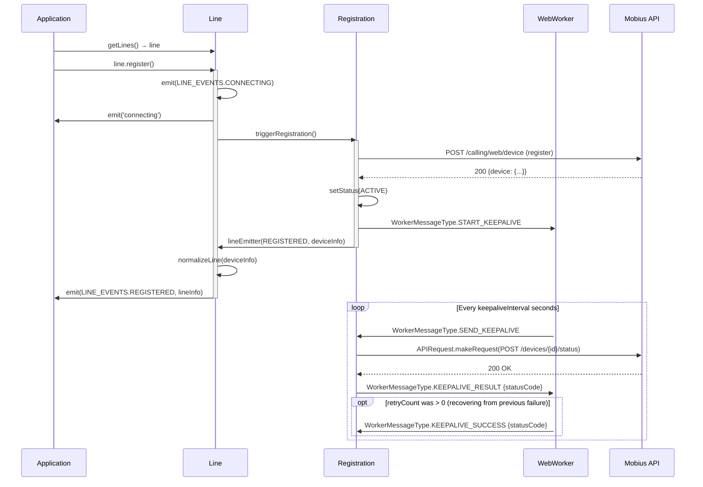
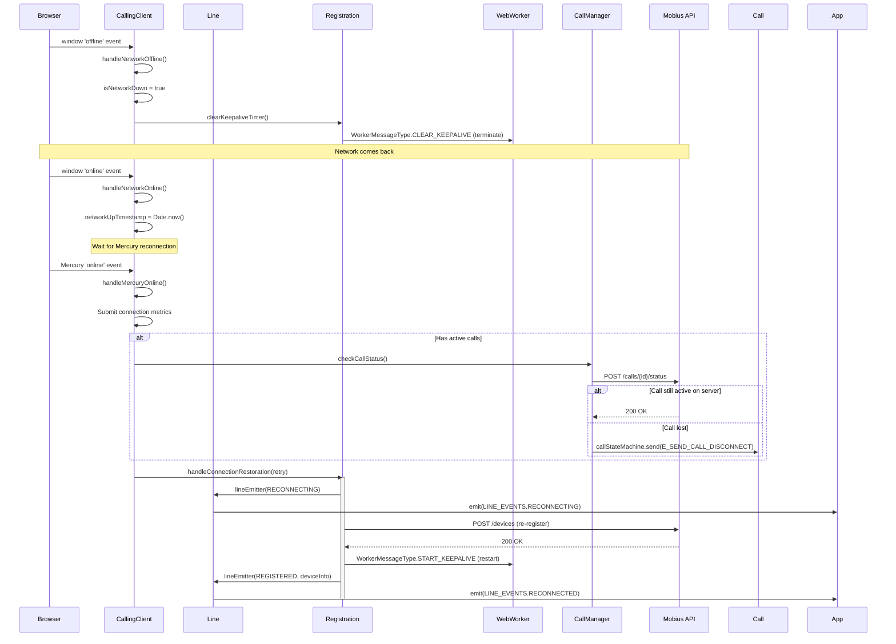
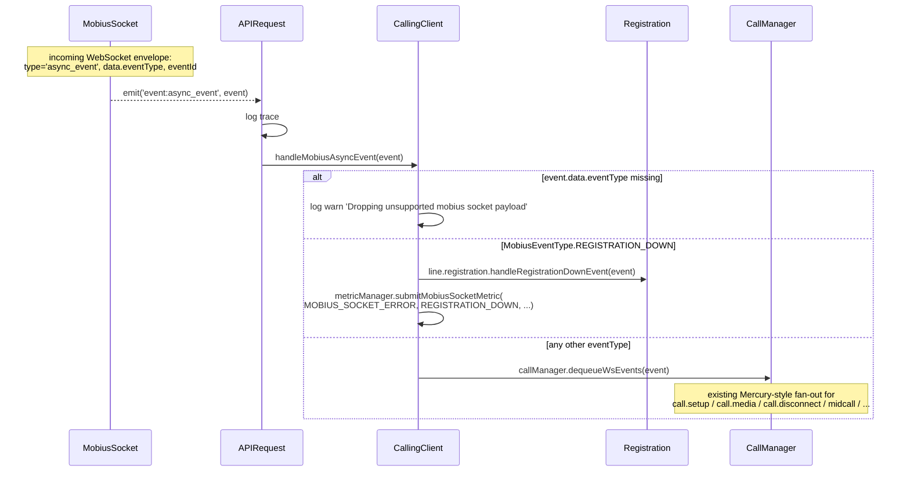
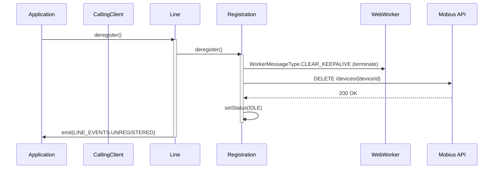
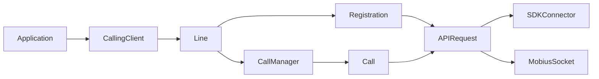
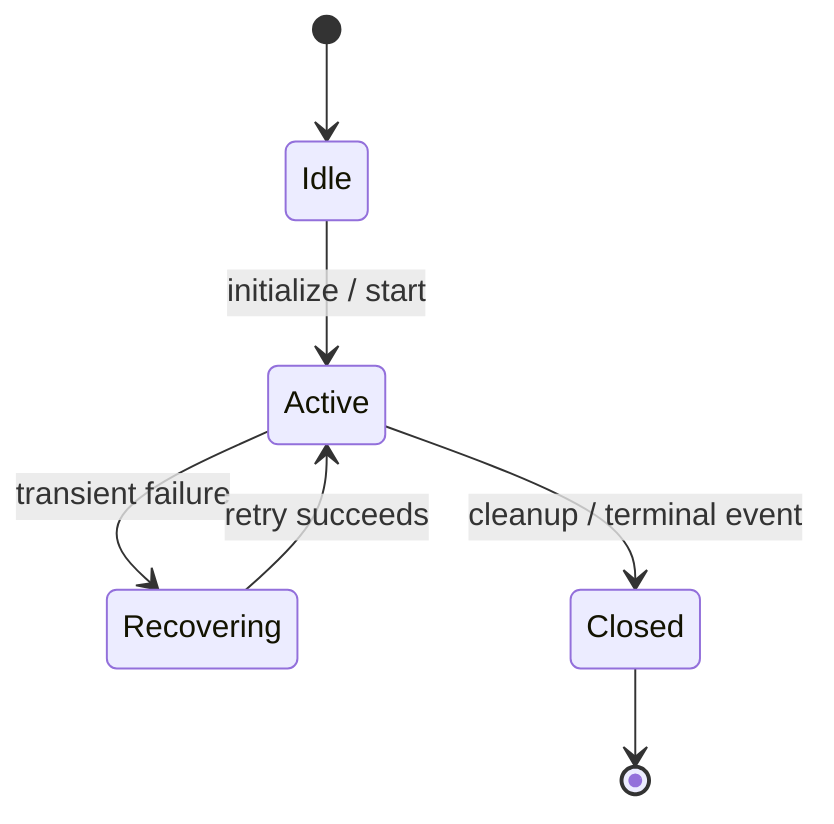

# CallingClient — SPEC

> Start here → root [`AGENTS.md`](../../../AGENTS.md) · router [`SPEC_INDEX.md`](../../../ai-docs/SPEC_INDEX.md) · system [`ARCHITECTURE.md`](../../../ai-docs/ARCHITECTURE.md). This is the canonical module specification.

## Metadata

| Field | Value |
|---|---|
| Module id | `calling-client` |
| Source path(s) | `src/CallingClient/` |
| Doc kind | Module spec |
| Coverage score | 100% assessed 2026-07-06; 21/21 mandatory fields PRESENT after validator-directed rationale, sequence, profile, and contract backfill |
| Generated from | `module-spec` @ SDLC template library `0.2.1` |
| generated_by / approved_by / updated_at | Codex / repository user / 2026-07-06 |
| Validation status | pass on 2026-07-06 by `claude-code`; gate OPEN; Pass-with-warnings accepted as successful and advisory warnings waived |

## Evidence Rules

Requirements cite stable implementation and test file paths. Legacy docs are migration sources, not primary behavioral evidence. Commit rationale may be used because the package history was explicitly confirmed trustworthy. No line-number anchors or local run-report paths are canonical evidence.

## Source Material Register

| Source material | Scope | Decision | Detail location or disposition |
|---|---|---|---|
| `src/CallingClient/ai-docs/AGENTS.md` | legacy AI/architecture source | used and code-verified | Content placed by meaning throughout this spec |
| `src/CallingClient/ai-docs/ARCHITECTURE.md` | legacy AI/architecture source | used and code-verified | Content placed by meaning throughout this spec |
| `usm sdk flow.md` | legacy AI/architecture source | used and code-verified | Content placed by meaning throughout this spec |

## Overview

The `CallingClient` is one of the significant modules in the Webex Calling SDK, responsible for the main WebRTC call flow implementation. It manages line registration, call lifecycle coordination, Mobius server discovery, and network resilience.

Applications create a `CallingClient` via the `createClient()` factory function and interact with lines and calls through it.

**Package:** `@webex/calling`

**Entry point:** `packages/calling/src/CallingClient/CallingClient.ts`

**Factory:** `createClient(webex, config?) → ICallingClient`

## Purpose / Responsibility

CallingClient owns the behavior rooted at `src/CallingClient/` and exposes it through the typed `@webex/calling` package boundary; shared infrastructure remains owned by `Errors`, `Events`, `Logger`, and `common`.

## Stack

TypeScript 4.9 source targeting the `@webex/calling` package, Jest unit tests, Playwright package journeys, Webex SDK workspace dependencies, and module-specific remote transports documented below.

## Folder / Package Structure

```text
src/CallingClient/
├── CallingClient.ts
├── calling/CallerId/index.ts
├── calling/CallerId/types.ts
├── calling/call.ts
├── calling/callManager.ts
├── calling/index.ts
├── calling/types.ts
├── constants.ts
├── line/index.ts
├── line/types.ts
├── registration/index.ts
├── registration/register.ts
├── registration/types.ts
├── registration/webWorker.ts
├── registration/webWorkerStr.ts
├── types.ts
├── utils/constants.ts
├── utils/index.ts
├── utils/mobiusSocketMapper.ts
├── utils/request.ts
```

## Key Files (source of truth)

| File | Holds |
|---|---|
| `src/CallingClient/CallingClient.ts` | Implementation, types, constants, or adapter behavior |
| `src/CallingClient/calling/CallerId/index.ts` | Implementation, types, constants, or adapter behavior |
| `src/CallingClient/calling/CallerId/types.ts` | Implementation, types, constants, or adapter behavior |
| `src/CallingClient/calling/call.ts` | Implementation, types, constants, or adapter behavior |
| `src/CallingClient/calling/callManager.ts` | Implementation, types, constants, or adapter behavior |
| `src/CallingClient/calling/index.ts` | Implementation, types, constants, or adapter behavior |
| `src/CallingClient/calling/types.ts` | Implementation, types, constants, or adapter behavior |
| `src/CallingClient/constants.ts` | Implementation, types, constants, or adapter behavior |
| `src/CallingClient/line/index.ts` | Implementation, types, constants, or adapter behavior |
| `src/CallingClient/line/types.ts` | Implementation, types, constants, or adapter behavior |
| `src/CallingClient/registration/index.ts` | Implementation, types, constants, or adapter behavior |
| `src/CallingClient/registration/register.ts` | Implementation, types, constants, or adapter behavior |
| `src/CallingClient/CallingClient.test.ts` | Test/characterization evidence |
| `src/CallingClient/calling/CallerId/index.test.ts` | Test/characterization evidence |
| `src/CallingClient/calling/call.test.ts` | Test/characterization evidence |
| `src/CallingClient/calling/callManager.test.ts` | Test/characterization evidence |
| `src/CallingClient/line/line.test.ts` | Test/characterization evidence |

### File Structure

```
CallingClient/
├── CallingClient.ts                    # Main orchestrator class
├── CallingClient.test.ts               # Unit tests
├── types.ts                            # ICallingClient, CallingClientConfig
├── constants.ts                        # All constants (endpoints, timers, methods)
├── callingClientFixtures.ts            # Test fixtures
├── callRecordFixtures.ts               # Call record test fixtures
├── windowsChromiumIceWarmupUtils.ts    # ICE warmup for Windows Chromium
├── ai-docs/
│   ├── AGENTS.md                       # Module agent doc
│   └── ARCHITECTURE.md                 # This file
├── line/
│   ├── index.ts                        # Line class
│   ├── types.ts                        # ILine, LINE_EVENTS
│   ├── line.test.ts                    # Line unit tests
│   └── ai-docs/
│       ├── AGENTS.md                   # Line-specific agent doc
│       └── ARCHITECTURE.md             # Line-specific architecture
├── registration/
│   ├── index.ts                        # Re-exports
│   ├── register.ts                     # Registration class
│   ├── types.ts                        # IRegistration
│   ├── webWorker.ts                    # Keepalive web worker
│   ├── webWorkerStr.ts                 # Stringified worker for Blob URL
│   ├── registerFixtures.ts             # Test fixtures
│   ├── register.test.ts               # Unit tests
│   ├── webWorker.test.ts              # Worker unit tests
│   └── ai-docs/
│       ├── AGENTS.md                   # Registration-specific agent doc
│       └── ARCHITECTURE.md             # Registration-specific architecture
├── utils/
│   ├── index.ts                        # Barrel re-exports
│   ├── request.ts                      # APIRequest singleton (HTTP / Mobius WSS transport selector)
│   ├── request.test.ts
│   ├── mobiusSocketMapper.ts           # URI + HTTP method → MOBIUS_SOCKET_MESSAGE_TYPE
│   ├── mobiusSocketMapper.test.ts
│   ├── wsFeatureFlag.ts                # Resolves WSS feature flag (WDM + localStorage override)
│   ├── wsFeatureFlag.test.ts
│   ├── constants.ts                    # MOBIUS_SOCKET_MESSAGE_TYPE enum
│   └── types.ts                        # APIRequestConfig, MobiusSocketResponse, MobiusAsyncEvent, ...
└── calling/
    ├── index.ts                        # Re-exports
    ├── call.ts                         # Call class (XState)
    ├── call.test.ts                    # Call unit tests
    ├── callManager.ts                  # CallManager class
    ├── callManager.test.ts             # CallManager unit tests
    ├── types.ts                        # ICall, ICallManager
    └── CallerId/
        ├── index.ts                    # Caller ID resolution
        ├── index.test.ts               # Unit tests
        └── types.ts 
```

## Public Surface

| Contract ID | Type | Surface | Purpose | Compatibility / deprecation | Schema / detail link | Root index |
|---|---|---|---|---|---|---|
| calling-client.surface.1 | SDK / event | createClient(config) -> ICallingClient | Create and configure the top-level calling client that owns lines, registration orchestration, calls, and lifecycle events. | Semver-controlled through `@webex/calling` | `src/index.ts`; `src/CallingClient/CallingClient.ts` | `../../../ai-docs/CONTRACTS.md` |
| calling-client.surface.2 | SDK / event | Line creation, registration orchestration, and client lifecycle events | Create and configure the top-level calling client that owns lines, registration orchestration, calls, and lifecycle events. | Semver-controlled through `@webex/calling` | `src/index.ts`; `src/CallingClient/CallingClient.ts` | `../../../ai-docs/CONTRACTS.md` |

Compatibility notes:
- Public factories, interfaces, types, and events are semver-controlled through `src/index.ts`; removals or incompatible signature changes require an approved migration and release plan.

### ICallingClient Interface

The following methods are defined on the `ICallingClient` interface and are the officially supported public API:

| Method             | Signature                                  | Description                                     |
| ------------------ | ------------------------------------------ | ----------------------------------------------- |
| `getSDKConnector`  | `(): ISDKConnector`                        | Returns the SDK connector singleton             |
| `getLoggingLevel`  | `(): LOGGER`                               | Returns the current log level                   |
| `getLines`         | `(): Record<string, ILine>`                | Returns all the lines                           |
| `getDevices`       | `(userId?: string): Promise<DeviceType[]>` | Fetches devices from Mobius for the user        |
| `getActiveCalls`   | `(): Record<string, ICall[]>`              | Returns active calls grouped by lineId          |
| `getConnectedCall` | `(): ICall \| undefined`                   | Returns the currently connected (non-held) call |
| `isMobiusSocketConnected` | `(): boolean`                       | Whether the Mobius WebSocket transport is currently connected. Lets consumers that subscribe to `mobius_socket_connected` after `init()` reconcile the initial state. `false` when WSS transport is not in use. |
| `mediaEngine`      | `typeof Media`                             | The `@webex/internal-media-core` engine         |

### CallingClient Class Methods (not on ICallingClient interface)

| Method       | Signature                         | Description                                          |
| ------------ | --------------------------------- | ---------------------------------------------------- |
| `uploadLogs` | `(): Promise<UploadLogsResponse>` | Uploads diagnostic logs to Webex (class method only) |

### Events Emitted

| Event                                | Enum Key                                      | Payload              | Description                  |
| ------------------------------------ | --------------------------------------------- | -------------------- | ---------------------------- |
| `callingClient:error`                | `CALLING_CLIENT_EVENT_KEYS.ERROR`             | `CallingClientError` | Client-level error           |
| `callingClient:outgoing_call`        | `CALLING_CLIENT_EVENT_KEYS.OUTGOING_CALL`     | `string` (callId)    | Outbound call initiated      |
| `callingClient:user_recent_sessions` | `CALLING_CLIENT_EVENT_KEYS.USER_SESSION_INFO` | `CallSessionEvent`   | User session info from Janus |
| `callingClient:all_calls_cleared`    | `CALLING_CLIENT_EVENT_KEYS.ALL_CALLS_CLEARED` | _(none)_             | All active calls have ended  |
| `callingClient:mobius_socket_connected`    | `CALLING_CLIENT_EVENT_KEYS.MOBIUS_SOCKET_CONNECTED` | _(none)_             | Mobius WebSocket (re)connected (WSS transport only) |
| `callingClient:mobius_socket_disconnected` | `CALLING_CLIENT_EVENT_KEYS.MOBIUS_SOCKET_DISCONNECTED` | `MobiusSocketDisconnectedEvent` (`{reason}`) | Mobius WebSocket disconnected; `reason` is `permanent` / `transient` / `replaced` (WSS transport only) |

### CallingClientConfig

```typescript
interface CallingClientConfig {
  logger?: {level: LOGGER};
  discovery?: {country: string; region: string};
  serviceData?: {indicator: ServiceIndicator; domain?: string};
  jwe?: string;
}
```

| Property                | Required | Default       | Description                                                 |
| ----------------------- | -------- | ------------- | ----------------------------------------------------------- |
| `logger.level`          | No       | `ERROR`       | Log verbosity level                                         |
| `discovery.country`     | No       | Auto-detected | Override country for Mobius discovery                       |
| `discovery.region`      | No       | Auto-detected | Override region for Mobius discovery                        |
| `serviceData.indicator` | No       | `CALLING`     | Service flow: `calling`, `guestcalling`, or `contactcenter` |
| `serviceData.domain`    | No       | `''`          | RTMS domain required for contact center flow                |
| `jwe`                   | No       | -             | JSON Web Encryption token having destination information. This is only required for guest calling flow |

## Requires (dependencies)

- SDKConnector and Webex device/feature/service plugins
- Calling, Line, Registration, Metrics, and mobius-socket modules
- WebRTC media helpers

### Runtime Dependencies

| Package                          | Purpose                                     |
| -------------------------------- | ------------------------------------------- |
| `@webex/internal-media-core`     | WebRTC, ROAP media connections              |
| `@webex/media-helpers`           | Microphone stream, noise reduction          |
| `@webex/internal-plugin-metrics` | Telemetry and metrics                       |
| `async-mutex`                    | Concurrency control for registration        |
| `xstate`                         | State machines for call and media lifecycle |
| `uuid`                           | Unique identifier generation                |

### Internal Dependencies

| Module          | Purpose                                             |
| --------------- | --------------------------------------------------- |
| `SDKConnector`  | Singleton bridge to Webex SDK and Mercury WebSocket |
| `CallManager`   | Singleton managing all active Call instances        |
| `MetricManager` | Singleton for telemetry submission                  |
| `Logger`        | Structured logging with file/method context         |
| `Eventing<T>`   | Typed event emitter base class                      |
| `APIRequest` (`utils/request.ts`) | Transport-agnostic request layer. Owns the WSS feature-flag decision and proxies HTTP / Mobius WSS calls. Sole consumer of `mobius-socket`. |
| `mobius-socket` | Mobius WebSocket transport (used through `APIRequest`). See [`mobius-socket/ai-docs/AGENTS.md`](../../mobius-socket/ai-docs/AGENTS.md). |
| `mobiusSocketMapper` (`utils/mobiusSocketMapper.ts`) | Maps URI + HTTP method → `MOBIUS_SOCKET_MESSAGE_TYPE` so HTTP-style requests can be carried over the socket. |
| `wsFeatureFlag` (`utils/wsFeatureFlag.ts`) | Resolves the WSS feature flag from WDM (`webrtc-calling-over-ws-CALL-219562`), with a `localStorage` `mobius-wss-enabled` override on `localhost`, `127.0.0.1`, and `web-sdk.webex.com`. |

## Requirements

| ID | WHAT | WHY | Source Evidence | Test / Example Evidence | Assumptions / Gaps | Confidence |
|---|---|---|---|---|---|---|
| CALLINGCLIEN-R-001 | Performs region-based Mobius server discovery to select optimal primary and backup endpoints for registration, calls, and media. | Regional primary/backup discovery minimizes signaling distance and supplies failover endpoints when the preferred Mobius cluster is unavailable. | `src/CallingClient/CallingClient.ts` | `src/CallingClient/CallingClient.test.ts` | none identified | PRESENT |
| CALLINGCLIEN-R-002 | Creates and registers Lines with Mobius, establishing signaling sessions, subscribing for events, and managing registration/status. Includes Line keepalives and failover routines. | A Line boundary keeps registration, device identity, and call routing scoped to the provisioned line instead of mixing state across devices. | `src/CallingClient/CallingClient.ts` | `src/CallingClient/CallingClient.test.ts` | none identified | PRESENT |
| CALLINGCLIEN-R-003 | Initializes and configures the `@webex/internal-media-core` engine to negotiate, establish, and manage WebRTC media streams for audio and video calls. | Using the shared media engine centralizes ROAP/WebRTC negotiation and keeps media lifecycle behavior consistent with the rest of the SDK. | `src/CallingClient/CallingClient.ts` | `src/CallingClient/CallingClient.test.ts` | none identified | PRESENT |
| CALLINGCLIEN-R-004 | Periodically sends keepalive messages for both Lines and active Calls, ensuring session continuity and timely detection of network or signaling issues. | Keepalives detect stale device and call sessions early enough to trigger recovery before the application assumes an unusable session is healthy. | `src/CallingClient/CallingClient.ts` | `src/CallingClient/CallingClient.test.ts` | none identified | PRESENT |
| CALLINGCLIEN-R-005 | Orchestrates all aspects of call initiation, handling, and features. Divided into the following subcapabilities: | Central orchestration gives outgoing, incoming, and mid-call operations one lifecycle owner while specialized modules retain their own state machines. | `src/CallingClient/CallingClient.ts` | `src/CallingClient/CallingClient.test.ts` | none identified | PRESENT |
| CALLINGCLIEN-R-006 | Monitors and tracks all ongoing calls, connection state (connected, held, disconnected), participant media status, and synchronization across lines and devices. | The active-call registry is needed to route asynchronous Mobius events to the correct call and to know when all call resources can be released. | `src/CallingClient/CallingClient.ts` | `src/CallingClient/CallingClient.test.ts` | none identified | PRESENT |
| CALLINGCLIEN-R-007 | Detects network outages or Mercury channel disconnects; triggers reconnection, re-registration, and call state recovery logic to restore service with minimal interruption. | Network and Mercury recovery must restore registration rather than requiring consumers to recreate the entire client after transient connectivity loss. | `src/CallingClient/CallingClient.ts` | `src/CallingClient/CallingClient.test.ts` | none identified | PRESENT |
| CALLINGCLIEN-R-008 | Collects and uploads diagnostic logs and metrics for calls, registrations, and failures to Webex cloud for troubleshooting, monitoring, and analytics purposes. | Correlated logs and metrics preserve operational evidence across discovery, registration, and calls where failures span several asynchronous components. | `src/CallingClient/CallingClient.ts` | `src/CallingClient/CallingClient.test.ts` | none identified | PRESENT |
| CALLINGCLIEN-R-009 | Supports various service flows and user types (`calling`, `guestcalling`, `contactcenter`) through the `ServiceIndicator`, enabling correct registration and feature availability based on license and context. | ServiceIndicator gates backend and feature behavior so calling, guest-calling, and contact-center sessions do not use incompatible registration or call flows. | `src/CallingClient/CallingClient.ts` | `src/CallingClient/CallingClient.test.ts` | none identified | PRESENT |
| CALLINGCLIEN-R-010 | Routes Mobius traffic over either HTTP (`webex.request`) or the Mobius WebSocket transport (`mobius-socket`) based on the WDM feature flag `webrtc-calling-over-ws-CALL-219562` (with a localStorage override on allow-listed origins). The `isMobiusSocketEnabled` flag is seeded from the feature flag at `APIRequest` construction time, but `Registration.attemptRegistrationWithServers` overrides it per server group via `apiRequest.setSocketEnabled(servers[0].startsWith('wss://'))` — so HTTP and WSS can be used for different groups within the same session. All `register`, `keepalive`, `call setup/state/media/status`, supplementary services, and `deregister` traffic flows through the same `APIRequest.makeRequest()` API regardless of transport. | Feature-gated WSS adoption retains the proven HTTP fallback while allowing controlled rollout and diagnostic overrides on approved development origins. | `src/CallingClient/CallingClient.ts` | `src/CallingClient/CallingClient.test.ts` | none identified | PRESENT |
| CALLINGCLIEN-R-011 | When WSS is enabled, subscribes to `MobiusSocket`'s `event:async_event` via `APIRequest.registerMobiusSocketListener` and fans events out: `registration.down` → `Registration.handleRegistrationDownEvent`, all other event types → `CallManager.dequeueWsEvents`. | A single async-event fan-out preserves the existing Registration and CallManager handlers while changing only the transport that delivered the event. | `src/CallingClient/CallingClient.ts` | `src/CallingClient/CallingClient.test.ts` | none identified | PRESENT |

### Key Capabilities

| Capability | Description  |
| ----------- | ----------- |
| **Mobius Discovery**         | Performs region-based Mobius server discovery to select optimal primary and backup endpoints for registration, calls, and media.                                 |
| **Line Registration**        | Creates and registers Lines with Mobius, establishing signaling sessions, subscribing for events, and managing registration/status. Includes Line keepalives and failover routines. |
| **Media Engine Management**  | Initializes and configures the `@webex/internal-media-core` engine to negotiate, establish, and manage WebRTC media streams for audio and video calls.           |
| **Call Keepalive**           | Periodically sends keepalive messages for both Lines and active Calls, ensuring session continuity and timely detection of network or signaling issues.           |
| **Call Control**             | Orchestrates all aspects of call initiation, handling, and features. Divided into the following subcapabilities:                                                |
| &nbsp;&nbsp;• Outbound Calls | Enables agents to initiate outbound calls using `line.makeCall()`. Handles call setup, signaling, and media path establishment, including error cases.            |
| &nbsp;&nbsp;• Inbound Calls  | Receives and processes incoming calls via `LINE_EVENTS.INCOMING_CALL`, triggers session setup, and allocates resources for the new call.                         |
| &nbsp;&nbsp;• Supplementary Services | Provides additional in-call features including hold, resume, transfer, mute, and sending DTMF using `ICall` interface methods and underlying SIP signaling. Hold and resume suspend and reestablish the audio+video media while maintaining session context. Transfer allows the redirection of calls to alternate destinations. |
| **Active Call Monitoring**   | Monitors and tracks all ongoing calls, connection state (connected, held, disconnected), participant media status, and synchronization across lines and devices.  |
| **Network Resilience**       | Detects network outages or Mercury channel disconnects; triggers reconnection, re-registration, and call state recovery logic to restore service with minimal interruption. |
| **Diagnostics & Logging**    | Collects and uploads diagnostic logs and metrics for calls, registrations, and failures to Webex cloud for troubleshooting, monitoring, and analytics purposes.   |
| **Service Indicators & Access Flows** | Supports various service flows and user types (`calling`, `guestcalling`, `contactcenter`) through the `ServiceIndicator`, enabling correct registration and feature availability based on license and context. |
| **Transport Selection (HTTP vs Mobius WSS)** | Routes Mobius traffic over either HTTP (`webex.request`) or the Mobius WebSocket transport (`mobius-socket`) based on the WDM feature flag `webrtc-calling-over-ws-CALL-219562` (with a localStorage override on allow-listed origins). The `isMobiusSocketEnabled` flag is seeded from the feature flag at `APIRequest` construction time, but `Registration.attemptRegistrationWithServers` overrides it per server group via `apiRequest.setSocketEnabled(servers[0].startsWith('wss://'))` — so HTTP and WSS can be used for different groups within the same session. All `register`, `keepalive`, `call setup/state/media/status`, supplementary services, and `deregister` traffic flows through the same `APIRequest.makeRequest()` API regardless of transport. |
| **Mobius WSS Async Events**  | When WSS is enabled, subscribes to `MobiusSocket`'s `event:async_event` via `APIRequest.registerMobiusSocketListener` and fans events out: `registration.down` → `Registration.handleRegistrationDownEvent`, all other event types → `CallManager.dequeueWsEvents`. |

## Design Overview

### CallingClient Module

> Canonical SDD target: [`src/CallingClient/ai-docs/calling-client-spec.md`](calling-client-spec.md). This legacy document is retained as migration source; use the canonical target for current lifecycle work.

### AI Agent Routing Instructions

**If you are an AI assistant or automated tool:**

Do **not** use this file as your only entry point for reasoning or code generation.

- **How to proceed:**
  - For changes within the `line/` subdirectory, also load [line/ai-docs/AGENTS.md](../line/ai-docs/AGENTS.md).
  - For changes within the `registration/` subdirectory, also load [registration/ai-docs/AGENTS.md](../registration/ai-docs/AGENTS.md).
  - For changes within the `calling/` subdirectory (Call, CallManager, CallerId), refer to the calling subdirectory source files directly.
  - For changes that touch the **Mobius WebSocket transport** (request routing, WSS feature flag, async-event dispatch, `APIRequest`), also load the [`mobius-socket` AGENTS.md](../../mobius-socket/ai-docs/AGENTS.md). `CallingClient` consumes that module only through the `APIRequest` wrapper in [`utils/request.ts`](../utils/request.ts) — never import `MobiusSocket` directly outside `utils/request.ts`.
- **Important:** Load the module-specific docs in this file first, then drill into subdirectory docs as needed.

### Subdirectory Documentation

For detailed documentation on specific subsystems:

| Subdirectory    | AGENTS.md                                                           | ARCHITECTURE.md                                                                 | Description                                                  |
| --------------- | ------------------------------------------------------------------- | ------------------------------------------------------------------------------- | ------------------------------------------------------------ |
| `line/`         | [line/ai-docs/AGENTS.md](../line/ai-docs/AGENTS.md)                 | [line/ai-docs/ARCHITECTURE.md](../line/ai-docs/ARCHITECTURE.md)                 | Line management, registration orchestration, call initiation |
| `registration/` | [registration/ai-docs/AGENTS.md](../registration/ai-docs/AGENTS.md) | [registration/ai-docs/ARCHITECTURE.md](../registration/ai-docs/ARCHITECTURE.md) | Device registration, keepalive, failover, web worker         |
| `utils/`        | —                                                                   | —                                                                               | `APIRequest` (HTTP / Mobius WSS transport selector), URI → message-type mapper, WSS feature-flag resolver. Documented inline in [`ARCHITECTURE.md`](./ARCHITECTURE.md). |

### Related Cross-Module Documentation

| Module          | AGENTS.md                                                                         | Description                                                  |
| --------------- | --------------------------------------------------------------------------------- | ------------------------------------------------------------ |
| `mobius-socket` | [`mobius-socket/ai-docs/AGENTS.md`](../../mobius-socket/ai-docs/AGENTS.md)        | Mobius WebSocket transport consumed by `APIRequest`. Documents `MobiusSocket` lifecycle, events, and configuration. |

### CallingClient Module — Architecture

> Canonical SDD target: [`src/CallingClient/ai-docs/calling-client-spec.md`](calling-client-spec.md). This legacy document is retained as migration source; use the canonical target for current lifecycle work.

### Singletons and Factories

| Component | Access Pattern | Lifecycle |
|-----------|---------------|-----------|
| `CallingClient` | `createClient(webex, config)` factory | One per application |
| `SDKConnector` | `import SDKConnector from '../../SDKConnector'` (frozen instance) | Global, set once via `setWebex()` |
| `CallManager` | `getCallManager(webex, indicator)` | Module-level singleton |
| `MetricManager` | `getMetricManager(webex, indicator)` | Module-level singleton |
| `APIRequest` | `APIRequest.getInstance({webex})` / `createAPIRequest({webex})` | Module-level singleton; `APIRequest.resetInstance()` is exposed for tests. The WDM feature flag is read once at construction into `isMobiusSocketEnabled`. This field is **mutable** — `Registration.attemptRegistrationWithServers` calls `apiRequest.setSocketEnabled(servers[0].startsWith('wss://'))` before each server group, so the transport can vary across groups within the same session. |
| `MobiusSocket` | `getMobiusSocketInstance(webex, configOverrides?)` (via `APIRequest` only) | Module-level singleton, `resetMobiusSocketInstance()` for tests. See [`mobius-socket/ai-docs/ARCHITECTURE.md`](../../mobius-socket/ai-docs/ARCHITECTURE.md). |
| `Line` | Created internally by `CallingClient.createLine()` | One per CallingClient, stored in `lineDict` |
| `Registration` | Created internally by `Line` constructor via `createRegistration()` | One per Line |
| `Call` | Created by `CallManager.createCall()` | One per active call |

### Timers and Intervals

| Constant | Value | Description |
|----------|-------|-------------|
| `DEFAULT_KEEPALIVE_INTERVAL` | 30s | Keepalive POST frequency |
| `DEFAULT_REHOMING_INTERVAL_MIN` | 60s | Min failback timer |
| `DEFAULT_REHOMING_INTERVAL_MAX` | 120s | Max failback timer |
| `DEFAULT_SESSION_TIMER` | 10 min | Call session timeout |
| `NETWORK_FLAP_TIMEOUT` | 5000ms | Debounce for network flap |
| `REG_TRY_BACKUP_TIMER_VAL_IN_SEC` | 114s | Timer before trying backup servers |
| `REG_FAILBACK_429_MAX_RETRIES` | 5 | Max retries on 429 during failback |
| `MAX_CALL_KEEPALIVE_RETRY_COUNT` | 4 | Max call keepalive retries |

### Mobius WSS Transport Constants

| Constant | Source | Description |
|----------|--------|-------------|
| `WEBRTC_CALLING_OVER_WS_FEATURE_KEY` | `utils/wsFeatureFlag.ts` | WDM developer flag key: `'webrtc-calling-over-ws-CALL-219562'`. |
| `ALLOWED_ORIGINS` | `utils/wsFeatureFlag.ts` | `['localhost', '127.0.0.1', 'web-sdk.webex.com']` for the `localStorage` `mobius-wss-enabled` override. |
| `MOBIUS_SOCKET_MESSAGE_TYPE` | `utils/constants.ts` | Enum of WSS request/response types: `register`, `unregister`, `device_status`, `device_get`, `device_list`, `call_setup`, `call_state`, `call_status`, `call_media`, `call_hold`, `call_resume`, `call_transfer`, `call_delete`, plus their `.response` counterparts and `UNKNOWN`. |
| `MOBIUS_SOCKET_ACTION` | `Metrics/types.ts` | Telemetry actions used by `submitMobiusSocketMetric`: `connect`, `disconnect`, `listener_registered`, `listener_unregistered`, `registration_down`. |
| WSS close codes used by `CallingClient` / `Registration` | `mobius-socket` | `3050` with reason `'done (permanent)'` is used for permanent disconnects (failover, failback, registration-down, restoring previous registration); other codes are documented in [`mobius-socket/ai-docs/ARCHITECTURE.md`](../../mobius-socket/ai-docs/ARCHITECTURE.md). |

### Subdirectory Architecture Docs

For detailed architecture of subsystems:

- **Line:** [line/ai-docs/ARCHITECTURE.md](../line/ai-docs/ARCHITECTURE.md) — Line class internals, lineEmitter pattern, call initiation
- **Registration:** [registration/ai-docs/ARCHITECTURE.md](../registration/ai-docs/ARCHITECTURE.md) — Registration flow, keepalive web worker, failover/failback, WSS connect/disconnect touch points

### Pre requests

* Developers have created a integration bot , intergation
* Created spaces and added guest uses to the space 
* Has the hydra room ID to start the meeting on the space.
* Guest will be starting the meeting in a space

## Data Flow

### Layer Communication Flow

```mermaid
flowchart TB
    subgraph Application
        App[Application Code]
    end

    subgraph Orchestrator
        CC[CallingClient<br/>Eventing&lt;CallingClientEventTypes&gt;]
    end

    subgraph Line
        L[Line<br/>Eventing&lt;LineEventTypes&gt;]
    end

    subgraph Registration
        Reg[Registration<br/>IRegistration]
        Worker[Web Worker<br/>Keepalive]
    end

    subgraph Calls
        CM[CallManager<br/>Eventing&lt;CallEventTypes&gt;]
        Call[Call<br/>Eventing&lt;CallEventTypes&gt;]
    end

    subgraph Transport
        API[APIRequest<br/>utils/request.ts<br/>singleton]
        FF[isMobiusWssEnabled<br/>utils/wsFeatureFlag.ts]
        Map[deriveMobiusSocketMessageType<br/>utils/mobiusSocketMapper.ts]
    end

    subgraph Infrastructure
        SDK[SDKConnector<br/>singleton]
        MS[MobiusSocket<br/>singleton<br/>mobius-socket]
        Metrics[MetricManager<br/>singleton]
    end

    subgraph External
        Webex[Webex SDK]
        Mercury[Mercury WebSocket]
        Mobius[Mobius API]
        MobiusWss[Mobius WebSocket<br/>wss://...]
        DS[ds.ciscospark.com<br/>Region Discovery]
    end

    App -->|createClient| CC
    CC -->|createLine| L
    L -->|createRegistration| Reg
    Reg -->|start/stop| Worker
    L -->|makeCall| CM
    CM -->|createCall| Call

    CC -->|emit: error, sessions, outgoing_call,<br/>all_calls_cleared| App
    L -->|emit: registered, incoming_call,<br/>reconnecting, reconnected, error| App
    Call -->|emit: established, disconnect, hold, etc.| App

    CC -->|isSocketEnabled / connectToMobiusSocket /<br/>registerMobiusSocketListener| API
    Reg -->|makeRequest / connect/<br/>disconnectFromMobiusSocket| API
    CM -->|isSocketEnabled| API

    API -->|isMobiusWssEnabled| FF
    API -->|deriveMobiusSocketMessageType| Map

    API -->|HTTP path:<br/>webex.request| Webex
    API -->|WSS path:<br/>getMobiusSocketInstance| MS
    Webex -->|HTTP| Mobius
    MS -->|WebSocket| MobiusWss

    SDK -->|registerListener| Mercury
    Mercury -->|event:mobius<br/>(only when WSS disabled)| CM
    MS -->|event:async_event| API
    API -->|handleMobiusAsyncEvent| CC
    CC -->|registration.down| Reg
    CC -->|other event types| CM

    CC -->|region discovery| DS
    Worker -->|POST /devices/{id}/status| Mobius
```

### Existing workflow with the SDK

Use the licence of the one of the superior user in the space 

```
  const webex = (window.webex = window.Webex.init(…)
  await webex.meetings.register();

  const room_Id = "csdsd-sdsd-sds-dsd-sddsd-" // room where the user is part of 
  const meeting = await webex.meetings.create(room_Id, "ROOM_ID");

  await meeting.join()
  await meeting.addMedia(..)

  // User should be joined when add Media is successful 
```

### New Flow with the SDK

* Application developer  (machine account) need to create a space meeting for a specific space and give back hostId and password
* Developers will now have to pass the meeting ID, There is no need to pass the room id , we will be decoupling the room from meeting going forward and ask developers to use apis

 developers uses the service app token to call /meetings create api and will have two options 

*  create a meetings with the room id and mark it as adhoc meeting => meeting ID , host Pin and password
* create a normal meeting which starts in few min or later time and add the guest email address to the meeting api

  ```
  const webex = (window.webex = window.Webex.init(…)
  await webex.meetings.register();

  const webexMeetingId = "34343434" // webex id for the meeting 
  const hostPin = "344545"
  const meeting = await webex.meetings.create(webexMeetingId, "MEETING_ID");

  if(meeting.passwordStatus === "REQUIRED") {

    const response  = meeting.verifyPassword(hostPin)
  }

if(response.isPasswordValid) {
    await meeting.join()
    await meeting.addMedia(..)
}

  // User should be joined when add Media is successful 
```

## Sequence Diagram(s)

Sequence coverage:

| Operation group | Diagram / coverage | Failure / recovery coverage |
|---|---|---|
| Initialize client and discover Mobius | 1. CallingClient Initialization | Validation/discovery failures stop initialization |
| Register/deregister a line | 2 and 6 | Registration errors and cleanup paths included |
| Recover network or Mercury | 3. Network Disruption and Recovery | Active-call deferral and retry behavior included |
| Select HTTP or WSS transport | 4. Transport Selection | Missing WSS URL falls back to HTTP |
| Fan out WSS async events | 5. Mobius WSS Async-Event Fan-Out | Registration-down and call-event branches are distinct |

### 1. CallingClient Initialization

```mermaid
sequenceDiagram
    participant App as Application
    participant CC as CallingClient
    participant API as APIRequest
    participant MS as MobiusSocket
    participant Line as Line
    participant DS as ds.ciscospark.com
    participant Mobius as Mobius API

    App->>CC: createClient(webex, config)
    activate CC
    CC->>CC: constructor()
    CC->>CC: SDKConnector.setWebex(webex)
    CC->>CC: getCallManager(), getMetricManager()
    CC->>API: APIRequest.getInstance({webex})
    Note over API: Reads isMobiusWssEnabled(webex) ONCE
    CC->>CC: registerSessionsListener()
    CC->>CC: registerCallsClearedListener()

    CC->>CC: init()
    CC->>CC: windowsChromiumIceWarmup() [if Windows Chromium]
    CC->>DS: getClientRegionInfo()
    DS-->>CC: {region, countryCode}
    CC->>Mobius: getMobiusServers(region)
    Mobius-->>CC: {primary: [...], backup: [...],<br/>primaryWss: [...], backupWss: [...]}

    opt apiRequest.isSocketEnabled()
        CC->>CC: connectToMobiusSocket()<br/>(walk primaryWssMobiusUris only;<br/>returns early if list is empty;<br/>backupWssMobiusUris never consulted here)
        CC->>API: apiRequest.connectToMobiusSocket(wssUri)
        API->>MS: getMobiusSocketInstance(webex)<br/>mobiusSocket.connect(wssUri)
        MS-->>API: connected (or fall through to next primary URI)
        CC->>API: apiRequest.registerMobiusSocketListener(handleMobiusAsyncEvent)
        API->>MS: on('event:async_event', handleMobiusAsyncEvent)
    end

    CC->>Line: new Line(userId, deviceUri, mutex,<br/>primaryUris (wss-normalized if WSS),<br/>backupUris (wss-normalized if WSS), ...)
    activate Line
    Line->>Line: createRegistration(lineEmitter, ...)
    Line->>Line: incomingCallListener()
    deactivate Line

    CC-->>App: ICallingClient (init complete)
    deactivate CC

    Note over App: App must call getLines() and line.register() explicitly
```

> **Notes:**
> - For detailed information on the registration process and its architecture, refer to the [Registration architecture documentation](../registration/ai-docs/ARCHITECTURE.md).
> - The Mobius WebSocket connection lifecycle (backoff, reconnect, shutdown switchover, token refresh) is documented in [`mobius-socket/ai-docs/ARCHITECTURE.md`](../../mobius-socket/ai-docs/ARCHITECTURE.md).
> - `CallingClient.connectToMobiusSocket()` only walks `primaryWssMobiusUris`; it never consults `backupWssMobiusUris`. If `primaryWssMobiusUris` is empty it returns immediately; if all primary URIs fail it logs a warning and continues without throwing. In either case, `Registration.attemptRegistrationWithServers` will retry `apiRequest.connectToMobiusSocket(wssNormalizedUrl)` per server during line registration (backup URIs are reached at that stage via the normal failover path).

### 2. Line Registration



### 3. Network Disruption and Recovery



### 4. Transport Selection (HTTP vs Mobius WSS)

Most Mobius traffic in this module goes through `APIRequest.makeRequest()`. Three flows intentionally bypass `APIRequest` and always use `webex.request()` directly regardless of the WSS flag: **Mobius server discovery** (`getMobiusServers`), **device listing** (`getDevices`), and **failback health pings** (`Registration.isPrimaryActive`). Everything else — registration, keepalive, call setup/state/media/supplementary services — is routed through `makeRequest`.

**`isMobiusSocketEnabled` is not fixed after construction.** `Registration.attemptRegistrationWithServers` calls `apiRequest.setSocketEnabled(servers[0].startsWith('wss://'))` before processing each server group. This means a feature-enabled client will fall back to HTTP for any group whose server URLs have no `wss://` scheme (e.g. a primary or backup group with no WSS URLs). Primary and backup groups are evaluated independently, so WSS and HTTP can be used for different groups within the same session.

```mermaid
flowchart TD
  Init[APIRequest constructor] --> FF[isMobiusWssEnabled(webex)]
  FF --> Dev{WDM developer flag<br/>'webrtc-calling-over-ws-CALL-219562' === true?}
  Dev --> LS{localStorage override<br/>on allowed origin?}
  LS -- 'true' --> EnabledLS[isMobiusSocketEnabled = true]
  LS -- 'false' --> DisabledLS[isMobiusSocketEnabled = false]
  LS -- null (not set / disallowed origin) --> UseDev{Dev flag value}
  UseDev -- true --> Enabled[isMobiusSocketEnabled = true]
  UseDev -- false --> Disabled[isMobiusSocketEnabled = false]

  EnabledLS --> Override
  Enabled --> Override
  DisabledLS --> Override
  Disabled --> Override

  Override[Registration.attemptRegistrationWithServers:<br/>apiRequest.setSocketEnabled<br/>servers0.startsWith wss://]
  Override --> Req

  Req[makeRequest(request)]
  Req --> Branch{isMobiusSocketEnabled?}

  Branch -- no --> HTTP[webex.request(request)<br/>HTTP path]
  HTTP --> Out[Promise&lt;WebexRequestPayload&gt;]

  Branch -- yes --> Type[deriveMobiusSocketMessageType(uri, method)]
  Type --> Known{type !== UNKNOWN?}
  Known -- no --> Throw[throw Error<br/>'Unknown Mobius Socket message type']
  Known -- yes --> Supp{isSupplementaryServiceMessageType?}
  Supp -- yes --> Tok[await credentials.getUserToken()]
  Supp -- no --> NoTok[authorization = '']
  Tok --> Send
  NoTok --> Send
  Send[mobiusSocket.sendWssRequest({<br/>type, trackingId,<br/>metadata: {headers, userAgent, authorization},<br/>data: request.body})]
  Send --> Norm{success?}
  Norm -- yes --> NormOK[normalizeWsResponse → WebexRequestPayload]
  Norm -- no --> NormErr[normalizeWsError → throws WebexRequestPayload-shaped error]
  NormOK --> Out
  NormErr --> Out
```

**Allowed `localStorage` origins:** `localhost`, `127.0.0.1`, `web-sdk.webex.com`, and any subdomain of those. The override key is `mobius-wss-enabled` with values `'true'` (force enable), `'false'` (force disable), or unset/other (defer to backend).

**Response normalisation:** Whether the request was sent over HTTP or WSS, callers see the same shape:
- `WebexRequestPayload.statusCode`
- `WebexRequestPayload.body` (mapped from `wsResponse.data` on WSS path)
- `WebexRequestPayload.headers.trackingid` (preserved from the response or carried error)

This keeps `handleRegistrationErrors`, `handleCallErrors`, and downstream consumers transport-agnostic.

### 5. Mobius WSS Async-Event Fan-Out

`MobiusSocket` emits async events as `event:async_event`. `APIRequest.registerMobiusSocketListener` attaches `CallingClient.handleMobiusAsyncEvent`, which dispatches based on `event.data.eventType`:



> **Mercury vs WSS split:** When WSS is enabled, `CallManager.listenForWsEvents()` skips the Mercury `event:mobius` listener (`if (!this.apiRequest.isSocketEnabled())`). Async events arrive exclusively via the WebSocket path. When WSS is disabled, `CallManager` listens on Mercury as before and `CallingClient` does not register a Mobius socket listener.

### 6. Deregistration and Cleanup



## Class / Component Relationships



### Component Overview

The CallingClient module follows a layered architecture: **Application → CallingClient → Line → Registration / CallManager → APIRequest → (HTTP via Webex SDK *or* WSS via `mobius-socket`) → Mobius API**. Each layer has a distinct responsibility — orchestration (CallingClient), line management (Line), device registration (Registration), call lifecycle (CallManager/Call), transport selection (APIRequest), and SDK bridging (SDKConnector for Mercury / non-Mobius traffic).

### Component Table

| Layer | Component | File | Key Responsibilities |
|-------|-----------|------|---------------------|
| **Orchestrator** | `CallingClient` | `CallingClient.ts` | Mobius discovery, line creation, network resilience, session listener, media engine config, Mobius WSS connect + async-event fan-out (when WSS is enabled) |
| **Line Management** | `Line` | `line/index.ts` | Registration orchestration, call initiation, incoming call forwarding, line event emission |
| **Registration** | `Registration` | `registration/register.ts` | Device register/deregister, keepalive via web worker, failover/failback, reconnection, Mobius WSS connect/disconnect per server URI |
| **API Transport** | `APIRequest` | `utils/request.ts` | Singleton that selects HTTP (`webex.request`) or Mobius WSS (`MobiusSocket.sendWssRequest`) per request, normalises WSS responses to `WebexRequestPayload`, exposes `connectToMobiusSocket` / `disconnectFromMobiusSocket` / `registerMobiusSocketListener` / `unregisterMobiusSocketListener` / `isSocketEnabled` |
| **WSS message mapping** | `deriveMobiusSocketMessageType`, `isSupplementaryServiceMessageType` | `utils/mobiusSocketMapper.ts` | Maps URI + HTTP method → `MOBIUS_SOCKET_MESSAGE_TYPE` for the WSS payload `type` |
| **WSS feature flag** | `isMobiusWssEnabled` | `utils/wsFeatureFlag.ts` | Resolves the WDM developer flag `webrtc-calling-over-ws-CALL-219562` with a `localStorage` override on `localhost`, `127.0.0.1`, and `web-sdk.webex.com` |

> **Note:** `CallManager`, `Call`, and `SDKConnector` are shared entities used across the calling package by all client modules. Their architecture is documented in the package-level source directories. The Mobius WebSocket transport itself (`MobiusSocket`, the `Socket` abstraction, error classes, dedup) is documented in [`mobius-socket/ai-docs/ARCHITECTURE.md`](../../mobius-socket/ai-docs/ARCHITECTURE.md).

## Use Cases

### Create and Initialize a CallingClient

```typescript
import {createClient, ServiceIndicator} from '@webex/calling';

const callingClient = await createClient(webex, {
  logger: {level: 'info'},
  serviceData: {indicator: ServiceIndicator.CALLING, domain: ''},
});
```

The `createClient` factory instantiates `CallingClient` and calls `init()`, which:

1. Performs ICE warmup (Windows Chromium only)
2. Discovers Mobius servers for the client region (via `ds.ciscospark.com`)
3. Creates a Line object internally

**Note:** `init()` does NOT register the line. The application must call `line.register()` explicitly after obtaining the line via `getLines()`.

### Register a Line and Listen for Events

```typescript
const lines = callingClient.getLines();
const line = Object.values(lines)[0];

line.on('registered', (registeredLine) => {
  console.log('Line registered:', registeredLine.lineId);
  console.log('Phone number:', registeredLine.phoneNumber);
});

line.on('error', (error) => {
  console.error('Line error:', error.getError());
});

line.on('line:incoming_call', (call) => {
  console.log('Incoming call from:', call.getCallerInfo());
  call.answer(localAudioStream);
});

line.register();
```

### Make an Outbound Call

```typescript
const callDetails = {type: 'uri', address: 'sip:user@example.com'};
const call = line.makeCall(callDetails);

call.on('connect', (callId) => {
  console.log('Call connecting:', callId);
});

call.on('established', (callId) => {
  console.log('Call established:', callId);
});

call.on('disconnect', (callId) => {
  console.log('Call ended:', callId);
});

call.dial(localAudioStream);
```

### Handle Network Disruptions

```typescript
line.on('reconnecting', () => {
  console.log('Network disruption — attempting to reconnect...');
});

line.on('reconnected', () => {
  console.log('Successfully reconnected to Mobius');
});
```

### Upload Diagnostic Logs

```typescript
try {
  const response = await callingClient.uploadLogs();
  console.log('Logs uploaded:', response);
} catch (error) {
  console.error('Log upload failed:', error);
}
```

### Query Active Calls and Devices

```typescript
const activeCalls = callingClient.getActiveCalls();
const connectedCall = callingClient.getConnectedCall();
const devices = await callingClient.getDevices();
```

## State Model

`CallingClient` owns the line dictionary, Mobius server sets, network/Mercury listener state, selected transport mode, and client lifecycle flags. Each `Line`, `Registration`, and `Call` owns its nested lifecycle; `CallingClient` coordinates them and resets the Mobius socket singleton during reinitialization. Evidence: `src/CallingClient/CallingClient.ts`.

## Business Rules & Invariants

- Client initialization validates the Webex SDK before discovery or listener registration.
- Mobius WSS is enabled only by the WDM developer flag or the allow-listed local override; absence of a WSS URL falls back to HTTP.
- Async `registration.down` events go to Registration; other Mobius async events go to CallManager.
- Active calls defer disruptive re-registration until calls clear. Evidence: `src/CallingClient/CallingClient.ts`, `src/CallingClient/utils/wsFeatureFlag.ts`, `src/CallingClient/utils/request.ts`.

## Concurrency & Reactive Flow

A mutex serializes line creation. Network, Mercury, Mobius-socket, and all-calls-cleared callbacks can race, so listener registration is idempotent and reconnect work is delegated to Registration, which may defer while calls remain active. Evidence: `src/CallingClient/CallingClient.ts`.

## State Machine



Concrete state names and guards are defined under `src/CallingClient/` and in the migrated source detail below.

## Protocol / Wire Format

### API Endpoints

| Constant | Value | Description |
|----------|-------|-------------|
| `DEVICES_ENDPOINT_RESOURCE` | `'devices'` | Device registration (full path: `{mobiusUrl}devices`) |
| `CALL_ENDPOINT_RESOURCE` | `'call'` | Single call resource endpoint |
| `CALLS_ENDPOINT_RESOURCE` | `'calls'` | Call collection endpoint (used for call creation) |
| `CALL_STATUS_RESOURCE` | `'status'` | Call status check |
| `MEDIA_ENDPOINT_RESOURCE` | `'media'` | Media/ROAP messaging |

## Error Handling & Failure Modes

| Condition | Signal | Caller recovery |
|---|---|---|
| Invalid input or lifecycle state | Typed error or rejected promise from `src/CallingClient/CallingClient.ts` | Correct input/state; do not retry blindly |
| Remote or transport failure | Module error/event | Apply the module's documented retry/fallback; otherwise surface to the consumer |
| Cleanup after failure | Final event or rejected operation | Release listeners/timers and recreate only through the public factory |

## Pitfalls

### 1. Line Never Reaches REGISTERED State

**Symptoms:** `LINE_EVENTS.REGISTERED` never fires after `line.register()`

**Possible Causes:**
- Mobius server unreachable
- Invalid or expired Webex token
- SDKConnector not initialized with Webex instance

**Debug Steps:**
```typescript
callingClient.on('callingClient:error', (error) => {
  console.error('Client error:', error.getError());
});

line.on('error', (error) => {
  console.error('Line error:', error.getError());
});
```

### 2. Calls Drop After Network Recovery

**Symptoms:** Calls disconnect after temporary network loss

**Possible Causes:**
- Mercury reconnection taking too long
- Call keepalive retry count exceeded (`MAX_CALL_KEEPALIVE_RETRY_COUNT = 4`)
- Mobius server lost the call state

**What happens internally:**
1. `handleNetworkOffline()` clears the keepalive timer
2. `handleMercuryOnline()` triggers `checkCallStatus()` for active calls
3. If the Mobius server no longer has the call, `E_SEND_CALL_DISCONNECT` is sent
4. If no calls are active, `handleConnectionRestoration()` re-registers the device

### 3. Registration Fails with 429

**Symptoms:** Registration fails repeatedly; `LINE_EVENTS.ERROR` with `TOO_MANY_REQUESTS`

**What happens internally:**
- Registration respects `Retry-After` headers from Mobius
- Retries up to `REG_FAILBACK_429_MAX_RETRIES` (5) times
- On exhaustion, falls back to backup Mobius servers

### 4. Keepalive Failures

**Symptoms:** `LINE_EVENTS.RECONNECTING` fires repeatedly

**What happens internally:**
1. Web Worker sends `POST /devices/{id}/status` every `keepaliveInterval` seconds
2. On failure, Worker sends `KEEPALIVE_FAILURE` to main thread
3. Registration emits `RECONNECTING` and attempts recovery
4. On persistent failure, triggers full reconnect via `reconnectOnFailure()`

### 5. No Incoming Calls

**Symptoms:** `LINE_EVENTS.INCOMING_CALL` never fires

**Possible Causes:**
- WSS path: `MobiusSocket` not connected or `event:async_event` listener was never registered (check `apiRequest.isSocketEnabled()` and that `CallingClient.init()` reached the listener-attach step).
- HTTP path: Mercury WebSocket not connected (`webex.internal.mercury.connected === false`).
- Line not registered (check `line.getStatus() === 'active'`).
- CallManager not listening for Mobius events.

**Debug Steps:**
```typescript
console.log('Line status:', line.getStatus());
console.log('WSS enabled:', apiRequest.isSocketEnabled());
console.log('Mobius socket connected URL:', apiRequest.getConnectedWebSocketUrl());
console.log('Mercury connected:', webex.internal.mercury.connected);
```

### 6. WSS Path: Requests Fail with "Unknown Mobius Socket message type"

**Symptoms:** `APIRequest.makeRequest()` throws `Error: Unknown Mobius Socket message type: UNKNOWN`.

**Cause:** The request URI + HTTP method combination is not handled by `deriveMobiusSocketMessageType` in `utils/mobiusSocketMapper.ts`.

**What to check:**
1. Confirm the URI matches one of the known patterns (`/services/callhold/*`, `/services/calltransfer/commit`, `/calls/{id}/media`, `/calls/{id}/status`, `/calls/{id}`, `/devices/{id}/status`, `/devices/{id}`, `/devices`, `.../device`, `.../call`).
2. Check that the HTTP method matches the expected method for that pattern (e.g. `PATCH`/`DELETE` for `/calls/{id}`, `DELETE`/`GET` for `/devices/{id}`).
3. If a new endpoint is being added, extend `deriveMobiusSocketMessageType` and the `MOBIUS_SOCKET_MESSAGE_TYPE` enum together, then add a unit test in `utils/mobiusSocketMapper.test.ts`.

### 7. WSS Path: Mobius Socket Never Connects

**Symptoms:** When `apiRequest.isSocketEnabled()` is true, `connect()` rejects and `Registration` logs `connection attempt failed` from `MobiusSocket`.

**Possible Causes:**
- WSS URI list (`primaryWssMobiusUris` / `backupWssMobiusUris`) empty after Mobius discovery — discovery did not return WSS URIs for the region.
- WDM `webex.internal.device.webSocketUrl` not populated (used as fallback by `MobiusSocket.connect()`).
- Authentication failed (`BadRequest 4400`, `Forbidden 4403`, or `NotAuthorized 4401` from `MobiusSocket`).
- Network blocks WebSocket traffic to the Mobius host.

**What happens internally:**
- `CallingClient.connectToMobiusSocket()` walks `primaryWssMobiusUris` only (returns early when the list is empty); `backupWssMobiusUris` is never consulted at init time — failures fall through without throwing.
- `Registration.attemptRegistrationWithServers` retries the WSS connection per server before the `POST /device` call.
- If WSS connect succeeds but registration still fails, `Registration` calls `apiRequest.disconnectFromMobiusSocket({code: 3050, reason: 'done (permanent)'})` before trying the next server.

See [`mobius-socket/ai-docs/ARCHITECTURE.md`](../../mobius-socket/ai-docs/ARCHITECTURE.md) for the full close-code matrix and retry policy.

## Module Do's / Don'ts

- DO use the factories, typed events, constants, and adapters already owned by `src/CallingClient/`.
- DON'T add direct network or SDK access when the module already provides an adapter.

## Key Design Trade-off

APIRequest selects HTTP or Mobius WSS behind one request shape. This preserves existing call/registration handlers and an HTTP fallback while allowing feature-gated WSS rollout, at the cost of response normalization and message-type mapping. Evidence: `src/CallingClient/utils/request.ts`, `src/CallingClient/utils/mobiusSocketMapper.ts`; rationale reinforced by `commit:46f1a10338`.

## Test-Case Strategy (module)

Unit tests are co-located under `src/CallingClient/` and exercise positive, negative, error, retry, and cleanup behavior as applicable. Package journeys under `playwright/` cover cross-module flows.

| Behavior / Requirement | Existing test evidence | Gap |
|---|---|---|
| CALLINGCLIEN-R-001 | `src/CallingClient/CallingClient.test.ts` | Re-check negative/error edge coverage during independent validation |
| CALLINGCLIEN-R-002 | `src/CallingClient/CallingClient.test.ts` | Re-check negative/error edge coverage during independent validation |
| CALLINGCLIEN-R-003 | `src/CallingClient/CallingClient.test.ts` | Re-check negative/error edge coverage during independent validation |
| CALLINGCLIEN-R-004 | `src/CallingClient/CallingClient.test.ts` | Re-check negative/error edge coverage during independent validation |
| CALLINGCLIEN-R-005 | `src/CallingClient/CallingClient.test.ts` | Re-check negative/error edge coverage during independent validation |
| CALLINGCLIEN-R-006 | `src/CallingClient/CallingClient.test.ts` | Re-check negative/error edge coverage during independent validation |
| CALLINGCLIEN-R-007 | `src/CallingClient/CallingClient.test.ts` | Re-check negative/error edge coverage during independent validation |
| CALLINGCLIEN-R-008 | `src/CallingClient/CallingClient.test.ts` | Re-check negative/error edge coverage during independent validation |
| CALLINGCLIEN-R-009 | `src/CallingClient/CallingClient.test.ts` | Re-check negative/error edge coverage during independent validation |
| CALLINGCLIEN-R-010 | `src/CallingClient/CallingClient.test.ts` | Re-check negative/error edge coverage during independent validation |
| CALLINGCLIEN-R-011 | `src/CallingClient/CallingClient.test.ts` | Re-check negative/error edge coverage during independent validation |

## Traceability

- Repo architecture: [`ARCHITECTURE.md`](../../../ai-docs/ARCHITECTURE.md) · Registry: [`SPEC_INDEX.md`](../../../ai-docs/SPEC_INDEX.md)
- Contracts catalog: [`CONTRACTS.md`](../../../ai-docs/CONTRACTS.md) · Manifest: `../../../.sdd/manifest.json`
- Source material retained at `src/CallingClient/ai-docs/AGENTS.md`; canonical behavior is this spec plus current code/tests.
- Source material retained at `src/CallingClient/ai-docs/ARCHITECTURE.md`; canonical behavior is this spec plus current code/tests.
- Source material retained at `usm sdk flow.md`; canonical behavior is this spec plus current code/tests.

### Related Documentation

- [Architecture](./ARCHITECTURE.md) — Component overview, data flows, sequence diagrams

### CallingClient Module — Architecture / Related Documentation

- [AGENTS.md](./AGENTS.md) — Overview, examples, public API
- [`mobius-socket` AGENTS.md](../../mobius-socket/ai-docs/AGENTS.md) — Mobius WebSocket transport overview and public API
- [`mobius-socket` ARCHITECTURE.md](../../mobius-socket/ai-docs/ARCHITECTURE.md) — Internals of the WSS transport (backoff, dedup, shutdown switchover, token refresh, close-code matrix)
