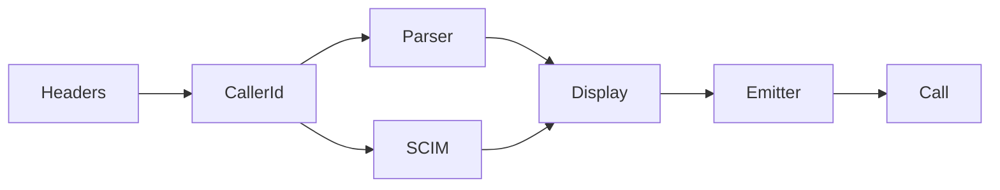
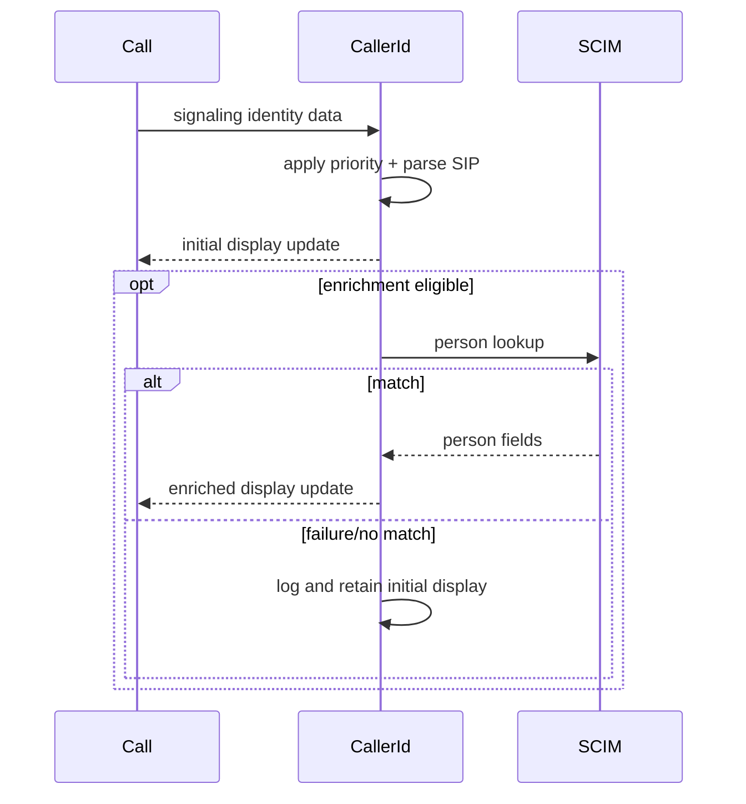
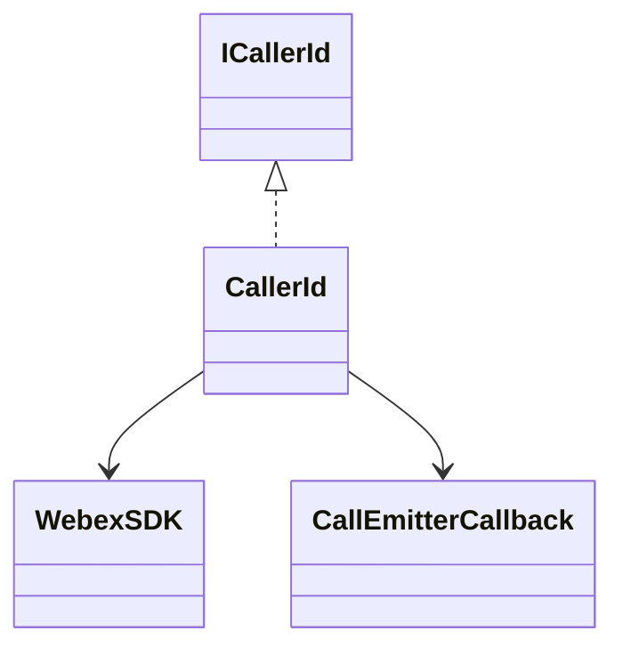

# CallerId — SPEC

> Canonical module spec. Router: [`SPEC_INDEX.md`](../../../../../ai-docs/SPEC_INDEX.md).

## Metadata
| Field | Value |
|---|---|
| Module id | `caller-id` |
| Source path(s) | `src/CallingClient/calling/CallerId/` |
| Doc kind | Module spec |
| Coverage score | 100% structural field coverage; `.generated/sdd/coverage-review-2026-07-04.md` |
| Generated from | `module-spec` @ SDLC template library `0.2.0` |
| generated_by / approved_by / updated_at | Codex / repository user / 2026-07-04 |
| Validation status | pass — Claude Code, 2026-07-04, zero Blocking findings |

## Evidence Rules
The legacy agent spec is reconciled with `index.ts`, types, and tests; no absent architecture rationale is invented.

## Source Material Register
| Source | Scope | Decision | Disposition |
|---|---|---|---|
| `CallerId/ai-docs/AGENTS.md` | API, priority rules, flow, tests | reconciled | requirements, flow, use cases, rules |
| no legacy architecture file | architecture | code/test backfill | diagrams and relationships derived from `index.ts`/tests |

## Overview
CallerId resolves display name/number from prioritized signaling headers/SIP URIs and can asynchronously enrich Broadworks-derived identity through SCIM. It updates call display information through an emitter callback and degrades safely when enrichment fails.

## Purpose / Responsibility
Own deterministic caller display resolution and enrichment, not contact storage or call lifecycle.

## Stack
TypeScript, Webex SCIM request, SIP/header parsing, callback emission, Jest.

## Folder / Package Structure
```text
CallerId/{index.ts,types.ts,index.test.ts,ai-docs/}
```

## Key Files (source of truth)
| File | Holds |
|---|---|
| `CallerId/index.ts` | priority resolution, parsing, enrichment, emission |
| `CallerId/types.ts` | ICallerId and SCIM identity shapes |
| `CallerId/index.test.ts` | priority/fallback/enrichment behavior |

## Public Surface
| ID | Type | Surface | Purpose | Compatibility | Detail | Root index |
|---|---|---|---|---|---|---|
| calling.caller-id | internal SDK | `createCallerId` → `ICallerId` | resolve display information | internal; result appears in public call events | `CallerId/types.ts`, `src/Events/types.ts` | `ai-docs/CONTRACTS.md` |

## Requires (dependencies)
Webex SDK SCIM/People request capability, signaling/header data, call emitter callback, Logger.

## Requirements
| ID | WHAT | WHY | Source Evidence | Test Evidence | Gaps | Confidence |
|---|---|---|---|---|---|---|
| CID-R-001 | Resolve name/number in source-defined header priority order and parse SIP URIs. | Display identity must be deterministic. | `CallerId/index.ts` | `CallerId/index.test.ts` | none | PRESENT |
| CID-R-002 | Enrich eligible identity through SCIM and emit incremental updates. | Better identity may arrive after initial signaling. | `CallerId/index.ts`, `CallerId/types.ts` | `CallerId/index.test.ts` | none | PRESENT |
| CID-R-003 | Preserve usable initial identity when parsing/enrichment fails. | Caller display must degrade safely. | `CallerId/index.ts` | `CallerId/index.test.ts` | none | PRESENT |

## Design Overview
Resolution is staged: parse prioritized signaling sources, emit initial display data, optionally query SCIM, then emit enriched fields. Failures are logged without throwing a call-ending error.

## Data Flow


## Sequence Diagram(s)
| Operation group | Diagram | Failure/recovery coverage |
|---|---|---|
| Resolve/enrich | Caller identity | missing headers, parse failure, SCIM failure |


## Class / Component Relationships


## Use Cases
- Resolve inbound caller from signaling headers.
- Parse SIP name/number fallbacks.
- Enrich Broadworks identity through SCIM and update display. Evidence: `CallerId/index.test.ts`.

## State Model
The instance retains current display fields and callbacks only for the owning Call; it owns no durable identity store.

## Business Rules & Invariants
- Header/source priority is deterministic and must not be reordered accidentally.
- Enrichment may add information but must not erase a valid initial identity on failure.

## Concurrency & Reactive Flow
SCIM enrichment completes asynchronously after initial emission; Call teardown must tolerate late completion.

## Pitfalls
- A successful parse and a successful SCIM lookup are distinct stages.
- Empty/partial SIP fields must not become misleading display values.

## Module Do's / Don'ts
- DO test every priority/fallback branch and safe enrichment failure.
- DON'T log raw sensitive identity payloads or fail the call for enrichment errors.

## Test-Case Strategy (module)
Tests cover header priority, SIP parsing, partial/missing values, SCIM match/no-match/error, and callback updates.
| Requirement | Tests | Gap |
|---|---|---|
| CID-R-001..003 | `CallerId/index.test.ts` | no separate legacy architecture; independent validation pending |

## Traceability
- `ai-docs/ARCHITECTURE.md` · `ai-docs/SECURITY.md` · `.sdd/manifest.json`

## Reconciled Source Fidelity Appendix

The standard sections above are primary. The quoted snapshots below preserve the complete routed legacy source for fidelity and independent review; their content is mapped by meaning through the Source Material Register.

### Source snapshot: `src/CallingClient/calling/CallerId/ai-docs/AGENTS.md`

> # CallerId Sub-Module - Agent Specification
>
> ## Overview
>
> The `CallerId` sub-module resolves caller identity for a `Call` using SIP-style headers delivered by Mobius signaling events. It provides immediate, best-effort display information from headers and then performs asynchronous enrichment through SCIM lookup when BroadWorks metadata includes an `externalId`.
>
> This module is intentionally small and stateful:
> - `fetchCallerDetails()` is the public entrypoint.
> - It resets and repopulates internal `callerInfo` for each resolution request.
> - It emits updates via a callback when new identity data becomes available.
>
> ---
>
> ## Key Capabilities
>
> ### 1. Deterministic Header Priority Resolution
> - Parses `p-asserted-identity` first (highest preference).
> - Uses `from` header as fallback for missing fields.
> - Maintains predictable precedence for name/number population.
>
> ### 2. SIP URI Parsing for Name/Number
> - Extracts display name from quoted/header prefix.
> - Extracts number from SIP URI local part.
> - Validates parsed phone tokens using `VALID_PHONE_REGEX`.
>
> ### 3. Async SCIM Enrichment from BroadWorks Data
> - Parses `x-broadworks-remote-party-info`.
> - Detects `externalId` and issues SCIM-driven resolution through `resolveCallerIdDisplay()`.
> - Upgrades interim caller details with richer profile fields (`name`, `num`, `avatarSrc`, `id`) when available.
>
> ### 4. Incremental Event-Style Updates
> - Emits initial caller info early when header parsing yields usable values.
> - Emits again only when async resolution actually changes fields.
> - Avoids noisy duplicate emissions by checking diffs before callback.
>
> ### 5. Logging and Failure Tolerance
> - Logs parsing/resolution steps with `{file, method}` context.
> - Continues gracefully when external ID is missing or SCIM enrichment fails.
> - Preserves best-known caller info instead of failing hard.
>
> ---
>
> ## Files
>
> | File | Primary Symbol(s) | Description |
> |------|--------------------|-------------|
> | `index.ts` | `CallerId`, `createCallerId` | Main implementation and factory for caller ID resolution |
> | `types.ts` | `ICallerId`, helper types | Public contract for caller detail resolution |
> | `index.test.ts` | Jest tests | Priority, fallback, and async enrichment behavior validation |
>
> ---
>
> ## Public API
>
> ## Factory Function
>
> ```typescript
> export const createCallerId = (webex: WebexSDK, emitterCb: CallEmitterCallBack): ICallerId =>
>   new CallerId(webex, emitterCb);
> ```
>
> ## ICallerId Interface
>
> `ICallerId` is the contract consumed by `Call`. It defines a single entrypoint that returns immediate display info while potentially triggering async updates through the emitter callback.
>
> ```typescript
> export interface ICallerId {
>   fetchCallerDetails: (callerId: CallerIdInfo) => DisplayInformation;
> }
> ```
>
> ## CallerId Class
>
> ### Constructor
>
> ```typescript
> constructor(webex: WebexSDK, emitter: CallEmitterCallBack)
> ```
>
> Responsibilities:
> - Ensures `SDKConnector` has a valid Webex instance.
> - Initializes internal mutable `callerInfo`.
> - Stores emitter callback for incremental caller ID updates.
>
> ### Core Methods
>
> | Method | Visibility | Purpose |
> |--------|------------|---------|
> | `fetchCallerDetails(callerId)` | Public | Main entrypoint: resets fields, applies header priority parsing, emits initial data, triggers async BroadWorks enrichment |
> | `parseSipUri(paid)` | Private | Parses name and number from SIP-like header string |
> | `parseRemotePartyInfo(data)` | Private | Extracts BroadWorks `externalId` and starts SCIM lookup |
> | `resolveCallerId(filter)` | Private async | Performs SCIM enrichment and emits only when resolved fields differ |
>
> ---
>
> ## Resolution Rules (Source of Truth)
>
> 1. Reset `callerInfo` (`id`, `avatarSrc`, `name`, `num`) before processing a new event.
> 2. If `p-asserted-identity` exists, parse and set `name`/`num` directly (highest priority).
> 3. If `from` exists, parse and fill only fields still unset by step 2.
> 4. Emit immediate caller update if `name` or `num` is available.
> 5. If `x-broadworks-remote-party-info` exists, parse `externalId` and run async SCIM enrichment.
> 6. During enrichment, update only changed fields and emit callback only when at least one field changed.
>
> ---
>
> ## Control Flow
>
> ```mermaid
> flowchart TD
>     A[fetchCallerDetails CallerIdInfo] --> B[Reset callerInfo fields]
>     B --> C{Has p-asserted-identity?}
>     C -- Yes --> D[parseSipUri PAI and set name/num]
>     C -- No --> E
>     D --> E{Has from header?}
>     E -- Yes --> F[parseSipUri from and fill missing fields only]
>     E -- No --> G
>     F --> G{Has name or num?}
>     G -- Yes --> H[emit interim callerInfo]
>     G -- No --> I
>     H --> I{Has x-broadworks-remote-party-info?}
>     I -- Yes --> J[parseRemotePartyInfo]
>     I -- No --> M[Return current callerInfo]
>     J --> K{externalId found?}
>     K -- Yes --> L[resolveCallerId SCIM query]
>     K -- No --> M
>     L --> N{Any field changed?}
>     N -- Yes --> O[emit enriched callerInfo]
>     N -- No --> M
>     O --> M
> ```
>
> ---
>
> ## Testing Expectations
>
> Tests for this module should cover:
> - Header precedence: `p-asserted-identity` over `from`.
> - Fallback behavior when one/both SIP fields are partially missing.
> - Async overwrite by BroadWorks+SCIM enrichment when `externalId` is present.
> - No overwrite when `externalId` is absent.
> - SCIM failure path preserves already-resolved interim details.
> - Emission behavior:
>   - Interim emit when `name`/`num` exists.
>   - Follow-up emit only when enrichment changes fields.
>
> ---
>
> ## Agent Rules for Code Generation
>
> When implementing or modifying `CallerId`:
> - Keep `fetchCallerDetails()` as the only public resolution entrypoint.
> - Preserve the strict precedence order: `p-asserted-identity` -> `from` -> BroadWorks enrichment.
> - Keep enrichment non-blocking for initial caller identity delivery.
> - Do not introduce direct event emitter dependencies; continue using `CallEmitterCallBack`.
> - Use existing logger conventions with `{file, method}` metadata.
> - Reuse `DisplayInformation` and `CallerIdInfo` types (no duplicate local types).
> - Keep parsing and enrichment side effects minimal and explicit.
>
> ### Do Not
> - Do not replace the callback-based update mechanism with direct `Call` mutations.
> - Do not block return of interim caller details while waiting for SCIM lookup.
> - Do not emit duplicate callbacks when resolved data is unchanged.
> - Do not weaken validation around parsed number fields.
>
> ---
>
> ## Quick Validation Checklist
>
> - [ ] `createCallerId()` still returns `ICallerId`.
> - [ ] `fetchCallerDetails()` resets stale state before processing input.
> - [ ] Header parsing order and fallback semantics remain unchanged.
> - [ ] BroadWorks `externalId` parsing still triggers async SCIM lookup.
> - [ ] Callback emissions occur for interim and changed enriched data only.
> - [ ] Existing `index.test.ts` scenarios remain valid or are updated with behavior-preserving intent.
>
