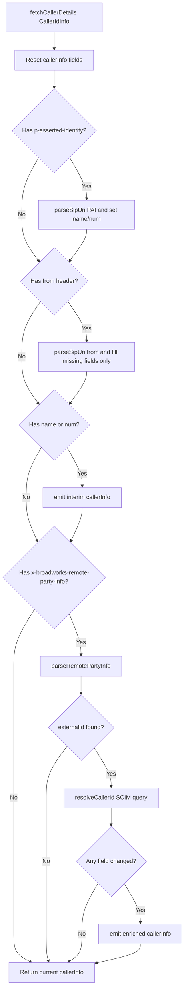
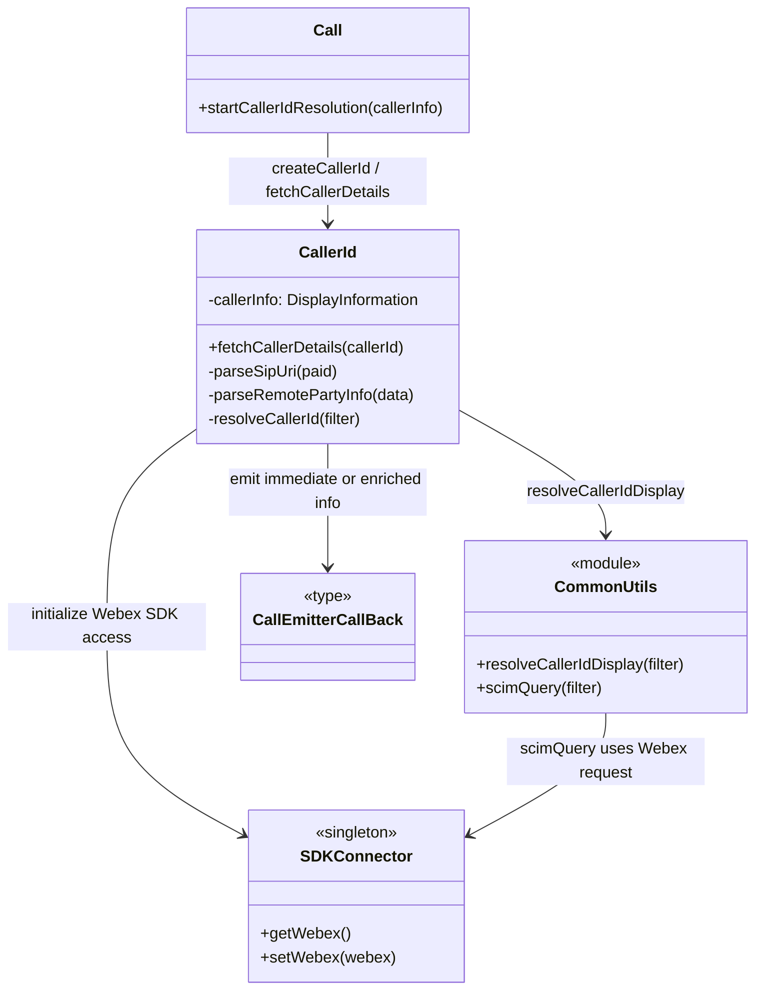

# CallerId — SPEC

> Start here → root [`AGENTS.md`](../../../../../AGENTS.md) · router [`SPEC_INDEX.md`](../../../../../ai-docs/SPEC_INDEX.md) · system [`ARCHITECTURE.md`](../../../../../ai-docs/ARCHITECTURE.md). This is the canonical module specification.

## Metadata

| Field | Value |
|---|---|
| Module id | `caller-id` |
| Source path(s) | `src/CallingClient/calling/CallerId/` |
| Doc kind | Module spec |
| Coverage score | 100% assessed 2026-07-06; 21/21 mandatory fields PRESENT after validator-directed rationale, sequence, profile, security, config-applicability, and visibility backfill |
| Generated from | `module-spec` @ SDLC template library `0.2.1` |
| generated_by / approved_by / updated_at | Codex / repository user / 2026-07-06 |
| Validation status | pass on 2026-07-06 by `claude-code`; gate OPEN; Pass-with-warnings accepted as successful and advisory warnings waived |

## Evidence Rules

Requirements cite stable implementation and test file paths. Legacy docs are migration sources, not primary behavioral evidence. Commit rationale may be used because the package history was explicitly confirmed trustworthy. No line-number anchors or local run-report paths are canonical evidence.

## Source Material Register

| Source material | Scope | Decision | Detail location or disposition |
|---|---|---|---|
| `src/CallingClient/calling/CallerId/ai-docs/AGENTS.md` | legacy AI/architecture source | used and code-verified | Content placed by meaning throughout this spec |

## Overview

The `CallerId` sub-module resolves caller identity for a `Call` using SIP-style headers delivered by Mobius signaling events. It provides immediate, best-effort display information from headers and then performs asynchronous enrichment through SCIM lookup when BroadWorks metadata includes an `externalId`.

This module is intentionally small and stateful:
- `fetchCallerDetails()` is the public entrypoint.
- It resets and repopulates internal `callerInfo` for each resolution request.
- It emits updates via a callback when new identity data becomes available.

## Purpose / Responsibility

CallerId owns the behavior rooted at `src/CallingClient/calling/CallerId/` and exposes it through the typed `@webex/calling` package boundary; shared infrastructure remains owned by `Errors`, `Events`, `Logger`, and `common`.

## Stack

TypeScript 4.9 source targeting the `@webex/calling` package, Jest unit tests, Playwright package journeys, Webex SDK workspace dependencies, and module-specific remote transports documented below.

## Folder / Package Structure

```text
src/CallingClient/calling/CallerId/
├── index.ts
├── types.ts
├── index.test.ts
```

## Key Files (source of truth)

| File | Holds |
|---|---|
| `src/CallingClient/calling/CallerId/index.ts` | Implementation, types, constants, or adapter behavior |
| `src/CallingClient/calling/CallerId/types.ts` | Implementation, types, constants, or adapter behavior |
| `src/CallingClient/calling/CallerId/index.test.ts` | Test/characterization evidence |

### Files

| File | Primary Symbol(s) | Description |
|------|--------------------|-------------|
| `index.ts` | `CallerId`, `createCallerId` | Main implementation and factory for caller ID resolution |
| `types.ts` | `ICallerId`, helper types | Public contract for caller detail resolution |
| `index.test.ts` | Jest tests | Priority, fallback, and async enrichment behavior validation |

## Public Surface

| Contract ID | Type | Surface | Purpose | Compatibility / deprecation | Schema / detail link | Root index |
|---|---|---|---|---|---|---|
| internal.caller-id | Internal call collaborator | `createCallerId(webex, emitterCb): ICallerId` | Create the call-owned identity resolver | Internal; not exported from `src/index.ts` | `src/CallingClient/calling/CallerId/index.ts`; `types.ts` | [`CONTRACTS.md`](../../../../../ai-docs/CONTRACTS.md#internal-package-surfaces) |
| internal.caller-id.resolve | Internal call collaborator | `ICallerId.fetchCallerDetails(callerId): DisplayInformation` | Return immediate header-derived identity and schedule changed SCIM enrichment callbacks | Internal | `src/CallingClient/calling/CallerId/types.ts` | [`CONTRACTS.md`](../../../../../ai-docs/CONTRACTS.md#internal-package-surfaces) |

The public package exports `CallerIdDisplay` and `DisplayInformation` types, but not `CallerId`, `ICallerId`, or `createCallerId`.

### 4. Incremental Event-Style Updates
- Emits initial caller info early when header parsing yields usable values.
- Emits again only when async resolution actually changes fields.
- Avoids noisy duplicate emissions by checking diffs before callback.

### Factory Function

```typescript
export const createCallerId = (webex: WebexSDK, emitterCb: CallEmitterCallBack): ICallerId =>
  new CallerId(webex, emitterCb);
```

### ICallerId Interface

`ICallerId` is the contract consumed by `Call`. It defines a single entrypoint that returns immediate display info while potentially triggering async updates through the emitter callback.

```typescript
export interface ICallerId {
  fetchCallerDetails: (callerId: CallerIdInfo) => DisplayInformation;
}
```

### CallerId Class

#### Constructor

```typescript
constructor(webex: WebexSDK, emitter: CallEmitterCallBack)
```

Responsibilities:
- Ensures `SDKConnector` has a valid Webex instance.
- Initializes internal mutable `callerInfo`.
- Stores emitter callback for incremental caller ID updates.

#### Core Methods

| Method | Visibility | Purpose |
|--------|------------|---------|
| `fetchCallerDetails(callerId)` | Public | Main entrypoint: resets fields, applies header priority parsing, emits initial data, triggers async BroadWorks enrichment |
| `parseSipUri(paid)` | Private | Parses name and number from SIP-like header string |
| `parseRemotePartyInfo(data)` | Private | Extracts BroadWorks `externalId` and starts SCIM lookup |
| `resolveCallerId(filter)` | Private async | Performs SCIM enrichment and emits only when resolved fields differ |

---

## Requires (dependencies)

- Mobius SIP-style identity headers
- SCIM people lookup through the Webex SDK


## Requirements

| ID | WHAT | WHY | Source Evidence | Test / Example Evidence | Assumptions / Gaps | Confidence |
|---|---|---|---|---|---|---|
| CALLERID-R-001 | Parses p-asserted-identity first (highest preference). | P-Asserted-Identity is the signaling service's asserted identity and must win over fallback headers when both are present. | `src/CallingClient/calling/CallerId/index.ts` | `src/CallingClient/calling/CallerId/index.test.ts` | none identified | PRESENT |
| CALLERID-R-002 | Extracts display name from quoted/header prefix. | Separating the display name and SIP user produces the name/number fields consumed by call notifications without exposing raw header syntax. | `src/CallingClient/calling/CallerId/index.ts` | `src/CallingClient/calling/CallerId/index.test.ts` | none identified | PRESENT |
| CALLERID-R-003 | Resets callerInfo (id, avatarSrc, name, num) before processing a new event. | Resetting before each event prevents identity fields from a previous call leaking into a new caller result. | `src/CallingClient/calling/CallerId/index.ts` | `src/CallingClient/calling/CallerId/index.test.ts` | none identified | PRESENT |
| CALLERID-R-004 | Resolution preserves header priority, non-blocking SCIM enrichment, typed callbacks, shared display types, and contextual logging. | Preserving priority, non-blocking enrichment, shared types, and contextual logging keeps immediate and enriched callback ordering stable for Call consumers. | `src/CallingClient/calling/CallerId/index.ts` | `src/CallingClient/calling/CallerId/index.test.ts` | none identified | PRESENT |
| CALLERID-R-005 | Uses the callback-based update mechanism rather than direct Call mutations. | The callback boundary decouples identity resolution from Call mutation and the diff check prevents duplicate caller-id notifications. | `src/CallingClient/calling/CallerId/index.ts` | `src/CallingClient/calling/CallerId/index.test.ts` | none identified | PRESENT |

### 1. Deterministic Header Priority Resolution

- Parses `p-asserted-identity` first (highest preference).
- Uses `from` header as fallback for missing fields.
- Maintains predictable precedence for name/number population.

### 2. SIP URI Parsing for Name/Number

- Extracts display name from quoted/header prefix.
- Extracts number from SIP URI local part.
- Validates parsed phone tokens using `VALID_PHONE_REGEX`.

### Resolution Rules (Source of Truth)

1. Reset `callerInfo` (`id`, `avatarSrc`, `name`, `num`) before processing a new event.
2. If `p-asserted-identity` exists, parse and set `name`/`num` directly (highest priority).
3. If `from` exists, parse and fill only fields still unset by step 2.
4. Emit immediate caller update if `name` or `num` is available.
5. If `x-broadworks-remote-party-info` exists, parse `externalId` and run async SCIM enrichment.
6. During enrichment, update only changed fields and emit callback only when at least one field changed.

### Agent Rules for Code Generation

When implementing or modifying `CallerId`:
- Keep `fetchCallerDetails()` as the only public resolution entrypoint.
- Preserve the strict precedence order: `p-asserted-identity` -> `from` -> BroadWorks enrichment.
- Keep enrichment non-blocking for initial caller identity delivery.
- Do not introduce direct event emitter dependencies; continue using `CallEmitterCallBack`.
- Use existing logger conventions with `{file, method}` metadata.
- Reuse `DisplayInformation` and `CallerIdInfo` types (no duplicate local types).
- Keep parsing and enrichment side effects minimal and explicit.

### Do Not

- Do not replace the callback-based update mechanism with direct `Call` mutations.
- Do not block return of interim caller details while waiting for SCIM lookup.
- Do not emit duplicate callbacks when resolved data is unchanged.
- Do not weaken validation around parsed number fields.

## Design Overview

### CallerId Sub-Module - Agent Specification

> Canonical SDD target: [`src/CallingClient/calling/CallerId/ai-docs/caller-id-spec.md`](caller-id-spec.md). This legacy document is retained as migration source; use the canonical target for current lifecycle work.

### Constructor

```typescript
constructor(webex: WebexSDK, emitter: CallEmitterCallBack)
```

Responsibilities:
- Ensures `SDKConnector` has a valid Webex instance.
- Initializes internal mutable `callerInfo`.
- Stores emitter callback for incremental caller ID updates.

## Data Flow

### Control Flow



## Sequence Diagram(s)

Sequence coverage:

| Operation group | Diagram / coverage | Failure / recovery coverage |
|---|---|---|
| Resolve P-Asserted-Identity / From headers | Caller identity resolution diagram | Missing/malformed fields leave values undefined and fall through |
| Enrich BroadWorks identity through SCIM | Same diagram, async branch | SCIM failure retains the immediate result; unchanged data emits no duplicate callback |

```mermaid
sequenceDiagram
  participant Call
  participant CallerId
  participant SDK as SDKConnector / People SCIM
  participant Callback as CallEmitterCallBack
  Call->>CallerId: fetchCallerDetails(headers)
  CallerId->>CallerId: reset id/avatar/name/num
  opt P-Asserted-Identity present
    CallerId->>CallerId: parseSipUri(PAI)
  end
  opt From present and fields still missing
    CallerId->>CallerId: parseSipUri(From)
  end
  opt immediate name or number exists
    CallerId-->>Callback: current DisplayInformation
  end
  CallerId-->>Call: immediate DisplayInformation
  opt BroadWorks externalId exists
    CallerId->>SDK: SCIM people lookup
    alt lookup succeeds with changed fields
      SDK-->>CallerId: enriched profile
      CallerId-->>Callback: updated DisplayInformation
    else lookup fails or changes nothing
      SDK--xCallerId: error / unchanged result
      Note over CallerId,Callback: preserve immediate result; no duplicate callback
    end
  end
```

Header parsing is synchronous; SCIM enrichment is deliberately non-blocking. Evidence: `src/CallingClient/calling/CallerId/index.ts`, `src/CallingClient/calling/CallerId/index.test.ts`.

## Class / Component Relationships



`Call` creates one `CallerId` and supplies the typed callback that updates and emits caller information. `CallerId` parses SIP identity headers synchronously, then delegates BroadWorks `externalId` enrichment to `resolveCallerIdDisplay()` / `scimQuery()`, which obtains the initialized Webex SDK through `SDKConnector`. Evidence: `src/CallingClient/calling/call.ts`, `src/CallingClient/calling/CallerId/index.ts`, `src/CallingClient/calling/types.ts`, `src/common/Utils.ts`.

## Use Cases

- **UC-1 Caller identity resolution and incremental display-information callbacks:** A package consumer invokes the surface, the module coordinates its dependencies, and returns or emits the typed outcome. Evidence: `src/CallingClient/calling/CallerId/index.ts`, `src/CallingClient/calling/CallerId/index.test.ts`.

## State Model

A `CallerId` instance owns one mutable `callerInfo` record for the current resolution. `fetchCallerDetails` resets all fields before parsing; an immediate callback may be followed by one async SCIM callback only when enrichment changes a field. No identity data is persisted. Evidence: `src/CallingClient/calling/CallerId/index.ts`.

## Business Rules & Invariants

- Reset `id`, `avatarSrc`, `name`, and `num` before each resolution.
- P-Asserted-Identity fills name/number before the From fallback.
- BroadWorks `externalId` enrichment is non-blocking and emits only changed data.
- SIP identity headers and SCIM profile fields are sensitive caller data: use them for display resolution only, do not log raw headers, and rely on the initialized SDK for SCIM authorization. Evidence: `src/CallingClient/calling/CallerId/index.ts`.
- Configuration/rollout is N/A: CallerId has no feature flag, environment variable, or mutable runtime configuration; behavior is selected solely by the supplied identity headers and availability of BroadWorks `externalId`. Evidence: `src/CallingClient/calling/CallerId/index.ts`, `src/CallingClient/calling/CallerId/types.ts`.

## Concurrency & Reactive Flow

### 3. Async SCIM Enrichment from BroadWorks Data

- Parses `x-broadworks-remote-party-info`.
- Detects `externalId` and issues SCIM-driven resolution through `resolveCallerIdDisplay()`.
- Upgrades interim caller details with richer profile fields (`name`, `num`, `avatarSrc`, `id`) when available.

## Pitfalls

### 5. Logging and Failure Tolerance

- Logs parsing/resolution steps with `{file, method}` context.
- Continues gracefully when external ID is missing or SCIM enrichment fails.
- Preserves best-known caller info instead of failing hard.

## Module Do's / Don'ts

- DO use the factories, typed events, constants, and adapters already owned by `src/CallingClient/calling/CallerId/`.
- DON'T add direct network or SDK access when the module already provides an adapter.

## Key Design Trade-off

CallerId returns header-derived identity immediately and enriches it later instead of blocking incoming-call presentation on SCIM. Consumers must tolerate a second callback, while the diff guard prevents duplicate updates. Evidence: `src/CallingClient/calling/CallerId/index.ts`.

## Test-Case Strategy (module)

### Testing Expectations

Tests for this module should cover:
- Header precedence: `p-asserted-identity` over `from`.
- Fallback behavior when one/both SIP fields are partially missing.
- Async overwrite by BroadWorks+SCIM enrichment when `externalId` is present.
- No overwrite when `externalId` is absent.
- SCIM failure path preserves already-resolved interim details.
- Emission behavior:
  - Interim emit when `name`/`num` exists.
  - Follow-up emit only when enrichment changes fields.

### Quick Validation Checklist

- [ ] `createCallerId()` still returns `ICallerId`.
- [ ] `fetchCallerDetails()` resets stale state before processing input.
- [ ] Header parsing order and fallback semantics remain unchanged.
- [ ] BroadWorks `externalId` parsing still triggers async SCIM lookup.
- [ ] Callback emissions occur for interim and changed enriched data only.
- [ ] Existing `index.test.ts` scenarios remain valid or are updated with behavior-preserving intent.

| Behavior / Requirement | Existing test evidence | Gap |
|---|---|---|
| CALLERID-R-001 | `src/CallingClient/calling/CallerId/index.test.ts` | Re-check negative/error edge coverage during independent validation |
| CALLERID-R-002 | `src/CallingClient/calling/CallerId/index.test.ts` | Re-check negative/error edge coverage during independent validation |
| CALLERID-R-003 | `src/CallingClient/calling/CallerId/index.test.ts` | Re-check negative/error edge coverage during independent validation |
| CALLERID-R-004 | `src/CallingClient/calling/CallerId/index.test.ts` | Re-check negative/error edge coverage during independent validation |
| CALLERID-R-005 | `src/CallingClient/calling/CallerId/index.test.ts` | Re-check negative/error edge coverage during independent validation |

## Traceability

- Repo architecture: [`ARCHITECTURE.md`](../../../../../ai-docs/ARCHITECTURE.md) · Registry: [`SPEC_INDEX.md`](../../../../../ai-docs/SPEC_INDEX.md)
- Contracts catalog: [`CONTRACTS.md`](../../../../../ai-docs/CONTRACTS.md) · Manifest: `../../../../../.sdd/manifest.json`
- Source material retained at `src/CallingClient/calling/CallerId/ai-docs/AGENTS.md`; canonical behavior is this spec plus current code/tests.
