# Calling — SPEC

> Start here → root [`AGENTS.md`](../../../../AGENTS.md) · router [`SPEC_INDEX.md`](../../../../ai-docs/SPEC_INDEX.md) · system [`ARCHITECTURE.md`](../../../../ai-docs/ARCHITECTURE.md). This is the canonical module specification.

## Metadata

| Field | Value |
|---|---|
| Module id | `calling` |
| Source path(s) | `src/CallingClient/calling/` |
| Doc kind | Module spec |
| Coverage score | 100% assessed 2026-07-06; 21/21 mandatory fields PRESENT after validator-directed rationale, sequence, profile, security, and visibility backfill |
| Generated from | `module-spec` @ SDLC template library `0.2.1` |
| generated_by / approved_by / updated_at | Codex / repository user / 2026-07-06 |
| Validation status | pass on 2026-07-06 by `claude-code`; gate OPEN; Pass-with-warnings accepted as successful and advisory warnings waived |

## Evidence Rules

Requirements cite stable implementation and test file paths. Legacy docs are migration sources, not primary behavioral evidence. Commit rationale may be used because the package history was explicitly confirmed trustworthy. No line-number anchors or local run-report paths are canonical evidence.

## Source Material Register

| Source material | Scope | Decision | Detail location or disposition |
|---|---|---|---|
| `src/CallingClient/calling/ai-docs/AGENTS.md` | legacy AI/architecture source | used and code-verified | Content placed by meaning throughout this spec |
| `src/CallingClient/calling/ai-docs/ARCHITECTURE.md` | legacy AI/architecture source | used and code-verified | Content placed by meaning throughout this spec |

## Overview

The `calling/` sub-module within `CallingClient` contains the core call management logic for the Webex Calling SDK. It consists of two primary classes -- `Call` and `CallManager` -- along with the `CallerId` sub-module for caller identity resolution. Together, these classes handle the full lifecycle of voice calls: creation, signaling via Mobius, WebRTC media negotiation via ROAP, mid-call operations, and termination.

### Purpose

`CallManager` is a **singleton** that serves as the central hub for all call-related operations. It:
- Maintains the collection of active `Call` objects keyed by `correlationId`
- Listens for Mobius WebSocket events (`event:mobius`) via the `SDKConnector`
- Routes incoming Mobius events to the correct `Call` instance
- Creates new `Call` objects for incoming calls
- Emits `ALL_CALLS_CLEARED` when the last call is removed from the collection
- Emits `INCOMING_CALL` to signal the Line about new incoming calls

### Call / Purpose

The `Call` class represents a single voice call instance. It manages:
- Two XState state machines: **call signaling** and **media (ROAP) negotiation**
- WebRTC media connection via `RoapMediaConnection` from `@webex/internal-media-core`
- Mobius API calls for call setup, progress, hold/resume, transfer, and disconnect
- Caller ID resolution via the `CallerId` sub-module
- RTP statistics collection
- Supplementary services (hold, resume, transfer)
- Event emission for application-facing call lifecycle events

### CallerId / Purpose

The `CallerId` sub-module resolves caller identity from SIP headers present in Mobius call events.

## Purpose / Responsibility

Calling owns the behavior rooted at `src/CallingClient/calling/` and exposes it through the typed `@webex/calling` package boundary; shared infrastructure remains owned by `Errors`, `Events`, `Logger`, and `common`.

## Stack

TypeScript 4.9 source targeting the `@webex/calling` package, Jest unit tests, Playwright package journeys, Webex SDK workspace dependencies, and module-specific remote transports documented below.

## Folder / Package Structure

```text
src/CallingClient/calling/
├── CallerId/index.ts
├── CallerId/types.ts
├── call.ts
├── callManager.ts
├── index.ts
├── types.ts
├── CallerId/index.test.ts
├── call.test.ts
├── callManager.test.ts
```

## Key Files (source of truth)

| File | Holds |
|---|---|
| `src/CallingClient/calling/CallerId/index.ts` | Implementation, types, constants, or adapter behavior |
| `src/CallingClient/calling/CallerId/types.ts` | Implementation, types, constants, or adapter behavior |
| `src/CallingClient/calling/call.ts` | Implementation, types, constants, or adapter behavior |
| `src/CallingClient/calling/callManager.ts` | Implementation, types, constants, or adapter behavior |
| `src/CallingClient/calling/index.ts` | Implementation, types, constants, or adapter behavior |
| `src/CallingClient/calling/types.ts` | Implementation, types, constants, or adapter behavior |
| `src/CallingClient/calling/CallerId/index.test.ts` | Test/characterization evidence |
| `src/CallingClient/calling/call.test.ts` | Test/characterization evidence |
| `src/CallingClient/calling/callManager.test.ts` | Test/characterization evidence |

### Files

| File | Class | Interface | Description |
|------|-------|-----------|-------------|
| `call.ts` | `Call` | `ICall` | Individual call instance managing signaling and media state machines |
| `callManager.ts` | `CallManager` | `ICallManager` | Singleton managing the collection of active calls and routing Mobius WebSocket events |
| `types.ts` | - | - | All types, enums, and interfaces for call management |
| `CallerId/index.ts` | `CallerId` | `ICallerId` | Caller identity resolution from SIP headers and SCIM |
| `CallerId/types.ts` | - | - | CallerId types |

### Import Paths

All paths are relative to `CallingClient/calling/` (the directory containing `call.ts` and `callManager.ts`).

| Symbol(s) | Import Path |
|-----------|-------------|
| `ICall`, `ICallManager`, `MobiusEventType`, `MediaState`, `MobiusCallEvent`, `MobiusCallData`, `MobiusCallResponse`, `PatchResponse`, `SSResponse`, `TransferContext`, `CallRtpStats`, `DisconnectCode`, `DisconnectCause`, `TransferType`, `MUTE_TYPE`, `MidCallEventType`, `MobiusCallState`, `MidCallEvent` | `./types` |
| `CALL_EVENT_KEYS`, `CallerIdInfo`, `CallEvent`, `CallEventTypes`, `RoapEvent`, `RoapMessage`, `SUPPLEMENTARY_SERVICES`, `LINE_EVENT_KEYS`, `CALLING_CLIENT_EVENT_KEYS`, `MEDIA_CONNECTION_EVENT_KEYS`, `MOBIUS_MIDCALL_STATE` | `../../Events/types` |
| `Eventing` | `../../Events/impl` |
| `CallError`, `createCallError` | `../../Errors/catalog/CallError` |
| `ERROR_LAYER`, `ERROR_TYPE`, `ErrorContext` | `../../Errors/types` |
| `handleCallErrors`, `modifySdpForIPv4`, `parseMediaQualityStatistics`, `serviceErrorCodeHandler`, `uploadLogs` | `../../common/Utils` |
| `CallDetails`, `CallDirection`, `CallId`, `CorrelationId`, `DisplayInformation`, `HTTP_METHODS`, `ServiceIndicator`, `WebexRequestPayload`, `ALLOWED_SERVICES` | `../../common/types` |
| `SDKConnector` | `../../SDKConnector` |
| `ISDKConnector`, `WebexSDK` | `../../SDKConnector/types` |
| `ILine` | `../line/types` |
| Constants (`DEFAULT_SESSION_TIMER`, `SUPPLEMENTARY_SERVICES_TIMEOUT`, `MAX_CALL_KEEPALIVE_RETRY_COUNT`, `INITIAL_SEQ_NUMBER`, endpoint resources, `METHODS`) | `../constants` |
| `RoapMediaConnection`, `LocalMicrophoneStream`, `MediaConnectionEventNames`, `LocalStreamEventNames` | `@webex/internal-media-core` |
| `RtcMetrics` | `@webex/internal-plugin-metrics` |
| `EffectEvent`, `TrackEffect` | `@webex/media-helpers` |
| `createMachine`, `interpret` | `xstate` |

## Public Surface

| Contract ID | Type | Surface | Purpose | Compatibility / deprecation | Schema / detail link | Root index |
|---|---|---|---|---|---|---|
| calling.surface.1 | Public SDK | `ICall`; `TransferType` | Give package consumers typed call control, state inspection, media operations, and transfer modes | Semver-controlled through `@webex/calling` | `src/index.ts`; `src/CallingClient/calling/types.ts` | `../../../../ai-docs/CONTRACTS.md` |
| calling.surface.2 | Public events | `CALL_EVENT_KEYS`; `CallError`; `Disposition`; `CallDetails` | Let consumers observe typed call/media/error outcomes and construct call destinations | Semver-controlled through `@webex/calling` | `src/index.ts`; `src/Events/types.ts`; `src/Errors/index.ts`; `src/common/types.ts` | `../../../../ai-docs/CONTRACTS.md` |
| internal.call-manager | Internal call collaborator | `getCallManager`; `ICallManager`; concrete `Call` factory | Route Mobius events and own active-call/line maps | Internal; not exported from `src/index.ts` | `src/CallingClient/calling/callManager.ts`; `types.ts` | `../../../../ai-docs/CONTRACTS.md` |

Compatibility notes:
- Public factories, interfaces, types, and events are semver-controlled through `src/index.ts`; removals or incompatible signature changes require an approved migration and release plan.

### 2. Mobius Event Intake and Routing

- Subscribes to `event:mobius` via `SDKConnector` and processes signaling/media events.
- Routes each event to the correct `Call` object based on `correlationId` and `callId` matching.
- Handles out-of-order event scenarios (for example, media before setup) safely.

### ICallManager Interface

`ICallManager` is the contract for the `CallManager` class. It defines the core methods `CallManager` must expose for call creation, lookup, lifecycle tracking, and line/Mobius context updates.  
In practice, this interface ensures a consistent API surface between the singleton accessor (`getCallManager`) and the concrete `CallManager` implementation.

```typescript
interface ICallManager extends Eventing<CallEventTypes> {
  createCall(direction: CallDirection, deviceId: string, lineId: string, destination?: CallDetails): ICall;
  getCall(correlationId: CorrelationId): ICall;
  getActiveCalls(): Record<string, ICall>;
  updateActiveMobius(url: string): void;
  updateLine(deviceId: string, line: ILine): void;
}
```

### Methods

| Method | Signature | Scope | Purpose |
|--------|-----------|-------|---------|
| `constructor` | `constructor(webex: WebexSDK, indicator: ServiceIndicator)` | Internal class | Initializes manager state, connector references, and Mobius listener registration |
| `createCall` | `createCall(direction: CallDirection, deviceId: string, lineId: string, destination?: CallDetails): ICall` | Internal class | Creates a `Call` instance, stores it in `callCollection`, and wires delete callback |
| `getCall` | `getCall(correlationId: CorrelationId): ICall` | Internal class | Returns the active call for a correlation ID |
| `getActiveCalls` | `getActiveCalls(): Record<string, ICall>` | Internal class | Returns the current active call map |
| `updateActiveMobius` | `updateActiveMobius(url: string): void` | Internal class | Updates active Mobius URL used by newly created calls |
| `updateLine` | `updateLine(deviceId: string, line: ILine): void` | Internal class | Stores/updates line mapping used for incoming call routing |
| `listenForWsEvents` | `listenForWsEvents(): void` | Private | Registers `event:mobius` listener and forwards inbound payloads for processing |
| `dequeueWsEvents` | `dequeueWsEvents(eventData: MobiusCallEvent): void` | Private | Routes Mobius call/media/disconnect events to the correct `Call` instance |
| `getLineId` | `getLineId(deviceId: string): string` | Private | Resolves line ID from `lineDict` for inbound call creation/routing |

### Mobius Event Routing

The `CallManager` registers a listener for `event:mobius` on the `SDKConnector`. When a Mobius event arrives, `dequeueWsEvents()` processes it based on `eventType`:

| Mobius Event Type | Enum Value | Action |
|-------------------|------------|--------|
| `CALL_SETUP` | `mobius.call` | Create incoming call or handle mid-call event, resolve caller ID, emit `INCOMING_CALL`, send `E_RECV_CALL_SETUP` |
| `CALL_PROGRESS` | `mobius.callprogress` | Resolve caller ID, send `E_RECV_CALL_PROGRESS` to call |
| `CALL_CONNECTED` | `mobius.callconnected` | Send `E_RECV_CALL_CONNECT` to call |
| `CALL_MEDIA` | `mobius.media` | Route ROAP message (`OFFER`, `ANSWER`, `OFFER_REQUEST`, `OK`, `ERROR`) to call's media state machine |
| `CALL_DISCONNECTED` | `mobius.calldisconnected` | Send `E_RECV_CALL_DISCONNECT` to call |

### Factory Function

```typescript
export const createCall = (
  activeUrl: string,
  webex: WebexSDK,
  direction: CallDirection,
  deviceId: string,
  lineId: string,
  deleteCb: DeleteRecordCallBack,
  indicator: ServiceIndicator,
  destination?: CallDetails
): ICall => new Call(activeUrl, webex, direction, deviceId, lineId, deleteCb, indicator, destination);
```

### ICall Interface

`ICall` is the contract for the `Call` class. It defines the methods a call object must expose for call control operations, state checks, media updates, event handling hooks, and call metadata access.

```typescript
// Contract implemented by Call class.
// Eventing<CallEventTypes> means consumers can subscribe to strongly typed call events.
interface ICall extends Eventing<CallEventTypes> {
  // Call control operations
  dial(localAudioStream: LocalMicrophoneStream): void;
  answer(localAudioStream: LocalMicrophoneStream): void;
  end(): void;
  doHoldResume(): void;
  completeTransfer(
    transferType: TransferType,
    transferCallId?: CallId,
    transferTarget?: string
  ): void;
  sendDigit(tone: string): void;

  // Media operations
  mute(localAudioStream: LocalMicrophoneStream, muteType?: MUTE_TYPE): void;
  updateMedia(newAudioStream: LocalMicrophoneStream): void;
  getCallRtpStats(): Promise<CallRtpStats>;

  // State checks
  isMuted(): boolean;
  isConnected(): boolean;
  isHeld(): boolean;

  // Identifiers and call metadata
  getCallId(): string;
  setCallId(callId: CallId): void;
  getCorrelationId(): string;
  getDirection(): CallDirection;
  getDisconnectReason(): DisconnectReason;
  getBroadworksCorrelationInfo(): string | undefined;
  setBroadworksCorrelationInfo(info: string): void;

  // Caller identity
  getCallerInfo(): DisplayInformation;
  startCallerIdResolution(callerInfo: CallerIdInfo): void;

  // Internal event pathways exposed on the interface
  handleMidCallEvent(event: MidCallEvent): void;
  sendCallStateMachineEvt(event: CallEvent): void;
  sendMediaStateMachineEvt(event: RoapEvent): void;
  postStatus(): Promise<WebexRequestPayload>;
}
```

### Method

| Method | Signature | Description |
|--------|-----------|-------------|
| `dial` | `dial(localAudioStream: LocalMicrophoneStream): void` | Initiate an outgoing call |
| `answer` | `answer(localAudioStream: LocalMicrophoneStream): void` | Answer an incoming call |
| `end` | `end(): void` | Disconnect the call |
| `mute` | `mute(localAudioStream: LocalMicrophoneStream, muteType?: MUTE_TYPE): void` | Toggle mute |
| `isMuted` | `isMuted(): boolean` | Check mute state |
| `isConnected` | `isConnected(): boolean` | Check connected state |
| `isHeld` | `isHeld(): boolean` | Check hold state |
| `doHoldResume` | `doHoldResume(): void` | Toggle hold/resume |
| `sendDigit` | `sendDigit(tone: string): void` | Send DTMF tone |
| `completeTransfer` | `completeTransfer(transferType: TransferType, transferCallId?: CallId, transferTarget?: string): void` | Complete blind or consult transfer |
| `updateMedia` | `updateMedia(newAudioStream: LocalMicrophoneStream): void` | Change audio stream |
| `getCallId` | `getCallId(): string` | Get Mobius call ID |
| `getCorrelationId` | `getCorrelationId(): string` | Get client correlation ID |
| `getDirection` | `getDirection(): CallDirection` | Get call direction |
| `setCallId` | `setCallId(callId: CallId): void` | Set Mobius call ID |
| `getCallerInfo` | `getCallerInfo(): DisplayInformation` | Get resolved caller display info |
| `startCallerIdResolution` | `startCallerIdResolution(callerInfo: CallerIdInfo): void` | Trigger caller ID resolution |
| `handleMidCallEvent` | `handleMidCallEvent(event: MidCallEvent): void` | Process mid-call events |
| `getDisconnectReason` | `getDisconnectReason(): DisconnectReason` | Get disconnect reason |
| `getBroadworksCorrelationInfo` | `getBroadworksCorrelationInfo(): string \| undefined` | Get Broadworks correlation info |
| `setBroadworksCorrelationInfo` | `setBroadworksCorrelationInfo(info: string): void` | Set Broadworks correlation info |
| `getCallRtpStats` | `getCallRtpStats(): Promise<CallRtpStats>` | Get RTP statistics |
| `postStatus` | `postStatus(): Promise<WebexRequestPayload>` | Send call keepalive to Mobius |
| `sendCallStateMachineEvt` | `sendCallStateMachineEvt(event: CallEvent): void` | Send event to call state machine |
| `sendMediaStateMachineEvt` | `sendMediaStateMachineEvt(event: RoapEvent): void` | Send event to media state machine |
| `postSSRequest` | `postSSRequest(context: unknown, type: SUPPLEMENTARY_SERVICES): Promise<SSResponse>` | Send supplementary service request (hold, resume, transfer) to Mobius |

### Private Methods

These are internal methods on the `Call` class. They are not exposed via `ICall` but are essential for understanding call internals when implementing new features or modifying existing flows.

### Media Infrastructure

| Method | Signature | Description |
|--------|-----------|-------------|
| `initMediaConnection` | `private initMediaConnection(localAudioTrack: MediaStreamTrack, debugId?: string): void` | Creates `RoapMediaConnection` with local audio track, registers ROAP and track listeners |
| `mediaRoapEventsListener` | `private mediaRoapEventsListener(): void` | Listens for `ROAP_MESSAGE_TO_SEND` from media SDK, stores local ROAP message and drives media state machine |
| `mediaTrackListener` | `private mediaTrackListener(): void` | Listens for `REMOTE_TRACK_ADDED` and emits `CALL_EVENT_KEYS.REMOTE_MEDIA` |
| `registerListeners` | `private registerListeners(localAudioStream: LocalMicrophoneStream): void` | Registers effect and track change listeners on local audio stream |
| `unregisterListeners` | `private unregisterListeners(): void` | Removes all event listeners from local audio stream and effects |
| `registerEffectListener` | `private registerEffectListener(addedEffect: TrackEffect): void` | Registers enabled/disabled listeners for a specific audio effect (e.g., BNR) |
| `updateTrack` | `private updateTrack = (audioTrack: MediaStreamTrack): void` | Updates local audio track in media connection |

### HTTP Methods

| Method | Signature | Description |
|--------|-----------|-------------|
| `post` | `private post = async (roapMessage: RoapMessage): Promise<MobiusCallResponse>` | POST `/devices/{deviceId}/call` -- outgoing call setup with ROAP offer |
| `patch` | `private async patch(state: MobiusCallState): Promise<PatchResponse>` | PATCH `/devices/{deviceId}/calls/{callId}` -- update call state (alerting, connected) |
| `delete` | `private async delete(): Promise<MobiusCallResponse>` | DELETE `/devices/{deviceId}/calls/{callId}` -- disconnect call with metrics and reason |
| `postMedia` | `private async postMedia(roapMessage: RoapMessage): Promise<WebexRequestPayload>` | POST `/devices/{deviceId}/calls/{callId}/media` -- send ROAP message, applies `modifySdpForIPv4()` for SDP payloads |

### Metrics and Utilities

| Method | Signature | Description |
|--------|-----------|-------------|
| `getCallStats` | `private async getCallStats(): Promise<CallRtpStats>` | Retrieves RTP statistics from media connection |
| `forceSendStatsReport` | `private async forceSendStatsReport({callFrom}: {callFrom?: string}): Promise<void>` | Sends WebRTC telemetry dump via media core metrics |
| `submitCallErrorMetric` | `private submitCallErrorMetric(error: CallError, transferMetricAction?: TRANSFER_ACTION): void` | Submits error metrics based on error layer and current state |
| `onEffectEnabled` | `private onEffectEnabled = (): void` | Submits BNR enabled metric |
| `onEffectDisabled` | `private onEffectDisabled = (): void` | Submits BNR disabled metric |
| `setDisconnectReason` | `private setDisconnectReason(): void` | Sets disconnect code/cause based on call state (mediaInactivity, connected, direction) |
| `getEmitterCallback` | `private getEmitterCallback(errData: MobiusCallResponse): (error: CallError) => void` | Returns error emitter callback that emits the correct error event based on current state machine state |

### Call Events Emitted

| Event | Enum Key | Payload | When Emitted |
|-------|----------|---------|-------------|
| `progress` | `CALL_EVENT_KEYS.PROGRESS` | `CorrelationId` | Call progress received |
| `connect` | `CALL_EVENT_KEYS.CONNECT` | `CorrelationId` | Remote answered or call connected |
| `established` | `CALL_EVENT_KEYS.ESTABLISHED` | `CorrelationId` | Call fully established with media |
| `held` | `CALL_EVENT_KEYS.HELD` | `CorrelationId` | Call placed on hold |
| `resumed` | `CALL_EVENT_KEYS.RESUMED` | `CorrelationId` | Call resumed from hold |
| `disconnect` | `CALL_EVENT_KEYS.DISCONNECT` | `CorrelationId` | Call disconnected |
| `remote_media` | `CALL_EVENT_KEYS.REMOTE_MEDIA` | `MediaStreamTrack` | Remote media track available |
| `caller_id` | `CALL_EVENT_KEYS.CALLER_ID` | `{ correlationId: CorrelationId, callerId: DisplayInformation }` | Caller ID resolved |
| `call_error` | `CALL_EVENT_KEYS.CALL_ERROR` | `CallError` | Error in call signaling |
| `hold_error` | `CALL_EVENT_KEYS.HOLD_ERROR` | `CallError` | Error placing call on hold |
| `resume_error` | `CALL_EVENT_KEYS.RESUME_ERROR` | `CallError` | Error resuming call |
| `transfer_error` | `CALL_EVENT_KEYS.TRANSFER_ERROR` | `CallError` | Error in call transfer |

### DisplayInformation Type

```typescript
type DisplayInformation = {
  avatarSrc: AvatarId | undefined;
  name: DisplayName | undefined;
  num: string | undefined;
  id: string | undefined;
};
```

### Mid-Call Events

The `Call` class handles mid-call events delivered through `CALL_SETUP` messages with `midCallService` data.

### Mid-Call Event Types

| Type | Enum | Description |
|------|------|-------------|
| `callInfo` | `MidCallEventType.CALL_INFO` | Caller ID update during an active call |
| `callState` | `MidCallEventType.CALL_STATE` | Call state change (hold/resume confirmation from server) |

### Mid-Call State Values

| State | Enum | Description |
|-------|------|-------------|
| `HELD` | `MOBIUS_MIDCALL_STATE.HELD` | Call confirmed as held by server |
| `CONNECTED` | `MOBIUS_MIDCALL_STATE.CONNECTED` | Call confirmed as resumed/connected by server |

When a `callState` mid-call event with `HELD` state is received, the Call emits `CALL_EVENT_KEYS.HELD` and sets `held = true`. When `CONNECTED` is received, it emits `CALL_EVENT_KEYS.RESUMED` and sets `held = false`. Both clear the `supplementaryServicesTimer`.

### Event Handling Details

This module has two event layers:
- **Inbound/internal events** consumed by `CallManager`/`Call` (Mobius, media engine, stream/effect events).
- **Public SDK events** emitted from `Call` (and `CallManager`) for app consumers.

### 1) Events We Listen To

| Source | Event | Handler Path | Purpose |
|--------|-------|--------------|---------|
| `CallManager Instantiation` | `event:mobius` | `listenForWsEvents()` -> `dequeueWsEvents()` | Entry point for all signaling/media events from backend |
| `Mobius` | `mobius.call` | `CallManager.dequeueWsEvents()` | Create/resolve call, trigger `E_RECV_CALL_SETUP`, handle mid-call payload |
| `Mobius` | `mobius.callprogress` | `CallManager.dequeueWsEvents()` | Trigger `E_RECV_CALL_PROGRESS` (caller ID refresh is handled in `Call.handleIncomingCallProgress()`) |
| `Mobius` | `mobius.callconnected` | `CallManager.dequeueWsEvents()` | Trigger `E_RECV_CALL_CONNECT` |
| `Mobius` | `mobius.media` | `CallManager.dequeueWsEvents()` -> `call.sendMediaStateMachineEvt(...)` | Route ROAP `OFFER/ANSWER/OFFER_REQUEST/OK` |
| `Mobius` | `mobius.calldisconnected` | `CallManager.dequeueWsEvents()` -> `E_RECV_CALL_DISCONNECT` | Start disconnect cleanup |
| `MediaConnection` | `ROAP_MESSAGE_TO_SEND` | `Call.mediaRoapEventsListener()` | Publish local ROAP back to Mobius (`postMedia`) |
| `MediaConnection` | `REMOTE_TRACK_ADDED` | `Call.mediaTrackListener()` | Emit remote media track to app |
| `LocalMicrophoneStream` | `OutputTrackChange`, `EffectAdded` | `Call.registerListeners()` | Keep media/effect state synchronized (`EffectAdded` registers per-effect `Enabled/Disabled` listeners) |

### 2) Events Emitted By Call Object

| Event Key | Payload | Emitted When |
|-----------|---------|--------------|
| `CALL_EVENT_KEYS.PROGRESS` | `correlationId` | Progress/proceeding signaling received |
| `CALL_EVENT_KEYS.CONNECT` | `correlationId` | Call connected signaling received |
| `CALL_EVENT_KEYS.ESTABLISHED` | `correlationId` | Signaling + media negotiation complete |
| `CALL_EVENT_KEYS.HELD` | `correlationId` | Hold confirmed by mid-call state |
| `CALL_EVENT_KEYS.RESUMED` | `correlationId` | Resume confirmed by mid-call state |
| `CALL_EVENT_KEYS.DISCONNECT` | `correlationId` | Call disconnected (local or remote) |
| `CALL_EVENT_KEYS.REMOTE_MEDIA` | `MediaStreamTrack` | Remote audio track becomes available |
| `CALL_EVENT_KEYS.CALLER_ID` | `{ correlationId: CorrelationId, callerId: DisplayInformation }` | Caller ID resolved/updated |
| `CALL_EVENT_KEYS.CALL_ERROR` | `CallError` | General call or media error |
| `CALL_EVENT_KEYS.HOLD_ERROR` | `CallError` | Hold operation failed/timed out |
| `CALL_EVENT_KEYS.RESUME_ERROR` | `CallError` | Resume operation failed/timed out |
| `CALL_EVENT_KEYS.TRANSFER_ERROR` | `CallError` | Transfer operation failed |

Related manager-level emissions:
- `LINE_EVENT_KEYS.INCOMING_CALL` (from `CallManager`) with `ICall` payload.
- `CALLING_CLIENT_EVENT_KEYS.ALL_CALLS_CLEARED` when active call collection becomes empty.

### 3) How Consumers Should Listen

Listen for incoming calls first, then attach per-call listeners:

```typescript
import {CALL_EVENT_KEYS, ICall, LINE_EVENTS} from '@webex/calling';

line.on(LINE_EVENTS.INCOMING_CALL, (call: ICall) => {
  call.on(CALL_EVENT_KEYS.PROGRESS, (id) => {/* update UI */});
  call.on(CALL_EVENT_KEYS.CONNECT, (id) => {/* ringing -> connected */});
  call.on(CALL_EVENT_KEYS.ESTABLISHED, (id) => {/* media established */});
  call.on(CALL_EVENT_KEYS.REMOTE_MEDIA, (track) => {/* attach remote track */});
  call.on(CALL_EVENT_KEYS.CALLER_ID, ({correlationId, callerId}) => {/* refresh caller display */});
  call.on(CALL_EVENT_KEYS.CALL_ERROR, (err) => {/* show retry/failure */});
  call.on(CALL_EVENT_KEYS.DISCONNECT, (id) => {/* teardown UI */});
});
```

For outbound calls, attach listeners immediately after `createCall`/`makeCall` and before or right after `dial()` to avoid missing early events.

### Direction 1: Mobius -> Call -> MediaConnection (incoming signaling/media event)

When Mobius sends a media event, `CallManager` routes it to the target `Call`, which forwards it into the media state machine and then to `mediaConnection.roapMessageReceived()` for SDP processing.

1. `event:mobius` with `CALL_MEDIA` reaches `CallManager.dequeueWsEvents()`.
2. `CallManager` resolves the correct call by `correlationId` (or fallback by `callId`).
3. `message.messageType` is mapped to media state events:
   - `OFFER` -> `E_RECV_ROAP_OFFER`
   - `ANSWER` -> `E_RECV_ROAP_ANSWER`
   - `OFFER_REQUEST` -> `E_RECV_ROAP_OFFER_REQUEST`
   - `OK` -> `E_ROAP_OK`
4. `Call` action handlers process the event and pass the ROAP payload to media engine APIs when applicable.

### Mobius Types

```typescript
enum MobiusEventType {
  CALL_SETUP = 'mobius.call',
  CALL_PROGRESS = 'mobius.callprogress',
  CALL_CONNECTED = 'mobius.callconnected',
  CALL_MEDIA = 'mobius.media',
  CALL_DISCONNECTED = 'mobius.calldisconnected',
}

enum MediaState {
  OFFER = 'OFFER',
  ANSWER = 'ANSWER',
  OFFER_REQUEST = 'OFFER_REQUEST',
  OK = 'OK',
  ERROR = 'ERROR',
}

enum MobiusCallState {
  PROCEEDING = 'sig_proceeding',
  PROGRESS = 'sig_progress',
  ALERTING = 'sig_alerting',
  CONNECTED = 'sig_connected',
}

type MobiusCallData = {
  callProgressData?: { alerting: boolean; inbandMedia: boolean };
  message?: RoapMessage;
  callerId: { from: string };
  midCallService?: Array<MidCallEvent>;
  callId: CallId;
  callUrl: string;
  deviceId: string;
  correlationId: string;
  eventType: MobiusEventType;
  broadworksCorrelationInfo?: string;
};
```

### Call Types

```typescript
enum DisconnectCode { BUSY = 115, NORMAL = 0, MEDIA_INACTIVITY = 131 }
enum DisconnectCause { BUSY = 'User Busy.', NORMAL = 'Normal Disconnect.', MEDIA_INACTIVITY = 'Media Inactivity.' }
type DisconnectReason = { code: DisconnectCode; cause: DisconnectCause };

enum TransferType { BLIND = 'BLIND', CONSULT = 'CONSULT' }
enum MUTE_TYPE { USER = 'user_mute', SYSTEM = 'system_mute' }
enum MidCallEventType { CALL_INFO = 'callInfo', CALL_STATE = 'callState' }

type TransferContext = {
  transferorCallId: CallId;
  destination?: string;
  transferToCallId?: CallId;
};

type CallRtpStats = {
  'rtp-rxstat': ReceiveStatistics;
  'rtp-txstat': TransmitStatistics;
};
```

### Callback Types

```typescript
type DeleteRecordCallBack = (callId: CallId) => void;
type CallEmitterCallBack = (callerInfo: DisplayInformation) => void;
type CallErrorEmitterCallBack = (error: CallError) => void;
type RetryCallBack = (interval: number) => void;
```

### ROAP Message Type

```typescript
// From ../../Events/types

interface RoapMessage {
  seq: number;
  messageType: 'OFFER' | 'ANSWER' | 'OK' | 'ERROR' | 'OFFER_REQUEST';
  offererSessionId?: string;
  answererSessionId?: string;
  sdp?: string;
  version?: string;
  tieBreaker?: string;
  errorType?: string;
}
```

### Response Types

```typescript
// From ./types (local types.ts)

type MobiusCallResponse = {
  statusCode: number;
  body: {
    device: { deviceId: string; correlationId: string };
    callId: CallId;
    callData?: { callState: MobiusCallState };
  };
};

type PatchResponse = {
  statusCode: number;
  body: {
    device: { deviceId: string; correlationId: string };
    callId: CallId;
  };
};

type SSResponse = {
  statusCode: number;
  body: {
    device: { deviceId: string; correlationId: string };
    callId: CallId;
  };
};

type MobiusCallEvent = {
  id: string;
  data: MobiusCallData;
  timestamp: number;
  trackingId: string;
};
```

### Other Types

```typescript
// From ../../common/types
type CallDetails = {
  type: CallType;
  address: string;
};

// From ../../Events/types
enum SUPPLEMENTARY_SERVICES {
  HOLD = 'hold',
  RESUME = 'resume',
  DIVERT = 'divert',
  TRANSFER = 'transfer',
  PARK = 'park',
}
```

### Event Key Enums

```typescript
// All from ../../Events/types

enum CALL_EVENT_KEYS {
  ALERTING = 'alerting',
  CALL_ERROR = 'call_error',
  CALLER_ID = 'caller_id',
  CONNECT = 'connect',
  DISCONNECT = 'disconnect',
  ESTABLISHED = 'established',
  HELD = 'held',
  HOLD_ERROR = 'hold_error',
  PROGRESS = 'progress',
  REMOTE_MEDIA = 'remote_media',
  RESUME_ERROR = 'resume_error',
  RESUMED = 'resumed',
  TRANSFER_ERROR = 'transfer_error',
}

enum LINE_EVENT_KEYS {
  INCOMING_CALL = 'incoming_call',
}

enum CALLING_CLIENT_EVENT_KEYS {
  ERROR = 'callingClient:error',
  OUTGOING_CALL = 'callingClient:outgoing_call',
  USER_SESSION_INFO = 'callingClient:user_recent_sessions',
  ALL_CALLS_CLEARED = 'callingClient:all_calls_cleared',
}

enum MOBIUS_MIDCALL_STATE {
  HELD = 'HELD',
  CONNECTED = 'CONNECTED',
}
```

## Requires (dependencies)

- Mobius signaling through APIRequest
- @webex/internal-media-core ROAP/media engine
- CallerId, Metrics, Logger, and SDKConnector


## Requirements

| ID | WHAT | WHY | Source Evidence | Test / Example Evidence | Assumptions / Gaps | Confidence |
|---|---|---|---|---|---|---|
| CALLING-R-001 | - Supports hold/resume, transfer, mute, DTMF, and media updates during active calls. | Routing mid-call actions through the Call lifecycle prevents hold, transfer, DTMF, mute, or media updates from bypassing signaling and media state guards. | `src/CallingClient/calling/CallerId/index.ts` | `src/CallingClient/calling/CallerId/index.test.ts` | none identified | PRESENT |
| CALLING-R-002 | - Resolves caller display details from SIP headers (p-asserted-identity, from) and Broadworks metadata. | Early caller detail makes incoming-call UI usable while asynchronous enrichment can improve the display without delaying call handling. | `src/CallingClient/calling/CallerId/index.ts` | `src/CallingClient/calling/CallerId/index.test.ts` | none identified | PRESENT |
| CALLING-R-003 | 1. P-Asserted-Identity (p-asserted-identity) -- Highest priority, parsed as SIP URI | Network-asserted P-Asserted-Identity takes precedence so a weaker From fallback cannot overwrite the identity selected by the signaling service. | `src/CallingClient/calling/CallerId/index.ts` | `src/CallingClient/calling/CallerId/index.test.ts` | none identified | PRESENT |

### 4. Mid-Call Operations and Supplementary Services

- Supports hold/resume, transfer, mute, DTMF, and media updates during active calls.
- Enforces supplementary-service timeout behavior and emits typed error events on failure.
- Tracks connected/held/muted state transitions for accurate client behavior.

### 5. Caller Identity Resolution

- Resolves caller display details from SIP headers (`p-asserted-identity`, `from`) and Broadworks metadata.
- Performs SCIM-backed resolution where applicable and emits caller ID updates through typed events.

### Resolution Priority

1. **P-Asserted-Identity** (`p-asserted-identity`) -- Highest priority, parsed as SIP URI
2. **From header** (`from`) -- Secondary, parsed as SIP URI
3. **x-broadworks-remote-party-info** -- Async resolution for external caller ID via SCIM query

## Design Overview

### Calling Sub-Module - Agent Specification

> Canonical SDD target: [`src/CallingClient/calling/ai-docs/calling-spec.md`](calling-spec.md). This legacy document is retained as migration source; use the canonical target for current lifecycle work.

### Singleton Pattern

```typescript
let callManager: ICallManager;

export const getCallManager = (webex: WebexSDK, indicator: ServiceIndicator): ICallManager => {
  if (!callManager) {
    callManager = new CallManager(webex, indicator);
  }
  return callManager;
};
```

### Properties

| Property | Type | Description |
|----------|------|-------------|
| `callCollection` | `Record<CorrelationId, ICall>` | Active calls keyed by client-side correlation ID |
| `activeMobiusUrl` | `string` | Current active Mobius server URL |
| `serviceIndicator` | `ServiceIndicator` | Service type (`calling`, `contactcenter`, `guestcalling`) |
| `lineDict` | `Record<string, ILine>` | Lines keyed by device ID, for resolving `lineId` from incoming events |

### Call Creation Logic (Incoming)

When a `CALL_SETUP` event arrives, the CallManager:
1. Checks if the event contains `midCallService` data -- if so, routes to existing call's `handleMidCallEvent()`
2. Searches `callCollection` for a call matching the `callId` (handles case where `CALL_MEDIA` arrived before `CALL_SETUP`)
3. If no match found, creates a new `INBOUND` call via `createCall()`
4. Sets the Mobius `callId` and optional `broadworksCorrelationInfo` on the call
5. Starts caller ID resolution
6. Emits `LINE_EVENT_KEYS.INCOMING_CALL` with the call object
7. Sends `E_RECV_CALL_SETUP` to the call's state machine

### Call Deletion and Cleanup

When a call is created, a `deleteCb` callback is passed that:
1. Removes the call from `callCollection`
2. If `callCollection` becomes empty, emits `CALLING_CLIENT_EVENT_KEYS.ALL_CALLS_CLEARED`

This `ALL_CALLS_CLEARED` event is consumed by `CallingClient` to trigger deferred re-registration when connectivity was lost during an active call.

### Call / Properties

| Property | Type | Visibility | Description |
|----------|------|-----------|-------------|
| `direction` | `CallDirection` | private | `INBOUND` or `OUTBOUND` |
| `callId` | `CallId` | private | Server-assigned Mobius call ID (initially `DefaultLocalId_{uuid}`) |
| `correlationId` | `CorrelationId` | private | Client-generated UUID for this call |
| `deviceId` | `string` | private | Mobius device ID |
| `lineId` | `string` | public | Associated line ID |
| `destination` | `CallDetails` | private | Target address for outgoing calls |
| `connected` | `boolean` | private | Whether call is in connected/established state |
| `held` | `boolean` | private | Whether call is currently on hold |
| `muted` | `boolean` | private | Whether local audio is muted |
| `earlyMedia` | `boolean` | private | Whether early media (inband ROAP) was detected |
| `mediaInactivity` | `boolean` | private | Whether media inactivity was detected |
| `mediaNegotiationCompleted` | `boolean` | private | Whether ROAP negotiation finished |
| `mediaConnection` | `RoapMediaConnection` | public | WebRTC media connection instance |
| `localAudioStream` | `LocalMicrophoneStream` | private | Local microphone stream |
| `mobiusUrl` | `string` | private | Active Mobius server URL for this call |
| `callStateMachine` | XState interpreter | private | Call signaling state machine |
| `mediaStateMachine` | XState interpreter | private | ROAP media state machine |
| `seq` | `number` | private | ROAP sequence number (starts at 1) |
| `localRoapMessage` | `RoapMessage` | private | Last local ROAP message |
| `remoteRoapMessage` | `RoapMessage \| null` | private | Last remote ROAP message (buffered) |
| `disconnectReason` | `DisconnectReason` | private | Reason for disconnect (code + cause) |
| `callerInfo` | `DisplayInformation` | private | Resolved caller display info |
| `callerId` | `ICallerId` | private | CallerId resolver instance |
| `sessionTimer` | `NodeJS.Timeout` | private | 10-minute session inactivity timer |
| `supplementaryServicesTimer` | `NodeJS.Timeout` | private | 10-second timeout for hold/resume responses |
| `broadworksCorrelationInfo` | `string` | private | Broadworks correlation ID (used for WxCC) |
| `serviceIndicator` | `ServiceIndicator` | private | Service type (`calling`, `contactcenter`, `guestcalling`) |
| `metricManager` | `IMetricManager` | private | Metrics submission |
| `rtcMetrics` | `RtcMetrics` | private | WebRTC metrics from `@webex/internal-plugin-metrics` |
| `receivedRoapOKSeq` | `number` | private | Tracks the sequence number of the last received ROAP OK |
| `callKeepaliveRetryCount` | `number` | private | Keepalive retry counter (max 4) |

### SUPPLEMENTARYSERVICES Enum

```typescript
// From ../../Events/types
enum SUPPLEMENTARY_SERVICES {
  HOLD = 'hold',
  RESUME = 'resume',
  DIVERT = 'divert',
  TRANSFER = 'transfer',
  PARK = 'park',
}
```

This enum is used by `postSSRequest(context, type)` to determine which Mobius endpoint to call for supplementary service operations.

### Hold/Resume

- `doHoldResume()` checks the `held` flag and sends either `E_CALL_HOLD` or `E_CALL_RESUME` to the call state machine
- The state machine transitions to `S_CALL_HOLD` or `S_CALL_RESUME` and calls `handleCallHold()` or `handleCallResume()`
- These handlers POST to the Mobius hold/resume endpoint
- A `supplementaryServicesTimer` (10 seconds) is set to emit `HOLD_ERROR` or `RESUME_ERROR` if Mobius doesn't respond with a mid-call state event in time
- On success, a mid-call event with `HELD` or `CONNECTED` state arrives and the timer is cleared

### Transfer

Two transfer types are supported:

| Type | Enum | Required Parameters |
|------|------|-------------------|
| Blind | `TransferType.BLIND` | `transferTarget` (destination number) |
| Consult | `TransferType.CONSULT` | `transferCallId` (call ID of second call) |

Both are executed via `postSSRequest()` to the `/calltransfer/commit` endpoint.

### Mute

The `mute()` method handles two mute types:
- `MUTE_TYPE.USER` -- User-initiated mute, toggles `localAudioStream.setUserMuted()`
- `MUTE_TYPE.SYSTEM` -- System-initiated mute (e.g., noise reduction), respects user mute state

### Calling Sub-module - Architecture Specification

> Canonical SDD target: [`src/CallingClient/calling/ai-docs/calling-spec.md`](calling-spec.md). This legacy document is retained as migration source; use the canonical target for current lifecycle work.

### Call Construction and Initialization

`Call` creation has two entry paths (inbound and outbound). Both converge at `CallManager.createCall()`, which invokes the `Call` constructor. The constructor runs a deterministic initialization pipeline that sets up identifiers, state defaults, caller ID resolution, metrics, and both XState state machines.

### Entry Paths

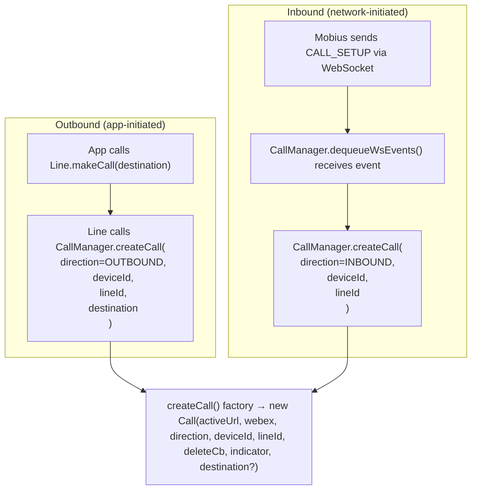
```mermaid
flowchart TD
    subgraph Outbound ["Outbound (app-initiated)"]
        O1["App calls Line.makeCall(destination)"]
        O2["Line calls CallManager.createCall(\n  direction=OUTBOUND,\n  deviceId,\n  lineId,\n  destination\n)"]
        O1 --> O2
    end

    subgraph Inbound ["Inbound (network-initiated)"]
        I1["Mobius sends CALL_SETUP via WebSocket"]
        I2["CallManager.dequeueWsEvents() receives event"]
        I3["CallManager.createCall(\n  direction=INBOUND,\n  deviceId,\n  lineId\n)"]
        I1 --> I2 --> I3
    end

    O2 --> CTOR
    I3 --> CTOR

    CTOR["createCall() factory → new Call(activeUrl, webex, direction, deviceId, lineId, deleteCb, indicator, destination?)"]
```

### Constants

All constants are imported from `../constants` (`CallingClient/constants.ts`).

| Constant | Value | Description |
|----------|-------|-------------|
| `DEFAULT_SESSION_TIMER` | `600000` (10 minutes) | Keepalive interval after call establishment |
| `SUPPLEMENTARY_SERVICES_TIMEOUT` | `10000` (10 seconds) | Timeout for hold/resume mid-call response |
| `MAX_CALL_KEEPALIVE_RETRY_COUNT` | `4` | Maximum keepalive retries before retry loop stops |
| `INITIAL_SEQ_NUMBER` | `1` | Starting ROAP sequence number |
| `DEVICES_ENDPOINT_RESOURCE` | `'devices'` | URL path segment |
| `CALL_ENDPOINT_RESOURCE` | `'call'` | URL path segment (singular, for POST) |
| `CALLS_ENDPOINT_RESOURCE` | `'calls'` | URL path segment (plural, for PATCH/DELETE/media/status) |
| `MEDIA_ENDPOINT_RESOURCE` | `'media'` | URL path segment |
| `CALL_STATUS_RESOURCE` | `'status'` | URL path segment |
| `CALL_HOLD_SERVICE` | `'callhold'` | Supplementary service path segment |
| `CALL_TRANSFER_SERVICE` | `'calltransfer'` | Supplementary service path segment |
| `HOLD_ENDPOINT` | `'hold'` | Hold action endpoint |
| `RESUME_ENDPOINT` | `'resume'` | Resume action endpoint |
| `TRANSFER_ENDPOINT` | `'commit'` | Transfer action endpoint |

## Data Flow

### 1. Call Lifecycle Orchestration

- Creates and manages outbound and inbound call instances with stable `correlationId` mapping.
- Drives call progression from setup to established, held/resumed, transfer, and disconnect states.
- Cleans up call resources and collection state when calls terminate.

### Resolution Flow

```
CallerIdInfo received
│
├── Has p-asserted-identity? ──→ parseSipUri() ──→ DisplayInformation
│
├── Has from header? ──→ parseSipUri() ──→ DisplayInformation
│
└── Has x-broadworks-remote-party-info? ──→ parseRemotePartyInfo() ──→ resolveCallerId()
                                                                            │
                                                                     SCIM query to Webex
                                                                            │
                                                                     DisplayInformation
                                                                            │
                                                                     emit CALLER_ID event
```

### Constructor Initialization Pipeline

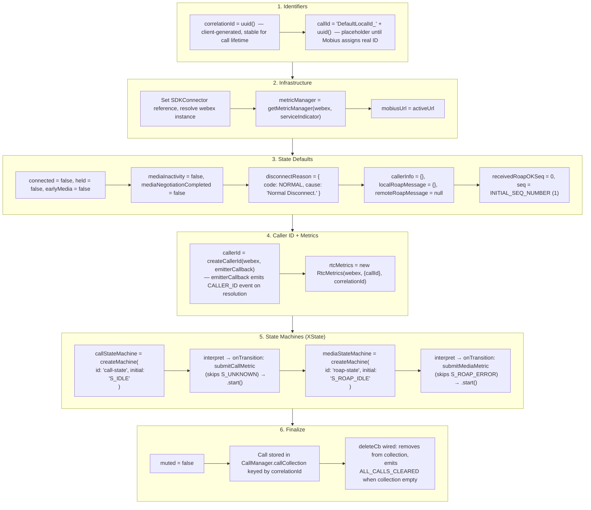
```mermaid
flowchart TD
    subgraph IDs ["1. Identifiers"]
        A1["correlationId = uuid()  — client-generated, stable for call lifetime"]
        A2["callId = 'DefaultLocalId_' + uuid()  — placeholder until Mobius assigns real ID"]
        A1 --> A2
    end

    subgraph Infra ["2. Infrastructure"]
        B1["Set SDKConnector reference, resolve webex instance"]
        B2["metricManager = getMetricManager(webex, serviceIndicator)"]
        B3["mobiusUrl = activeUrl"]
        B1 --> B2 --> B3
    end

    subgraph Defaults ["3. State Defaults"]
        C1["connected = false, held = false, earlyMedia = false"]
        C2["mediaInactivity = false, mediaNegotiationCompleted = false"]
        C3["disconnectReason = { code: NORMAL, cause: 'Normal Disconnect.' }"]
        C4["callerInfo = {}, localRoapMessage = {}, remoteRoapMessage = null"]
        C5["receivedRoapOKSeq = 0, seq = INITIAL_SEQ_NUMBER (1)"]
        C1 --> C2 --> C3 --> C4 --> C5
    end

    subgraph Resolvers ["4. Caller ID + Metrics"]
        D1["callerId = createCallerId(webex, emitterCallback)\n— emitterCallback emits CALLER_ID event on resolution"]
        D2["rtcMetrics = new RtcMetrics(webex, {callId}, correlationId)"]
        D1 --> D2
    end

    subgraph SM ["5. State Machines (XState)"]
        E1["callStateMachine = createMachine(\n  id: 'call-state', initial: 'S_IDLE'\n)"]
        E2["interpret → onTransition: submitCallMetric\n  (skips S_UNKNOWN) → .start()"]
        E3["mediaStateMachine = createMachine(\n  id: 'roap-state', initial: 'S_ROAP_IDLE'\n)"]
        E4["interpret → onTransition: submitMediaMetric\n  (skips S_ROAP_ERROR) → .start()"]
        E1 --> E2 --> E3 --> E4
    end

    subgraph Final ["6. Finalize"]
        F1["muted = false"]
        F2["Call stored in CallManager.callCollection keyed by correlationId"]
        F3["deleteCb wired: removes from collection,\n  emits ALL_CALLS_CLEARED when collection empty"]
        F1 --> F2 --> F3
    end

    IDs --> Infra --> Defaults --> Resolvers --> SM --> Final
```

### CallManager Event Processing Pipeline

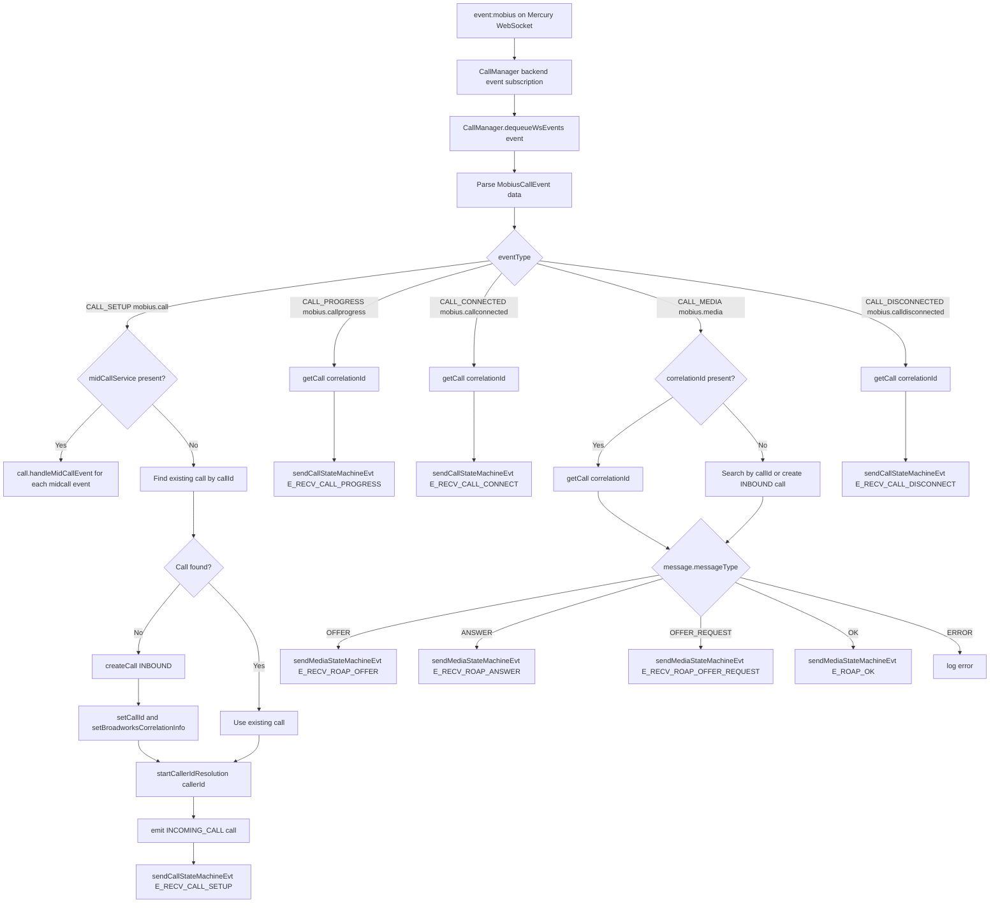
```mermaid
flowchart TD
    A[event:mobius on Mercury WebSocket] --> B[CallManager backend event subscription]
    B --> C[CallManager.dequeueWsEvents event]
    C --> D[Parse MobiusCallEvent data]
    D --> E{eventType}

    E -->|CALL_SETUP mobius.call| F{midCallService present?}
    F -->|Yes| F1[call.handleMidCallEvent for each midcall event]
    F -->|No| F2[Find existing call by callId]
    F2 --> F3{Call found?}
    F3 -->|No| F4[createCall INBOUND]
    F4 --> F5[setCallId and setBroadworksCorrelationInfo]
    F3 -->|Yes| F6[Use existing call]
    F5 --> F7[startCallerIdResolution callerId]
    F6 --> F7
    F7 --> F8[emit INCOMING_CALL call]
    F8 --> F9[sendCallStateMachineEvt E_RECV_CALL_SETUP]

    E -->|CALL_PROGRESS mobius.callprogress| G[getCall correlationId]
    G --> G1[sendCallStateMachineEvt E_RECV_CALL_PROGRESS]

    E -->|CALL_CONNECTED mobius.callconnected| H[getCall correlationId]
    H --> H1[sendCallStateMachineEvt E_RECV_CALL_CONNECT]

    E -->|CALL_MEDIA mobius.media| I{correlationId present?}
    I -->|Yes| I1[getCall correlationId]
    I -->|No| I2[Search by callId or create INBOUND call]
    I1 --> J{message.messageType}
    I2 --> J
    J -->|OFFER| J1[sendMediaStateMachineEvt E_RECV_ROAP_OFFER]
    J -->|ANSWER| J2[sendMediaStateMachineEvt E_RECV_ROAP_ANSWER]
    J -->|OFFER_REQUEST| J3[sendMediaStateMachineEvt E_RECV_ROAP_OFFER_REQUEST]
    J -->|OK| J4[sendMediaStateMachineEvt E_ROAP_OK]
    J -->|ERROR| J5[log error]

    E -->|CALL_DISCONNECTED mobius.calldisconnected| K[getCall correlationId]
    K --> K1[sendCallStateMachineEvt E_RECV_CALL_DISCONNECT]
```

### Outgoing Call Flow (Detailed)

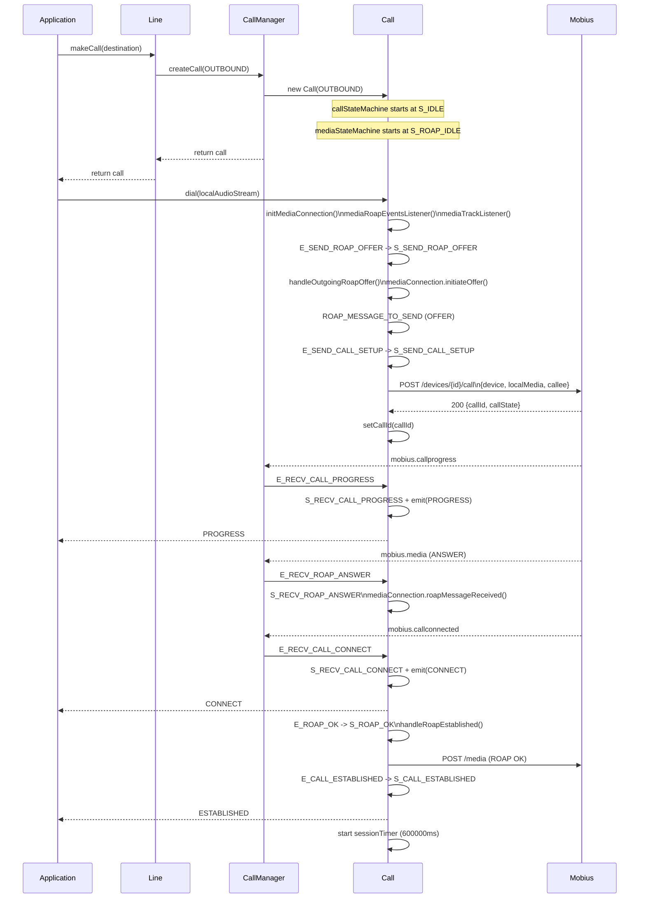
```mermaid
sequenceDiagram
    participant App as Application
    participant Line as Line
    participant CM as CallManager
    participant Call as Call
    participant Mobius as Mobius

    App->>Line: makeCall(destination)
    Line->>CM: createCall(OUTBOUND)
    CM->>Call: new Call(OUTBOUND)
    Note over Call: callStateMachine starts at S_IDLE
    Note over Call: mediaStateMachine starts at S_ROAP_IDLE
    CM-->>Line: return call
    Line-->>App: return call

    App->>Call: dial(localAudioStream)
    Call->>Call: initMediaConnection()\nmediaRoapEventsListener()\nmediaTrackListener()
    Call->>Call: E_SEND_ROAP_OFFER -> S_SEND_ROAP_OFFER
    Call->>Call: handleOutgoingRoapOffer()\nmediaConnection.initiateOffer()
    Call->>Call: ROAP_MESSAGE_TO_SEND (OFFER)

    Call->>Call: E_SEND_CALL_SETUP -> S_SEND_CALL_SETUP
    Call->>Mobius: POST /devices/{id}/call\n{device, localMedia, callee}
    Mobius-->>Call: 200 {callId, callState}
    Call->>Call: setCallId(callId)

    Mobius-->>CM: mobius.callprogress
    CM->>Call: E_RECV_CALL_PROGRESS
    Call->>Call: S_RECV_CALL_PROGRESS + emit(PROGRESS)
    Call-->>App: PROGRESS

    Mobius-->>CM: mobius.media (ANSWER)
    CM->>Call: E_RECV_ROAP_ANSWER
    Call->>Call: S_RECV_ROAP_ANSWER\nmediaConnection.roapMessageReceived()

    Mobius-->>CM: mobius.callconnected
    CM->>Call: E_RECV_CALL_CONNECT
    Call->>Call: S_RECV_CALL_CONNECT + emit(CONNECT)
    Call-->>App: CONNECT

    Call->>Call: E_ROAP_OK -> S_ROAP_OK\nhandleRoapEstablished()
    Call->>Mobius: POST /media (ROAP OK)
    Call->>Call: E_CALL_ESTABLISHED -> S_CALL_ESTABLISHED
    Call-->>App: ESTABLISHED
    Call->>Call: start sessionTimer (600000ms)
```

### Incoming Call Flow (Detailed)

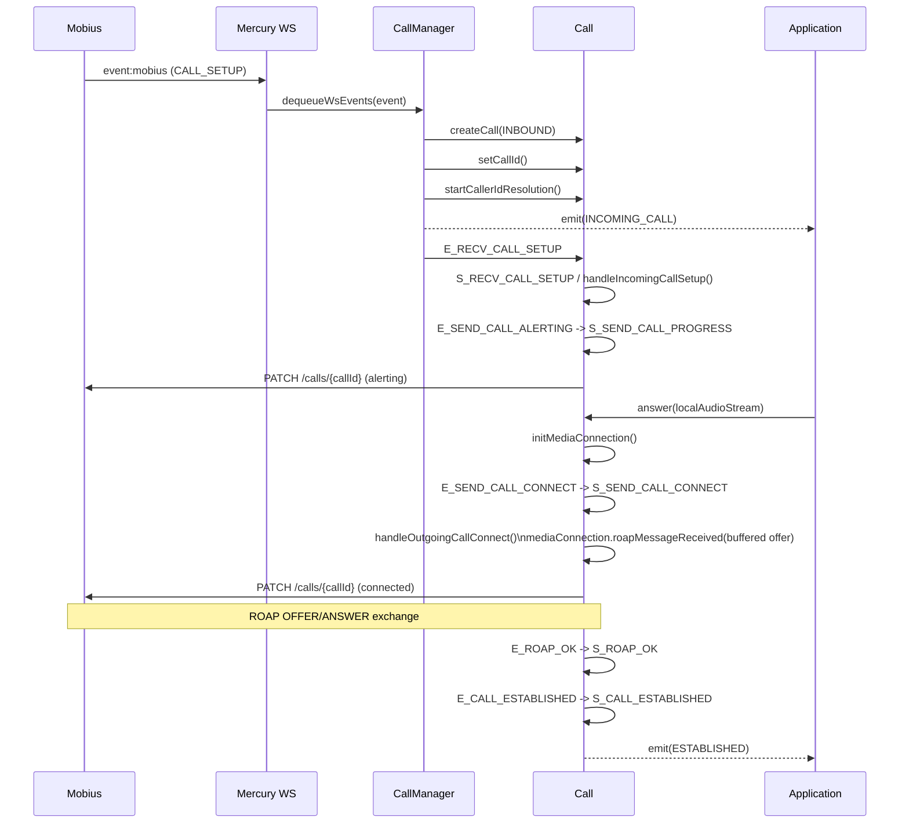
```mermaid
sequenceDiagram
    participant Mobius as Mobius
    participant Mercury as Mercury WS
    participant CM as CallManager
    participant Call as Call
    participant App as Application

    Mobius->>Mercury: event:mobius (CALL_SETUP)
    Mercury->>CM: dequeueWsEvents(event)
    CM->>Call: createCall(INBOUND)
    CM->>Call: setCallId()
    CM->>Call: startCallerIdResolution()
    CM-->>App: emit(INCOMING_CALL)

    CM->>Call: E_RECV_CALL_SETUP
    Call->>Call: S_RECV_CALL_SETUP / handleIncomingCallSetup()
    Call->>Call: E_SEND_CALL_ALERTING -> S_SEND_CALL_PROGRESS
    Call->>Mobius: PATCH /calls/{callId} (alerting)

    App->>Call: answer(localAudioStream)
    Call->>Call: initMediaConnection()
    Call->>Call: E_SEND_CALL_CONNECT -> S_SEND_CALL_CONNECT
    Call->>Call: handleOutgoingCallConnect()\nmediaConnection.roapMessageReceived(buffered offer)
    Call->>Mobius: PATCH /calls/{callId} (connected)

    Note over Call,Mobius: ROAP OFFER/ANSWER exchange
    Call->>Call: E_ROAP_OK -> S_ROAP_OK
    Call->>Call: E_CALL_ESTABLISHED -> S_CALL_ESTABLISHED
    Call-->>App: emit(ESTABLISHED)
```

### Hold and Resume Flow

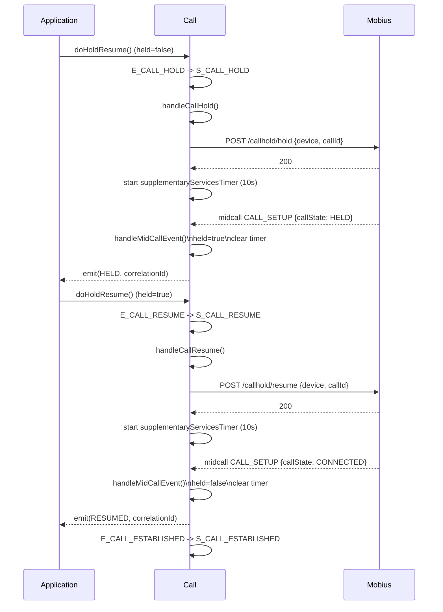
```mermaid
sequenceDiagram
    participant App as Application
    participant Call as Call
    participant Mobius as Mobius

    App->>Call: doHoldResume() (held=false)
    Call->>Call: E_CALL_HOLD -> S_CALL_HOLD
    Call->>Call: handleCallHold()
    Call->>Mobius: POST /callhold/hold {device, callId}
    Mobius-->>Call: 200
    Call->>Call: start supplementaryServicesTimer (10s)
    Mobius-->>Call: midcall CALL_SETUP {callState: HELD}
    Call->>Call: handleMidCallEvent()\nheld=true\nclear timer
    Call-->>App: emit(HELD, correlationId)

    App->>Call: doHoldResume() (held=true)
    Call->>Call: E_CALL_RESUME -> S_CALL_RESUME
    Call->>Call: handleCallResume()
    Call->>Mobius: POST /callhold/resume {device, callId}
    Mobius-->>Call: 200
    Call->>Call: start supplementaryServicesTimer (10s)
    Mobius-->>Call: midcall CALL_SETUP {callState: CONNECTED}
    Call->>Call: handleMidCallEvent()\nheld=false\nclear timer
    Call-->>App: emit(RESUMED, correlationId)
    Call->>Call: E_CALL_ESTABLISHED -> S_CALL_ESTABLISHED
```

### Blind Transfer

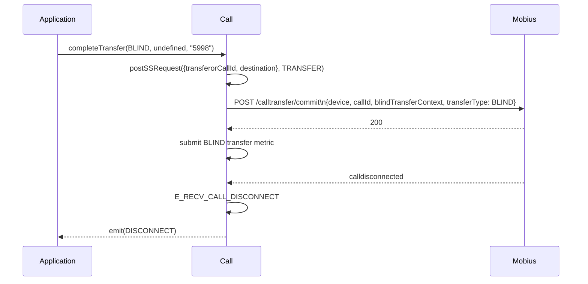
```mermaid
sequenceDiagram
    participant App as Application
    participant Call as Call
    participant Mobius as Mobius

    App->>Call: completeTransfer(BLIND, undefined, "5998")
    Call->>Call: postSSRequest({transferorCallId, destination}, TRANSFER)
    Call->>Mobius: POST /calltransfer/commit\n{device, callId, blindTransferContext, transferType: BLIND}
    Mobius-->>Call: 200
    Call->>Call: submit BLIND transfer metric
    Mobius-->>Call: calldisconnected
    Call->>Call: E_RECV_CALL_DISCONNECT
    Call-->>App: emit(DISCONNECT)
```

### Consult Transfer

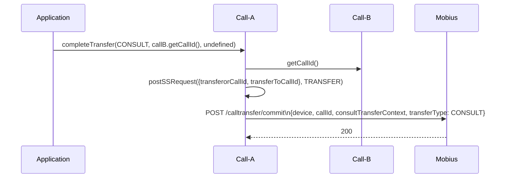
```mermaid
sequenceDiagram
    participant App as Application
    participant CallA as Call-A
    participant CallB as Call-B
    participant Mobius as Mobius

    App->>CallA: completeTransfer(CONSULT, callB.getCallId(), undefined)
    CallA->>CallB: getCallId()
    CallA->>CallA: postSSRequest({transferorCallId, transferToCallId}, TRANSFER)
    CallA->>Mobius: POST /calltransfer/commit\n{device, callId, consultTransferContext, transferType: CONSULT}
    Mobius-->>CallA: 200
```

### Initialization

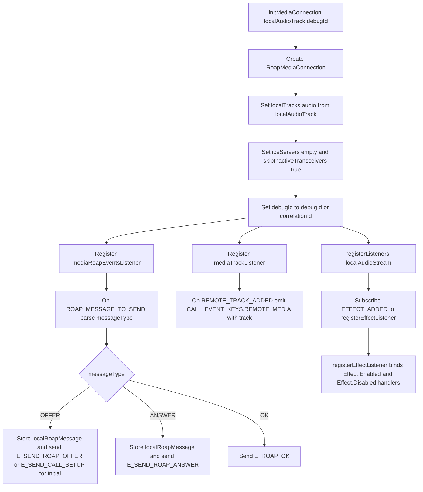
```mermaid
flowchart TD
    A[initMediaConnection localAudioTrack debugId] --> B[Create RoapMediaConnection]
    B --> C[Set localTracks audio from localAudioTrack]
    C --> D[Set iceServers empty and skipInactiveTransceivers true]
    D --> E[Set debugId to debugId or correlationId]

    E --> F[Register mediaRoapEventsListener]
    F --> G[On ROAP_MESSAGE_TO_SEND parse messageType]
    G --> H{messageType}
    H -->|OFFER| H1[Store localRoapMessage and send E_SEND_ROAP_OFFER or E_SEND_CALL_SETUP for initial]
    H -->|ANSWER| H2[Store localRoapMessage and send E_SEND_ROAP_ANSWER]
    H -->|OK| H3[Send E_ROAP_OK]

    E --> I[Register mediaTrackListener]
    I --> J[On REMOTE_TRACK_ADDED emit CALL_EVENT_KEYS.REMOTE_MEDIA with track]

    E --> K[registerListeners localAudioStream]
    K --> L[Subscribe EFFECT_ADDED to registerEffectListener]
    L --> M[registerEffectListener binds Effect.Enabled and Effect.Disabled handlers]
```

### SDP Processing

ROAP handling is bidirectional:

### Local Disconnect (end())

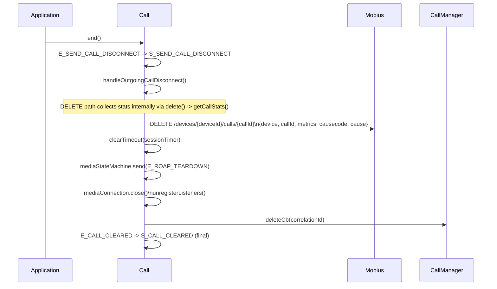
```mermaid
sequenceDiagram
    participant App as Application
    participant Call as Call
    participant Mobius as Mobius
    participant CM as CallManager

    App->>Call: end()
    Call->>Call: E_SEND_CALL_DISCONNECT -> S_SEND_CALL_DISCONNECT
    Call->>Call: handleOutgoingCallDisconnect()
    Note over Call: DELETE path collects stats internally via delete() -> getCallStats()
    Call->>Mobius: DELETE /devices/{deviceId}/calls/{callId}\n{device, callId, metrics, causecode, cause}
    Call->>Call: clearTimeout(sessionTimer)
    Call->>Call: mediaStateMachine.send(E_ROAP_TEARDOWN)
    Call->>Call: mediaConnection.close()\nunregisterListeners()
    Call->>CM: deleteCb(correlationId)
    Call->>Call: E_CALL_CLEARED -> S_CALL_CLEARED (final)
```

### Remote Disconnect

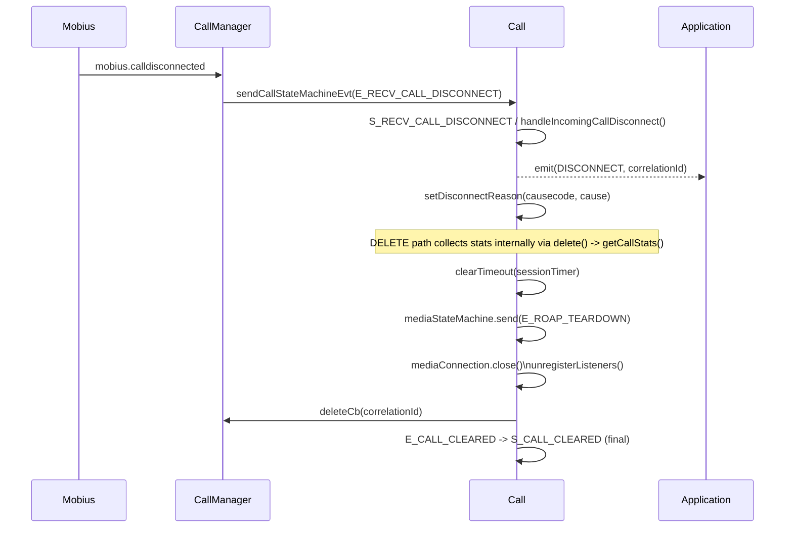
```mermaid
sequenceDiagram
    participant Mobius as Mobius
    participant CM as CallManager
    participant Call as Call
    participant App as Application

    Mobius->>CM: mobius.calldisconnected
    CM->>Call: sendCallStateMachineEvt(E_RECV_CALL_DISCONNECT)
    Call->>Call: S_RECV_CALL_DISCONNECT / handleIncomingCallDisconnect()
    Call-->>App: emit(DISCONNECT, correlationId)
    Call->>Call: setDisconnectReason(causecode, cause)
    Note over Call: DELETE path collects stats internally via delete() -> getCallStats()
    Call->>Call: clearTimeout(sessionTimer)
    Call->>Call: mediaStateMachine.send(E_ROAP_TEARDOWN)
    Call->>Call: mediaConnection.close()\nunregisterListeners()
    Call->>CM: deleteCb(correlationId)
    Call->>Call: E_CALL_CLEARED -> S_CALL_CLEARED (final)
```

### Call Keepalive Flow

Keepalive is active while the call is established. A session timer triggers periodic status checks using `postStatus()`:

- `sessionTimer` starts after call establishment (default interval: `600000ms`).
- On each tick, `Call` sends `POST /devices/{deviceId}/calls/{callId}/status`.
- Success resets keepalive retry tracking and schedules the next keepalive cycle.
- Failure increments `callKeepaliveRetryCount` and schedules retry via `RetryCallBack`.
- On retry exhaustion (`MAX_CALL_KEEPALIVE_RETRY_COUNT`), retry loop stops and no immediate disconnect event is sent.
- Disconnect is triggered only on abort scenarios from `handleCallErrors` (for example keepalive 401/403/404 paths), where `E_SEND_CALL_DISCONNECT` is emitted.

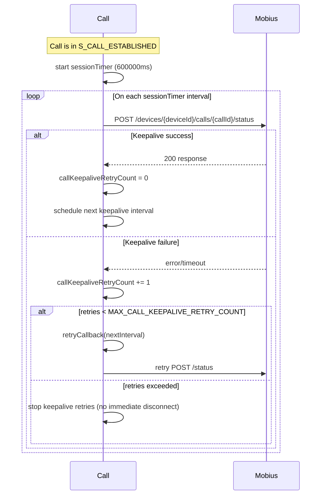
```mermaid
sequenceDiagram
    participant Call as Call
    participant Mobius as Mobius

    Note over Call: Call is in S_CALL_ESTABLISHED
    Call->>Call: start sessionTimer (600000ms)

    loop On each sessionTimer interval
        Call->>Mobius: POST /devices/{deviceId}/calls/{callId}/status
        alt Keepalive success
            Mobius-->>Call: 200 response
            Call->>Call: callKeepaliveRetryCount = 0
            Call->>Call: schedule next keepalive interval
        else Keepalive failure
            Mobius-->>Call: error/timeout
            Call->>Call: callKeepaliveRetryCount += 1
            alt retries < MAX_CALL_KEEPALIVE_RETRY_COUNT
                Call->>Call: retryCallback(nextInterval)
                Call->>Mobius: retry POST /status
            else retries exceeded
                Call->>Call: stop keepalive retries (no immediate disconnect)
            end
        end
    end
```

## Sequence Diagram(s)

Sequence coverage:

| Operation group | Diagram / coverage | Failure / recovery coverage |
|---|---|---|
| Outbound call setup and ROAP | Complete ROAP Sequence (Outbound Call) | Signaling/media errors emit typed call errors |
| Inbound call answer and ROAP | Complete ROAP Sequence (Inbound Call) | Reject/disconnect and media failure paths use the same state machines |
| Mid-call hold/resume/transfer | Shares established Call→Mobius→media actors and ordering with the ROAP diagrams | Supplementary-service timeout/error events are detailed in failure modes |
| Mobius event routing | CallManager routing in Data Flow | Correlation/call-id guards prevent routing to the wrong call |

### Complete ROAP Sequence (Inbound Call)

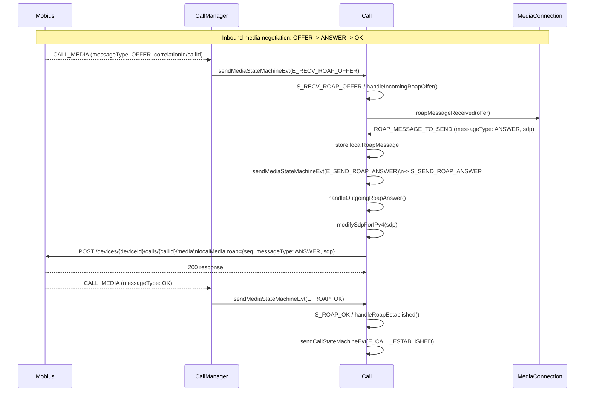
```mermaid
sequenceDiagram
    participant Mobius as Mobius
    participant CM as CallManager
    participant Call as Call
    participant MC as MediaConnection

    Note over Mobius,MC: Inbound media negotiation: OFFER -> ANSWER -> OK

    Mobius-->>CM: CALL_MEDIA (messageType: OFFER, correlationId/callId)
    CM->>Call: sendMediaStateMachineEvt(E_RECV_ROAP_OFFER)
    Call->>Call: S_RECV_ROAP_OFFER / handleIncomingRoapOffer()
    Call->>MC: roapMessageReceived(offer)

    MC-->>Call: ROAP_MESSAGE_TO_SEND (messageType: ANSWER, sdp)
    Call->>Call: store localRoapMessage
    Call->>Call: sendMediaStateMachineEvt(E_SEND_ROAP_ANSWER)\n-> S_SEND_ROAP_ANSWER
    Call->>Call: handleOutgoingRoapAnswer()
    Call->>Call: modifySdpForIPv4(sdp)
    Call->>Mobius: POST /devices/{deviceId}/calls/{callId}/media\nlocalMedia.roap={seq, messageType: ANSWER, sdp}
    Mobius-->>Call: 200 response

    Mobius-->>CM: CALL_MEDIA (messageType: OK)
    CM->>Call: sendMediaStateMachineEvt(E_ROAP_OK)
    Call->>Call: S_ROAP_OK / handleRoapEstablished()
    Call->>Call: sendCallStateMachineEvt(E_CALL_ESTABLISHED)
```

### Complete ROAP Sequence (Outbound Call)

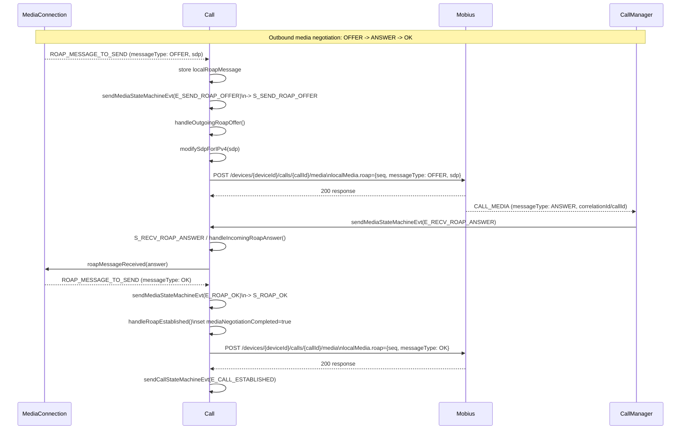
```mermaid
sequenceDiagram
    participant MC as MediaConnection
    participant Call as Call
    participant Mobius as Mobius
    participant CM as CallManager

    Note over MC,CM: Outbound media negotiation: OFFER -> ANSWER -> OK

    MC-->>Call: ROAP_MESSAGE_TO_SEND (messageType: OFFER, sdp)
    Call->>Call: store localRoapMessage
    Call->>Call: sendMediaStateMachineEvt(E_SEND_ROAP_OFFER)\n-> S_SEND_ROAP_OFFER
    Call->>Call: handleOutgoingRoapOffer()
    Call->>Call: modifySdpForIPv4(sdp)
    Call->>Mobius: POST /devices/{deviceId}/calls/{callId}/media\nlocalMedia.roap={seq, messageType: OFFER, sdp}
    Mobius-->>Call: 200 response

    Mobius-->>CM: CALL_MEDIA (messageType: ANSWER, correlationId/callId)
    CM->>Call: sendMediaStateMachineEvt(E_RECV_ROAP_ANSWER)
    Call->>Call: S_RECV_ROAP_ANSWER / handleIncomingRoapAnswer()
    Call->>MC: roapMessageReceived(answer)

    MC-->>Call: ROAP_MESSAGE_TO_SEND (messageType: OK)
    Call->>Call: sendMediaStateMachineEvt(E_ROAP_OK)\n-> S_ROAP_OK
    Call->>Call: handleRoapEstablished()\nset mediaNegotiationCompleted=true
    Call->>Mobius: POST /devices/{deviceId}/calls/{callId}/media\nlocalMedia.roap={seq, messageType: OK}
    Mobius-->>Call: 200 response
    Call->>Call: sendCallStateMachineEvt(E_CALL_ESTABLISHED)
```

ROAP publish payload shape:

```json
{
  "device": { "deviceId": "...", "correlationId": "..." },
  "callId": "...",
  "localMedia": {
    "roap": { "seq": 1, "messageType": "OFFER|ANSWER|OK", "sdp": "..." },
    "mediaId": "..."
  }
}
```

## Class / Component Relationships

### Component Overview

The Calling sub-module is organized around one manager (`CallManager`) and per-call executors (`Call`).  
`CallManager` handles event intake/routing and active call tracking, while each `Call` owns signaling/media state, backend signaling API operations, and event emission.  
`CallerId` is a focused helper used by `Call` for caller identity resolution and incremental updates.
In this document, **Mobius** refers to the backend signaling/control service used by the calling stack.

### Component Responsibilities

| Component | Primary Responsibility | Key Interactions |
|-----------|------------------------|------------------|
| `CallManager` (class) | Owns active call collection, resolves/routes backend events | Backend signaling stream (`event:mobius`), `Call`, `Line` |
| `Call` (class) | Executes call lifecycle operations and state machines | Backend signaling service (`Mobius`) REST APIs, `RoapMediaConnection`, `CallerId`, app listeners |
| `CallerId` | Resolves display identity from headers + SCIM enrichment | `Call` callback emitter, shared identity utilities |
| `Call State Machine` | Signaling transitions and call control actions | Lives in `Call` as `callMachine` and drives handlers (`setup`, `connect`, `disconnect`, `hold/resume`) |
| `Media ROAP State Machine` | ROAP negotiation transitions (`OFFER/ANSWER/OK/ERROR`) | Lives in `Call` as `mediaMachine` and drives ROAP handlers + `RoapMediaConnection` |

### Class Diagram

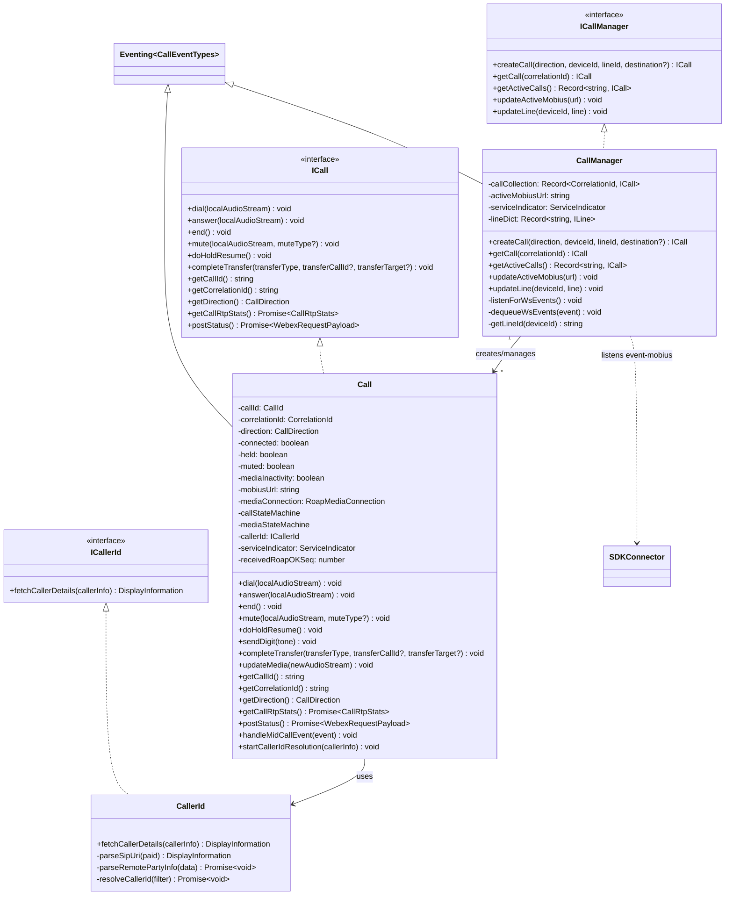
```mermaid
classDiagram
  class Eventing~CallEventTypes~

  class ICallManager {
    <<interface>>
    +createCall(direction, deviceId, lineId, destination?) ICall
    +getCall(correlationId) ICall
    +getActiveCalls() Record~string, ICall~
    +updateActiveMobius(url) void
    +updateLine(deviceId, line) void
  }

  class ICall {
    <<interface>>
    +dial(localAudioStream) void
    +answer(localAudioStream) void
    +end() void
    +mute(localAudioStream, muteType?) void
    +doHoldResume() void
    +completeTransfer(transferType, transferCallId?, transferTarget?) void
    +getCallId() string
    +getCorrelationId() string
    +getDirection() CallDirection
    +getCallRtpStats() Promise~CallRtpStats~
    +postStatus() Promise~WebexRequestPayload~
  }

  class ICallerId {
    <<interface>>
    +fetchCallerDetails(callerInfo) DisplayInformation
  }

  class CallManager {
    -callCollection: Record~CorrelationId, ICall~
    -activeMobiusUrl: string
    -serviceIndicator: ServiceIndicator
    -lineDict: Record~string, ILine~
    +createCall(direction, deviceId, lineId, destination?) ICall
    +getCall(correlationId) ICall
    +getActiveCalls() Record~string, ICall~
    +updateActiveMobius(url) void
    +updateLine(deviceId, line) void
    -listenForWsEvents() void
    -dequeueWsEvents(event) void
    -getLineId(deviceId) string
  }

  class Call {
    -callId: CallId
    -correlationId: CorrelationId
    -direction: CallDirection
    -connected: boolean
    -held: boolean
    -muted: boolean
    -mediaInactivity: boolean
    -mobiusUrl: string
    -mediaConnection: RoapMediaConnection
    -callStateMachine
    -mediaStateMachine
    -callerId: ICallerId
    -serviceIndicator: ServiceIndicator
    -receivedRoapOKSeq: number
    +dial(localAudioStream) void
    +answer(localAudioStream) void
    +end() void
    +mute(localAudioStream, muteType?) void
    +doHoldResume() void
    +sendDigit(tone) void
    +completeTransfer(transferType, transferCallId?, transferTarget?) void
    +updateMedia(newAudioStream) void
    +getCallId() string
    +getCorrelationId() string
    +getDirection() CallDirection
    +getCallRtpStats() Promise~CallRtpStats~
    +postStatus() Promise~WebexRequestPayload~
    +handleMidCallEvent(event) void
    +startCallerIdResolution(callerInfo) void
  }

  class CallerId {
    +fetchCallerDetails(callerInfo) DisplayInformation
    -parseSipUri(paid) DisplayInformation
    -parseRemotePartyInfo(data) Promise~void~
    -resolveCallerId(filter) Promise~void~
  }

  Eventing~CallEventTypes~ <|-- CallManager
  Eventing~CallEventTypes~ <|-- Call
  ICallManager <|.. CallManager
  ICall <|.. Call
  ICallerId <|.. CallerId
  CallManager "1" --> "*" Call : creates/manages
  Call --> CallerId : uses
  CallManager ..> SDKConnector : listens event-mobius
```

## Use Cases

- **UC-1 ICall and CallManager call lifecycle operations:** A package consumer invokes the surface, the module coordinates its dependencies, and returns or emits the typed outcome. Evidence: `src/CallingClient/calling/CallerId/index.ts`, `src/CallingClient/calling/CallerId/index.test.ts`.
- **UC-2 Typed call, media, supplementary-service, and error events:** A package consumer invokes the surface, the module coordinates its dependencies, and returns or emits the typed outcome. Evidence: `src/CallingClient/calling/CallerId/index.ts`, `src/CallingClient/calling/CallerId/index.test.ts`.

## State Model

`CallManager` owns active calls keyed by correlation id and line mappings keyed by device id. Each `Call` owns a signaling state machine, a ROAP/media state machine, identifiers, timers, media connection, caller information, and disconnect reason. Evidence: `src/CallingClient/calling/callManager.ts`, `src/CallingClient/calling/call.ts`.

## Business Rules & Invariants

- Mobius events are routed by correlation/call id; unknown or out-of-order events must not mutate an unrelated call.
- Signaling and media transitions occur only through their XState event entry points.
- Call cleanup removes listeners/timers and deletes the call from CallManager exactly once.
- Auth metadata is obtained through APIRequest/SDKConnector; call logs and metrics must not expose authorization values or raw sensitive identity data. Evidence: `src/CallingClient/calling/call.ts`, `src/CallingClient/calling/callManager.ts`, `src/CallingClient/utils/request.ts`.

## Concurrency & Reactive Flow

### Keepalive

| Method | Signature | Description |
|--------|-----------|-------------|
| `scheduleCallKeepaliveInterval` | `private scheduleCallKeepaliveInterval = (): void` | Schedules periodic `postStatus()` call to Mobius |
| `callKeepaliveRetryCallback` | `private callKeepaliveRetryCallback = (interval: number): void` | Retries keepalive POST after error with given interval |
| `handleCallKeepaliveError` | `private handleCallKeepaliveError = async (err: unknown): Promise<void>` | Handles keepalive errors, increments retry count, force-disconnects after max retries |

## State Machine

### 3. Signaling and Media State Machine Coordination

- Maintains call signaling and ROAP media state machines per call.
- Coordinates HTTP signaling operations with asynchronous WebSocket-driven transitions.
- Preserves deterministic behavior through explicit event-driven transitions.

### State Machine Action Handlers

| Method | Signature | Description |
|--------|-----------|-------------|
| `handleIncomingCallSetup` | `private handleIncomingCallSetup(event: CallEvent): void` | Sends `E_SEND_CALL_ALERTING` to begin alerting flow |
| `handleOutgoingCallSetup` | `private async handleOutgoingCallSetup(event: CallEvent): void` | POSTs to `/call` endpoint, sets server-assigned `callId` |
| `handleIncomingCallProgress` | `private handleIncomingCallProgress(event: CallEvent): void` | Processes inband media flag, emits `PROGRESS` |
| `handleOutgoingCallAlerting` | `private async handleOutgoingCallAlerting(event: CallEvent): void` | PATCHes call state to `sig_alerting` |
| `handleIncomingCallConnect` | `private handleIncomingCallConnect(event: CallEvent): void` | Emits `CONNECT` event |
| `handleOutgoingCallConnect` | `private async handleOutgoingCallConnect(event: CallEvent): void` | Processes buffered ROAP offer, PATCHes to `sig_connected` |
| `handleCallEstablished` | `private handleCallEstablished(event: CallEvent): void` | Emits `ESTABLISHED`, starts `sessionTimer` for keepalive |
| `handleCallHold` | `private async handleCallHold(event: CallEvent): void` | POSTs to `/callhold/hold`, starts `supplementaryServicesTimer` |
| `handleCallResume` | `private async handleCallResume(event: CallEvent): void` | POSTs to `/callhold/resume`, starts `supplementaryServicesTimer` |
| `handleIncomingCallDisconnect` | `private async handleIncomingCallDisconnect(event: CallEvent): void` | Sets disconnect reason, cleans up resources, emits `DISCONNECT` |
| `handleOutgoingCallDisconnect` | `private async handleOutgoingCallDisconnect(event: CallEvent): void` | DELETEs call, cleans up resources, emits `DISCONNECT` |
| `handleUnknownState` | `private async handleUnknownState(event: CallEvent): void` | Handles unexpected state, cleans up and deletes call |
| `handleTimeout` | `private async handleTimeout(): void` | Handles state timeout, emits error and cleans up |

### Complete State Definition


```mermaid
stateDiagram-v2
    [*] --> S_IDLE

    S_IDLE --> S_RECV_CALL_SETUP: E_RECV_CALL_SETUP / incomingCallSetup
    S_IDLE --> S_SEND_CALL_SETUP: E_SEND_CALL_SETUP / outgoingCallSetup
    S_IDLE --> S_RECV_CALL_DISCONNECT: E_RECV_CALL_DISCONNECT / incomingCallDisconnect
    S_IDLE --> S_SEND_CALL_DISCONNECT: E_SEND_CALL_DISCONNECT / outgoingCallDisconnect
    S_IDLE --> S_UNKNOWN: E_UNKNOWN / unknownState

    S_RECV_CALL_SETUP --> S_SEND_CALL_PROGRESS: E_SEND_CALL_ALERTING / outgoingCallAlerting
    S_RECV_CALL_SETUP --> S_RECV_CALL_DISCONNECT: E_RECV_CALL_DISCONNECT / incomingCallDisconnect
    S_RECV_CALL_SETUP --> S_SEND_CALL_DISCONNECT: E_SEND_CALL_DISCONNECT / outgoingCallDisconnect
    S_RECV_CALL_SETUP --> S_UNKNOWN: E_UNKNOWN / unknownState
    S_RECV_CALL_SETUP --> S_CALL_CLEARED: timeout 10000ms

    S_SEND_CALL_SETUP --> S_RECV_CALL_PROGRESS: E_RECV_CALL_PROGRESS / incomingCallProgress
    S_SEND_CALL_SETUP --> S_RECV_CALL_CONNECT: E_RECV_CALL_CONNECT / incomingCallConnect
    S_SEND_CALL_SETUP --> S_RECV_CALL_DISCONNECT: E_RECV_CALL_DISCONNECT / incomingCallDisconnect
    S_SEND_CALL_SETUP --> S_SEND_CALL_DISCONNECT: E_SEND_CALL_DISCONNECT / outgoingCallDisconnect
    S_SEND_CALL_SETUP --> S_UNKNOWN: E_UNKNOWN / unknownState
    S_SEND_CALL_SETUP --> S_CALL_CLEARED: timeout 10000ms

    S_RECV_CALL_PROGRESS --> S_RECV_CALL_CONNECT: E_RECV_CALL_CONNECT / incomingCallConnect
    S_RECV_CALL_PROGRESS --> S_RECV_CALL_DISCONNECT: E_RECV_CALL_DISCONNECT / incomingCallDisconnect
    S_RECV_CALL_PROGRESS --> S_SEND_CALL_DISCONNECT: E_SEND_CALL_DISCONNECT / outgoingCallDisconnect
    S_RECV_CALL_PROGRESS --> S_RECV_CALL_PROGRESS: E_RECV_CALL_PROGRESS / incomingCallProgress
    S_RECV_CALL_PROGRESS --> S_UNKNOWN: E_UNKNOWN / unknownState
    S_RECV_CALL_PROGRESS --> S_CALL_CLEARED: timeout 60000ms

    S_SEND_CALL_PROGRESS --> S_SEND_CALL_CONNECT: E_SEND_CALL_CONNECT / outgoingCallConnect
    S_SEND_CALL_PROGRESS --> S_RECV_CALL_DISCONNECT: E_RECV_CALL_DISCONNECT / incomingCallDisconnect
    S_SEND_CALL_PROGRESS --> S_SEND_CALL_DISCONNECT: E_SEND_CALL_DISCONNECT / outgoingCallDisconnect
    S_SEND_CALL_PROGRESS --> S_UNKNOWN: E_UNKNOWN / unknownState
    S_SEND_CALL_PROGRESS --> S_CALL_CLEARED: timeout 60000ms

    S_RECV_CALL_CONNECT --> S_CALL_ESTABLISHED: E_CALL_ESTABLISHED / callEstablished
    S_RECV_CALL_CONNECT --> S_RECV_CALL_DISCONNECT: E_RECV_CALL_DISCONNECT / incomingCallDisconnect
    S_RECV_CALL_CONNECT --> S_SEND_CALL_DISCONNECT: E_SEND_CALL_DISCONNECT / outgoingCallDisconnect
    S_RECV_CALL_CONNECT --> S_UNKNOWN: E_UNKNOWN / unknownState
    S_RECV_CALL_CONNECT --> S_CALL_CLEARED: timeout 10000ms

    S_SEND_CALL_CONNECT --> S_CALL_ESTABLISHED: E_CALL_ESTABLISHED / callEstablished
    S_SEND_CALL_CONNECT --> S_RECV_CALL_DISCONNECT: E_RECV_CALL_DISCONNECT / incomingCallDisconnect
    S_SEND_CALL_CONNECT --> S_SEND_CALL_DISCONNECT: E_SEND_CALL_DISCONNECT / outgoingCallDisconnect
    S_SEND_CALL_CONNECT --> S_UNKNOWN: E_UNKNOWN / unknownState
    S_SEND_CALL_CONNECT --> S_CALL_CLEARED: timeout 10000ms

    S_CALL_ESTABLISHED --> S_CALL_HOLD: E_CALL_HOLD / initiateCallHold
    S_CALL_ESTABLISHED --> S_CALL_RESUME: E_CALL_RESUME / initiateCallResume
    S_CALL_ESTABLISHED --> S_RECV_CALL_DISCONNECT: E_RECV_CALL_DISCONNECT / incomingCallDisconnect
    S_CALL_ESTABLISHED --> S_SEND_CALL_DISCONNECT: E_SEND_CALL_DISCONNECT / outgoingCallDisconnect
    S_CALL_ESTABLISHED --> S_CALL_ESTABLISHED: E_CALL_ESTABLISHED
    S_CALL_ESTABLISHED --> S_UNKNOWN: E_UNKNOWN / unknownState

    S_CALL_HOLD --> S_RECV_CALL_DISCONNECT: E_RECV_CALL_DISCONNECT / incomingCallDisconnect
    S_CALL_HOLD --> S_SEND_CALL_DISCONNECT: E_SEND_CALL_DISCONNECT / outgoingCallDisconnect
    S_CALL_HOLD --> S_CALL_ESTABLISHED: E_CALL_ESTABLISHED / callEstablished
    S_CALL_HOLD --> S_UNKNOWN: E_UNKNOWN / unknownState

    S_CALL_RESUME --> S_RECV_CALL_DISCONNECT: E_RECV_CALL_DISCONNECT / incomingCallDisconnect
    S_CALL_RESUME --> S_SEND_CALL_DISCONNECT: E_SEND_CALL_DISCONNECT / outgoingCallDisconnect
    S_CALL_RESUME --> S_CALL_ESTABLISHED: E_CALL_ESTABLISHED / callEstablished
    S_CALL_RESUME --> S_UNKNOWN: E_UNKNOWN / unknownState

    S_RECV_CALL_DISCONNECT --> S_CALL_CLEARED: E_CALL_CLEARED
    S_SEND_CALL_DISCONNECT --> S_CALL_CLEARED: E_CALL_CLEARED
    S_UNKNOWN --> S_CALL_CLEARED: E_CALL_CLEARED
    S_ERROR --> S_CALL_CLEARED: E_CALL_CLEARED
    S_CALL_CLEARED --> [*]
```

### Call State Machine (XState) / State Machine Action Handlers

| Action Name | Handler Method | Triggered On |
|------------|---------------|-------------|
| `incomingCallSetup` | `handleIncomingCallSetup()` | Incoming call received |
| `outgoingCallSetup` | `handleOutgoingCallSetup()` | Outgoing call initiated - POST /call to Mobius |
| `incomingCallProgress` | `handleIncomingCallProgress()` | Remote alerting/progress received |
| `outgoingCallAlerting` | `handleOutgoingCallAlerting()` | Send alerting - PATCH call state to Mobius |
| `incomingCallConnect` | `handleIncomingCallConnect()` | Remote connected, emit CONNECT |
| `outgoingCallConnect` | `handleOutgoingCallConnect()` | Answer call - process buffered ROAP, PATCH connected |
| `callEstablished` | `handleCallEstablished()` | Call fully established, emit ESTABLISHED, start session timer |
| `initiateCallHold` | `handleCallHold()` | POST to /callhold/hold |
| `initiateCallResume` | `handleCallResume()` | POST to /callhold/resume |
| `incomingCallDisconnect` | `handleIncomingCallDisconnect()` | Remote disconnect - cleanup, emit DISCONNECT |
| `outgoingCallDisconnect` | `handleOutgoingCallDisconnect()` | Local disconnect - DELETE call, cleanup |
| `unknownState` | `handleUnknownState()` | Unknown event - cleanup |
| `triggerTimeout` | `handleTimeout()` | State timeout - cleanup, emit error |

### Media ROAP State Machine (XState) / Complete State Definition

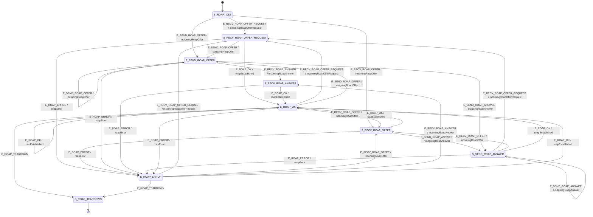
```mermaid
stateDiagram-v2
    [*] --> S_ROAP_IDLE

    S_ROAP_IDLE --> S_RECV_ROAP_OFFER_REQUEST: E_RECV_ROAP_OFFER_REQUEST / incomingRoapOfferRequest
    S_ROAP_IDLE --> S_RECV_ROAP_OFFER: E_RECV_ROAP_OFFER / incomingRoapOffer
    S_ROAP_IDLE --> S_SEND_ROAP_OFFER: E_SEND_ROAP_OFFER / outgoingRoapOffer

    S_RECV_ROAP_OFFER_REQUEST --> S_SEND_ROAP_OFFER: E_SEND_ROAP_OFFER / outgoingRoapOffer
    S_RECV_ROAP_OFFER_REQUEST --> S_ROAP_OK: E_ROAP_OK / roapEstablished
    S_RECV_ROAP_OFFER_REQUEST --> S_ROAP_ERROR: E_ROAP_ERROR / roapError

    S_RECV_ROAP_OFFER --> S_SEND_ROAP_ANSWER: E_SEND_ROAP_ANSWER / outgoingRoapAnswer
    S_RECV_ROAP_OFFER --> S_ROAP_OK: E_ROAP_OK / roapEstablished
    S_RECV_ROAP_OFFER --> S_ROAP_ERROR: E_ROAP_ERROR / roapError

    S_SEND_ROAP_OFFER --> S_RECV_ROAP_ANSWER: E_RECV_ROAP_ANSWER / incomingRoapAnswer
    S_SEND_ROAP_OFFER --> S_SEND_ROAP_ANSWER: E_SEND_ROAP_ANSWER / outgoingRoapAnswer
    S_SEND_ROAP_OFFER --> S_SEND_ROAP_OFFER: E_SEND_ROAP_OFFER / outgoingRoapOffer
    S_SEND_ROAP_OFFER --> S_ROAP_ERROR: E_ROAP_ERROR / roapError

    S_RECV_ROAP_ANSWER --> S_ROAP_OK: E_ROAP_OK / roapEstablished
    S_RECV_ROAP_ANSWER --> S_ROAP_ERROR: E_ROAP_ERROR / roapError

    S_SEND_ROAP_ANSWER --> S_RECV_ROAP_OFFER_REQUEST: E_RECV_ROAP_OFFER_REQUEST / incomingRoapOfferRequest
    S_SEND_ROAP_ANSWER --> S_RECV_ROAP_OFFER: E_RECV_ROAP_OFFER / incomingRoapOffer
    S_SEND_ROAP_ANSWER --> S_ROAP_OK: E_ROAP_OK / roapEstablished
    S_SEND_ROAP_ANSWER --> S_SEND_ROAP_ANSWER: E_SEND_ROAP_ANSWER / outgoingRoapAnswer
    S_SEND_ROAP_ANSWER --> S_ROAP_ERROR: E_ROAP_ERROR / roapError

    S_ROAP_OK --> S_RECV_ROAP_OFFER_REQUEST: E_RECV_ROAP_OFFER_REQUEST / incomingRoapOfferRequest
    S_ROAP_OK --> S_RECV_ROAP_OFFER: E_RECV_ROAP_OFFER / incomingRoapOffer
    S_ROAP_OK --> S_ROAP_OK: E_ROAP_OK / roapEstablished
    S_ROAP_OK --> S_SEND_ROAP_OFFER: E_SEND_ROAP_OFFER / outgoingRoapOffer
    S_ROAP_OK --> S_ROAP_ERROR: E_ROAP_ERROR / roapError
    S_ROAP_OK --> S_ROAP_TEARDOWN: E_ROAP_TEARDOWN

    S_ROAP_ERROR --> S_ROAP_TEARDOWN: E_ROAP_TEARDOWN
    S_ROAP_ERROR --> S_RECV_ROAP_OFFER_REQUEST: E_RECV_ROAP_OFFER_REQUEST / incomingRoapOfferRequest
    S_ROAP_ERROR --> S_RECV_ROAP_OFFER: E_RECV_ROAP_OFFER / incomingRoapOffer
    S_ROAP_ERROR --> S_RECV_ROAP_ANSWER: E_RECV_ROAP_ANSWER / incomingRoapAnswer
    S_ROAP_ERROR --> S_ROAP_OK: E_ROAP_OK / roapEstablished

    S_ROAP_TEARDOWN --> [*]
```

### State Machine Event Types

```typescript
// From ../../Events/types

type CallEvent =
  | {type: 'E_RECV_CALL_SETUP'; data?: unknown}
  | {type: 'E_RECV_CALL_PROGRESS'; data?: unknown}
  | {type: 'E_RECV_CALL_CONNECT'; data?: unknown}
  | {type: 'E_RECV_CALL_DISCONNECT'; data?: unknown}
  | {type: 'E_SEND_CALL_SETUP'; data?: unknown}
  | {type: 'E_SEND_CALL_ALERTING'; data?: unknown}
  | {type: 'E_SEND_CALL_CONNECT'; data?: unknown}
  | {type: 'E_SEND_CALL_DISCONNECT'; data?: unknown}
  | {type: 'E_CALL_ESTABLISHED'; data?: unknown}
  | {type: 'E_CALL_INFO'; data?: unknown}
  | {type: 'E_UNKNOWN'; data?: unknown}
  | {type: 'E_CALL_CLEARED'; data?: unknown}
  | {type: 'E_CALL_HOLD'; data?: unknown}
  | {type: 'E_CALL_RESUME'; data?: unknown};

type RoapEvent =
  | {type: 'E_SEND_ROAP_OFFER'; data?: unknown}
  | {type: 'E_SEND_ROAP_ANSWER'; data?: unknown}
  | {type: 'E_RECV_ROAP_OFFER'; data?: unknown}
  | {type: 'E_RECV_ROAP_ANSWER'; data?: unknown}
  | {type: 'E_ROAP_ERROR'; data?: unknown}
  | {type: 'E_ROAP_OK'; data?: unknown}
  | {type: 'E_RECV_ROAP_OFFER_REQUEST'; data?: unknown}
  | {type: 'E_ROAP_TEARDOWN'; data?: unknown};
```

## Protocol / Wire Format

### ROAP Action Handlers

| Method | Signature | Description |
|--------|-----------|-------------|
| `handleOutgoingRoapOffer` | `private async handleOutgoingRoapOffer(context: MediaContext, event: RoapEvent): void` | Calls `mediaConnection.initiateOffer()` or sends ROAP offer via `postMedia()` |
| `handleOutgoingRoapAnswer` | `private async handleOutgoingRoapAnswer(context: MediaContext, event: RoapEvent): void` | Sends SDP answer via `postMedia()` |
| `handleIncomingRoapOffer` | `private handleIncomingRoapOffer(context: MediaContext, event: RoapEvent): void` | Buffers or forwards OFFER to `mediaConnection.roapMessageReceived()` |
| `handleIncomingRoapAnswer` | `private handleIncomingRoapAnswer(context: MediaContext, event: RoapEvent): void` | Forwards ANSWER to `mediaConnection.roapMessageReceived()` |
| `handleIncomingRoapOfferRequest` | `private handleIncomingRoapOfferRequest(context: MediaContext, event: RoapEvent): void` | Buffers or forwards offer request to media connection |
| `handleRoapEstablished` | `private async handleRoapEstablished(context: MediaContext, event: RoapEvent): void` | Sends ROAP OK, sets `mediaNegotiationCompleted`, triggers `E_CALL_ESTABLISHED` |
| `handleRoapError` | `private async handleRoapError(context: MediaContext, event: RoapEvent): void` | POSTs error to `/media`, disconnects if not connected |

### Media ROAP State Machine (XState) / ROAP Action Handlers

| Action Name | Handler Method | Description |
|------------|---------------|-------------|
| `outgoingRoapOffer` | `handleOutgoingRoapOffer()` | Generate and send SDP offer via `postMedia()` |
| `outgoingRoapAnswer` | `handleOutgoingRoapAnswer()` | Generate and send SDP answer via `postMedia()` |
| `incomingRoapOffer` | `handleIncomingRoapOffer()` | Process received SDP offer, forward to `mediaConnection.roapMessageReceived()` |
| `incomingRoapAnswer` | `handleIncomingRoapAnswer()` | Process received SDP answer, forward to `mediaConnection.roapMessageReceived()` |
| `incomingRoapOfferRequest` | `handleIncomingRoapOfferRequest()` | Handle request from server to generate a new offer |
| `roapEstablished` | `handleRoapEstablished()` | Media negotiation complete, send ROAP OK to server, set `mediaNegotiationCompleted`, transition call state to `E_CALL_ESTABLISHED` |
| `roapError` | `handleRoapError()` | Media error, emit `CALL_ERROR`, disconnect call |

### Direction 2: MediaConnection -> Call -> Mobius (outgoing ROAP publish)

When the media engine emits `ROAP_MESSAGE_TO_SEND`, `Call` converts that into state-machine events and publishes ROAP to Mobius via `postMedia()`.

1. `mediaConnection` emits `ROAP_MESSAGE_TO_SEND` (`OFFER`/`ANSWER`/`OK`).
2. `Call.mediaRoapEventsListener()` stores the local ROAP message and sends the corresponding event (`E_SEND_ROAP_OFFER`, `E_SEND_ROAP_ANSWER`, `E_ROAP_OK`).
3. Outgoing action handlers invoke `postMedia()`.
4. `postMedia()` applies `modifySdpForIPv4()` before sending SDP-bearing payloads.

### API Endpoints (Call-Specific)

All endpoints relative to `{mobiusUrl}` (which is `{mobiusHost}/api/v1/calling/web/`).

| Method | Endpoint | Handler | Description |
|--------|----------|---------|-------------|
| `POST` | `/devices/{deviceId}/call` | `post()` | Initiate outgoing call with ROAP offer |
| `PATCH` | `/devices/{deviceId}/calls/{callId}` | `patch()` | Update call state (alerting, connected) |
| `DELETE` | `/devices/{deviceId}/calls/{callId}` | `delete()` | Disconnect call with final stats |
| `POST` | `/devices/{deviceId}/calls/{callId}/media` | `postMedia()` | Send ROAP message (offer, answer, OK) |
| `POST` | `/devices/{deviceId}/calls/{callId}/status` | `postStatus()` | Call keepalive status check |
| `POST` | `/services/callhold/hold` | `postSSRequest()` | Place call on hold |
| `POST` | `/services/callhold/resume` | `postSSRequest()` | Resume call from hold |
| `POST` | `/services/calltransfer/commit` | `postSSRequest()` | Complete blind or consult transfer |

### Request Body

**POST call (outgoing setup):**
```json
{
  "device": { "deviceId": "...", "correlationId": "..." },
  "localMedia": {
    "roap": { "seq": 1, "messageType": "OFFER", "sdp": "..." },
    "mediaId": "uuid"
  },
  "callee": { "type": "uri|tel", "address": "..." }
}
```

**PATCH call (state update):**
```json
{
  "device": { "deviceId": "...", "correlationId": "..." },
  "callId": "...",
  "callState": "sig_alerting|sig_connected",
  "inbandMedia": false
}
```

**POST media (ROAP):**
```json
{
  "device": { "deviceId": "...", "correlationId": "..." },
  "callId": "...",
  "localMedia": {
    "roap": { "seq": 2, "messageType": "ANSWER", "sdp": "..." },
    "mediaId": "uuid"
  }
}
```

**POST supplementary service (hold/resume):**
```json
{
  "device": { "deviceId": "...", "correlationId": "..." },
  "callId": "..."
}
```

**POST transfer (blind):**
```json
{
  "device": { "deviceId": "...", "correlationId": "..." },
  "callId": "...",
  "blindTransferContext": {
    "transferorCallId": "...",
    "destination": "5998"
  },
  "transferType": "BLIND"
}
```

**POST transfer (consult):**
```json
{
  "device": { "deviceId": "...", "correlationId": "..." },
  "callId": "...",
  "consultTransferContext": {
    "transferorCallId": "...",
    "transferToCallId": "..."
  },
  "transferType": "CONSULT"
}
```

## Error Handling & Failure Modes

### 6. Typed Events, Errors, and Metrics

- Emits strongly typed lifecycle and error events through shared event enums/type maps.
- Uses call-scoped typed errors (`CallError`) with correlation and layer context.
- Submits call and media metrics for both success and failure paths.

### Outgoing Call Setup Failure

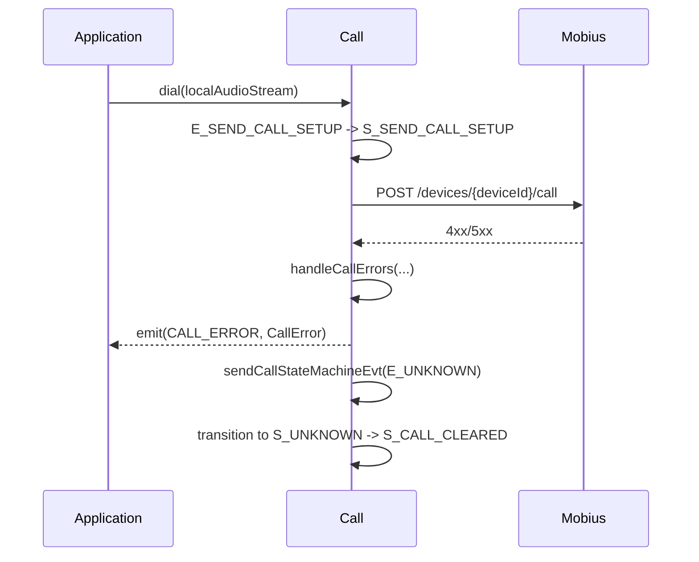
```mermaid
sequenceDiagram
    participant App as Application
    participant Call as Call
    participant Mobius as Mobius

    App->>Call: dial(localAudioStream)
    Call->>Call: E_SEND_CALL_SETUP -> S_SEND_CALL_SETUP
    Call->>Mobius: POST /devices/{deviceId}/call
    Mobius-->>Call: 4xx/5xx
    Call->>Call: handleCallErrors(...)
    Call-->>App: emit(CALL_ERROR, CallError)
    Call->>Call: sendCallStateMachineEvt(E_UNKNOWN)
    Call->>Call: transition to S_UNKNOWN -> S_CALL_CLEARED
```

### Hold/Resume Failure (Error + Timeout)

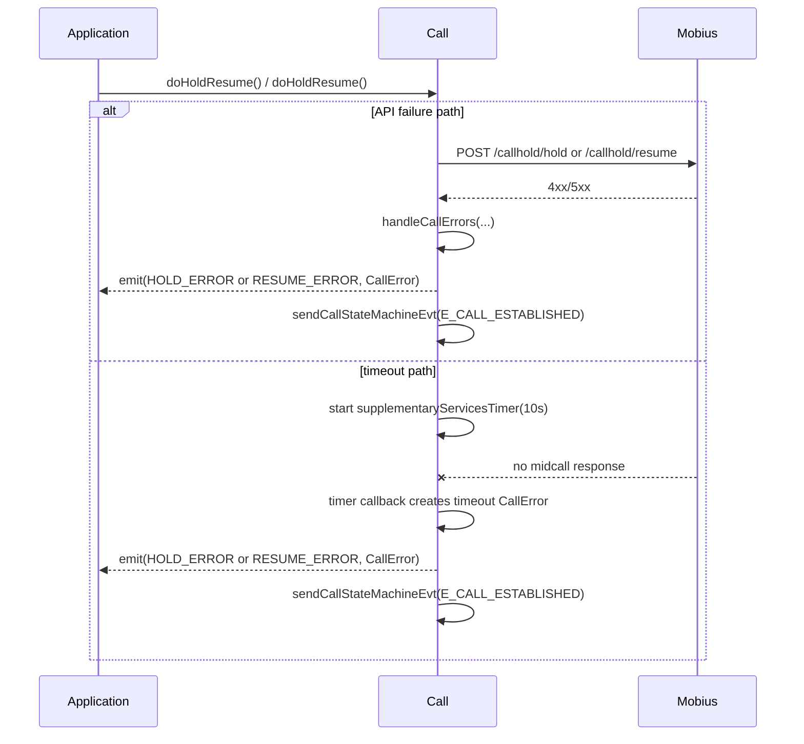
```mermaid
sequenceDiagram
    participant App as Application
    participant Call as Call
    participant Mobius as Mobius

    App->>Call: doHoldResume() / doHoldResume()
    alt API failure path
        Call->>Mobius: POST /callhold/hold or /callhold/resume
        Mobius-->>Call: 4xx/5xx
        Call->>Call: handleCallErrors(...)
        Call-->>App: emit(HOLD_ERROR or RESUME_ERROR, CallError)
        Call->>Call: sendCallStateMachineEvt(E_CALL_ESTABLISHED)
    else timeout path
        Call->>Call: start supplementaryServicesTimer(10s)
        Mobius--x Call: no midcall response
        Call->>Call: timer callback creates timeout CallError
        Call-->>App: emit(HOLD_ERROR or RESUME_ERROR, CallError)
        Call->>Call: sendCallStateMachineEvt(E_CALL_ESTABLISHED)
    end
```

### Error Handling

All call errors use the `CallError` class with `ERROR_LAYER` distinguishing call control vs media errors.

### Error Enums

```typescript
// From ../../Errors/types

enum ERROR_LAYER {
  CALL_CONTROL = 'call_control',
  MEDIA = 'media',
}

enum ERROR_TYPE {
  CALL_ERROR = 'call_error',
  DEFAULT = 'default_error',
  BAD_REQUEST = 'bad_request',
  FORBIDDEN_ERROR = 'forbidden',
  NOT_FOUND = 'not_found',
  REGISTRATION_ERROR = 'registration_error',
  SERVICE_UNAVAILABLE = 'service_unavailable',
  TIMEOUT = 'timeout',
  TOKEN_ERROR = 'token_error',
  TOO_MANY_REQUESTS = 'too_many_requests',
  SERVER_ERROR = 'server_error',
}

enum ERROR_CODE {
  UNAUTHORIZED = 401,
  FORBIDDEN = 403,
  DEVICE_NOT_FOUND = 404,
  INTERNAL_SERVER_ERROR = 500,
  NOT_IMPLEMENTED = 501,
  SERVICE_UNAVAILABLE = 503,
  BAD_REQUEST = 400,
  REQUEST_TIMEOUT = 408,
  TOO_MANY_REQUESTS = 429,
}

enum CALL_ERROR_CODE {
  INVALID_STATUS_UPDATE = 111,
  DEVICE_NOT_REGISTERED = 112,
  CALL_NOT_FOUND = 113,
  ERROR_PROCESSING = 114,
  USER_BUSY = 115,
  PARSING_ERROR = 116,
  TIMEOUT_ERROR = 117,
  NOT_ACCEPTABLE = 118,
  CALL_REJECTED = 119,
  NOT_AVAILABLE = 120,
}
```

### CallError Class

```typescript
// From ../../Errors/catalog/CallError.ts

class CallError extends ExtendedError {
  private correlationId: CorrelationId;
  private errorLayer: ERROR_LAYER;

  constructor(
    msg: ErrorMessage,
    context: ErrorContext,
    type: ERROR_TYPE,
    correlationId: CorrelationId,
    errorLayer: ERROR_LAYER
  );

  public setCallError(error: CallErrorObject): void;
  public getCallError(): CallErrorObject;
}

// Factory function
const createCallError = (
  msg: ErrorMessage,
  context: ErrorContext,
  type: ERROR_TYPE,
  correlationId: CorrelationId,
  errorLayer: ERROR_LAYER
) => new CallError(msg, context, type, correlationId, errorLayer);
```

### handleCallErrors Utility

This is a standalone function from `../../common/Utils.ts` (not a method on `Call`). It processes HTTP error responses from Mobius and maps them to `CallError` instances.

```typescript
// From ../../common/Utils

async function handleCallErrors(
  emitterCb: CallErrorEmitterCallBack,
  errorLayer: ERROR_LAYER,
  retryCb: RetryCallBack,
  correlationId: CorrelationId,
  err: WebexRequestPayload,
  caller: string,       // METHODS constant identifying which function made the request
  file: string          // File name for logging context
): Promise<boolean>     // Returns true if the caller should abort further operations
```

Behavior:
- Handles HTTP status codes: 401, 403, 404, 500, 503, 429
- Extracts service error codes from the response body and maps `CALL_ERROR_CODE` values to user-facing messages
- Supports `retry-after` header for rate limiting (429 and 503)
- Special handling for keepalive calls: returns `abort: true` for 401, 403, 404 during keepalive

### Error Emission Pattern

```typescript
handleCallErrors(
  (error: CallError) => {
    this.emit(CALL_EVENT_KEYS.CALL_ERROR, error);
    this.submitCallErrorMetric(error);
    this.sendCallStateMachineEvt({type: 'E_UNKNOWN', data: errData});
  },
  ERROR_LAYER.CALL_CONTROL,
  retryCallback,
  this.getCorrelationId(),
  errData,
  methodName,
  fileName
);
```

### Error Scenarios

| Scenario | Error Event | Recovery |
|----------|------------|---------|
| Call setup POST fails | `CALL_ERROR` | Transition to `S_UNKNOWN`, upload logs |
| Call alerting PATCH fails | `CALL_ERROR` | Transition to `S_UNKNOWN`, upload logs |
| Hold POST fails | `HOLD_ERROR` | Transition back to `S_CALL_ESTABLISHED`, upload logs |
| Resume POST fails | `RESUME_ERROR` | Transition back to `S_CALL_ESTABLISHED`, upload logs |
| Hold/Resume timeout (10s) | `HOLD_ERROR` / `RESUME_ERROR` | Timer fires, emit timeout error |
| Transfer fails | `TRANSFER_ERROR` | Upload logs |
| ROAP error | `CALL_ERROR` (MEDIA layer) | Disconnect call |
| State timeout | `CALL_ERROR` | Transition to `S_CALL_CLEARED`, upload logs |
| No local audio track | `DISCONNECT` | Immediate disconnect or delete from collection |
| Call keepalive fails | `E_SEND_CALL_DISCONNECT` | Disconnect call (max 4 retries) |

## Pitfalls

- Do not bypass the module boundary or duplicate constants owned under `src/CallingClient/calling/`.
- Do not assume remote events are ordered or that network operations cannot fail.
- Update `src/CallingClient/calling/ai-docs/calling-spec.md` with behavior changes in the same merge.

## Module Do's / Don'ts

- DO use the factories, typed events, constants, and adapters already owned by `src/CallingClient/calling/`.
- DON'T add direct network or SDK access when the module already provides an adapter.

## Key Design Trade-off

Separate signaling and media state machines prevent transport events from directly mutating WebRTC state, but require explicit coordination of ROAP and call-control events. Evidence: `src/CallingClient/calling/call.ts`, `src/CallingClient/calling/callStateMachine.ts`, `src/CallingClient/calling/mediaStateMachine.ts`.

## Test-Case Strategy (module)

Unit tests are co-located under `src/CallingClient/calling/` and exercise positive, negative, error, retry, and cleanup behavior as applicable. Package journeys under `playwright/` cover cross-module flows.

| Behavior / Requirement | Existing test evidence | Gap |
|---|---|---|
| CALLING-R-001 | `src/CallingClient/calling/CallerId/index.test.ts` | Re-check negative/error edge coverage during independent validation |
| CALLING-R-002 | `src/CallingClient/calling/CallerId/index.test.ts` | Re-check negative/error edge coverage during independent validation |
| CALLING-R-003 | `src/CallingClient/calling/CallerId/index.test.ts` | Re-check negative/error edge coverage during independent validation |

## Traceability

- Repo architecture: [`ARCHITECTURE.md`](../../../../ai-docs/ARCHITECTURE.md) · Registry: [`SPEC_INDEX.md`](../../../../ai-docs/SPEC_INDEX.md)
- Contracts catalog: [`CONTRACTS.md`](../../../../ai-docs/CONTRACTS.md) · Manifest: `../../../../.sdd/manifest.json`
- Source material retained at `src/CallingClient/calling/ai-docs/AGENTS.md`; canonical behavior is this spec plus current code/tests.
- Source material retained at `src/CallingClient/calling/ai-docs/ARCHITECTURE.md`; canonical behavior is this spec plus current code/tests.
