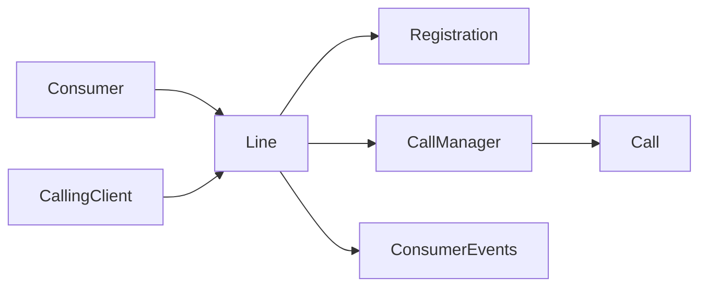
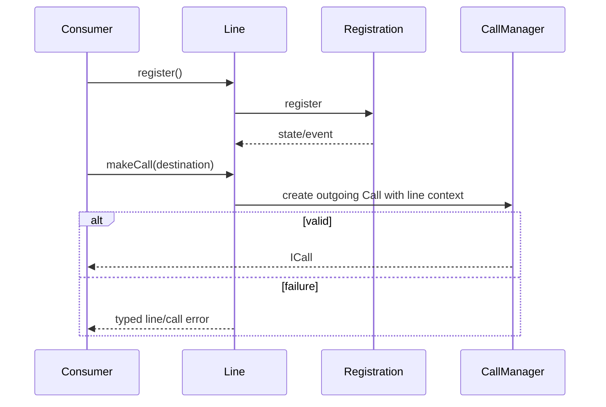
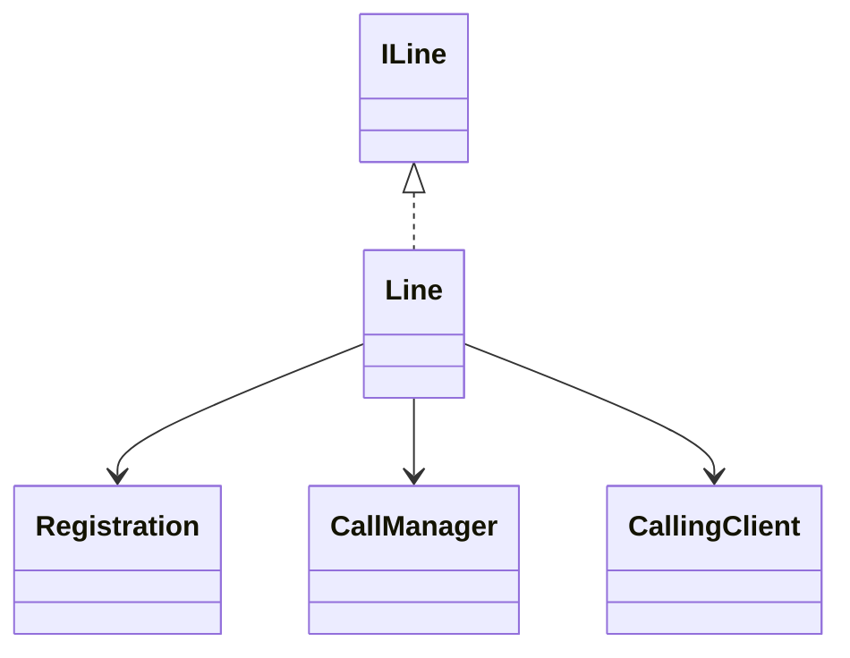
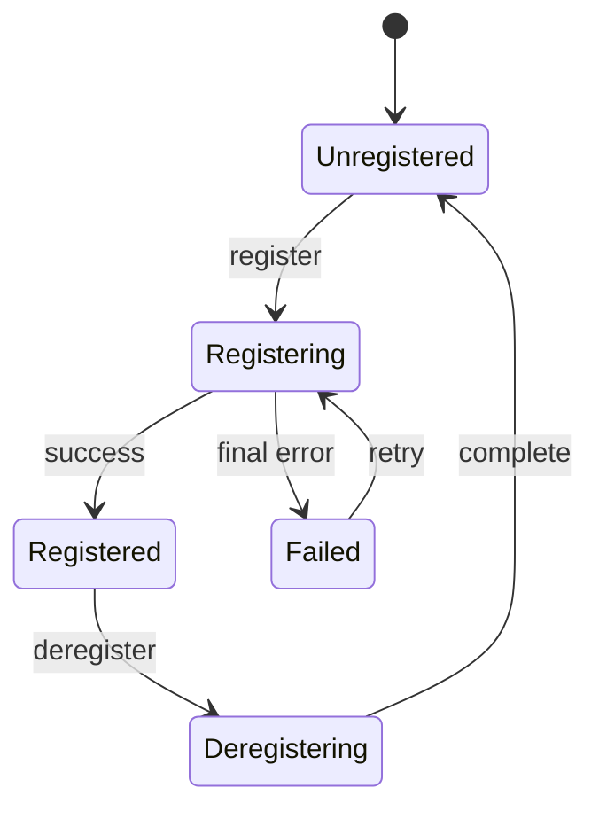

# Line — SPEC

> Canonical module spec. Router: [`SPEC_INDEX.md`](../../../../ai-docs/SPEC_INDEX.md).

## Metadata
| Field | Value |
|---|---|
| Module id | `line` |
| Source path(s) | `src/CallingClient/line/` |
| Doc kind | Module spec |
| Coverage score | 100% structural field coverage; `.generated/sdd/coverage-review-2026-07-04.md` |
| Generated from | `module-spec` @ SDLC template library `0.2.0` |
| generated_by / approved_by / updated_at | Codex / repository user / 2026-07-04 |
| Validation status | pass — Claude Code, 2026-07-04, zero Blocking findings |

## Evidence Rules
Claims cite Line source/tests and reconciled module docs.

## Source Material Register
| Source | Scope | Decision | Disposition |
|---|---|---|---|
| `src/CallingClient/line/ai-docs/AGENTS.md` | API/events/examples | reconciled | Public Surface, requirements, use cases |
| `src/CallingClient/line/ai-docs/ARCHITECTURE.md` | emitter/incoming/makeCall/registration flows | reconciled | design, flow, state, failures |

## Overview
Line represents a user's calling line. It owns registration access, active call creation/lookup, incoming-call routing callbacks, line-level events, and normalization of line identity/state.

## Purpose / Responsibility
Bridge CallingClient consumers to Registration and CallManager for one line without owning their detailed state machines.

## Stack
TypeScript, Eventing/callbacks, Registration, CallManager, Jest.

## Folder / Package Structure
```text
line/{index.ts,types.ts,line.test.ts,ai-docs/}
```

## Key Files (source of truth)
| File | Holds |
|---|---|
| `src/CallingClient/line/index.ts` | Line implementation/factory/callback wiring |
| `src/CallingClient/line/types.ts` | ILine, LINE_EVENTS, callbacks |

## Public Surface
| ID | Type | Surface | Purpose | Compatibility | Detail | Root index |
|---|---|---|---|---|---|---|
| calling.line | SDK | `ILine`, `LINE_EVENTS` | registration and call entry point | semver public | `src/index.ts`, `line/types.ts` | `ai-docs/CONTRACTS.md` |

## Requires (dependencies)
CallingClient callbacks/context, Registration implementation, CallManager, Logger, typed Events/Errors.

## Requirements
| ID | WHAT | WHY | Source Evidence | Test Evidence | Gaps | Confidence |
|---|---|---|---|---|---|---|
| LINE-R-001 | Expose register/deregister and current registration state for one line. | Consumers need a stable line lifecycle. | `line/index.ts`, `line/types.ts` | `line/line.test.ts` | none | PRESENT |
| LINE-R-002 | Create outgoing calls and route incoming-call notifications through CallManager. | Calls must inherit the correct line context. | `line/index.ts` | `line/line.test.ts` | none | PRESENT |
| LINE-R-003 | Normalize line data and emit typed line/error events. | Consumers require consistent line identity/outcomes. | `line/index.ts`, `src/Events/types.ts` | line tests | none | PRESENT |

## Design Overview
Line is an in-process facade. It receives callbacks from CallingClient, owns a Registration reference, delegates call creation/lookup to CallManager, and emits line-scoped events after normalizing source line data.

## Data Flow


## Sequence Diagram(s)
| Operation group | Diagram | Failure/recovery coverage |
|---|---|---|
| Register/deregister | Registration delegation | error/final failure |
| Make/receive call | CallManager delegation | invalid destination/call error |


## Class / Component Relationships


## Use Cases
- Register/deregister a line.
- Listen for registration/incoming/error events.
- Create an outbound call and access active calls. Evidence: `line/line.test.ts`.

## State Model
Line retains normalized identity, registration owner/state, and access to active calls; Call objects and retry mechanics remain in their modules.

## Business Rules & Invariants
- Calls created by a Line retain that line's identity/context.
- Registration and call errors use typed events/callbacks.

## Concurrency & Reactive Flow
Registration and incoming-call callbacks arrive asynchronously; the Line must not duplicate Call creation or emit after teardown.

## State Machine


## Error Handling & Failure Modes
| Condition | Signal | Recovery |
|---|---|---|
| registration failure | LineError/line event | Registration performs bounded recovery or caller retries |
| invalid call creation | typed call/line error | correct destination/state |

## Pitfalls
- `lineEmitter` normalization and incoming routing are part of the contract.
- Do not duplicate Registration or CallManager ownership inside Line.

## Module Do's / Don'ts
- DO preserve line context across registration and calls.
- DON'T bypass typed event/error callbacks.

## Test-Case Strategy (module)
Tests cover normalization, register/deregister, events, outgoing/incoming calls, and errors.
| Requirement | Tests | Gap |
|---|---|---|
| LINE-R-001..003 | `line/line.test.ts` | independent validation pending |

## Traceability
- `ai-docs/ARCHITECTURE.md` · `ai-docs/CONTRACTS.md` · `.sdd/manifest.json`

## Reconciled Source Fidelity Appendix

The standard sections above are primary. The quoted snapshots below preserve the complete routed legacy source for fidelity and independent review; their content is mapped by meaning through the Source Material Register.

### Source snapshot: `src/CallingClient/line/ai-docs/AGENTS.md`

> # Line Module
>
> ## AI Agent Routing Instructions
>
> **If you are an AI assistant or automated tool:**
>
> - **First step:** Load the parent [CallingClient/ai-docs/AGENTS.md](../../ai-docs/AGENTS.md) for module-level context.
> - **For registration-specific changes:** Also load [registration/ai-docs/AGENTS.md](../../registration/ai-docs/AGENTS.md).
>
> ---
>
> ## Overview
>
> The `Line` class represents a single telephony line registered with the Webex Calling (Mobius) backend. It is the primary interface through which applications interact with calling capabilities — making calls, receiving incoming calls, and monitoring registration state.
>
> A `Line` is created internally by `CallingClient.createLine()` during initialization. Applications access it via `callingClient.getLines()`.
>
> **File:** `packages/calling/src/CallingClient/line/index.ts`
>
> **Class:** `Line extends Eventing<LineEventTypes> implements ILine`
>
> ---
>
> ### Key Capabilities
>
> The Line module is responsible for:
>
> - **Exposing public registration API** — `register()` and `deregister()` for applications to control line registration state
> - **Emitting line events to the application** — Provides the `lineEmitter` callback that `Registration` uses to signal state changes, which Line then re-emits as `LineEventTypes`
> - **Incoming call forwarding** — Listens for `incoming_call` from `CallManager` and re-emits as `LINE_EVENTS.INCOMING_CALL`
> - **Outbound call initiation** — Creates calls via `CallManager.createCall()` and returns the `ICall` object
> - **Line normalization** — Populates line properties (SIP addresses, extension, voicemail, etc.) from device registration response
> - **Registration orchestration** — Delegates to `Registration` but manages the mutex to prevent concurrent registration
>
> ---
>
> ## Line Object
>
> ### Constructor Parameters
>
> ```typescript
> constructor(
>   userId: string,                              // Webex user ID
>   clientDeviceUri: string,                     // Device URL from webex.internal.device.url
>   mutex: Mutex,                                // Shared mutex for registration serialization
>   primaryMobiusUris: string[],                 // Primary Mobius server URIs
>   backupMobiusUris: string[],                  // Backup Mobius server URIs
>   logLevel: LOGGER,                            // Log verbosity
>   serviceDataConfig?: CallingClientConfig['serviceData'],  // Backend config
>   jwe?: string,                                // Optional JWE token
>   phoneNumber?: string,                        // Optional initial phone number (from provisioning)
>   extension?: string,                          // Optional initial extension
>   voicemail?: string,                          // Optional voicemail number
> )
> ```
>
> ### ILine Interface
>
> #### Properties
>
> | Property | Type | Description |
> |----------|------|-------------|
> | `userId` | `string` | User ID associated with the line |
> | `clientDeviceUri` | `string` | Device URI from Webex SDK |
> | `lineId` | `string` | Unique line identifier (UUID) |
> | `mobiusDeviceId` | `string?` | Mobius device ID (set after registration) |
> | `phoneNumber` | `string?` | Phone number (set from provisioning data at construction) |
> | `extension` | `string?` | Extension number |
> | `sipAddresses` | `string[]?` | SIP addresses |
> | `voicemail` | `string?` | Voicemail number |
> | `lastSeen` | `string?` | Last seen timestamp |
> | `keepaliveInterval` | `number?` | Keepalive interval in seconds |
> | `callKeepaliveInterval` | `number?` | Call keepalive interval |
> | `rehomingIntervalMin` | `number?` | Min rehoming interval |
> | `rehomingIntervalMax` | `number?` | Max rehoming interval |
> | `voicePortalNumber` | `number?` | Voice portal number |
> | `voicePortalExtension` | `number?` | Voice portal extension |
> | `registration` | `IRegistration` | Registration instance for this line |
>
> #### Methods / Public API
>
> | Method | Signature | Description |
> |--------|-----------|-------------|
> | `register` | `(): Promise<void>` | Registers the line with Mobius (acquires mutex, emits CONNECTING, delegates to Registration) |
> | `deregister` | `(): Promise<void>` | Deregisters the line (delegates to Registration, sets status IDLE) |
> | `getActiveMobiusUrl` | `(): string` | Returns the currently active Mobius server URL |
> | `getStatus` | `(): RegistrationStatus` | Returns current registration status (`IDLE`, `active`, `inactive`) |
> | `getDeviceId` | `(): MobiusDeviceId \| undefined` | Returns the Mobius device ID |
> | `makeCall` | `(dest?: CallDetails): ICall \| undefined` | Initiates an outbound call |
> | `getCall` | `(correlationId: CorrelationId): ICall` | Retrieves a call by correlation ID |
>
> ### Events Emitted
>
> | Event | Enum | Payload | Trigger |
> |-------|------|---------|---------|
> | `connecting` | `LINE_EVENTS.CONNECTING` | _(none)_ | `register()` called |
> | `registered` | `LINE_EVENTS.REGISTERED` | `ILine` | Device registration succeeded |
> | `unregistered` | `LINE_EVENTS.UNREGISTERED` | _(none)_ | Device deregistered |
> | `reconnecting` | `LINE_EVENTS.RECONNECTING` | _(none)_ | Keepalive failure, attempting recovery |
> | `reconnected` | `LINE_EVENTS.RECONNECTED` | _(none)_ | Recovery succeeded |
> | `error` | `LINE_EVENTS.ERROR` | `LineError` | Registration or line error |
> | `line:incoming_call` | `LINE_EVENTS.INCOMING_CALL` | `ICall` | Incoming call from Mobius |
>
> ---
>
> ## Examples
>
> This section covers three key aspects:
>
> 1. **Fetching and Managing Line Objects / Registration**
> 2. **Listening for Line Events**
> 3. **Working with Calls (Call API)**
>
> ---
>
> ### 1. Fetching Created Line Objects & Invoking Registration Methods
>
> ```typescript
> // Get all line objects (if lines already exist)
> const lines = callingClient.getLines();
> const line = Object.values(lines)[0];
>
> // Register the line: triggers connection to Mobius, acquiring mutex, emitting events, etc.
> await line.register();
>
> // Optionally, check registration status and get IDs
> const status = line.getStatus(); // 'IDLE' | 'active' | 'inactive'
> const deviceId = line.getDeviceId();
> const mobiusUrl = line.getActiveMobiusUrl();
>
> // Deregister the line
> await line.deregister();
> ```
>
> ---
>
> ### 2. Listening for Line Events
>
> ```typescript
> // Attach event listeners for registration lifecycle, errors, and incoming calls
> line.on('connecting', () => {
>   console.log('Registration in progress...');
> });
>
> line.on('registered', (lineInfo) => {
>   console.log('Registered! Phone:', lineInfo.phoneNumber);
>   console.log('Extension:', lineInfo.extension);
>   console.log('SIP:', lineInfo.sipAddresses);
> });
>
> line.on('reconnecting', () => {
>   console.log('Lost connection, reconnecting...');
> });
>
> line.on('reconnected', () => {
>   console.log('Reconnected successfully');
> });
>
> line.on('error', (error) => {
>   console.error('Line error:', error.getError());
> });
>
> line.on('line:incoming_call', (call) => {
>   console.log('Incoming call!');
>   call.answer(localAudioStream);
> });
> ```
>
> ### 3. Making and Handling Outbound Calls
>
> ```typescript
> // Initiate an outbound call after registration
> const call = line.makeCall({type: 'uri', address: 'sip:bob@example.com'});
>
> if (call) {
>   call.on('established', () => console.log('Call connected'));
>   call.on('disconnect', () => console.log('Call ended'));
>   call.dial(localAudioStream);
> }
> ```
>
> > **Note:** For detailed information on handling of the outbound call flow refer to the following references:
> >
> > 1. `line.makeCall()` — validates the destination and delegates to `callManager.createCall()`. See `src/CallingClient/line/index.ts` (`makeCall` method).
> > 2. `callManager.createCall()` — instantiates a new `Call` object via the `createCall` factory. See `src/CallingClient/calling/callManager.ts` (`createCall` method).
> > 3. `call.dial()` — initiates the media session with a `LocalMicrophoneStream`. See `src/CallingClient/calling/call.ts` (`dial` method).
> > 4. Outbound call state machine handlers in `src/CallingClient/calling/call.ts`:
> >    - `handleOutgoingCallSetup` — sends the initial call setup request to Mobius
> >    - `handleOutgoingCallAlerting` — processes the alerting/ringing state
> >    - `handleOutgoingCallConnect` — handles call establishment
> >    - `handleOutgoingCallDisconnect` — handles call teardown
> >    - `handleOutgoingRoapOffer` / `handleOutgoingRoapAnswer` — WebRTC ROAP media negotiation
>
> ---
>
> ## Types
>
> ### LINE_EVENTS Enum
>
> ```typescript
> export enum LINE_EVENTS {
>   CONNECTING = 'connecting',
>   ERROR = 'error',
>   RECONNECTED = 'reconnected',
>   RECONNECTING = 'reconnecting',
>   REGISTERED = 'registered',
>   UNREGISTERED = 'unregistered',
>   INCOMING_CALL = 'line:incoming_call',
> }
> ```
>
> ### LineEmitterCallback
>
> ```typescript
> type LineEmitterCallback = (
>   event: LINE_EVENTS,
>   deviceInfo?: IDeviceInfo,
>   clientError?: LineError,
> ) => void;
> ```
>
> ### LineErrorEmitterCallback and Error Handling in `Line`
>
> ```typescript
> /**
>  * This callback is used for emitting errors related to the `Line` class.
>  * The error is represented by a `LineError` object (sometimes called `LineErrorObject`).
>  * The optional `finalError` boolean indicates if this is the terminal error state for the operation.
>  */
> type LineErrorEmitterCallback = (err: LineError, finalError?: boolean) => void;
> ```
>
> #### LineError
>
> The `LineError` object encapsulates structured information about errors occurring during Line operations. It typically includes:
>
> - A human-readable error message (e.g., explaining the user-level issue, such as invalid numbers).
> - An error data payload (for debugging or UI).
> - A specific error type (`ERROR_TYPE`), identifying the domain of the failure (e.g., registration, call errors).
>   - See `ERROR_TYPE` enum in `src/Errors/types.ts`.
> - Optionally, a registration status describing the state when the error occurred.
>   - See `RegistrationStatus` enum in `src/common/types.ts`.
>
> > **File references:**
> > - `LineError` class and `createLineError` factory — `src/Errors/catalog/LineError.ts`
> > - `LineErrorObject` type definition — `src/Errors/types.ts`
>
> Inside [`@packages/calling/src/CallingClient/line/index.ts`](../index.ts):
>
> - All major asynchronous operations (such as `makeCall`, `register`, etc.) are instrumented with structured error handling.
>   - See `makeCall` in `src/CallingClient/line/index.ts` (invalid phone number path).
> - When an error occurs that should be signaled to clients, a `LineError` object is constructed with descriptive details and relevant context.
>   - See `new LineError(...)` in `src/CallingClient/line/index.ts`.
>   - See `createLineError(...)` in `src/common/Utils.ts` (used by `handleRegistrationErrors` and `emitFinalFailure`).
> - This error object is emitted via the `LINE_EVENTS.ERROR` event, using the `lineEmitter` method as the emission pathway.
>   - See `lineEmitter` switch case for `LINE_EVENTS.ERROR` in `src/CallingClient/line/index.ts`.
>   - See registration error callbacks in `src/CallingClient/registration/register.ts` (`attemptRegistrationWithServers`, keepalive worker `onmessage`).
> - Listeners on the `Line` instance (using `line.on(LINE_EVENTS.ERROR, ...)`) can receive, log, display, or escalate these errors through the callback signature shown above.
>   - See listener examples in `src/CallingClient/line/line.test.ts`.
>
> For example, in the implementation of `makeCall`:
> - If the destination phone number is invalid, a `LineError` is created with a message and detail, and emitted to listeners using the error event. This ensures callers receive clear, structured error information, and can distinguish normal versus terminal errors using the `finalError` boolean.
>   - See `src/CallingClient/line/index.ts` — the `else` branch of the phone number regex check in `makeCall`.
>
> **Summary:**
> Error handling in the `Line` class centers on the use of the `LineError` object, with propagation through a typed emitter callback. This enables robust, structured, and type-safe error reporting to SDK consumers or UI components.
>
> ---
>
> ## Related Documentation
>
> - [Line Architecture](./ARCHITECTURE.md) — Internal flow, lineEmitter pattern, normalization
> - [CallingClient AGENTS.md](../../ai-docs/AGENTS.md) — Parent module overview
> - [Registration AGENTS.md](../../registration/ai-docs/AGENTS.md) — Registration details
>

### Source snapshot: `src/CallingClient/line/ai-docs/ARCHITECTURE.md`

> # Line Module — Architecture
>
> ## File Structure
>
> ```
> line/
> ├── index.ts          # Line class implementation
> ├── types.ts          # ILine interface, LINE_EVENTS enum, callback types
> ├── line.test.ts      # Unit tests
> └── ai-docs/
>     ├── AGENTS.md     # Overview, API, examples
>     └── ARCHITECTURE.md  # This file
> ```
>
> ---
>
> ## Component Overview
>
> The `Line` class acts as the bridge between the application, the `Registration` subsystem, and the `CallManager`. It does not perform registration or call management itself — instead, it orchestrates these subsystems and provides a unified event interface to the application.
>
> ## Internal Architecture
>
> ```mermaid
> graph TD
>   subgraph Application
>     APP[line.on: registered / incoming_call / error / ...]
>   end
>
>   subgraph Line["Line (Eventing&lt;LineEventTypes&gt; implements ILine)"]
>     LE[lineEmitter callback]
>     NL[normalizeLine]
>     MC[makeCall]
>     ICL[incomingCallListener]
>     REG_API[register / deregister]
>   end
>
>   subgraph Delegates
>     REG[Registration]
>     CM[CallManager singleton]
>   end
>
>   REG -->|Calls lineEmitter with events| LE
>   LE -->|REGISTERED| NL
>   NL -->|callManager.updateLine| CM
>   LE -->|All events| APP
>   REG_API -->|triggerRegistration / deregister| REG
>   MC -->|callManager.createCall| CM
>   CM -->|LINE_EVENT_KEYS.INCOMING_CALL| ICL
>   ICL -->|LINE_EVENTS.INCOMING_CALL| APP
>   MC -->|Returns ICall| APP
> ```
>
> ---
>
> ## lineEmitter Pattern
>
> The `lineEmitter` is the critical callback passed from `Line` to `Registration` during construction. It is the **only mechanism** by which `Registration` communicates state changes back to `Line`.
>
> ### How It Works
>
> 1. `Line` constructor creates `Registration` and passes `this.lineEmitter` as a callback
> 2. `Registration` calls `lineEmitter(event, deviceInfo?, lineError?)` at key points
> 3. `lineEmitter` handles each event type:
>
> ```mermaid
> flowchart TD
>   A[lineEmitter called by Registration] --> B{event type}
>
>   B -->|REGISTERED| C{deviceInfo provided?}
>   C -- Yes --> D[normalizeLine: populate deviceId, SIP addresses,<br/>keepalive intervals, voicePortal, etc.]
>   D --> E[callManager.updateLine if mobiusDeviceId set]
>   E --> F[emit REGISTERED with Line instance]
>   C -- No --> Z[No-op]
>
>   B -->|UNREGISTERED| G[emit UNREGISTERED]
>   B -->|RECONNECTED| H[emit RECONNECTED]
>   B -->|RECONNECTING| I[emit RECONNECTING]
>
>   B -->|ERROR| J{lineError provided?}
>   J -- Yes --> K[emit ERROR with LineError]
>   J -- No --> Z
>
>   F --> APP[Application receives event]
>   G --> APP
>   H --> APP
>   I --> APP
>   K --> APP
> ```
>
> ### normalizeLine
>
> When `REGISTERED` is received, `normalizeLine(deviceInfo)` extracts following fields from the registration response. Note that `phoneNumber` is set at construction time (from provisioning data passed to the `Line` constructor), not from the registration response.
>
> | Field                     | Source                                          |
> | ------------------------- | ----------------------------------------------- |
> | `mobiusDeviceId`          | `deviceInfo.device.deviceId`                    |
> | `mobiusUri`               | `deviceInfo.device.uri`                         |
> | `lastSeen`                | `deviceInfo.device.lastSeen`                    |
> | `keepaliveInterval`       | `deviceInfo.keepaliveInterval` (or default 30s) |
> | `callKeepaliveInterval`   | `deviceInfo.callKeepaliveInterval` (or default) |
> | `rehomingIntervalMin/Max` | From `deviceInfo` (or defaults 60s/120s)        |
> | `voicePortalNumber`       | `deviceInfo.voicePortalNumber`                  |
> | `voicePortalExtension`    | `deviceInfo.voicePortalExtension`               |
>
> ---
>
> ## Incoming Call Listener
>
> The `incomingCallListener()` method subscribes to `CallManager`'s `incoming_call` event and re-emits it as a `LINE_EVENTS.INCOMING_CALL`:
>
> ```mermaid
> sequenceDiagram
>   participant Mercury as Mercury WebSocket
>   participant CM as CallManager
>   participant Line as Line
>   participant App as Application
>
>   Mercury->>CM: event:mobius (callSetup)
>   CM->>CM: dequeueWsEvents: new Call(INBOUND, ...)
>   CM-->>Line: emit LINE_EVENT_KEYS.INCOMING_CALL (callObj)
>   Note over Line: incomingCallListener picks up event
>   Line-->>App: emit LINE_EVENTS.INCOMING_CALL (callObj)
> ```
>
> This indirection ensures that:
>
> - `CallManager` remains decoupled from `Line`
> - `Line` controls which events reach the application
> - The application gets a consistent `LINE_EVENTS` interface
>
> ---
>
> ## makeCall Flow
>
> The behavior of `makeCall` varies by `ServiceIndicator`:
>
> - **`ServiceIndicator.CALLING`** (licensed users): `destination` is mandatory and validated. A `CallDetails` object with a valid `type` and `address` must be provided.
> - **`ServiceIndicator.GUEST_CALLING`**: Destination is optional. It's omitted, and a call is created without a destination (the destination is determined through the jwe token).
> - **`ServiceIndicator.CONTACT_CENTER`**: Destination **must** be provided. There is no special handling for this indicator in `makeCall` — if `dest` is omitted, `makeCall` returns `undefined` and no call is created.
>
> ```mermaid
> flowchart TD
>   A["makeCall(dest?)"] --> B{dest provided?}
>
>   B -- Yes --> C{dest.address matches VALID_PHONE_REGEX?}
>   C -- Yes --> D[Sanitize number: strip non-digits,<br/>remove spaces/hyphens]
>   D --> E["Format as tel: URI"]
>   E --> F["callManager.createCall(OUTBOUND,<br/>deviceId, lineId, formattedDest)"]
>   F --> G[Return ICall]
>
>   C -- No --> H[Create LineError: invalid phone number]
>   H --> I[emit LINE_EVENTS.ERROR with LineError]
>   I --> J[Return undefined]
>
>   B -- No --> K{ServiceIndicator.GUEST_CALLING?}
>   K -- Yes --> L["callManager.createCall(OUTBOUND,<br/>deviceId, lineId) — no destination"]
>   L --> G
>   K -- No --> J
> ```
>
> The returned `Call` object is then used by the application to `dial()`, listen for events, and control the call.
>
> ---
>
> ## Registration API
>
> ### register()
>
> The actual implementation uses `this.#mutex.runExclusive()` to prevent concurrent registrations:
>
> ```typescript
> async register(): Promise<void> {
>   await this.#mutex.runExclusive(async () => {
>     // Emit CONNECTING to notify application
>     this.emit(LINE_EVENTS.CONNECTING);
>     // Set servers before triggering
>     this.registration.setMobiusServers(this.#primaryMobiusUris, this.#backupMobiusUris);
>     // Delegate to Registration
>     await this.registration.triggerRegistration();
>   });
> }
> ```
>
> ### deregister()
>
> ```typescript
> async deregister(): Promise<void> {
>   // Delegate to Registration
>   await this.registration.deregister();
>   // Set status to IDLE
>   this.registration.setStatus(RegistrationStatus.IDLE);
> }
> ```
>
> ---
>
> ## Related Documentation
>
> - [Line AGENTS.md](./AGENTS.md) — Public API, events, examples
> - [Registration ARCHITECTURE.md](../../registration/ai-docs/ARCHITECTURE.md) — Registration internals
> - [CallingClient ARCHITECTURE.md](../../ai-docs/ARCHITECTURE.md) — Parent module architecture
>
