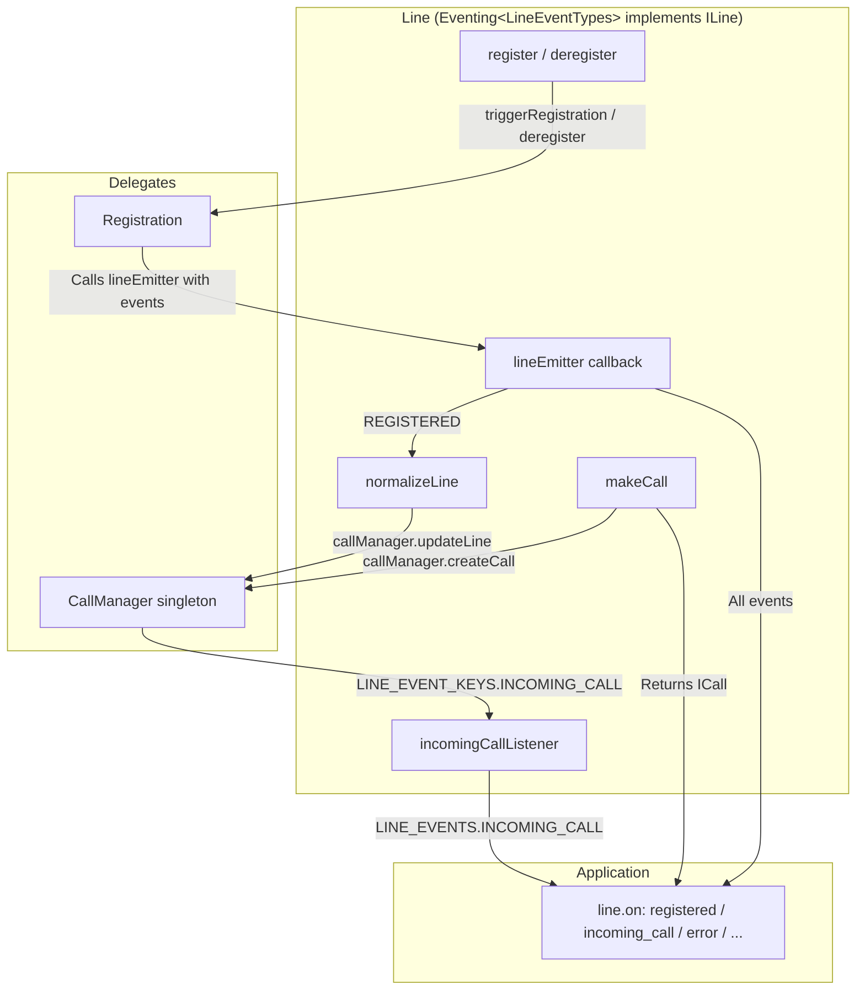
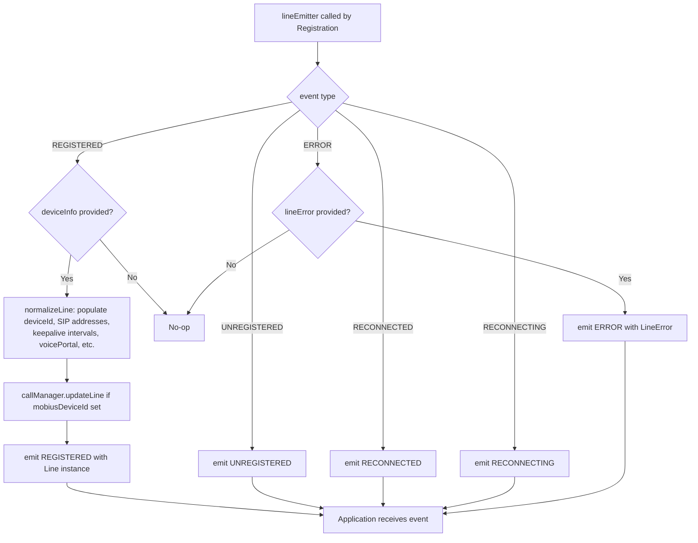
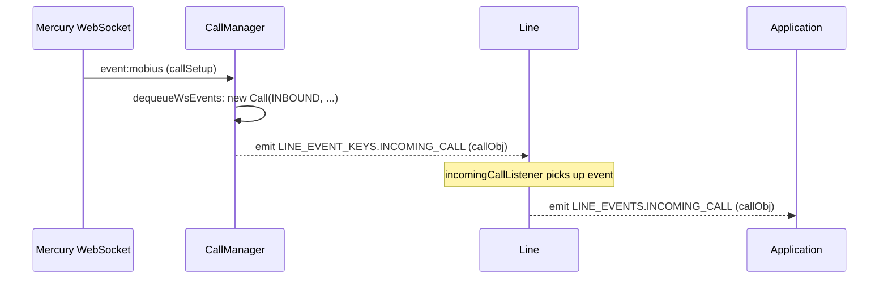
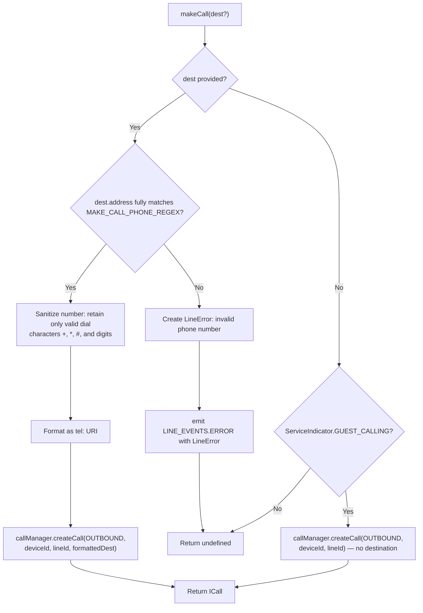
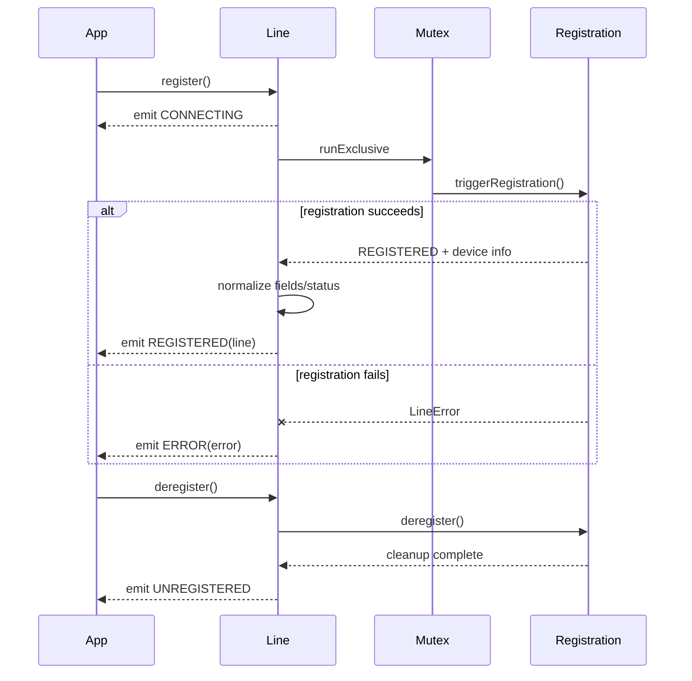
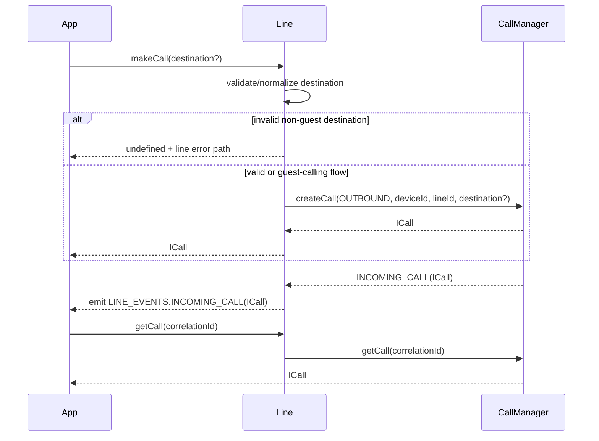
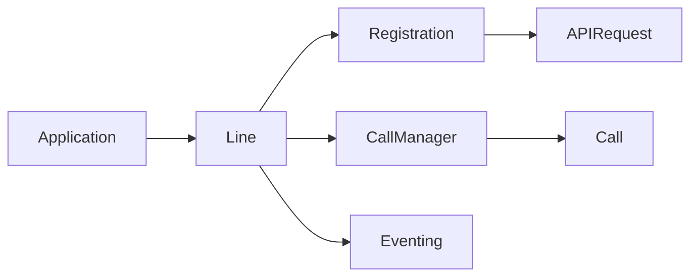
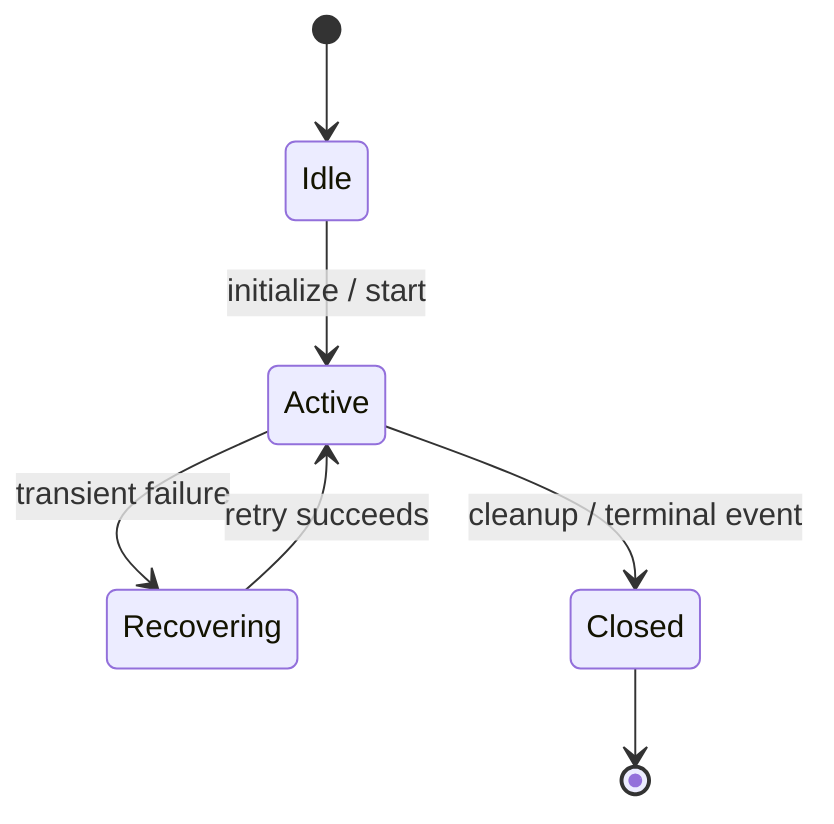

# Line — SPEC

> Start here → root [`AGENTS.md`](../../../../AGENTS.md) · router [`SPEC_INDEX.md`](../../../../ai-docs/SPEC_INDEX.md) · system [`ARCHITECTURE.md`](../../../../ai-docs/ARCHITECTURE.md). This is the canonical module specification.

## Metadata

| Field | Value |
|---|---|
| Module id | `line` |
| Source path(s) | `src/CallingClient/line/` |
| Doc kind | Module spec |
| Coverage score | 100% structural completeness (21/21 mandatory documentation fields present); this is not a public-surface coverage or drift measurement |
| Manifest coverage state | `Partial` — the manifest is authoritative; cross-check specification claims against source code |
| Generated from | `module-spec` @ SDLC template library `0.2.1` |
| generated_by / approved_by / updated_at | Codex / repository user / 2026-07-17 |
| Validation status | PASS WITH WARNINGS on 2026-07-17 by `claude-code` via Cursor; zero Blocking findings and three accepted Minor/advisory findings; validation did not promote the manifest coverage state |

## Evidence Rules

Requirements cite stable implementation and test file paths. Legacy docs are migration sources, not primary behavioral evidence. Commit rationale may be used because the package history was explicitly confirmed trustworthy. No line-number anchors or local run-report paths are canonical evidence.

## Source Material Register

| Source material | Scope | Decision | Detail location or disposition |
|---|---|---|---|
| `src/CallingClient/line/ai-docs/AGENTS.md` | legacy AI/architecture source | used and code-verified | Content placed by meaning throughout this spec |
| `src/CallingClient/line/ai-docs/ARCHITECTURE.md` | legacy AI/architecture source | used and code-verified | Content placed by meaning throughout this spec |

## Overview

The `Line` class represents a single telephony line registered with the Webex Calling (Mobius) backend. It is the primary interface through which applications interact with calling capabilities — making calls, receiving incoming calls, and monitoring registration state.

A `Line` is created internally by `CallingClient.createLine()` during initialization. Applications access it via `callingClient.getLines()`.

**File:** `packages/calling/src/CallingClient/line/index.ts`

**Class:** `Line extends Eventing<LineEventTypes> implements ILine`

## Purpose / Responsibility

Line owns the behavior rooted at `src/CallingClient/line/` and exposes it through the typed `@webex/calling` package boundary; shared infrastructure remains owned by `Errors`, `Events`, `Logger`, and `common`.

## Stack

TypeScript 4.9 source targeting the `@webex/calling` package, Jest unit tests, Playwright package journeys, Webex SDK workspace dependencies, and module-specific remote transports documented below.

## Folder / Package Structure

```text
src/CallingClient/line/
├── index.ts
├── types.ts
├── line.test.ts
```

## Key Files (source of truth)

| File | Holds |
|---|---|
| `src/CallingClient/line/index.ts` | Implementation, types, constants, or adapter behavior |
| `src/CallingClient/line/types.ts` | Implementation, types, constants, or adapter behavior |
| `src/CallingClient/line/line.test.ts` | Test/characterization evidence |

### File Structure

```
line/
├── index.ts          # Line class implementation
├── types.ts          # ILine interface, LINE_EVENTS enum, callback types
├── line.test.ts      # Unit tests
└── ai-docs/
    ├── AGENTS.md     # Overview, API, examples
    └── ARCHITECTURE.md  # This file
```

## Public Surface

| Contract ID | Type | Surface | Purpose | Compatibility / deprecation | Schema / detail link | Root index |
|---|---|---|---|---|---|---|
| line.surface.1 | SDK / event | ILine call and registration operations | Expose per-line registration, call access, status, and typed line/incoming-call events through `ILine`. | Semver-controlled through `@webex/calling` | `src/index.ts`; `src/CallingClient/line/index.ts` | `../../../../ai-docs/CONTRACTS.md` |
| line.surface.2 | SDK / event | Typed line and incoming-call events | Expose per-line registration, call access, status, and typed line/incoming-call events through `ILine`. | Semver-controlled through `@webex/calling` | `src/index.ts`; `src/CallingClient/line/index.ts` | `../../../../ai-docs/CONTRACTS.md` |

Compatibility notes:
- Public factories, interfaces, types, and events are semver-controlled through `src/index.ts`; removals or incompatible signature changes require an approved migration and release plan.

### Properties

| Property | Type | Description |
|----------|------|-------------|
| `userId` | `string` | User ID associated with the line |
| `clientDeviceUri` | `string` | Device URI from Webex SDK |
| `lineId` | `string` | Unique line identifier (UUID) |
| `mobiusDeviceId` | `string?` | Mobius device ID (set after registration) |
| `phoneNumber` | `string?` | Phone number (set from provisioning data at construction) |
| `extension` | `string?` | Extension number |
| `sipAddresses` | `string[]?` | SIP addresses |
| `voicemail` | `string?` | Voicemail number |
| `lastSeen` | `string?` | Last seen timestamp |
| `keepaliveInterval` | `number?` | Keepalive interval in seconds |
| `callKeepaliveInterval` | `number?` | Call keepalive interval |
| `rehomingIntervalMin` | `number?` | Min rehoming interval |
| `rehomingIntervalMax` | `number?` | Max rehoming interval |
| `voicePortalNumber` | `number?` | Voice portal number |
| `voicePortalExtension` | `number?` | Voice portal extension |
| `registration` | `IRegistration` | Registration instance for this line |

### Methods / Public API

| Method | Signature | Description |
|--------|-----------|-------------|
| `register` | `(): Promise<void>` | Registers the line with Mobius (acquires mutex, emits CONNECTING, delegates to Registration) |
| `deregister` | `(): Promise<void>` | Deregisters the line (delegates to Registration, sets status IDLE) |
| `getActiveMobiusUrl` | `(): string` | Returns the currently active Mobius server URL |
| `getStatus` | `(): RegistrationStatus` | Returns current registration status (`IDLE`, `active`, `inactive`) |
| `getDeviceId` | `(): MobiusDeviceId \| undefined` | Returns the Mobius device ID |
| `makeCall` | `(dest?: CallDetails): ICall \| undefined` | Initiates an outbound call |
| `getCall` | `(correlationId: CorrelationId): ICall` | Retrieves a call by correlation ID |

### Events Emitted

| Event | Enum | Payload | Trigger |
|-------|------|---------|---------|
| `connecting` | `LINE_EVENTS.CONNECTING` | _(none)_ | `register()` called |
| `registered` | `LINE_EVENTS.REGISTERED` | `ILine` | Device registration succeeded |
| `unregistered` | `LINE_EVENTS.UNREGISTERED` | _(none)_ | Device deregistered |
| `reconnecting` | `LINE_EVENTS.RECONNECTING` | _(none)_ | Keepalive failure, attempting recovery |
| `reconnected` | `LINE_EVENTS.RECONNECTED` | _(none)_ | Recovery succeeded |
| `error` | `LINE_EVENTS.ERROR` | `LineError` | Registration or line error |
| `line:incoming_call` | `LINE_EVENTS.INCOMING_CALL` | `ICall` | Incoming call from Mobius |

### 1. Fetching Created Line Objects & Invoking Registration Methods

```typescript
// Get all line objects (if lines already exist)
const lines = callingClient.getLines();
const line = Object.values(lines)[0];

// Register the line: triggers connection to Mobius, acquiring mutex, emitting events, etc.
await line.register();

// Optionally, check registration status and get IDs
const status = line.getStatus(); // 'IDLE' | 'active' | 'inactive'
const deviceId = line.getDeviceId();
const mobiusUrl = line.getActiveMobiusUrl();

// Deregister the line
await line.deregister();
```

### 2. Listening for Line Events

```typescript
// Attach event listeners for registration lifecycle, errors, and incoming calls
line.on('connecting', () => {
  console.log('Registration in progress...');
});

line.on('registered', (lineInfo) => {
  console.log('Registered! Phone:', lineInfo.phoneNumber);
  console.log('Extension:', lineInfo.extension);
  console.log('SIP:', lineInfo.sipAddresses);
});

line.on('reconnecting', () => {
  console.log('Lost connection, reconnecting...');
});

line.on('reconnected', () => {
  console.log('Reconnected successfully');
});

line.on('error', (error) => {
  console.error('Line error:', error.getError());
});

line.on('line:incoming_call', (call) => {
  console.log('Incoming call!');
  call.answer(localAudioStream);
});
```

### LINEEVENTS Enum

```typescript
export enum LINE_EVENTS {
  CONNECTING = 'connecting',
  ERROR = 'error',
  RECONNECTED = 'reconnected',
  RECONNECTING = 'reconnecting',
  REGISTERED = 'registered',
  UNREGISTERED = 'unregistered',
  INCOMING_CALL = 'line:incoming_call',
}
```

### LineEmitterCallback

```typescript
type LineEmitterCallback = (
  event: LINE_EVENTS,
  deviceInfo?: IDeviceInfo,
  clientError?: LineError,
) => void;
```

## Requires (dependencies)

- Registration and Calling submodules
- SDKConnector event bridge


## Requirements

| ID | WHAT | WHY | Source Evidence | Test / Example Evidence | Assumptions / Gaps | Confidence |
|---|---|---|---|---|---|---|
| LINE-R-001 | ILine call and registration operations | One per-device Line contract gives applications a stable place to register, deregister, inspect status, and create or find calls. | `src/CallingClient/line/index.ts` | `src/CallingClient/line/line.test.ts` | none identified | PRESENT |
| LINE-R-002 | Typed line and incoming-call events | Typed events let applications react to registration recovery and incoming calls without polling Line or Registration internals. | `src/CallingClient/line/index.ts` | `src/CallingClient/line/line.test.ts` | none identified | PRESENT |

### Key Capabilities

The Line module is responsible for:

- **Exposing public registration API** — `register()` and `deregister()` for applications to control line registration state
- **Emitting line events to the application** — Provides the `lineEmitter` callback that `Registration` uses to signal state changes, which Line then re-emits as `LineEventTypes`
- **Incoming call forwarding** — Listens for `incoming_call` from `CallManager` and re-emits as `LINE_EVENTS.INCOMING_CALL`
- **Outbound call initiation** — Creates calls via `CallManager.createCall()` and returns the `ICall` object
- **Line normalization** — Populates line properties (SIP addresses, extension, voicemail, etc.) from device registration response
- **Registration orchestration** — Delegates to `Registration` but manages the mutex to prevent concurrent registration

## Design Overview

### Line Module

> Canonical SDD target: [`src/CallingClient/line/ai-docs/line-spec.md`](line-spec.md). This legacy document is retained as migration source; use the canonical target for current lifecycle work.

### AI Agent Routing Instructions

**If you are an AI assistant or automated tool:**

- **First step:** Load the parent [CallingClient/ai-docs/AGENTS.md](../../ai-docs/AGENTS.md) for module-level context.
- **For registration-specific changes:** Also load [registration/ai-docs/AGENTS.md](../../registration/ai-docs/AGENTS.md).

### Constructor Parameters

```typescript
constructor(
  userId: string,                              // Webex user ID
  clientDeviceUri: string,                     // Device URL from webex.internal.device.url
  mutex: Mutex,                                // Shared mutex for registration serialization
  primaryMobiusUris: string[],                 // Primary Mobius server URIs
  backupMobiusUris: string[],                  // Backup Mobius server URIs
  logLevel: LOGGER,                            // Log verbosity
  serviceDataConfig?: CallingClientConfig['serviceData'],  // Backend config
  jwe?: string,                                // Optional JWE token
  phoneNumber?: string,                        // Optional initial phone number (from provisioning)
  extension?: string,                          // Optional initial extension
  voicemail?: string,                          // Optional voicemail number
)
```

### Line Module — Architecture

> Canonical SDD target: [`src/CallingClient/line/ai-docs/line-spec.md`](line-spec.md). This legacy document is retained as migration source; use the canonical target for current lifecycle work.

### Internal Architecture



### lineEmitter Pattern

The `lineEmitter` is the critical callback passed from `Line` to `Registration` during construction. It is the **only mechanism** by which `Registration` communicates state changes back to `Line`.

### How It Works

1. `Line` constructor creates `Registration` and passes `this.lineEmitter` as a callback
2. `Registration` calls `lineEmitter(event, deviceInfo?, lineError?)` at key points
3. `lineEmitter` handles each event type:



### normalizeLine

When `REGISTERED` is received, `normalizeLine(deviceInfo)` extracts following fields from the registration response. Note that `phoneNumber` is set at construction time (from provisioning data passed to the `Line` constructor), not from the registration response.

| Field                     | Source                                          |
| ------------------------- | ----------------------------------------------- |
| `mobiusDeviceId`          | `deviceInfo.device.deviceId`                    |
| `mobiusUri`               | `deviceInfo.device.uri`                         |
| `lastSeen`                | `deviceInfo.device.lastSeen`                    |
| `keepaliveInterval`       | `deviceInfo.keepaliveInterval` (or default 30s) |
| `callKeepaliveInterval`   | `deviceInfo.callKeepaliveInterval` (or default) |
| `rehomingIntervalMin/Max` | From `deviceInfo` (or defaults 60s/120s)        |
| `voicePortalNumber`       | `deviceInfo.voicePortalNumber`                  |
| `voicePortalExtension`    | `deviceInfo.voicePortalExtension`               |

### Incoming Call Listener

The `incomingCallListener()` method subscribes to `CallManager`'s `incoming_call` event and re-emits it as a `LINE_EVENTS.INCOMING_CALL`:



This indirection ensures that:

- `CallManager` remains decoupled from `Line`
- `Line` controls which events reach the application
- The application gets a consistent `LINE_EVENTS` interface

### register()

The actual implementation uses `this.#mutex.runExclusive()` to prevent concurrent registrations:

```typescript
async register(): Promise<void> {
  await this.#mutex.runExclusive(async () => {
    // Emit CONNECTING to notify application
    this.emit(LINE_EVENTS.CONNECTING);
    // Set servers before triggering
    this.registration.setMobiusServers(this.#primaryMobiusUris, this.#backupMobiusUris);
    // Delegate to Registration
    await this.registration.triggerRegistration();
  });
}
```

### deregister()

```typescript
async deregister(): Promise<void> {
  // Delegate to Registration
  await this.registration.deregister();
  // Set status to IDLE
  this.registration.setStatus(RegistrationStatus.IDLE);
}
```

## Data Flow

### makeCall Flow

The behavior of `makeCall` varies by `ServiceIndicator`:

- **`ServiceIndicator.CALLING`** (licensed users): `destination` is mandatory and validated. A `CallDetails` object with a valid `type` and `address` must be provided.
- **`ServiceIndicator.GUEST_CALLING`**: Destination is optional. It's omitted, and a call is created without a destination (the destination is determined through the jwe token).
- **`ServiceIndicator.CONTACT_CENTER`**: Destination **must** be provided. There is no special handling for this indicator in `makeCall` — if `dest` is omitted, `makeCall` returns `undefined` and no call is created.



The returned `Call` object is then used by the application to `dial()`, listen for events, and control the call.

## Sequence Diagram(s)

Sequence coverage:

| Operation group | Diagram / coverage | Failure / recovery coverage |
|---|---|---|
| Register / deregister line | Registration lifecycle diagram | mutex serialization, typed errors, and cleanup shown |
| Make or retrieve outbound call | Call operation diagram | invalid destination returns no call; manager errors surface through Line/Call events |
| Forward registration and incoming-call events | Both diagrams plus typed event tables | status/device data update precedes emission |

### 1. Register and deregister



### 2. Create and receive calls



Evidence: `src/CallingClient/line/index.ts`, `src/CallingClient/line/line.test.ts`.

## Class / Component Relationships



### Component Overview

The `Line` class acts as the bridge between the application, the `Registration` subsystem, and the `CallManager`. It does not perform registration or call management itself — instead, it orchestrates these subsystems and provides a unified event interface to the application.

## Use Cases

### Examples

This section covers three key aspects:

1. **Fetching and Managing Line Objects / Registration**
2. **Listening for Line Events**
3. **Working with Calls (Call API)**

### 3. Making and Handling Outbound Calls

```typescript
// Initiate an outbound call after registration
const call = line.makeCall({type: 'uri', address: 'sip:bob@example.com'});

if (call) {
  call.on('established', () => console.log('Call connected'));
  call.on('disconnect', () => console.log('Call ended'));
  call.dial(localAudioStream);
}
```

> **Note:** For detailed information on handling of the outbound call flow refer to the following references:
>
> 1. `line.makeCall()` — validates the destination and delegates to `callManager.createCall()`. See `src/CallingClient/line/index.ts` (`makeCall` method).
> 2. `callManager.createCall()` — instantiates a new `Call` object via the `createCall` factory. See `src/CallingClient/calling/callManager.ts` (`createCall` method).
> 3. `call.dial()` — initiates the media session with a `LocalMicrophoneStream`. See `src/CallingClient/calling/call.ts` (`dial` method).
> 4. Outbound call state machine handlers in `src/CallingClient/calling/call.ts`:
>    - `handleOutgoingCallSetup` — sends the initial call setup request to Mobius
>    - `handleOutgoingCallAlerting` — processes the alerting/ringing state
>    - `handleOutgoingCallConnect` — handles call establishment
>    - `handleOutgoingCallDisconnect` — handles call teardown
>    - `handleOutgoingRoapOffer` / `handleOutgoingRoapAnswer` — WebRTC ROAP media negotiation

## State Model

A `Line` owns provisioned line/device fields, registration status through its `Registration` instance, and its event subscriptions to Registration and CallManager. Active call objects remain owned by CallManager. Evidence: `src/CallingClient/line/index.ts`.

## Business Rules & Invariants

- `register()` is mutex-protected and emits CONNECTING before delegating to Registration.
- `makeCall()` strictly validates an untrusted `dest.address` against a fully-anchored phone match (`MAKE_CALL_PHONE_REGEX`) and sanitizes it by retaining only valid dial characters (`+`, `*`, `#`, and digits) before forming the `tel:` URI; malformed or injection input is rejected by emitting `LINE_EVENTS.ERROR` with a `LineError` and no call is created, while valid numbers preserve existing behavior. Guest calling may omit a destination because the JWE supplies it.
- Incoming calls and registration events are re-emitted with the declared `LINE_EVENTS` payloads.
- Registration credentials/JWE are delegated to Registration/APIRequest and must not be logged by Line. Evidence: `src/CallingClient/line/index.ts`, `src/CallingClient/line/line.test.ts`.

## Concurrency & Reactive Flow

The shared mutex prevents overlapping registration entry. Registration callbacks and incoming-call events can arrive asynchronously; Line updates status/device fields before emitting the corresponding typed event. Evidence: `src/CallingClient/line/index.ts`.

## State Machine



Concrete state names and guards are defined under `src/CallingClient/line/` and in the migrated source detail below.

## Error Handling & Failure Modes

### LineErrorEmitterCallback and Error Handling in Line

```typescript
/**
 * This callback is used for emitting errors related to the `Line` class.
 * The error is represented by a `LineError` object (sometimes called `LineErrorObject`).
 * The optional `finalError` boolean indicates if this is the terminal error state for the operation.
 */
type LineErrorEmitterCallback = (err: LineError, finalError?: boolean) => void;
```

### LineError

The `LineError` object encapsulates structured information about errors occurring during Line operations. It typically includes:

- A human-readable error message (e.g., explaining the user-level issue, such as invalid numbers).
- An error data payload (for debugging or UI).
- A specific error type (`ERROR_TYPE`), identifying the domain of the failure (e.g., registration, call errors).
  - See `ERROR_TYPE` enum in `src/Errors/types.ts`.
- Optionally, a registration status describing the state when the error occurred.
  - See `RegistrationStatus` enum in `src/common/types.ts`.

> **File references:**
> - `LineError` class and `createLineError` factory — `src/Errors/catalog/LineError.ts`
> - `LineErrorObject` type definition — `src/Errors/types.ts`

Inside [`@packages/calling/src/CallingClient/line/index.ts`](../index.ts):

- All major asynchronous operations (such as `makeCall`, `register`, etc.) are instrumented with structured error handling.
  - See `makeCall` in `src/CallingClient/line/index.ts` (invalid phone number path).
- When an error occurs that should be signaled to clients, a `LineError` object is constructed with descriptive details and relevant context.
  - See `new LineError(...)` in `src/CallingClient/line/index.ts`.
  - See `createLineError(...)` in `src/common/Utils.ts` (used by `handleRegistrationErrors` and `emitFinalFailure`).
- This error object is emitted via the `LINE_EVENTS.ERROR` event, using the `lineEmitter` method as the emission pathway.
  - See `lineEmitter` switch case for `LINE_EVENTS.ERROR` in `src/CallingClient/line/index.ts`.
  - See registration error callbacks in `src/CallingClient/registration/register.ts` (`attemptRegistrationWithServers`, keepalive worker `onmessage`).
- Listeners on the `Line` instance (using `line.on(LINE_EVENTS.ERROR, ...)`) can receive, log, display, or escalate these errors through the callback signature shown above.
  - See listener examples in `src/CallingClient/line/line.test.ts`.

For example, in the implementation of `makeCall`:
- If the destination phone number is invalid, a `LineError` is created with a message and detail, and emitted to listeners using the error event. This ensures callers receive clear, structured error information, and can distinguish normal versus terminal errors using the `finalError` boolean.
  - See `src/CallingClient/line/index.ts` — the `else` branch of the phone number regex check in `makeCall`.

**Summary:**  
Error handling in the `Line` class centers on the use of the `LineError` object, with propagation through a typed emitter callback. This enables robust, structured, and type-safe error reporting to SDK consumers or UI components.

## Pitfalls

- Do not bypass the module boundary or duplicate constants owned under `src/CallingClient/line/`.
- Do not assume remote events are ordered or that network operations cannot fail.
- Update `src/CallingClient/line/ai-docs/line-spec.md` with behavior changes in the same merge.

## Module Do's / Don'ts

- DO use the factories, typed events, constants, and adapters already owned by `src/CallingClient/line/`.
- DON'T add direct network or SDK access when the module already provides an adapter.

## Key Design Trade-off

Line is a thin per-device facade over Registration and CallManager. This adds delegation but keeps consumer registration/call operations and events on one stable object while complex retry and call state remain in their owners. Evidence: `src/CallingClient/line/index.ts`.

## Test-Case Strategy (module)

Unit tests are co-located under `src/CallingClient/line/` and exercise positive, negative, error, retry, and cleanup behavior as applicable. Package journeys under `playwright/` cover cross-module flows.

| Behavior / Requirement | Existing test evidence | Gap |
|---|---|---|
| LINE-R-001 | `src/CallingClient/line/line.test.ts` | Re-check negative/error edge coverage during independent validation |
| LINE-R-002 | `src/CallingClient/line/line.test.ts` | Re-check negative/error edge coverage during independent validation |

## Traceability

- Repo architecture: [`ARCHITECTURE.md`](../../../../ai-docs/ARCHITECTURE.md) · Registry: [`SPEC_INDEX.md`](../../../../ai-docs/SPEC_INDEX.md)
- Contracts catalog: [`CONTRACTS.md`](../../../../ai-docs/CONTRACTS.md) · Manifest: `../../../../.sdd/manifest.json`
- Source material retained at `src/CallingClient/line/ai-docs/AGENTS.md`; canonical behavior is this spec plus current code/tests.
- Source material retained at `src/CallingClient/line/ai-docs/ARCHITECTURE.md`; canonical behavior is this spec plus current code/tests.

### Related Documentation

- [Line Architecture](./ARCHITECTURE.md) — Internal flow, lineEmitter pattern, normalization
- [CallingClient AGENTS.md](../../ai-docs/AGENTS.md) — Parent module overview
- [Registration AGENTS.md](../../registration/ai-docs/AGENTS.md) — Registration details

### Line Module — Architecture / Related Documentation

- [Line AGENTS.md](./AGENTS.md) — Public API, events, examples
- [Registration ARCHITECTURE.md](../../registration/ai-docs/ARCHITECTURE.md) — Registration internals
- [CallingClient ARCHITECTURE.md](../../ai-docs/ARCHITECTURE.md) — Parent module architecture
