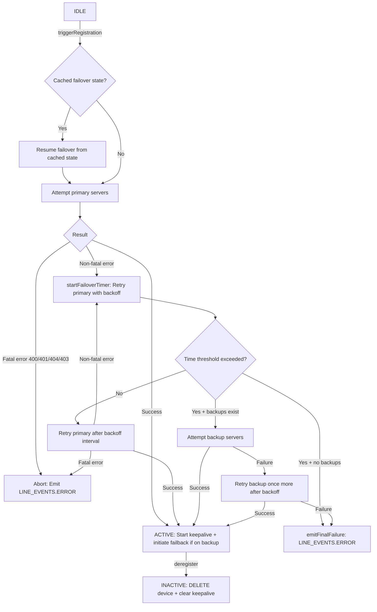
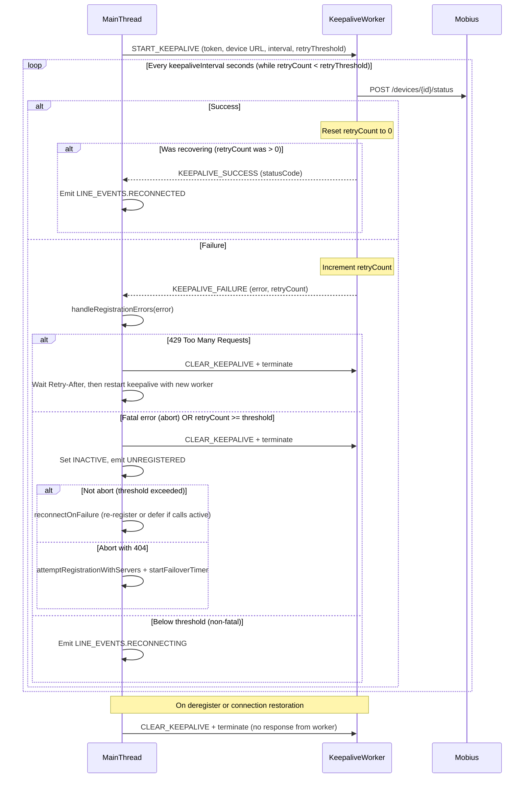
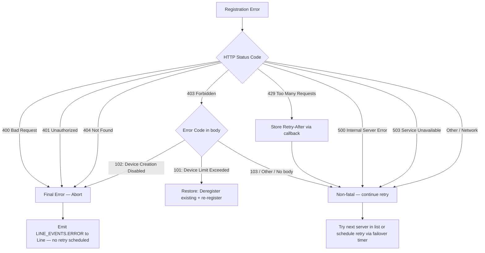

# Registration Module

## AI Agent Routing Instructions

**If you are an AI assistant or automated tool:**

- **First step:** Load the parent [CallingClient/ai-docs/AGENTS.md](../../ai-docs/AGENTS.md) for module-level context.
- **For line-specific context:** Also load [line/ai-docs/AGENTS.md](../../line/ai-docs/AGENTS.md) (Registration is owned by Line).

---

## Module File Structure

```
registration/
├── index.ts               # Re-exports from register.ts
├── register.ts            # Registration class — core lifecycle implementation
├── types.ts               # IRegistration interface and type aliases
├── webWorker.ts           # Keepalive Web Worker logic (source)
├── webWorkerStr.ts        # Stringified Web Worker for Blob URL creation at runtime
├── registerFixtures.ts    # Shared test fixtures
├── register.test.ts       # Unit tests for the Registration class
├── webWorker.test.ts      # Unit tests for the Web Worker
└── ai-docs/
    ├── AGENTS.md          # AI agent routing and module documentation (this file)
    └── ARCHITECTURE.md    # Internal flows, failover, and keepalive architecture details
```

---

## Overview

The `Registration` class manages the lifecycle of a device registration with the Webex Calling Mobius backend. It handles initial registration, keepalive heartbeats (via a Web Worker), server failover/failback, reconnection after network disruption, and clean deregistration.

`Registration` does **not** emit events directly to the application. Instead, it communicates state changes back to `Line` via the `lineEmitter` callback pattern.

**File:** `packages/calling/src/CallingClient/registration/register.ts`

**Class:** `Registration implements IRegistration`

**Factory:** `createRegistration(...)` — called internally by the `Line` constructor

---

## Key Capabilities

The Registration module handles:

- **Device Registration** — `POST /calling/web/device` to Mobius to register the client device
- **Keepalive** — Periodic `POST /devices/{deviceId}/status` via a dedicated Web Worker
- **Registration Failover** — Automatic switch from primary to backup Mobius servers on failure
- **Registration Failback** — Automatic return to primary servers when they become available
- **Reconnection** — Re-register after network disruption or Mercury disconnection
- **429 Retry** — Respect `Retry-After` headers with exponential backoff
- **Deregistration** — `DELETE /devices/{deviceId}` to clean up the device on Mobius

---

## Public API

### IRegistration Interface

| Method | Signature | Description |
|--------|-----------|-------------|
| `setMobiusServers` | `(primary: string[], backup: string[]): void` | Sets primary and backup Mobius URIs |
| `triggerRegistration` | `(): Promise<void>` | Starts registration (or resumes failover if in progress) |
| `isDeviceRegistered` | `(): boolean` | Returns `true` if status is `ACTIVE` |
| `setStatus` | `(value: RegistrationStatus): void` | Sets registration status |
| `getStatus` | `(): RegistrationStatus` | Returns current status (`IDLE`, `active`, `inactive`) |
| `getDeviceInfo` | `(): IDeviceInfo` | Returns device info from last successful registration |
| `clearKeepaliveTimer` | `(): void` | Stops the keepalive Web Worker |
| `deregister` | `(): Promise<void>` | Deletes device from Mobius and stops keepalive |
| `setActiveMobiusUrl` | `(url: string): void` | Sets the active Mobius URL |
| `getActiveMobiusUrl` | `(): string` | Returns current active Mobius URL |
| `reconnectOnFailure` | `(caller: string): Promise<void>` | Re-registers or defers if calls are active |
| `isReconnectPending` | `(): boolean` | Returns `true` if reconnect is deferred |
| `handleConnectionRestoration` | `(retry: boolean): Promise<boolean>` | Re-registers after network/Mercury recovery |
| `setDeviceInfo` | `(body: Devices): void` | Hydrates device info from a Devices response |

---

## Key Concepts

This section provides an overview of the core concepts and flows managed by the `Registration` module, covering registration, keepalive, reconnection, error handling, and metrics.

---

### 1. Registration Flow

The registration flow handles initial registration, reconnection after disruption, failover, and failback. It is robust against server failures and network interruptions.



- **Initial Registration:** Attempts registration on the configured primary Mobius servers via `attemptRegistrationWithServers`.
- **Retry with Primary:** On non-fatal failure, `startFailoverTimer` retries primary servers with exponential backoff until the cumulative time threshold (`REG_TRY_BACKUP_TIMER_VAL_IN_SEC`) is exceeded.
- **Failover:** After the time threshold is exceeded and backup servers exist, attempts registration on backup servers. If backup also fails, retries backup once more before emitting a final failure.
- **Failback:** When registered on backup, `initiateFailback` periodically pings primary; if primary is up and no active calls, deregisters from backup and re-registers with primary.
- **Fatal errors (400, 401, 404, 403-disabled):** Abort immediately — no retry is scheduled.

---

### 2. Keepalive Flow

A dedicated Web Worker manages keepalive requests to ensure a responsive and reliable heartbeat loop, even when the main thread is inactive.



- Worker posts `KEEPALIVE_SUCCESS` **only when recovering** from a previous failure (`retryCount > 0` before the success). Normal successes silently reset the counter.
- On **429**: `handle429Retry` clears the current worker and schedules a new keepalive timer after the `Retry-After` delay.
- On **fatal error** (abort) or **retries exceeded** (retryCount >= threshold, 4 for CC / 5 otherwise): the worker is terminated and the main thread either calls `reconnectOnFailure` (non-fatal threshold) or attempts fresh registration (404).
- On **non-fatal error below threshold**: only `LINE_EVENTS.RECONNECTING` is emitted; the worker keeps running.

---

### 3. Error Handling Logic

Robust error handling is built in for registration and keepalive via `handleRegistrationErrors`:


- **400 / 401 / 404:** Fatal errors — `handleRegistrationErrors` returns `abort = true`, registration stops, and `LINE_EVENTS.ERROR` is emitted to `Line`.
- **403 (Device Limit Exceeded, code 101):** Non-fatal — triggers `restoreRegistrationCallBack` which deregisters the existing device and re-registers. If successful, status becomes `ACTIVE`.
- **403 (Device Creation Disabled, code 102):** Fatal — `abort = true`.
- **429 Too Many Requests:** Non-fatal — stores `Retry-After` value via `handle429Retry`. During initial registration, the loop continues to the next server; the stored value influences `startFailoverTimer` interval. During failback, retries up to `REG_FAILBACK_429_MAX_RETRIES` (5).
- **500 / 503 / Other:** Non-fatal — the loop in `attemptRegistrationWithServers` continues to the next server. If all servers fail, `startFailoverTimer` schedules retries with exponential backoff.

---

### 4. Metrics and Observability

Registration events are instrumented with detailed metrics for observability and troubleshooting:

| Metric Event | When Submitted | Key Properties                           |
|--------------|---------------|------------------------------------------|
| `REGISTRATION_ATTEMPT` | Each registration attempt | Attempt count, server, network type    |
| `REGISTRATION_SUCCESS` | On successful registration | Server, latency, failover status      |
| `REGISTRATION_FAILURE` | On failure                  | Error type/code, retry, server type   |
| `REGISTRATION_FAILOVER` | On switch to backup server   | Reason, previous/next server addresses|
| `REGISTRATION_KEEPALIVE_FAILURE` | Keepalive fails       | Error code, retry count               |

Tracking these metrics enables effective monitoring of registration reliability and fast detection of service issues.

---

### Server Selection

| Phase | Servers Used | When |
|-------|-------------|------|
| Primary | `primaryMobiusUris` | Initial registration attempt |
| Failover | `backupMobiusUris` | Primary servers all fail |
| Failback | `primaryMobiusUris` | While on backup, periodically check if primary is up |

### Keepalive Web Worker

The keepalive mechanism runs in a dedicated **Web Worker** to avoid being blocked by main-thread activity. Worker messages use the `WorkerMessageType` enum (values are string constants):

- **Start:** Worker receives `WorkerMessageType.START_KEEPALIVE` (`'START_KEEPALIVE'`) with access token, device URL, interval, and retry threshold
- **Loop:** Worker sends `POST /devices/{id}/status` every `keepaliveInterval` seconds
- **Success:** Worker posts `WorkerMessageType.KEEPALIVE_SUCCESS` (`'KEEPALIVE_SUCCESS'`) to main thread
- **Failure:** Worker posts `WorkerMessageType.KEEPALIVE_FAILURE` (`'KEEPALIVE_FAILURE'`) with error details and retry count
- **Stop:** Main thread sends `WorkerMessageType.CLEAR_KEEPALIVE` (`'CLEAR_KEEPALIVE'`), Worker clears interval and main thread terminates it

### 429 Retry Logic

When Mobius responds with HTTP 429:
1. Extract `Retry-After` header value
2. Schedule retry after the specified delay
3. Retry up to `REG_FAILBACK_429_MAX_RETRIES` (5) times
4. On exhaustion, switch to backup servers

---

## Examples

### Registration is Triggered by Line

```typescript
// Inside Line.register()
await this.registration.triggerRegistration();
```

### Checking Registration State

```typescript
const isRegistered = registration.isDeviceRegistered(); // true if ACTIVE
const status = registration.getStatus(); // 'IDLE' | 'active' | 'inactive'
const deviceInfo = registration.getDeviceInfo();
const activeMobiusUrl = registration.getActiveMobiusUrl();
```

### Handling Reconnection

```typescript
// CallingClient calls this after network/Mercury recovery
const success = await registration.handleConnectionRestoration(true);

// Or defer reconnect if calls are active
await registration.reconnectOnFailure('mercuryReconnect');
```

### Clean Deregistration

```typescript
await registration.deregister();
// Sends DELETE /devices/{id} to Mobius
// Stops keepalive Web Worker
// Sets status to IDLE
```

---

## Types

### IRegistration Interface

See full interface in `registration/types.ts`.

### Key Type Aliases

```typescript
type Header = {[key: string]: string};

type restoreRegistrationCallBack = (
  restoreData: IDeviceInfo,
  caller: string,
) => Promise<boolean>;

type retry429CallBack = (
  retryAfter: number,
  caller: string,
) => void;

type FailoverCacheState = {
  attempt: number;
  timeElapsed: number;
  retryScheduledTime: number;
  serverType: 'primary' | 'backup';
};
```

---

## Related Documentation

- [Registration Architecture](./ARCHITECTURE.md) — Internal flows, failover, keepalive details
- [Line AGENTS.md](../../line/ai-docs/AGENTS.md) — Line owns Registration via `lineEmitter`
- [CallingClient AGENTS.md](../../ai-docs/AGENTS.md) — Parent module overview
