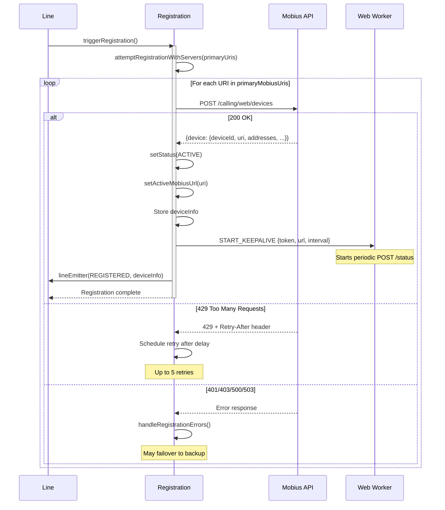
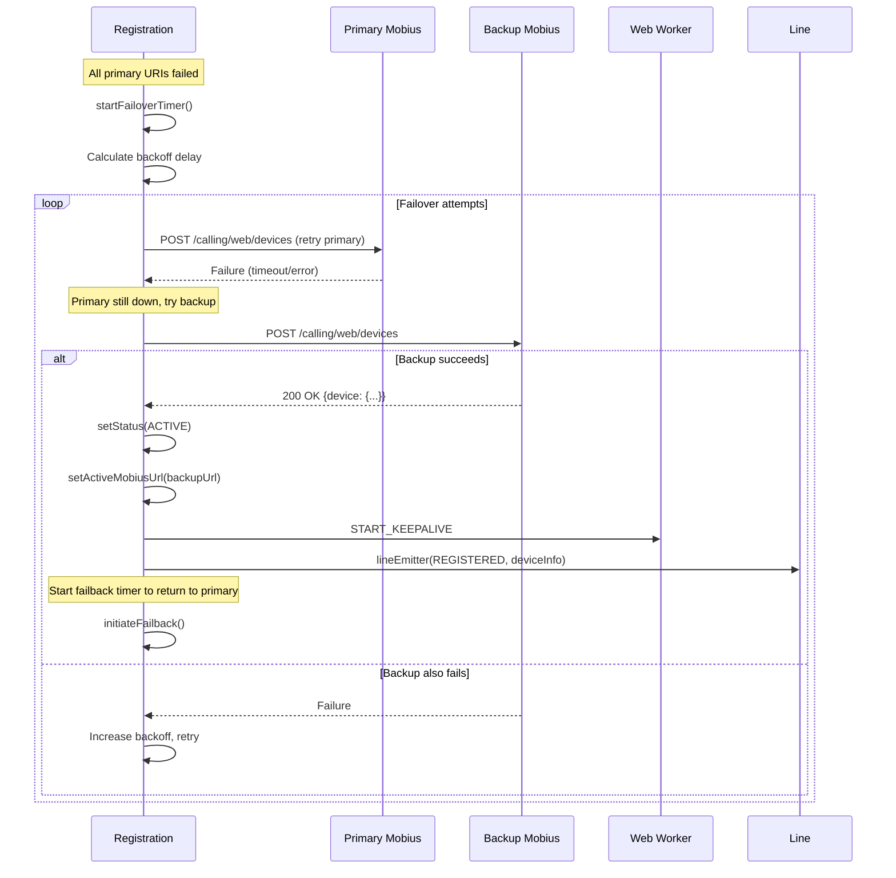
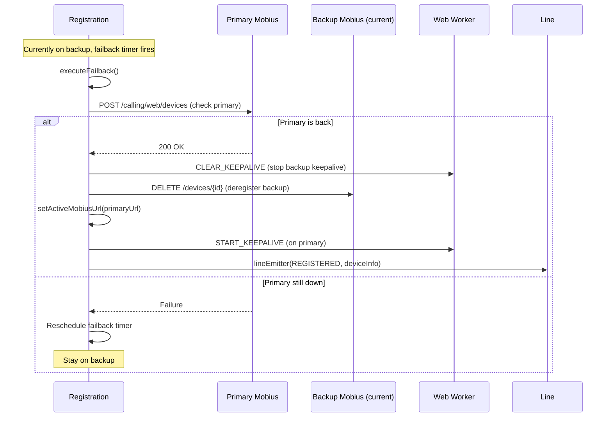

# Registration Module — Architecture

## Component Overview

The `Registration` class is the most complex subsystem in the CallingClient module. It manages the full lifecycle of device registration with Mobius, including initial registration, keepalive heartbeats, server failover, failback, 429 retry handling, and reconnection after network disruption.

### Responsibilities

| Concern | Implementation |
|---------|---------------|
| Initial registration | `triggerRegistration()` → `attemptRegistrationWithServers()` |
| Keepalive | Web Worker sends periodic `POST /status` |
| Failover (primary → backup) | `startFailoverTimer()` with exponential backoff |
| Failback (backup → primary) | `initiateFailback()` → `executeFailback()` |
| 429 handling | `Retry-After` header with retry budget |
| Reconnection | `handleConnectionRestoration()` / `reconnectOnFailure()` |
| Deregistration | `DELETE /devices/{id}` + worker termination |

---

## Internal Architecture

```
┌──────────────────────────────────────────────────────────────────┐
│                        Registration                              │
│                                                                  │
│  ┌────────────────────┐    ┌──────────────────────────────────┐  │
│  │ triggerRegistration │───►│ attemptRegistrationWithServers() │  │
│  └────────────────────┘    │  ├── Try each URI in order       │  │
│                            │  ├── POST /calling/web/devices   │  │
│                            │  ├── On success → ACTIVE          │  │
│                            │  └── On failure → error handler   │  │
│                            └──────────────┬───────────────────┘  │
│                                           │                      │
│  ┌────────────────────┐    ┌──────────────▼───────────────────┐  │
│  │ lineEmitter()      │◄───│ handleRegistrationSuccess()      │  │
│  │ → REGISTERED       │    │  ├── Set status ACTIVE           │  │
│  │ → RECONNECTING     │    │  ├── Start keepalive worker      │  │
│  │ → RECONNECTED      │    │  ├── Start failback if on backup │  │
│  │ → ERROR            │    │  └── Call lineEmitter(REGISTERED) │  │
│  └────────────────────┘    └──────────────────────────────────┘  │
│                                                                  │
│  ┌────────────────────┐    ┌──────────────────────────────────┐  │
│  │ Web Worker         │◄──►│ Keepalive Loop                   │  │
│  │ (webWorkerStr.ts)  │    │  POST /devices/{id}/status       │  │
│  │  START_KEEPALIVE   │    │  every keepaliveInterval secs    │  │
│  │  CLEAR_KEEPALIVE   │    │  → KEEPALIVE_SUCCESS             │  │
│  │  KEEPALIVE_SUCCESS │    │  → KEEPALIVE_FAILURE             │  │
│  │  KEEPALIVE_FAILURE │    └──────────────────────────────────┘  │
│  └────────────────────┘                                          │
│                                                                  │
│  ┌────────────────────┐    ┌──────────────────────────────────┐  │
│  │ Failover Timer     │◄──►│ startFailoverTimer()             │  │
│  │                    │    │  ├── Retry primary URIs           │  │
│  │                    │    │  ├── Then backup URIs             │  │
│  │                    │    │  └── Exponential backoff          │  │
│  └────────────────────┘    └──────────────────────────────────┘  │
│                                                                  │
│  ┌────────────────────┐    ┌──────────────────────────────────┐  │
│  │ Failback Timer     │◄──►│ initiateFailback()               │  │
│  │                    │    │  ├── Check primary servers        │  │
│  │                    │    │  ├── If up → executeFailback()    │  │
│  │                    │    │  └── Re-register on primary       │  │
│  └────────────────────┘    └──────────────────────────────────┘  │
└──────────────────────────────────────────────────────────────────┘
```

---

## Registration Flow

### Initial Registration Sequence



### Failover Flow



### Failback Flow



---

## Keepalive Web Worker

### Architecture

The keepalive runs in a **Web Worker** to ensure heartbeats are not blocked by main-thread work (long computations, UI rendering, etc.).

```
Main Thread                          Web Worker
    │                                    │
    ├── new Worker(blobURL) ────────────►│
    ├── postMessage(START_KEEPALIVE) ───►│
    │   {token, url, interval,           │
    │    retryCountThreshold}            │
    │                                    │
    │                              ┌─────┤ setInterval(interval)
    │                              │     │
    │                              │     ├── fetch(POST url/status)
    │                              │     │   ├── 200 → postMessage(KEEPALIVE_SUCCESS)
    │◄── KEEPALIVE_SUCCESS ────────┤     │   └── error → postMessage(KEEPALIVE_FAILURE)
    │◄── KEEPALIVE_FAILURE ────────┤     │
    │                              │     │
    │                              └─────┤
    │                                    │
    ├── postMessage(CLEAR_KEEPALIVE) ───►│
    │                                    ├── clearInterval()
    ├── worker.terminate() ─────────────►│ (terminated)
```

### Worker Messages

| Message | Direction | Payload | Description |
|---------|-----------|---------|-------------|
| `START_KEEPALIVE` | Main → Worker | `{accessToken, deviceUrl, interval, retryCountThreshold, url}` | Start sending keepalive requests |
| `CLEAR_KEEPALIVE` | Main → Worker | _(none)_ | Stop sending keepalive requests |
| `KEEPALIVE_SUCCESS` | Worker → Main | _(none)_ | Keepalive POST succeeded |
| `KEEPALIVE_FAILURE` | Worker → Main | `{statusCode, body, retryCount}` | Keepalive POST failed |

### Worker Creation

The worker is created from a stringified JavaScript source to avoid separate file bundling:

```typescript
// webWorkerStr.ts contains the worker code as a string
const blob = new Blob([webWorkerStr], {type: 'application/javascript'});
const url = URL.createObjectURL(blob);
this.webWorker = new Worker(url);
URL.revokeObjectURL(url);
```

### Keepalive Failure Handling

When the main thread receives `KEEPALIVE_FAILURE`:

1. **Emit `RECONNECTING`** via `lineEmitter` to notify the application
2. **Check retry count** against threshold (`MAX_CALL_KEEPALIVE_RETRY_COUNT = 4`)
3. **If within threshold:** Log warning, wait for next keepalive cycle
4. **If threshold exceeded:** Trigger `reconnectOnFailure()` for full re-registration
5. **Submit metrics** for keepalive failure

---

## Reconnection

### reconnectOnFailure()

Called when keepalive failures exceed the threshold or when CallingClient detects all calls have cleared after a network disruption.

```
reconnectOnFailure(caller)
  │
  ├── Are there active calls?
  │   ├── YES → Set reconnectPending = true (defer until calls clear)
  │   └── NO  → Proceed with re-registration
  │
  ├── clearKeepaliveTimer()
  ├── lineEmitter(RECONNECTING)
  ├── attemptRegistrationWithServers(primaryUris)
  │   ├── Success → lineEmitter(REGISTERED)
  │   └── Failure → startFailoverTimer()
  └── reconnectPending = false
```

### handleConnectionRestoration()

Called by `CallingClient` after Mercury reconnection.

```
handleConnectionRestoration(retry)
  │
  ├── Set status to INACTIVE
  ├── clearKeepaliveTimer()
  ├── lineEmitter(RECONNECTING)
  │
  ├── attemptRegistrationWithServers(primaryUris)
  │   ├── Success → lineEmitter(REGISTERED), return true
  │   └── Failure →
  │       ├── If retry = true → startFailoverTimer()
  │       └── return false
```

---

## 429 Retry Logic

```
HTTP 429 received
  │
  ├── Extract Retry-After header
  ├── Increment failback429RetryAttempts
  │
  ├── failback429RetryAttempts <= REG_FAILBACK_429_MAX_RETRIES (5)?
  │   ├── YES → Schedule retry after Retry-After delay
  │   │         └── On timer: call triggerRegistration() again
  │   └── NO  → Failover to backup servers
  │             └── startFailoverTimer()
```

---

## Key Constants

| Constant | Value | Description |
|----------|-------|-------------|
| `DEFAULT_KEEPALIVE_INTERVAL` | 30s | Default keepalive frequency |
| `REG_TRY_BACKUP_TIMER_VAL_IN_SEC` | 114s | Time before trying backup servers |
| `REG_FAILBACK_429_MAX_RETRIES` | 5 | Max 429 retries before failover |
| `BASE_REG_RETRY_TIMER_VAL_IN_SEC` | varies | Base retry timer |
| `BASE_REG_TIMER_MFACTOR` | varies | Multiplication factor for backoff |
| `REG_RANDOM_T_FACTOR_UPPER_LIMIT` | varies | Randomization upper bound |
| `RETRY_TIMER_UPPER_LIMIT` | varies | Max retry timer value |

---

## Error Handling

Registration errors are mapped through `handleRegistrationErrors()`:

| HTTP Status | ERROR_TYPE | Action |
|-------------|-----------|--------|
| 401 | `TOKEN_ERROR` | Emit error, likely need token refresh |
| 403 | `FORBIDDEN_ERROR` | Emit error |
| 404 | `NOT_FOUND` | Emit error |
| 408 | `TIMEOUT` | Retry or failover |
| 429 | `TOO_MANY_REQUESTS` | Retry with `Retry-After` |
| 500 | `SERVER_ERROR` | Failover |
| 503 | `SERVICE_UNAVAILABLE` | Failover |

All errors are communicated via `lineEmitter(LINE_EVENTS.ERROR, undefined, lineError)` where `lineError` is a `LineError` instance.

---

## File Structure

```
registration/
├── index.ts               # Re-exports from register.ts
├── register.ts            # Registration class (main logic)
├── types.ts               # IRegistration, type aliases
├── webWorker.ts           # Keepalive worker (direct module)
├── webWorkerStr.ts        # Stringified worker for Blob URL
├── registerFixtures.ts    # Test fixtures
├── register.test.ts       # Unit tests
├── webWorker.test.ts      # Web Worker unit tests
└── ai-docs/
    ├── AGENTS.md          # Overview, API, examples
    └── ARCHITECTURE.md    # This file
```

---

## Related Documentation

- [Registration AGENTS.md](./AGENTS.md) — Public API, key concepts
- [Line ARCHITECTURE.md](../../line/ai-docs/ARCHITECTURE.md) — lineEmitter pattern, Line ↔ Registration interaction
- [CallingClient ARCHITECTURE.md](../../ai-docs/ARCHITECTURE.md) — Network resilience, initialization
- [Error Handling Patterns](../../../../ai-docs/patterns/error-handling-patterns.md) — LineError handling

---

_Last Updated: 2026-03-15_
