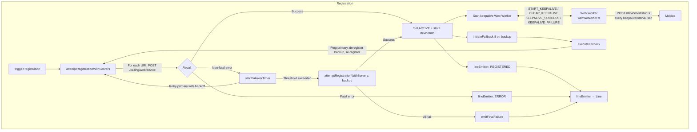
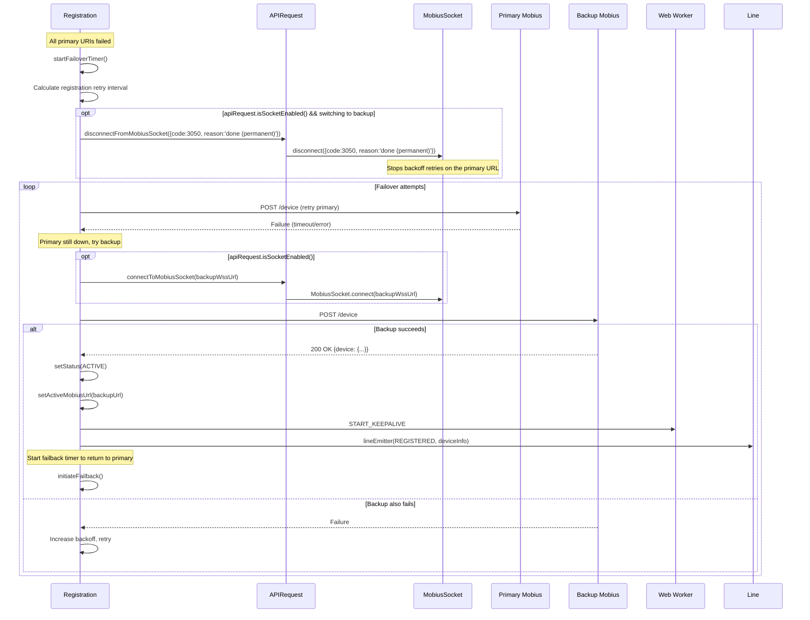
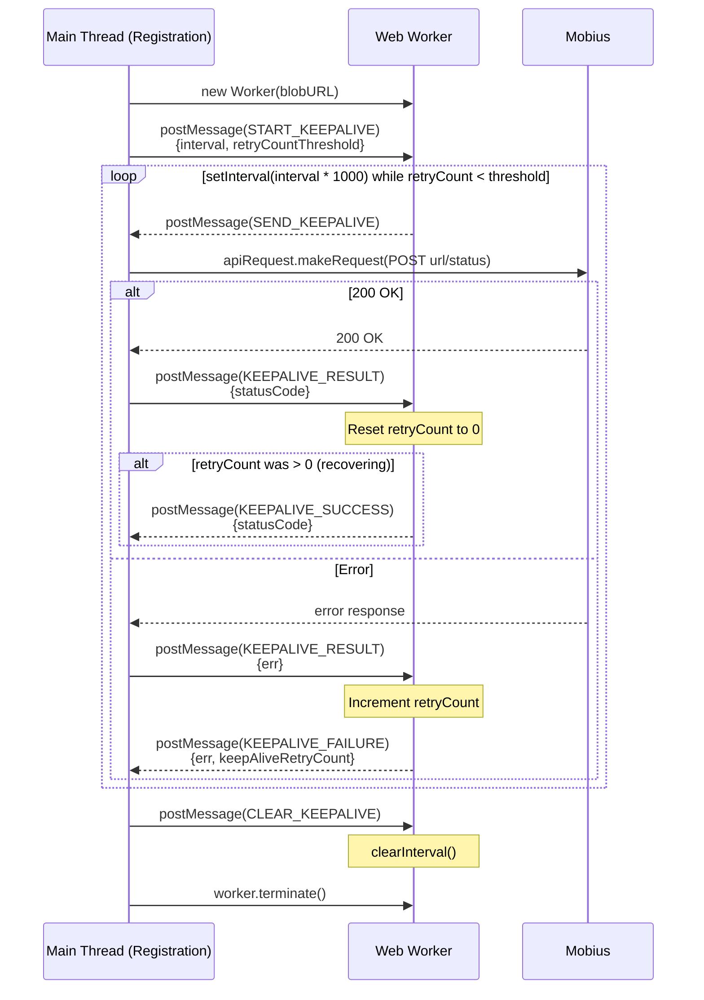
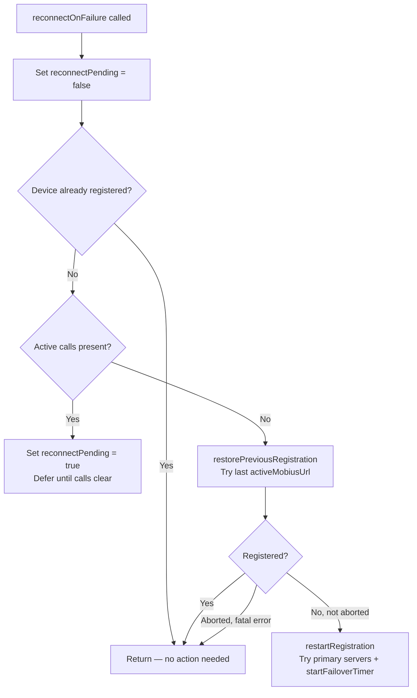
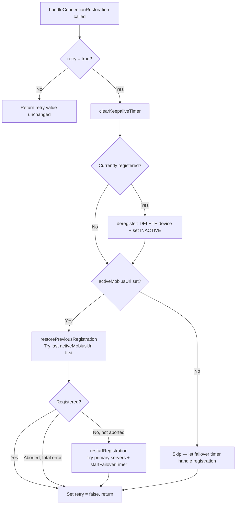
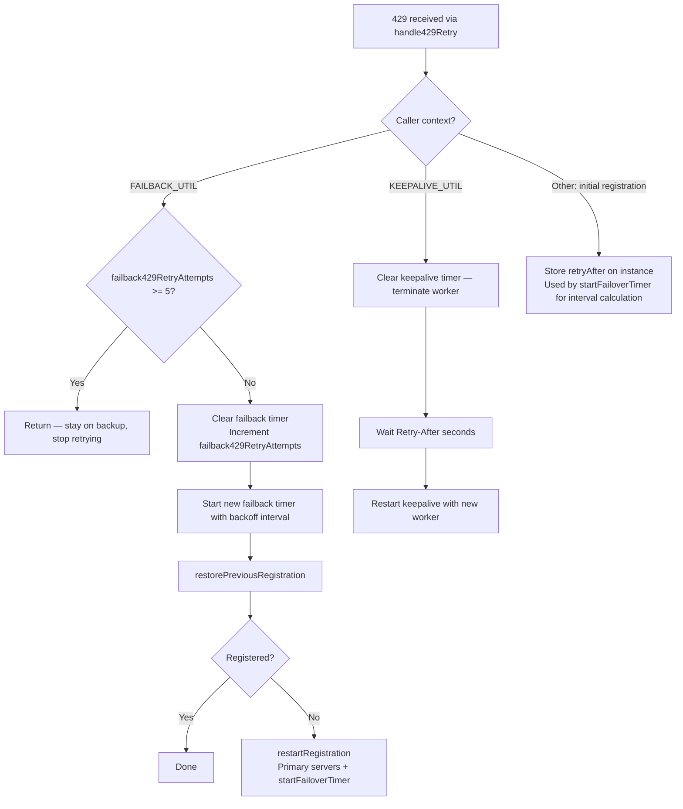
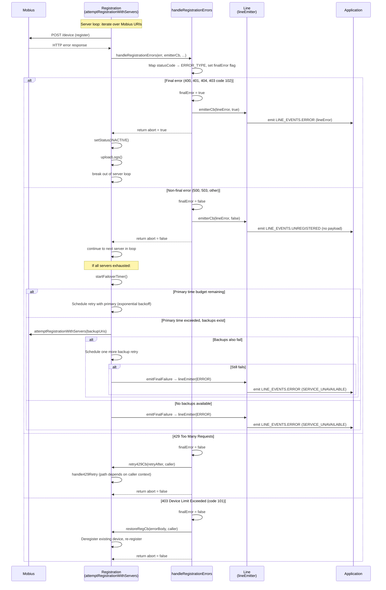
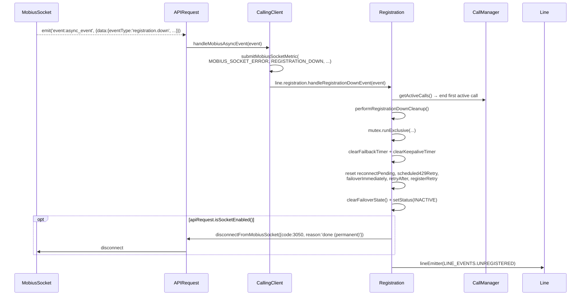

# Registration Module — Architecture

## Component Overview

The `Registration` class is the most complex subsystem in the CallingClient module. It manages the full lifecycle of device registration with Mobius, including initial registration, keepalive heartbeats, server failover, failback, 429 retry handling, and reconnection after network disruption.

## File Structure

```
registration/
├── index.ts               # Re-exports from register.ts
├── register.ts            # Registration class (main logic)
├── types.ts               # IRegistration, type aliases
├── webWorker.ts           # Keepalive worker (direct module)
├── webWorkerStr.ts        # Stringified worker for Blob URL
├── registerFixtures.ts    # Test fixtures
├── register.test.ts       # Unit tests
├── webWorker.test.ts      # Web Worker unit tests
└── ai-docs/
    ├── AGENTS.md          # Overview, API, examples
    └── ARCHITECTURE.md    # This file
```

---

### Responsibilities

| Concern | Implementation |
|---------|---------------|
| Initial registration | `triggerRegistration()` → `attemptRegistrationWithServers()` |
| Keepalive | Web Worker sends periodic `POST /status` |
| Failover (primary → backup) | `startFailoverTimer()` with exponential backoff |
| Failback (backup → primary) | `initiateFailback()` → `executeFailback()` |
| 429 handling | `Retry-After` header with retry budget |
| Reconnection | `handleConnectionRestoration()` / `reconnectOnFailure()` |
| Deregistration | `DELETE /devices/{id}` + worker termination |
| Mobius WSS connect/disconnect (when `apiRequest.isSocketEnabled()`) | Per-server `apiRequest.connectToMobiusSocket(wssNormalizedUrl)` inside `attemptRegistrationWithServers`; `apiRequest.disconnectFromMobiusSocket({code: 3050, reason: 'done (permanent)'})` on failover, failback, registration-down, restore-previous-registration, and deregister-with-`closeMobiusWss=true`. |

---

## Internal Architecture



---

## Registration Flow

### Initial Registration Sequence

```mermaid
sequenceDiagram
    participant Line as Line
    participant Reg as Registration
    participant API as APIRequest
    participant MS as MobiusSocket
    participant Mobius as Mobius API
    participant Worker as Web Worker

    Line->>Reg: triggerRegistration()
    activate Reg

    Reg->>Reg: attemptRegistrationWithServers(primaryUris)
    loop For each URI in primaryMobiusUris
        opt apiRequest.isSocketEnabled()
            Reg->>API: connectToMobiusSocket(wssNormalizedUrl)
            API->>MS: isConnected() ? reuse : MobiusSocket.connect(wssUri)
            MS-->>API: connected URL
            API-->>Reg: connectedWebSocketUrl
        end

        Reg->>API: makeRequest(POST /calling/web/device)
        alt WSS path
            API->>MS: sendWssRequest({type:'register', ...})
            MS-->>API: response_event subtype=register
            API-->>Reg: normalised WebexRequestPayload
        else HTTP path
            API->>Mobius: webex.request(POST /device)
            Mobius-->>API: 200 OK
            API-->>Reg: WebexRequestPayload
        end

        alt 200 OK
            Reg->>Reg: setStatus(ACTIVE)<br/>setActiveMobiusUrl(connectedWebSocketUrl || url)
            Reg->>Reg: Store deviceInfo

            Reg->>Worker: START_KEEPALIVE {token, url, interval}
            activate Worker
            Note over Worker: Starts periodic POST /status

            Reg->>Line: lineEmitter(REGISTERED, deviceInfo)
            Reg-->>Line: Registration complete
            deactivate Reg
        else Error (handled by handleRegistrationErrors)
            opt WSS path && shouldDisconnect && !final-server
                Reg->>API: disconnectFromMobiusSocket({code:3050, reason:'done (permanent)'})
                API->>MS: disconnect({code:3050, reason:'done (permanent)'})
            end
            Note over Reg: 429: stored Retry-After; 401/403(102)/404/400: abort;<br/>others: continue loop or schedule retry
        end
    end
```

> **WSS URL normalisation:** `Registration` strips any trailing `/` from the server URL before passing it to `apiRequest.connectToMobiusSocket(...)`. The connected URL returned by `MobiusSocket` is then re-suffixed with `/` and stored as `activeMobiusUrl` so subsequent comparisons (e.g. in `restorePreviousRegistration`) line up with the URI list.

### Failover Flow



### Failback Flow

```mermaid
sequenceDiagram
    participant Reg as Registration
    participant API as APIRequest
    participant MS as MobiusSocket
    participant Mobius1 as Primary Mobius
    participant Mobius2 as Backup Mobius (current)
    participant Worker as Web Worker
    participant Line as Line

    Note over Reg: Currently on backup, failback timer fires

    Reg->>Reg: executeFailback()
    Reg->>Mobius1: GET {primaryBase}ping (isPrimaryActive)

    alt Primary is back AND no active calls
        Mobius1-->>Reg: 200 OK
        Reg->>Reg: deregister()<br/>(DELETE /devices/{id} + clearKeepaliveTimer)
        Reg->>Mobius2: DELETE /devices/{id}

        opt apiRequest.isSocketEnabled()
            Reg->>API: disconnectFromMobiusSocket({code:3050, reason:'done (permanent)'})
            API->>MS: disconnect on backup WSS
        end

        Reg->>Reg: attemptRegistrationWithServers(FAILBACK_UTIL, primaryUris)
        opt registration succeeds
            Reg->>API: connectToMobiusSocket(primaryWssUrl)<br/>(if WSS enabled, inside attempt loop)
            Reg->>Reg: setActiveMobiusUrl(primaryUrl)
            Reg->>Worker: START_KEEPALIVE (on primary)
            Reg->>Line: lineEmitter(REGISTERED, deviceInfo)
        end
    else Primary still down or active calls present
        Mobius1-->>Reg: Failure
        Reg->>Reg: Reschedule failback timer
        Note over Reg: Stay on backup; do NOT disconnect WSS
    end
```

---

## Keepalive Web Worker

### Architecture

The keepalive runs in a **Web Worker** to ensure heartbeats are not blocked by main-thread work (long computations, UI rendering, etc.).



### Worker Messages

| Message | Direction | Payload | Description |
|---------|-----------|---------|-------------|
| `START_KEEPALIVE` | Main → Worker | `{interval, retryCountThreshold}` | Start the keepalive interval timer |
| `SEND_KEEPALIVE` | Worker → Main | _(none)_ | Timer fired — main thread should send the keepalive POST |
| `KEEPALIVE_RESULT` | Main → Worker | `{statusCode}` on success, `{err}` on failure | Result of the keepalive POST (sent by main thread after `apiRequest.makeRequest` resolves/rejects) |
| `CLEAR_KEEPALIVE` | Main → Worker | _(none)_ | Stop the keepalive interval; main thread also calls `worker.terminate()` |
| `KEEPALIVE_SUCCESS` | Worker → Main | `{statusCode}` | Keepalive succeeded **after a prior failure** (`retryCount > 0`); normal successes are silent |
| `KEEPALIVE_FAILURE` | Worker → Main | `{err, keepAliveRetryCount}` | Keepalive POST failed; `err` is the WebexRequestPayload-shaped error |

### Worker Creation

The worker is created from a stringified JavaScript source to avoid separate file bundling:

```typescript
// webWorkerStr.ts contains the worker code as a string
const blob = new Blob([webWorkerStr], {type: 'application/javascript'});
const url = URL.createObjectURL(blob);
this.webWorker = new Worker(url);
URL.revokeObjectURL(url);
```

### Keepalive Failure Handling

When the main thread receives `KEEPALIVE_FAILURE`:

1. **Submit metrics** and run `handleRegistrationErrors` to classify the error (fatal vs. non-fatal vs. 429).
2. **If abort (fatal) OR retryCount ≥ threshold** (`4` for contact-center, `5` otherwise):
   - Set status to `INACTIVE`, terminate the keepalive worker
   - Emit `LINE_EVENTS.UNREGISTERED` via `lineEmitter`
   - If **non-fatal threshold exceeded** (not `abort`): call `reconnectOnFailure()` for full re-registration
   - If **fatal + 404**: call `handle404KeepaliveFailure()` for a fresh registration attempt
3. **If below threshold** (non-fatal and retryCount < threshold): emit `LINE_EVENTS.RECONNECTING` via `lineEmitter` and wait for the next keepalive cycle

---

## Reconnection

### reconnectOnFailure()

Called when keepalive failures exceed the threshold or when CallingClient detects all calls have cleared after a network disruption.



### handleConnectionRestoration()

Called by `CallingClient` after Mercury reconnection. Runs inside `mutex.runExclusive`.



---

## 429 Retry Logic

`handle429Retry(retryAfter, caller)` handles 429 differently depending on the calling context:



---

## Key Constants

| Constant | Value | Description |
|----------|-------|-------------|
| `DEFAULT_KEEPALIVE_INTERVAL` | 30s | Default keepalive frequency |
| `REG_TRY_BACKUP_TIMER_VAL_IN_SEC` | 114s | Time before trying backup servers |
| `REG_FAILBACK_429_MAX_RETRIES` | 5 | Max 429 retries before failover |
| `BASE_REG_RETRY_TIMER_VAL_IN_SEC` | 30 | Base retry timer (seconds) |
| `BASE_REG_TIMER_MFACTOR` | 2 | Multiplication factor for exponential backoff |
| `REG_RANDOM_T_FACTOR_UPPER_LIMIT` | 10000 | Randomization upper bound (milliseconds) |
| `RETRY_TIMER_UPPER_LIMIT` | 60 | Max retry timer value (seconds) |

---

## Error Handling

Registration errors are mapped through `handleRegistrationErrors()`. Fatal errors (`abort = true`) stop the registration loop and emit `LINE_EVENTS.ERROR`. Non-fatal errors allow the loop to continue to the next server or schedule a retry via the failover timer.

| HTTP Status | ERROR_TYPE | Fatal? | Action |
|-------------|-----------|--------|--------|
| 400 | `BAD_REQUEST` | Yes | Abort — emit error |
| 401 | `TOKEN_ERROR` | Yes | Abort — emit error (token expired/invalid) |
| 403 (code 101) | `FORBIDDEN_ERROR` | No | Device limit exceeded — `restoreRegistrationCallBack`: deregister existing + re-register |
| 403 (code 102) | `FORBIDDEN_ERROR` | Yes | Device creation disabled — abort, emit error |
| 403 (code 103/other) | `FORBIDDEN_ERROR` | No | Device creation failed — continue retry |
| 404 | `NOT_FOUND` | Yes | Abort — emit error |
| 429 | `TOO_MANY_REQUESTS` | No | Call `handle429Retry` with `Retry-After` value |
| 500 | `SERVER_ERROR` | No | Continue to next server or schedule retry |
| 503 | `SERVICE_UNAVAILABLE` | No | Continue to next server or schedule retry |
| Other | `DEFAULT` | No | Continue to next server or schedule retry |

### Final vs Non-Final Error Flow



> **Source references:**
> - Server loop and error branching: `attemptRegistrationWithServers` in `src/CallingClient/registration/register.ts`
> - Error classification and callback invocation: `handleRegistrationErrors` in `src/common/Utils.ts`
> - Failover timer and final failure: `startFailoverTimer` in `register.ts`, `emitFinalFailure` in `src/common/Utils.ts`
> - `lineEmitter` branching on `finalError`: the `emitterCb` closure in `attemptRegistrationWithServers` — emits `LINE_EVENTS.ERROR` for `finalError = true`, `LINE_EVENTS.UNREGISTERED` for `finalError = false`

---

## Mobius WSS Touch Points

When `apiRequest.isSocketEnabled()` is true (driven by `isMobiusWssEnabled(webex)` — see [`CallingClient/ai-docs/ARCHITECTURE.md`](../../ai-docs/ARCHITECTURE.md#4-transport-selection-http-vs-mobius-wss)), the `Registration` class becomes responsible for sequencing the Mobius WebSocket connection alongside the registration POST / DELETE.

### When Registration Connects / Disconnects the WSS

| Flow | WSS action | Code path |
|---|---|---|
| `attemptRegistrationWithServers` (each server iteration) | `apiRequest.connectToMobiusSocket(wssNormalizedUrl)` before `postRegistration` | `register.ts ~ L994–L1010` |
| Registration error with `shouldDisconnect = true` (non-final, not last server in list, not 429) | `apiRequest.disconnectFromMobiusSocket({code: 3050, reason: 'done (permanent)'})` | `register.ts ~ L1085–L1098` |
| `restorePreviousRegistration` when the connected WSS URL differs from `activeMobiusUrl` | disconnect first, then re-attempt | `register.ts ~ L308–L321` |
| `startFailoverTimer` switching primary → backup | disconnect primary WSS before backup re-registration | `register.ts ~ L508–L520` |
| `executeFailback` primary recovered + no active calls | disconnect backup WSS before primary re-registration | `register.ts ~ L713–L725` |
| `deregister(closeMobiusWss = true)` | disconnect WSS after DELETE returns | `register.ts ~ L1264–L1270` |
| `performRegistrationDownCleanup` (after Mobius async `registration.down`) | disconnect WSS as final cleanup step | `register.ts ~ L1411–L1419` |

### Constants Used

| Value | Meaning |
|---|---|
| `{code: 3050, reason: 'done (permanent)'}` | The convention `CallingClient` and `Registration` pass to `apiRequest.disconnectFromMobiusSocket(...)` to indicate a permanent teardown. `MobiusSocket` treats this as `offline.permanent` (no auto-reconnect) — distinct from `'idle'` / `'done (forced)'` which are transient and reconnectable. |
| `URL replace 'https://' → 'wss://'` | Used in `getExistingDevice` (403/101 device-limit branch) to keep `activeMobiusUrl` aligned with the WSS scheme when the socket is enabled. |
| `url.endsWith('/') ? slice(0,-1) : url` | URL normalisation applied by `attemptRegistrationWithServers` before calling `connectToMobiusSocket`, then re-suffixed with `/` for `setActiveMobiusUrl`. |

### Mobius `registration.down` Async Event



> **Note:** The synthetic `MOBIUS_SOCKET_4001_EVENT` envelope emitted when the server closes the socket with code `4001` carries `eventType: 'registration.down'` and therefore drives the **same** cleanup path as a server-pushed async `registration.down`. See [`mobius-socket/ai-docs/ARCHITECTURE.md`](../../../mobius-socket/ai-docs/ARCHITECTURE.md) for the close-code matrix.

---

## Related Documentation

- [Registration AGENTS.md](./AGENTS.md) — Public API, key concepts
- [Line ARCHITECTURE.md](../../line/ai-docs/ARCHITECTURE.md) — lineEmitter pattern, Line ↔ Registration interaction
- [CallingClient ARCHITECTURE.md](../../ai-docs/ARCHITECTURE.md) — Network resilience, initialization, transport selection
- [`mobius-socket` AGENTS.md](../../../mobius-socket/ai-docs/AGENTS.md) — Public API for the WebSocket transport
- [`mobius-socket` ARCHITECTURE.md](../../../mobius-socket/ai-docs/ARCHITECTURE.md) — Internals (backoff, dedup, close-code matrix, shutdown switchover, token refresh)
