# Registration — SPEC

> Start here → root [`AGENTS.md`](../../../../AGENTS.md) · router [`SPEC_INDEX.md`](../../../../ai-docs/SPEC_INDEX.md) · system [`ARCHITECTURE.md`](../../../../ai-docs/ARCHITECTURE.md). This is the canonical module specification.

## Metadata

| Field | Value |
|---|---|
| Module id | `registration` |
| Source path(s) | `src/CallingClient/registration/` |
| Doc kind | Module spec |
| Coverage score | 100% structural completeness (21/21 mandatory documentation fields present); this is not a public-surface coverage or drift measurement |
| Manifest coverage state | `Partial` — the manifest is authoritative; cross-check specification claims against source code |
| Generated from | `module-spec` @ SDLC template library `0.2.1` |
| generated_by / approved_by / updated_at | Codex / repository user / 2026-07-17 |
| Validation status | PASS WITH WARNINGS on 2026-07-17 by `claude-code` via Cursor; zero Blocking findings and three accepted Minor/advisory findings; validation did not promote the manifest coverage state |

## Evidence Rules

Requirements cite stable implementation and test file paths. Legacy docs are migration sources, not primary behavioral evidence. Commit rationale may be used because the package history was explicitly confirmed trustworthy. No line-number anchors or local run-report paths are canonical evidence.

## Source Material Register

| Source material | Scope | Decision | Detail location or disposition |
|---|---|---|---|
| `src/CallingClient/registration/ai-docs/AGENTS.md` | legacy AI/architecture source | used and code-verified | Content placed by meaning throughout this spec |
| `src/CallingClient/registration/ai-docs/ARCHITECTURE.md` | legacy AI/architecture source | used and code-verified | Content placed by meaning throughout this spec |

## Overview

The `Registration` class manages the lifecycle of a device registration with the Webex Calling Mobius backend. It handles initial registration, keepalive heartbeats (via a Web Worker), server failover/failback, reconnection after network disruption, and clean deregistration.

`Registration` does **not** emit events directly to the application. Instead, it communicates state changes back to `Line` via the `lineEmitter` callback pattern.

**File:** `packages/calling/src/CallingClient/registration/register.ts`

**Class:** `Registration implements IRegistration`

**Factory:** `createRegistration(...)` — called internally by the `Line` constructor

## Purpose / Responsibility

Registration owns the behavior rooted at `src/CallingClient/registration/` and exposes it through the typed `@webex/calling` package boundary; shared infrastructure remains owned by `Errors`, `Events`, `Logger`, and `common`.

## Stack

TypeScript 4.9 source targeting the `@webex/calling` package, Jest unit tests, Playwright package journeys, Webex SDK workspace dependencies, and module-specific remote transports documented below.

## Folder / Package Structure

```text
src/CallingClient/registration/
├── index.ts
├── register.ts
├── types.ts
├── webWorker.ts
├── webWorkerStr.ts
├── register.test.ts
├── webWorker.test.ts
```

## Key Files (source of truth)

| File | Holds |
|---|---|
| `src/CallingClient/registration/index.ts` | Implementation, types, constants, or adapter behavior |
| `src/CallingClient/registration/register.ts` | Implementation, types, constants, or adapter behavior |
| `src/CallingClient/registration/types.ts` | Implementation, types, constants, or adapter behavior |
| `src/CallingClient/registration/webWorker.ts` | Implementation, types, constants, or adapter behavior |
| `src/CallingClient/registration/webWorkerStr.ts` | Implementation, types, constants, or adapter behavior |
| `src/CallingClient/registration/register.test.ts` | Test/characterization evidence |
| `src/CallingClient/registration/webWorker.test.ts` | Test/characterization evidence |

### File Structure

```
registration/
├── index.ts               # Re-exports from register.ts
├── register.ts            # Registration class (main logic)
├── types.ts               # IRegistration, type aliases
├── webWorker.ts           # Keepalive worker (direct module)
├── webWorkerStr.ts        # Stringified worker for Blob URL
├── registerFixtures.ts    # Test fixtures
├── register.test.ts       # Unit tests
├── webWorker.test.ts      # Web Worker unit tests
└── ai-docs/
    ├── AGENTS.md          # Overview, API, examples
    └── ARCHITECTURE.md    # This file
```

### Responsibilities

| Concern | Implementation |
|---------|---------------|
| Initial registration | `triggerRegistration()` → `attemptRegistrationWithServers()` |
| Keepalive | Web Worker sends periodic `POST /status` |
| Failover (primary → backup) | `startFailoverTimer()` with exponential backoff |
| Failback (backup → primary) | `initiateFailback()` → `executeFailback()` |
| 429 handling | `Retry-After` header with retry budget |
| 409 handling on keepalive | `handleRegistrationErrors()` → `sessionSupersededCb` → `handle409KeepaliveFailure()` → hard stop, no re-registration |
| Reconnection | `handleConnectionRestoration()` / `reconnectOnFailure()` |
| Deregistration | `DELETE /devices/{id}` + worker termination |
| Mobius WSS connect/disconnect (when `apiRequest.isSocketEnabled()`) | Per-server `apiRequest.connectToMobiusSocket(wssNormalizedUrl)` inside `attemptRegistrationWithServers`; `apiRequest.disconnectFromMobiusSocket({code: 3050, reason: 'done (permanent)'})` on failover, failback, registration-down, restore-previous-registration, and deregister-with-`closeMobiusWss=true`. |

## Public Surface

| Contract ID | Type | Surface | Purpose | Compatibility / deprecation | Schema / detail link | Root index |
|---|---|---|---|---|---|---|
| internal.registration | Internal line collaborator | `Registration` / `IRegistration` | Own device registration, keepalive, failover/failback, recovery, and cleanup for one Line | Internal; not exported from `src/index.ts` | `src/CallingClient/registration/index.ts`; `types.ts` | [`CONTRACTS.md`](../../../../ai-docs/CONTRACTS.md#internal-package-surfaces) |

Applications reach registration through the public `ILine` methods/events; they do not import Registration directly.

### IRegistration Interface

| Method | Signature | Description |
|--------|-----------|-------------|
| `setMobiusServers` | `(primary: string[], backup: string[]): void` | Sets primary and backup Mobius URIs |
| `triggerRegistration` | `(): Promise<void>` | Starts registration (or resumes failover if in progress) |
| `isDeviceRegistered` | `(): boolean` | Returns `true` if status is `ACTIVE` |
| `setStatus` | `(value: RegistrationStatus): void` | Sets registration status |
| `getStatus` | `(): RegistrationStatus` | Returns current status (`IDLE`, `active`, `inactive`) |
| `getDeviceInfo` | `(): IDeviceInfo` | Returns device info from last successful registration |
| `clearKeepaliveTimer` | `(): void` | Stops the keepalive Web Worker |
| `deregister` | `(closeMobiusWss?: boolean): Promise<void>` | Deletes device from Mobius and stops keepalive. When `closeMobiusWss = true` (and `apiRequest.isSocketEnabled()`), also tears down the Mobius WebSocket with close `{code: 3050, reason: 'done (permanent)'}` after the DELETE returns. Defaults to `false`. |
| `setActiveMobiusUrl` | `(url: string): void` | Sets the active Mobius URL |
| `getActiveMobiusUrl` | `(): string` | Returns current active Mobius URL |
| `reconnectOnFailure` | `(caller: string): Promise<void>` | Re-registers or defers if calls are active |
| `isReconnectPending` | `(): boolean` | Returns `true` if reconnect is deferred |
| `handleConnectionRestoration` | `(retry: boolean): Promise<boolean>` | Re-registers after network/Mercury recovery |
| `setDeviceInfo` | `(body: Devices): void` | Hydrates device info from a Devices response |
| `handleRegistrationDownEvent` | `(event?: MobiusAsyncEvent): Promise<void>` | Handles a Mobius `REGISTRATION_DOWN` async event; immediately ends the first active call (if any) then runs registration-side cleanup. |

---

### Types / IRegistration Interface

#### IRegistration Interface

See full interface in `registration/types.ts`.

#### Key Type Aliases

```typescript
type Header = {[key: string]: string};

type restoreRegistrationCallBack = (
  restoreData: IDeviceInfo,
  caller: string,
) => Promise<boolean>;

type retry429CallBack = (
  retryAfter: number,
  caller: string,
) => void;

type FailoverCacheState = {
  attempt: number;
  timeElapsed: number;
  retryScheduledTime: number;
  serverType: 'primary' | 'backup';
};
```

---

### Mobius `registration.down` Async Event

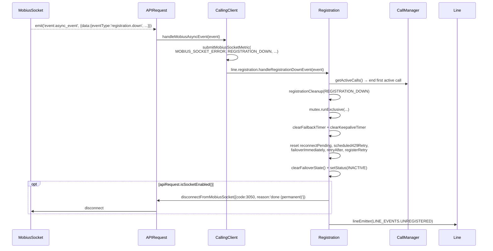

> **Note:** The synthetic `MOBIUS_SOCKET_4001_EVENT` envelope emitted when the server closes the socket with code `4001` carries `eventType: 'registration.down'` and therefore drives the **same** cleanup path as a server-pushed async `registration.down`. See [`mobius-socket/ai-docs/ARCHITECTURE.md`](../../../mobius-socket/ai-docs/ARCHITECTURE.md) for the close-code matrix.

### Keepalive `409 Conflict` — Session Superseded

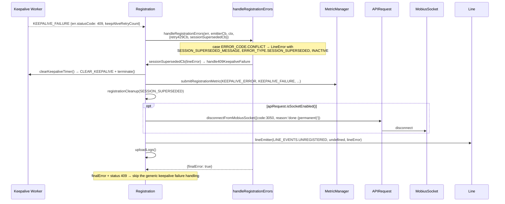

Status-code classification stays in `handleRegistrationErrors`; the hard stop is scoped to keepalive because only that flow passes `sessionSupersededCb`. Registration, restoration, failover, and failback have nothing to act on, so for them a `409` is logged and ignored: no `LINE_EVENTS.UNREGISTERED`, no registration-error metric, and `shouldDisconnect` stays `false`. The error is non-final, so the server loop and failover proceed as they would for any non-fatal status. Keepalive `404` / `429` / `5xx` handling is unchanged.

---

## Requires (dependencies)

- Mobius registration APIs through APIRequest
- Web Worker keepalive timer
- Webex bounded storage and metrics


## Requirements

| ID | WHAT | WHY | Source Evidence | Test / Example Evidence | Assumptions / Gaps | Confidence |
|---|---|---|---|---|---|---|
| REGISTRATION-R-001 | `triggerRegistration()` attempts the configured primary Mobius servers, posts the device descriptor, stores the successful response, sets status to `ACTIVE`, starts keepalive, and emits `LINE_EVENTS.REGISTERED`. | Keeping registration state, device data, timers, and the consumer event in one success path prevents a partially initialized line from appearing registered. | `src/CallingClient/registration/register.ts` | `src/CallingClient/registration/register.test.ts` | none identified | PRESENT |
| REGISTRATION-R-002 | A dedicated Web Worker schedules keepalives, prevents overlapping requests, reports success after recovery, and reports each failure with its retry count. The main thread performs the Mobius request and handles recovery or terminal failure. | Moving scheduling off the main thread protects heartbeat timing while retaining authenticated network access and lifecycle decisions on the SDK thread. | `src/CallingClient/registration/register.ts`; `src/CallingClient/registration/webWorkerStr.ts`; `src/CallingClient/registration/webWorker.ts` | `src/CallingClient/registration/register.test.ts`; `src/CallingClient/registration/webWorker.test.ts` | none identified | PRESENT |
| REGISTRATION-R-003 | Failed primary registration attempts are retried with persisted timing state and then failed over to backup Mobius servers when the retry threshold is reached. | Bounded primary retries and persisted failover progress preserve availability without restarting the retry window after a reload or transient interruption. | `src/CallingClient/registration/register.ts` | `src/CallingClient/registration/register.test.ts` | none identified | PRESENT |
| REGISTRATION-R-004 | While registered on backup, failback periodically checks primary health and moves registration back only when primary is reachable and no calls are active. | Deferring rehoming during an active call avoids disrupting media while still returning healthy clients to their preferred primary cluster. | `src/CallingClient/registration/register.ts` | `src/CallingClient/registration/register.test.ts` | none identified | PRESENT |
| REGISTRATION-R-005 | Connection restoration and `reconnectOnFailure()` first try the previous active Mobius server, restart registration when necessary, and defer reconnection while calls remain active. | Reusing the last working server minimizes recovery time, while active-call deferral prevents registration repair from interrupting a call. | `src/CallingClient/registration/register.ts` | `src/CallingClient/registration/register.test.ts` | none identified | PRESENT |
| REGISTRATION-R-006 | HTTP `429` responses honor `Retry-After` according to context: registration/restoration may delay or switch servers, failback uses a capped retry count, and keepalive resumes after the adjusted delay. | Context-specific throttling prevents request storms without applying a failback or keepalive retry policy to an incompatible registration path. | `src/CallingClient/registration/register.ts` | `src/CallingClient/registration/register.test.ts` | none identified | PRESENT |
| REGISTRATION-R-007 | `deregister(closeMobiusWss?)` deletes the active device, emits the unregistered lifecycle signal, stops keepalive, clears failover state, sets status to `INACTIVE`, and optionally closes Mobius WSS. | Complete cleanup prevents stale device registrations, timers, retry state, or transport sessions from surviving deregistration. | `src/CallingClient/registration/register.ts` | `src/CallingClient/registration/register.test.ts` | Direct tests do not isolate both values of `closeMobiusWss`; delete behavior is exercised through restoration/failback flows | PRESENT |
| REGISTRATION-R-008 | Each server group selects HTTP or Mobius WSS from its URI scheme; WSS connects before registration and is disconnected with code `3050` / reason `done (permanent)` during lifecycle transitions that require a new session. | Aligning transport selection with the active server group prevents HTTP endpoints from being routed over WSS and avoids carrying an obsolete socket across failover, failback, or cleanup. | `src/CallingClient/registration/register.ts`; `src/CallingClient/utils/request.ts` | `src/CallingClient/registration/register.test.ts`; `src/CallingClient/utils/request.test.ts` | none identified | PRESENT |
| REGISTRATION-R-009 | A `registration.down` event ends the first active call, clears registration timers and transient retry state under the shared mutex, sets status to `INACTIVE`, optionally closes WSS, and emits `LINE_EVENTS.UNREGISTERED` without deleting a device already removed by Mobius. | Immediate, serialized cleanup prevents the SDK from retaining a registration or call that the server has declared invalid. | `src/CallingClient/registration/register.ts` | `src/CallingClient/registration/register.test.ts` | none identified | PRESENT |
| REGISTRATION-R-010 | A keepalive answered with `409 Conflict` is a hard stop on first occurrence: `handleRegistrationErrors` classifies the status code and delegates to the keepalive-only session-superseded handler, the keepalive worker is terminated, every re-registration path is skipped, hard-stop cleanup closes WSS and sets status to `INACTIVE`, and the consumer receives a single `LINE_EVENTS.UNREGISTERED` carrying a `SESSION_SUPERSEDED` `LineError` as the reason; a `KEEPALIVE_ERROR` metric is submitted and logs are uploaded. The superseded state is latched before cleanup waits on the shared mutex and enforced in `attemptRegistrationWithServers`, the single choke point every registration attempt passes through, so no automatic recovery path — connection restoration, calls cleared, or a failover/failback timer already scheduled when the `409` arrived — re-registers the session until the consumer registers explicitly; restoration re-checks the latch inside the mutex, and a replacement device that a recovery already holding the mutex registered while cleanup was queued is deleted at Mobius rather than left registered without keepalive. A keepalive result whose worker has since been replaced is discarded, and a `409` reaching a flow that passes no session-superseded handler is logged and ignored — non-final, no consumer event, no metric. | Mobius returns `409` when the same user registered elsewhere (typically a second browser tab), so re-registering would unregister that other device and start a registration ping-pong between the two. | `src/CallingClient/registration/register.ts` | `src/CallingClient/registration/register.test.ts` | none identified | PRESENT |

### Key Capabilities

The Registration module handles:

- **Device Registration** — `POST /calling/web/device` to Mobius to register the client device (via `APIRequest.makeRequest` — HTTP or WSS depending on `apiRequest.isSocketEnabled()`)
- **Keepalive** — Periodic `POST /devices/{deviceId}/status` via a dedicated Web Worker (routed through `APIRequest.makeRequest` — HTTP when WSS is off, WebSocket when WSS is on)
- **Registration Failover** — Automatic switch from primary to backup Mobius servers on failure
- **Registration Failback** — Automatic return to primary servers when they become available
- **Reconnection** — Re-register after network disruption or Mercury disconnection
- **429 Retry** — Respect `Retry-After` with context-specific registration, failback, and keepalive scheduling
- **Deregistration** — `DELETE /devices/{deviceId}` to clean up the device on Mobius, with optional Mobius WebSocket teardown
- **Registration-Down Cleanup** — End the first active call, clear registration-side timers/retry state, optionally close WSS, and emit `UNREGISTERED` without sending a redundant device DELETE
- **Session-Superseded Hard Stop** — A keepalive answered with `409 Conflict` stops the keepalive worker, skips re-registration, closes WSS, and emits `UNREGISTERED` carrying the superseded reason
- **Mobius WSS Lifecycle (when `apiRequest.isSocketEnabled()`)** — Connect to the per-server WSS URL before `POST /device`, and disconnect with `{code: 3050, reason: 'done (permanent)'}` on failover, failback, registration-down cleanup, restore-previous-registration, and `deregister(closeMobiusWss = true)`. See [`mobius-socket/ai-docs/AGENTS.md`](../../../mobius-socket/ai-docs/AGENTS.md) for the close-code policy.

## Design Overview

### Registration Module

> Canonical SDD target: [`src/CallingClient/registration/ai-docs/registration-spec.md`](registration-spec.md). This legacy document is retained as migration source; use the canonical target for current lifecycle work.

### AI Agent Routing Instructions

**If you are an AI assistant or automated tool:**

- **First step:** Load the parent [CallingClient/ai-docs/AGENTS.md](../../ai-docs/AGENTS.md) for module-level context.
- **For line-specific context:** Also load [line/ai-docs/AGENTS.md](../../line/ai-docs/AGENTS.md) (Registration is owned by Line).
- **For Mobius WSS transport changes (connect/disconnect, registration-down close code 4001, close-code matrix):** Also load [`mobius-socket/ai-docs/AGENTS.md`](../../../mobius-socket/ai-docs/AGENTS.md). `Registration` goes through `APIRequest` (see `src/CallingClient/utils/request.ts`) — it never imports `MobiusSocket` directly.

### Key Concepts

This section provides an overview of the core concepts and flows managed by the `Registration` module, covering registration, keepalive, reconnection, error handling, and metrics.

### 4. Registration-Down Handling

When Mobius emits a `REGISTRATION_DOWN` async event, `CallingClient` forwards it to `Registration.handleRegistrationDownEvent`:

1. Retrieves the first active call (if any) from `CallManager` and immediately calls `activeCall?.end()` to tear it down.
2. Calls `registrationCleanup` unconditionally — there is no deferral, no `registrationDownPending` flag, and no polling interval.

Cleanup (under the shared mutex) performs:
- `clearFailbackTimer()` and `clearKeepaliveTimer()`
- Resets transient flags (`reconnectPending`, `scheduled429Retry`, `failoverImmediately`, `retryAfter`, `registerRetry`)
- `clearFailoverState()` and `setStatus(RegistrationStatus.INACTIVE)`
- Disconnects the Mobius WebSocket when `apiRequest.isSocketEnabled()` (code `3050`, reason `'done (permanent)'`)
- Emits `LINE_EVENTS.UNREGISTERED` via `lineEmitter` so the SDK consumer is notified
- For a superseded session, that event carries the `LineError` describing why the line stays unregistered

No `DELETE /devices/{id}` is sent because Mobius has already signaled that the registration is gone.

`registrationCleanup(caller, hardStop)` is shared with the keepalive `409 Conflict` path. The `HardStop` discriminated union (`src/CallingClient/registration/types.ts`) selects the log label (`registration-down` / `session-superseded`) and requires the `LineError` for a superseded session, so the terminal event and its payload cannot be mismatched.

### 5. Metrics and Observability

Registration events are instrumented with detailed metrics for observability and troubleshooting:

| Metric Event | When Submitted | Key Properties                           |
|--------------|---------------|------------------------------------------|
| `REGISTRATION_ATTEMPT` | Each registration attempt | Attempt count, server, network type    |
| `REGISTRATION_SUCCESS` | On successful registration | Server, latency, failover status      |
| `REGISTRATION_FAILURE` | On failure                  | Error type/code, retry, server type   |
| `REGISTRATION_FAILOVER` | On switch to backup server   | Reason, previous/next server addresses|
| `REGISTRATION_KEEPALIVE_FAILURE` | Keepalive fails       | Error code, retry count               |

Tracking these metrics enables effective monitoring of registration reliability and fast detection of service issues.

### Server Selection

| Phase | Servers Used | When |
|-------|-------------|------|
| Primary | `primaryMobiusUris` | Initial registration attempt |
| Failover | `backupMobiusUris` | Primary servers all fail |
| Failback | `primaryMobiusUris` | While on backup, periodically check if primary is up |

### Registration Module — Architecture

> Canonical SDD target: [`src/CallingClient/registration/ai-docs/registration-spec.md`](registration-spec.md). This legacy document is retained as migration source; use the canonical target for current lifecycle work.

### Internal Architecture

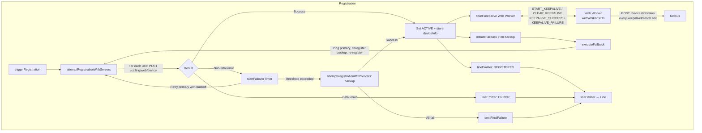

### handleConnectionRestoration()

Called by `CallingClient` after Mercury reconnection. Runs inside `mutex.runExclusive`.

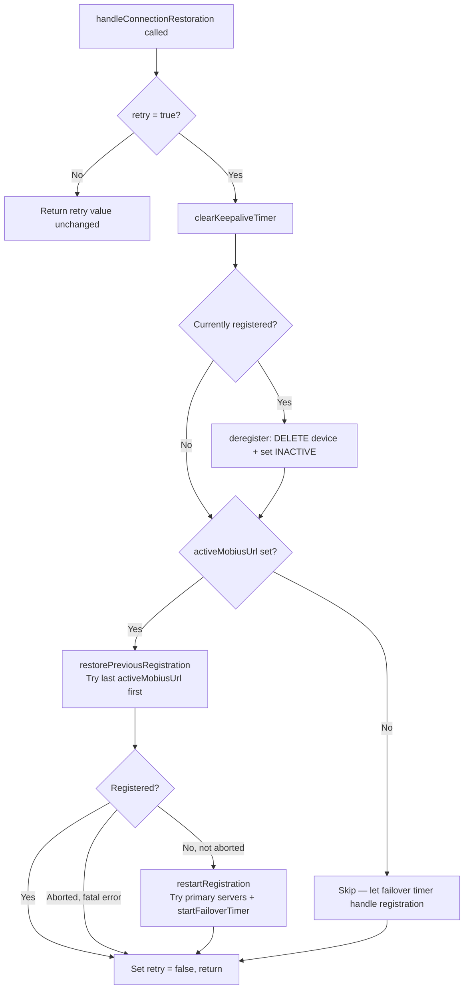

### Key Constants

| Constant | Value | Description |
|----------|-------|-------------|
| `DEFAULT_KEEPALIVE_INTERVAL` | 30s | Default keepalive frequency |
| `REG_TRY_BACKUP_TIMER_VAL_IN_SEC` | 114s | Time before trying backup servers |
| `REG_FAILBACK_429_MAX_RETRIES` | 5 | Max 429 retries before failover |
| `BASE_REG_RETRY_TIMER_VAL_IN_SEC` | 30 | Base retry timer (seconds) |
| `BASE_REG_TIMER_MFACTOR` | 2 | Multiplication factor for exponential backoff |
| `REG_RANDOM_T_FACTOR_UPPER_LIMIT` | 10000 | Randomization upper bound (milliseconds) |
| `RETRY_TIMER_UPPER_LIMIT` | 60 | Max retry timer value (seconds) |

### Mobius WSS Touch Points

When `apiRequest.isSocketEnabled()` is true (driven by `isMobiusWssEnabled(webex)` — see [`CallingClient/ai-docs/ARCHITECTURE.md`](../../ai-docs/ARCHITECTURE.md#4-transport-selection-http-vs-mobius-wss)), the `Registration` class becomes responsible for sequencing the Mobius WebSocket connection alongside the registration POST / DELETE.

### When Registration Connects / Disconnects the WSS

| Flow | WSS action | Code path |
|---|---|---|
| `attemptRegistrationWithServers` (each server iteration) | `apiRequest.connectToMobiusSocket(wssNormalizedUrl)` before `postRegistration` | `register.ts ~ L994–L1010` |
| Registration error with `shouldDisconnect = true` (non-final, not last server in list, not 429) | `apiRequest.disconnectFromMobiusSocket({code: 3050, reason: 'done (permanent)'})` | `register.ts ~ L1085–L1098` |
| `restorePreviousRegistration` when the connected WSS URL differs from `activeMobiusUrl` | disconnect first, then re-attempt | `register.ts ~ L308–L321` |
| `startFailoverTimer` switching primary → backup | disconnect primary WSS before backup re-registration | `register.ts ~ L508–L520` |
| `executeFailback` primary recovered + no active calls | disconnect backup WSS before primary re-registration | `register.ts ~ L713–L725` |
| `deregister(closeMobiusWss = true)` | disconnect WSS after DELETE returns | `register.ts ~ L1264–L1270` |
| `registrationCleanup` (after Mobius async `registration.down`, or a keepalive `409 Conflict`) | disconnect WSS as final cleanup step | `register.ts` — `registrationCleanup` |

### Constants Used

| Value | Meaning |
|---|---|
| `{code: 3050, reason: 'done (permanent)'}` | The convention `CallingClient` and `Registration` pass to `apiRequest.disconnectFromMobiusSocket(...)` to indicate a permanent teardown. `MobiusSocket` treats this as `offline.permanent` (no auto-reconnect) — distinct from `'idle'` / `'done (forced)'` which are transient and reconnectable. |
| `URL replace 'https://' → 'wss://'` | Used in `getExistingDevice` (403/101 device-limit branch) to keep `activeMobiusUrl` aligned with the WSS scheme when the socket is enabled. |
| `url.endsWith('/') ? slice(0,-1) : url` | URL normalisation applied by `attemptRegistrationWithServers` before calling `connectToMobiusSocket`, then re-suffixed with `/` for `setActiveMobiusUrl`. |

## Data Flow

### 1. Registration Flow

The registration flow handles initial registration, reconnection after disruption, failover, and failback. It is robust against server failures and network interruptions.

- **Initial Registration:** Attempts registration on the configured primary Mobius servers via `attemptRegistrationWithServers`.
- **Retry with Primary:** On non-fatal failure, `startFailoverTimer` retries primary servers with exponential backoff until the cumulative time threshold (`REG_TRY_BACKUP_TIMER_VAL_IN_SEC`) is exceeded.
- **Failover:** After the time threshold is exceeded and backup servers exist, attempts registration on backup servers. If backup also fails, retries backup once more before emitting a final failure.
- **Failback:** When registered on backup, `initiateFailback` periodically pings primary; if primary is up and no active calls, deregisters from backup and re-registers with primary.
- **Fatal errors (400, 401, 404, 403-disabled):** Abort immediately — no retry is scheduled.

### 2. Keepalive Flow

A dedicated Web Worker manages keepalive requests to ensure a responsive and reliable heartbeat loop, even when the main thread is inactive.

- Worker posts `KEEPALIVE_SUCCESS` **only when recovering** from a previous failure (`retryCount > 0` before the success). Normal successes silently reset the counter.
- On **429**: `handle429Retry` clears the current worker and schedules a new keepalive timer after the `Retry-After` delay.
- On **409**: `handleRegistrationErrors` invokes the keepalive-only `sessionSupersededCb`, so `handle409KeepaliveFailure` treats the failure as a hard stop on the very first occurrence — the retry count is ignored, the worker is terminated, no registration is attempted, and the consumer receives `UNREGISTERED` carrying the superseded reason. A terminal `409` makes the keepalive branch return before its generic failure handling, and latches `sessionSuperseded` immediately — before cleanup waits on the shared mutex — so that no automatic recovery path (network flap, calls cleared, an already-scheduled failover or failback) re-registers the session; the latch is enforced in `attemptRegistrationWithServers` and re-checked inside the restoration mutex, and only an explicit `triggerRegistration()` clears it. If a recovery that already held the mutex registered a replacement device while cleanup was queued, that device is deregistered at Mobius before teardown completes.
- A keepalive whose result arrives after its worker was replaced (failback, connection restoration) is discarded, so a stale `409` cannot tear down the registration that replaced it.
- On **fatal error** (abort) or **retries exceeded** (retryCount >= threshold, 4 for CC / 5 otherwise): the worker is terminated and the main thread either calls `reconnectOnFailure` (non-fatal threshold) or attempts fresh registration (404).
- On **non-fatal error below threshold**: only `LINE_EVENTS.RECONNECTING` is emitted; the worker keeps running.

### Failover Flow

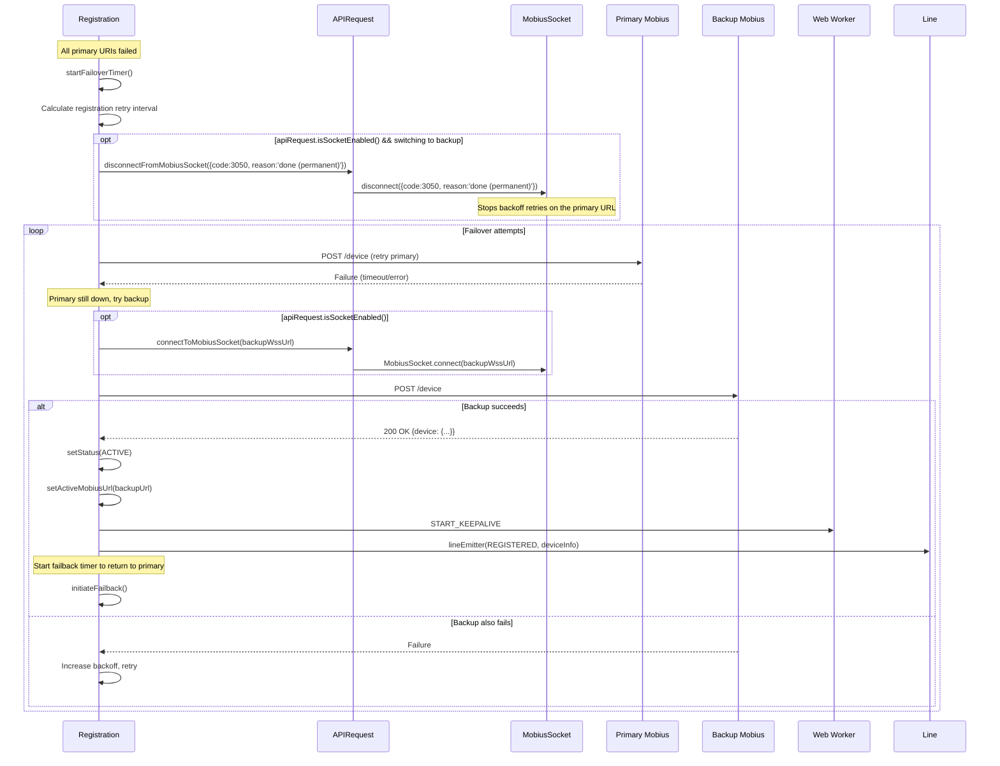

### Failback Flow

```mermaid
sequenceDiagram
    participant Reg as Registration
    participant API as APIRequest
    participant MS as MobiusSocket
    participant Mobius1 as Primary Mobius
    participant Mobius2 as Backup Mobius (current)
    participant Worker as Web Worker
    participant Line as Line

    Note over Reg: Currently on backup, failback timer fires

    Reg->>Reg: executeFailback()
    Reg->>Mobius1: GET {primaryBase}ping (isPrimaryActive)

    alt Primary is back AND no active calls
        Mobius1-->>Reg: 200 OK
        Reg->>Reg: deregister()<br/>(DELETE /devices/{id} + clearKeepaliveTimer)
        Reg->>Mobius2: DELETE /devices/{id}

        opt apiRequest.isSocketEnabled()
            Reg->>API: disconnectFromMobiusSocket({code:3050, reason:'done (permanent)'})
            API->>MS: disconnect on backup WSS
        end

        Reg->>Reg: attemptRegistrationWithServers(FAILBACK_UTIL, primaryUris)
        opt registration succeeds
            Reg->>API: connectToMobiusSocket(primaryWssUrl)<br/>(if WSS enabled, inside attempt loop)
            Reg->>Reg: setActiveMobiusUrl(primaryUrl)
            Reg->>Worker: START_KEEPALIVE (on primary)
            Reg->>Line: lineEmitter(REGISTERED, deviceInfo)
        end
    else Primary still down or active calls present
        Mobius1-->>Reg: Failure
        Reg->>Reg: Reschedule failback timer
        Note over Reg: Stay on backup; do NOT disconnect WSS
    end
```

## Sequence Diagram(s)

Sequence coverage:

| Operation group | Diagram / coverage | Failure / recovery coverage |
|---|---|---|
| Initial registration and server iteration | Initial Registration Sequence | Fatal errors abort; recoverable errors advance or schedule retry |
| Keepalive worker | Keepalive sequence under Concurrency & Reactive Flow | Failure threshold emits recovery and clears in-flight state |
| Failover/failback and 429 | Failover/429 diagrams under Concurrency & Reactive Flow | Retry-After, caps, and timer cleanup are explicit |
| Registration-down and deregistration | registration.down diagram in Public Surface and cleanup flows | Calls, timers, worker, bounded state, and WSS are cleaned |

### Initial Registration Sequence

```mermaid
sequenceDiagram
    participant Line as Line
    participant Reg as Registration
    participant API as APIRequest
    participant MS as MobiusSocket
    participant Mobius as Mobius API
    participant Worker as Web Worker

    Line->>Reg: triggerRegistration()
    activate Reg

    Reg->>Reg: attemptRegistrationWithServers(primaryUris)
    loop For each URI in primaryMobiusUris
        opt apiRequest.isSocketEnabled()
            Reg->>API: connectToMobiusSocket(wssNormalizedUrl)
            API->>MS: isConnected() ? reuse : MobiusSocket.connect(wssUri)
            MS-->>API: connected URL
            API-->>Reg: connectedWebSocketUrl
        end

        Reg->>API: makeRequest(POST /calling/web/device)
        alt WSS path
            API->>MS: sendWssRequest({type:'register', ...})
            MS-->>API: response_event subtype=register
            API-->>Reg: normalised WebexRequestPayload
        else HTTP path
            API->>Mobius: webex.request(POST /device)
            Mobius-->>API: 200 OK
            API-->>Reg: WebexRequestPayload
        end

        alt 200 OK
            Reg->>Reg: setStatus(ACTIVE)<br/>setActiveMobiusUrl(connectedWebSocketUrl || url)
            Reg->>Reg: Store deviceInfo

            Reg->>Worker: START_KEEPALIVE {token, url, interval}
            activate Worker
            Note over Worker: Starts periodic POST /status

            Reg->>Line: lineEmitter(REGISTERED, deviceInfo)
            Reg-->>Line: Registration complete
            deactivate Reg
        else Error (handled by handleRegistrationErrors)
            opt WSS path && shouldDisconnect && !final-server
                Reg->>API: disconnectFromMobiusSocket({code:3050, reason:'done (permanent)'})
                API->>MS: disconnect({code:3050, reason:'done (permanent)'})
            end
            Note over Reg: 429: stored Retry-After; 401/403(102)/404/400: abort;<br/>others: continue loop or schedule retry
        end
    end
```

> **WSS URL normalisation:** `Registration` strips any trailing `/` from the server URL before passing it to `apiRequest.connectToMobiusSocket(...)`. The connected URL returned by `MobiusSocket` is then re-suffixed with `/` and stored as `activeMobiusUrl` so subsequent comparisons (e.g. in `restorePreviousRegistration`) line up with the URI list.

## Class / Component Relationships

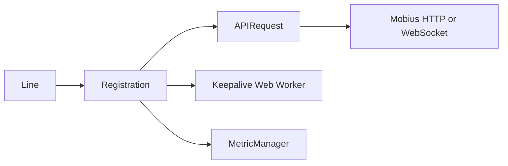

### Component Overview

The `Registration` class is the most complex subsystem in the CallingClient module. It manages the full lifecycle of device registration with Mobius, including initial registration, keepalive heartbeats, server failover, failback, 429 retry handling, and reconnection after network disruption.

## Use Cases

### Registration is Triggered by Line

```typescript
// Inside Line.register()
await this.registration.triggerRegistration();
```

### Checking Registration State

```typescript
const isRegistered = registration.isDeviceRegistered(); // true if ACTIVE
const status = registration.getStatus(); // 'IDLE' | 'active' | 'inactive'
const deviceInfo = registration.getDeviceInfo();
const activeMobiusUrl = registration.getActiveMobiusUrl();
```

### Handling Reconnection

```typescript
// CallingClient calls this after network/Mercury recovery
const success = await registration.handleConnectionRestoration(true);

// Or defer reconnect if calls are active
await registration.reconnectOnFailure('mercuryReconnect');
```

### Clean Deregistration

```typescript
await registration.deregister();
// Sends DELETE /devices/{id} to Mobius
// Stops keepalive Web Worker
// Sets status to INACTIVE (not IDLE)
```

> **Note:** `Registration.deregister()` sets the status to `RegistrationStatus.INACTIVE`. The higher-level `Line.deregister()` wrapper calls `registration.deregister()` and then explicitly sets the status to `RegistrationStatus.IDLE`. If you are calling `Registration.deregister()` directly (e.g., for reconnection or diagnostics), the resulting status will be `INACTIVE`, not `IDLE`.

## State Model

Registration owns primary/backup server lists, active URL, device info/status, retry/failover/failback counters and timers, bounded-storage failover state, reconnect deferral, the keepalive worker, and Mobius-socket connection ownership for the line. Evidence: `src/CallingClient/registration/register.ts`, `src/CallingClient/registration/types.ts`.

## Business Rules & Invariants

- Only one registration/failover mutation runs inside the registration mutex.
- Fatal 400/401/404 and selected 403 responses abort; 429 honors Retry-After; recoverable 5xx/transport errors advance failover.
- Active calls defer reconnection where required.
- Deregistration and registration-down cleanup terminate keepalive and optionally close WSS with the documented 3050 reason.
- Tokens/JWE and registration responses are handled through APIRequest/worker messages and must not be logged as raw credentials. Evidence: `src/CallingClient/registration/register.ts`, `src/CallingClient/registration/webWorkerStr.ts`.

## Concurrency & Reactive Flow

### Keepalive Web Worker

The keepalive mechanism runs in a dedicated **Web Worker** to avoid being blocked by main-thread activity. The worker does **not** call Mobius directly — it sends a `SEND_KEEPALIVE` signal to the main thread, which calls `apiRequest.makeRequest(POST /devices/{id}/status)` and returns the result via `KEEPALIVE_RESULT`. Worker messages use the `WorkerMessageType` enum (values are string constants):

- **Start:** Worker receives `WorkerMessageType.START_KEEPALIVE` (`'START_KEEPALIVE'`) with `{interval, retryCountThreshold}`
- **Tick:** Worker sends `WorkerMessageType.SEND_KEEPALIVE` (`'SEND_KEEPALIVE'`) to main thread every `keepaliveInterval` seconds (when no request is in flight and retryCount is below threshold)
- **Result:** Main thread sends `WorkerMessageType.KEEPALIVE_RESULT` (`'KEEPALIVE_RESULT'`) back to worker with `{statusCode}` on success or `{err}` on failure
- **Success:** Worker posts `WorkerMessageType.KEEPALIVE_SUCCESS` (`'KEEPALIVE_SUCCESS'`) with `{statusCode}` to main thread — only when recovering from a prior failure (`retryCount > 0` before the success); normal successes are silent
- **Failure:** Worker posts `WorkerMessageType.KEEPALIVE_FAILURE` (`'KEEPALIVE_FAILURE'`) with `{err, keepAliveRetryCount}` to main thread
- **Stop:** Main thread sends `WorkerMessageType.CLEAR_KEEPALIVE` (`'CLEAR_KEEPALIVE'`), Worker clears the interval; main thread also calls `worker.terminate()`

### Architecture

The keepalive runs in a **Web Worker** to ensure heartbeats are not blocked by main-thread work (long computations, UI rendering, etc.).

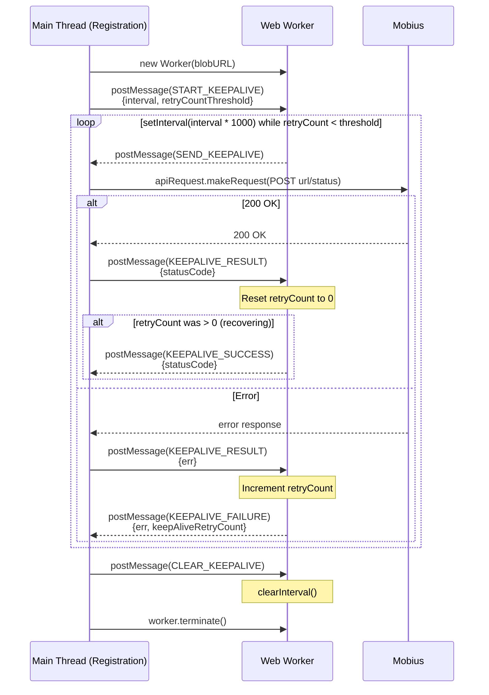

### Worker Messages

| Message | Direction | Payload | Description |
|---------|-----------|---------|-------------|
| `START_KEEPALIVE` | Main → Worker | `{interval, retryCountThreshold}` | Start the keepalive interval timer |
| `SEND_KEEPALIVE` | Worker → Main | _(none)_ | Timer fired — main thread should send the keepalive POST |
| `KEEPALIVE_RESULT` | Main → Worker | `{statusCode}` on success, `{err}` on failure | Result of the keepalive POST (sent by main thread after `apiRequest.makeRequest` resolves/rejects) |
| `CLEAR_KEEPALIVE` | Main → Worker | _(none)_ | Stop the keepalive interval; main thread also calls `worker.terminate()` |
| `KEEPALIVE_SUCCESS` | Worker → Main | `{statusCode}` | Keepalive succeeded **after a prior failure** (`retryCount > 0`); normal successes are silent |
| `KEEPALIVE_FAILURE` | Worker → Main | `{err, keepAliveRetryCount}` | Keepalive POST failed; `err` is the WebexRequestPayload-shaped error |

### Worker Creation

The worker is created from a stringified JavaScript source to avoid separate file bundling:

```typescript
// webWorkerStr.ts contains the worker code as a string
const blob = new Blob([webWorkerStr], {type: 'application/javascript'});
const url = URL.createObjectURL(blob);
this.webWorker = new Worker(url);
URL.revokeObjectURL(url);
```

## State Machine

Registration uses the `RegistrationStatus` enum rather than a separate XState machine. Retry, failover, failback, and reconnect are guarded operations around these three stored states; they are not additional status values.

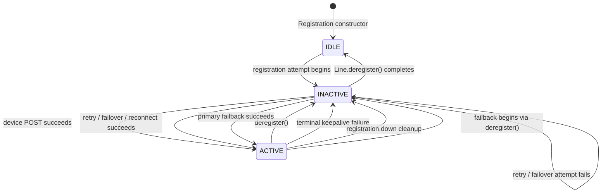

Guards: `isDeviceRegistered()` is true only in `ACTIVE`; an active call defers reconnect and failback; the shared mutex serializes registration, failback, keepalive recovery, and registration-down cleanup. Evidence: `src/common/types.ts`, `src/CallingClient/registration/register.ts`, `src/CallingClient/line/index.ts`.

## Protocol / Wire Format

Registration expresses Mobius operations as HTTP-shaped requests. `APIRequest` sends them with `webex.request` or maps them onto Mobius WSS according to the active server group's URI scheme.

| Operation | Request shape | Routing / response behavior |
|---|---|---|
| Register device | `POST {mobiusUrl}device`; headers `cisco-device-url` and `spark-user-agent`; body `{userId, clientDeviceUri, serviceData}` where guest calling adds `serviceData.jwe`. | Sent through `APIRequest.makeRequest()`. A successful body supplies device identity and intervals, changes status to `ACTIVE`, starts keepalive, and emits `REGISTERED`. |
| Deregister device | `DELETE {activeMobiusUrl}devices/{deviceId}` with the same identity headers. The WSS form additionally carries `{deviceId}` in the body. | Sent through `APIRequest.makeRequest()`. Cleanup proceeds to `INACTIVE` and emits `UNREGISTERED`; `deregister(true)` also closes WSS. |
| Device keepalive | `POST {deviceUri}/status`; body `{deviceId}` with identity headers. | The worker emits `SEND_KEEPALIVE`; the main thread sends the request and returns `KEEPALIVE_RESULT {statusCode}` or `{err}` to the worker. |
| Primary health check | `GET {primaryMobiusBaseUrl}ping` with identity headers. | Uses `webex.request()` to decide whether failback may proceed; status `200` means primary is available. |
| WSS lifecycle control | Connect to the normalized `wss://` server before registration; disconnect with `{code: 3050, reason: 'done (permanent)'}` when the lifecycle requires a new session. | `Registration` calls the transport only through `APIRequest`; it does not import `MobiusSocket` directly. |

The worker message contract is `START_KEEPALIVE {interval, retryCountThreshold}`, `SEND_KEEPALIVE`, `KEEPALIVE_RESULT {statusCode}` or `{err}`, `KEEPALIVE_SUCCESS {statusCode}`, `KEEPALIVE_FAILURE {err, keepAliveRetryCount}`, and `CLEAR_KEEPALIVE`. Only the main thread performs network I/O. Evidence: `src/CallingClient/registration/register.ts`, `src/CallingClient/registration/webWorkerStr.ts`, `src/CallingClient/registration/webWorker.ts`, `src/CallingClient/utils/request.ts`.

## Error Handling & Failure Modes

### 3. Error Handling Logic

Robust error handling is built in for registration and keepalive via `handleRegistrationErrors`:

- **400 / 401 / 404:** Fatal errors — `handleRegistrationErrors` returns `abort = true`, registration stops, and `LINE_EVENTS.ERROR` is emitted to `Line`.
- **403 (Device Limit Exceeded, code 101):** Non-fatal — triggers `restoreRegistrationCallBack` which deregisters the existing device and re-registers. If successful, status becomes `ACTIVE`.
- **403 (Device Creation Disabled, code 102):** Fatal — `abort = true`.
- **429 Too Many Requests:** Non-fatal — stores `Retry-After` value via `handle429Retry`. During initial registration, the loop continues to the next server; the stored value influences `startFailoverTimer` interval. During failback, retries up to `REG_FAILBACK_429_MAX_RETRIES` (5).
- **500 / 503 / Other:** Non-fatal — the loop in `attemptRegistrationWithServers` continues to the next server. If all servers fail, `startFailoverTimer` schedules retries with exponential backoff.
- **409 Conflict (keepalive only):** Hard stop — `handleRegistrationErrors` builds the `SESSION_SUPERSEDED` error and hands it to `handle409KeepaliveFailure` through `sessionSupersededCb`, so no server loop, failover, or restore is attempted. Flows that do not pass that handler (registration, restoration, failover, failback) log the `409` and ignore it — non-final, no consumer event, no metric — and continue to the next server.

### 429 Retry Logic

When Mobius responds with HTTP 429, the `handle429Retry` callback routes to one of three distinct paths depending on the caller context:

**Initial / General Registration (default path):**
1. Store the `Retry-After` value on the instance (`this.retryAfter`)
2. `restorePreviousRegistration` consumes the stored value:
   - If `Retry-After` < `RETRY_TIMER_UPPER_LIMIT` (60s): schedule a delayed `restartRegistration`
   - If on primary and backups exist: switch to backup servers immediately
   - If already on backup: restart full registration
3. No retry counter or cap — the flow moves forward after one attempt

**Failback (rehoming from backup → primary):**
1. Extract `Retry-After` header value
2. Increment `failback429RetryAttempts` counter
3. Retry up to `REG_FAILBACK_429_MAX_RETRIES` (5) times with exponential backoff via `getRegRetryInterval`
4. On each retry, attempt `restorePreviousRegistration`; if that fails, `restartRegistration`
5. On exhaustion (counter >= 5), silently stop retrying

**Keepalive:**
1. Pause the keepalive timer
2. Resume keepalive after the `Retry-After` delay
3. No retry counter or cap — keepalive simply resumes once

### Keepalive Failure Handling

When the main thread receives `KEEPALIVE_FAILURE`:

1. **Submit metrics** and run `handleRegistrationErrors` to classify the error (fatal vs. non-fatal vs. 429).
2. **If abort (fatal) OR retryCount ≥ threshold** (`4` for contact-center, `5` otherwise):
   - Set status to `INACTIVE`, terminate the keepalive worker
   - Emit `LINE_EVENTS.UNREGISTERED` via `lineEmitter`
   - If **non-fatal threshold exceeded** (not `abort`): call `reconnectOnFailure()` for full re-registration
   - If **fatal + 404**: call `handle404KeepaliveFailure()` for a fresh registration attempt
3. **If below threshold** (non-fatal and retryCount < threshold): emit `LINE_EVENTS.RECONNECTING` via `lineEmitter` and wait for the next keepalive cycle

### reconnectOnFailure()

Called when keepalive failures exceed the threshold or when CallingClient detects all calls have cleared after a network disruption.

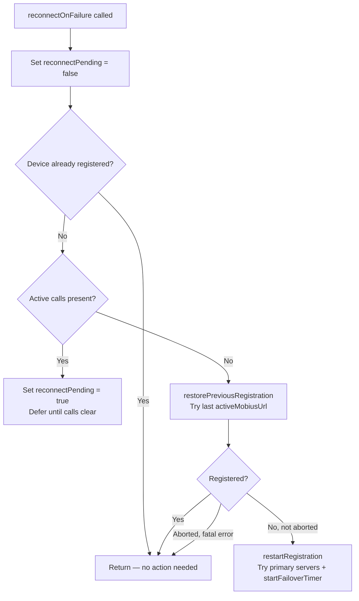

### Registration Module — Architecture / 429 Retry Logic

`handle429Retry(retryAfter, caller)` handles 429 differently depending on the calling context:

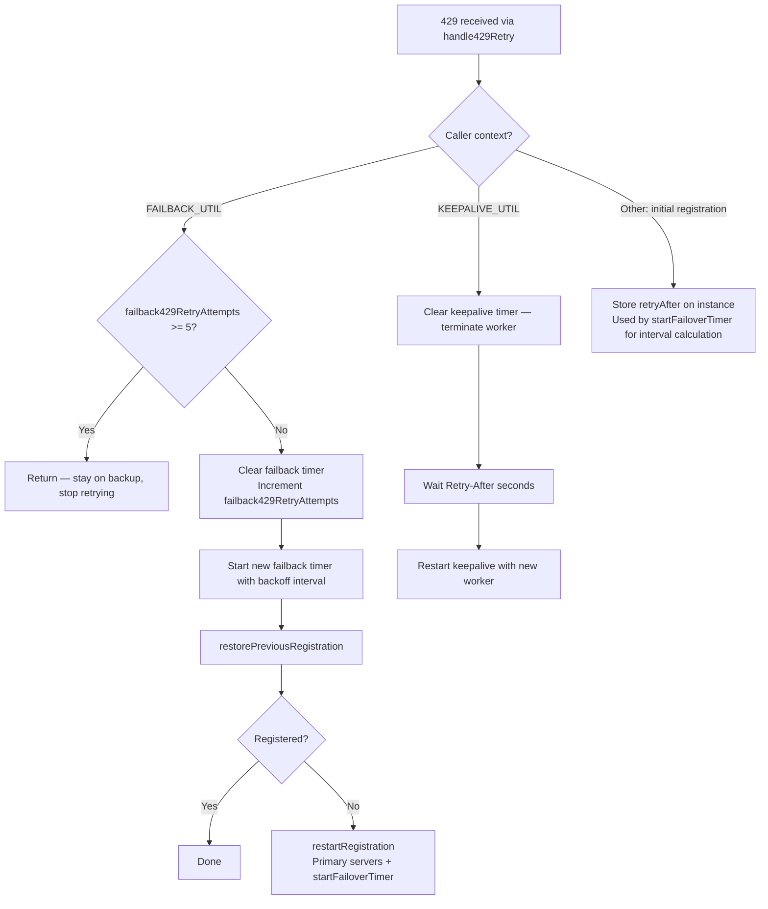

### Error Handling

Registration errors are mapped through `handleRegistrationErrors()`. Fatal errors (`abort = true`) stop the registration loop and emit `LINE_EVENTS.ERROR`. Non-fatal errors allow the loop to continue to the next server or schedule a retry via the failover timer.

| HTTP Status | ERROR_TYPE | Fatal? | Action |
|-------------|-----------|--------|--------|
| 400 | `BAD_REQUEST` | Yes | Abort — emit error |
| 401 | `TOKEN_ERROR` | Yes | Abort — emit error (token expired/invalid) |
| 403 (code 101) | `FORBIDDEN_ERROR` | No | Device limit exceeded — `restoreRegistrationCallBack`: deregister existing + re-register |
| 403 (code 102) | `FORBIDDEN_ERROR` | Yes | Device creation disabled — abort, emit error |
| 403 (code 103/other) | `FORBIDDEN_ERROR` | No | Device creation failed — continue retry |
| 404 | `NOT_FOUND` | Yes | Abort — emit error |
| 429 | `TOO_MANY_REQUESTS` | No | Call `handle429Retry` with `Retry-After` value |
| 500 | `SERVER_ERROR` | No | Continue to next server or schedule retry |
| 503 | `SERVICE_UNAVAILABLE` | No | Continue to next server or schedule retry |
| Other | `DEFAULT` | No | Continue to next server or schedule retry |

### Final vs Non-Final Error Flow

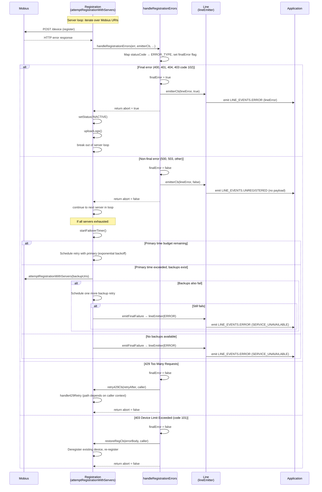

> **Source references:**
> - Server loop and error branching: `attemptRegistrationWithServers` in `src/CallingClient/registration/register.ts`
> - Error classification and callback invocation: `handleRegistrationErrors` in `src/common/Utils.ts`
> - Failover timer and final failure: `startFailoverTimer` in `register.ts`, `emitFinalFailure` in `src/common/Utils.ts`
> - `lineEmitter` branching on `finalError`: the `emitterCb` closure in `attemptRegistrationWithServers` — emits `LINE_EVENTS.ERROR` for `finalError = true`, `LINE_EVENTS.UNREGISTERED` for `finalError = false`

## Pitfalls

- Do not bypass the module boundary or duplicate constants owned under `src/CallingClient/registration/`.
- Do not assume remote events are ordered or that network operations cannot fail.
- Update `src/CallingClient/registration/ai-docs/registration-spec.md` with behavior changes in the same merge.

## Module Do's / Don'ts

- DO use the factories, typed events, constants, and adapters already owned by `src/CallingClient/registration/`.
- DON'T add direct network or SDK access when the module already provides an adapter.

## Key Design Trade-off

Keepalive timing runs in a Web Worker so main-thread work cannot starve heartbeats, while network I/O stays on the main thread through APIRequest. This adds a message protocol but keeps SDK access and auth out of the worker. Evidence: `src/CallingClient/registration/register.ts`, `src/CallingClient/registration/webWorkerStr.ts`.

## Test-Case Strategy (module)

Unit tests are co-located under `src/CallingClient/registration/` and exercise positive, negative, error, retry, and cleanup behavior as applicable. Package journeys under `playwright/` cover cross-module flows.

| Behavior / Requirement | Existing test evidence | Gap |
|---|---|---|
| REGISTRATION-R-001 | `src/CallingClient/registration/register.test.ts` | Re-check negative/error edge coverage during independent validation |
| REGISTRATION-R-002 | `src/CallingClient/registration/register.test.ts`; `src/CallingClient/registration/webWorker.test.ts` | Re-check negative/error edge coverage during independent validation |
| REGISTRATION-R-003 | `src/CallingClient/registration/register.test.ts` | Re-check negative/error edge coverage during independent validation |
| REGISTRATION-R-004 | `src/CallingClient/registration/register.test.ts` | Re-check negative/error edge coverage during independent validation |
| REGISTRATION-R-005 | `src/CallingClient/registration/register.test.ts` | Re-check negative/error edge coverage during independent validation |
| REGISTRATION-R-006 | `src/CallingClient/registration/register.test.ts` | Re-check negative/error edge coverage during independent validation |
| REGISTRATION-R-007 | `src/CallingClient/registration/register.test.ts` | Add isolated coverage for `deregister(false)` and `deregister(true)`, including WSS teardown failure |
| REGISTRATION-R-008 | `src/CallingClient/registration/register.test.ts`; `src/CallingClient/utils/request.test.ts` | Re-check negative/error edge coverage during independent validation |
| REGISTRATION-R-009 | `src/CallingClient/registration/register.test.ts` | Re-check negative/error edge coverage during independent validation |
| REGISTRATION-R-010 | `src/CallingClient/registration/register.test.ts` | Re-check negative/error edge coverage during independent validation |

## Traceability

- Repo architecture: [`ARCHITECTURE.md`](../../../../ai-docs/ARCHITECTURE.md) · Registry: [`SPEC_INDEX.md`](../../../../ai-docs/SPEC_INDEX.md)
- Contracts catalog: [`CONTRACTS.md`](../../../../ai-docs/CONTRACTS.md) · Manifest: `../../../../.sdd/manifest.json`
- Source material retained at `src/CallingClient/registration/ai-docs/AGENTS.md`; canonical behavior is this spec plus current code/tests.
- Source material retained at `src/CallingClient/registration/ai-docs/ARCHITECTURE.md`; canonical behavior is this spec plus current code/tests.

### Related Documentation

- [Registration Architecture](./ARCHITECTURE.md) — Internal flows, failover, keepalive details, WSS touch points
- [Line AGENTS.md](../../line/ai-docs/AGENTS.md) — Line owns Registration via `lineEmitter`
- [CallingClient AGENTS.md](../../ai-docs/AGENTS.md) — Parent module overview
- [`mobius-socket` AGENTS.md](../../../mobius-socket/ai-docs/AGENTS.md) — Mobius WebSocket transport public API
- [`mobius-socket` ARCHITECTURE.md](../../../mobius-socket/ai-docs/ARCHITECTURE.md) — Close-code matrix, backoff/retry policy, shutdown switchover

### Registration Module — Architecture / Related Documentation

- [Registration AGENTS.md](./AGENTS.md) — Public API, key concepts
- [Line ARCHITECTURE.md](../../line/ai-docs/ARCHITECTURE.md) — lineEmitter pattern, Line ↔ Registration interaction
- [CallingClient ARCHITECTURE.md](../../ai-docs/ARCHITECTURE.md) — Network resilience, initialization, transport selection
- [`mobius-socket` AGENTS.md](../../../mobius-socket/ai-docs/AGENTS.md) — Public API for the WebSocket transport
- [`mobius-socket` ARCHITECTURE.md](../../../mobius-socket/ai-docs/ARCHITECTURE.md) — Internals (backoff, dedup, close-code matrix, shutdown switchover, token refresh)
