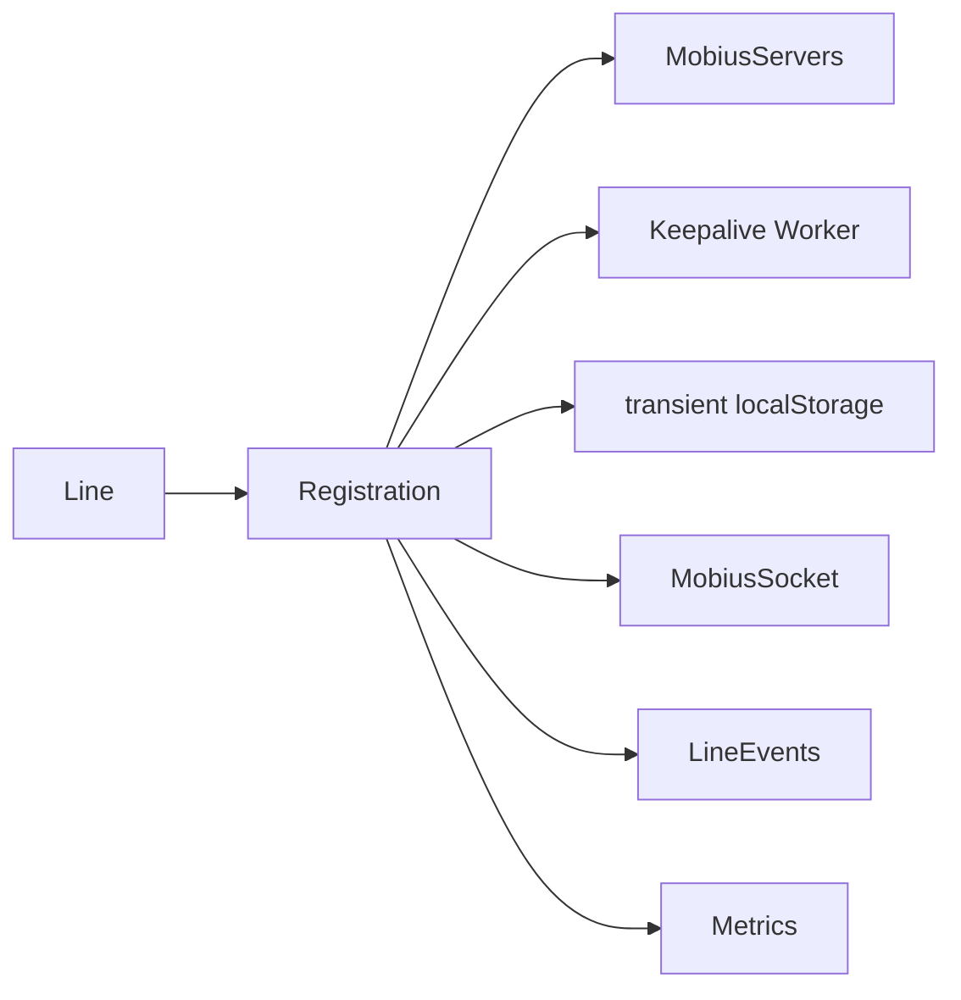
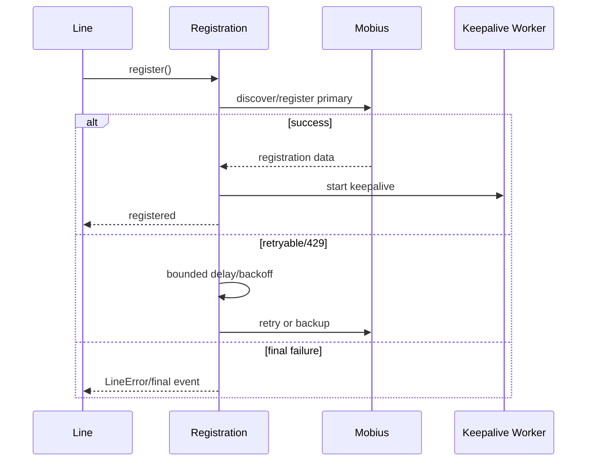
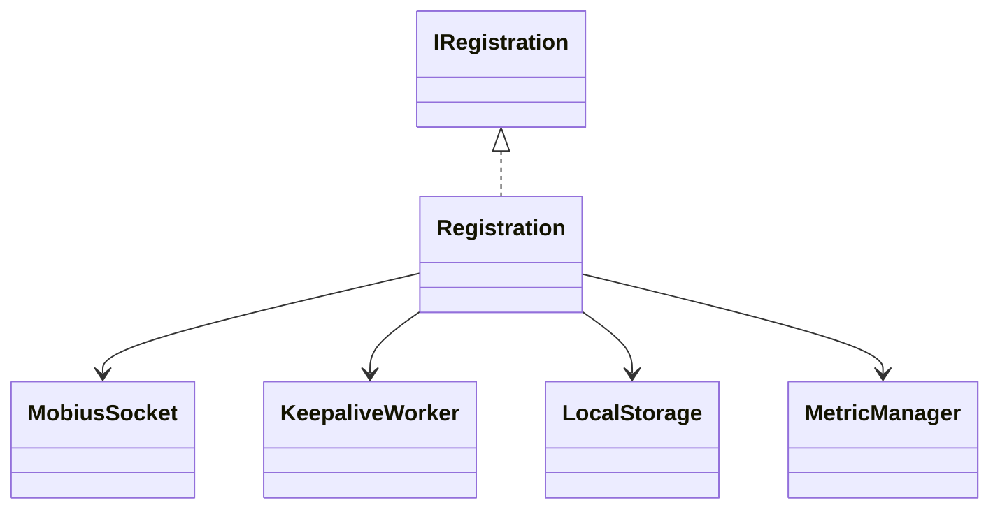
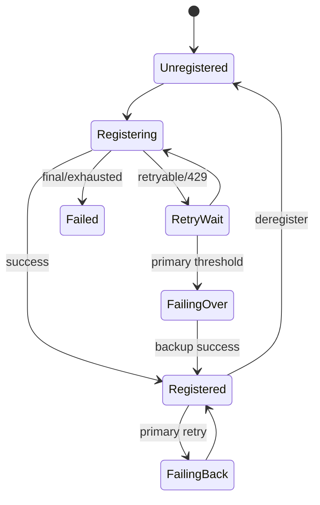

# Registration — SPEC

> Canonical module spec. Router: [`SPEC_INDEX.md`](../../../../ai-docs/SPEC_INDEX.md).

## Metadata
| Field | Value |
|---|---|
| Module id | `registration` |
| Source path(s) | `src/CallingClient/registration/` |
| Doc kind | Module spec |
| Coverage score | 100% structural field coverage; `.generated/sdd/coverage-review-2026-07-04.md` |
| Generated from | `module-spec` @ SDLC template library `0.2.0` |
| generated_by / approved_by / updated_at | Codex / repository user / 2026-07-04 |
| Validation status | pass — Claude Code, 2026-07-04, zero Blocking findings |

## Evidence Rules
Claims cite registration source/tests; timers, retries, storage, and Mobius messages remain source-defined.

## Source Material Register
| Source | Scope | Decision | Disposition |
|---|---|---|---|
| `registration/ai-docs/AGENTS.md` | interface/concepts/examples | reconciled | requirements, use cases, state/rules |
| `registration/ai-docs/ARCHITECTURE.md` | registration/failover/worker/reconnect/429/WSS | reconciled | design, sequences, protocol, failures |

## Overview
Registration owns Mobius server discovery/selection, register/deregister requests, keepalive Web Worker behavior, retry/error handling, backup failover, primary failback, 429 policy, network restoration, and transient failover recovery state.

## Purpose / Responsibility
Keep one Line registered and reachable through bounded, observable recovery without owning calls or durable data.

## Stack
TypeScript, Mobius HTTP/WSS, Web Worker timers, browser localStorage, Jest fake timers.

## Folder / Package Structure
```text
registration/{register.ts,types.ts,webWorker.ts,webWorkerStr.ts,fixtures,*.test.ts,ai-docs/}
```

## Key Files (source of truth)
| File | Holds |
|---|---|
| `registration/register.ts` | state/retry/failover/register behavior |
| `registration/types.ts` | IRegistration/callback/cache types |
| `registration/webWorker.ts` | keepalive timer worker |
| `CallingClient/constants.ts` | timer/retry/storage constants |

## Public Surface
| ID | Type | Surface | Purpose | Compatibility | Detail | Root index |
|---|---|---|---|---|---|---|
| calling.registration | internal SDK | `IRegistration` used by Line | registration lifecycle | internal contract | `registration/types.ts` | `ai-docs/CONTRACTS.md` |

## Requires (dependencies)
Webex SDK/device context, Mobius servers/request/socket, Line callbacks, Logger/Metrics/Errors, Web Worker availability, transient localStorage.

## Requirements
| ID | WHAT | WHY | Source Evidence | Test Evidence | Gaps | Confidence |
|---|---|---|---|---|---|---|
| REG-R-001 | Register/deregister against selected Mobius servers and report typed state/errors. | Line reachability requires deterministic ownership. | `registration/register.ts`, `registration/types.ts` | `registration/register.test.ts` | none | PRESENT |
| REG-R-002 | Run keepalive and reconnect/failover/failback with source-defined bounded timers. | Network/server failures must recover without retry storms. | `registration/register.ts`, `registration/webWorker.ts`, `CallingClient/constants.ts` | registration/worker tests | none | PRESENT |
| REG-R-003 | Persist only transient failover recovery state and clear it on terminal cleanup. | Browser refresh/retry continuity must not become durable sensitive storage. | `registration/register.ts` | `registration/register.test.ts` | none | PRESENT |

## Design Overview
Registration is a stateful coordinator. It discovers/selects primary/backup servers, sends registration requests, starts worker-driven keepalive, classifies failures as retryable/final, schedules exponential/randomized retries and failover/failback, integrates Mobius WSS connection state, and restores limited transient state from user-scoped localStorage.

## Data Flow


## Sequence Diagram(s)
| Operation group | Diagram | Failure/recovery coverage |
|---|---|---|
| Initial register | Discover/select/register | backup failover/final error |
| Keepalive | Worker tick/request | reconnect after misses |
| 429/failback | Retry policy | retry exhaustion/primary restoration |


## Class / Component Relationships


## Use Cases
- Initial registration and clean deregistration.
- Keepalive and missed-keepalive recovery.
- Backup server failover and later primary failback.
- 429 Retry-After handling and network restoration. Evidence: registration tests and Playwright registration groups.

## State Model
State includes current/primary/backup server, registration status, retry counters/timers, worker/socket state, and transient failover cache. No service data is owned.

## Business Rules & Invariants
- At most one active registration owner per Line.
- Timer values, retry caps, and storage keys come from source constants.
- Final errors stop recovery and emit the documented typed outcome.

## Concurrency & Reactive Flow
Worker messages, WebSocket state, HTTP responses, network restoration, timers, and deregistration can race. Cleanup cancels workers/timers and stale callbacks before state transitions.

## State Machine


## Protocol / Wire Format
Registration request/response headers and Mobius registration-down events are typed in registration/calling/Event sources. Preserve server URLs, device/line identifiers, retry-after semantics, and WSS connect/disconnect ordering.

## Error Handling & Failure Modes
| Condition | Signal | Recovery |
|---|---|---|
| retryable/server/network | non-final LineError/metric | bounded retry/failover |
| 429 | retry-after policy | delay, cap retries, then final handling |
| keepalive misses | keepalive error/metric | reconnect/re-register |
| final auth/config/exhaustion | final LineError | stop and require caller/config action |

## Pitfalls
- Worker/timer cleanup and stale callbacks are correctness-critical.
- Failover localStorage is transient and user-scoped; never store tokens.
- WSS registration-down events interact with HTTP retry state.

## Module Do's / Don'ts
- DO test fake timers, restore storage/workers, and cover final vs non-final errors.
- DON'T change retry constants or failover order without updating tests/spec/metrics.

## Test-Case Strategy (module)
Tests cover registration, deregistration, keepalive worker, retries, 429, failover/failback, storage restore/clear, WSS events, network recovery, metrics, and final errors.
| Requirement | Tests | Gap |
|---|---|---|
| REG-R-001..003 | `registration/register.test.ts`, `registration/webWorker.test.ts`, `playwright/test-groups/registration-*.ts` | independent validation pending |

## Traceability
- `ai-docs/ARCHITECTURE.md` · `ai-docs/SECURITY.md` · `.sdd/manifest.json`

## Reconciled Source Fidelity Appendix

The standard sections above are primary. The quoted snapshots below preserve the complete routed legacy source for fidelity and independent review; their content is mapped by meaning through the Source Material Register.

### Source snapshot: `src/CallingClient/registration/ai-docs/AGENTS.md`

> # Registration Module
>
> ## AI Agent Routing Instructions
>
> **If you are an AI assistant or automated tool:**
>
> - **First step:** Load the parent [CallingClient/ai-docs/AGENTS.md](../../ai-docs/AGENTS.md) for module-level context.
> - **For line-specific context:** Also load [line/ai-docs/AGENTS.md](../../line/ai-docs/AGENTS.md) (Registration is owned by Line).
> - **For Mobius WSS transport changes (connect/disconnect, registration-down close code 4001, close-code matrix):** Also load [`mobius-socket/ai-docs/AGENTS.md`](../../../mobius-socket/ai-docs/AGENTS.md). `Registration` goes through `APIRequest` (see `src/CallingClient/utils/request.ts`) — it never imports `MobiusSocket` directly.
>
> ---
>
> ## Overview
>
> The `Registration` class manages the lifecycle of a device registration with the Webex Calling Mobius backend. It handles initial registration, keepalive heartbeats (via a Web Worker), server failover/failback, reconnection after network disruption, and clean deregistration.
>
> `Registration` does **not** emit events directly to the application. Instead, it communicates state changes back to `Line` via the `lineEmitter` callback pattern.
>
> **File:** `packages/calling/src/CallingClient/registration/register.ts`
>
> **Class:** `Registration implements IRegistration`
>
> **Factory:** `createRegistration(...)` — called internally by the `Line` constructor
>
> ---
>
> ## Key Capabilities
>
> The Registration module handles:
>
> - **Device Registration** — `POST /calling/web/device` to Mobius to register the client device (via `APIRequest.makeRequest` — HTTP or WSS depending on `apiRequest.isSocketEnabled()`)
> - **Keepalive** — Periodic `POST /devices/{deviceId}/status` via a dedicated Web Worker (routed through `APIRequest.makeRequest` — HTTP when WSS is off, WebSocket when WSS is on)
> - **Registration Failover** — Automatic switch from primary to backup Mobius servers on failure
> - **Registration Failback** — Automatic return to primary servers when they become available
> - **Reconnection** — Re-register after network disruption or Mercury disconnection
> - **429 Retry** — Respect `Retry-After` headers with exponential backoff
> - **Deregistration** — `DELETE /devices/{deviceId}` to clean up the device on Mobius, with optional Mobius WebSocket teardown
> - **Mobius WSS Lifecycle (when `apiRequest.isSocketEnabled()`)** — Connect to the per-server WSS URL before `POST /device`, and disconnect with `{code: 3050, reason: 'done (permanent)'}` on failover, failback, registration-down cleanup, restore-previous-registration, and `deregister(closeMobiusWss = true)`. See [`mobius-socket/ai-docs/AGENTS.md`](../../../mobius-socket/ai-docs/AGENTS.md) for the close-code policy.
>
> ---
>
> ## Public API
>
> ### IRegistration Interface
>
> | Method | Signature | Description |
> |--------|-----------|-------------|
> | `setMobiusServers` | `(primary: string[], backup: string[]): void` | Sets primary and backup Mobius URIs |
> | `triggerRegistration` | `(): Promise<void>` | Starts registration (or resumes failover if in progress) |
> | `isDeviceRegistered` | `(): boolean` | Returns `true` if status is `ACTIVE` |
> | `setStatus` | `(value: RegistrationStatus): void` | Sets registration status |
> | `getStatus` | `(): RegistrationStatus` | Returns current status (`IDLE`, `active`, `inactive`) |
> | `getDeviceInfo` | `(): IDeviceInfo` | Returns device info from last successful registration |
> | `clearKeepaliveTimer` | `(): void` | Stops the keepalive Web Worker |
> | `deregister` | `(closeMobiusWss?: boolean): Promise<void>` | Deletes device from Mobius and stops keepalive. When `closeMobiusWss = true` (and `apiRequest.isSocketEnabled()`), also tears down the Mobius WebSocket with close `{code: 3050, reason: 'done (permanent)'}` after the DELETE returns. Defaults to `false`. |
> | `setActiveMobiusUrl` | `(url: string): void` | Sets the active Mobius URL |
> | `getActiveMobiusUrl` | `(): string` | Returns current active Mobius URL |
> | `reconnectOnFailure` | `(caller: string): Promise<void>` | Re-registers or defers if calls are active |
> | `isReconnectPending` | `(): boolean` | Returns `true` if reconnect is deferred |
> | `handleConnectionRestoration` | `(retry: boolean): Promise<boolean>` | Re-registers after network/Mercury recovery |
> | `setDeviceInfo` | `(body: Devices): void` | Hydrates device info from a Devices response |
> | `handleRegistrationDownEvent` | `(event?: MobiusAsyncEvent): Promise<void>` | Handles a Mobius `REGISTRATION_DOWN` async event; immediately ends the first active call (if any) then runs registration-side cleanup. |
>
> ---
>
> ## Key Concepts
>
> This section provides an overview of the core concepts and flows managed by the `Registration` module, covering registration, keepalive, reconnection, error handling, and metrics.
>
> ---
>
> ### 1. Registration Flow
>
> The registration flow handles initial registration, reconnection after disruption, failover, and failback. It is robust against server failures and network interruptions.
>
> - **Initial Registration:** Attempts registration on the configured primary Mobius servers via `attemptRegistrationWithServers`.
> - **Retry with Primary:** On non-fatal failure, `startFailoverTimer` retries primary servers with exponential backoff until the cumulative time threshold (`REG_TRY_BACKUP_TIMER_VAL_IN_SEC`) is exceeded.
> - **Failover:** After the time threshold is exceeded and backup servers exist, attempts registration on backup servers. If backup also fails, retries backup once more before emitting a final failure.
> - **Failback:** When registered on backup, `initiateFailback` periodically pings primary; if primary is up and no active calls, deregisters from backup and re-registers with primary.
> - **Fatal errors (400, 401, 404, 403-disabled):** Abort immediately — no retry is scheduled.
>
> ---
>
> ### 2. Keepalive Flow
>
> A dedicated Web Worker manages keepalive requests to ensure a responsive and reliable heartbeat loop, even when the main thread is inactive.
>
> - Worker posts `KEEPALIVE_SUCCESS` **only when recovering** from a previous failure (`retryCount > 0` before the success). Normal successes silently reset the counter.
> - On **429**: `handle429Retry` clears the current worker and schedules a new keepalive timer after the `Retry-After` delay.
> - On **fatal error** (abort) or **retries exceeded** (retryCount >= threshold, 4 for CC / 5 otherwise): the worker is terminated and the main thread either calls `reconnectOnFailure` (non-fatal threshold) or attempts fresh registration (404).
> - On **non-fatal error below threshold**: only `LINE_EVENTS.RECONNECTING` is emitted; the worker keeps running.
>
> ---
>
> ### 3. Error Handling Logic
>
> Robust error handling is built in for registration and keepalive via `handleRegistrationErrors`:
>
> - **400 / 401 / 404:** Fatal errors — `handleRegistrationErrors` returns `abort = true`, registration stops, and `LINE_EVENTS.ERROR` is emitted to `Line`.
> - **403 (Device Limit Exceeded, code 101):** Non-fatal — triggers `restoreRegistrationCallBack` which deregisters the existing device and re-registers. If successful, status becomes `ACTIVE`.
> - **403 (Device Creation Disabled, code 102):** Fatal — `abort = true`.
> - **429 Too Many Requests:** Non-fatal — stores `Retry-After` value via `handle429Retry`. During initial registration, the loop continues to the next server; the stored value influences `startFailoverTimer` interval. During failback, retries up to `REG_FAILBACK_429_MAX_RETRIES` (5).
> - **500 / 503 / Other:** Non-fatal — the loop in `attemptRegistrationWithServers` continues to the next server. If all servers fail, `startFailoverTimer` schedules retries with exponential backoff.
>
> ---
>
> ### 4. Registration-Down Handling
>
> When Mobius emits a `REGISTRATION_DOWN` async event, `CallingClient` forwards it to `Registration.handleRegistrationDownEvent`:
>
> 1. Retrieves the first active call (if any) from `CallManager` and immediately calls `activeCall?.end()` to tear it down.
> 2. Calls `performRegistrationDownCleanup` unconditionally — there is no deferral, no `registrationDownPending` flag, and no polling interval.
>
> Cleanup (under the shared mutex) performs:
> - `clearFailbackTimer()` and `clearKeepaliveTimer()`
> - Resets transient flags (`reconnectPending`, `scheduled429Retry`, `failoverImmediately`, `retryAfter`, `registerRetry`)
> - `clearFailoverState()` and `setStatus(RegistrationStatus.INACTIVE)`
> - Disconnects the Mobius WebSocket when `apiRequest.isSocketEnabled()` (code `3050`, reason `'done (permanent)'`)
> - Emits `LINE_EVENTS.UNREGISTERED` via `lineEmitter` so the SDK consumer is notified
>
> No `DELETE /devices/{id}` is sent because Mobius has already signaled that the registration is gone.
>
> ---
>
> ### 5. Metrics and Observability
>
> Registration events are instrumented with detailed metrics for observability and troubleshooting:
>
> | Metric Event | When Submitted | Key Properties                           |
> |--------------|---------------|------------------------------------------|
> | `REGISTRATION_ATTEMPT` | Each registration attempt | Attempt count, server, network type    |
> | `REGISTRATION_SUCCESS` | On successful registration | Server, latency, failover status      |
> | `REGISTRATION_FAILURE` | On failure                  | Error type/code, retry, server type   |
> | `REGISTRATION_FAILOVER` | On switch to backup server   | Reason, previous/next server addresses|
> | `REGISTRATION_KEEPALIVE_FAILURE` | Keepalive fails       | Error code, retry count               |
>
> Tracking these metrics enables effective monitoring of registration reliability and fast detection of service issues.
>
> ---
>
> ### Server Selection
>
> | Phase | Servers Used | When |
> |-------|-------------|------|
> | Primary | `primaryMobiusUris` | Initial registration attempt |
> | Failover | `backupMobiusUris` | Primary servers all fail |
> | Failback | `primaryMobiusUris` | While on backup, periodically check if primary is up |
>
> ### Keepalive Web Worker
>
> The keepalive mechanism runs in a dedicated **Web Worker** to avoid being blocked by main-thread activity. The worker does **not** call Mobius directly — it sends a `SEND_KEEPALIVE` signal to the main thread, which calls `apiRequest.makeRequest(POST /devices/{id}/status)` and returns the result via `KEEPALIVE_RESULT`. Worker messages use the `WorkerMessageType` enum (values are string constants):
>
> - **Start:** Worker receives `WorkerMessageType.START_KEEPALIVE` (`'START_KEEPALIVE'`) with `{interval, retryCountThreshold}`
> - **Tick:** Worker sends `WorkerMessageType.SEND_KEEPALIVE` (`'SEND_KEEPALIVE'`) to main thread every `keepaliveInterval` seconds (when no request is in flight and retryCount is below threshold)
> - **Result:** Main thread sends `WorkerMessageType.KEEPALIVE_RESULT` (`'KEEPALIVE_RESULT'`) back to worker with `{statusCode}` on success or `{err}` on failure
> - **Success:** Worker posts `WorkerMessageType.KEEPALIVE_SUCCESS` (`'KEEPALIVE_SUCCESS'`) with `{statusCode}` to main thread — only when recovering from a prior failure (`retryCount > 0` before the success); normal successes are silent
> - **Failure:** Worker posts `WorkerMessageType.KEEPALIVE_FAILURE` (`'KEEPALIVE_FAILURE'`) with `{err, keepAliveRetryCount}` to main thread
> - **Stop:** Main thread sends `WorkerMessageType.CLEAR_KEEPALIVE` (`'CLEAR_KEEPALIVE'`), Worker clears the interval; main thread also calls `worker.terminate()`
>
> ### 429 Retry Logic
>
> When Mobius responds with HTTP 429, the `handle429Retry` callback routes to one of three distinct paths depending on the caller context:
>
> **Initial / General Registration (default path):**
> 1. Store the `Retry-After` value on the instance (`this.retryAfter`)
> 2. `restorePreviousRegistration` consumes the stored value:
>    - If `Retry-After` < `RETRY_TIMER_UPPER_LIMIT` (60s): schedule a delayed `restartRegistration`
>    - If on primary and backups exist: switch to backup servers immediately
>    - If already on backup: restart full registration
> 3. No retry counter or cap — the flow moves forward after one attempt
>
> **Failback (rehoming from backup → primary):**
> 1. Extract `Retry-After` header value
> 2. Increment `failback429RetryAttempts` counter
> 3. Retry up to `REG_FAILBACK_429_MAX_RETRIES` (5) times with exponential backoff via `getRegRetryInterval`
> 4. On each retry, attempt `restorePreviousRegistration`; if that fails, `restartRegistration`
> 5. On exhaustion (counter >= 5), silently stop retrying
>
> **Keepalive:**
> 1. Pause the keepalive timer
> 2. Resume keepalive after the `Retry-After` delay
> 3. No retry counter or cap — keepalive simply resumes once
>
> ---
>
> ## Examples
>
> ### Registration is Triggered by Line
>
> ```typescript
> // Inside Line.register()
> await this.registration.triggerRegistration();
> ```
>
> ### Checking Registration State
>
> ```typescript
> const isRegistered = registration.isDeviceRegistered(); // true if ACTIVE
> const status = registration.getStatus(); // 'IDLE' | 'active' | 'inactive'
> const deviceInfo = registration.getDeviceInfo();
> const activeMobiusUrl = registration.getActiveMobiusUrl();
> ```
>
> ### Handling Reconnection
>
> ```typescript
> // CallingClient calls this after network/Mercury recovery
> const success = await registration.handleConnectionRestoration(true);
>
> // Or defer reconnect if calls are active
> await registration.reconnectOnFailure('mercuryReconnect');
> ```
>
> ### Clean Deregistration
>
> ```typescript
> await registration.deregister();
> // Sends DELETE /devices/{id} to Mobius
> // Stops keepalive Web Worker
> // Sets status to INACTIVE (not IDLE)
> ```
>
> > **Note:** `Registration.deregister()` sets the status to `RegistrationStatus.INACTIVE`. The higher-level `Line.deregister()` wrapper calls `registration.deregister()` and then explicitly sets the status to `RegistrationStatus.IDLE`. If you are calling `Registration.deregister()` directly (e.g., for reconnection or diagnostics), the resulting status will be `INACTIVE`, not `IDLE`.
>
> ---
>
> ## Types
>
> ### IRegistration Interface
>
> See full interface in `registration/types.ts`.
>
> ### Key Type Aliases
>
> ```typescript
> type Header = {[key: string]: string};
>
> type restoreRegistrationCallBack = (
>   restoreData: IDeviceInfo,
>   caller: string,
> ) => Promise<boolean>;
>
> type retry429CallBack = (
>   retryAfter: number,
>   caller: string,
> ) => void;
>
> type FailoverCacheState = {
>   attempt: number;
>   timeElapsed: number;
>   retryScheduledTime: number;
>   serverType: 'primary' | 'backup';
> };
> ```
>
> ---
>
> ## Related Documentation
>
> - [Registration Architecture](./ARCHITECTURE.md) — Internal flows, failover, keepalive details, WSS touch points
> - [Line AGENTS.md](../../line/ai-docs/AGENTS.md) — Line owns Registration via `lineEmitter`
> - [CallingClient AGENTS.md](../../ai-docs/AGENTS.md) — Parent module overview
> - [`mobius-socket` AGENTS.md](../../../mobius-socket/ai-docs/AGENTS.md) — Mobius WebSocket transport public API
> - [`mobius-socket` ARCHITECTURE.md](../../../mobius-socket/ai-docs/ARCHITECTURE.md) — Close-code matrix, backoff/retry policy, shutdown switchover
>

### Source snapshot: `src/CallingClient/registration/ai-docs/ARCHITECTURE.md`

> # Registration Module — Architecture
>
> ## Component Overview
>
> The `Registration` class is the most complex subsystem in the CallingClient module. It manages the full lifecycle of device registration with Mobius, including initial registration, keepalive heartbeats, server failover, failback, 429 retry handling, and reconnection after network disruption.
>
> ## File Structure
>
> ```
> registration/
> ├── index.ts               # Re-exports from register.ts
> ├── register.ts            # Registration class (main logic)
> ├── types.ts               # IRegistration, type aliases
> ├── webWorker.ts           # Keepalive worker (direct module)
> ├── webWorkerStr.ts        # Stringified worker for Blob URL
> ├── registerFixtures.ts    # Test fixtures
> ├── register.test.ts       # Unit tests
> ├── webWorker.test.ts      # Web Worker unit tests
> └── ai-docs/
>     ├── AGENTS.md          # Overview, API, examples
>     └── ARCHITECTURE.md    # This file
> ```
>
> ---
>
> ### Responsibilities
>
> | Concern | Implementation |
> |---------|---------------|
> | Initial registration | `triggerRegistration()` → `attemptRegistrationWithServers()` |
> | Keepalive | Web Worker sends periodic `POST /status` |
> | Failover (primary → backup) | `startFailoverTimer()` with exponential backoff |
> | Failback (backup → primary) | `initiateFailback()` → `executeFailback()` |
> | 429 handling | `Retry-After` header with retry budget |
> | Reconnection | `handleConnectionRestoration()` / `reconnectOnFailure()` |
> | Deregistration | `DELETE /devices/{id}` + worker termination |
> | Mobius WSS connect/disconnect (when `apiRequest.isSocketEnabled()`) | Per-server `apiRequest.connectToMobiusSocket(wssNormalizedUrl)` inside `attemptRegistrationWithServers`; `apiRequest.disconnectFromMobiusSocket({code: 3050, reason: 'done (permanent)'})` on failover, failback, registration-down, restore-previous-registration, and deregister-with-`closeMobiusWss=true`. |
>
> ---
>
> ## Internal Architecture
>
> ```mermaid
> graph TD
>   subgraph Registration
>     TR[triggerRegistration] --> ARS[attemptRegistrationWithServers]
>     ARS -->|For each URI: POST /calling/web/device| RES{Result}
>
>     RES -->|Success| SUCC[Set ACTIVE + store deviceInfo]
>     SUCC --> KA[Start keepalive Web Worker]
>     SUCC --> FB[initiateFailback if on backup]
>     SUCC --> LE_REG[lineEmitter: REGISTERED]
>
>     RES -->|Non-fatal error| SFT[startFailoverTimer]
>     SFT -->|Retry primary with backoff| ARS
>     SFT -->|Threshold exceeded| ARS_B[attemptRegistrationWithServers: backup]
>     ARS_B -->|Success| SUCC
>     ARS_B -->|All fail| EFF[emitFinalFailure]
>
>     RES -->|Fatal error| LE_ERR[lineEmitter: ERROR]
>
>     KA <-->|START_KEEPALIVE / CLEAR_KEEPALIVE<br/>KEEPALIVE_SUCCESS / KEEPALIVE_FAILURE| WW[Web Worker<br/>webWorkerStr.ts]
>     WW -->|POST /devices/id/status<br/>every keepaliveInterval sec| MOB[Mobius]
>
>     FB --> EFB[executeFailback]
>     EFB -->|Ping primary, deregister backup, re-register| ARS
>
>     LE_REG --> LINE[lineEmitter → Line]
>     LE_ERR --> LINE
>     EFF --> LINE
>   end
> ```
>
> ---
>
> ## Registration Flow
>
> ### Initial Registration Sequence
>
> ```mermaid
> sequenceDiagram
>     participant Line as Line
>     participant Reg as Registration
>     participant API as APIRequest
>     participant MS as MobiusSocket
>     participant Mobius as Mobius API
>     participant Worker as Web Worker
>
>     Line->>Reg: triggerRegistration()
>     activate Reg
>
>     Reg->>Reg: attemptRegistrationWithServers(primaryUris)
>     loop For each URI in primaryMobiusUris
>         opt apiRequest.isSocketEnabled()
>             Reg->>API: connectToMobiusSocket(wssNormalizedUrl)
>             API->>MS: isConnected() ? reuse : MobiusSocket.connect(wssUri)
>             MS-->>API: connected URL
>             API-->>Reg: connectedWebSocketUrl
>         end
>
>         Reg->>API: makeRequest(POST /calling/web/device)
>         alt WSS path
>             API->>MS: sendWssRequest({type:'register', ...})
>             MS-->>API: response_event subtype=register
>             API-->>Reg: normalised WebexRequestPayload
>         else HTTP path
>             API->>Mobius: webex.request(POST /device)
>             Mobius-->>API: 200 OK
>             API-->>Reg: WebexRequestPayload
>         end
>
>         alt 200 OK
>             Reg->>Reg: setStatus(ACTIVE)<br/>setActiveMobiusUrl(connectedWebSocketUrl || url)
>             Reg->>Reg: Store deviceInfo
>
>             Reg->>Worker: START_KEEPALIVE {token, url, interval}
>             activate Worker
>             Note over Worker: Starts periodic POST /status
>
>             Reg->>Line: lineEmitter(REGISTERED, deviceInfo)
>             Reg-->>Line: Registration complete
>             deactivate Reg
>         else Error (handled by handleRegistrationErrors)
>             opt WSS path && shouldDisconnect && !final-server
>                 Reg->>API: disconnectFromMobiusSocket({code:3050, reason:'done (permanent)'})
>                 API->>MS: disconnect({code:3050, reason:'done (permanent)'})
>             end
>             Note over Reg: 429: stored Retry-After; 401/403(102)/404/400: abort;<br/>others: continue loop or schedule retry
>         end
>     end
> ```
>
> > **WSS URL normalisation:** `Registration` strips any trailing `/` from the server URL before passing it to `apiRequest.connectToMobiusSocket(...)`. The connected URL returned by `MobiusSocket` is then re-suffixed with `/` and stored as `activeMobiusUrl` so subsequent comparisons (e.g. in `restorePreviousRegistration`) line up with the URI list.
>
> ### Failover Flow
>
> ```mermaid
> sequenceDiagram
>     participant Reg as Registration
>     participant API as APIRequest
>     participant MS as MobiusSocket
>     participant Mobius1 as Primary Mobius
>     participant Mobius2 as Backup Mobius
>     participant Worker as Web Worker
>     participant Line as Line
>
>     Note over Reg: All primary URIs failed
>
>     Reg->>Reg: startFailoverTimer()
>     Reg->>Reg: Calculate registration retry interval
>
>     opt apiRequest.isSocketEnabled() && switching to backup
>         Reg->>API: disconnectFromMobiusSocket({code:3050, reason:'done (permanent)'})
>         API->>MS: disconnect({code:3050, reason:'done (permanent)'})
>         Note over MS: Stops backoff retries on the primary URL
>     end
>
>     loop Failover attempts
>         Reg->>Mobius1: POST /device (retry primary)
>         Mobius1-->>Reg: Failure (timeout/error)
>
>         Note over Reg: Primary still down, try backup
>
>         opt apiRequest.isSocketEnabled()
>             Reg->>API: connectToMobiusSocket(backupWssUrl)
>             API->>MS: MobiusSocket.connect(backupWssUrl)
>         end
>         Reg->>Mobius2: POST /device
>         alt Backup succeeds
>             Mobius2-->>Reg: 200 OK {device: {...}}
>             Reg->>Reg: setStatus(ACTIVE)
>             Reg->>Reg: setActiveMobiusUrl(backupUrl)
>             Reg->>Worker: START_KEEPALIVE
>             Reg->>Line: lineEmitter(REGISTERED, deviceInfo)
>
>             Note over Reg: Start failback timer to return to primary
>             Reg->>Reg: initiateFailback()
>         else Backup also fails
>             Mobius2-->>Reg: Failure
>             Reg->>Reg: Increase backoff, retry
>         end
>     end
> ```
>
> ### Failback Flow
>
> ```mermaid
> sequenceDiagram
>     participant Reg as Registration
>     participant API as APIRequest
>     participant MS as MobiusSocket
>     participant Mobius1 as Primary Mobius
>     participant Mobius2 as Backup Mobius (current)
>     participant Worker as Web Worker
>     participant Line as Line
>
>     Note over Reg: Currently on backup, failback timer fires
>
>     Reg->>Reg: executeFailback()
>     Reg->>Mobius1: GET {primaryBase}ping (isPrimaryActive)
>
>     alt Primary is back AND no active calls
>         Mobius1-->>Reg: 200 OK
>         Reg->>Reg: deregister()<br/>(DELETE /devices/{id} + clearKeepaliveTimer)
>         Reg->>Mobius2: DELETE /devices/{id}
>
>         opt apiRequest.isSocketEnabled()
>             Reg->>API: disconnectFromMobiusSocket({code:3050, reason:'done (permanent)'})
>             API->>MS: disconnect on backup WSS
>         end
>
>         Reg->>Reg: attemptRegistrationWithServers(FAILBACK_UTIL, primaryUris)
>         opt registration succeeds
>             Reg->>API: connectToMobiusSocket(primaryWssUrl)<br/>(if WSS enabled, inside attempt loop)
>             Reg->>Reg: setActiveMobiusUrl(primaryUrl)
>             Reg->>Worker: START_KEEPALIVE (on primary)
>             Reg->>Line: lineEmitter(REGISTERED, deviceInfo)
>         end
>     else Primary still down or active calls present
>         Mobius1-->>Reg: Failure
>         Reg->>Reg: Reschedule failback timer
>         Note over Reg: Stay on backup; do NOT disconnect WSS
>     end
> ```
>
> ---
>
> ## Keepalive Web Worker
>
> ### Architecture
>
> The keepalive runs in a **Web Worker** to ensure heartbeats are not blocked by main-thread work (long computations, UI rendering, etc.).
>
> ```mermaid
> sequenceDiagram
>   participant MT as Main Thread (Registration)
>   participant WW as Web Worker
>   participant Mob as Mobius
>
>   MT->>WW: new Worker(blobURL)
>   MT->>WW: postMessage(START_KEEPALIVE)<br/>{interval, retryCountThreshold}
>
>   loop setInterval(interval * 1000) while retryCount < threshold
>     WW-->>MT: postMessage(SEND_KEEPALIVE)
>     MT->>Mob: apiRequest.makeRequest(POST url/status)
>     alt 200 OK
>       Mob-->>MT: 200 OK
>       MT->>WW: postMessage(KEEPALIVE_RESULT)<br/>{statusCode}
>       Note over WW: Reset retryCount to 0
>       alt retryCount was > 0 (recovering)
>         WW-->>MT: postMessage(KEEPALIVE_SUCCESS)<br/>{statusCode}
>       end
>     else Error
>       Mob-->>MT: error response
>       MT->>WW: postMessage(KEEPALIVE_RESULT)<br/>{err}
>       Note over WW: Increment retryCount
>       WW-->>MT: postMessage(KEEPALIVE_FAILURE)<br/>{err, keepAliveRetryCount}
>     end
>   end
>
>   MT->>WW: postMessage(CLEAR_KEEPALIVE)
>   Note over WW: clearInterval()
>   MT->>WW: worker.terminate()
> ```
>
> ### Worker Messages
>
> | Message | Direction | Payload | Description |
> |---------|-----------|---------|-------------|
> | `START_KEEPALIVE` | Main → Worker | `{interval, retryCountThreshold}` | Start the keepalive interval timer |
> | `SEND_KEEPALIVE` | Worker → Main | _(none)_ | Timer fired — main thread should send the keepalive POST |
> | `KEEPALIVE_RESULT` | Main → Worker | `{statusCode}` on success, `{err}` on failure | Result of the keepalive POST (sent by main thread after `apiRequest.makeRequest` resolves/rejects) |
> | `CLEAR_KEEPALIVE` | Main → Worker | _(none)_ | Stop the keepalive interval; main thread also calls `worker.terminate()` |
> | `KEEPALIVE_SUCCESS` | Worker → Main | `{statusCode}` | Keepalive succeeded **after a prior failure** (`retryCount > 0`); normal successes are silent |
> | `KEEPALIVE_FAILURE` | Worker → Main | `{err, keepAliveRetryCount}` | Keepalive POST failed; `err` is the WebexRequestPayload-shaped error |
>
> ### Worker Creation
>
> The worker is created from a stringified JavaScript source to avoid separate file bundling:
>
> ```typescript
> // webWorkerStr.ts contains the worker code as a string
> const blob = new Blob([webWorkerStr], {type: 'application/javascript'});
> const url = URL.createObjectURL(blob);
> this.webWorker = new Worker(url);
> URL.revokeObjectURL(url);
> ```
>
> ### Keepalive Failure Handling
>
> When the main thread receives `KEEPALIVE_FAILURE`:
>
> 1. **Submit metrics** and run `handleRegistrationErrors` to classify the error (fatal vs. non-fatal vs. 429).
> 2. **If abort (fatal) OR retryCount ≥ threshold** (`4` for contact-center, `5` otherwise):
>    - Set status to `INACTIVE`, terminate the keepalive worker
>    - Emit `LINE_EVENTS.UNREGISTERED` via `lineEmitter`
>    - If **non-fatal threshold exceeded** (not `abort`): call `reconnectOnFailure()` for full re-registration
>    - If **fatal + 404**: call `handle404KeepaliveFailure()` for a fresh registration attempt
> 3. **If below threshold** (non-fatal and retryCount < threshold): emit `LINE_EVENTS.RECONNECTING` via `lineEmitter` and wait for the next keepalive cycle
>
> ---
>
> ## Reconnection
>
> ### reconnectOnFailure()
>
> Called when keepalive failures exceed the threshold or when CallingClient detects all calls have cleared after a network disruption.
>
> ```mermaid
> flowchart TD
>   A[reconnectOnFailure called] --> B[Set reconnectPending = false]
>   B --> C{Device already registered?}
>   C -- Yes --> Z[Return — no action needed]
>   C -- No --> D{Active calls present?}
>   D -- Yes --> E[Set reconnectPending = true<br/>Defer until calls clear]
>   D -- No --> F[restorePreviousRegistration<br/>Try last activeMobiusUrl]
>   F --> G{Registered?}
>   G -- Yes --> Z
>   G -- No, not aborted --> H[restartRegistration<br/>Try primary servers + startFailoverTimer]
>   G -- Aborted, fatal error --> Z
> ```
>
> ### handleConnectionRestoration()
>
> Called by `CallingClient` after Mercury reconnection. Runs inside `mutex.runExclusive`.
>
> ```mermaid
> flowchart TD
>   A[handleConnectionRestoration called] --> B{retry = true?}
>   B -- No --> Z[Return retry value unchanged]
>   B -- Yes --> C[clearKeepaliveTimer]
>   C --> D{Currently registered?}
>   D -- Yes --> E[deregister: DELETE device + set INACTIVE]
>   D -- No --> F
>   E --> F{activeMobiusUrl set?}
>   F -- No --> G[Skip — let failover timer handle registration]
>   F -- Yes --> H[restorePreviousRegistration<br/>Try last activeMobiusUrl first]
>   H --> I{Registered?}
>   I -- Yes --> J[Set retry = false, return]
>   I -- No, not aborted --> K[restartRegistration<br/>Try primary servers + startFailoverTimer]
>   I -- Aborted, fatal error --> J
>   K --> J
>   G --> J
> ```
>
> ---
>
> ## 429 Retry Logic
>
> `handle429Retry(retryAfter, caller)` handles 429 differently depending on the calling context:
>
> ```mermaid
> flowchart TD
>   A[429 received via handle429Retry] --> B{Caller context?}
>
>   B -->|FAILBACK_UTIL| C{failback429RetryAttempts >= 5?}
>   C -- Yes --> D[Return — stay on backup, stop retrying]
>   C -- No --> E[Clear failback timer<br/>Increment failback429RetryAttempts]
>   E --> F[Start new failback timer with backoff interval]
>   F --> G[restorePreviousRegistration]
>   G --> H{Registered?}
>   H -- Yes --> I[Done]
>   H -- No --> J[restartRegistration<br/>Primary servers + startFailoverTimer]
>
>   B -->|KEEPALIVE_UTIL| K[Clear keepalive timer — terminate worker]
>   K --> L[Wait Retry-After seconds]
>   L --> M[Restart keepalive with new worker]
>
>   B -->|Other: initial registration| N[Store retryAfter on instance<br/>Used by startFailoverTimer for interval calculation]
> ```
>
> ---
>
> ## Key Constants
>
> | Constant | Value | Description |
> |----------|-------|-------------|
> | `DEFAULT_KEEPALIVE_INTERVAL` | 30s | Default keepalive frequency |
> | `REG_TRY_BACKUP_TIMER_VAL_IN_SEC` | 114s | Time before trying backup servers |
> | `REG_FAILBACK_429_MAX_RETRIES` | 5 | Max 429 retries before failover |
> | `BASE_REG_RETRY_TIMER_VAL_IN_SEC` | 30 | Base retry timer (seconds) |
> | `BASE_REG_TIMER_MFACTOR` | 2 | Multiplication factor for exponential backoff |
> | `REG_RANDOM_T_FACTOR_UPPER_LIMIT` | 10000 | Randomization upper bound (milliseconds) |
> | `RETRY_TIMER_UPPER_LIMIT` | 60 | Max retry timer value (seconds) |
>
> ---
>
> ## Error Handling
>
> Registration errors are mapped through `handleRegistrationErrors()`. Fatal errors (`abort = true`) stop the registration loop and emit `LINE_EVENTS.ERROR`. Non-fatal errors allow the loop to continue to the next server or schedule a retry via the failover timer.
>
> | HTTP Status | ERROR_TYPE | Fatal? | Action |
> |-------------|-----------|--------|--------|
> | 400 | `BAD_REQUEST` | Yes | Abort — emit error |
> | 401 | `TOKEN_ERROR` | Yes | Abort — emit error (token expired/invalid) |
> | 403 (code 101) | `FORBIDDEN_ERROR` | No | Device limit exceeded — `restoreRegistrationCallBack`: deregister existing + re-register |
> | 403 (code 102) | `FORBIDDEN_ERROR` | Yes | Device creation disabled — abort, emit error |
> | 403 (code 103/other) | `FORBIDDEN_ERROR` | No | Device creation failed — continue retry |
> | 404 | `NOT_FOUND` | Yes | Abort — emit error |
> | 429 | `TOO_MANY_REQUESTS` | No | Call `handle429Retry` with `Retry-After` value |
> | 500 | `SERVER_ERROR` | No | Continue to next server or schedule retry |
> | 503 | `SERVICE_UNAVAILABLE` | No | Continue to next server or schedule retry |
> | Other | `DEFAULT` | No | Continue to next server or schedule retry |
>
> ### Final vs Non-Final Error Flow
>
> ```mermaid
> sequenceDiagram
>     participant Mobius
>     participant Reg as Registration<br/>(attemptRegistrationWithServers)
>     participant HRE as handleRegistrationErrors
>     participant Line as Line<br/>(lineEmitter)
>     participant App as Application
>
>     Note over Reg: Server loop: iterate over Mobius URIs
>
>     Reg->>Mobius: POST /device (register)
>     Mobius-->>Reg: HTTP error response
>
>     Reg->>HRE: handleRegistrationErrors(err, emitterCb, ...)
>     HRE->>HRE: Map statusCode → ERROR_TYPE, set finalError flag
>
>     alt Final error (400, 401, 404, 403 code 102)
>         HRE->>HRE: finalError = true
>         HRE->>Line: emitterCb(lineError, true)
>         Line->>App: emit LINE_EVENTS.ERROR (lineError)
>         HRE-->>Reg: return abort = true
>         Reg->>Reg: setStatus(INACTIVE)
>         Reg->>Reg: uploadLogs()
>         Reg->>Reg: break out of server loop
>     else Non-final error (500, 503, other)
>         HRE->>HRE: finalError = false
>         HRE->>Line: emitterCb(lineError, false)
>         Line->>App: emit LINE_EVENTS.UNREGISTERED (no payload)
>         HRE-->>Reg: return abort = false
>         Reg->>Reg: continue to next server in loop
>         Note over Reg: If all servers exhausted:
>         Reg->>Reg: startFailoverTimer()
>         alt Primary time budget remaining
>             Reg->>Reg: Schedule retry with primary (exponential backoff)
>         else Primary time exceeded, backups exist
>             Reg->>Mobius: attemptRegistrationWithServers(backupUris)
>             alt Backups also fail
>                 Reg->>Reg: Schedule one more backup retry
>                 alt Still fails
>                     Reg->>Line: emitFinalFailure → lineEmitter(ERROR)
>                     Line->>App: emit LINE_EVENTS.ERROR (SERVICE_UNAVAILABLE)
>                 end
>             end
>         else No backups available
>             Reg->>Line: emitFinalFailure → lineEmitter(ERROR)
>             Line->>App: emit LINE_EVENTS.ERROR (SERVICE_UNAVAILABLE)
>         end
>     else 429 Too Many Requests
>         HRE->>HRE: finalError = false
>         HRE->>Reg: retry429Cb(retryAfter, caller)
>         Reg->>Reg: handle429Retry (path depends on caller context)
>         HRE-->>Reg: return abort = false
>     else 403 Device Limit Exceeded (code 101)
>         HRE->>HRE: finalError = false
>         HRE->>Reg: restoreRegCb(errorBody, caller)
>         Reg->>Reg: Deregister existing device, re-register
>         HRE-->>Reg: return abort = false
>     end
> ```
>
> > **Source references:**
> > - Server loop and error branching: `attemptRegistrationWithServers` in `src/CallingClient/registration/register.ts`
> > - Error classification and callback invocation: `handleRegistrationErrors` in `src/common/Utils.ts`
> > - Failover timer and final failure: `startFailoverTimer` in `register.ts`, `emitFinalFailure` in `src/common/Utils.ts`
> > - `lineEmitter` branching on `finalError`: the `emitterCb` closure in `attemptRegistrationWithServers` — emits `LINE_EVENTS.ERROR` for `finalError = true`, `LINE_EVENTS.UNREGISTERED` for `finalError = false`
>
> ---
>
> ## Mobius WSS Touch Points
>
> When `apiRequest.isSocketEnabled()` is true (driven by `isMobiusWssEnabled(webex)` — see [`CallingClient/ai-docs/ARCHITECTURE.md`](../../ai-docs/ARCHITECTURE.md#4-transport-selection-http-vs-mobius-wss)), the `Registration` class becomes responsible for sequencing the Mobius WebSocket connection alongside the registration POST / DELETE.
>
> ### When Registration Connects / Disconnects the WSS
>
> | Flow | WSS action | Code path |
> |---|---|---|
> | `attemptRegistrationWithServers` (each server iteration) | `apiRequest.connectToMobiusSocket(wssNormalizedUrl)` before `postRegistration` | `register.ts ~ L994–L1010` |
> | Registration error with `shouldDisconnect = true` (non-final, not last server in list, not 429) | `apiRequest.disconnectFromMobiusSocket({code: 3050, reason: 'done (permanent)'})` | `register.ts ~ L1085–L1098` |
> | `restorePreviousRegistration` when the connected WSS URL differs from `activeMobiusUrl` | disconnect first, then re-attempt | `register.ts ~ L308–L321` |
> | `startFailoverTimer` switching primary → backup | disconnect primary WSS before backup re-registration | `register.ts ~ L508–L520` |
> | `executeFailback` primary recovered + no active calls | disconnect backup WSS before primary re-registration | `register.ts ~ L713–L725` |
> | `deregister(closeMobiusWss = true)` | disconnect WSS after DELETE returns | `register.ts ~ L1264–L1270` |
> | `performRegistrationDownCleanup` (after Mobius async `registration.down`) | disconnect WSS as final cleanup step | `register.ts ~ L1411–L1419` |
>
> ### Constants Used
>
> | Value | Meaning |
> |---|---|
> | `{code: 3050, reason: 'done (permanent)'}` | The convention `CallingClient` and `Registration` pass to `apiRequest.disconnectFromMobiusSocket(...)` to indicate a permanent teardown. `MobiusSocket` treats this as `offline.permanent` (no auto-reconnect) — distinct from `'idle'` / `'done (forced)'` which are transient and reconnectable. |
> | `URL replace 'https://' → 'wss://'` | Used in `getExistingDevice` (403/101 device-limit branch) to keep `activeMobiusUrl` aligned with the WSS scheme when the socket is enabled. |
> | `url.endsWith('/') ? slice(0,-1) : url` | URL normalisation applied by `attemptRegistrationWithServers` before calling `connectToMobiusSocket`, then re-suffixed with `/` for `setActiveMobiusUrl`. |
>
> ### Mobius `registration.down` Async Event
>
> ```mermaid
> sequenceDiagram
>     participant MS as MobiusSocket
>     participant API as APIRequest
>     participant CC as CallingClient
>     participant Reg as Registration
>     participant CM as CallManager
>     participant Line as Line
>
>     MS-->>API: emit('event:async_event', {data:{eventType:'registration.down', ...}})
>     API->>CC: handleMobiusAsyncEvent(event)
>     CC->>CC: submitMobiusSocketMetric(<br/>MOBIUS_SOCKET_ERROR, REGISTRATION_DOWN, ...)
>     CC->>Reg: line.registration.handleRegistrationDownEvent(event)
>
>     Reg->>CM: getActiveCalls() → end first active call
>     Reg->>Reg: performRegistrationDownCleanup()
>
>     Reg->>Reg: mutex.runExclusive(...)
>     Reg->>Reg: clearFailbackTimer + clearKeepaliveTimer
>     Reg->>Reg: reset reconnectPending, scheduled429Retry,<br/>failoverImmediately, retryAfter, registerRetry
>     Reg->>Reg: clearFailoverState() + setStatus(INACTIVE)
>
>     opt apiRequest.isSocketEnabled()
>         Reg->>API: disconnectFromMobiusSocket({code:3050, reason:'done (permanent)'})
>         API->>MS: disconnect
>     end
>
>     Reg->>Line: lineEmitter(LINE_EVENTS.UNREGISTERED)
> ```
>
> > **Note:** The synthetic `MOBIUS_SOCKET_4001_EVENT` envelope emitted when the server closes the socket with code `4001` carries `eventType: 'registration.down'` and therefore drives the **same** cleanup path as a server-pushed async `registration.down`. See [`mobius-socket/ai-docs/ARCHITECTURE.md`](../../../mobius-socket/ai-docs/ARCHITECTURE.md) for the close-code matrix.
>
> ---
>
> ## Related Documentation
>
> - [Registration AGENTS.md](./AGENTS.md) — Public API, key concepts
> - [Line ARCHITECTURE.md](../../line/ai-docs/ARCHITECTURE.md) — lineEmitter pattern, Line ↔ Registration interaction
> - [CallingClient ARCHITECTURE.md](../../ai-docs/ARCHITECTURE.md) — Network resilience, initialization, transport selection
> - [`mobius-socket` AGENTS.md](../../../mobius-socket/ai-docs/AGENTS.md) — Public API for the WebSocket transport
> - [`mobius-socket` ARCHITECTURE.md](../../../mobius-socket/ai-docs/ARCHITECTURE.md) — Internals (backoff, dedup, close-code matrix, shutdown switchover, token refresh)
>
