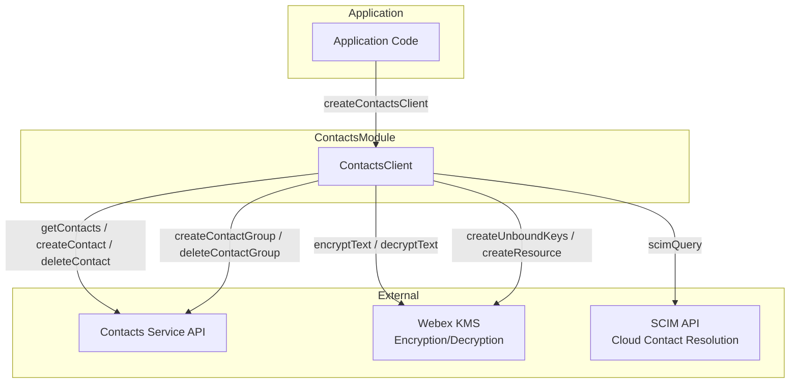
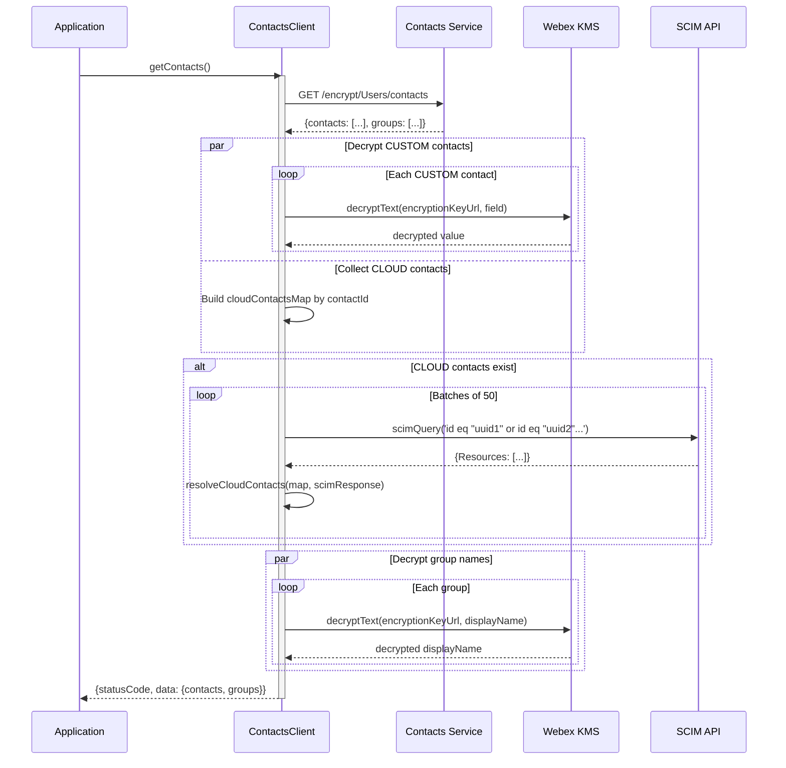
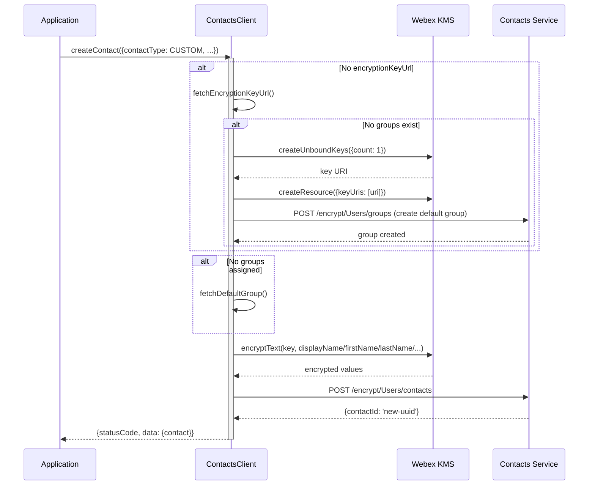
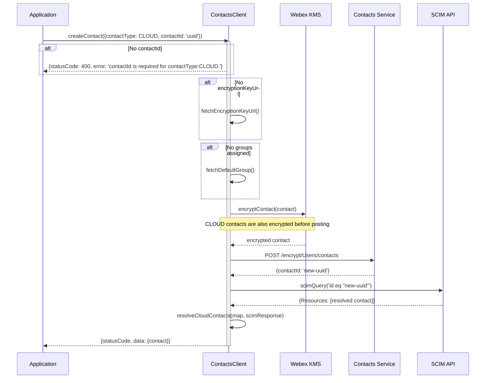
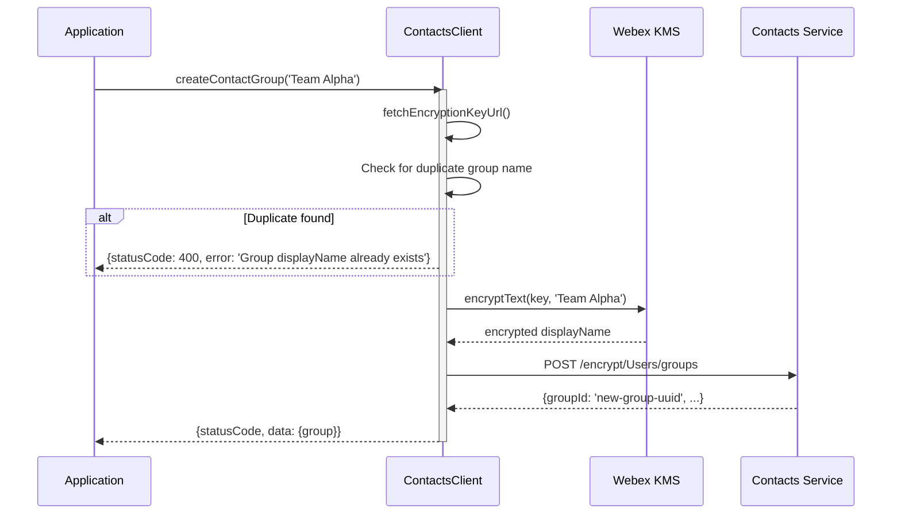

# Contacts Module — Architecture

## Component Overview

The Contacts module manages encrypted personal contacts and groups via the contacts-service API, with CLOUD contact resolution through SCIM. Architecture: **Application -> ContactsClient -> Contacts Service / KMS / SCIM**.

### Component Table

| Layer | Component | File | Key Responsibilities |
|-------|-----------|------|---------------------|
| **Client** | `ContactsClient` | `ContactsClient.ts` | CRUD for contacts/groups, encryption/decryption, SCIM resolution, default group management |
| **SDK Bridge** | `SDKConnector` | `SDKConnector/` | Webex SDK access for HTTP requests and KMS |

### Singletons and Factories

| Component | Access Pattern | Lifecycle |
|-----------|---------------|-----------|
| `ContactsClient` | `createContactsClient(webex, logger)` factory | One per application |
| `SDKConnector` | Frozen singleton via `import SDKConnector` | Global, set once via `setWebex()` |

### File Structure

```
Contacts/
├── ContactsClient.ts          # Main class with all public and private methods
├── ContactsClient.test.ts     # Unit tests
├── types.ts                   # IContacts, Contact, ContactGroup, ContactResponse, enums
├── constants.ts               # Endpoint filters, encrypted fields enum, SCIM constants
├── contactFixtures.ts         # Test fixtures
└── ai-docs/
    ├── AGENTS.md              # Module agent doc
    └── ARCHITECTURE.md        # This file
```

---

## Data Flows

### Component Interaction Flow



---

## Sequence Diagrams

### 1. Fetching Contacts and Groups



### 2. Creating a CUSTOM Contact



### 3. Creating a CLOUD Contact



### 4. Creating a Contact Group



---

## Key Constants

### API Path Segments

| Constant | Value | Description |
|----------|-------|-------------|
| `ENCRYPT_FILTER` | `'encrypt'` | Encryption-aware API path segment |
| `USERS` | `'Users'` | Users path segment (capital U) |
| `CONTACT_FILTER` | `'contacts'` | Contacts resource path |
| `GROUP_FILTER` | `'groups'` | Groups resource path |
| `DEFAULT_GROUP_NAME` | `'Other contacts'` | Name for auto-created default group |
| `CONTACTS_SCHEMA` | `'urn:cisco:codev:identity:contact:core:1.0'` | Schema for contact/group creation |

### URL Patterns

All operations use `this.webex.request()` (not browser `fetch`):

```
GET    {contactsServiceUrl}/encrypt/Users/contacts           — fetch all contacts & groups
POST   {contactsServiceUrl}/encrypt/Users/contacts           — create contact
DELETE {contactsServiceUrl}/encrypt/Users/contacts/{contactId} — delete contact
POST   {contactsServiceUrl}/encrypt/Users/groups             — create group
DELETE {contactsServiceUrl}/encrypt/Users/groups/{groupId}    — delete group
```

### Encrypted Fields

| Field | Constant | Description |
|-------|----------|-------------|
| `addressInfo` | `encryptedFields.ADDRESS_INFO` | Contact address (each sub-field encrypted) |
| `avatarURL` | `encryptedFields.AVATAR_URL` | Avatar URL |
| `companyName` | `encryptedFields.COMPANY` | Company name |
| `displayName` | `encryptedFields.DISPLAY_NAME` | Display name |
| `emails` | `encryptedFields.EMAILS` | Email addresses (each value encrypted) |
| `firstName` | `encryptedFields.FIRST_NAME` | First name |
| `lastName` | `encryptedFields.LAST_NAME` | Last name |
| `phoneNumbers` | `encryptedFields.PHONE_NUMBERS` | Phone numbers (each value encrypted) |
| `sipAddresses` | `encryptedFields.SIP_ADDRESSES` | SIP addresses (each value encrypted) |
| `title` | `encryptedFields.TITLE` | Contact title |

### SCIM Constants

| Constant | Value | Description |
|----------|-------|-------------|
| `SCIM_ID_FILTER` | `'id eq'` | SCIM filter prefix for ID queries |
| `OR` | `' or '` | SCIM filter OR operator |
| Max contacts per query | `50` | Batch size for SCIM resolution |

---

## Implementation Details

### Local Cache Management

The `ContactsClient` maintains in-memory state that is updated during CRUD operations:
- `this.contacts: Contact[]` — Full contact list (both CUSTOM and resolved CLOUD)
- `this.groups: ContactGroup[]` — All contact groups
- `this.encryptionKeyUrl: string` — Cached encryption key URL
- `this.defaultGroupId: string` — Cached default group ID

On delete operations, the item is removed from the local cache by `findIndex` + `splice`.

### Both Contact Types Are Encrypted

The `encryptContact()` method is called for **both** `CUSTOM` and `CLOUD` contact types before posting to the contacts service. This is important: CLOUD contacts are stored encrypted server-side, then resolved via SCIM client-side for display purposes.

### Encryption Key Resolution Order

`fetchEncryptionKeyUrl()` follows this logic:
1. Return cached `this.encryptionKeyUrl` if available
2. If `this.groups` is undefined, trigger `getContacts()` to populate
3. If groups exist, return `groups[0].encryptionKeyUrl`
4. If no groups exist: create KMS keys → create default "Other contacts" group → return new key URL

### SCIM Resolution Details

Resolved SCIM fields mapped to Contact:
- `displayName` → `contact.displayName`
- `name.givenName` → `contact.firstName`
- `name.familyName` → `contact.lastName`
- `emails` → `contact.emails`
- `phoneNumbers` → `contact.phoneNumbers`
- `photos[0].value` → `contact.avatarURL`
- `urn:scim:schemas:extension:cisco:webexidentity:2.0:User.sipAddresses` → `contact.sipAddresses`
- `urn:ietf:params:scim:schemas:extension:enterprise:2.0:User.manager.displayName` → `contact.manager`
- `urn:ietf:params:scim:schemas:extension:enterprise:2.0:User.department` → `contact.department`

Unresolved contacts (SCIM ID not found in response) are returned with `resolved: false`.

---

## Troubleshooting Guide

### 1. Contacts Return Empty

**Symptoms:** `getContacts` returns empty contacts array

**Possible Causes:**
- Contacts service URL not resolved
- No contacts exist for the user
- Decryption failures (KMS key issues)

### 2. CLOUD Contacts Show `resolved: false`

**Symptoms:** CLOUD contacts have no display name, phone numbers, etc.

**Possible Causes:**
- SCIM query failed for that contact's ID
- Contact was deleted from the organization directory
- SCIM service unavailable (non-fatal; unresolved contacts are returned with `resolved: false`)

### 3. Group Creation Fails with 400

**Symptoms:** `createContactGroup` returns `statusCode: 400`

**Possible Causes:**
- Duplicate group name already exists
- KMS key creation failed

### 4. Encryption/Decryption Errors

**Symptoms:** Contact fields appear as encrypted ciphertext or operations fail

**Possible Causes:**
- `encryptionKeyUrl` is invalid or expired
- KMS service unreachable
- Webex SDK encryption plugin not initialized

### 5. Create Contact Returns 400 for CLOUD Type

**Symptoms:** `createContact` with `contactType: CLOUD` returns error

**Fix:** Ensure `contactId` is provided — it is required for CLOUD contacts.

---

## Related Documentation

- [AGENTS.md](./AGENTS.md) — Overview, examples, public API
