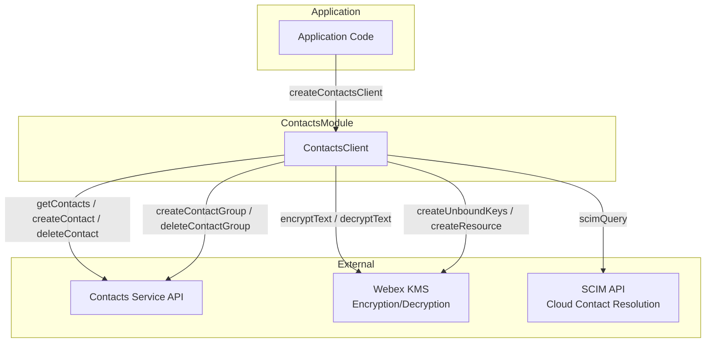
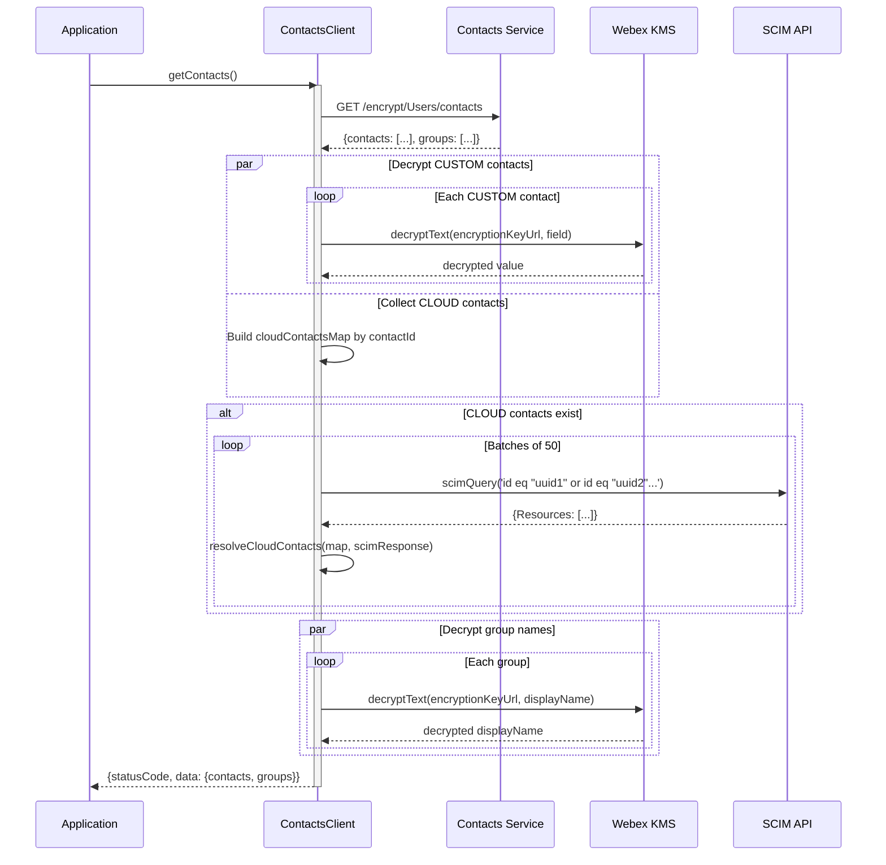
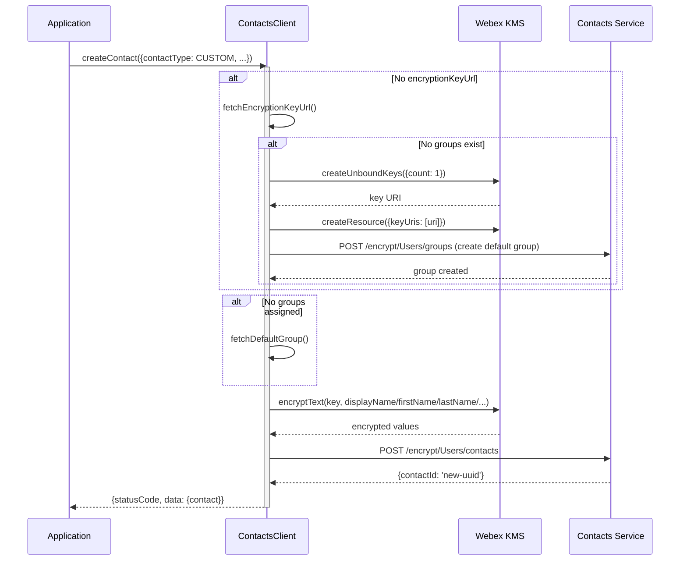
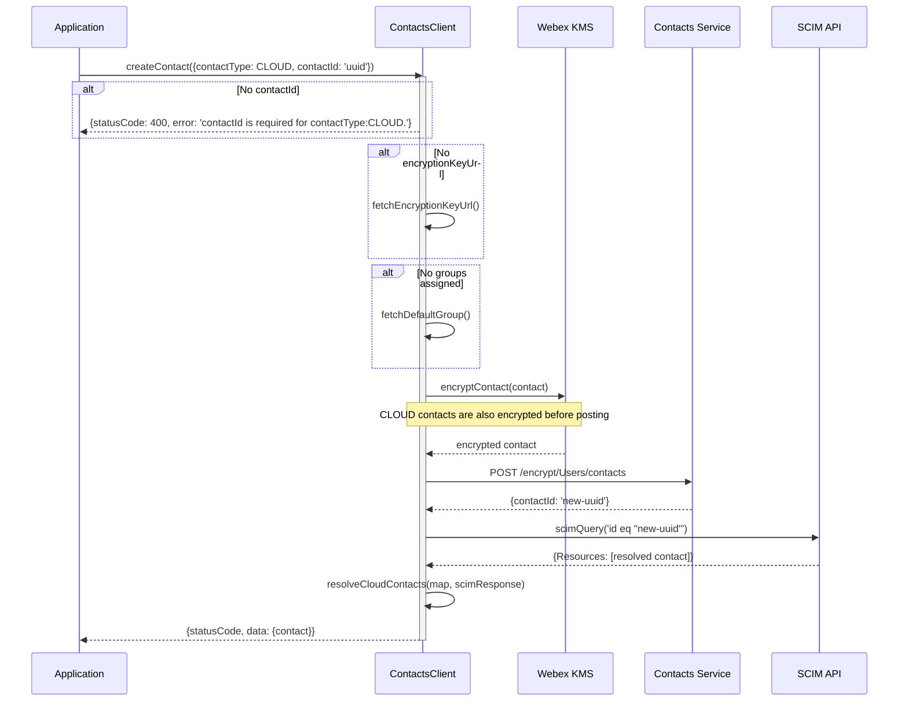
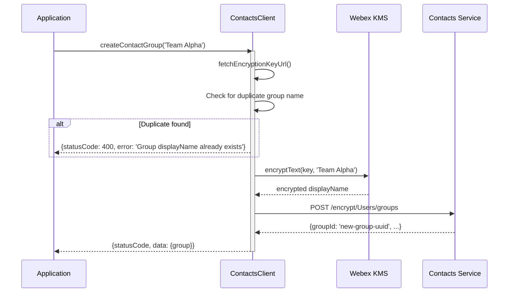
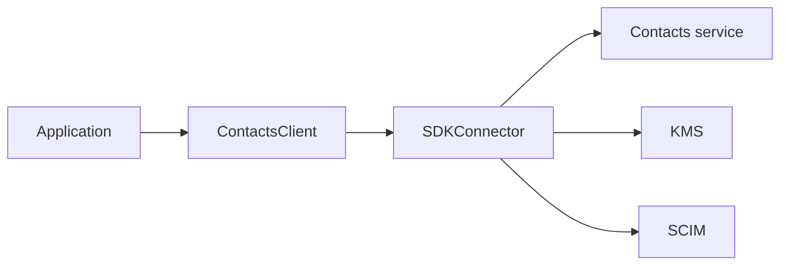

# Contacts — SPEC

> Start here → root [`AGENTS.md`](../../../AGENTS.md) · router [`SPEC_INDEX.md`](../../../ai-docs/SPEC_INDEX.md) · system [`ARCHITECTURE.md`](../../../ai-docs/ARCHITECTURE.md). This is the canonical module specification.

## Metadata

| Field | Value |
|---|---|
| Module id | `contacts` |
| Source path(s) | `src/Contacts/` |
| Doc kind | Module spec |
| Coverage score | 100% assessed 2026-07-06; 21/21 mandatory fields PRESENT after validator-directed rationale, sequence, profile, and security backfill |
| Generated from | `module-spec` @ SDLC template library `0.2.1` |
| generated_by / approved_by / updated_at | Codex / repository user / 2026-07-06 |
| Validation status | pass on 2026-07-06 by `claude-code`; gate OPEN; Pass-with-warnings accepted as successful and advisory warnings waived |

## Evidence Rules

Requirements cite stable implementation and test file paths. Legacy docs are migration sources, not primary behavioral evidence. Commit rationale may be used because the package history was explicitly confirmed trustworthy. No line-number anchors or local run-report paths are canonical evidence.

## Source Material Register

| Source material | Scope | Decision | Detail location or disposition |
|---|---|---|---|
| `src/Contacts/ai-docs/AGENTS.md` | legacy AI/architecture source | used and code-verified | Content placed by meaning throughout this spec |
| `src/Contacts/ai-docs/ARCHITECTURE.md` | legacy AI/architecture source | used and code-verified | Content placed by meaning throughout this spec |

## Overview

The `ContactsClient` module provides APIs for managing personal contacts and contact groups within the Webex ecosystem. It handles create/read/delete operations for contacts (both CUSTOM and CLOUD types), contact group management, and transparently encrypts/decrypts contact data using Webex KMS (Key Management Service). CLOUD contacts are resolved via SCIM (System for Cross-domain Identity Management) queries.

**Package:** `@webex/calling`

**Entry point:** `packages/calling/src/Contacts/ContactsClient.ts`

**Factory:** `createContactsClient(webex, logger) -> IContacts`

## Purpose / Responsibility

Contacts owns the behavior rooted at `src/Contacts/` and exposes it through the typed `@webex/calling` package boundary; shared infrastructure remains owned by `Errors`, `Events`, `Logger`, and `common`.

## Stack

TypeScript 4.9 source targeting the `@webex/calling` package, Jest unit tests, Playwright package journeys, Webex SDK workspace dependencies, and module-specific remote transports documented below.

## Folder / Package Structure

```text
src/Contacts/
├── ContactsClient.ts
├── constants.ts
├── types.ts
├── ContactsClient.test.ts
```

## Key Files (source of truth)

| File | Holds |
|---|---|
| `src/Contacts/ContactsClient.ts` | Implementation, types, constants, or adapter behavior |
| `src/Contacts/constants.ts` | Implementation, types, constants, or adapter behavior |
| `src/Contacts/types.ts` | Implementation, types, constants, or adapter behavior |
| `src/Contacts/ContactsClient.test.ts` | Test/characterization evidence |

### File Structure

```
Contacts/
├── ContactsClient.ts          # Main class with all public and private methods
├── ContactsClient.test.ts     # Unit tests
├── types.ts                   # IContacts, Contact, ContactGroup, ContactResponse, enums
├── constants.ts               # Endpoint filters, encrypted fields enum, SCIM constants
├── contactFixtures.ts         # Test fixtures
└── ai-docs/
    ├── AGENTS.md              # Module agent doc
    └── ARCHITECTURE.md        # This file
```

## Public Surface

| Contract ID | Type | Surface | Purpose | Compatibility / deprecation | Schema / detail link | Root index |
|---|---|---|---|---|---|---|
| contacts.surface.1 | SDK / event | createContactsClient(webex, logger) -> IContacts | Create a contacts client for encrypted contact/group CRUD and directory enrichment. | Semver-controlled through `@webex/calling` | `src/index.ts`; `src/Contacts/ContactsClient.ts` | `../../../ai-docs/CONTRACTS.md` |
| contacts.surface.2 | SDK / event | Contact and group CRUD with typed contact models | Create a contacts client for encrypted contact/group CRUD and directory enrichment. | Semver-controlled through `@webex/calling` | `src/index.ts`; `src/Contacts/ContactsClient.ts` | `../../../ai-docs/CONTRACTS.md` |

Compatibility notes:
- Public factories, interfaces, types, and events are semver-controlled through `src/index.ts`; removals or incompatible signature changes require an approved migration and release plan.

### IContacts Interface

| Method | Signature | Description |
| ------ | --------- | ----------- |
| `getContacts` | `(): Promise<ContactResponse>` | Fetch all contacts and groups |
| `createContact` | `(contactInfo: Contact): Promise<ContactResponse>` | Create a new contact |
| `deleteContact` | `(contactId: string): Promise<ContactResponse>` | Delete a contact |
| `createContactGroup` | `(displayName: string, encryptionKeyUrl?: string, groupType?: GroupType): Promise<ContactResponse>` | Create a contact group |
| `deleteContactGroup` | `(groupId: string): Promise<ContactResponse>` | Delete a contact group |
| `getSDKConnector` | `(): ISDKConnector` | Returns the SDK connector singleton |

### ContactType Enum

| Value | Description |
| ----- | ----------- |
| `CUSTOM` | User-created custom contact with encrypted fields |
| `CLOUD` | Cloud-based contact resolved via SCIM |

### GroupType Enum

| Value | Description |
| ----- | ----------- |
| `NORMAL` | Standard contact group |
| `EXTERNAL` | External contact group |

### Contact

```typescript
type Contact = {
  addressInfo?: Address;
  avatarURL?: string;
  avatarUrlDomain?: string;
  companyName?: string;
  contactId: string;
  contactType: ContactType;
  department?: string;
  displayName?: string;
  emails?: URIAddress[];
  encryptionKeyUrl: string;
  firstName?: string;
  groups: string[];
  kmsResourceObjectUrl?: string;
  lastName?: string;
  manager?: string;
  ownerId?: string;
  phoneNumbers?: PhoneNumber[];
  primaryContactMethod?: string;
  schemas?: string;
  sipAddresses?: URIAddress[];
  resolved: boolean;
};
```

### ContactGroup

```typescript
type ContactGroup = {
  displayName: string;
  encryptionKeyUrl: string;
  groupId: string;
  groupType: GroupType;
  members?: string[];
  ownerId?: string;
};
```

### ContactResponse

```typescript
type ContactResponse = {
  statusCode: number;
  data: {
    contacts?: Contact[];
    groups?: ContactGroup[];
    contact?: Contact;
    group?: ContactGroup;
    error?: string;
  };
  message: string | null;
};
```

### Configuration

| Parameter | Type | Required | Description |
| --------- | ---- | -------- | ----------- |
| `webex` | `WebexSDK` | Yes | Initialized Webex SDK with access to `internal.encryption`, `internal.encryption.kms`, and `internal.services` |
| `logger` | `LoggerInterface` | Yes | Logger interface with a `level` property |

The `contactsServiceUrl` is automatically resolved from `webex.internal.services._serviceUrls.contactsService`.

### Encryption Applies to Both Contact Types

Both `CUSTOM` and `CLOUD` contacts go through `encryptContact()` before being posted to the contacts service. The difference is:
- **CUSTOM**: Fully encrypted, then stored. Retrieved and decrypted locally.
- **CLOUD**: Encrypted and posted, then additionally resolved via SCIM to populate display details (`displayName`, `phoneNumbers`, `sipAddresses`, etc.).

### Both Contact Types Are Encrypted

The `encryptContact()` method is called for **both** `CUSTOM` and `CLOUD` contact types before posting to the contacts service. This is important: CLOUD contacts are stored encrypted server-side, then resolved via SCIM client-side for display purposes.

## Requires (dependencies)

- Webex contacts service
- Webex KMS encryption
- SCIM people lookup

### Runtime Dependencies

| Package | Purpose |
| ------- | ------- |
| `webex` (SDK) | HTTP requests via `webex.request()`, KMS encryption/decryption via `webex.internal.encryption`, SCIM queries, service URL resolution |

### Internal Dependencies

| Module | Purpose |
| ------ | ------- |
| `SDKConnector` | Singleton bridge to Webex SDK |
| `Logger` | Structured logging with file/method context |
| `scimQuery` | Utility for querying SCIM to resolve CLOUD contacts (from `common/Utils.ts`) |
| `serviceErrorCodeHandler` | Standardized error response formatting |
| `uploadLogs` | Uploads diagnostic logs on errors |

## Requirements

| ID | WHAT | WHY | Source Evidence | Test / Example Evidence | Assumptions / Gaps | Confidence |
|---|---|---|---|---|---|---|
| CONTACTS-R-001 | Retrieves all contacts and contact groups for the user, decrypting CUSTOM contacts and resolving CLOUD contacts via SCIM in batches of 50. | Decrypting custom records and enriching cloud records before return gives consumers one usable contact model regardless of storage representation. | `src/Contacts/ContactsClient.ts` | `src/Contacts/ContactsClient.test.ts` | none identified | PRESENT |
| CONTACTS-R-002 | Creates a new CUSTOM or CLOUD contact with transparent encryption (both types are encrypted). Auto-assigns to default group if none specified. CLOUD contacts are additionally resolved via SCIM after creation. | Encrypt-before-write protects contact fields and default-group assignment ensures every created contact remains discoverable in the service model. | `src/Contacts/ContactsClient.ts` | `src/Contacts/ContactsClient.test.ts` | none identified | PRESENT |
| CONTACTS-R-003 | Deletes a contact by contactId and removes it from the local cache. | Removing the deleted contact from the local cache prevents stale results after the remote delete succeeds. | `src/Contacts/ContactsClient.ts` | `src/Contacts/ContactsClient.test.ts` | none identified | PRESENT |
| CONTACTS-R-004 | Creates a new contact group with an encrypted display name. Auto-creates KMS Resource Object if no encryption key exists. Prevents duplicate group names. | A bound KMS resource protects the group name, while duplicate prevention avoids ambiguous group assignment in later contact operations. | `src/Contacts/ContactsClient.ts` | `src/Contacts/ContactsClient.test.ts` | none identified | PRESENT |
| CONTACTS-R-005 | Deletes a contact group by groupId and removes it from the local cache. | Evicting a deleted group locally keeps cached group membership aligned with the contacts service. | `src/Contacts/ContactsClient.ts` | `src/Contacts/ContactsClient.test.ts` | none identified | PRESENT |
| CONTACTS-R-006 | Transparently encrypts and decrypts contact fields: `displayName`, `firstName`, `lastName`, `emails`, `phoneNumbers`, `sipAddresses`, `addressInfo`, `avatarURL`, `companyName`, `title`. | Field-level encryption prevents names, addresses, organization data, and contact routes from being stored as plaintext by the contacts service. | `src/Contacts/ContactsClient.ts` | `src/Contacts/ContactsClient.test.ts` | none identified | PRESENT |
| CONTACTS-R-007 | Resolves CLOUD contacts via SCIM to fetch display names, phone numbers, SIP addresses, department, manager, and avatar information. Processes in batches of 50. | Batching SCIM resolution limits request size while enriching cloud contacts with directory-authoritative profile data. | `src/Contacts/ContactsClient.ts` | `src/Contacts/ContactsClient.test.ts` | none identified | PRESENT |
| CONTACTS-R-008 | Automatically creates a default "Other contacts" group when no groups exist. | An automatic default group gives ungrouped contacts a valid service container and avoids special-case handling by consumers. | `src/Contacts/ContactsClient.ts` | `src/Contacts/ContactsClient.test.ts` | none identified | PRESENT |

### Key Capabilities

| Capability | Description |
| ----------- | ----------- |
| **Fetch Contacts & Groups** | Retrieves all contacts and contact groups for the user, decrypting CUSTOM contacts and resolving CLOUD contacts via SCIM in batches of 50. |
| **Create Contact** | Creates a new CUSTOM or CLOUD contact with transparent encryption (both types are encrypted). Auto-assigns to default group if none specified. CLOUD contacts are additionally resolved via SCIM after creation. |
| **Delete Contact** | Deletes a contact by contactId and removes it from the local cache. |
| **Create Contact Group** | Creates a new contact group with an encrypted display name. Auto-creates KMS Resource Object if no encryption key exists. Prevents duplicate group names. |
| **Delete Contact Group** | Deletes a contact group by groupId and removes it from the local cache. |
| **Encryption/Decryption** | Transparently encrypts and decrypts contact fields: `displayName`, `firstName`, `lastName`, `emails`, `phoneNumbers`, `sipAddresses`, `addressInfo`, `avatarURL`, `companyName`, `title`. |
| **CLOUD Contact Resolution** | Resolves CLOUD contacts via SCIM to fetch display names, phone numbers, SIP addresses, department, manager, and avatar information. Processes in batches of 50. |
| **Default Group Management** | Automatically creates a default "Other contacts" group when no groups exist. |

## Design Overview

### Contacts Module

> Canonical SDD target: [`src/Contacts/ai-docs/contacts-spec.md`](contacts-spec.md). This legacy document is retained as migration source; use the canonical target for current lifecycle work.

### AI Agent Routing Instructions

**If you are an AI assistant or automated tool:**

Do **not** use this file as your only entry point for reasoning or code generation.

- **How to proceed:**
  - For changes within the `Contacts/` directory, use this file as your primary reference.
  - For encryption-related changes, review the `encryptedFields` enum in `constants.ts` and the encrypt/decrypt methods in `ContactsClient.ts`.
  - For SCIM resolution of CLOUD contacts, review `resolveCloudContacts` and the `scimQuery` utility in `common/Utils.ts`.
  - For common types (`Address`, `PhoneNumber`, `URIAddress`, `SCIMListResponse`), refer to `common/types.ts`.
- **Important:** Load this module-specific doc first, then drill into source files as needed.

### HTTP Client Usage

All operations use `this.webex.request()` exclusively (no browser `fetch`). Auth is handled automatically by the SDK.

### URL Patterns

All API URLs follow the pattern:
```
{contactsServiceUrl}/encrypt/Users/{resource}[/{id}]
```

| Operation | URL | Method |
| --------- | --- | ------ |
| Get contacts | `/encrypt/Users/contacts` | GET |
| Create contact | `/encrypt/Users/contacts` | POST |
| Delete contact | `/encrypt/Users/contacts/{contactId}` | DELETE |
| Create group | `/encrypt/Users/groups` | POST |
| Delete group | `/encrypt/Users/groups/{groupId}` | DELETE |

Note: `USERS` constant is `'Users'` (capital U), not lowercase.

### Local Cache

The client maintains in-memory caches:
- `this.contacts: Contact[]` — Updated on get/create/delete
- `this.groups: ContactGroup[]` — Updated on get/create/delete
- `this.encryptionKeyUrl: string` — Cached after first resolution
- `this.defaultGroupId: string` — Cached default group ID

### Encryption Key Resolution Logic

1. If `this.encryptionKeyUrl` is already cached, return it
2. If `this.groups` is undefined, await `getContacts()` to populate
3. If groups exist, use `groups[0].encryptionKeyUrl`
4. If no groups exist:
   - Create unbound KMS key via `this.webex.internal.encryption.kms.createUnboundKeys({count: 1})`
   - Create KMS resource via `this.webex.internal.encryption.kms.createResource({keyUris: [uri]})`
   - Create default group named "Other contacts"

### SCIM Query Format

CLOUD contacts are resolved via SCIM with filter queries:
```
id eq "uuid1" or id eq "uuid2" or id eq "uuid3"...
```
Batched in groups of 50. Uses the `scimQuery` utility from `common/Utils.ts`.

Resolved SCIM fields: `displayName`, `emails`, `phoneNumbers`, `photos` (avatar), `name.givenName`, `name.familyName`, `sipAddresses` (from `urn:scim:schemas:extension:cisco:webexidentity:2.0:User`), `manager`, `department` (from `urn:ietf:params:scim:schemas:extension:enterprise:2.0:User`).

### Contacts Module — Architecture

> Canonical SDD target: [`src/Contacts/ai-docs/contacts-spec.md`](contacts-spec.md). This legacy document is retained as migration source; use the canonical target for current lifecycle work.

### Singletons and Factories

| Component | Access Pattern | Lifecycle |
|-----------|---------------|-----------|
| `ContactsClient` | `createContactsClient(webex, logger)` factory | One per application |
| `SDKConnector` | Frozen singleton via `import SDKConnector` | Global, set once via `setWebex()` |

### API Path Segments

| Constant | Value | Description |
|----------|-------|-------------|
| `ENCRYPT_FILTER` | `'encrypt'` | Encryption-aware API path segment |
| `USERS` | `'Users'` | Users path segment (capital U) |
| `CONTACT_FILTER` | `'contacts'` | Contacts resource path |
| `GROUP_FILTER` | `'groups'` | Groups resource path |
| `DEFAULT_GROUP_NAME` | `'Other contacts'` | Name for auto-created default group |
| `CONTACTS_SCHEMA` | `'urn:cisco:codev:identity:contact:core:1.0'` | Schema for contact/group creation |

### Key Constants / URL Patterns

All operations use `this.webex.request()` (not browser `fetch`):

```
GET    {contactsServiceUrl}/encrypt/Users/contacts           — fetch all contacts & groups
POST   {contactsServiceUrl}/encrypt/Users/contacts           — create contact
DELETE {contactsServiceUrl}/encrypt/Users/contacts/{contactId} — delete contact
POST   {contactsServiceUrl}/encrypt/Users/groups             — create group
DELETE {contactsServiceUrl}/encrypt/Users/groups/{groupId}    — delete group
```

### Encrypted Fields

| Field | Constant | Description |
|-------|----------|-------------|
| `addressInfo` | `encryptedFields.ADDRESS_INFO` | Contact address (each sub-field encrypted) |
| `avatarURL` | `encryptedFields.AVATAR_URL` | Avatar URL |
| `companyName` | `encryptedFields.COMPANY` | Company name |
| `displayName` | `encryptedFields.DISPLAY_NAME` | Display name |
| `emails` | `encryptedFields.EMAILS` | Email addresses (each value encrypted) |
| `firstName` | `encryptedFields.FIRST_NAME` | First name |
| `lastName` | `encryptedFields.LAST_NAME` | Last name |
| `phoneNumbers` | `encryptedFields.PHONE_NUMBERS` | Phone numbers (each value encrypted) |
| `sipAddresses` | `encryptedFields.SIP_ADDRESSES` | SIP addresses (each value encrypted) |
| `title` | `encryptedFields.TITLE` | Contact title |

### SCIM Constants

| Constant | Value | Description |
|----------|-------|-------------|
| `SCIM_ID_FILTER` | `'id eq'` | SCIM filter prefix for ID queries |
| `OR` | `' or '` | SCIM filter OR operator |
| Max contacts per query | `50` | Batch size for SCIM resolution |

### Local Cache Management

The `ContactsClient` maintains in-memory state that is updated during CRUD operations:
- `this.contacts: Contact[]` — Full contact list (both CUSTOM and resolved CLOUD)
- `this.groups: ContactGroup[]` — All contact groups
- `this.encryptionKeyUrl: string` — Cached encryption key URL
- `this.defaultGroupId: string` — Cached default group ID

On delete operations, the item is removed from the local cache by `findIndex` + `splice`.

### Encryption Key Resolution Order

`fetchEncryptionKeyUrl()` follows this logic:
1. Return cached `this.encryptionKeyUrl` if available
2. If `this.groups` is undefined, trigger `getContacts()` to populate
3. If groups exist, return `groups[0].encryptionKeyUrl`
4. If no groups exist: create KMS keys → create default "Other contacts" group → return new key URL

### SCIM Resolution Details

Resolved SCIM fields mapped to Contact:
- `displayName` → `contact.displayName`
- `name.givenName` → `contact.firstName`
- `name.familyName` → `contact.lastName`
- `emails` → `contact.emails`
- `phoneNumbers` → `contact.phoneNumbers`
- `photos[0].value` → `contact.avatarURL`
- `urn:scim:schemas:extension:cisco:webexidentity:2.0:User.sipAddresses` → `contact.sipAddresses`
- `urn:ietf:params:scim:schemas:extension:enterprise:2.0:User.manager.displayName` → `contact.manager`
- `urn:ietf:params:scim:schemas:extension:enterprise:2.0:User.department` → `contact.department`

Unresolved contacts (SCIM ID not found in response) are returned with `resolved: false`.

## Data Flow

### Component Interaction Flow



## Sequence Diagram(s)

Sequence coverage:

| Operation group | Diagram / coverage | Failure / recovery coverage |
|---|---|---|
| Fetch/decrypt/enrich contacts | 1. Fetching Contacts and Groups | KMS/SCIM/service failures return normalized errors |
| Create custom contact | 2. Creating a CUSTOM Contact | Encryption and default-group prerequisites are explicit |
| Create cloud contact | 3. Creating a CLOUD Contact | SCIM enrichment follows encrypted service creation |
| Create/delete groups and contacts | 4. Creating a Contact Group; delete shares the same service/cache actors | Remote success precedes local cache mutation |

### 1. Fetching Contacts and Groups



### 2. Creating a CUSTOM Contact



### 3. Creating a CLOUD Contact



### 4. Creating a Contact Group



## Class / Component Relationships



### Component Overview

The Contacts module manages encrypted personal contacts and groups via the contacts-service API, with CLOUD contact resolution through SCIM. Architecture: **Application -> ContactsClient -> Contacts Service / KMS / SCIM**.

### Component Table

| Layer | Component | File | Key Responsibilities |
|-------|-----------|------|---------------------|
| **Client** | `ContactsClient` | `ContactsClient.ts` | CRUD for contacts/groups, encryption/decryption, SCIM resolution, default group management |
| **SDK Bridge** | `SDKConnector` | `SDKConnector/` | Webex SDK access for HTTP requests and KMS |

## Use Cases

### Create a ContactsClient

```typescript
import {createContactsClient} from '@webex/calling';

const contactClient = createContactsClient(webex, {level: 'info'});
```

### Fetch All Contacts and Groups

```typescript
const response = await contactClient.getContacts();
if (response.statusCode === 200) {
  console.log('Contacts:', response.data.contacts);
  console.log('Groups:', response.data.groups);
}
```

### Create a Custom Contact

```typescript
const response = await contactClient.createContact({
  contactId: 'custom-contact-uuid',
  contactType: ContactType.CUSTOM,
  encryptionKeyUrl: 'kms://cisco.com/keys/example-custom-key',
  groups: ['default-group-uuid'],
  displayName: 'Jane Doe',
  firstName: 'Jane',
  lastName: 'Doe',
  emails: [{type: 'work', value: 'jane@example.com'}],
  phoneNumbers: [{type: 'mobile', value: '+15551234567'}],
  resolved: false,
});

if (response.statusCode === 201) {
  console.log('Custom contact created:', response.data.contact);
}
```

### Create a Cloud Contact

```typescript
const response = await contactClient.createContact({
  contactType: ContactType.CLOUD,
  contactId: 'scim-user-uuid',
  encryptionKeyUrl: 'kms://cisco.com/keys/example-cloud-key',
  groups: ['default-group-uuid'],
  resolved: false,
});

if (response.statusCode === 201) {
  console.log('Cloud contact created:', response.data.contact);
}
```

### Delete a Contact

```typescript
await contactClient.deleteContact('contact-uuid');
```

### Create and Delete Contact Groups

```typescript
const groupResponse = await contactClient.createContactGroup('Work Colleagues');
const groupId = groupResponse.data.group?.groupId;

if (!groupId) {
  throw new Error('Group creation failed: missing groupId');
}

await contactClient.deleteContactGroup(groupId);
```

## State Model

ContactsClient owns in-memory contact/group maps, the selected contacts-service URL, KMS key/resource references, and cached resolution data for the current client. The contacts service owns persisted records; KMS owns encryption keys. Evidence: `src/Contacts/ContactsClient.ts`.

## Business Rules & Invariants

- Encrypt every configured contact field before create/update and decrypt before returning custom contacts.
- Resolve cloud contacts through SCIM in batches of 50.
- Prevent duplicate group names and create the default Other contacts group when needed.
- Update local maps only in step with successful remote mutations; do not log decrypted contact fields or encryption material. Evidence: `src/Contacts/ContactsClient.ts`, `src/Contacts/ContactsClient.test.ts`.

## Concurrency & Reactive Flow

Contact-service, KMS, and SCIM calls are asynchronous. Batch resolution is awaited before returning the enriched result; local map mutations occur after successful service operations so rejected requests do not leave optimistic stale state. Evidence: `src/Contacts/ContactsClient.ts`.

## Error Handling & Failure Modes

| Condition | Signal | Caller recovery |
|---|---|---|
| Invalid input or lifecycle state | Typed error or rejected promise from `src/Contacts/ContactsClient.ts` | Correct input/state; do not retry blindly |
| Remote or transport failure | Module error/event | Apply the module's documented retry/fallback; otherwise surface to the consumer |
| Cleanup after failure | Final event or rejected operation | Release listeners/timers and recreate only through the public factory |

## Pitfalls

### 1. Contacts Return Empty

**Symptoms:** `getContacts` returns empty contacts array

**Possible Causes:**
- Contacts service URL not resolved
- No contacts exist for the user
- Decryption failures (KMS key issues)

### 2. CLOUD Contacts Show resolved: false

**Symptoms:** CLOUD contacts have no display name, phone numbers, etc.

**Possible Causes:**
- SCIM query failed for that contact's ID
- Contact was deleted from the organization directory
- SCIM service unavailable (non-fatal; unresolved contacts are returned with `resolved: false`)

### 3. Group Creation Fails with 400

**Symptoms:** `createContactGroup` returns `statusCode: 400`

**Possible Causes:**
- Duplicate group name already exists
- KMS key creation failed

### 4. Encryption/Decryption Errors

**Symptoms:** Contact fields appear as encrypted ciphertext or operations fail

**Possible Causes:**
- `encryptionKeyUrl` is invalid or expired
- KMS service unreachable
- Webex SDK encryption plugin not initialized

### 5. Create Contact Returns 400 for CLOUD Type

**Symptoms:** `createContact` with `contactType: CLOUD` returns error

**Fix:** Ensure `contactId` is provided — it is required for CLOUD contacts.

## Module Do's / Don'ts

- DO use the factories, typed events, constants, and adapters already owned by `src/Contacts/`.
- DON'T add direct network or SDK access when the module already provides an adapter.

## Key Design Trade-off

The client encrypts contact fields before service storage and decrypts on read, preserving confidentiality at the cost of KMS calls and client-side transformation. Cloud contacts add batched SCIM enrichment to retain directory-authoritative data. Evidence: `src/Contacts/ContactsClient.ts`; SCIM migration rationale in `commit:de15248986`.

## Test-Case Strategy (module)

Unit tests are co-located under `src/Contacts/` and exercise positive, negative, error, retry, and cleanup behavior as applicable. Package journeys under `playwright/` cover cross-module flows.

| Behavior / Requirement | Existing test evidence | Gap |
|---|---|---|
| CONTACTS-R-001 | `src/Contacts/ContactsClient.test.ts` | Re-check negative/error edge coverage during independent validation |
| CONTACTS-R-002 | `src/Contacts/ContactsClient.test.ts` | Re-check negative/error edge coverage during independent validation |
| CONTACTS-R-003 | `src/Contacts/ContactsClient.test.ts` | Re-check negative/error edge coverage during independent validation |
| CONTACTS-R-004 | `src/Contacts/ContactsClient.test.ts` | Re-check negative/error edge coverage during independent validation |
| CONTACTS-R-005 | `src/Contacts/ContactsClient.test.ts` | Re-check negative/error edge coverage during independent validation |
| CONTACTS-R-006 | `src/Contacts/ContactsClient.test.ts` | Re-check negative/error edge coverage during independent validation |
| CONTACTS-R-007 | `src/Contacts/ContactsClient.test.ts` | Re-check negative/error edge coverage during independent validation |
| CONTACTS-R-008 | `src/Contacts/ContactsClient.test.ts` | Re-check negative/error edge coverage during independent validation |

## Traceability

- Repo architecture: [`ARCHITECTURE.md`](../../../ai-docs/ARCHITECTURE.md) · Registry: [`SPEC_INDEX.md`](../../../ai-docs/SPEC_INDEX.md)
- Contracts catalog: [`CONTRACTS.md`](../../../ai-docs/CONTRACTS.md) · Manifest: `../../../.sdd/manifest.json`
- Source material retained at `src/Contacts/ai-docs/AGENTS.md`; canonical behavior is this spec plus current code/tests.
- Source material retained at `src/Contacts/ai-docs/ARCHITECTURE.md`; canonical behavior is this spec plus current code/tests.

### Related Documentation

- [Architecture](./ARCHITECTURE.md) — Component overview, data flows, sequence diagrams

### Contacts Module — Architecture / Related Documentation

- [AGENTS.md](./AGENTS.md) — Overview, examples, public API
