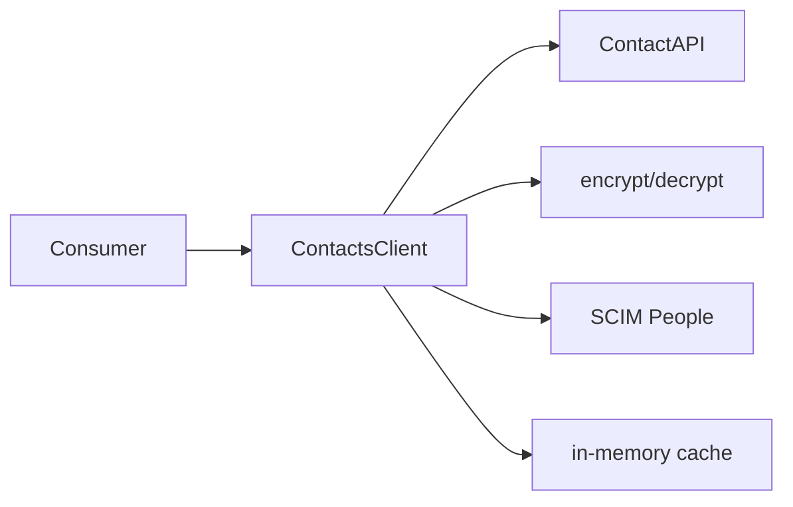
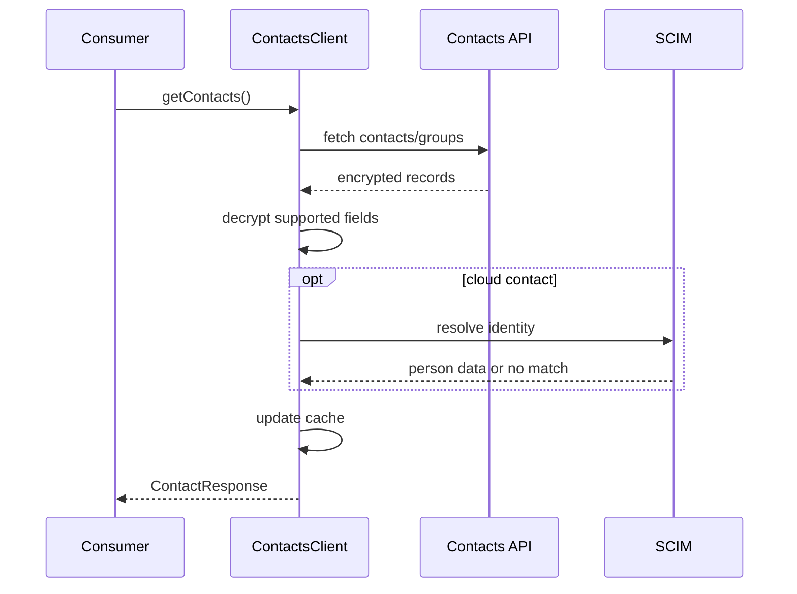
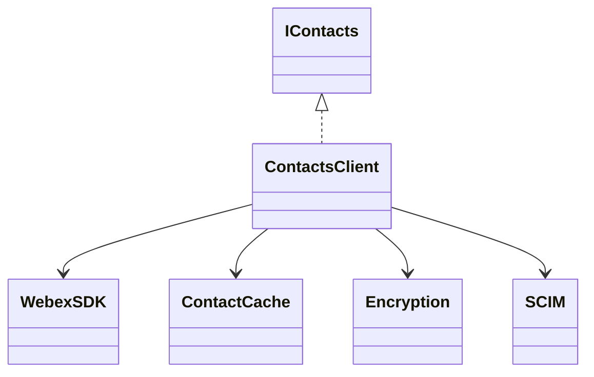

# Contacts — SPEC

> Canonical module spec. Router: [`SPEC_INDEX.md`](../../../ai-docs/SPEC_INDEX.md).

## Metadata
| Field | Value |
|---|---|
| Module id | `contacts` |
| Source path(s) | `src/Contacts/` |
| Doc kind | Module spec |
| Coverage score | 100% structural field coverage; `.generated/sdd/coverage-review-2026-07-04.md` |
| Generated from | `module-spec` @ SDLC template library `0.2.0` |
| generated_by / approved_by / updated_at | Codex / repository user / 2026-07-04 |
| Validation status | pass — Claude Code, 2026-07-04, zero Blocking findings |

## Evidence Rules
Claims cite Contacts source/tests; sensitive-data behavior is never inferred beyond code.

## Source Material Register
| Source doc | Scope | Decision | Detail location or disposition |
|---|---|---|---|
| `src/Contacts/ai-docs/AGENTS.md` | API/types/examples/notes | reconciled | Public Surface, requirements, use cases, rules |
| `src/Contacts/ai-docs/ARCHITECTURE.md` | flows/cache/encryption/troubleshooting | reconciled | design, sequences, state, failures, pitfalls |

## Overview
ContactsClient retrieves contacts/groups, creates and deletes contacts/groups, encrypts contact data, resolves cloud contacts through SCIM/People, and maintains a local cache for the client lifetime.

## Purpose / Responsibility
Own the SDK contact/group API, encryption/resolution transformations, and cache consistency; remote records remain service-owned.

## Stack
TypeScript, Webex request client, encryption/SCIM helpers, Jest.

## Folder / Package Structure
```text
Contacts/{ContactsClient.ts,types.ts,constants.ts,contactFixtures.ts,ContactsClient.test.ts,ai-docs/}
```

## Key Files (source of truth)
| File | Holds |
|---|---|
| `src/Contacts/ContactsClient.ts` | operations, cache, encryption, SCIM resolution |
| `src/Contacts/types.ts` | public interfaces/contact/group types |
| `src/Contacts/constants.ts` | endpoint and encrypted-field constants |

## Public Surface
| ID | Type | Surface | Purpose | Compatibility | Detail | Root index |
|---|---|---|---|---|---|---|
| calling.contacts.create | SDK | `createContactsClient` → `IContacts` | contact/group operations | semver public | `src/index.ts`, `types.ts` | `ai-docs/CONTRACTS.md` |

## Requires (dependencies)
Initialized Webex SDK, contacts/groups APIs, SCIM/People lookup, encryption key resolution, Logger.

## Requirements
| ID | WHAT | WHY | Source Evidence | Test Evidence | Gaps | Confidence |
|---|---|---|---|---|---|---|
| CT-R-001 | Fetch contacts/groups, decrypt supported fields, resolve cloud identities, and update cache. | Consumers need normalized contact data. | `src/Contacts/ContactsClient.ts`, `src/Contacts/types.ts` | `src/Contacts/ContactsClient.test.ts` | none | PRESENT |
| CT-R-002 | Create/delete custom and cloud contacts with correct encrypted payloads. | Sensitive contact fields must preserve service contracts. | `src/Contacts/ContactsClient.ts`, `src/Contacts/constants.ts` | module tests | none | PRESENT |
| CT-R-003 | Create/delete groups and keep local cache consistent with successful operations. | Subsequent reads must not expose stale client state. | `src/Contacts/ContactsClient.ts` | module tests | none | PRESENT |

## Design Overview
One client owns HTTP operations and a local cache. Contact type determines encryption and SCIM resolution behavior; key resolution follows the documented fallback order. Successful mutations update cached collections without claiming ownership of server data.

## Data Flow


## Sequence Diagram(s)
| Operation group | Diagram | Failure/recovery coverage |
|---|---|---|
| Fetch/resolve | Fetch contacts/groups | decryption/SCIM failure |
| Contact mutation | Create/delete contact | HTTP failure leaves cache unchanged |
| Group mutation | Create/delete group | validation/HTTP failure |


## Class / Component Relationships


## Use Cases
- Fetch all contacts and groups.
- Create/delete CUSTOM or CLOUD contacts.
- Create/delete contact groups.
- Resolve encrypted/cloud identities while preserving unresolved status. Evidence: `src/Contacts/ContactsClient.test.ts`.

## State Model
The instance caches contacts/groups and resolution state for client use. Cache contents follow successful fetch/mutation results and are not a durable system of record.

## Business Rules & Invariants
- Both contact types follow the source-defined encryption rules.
- Encryption key resolution order and SCIM query format must remain stable.
- Failed mutations do not masquerade as successful cache updates.

## Concurrency & Reactive Flow
Async HTTP, crypto, and SCIM work may overlap. Cache changes occur only at defined completion points; callers must not observe partially transformed records.

## Error Handling & Failure Modes
| Condition | Signal | Recovery |
|---|---|---|
| encryption/decryption failure | typed/rejected operation | correct key/config; do not expose raw data |
| SCIM no match/failure | unresolved contact semantics | display available safe fields/retry lookup |
| HTTP 4xx/5xx | request error | correct payload/auth and retry safely |

## Pitfalls
- Cloud contacts still use encryption rules.
- SCIM resolution failure is not the same as contact retrieval failure.
- Cache must track successful group/contact mutation results.

## Module Do's / Don'ts
- DO sanitize logs and preserve encryption/resolution distinctions.
- DON'T persist tokens, encryption keys, or plaintext sensitive payloads.

## Test-Case Strategy (module)
Tests cover fetch, cache, both contact types, encryption/decryption, SCIM resolution, groups, URL/payloads, and error responses.
| Requirement | Tests | Gap |
|---|---|---|
| CT-R-001..003 | `src/Contacts/ContactsClient.test.ts` | independent validation pending |

## Traceability
- `ai-docs/ARCHITECTURE.md` · `ai-docs/CONTRACTS.md` · `ai-docs/SECURITY.md` · `.sdd/manifest.json`

## Reconciled Source Fidelity Appendix

The standard sections above are primary. The quoted snapshots below preserve the complete routed legacy source for fidelity and independent review; their content is mapped by meaning through the Source Material Register.

### Source snapshot: `src/Contacts/ai-docs/AGENTS.md`

> # Contacts Module
>
> ## AI Agent Routing Instructions
>
> **If you are an AI assistant or automated tool:**
>
> Do **not** use this file as your only entry point for reasoning or code generation.
>
> - **How to proceed:**
>   - For changes within the `Contacts/` directory, use this file as your primary reference.
>   - For encryption-related changes, review the `encryptedFields` enum in `constants.ts` and the encrypt/decrypt methods in `ContactsClient.ts`.
>   - For SCIM resolution of CLOUD contacts, review `resolveCloudContacts` and the `scimQuery` utility in `common/Utils.ts`.
>   - For common types (`Address`, `PhoneNumber`, `URIAddress`, `SCIMListResponse`), refer to `common/types.ts`.
> - **Important:** Load this module-specific doc first, then drill into source files as needed.
>
> ---
>
> ## Overview
>
> The `ContactsClient` module provides APIs for managing personal contacts and contact groups within the Webex ecosystem. It handles create/read/delete operations for contacts (both CUSTOM and CLOUD types), contact group management, and transparently encrypts/decrypts contact data using Webex KMS (Key Management Service). CLOUD contacts are resolved via SCIM (System for Cross-domain Identity Management) queries.
>
> **Package:** `@webex/calling`
>
> **Entry point:** `packages/calling/src/Contacts/ContactsClient.ts`
>
> **Factory:** `createContactsClient(webex, logger) -> IContacts`
>
> ---
>
> ### Key Capabilities
>
> | Capability | Description |
> | ----------- | ----------- |
> | **Fetch Contacts & Groups** | Retrieves all contacts and contact groups for the user, decrypting CUSTOM contacts and resolving CLOUD contacts via SCIM in batches of 50. |
> | **Create Contact** | Creates a new CUSTOM or CLOUD contact with transparent encryption (both types are encrypted). Auto-assigns to default group if none specified. CLOUD contacts are additionally resolved via SCIM after creation. |
> | **Delete Contact** | Deletes a contact by contactId and removes it from the local cache. |
> | **Create Contact Group** | Creates a new contact group with an encrypted display name. Auto-creates KMS Resource Object if no encryption key exists. Prevents duplicate group names. |
> | **Delete Contact Group** | Deletes a contact group by groupId and removes it from the local cache. |
> | **Encryption/Decryption** | Transparently encrypts and decrypts contact fields: `displayName`, `firstName`, `lastName`, `emails`, `phoneNumbers`, `sipAddresses`, `addressInfo`, `avatarURL`, `companyName`, `title`. |
> | **CLOUD Contact Resolution** | Resolves CLOUD contacts via SCIM to fetch display names, phone numbers, SIP addresses, department, manager, and avatar information. Processes in batches of 50. |
> | **Default Group Management** | Automatically creates a default "Other contacts" group when no groups exist. |
>
> ---
>
> ## Public API
>
> ### IContacts Interface
>
> | Method | Signature | Description |
> | ------ | --------- | ----------- |
> | `getContacts` | `(): Promise<ContactResponse>` | Fetch all contacts and groups |
> | `createContact` | `(contactInfo: Contact): Promise<ContactResponse>` | Create a new contact |
> | `deleteContact` | `(contactId: string): Promise<ContactResponse>` | Delete a contact |
> | `createContactGroup` | `(displayName: string, encryptionKeyUrl?: string, groupType?: GroupType): Promise<ContactResponse>` | Create a contact group |
> | `deleteContactGroup` | `(groupId: string): Promise<ContactResponse>` | Delete a contact group |
> | `getSDKConnector` | `(): ISDKConnector` | Returns the SDK connector singleton |
>
> ### Key Types
>
> #### ContactType Enum
>
> | Value | Description |
> | ----- | ----------- |
> | `CUSTOM` | User-created custom contact with encrypted fields |
> | `CLOUD` | Cloud-based contact resolved via SCIM |
>
> #### GroupType Enum
>
> | Value | Description |
> | ----- | ----------- |
> | `NORMAL` | Standard contact group |
> | `EXTERNAL` | External contact group |
>
> #### Contact
>
> ```typescript
> type Contact = {
>   addressInfo?: Address;
>   avatarURL?: string;
>   avatarUrlDomain?: string;
>   companyName?: string;
>   contactId: string;
>   contactType: ContactType;
>   department?: string;
>   displayName?: string;
>   emails?: URIAddress[];
>   encryptionKeyUrl: string;
>   firstName?: string;
>   groups: string[];
>   kmsResourceObjectUrl?: string;
>   lastName?: string;
>   manager?: string;
>   ownerId?: string;
>   phoneNumbers?: PhoneNumber[];
>   primaryContactMethod?: string;
>   schemas?: string;
>   sipAddresses?: URIAddress[];
>   resolved: boolean;
> };
> ```
>
> #### ContactGroup
>
> ```typescript
> type ContactGroup = {
>   displayName: string;
>   encryptionKeyUrl: string;
>   groupId: string;
>   groupType: GroupType;
>   members?: string[];
>   ownerId?: string;
> };
> ```
>
> #### ContactResponse
>
> ```typescript
> type ContactResponse = {
>   statusCode: number;
>   data: {
>     contacts?: Contact[];
>     groups?: ContactGroup[];
>     contact?: Contact;
>     group?: ContactGroup;
>     error?: string;
>   };
>   message: string | null;
> };
> ```
>
> ---
>
> ## Configuration
>
> | Parameter | Type | Required | Description |
> | --------- | ---- | -------- | ----------- |
> | `webex` | `WebexSDK` | Yes | Initialized Webex SDK with access to `internal.encryption`, `internal.encryption.kms`, and `internal.services` |
> | `logger` | `LoggerInterface` | Yes | Logger interface with a `level` property |
>
> The `contactsServiceUrl` is automatically resolved from `webex.internal.services._serviceUrls.contactsService`.
>
> ---
>
> ## Examples and Use Cases
>
> ### Create a ContactsClient
>
> ```typescript
> import {createContactsClient} from '@webex/calling';
>
> const contactClient = createContactsClient(webex, {level: 'info'});
> ```
>
> ### Fetch All Contacts and Groups
>
> ```typescript
> const response = await contactClient.getContacts();
> if (response.statusCode === 200) {
>   console.log('Contacts:', response.data.contacts);
>   console.log('Groups:', response.data.groups);
> }
> ```
>
> ### Create a Custom Contact
>
> ```typescript
> const response = await contactClient.createContact({
>   contactId: 'custom-contact-uuid',
>   contactType: ContactType.CUSTOM,
>   encryptionKeyUrl: 'kms://cisco.com/keys/example-custom-key',
>   groups: ['default-group-uuid'],
>   displayName: 'Jane Doe',
>   firstName: 'Jane',
>   lastName: 'Doe',
>   emails: [{type: 'work', value: 'jane@example.com'}],
>   phoneNumbers: [{type: 'mobile', value: '+15551234567'}],
>   resolved: false,
> });
>
> if (response.statusCode === 201) {
>   console.log('Custom contact created:', response.data.contact);
> }
> ```
>
> ### Create a Cloud Contact
>
> ```typescript
> const response = await contactClient.createContact({
>   contactType: ContactType.CLOUD,
>   contactId: 'scim-user-uuid',
>   encryptionKeyUrl: 'kms://cisco.com/keys/example-cloud-key',
>   groups: ['default-group-uuid'],
>   resolved: false,
> });
>
> if (response.statusCode === 201) {
>   console.log('Cloud contact created:', response.data.contact);
> }
> ```
>
> ### Delete a Contact
>
> ```typescript
> await contactClient.deleteContact('contact-uuid');
> ```
>
> ### Create and Delete Contact Groups
>
> ```typescript
> const groupResponse = await contactClient.createContactGroup('Work Colleagues');
> const groupId = groupResponse.data.group?.groupId;
>
> if (!groupId) {
>   throw new Error('Group creation failed: missing groupId');
> }
>
> await contactClient.deleteContactGroup(groupId);
> ```
>
> ---
>
> ## Implementation Notes
>
> ### HTTP Client Usage
>
> All operations use `this.webex.request()` exclusively (no browser `fetch`). Auth is handled automatically by the SDK.
>
> ### URL Patterns
>
> All API URLs follow the pattern:
> ```
> {contactsServiceUrl}/encrypt/Users/{resource}[/{id}]
> ```
>
> | Operation | URL | Method |
> | --------- | --- | ------ |
> | Get contacts | `/encrypt/Users/contacts` | GET |
> | Create contact | `/encrypt/Users/contacts` | POST |
> | Delete contact | `/encrypt/Users/contacts/{contactId}` | DELETE |
> | Create group | `/encrypt/Users/groups` | POST |
> | Delete group | `/encrypt/Users/groups/{groupId}` | DELETE |
>
> Note: `USERS` constant is `'Users'` (capital U), not lowercase.
>
> ### Encryption Applies to Both Contact Types
>
> Both `CUSTOM` and `CLOUD` contacts go through `encryptContact()` before being posted to the contacts service. The difference is:
> - **CUSTOM**: Fully encrypted, then stored. Retrieved and decrypted locally.
> - **CLOUD**: Encrypted and posted, then additionally resolved via SCIM to populate display details (`displayName`, `phoneNumbers`, `sipAddresses`, etc.).
>
> ### Local Cache
>
> The client maintains in-memory caches:
> - `this.contacts: Contact[]` — Updated on get/create/delete
> - `this.groups: ContactGroup[]` — Updated on get/create/delete
> - `this.encryptionKeyUrl: string` — Cached after first resolution
> - `this.defaultGroupId: string` — Cached default group ID
>
> ### Encryption Key Resolution Logic
>
> 1. If `this.encryptionKeyUrl` is already cached, return it
> 2. If `this.groups` is undefined, await `getContacts()` to populate
> 3. If groups exist, use `groups[0].encryptionKeyUrl`
> 4. If no groups exist:
>    - Create unbound KMS key via `this.webex.internal.encryption.kms.createUnboundKeys({count: 1})`
>    - Create KMS resource via `this.webex.internal.encryption.kms.createResource({keyUris: [uri]})`
>    - Create default group named "Other contacts"
>
> ### SCIM Query Format
>
> CLOUD contacts are resolved via SCIM with filter queries:
> ```
> id eq "uuid1" or id eq "uuid2" or id eq "uuid3"...
> ```
> Batched in groups of 50. Uses the `scimQuery` utility from `common/Utils.ts`.
>
> Resolved SCIM fields: `displayName`, `emails`, `phoneNumbers`, `photos` (avatar), `name.givenName`, `name.familyName`, `sipAddresses` (from `urn:scim:schemas:extension:cisco:webexidentity:2.0:User`), `manager`, `department` (from `urn:ietf:params:scim:schemas:extension:enterprise:2.0:User`).
>
> ---
>
> ## Dependencies
>
> ### Runtime Dependencies
>
> | Package | Purpose |
> | ------- | ------- |
> | `webex` (SDK) | HTTP requests via `webex.request()`, KMS encryption/decryption via `webex.internal.encryption`, SCIM queries, service URL resolution |
>
> ### Internal Dependencies
>
> | Module | Purpose |
> | ------ | ------- |
> | `SDKConnector` | Singleton bridge to Webex SDK |
> | `Logger` | Structured logging with file/method context |
> | `scimQuery` | Utility for querying SCIM to resolve CLOUD contacts (from `common/Utils.ts`) |
> | `serviceErrorCodeHandler` | Standardized error response formatting |
> | `uploadLogs` | Uploads diagnostic logs on errors |
>
> ---
>
> ## Related Documentation
>
> - [Architecture](./ARCHITECTURE.md) — Component overview, data flows, sequence diagrams
>

### Source snapshot: `src/Contacts/ai-docs/ARCHITECTURE.md`

> # Contacts Module — Architecture
>
> ## Component Overview
>
> The Contacts module manages encrypted personal contacts and groups via the contacts-service API, with CLOUD contact resolution through SCIM. Architecture: **Application -> ContactsClient -> Contacts Service / KMS / SCIM**.
>
> ### Component Table
>
> | Layer | Component | File | Key Responsibilities |
> |-------|-----------|------|---------------------|
> | **Client** | `ContactsClient` | `ContactsClient.ts` | CRUD for contacts/groups, encryption/decryption, SCIM resolution, default group management |
> | **SDK Bridge** | `SDKConnector` | `SDKConnector/` | Webex SDK access for HTTP requests and KMS |
>
> ### Singletons and Factories
>
> | Component | Access Pattern | Lifecycle |
> |-----------|---------------|-----------|
> | `ContactsClient` | `createContactsClient(webex, logger)` factory | One per application |
> | `SDKConnector` | Frozen singleton via `import SDKConnector` | Global, set once via `setWebex()` |
>
> ### File Structure
>
> ```
> Contacts/
> ├── ContactsClient.ts          # Main class with all public and private methods
> ├── ContactsClient.test.ts     # Unit tests
> ├── types.ts                   # IContacts, Contact, ContactGroup, ContactResponse, enums
> ├── constants.ts               # Endpoint filters, encrypted fields enum, SCIM constants
> ├── contactFixtures.ts         # Test fixtures
> └── ai-docs/
>     ├── AGENTS.md              # Module agent doc
>     └── ARCHITECTURE.md        # This file
> ```
>
> ---
>
> ## Data Flows
>
> ### Component Interaction Flow
>
> ```mermaid
> flowchart TB
>     subgraph Application
>         App[Application Code]
>     end
>
>     subgraph ContactsModule
>         CC[ContactsClient]
>     end
>
>     subgraph External
>         CS[Contacts Service API]
>         KMS[Webex KMS\nEncryption/Decryption]
>         SCIM[SCIM API\nCloud Contact Resolution]
>     end
>
>     App -->|createContactsClient| CC
>     CC -->|getContacts / createContact / deleteContact| CS
>     CC -->|createContactGroup / deleteContactGroup| CS
>     CC -->|encryptText / decryptText| KMS
>     CC -->|createUnboundKeys / createResource| KMS
>     CC -->|scimQuery| SCIM
> ```
>
> ---
>
> ## Sequence Diagrams
>
> ### 1. Fetching Contacts and Groups
>
> ```mermaid
> sequenceDiagram
>     participant App as Application
>     participant CC as ContactsClient
>     participant CS as Contacts Service
>     participant KMS as Webex KMS
>     participant SCIM as SCIM API
>
>     App->>CC: getContacts()
>     activate CC
>     CC->>CS: GET /encrypt/Users/contacts
>     CS-->>CC: {contacts: [...], groups: [...]}
>
>     par Decrypt CUSTOM contacts
>         loop Each CUSTOM contact
>             CC->>KMS: decryptText(encryptionKeyUrl, field)
>             KMS-->>CC: decrypted value
>         end
>     and Collect CLOUD contacts
>         CC->>CC: Build cloudContactsMap by contactId
>     end
>
>     alt CLOUD contacts exist
>         loop Batches of 50
>             CC->>SCIM: scimQuery('id eq "uuid1" or id eq "uuid2"...')
>             SCIM-->>CC: {Resources: [...]}
>             CC->>CC: resolveCloudContacts(map, scimResponse)
>         end
>     end
>
>     par Decrypt group names
>         loop Each group
>             CC->>KMS: decryptText(encryptionKeyUrl, displayName)
>             KMS-->>CC: decrypted displayName
>         end
>     end
>
>     CC-->>App: {statusCode, data: {contacts, groups}}
>     deactivate CC
> ```
>
> ### 2. Creating a CUSTOM Contact
>
> ```mermaid
> sequenceDiagram
>     participant App as Application
>     participant CC as ContactsClient
>     participant KMS as Webex KMS
>     participant CS as Contacts Service
>
>     App->>CC: createContact({contactType: CUSTOM, ...})
>     activate CC
>
>     alt No encryptionKeyUrl
>         CC->>CC: fetchEncryptionKeyUrl()
>         alt No groups exist
>             CC->>KMS: createUnboundKeys({count: 1})
>             KMS-->>CC: key URI
>             CC->>KMS: createResource({keyUris: [uri]})
>             CC->>CS: POST /encrypt/Users/groups (create default group)
>             CS-->>CC: group created
>         end
>     end
>
>     alt No groups assigned
>         CC->>CC: fetchDefaultGroup()
>     end
>
>     CC->>KMS: encryptText(key, displayName/firstName/lastName/...)
>     KMS-->>CC: encrypted values
>     CC->>CS: POST /encrypt/Users/contacts
>     CS-->>CC: {contactId: 'new-uuid'}
>
>     CC-->>App: {statusCode, data: {contact}}
>     deactivate CC
> ```
>
> ### 3. Creating a CLOUD Contact
>
> ```mermaid
> sequenceDiagram
>     participant App as Application
>     participant CC as ContactsClient
>     participant KMS as Webex KMS
>     participant CS as Contacts Service
>     participant SCIM as SCIM API
>
>     App->>CC: createContact({contactType: CLOUD, contactId: 'uuid'})
>     activate CC
>
>     alt No contactId
>         CC-->>App: {statusCode: 400, error: 'contactId is required for contactType:CLOUD.'}
>     end
>
>     alt No encryptionKeyUrl
>         CC->>CC: fetchEncryptionKeyUrl()
>     end
>
>     alt No groups assigned
>         CC->>CC: fetchDefaultGroup()
>     end
>
>     CC->>KMS: encryptContact(contact)
>     Note over CC,KMS: CLOUD contacts are also encrypted before posting
>     KMS-->>CC: encrypted contact
>
>     CC->>CS: POST /encrypt/Users/contacts
>     CS-->>CC: {contactId: 'new-uuid'}
>
>     CC->>SCIM: scimQuery('id eq "new-uuid"')
>     SCIM-->>CC: {Resources: [resolved contact]}
>     CC->>CC: resolveCloudContacts(map, scimResponse)
>
>     CC-->>App: {statusCode, data: {contact}}
>     deactivate CC
> ```
>
> ### 4. Creating a Contact Group
>
> ```mermaid
> sequenceDiagram
>     participant App as Application
>     participant CC as ContactsClient
>     participant KMS as Webex KMS
>     participant CS as Contacts Service
>
>     App->>CC: createContactGroup('Team Alpha')
>     activate CC
>
>     CC->>CC: fetchEncryptionKeyUrl()
>     CC->>CC: Check for duplicate group name
>
>     alt Duplicate found
>         CC-->>App: {statusCode: 400, error: 'Group displayName already exists'}
>     end
>
>     CC->>KMS: encryptText(key, 'Team Alpha')
>     KMS-->>CC: encrypted displayName
>
>     CC->>CS: POST /encrypt/Users/groups
>     CS-->>CC: {groupId: 'new-group-uuid', ...}
>
>     CC-->>App: {statusCode, data: {group}}
>     deactivate CC
> ```
>
> ---
>
> ## Key Constants
>
> ### API Path Segments
>
> | Constant | Value | Description |
> |----------|-------|-------------|
> | `ENCRYPT_FILTER` | `'encrypt'` | Encryption-aware API path segment |
> | `USERS` | `'Users'` | Users path segment (capital U) |
> | `CONTACT_FILTER` | `'contacts'` | Contacts resource path |
> | `GROUP_FILTER` | `'groups'` | Groups resource path |
> | `DEFAULT_GROUP_NAME` | `'Other contacts'` | Name for auto-created default group |
> | `CONTACTS_SCHEMA` | `'urn:cisco:codev:identity:contact:core:1.0'` | Schema for contact/group creation |
>
> ### URL Patterns
>
> All operations use `this.webex.request()` (not browser `fetch`):
>
> ```
> GET    {contactsServiceUrl}/encrypt/Users/contacts           — fetch all contacts & groups
> POST   {contactsServiceUrl}/encrypt/Users/contacts           — create contact
> DELETE {contactsServiceUrl}/encrypt/Users/contacts/{contactId} — delete contact
> POST   {contactsServiceUrl}/encrypt/Users/groups             — create group
> DELETE {contactsServiceUrl}/encrypt/Users/groups/{groupId}    — delete group
> ```
>
> ### Encrypted Fields
>
> | Field | Constant | Description |
> |-------|----------|-------------|
> | `addressInfo` | `encryptedFields.ADDRESS_INFO` | Contact address (each sub-field encrypted) |
> | `avatarURL` | `encryptedFields.AVATAR_URL` | Avatar URL |
> | `companyName` | `encryptedFields.COMPANY` | Company name |
> | `displayName` | `encryptedFields.DISPLAY_NAME` | Display name |
> | `emails` | `encryptedFields.EMAILS` | Email addresses (each value encrypted) |
> | `firstName` | `encryptedFields.FIRST_NAME` | First name |
> | `lastName` | `encryptedFields.LAST_NAME` | Last name |
> | `phoneNumbers` | `encryptedFields.PHONE_NUMBERS` | Phone numbers (each value encrypted) |
> | `sipAddresses` | `encryptedFields.SIP_ADDRESSES` | SIP addresses (each value encrypted) |
> | `title` | `encryptedFields.TITLE` | Contact title |
>
> ### SCIM Constants
>
> | Constant | Value | Description |
> |----------|-------|-------------|
> | `SCIM_ID_FILTER` | `'id eq'` | SCIM filter prefix for ID queries |
> | `OR` | `' or '` | SCIM filter OR operator |
> | Max contacts per query | `50` | Batch size for SCIM resolution |
>
> ---
>
> ## Implementation Details
>
> ### Local Cache Management
>
> The `ContactsClient` maintains in-memory state that is updated during CRUD operations:
> - `this.contacts: Contact[]` — Full contact list (both CUSTOM and resolved CLOUD)
> - `this.groups: ContactGroup[]` — All contact groups
> - `this.encryptionKeyUrl: string` — Cached encryption key URL
> - `this.defaultGroupId: string` — Cached default group ID
>
> On delete operations, the item is removed from the local cache by `findIndex` + `splice`.
>
> ### Both Contact Types Are Encrypted
>
> The `encryptContact()` method is called for **both** `CUSTOM` and `CLOUD` contact types before posting to the contacts service. This is important: CLOUD contacts are stored encrypted server-side, then resolved via SCIM client-side for display purposes.
>
> ### Encryption Key Resolution Order
>
> `fetchEncryptionKeyUrl()` follows this logic:
> 1. Return cached `this.encryptionKeyUrl` if available
> 2. If `this.groups` is undefined, trigger `getContacts()` to populate
> 3. If groups exist, return `groups[0].encryptionKeyUrl`
> 4. If no groups exist: create KMS keys → create default "Other contacts" group → return new key URL
>
> ### SCIM Resolution Details
>
> Resolved SCIM fields mapped to Contact:
> - `displayName` → `contact.displayName`
> - `name.givenName` → `contact.firstName`
> - `name.familyName` → `contact.lastName`
> - `emails` → `contact.emails`
> - `phoneNumbers` → `contact.phoneNumbers`
> - `photos[0].value` → `contact.avatarURL`
> - `urn:scim:schemas:extension:cisco:webexidentity:2.0:User.sipAddresses` → `contact.sipAddresses`
> - `urn:ietf:params:scim:schemas:extension:enterprise:2.0:User.manager.displayName` → `contact.manager`
> - `urn:ietf:params:scim:schemas:extension:enterprise:2.0:User.department` → `contact.department`
>
> Unresolved contacts (SCIM ID not found in response) are returned with `resolved: false`.
>
> ---
>
> ## Troubleshooting Guide
>
> ### 1. Contacts Return Empty
>
> **Symptoms:** `getContacts` returns empty contacts array
>
> **Possible Causes:**
> - Contacts service URL not resolved
> - No contacts exist for the user
> - Decryption failures (KMS key issues)
>
> ### 2. CLOUD Contacts Show `resolved: false`
>
> **Symptoms:** CLOUD contacts have no display name, phone numbers, etc.
>
> **Possible Causes:**
> - SCIM query failed for that contact's ID
> - Contact was deleted from the organization directory
> - SCIM service unavailable (non-fatal; unresolved contacts are returned with `resolved: false`)
>
> ### 3. Group Creation Fails with 400
>
> **Symptoms:** `createContactGroup` returns `statusCode: 400`
>
> **Possible Causes:**
> - Duplicate group name already exists
> - KMS key creation failed
>
> ### 4. Encryption/Decryption Errors
>
> **Symptoms:** Contact fields appear as encrypted ciphertext or operations fail
>
> **Possible Causes:**
> - `encryptionKeyUrl` is invalid or expired
> - KMS service unreachable
> - Webex SDK encryption plugin not initialized
>
> ### 5. Create Contact Returns 400 for CLOUD Type
>
> **Symptoms:** `createContact` with `contactType: CLOUD` returns error
>
> **Fix:** Ensure `contactId` is provided — it is required for CLOUD contacts.
>
> ---
>
> ## Related Documentation
>
> - [AGENTS.md](./AGENTS.md) — Overview, examples, public API
>
