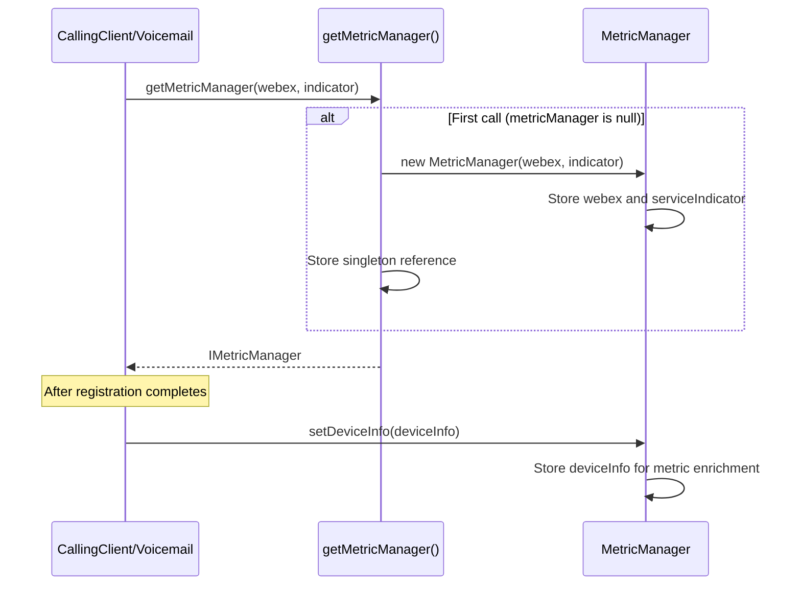
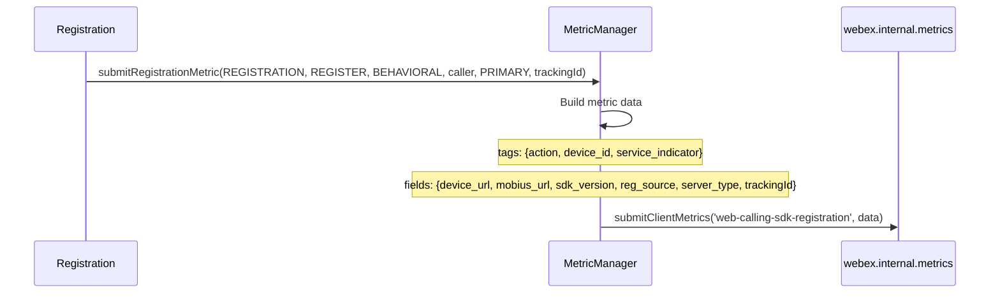
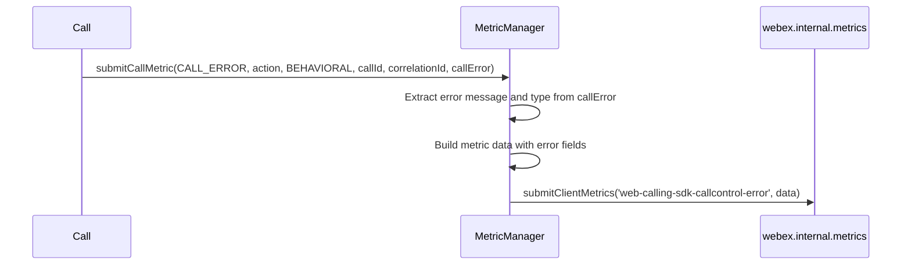
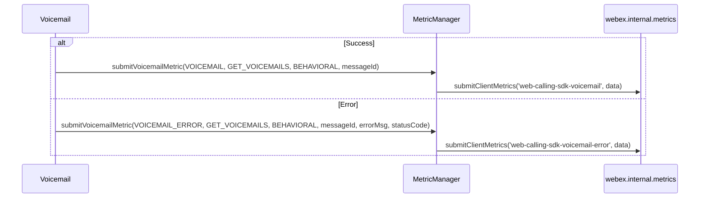
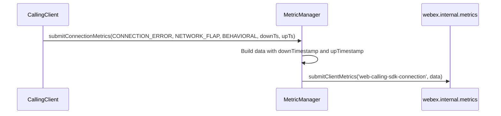

# Metrics Module — Architecture

## Component Overview

The Metrics module is a centralized telemetry singleton used by all other Calling SDK modules. Architecture: **Calling Modules -> MetricManager -> webex.internal.metrics -> Webex Cloud**.

### Component Table

| Layer | Component | File | Key Responsibilities |
|-------|-----------|------|---------------------|
| **Manager** | `MetricManager` | `index.ts` | Metric data construction, device info enrichment, metric submission |
| **Types** | Enums and interfaces | `types.ts` | `IMetricManager`, `METRIC_EVENT`, `METRIC_TYPE`, action enums |

### Singletons and Factories

| Component | Access Pattern | Lifecycle |
|-----------|---------------|-----------|
| `MetricManager` | `getMetricManager(webex?, indicator?)` module-level singleton | Created on first call with `webex`, reused thereafter |

### File Structure

```
Metrics/
├── index.ts            # MetricManager class and getMetricManager factory
├── index.test.ts       # Unit tests
├── types.ts            # IMetricManager interface, all enums and types
└── ai-docs/
    ├── AGENTS.md       # Module agent doc
    └── ARCHITECTURE.md # This file
```

---

## Data Flows

### Metric Submission Flow

```mermaid
flowchart TB
    subgraph CallingModules
        CC[CallingClient]
        Reg[Registration]
        Call[Call]
        VM[Voicemail]
    end

    subgraph MetricsModule
        MM[MetricManager\nsingleton]
    end

    subgraph WebexSDK
        Metrics[webex.internal.metrics\nsubmitClientMetrics]
    end

    subgraph Cloud
        WebexCloud[Webex Metrics Service]
    end

    CC -->|submitRegistrationMetric\nsubmitConnectionMetrics\nsubmitMobiusServersMetric\nsubmitUploadLogsMetric| MM
    Reg -->|submitRegistrationMetric| MM
    Call -->|submitCallMetric\nsubmitMediaMetric\nsubmitBNRMetric| MM
    VM -->|submitVoicemailMetric| MM

    MM -->|submitClientMetrics(name, data)| Metrics
    Metrics --> WebexCloud
```

### Metric Data Structure

Every metric submitted follows this pattern:

```mermaid
flowchart LR
    subgraph MetricPayload
        Tags[tags:\naction, device_id,\nservice_indicator]
        Fields[fields:\ndevice_url, mobius_url,\ncalling_sdk_version,\n+ metric-specific fields]
        Type[type:\noperational | behavioral]
    end
```

---

## Sequence Diagrams

### 1. MetricManager Initialization



### 2. Registration Metric Submission



### 3. Call Error Metric Submission



### 4. Voicemail Metric Submission



### 5. Connection Metric Submission



---

## Key Constants

### Common Metric Fields

Most metrics include these base fields (exceptions noted below):

| Field | Location | Source | Description |
|-------|----------|--------|-------------|
| `device_id` | tags | `deviceInfo.device.deviceId` | Registered device identifier |
| `device_url` | fields | `deviceInfo.device.clientDeviceUri` | Client device URI |
| `mobius_url` | fields | `deviceInfo.device.uri` | Mobius server URI |
| `calling_sdk_version` | fields | `process.env.CALLING_SDK_VERSION \|\| VERSION` | SDK version string |
| `service_indicator` | tags | Constructor `indicator` param | Service type (CALLING, etc.) |
| `action` | tags | `metricAction` parameter | Action being performed |

**Exceptions per method:**

| Method | Differences from common fields |
|--------|-------------------------------|
| `submitVoicemailMetric` | No `mobius_url`, no `service_indicator`. Adds `message_id` to tags. Uses `typeof process !== 'undefined'` guard for SDK version. Error puts `error` and `status_code` in **tags** (not fields). |
| `submitConnectionMetrics` | Tag key is `metricAction` (not `action`). |
| `submitBNRMetric` | No `action` tag at all. |
| `submitRegionInfoMetric` | Always uses `ServiceIndicator.CALLING` (ignores constructor `indicator`). |
| `submitMobiusServersMetric` | Always uses `ServiceIndicator.CALLING` (ignores constructor `indicator`). |
| `submitRegistrationMetric` | Field key is `trackingId` (camelCase, not `tracking_id`). |
| `submitUploadLogsMetric` | Field key is `tracking_id` (snake_case). No default case warning for invalid names. |

### Metric Name Validation

Most `MetricManager` methods validate the `name` parameter against expected `METRIC_EVENT` values (via `switch` or explicit checks). If an invalid name is received, they log a warning and do not submit the metric.

**Exceptions:**
- `submitUploadLogsMetric` does not log a warning for invalid names; it silently skips submission because `data` remains `undefined`.
- `submitConnectionMetrics` has no runtime name validation and always builds/submits metric data with the provided `name`.

### Conditional Submission

Some methods only submit error metrics when an error object is provided:
- `submitCallMetric` with `CALL_ERROR`: only submits if `callError` is non-null
- `submitMediaMetric` with `MEDIA_ERROR`: only submits if `callError` is non-null

---

## Troubleshooting Guide

### 1. Metrics Not Appearing in Dashboard

**Symptoms:** Metrics not visible in Webex metrics dashboard

**Possible Causes:**
- `MetricManager` not initialized with `webex` parameter
- `webex.internal.metrics` plugin not loaded
- `setDeviceInfo()` not called (device fields will be undefined)

### 2. Device Fields Are Undefined

**Symptoms:** Metrics show `device_id: undefined`, `device_url: undefined`

**Fix:** Ensure `setDeviceInfo(deviceInfo)` is called after successful device registration. The MetricManager stores this for all subsequent metrics.

### 3. Invalid Metric Name Warning

**Symptoms:** Log warning: "Invalid metric name received. Rejecting request to submit metric."

**Cause:** A `METRIC_EVENT` value was passed that doesn't match the expected switch/check cases for that submit method. This applies to methods that implement runtime validation.

### 4. SDK Version Shows 'unknown'

**Symptoms:** `calling_sdk_version` field is `'unknown'`

**Cause:** `process.env.CALLING_SDK_VERSION` is not set. This is expected in certain build environments. The `VERSION` constant from `CallingClient/constants.ts` provides the fallback.

---

## Related Documentation

- [AGENTS.md](./AGENTS.md) — Overview, examples, public API
