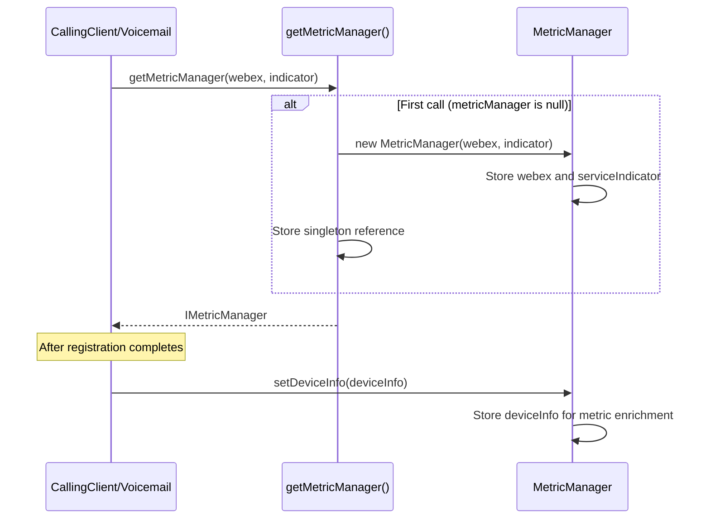
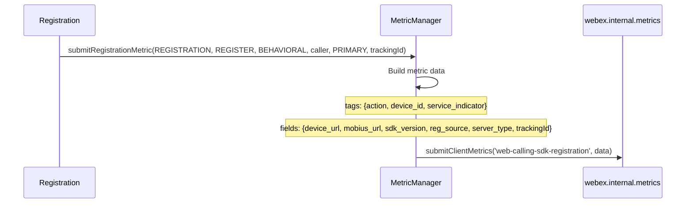
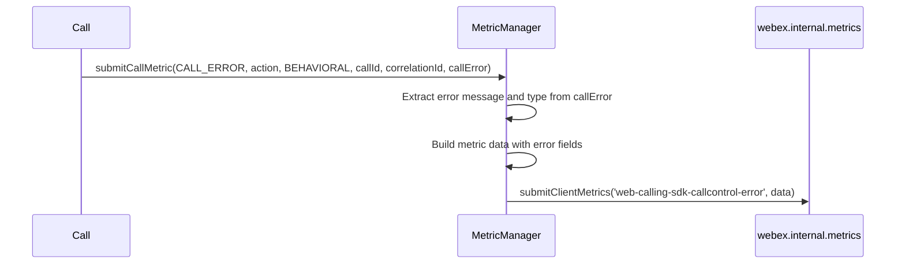
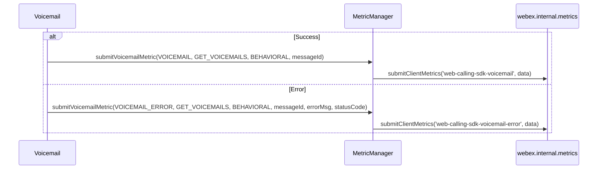
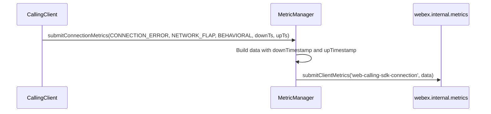
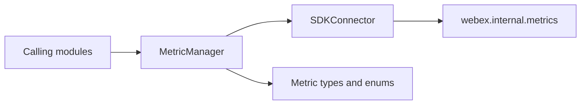

# Metrics — SPEC

> Start here → root [`AGENTS.md`](../../../AGENTS.md) · router [`SPEC_INDEX.md`](../../../ai-docs/SPEC_INDEX.md) · system [`ARCHITECTURE.md`](../../../ai-docs/ARCHITECTURE.md). This is the canonical module specification.

## Metadata

| Field | Value |
|---|---|
| Module id | `metrics` |
| Source path(s) | `src/Metrics/` |
| Doc kind | Module spec |
| Coverage score | 100% assessed 2026-07-06; 21/21 mandatory fields PRESENT after validator-directed rationale, sequence inventory, profile, telemetry-security, and visibility backfill |
| Generated from | `module-spec` @ SDLC template library `0.2.1` |
| generated_by / approved_by / updated_at | Codex / repository user / 2026-07-06 |
| Validation status | pass on 2026-07-06 by `claude-code`; gate OPEN; Pass-with-warnings accepted as successful and advisory warnings waived |

## Evidence Rules

Requirements cite stable implementation and test file paths. Legacy docs are migration sources, not primary behavioral evidence. Commit rationale may be used because the package history was explicitly confirmed trustworthy. No line-number anchors or local run-report paths are canonical evidence.

## Source Material Register

| Source material | Scope | Decision | Detail location or disposition |
|---|---|---|---|
| `src/Metrics/ai-docs/AGENTS.md` | legacy AI/architecture source | used and code-verified | Content placed by meaning throughout this spec |
| `src/Metrics/ai-docs/ARCHITECTURE.md` | legacy AI/architecture source | used and code-verified | Content placed by meaning throughout this spec |

## Overview

The `Metrics` module provides a centralized `MetricManager` singleton for collecting and submitting client-side telemetry metrics to the Webex cloud via `@webex/internal-plugin-metrics`. All other modules in the Calling SDK use MetricManager to report operational and behavioral events including registration, call control, media negotiation, voicemail operations, network connectivity, BNR toggles, log uploads, and Mobius server discovery.

**Package:** `@webex/calling`

**Entry point:** `packages/calling/src/Metrics/index.ts`

**Factory:** `getMetricManager(webex?, indicator?) -> IMetricManager`

## Purpose / Responsibility

Metrics owns the behavior rooted at `src/Metrics/` and exposes it through the typed `@webex/calling` package boundary; shared infrastructure remains owned by `Errors`, `Events`, `Logger`, and `common`.

## Stack

TypeScript 4.9 source targeting the `@webex/calling` package, Jest unit tests, Playwright package journeys, Webex SDK workspace dependencies, and module-specific remote transports documented below.

## Folder / Package Structure

```text
src/Metrics/
├── index.ts
├── types.ts
├── index.test.ts
```

## Key Files (source of truth)

| File | Holds |
|---|---|
| `src/Metrics/index.ts` | Implementation, types, constants, or adapter behavior |
| `src/Metrics/types.ts` | Implementation, types, constants, or adapter behavior |
| `src/Metrics/index.test.ts` | Test/characterization evidence |

### File Structure

```
Metrics/
├── index.ts            # MetricManager class and getMetricManager factory
├── index.test.ts       # Unit tests
├── types.ts            # IMetricManager interface, all enums and types
└── ai-docs/
    ├── AGENTS.md       # Module agent doc
    └── ARCHITECTURE.md # This file
```

## Public Surface

| Contract ID | Type | Surface | Purpose | Compatibility / deprecation | Schema / detail link | Root index |
|---|---|---|---|---|---|---|
| internal.metric-manager | Internal telemetry collaborator | `getMetricManager(webex, indicator): IMetricManager` | Reuse one manager for typed calling telemetry and shared device enrichment | Internal; not exported from `src/index.ts` | `src/Metrics/index.ts`; `src/Metrics/types.ts` | [`CONTRACTS.md`](../../../ai-docs/CONTRACTS.md#internal-package-surfaces) |
| internal.metric-manager.submit | Internal telemetry collaborator | `IMetricManager` submission methods | Submit registration, call, media, connection, voicemail, BNR, upload, region, and discovery metrics | Internal operational contract | `src/Metrics/types.ts` | [`CONTRACTS.md`](../../../ai-docs/CONTRACTS.md#internal-package-surfaces) |

No MetricManager class, accessor, metric enum, or metric payload type is exported from `src/index.ts`.

### IMetricManager Interface

| Method | Signature | Description |
| ------ | --------- | ----------- |
| `setDeviceInfo` | `(deviceInfo: IDeviceInfo) => void` | Sets device info for all subsequent metrics |
| `submitRegistrationMetric` | `(name, metricAction, type, caller, serverType, trackingId, keepaliveCount?, error?) => void` | Submit registration/keepalive metrics |
| `submitCallMetric` | `(name, metricAction, type, callId, correlationId, callError?) => void` | Submit call control metrics |
| `submitMediaMetric` | `(name, metricAction, type, callId, correlationId, localSdp?, remoteSdp?, callError?) => void` | Submit media negotiation metrics |
| `submitConnectionMetrics` | `(name, metricAction, type, downTimestamp, upTimestamp) => void` | Submit network connectivity metrics |
| `submitVoicemailMetric` | `(name, metricAction, type, messageId?, voicemailError?, statusCode?) => void` | Submit voicemail metrics |
| `submitBNRMetric` | `(name, type, callId, correlationId) => void` | Submit BNR enable/disable metrics |
| `submitUploadLogsMetric` | `(name, action, type, trackingId?, feedbackId?, correlationId?, stack?, callId?, broadworksCorrelationInfo?) => void` | Submit log upload metrics |
| `submitRegionInfoMetric` | `(name, metricAction, type, mobiusHost, clientRegion, countryCode, trackingId) => void` | Submit region discovery metrics |
| `submitMobiusServersMetric` | `(name, metricAction, type, mobiusServers, trackingId) => void` | Submit Mobius server discovery metrics |

### Enums

#### METRIC_TYPE

| Value | Description |
| ----- | ----------- |
| `OPERATIONAL` | Operational metric for system health monitoring |
| `BEHAVIORAL` | Behavioral metric for user/application action tracking |

#### METRIC_EVENT

| Value | String | Description |
| ----- | ------ | ----------- |
| `BNR_ENABLED` | `web-calling-sdk-bnr-enabled` | BNR was enabled |
| `BNR_DISABLED` | `web-calling-sdk-bnr-disabled` | BNR was disabled |
| `CALL` | `web-calling-sdk-callcontrol` | Call control action succeeded |
| `CALL_ERROR` | `web-calling-sdk-callcontrol-error` | Call control action failed |
| `CONNECTION_ERROR` | `web-calling-sdk-connection` | Connection/network event |
| `MEDIA` | `web-calling-sdk-media` | Media negotiation succeeded |
| `MEDIA_ERROR` | `web-calling-sdk-media-error` | Media negotiation failed |
| `REGISTRATION` | `web-calling-sdk-registration` | Registration succeeded |
| `REGISTRATION_ERROR` | `web-calling-sdk-registration-error` | Registration failed |
| `KEEPALIVE_ERROR` | `web-calling-sdk-keepalive-error` | Keepalive failed |
| `VOICEMAIL` | `web-calling-sdk-voicemail` | Voicemail operation succeeded |
| `VOICEMAIL_ERROR` | `web-calling-sdk-voicemail-error` | Voicemail operation failed |
| `UPLOAD_LOGS_SUCCESS` | `web-calling-sdk-upload-logs-success` | Log upload succeeded |
| `UPLOAD_LOGS_FAILED` | `web-calling-sdk-upload-logs-failed` | Log upload failed |
| `MOBIUS_DISCOVERY` | `web-calling-sdk-mobius-discovery` | Mobius discovery event |

#### REG_ACTION

| Value | Description |
| ----- | ----------- |
| `REGISTER` | Registration action |
| `DEREGISTER` | Deregistration action |
| `KEEPALIVE_FAILURE` | Keepalive failure action |

#### CONNECTION_ACTION

| Value | Description |
| ----- | ----------- |
| `NETWORK_FLAP` | Network went offline and back online |
| `MERCURY_DOWN` | Mercury WebSocket disconnected |
| `MERCURY_UP` | Mercury WebSocket reconnected |

#### VOICEMAIL_ACTION

| Value | Description |
| ----- | ----------- |
| `GET_VOICEMAILS` | List voicemails |
| `GET_VOICEMAIL_CONTENT` | Get voicemail content |
| `GET_VOICEMAIL_SUMMARY` | Get voicemail summary |
| `MARK_READ` | Mark as read |
| `MARK_UNREAD` | Mark as unread |
| `DELETE` | Delete voicemail |
| `TRANSCRIPT` | Get transcript |

#### Other Action Enums

| Enum | Values | Description |
| ---- | ------ | ----------- |
| `TRANSFER_ACTION` | `BLIND`, `CONSULT` | Call transfer types |
| `MOBIUS_SERVER_ACTION` | `REGION_INFO`, `MOBIUS_SERVERS` | Mobius discovery actions |

### Types

| Type | Definition | Description |
| ---- | ---------- | ----------- |
| `SERVER_TYPE` | `'PRIMARY' \| 'BACKUP' \| 'UNKNOWN'` | Server type for registration metrics |
| `UPLOAD_LOGS_ACTION` | `'upload_logs'` (const) | Action string for log upload metrics |

---

### Configuration

The `MetricManager` is configured through:

1. **Constructor parameters:** `webex` SDK instance and optional `ServiceIndicator`.
2. **Device info:** Set via `setDeviceInfo()` after registration, populates device fields in all metrics.
3. **SDK version:** Resolved from `process.env.CALLING_SDK_VERSION` with fallback to `VERSION` constant.

### Per-Method Variations

Not all methods include the same base fields:
- **Voicemail metrics**: No `mobius_url` in fields, no `service_indicator` in tags. Uses `typeof process !== 'undefined'` guard. Error data (`error`, `status_code`) goes in **tags** not fields.
- **Connection metrics**: The tag key is literally `metricAction` (not aliased to `action`).
- **BNR metrics**: No `action` tag at all (no `metricAction` parameter).
- **Region Info / Mobius Servers metrics**: Always hardcode `ServiceIndicator.CALLING` regardless of constructor `indicator` param.
- **Registration metrics**: Uses `trackingId` (camelCase) as field key. Upload logs uses `tracking_id` (snake_case).

### Conditional Submission

- `submitCallMetric(CALL_ERROR)`: Only submits if `callError` param is provided
- `submitMediaMetric(MEDIA_ERROR)`: Only submits if `callError` param is provided
- `submitUploadLogsMetric`: Silently skips if name doesn't match (no warning log)

---

## Requires (dependencies)

- @webex/internal-plugin-metrics through Webex SDK
- Calling error/event types

### Runtime Dependencies

| Package | Purpose |
| ------- | ------- |
| `@webex/internal-plugin-metrics` | Underlying metrics submission via `webex.internal.metrics.submitClientMetrics(name, data)` |

### Internal Dependencies

| Module | Purpose |
| ------ | ------- |
| `SDKConnector` | Provides the WebexSDK instance for metric submission |
| `Logger` | Warning logs for invalid metric names |
| `Errors` (CallError, CallingClientError, LineError) | Error objects parsed for error message and type fields |
| `CallingClient/constants` | Provides `METRIC_FILE` and `VERSION` constants |
| `common/types` | Provides `CallId`, `CorrelationId`, `IDeviceInfo`, `MobiusServers`, `ServiceIndicator` |

## Requirements

| ID | WHAT | WHY | Source Evidence | Test / Example Evidence | Assumptions / Gaps | Confidence |
|---|---|---|---|---|---|---|
| METRICS-R-001 | Tracks registration success/error and keepalive failures with server type, tracking ID, and error details. | Server type, tracking id, and error context are required to distinguish endpoint failover from device or keepalive failures during diagnosis. | `src/Metrics/index.ts` | `src/Metrics/index.test.ts` | none identified | PRESENT |
| METRICS-R-002 | Reports call lifecycle events and errors with call ID and correlation ID. | Call and correlation identifiers join asynchronous signaling events into one diagnosable call lifecycle. | `src/Metrics/index.ts` | `src/Metrics/index.test.ts` | none identified | PRESENT |
| METRICS-R-003 | Captures media negotiation events (ROAP offer/answer) and errors, including local and remote SDP details. | ROAP and SDP context is needed to separate signaling success from media-negotiation failure, subject to the module's sensitive-data restrictions. | `src/Metrics/index.ts` | `src/Metrics/index.test.ts` | none identified | PRESENT |
| METRICS-R-004 | Records network connectivity events: network flaps, Mercury up/down transitions with timestamps. | Separate network and Mercury timestamps identify whether recovery delay came from connectivity or the signaling channel. | `src/Metrics/index.ts` | `src/Metrics/index.test.ts` | none identified | PRESENT |
| METRICS-R-005 | Tracks voicemail operations (list, read, delete, transcript) and their errors with message IDs and status codes. | Operation, message id, and status context make voicemail failures attributable without relying on unstructured logs. | `src/Metrics/index.ts` | `src/Metrics/index.test.ts` | none identified | PRESENT |
| METRICS-R-006 | Reports Background Noise Reduction enable/disable events for specific calls. | Per-call BNR state records whether an audio-processing change coincided with call quality behavior. | `src/Metrics/index.ts` | `src/Metrics/index.test.ts` | none identified | PRESENT |
| METRICS-R-007 | Records success/failure of diagnostic log uploads with tracking IDs and correlation info. | Tracking diagnostic uploads confirms whether failure evidence reached support and correlates the upload to the affected call or client. | `src/Metrics/index.ts` | `src/Metrics/index.test.ts` | none identified | PRESENT |
| METRICS-R-008 | Captures region information and Mobius server discovery results including primary/backup server URIs. | Region and primary/backup discovery metrics expose endpoint selection and redundancy decisions that otherwise occur before registration logs are available. | `src/Metrics/index.ts` | `src/Metrics/index.test.ts` | none identified | PRESENT |

### Key Capabilities

| Capability | Description |
| ----------- | ----------- |
| **Registration Metrics** | Tracks registration success/error and keepalive failures with server type, tracking ID, and error details. |
| **Call Control Metrics** | Reports call lifecycle events and errors with call ID and correlation ID. |
| **Media Metrics** | Captures media negotiation events (ROAP offer/answer) and errors, including local and remote SDP details. |
| **Connection Metrics** | Records network connectivity events: network flaps, Mercury up/down transitions with timestamps. |
| **Voicemail Metrics** | Tracks voicemail operations (list, read, delete, transcript) and their errors with message IDs and status codes. |
| **BNR Metrics** | Reports Background Noise Reduction enable/disable events for specific calls. |
| **Upload Logs Metrics** | Records success/failure of diagnostic log uploads with tracking IDs and correlation info. |
| **Mobius Discovery Metrics** | Captures region information and Mobius server discovery results including primary/backup server URIs. |

## Design Overview

### Metrics Module

> Canonical SDD target: [`src/Metrics/ai-docs/metrics-spec.md`](metrics-spec.md). This legacy document is retained as migration source; use the canonical target for current lifecycle work.

### AI Agent Routing Instructions

**If you are an AI assistant or automated tool:**

Do **not** use this file as your only entry point for reasoning or code generation.

- **How to proceed:**
  - For changes within the `Metrics/` directory, use this file as your primary reference.
  - For understanding how MetricManager integrates with other modules (CallingClient, Registration, Call, Voicemail), also load the relevant module's `ai-docs/AGENTS.md`.
  - For error types (`CallError`, `CallingClientError`, `LineError`), refer to `Errors/` directory.
- **Important:** Load this module-specific doc first, then drill into other module docs as needed for context on metric consumers.

### Singleton Pattern

`getMetricManager()` stores the singleton at module level. First call with a `webex` parameter creates the instance; subsequent calls (even without parameters) return the same instance.

```typescript
// First call creates the instance
const mm = getMetricManager(webex, ServiceIndicator.CALLING);
// Subsequent calls reuse it
const same = getMetricManager(); // returns same instance
```

### Metric Data Structure

All metrics follow this shape:
```typescript
{
  tags: { action?, device_id?, service_indicator?, ...method-specific },
  fields: { device_url?, mobius_url?, calling_sdk_version, ...method-specific },
  type: 'operational' | 'behavioral'
}
```

### Conditional Submission

- `submitCallMetric(CALL_ERROR)`: Only submits if `callError` param is provided
- `submitMediaMetric(MEDIA_ERROR)`: Only submits if `callError` param is provided
- `submitUploadLogsMetric`: Silently skips if name doesn't match (no warning log)

### Metrics Module — Architecture

> Canonical SDD target: [`src/Metrics/ai-docs/metrics-spec.md`](metrics-spec.md). This legacy document is retained as migration source; use the canonical target for current lifecycle work.

### Singletons and Factories

| Component | Access Pattern | Lifecycle |
|-----------|---------------|-----------|
| `MetricManager` | `getMetricManager(webex?, indicator?)` module-level singleton | Created on first call with `webex`, reused thereafter |

### Common Metric Fields

Most metrics include these base fields (exceptions noted below):

| Field | Location | Source | Description |
|-------|----------|--------|-------------|
| `device_id` | tags | `deviceInfo.device.deviceId` | Registered device identifier |
| `device_url` | fields | `deviceInfo.device.clientDeviceUri` | Client device URI |
| `mobius_url` | fields | `deviceInfo.device.uri` | Mobius server URI |
| `calling_sdk_version` | fields | `process.env.CALLING_SDK_VERSION \|\| VERSION` | SDK version string |
| `service_indicator` | tags | Constructor `indicator` param | Service type (CALLING, etc.) |
| `action` | tags | `metricAction` parameter | Action being performed |

**Exceptions per method:**

| Method | Differences from common fields |
|--------|-------------------------------|
| `submitVoicemailMetric` | No `mobius_url`, no `service_indicator`. Adds `message_id` to tags. Uses `typeof process !== 'undefined'` guard for SDK version. Error puts `error` and `status_code` in **tags** (not fields). |
| `submitConnectionMetrics` | Tag key is `metricAction` (not `action`). |
| `submitBNRMetric` | No `action` tag at all. |
| `submitRegionInfoMetric` | Always uses `ServiceIndicator.CALLING` (ignores constructor `indicator`). |
| `submitMobiusServersMetric` | Always uses `ServiceIndicator.CALLING` (ignores constructor `indicator`). |
| `submitRegistrationMetric` | Field key is `trackingId` (camelCase, not `tracking_id`). |
| `submitUploadLogsMetric` | Field key is `tracking_id` (snake_case). No default case warning for invalid names. |

### Metric Name Validation

Most `MetricManager` methods validate the `name` parameter against expected `METRIC_EVENT` values (via `switch` or explicit checks). If an invalid name is received, they log a warning and do not submit the metric.

**Exceptions:**
- `submitUploadLogsMetric` does not log a warning for invalid names; it silently skips submission because `data` remains `undefined`.
- `submitConnectionMetrics` has no runtime name validation and always builds/submits metric data with the provided `name`.

### Key Constants / Conditional Submission

Some methods only submit error metrics when an error object is provided:
- `submitCallMetric` with `CALL_ERROR`: only submits if `callError` is non-null
- `submitMediaMetric` with `MEDIA_ERROR`: only submits if `callError` is non-null

## Data Flow

### Metric Submission Flow

```mermaid
flowchart TB
    subgraph CallingModules
        CC[CallingClient]
        Reg[Registration]
        Call[Call]
        VM[Voicemail]
    end

    subgraph MetricsModule
        MM[MetricManager\nsingleton]
    end

    subgraph WebexSDK
        Metrics[webex.internal.metrics\nsubmitClientMetrics]
    end

    subgraph Cloud
        WebexCloud[Webex Metrics Service]
    end

    CC -->|submitRegistrationMetric\nsubmitConnectionMetrics\nsubmitMobiusServersMetric\nsubmitUploadLogsMetric| MM
    Reg -->|submitRegistrationMetric| MM
    Call -->|submitCallMetric\nsubmitMediaMetric\nsubmitBNRMetric| MM
    VM -->|submitVoicemailMetric| MM

    MM -->|submitClientMetrics(name, data)| Metrics
    Metrics --> WebexCloud
```

### Metric Data Structure

Every metric submitted follows this pattern:

```mermaid
flowchart LR
    subgraph MetricPayload
        Tags[tags:\naction, device_id,\nservice_indicator]
        Fields[fields:\ndevice_url, mobius_url,\ncalling_sdk_version,\n+ metric-specific fields]
        Type[type:\noperational | behavioral]
    end
```

## Sequence Diagram(s)

Sequence coverage:

| Operation group | Diagram / coverage | Failure / recovery coverage |
|---|---|---|
| Initialize manager/device context | 1. MetricManager Initialization | Missing plugin/context is visible through warnings or undefined fields |
| Submit registration/call/media metrics | 2–3 plus media flow in Data Flow | Invalid event names are rejected and errors are normalized |
| Submit voicemail/connection metrics | 4–5 | Operation-specific error fields are retained |
| Submit upload/region/server/BNR metrics | Same caller→MetricManager→metrics-plugin ordering | Per-method event validation and payload minimization apply |

### 1. MetricManager Initialization



### 2. Registration Metric Submission



### 3. Call Error Metric Submission



### 4. Voicemail Metric Submission



### 5. Connection Metric Submission



## Class / Component Relationships



### Component Overview

The Metrics module is a centralized telemetry singleton used by all other Calling SDK modules. Architecture: **Calling Modules -> MetricManager -> webex.internal.metrics -> Webex Cloud**.

### Component Table

| Layer | Component | File | Key Responsibilities |
|-------|-----------|------|---------------------|
| **Manager** | `MetricManager` | `index.ts` | Metric data construction, device info enrichment, metric submission |
| **Types** | Enums and interfaces | `types.ts` | `IMetricManager`, `METRIC_EVENT`, `METRIC_TYPE`, action enums |

## Use Cases

### Get the MetricManager Singleton

```typescript
import {getMetricManager} from '@webex/calling';

const metricManager = getMetricManager(webex, ServiceIndicator.CALLING);
// Subsequent calls return the same instance
const same = getMetricManager();
```

### Set Device Information

```typescript
metricManager.setDeviceInfo(deviceInfo);
```

### Submit Registration Metric

```typescript
metricManager.submitRegistrationMetric(
  METRIC_EVENT.REGISTRATION,
  REG_ACTION.REGISTER,
  METRIC_TYPE.BEHAVIORAL,
  'Registration',
  'PRIMARY',
  trackingId
);
```

### Submit Call Metric

```typescript
metricManager.submitCallMetric(
  METRIC_EVENT.CALL,
  'S_SEND_CALL_SETUP',
  METRIC_TYPE.BEHAVIORAL,
  callId,
  correlationId
);
```

### Submit Connection Metric

```typescript
metricManager.submitConnectionMetrics(
  METRIC_EVENT.CONNECTION_ERROR,
  CONNECTION_ACTION.NETWORK_FLAP,
  METRIC_TYPE.BEHAVIORAL,
  downTimestamp,
  upTimestamp
);
```

## State Model

The singleton MetricManager owns the initialized Webex SDK reference, service indicator, and latest device metadata reused to enrich subsequent submissions. Metric payloads are submitted immediately; the module does not persist a queue. Evidence: `src/Metrics/index.ts`.

## Business Rules & Invariants

- Submission methods accept only their documented METRIC_EVENT/action combinations and warn/reject invalid names.
- Call/correlation/tracking identifiers remain attached to the matching lifecycle.
- Device metadata is set after registration before metrics that require it.
- SDP, caller identifiers, error details, and device metadata are sensitive telemetry: submit only fields defined by the metric contract and never add authorization tokens, credentials, or unrelated payloads. Evidence: `src/Metrics/index.ts`, `src/Metrics/index.test.ts`.

## Concurrency & Reactive Flow

Metric submission is synchronous delegation to `webex.internal.metrics.submitClientMetrics`; callers from independent registration, call, media, connection, and voicemail flows may interleave. Shared device info is read at submission time, so initialization must precede dependent metrics. Evidence: `src/Metrics/index.ts`.

## Pitfalls

### Error Object Access Patterns

Different error types expose their data through different methods:
- `CallError`: `callError.getCallError().message` / `.type`
- `LineError` / `CallingClientError`: `clientError.getError().message` / `.type`

### 1. Metrics Not Appearing in Dashboard

**Symptoms:** Metrics not visible in Webex metrics dashboard

**Possible Causes:**
- `MetricManager` not initialized with `webex` parameter
- `webex.internal.metrics` plugin not loaded
- `setDeviceInfo()` not called (device fields will be undefined)

### 2. Device Fields Are Undefined

**Symptoms:** Metrics show `device_id: undefined`, `device_url: undefined`

**Fix:** Ensure `setDeviceInfo(deviceInfo)` is called after successful device registration. The MetricManager stores this for all subsequent metrics.

### 3. Invalid Metric Name Warning

**Symptoms:** Log warning: "Invalid metric name received. Rejecting request to submit metric."

**Cause:** A `METRIC_EVENT` value was passed that doesn't match the expected switch/check cases for that submit method. This applies to methods that implement runtime validation.

### 4. SDK Version Shows 'unknown'

**Symptoms:** `calling_sdk_version` field is `'unknown'`

**Cause:** `process.env.CALLING_SDK_VERSION` is not set. This is expected in certain build environments. The `VERSION` constant from `CallingClient/constants.ts` provides the fallback.

## Module Do's / Don'ts

- DO use the factories, typed events, constants, and adapters already owned by `src/Metrics/`.
- DON'T add direct network or SDK access when the module already provides an adapter.

## Key Design Trade-off

A singleton centralizes event names and common enrichment so modules emit consistent telemetry. The shared device context reduces duplication but makes initialization order observable and requires strict payload minimization for sensitive fields. Evidence: `src/Metrics/index.ts`.

## Test-Case Strategy (module)

Unit tests are co-located under `src/Metrics/` and exercise positive, negative, error, retry, and cleanup behavior as applicable. Package journeys under `playwright/` cover cross-module flows.

| Behavior / Requirement | Existing test evidence | Gap |
|---|---|---|
| METRICS-R-001 | `src/Metrics/index.test.ts` | Re-check negative/error edge coverage during independent validation |
| METRICS-R-002 | `src/Metrics/index.test.ts` | Re-check negative/error edge coverage during independent validation |
| METRICS-R-003 | `src/Metrics/index.test.ts` | Re-check negative/error edge coverage during independent validation |
| METRICS-R-004 | `src/Metrics/index.test.ts` | Re-check negative/error edge coverage during independent validation |
| METRICS-R-005 | `src/Metrics/index.test.ts` | Re-check negative/error edge coverage during independent validation |
| METRICS-R-006 | `src/Metrics/index.test.ts` | Re-check negative/error edge coverage during independent validation |
| METRICS-R-007 | `src/Metrics/index.test.ts` | Re-check negative/error edge coverage during independent validation |
| METRICS-R-008 | `src/Metrics/index.test.ts` | Re-check negative/error edge coverage during independent validation |

## Traceability

- Repo architecture: [`ARCHITECTURE.md`](../../../ai-docs/ARCHITECTURE.md) · Registry: [`SPEC_INDEX.md`](../../../ai-docs/SPEC_INDEX.md)
- Contracts catalog: [`CONTRACTS.md`](../../../ai-docs/CONTRACTS.md) · Manifest: `../../../.sdd/manifest.json`
- Source material retained at `src/Metrics/ai-docs/AGENTS.md`; canonical behavior is this spec plus current code/tests.
- Source material retained at `src/Metrics/ai-docs/ARCHITECTURE.md`; canonical behavior is this spec plus current code/tests.

### Related Documentation

- [Architecture](./ARCHITECTURE.md) — Component overview, data flows, sequence diagrams

### Metrics Module — Architecture / Related Documentation

- [AGENTS.md](./AGENTS.md) — Overview, examples, public API
