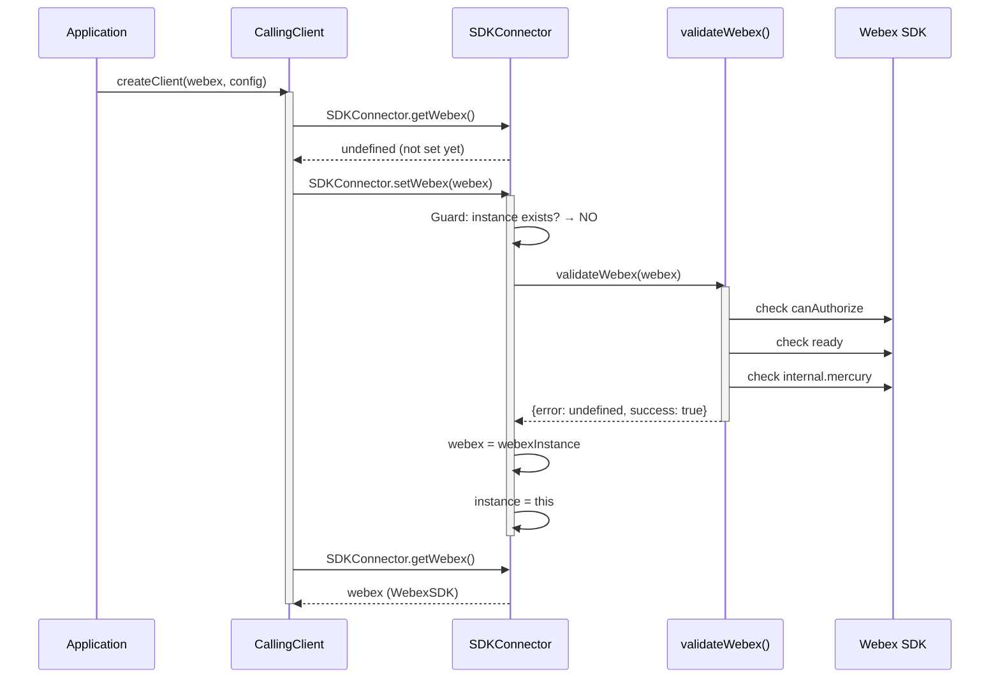
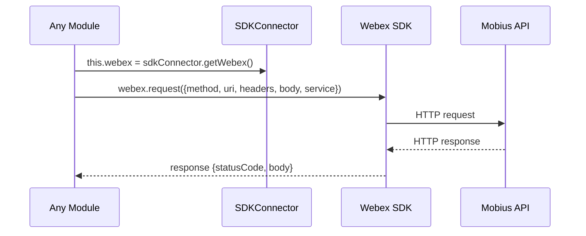
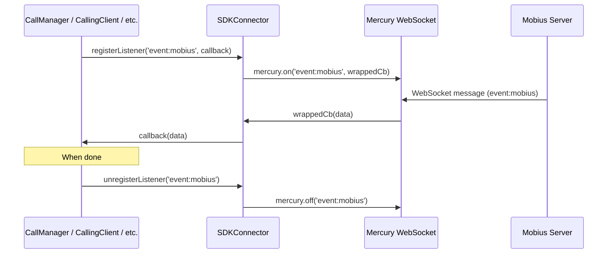

# SDKConnector Module — Architecture

## Component Overview

SDKConnector is the lowest infrastructure layer in the calling package. It has no business logic — its sole purpose is to provide a validated, singleton gateway to the Webex SDK for all other modules.

### Design Principles

| Principle | Implementation |
|-----------|---------------|
| **Singleton** | Module-level `let instance`, frozen export, set-once guard |
| **Validation** | Three-step check before accepting a Webex SDK instance |
| **Encapsulation** | Modules access Webex SDK only through `SDKConnector`, never directly |
| **Immutability** | `Object.freeze()` on the exported instance |
| **Typed contract** | `WebexSDK` interface defines the expected SDK shape |

---

## Internal Architecture

```
┌─────────────────────────────────────────────────────────────┐
│  Module: SDKConnector/index.ts                              │
│                                                             │
│  ┌──────────────────────┐   ┌────────────────────────────┐  │
│  │ let instance (module)│   │ let webex (module)          │  │
│  │ ISDKConnector | null │   │ WebexSDK | undefined        │  │
│  └──────────┬───────────┘   └────────────┬───────────────┘  │
│             │                            │                  │
│  ┌──────────▼────────────────────────────▼───────────────┐  │
│  │              class SDKConnector                        │  │
│  │                                                       │  │
│  │  setWebex(webexInstance)                               │  │
│  │    ├── Guard: instance already set? → throw            │  │
│  │    ├── validateWebex(webexInstance) → {error, success}  │  │
│  │    ├── Store: webex = webexInstance                     │  │
│  │    └── Store: instance = this                          │  │
│  │                                                       │  │
│  │  get() → instance                                      │  │
│  │  getWebex() → webex                                    │  │
│  │  request(payload) → webex.request(payload)             │  │
│  │  registerListener(event, cb) → mercury.on(event, cb)    │  │
│  │  unregisterListener(event) → mercury.off(event)         │  │
│  └───────────────────────────────────────────────────────┘  │
│                                                             │
│  export default Object.freeze(new SDKConnector())           │
└─────────────────────────────────────────────────────────────┘
```

---

## Data Flow

### Initialization Sequence



### Request Flow



### Mercury Listener Flow



---

## Lifecycle

### State Machine

```
                    setWebex(webex)
  UNINITIALIZED ─────────────────────► INITIALIZED
  (instance = null)                    (instance = this, webex = webexInstance)
       │                                      │
       │ getWebex() → undefined               │ getWebex() → WebexSDK
       │ setWebex() → validates & stores      │ setWebex() → throws Error
       │                                      │ registerListener() → works
                                              │ unregisterListener() → works
                                              │ request() → works
```

The singleton has exactly two states:
1. **Uninitialized** — before `setWebex()` is called. `getWebex()` returns `undefined`.
2. **Initialized** — after `setWebex()` succeeds. All methods work. `setWebex()` cannot be called again.

There is no `reset()` or `destroy()` — the singleton lives for the lifetime of the application.

---

## Validation Detail

`validateWebex()` in `utils.ts` performs a sequential guard-clause check:

```
validateWebex(webexInstance)
  │
  ├── webexInstance.canAuthorize === true?
  │   └── NO → {error: 'webex.canAuthorize is not true', success: false}
  │
  ├── webexInstance.ready === true?
  │   └── NO → {error: 'webex.ready is not true', success: false}
  │
  ├── webexInstance.internal.mercury exists?
  │   └── NO → {error: 'webex.internal.mercury is not available', success: false}
  │
  └── All passed → {error: undefined, success: true}
```

These checks ensure the Webex SDK is in a usable state before any calling module attempts to make requests or register listeners.

---

## WebexSDK Interface Map

The `WebexSDK` interface in `types.ts` defines the full contract. Here's the dependency map showing which parts of the SDK are used by which calling modules:

```
WebexSDK
├── .request()                    ← Call, Registration, CallingClient, CallHistory,
│                                   CallSettings, Contacts, Voicemail
├── .canAuthorize / .ready        ← validateWebex() (initialization only)
├── .credentials.getUserToken()   ← Registration (keepalive web worker token refresh)
├── .config.fedramp               ← CallingClient (Mobius URL selection)
│
├── .internal
│   ├── .mercury
│   │   ├── .on(event, cb)        ← registerListener() → CallManager, CallingClient,
│   │   │                           CallHistory, Voicemail
│   │   ├── .off(event)           ← unregisterListener() → Voicemail
│   │   ├── .connected            ← CallingClient (network resilience checks)
│   │   └── .connecting           ← CallingClient (network resilience checks)
│   │
│   ├── .device
│   │   ├── .url                  ← CallingClient (cisco-device-url header)
│   │   ├── .userId               ← CallingClient, Line (user identification)
│   │   └── .orgId                ← Metrics
│   │
│   ├── .services
│   │   ├── ._serviceUrls.mobius  ← CallingClient (Mobius URL)
│   │   ├── .getMobiusClusters()  ← CallingClient (cluster discovery)
│   │   └── .fetchClientRegionInfo() ← CallingClient (region discovery)
│   │
│   ├── .metrics
│   │   └── .submitClientMetrics()← MetricManager (telemetry)
│   │
│   ├── .encryption               ← Voicemail (content encryption/decryption)
│   │
│   └── .support
│       └── .submitLogs()         ← Utils.uploadLogs()
│
├── .logger                       ← CallingClient (logger adapter for media engine)
├── .people.list()                ← CallerId (caller identity resolution)
└── .boundedStorage               ← Registration (failover cache persistence)
```

---

## Security Considerations

- **Set-once guard:** Prevents any module from replacing the Webex SDK instance after initialization, which protects against accidental re-initialization or injection
- **Frozen export:** `Object.freeze()` prevents property modification on the singleton
- **Validation:** Ensures the SDK is authorized and ready before any network operations
- **No credential storage:** SDKConnector does not store tokens — it delegates to `webex.credentials.getUserToken()` at the point of use

---

## Testing Notes

The current test files (`index.test.ts`, `utils.test.ts`) are placeholders with `TODO` markers. When writing tests:

- **Use `getTestUtilsWebex()`** from `common/testUtil.ts` for the mock Webex instance
- **Reset module state** between tests — since SDKConnector is a singleton with set-once semantics, tests may need to use `jest.resetModules()` or test isolation
- **Test validation:** Verify all three `validateWebex()` failure paths
- **Test set-once guard:** Verify the second `setWebex()` call throws

---

## File Structure

```
SDKConnector/
├── index.ts          # SDKConnector class, frozen singleton export
├── types.ts          # ISDKConnector, WebexSDK, ServiceHost, ClientRegionInfo, Logger
├── utils.ts          # validateWebex() validation logic
├── index.test.ts     # Unit tests (placeholder)
├── utils.test.ts     # Validation tests (placeholder)
└── ai-docs/
    ├── AGENTS.md     # Overview, API, usage patterns, consumers
    └── ARCHITECTURE.md  # This file
```

---

## Related Documentation

- [SDKConnector AGENTS.md](./AGENTS.md) — Public API, usage patterns, consumer list
- [Architecture Patterns](../../../ai-docs/patterns/architecture-patterns.md) — Singleton pattern reference
- [Event Patterns](../../../ai-docs/patterns/event-patterns.md) — Mercury listener registration
- [CallingClient ARCHITECTURE.md](../../CallingClient/ai-docs/ARCHITECTURE.md) — Primary consumer architecture

---

_Last Updated: 2026-03-15_
