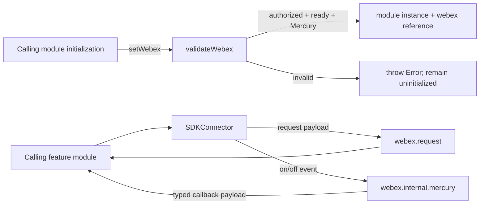
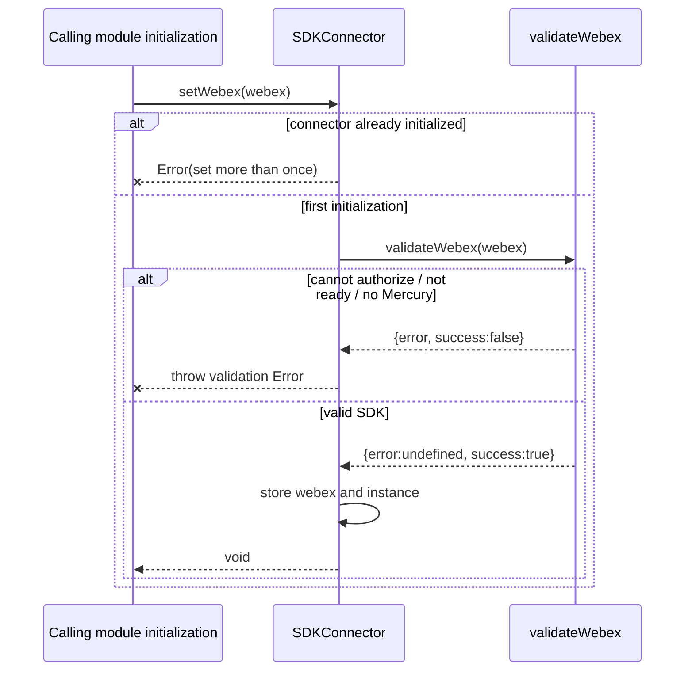
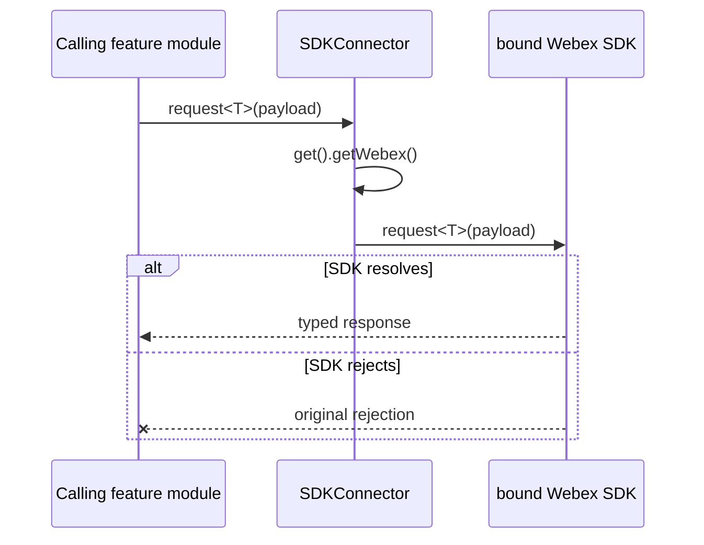
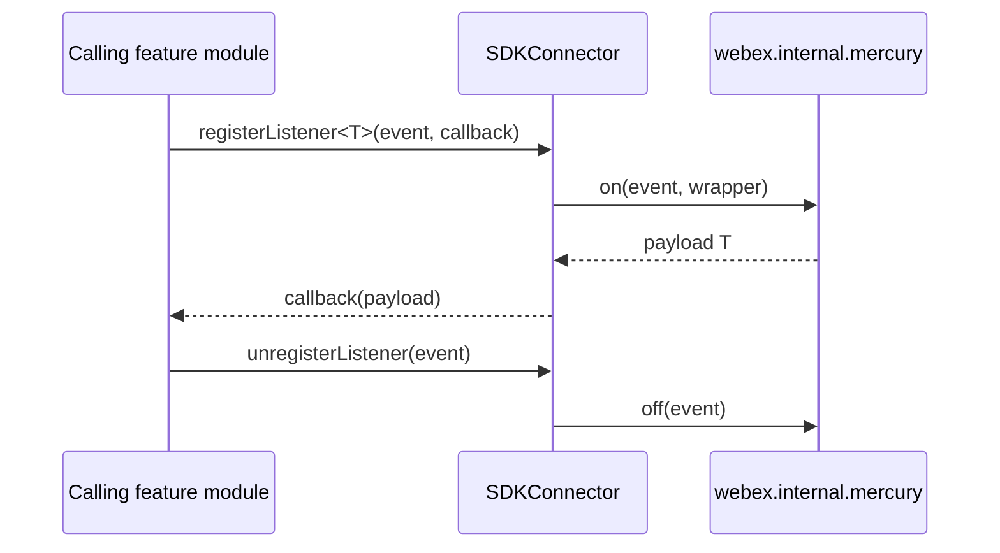
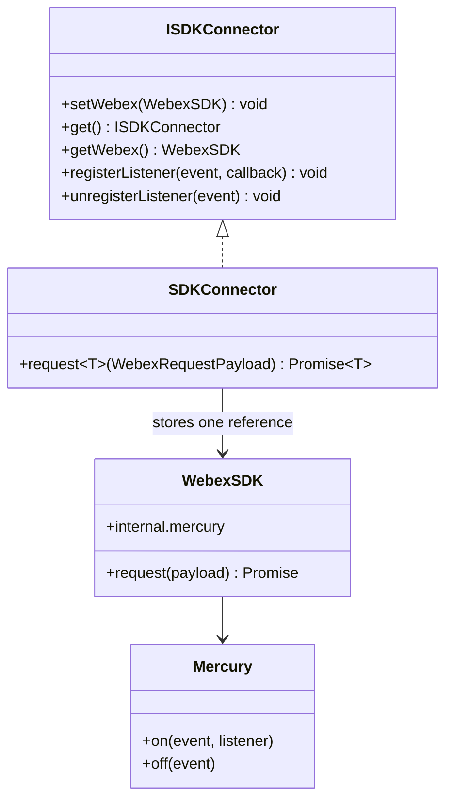

# SDKConnector — SPEC

> Start here → root [`AGENTS.md`](../../../AGENTS.md) · router [`SPEC_INDEX.md`](../../../ai-docs/SPEC_INDEX.md) · system [`ARCHITECTURE.md`](../../../ai-docs/ARCHITECTURE.md). This is the canonical module specification.

## Metadata

| Field | Value |
|---|---|
| Module id | `sdk-connector` |
| Source path(s) | `src/SDKConnector/` |
| Doc kind | Module spec |
| Coverage score | 95% assessed 2026-07-06; 20/21 mandatory fields PRESENT after full code-grounded backfill; characterization coverage remains weak because both current test files are placeholders |
| Generated from | `module-spec` @ SDLC template library `0.2.1` |
| generated_by / approved_by / updated_at | Codex / repository user / 2026-07-06 |
| Validation status | pass on 2026-07-06 by `claude-code`; gate OPEN; Pass-with-warnings accepted as successful and advisory warnings waived |

## Evidence Rules

Requirements cite stable implementation and test file paths. Legacy docs are migration sources, not primary behavioral evidence. Commit rationale may be used because the package history was explicitly confirmed trustworthy. No line-number anchors or local run-report paths are canonical evidence.

## Source Material Register

| Source material | Scope | Decision | Detail location or disposition |
|---|---|---|---|
| `src/SDKConnector/` | source and tests | used and code-verified | Code-derived specification; no substantive legacy module spec existed |

## Overview

SDKConnector is the capability boundary rooted at `src/SDKConnector/`. Maintainers start with `src/SDKConnector/index.ts` and use the canonical requirements and flows below before changing its public or internal behavior.

## Purpose / Responsibility

SDKConnector owns the behavior rooted at `src/SDKConnector/` and exposes it through the typed `@webex/calling` package boundary; shared infrastructure remains owned by `Errors`, `Events`, `Logger`, and `common`.

## Stack

TypeScript 4.9 source targeting the `@webex/calling` package, Jest unit tests, Playwright package journeys, Webex SDK workspace dependencies, and module-specific remote transports documented below.

## Folder / Package Structure

```text
src/SDKConnector/
├── index.ts
├── types.ts
├── utils.ts
├── index.test.ts
├── utils.test.ts
```

## Key Files (source of truth)

| File | Holds |
|---|---|
| `src/SDKConnector/index.ts` | Implementation, types, constants, or adapter behavior |
| `src/SDKConnector/types.ts` | Implementation, types, constants, or adapter behavior |
| `src/SDKConnector/utils.ts` | Implementation, types, constants, or adapter behavior |
| `src/SDKConnector/index.test.ts` | Test/characterization evidence |
| `src/SDKConnector/utils.test.ts` | Test/characterization evidence |


## Public Surface

| Contract ID | Type | Surface | Purpose | Compatibility / deprecation | Schema / detail link | Root index |
|---|---|---|---|---|---|---|
| internal.sdk-connector | Internal SDK boundary | `setWebex(webexInstance: WebexSDK): void` | Validate and bind the single Webex SDK instance used by package modules | Internal; changing initialization affects all calling modules | `src/SDKConnector/index.ts`; `src/SDKConnector/types.ts` | [`CONTRACTS.md`](../../../ai-docs/CONTRACTS.md#internal-package-surfaces) |
| internal.sdk-connector.get | Internal SDK boundary | `get(): ISDKConnector`; `getWebex(): WebexSDK` | Return the initialized connector or bound SDK reference | Internal | `src/SDKConnector/index.ts` | [`CONTRACTS.md`](../../../ai-docs/CONTRACTS.md#internal-package-surfaces) |
| internal.sdk-connector.request | Internal SDK boundary | `request<T>(request: WebexRequestPayload): Promise<T>` | Forward package HTTP requests through the bound Webex SDK | Internal | `src/SDKConnector/index.ts`; `src/common/types.ts` | [`CONTRACTS.md`](../../../ai-docs/CONTRACTS.md#internal-package-surfaces) |
| internal.sdk-connector.events | Internal SDK boundary | `registerListener<T>(event, cb): void`; `unregisterListener(event): void` | Bridge package callbacks to Mercury `on`/`off` | Internal | `src/SDKConnector/index.ts`; `src/SDKConnector/types.ts` | [`CONTRACTS.md`](../../../ai-docs/CONTRACTS.md#internal-package-surfaces) |

`SDKConnector` itself is not exported from `src/index.ts`; only the `WDMDevice` type from `src/SDKConnector/types.ts` is a package-consumer export.

## Requires (dependencies)

- One Webex SDK instance with `canAuthorize === true`, `ready === true`, and `internal.mercury`.
- The SDK's `request`, Mercury `on`, and Mercury `off` contracts.
- `WebexRequestPayload` from `src/common/types.ts`.

The connector owns no remote service contract; it forwards calls to the already initialized SDK.

## Requirements

| ID | WHAT | WHY | Source Evidence | Test / Example Evidence | Assumptions / Gaps | Confidence |
|---|---|---|---|---|---|---|
| SDKCONNECTOR-R-001 | `setWebex` accepts exactly one authorized, ready Webex SDK whose Mercury plugin exists; a second call throws. | One process-wide binding prevents requests and listeners from mixing SDK instances after shared package modules initialize. | `src/SDKConnector/index.ts`; `src/SDKConnector/utils.ts`; `commit:c6caa400e072ba726fb537d31c7e0d3b9fc6ec30` | `src/SDKConnector/index.test.ts`; `src/SDKConnector/utils.test.ts` | Existing tests are placeholders and do not assert the invariant. | WEAK |
| SDKCONNECTOR-R-002 | `validateWebex` rejects when `canAuthorize` is false, `ready` is false, or `internal.mercury` is unavailable. | Failing before binding avoids later request/listener failures from a partially initialized SDK. | `src/SDKConnector/utils.ts` | `src/SDKConnector/utils.test.ts` | Negative tests are missing. | WEAK |
| SDKCONNECTOR-R-003 | `get` returns the initialized connector and `getWebex` returns the bound SDK reference. | Package modules need one shared access path so SDK ownership and validation are not duplicated. | `src/SDKConnector/index.ts` | `src/SDKConnector/index.test.ts` | Before initialization the module variables are undefined despite non-optional return types. | WEAK |
| SDKCONNECTOR-R-004 | `request<T>` delegates the payload to `webex.request` and returns its promise unchanged. | Preserving the SDK request promise keeps auth, service routing, response typing, and rejection behavior in the Webex SDK boundary. | `src/SDKConnector/index.ts`; `src/common/types.ts` | `src/SDKConnector/index.test.ts` | No forwarding/rejection tests exist. | WEAK |
| SDKCONNECTOR-R-005 | `registerListener<T>` subscribes to Mercury and forwards each payload to the supplied callback. | Central listener registration lets feature modules consume Mercury without owning the SDK instance directly. | `src/SDKConnector/index.ts`; `src/SDKConnector/types.ts` | `src/SDKConnector/index.test.ts` | Delivery tests are missing. | WEAK |
| SDKCONNECTOR-R-006 | `unregisterListener(event)` delegates to `mercury.off(event)`. | Feature cleanup must remove the remote-event subscription through the same shared SDK boundary to prevent stale callbacks. | `src/SDKConnector/index.ts`; `src/SDKConnector/types.ts` | `src/SDKConnector/index.test.ts` | The WebexSDK type models `off` with an event only; tests do not pin listener granularity. | WEAK |

## Design Overview

`SDKConnector` is a frozen object exported only inside the package. Module-level `instance` and `webex` variables become populated by the first successful `setWebex`. Validation occurs before assignment; requests and Mercury listener operations then dereference that bound instance. The boundary centralizes SDK ownership but does not add retry, caching, response translation, or event buffering. Evidence: `src/SDKConnector/index.ts`, `src/SDKConnector/utils.ts`.

## Data Flow



The connector forwards data unchanged; auth and service routing remain Webex SDK responsibilities. Evidence: `src/SDKConnector/index.ts`.

## Sequence Diagram(s)

Sequence coverage:

| Operation group | Diagram / coverage | Failure / recovery coverage |
|---|---|---|
| Validate and bind SDK | Initialization diagram | validation and duplicate-binding failures throw before state changes |
| Forward request | Request diagram | SDK rejection propagates unchanged; uninitialized access fails |
| Register/unregister Mercury callback | Listener diagram | requires initialized Mercury; cleanup delegates to `off(event)` |

### 1. Validate and bind once



### 2. Forward an SDK request



### 3. Bridge Mercury listeners



There is no connector-owned retry or recovery. Callers must initialize once before these operations and handle the SDK's request failures. Evidence: `src/SDKConnector/index.ts`, `src/SDKConnector/utils.ts`.

## Class / Component Relationships



`request<T>` exists on the concrete internal connector but is currently absent from `ISDKConnector`; consumers call the frozen default instance inside the package. Evidence: `src/SDKConnector/index.ts`, `src/SDKConnector/types.ts`.

## Use Cases

- **Initialize the package bridge:** CallingClient or another package owner calls `setWebex` once with an authorized, ready SDK before feature modules use the connector.
- **Forward a service request:** A feature module supplies a `WebexRequestPayload`; the connector returns the underlying `webex.request` promise unchanged.
- **Consume Mercury events:** A feature module registers a typed callback and later unregisters the event during cleanup.
- **Reject invalid lifecycle use:** invalid SDK state or a second initialization throws immediately; the connector does not silently replace the shared SDK reference.

Evidence: `src/SDKConnector/index.ts`, `src/SDKConnector/utils.ts`.

## State Model

The module has two process-wide variables: `instance` and `webex`. Both are unset at module load, both are populated only after successful validation, and there is no reset API. The exported connector object is frozen, but the bound Webex SDK reference is not frozen. `get`, `getWebex`, request forwarding, and listener operations all rely on this initialized state. Evidence: `src/SDKConnector/index.ts`.

## Business Rules & Invariants

- `setWebex` succeeds at most once for the loaded module; a second call always throws.
- Assignment occurs only after `canAuthorize`, `ready`, and Mercury validation passes.
- Failed validation leaves `instance` and `webex` unset.
- Requests and Mercury operations are pass-throughs; the connector must not rewrite payloads, responses, event names, or callback data.
- The bound SDK carries credentials and identity-bearing service data. Never log the SDK object, request authorization metadata, tokens, or raw Mercury payloads at this boundary.
- `SDKConnector` is internal and must not be described as exported from `src/index.ts`. Evidence: `src/SDKConnector/index.ts`, `src/SDKConnector/utils.ts`, `src/index.ts`.
- Configuration/rollout is N/A: the connector has no feature flag or environment configuration; the only lifecycle input is the first validated Webex SDK instance.
- Connector-owned observability is N/A: it emits no logs or metrics and forwards failures unchanged, so each owning feature module supplies contextual logging/metrics without exposing credentials at this boundary. Evidence: `src/SDKConnector/index.ts`.

## Concurrency & Reactive Flow

Initialization is synchronous and has no lock: callers must coordinate the single `setWebex` call before concurrent feature work begins. After initialization, request promises may resolve concurrently and Mercury may invoke callbacks asynchronously. The connector holds no queue, retry state, or callback registry beyond Mercury's own listener storage; unregister delegates directly to `off(event)`. Evidence: `src/SDKConnector/index.ts`.

## Error Handling & Failure Modes

| Condition | Signal | State after failure | Caller recovery |
|---|---|---|---|
| `setWebex` called after initialization | throws `Error('You cannot set the SDKConnector instance more than once')` | original instance/reference retained | reuse the existing connector; do not rebind |
| `canAuthorize` is false | throws `Error('webex.canAuthorize is not true')` | uninitialized | authorize/configure the SDK before retrying once |
| `ready` is false | throws `Error('webex.ready is not true')` | uninitialized | await SDK readiness before retrying once |
| Mercury missing | throws `Error('webex.internal.mercury is not available')` | uninitialized | initialize the Mercury plugin |
| unexpected validation result | throws setup `Error` | uninitialized | treat as initialization failure |
| SDK request rejects | original rejection propagates | connector remains initialized | apply the owning module's error/retry policy |
| request/listener operation before initialization | dereference failure/undefined state | uninitialized | call `setWebex` through the package initialization path first |

The module currently uses native `Error`, not the package's typed error hierarchy. Evidence: `src/SDKConnector/index.ts`, `src/SDKConnector/utils.ts`.

## Pitfalls

- `Object.freeze` freezes the connector object, not the referenced Webex SDK.
- `get()` and `getWebex()` have non-optional TypeScript return types even though module state is unset before `setWebex`.
- `request<T>` is implemented on the concrete connector but omitted from `ISDKConnector`.
- `unregisterListener(event)` delegates to `mercury.off(event)` without a callback; listener granularity follows the SDK implementation.
- Both existing SDKConnector test files contain only trivial placeholder assertions, so every behavioral requirement needs characterization tests before promotion to Specced.

Evidence: `src/SDKConnector/index.ts`, `src/SDKConnector/types.ts`, `src/SDKConnector/index.test.ts`, `src/SDKConnector/utils.test.ts`.

## Key Design Trade-off

A frozen process-wide connector centralizes SDK validation, requests, and Mercury access so feature modules do not each own a Webex SDK reference. The trade-off is global one-shot initialization: there is no rebinding/reset path and lifecycle misuse fails at runtime. Evidence: `src/SDKConnector/index.ts`; the design entered the package with `commit:c6caa400e072ba726fb537d31c7e0d3b9fc6ec30`.

## Test-Case Strategy (module)

The current files `src/SDKConnector/index.test.ts` and `src/SDKConnector/utils.test.ts` assert only `true === true`; they are placeholders, not characterization coverage.

Required characterization cases before coverage promotion:

| Requirement | Positive case | Negative/error case | Current evidence |
|---|---|---|---|
| SDKCONNECTOR-R-001 | first valid `setWebex` binds connector/SDK | second call throws and retains original | missing |
| SDKCONNECTOR-R-002 | authorized + ready + Mercury validates | each failed guard returns its exact error | missing |
| SDKCONNECTOR-R-003 | `get`/`getWebex` return bound references | pre-init behavior is characterized | missing |
| SDKCONNECTOR-R-004 | request payload/result forwarded unchanged | SDK rejection propagates unchanged | missing |
| SDKCONNECTOR-R-005 | Mercury payload reaches typed callback | no callback before event delivery | missing |
| SDKCONNECTOR-R-006 | unregister delegates the exact event | listener behavior after unregister is characterized | missing |

Do not claim positive, negative, retry, or cleanup coverage until those tests exist. This documentation-only backfill does not add source tests.

## Traceability

- Repo architecture: [`ARCHITECTURE.md`](../../../ai-docs/ARCHITECTURE.md) · Registry: [`SPEC_INDEX.md`](../../../ai-docs/SPEC_INDEX.md)
- Contracts catalog: [`CONTRACTS.md`](../../../ai-docs/CONTRACTS.md) · Manifest: `../../../.sdd/manifest.json`
