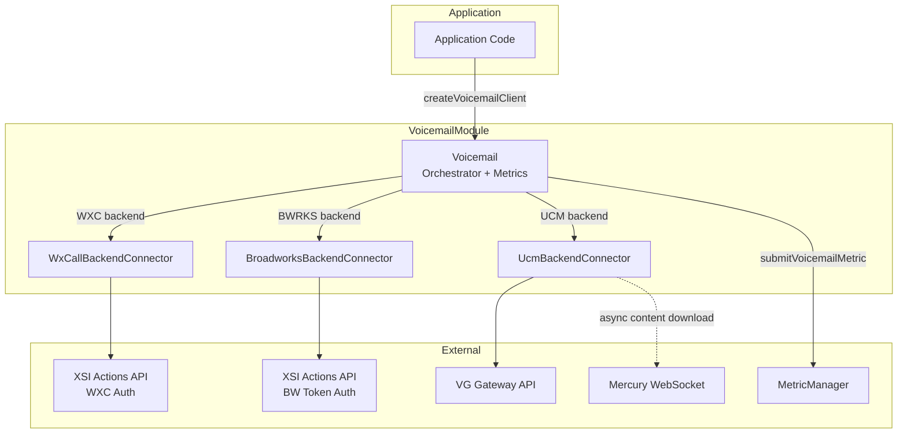
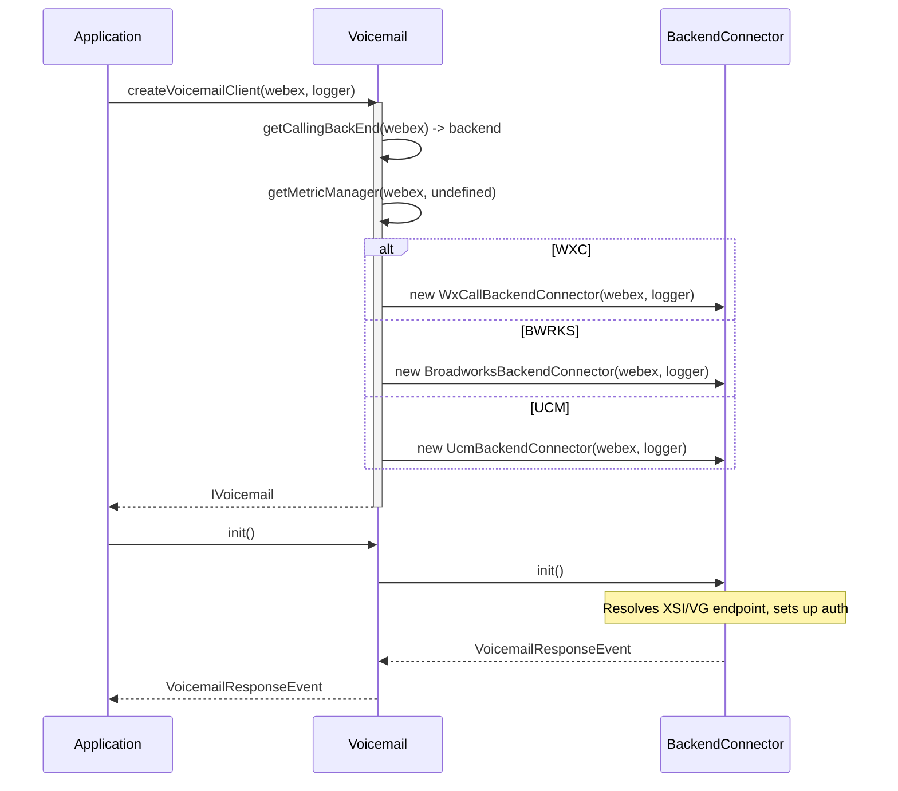
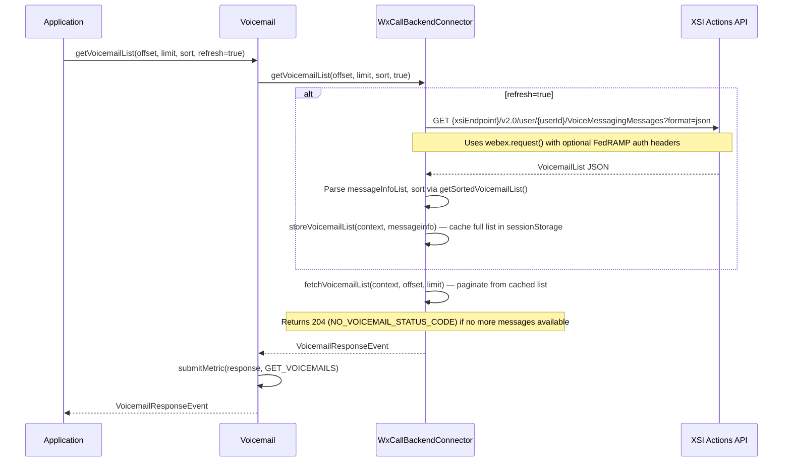
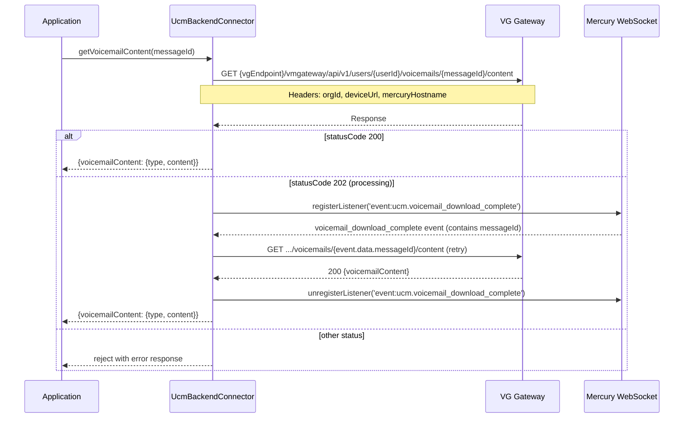
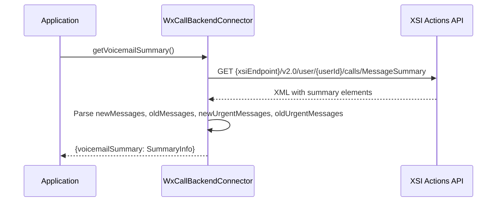

# Voicemail Module — Architecture

## Component Overview

The Voicemail module uses a **strategy pattern** with three backend connectors. Architecture: **Application -> Voicemail (orchestration layer) -> BackendConnector (WXC/BWRKS/UCM) -> Backend API**. The orchestration layer also integrates with MetricManager for telemetry.

### Component Table

| Layer | Component | File | Key Responsibilities |
|-------|-----------|------|---------------------|
| **Orchestrator** | `Voicemail` | `Voicemail.ts` | Backend detection, connector initialization, API delegation, metric submission |
| **WXC Connector** | `WxCallBackendConnector` | `WxCallBackendConnector.ts` | XSI-based voicemail operations, summary, transcript, contact resolution |
| **BWRKS Connector** | `BroadworksBackendConnector` | `BroadworksBackendConnector.ts` | BW token auth, XSI-based voicemail operations |
| **UCM Connector** | `UcmBackendConnector` | `UcmBackendConnector.ts` | VG Gateway voicemail operations, Mercury event for async content |

### Singletons and Factories

| Component | Access Pattern | Lifecycle |
|-----------|---------------|-----------|
| `Voicemail` | `createVoicemailClient(webex, logger)` factory | One per application |
| `SDKConnector` | Frozen singleton | Global |
| `MetricManager` | `getMetricManager(webex, undefined)` singleton | Module-level |

### File Structure

```
Voicemail/
├── Voicemail.ts                        # Main entrypoint class with public APIs
├── Voicemail.test.ts                   # Unit tests for the main module
├── WxCallBackendConnector.ts           # WXC backend
├── WxCallBackendConnector.test.ts      # WXC tests
├── BroadworksBackendConnector.ts       # Broadworks backend
├── BroadworksBackendConnector.test.ts  # Broadworks tests
├── UcmBackendConnector.ts              # UCM backend
├── UcmBackendConnector.test.ts         # UCM tests
├── types.ts                            # IVoicemail, response types, backend interfaces
├── constants.ts                        # Endpoints, method names
├── voicemailFixture.ts                 # Test fixtures
└── ai-docs/
    ├── AGENTS.md                       # Module agent doc
    └── ARCHITECTURE.md                 # This file
```

---

## Data Flows

### Backend Selection and Delegation



---

## Sequence Diagrams

### 1. Initialization



### 2. Get Voicemail List (WXC)



Note: WXC pagination is **client-side** — the entire voicemail list is fetched from XSI on `refresh=true` and cached locally. Subsequent calls with `refresh=false` paginate from the cache.

### 3. Get Voicemail Content (UCM — Async)



### 4. Voicemail Summary (WXC Only)



---

## Key Constants

### API Endpoints (from `Voicemail/constants.ts`)

| Constant | Value | Description |
|----------|-------|-------------|
| `VOICE_MESSAGING_MESSAGES` | `'VoiceMessagingMessages'` | XSI voicemail messages path |
| `JSON_FORMAT` | `'?format=json'` | JSON format query param for XSI |
| `MARK_AS_READ` | `'MarkAsRead'` | XSI mark as read endpoint |
| `MARK_AS_UNREAD` | `'MarkAsUnread'` | XSI mark as unread endpoint |
| `MESSAGE_MEDIA_CONTENT` | `'messageMediaContent'` | XML tag for voicemail content |
| `MESSAGE_SUMMARY` | `'MessageSummary'` | XSI message summary path |
| `CALLS` | `'calls'` | XSI calls path segment (for summary URL) |
| `BW_TOKEN_FETCH_ENDPOINT` | `'/idp/bwtoken/fetch'` | Broadworks token endpoint |
| `VMGATEWAY` | `'vmgateway'` | UCM VG Gateway path segment |
| `API_V1` | `'api/v1'` | UCM VG API version |
| `VOICEMAILS` | `'voicemails'` | UCM voicemails path segment |
| `OFFSET` | `'?offset'` | UCM offset query param (includes `?`) |
| `LIMIT` | `'&limit'` | UCM limit query param (includes `&`) |
| `SORT_ORDER` | `'&sortOrder'` | UCM sort order query param (includes `&`) |

### Constants from `common/constants.ts`

| Constant | Value | Description |
|----------|-------|-------------|
| `BW_XSI_ENDPOINT_VERSION` | `'v2.0'` | XSI API version used in URLs |
| `USER` | `'user'` | XSI user path segment (singular) |
| `USERS` | `'users'` | UCM VG users path segment (plural, lowercase) |
| `CONTENT` | `'content'` | UCM voicemail content path segment |
| `TRANSCRIPT` | `'transcript'` | WXC transcript path segment |
| `RAW_REQUEST` | `'rawRequest'` | Key to access raw XML response from `webex.request()` |

### Pagination Defaults

| Constant | Value | Description |
|----------|-------|-------------|
| `OFFSET_INDEX` | `0` | Default pagination offset |
| `OFFSET_LIMIT` | `100` | Default pagination limit |
| `NO_VOICEMAIL_STATUS_CODE` | `204` | Status when no more voicemails |

### HTTP Client Pattern

WXC and UCM use `this.webex.request()`. Broadworks voicemail operations use browser `fetch` with BW token headers, while Broadworks token/bootstrap flows use `this.webex.request()`.

| Backend | Auth Handling | Custom Headers |
|---------|---------------|----------------|
| WXC | FedRAMP: manual `Authorization` header; otherwise: none | Optional auth headers spread into request |
| Broadworks | XSI Access Token (`Bearer {bwtoken}`) sent in each request | Token-based auth |
| UCM | None (implicit SDK auth) | `orgId`, `deviceUrl`, `mercuryHostname` on content requests |

### URL Patterns

**WXC Voicemail List:**
```
{xsiEndpoint}/v2.0/user/{userId}/VoiceMessagingMessages?format=json
```

**WXC Voicemail Operations (content, mark read, delete, transcript):**
```
{xsiEndpoint}{messageId}[/MarkAsRead|MarkAsUnread|transcript]
```
Note: `messageId` from the voicemail list is a **full path** starting with `/` (e.g., `/v2.0/user/{id}/VoiceMessagingMessages/{msgId}`). It is concatenated directly to `xsiEndpoint` without an additional slash.

**WXC Voicemail Summary:**
```
{xsiEndpoint}/v2.0/user/{userId}/calls/MessageSummary
```

**UCM Voicemail List:**
```
{vgEndpoint}/vmgateway/api/v1/users/{userId}/voicemails/?offset={offset}&limit={limit}&sortOrder={sort}
```

**UCM Voicemail Operations:**
```
{vgEndpoint}/vmgateway/api/v1/users/{userId}/voicemails/{messageId}[/content]
```

---

## Troubleshooting Guide

### 1. Init Fails

**Symptoms:** `init()` throws or returns error

**Possible Causes:**
- XSI endpoint not resolvable (WXC/BWRKS)
- Broadworks token fetch failed (BWRKS)
- VG endpoint not resolvable (UCM)

### 2. Voicemail List Empty

**Symptoms:** `getVoicemailList` returns empty list

**Possible Causes:**
- `refresh` parameter not set to `true` on first call (WXC/BWRKS cache is empty until first refresh)
- No voicemails exist for the user
- XSI/VG service unavailable
- Response `messageInfoList` is an empty object (`Object.keys().length === 0`)

**WXC/BWRKS behavior:** Returns `statusCode: 204` with `message: 'No additional voicemails'` whenever there are no further pages (`moreVMAvailable=false`), including cases where the current page still contains messages.

### 3. UCM Content Returns 202

**Symptoms:** `getVoicemailContent` takes long to resolve on UCM

**Explanation:** UCM may return 202 (processing) when content needs to be downloaded from the voicemail server. The connector registers a Mercury listener for `event:ucm.voicemail_download_complete` and retries automatically.

### 4. Summary/Transcript Returns null

**Symptoms:** `getVoicemailSummary` or `getVMTranscript` returns null

**Explanation:** These features are only supported on WXC. Broadworks and UCM connectors return `null`.

### 5. Contact Resolution Returns null

**Symptoms:** `resolveContact` returns null

**Explanation:** Only the WXC connector implements contact resolution. BWRKS and UCM return `null`.

---

## Related Documentation

- [AGENTS.md](./AGENTS.md) — Overview, examples, public API
